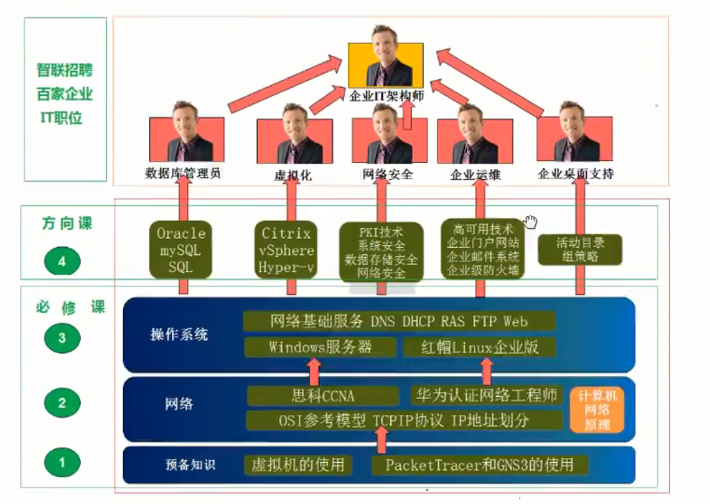
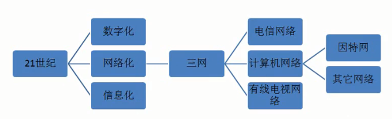
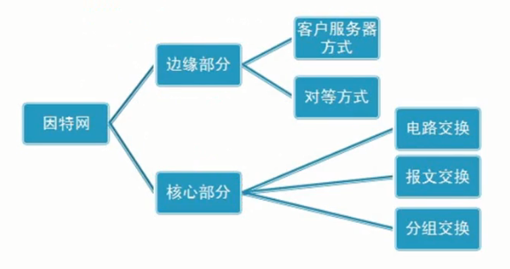
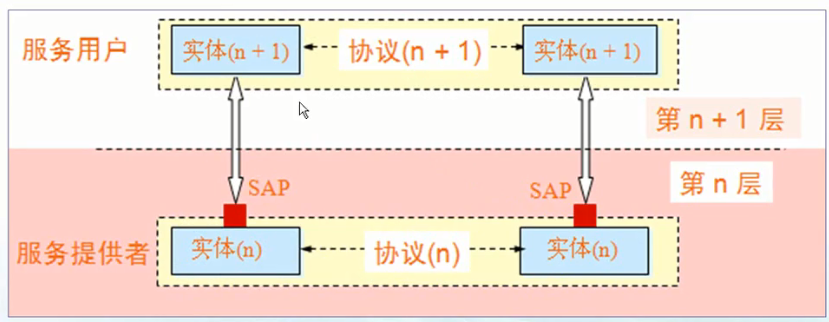
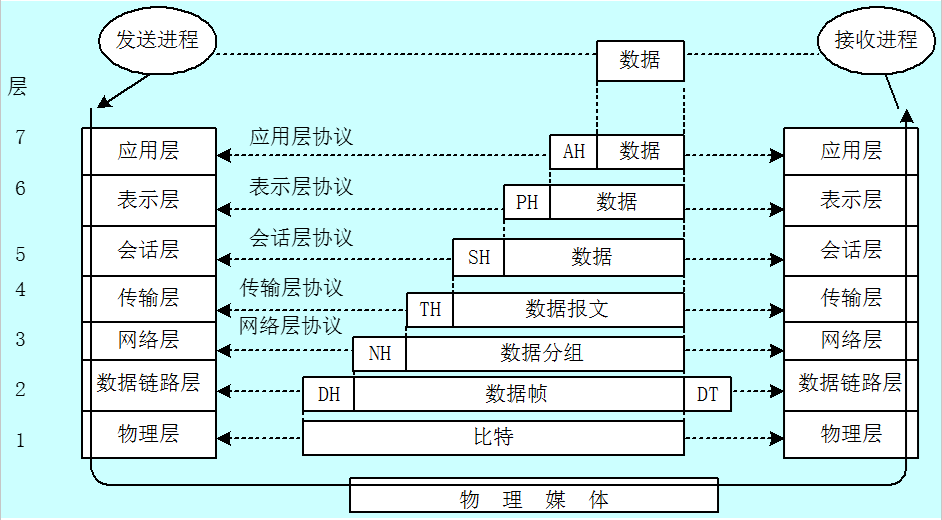
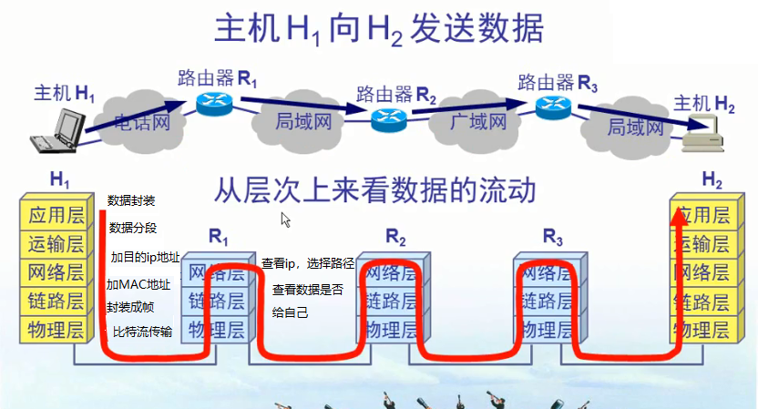
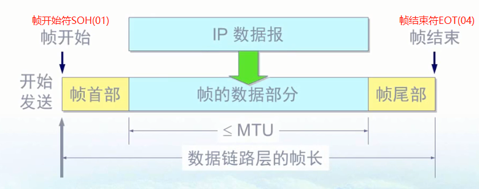
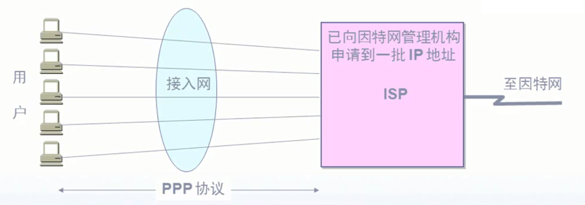

# 1 概述

<b>图1.1 IT理论体系</b>

图1.2 网络结构

重要功能：连通性、共享(信息、软硬件共享)

## 1.2 因特网概述

网络：许多计算机连接在一起

互联网：许多网络连接在一起

因特网：全球最大的互联网

ISP：Internet Service Provider（因特网服务提供商）

ping www.baidu.com

多层次ISP结构的互联网，服务器放在什么位置，主要看你想服务的范围，否则离服务对象的节点越远，越慢

## 1.3 因特网组成

边缘部分--主机之间的通信方式

1. 客户服务器：Client/Server方式--C/S，每个客户机都从服务器上下载内容，人越多越卡。

2. 对等方式：Peer-to-Peer--P2P，网上可能听说p2p下载，客户机A从服务器S下载内容，同时客户机B即可从服务器S下载，也可以从客户机A下载同样的内容，每一个网络内的计算机既是客户机也是服务器，可以有很多源，下载内容的客户机越多，反而越快。

核心部分--数据交换方式：

1. 电路交换（Circuit Switching)：比如电话机，需要交流的时候，做电路连通，不交流时断开，存在占线的情况。适合数据量大的实时性传输
2. 分组交换（Packet S~）：一个文件20M，分多组（每组不一定走同样的路径，占线后可换路传输）发送，每组添加相应的冗余首部（包含地址等信息），发送到目标端，去除冗余整合后即可。优点：高效，灵活，迅速，缺点：时延、开销
3. 报文交换（Message Switching）：报文一般比分组长的多，报文交换的时延较长。

图1-4 三种交换方式比较

## 1.4 计算机网络类别

作用范围：广、城、局、个人域网（不单单从地理上。新的理解：应用了广域网技术就叫广域网、应用了局域网技术就叫局域网）

拓扑结构：总线、环形、星型、树形、网状

工作方式：资源子网、通信子网、接入网

使用者：公用网、专用网

交换方式：电路、报文、分组交换

## 1.5 计算机网络性能

1. 速率（bit/s）

2. 带宽：单个数字信道所能传送的最高数据率

3. 吞吐量：单位时间内通过某个网络的数据量

4. 时延：发送、传播、处理、排队时延。

5. 时延带宽积：链路上最大充满数据量为多少

6. 往返时间

7. 利用率：信道利用率U和网络利用率(多个信道利用率的加权平均），
   $$
   D=\frac{D_0}{1-U}，\text(D_0表示网络空闲时的时延，D表示网络当前的时延，U表示信道利用率)、
   $$

## 1.6 计算机网络的体系结构

基本概念：

1. ISO——国际标准化组织
2. OSI/RM——互联网法律上的国际标准
3. TCP/IP Suite——因特网事实上的国际标准
4. Network Protocols——数据交换遵守的规则、标准或约定
5. 网络体系结构——计算机网络各层及其协议的集合

OSI的七层参考模型：

1. 应用层：能够产生网络流量、能够和用户交互的应用程序
2. 表示层：数据之间加密解密、压缩
3. 会话层：服务和客户端建立会话、查木马、查看会话的命令：netstat -n，netstat /?可以查看该命令的帮助信息
4. 传输层：可靠传输建立会话，不可靠传输、流量控制
5. 网络层：IP地址编址选址，选择最佳路径和发送路径
6. 数据链路层：数据如何封装帧、添加物理层地址、MAC
7. 物理层：电压、接口等标准。

各层间相互无影响，

网络排错：从物理层到应用层依次排查。

网络安全：物理层安全（物理连接），数据链路层安全（ADSL、AP密码），网络层安全（IP限制）、应用层安全（SQL注入漏洞、上传漏洞）

开放系统信息交换的几个概念：

1. 实体（entity）：交换信息的硬件或软件程序
2. 协议（protocol）：控制两个对等实体通信的规则
3. 服务（service）：下层向上层提供服务
4. 服务访问点（SAP)：相邻两层实体间交换信息的地方

跨层实体基于不同的协议，故无法理解信息的内容。

七层协议对应的数据单元

## 1.7 练习

查看会话：命令行netstat -nb

查看本机ip：命令行ipconfig

查看客户机和服务器之间的连接时间：ping www.baidu.com

在网络和共享中心中查看活动网络，点击连接，查看网络状态（查看发送和接收数据量），点击属性--网络--配置--高级可设置网卡属性

# 2 物理层

## 2.1 物理层基本概念

**物理层解决如何在连接各种计算机的传输媒体上传输数据比特流**，而不是指具体的传输媒体介质

物理层的主要任务描述为：确定与传输媒体的接口的一些特性，例如：机械特性（接口形状、大小。引线数目）、电气特性（电压范围）、功能特性（电压+5v代表1）、过程特性（各个相关部件的工作步骤）

本章后面的内容就是通信专业方面的知识。

## 2.2 通信原理

奈氏(奈奎斯特)准则：在任何信道中，码元传输速率是有上限的，传输速率超过此上限，会出现严重的码间串扰，这使得接收端对码元的识别和判决成为不可能。理想低通信道的最高码元传输速率=2\*带宽\*波特率(码元传输速率的单位)

香农公式：信道的极限信息传输速率C是
$$
C=W\log{_2}{(1+\frac{S}{N})}
$$
香农公式的意义在于：只要信息传输速率低于信道的极限信息传输速率，就一定可以找到某种方法来实现无差错的传输

码元传输速率受奈氏准则的限制，信息传输的速率受香农公式的限制。香农公式适用范围大。

带宽大，信道多。

## 2.3 宽带接入技术

ADSL：用数字技术对现有的模拟电话用户线进行连接，低频给语音通话，高频给Internet（下行带宽和上行带宽）

光纤-同轴电缆混合网(Hybrid Fiber Coax)：主干网为光纤，小区到户为有线电视网

FTTX：光纤到户，x-home-building

# 3. 数据链路层

## 3.1 数据链路层的基本概念

数据链路层使用的信道：

1. 点对点信道：一对一的点到点通信
2. 广播信道：一对多的广播通信方式

链路：从一个结点到相邻结点的一段物理线路（有线无线），中间无任何其他的交换结点

数据链路：除了物理线路外，还必须有通信协议来控制这些数据的传输。若把实现这些协议的硬件和软件加到链路上，就构成了数据链路。

数据链路层把网络层交下来的ip数据报构成帧发送到链路上，以及把接收到的帧中的数据取出并上交给网络层。

数据链路上传送的是帧

## 3.2 三个基本问题

1. 封装成帧：完整的帧会手下，不完整的帧会丢掉

2. 透明传输：

   ​	透明：某一实际存在的事物看起来却是好像不存在一样。

   ​	数据链路就应该做到透明，不能妨碍实际数据的传输，如果帧的数据部分出现了真实SOH和EOT需要插入转义字符“ESC”。这样就不妨碍真实数据部分和帧头帧尾符冲突

3. 差错控制：循环冗余检验CRC(不纠错，无差错接收)技术，在数据后面添加的冗余码称为FCS(Frame Check Sequence，帧校验序列)。CRC并非用来获得FCS的唯一方法。

   ​	

<b>图3.2 封装成帧</b>

### 3.3 使用点到点信道的数据链路协议——PPP协议

PPP(point to point protocol)协议——常用于拨号、身份验证，记账等场景，

控制一个用户的带宽，就是控制用户传输时的时钟频率。、

PPP协议应满足的要求：三个基本问题，适应多种网络层协议和多种类型链路

PPP协议的（由高到低）组成：NCP（Network Control Protocol，网络控制层协议）、LCP（Link Control Protocol ，链路控制协议）、HDLC（High-level Data Link Control，高级数据链路控制协议）

<h5>工作状态</h5>

1. 建立物理连接：当用户拨号接入ISP(Internet Service Provider)，路由器的调制解调器对拨号做出确认，并建立一条物理连接。
2. 封装成帧：PC机向路由器发送一系列的LCP（Link Control Protocol ，链路控制协议）分组
3. 分配IP：这些分组及其响应选择一些PPP参数，进行网络配置，NCP（Network Control Protocol，网络控制层协议）给新接入的PC机分配一个临时的IP地址，使PC机成为Internet上的一个主机
4. 释放资源：通信完毕后，NCP释放网络层连接，收回原来分配出去的IP地址。接着，LCP释放数据链路层连接。最后，释放的是物理层连接。

## 3.4 使用广播信道的数据链路

### CSMA/CD

Carrier Sense Multiple Access with Collision Detection，载波监听多点接入/碰撞检测

