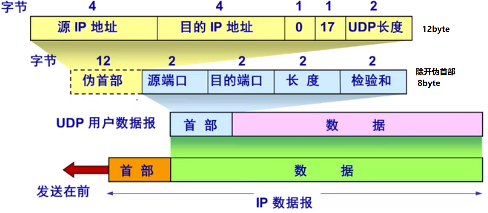

# 计算机网络

---

# 1 计算机网络体系结构

## 1.1 计算机网络概述

### 1.1.1 概念

计算机网络是由自治计算机互联起来的集合体，其中包含三个关键点：自治计算机、互联、集合体

- 自治计算机：由软件和硬件组成，能完整实现计算机各种功能
- 互联：计算机之间能相互通信
- 集合体：有通信线路和互联设备连接起来的自治计算机集合

### 1.1.2 组成

1. 从组成部分上看：主要由硬件、软件和协议三大部分组成
2. 从工作方式上看：边缘部分和核心部分
3. 从功能组成上看：由通信子网和资源子网，由传输层分割
   - 通信子网：
     - 由通信线路、通信设备及相应的网络协议组成，
     - 它使网络具有数据传输，交换，控制，存储的能力。
     - 包括物理层，数据链路层，网络层
   - 资源子网
     - 主要由计算机系统、终端、联网外部设备、各种软件资源和信息资源组成
     - 负责数据处理，并向网络用户提供各种网络资源和服务
     - 包括应用层、表示层、会话层

### 1.1.3 功能

计算机网络有五大功能：数据通信、资源共享、分布式处理、提高可靠性、负载均衡（前三个为主要功能）

### 1.1.4 分类

按网络覆盖范围：广域网（wide area network）、城域网、局域网、个人区域网

- 城域网：可视为为了满足一定区域需求，而将多个局域网互联的局域网
- 广域网和局域网的差异不仅在于覆盖范围，而且还在于所采用的协议和网络技术，前者使用的是点对点等技术，后者使用广播技术

按拓扑结构：星形，总线形，环形（令牌环），网状形

按传输技术：广播式、点对点

- 是否采用分组存储转发与路由选择机制是点对点与广播式之间的重要差异

按交换技术：电路交换（建立专用通路），报文交换（报文长度未知），分组交换（长度固定的数据块，存储转发）

按传输介质：有线（双绞线，同轴电缆）和无线（蓝牙，微波，无线电）

### 1.1.5 性能指标

1. 带宽（bandwidth）
   - 带宽在通信线路中指的是信号频带范围
   - 在计算机网络中，网络通信线路所能传输数据的能力，指数字信道所能传输的“最高数据率”，单位比特/秒（b/s）
2. 时延（Delay）
   - 由四部分组成：发送时延，传播时延，处理时延，排队时延
   - 发送时延 = 分组长度 / 带宽
   - 传播时延 = 信道长度 / 电磁波在信道介质中的传播速率
   - 总时延 = 四者之和
3. 时延带宽积
   - 指从发送端发送的第一个比特即将到达终点时，发送端已经发出了多少个比特
   - 时延带宽积 = 传播时延 x 信道带宽
4. 往返时延：
   - 指从发送端发送数据开始，到发送端收到来自接受端的确认，总共经历的时延
5. 吞吐量（Throughput），指单位时间内通过某个网络的数据量，它受网络带宽或网络额定速率的限制
6. 信道利用率
   - 信道利用率 = 有数据通过时间 / （有 + 无）数据通过时间
7. 

其他：

1. 世界上第一个计算机网络是ARPAnet，是Internet 的前身

## 1.2 体系结构与参考模型

### 1.2.1 分层结构

计算机网络的各层及其协议的集合称为网络的体系结构，它是计算机网络中的层次，各层的协议及层间接口的集合。

在分层机构中，第n层中的活动元素通常称为n层实体。同一层的实体称为对等实体。

在计算机网络体系结构的各个层次中，每个信息单位都分为两部分：

- 一部分是数据部分（服务数据单元SDU），一部分是控制信息（协议控制信息PCI）。
- 它们共同组成协议数据单元PDU，
- 链路层的PDU为帧，网络层为分组，传输层为报文
- n-SDU + n-PCI = n-PDU = （n-1）-SDU

### 1.2.2 协议、接口、服务

OSI参考模型的3个主要概念

**协议**：就是规则的集合，对等实体间才有协议，是水平的，协议由语法、语义、同步三部分构成

**接口**：是同一结点内相邻两层间交换信息的连接点，下层的服务通过服务访问点（Service Access Point，SAP）提供给上层使用

**服务**：指下层为紧邻的上层提供的功能调用，是垂直的。上层要求服务，下层提供服务

- 计算机网络提供的服务科按以下三种方式分类
- 面向连接与无连接服务，
  - 前者需要建立连接，分配相应资源，例如**TCP**就是面向连接的协议
  - 后者无需先建立连接，需要发送数据时可直接发送，尽最大努力交付（Best-Effort-Delivery）,例如**IP和UDP**就是无连接的协议
- 可靠和不可靠服务
  - 可靠服务是指网络具有纠错，检错，应答机制，能保证数据正确，可靠地传送到目的地
  - 对于不可靠服务网络，**其网络正确性由应用或用户来保障**
- 有应答和无应答
  - 有应答服务是指接收方在收到数据后向发送方给出相应的应答，例如文件传输服务就是有应答服务
  - **www服务**是无应答服务，客户端收到页面文件后不给服务器应答

### 1.2.3 参考模型

#### OSI模型

1. 七层，物链网输会示用，谐音助记：物联网谁会使用
2. 通信子网：下三层，资源子网：上三层
3. 物理层
   - 传输单位：比特流
   - 任务：透明的传输比特流
   - 功能：定义接口特性（物理设备）、传输模式（单双工）、传输速率
   - 典型协议：EIA-232C
4. 数据链路层
   - 传输单位：帧
   - 任务：将网络层传来的IP分组组装成帧
   - 功能：成帧、差错控制、流量控制（数据链路层及以上层）和传输管理等
   - 典型协议：SDLC、HDLC、PPP、STP
   - 实现相邻结点之间即点到点的数据传输服务
5. 网络层
   - 传输单位：数据报，数据报过长会被切割为分组
   - 任务：将数据单元（分组）从源端传到目的端
   - 功能：流量控制、拥塞控制、差错控制和网际互联等
   - 典型协议：IP、IPX、ICMP、IGMP、ARP（通过ip找mac）、RARP（通过mac找ip）、OSPF
   - 实现主机到主机的通信
6. 传输层
   - 传输单位：报文段（TCP）或用户数据报（UDP）
   - 任务：负责主机中两个进程之间的通信
   - 功能：流量控制、差错控制、服务质量。数据传输管理等
   - 实现主机进程间的端到端可靠数据传输服务（一个进程由端口标识，故为端到端）
   - 高层用户可以进行端到端的数据传输，而忽略通信子网的村子，在这层子网会发生交替变换
   - 因一个主机可运行多个进程，因而传输层具备复用和分用的功能，
     - 复用：多个应用层进程可同时使用下面传输层的服务
     - 分用：指传输层把收到的信息分别交付给上面的应用层中相应进程
   - 典型协议：TCP、UDP
7. 会话层
   + 利用传输层提供的端到端服务，向表示层提供它的增值服务。
   + 会话可以使用校验点继续恢复通信，实现数据同步
   + 管理主机间的会话进程，包括建立、管理及终止进程间的会话
   + 典型协议：ADSP、ASP
8. 表示层
   - 主要处理在两个通信系统中交换信息的表示方式，包括数据压缩，加解密等数据表示变换功能
9. 应用层
   - 是用户与网络的界面，为特定的网络应用提供访问OSI环境的手段，应用层是最复杂的一层，协议也最多
   - 典型协议：HTTP（万维网），FTP（文件传输），SMTP（电子邮件）

#### TCP/IP模型

1. 四层，应用层、传输层、网际层、网络接口层
2. 应用层：应用层、表示层、会话层
3. 传输层：传输层，
   - TCP/IP包含面向连接和无连接两种模式，而OSI只有面向连接的模式
4. 网际层：网络层
   - TCP/IP只有无连接模式，而OSI包含面向连接和无连接两种模式
5. 网络接口层：物理层、数据链路层

其他：

1. 集线器是一个多端口的中继器，它工作在物理层
2. 以太网交换机是一个多端口网桥，它工作在数据链路层
3. 路由器是网络层设备，它实现了OSI网络模型的下三层

# 2 物理层

## 2.1 通信基础

### 2.1.1 基本概念

数据：传送信息的实体

信号：指数据的电气或电磁表现，数据和信号都可以用模拟的和数字的来修饰

码元：指用一个固定时长的信号波形（数字脉冲）表示一个k进制的数字，代表不同离散数值的基本波形。这个时长称为码元宽度。

码元传输速率RB：又称波特率，调制速率，波形速率，符号速率。单位时间内数字通信系统所传输的码元个数，单位波特。

信息传输速率Rb：又称比特率，单位时间内数字通信系统所传输的**二进制码元**个数，D = RB * log k = RB * n。

- k进制，一个码元可取的离散电平总数
- n比特。k = 2^n，一个电平需要由几个二进制数表示。

奈奎斯特定理：

- 理想低通（无噪声，对称带宽）信道下，极限数据传输率 = 2W logV

- W是理想低通信道的带宽，单位hz

- V是一个码元能代表多少种数据，也k，例如16进制，V就等于16

- log以2为底

- ###### 为避免码间串扰，码元的极限传输速率为2W Baud。若传输速率超过此上限，就会出现严重的码间串扰

- 奈氏准则给出了码元传输速率的限制

香农定理

- 带通（单边带），含噪声信道
- 信道的极限数据传输率 = W log（1+ S/N）
- W为带宽，S为信号功率，N为噪声功率
- 只要信息的传输速率低于信道的极限传输速率，就能找到某种方法实现无差错传输。
- 香农定理信息传输速率的限制

编码与调制

- 把数据变换为模拟信号的过程称为调制
- 把数据变换为数字信号的过程称为编码
- 数字数据转数字信号，RZ（归零），NRZ，NRZI（用信号反转代表0，不反转为1），曼彻斯特（0为高-低电平，1为低-高），差分曼彻斯特
  - 前二者不含同步信息，码元间没有明显间隔，所以无同步信息
  - 以太网采用的是曼彻斯特编码
- 数字数据转模拟信号，键控
- 模拟数据转数字信号，采样，保持，量化
- 模拟数据转模拟信号，调制
- 将基带信号直接传送到通信线路（数字信道）上的传输方式为基带传输
- 把基带信号经过调制送到通信线路（模拟信道）上的方式为频带传输

电路交换、报文交换和分组交换

- 电路交换
  - 两个结点之间必须先建立一条专用（双方独占）的物理通信路径（有通信双方间的交换设备和链路逐段连接而成）
  - 优点：通信时延小，实时性强，有序传输，直通式接发（无存储转发）
  - 缺点：建立连接时间长，灵活性差，信道利用率低，无差错控制，无纠错能力
- 报文交换
  - 数据交换单位是报文，交换结点处存储转发，
  - 优点：无需建立连接，信道利用率高，线路动态分配，线路可靠性高
  - 缺点：无序传输，报文大小无限制，结点需要较大缓存空间，结点处存在转发时延
- 分组交换
  - 将报文切割为更小的固定长度的分组，交换结点处存储转发，分组交换比报文交换的传输时延小。
  - 优点：无需建立连接，信道利用率高，减小出错概率
  - 缺点：需要传输额外的信息量
- 

分组交换根据通信子网向端点系统提供服务，还可以进一步分为面向连接的虚电路方式和无连接的数据报方式（网络层提供）

- 数据报方式：先把报文拆分成多个有序号的数据单元，尽快转发分组，分组可以不同顺序走不同路径
  - 尽最大努力交付，传输不保证可靠性
  - 适于出错率很高的系统
  - 转发延时小，提高网络吞吐量
- 虚电路方式：试图结将数据报方式与电路交换方式结合起来。在分组发送前，要求在接发双方建立一条逻辑上相连的虚电路
  - 面向连接，有序，可靠传输
  - 连接建立，数据传输，连接拆除
  - 每个结点与其他结点之间可能同时有若干个虚电路，它可可能同时与多个结点建立虚电路

## 2.2 传输介质

1. 双绞线
   - 由两根，并排绞合（减少电磁干扰），相互绝缘的铜导线组成。有的还在双绞线外面加了金属丝屏蔽层
   - 典型：以太网线
   - 在局域网和传统电话网运用较为普遍，近距离（几千米到几十千米，过远要加中继器和放大器）
2. 同轴电缆
   - 内由同中心轴的导体，绝缘层，网状屏蔽层和塑料外层构成
   - 75Ω同轴电缆——闭路电视线，
   - 传输距离更远
3. 光纤
   - 利用光导纤维传递光脉冲来通信
   - 多模光纤（脉冲容易展宽，造成失真），利用全反射，近距离传输
   - 单模光纤（直径减小到一个光波长度），没有反射，光沿直线传播，远距离传输
4. 无线传输
   - 无线电波，如手机，无线局域网WLAN
   - 高带宽无线通信：微波，红外和激光
     - 他们都需要发送方和接收方存在一条视线通道，有很强方向性
     - 微波，例如地面上的塔基站之间，卫星通信
5. 物理接口特性
   - 机械特性：外观上的
   - 电气特性：电路上的
   - 功能特性：含义和用途
   - 规程特性：规程和时序关系
6. 

## 2.3 物理层设备

中继器和和放大器处理数据的对象是信号。

### 2.3.1 中继器

中继器（repeater，RP）又称转发器，主要功能：对信号，**整形**并**放大**后**转发**出去

- 中继器有两个端口，数据从一个端输入，一个端输出（没有固定哪个端口为输入，没有方向性），端口仅作用于信号的电气部分。
- 中继器没有存储转发功能，不能连接两个不同的协议，不能连接数据速率不同的同一网段不同的两个子网段
- 中继器放大的是数字信号，放大器放大的是模拟信号
- 中继器或集线器有5-4-3原则，最多连接5个子网段，4个中继器或集线器，只有3个子网段可以搭载主机，其余两个子网段只能用于延长连接距离。

网段（network segment）：一般指一个计算机网络中使用同一物理层设备（传输介质，中继器，集线器等）能够直接通讯的那一部分。

- 设备间通过相同传输介质直接连接，设备属于同一网段
- 设备间通过传输介质而非直接连接，但传输介质通过物理层扩展设备（中继器or集线器）转接，设备属于同一网段，扩展设备两端连接的是同一网段的不同子网段

### 2.3.2 集线器

集线器（Hub）实质是一个**多端口中继器**

- 功能：把从一个端口收到的数据通过所有其他端口转发出去。
- Hub只能在半双工状态下工作（即一个端口输入，其他端口输出，不能多输入），所有集线器的端口都属于同一个冲突域，在同一个时钟周期内只能传输一组信息。集线器在物理层上扩大了物理网络的覆盖范围，无法解决冲突域（第二层交换机可解决）与广播域（第三层交换机可解决）
- 拓扑结构属于星形

冲突域

- 一次只有一个设备发送信息，其他设备只能等待，否则会发生冲突
- 第二层交换机可解决冲突域的问题

广播域

- 接收同样广播消息的节点的集合。
- 第三层交换机可解决广播域的问题

# 3 数据链路层

## 3.1 功能

概念：

- 结点：主机，路由器
- 链路：网络中两个结点间的物理通道
- 数据链路：网络中两结点间的逻辑通道

功能

1. 为网络层提供服务
   - 无确认的无连接服务，适用于实时通信或误码率较低的通信信道，如以太网
   - 有确认的无连接服务，适用于误码率较高的通信信道，如无线通信
   - 有确认的面向连接服务，传输过程：建立数据链路，传输帧，释放数据链路，该服务可靠性最高，适用于对可靠性和实时性要求较高的场合。
2. 链路管理
   - 主要用于面向连接的服务
   - 数据链路的建立，维持和释放过程称为链路管理
3. 流量控制
   - 限制发送方的数据流量，使发送方的发送速率不超过接收方的接收速率
   - 不是数据链路层特有
4. 组帧
   - 将网络层的分组封装成帧
   - 如果数据中出现与帧定界符相同的比特组合时，采取措施以应对——透明传输
5. 差错控制
   - 位错：指帧中某些位出现了差错，常用循环校验方式（CRC）发现位错，通过自动重传请求（ARQ）来重传出错的帧。
   - 帧错：指帧丢失、重复、失序等错误，常用定时器和编号机制
6. 

## 3.2 组帧

数据链路之所以要把比特组合成帧为单位传输，是为了在出错时只重发出错的帧。

组帧主要解决帧定界，帧同步，透明传输等问题

1. 字符计数法，帧首的数字代表当前帧所包含的总字符数（帧首的数字为一个字符，也要计算在当前帧的字符总数里面）
2. 字符填充的首尾定界符法，定界符 = 转义字符+特殊字符，如在内容中出现转义字符，那么需要在转义字符前再加转义字符。
3. 零比特填充的首尾标志法，01111110为定界符，内容中如出现连续5个1，那么在其后加0，以解决透传的问题
4. 违规编码法：物理层对没有规定的码元当做定界符
5. 最常用为后两种

## 3.3 差错控制

**差错控制可分为检错编码和纠错编码。**

1. 检错编码：
   - 奇偶校验码：
     - 奇校验：加入校验位后（0或1），要使帧内1的个数为奇数，
     - 垂直奇偶校验，水平奇偶校验，水平垂直奇偶校验。**只能检测出奇数个比特错误**
   - 循环冗余码（CRC）：一个k位帧可以视为X的(k-1)次方到X的0次方的系数序列，接收方接收收到的帧，去除事先给定G(x)，如果没有余数那么认为无差错
   - 
2. 纠错编码
   - 海明码只可纠正帧内出现一位出错的错误，多了不行
3. 

## 3.4 流量控制与可靠传输

流量控制的基本方法：由接收方控制发送方发送数据的速率

常见的方式有两种，**停止-等待与滑动窗口**

1. 停止-等待协议

   - 基本原理：发送方每发送一帧，都要等待接收方的应答信号，之后才能发送下一帧。

2. 滑动窗口协议

   - 发送方维持一组连续的允许发送的帧的序号，称为发送窗口，WT，**代表在还未收到确认信息的情况下最多还可以发送多少个数据帧**

   - 接收方维持一组连续的允许接收的帧的序号，称为接收窗口，WR，接收到的帧若落在窗口内，则收下，否则，丢弃

   - 只有接收窗向前滑动（同时接收方发送了确认帧）时，发送窗口才有可能（只有发送方收到确认帧才一定）向前滑动

   - 接收窗口为1时，可保证帧的有序接收。

   - 从滑动窗口概念来看

     - 停止-等待协议：WT = 1，WR = 1。

     - 后退N帧协议（Go Back N）：WT > 1，WR = 1。

       - 若采用n比特对帧编号，则**1<=WT<=2n-1，**若发送窗大于最大值则无法区分新旧帧

       - 

       

     - 选择重传协议（Selective Repeat）：WT > 1，WR > 1，

       - 可以避免重复传送哪些本已正确到达接收端的数据帧
       - 采用n比特对帧编号，**WT + WR <=2n，**一般情况下，WT = WR ，故WTMAX = WRMAX =2n-1，
       - 

     - 

可靠传输机制

数据链路层的可靠传输通常使用**确认和超时重传**两种机制来完成。

1. 确认是一种无数据控制帧，使得接收方可以让发送方知道哪些内容被正确接收。

   - 如果每经过一个计时周期，发送方没有接收到确认帧，那么就重新发送，直到确认

   - 主动方为发送方
   - 对某一帧的确认就表明该数据帧和此前所有帧的帧均已正确无误的收到（当前帧的确认帧，含有对前面帧的捎带确认）

2. 自动重传请求（Auto Repeat reQuest，ARQ）通过接收方请求发送方重传出错数据帧来恢复出错的帧，主动方为接收方

指标

1. 信道利用率，也称信道的效率

   - ( L / C ) / T
   - 发送方从开始发送数据到收到第一个确认帧为止，称为一个发送周期，设为T
   - 发送方在这个周期内共发送L比特的数据
   - 发送方的数据传输率为C，（L / C）为传输时间

2. 信道吞吐率

    信道吞吐率 = 信道利用率 * 发送方的发送速率

3. 

## 3.5 介质访问控制

为使用相同介质的每个结点**“ 隔离 ”**来自同一信道上其他结点所传送的信号。

用来决定广播信道中信道分配的协议**属于数据链路层的一个子层**，称为**介质访问控制（Medium Access Control，MAC）**

冲突是一种能量变化，也就是能量波变得不那么稳定

常见的介质访问控制方法：

1. 信道划分介质访问控制（静态划分）
   - 多路复用技术：把多个信号组合在同一条物理信道上进行传输，多个设备间共享时域、频域等资源。
   - 信道划分的实质就是通过划分时域、频域等资源，把原来的一条广播信道，逻辑上分为多条用于两个结点间通信的互不干扰的子信道，实际上**把物理上的广播信道转变为逻辑上的点对点信道**
   - 信道划分实质有四种：
     - FDM——频分复用（将道路分为多个并行的车道，共享时间不共享空间）
     - TDM（只有一个车道，分时段交替通行，共享空间不共享时间）
     - WDM（与FDM相似）
     - CDM（将所有数据放在同一个车中运输，到站时再将数据分开，共享时间也共享空间），主要用于无线通信，特别是移动通信。**码片正交**
2. 随机访问介质访问控制（动态划分）
   - 所有用户根据自己的意愿随机发送信息，占用信道所有速率。此时会产生冲突碰撞，为解决冲突，每个用户按照一定规则反复重传它的帧，直到无碰撞通过。
   - 核心思想：用户通过争用信道，从而获得信息的发送权。
   - 常用协议：ALOHA、CSMA、CSMA/CD、CSMA/CA
   - ALOHA
     - 纯ALOHA：即时传输，超时未确认重发，直到确认
     - 时隙ALOHA：将所有站的时间划分为多个等长的时隙，所有站只有在每个时隙开始时才能发送，减少了冲突可能性。
   - CSMA
     - Carrier Sense Multiple Access 载波侦听多路访问 ，在发之前，侦听信道是否空闲
     - ALOHA + 监听信道（发送帧前，侦听一下，信道空闲时发送）
     - 1与p-坚持与非坚持
       - 1与p是在监听到空闲时，发送数据的概率。1为立即发送，p为以概率p发送数据，以1-p的概率推迟到下一时隙发送
       - 坚持是在监听到忙时，监听信道的策略。坚持为持续监听信道，非坚持为放弃监听信道，等待一个随机时间后再监听。
     - 分为：1-坚持CSMA、非坚持CSMA、p-坚持CSMA
   - CSMA/CD
     - CD Collision Detection——碰撞检测，边发边监听信道上信号电压变化
     - 先听后发，边听边发（CD），冲突停发，随机重发
     - 以太网端到端往返时间2t（t为传播时延）称为争用期，又称冲突窗口
     - **最小帧长**：为了确保发送站在发送数据的同时能检测到可能存在的冲突，需要在发送完帧之前就能收到自己发送的数据（以免冲突后无法恢复）
       - 最小帧长 = （总线传播时延 * 2）*数据传输率
       - 以太网规定最短帧长为64B。
     - 二进制退避算法解决碰撞后再次发送的时机问题
       - 基本退避时间 2t
       - 定义参数k = min[重传次数，10]
       - 退避时间：从[0,1,...2^k-1]随机取一个整数r，退避时间 = 2tr
     - 适用于总线形网络或半双工网络
   - CSMA/CA
     - CA Collision Avoidance 碰撞避免，协议涉及要尽量避免碰撞发生的冲突
     - 基本思想：在发送数据时，先广播告知其他结点，让其他结点在某时间段内不要发送数据，以免出现碰撞
     - 三种机制用于避免碰撞：预约信道，ack帧，RTS/CTS(Request to Send / Clear to Send，解决隐蔽站的问题)
     - 适用于无线局域网
   - 
3. 轮询访问介质访问控制（动态划分）
   - 主结点轮流邀请从属结点发送数据
   - 典型轮询访问协议是令牌传递协议，主要用在令牌环局域网中，拿到令牌（令牌只有一个）的结点可发送，其他的结点不论是不是发送给自己的都需要按环顺序转发，直到数据帧又回到始发站，发送结束，释放令牌，让其他站使用。
   - 非常适合负载很高的广播信道，无论负载多高都没有冲突
4. 

## 3.6 局域网

### 3.6.1 基本概念和体系结构

**局域网特性由三个要素决定：拓扑结构、传输介质、介质访问控制方式**

- 常见拓扑结构：星形、环形、总线形、星形和总线形复合结构

- 传输介质：双绞线（主流）、铜缆、光纤

- 介质访问控制方法主要有：CSMA/CD、令牌总线、令牌环。前两种主要用于总线形局域网，令牌环用于环形局域网

IEEE802定义的局域网模型只对应于OSI模型的物理层和数据链路层，并将数据链路层拆分成：逻辑链路控制子层（Loggic Link Control，LLC）和介质访问控制子层（MAC）

三种特殊局域网拓扑实现：

1. 以太网（802.3）
2. 令牌环（802.5）
3. FDDI（802.8）

### 3.6.2 以太网

以太网Ethernet，逻辑上总线形，物理上星形。

以太网提供**无连接，不可靠**的服务，只实现无差错接收

**传输介质**：一下图表为常识内容，题目中是不会显示告诉你的

**网卡**：计算机与外界局域网的连接（连接计算机和传输介质的接口是网卡）是通过主机箱内插入一块网卡NIC，又称网络适配器Adapter或网络接口卡（Network Interface Card）

- 功能：实现与传输介质的物理连接和电信号匹配，帧的接发和组拆，介质访问控制，数据编解码和缓存
- **MAC地址（也称物理地址）**：全世界的每块网卡在出厂时都有一个唯一的代码。
  - 长6Byte，常用6个以冒号或连字符相连接的两位16进制数表示（6x2x4），高24为厂商代码，低24为厂商自行分配的网卡序列号
- 计算机、网桥、交换机都使用到网卡
- 工作在数据链路层与物理层之间。

高速以太网：数据传输率大于100Mb/s，依速率采用不同的介质访问控制协议

### 3.6.3 无线局域网

**IEEE802.11**是无线局域网的一系列标准，包括802.11a和802.11b，采用CSMA/CA

802.11规定无线局域网的最小构件为基本服务集BSS(Basic Service Set)，一个BSS包括一个基站AP（Access Point）和若干移动站

无线局域网分为两大类：有固定基础设施（有服务基站）和无固定基础设施。

- 有固定基础设施：BSS内的站之间可直接通信，BSS内的站与BSS外的站必须借由本BSS的AP与外界通信
- 无固定基础设施自组织网络：各节点平等，中间结点为转发结点，这些结点都具有路由功能。

802.11MAC帧头格式：

### 3.6.4 令牌环网

令牌环网的每一站通过电缆与环接口干线耦合器（TCU）相连，TCU主要作用传递所有经过的帧。在令牌环网中有一个令牌（Token）沿着环形总线在入网结点计算机间依次传递，站点只有在取得令牌后才能发送数据帧，因此令牌环网不会发生相撞。

## 3.7 广域网

广域网通常是指覆盖范围很广（远超一个城市的范围）的长距离网络，首要考虑的问题是：通信容量必须足够大，以便支持未来通信容量的增长。

广域网由一些结点交换机（注意：不是路由器，他们都拿来转发分组，结点交换机在单个网络中，而路由器是在多个网络构成的互联网中转发分组）

局域网所使用的协议主要在数据链路层，而广域网使用的协议主要在网络层。

| 广域网与局域网的区别与联系 | 广域网                                                       | 局域网           |
| -------------------------- | :----------------------------------------------------------- | ---------------- |
| 覆盖范围                   | 远超跨城                                                     | 较小             |
| 连接方式                   | 结点之间点到点连接，一个结点与多个结点交换机相连             | 普遍采用多点接入 |
| OSI                        | 物理，数据链路，网络                                         | 物理，数据链路   |
| 着重点                     | 强调资源共享                                                 | 强调数据传输     |
| 相似点                     | 广域网与局域网，从互联网角度看，二者平等，不是包含关系 广域网或局域网上的主机在该网通信时只需要使用其网络的物理地址 |                  |

广域网的一个重要问题是路由选择和分组转发

- 路由选择协议：负责搜索分组从某个结点到目的结点的最佳传输路由，以便构造路由表
- 分组转发：由路由表构造转发分组的转发表，分组是通过转发表进行转发的

PPP协议和HDLC是目前最常用的两种广域网数据链路层控制协议。

### 3.7.1 PPP协议

PPP（Point to Point Protocol）应用于直接相连两个结点的链路上，面向字节的协议。设计目的主要用来通过拨号或专线建立点对点连接发送数据。

PPP协议由三个组成部分：

- 链路控制协议（LCP），用于建立、配置、测试和管理数据链路（物理连接），一种扩展链路控制协议（一般用于身份验证）
- 网络控制协议（NCP），PPP协议**允许同时采用多种网络层协议**，每个不同的网络层协议要用一个相应的NCP来配置，为网络层协议建立和配置**逻辑连接**
- 一个将IP数据报封装到串行链路的方法，IP数据报在PPP帧就是其信息部分，信息部分的最大长度受MTU的限制。

**ppp特点：**

1. 支持全双工，
2. 支持点对点（不支持多点），
3. 不提供纠错功能，只保证无差错接收，传输不可靠，
4. 两端可以运行不同的网络层协议。

### 3.7.2 HDLC协议

高级数据链路控制（High-level Data Link Control，HDLC）协议，**面向比特**。

**HDLC特点：**

1. 采用0比特插入（连续5个1就在其后插入0）实现透传，
2. 全双工，
3. 传输可靠，
4. 传输控制与处理功能分离，具有较大灵活性

HDLC有3中站类型：

1. 主站，控制链路操作，发出命令帧
2. 从站，受控于主站，发出响应帧
3. 复合站，主从复合站

HDLC适用于链路的两种基本配置：

1. 非平衡配置：主站控制整个链路工作
2. 平衡配置：链路两端都是复合站，平等发起数据传输

数据操作方式：

1. 正常响应方式：非平衡，从站受主站控制
2. 异步平衡方式：平衡，复合站
3. 异步响应方式：非平衡

HDLC帧

控制字段的第一二位可将帧分为三类

1. 信息帧（I）：0xxxxxxx，标志用来传输信息，或使用捎带技术进行确认
2. 监督帧（S）：10xxxxxx，用于流量控制和差错控制，执行确认，请求重发，请求暂停等
3. 无编号帧（U）：11xxxxxx，用于对链路的建立、拆除等功能。

## 3.8 数据链路层设备

数据链路层设备包含：网桥和交换机

### 3.8.1 网桥

网段：一般指一个计算机网络中使用同一物理层设备（传输介质，中继器，集线器等）能够直接通讯的那部分网络。

两个或多个以太网通过网桥连接后，就成为一个覆盖范围更大的以太网，原来的每个以太网就称为一个网段。

网桥工作在数据链路层的MAC子层，可以使以太网各网段成为**隔离开的碰撞域。**

网桥处理数据的对象是帧。网桥必须具有路径选择的功能，接收到帧后，将帧转送到相应目的局域网站点。

根据路径选择算法不同：可将网桥分为**透明网桥（选择的不是最佳路由）和源路由网桥（最佳路由）**

### 3.8.2 交换机

本质上说，以太网交换机是一个多端口的网桥。

利用以太网可以方便地实现VLAN（VLAN可以阻隔冲突域和广播域）。

交换机独占传输媒体的带宽，对于普通的10M的共享以太网，若有N个用户，每个用户的平均带宽只有总带宽的1/N。而如果使用交换机时，一个用户在通信时是独占而不是和其他网络用户共享传输媒体带宽。因此拥有N对端口的交换机的总容量为Nx10M。

以太网交换机主要采用两种交换模式，即直通式和存储转发式。

冲突域：在同一个冲突域中的每个节点都能收到所有被发送的帧——同一时间只能有一台设备发送信息的范围。

广播域：网络中能接收任意设备发出的广播帧的所有设备的集合，——如果站点发出一个广播信号，所有能收到这个信号的设备范围。

|                              | 是否隔离冲突域 | 是否隔离广播域 |
| ---------------------------- | -------------- | -------------- |
| 物理层设备（中继器，集线器） | 否             | 否             |
| 链路层设备（网桥，交换机）   | 是             | 否             |
| 网络层设备（路由器）         | 是             | 是             |

# 4 网络层

## 4.1 网络层功能

主要任务：把分组从源端传到目的端，**网络层传输单位是数据包（过长被切割为分组）**

功能：

1. 异构网络互联、
2. 路由与转发：路由选择、分组转发。
3. 拥塞控制。

异构网络互联，是指将两个以上的计算机网络，通过一定的方法，用一种或多种通信处理设备（即中间设备，中间系统，中继系统）相互连接起来，以构成更大的网络系统。中继系统根据所在层次，中继系统分为以下四种

| 层次       | 中继系统       |
| ---------- | -------------- |
| 物理层     | 中继器，集线器 |
| 数据链路层 | 网桥，交换机   |
| 网络层     | 路由器         |
| 网络层以上 | 网关           |

使用物理层或数据链路层的中继系统，只是把网络扩大了，而从网络层的角度来看，它仍然是同一个网络。

因此网络互联通常是指用路由器进行网络互联和路由选择

## 4.3 IPv4

### 4.3.1 IPv4分组

- 首部长度：占4位，指定首部的内容大小，以4Byte为单位，最大60byte。最常用20Byte，此时不使用任何可选字段。
- 标识：占16位，它是一个计数器，没产生一个数据报就加1，并赋值给标识。当数据报的长度超过网络的MTU时，必须分片，**用以标识这个分片属于哪个数据报**，但这**不是分片在数据包中的序号**。
- 标志：占3位，[ 0 | DF | MF ]，DF（Don’t Fragment）等于0表示允许分片，MF（More Fragment）=1表示该数据报还有分片
- 片偏移：某片在原分组（数据报）中的相对位置。片偏移以8byte为偏移单位。
- 首部检验和：只校验分组的首部，而不校验数据部分
- 生存时间（TTL）：
  - 数据报在网络中可通过的路由器数的最大值，确保分组不会在网络中循环，
  - 路由器在转发前，会将TTL-1，直到等于0时，分组会被丢弃。
- 协议：占8位，指出分组携带数据使用何种协议，即分组应交给哪个传输层协议，值为6表示TCP，17表示UDP
- 源地址/目的地址：占4Byte，发送方/接收方IP地址

数据报>链路的MTU，就需要切片为分组。

### 4.3.2 ip地址

连接到Internet上的每台主机（或路由器）都分配一个**32bit**的全球唯一标识符，即ip地址。

**ip地址由两部分组成：网络号和主机号**

传统的ip地址是分类地址，分为A,B,C,D,E五类：

有些ip地址具有**特殊用途**（不做主机的ip地址）：

1. 主机号全0：本网络本身
2. 主机号全1：本网络广播地址
3. 127.0.0.1：环路自检地址（loopback test）
4. 32位全0：本网络本主机
5. 32位全1：TCP/ip网络的广播地址，受限广播地址，等效为本网络广播地址

### 4.3.3 NAT与私有ip地址

**网络地址转换（NAT）是指通过将专用网络地址转换为公用地址，从而对外隐藏内部管理的ip地址。**它使得整个专用网只需要一个全球IP地址就可以与因特网联通，由于专用网本地地址是可重用的，所以NAT大大节省了全球ip地址的消耗。同时隐藏了内部网络结构，从而降低了内部网络受到攻击的风险。

为了网络安全，划分出部分ip地址为私有IP地址，私有ip地址只用于LAN，不用于WAN，必须网络通过NAT将私有地址转换为公网地址才能与外界通信。

各类地址里的私有地址网段：

1. A类：**1个网段**（10-10+1），10.网段，即10.0.0.0~10.255.255.255
2. B类：**16个网段**（31-16+1），**172.16~172.31**网段，即172.**16**.0.0~172.**31**.255.255
3. C类：**256个网段**（255-0+1），**192.168.0~192.168.255**网段，即192.168.**0**.0~192.168.**255**.255

NAT转换表中存放这**{本地ip地址:端口}到{全球IP地址:端口}**的映射。

### 4.3.4 子网划分、子网掩码、CIDR

两级ip（网络号+主机号）的缺点：

1. ip空间利用率很低，
2. 两级ip不够灵活，
3. 给每个物理网络分配一个网络号会使路由表变大而使网络性能变坏。

为解决两级ip的问题，**子网划分**思路如下：

1. 从主机号借用若干bit作为子网号，形成**三级ip，IP地址={`<网络号>, <子网号>,<主机号>`}**
2. 对内划分，对外表现没划分子网。
3. 外来的数据报先到达路由器，路由器按目的网络号和子网号找到目的子网，最后把ip数据报交付给目的主机。

**子网掩码**是一个与ip地址相对应的，常32bit的二进制串（一串1和一串0），1对应ip网络的网络号和子网号，0对应主机号。

## 4.4 IPv6

## 4.8 网络层设备

路由器是一种具有多个输入和输出端口的专用计算机。

# 5 传输层

## 5.1 传输层提供的服务

### 5.1.1 传输层功能

**逻辑通信**：同层之间好像有一条沿水平方向传输的链路，实际同层之间没有一条水平向的物理链路。

传输层功能：

1. 传输层提供了应用进程之间的逻辑通信。而网络层提供的是主机之间的逻辑通信。
   - 主机之间的通信，实际上是应用进程之间的通信。
   - 进程之间的通信又称为**端到端的逻辑通信**
2. 复用和分用
   - 复用：发送方的所有应用进程都可以使用同一个传输层协议传送数据到网络层。
   - 分用：接收方的传输层在剥去报文的首部后，能够把这些数据交付到目的应用进程
3. 传输层还要对报文差错检测（首部和数据部分），而网络层只检测ip数据报的首部
4. 提供种不同的协议，即**面向连接的TCP和无连接的UDP**

### 5.1.2 端口与套接字

**端口（软件端口）**用来标识主机中的应用进程。

SAP：服务访问点（service Access Point）,

- 数据链路层的SAP：MAC地址
- 网络层的SAP：ip地址
- 传输层的SAP：端口

**端口号**：每个端口的逻辑序号，标识应用程序，端口号长度：16bit，能标识65536（2^16）个端口，端口号只标识本主机进程。

根据端口号的范围可分为两类：

1. 服务端使用的端口号：0~49151

   - 熟知端口号：0~1023，IANA（互联网地址指派机构）把这些端口指派给tcp/ip最重要的一些进程。

   - | 应用程序 | FTP （文件传输） | SSH  | TELNET （远程登录） | SMTP | DNS （域名系统） | TFTP （小文件传输） | HTTP | SNMP |
     | -------- | --------------------- | ---- | ------------------------ | ---- | --------------------- | ------------------------ | ---- | ---- |
     | 端口号   | 21                    | 22   | 23                       | 25   | 53                    | 69                       | 80   | 161  |

   - 登记端口号：1024~49151，使用这些端口号，必须在IANA登记

2. 客户端使用的端口号：49152~6335

   - 这类端口仅在客户进程运行时才动态选择。

**套接字**：表示方法是点分10进制ip地址后面写上端口号，中间用冒号或逗号隔开。

套接字 = （ip地址：端口号）

**套接字唯一的表示网络中的一台主机和其上的一个应用（进程）**

每一个传输层连接唯一地被通信两端的两个端点（两个套接字）所确定。

### 5.1.3 无连接服务与面向连接服务

面向连接的服务就是在通信双方之前，必须先建立连接，在通信过程中，整个连接的情况被实时的监控和管理，通信结束后，连接被释放

无连接服务指通信双方不需要先建立连接，需要通信时，直接将信息发送到网络中，让该信息在网络中尽力而为的往目的地传输。

TCP/IP协议族在ip层之上使用两个传输协议：

1. 面向连接的传输控制协议TCP
   - TCP主要适用于可靠性更重要的场合，如FTP，HTTP，TELNET
2. 无连接的用户数据报协议UDP
   - UDP主要适用于执行速度快，实时性较好的场合，如TFTP，DNS，SNMP，RTP

## 5.2 UDP

特点：

1. 面向报文，
   - 发送方在对应用层报文添加首部后即交付给ip层，不合并也不拆分。
   - 接收方对ip层交上来的UDP数据报，在去除首部后，就原封不动的交付给上层应用
2. 尽最大努力交付，不保证可靠交付，可靠性工作在应用层完成。
3. 常用于一次性传输较少数据（建立连接的管理是不小的开销）和多媒体应用（实时性要求高）

UDP优点：

1. 时延小，不会引入建立连接的时延
2. 无需维护连接状态，
3. 首部开销小（仅8byte，而TCP要20byte）

伪首部只有在计算校验和时才出现，不向下传送也不向上递交。

## 5.3 TCP

### 5.3.1 TCP协议特点

Transmission Control Protocol，TCP是在ip层之上实现的可靠的数据传输协议，主要解决传输的可靠，有序，无丢失，和不重复的问题。

特点：

1. 面向传输的传输层协议
2. 只能有两个端点，只能是点对点
3. 提供可靠交付
4. 全双工通信，TCP连接的两端都有发送缓存和接收缓存
   - 发送缓存中存放：准备发送，发送未确认，
   - 接收缓存中存放：按序到达未被接收程序读取，不按序到达。
5. 面向字节流，将应用层传来的数据视为字节流。

### 5.3.2 TCP报文段

1. 序号（seq）：
   - TCP面向字节流，所以TCP连接传送的每个字节都编上序号，序号字段的值指的是本报文段所发送数据的第一个字节的序号
   - eg：当前报文段的序号字段值为301，而携带的数据共100B，说明本报文的最后一个数据的字节序号是400，因此下一个报文段的seq应该是401.
2. 确认号：
   - 期望收到对方下一个报文段数据的一个字节的序号，若确认号为N，那么表明0到序号N-1的所有数据都已正确接收。
3. 数据偏移（首部长度）：告知TCP首部的长度
4. **确认位ACK**：
   - 用来指示**确认号**是否有效
   - 0——确认号无效，1——确认号有效
5. **同步位SYN**：SYN等于1，再配合ACK字段，表示这是一个连接请求或连接接收报文，
   - SYN=1，ACK=0：表示这是一个连接请求报文，
   - SYN=1，ACK=1：对方同意建立连接，则响应。
6. **终止位FIN**：用来释放一个连接。FIN=1表明此报文段的**发送方**的数据已发送完毕，并要求释放传输连接。
7. 复位位RST：RST=1，表明TCP连接出现严重的差错，必须释放连接，然后重建。
8. 窗口字段：接收窗口的大小，允许对方发送（发送方）的数据量，接收缓存的空间有限。

### 5.3.3 TCP拥塞控制

防止过多的数据注入网络，保证网络的路由器或链路不至过载。

# 6. 应用层

## 6.1 网络应用模型

### 6.1.1 B/S

Browser/Server——浏览器与服务器模型

缺点：不能用于对性能要求高的程序

优点：数据安全，移植性高，不依赖平台。

### 6.1.2 C/S

Client/Server——客户/服务器模型

- 客户是服务请求方，服务器是服务提供方
- 服务器处于监听请求状态
- 客户机发出请求，并等待返回请求结果
- 服务器收到请求，处理请求，返回结果给客户机

特点：

- 地位不平等，服务器对用户的权限限制来管理客户机
- 客户机相互间不直接通信
- 扩展性不佳，受服务器的影响，支持客户机数量有限，**服务器的性能决定了整个系统的性能**
- 开发周期长，适宜性能要求高的程序

### 6.1.3 P2P

整个网络中的传输内容不再被保存到中心服务器上，每个节点都同时具有下载上传功能。

任意一对计算机——对等方（peer），直接相互通信。每个节点即可作为客户访问其它节点的资源，也可以作为服务器提供资源给其它节点。

特点：

- 减轻服务器压力，将任务分配到各个节点上
- 多个客户机直接分享资源
- 扩展性好
- 网络健壮性强
- 获取服务同时还要提供服务，对整机性能有影响
- 对硬盘有损伤，会造成网络拥堵