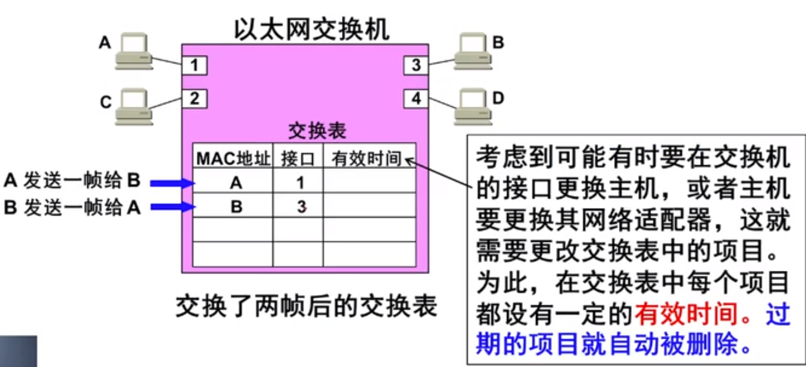
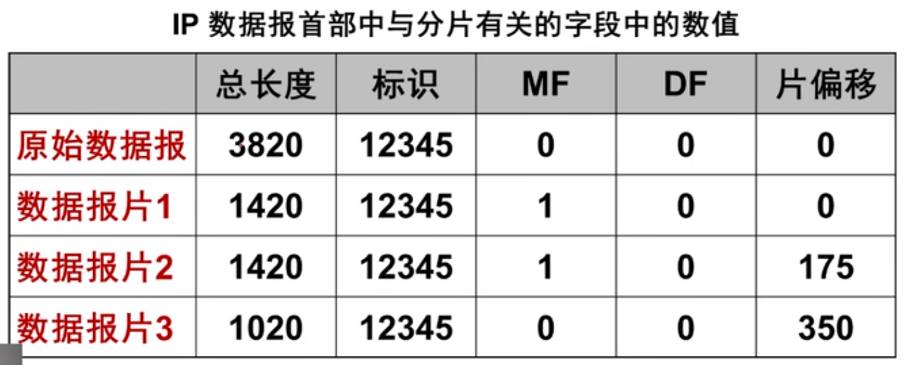
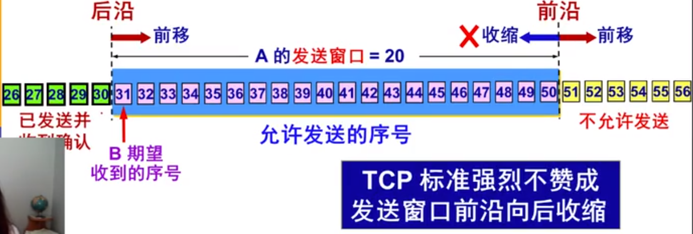

# 【计算机网络】

## 1.计算机网络体系结构

- 计算机网络的体系结构就是计算机网络各层及其协议的集合
- 体系结构就是这个计算机网络及其部件所应完成的功能的精确定义。
- 实现（implementation）是遵循这种体系结构的前提下用任何硬件或软件完成这些功能的问题。
- 体系结构是抽象的，而实现则是具体的，是真正在运行的计算机硬件和软件。

#### 1.1开放系统互联参考模型OSI/RM

- OSI的七层协议体系结构概念清楚，理论比较完整，但它既复杂又不实用

#### 1.2 非国际标准的TCP/IP体系结构（事实上的国际标准）

- TCP/IP是四层体系结构：应用层、运输层、网际层、网络接口层。（但最下面的网络接口层没有具体内容）

#### 1.3 五层协议的体系结构

- 往往采用折中的办法，即综合OSI和TCP/IP的优点，采用一种只有五层协议的体系结构。
- 五层协议的体系结构：

5 应用层（application layer）

4 运输层（transport layer）

3 网络层（network layer）

2 数据链路层（data link layer）

1 物理层（physical layer）

#### 1.4各层完成的主要功能

- **差错控制**
- **流量控制**
- **分段和重装**
- **复用和分用**
- **连接建立和释放**

#### 1.5 实体、协议、服务和服务访问点

- 实体（entity）：表示任何可以发送或接受信息的硬件或软件进程。
- 协议：是控制两个对等实体进行通信的规则的集合。
- 在协议的控制下，两个对等实体间的通信使得本层能够向上一层提供服务；要实现本层协议，还需要使用下层所提供的服务。
- 同一系统相邻两层的实体进行交互的地方为服务访问点SAP（Service Access Point），服务访问点实际上是一个抽象的概念，它实际上就是一个逻辑接口。
- OSI把层与层之间交换的数据单位称为服务数据单元SDU（Service Data Unit）

## 2.物理层

#### 2.1 物理层基本概念

物理层考虑的是怎样才能在连接各种计算机的传输媒体上传输比特流，而不是指具体的传输媒体。物理层的作用是尽可能的屏蔽掉不同传输媒体和通信手段的差异。用于物理层的协议也常称为物理层规程（procedure）

##### 2.11 物理层的主要任务：确定与传输媒体接口的一些特性

- 机械特性：指明接口所用接线器的形状和尺寸、引线数目和排列、固定和锁定装置等。
- 电气特性：指明在接口电缆的各条线上出现的电压的范围。
- 功能特性：指明某条线上出现某一电平的电压表示何种意义。
- 过程特性：指明对于不同功能的各种可能事件的出现顺序。

#### 2.2 数据通信的基础知识

一个通信系统包括三大部分：源系统（或发送端、发送方）、传输系统（或传输网络）、目的系统（或接收端、接收方）。

##### 2.2.1 常用术语

- **数据（data）**：运送消息的实体。
- **信号（signal）**：数据的电器的或电磁的表现。
- **模拟信号（analogous signal）**：代表消息的参数的取值是连续的。
- **数字信号（digital signal）**：代表消息的参数的取值是离散的。
- **码元（code）**：在使用时间域（或简称为时域）的波形表示数字信号时，代表不同离散数值的基本波形。
- **信道**：一般用来表示向某一个方向传递信息的媒体。
- **单向通信（单工通信）**：只能有一个方向的通信而没有反方向交互。
- **双向交替通信（半双工通信**）：通信的双方都可以发送信息，但不能双方同时发送（当然也不能同时接收）。
- **双向同时通信（全双工通信）**：通信的双方可以同时发送和接收信息。
- **基带信号（即基本频带信号）**：来自信息的信号。像计算机输出的代表各种文字或图像文件的数据信号都属于基带信号。

##### 2.2.2 有关信道的几个概念

调制（modulation）分为两大类：

- **基带调制**：仅对基带信号的波形进行变换，他能够与信道特性相适应。变换后的信号仍然是基带型号。把这种过程称为编码（coding）。
- **带通调制**：使用载波（carrier）进行调制，把基带信号的频率范围搬移到较高的频段，并转换为模拟信号，这样就能够更好的在模拟信道中传输（即仅在一段频率范围内能够通过信道）。
- **带通信号**：经过载波调制后的信号。

常用的编码方式（基带调制）：

- 不归零制：
- 归零制：
- 曼彻斯特：
- 差分曼彻斯特：

最基本的二元制调制方法（带通调制）有以下几种：

- 调幅（AM）：载波的振幅随基带数字信号而变化。
- 调频（FM）：载波的频率随基带数字信号而变化。
- 调相（PM）：载波的初始相位随基带数字信号而变化。

##### 2.2.3 信道的极限容量

从概念上讲，限制码元在信道上的传输速率的因素有两个：

- 信道能够通过的频率范围
- 信噪比

**香农公式**：香农用信息论的理论推出了带宽受限且有高斯白噪声干扰的信道的极限、无差错的信息传输速率。

信道的极限信息传输速率C(bit/s)可表达为：
$$
C = Wlog2^(1 + S/N)
\\其中：
\\W为信道带宽（单位Hz）
\\S为信道内所传信号的平均功率
\\N为信道内部的高斯噪声功率
$$
请注意：

对于频带宽度已确定的信道，如果信噪比不能再提高了，并且码元传输速率也达到了上限值，那么还有其他办法提高信息的传输速率：即用编码的方法让每一个码元携带更多的比特信息量。

#### 2.3 物理层下面的传输媒体

##### 2.3.1 导引型传输媒体

- **双绞线**

- [ ] 最常用的传输媒体
- [ ] 模拟传输和数字传输都可以使用双绞线，其通信距离一般为几到十几公里。
- [ ] 屏蔽双绞线STP（Shielded Twisted Pair）：带金属屏蔽层
- [ ] 无屏蔽双绞线UTP（Unshielded Twisted Pair）

- **同轴电缆**

- [ ] 同轴电缆具有很好的抗干扰性，被广泛用于传输较高速率的数据。
- [ ] 同轴电缆的带宽取决于电缆的质量。
- [ ] 50欧姆同轴电缆——LAN/数字传输常用
- [ ] 75欧姆同轴电缆——有线电视/模拟传输常用

- **光缆**

- [ ] 光缆是光纤通信的传输媒体。

- [ ] 由于可见光的频率非常高，约为10^8MHz的量级。因此一个光纤通信系统的传输带宽远远大于目前其他各种传输媒体的带宽。

- [ ] **光线在光纤中的折射**：当光线从高折射率的媒体射向低折射率的媒体时，其折射角将大于入射角。因此，如果入射角足够大，就会出现全反射，光也就沿着光纤传输下去。

- [ ] **多模光纤**

- [ ] **单模光纤**

- [ ] 光纤通信中使用的光波的波段：常用的三个波段的中心分别位于850nm，1300nm和1550nm。所有这三个波段都具有25000~30000GHz的带宽，可见光纤的通信容量非常大。

  **光纤的优点**：

  1. 通信容量非常大
  2. 传输损耗小，中继距离长
  3. 抗雷电和电磁干扰性好
  4. 无串音干扰，保密性好
  5. 体积小，重量轻

##### 2.3.2 非导引型传输媒体

- 将自由空间称为“非导引型传输媒体”。
- 无线传输所用的频段很广
- 短波通信（即高频通信）主要靠电离层的反射，但短波信道的通信质量较差，传输速率低。
- 微波在空间主要是直线传播。
- 传统的微波通信主要有两种方式：

- [ ] 地面微波接力通信
- [ ] 卫星通信

#### 2.4 信道复用技术

##### 2.4.1 频分复用（FDM）、时分复用（TDM）和统计时分复用（STDM）

##### 2.4.2 波分复用（WDM）：即光的频分复用

##### 2.4.3 码分复用（CDM）：

常用的名词是码分多址（CDMA），各用户使用经过特殊挑选的不同码型，因此彼此不会造成干扰。这种系统发送的的信号有很强的抗干扰能力，其频谱类似于白噪声，不易被敌人发现。

- 码片序列：每一个比特时间划分为m个短的间隔，称为码片，每个站被指派一个唯一的mbit码片序列。

如：发送比特1，则发送自己的m bit码片序列；发送比特0，则发送该码片序列的二进制反码

如：S站的8bit码片序列是00011011。发送比特1时，就发送序列00011011；发送比特0时，就发送序列11100100

**码分多址（CDMA）的工作原理**：S站和T站，S和T的码片序列正交，若站点发送比特1，则发送该站点的码片序列，若站点发送比特0，则发送该站点的反码序列。接收端用码片序列S或T做规格化内级，得到规格化内积为0（S或T站点没有发送数据）、1（S或T站点没有发送了比特1，即码片）、-1（S或T站点没有发送了比特0，即反码）分别表示的意义。

#### 2.5 数字传输系统

#### 2.6 宽带接入技术

## 3.数据链路层

#### 3.1 使用点对点信道的数据链路层

##### 3.1.1 数据链路和帧

- **链路**（link）是一条无源的点到点的物理线路段，中间没有任何其他的交换结点。

- [ ] 一条链路只是一条通路的一个组成部分。

- **数据链路**（data link）除了物理线路外，还必须有通信协议来控制这些数据的传输。若把实现这些协议的硬件和软件加到连路上，就构成了数据链路。

- [ ] 现在最常用的方法是使用适配器（即网卡）来实现这些协议的硬件和软件。一般的适配器都包括了数据链路层和物理层两层的功能。

- **数据链路层传送的是帧**。常常在两个对等的数据链路层之间画出一个数字管道，而在这条数字管道上传输的数据单位是帧。

##### 3.1.2 三个基本问题

- 数据链路层协议有许多种，但有三个基本问题则是共同的。这三个基本问题是：

- [ ] **封装成帧**：帧头（SOH）、数据帧部分、帧尾（EOT）
- [ ] **透明传输**：解决方法是字节填充或字符填充
- [ ] **差错控制**：在传输过程中可能产生比特差错，1可能变成0而0也可能变成1。在一段时间里，传输错误的比特占所传输的比特总数的比率称为误码率BER（Bit Error Rate）。误码率与信噪比有很大关系。为保证数据传输的可靠性，计算机网络传输数据时，必须采用各种差错检测措施。

- **循环冗余检验原理**：在数据链路层传送的帧中，广泛的使用了循环冗余检验CRC的检错技术。（和纠错区别）

在发送端，先把数据划分为组，假定每组k个比特。假设传送的一组数据M=101001（现在k=6）。我们在M后面再添加供差错检测用的n位**冗余码**一起发送。

- [ ] **冗余码计算举例**：

请注意：

仅用循环冗余检验CRC差错检测技术只能做到**无差错接受**（accept）。无差错接受是指凡是接受的帧（即不包括丢弃的帧），我们都能以非常接近于1的概率认为这些帧在传输过程中没有产生差错。也就是说凡是接收端数据链路层接受的帧都没有传输差错。（**帧检验序列FCS字段**可保证无差错接受，有差错的帧就丢弃而不接受）。

应当明确“**无比特差错**”与“**无传输差错（即不重复、不丢失、不失序）**”是不同的概念。在数据链路层使用CRC检验，能够实现无比特差错的传输，但这不是可靠传输，本章介绍的数据链路层协议都不是可靠传输协议。（那么可靠传输协议是谁解决呢？）

#### 3.2 点对点协议PPP

对于点对点的链路，目前使用得最广泛的数据链路层协议是**点对点协议PPP**（Point-to-Point Protocol）。例如：用户使用拨号电话线接入互联网时，用户计算机和ISP进行通信时所使用的数据链路层协议就是PPP协议。

##### 3.2.1 PPP协议的特点

- PPP协议应满足的需求

- [ ] 简单
- [ ] 封装成帧
- [ ] 透明性
- [ ] 多种网络协议
- [ ] 多种类型链路
- [ ] 差错检测
- [ ] 检测连接状态
- [ ] 最大传送单元
- [ ] 网络层地址协商
- [ ] 数据压缩协商

- PPP协议不需要的功能

- [ ] 纠错
- [ ] 流量控制
- [ ] 序号
- [ ] 多点线路
- [ ] 半双工或单工链路

- PPP协议有三个组成部分：

- [ ] 一个将IP数据报封装到串行链路的方法。
- [ ] 链路控制协议LCP（Link Control Protocol）。
- [ ] 网络控制协议NCP（Network Control Protocol）。

##### 3.2.2 PPP协议的帧格式

透明传输问题：

- 当PPP用在同步传输链路时，协议规定采用硬件来完成**比特填充**（和HDLC的做法一样）。
- 当PPP用在异步传输时，就使用一种特殊的**字符填充法**。

##### 3.2.3 PPP协议的工作状态

- 当用户拨号接入ISP时，路由器的调制解调器对拨号作出确认，并建立一条物理连接。
- PC机向路由器发送一系列的LCP分组（封装成多个PPP帧）。
- 这些分组及其响应选择一些PPP参数，并进行网络层配置，NCP给新接入的PC机分配一个临时的IP地址，使PC机成为因特网上的一个主机。
- 通信完毕时，NCP释放网络层连接，收回原来分配出去的IP地址。接着，LCP释放数据链路层连接，最后释放的是物理层连接。

可见，PPP协议已不是纯粹的数据链层的协议，它还包含了物理层和网络层的内容。

#### 3.3 使用广播信道的数据链路层

##### 3.3.1 局域网的数据链路层

- 局域网（LAN）的主要特点：

- [ ] 网络为一个单位所拥有
- [ ] 地理范围和站点数目均有限

- 局域网的主要优点：

- [ ] 具有广播功能，从一个站点可以很方便的访问全网。局域网上主机可共享连接在局域网上各种硬件和软件资源。
- [ ] 便于系统的扩展和逐渐地演变，各设备的位置可以灵活的调整和改变。
- [ ] 提高了系统的可靠性、可用性和残存性。

- 静态化分信道

- [ ] 频分复用
- [ ] 时分复用
- [ ] 波分复用
- [ ] 码分复用

- 动态媒体接入控制（多点接入）

- [ ] 随机接入
- [ ] 受控接入，如多点线路探询（polling），或轮询。

- 以太网的两个标准：

- [ ] DIX Ethernet V2 是世界上第一个局域网产品（以太网）的规约。
- [ ] IEEE802.3是第一个IEEE的以太网标准。

- 为了使数据链路层能够更好地适应多种局域网标准，IEEE802委员会就将局域网的数据链路层拆成两个字层：

- [ ] **逻辑链路控制LLC子层**
- [ ] **媒体接入控制MAC子层**

适配器的作用

- 网络接口板又称为通信适配器（adapter）或网络接口卡NIC（Network Interface Card），或“网卡”。
- 网络适配器的重要功能：

- [ ] 进行串行/并行转换
- [ ] 对数据进行缓存
- [ ] 在计算机的操作系统安装设备驱动程序。
- [ ] 实现以太网协议。

- 计算机通过适配器和局域网进行通信：

##### 3.3.2 CSMA/CD协议

CSMA/CD 含义：载波监听多点接入/碰撞检测

- ”**多点接入**“表示许多计算机以多点接入的方式连接在一根总线上。
- “**载波侦听**”是指每一个站在发送数据之前先要检测一下总线上是否有其他计算机在发送数据，如果有，则暂时不要发送数据，以免发生碰撞。
- “**碰撞检测**”就是计算机边发送数据边检测信道上的信号电压大小。

- 使用CDMA/CD协议的以太网不能进行全双工通信而只能进行双向交替通信（半双工通信）。
- **争用期**：最先发送数据帧的站，在发送数据帧后至多经过时间2t（两倍的端到端往返时延）就可知道发送数据帧是否遭受了碰撞。
- **二进制指数类型退避算法**：
- **争用期长度**：10Mbit/s以太网取51.2微秒为争用期长度，其在争用期内可发送512bit，即64字节。这意味着以太网在发送数据时，若前64字节没有发生冲突，则后续的数据就不会冲突。（即最短有效帧长64字节）
- 强化碰撞：人为干扰信号。

CSMA/CD协议的特点（4个）：

- **先听后发**：发送前先检测信道。
- **边听边发**：检测信道
- **冲突停止**：在争用期内检测到碰撞就立即停止发送数据。
- **延迟重发**：指数类型退避算法等待64字符后再次执行边听边发。但若重传16次人不能成功，则停止重传而向上层报错。

##### 3.3.3 使用集线器的星型拓扑

- 星型以太网10BBSE-T的标准802.3i（1990年IEEE制定）：10表示速率为10Mbit/s；BASE表示基带；T表示双绞线。
- 集线器的特点：

- [ ] 

##### 3.3.4 以太网的信道利用率

发送一帧占用线路的时间是T+t，而帧本身的发送时间是T。于是我们可以计算出理想情况下的极限信道利用率S：
$$
S = T/(T+t) = 1/(1+a) 
\\只有当参数a远小于1才能得到尽可能高的极限信道利用率。
\\据统计，当以太网的利用率达到30\%时就已经处于重载的情况。很多网络容量被网上的碰撞消耗掉了。
$$

##### 3.3.5 以太网的MAC层

重点介绍

- MAC层的硬件地址

- [ ] 在局域网中，硬件地址又称为物理地址，或MAC地址。802标准所说的”地址“严格的讲应当是每一个站的“名字”或标识符。
- [ ] 48位的MAC地址：IEEE802表准规定MAC地址可采用6字节（48位）或2字节（16位）这两种中的一种。IEEE的注册管理机构RA负责向厂家分配地址字段6个字节中的前三个字节（即高位24位），称为组织唯一标识符。地址字段6个字节的后三个字节（即低位24位）由厂家自行指派，称为扩展唯一标识符，必须保证生产出的适配器没有重复地址。（windows下查看：ipconfig -all）

- 适配器检查MAC地址

- [ ] 适配器从网络上每收到一个MAC帧就首先用硬件检查MAC帧中的MAC地址。如果是发往本站的帧则收下，然后再进行其他处理；否则就将此帧丢弃，不在进行其他的处理。
- [ ] 发往本站的帧包括以下三种帧：

**单播（unicast）帧**（一对一）

**广播（broadcast）帧**（一对全体）

**多播（multicast）帧**（一对多）

- MAC帧格式

- [ ] 以太网v2的MAC帧格式：帧头14个字节、帧尾4个字节、数据部分（为IP层的IP数据报）46~1500个字节（最大传输单元MTU）。因此最长帧长1518个字节。

- 无效的MAC帧

- [ ] 数据字段的长度与长度字段的值不一致
- [ ] 帧的长度不是整数个字节
- [ ] 用收到的帧检验序列FSC查出有差错
- [ ] 数据字段的长度不在46~1500个字节之间
- [ ] 有效的MAC帧长度为64~1518字节之间。

#### 3.4 扩展的以太网

##### 3.4.1 在物理层扩展以太网

- 使用光纤扩展 
- 使用集线器扩展
- 优点：

- [ ] 使原来属于不同碰撞域的以太网上的计算机能够进行跨碰撞域的通信。
- [ ] 扩大了以太网覆盖的地理范围。

- 缺点

- [ ] 碰撞域增大了，但总的吞吐量并未提高。
- [ ] 如果不同的碰撞域使用不同的数据率，那么就不能用集线器将他们互连起来。

##### 3.4.2 在数据链路层扩展以太网

扩展以太网更常用的方法是在数据链路层进行。早期使用网桥，现在使用以太网交换机。

- **网桥**工作在数据链路层。它根据MAC帧的目的地址对收到的帧进行转发和过滤。当网桥接收到一个帧时，并不是向所有的接口转发此帧，而是先检查此帧的目的地址，然后在确定将该帧转发到哪一个接口，或把它丢弃。
- 1990年问世的交换式集线器可明显的提高以太网的性能。**交换式集线器常**称为**以太网交换机**或**第二层交换机**（L2 switch），强调这种交换机工作在数据链路层。

**以太网交换机的特点**：

- 以太网交换机的接口有存储器，能在输出端口繁忙时把到来的帧进行缓存。
- 以太网交换机是一种即插即用设备，其内部的交换表（又称地址表）是通过自学习算法自动地逐渐建立起来的。
- 以太网交换机使用了专用的交换结构芯片，用硬件转发，其转发速率要比使用软件转发的网桥快很多。

**以太网交换机的优点**：

- 用户独享带宽，增加了总容量。
- 从共享总线以太网到交换式以太网时，所有接入设备的软件和硬件、适配器等都不需要做任何改动。
- 以太网交换机一般都具有多种速率的接口，方便了各种不同情况的用户。

**以太网交换机的交换方式**：

- 存储转发方式（目前常用）
- 直通方式（cut-through）

**以太网交换机的自学习功能**：

- 以太网交换机运行自学习算法自动维护（也可以管理员手填）交换表。
- 开始时，以太网交换机里面的交换表都是空的。

注：交换机工作方式中自学习算法主要是交换机接收到帧，如果交换表中有目的地址就直接转发出去；否则就进行广播。

**交换机使用了生成树协议：**

- 增加冗余链路时，自学习的过程就可能导致以太网帧在网络的某个环路中无限制的兜圈子。
- 如图，假定开始时，交换机#1和#2的交换表都是空的，主机A通过接口交换机#1向主机B发送一帧。

- **IEEE802.1D标准制定了一个生成树协议STP**（Spanning Tree Protocol）：其要点是不改变网络的实际拓扑，但在逻辑上则切断某些链路，使得从一台主机到所有其他主机的路径无环路的树状结构，从而消除兜圈子现象。

##### 3.4.3 虚拟局域网

- 利用以太网交换机可以很方便地实现虚拟局域网VLAN（Virtual LAN）
- 虚拟局域网VLAN是由一些局域网网段构成的与物理位置无关的逻辑组，而这些网段具有某些共同的需求。每一个VLAN的帧都有一个明确的标识符（虚拟微缆ID），指明发送这个帧的计算机属于哪个VLAN。
- 虚拟局域网实其实只是局域网给用户提供的一种服务，而并不是一种新型的局域网。
- 由于虚拟局域网是用户和网络资源设备的逻辑组合，因此可以按照需要将有关设备和资源非常方便的重新组合，使用户从不同的服务器或数据库中存取所需资源。

**虚拟局域网**：

- 虚拟局域网使用的以太网帧格式：

IEEE批准了802.3ac标准，该标准定义了以太网的帧格式的扩展，以支持虚拟局域网。虚拟局域网协议允许在以太网帧格式中插入一个4字节的标识符，称为**VLAN标记**（tag），用来指明发送该帧的计算机属于哪一个虚拟局域网。插入VLAN标记得出的帧称为**802.1Q帧**或带标记的以太网帧。

#### 3.5 高速以太网

##### 3.5.1 100BASE-T 以太网

- 速率达到或超过100Mbit/s的以太网称为高速以太网。
- 100BASE-T在双绞线上传送100Mbit/s基带信号的星形拓扑以太网，仍使用IEEE802.3的CSMA/CD协议。
- 100BASE-T以太网又称为快速以太网（Fast Ethernet）。
- 1995年IEEE把100BASE-T的快速以太网定为正式标准，代号为802.3u。
- 可在全双工方式下工作而无冲突发生。在全双工方式下工作时，不使用CSMA/CD协议。
- MAC帧格式仍然是802.3标准规定。
- 保持最短帧长（64B）不变，但将一个网段的最大电缆长度减小到100m。
- 帧间时间间隔从原来的9.6微秒改为现在的0.96微秒。

**100Mbit/s以太网的三种不同的物理层标准：**

- 100BASE-TX

- [ ] 使用2对UTP 5类线或屏蔽双绞线STP
- [ ] 网段最大程度：100米

- 100BASE-T4

- [ ] 使用4对UTP3类线或5类线
- [ ] 网段最大程度：100米

- 100BSE-FX

- [ ] 使用2对光纤
- [ ] 网段最大程度：2000米

##### 3.5.2 吉比特以太网

吉比特以太网可用作现有网络的主干网，也可在高带宽（高速率）的应用场合中。

- 允许在1Gbit/s下全双工和半双工两种方式工作。
- 使用IEEE802.3协议规定的帧格式。
- 在半双工方式下使用CSMA/CD协议，全双工方式不使用CSMD/CD协议。

##### 3.5.3 10吉比特以太网（10GE）和更快的以太网

##### 3.5.4 使用以太网进行宽带接入

## 4.网络层

### 4.1 网络层提供的两种服务

##### 4.1.1 虚电路服务

##### 4.1.2 数据报服务

**网络层只需要提供：尽最大努力交付**

- 由于传输网络不提供端到端的可靠传输服务，这就使网络中的路由器可以做的比较简单，而且价格低廉（与电信网的交换机相比）。
- 如果主机（即端系统）中的进程之间的通信需要是可靠的，那么就由网络的主机中的运输层负责可靠交付（包括差错处理、流量控制等）
- 采用这种设计思路的好处是：网络的造价大大降低，运行方式灵活，能够适应多种应用。
- 互联网能够发展到今日的规模，充分证明了当初采用这种思路的正确性。

### 4.2 网际协议IP

##### 4.2.1 虚拟互连网络

- 网际协议IP是TCP/IP 体系中最主要的协议之一。
- 与IP协议配套使用的还有三个协议：

- [ ] **地址解析协议ARP**
- [ ] **网际控制报文协议ICMP**
- [ ] **网际组管理协议IGMP**

网际层的IP协议及配套协议：

- 将网络互连并能够通信，会遇到许多问题需要解决，比如：

- [ ] 不同的寻址方案
- [ ] 不同的最大分组长度
- [ ] 不同的网络接入机制
- [ ] 不同的超时控制
- [ ] 不同的差错恢复方法
- [ ] 不同的状态报告方法
- [ ] 不同的路由选择技术
- [ ] 不同的用户接入控制
- [ ] 不同的服务（面向连接服务和无连接服务）
- [ ] 不同的管理与控制方式等

- 将网络互相连接起来要使用一些中间设备，中间设备又称为中间系统或中继系统。
- 有以下五种不同的中间设备：

- [ ] 物理层中继系统：转发器
- [ ] 数据链路层中继系统：网桥或桥接器（即交换机）
- [ ] 网络层中继系统：路由器
- [ ] 网桥和路由器的混合物：桥由器

- 虚拟互连网的意义：

所谓虚拟互连网络也就是逻辑互连网络，他的意思就是互连起来的各种物理网络的异构性本来是客观存在的，但是我们利用IP协议就可以使这些性能各异的网络从用户上看起来好像就是一个统一的网络。**使用IP协议的虚拟互连网络可以简称为IP网**。使用虚拟互连网络的好处是，当互连网上的主机进行通信时，就好像是在一个网络上通信一样，而看不见互连的具体的网络异构细节。如果这种覆盖全球的IP网的上层使用TCP协议，那么就是现在的互联网（Internet）。

- 分组在互联网中的传送

##### 4.2.2 分类的IP地址

- 在TCP/IP体系中，IP地址是一个基本的概念。（即IP协议规定的在网络层的寻址方式）
- **IP地址及其表示方法**：

**IP地址**：IP地址就是给每个连接在互联网上的主机（或路由器）分配一个在全世界范围是唯一的32位(IPv4下)的标识符。IP地址现在由**互联网名字和数字分配机构ICANN**进行分配。

**IP地址的编址方法**：1.**分类的IP地址**。这是最基本的编址方法，在1981年就通过了相应的标准协议。2.**子网划分**。这是对最基本的编址方法的改进，其标准[RFC 950]在1985年通过。3.**构成超网**。这是比较新的无分类编址方法。1993年提出后很快就得到推广应用。

- **常用的三种类别的IP地址**：

- [ ] **IP地址结构**：

**A、B、C三类IP地址32二进制情况下**：开头为0则为A类；开头为10则为B类；开头为110则为C类。

**点分十进制**：采用点分十进制将32位二进制代码每8位为一组，转换为4位十进制数，提高可读性。（当然每位最大为11111111的十进制数255，最小为0000000000的十进制数0，所以IP地址在0.0.0.0~255.255.255.255之间）。

- 一般不使用的特殊的IP地址：

- **IP地址的一些重要特点**：1.IP地址是一种分等级的地址结构。2.实际上IP地址是标志一个主机（或路由器）和一条链路的接口。3.用转发器或网桥连接起来的若干个局域网仍是一个网络，因此这些局域网具有相同的网络号。4.所有分配到网络号net-id的网络，无论是范围很小的局域网，还是可能覆盖范围很大的地理范围的广域网，都是平等的。

##### 4.2.3 IP地址与硬件地址

- IP地址与硬件地址是不同的地址。
- 从层次角度看

- [ ] 硬件地址（物理地址）：是数据链路层和物理层使用的地址。
- [ ] IP地址：是网络层和以上各层使用的地址，是一种逻辑地址（称IP地址为逻辑地址是因为IP地址是用软件实现的）。

- IP地址与硬件地址的区别：

##### 4.2.4 地址解析协议ARP

- 通信时使用了两个地址：

- [ ] IP地址（网络层地址）
- [ ] MAC地址（数据链路层地址）

- **地址解析协议ARP要点**：

1. 不管网络层使用什么协议，在实际网络的链路上传送数据帧时，最终还必须使用硬件地址。
2. 每一个主机都设有一个ARP高速缓存（ARP cache），里面所有在局域网上的各主机和路由器的IP地址到硬件地址映射表。
3. ARP高速缓存的作用：存放最近获得的IP地址到MAC地址的绑定，以减少ARP广播的数量。为了减少网络上的通信量，主机A在发送其ARP请求分组时，就将自己的IP地址到硬件地址的映射写入ARP请求分组。当主机B收到A的ARP请求分组时，就将主机A这一地址映射写入主机B自己的ARP高速缓存中。这对主机B以后向A发送数据报时就更方便了。
4. **使用ARP的四种典型情况**：跨越路由器传送时路由器可启用ARP代理功能。

应当注意：

ARP是解决同一个局域网上的主机或路由器的IP地址和硬件地址映射的问题。从IP地址到硬件地址的解析是自动进行的，主机的用户对这种地址解析过程是不知道的（即透明的）。

假如在数据传送过程中不使用这种虚拟互连网络的IP协议，使用硬件地址进行转换工作，即MAC地址与MAC地址之间的转换，其过程是非常复杂的。因此在虚拟的IP网络上使用IP地址进行通信，使用ARP进行地址解析为广大计算机用户（特别是跨网段的用户）带来了很大的方便。

##### 4.2.5 IP数据报的格式

- IP数据报由首部和数据两部分组成。

- 首部的前一部分固定长度共20个字节，是所有IP数据报所必须具有的。在首部的固定部分的后面是一些可选字段，其长度是可变的。
- IP数据报分片

例：

- IP数据报首部检验和的计算采用16位二进制反码求和算法。

##### 4.2.6 IP层转发分组流程

- 假设：有4个A类网络通过3个路由器连接在一起。每个网络上都可能有成千上万个主机。可以想象若按目的主机号来制作路由表，每个路由表就有4万个项目，即4万行（每一行对应一个主机），则所得出的路由表就会过于庞大。若按主机所在的网络地址来制作路由表，那么每一个路由器中的路由表就只包含4个项目（每一行对应一个网络），这样就可使路由表大大简化。
- **特定主机路由**
- **默认路由**
- **路由器分组转发算法：**

1. 从数据报的首部提取目的主机的IP地址D，得出目的网络地址为N。
2. 若网络N与此路由器直接相连，则把数据报*直接交付*目的主机D；否则是间接交付，执行3
3. 若路由表中有目的地址为D的*特定主机路由*，则把数据报传送给路由表中所指明的下一跳路由器；否则，执行4
4. 若路由表中有到达网络N的路由，则把数据报传送给路由表指明的下一跳路由器；否则，执行5
5. 若路由表中有一个*默认路由*，则把数据报传送给路由表中所指明的默认路由器；否则，执行6
6. 报告转发分组出错。

- **路由表：**

路由表没有给分组指明到某个网络的完整路径。路由表指出，到某个网络应当先到某个路由器（即下一跳路由器）。在到达下一跳路由器后，再继续查找其路由表，知道下一跳应当到哪个路由器。这样一步步的查下去，直到最后到达目的网络。

### 4.3 划分子网和构造超网

##### 4.3.1 划分子网

- 当没有划分子网时，IP地址是两级结构。划分子网后IP地址就变成了三级结构。划分子网只是把IP地址的主机号host-id这部分进行再划分，而不改变IP地址原来的网络号net-id。（即子网号可变）

- **子网掩码**

从一个IP数据报的首部并无法判断源主机或目的主机所连接的网络是否进行了子网划分。使用子网掩码（subnet mask）可以找出IP地址中的子网部分。

- [ ] **规则：**

1. 子网掩码长度 = 32位
2. 某位 = 1：IP地址中的对应位为网络号和子网号
3. 某位 = 0：IP地址中的对应位为主机号

- [ ] **(IP地址)AND（子网掩码） = 网络地址**
- [ ] **默认子网掩码：**

- [ ] IP地址与子网掩码同时使用才有意义。

##### 4.3.2 使用子网时分组的转发

- 在不划分子网的两级IP地址下，从IP地址得出网络地址是个很简单的事。但在划分子网的情况下，从IP地址不能唯一地得出网络地址来，这是因为网络地址取决于那个网络所采用的子网掩码，但是数据报的首部并没有提供子网掩码的信息。因此分组转发的算法也必须做相应的改动。

##### 4.3.3 无分类编址CIDR（构造超网）

- 无分类两级编址的记法：不在考虑网络IP地址的A、B、C类。

CIDR记法其他形式：10.0.0.0/10 可简写为10/10,也就是把十进制中低位连续的0省略。

- **路由聚合**

### 4.4 网际控制报文协议ICMP

##### 4.4.1 ICMP报文的种类

- ICMP报文的格式

- ICMP报文的种类有两种：**ICMP差错报告报文**和**ICMP询问报文**。

- [ ] **ICMP差错报告报文共4种**

1. 终点不可达
2. 时间超过
3. 参数问题
4. 改变路由（重定向）

ICMP差错报告报文的数据字段的内容：

请注意：不应发送ICMP差错报告报文的几种情况

1. 对第一个分片的数据报片的所有后续数据报片都不发送ICMP差错报告报文。
2. 对具有多播地址的数据报都不发送ICMP差错报告报文（如C类IP网络）。
3. 对具有特殊地址（如127.0.0.0或0.0.0.0或1.1.1.1）的数据报不发送ICMP数据报告报文。

- [ ] **ICMP询问报文有2种**（以前有几种ICMP报文不在使用）

1. 回送请求和回答报文
2. 时间戳请求和回答报文

##### 4.4.2 ICMP的应用举例

- **PING（Packet InterNet Groper）**

PING用来测试两个主机之间的连通性。PING使用了ICMP回送请求与回送报文。PING是应用层直接使用网络层ICMP的例子，它没有通过运输层的TCP或UDP。

- **Traceroute的应用举例**

在windows系统中这个命令是tracert。它用来跟踪一个分组从源点到终点的路径。他利用IP数据报中的TTL字段和ICMP时间超过差错报告报文实现对源点到终点的路径的跟踪。

### 4.5 互联网的路由选择协议

##### 4.5.1 有关路由选择协议的几个基本概念

- 静态路由选择策略：即非自适应路由选择，其特点是简单和开销小，但不能及时适应网络状态的变化。
- 动态路由选择策略：即自适应路由选择，其特点就是能较好地适应网络状态的变化，但实现起来较为复杂，开销也比较大。

##### 4.5.2 内部网关协议RIP

- RIP认为一个好的路由就是它通过的路由器的数目少，即“距离短”。RIP允许一条路径最多只能包含15个路由器（距离为16表示去不了）。可见RIP只是用于小型互联网。
- **RIP协议的三个特点**：

- [ ] 仅和相邻的路由器交换信息。
- [ ] 交换的信息是当前本路由器所知道的全部信息，即自己的路由表。
- [ ] 按固定的时间间隔交换路由信息，例如每隔30秒。当网络拓扑发生变化时，路由器也及时向相邻路由器通告拓扑发生变化后的路由信息。

##### 4.5.3 内部网关协议OSPF

- 开放式最短路径优先OSPF是为了克服RIP的缺点在1989年开发出来的。OSPF的原理很简单，但是实现起来却较复杂。
- **OSPF协议的基本特点：**主要考虑了带宽问题

- [ ] “开放”表明OSPF协议不是受某一家厂商控制，而是公开发表的。
- [ ] “最短路径优先”是因为使用了Dijkstra提出的最短路径算法SPF。
- [ ] 采用分布式的链路状态协议（link state protocol）。

##### 4.5.4 外部网关协议BGP

##### 4.5.5 路由器的构成

### 4.6 IPv6

IP是互联网的核心协议，互联网经过几十年的飞速发展，到2011年2月，IPv4的32位地址已经耗尽。ISP已经不能申请到新的IP地址块了。我国在2014-2015年也逐步停止了向新用户和应用分配IPv4地址。解决IP地址耗尽的根本措施就是采用具有更大地址空间的新版本IP，即IPv6。

##### 4.6.1 IPv6的基本首部

- IPv6仍支持无连接的传送，但将协议数据单元PDU称为分组。为方便起见，书中仍采用数据报这一词，IPv6数据报由IPv4的32位扩为128位。

##### 4.6.2 IPv6的地址

- IPv6数据报目的地址类型：

- [ ] 单播

- [ ] 多播

- [ ] 任播

- 冒泡十六进制记法

##### 4.6.3 从IPv4到IPv6过渡

- 两种向IPv6过渡的策略：

- [ ] 使用双协议栈
- [ ] 使用隧道技术

##### 4.6.4 ICMPv6

### 4.7 IP多播

##### 4.7.1 IP多播的基本概念

##### 4.7.2 在局域网上进行硬件多播

##### 4.7.3 网际组管理协议IGMP和多播路由选择协议

### 4.8 虚拟专用网VPN和网络地址转换NAT

##### 4.8.1 虚拟专用网VPN

- 跨越互联网的用户可以去访问私有网络。

- 用隧道技术实现虚拟VPN

##### 4.8.2 网络地址转换NAT

- 问题：在专用网上使用专用地址的主机如何与互联网上的主机通信（并不需要加密）？

- 解决：

- [ ] 再申请一些全球IP地址。但这在很多情况下是不容易做到的。
- [ ] 采用网络地址转换NAT。这是目前使用的最多的方法。

### 4.9 多协议标记交换MPLS

###### 4.9.1 MPLS的工作原理

##### 4.9.2 MPLS首部的位置与格式

## 5.运输层

### 5.1 运输层协议概述

##### 5.1.1  进程之间的通信

- 运输层的作用：在一台主机中经常有多个应用进程同时分别和另一台主机中的多个应用进程通信。这表明运输层的一个很重要的功能——**复用和分用**。根据用用程序的不同需求，运输层需要两种不同的运输协议，即面向连接的TCP和无连接的UDP协议。
- 两种不同的协议：逻辑通信信道对上层的表现因运输层使用的不同协议而有很大的差别。当运输层采用面向连接的TCP协议时，尽管下面的网络是不可靠的（只提供尽最大努力服务），但是这种逻辑通信信道就相当于一条全双工的**可靠信道**。当运输层采用无连接的UDP协议时，这种逻辑通信信道是一条**不可靠信道**。

##### 5.1.2 运输层的两个主要协议

- **用户数据报协议UDP**：传送的数据单位协议时UDP报文或用户数据报。
- **传输控制协议TCP**：传送的数据单位协议是TCP报文段。
- 两个对等运输实体在通信时传送的数据单位叫做运输协议数据单元TPDU。

##### 5.1.3 运输层的端口

- 运行在计算机中的进程是用进程标识符来标志的。但运行在应用层的各种应用进程却不应让计算机操作系统指派它的进程标识符。这是因为在互联网上使用的计算机操作系统种类很多，而不同的操作系统又使用不同格式的进程标识符。为了使运行不同操作系统的计算机应用进程能够互相通信，就必须用统一的方法对TCP/IP体系的应用进程进行标志。
- 解决这个问题的方法就是在运输层使用**协议端口号**，或通常简称为**端口**。虽然通信的终点是应用进程，但我们可以把端口想象是通信的终点，因为我们只要把要传送的报文交到目的主机的某一个合适的目的端口，剩下的工作（即最后交付的进程）就由TCP来完成。
- TCP/IP运输层端口：端口是一个16位端口号进行标志，端口号只具有本地意义，即端口号只是为了标志本计算机应用层中各进程。
- 两大类端口：

- [ ] 服务器端使用的端口号：**熟知端口号**，数值一般为0~1023，如：http 端口80、DNS 端口53。**登记端口号**，数值为1024~49151.使用这个范围的端口号必须在IANA登记，以防止重复。
- [ ] 客户端使用的端口号：又称为**短暂端口号**，数值为49152~65535，留给客户进程选择暂时使用。

- 常用的熟知端口：

### 5.2 用户数据报协议UDP

##### 5.2.1 UDP概述

- UDP只在IP的数据报服务之上增加了很少一点功能：

- [ ] 复用和分用的功能
- [ ] 差错检测的功能

- 虽然UDP用户数据报只能提供不可靠的交付，但UDP在某些方面有其特殊优点。
- UDP支持一对一、一对多、多对一和多对多的交互通信。UDP的首部开销很小，只有8个字节，比TCP的20个字节的首部要短。

##### 5.2.2 UDP的首部格式

### 5.3 传输控制协议TCP概述

##### 5.3.1 TCP最主要的特点

- TCP是面向连接的运输层协议。
- 每一条TCP连接只能有两个端点，每一条TCP连接只能点对点的（一对一）。
- TCP提供可靠交付的服务。
- TCP提供全双工通信。
- 面向字节流：TCP中的“流”指的是流入或流出进程的字节序列。”面向字节流“的含义是：虽然应用程序和TCP的交互是一次**数据块**，但TCP把应用程序交下来的数据看成仅仅是一连串无结构的字节流。（注意TCP面向字节流的概念）

**注意：**

- TCP连接是一条虚连接而不是一条真正的物理连接。
- TCP对应用进程一次把多长的报文发送到TCP的缓存中是不关心的。
- TCP根据对方给出的窗口值和当前网络拥塞的程度来决定一个报文段应包含多少个字节（UDP发送的报文长度是应用进程给出的）。
- TCP可以把太长的数据块划分短一些再传送。
- TCP也可等待积累有足够多的字节后再构成报文段发送传去。

##### 5.3.2 TCP的连接

- TCP把连接作为最基本的抽象。每一条TCP连接有两个端点。TCP连接的端点不是主机，不是主机的IP地址，不是应用进程，也不是传输层的协议端口。TCP连接的端点叫做**套接字**（socket）或**插口**。端口号拼接到IP地址即构成了套接字。（套接字 socket = （IP地址：端口号））

### 5.4 可靠传输的工作原理

##### 5.4.1 停止等待协议

- “停止等待”就是每发送完一个分组就停止发送，等待对方确认。在收到确认后再发送下一个分组。
- 全双工通信的双方既是发送方也是接收方。

- 无差错情况

- 出现差错：在计时器超时之前得不到回复即出现了差错。解决方法是**超时重传**。

请注意：

- 在发送完一个分组后，必须暂时保留已发送的分组的副本，以备重发。
- 分组和确认分组都必须进行编号。
- 超时计时器的重传时间应当比数据在分组传输的平均往返时间更长一些。
- 自动重传请求ARQ：通常A最终总是可以收到对所有发出分组的确认。如果A不断重传分组但总是收不到确认，就说明通信线路太差，不能通信。使用上述的确认和重传机制，我们就可以在不可靠的传输网络上实现可靠通信。像上述的这种可靠传输协议常称为**自动重传请求ARQ**。意思是重传的请求是自动进行的，接收方不需要请求发送方重传某个出错的分组。
- 流水线传输：这种传输方式可获得很高的信道利用率。

##### 5.4.2 连续ARQ协议

- **滑动窗口协议**比较复杂，是TCP协议的精髓所在。发送方维持的发送窗口，它的意义是：位于发送窗口内的分组都可以连续发送传去，而不需要等待对方确认。这样信道利用率就提高了。连续ARQ协议规定，发送方每收到一个确认，就把发送窗口向前滑动一个分组的位置。
- **累积确认**：接收方一般采用累积确认的方式。即不必对收到的分组逐个发送确认，而是对按序到达的最后一个分组发送确认，这样就表示：到这个分组为止所有分组都已正确收到了。

- [ ] 优点：容易实现，即使确认丢失也不必重传。
- [ ] 缺点：不能向发送方反映出接受方已经正确收到的所有分组的信息。

- **Go-back-N（回退N）**

### 5.5 TCP报文段的首部格式

- TCP虽然是面向字节流的，但是TCP传送的数据单元却是报文段。一个TCP报文段分为首部和数据两部分，而TCP的全部功能都体现在它首部中各字段的作用。TCP报文段首部的前20个字节是固定的，后面有4n字节是根据需要而增加的选项（n是整数），因此TCP首部的最小长度是20字节。
- **TCP报文段的首部格式**

- 六个标识位：**URG**、**ACK**、**PSH**、**RST**、**SYN**、**FIN**

### 5.6 TCP可靠传输的实现

##### 5.6.1 以字节为单位的滑动窗口

- 根据B给出的窗口值，A构造出自己的发送窗口。
- 发送窗口表示：在没有收到B的确认的情况下，A可以连续的把窗口内的数据都发送出去。
- 发送窗口里面的序号表示允许发送的序号。
- 显然，窗口越大，发送方就可以在收到对方确认之前连续发送更多的数据，因而可能获得更高的传输效率。

- A发送了11个字节的数据

- A的发送窗口内的序号都已用完，但还没有收到确认，必须停止发送。

- A收到新的确认号，发送窗口向前滑动

- **发送缓存**：发送方的应用进程把字节流写入TCP的发送缓存。

- **接受缓存**：接收方的应用进程从TCP的接收缓存中读取字节流。

- **发送缓存与接收缓存的作用**：

- [ ] 发送缓存用来暂时存放：发送应用程序传送给发送方TCP准备发送的数据；TCP已发送出但尚未收到确认的数据。
- [ ] 接收缓存用来暂时存放：按序到达的、但尚未被接收应用程序读取的数据；不按序到达的数据。

请注意：

1. 第一，A的发送窗口并不总是和B的接收窗口一样大（因为有一定的时间滞后）。
2. 第二，TCP标准没有规定对不按序到达的数据应如何处理。通常是先临时存放在接收窗口中，等到字节流中所缺少的字节收到以后，再按序交付上层的应用进程。
3. 第三，TCP要求接收方必须有**累积确认**的功能，这样可以减少传输开销。

##### 5.6.2 超时重传时间的选择

- 重传机制是TCP中最重要和最复杂的问题之一。TCP每发送一个报文段，就对这个报文段设置一次计时器。只要计时器设置的重传时间到但还没有收到确认，就要重传这一段报文。重传时间的选择是TCP最复杂的问题之一。
- **加权平均往返时间**：TCP保留了RTT的一个加权平均往返时间RTTs(这又称为平滑的往返时间)。
- **超时重传时间RTO**：RTO应略大于上面得出的加权平均往返时间RTTs。
- **Karn算法**：前面算法的改进等。
- **修正的Karn算法**

##### 5.6.3 选择确认SACK

- 问题：若收到的报文段无差错，只是未按序列号。中间还缺少一些序列号的数据，那么能否设法只传送缺少数据而不重传已经正确到达接收方的数据？
- 答案是可以的。选择确认SACK（Selective ACK）就是一种可行的处理方法。（SACK在TCP首部的可选项中）

### 5.7 TCP的流量控制

##### 5.7.1 利用滑动窗口实现流量控制

- 一般来说，我们总是希望数据传输得更快一些。但是如果发送方把数据发送的过快，接收方就可能来不及接收，这就会造成数据的丢失。**流量控制**就是让发送方的发送速率不要太快，既要让接收方来得及接收，也不要使网络发生**拥塞**。利用**滑动窗口机制**可以很方便的在TCP连接上实现流量控制。
- 可能发生死锁：为了解决这个问题，TCP为每一个连接设置一个**持续计时器**。

##### 5.7.2 TCP的传输效率

发送方糊涂窗口综合征：解决方法是使用Nagle算法。

### 5.8 TCP的拥塞控制

##### 5.8.1 拥塞控制的一般原理

- 某段时间，若对网络中某资源的需求超过了该资源所能提供的可用部分，网络的性能就要变坏。这种现象称为**拥塞**（即对资源的需求>可用资源）。
- 拥塞控制与流量控制的区别：

- [ ] 拥塞控制就是防止过多的数据注入到网络中，使网络中的路由器或链路不致过载。拥塞控制所要做的都有一前提，就是网络能够承受现有的网络负荷。拥塞控制是一个全局性的过程。涉及到所有的主机、所有的路由器。以及降低网络传输性能有关的所有因素。
- [ ] 流量控制往往指点对点通信量的控制，是个端到端的问题（接收端控制发送端）。流量控制所要做的就是抑制发送端发送数据的速率，以便使接收端来得及接收。

- 一般用分组丢失（计时器）来判断是不是网络拥塞，但是分组丢失是网络拥塞的征兆而不是原因（分组丢失也可能有其他原因，但我们认为大部分原因是因为网络拥塞）。

##### 5.8.2 TCP的拥塞控制方法

- TCP采用基于窗口的方法进行拥塞控制，该方法属于闭环控制方法，TCP发送方维持一个拥塞窗口CWND。拥塞窗口值是根据网络的拥塞情况调整发送的数据量；公告窗口值是发送方收到的接收方公告的窗口值，因此

$$
真正的发送的窗口值 = Min（公告窗口值，拥塞窗口值）
$$

- 拥塞的判断

- [ ] 重传定时器超时
- [ ] 收到三个相同（重复）的ACK

- TCP拥塞控制算法有四种（RFC 5681）

1. 慢开始
2. 拥塞避免
3. 快重传
4. 快恢复

- [ ] 慢开始和拥塞避免算法的实现举例

##### 5.8.3 主动队列管理AQM

- TCP拥塞控制和网络层采取的策略有密切关系（影响最大的是就是路由器分组丢弃策略）。AQM实际上就是对路由器中的分组排队进行智能管理，而不是简单地把队列的尾部丢弃。对路由器进行主动队列管理AQM仍是必要的。
- 随机早期检测RED

### 5.9 TCP的运输连接管理

##### 5.9.1 TCP的连接建立

- TCP是面向连接的协议。运输连接有三个阶段：连接建立、数据传送、连接释放。运输连接的管理就是使运输连接的建立和释放都能正常地进行。
- **TCP连接三个问题**：1.要使每一方能够确知对方存在。2.要允许对方协商一些参数（如最大窗口值、是否使用窗口扩大选项和时间戳选项以及服务质量等）。3.能够对运输实体资源（如缓存大小、连接表中的项目等）进行分配。
- **客户—服务器方式**：TCP连接的建立采用客户服务器的方式。主动发起连接建立的进程叫做客户（client）。被动等待连接建立的应用进程叫做服务器（server）。
- **TCP的连接建立**：TCP建立连接的过程叫做握手。握手需要在客户和服务器之间交换三个TCP报文段。称之为三报文握手。采用三报文段主要是为了防止已失效的连接请求报文段突然又传送到了，因而产生错误。
- **采用三报文握手建立TCP连接的各状态：**

##### 5.9.2 TCP的连接释放

- TCP的连接释放过程比较复杂。数据传输结束后，通信的双方都可释放连接。TCP连接释放过程是四报文握手。

请注意：A必须等待2MSL的时间。第一，为了保证A发送的最后一个ACK报文段能够到达B。第二，防止“已失效的连接请求报文段”出现在本连接中。A在发送完最后一个ACK报文段后，再经过时间2MSL，就可以使本连接持续的时间内所产生的所有报文段，都从网络中消失。这样就可以使下一个新的连接中不会出现这种 的连接请求报文段。

##### 5.9.3 TCP的有限状态机

- TCP的有限状态机可以更清晰的看出TCP连接的各种状态之间的关系。TCP有限状态机的图中每一个方框都是TCP可能具有的状态。每个方框中的大写英文字符串是TCP标准所使用的TCP连接状态名。状态之间的箭头表示可能发生的状态变迁。

## 6.应用层

- 应用层协议的特点：每个应用层协议都是为了解决某一类应用问题，而问题的解决又往往是通过位于不同主机中的多个应用进程之间的通信的协同工作来完成的。应用层的具体内容就是规定规定应用进程在通信时所遵循的协议。

### 6.1 域名系统DNS

##### 6.1.1 域名系统概述

- 许多应用层软件经常直接使用域名系统DNS，但是计算机的用户只是间接而不是直接使用域名系统。互联网采用层次结构的命名树作为主机的名字，并使用分布式的域名系统DNS。名字到IP地址的解析是由若干个域名服务器程序完成的。域名服务器程序在专设的节点上运行，运行该程序的机器称为域名服务器。	

##### 6.1.2 互联网的域名结构

- 互联网采用了层次树状结构的命名方法。任何一个连接在互联网上的主机或路由器，都有一个唯一的层次结构的名字，即域名。域名的结构由标号序列组成，各标号之间用点隔开：... .三级域名 . 二级域名 . 顶级域名
- **顶级域名TLD（Top Level Domain）**

- [ ] 国家顶级域名nTLD

.cn 表示中国

.us 表示美国

.uk 表示英国，等等

- [ ] 通用顶级域名gTLD 

最早的顶级域名：

.com (公司和企业)

.net (网络服务机构)

.org (非赢利性组织)

.edu (美国专用的教育机构)

.gov (美国专用的政府部门)

.mil (美国专用的军事部门)

.int (国际组织)

新增了下列的通用顶级域名：

.aero (航空运输企业)

.biz (公司和企业)

.cat (加泰隆人的语言和文化团体)

.coop (合作团体)

.info (各种情况)

.jobs (人力资源管理者)

.mobi (移动产品与服务的用户和提供者)

.museum (博物馆)

.name (个人)

.pro (有证书的专业人员)

.travel (旅游业)

- 互联网的域名空间：

##### 6.1.3 域名服务器

- 域名服务器有以下四种类型：

- [ ] **根域名服务器**

根域名服务器共有13套装置，不是13个机器。到2016年2月，全世界已经在588个地点安装了根域名服务器，使世界上大部分DNS域名服务器都能就近找到一个根域名服务器。（2015年中国牵头发起雪人计划，在IPv6下，在全世界建立25套IPv6的根，其中中国有4套）

- [ ] **顶级域名服务器**
- [ ] **权限域名服务器**
- [ ] **本地域名服务器**

1. 本地域名服务器采用递归查询（比较少用）

1. 本地域名服务器采用迭代查询

### 6.2 文件传送协议FTP

##### 6.2.1 FTP概述

- 文件传送协议FTP是互联网上用的最广泛的传送协议。FTP提供交互式的访问，允许客户指明文件的格式与类型，并允许文件具有存取权限。FTP屏蔽了计算机系统的细节，因而适合于在异构网络中任意计算机之间传送文件。RFC 959很早就成为了互联网的正式标准。（FTP使用TCP可靠的运输服务）

##### 6.2.2 FTP的基本工作原理

- 

##### 6.2.3 简单文件传输协议TFTP

- TFTP是一个很小且容易实现的文件传送协议。TFTP使用客户服务器方式和使用UDP数据报，因此TFTP需要有自己的差错改正措施。TFTP只支持文件传输而不支持交互。TFTP没有一个庞大的命令集，没有列目录的功能，也不能对用户进行身份鉴别。
- TFTP的主要特点：每次传送的数据PDU中有512个字节的数据，但最后一次可不足512个字节。数据PDU也称为文件块，每个块按序编号，从1开始。支持ASCII码或二进制传送。可对文件进行读或写。使用很简单的首部。TFTP的工作很像停止等待协议（可靠传输功能）。

### 6.3 远程终端协议TELENT

- TELNET是一个简单的远程终端协议，也是互联网的正式标准。
- 用户用TELNET就可在其所在地通过TCP连接注册（即登录）到远地的另一个主机上（使用主机名或IP地址）。
- TELNET能将用户的击键传到远地主机，同时也能将远地主机的输出通过TCP连接返回到用户屏幕。这种服务是透明的，因为用户感觉到好像键盘和显示器是直接连在远地主机上。
- 客户端—服务器方式：现在由于PC的功能越来越强，用户已经较少使用TELNET了。TELNET也使用了客户—服务器方式。在本地系统运行TELNET客户进程，而在远地主机则运行TELNET服务器进程。和FTP的情况相似，服务器中的主进程等待新的请求，并产生从属进程来处理每一个连接。
- TELNET使用网络虚拟终端NVT格式：TELNET通过NVT格式来解决客户端与服务器端的异构问题。

### 6.4 万维网WWW

##### 6.4.1 万维网概述

- 万维网WWW（World Wide Web）并非某种特殊的计算机网络。万维网是一个大规模的、联机的信息储藏所。万维网用链接的方法能非常方便的从互联网上的一个站点访问另一个站点，从而主动地按需获取丰富信息。万维网提供分布式的服务。万维网以客户—服务器方式工作。

##### 6.4.2 统一资源定位符URL

- URL的一般形式是：

- 为了使超文本的链接能够高效率的完成，需要用HTTP协议来传送一切必须的信息。从层次角度看，HTTP是面向事务的应用层协议。

##### 6.4.3 超文本传送协议HTTP

- HTTP报文结构：

- HTTP请求报文的一些方法：

OPTION、GET、HEAD、POST、PUT、DELETE、TRACE、

- HTTP状态码：

1xx表示通知信息

2xx表示成功

3xx表示重定向

4xx表示客户的差错

5xx表示服务器的差错

- 在服务器上存放用户的信息：万维网使用Cookie来跟踪用户。Cookie表示在HTTP服务器和客户之间传递的状态信息。使用Cookie的网站服务器为用户产生一个唯一的识别码。利用识别码，网站就能跟踪用户在该网站的活动。
- HTTPS：在HTTP协议中加入安全协议SSL与TLS

##### 6.4.4 万维网的文档

- 超文本标记语言HTML
- 可扩展的标记语言XML
- 层叠样式表CSS

##### 6.4.5 万维网的信息检索系统

- 全文检索搜索引擎

如：

Google（www.google.com）

百度（www.baidu.com）

- 分类目录搜索引擎

如：

雅虎（www.yahoo.com）

雅虎中国（cn.yahoo.com）

新浪（www.sina.com）

搜狐（www.sohu.com）

网易（www.163.com）

- 垂直搜索引擎

##### 6.4.6 博客和微博

##### 6.4.7 社交网络

### 6.5 电子邮件

##### 6.5.1 电子邮件概述

- 电子邮件（e-mail）是互联网上使用最多的和最受欢迎的一种应用。
- 电子邮件的一些标准：
  - 发送邮件协议：SMTP
  - 读取邮件协议：POP3和IMAP
- MIME在其邮件首部说明了邮件的数据类型（如文本、声音、图像、视像等），使用MIME可在邮件中同时传送多种数据。
- 用户代理UA（User Agent）：用户代理UA就是用户与电子邮件系统的接口，是电子邮件客户端软件。

##### 6.5.2 简单邮件传送协议SMTP

- STMP所规定的就是两个互相通信的SMTP进程之间应如何交换信息。由于SMTP使用客户服务器方式，因此负责发送邮件的SMTP进程就是SMTP客户，而负责接收邮件的SMTP进程就是SMTP服务器。SMTP规定了14条命令和21条应答信息。
- SMTP通信的三个阶段：
  - 连接建立：连接是在发送主机的SMTP客户和接收主机的SMTP服务器之间建立的。SMTP不使用中间的邮件服务器。
  - 邮件传送
  - 连接释放：邮件发送完毕后，SMTP应释放TCP连接。

##### 6.5.3 电子邮件的信息格式

- TCP/IP体系的电子邮件系统规定电子邮件地址格式如下：**收件人邮箱名@邮箱所在主机的域名**     

 其中符号@读作at，表示“在”的意思。

##### 6.5.4 邮件读取协议POP3和IMAP

- 邮局协议POP是一个非常简单、但功能有限的邮件读取协议，现在使用的是它的第三个版本POP3。POP也是用客户-服务器的工作方式。POP协议与IMAP协议是用户从目的邮件服务器上读取邮件所使用的协议。

##### 6.5.5 基于万维网的电子邮件

- 现在发送邮件到邮件发送服务器可直接通过网页，即HTTP协议，从邮件接收服务器接收邮件也是通过超链接，即HTTP协议，但是邮件发送服务器和邮件接收服务器之间的传送仍然使用SMTP协议。（即现在通过B/S实现，当然B/S的本质仍然是C/S）

##### 6.5.6 通用互联网邮件扩充MIME

- STMP协议有一定的缺点：将邮件推送到SMTP服务器有很多限制，SMTP会拒绝超过一定长度的邮件，不能传送可执行文件或其他二进制对象等。而扩充MIME并没有改动SMTP或取代他，而是对他做了一些补充，增加了邮件的主体结构，并定义了传送非ASCII码的编码规则。

### 6.6 动态主机配置协议DHCP

- 互联网广泛使用的动态主机配置协议DHCP采用即插即用连网机制。这种机制允许一台计算机加入新的网络和获取IP地址而不用手工参与。

- 协议配置：这些信息通常存储在一个配置文件中，计算机在引导过程中可以对这个文件进行存取。
  - IP地址
  - 子网掩码
  - 默认路由器的IP地址
  - 域名服务器的IP地址
- DHCP使用客户—服务器方式：需要IP地址的主机在启动时就向DHCP服务器**广播**发送发现报文，这时该主机就成了DHCP客户。
- 租用期（lease period）：DHCP服务器分配给DHCP客户的IP地址是**临时的**，因此DHCP客户只能在一段有限的时间内使用这个分配到的IP地址。DHCP协议称这段时间为租用期。租用期的数值应由DHCP服务器自己决定。DHCP客户也可以自己在发送的报文中（例如发送报文）提出对租用期的要求。
- DHCP工作过程：

注：DHCP客户在使用分配的动态IP地址过程中，根据DHCP服务器提供的租用期T设置两个计时器T1和T2，他们的超时时间分别为1/2T和7/8T，当超时时间到就要请求更新租用期。

### 6.7 简单网络管理协议SNMP

##### 6.7.1 网络管理的基本概念

- 网络管理包括对硬件、软件和人力的使用、综合与协调，以便对网络资源进行**监视、测试、配置、分析、评价和控制**，这样就能以合理的价格满足网络的一些需求，如实时运行性能，服务质量等。网络管理常简称为**网管**。网络管理并不是指对网络进行行政上的管理。
- SNMP的网络管理由三部分组成：
  - SNMP本身
  - 管理信息结构SMI
  - 管理信息库MIB

##### 6.7.2 管理信息结构SMI

##### 6.7.3 管理信息库MIB

##### 6.7.4 SNMP的协议数据单元和报文

- SNMP的报文格式：SNMP使用无连接的UDP协议

### 6.8 应用进程跨越网络的通信

- 操作系统和网络编程课程的重要内容

##### 6.8.1 系统调用和应用编程接口

##### 6.8.2 几种常用的系统调用

### 6.9 P2P

- P2P工作方式受到广大网名的欢迎。这种工作方式解决了集中式媒体服务器可能出现的瓶颈问题。在P2P工作方式下，所有的音频/视频文件都是在普通的互联网用户之间传输，这是相当于有很多分散在各地的媒体服务器向其他用户提供所要下载的音频/视频文件。在互联网流量中。P2P工作方式下的文件分发已占据最大的份额，比万维网应用所占的比例大得多。

##### 6.9.1 具有集中目录服务器的P2P工作方式（Napster）

- 最早出现的P2P技术，可提供免费下载MP3音乐。Napster能够搜索音乐文件，能够提供检索功能。所有的音乐文件地址集中存放在一个Napster目录服务器中。使用者可以很方便的下载需要的MP3文件。用户要及时向Napster的目录服务器报告自己存有的音乐文件。当用户想下载某个MP3文件时。就向目录服务器发出询问。目录服务器检索出结果后向用户返回存放此地址文件的PC机的IP地址。Napster的文件传输是分散的，但文件的定位则是集中的。这种**集中式目录服务器的缺点就是可靠性差**。Napster被判决属于“间接侵害版权”，因此在2000年7月底Napster网站就被迫关闭了。

##### 6.9.2 具有分布式结构的P2P文件共享程序（电骡eMule）

- 电骡eMule使用分散定位和分散传输技术，把每一个文件划分为许多个小文件块，并使用多源文件传输协议MFTP进行传送。因此用户可以同时从很多地方下载一个文件中的不同文件块。由于每一个文件块都很小，并且并行下载，所以下载可以比较快的完成。eMule用户在下载文件的同时，也在上传文件，因此互联网上成千上万的eMule用户在同时下载和上传一个个小的文件块。
- 使用P2P的比特洪流BT：BitTorrent所有对等方集合称为一个洪流，下载数据单元为长度固定的文件块。基础设施结点叫做跟踪器。

##### 6.9.3 P2P文件分发的分析

- 有N台主机从服务器上下载一个大文件，其长度为Fbit。假定主机与互联网连接的链路的上传速率与下载速率分别为ui和di，单位都是bit/s。

##### 6.9.4 在P2P对等方中搜索对象

- 现在广泛使用的索引和查找技术叫做**分布式散列表DHT**。DHT也可译为**分布式哈希表**，它是由大量对等方共同维护的散列表。广泛使用的Chord算法是美国麻省理工大学于2001年提出的。

------

