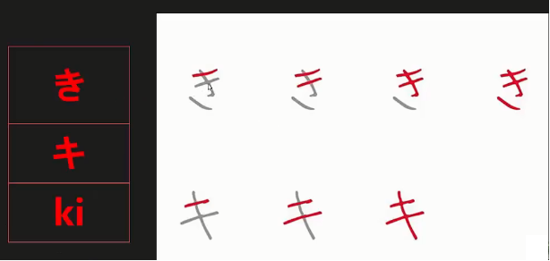

# 日语

日语中有汉语词，和语词，还有外来词（英语德语法语词等）

# 0 语言概述

## 语音特点

1. 开音节，每个语音以元音结尾
2. 等时性，每个音节一拍。发音长短基本相同。每个假名为一拍。

## 基本概念

1. 声调：高低型，每个假名为一拍，单词内的第一拍与第二拍高低不同，数字法表示的高音的结束位。
2. 元辅音：
   - 元：a、i、u、e、o，单元音，在发音过程中唇形和舌位不发生变化
   - 辅：a、k、s、t、n、h、m、y、r、w
3. 清音和浊音：辅音发音时声带的震动与否，例：k，g，后者声带震动

# 1 50音（清音）

日语中最基本的三种符号：平假名，片假名，罗马音

假名，日语的表音文字。“假”即“借”，“名”即“字”。意即只借用汉字的音和形，而不用它的意义，所以叫“假名(kana)”。平假名源于汉字[草书](https://baike.baidu.com/item/%E8%8D%89%E4%B9%A6/473235)，正式使用约从公元九世纪起；片假名源于汉字[楷书](https://baike.baidu.com/item/%E6%A5%B7%E4%B9%A6/482941)，正式使用约从公元十世纪起。

平假名：标注发音，构成单词

片假名：用于书写外来语

罗马音：用于输入和拼音

50音：5段（a、i、u、e、o）10行（a、k、s、t、n、h、m、y、r、w），5段10行，其中有4个重复，共46个假名，

图中左侧为平假名，右侧为片假名，英文字母为罗马音

图1.1 日语50音

a段速记：俺开桑塔纳，蛤蟆轧啦蛙

## a行

### あア

拼音：a

助记：**女的胖了一圈**，大叫了一声**啊**

### いイ

拼音：i

助记：将**“以”**一刀剖开

### うウ

拼音：u

助记：长得像两只耳朵，故：冬天太冷**捂**住了大小两只耳朵

### えエ

拼音：i

助记：**元朝**的**工**人很悲**哀**

### おオ

拼音：o

助记：做学**术**的**才**子很骄**傲**

## k行

### かカ

拼音：ka

助记：**卡**住了，**加**一点**力**

### きキ

拼音：ki

助记：き得像琵琶，キ长得像琵琶调节弦松紧的部分。故：给**琵琶**调一下key

### くク

拼音：ku

助记：将平片假凑在一起，有点像一个人**哭**丧着一张木瓜脸

### けケ

拼音：ke

助记：平假像汁，片假像个，**开**了**个**豆**汁**店

### こコ

拼音：ko

助记：平假像两条小鱼，片假像烤箱，故：**两条小鱼**游进了**烤**箱

## s行

### さサ

拼音：sa

助记：平假可以连写就像一个人跪着一样，而片假就像草字头，故：一个人**跪**在了**草**地上，傻不**傻**

### しシ

拼音：shi——西

助记：平假像吸管，片假就是三点水，故：用吸管吸出了三点水。

### すス

拼音：su——淑，有点ǖ的音

助记：平假像一个人上吊，片假像一个马扎，故：踩着**马扎上吊**，寻**死**

### せセ

拼音：se

助记：平假组成世的右上部分，片假组成世的右下部分

### そソ

拼音：so

助记：平假加一横像艺术的艺，片假像剪刀手，故：拍**艺**术照还**剪刀手**，太**扫**睿了

## t行

### たタ

拼音：ta

助记：平假像十二，片假如夕阳，故：**十二**点了，怎么还有**夕**阳，天**塌**了吗？

### ちチ

拼音：chi——欺

助记：平假像5，片假像千，故：老**五**出老**千**通**吃**

### つツ

拼音：tsu——出，有点ǖ的音

助记：平假像肚子，片假像学的三撇，故：饱食而志于学，才能脱口而出。

### てテ

拼音：te

助记：平假像乙，片假像街的左部。故：老**太太**被拉住，在大**街**上演路人**乙**

### とト

拼音：to

助记：平假像掏口袋，片假是萝卜，故：从口袋里**掏**出一根萝**卜**

## n行

### なナ

拼音：na

助记：平假像交，片假像十，故：**交**了卷子，只**拿十**分

### にニ

拼音：ni

助记：平假像仁，片假像二，故：**仁**者**爱（二）**人孔仲**尼**

### ぬヌ

拼音：nu

助记：又是你的奴仆

### ねネ

拼音：ne

助记：在**世乃**有**权**

### のノ

拼音：no

助记：平假像一个趴着的熊猫，片假像一根竹子，故：**竹**子吃多了，**熊猫**趴着**闹**肚子

## h行

### はハ

拼音：ha

助记：平假像仗，片假如八，故：仪**仗**队**八**人，哼哼哈**哈**

### ひヒ

拼音：hi

助记：平假如剑鞘，片假像匕，故：**匕**出**鞘**，声似**嘿**

### ふフ

拼音：fu

助记：平假似不，片假如镰刀，**不**用**镰**，我**服**

### へヘ

拼音：he

助记：似眯着眼，故：眯着眼，嘿嘿笑

### ほホ

拼音：ho

助记：平假像活，故：像**木**头一样的**活**着

## m行

### まマ

拼音：ma

助记：平假如夫字，片假为捅的右上部，故：夫人生子能捅天，妈妈。

### みミ

拼音：mi

助记：平假如丘比特射箭，片假如射出的三支箭苗，故：丘比特眯眼射三箭

### むム

拼音：mu

助记：平假如一人跪拜，**朝西跪拜**释迦**牟**尼

### めメ

拼音：me

助记：平假似女，片假如发卡，故：**女**孩带**发卡**，**美**美哒

### もモ

拼音：mo

助记：合起来可以为毛字

## y行

### やヤ

拼音：ya

助记：二宫和也

### ゆユ

拼音：yu

助记：平假如巾字，片假似帽，故：裁缝用手**巾**做**帽**子，绰绰有**余**

### よヨ

拼音：yo

助记：平假如一把钥匙，片假如梳子，故：拿**钥匙**当**梳子**，够**妖**气

## r行

在日语中用r表示l

### らラ

拼音：ra

助记：拉完盖上马桶盖

### りリ

拼音：ri

助记：如li

### るル

拼音：ru

助记：平假如歹，片假如儿，故：**歹**徒把**儿**子**掳**走了

### れレ

拼音：re

助记：平假如水，片假如鱼头，故：**鱼**从**水**中**来**

### ろロ

拼音：ro

助记：米入寻常家，**落**入**万**人**口**

## w行

### わワ

拼音：wa

助记：平假如木，片假如倒过来的锄头，故：木锄挖地

### をヲ

拼音：wo

助记：平假如人趴车头，片假如轨道，故：趴有轨车头，嗷**嗷**叫

### んン

拨音

拼音：n

助记：平假如铃，片假如铃响，故：摁铃响

# 2 发音

## 声调

数字法表示的是高音的结束位。每个单词第一排和第二拍的高低不同。每个单词只有一个高音部分。

0是平板型，第一拍为低音，后面的都为高音

## 浊音

1. 清音和浊音：辅音发音时声带的震动与否，例：k，g，后者声带震动。

2. 书写：浊音在字的右上角会加上两点，半浊音在字右上角会加上圈圈的记号。

3. 发声：开始时可以先以手捏住鼻子。把鼻腔堵住让气流透过声带由口中发出，此时试著发出一些声音，并感受声带有无振动。习惯之后已经能感受声带振动，再将捏住鼻子的手松开。重点是控制气流不要由鼻腔中流出，只由口腔发送出并振声带。半浊音，实际上就是个清音。大家只要按照清音的发声方法去发这个音就可以啦！

## 特殊音

每个假名为一拍，不要拖长。在日语中，音节有长短之分，长短不同会导致意义的不同。

日语中有三个特殊音：长音、促音、拨音

## 长音

假名发音时长拖长大于一拍，变成两拍——长音

## 促音

主要在か、さ、た、ば行假名前出现，表示停顿一拍，发音时堵住气流，形成短暂的停顿，时长一拍，然后放开阻塞，使气流疾冲而出，再发后面的音。

它的表记方法是在后面加つ，用罗马字表示时，促音用つ后，假名的辅音双写表示，

促音可分为阻塞促音和摩擦促音。

- 阻塞促音：出现在か（喉头阻塞）、た（牙齿阻塞）、ば（嘴唇阻塞）行前。
- 摩擦促音：出现在さ行前。舌头与牙齿接近形成摩擦音

## 拨音

不能单独发音，只能附在其他音节之后合成一个音，长度占一拍。发音时堵住口腔使气流从鼻腔流出。

## 拗音

截止目前，我们学的都是直音，与之相对的是拗音。拗音是相拼的语音。

拗音是由い段 + や、ゆ、よ构成，书写时，是在い段假名的右下角+やゆよ（缩小的）。

拗音在读音上与や、ゆ、よ相拼，在时长上只占一拍，拗音也有清浊之分。

拗音也有长音，其书写规则符合前面长音的书写规则，以や、ゆ、よ为准。

# 3 名词谓语句

## 常用语

1. 早上好

   おはようございます。一般用于长辈和不太熟的人，比较正式的场合

   ああ、おはよう

2. 你好

   こんにちは。一般只用于第一次见面

3. 晚上好

   こんばんは

4. 再见

   さようなら

   さよなら

5. 那好，请保重

   それでは、お元気（げんき）で。

6. 您早点休息吧

   おやすみなさい

   おやすみ

**构成名词谓语句：名词 + です**  

## 3.1 肯定句

形式：主题 + は.......です 表示肯定的判断，【は】（wa）表示主题

在实际进行自我介绍的时候，通常省略（わたしは）、只要.......です就可以

eg：

A：はじめまして、秦です 。どうぞ　__よろしく__　（お願（le）いします）。初次见面，我姓秦，请多关照

B：こちらこそ  よろしく（お願（le）いします）你也多关照

A：王です、中山さんです 小王，这是中山

こちらは。。。です  这位是......

## 3.2 の-的

N1のN2 表示N1修饰后面的名词N2，可以理解为__“的”__

eg：李さんは 理学部の三年生です。小李是理学院三年级学生

## 3.3 では-否定

です　改为　では(wa) ありません

eg:

李さんは、医学部の学生ではありません、工学部の学生です。小李不是医学院的学生，而是工学院的学生

## 3.4 も-也

.....も.....です  也是、提示助词も接在名词之后，用来提示另一个主题，表示它与上文提到的事物相同，也是

.....も.....も.....です 都是、当叙述两个事物有相同性质的时候，可以在两个事物后面加上も，表示都的意思。

eg:

わたしも留学生です  我也是留学生

王さんも李さんも留学生です  小王、小李都是留学生

## 3.5 か - 一般疑问

**一般疑问句**：......は......ですか   在肯定句的句末加上か，语调为声调，表示疑问

eg:

A：中山（なかやま）さんは、大学生ですか、中山君是大学生吗？

B： はい、そです  是的

Ｃ：いいえ、そうではありません  不是的（或者用其他否定句作为补充回答）

D：いいえ、会社員です  不、是公司职员（或者用其他肯定句作为补充回答）

**特殊疑问句-who**：

（....は）だれですか   |  どなたですか

だれ　谁

どなた　哪位

eg:日本語先生はどなたですか，日语老师是哪位？

（听到敲门声）だれですか   谁啊

## 3.6 と- 和

并列助词，表示**"和"**

王さん と 李さん は、中国人です。小王和小李是中国人

## 3.7 ね-语气助词

表示**"吧"**

李さんは大学院生ですね   小李是大学生吧

