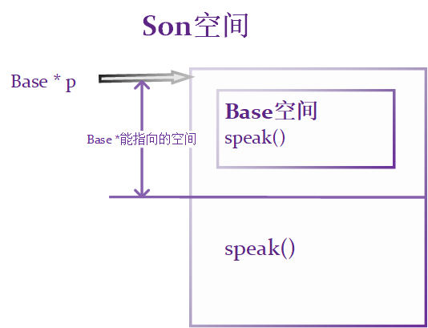
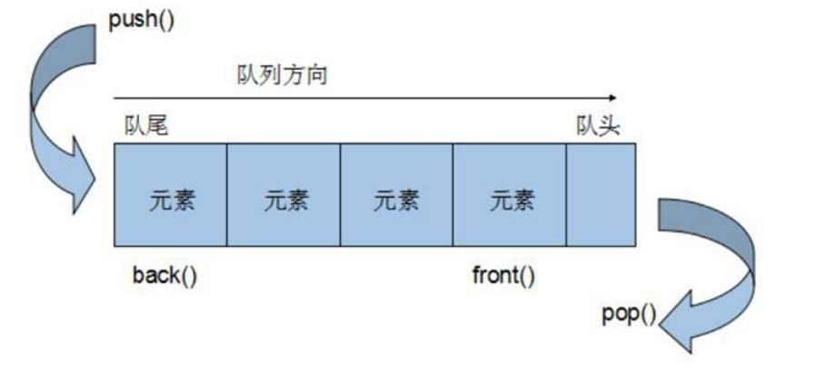
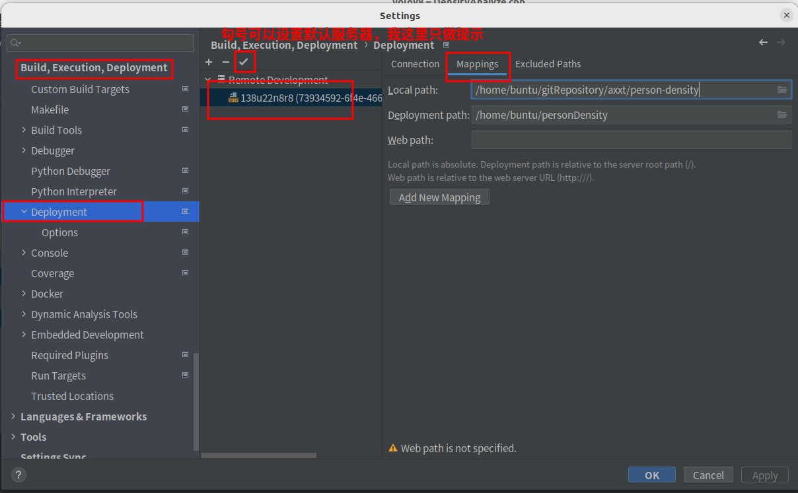

# C++

C++融合了3种编程模式：面向过程编程（**Process-oriented programming，POP**），面向对象编程（**OOP**），泛型编程。

C++中面向过程的语法兼容大部分C语言，只是在版本不同时，有兼容差异，在一定程度上可以说C++是C语言的超集。

面向对象编程思想：封装，继承，多态

泛型编程思想：模板

C++的暴露内存管理，可以从中获取更好的性能，更大的自由，拥有对内存的支配权。

而Java和C#的内存管理是自动的（不利于开发人员了解本质，永远停留在API调用和表层语法糖，对性能优化无从下手）。

# 0 初识

## 0.1 helloworld

使用visual Studio集成开发环境

1. 创建项目

   - 

2. 创建文件

   - 

3. 编写代码

   ```c++
   #include<iostream>
   //包含了目前c++所包含的所有头文件！！！！，有些集成开发环境并不支持，所以也只是一个额外的知识点
   #include<bits/stdc++.h>
   using namespace std;
   
   int main() {
   	//打印字符
   	cout << "Hello world" << endl;
      
       int a = 10;
   	cout << "a=" << a << endl;
   
   	system("pause");
   
   	return 0;
   }
   ```

4. 运行程序

   - 

   

## 0.2 一般知识

1. 关键字

   - 关键字是C++中预先保留的单词（标识符），变量和常量命名不得使用这些关键字

   - |            |              |                  |             |          |
     | ---------- | ------------ | ---------------- | ----------- | -------- |
     | asm        | do           | if               | return      | typedef  |
     | auto       | double       | inline           | short       | typeid   |
     | bool       | dynamic_cast | int              | signed      | typename |
     | break      | else         | long             | sizeof      | union    |
     | case       | enum         | mutable          | static      | unsigned |
     | catch      | explicit     | namespace        | static_cast | using    |
     | char       | export       | new              | struct      | virtual  |
     | class      | extern       | operator         | switch      | void     |
     | const      | false        | private          | template    | volatile |
     | const_cast | float        | protected        | this        | wchar_t  |
     | continue   | for          | public           | throw       | while    |
     | default    | friend       | register         | true        |          |
     | delete     | goto         | reinterpret_cast | try         |          |

5. 标识符命名规则

   - 标识符：只能由字母、数字、下划线组成，并且以字母或下划线为首。
   - 标识符区分大小写

3. 输入输出

   ```c++
   #include<iostream>
   using namespace std;
   #include<bits/stdc++.h>
   int main() {
   
   	//5.字符串
   	// 要用双引号
   	// a.c语言风格字符数组
   	char ch2[] = "abcdefg";
   	// b.c++风格的字符串要#include<string>,有些集成环境不需要，但是希望还是要写上。
   	//#include <bits/stdc++.h>无敌！
   	string ch3 = "hijklmn";
   	cout << "ch2 =" << ch2 << endl;
       cout << "ch3 =" << ch3 << endl;
   
   	//6.bool
   	bool flag1 = true;// 非0的值为真
   	bool flag2 = false;
   	cout << "flag1 =" << flag1 << endl;// 打印1
   	cout << "flag2=" << flag2 << endl;
   	cout << "flag2占用内存" << sizeof(flag2) << endl; // 1
   
   	//7.输入和输出
   	int a = 0;
   	cout << "请给int类型a赋值" << endl;
   	cin >> a;
   	cout << "int类型a="<< a << endl;
   	return 0;
   }
   ```

   

# 1 C++对C的扩展

## 1.1 面向对象编程概述

面向对象编程思想的核心：应对变化，提高复用。

面向对象的三大特点：封装，继承，多态。

在面向对象的语言中：

- 对象 = 算法 + 数据结构
- 程序 = 对象 + 对象 + ...

## 1.2 命名空间namespace

C++里作用域可分为6种：全局，局部，类，语句，命名空间和文件作用域

解决命名冲突，用于约束标识符name的作用范围，name可以包括常量，变量，函数，结构体，枚举，类，对象等等。

**作用域运算符：“ :: ”**

```c++
// 1. 定义命名空间
namespace A{
    int a = 100;
}
namespace B{
    int a = 50;
}
void test() {
    cout << "A::a" << A::a << endl; //100
    cout << "B::a" << B::a << endl; //50
}

// 2. 命名空间可嵌套
namespace A {
    int a = 100;
    namespace B{
        int a = 50;
    }
}
void test() {
    cout << "A::a" << A::a << endl; //100
    cout << "A::B::a" << A::B::a << endl; //50
}

// 3. 命名空间是开放的，可以随时添加新成员至已有的命名空间
namespace A{
    int a = 100;
}
namespace A{
    void hello() {
        cout << "hello namespace" << endl;
    }
}
void test() {
    cout << "A::a" << A::a << endl; //100
    A::hello();
}

// 4.声明和实现可分离，可使明明看空间看起来简洁，不臃肿
namespace MySpace{
    void func1();
    void func2(int param);
}
void MySpace::func1(){
    cout << "MySpace::func1" << endl;
}
void MySpace::func2(int param){
    cout << "MySpace::func2" << param << endl;
}

// 5.无名命名空间，相当于给内部成员标识符前面加上static，将成员标识符限制在本文件内
namespace {
    int a = 100;
}

// 6. 命名空间的别名
namespace MyBigMing{
    int a = 100;
}
void home() {
    namespace MySmallMing = MyBigMing;
    cout << "MySmallMing::a" << MySmallMing::a << endl; //100
}
```

## 1.3 using声明

using声明命名空间的成员标识符直接可用

```c++
// 1. using声明成员，直接可用成员名
namespace A {
	int a = 100;
    int b = 50;
}
void test() {
	using A::a;
	cout << "A::a" << a << endl;
    // 没有声明b，b是不能直接使用的
    
    // 相同作用域注意同名冲突
    int a = 50;  // 报错：using 声明导致多次声明“a”	
}

// 2. using声明重载的函数
// 如果命名空间包含相同名字的重载函数，using声明就代表这个重载函数的所有集合
namespace A{
    void func() {};
    void func(int x) {};
    int func(int x, int y){};
}
void test() {
	using A::func;
	func();
    func(1);
    func(1, 2);
}

// 3. using 声明整个命名空间可用
namespace A{
	int param1 = 10;
    float param2 = 1.25f;
    void func1() {};
    int func2(int x) {};
}
void test() {
	using namespace A;
    cout << "A::param1" << param1 << endl;
    cout << "A::param2" << param2 << endl;
    func1();
    func2(1);
}
```

### [using三种用法](https://zhuanlan.zhihu.com/p/156155959)

1. 导入命令空间

2. 指定别名

   - C++ 11 通过 using 指定别名，作用等同于 typedef，但相比 typedef，逻辑更直观，可读性更好。

3. 派生类引用基类成员

   - 尽管派生类 Derived 对 基类 Base 是私有继承，但通过 using 声明，派生类的对象就可以访问基类的 proteced 成员变量和 public 成员函数了。

     **注意：using只是引用，不参与形参的指定。**

```c++
1. 导入命令空间
// 导入整个命名空间到当前作用域
using namespace std;
// 只导入某个变量到当前作用域 
using std::cout; 

2. 指定别名
typedef int T; // 用 T 代替 int
using T = int; // 用 T 代替 int

3. 引用基类成员
class Base{
public:
    void showName(){
        cout<<"你好，my family is "<<family<<endl;
    }
protected:
    string family;
private:
    string name;
};
class Son :private Base{
public:
    using Base::family;
    using Base::showName;
//    using Base::name;     //无法访问private属性或方法
};
int main(void)
{
    Son s;
    s.family = "qqq";
    s.showName();
    return 0;
}
```

注意：**在.h头文件中，一般不应该使用using声明。**

因为头文件的内容会拷贝到所有引用它的文件中去，如果头文件里有某个using声明，那么每个使用了该头文件的文件就都会有这个声明，从而可能产生名字冲突。

## 1.4 struct类型增强

C++中的`struct`对C中的`struct`进行了扩充。

在C++中，struct特点：

1. 能够包含函数，不再仅仅是一个数据结构

   - c++中，class与struct区别不大，本质区别在于访问控制，`struct`作为数据结构的实现体，它默认的数据访问控制是public的，而`class`作为对象的实现体，它默认的成员变量访问控制是private的。

   - 一旦包含构造函数或虚函数（不包含普通成员函数），struct的花括号初始化方式失效。

   - ```c++
     struct A //定义一个struct
     	{
     		char c1;
     		int n2;
     		double db3;
     		void func() {
     			printf("afdsfd");
     		}
     	    // 一旦包含构造函数或虚函数（不包含普通成员函数），struct的花括号初始化方式失效。
     		A(){}
     	};
     
     A a = { 'p',7,3.1415926 }; //定义时直接赋值
     a.func();
     
     // class在使用public修饰时，也可以使用{}初始化。
     class A{ //定义一个class
     public:
     	char c1;
     	int n2;
     	double db3;
     };
     
     A a={'p',7,3.1415926}; //定义时直接赋值
     ```

   - 

2. 能继承，

   - struct默认继承权限是public，而class是private

   - struct`可以继承`class`，同样`class`也可以继承`struct，主要取决于子类的类型。

   - ```c++
     struct A{
     	char a;
     }；
     
     struct B : A{
     	char b;
     }；
     
     class C : B{};
     struct D : C{};
     ```

3. 能多态。

1. C++中定义结构体变量**不需要**加struct
   - C中，`struct Student s1;`
   - C++中，`Student s1;`
2. C++中成员中可以定义成员函数
   - C中不可以

```c++
struct Student{
    string name;
    int age;
    // 定义成员函数
    void toString() {
        cout << "Name：" << name << endl << "age：" << age << endl;
    }
}
void test() {
    // 定义结构体变量不需要struct
	Student s1;
    s1.name = "qq";
    s1.age = 20;
    s1.toString();
}
```

## 1.5 bool类型

标准c++的bool类型有两种内建的常量true(转换为整数1)和false(转换为整数0)表示状态。大小1byte。

给bool类型赋值时，非0会自动转换为true(1)，0会自动转换为false(0)

```c++
bool b1 = NULL;
bool b2 = '\0';
cout << b1; // 0
cout << b2; // 0

bool flag = true;
cout << flag; // 1
```

## 1.6 引用

在C/C++中指针的作用基本是一样的，但在C++中增加了另外一种给函数传递地址的途径，这就是按引用传递。

C++中新增了 引用的概念，引用可以作为一个已定义变量的别名。

引用的本质就是给变量名取个别名。

定义引用的书写方法步骤：

1. 给谁取别名，就定义谁
2. 然后将定义式从头至尾，将**原名**全部替换为**&别名**

```c++
int a = 10; // 定义式 int a，替换后 int &b
int &b = a; // 初始化
```

>  注意：
>
> 1. 系统不会为引用开辟空间
> 2. 引用和原名代表同一空间的内容
> 3. 操作引用等于操作原名

### 1.6.1 定义引用

```c++
// 1. 普通变量的引用
// 需求：给变量a取个别名叫b
// 定义的时候，&修饰变量为引用，b就是a的别名（引用）
// 系统不会为引用开辟空间，
int a = 10;
int &b = a;// 引用必须初始化

// a和b代表同一空间的内容
cout << "a=" << a << endl; // 10
cout << "b=" << b << endl; // 10
cout << &a << endl; // 0000008B4979F854
cout << &b << endl; // 0000008B4979F854

// 操作b等于操作a
b = 20;
cout << a << endl; // 20
cout << b << endl; // 20


// 2.数组的引用
int arr[5]={10,20,30,40,50};
int n = sizeof(arr)/sizeof(arr[0]);

// 定义数组别名
int (&myArr)[5] = arr;

int i=0;
for(i=0;i<n;i++){
	cout<<myArr[i]<<" ";//10 20 30 40 50
}
cout<<endl;


// 3.指针的引用
int num = 10;
int *p = &num;

int* &myP = p;

cout << "*p = " << *p << endl;//10
cout << "*myP = " << *myP << endl;//10


// 4.函数的引用
void fun01(void)
{
    cout << "fun01" << endl;
}

void(&myFun)(void) = fun01;
myFun();//fun01

// 5.常引用，给常量取别名，给常变量取别名
const int &a = 10;
// int &a = 10; // error
// a = 100; // error
// 不能通过常引用修改内容
// 常引用作为函数的参数，要防止函数内部修改外部的值
```

### 1.6.2 引用作为函数的参数

函数内部可以通过引用操作外部变量

引用作为函数的参数的时

1. 函数调用时传递的实参不必加取址 ”&“ 符
2. 函数定义里面，形参使用时，不必再添加取值“*“符
3. C++主张**引用传递**取代**地址传递**，因为引用语法简单不易出错

```c++
void swap(int &x, int &y) {
    int tmp = x;
    x = y;
    y = tmp;
}
void swap01(int *x, int *y) {
    int tmp = *x;
    *x = *y;
    *y = tmp;
}
int main() {
    int a = 10;
    int b = 20;
    cout << "a = " << a << " b = " << b << endl;
	// 传引用
    swap(a,b);
    cout << "a = " << a << " b = " << b << endl;	//a = 20 b = 10
    
    int c = 10;
    int d = 20;
    cout << "c = " << c << " d = " << d << endl;
    // 传址
    swap01(&c, &d);
    cout << "c = " << c << " d = " << d << endl;	//c = 20 d = 10
}
```

### 1.6.3 引用作为函数返回值

不要返回普通局部变量的引用（普通局部变量在使用后，它的内存空间将被释放掉）。

返回值类型为引用，可以完成链式操作

```c++
struct Student{
    Student& printStu(Student &ob, int value){
        cout << value <<;
        return ob;
    }
}
int main() {
    Student obj;
    obj.printStu(obj, 1).printStu(obj, 2).printStu(obj, 3);
}
```

### [类中成员变量是引用](https://blog.csdn.net/lazyq7/article/details/48186291)

- 不能有默认构造函数必须提供构造函数
- 构造函数的形参必须为引用类型
- 初始化必须在成员初始化链表内完成

## 1.7 [内联函数](https://blog.csdn.net/nyist_zxp/article/details/119697882)

如果函数是内联的，编译器在编译时，会把内联函数的实现（函数体）替换到每个调用内联函数的地方（函数调用处），避免函数开销。

可以与宏函数作类比，但宏函数不会进行类型检查。

定义时部分inline修饰的函数称为内联函数。

```c++
// 声明的时候不要加inline
int myAdd(int x,int y);
int main() {
    cout << myAdd(100, 200) << endl;
}
inline int myAdd(int x, int y){
    return x + y;
}
```

### 1.7.1 内联函数优缺点

**为什么要使用内联函数：**

引入内联函数主要是解决一些频繁调用的小函数消耗大量空间的问题（减小函数调用栈等函数调用开销）。

通常情况下，在调用函数时，程序会将控制权从调用程序处转移到被调用函数处，在这个过程中，传递参数、寄存器操作、返回值等会消耗额外的时间和内存，如果调用的函数代码量很少，也许转移到调用函数的时间比函数执行的时间更长。而如果使用内联函数，内联函数会在调用处将代码展开，从而节省了调用函数的开销。

**哪些函数不能是内联函数：**

1. 递归调用本身的函数；

2. 包含复杂语句的函数，例如：for、while、switch 等；

3. 函数包含静态变量；

**使用内联函数的缺点：**

1. 如果使用很多内联函数，生成的二进制文件会变大；
2. 编译的时间会增加，因为每次内联函数有修改，就需要重新编译代码。

**内联函数一般要求如下：**

1. 函数简短，通常3-5行
2. 函数内没有复杂的实现，比如：包含while、for 循环，递归等
3. 通常在多处有调用；

**注意事项：**

1. 类中的成员函数默认都是内联函数（不加inline也是内联函数）
2. 有时候，就算加上inline修饰，也不一定是内联函数
3. 有时候，就算没加inline修饰，它也有可能是内联函数
4. 函数是不是内联函数由编译器决定。

### 1.7.2 **宏函数和内联函数的区别**

宏函数和内联函数都会在适当位置进行展开，避免函数调用开销。

参数方面：宏函数的参数没有类型，内联函数的参数有类型，能保证参数的完整性。

处理阶段：宏函数在预处理阶段展开，内联函数在编译阶段展开

作用域：宏函数没有作用域的限制，内联函数有作用域的限制，能作为命名空间，结构体，类的成员。

## 1.8 函数重载（overload）

函数重载是C++多态（静态多态，编译时多态）的特性

函数重载：用同一函数名，代表不同的函数功能。

**同一作用域，函数的参数类型不同，个数不同，顺序不同都可以重载。**（返回值类型不同不能作为重载的条件）

```c++
void printFun(int a){
    cout << "int" << endl;
}
void printFun(int a, char b){
    cout << "int char" << endl;
}
void printFun(char b, int a){
    cout << "char int" << endl;
}
void printFun(char a){
    cout << "char" << endl;
}
int main() {
    printFun(10); //int
    printFun(10, 'a'); //int char
    printFun('a', 10); //char int
    printFun('a'); //char
}
```

```c++
// 为什么返回值类型不同不能作为函数重载的条件
// 如果一个函数为 int func(int x)，而另一个函数void fun(int x)，我们直接调用func(10)的时候，就不能确定我们调用的是哪个函数
```

**函数重载底层实现原理**

```c++
void func(){}
void func(int x){}
void func(int x, char y){}
//以上三个函数在linux下编译之后的函数名为：
_zfuncv //v,void
_zfunci //i,int
_zfunciv //i,int,c,char
// 不同的编译器可能产生不同的参数名，这里只做说明
```

## 1.9 函数默认和占位参数

### 1.9.1 默认参数

```c++
void TestFunc01(int a = 10, int b = 20){
cout << "a + b = " << a + b << endl;
}
//注意点:
//1. 形参b设置默认参数值，那么后面位置的形参c也需要设置默认参数
void TestFunc02(int a,int b = 10,int c = 10){}
//2. 如果函数声明和函数定义分开，函数声明设置了默认参数，函数定义不能再设置默认参数
void TestFunc03(int a = 0,int b = 0);
void TestFunc03(int a, int b){}
```

默认参数和函数重载同时出现，一定要注意函数调用的明确性，防止二义性出现

```c++
func(int x){
    cout << "x = " << x << endl;
}
func(int x, int y =20){
    cout << "x = " << x << " y = " << y << endl;
}
int main(){
	// 这里调用明确
    func(100,50);
    // 这里出现二义性，报错
    func(100);
}
```

默认参数的声明与实现

```c++
class A{
public:
    int hello(std::string start,std::string name="qin");
    // 容器的默认初始值
    int hello(std::string start,std::vector<std::string> name=std::vector<std::string>());
};

int A::hello(std::string start, std::string name) {		
    // name在声明处写了默认值
    // 在实现这里没写默认值
    // 但name的默认值仍然为"qin"
    printf("%s : %s", start.c_str(),name.c_str());
}
int A::hello(std::string start, std::vector<std::string> name) {
	//解释同上
}
```


### 1.9.2 占位参数

c++在声明函数时，可以设置占位参数。**占位参数只有类型名，没有形参名。**

一般情况下，在函数体内无法使用占位参数

占位参数一定要有实参的传递，占位参数也可以拥有默认值，此时可以不传实参

意义：

1. 为以后程序的扩展留下线索
2. 兼容C语言程序中可能出现的不规范写法

```c++
void TestFunc01(int a,int b,int){
	//函数内部无法使用占位参数
	cout << "a + b = " << a + b << endl;
}
//占位参数也可以设置默认值
void TestFunc02(int a, int b, int = 20){
	//函数内部依旧无法使用占位参数
	cout << "a + b = " << a + b << endl;
}
int main(){
	//错误调用，占位参数也是参数，必须传参数
	//TestFunc01(10,20);
    
	TestFunc01(10,20,30);//正确调用
	TestFunc02(10,20);//正确调用
	TestFunc02(10, 20, 30);//正确调用
return 0;
}
```

## 1.10 extern "C"

extern "C"的主要作用就是为了实现C++代码能够调用其他c语言代码。

加上extern "C"后，这部分代码编译器按C语言的方式进行编译和链接，而不是按c++的方式。

```c++
// fun.h
#ifndef MYMODULE_H
#define MYMODULE_H

#include<stdio.h>

#if __cplusplus	// 如果当前是c++工程，下面这段就需要用c语言方式编译
extern "C"{
#endif

    extern void func();
    extern int func2(int a,int b);

#if __cplusplus
}
#endif

#endif
```

```c
// fun.c
#include<stdio.h>
#include "fun.h"
void func(){
    printf("hello c world");
}
int func2(int a,int b){
    return a + b;
}
```

```c++
//main.cpp
#include<iostream>
#inclue "fun.h"
using namespace std;
int main(){
    func1();
    cout << func2(10,20)<<endl;
    return 0;
}
```

## 1.11 new和delete

C++提供了一些关键字，可以按需动态分配内存空间，也可以把不再使用的空间回收再次利用。

静态分配：

1. 在程序编译或运行过程中，按事先规定大小分配内存空间的分配方式，eg：int a[10];
2. 必须事先知道所需空间大小
3. 分配在栈区或全局变量区，一般以数组的形式。

动态分配：

1. 在程序运行过程中，根据需要大小自由分配所需空间
2. 按需分配
3. **分配在堆区，使用一些关键字进行分配**

**new申请堆区空间，delete释放空间。**

**new 和 delete 必须成对存在**

```c++
// 1. 操作基本类型空间

int *p = NULL;
// 从堆区申请int类型大小的空间
p = new int;
*p = 100;
cout << "*p = " << *p << endl;
// 释放空间
delete p;

int *p1 = NULL;
// 申请空间的同时，初始化
p1 = new int(100);
cout << "*p1 = " << *p1 << endl;
delete p1;


// 2. 操作数组空间
int *arr = NULL;
arr = new int[5]{10,20,30,40,50};
for(int i=0;i<5;i++){
    // cout<< *(arr+i) << " ";
    cout << arr[i] << " ";
}
cout<<endl;
delete [] arr;
```

### [delete 指针变量后还要置为NULL吗](https://blog.csdn.net/yikunbai5708/article/details/102000944)

答案：需要

这个与直觉相悖的。delete就意味着要将资源释放了，那么指向这块资源的变量，自然失去了意义。 置为NULL是个很自然的步骤。但是，**C++为什么没有实现呢？**

原因是，**有时候要置为NULL对象不存在**。考虑**右值**的例子。

```c++
int* p;
//...
delete p+1;
```

在上面的例子中，delete的操作对象(operand)是右值，右值的特征就是，过了所在行， 就不存在了。所以，直觉里delete的两个操作：

- 释放所指向的资源
- 将变量置为NULL（对右值无法实现） 第二个是无法实现的。

为了防止[内存](https://so.csdn.net/so/search?q=内存&spm=1001.2101.3001.7020)耗尽，在动态内存使用完毕后，我们必须将其归还给系统。通过delete将动态内存归还给系统：`delete ptr;`。需要注意的是释放一个指针（`delete ptr;`）实际是删除了`ptr`所指的目标（变量或对象），释放了它所占的堆空间，而不是删除指针`ptr`本身（指针`ptr`本身并没有撤销，它自己仍然存在，该指针所占内存空间并未释放，指针`ptr`的真正释放是随着函数调用的结束而消失）。

`delete ptr;`后`ptr`成了"空悬指针"，即指向一块曾经保存数据对象但现在已经无效的内存的指针。此时，`ptr`会在在内存里乱指一通，有可能指到一些重要地址造成出错，因此为了使用的安全，我们一般在`delete ptr`之后还会加上`ptr = nullptr;`这一语句使其不指向任何对象。

### 重复delete

**重复delete一个指针（重复释放一段内存），会报错**：`free(): double free detected in tcache 2`

[**delete空指针是合法的，没有副作用。**](https://blog.csdn.net/weixin_41866717/article/details/110082750)

```c++
int main() {
    int * p = new int(1);
    delete p;
    std::cout << "Hello, World!" << std::endl;
    delete p;										// 会报错：`free(): double free detected in tcache 2`，程序终止执行
    std::cout << "Hello, World!" << std::endl;		// 如果要继续向下执行，需解决重复delete的问题
    p = nullptr;		// 也可以是NULL
    delete p;										// delete空指针是合法的，没有副作用。所以程序可以继续执行
    std::cout << "Hello, World!" << std::endl;
    return 0;
}
```


# 2 类和对象

类抽象了事物的属性和行为。

封装性：类将具有共性的数据和方法封装在一起，加以权限区分，用户只能通过公共方法 访问私有数据。

类的权限分为：private（私有）、protected（保护）、public（公有）3种权限。

关于权限的问题，只针对类外。在类的外部，只有public修饰的成员才能被访问，而private、protected都无法被访问。用户在外部可以通过public方法来间接访问private和protected成员数据。

- **public:**可以被任意实体访问，类外部可以访问
- **protected:**只允许本类**及子类**的成员函数访问，类外部访问不可见
- **private:**只允许本类的成员函数访问，类外部访问不可见。

## 2.1 定义类

1. 类中指的是类的定义体里面
2. 类中默认用private修饰成员
3. 类中可以直接使用任意成员变量

```c++
#include <iostream>
using namespace std;
//类Data 是一个类型
class Data{
	//类中 默认为私有
	private:
		int a;//不要给类中成员 初始化
	protected://保护
		int b;
	public://公共
		int c;
		//在类的内部不存在权限之分
		void showData(void)
		{
			cout<<a<<" "<<b<<" "<<c<<endl;
		}
};
int main(){
    //类实例化一个对象
    Data ob;
    //类外不能直接访问 类的私有和保护数据
	//cout<<ob.a <<endl;//err
	//cout<<ob.b <<endl;//err
	cout<<ob.c <<endl;
	//类中的成员函数 需要对象调用
	ob.showData();
}
```

## 2.2 成员函数在类外实现

如果成员函数过多，可以在类外进行实现，这样看起来不臃肿。

实现和声明可以在同文件中，也可以是声明在.h文件中，实现在c或cpp中。

### 同文件中

```c++

class Data{
	private:
		int mA;
	public:
		//类中声明
		void setA(int a);
		int getA(void);
};

void Data::setA(int a){
	mA = a;
   	cout<<"a = "<<getA()<<endl;
}
int Data::getA(){
	return mA;
}
```

### 其他源文件中实现

```c++
// data.h，声明
#ifndef DATA_H
#define DATA_H

class Data{
	private:
		int mA;
	public:
		void setA(int a);
		int getA(void);
};
#endif // DATA_H
```

```c++
//data.cpp，实现
#include "data.h"
void Data::setA(int a){
	mA=a;
}
int Data::getA(){
	return mA;
}
```

```c++
// main.cpp
#include <iostream>
#include "data.h"
using namespace std;
int main(int argc, char *argv[]){
	Data ob;
	ob.setA(100);
	cout<<"mA = "<<ob.getA()<<endl;//mA = 100
	return 0;
}
```

## 2.3 构造与析构函数

创建对象的时候，这个对象与应该一个初始化状态，当对象销毁之前，应该销毁对象自身创建的一些数据。

C++提供了**构造函数和析构函数**，这两个函数会被编译器**自动调用**，完成**对象初始化和对象清理**工作。

即使，我们不提供初始化和清理工作，编译器也会为我们增加默认操作。

### 2.3.1 构造函数

类实例化对象的时候，系统自动调用构造函数，完成对象的初始化工作。

先给对象开辟空间（实例化），然后调用构造函数（初始化）。

如果用户不提供构造函数，编译器会自动添加一个默认的构造函数（空函数）。

构造函数和类名相同，没有返回值类型（没有return，连void都不可以有，析构函数也是），可以有参数，可以重载，权限必须为public

#### 构造函数的定义

```c++
class Data{
    public:
    	int a;
    public:
    	Data(){
            a = 0;
            cout<<"无参构造器"<<endl;
        }
    	Data(int ma){
            a = ma;
            cout<<"有参构造器 a = "<< ma <<endl;
        }
};
int main() {
    // 隐式调用无参构造
    Data ob1;
    // 显式调用无参构造
    Data ob2 = Data();
    // 隐式调用有参构造
    Data ob3(10);
    // 显式调用有参构造
    Data ob4 = Data(11);
    
	// 调用拷贝构造函数（浅拷贝），后在拷贝构造函数中，会讲到
    Data ob5(ob4)
    
    // 匿名对象，一旦当前语句结束，匿名对象就会被释放
    Data();//调用无参构造
    Data(10);//调用有参构造
    
    // 构造函数的隐式转换，针对类中有单参数构造函数时。
    Data ob6 = 100;// 等价于 Data ob5(100);
}
```

#### [构造的default和delete](https://blog.csdn.net/nihao_2014/article/details/125409352)

当类中不需要默认构造函数时，或者需要禁止默认构造函数的生成，可以使用`构造函数=delete`方式去禁用。

当我们自己定义了待参数的构造函数时，我们最好是声明不带参数的版本以完成无参的变量初始化，此时编译是不会再自动提供默认的无参版本了。我们可以通过使用关键字default来控制默认构造函数的生成，显式地指示编译器生成该函数的默认版本。

对于类里没有定义缺省构造函数（默认构造函数）所造成的第二个问题是它们无法在许多基于模板（template-based）的容器类里使用。因为实例化一个模板时，模板的类型参数应该提供一个缺省构造函数，这是一个常见的要求。这个要求总是来自于模板内部，被建立的模板参数类型数组里。

```c++

class MyClass
{
  public:
    MyClass()=default;  //同时提供默认版本和带参版本，类型是POD的
    MyClass(int i):data(i){}
  private:
    int data;
};

class MyClass
{
  public:
    MyClass()=delete;  //表示删除默认构造函数
    MyClass(int i):data(i){}
  private:
    int data;
};
```

在类的外面，也可以在类定义之外修饰成员函数，比如：

```c++
class MyClass
{
  public:
    MyClass()=default;
    MyClass() &operator=(const MyClass& );
);
//在类的定义外用default来指明缺省函数版本
inline MyClass& MyClass::operator=(const MyClass& )=default;
```


**析构函数也是可以delete的**

### 2.3.2 析构函数

析构函数名和类名相同，但需要在函数前面加**波浪号~**。

**没有返回值类型，没有函数形参（不能重载）**

当对象的生命周期结束的时候，系统自动调用析构函数。

**先调用析构函数，再释放对象空间。**

析构函数不是必须写的，在没有析构函数的情况下，会调用默认析构函数。

**什么情况下需要写析构函数：**

1. 默认析构函数无法释放我们动态分配的内存（**new出来的**），因此**当存在动态内存分配（以及打开文件）时，要写析构函数释放一下内存。**
2. 类如果存在指针成员，这个类必须写析构函数，释放指针成员所指向的空间
3. 类如果是一个基类，期望用其来派生各种子类。
4. **成员变量有指向堆内存的时候都要写**，默认生成的析构函数只会释放成员变量所占的栈内存，如果存在指针指向一块堆内存是不会被释放的，这就造成了内存泄漏

C++只会析构已经完成的对象，对象只有在其构造函数执行完毕才算是完全构造妥当。

```c++
class Data{
    public:
    	int a;
    public:
    	Data(){
            a = 0;
            cout<<"无参构造器"<<endl;
        }
    	Data(int ma){
            a = ma;
            cout << "有参构造器 a = " << ma << endl;
        }
    	~Data() {
         	cout << "析构函数 a = " << a << endl;
        }
};

// 查看打印结果
Data ob1(10);
int main() {
    Data ob2(20);
    {
	    Data ob3(30);        
    }
    Data ob4(40);
}
// 构造与释放，在同作用域是符合栈的思想，先进后出，后进先出的思想。
有参构造器 a = 10
    有参构造器 a = 20
    	有参构造器 a = 30
    	析构函数 a = 30
    有参构造器 a = 40
    析构函数 a = 40
    析构函数 a = 20
析构函数 a = 10

```

## 2.4 拷贝构造函数

```c++
// 没有自定义拷贝构造函数时
class Data {
    public:
        int a;
    public:
        Data() {
            cout << "无参构造器" << endl;
        }
        Data(int ma) {
            a = ma;
            cout << "有参构造器：a = " << ma << endl;
        }
        ~Data() {
            cout << "析构函数" << endl;
        }
};
int main() {
    Data ob(10);
    Data ob1 = ob;
}

//命令行打印了，这里可以看到构造函数只调用了一次，而析构函数调用了两次
有参构造器：a = 10
析构函数
析构函数
```


拷贝构造的本质是构造函数。

**拷贝构造函数的调用时机：旧对象 初始化 新对象 才会调用拷贝拷贝构造**

如果用户不提供拷贝构造，编译器会自动提供一个默认的拷贝构造（完成赋值操作——浅拷贝）

一旦定义拷贝构造，系统就会屏蔽系统默认提供的无参构造。

如果产生了新的对象实例,那调用的就是拷贝构造函数; 如果没有,那就是对已有的对象赋值,调用的是赋值运算符。

拷贝构造函数使用已有的对象创建一个新的对象，赋值运算符是将一个对象的值复制给另一个已存在的对象。区分是调用拷贝构造函数还是赋值运算符，主要看是否有新的对象产生。

```c++
// 有拷贝构造函数时
class Data {
    public:
        int a;
    public:
        Data() {
            cout << "无参构造器" << endl;
        }
        Data(int ma) {
            a = ma;
            cout << "有参构造器：a = " << ma << endl;
        }
    	// 浅拷贝构造定义形式：ob就是旧对象的引用
    	// 如果不写拷贝构造，系统默认也会提供这样的浅拷贝构造
        Data(const Data &ob) {
			// 一旦实现了拷贝构造，必须完成赋值操作，否则a的内存里将出现意想不到的值。并且连浅拷贝的效果都无法实现
            a = ob.a;
            cout << "浅拷贝构造 a = " << a << endl;
        }
        ~Data() {
            cout << "析构函数" << endl;
        }
};
int main() {
    Data ob(10);
    Data ob1 = ob;
}

//命令行打印了，这里可以看到构造函数只调用了一次，而析构函数调用了两次
有参构造器：a = 10
浅拷贝构造 a = 10
析构函数
析构函数
```

### 2.4.1 拷贝构造的调用时机

```c++
// 1.旧对象给新对象初始化时
Data ob1(10);
Data ob2 = ob1;

Data ob3(ob1);

// 2.普通对象作为函数参数，调用函数时，会发生拷贝构造
void func(Data ob){	//Data ob = ob1
    
}
int main() {
    Data ob1(10);
    func(ob1);//此时会调用拷贝构造
}

// 3.函数返回普通对象。有些环境不会发生拷贝构造，而发生了对象接管（整个过程只有一次有参构造和一次析构）
Data func1(){
    Data ob;
    return ob;
}
int main(){
    // 调用拷贝构造，
    func1();// 匿名对象，使用了拷贝构造
    // 和有没有赋值没有关系
    Data ob2 = func1();
}
```

### 2.4.2 浅拷贝

当类没有定义拷贝构造函数的时候，编译器会默认提供一个，这个拷贝函数是**浅拷贝**。**如果该类中含有指针，程序结束后会出现重复释放的问题**。

```c
class Test
{
 public:
 int *p;
  Test(){ p=new int; };
  ~Test(){ delete p; };
};
void main()
{
    Test t1;//默认构造函数构造对象t1
    Test t2(t1);//因为带有参数,而这里没有有参构造。所以用默认赋值（=）构造函数，此时t1.p与t2.p指针指向同一地址
    Test t3 = t1;//默认赋值（=）构造函数，此时t1.p、t2.p与t3.p指针指向同一地址
    
    //main结束时，t1，t2，t3都会调用析构，此时就会造成重复释放。
}
```


### 2.4.3 深拷贝

默认的拷贝构造都是浅拷贝。

如果类中没有指针成员，则可以不用实现拷贝构造。

**如果类中有指针成员，且指向堆区，必须实现析构和深拷贝构造函数。**

```C++
class Data1 {
    public:
        char* name;
    public:
  		// 有参构造
        Data1(char* str){
            name = new char[strlen(str) + 1];
            strcpy(name, str);
        }
    	// 拷贝构造
        Data1(const Data1 &ob){
            name = new char[strlen(ob.name) + 1];
            strcpy(name, ob.name);
        }
    	// 析构函数
        ~Data1() {
            if (name != NULL) {
                delete[] name;
                name = NULL;
            }
        }
};
```

## 2.5 [初始化列表](https://blog.csdn.net/gx714433461/article/details/124285721)

类中的成员可以是对象，叫做**对象成员**

一个类在构造对象的时候，会先调用成员对象的构造函数，在调用自身的构造函数。

而一个对象在析构的时候，会先调用自身析构函数，在调用成员对象的析构函数。

构造和析构的调用先后顺序恰好相反。

**类如果想调用对象成员的有参构造，必须使用初始化列表。**

**初始化列表：**

- 以一个冒号开始，接着是一个以逗号分隔的数据成员列表。
- 每个"成员变量"后面跟一个放在括 号中的**初始值、参数列表或表达式**。

```c++
class Day {
    public:
        int day;
        int hour;
        int minute;
        int second;
    public:
        Day() {
            cout << "day的无参构造" << endl;
        }
        Day(int d,int h, int m, int s) {
            day = d;
            hour = h;
            minute = m;
            second = s;
        }
};
class Date {
    private:
        int _year;
        int _month;
        Day _day;
    public:
    	
	    // 初始化列表
        Date(int year, int month, int day,int h,int m,int s):_month(month),_day(day,h,m,s) {
            _year = year;
        }
    	
    	// 不使用初始化列表
    	//Date(int year, int month, int day, int h, int m, int s) {
        //    // 如果在这里赋值，而不使用初始化列表，那么就会调用对象成员的无参构造函数
        //    _day.day = 12;
        //}
    	
        void printDate() {
            cout << "Date:" << _year << "-" << _month << "-" << _day.day << " " << _day.hour << ":" << _day.minute << ":" << _day.second << endl;
        }
};
int main() {
    Date d(2023, 2, 8, 17, 49, 25);
    d.printDate();
}
```

注意：

  1. 而初始化列表能只能初始化一次。冒号:后面的_month(),或者是_day()只能出现一次，不能多重复。
  2. 编译器允许构造函数赋初值和初始化列表初始化混用，也就是说_month既可以出现在初始化列表中，也可以出现在构造函数中
  3. const成员变量、引用成员变量、没有默认构造函数的自定义类型成员只能在初始化列表初始化。
  4. 成员变量初始化的顺序就是成员变量在类中的声明次序，与初始化列表中的先后次序无关。

### [c++11中的初始化列表](https://blog.csdn.net/qq_45254369/article/details/126859787)

```c++
// c++98
int a{2};
int a[]={1,5,2};

// c++11
int a = {5 + 5};
int a{2+1};
int a{3+1};
int* p = new int(1)；
int* p = new int{9};
class animal{
public:
	animal(){}
	animal(int a, double b) {
		cout << "hah" << endl;
		this->a = a;
		this->b = b;
	}
    void toString(){
        cout<<"a = "<<a<<" b = "<<b<<endl;
    }
public:
    int a;
private:
    int b;
}
animal an{1,10.5}//hah，可以看来它是调用了构造函数，而不是直接对变量赋值，等价于an(1, 10.5)
an.toString();	//a = 1 b = 10.5

struct MyStruct
{
    int num;
    char ch;
};
MyStruct ss{}				// 初始化为0，'\0'
MyStruct s = {23, 'A'};		// 大括号内的值按定义顺序分配给其成员
MyStruct bs{ .num = 42, .ch = 'A'};
    
  
```

#### c++11提供initializer_list模板类

```c++
#include <iostream>
#include <vector>
#include <initializer_list>

using namespace std;

class A{
    public:
        A(int a, int b){}
};

enum class Gender{
	boy = 1,
	girl = 2,
};

class People{
    public:
        People(initializer_list<pair<string, Gender>> l){
            initializer_list<pair<string, Gender>>::const_iterator iter = l.begin();
            for(; iter != l.end(); ++iter)
            {
                data.push_back(*iter);
            }
        }

    private:
        vector<pair<string, Gender>> data;
};

int main()
{
	People pp = { {"aa", Gender::boy}, {"bb", Gender::girl} };
	return 0;
}

```


## 2.6 [explicit关键字](https://blog.csdn.net/k6604125/article/details/126524992)

C++中的explicit关键字的作用是表明该构造函数是显示的, 而非隐式的。

跟它相对应的另一个关键字是implicit， 意思是隐藏的，类构造函数默认情况下即声明为implicit(隐式)。

 **explicit关键字只对有一个参数的类构造函数有效**，如果类构造函数参数大于或等于两个时, 是不会产生隐式转换的

但是, 也有一个例外，就是当除了第一个参数以外的其他参数都有默认值的时候, explicit关键字依然有效

```c++
class CxString  
{  
    public:  
        char *_pstr;  
        int _size;  
	    // 没有使用explicit关键字的类声明, 即默认为隐式声明  
        CxString(int size)  
        {  
            _size = size;                // string的预设大小  
            _pstr = malloc(size + 1);    // 分配string的内存  
            memset(_pstr, 0, size + 1);  
        }  
        CxString(const char *p)  
        {  
            int size = strlen(p);  
            _pstr = malloc(size + 1);    // 分配string的内存  
            strcpy(_pstr, p);            // 复制字符串  
            _size = strlen(_pstr);  
        }  
        // 析构函数这里不讨论, 省略...  
};  
  
    // 下面是调用:  
  
    CxString string1(24);     // 这样是OK的, 为CxString预分配24字节的大小的内存  
    CxString string2 = 10;    // 这样是OK的, 为CxString预分配10字节的大小的内存  
    CxString string3;         // 这样是不行的, 因为没有默认构造函数, 错误为: “CxString”: 没有合适的默认构造函数可用  
    CxString string4("aaaa"); // 这样是OK的  
    CxString string5 = "bbb"; // 这样也是OK的, 调用的是CxString(const char *p)  
    CxString string6 = 'c';   // 这样也是OK的, 其实调用的是CxString(int size), 且size等于'c'的ascii码  
    string1 = 2;              // 这样也是OK的, 为CxString预分配2字节的大小的内存  
    string2 = 3;              // 这样也是OK的, 为CxString预分配3字节的大小的内存  
    string3 = string1;        // 这样也是OK的, 至少编译是没问题的, 但是如果析构函数里用

```

```c++
class CxString    
{  
public:  
    char *_pstr;  
    int _size;  
    // 使用关键字explicit的类声明, 显示转换
    explicit CxString(int size)  
    {  
        _size = size;  
        // 代码同上, 省略...  
    }  
    CxString(const char *p)  
    {  
        // 代码同上, 省略...  
    }  
}; 

// 下面是调用:  
  
    CxString string1(24);     // 这样是OK的  
    CxString string2 = 10;    // 这样是不行的, 因为explicit关键字取消了隐式转换  
    CxString string3;         // 这样是不行的, 因为没有默认构造函数  
    CxString string4("aaaa"); // 这样是OK的  
    CxString string5 = "bbb"; // 这样也是OK的, 调用的是CxString(const char *p)  
    CxString string6 = 'c';   // 这样是不行的, 其实调用的是CxString(int size), 且size等于'c'的ascii码, 但explicit关键字取消了隐式转换  
    string1 = 2;              // 这样也是不行的, 因为取消了隐式转换  
    string2 = 3;              // 这样也是不行的, 因为取消了隐式转换  
    string3 = string1;        // 这样也是不行的, 因为取消了隐式转换, 除非类实现操作符"="的重载 
```

## 2.7 动态对象的创建


### 2.7.1 c语言方式创建动态对象的问题

c中提供了动态内存的分配，函数malloc，free可以在运行时，从堆中分配存储单元。

然而这些函数在C++中不能很方便的运行，因为它不能帮我们完成对象的初始化工作。

```c++
class Person{
  public:
    int mAge;
    char *pName;
  public:
    Person(){
        mAge=20;
        pName = (char *) malloc(strlen("john") + 1);
        strcpy(pName, "john");
    }
    void Init(){
        mAge=20;
        pName = (char *) malloc(strlen("john") + 1);
        strcpy(pName, "john");
    }
    void Clean(){
        if(pName != NULL){
            free(pName);
        }
    }
};
int main(){
    //分配内存
    Person *person = (Person *) malloc(sizeof(Person));
    if(person == NULL){
        return 0;
    }
    // 调用初始化函数，需要手动去初始化
    person->Init();
    // 清理对象
    person->Clean();
    // 释放person空间
    free(person);
    return 0;
}
```

问题：

1. 必须知道对象的长度（sizeof）
2. malloc后，必须强转为指针
3. malloc后，可能内存申请失败
4. 在使用对象之前，必须记住为它初始化（Init)

### 2.7.2 new创建和delete释放动态对象

当用new创建一个对象时，它就在堆区里为对象**分配内存并调用构造函数完成初始化**。

而delete表达式先调用析构函数，然后释放内存。

只需要一个简单的new表达式，它带有内置的长度计算，类型转换和安全检查。

这样在堆里创建对象可以想在栈里创建对象一样简单。

```c++
class Person {
    public:
        char* pName;
        int mAge;
    public:
        Person() {
            cout << "无参构造" << endl;
            pName = new char[strlen("undefined") + 1];
            strcpy(pName, "undefined");
            mAge = 0;
        }
        Person(char *name, int age) {
            cout << "有参构造" << endl;
            pName = new char[strlen(name) + 1];
            strcpy(pName, name);
            mAge = age;
        }
        ~Person() {
            cout << "析构" << endl;
            if (pName != NULL) {
                delete[] pName;
                pName = NULL;
            }
        }
        void showPersonInfo() {
            cout << "Name: " << pName << " age: " << mAge << endl;
        }
};
int main() {
    Person* person1 = new Person;
    Person* person2 = new Person("john", 25);
    person1->showPersonInfo();
    person2->showPersonInfo();
    
}
```

### 2.7.3 动态对象数组

```c++
Person* persons = new Person[20];
delete [] persons;
```

## 2.8 静态成员

在类定义中，它的成员（包括成员变量和成员函数），这些成员可以用**关键字static声明为静态的，称为 静态成员**。 

不管这个类创建了多少个对象，**静态成员只有一个拷贝**，

静态成员在类的所有对象中是共享的。

static修饰的成员属于类，而非对象，先于对象存在。

static修饰的成员，在定义类的时候，必须分配空间。

静态成员：在成员变量和成员函数前加上关键字static。

静态成员分为：静态成员变量和静态成员函数

**静态成员变量特点**：

1. 在编译阶段分配内存。
2. 类内声明，类外初始化（C++11支持类中初始化)，在类的外部不能指定static，在类的定义时候进行初始化；
3. 所有对象共享同一份数据。

**静态成员函数特点**：

1. 所有对象共享同一个函数。
2. 静态成员函数没有 this 指针，只能访问static成员变量，但不能访问非 static 成员。普通成员函数有 this 指针，可以访问类中的任意成员；
3. static成员函数既可以在类的内部定义，也可以在类的外部定义，在外部定义时，不能重复指定static保留字；
4. static成员函数不能声明为虚函数，不能实现动态绑定；
5. static 成员函数不能声明为const，因为const是针对this是不是const而言的；
6. 构造函数、析构函数不能为静态函数；

静态成员的两种访问方式：

- 通过对象（A a; a.b;a.func）。
- 通过类名（A::b;A::func）

**静态成员变量使用前必须先初始化(如int MyClass::m_nNumber = 0;)，否则会在linker时出错。**

**非静态可以访问静态，静态无法访问非静态。**

```c++
class Data{
  public:
    int a;
    // 类中定义
    static int b;//静态成员变量
  public:
    static int addB(){
        //只能访问静态成员
        return b+=10;
    }
};
// 类外初始化
int Data::b = 10; // 前面需要加类型符int，否则会报：缺少类型说明符
int main(){
    Data ob1;
    //对象访问静态成员变量
    cout<<ob1.b<<endl;// 10
    //类名访问静态成员
    cout<<Data::b<<endl;//10
    Data::addB();
    cout<<Data::b<<endl;//20
    
    ob1.b = 30;
    cout<<Data::b<<endl;//30
    Data ob2;
    ob2.b = 40;
    cout<<Data::b<<endl;//40
}
```

## 2.9 this指针

成员变量和成员函数时分开存储的。

C++中，非静态成员变量是直接内含在类对象中，**静态成员和函数都不占对象空间。**

成员函数是独立存储的，成员函数只有一份，所有对象（包括子类对象）共享。

sizeof(ClassName)——计算的是类对象所占的空间大小。

由于成员函数只有一份，函数需要知道是哪一个对象在调用自己。

**this指针指向当前对象（正在调用成员函数的对象）**

**成员函数通过this指针即可知道当前正在操作哪个对象的数据**。**this指针是一种隐含指针，它隐含于每个类的非静态成员函数中**，this指针无需定义，直接使用

this指针是类的指针，指向对象的首地址。

this指针只能在成员函数中使用，在全局函数、静态成员函数中都不能用this。

this指针只有在成员函数中才有定义，且存储位置会因编译器不同有不同存储位置。

```c++
class Data {
public:
    int ma;
    int b;
public:
    // 隐含this
    void setMa(int a) {
        ma = a; // 这里隐含了this指针，实际为this->ma = a;
        
        this->getMa();//this指针的对象是当前调用成员函数的对象,即this指向的是ob;
		//等价于直接调用getMa();
    }
    int getMa() {
        cout << "ma = " << ma << endl; // cout << this->ma <<endl
        return ma;
    }
    // this指针应用1：当形参和成员变量名相同时，做区分
    void setB(int b) {
        this->b = b;// 显式this
    }
    int getB() {
        cout << "b = " << this->b << endl;
        return this->b;
    }
    // this指针应用2：做链式操作
    Data& printField() {
        cout << "ma = " << ma << " b = " << b << endl;
        return *this;
    }
};
int main() {
    Data ob;
    
    // 隐式this操作
    ob.setMa(10);
    ob.getMa();
    
    // 显式this操作
    ob.setB(20);
    ob.getB();
    
	// 链式操作
    ob.printField().printField().printField();
}
```

### 常函数

被const修饰的类成员函数，被称为常函数。

const修饰成员函数时，const会实际应用到this指针指向的内存区域，

也就是说**成员函数体内不可修改对象中的任何非静态成员变量，但是可以修改静态成员变量和mutable修饰的成员变量。**

除此之外，还有其他影响，常量（即 const）对象可以调用const 成员函数，而不能调用非const修饰的函数。正如非const类型的数据可以给const类型的变量赋值一样，反之则不成立。

```c++
class Data{
  public:
    int ma;
    mutable int b;
    static int c;
  public:
    void setMa(int a) const {
        ma = a; // 出错，表达式必须是可修改的左值
        c = 100;// ok，但在使用c前，必须初始化，否则会报错
        b=50;// ok
    }
};
int Data::c = 10;
int main() {
    Data ob;
    ob.setMa();
    return 0;
}
```

## 2.10 友元

类的私有成员无法在类的外部访问，但是有时候，需要在类的外部访问私有成员，友元就是用来解决这个问题。友元破坏了封装性。

程序员可以把一个全局函数，某个类中的成员函数、甚至整个类声明为友元。

### 2.10.1友元语法

使用friend关键字声明友元，friend关键字只出现在声明处。

一个函数或者类，作为了另一个类的友元，那么这个函数或者类就可以直接访问另个类的所有数据（包括私有）。

类似于类里声明了一个白名单，告诉编译器哪些函数，哪些类可以访问我的私有数据。

友元的重要应用在运算符重载上。

#### 全局函数做类的友元

```c++
#include<iostream>
#include<string.h>
using namespace std;
class Home {
    //1.全局函数做友元
    friend void visit01(Home& home);
    
private:
    string bedRoom;
public:
    string livingRoom;
public:
    Home(string bedRoom, string livingRoom) {
        this->bedRoom = bedRoom;
        this->livingRoom = livingRoom;
    }
};

void visit01(Home& home) {
    cout << "friend visit01 private bedRoom："<<home.bedRoom << endl;
    cout << "friend visit01 public livingRoom：" << home.livingRoom << endl;
}
int main1() {
    Home h("bed01", "living01");
    visit01(h);
}

```

#### [类的public函数做友元](https://blog.csdn.net/qq_43259304/article/details/89605118?spm=1001.2014.3001.5502)

在同一个cpp里面写两个类，并且存在友元关系的时候，**尤为注意书写顺序。**

B::bfunc做A的友元函数

1. A需要在B的上方，前向声明类名。因为B中会用到类名A
2. B::bfunc需要在A前面做声明。否则friend那里无法识别B::func
3. B::bfunc的实现需要放在A定义的后面，因为B::bfunc需要使用到A及其成员。

```c++
// 这里要尤为注意，Home和Mom两个类的定义位置，

#include<iostream>
#include<string.h>
using namespace std;

//前向声明，让Mom的clean声明知道有Home这个类
class Home;


class Mom {
public:
    void clean(Home& home);
    // 这里不能对clean进行实现，因为clean里面用到了Home的bedRoom字段，
    // 前向声明类名是无法让编译器知道有bedRoom这个字段的
    // 所以这个函数的实现只能放到Home声明的后面
    
};

// Mom这个类声明了，下面的Mom::clean才会识别到
class Home {
    
    friend void Mom::clean(Home& home);
    
    
private:
    string bedRoom;
public:
    string livingRoom;
public:
    Home(string bedRoom, string livingRoom) {
        this->bedRoom = bedRoom;
        this->livingRoom = livingRoom;
    }
};

// 因为这个实现里面使用到了Home的bedRoom，所以实现需要放在Home类的后面
void Mom::clean(Home& home) {
    cout << "Mom need clean bedRoom：" << home.bedRoom << endl;
}
int main() {
    Mom m;
    Home h("bedRoom01", "livingRoom01");
    m.clean(h);
    return 0;
}
```

#### 类做友元

```c++
#include<iostream>
#include<string.h>
using namespace std;

class Home;

class Mom1 {
public:
    void clean(Home& home);
};

class Home {

    
    // 整个类做友元
    friend class Mom1;
    
    
private:
    string bedRoom;
public:
    string livingRoom;
public:
    Home(string bedRoom, string livingRoom) {
        this->bedRoom = bedRoom;
        this->livingRoom = livingRoom;
    }
};


void Mom1::clean(Home& home) {
    cout << "Mom need clean bedRoom：" << home.bedRoom << endl;
}


int main() {
    Mom1 m;
    Home h("bedRoom01", "livingRoom01");
    m.clean(h);
    return 0;
}
```

### 2.10.2 友元注意事项

1. **友元关系不能被继承。**
2. **友元关系是单向的。**类A是类B的朋友，但类B不一定是类A的朋友。
3. **友元关系不具有传递性。**类B是类A的朋友，类C是类B的朋友，但类C不一定是类A的朋友

## 2.11 运算符重载

运算符重载，就是对已有的运算符重新进行定义，赋予其另一种功能，以适应不同的数据类型。

运算符的操作数类型不同，会使用不同的定义，所以这里叫做**运算符的重载**，和函数重载差不多是一个意思。

语法： 定义重载的运算符就像定义函数，只是该函数的名字是operator@，这里的@代表了被重载的运算符。

思路：

1. 弄懂运算符的运算对象的个数。（个数决定了 重载函数的参数个数）
2. 识别运算符**左边的运算对象** 是类的对象 还是其他. 
   - 类的对象：全局函数实现（不推荐） 成员函数实现（推荐，少一个参数）
   -  其他：只能是全局函数实现

如果使用全局函数 重载运算符 必须将全局函数设置成友元。

如果减号由成员函数实现重载，**`ob1.operator-(ob2)`等价于 `ob1 - ob2`，**

可以重载的运算符，其中不要重载&&和||，因为我们无法实现它的短路特性。


### 2.11.1 [重载输出输入运算符](https://blog.csdn.net/lu_embedded/article/details/121599696)

全局函数重载输出运算符

```c++

#include<iostream>
using namespace std;
class Student {
    //添加友元函数
	friend ostream& operator<<(ostream& out, Student& stu);
	friend istream& operator>>(istream& in, Student& stu);
private:
	int num;
	string name;
	float score;
public:
	Student() {};
	Student(int num, string name, float score) :num(num), name(name), score(score) {}
};

// 函数的参数为运算符两侧的数据。 
// 由于这个函数需要访问到类的private数据，所以需要用到友元
ostream& operator<<(ostream& out, Student& stu) {
	out << "num: " << stu.num << " name: " << stu.name << " score: " << stu.score << endl;
	//如果需要在其后继续<<endl，那么返回值应是out的引用
	return out;
}
istream& operator>>(istream& in, Student& stu) {
	in >> stu.num >> stu.name  >> stu.score;
	//如果需要在其后继续<<endl，那么返回值应是out的引用
	return in;
}

int main() {
	Student lucy(100, "lucy", 80.5f);
	Student bob(101, "bob", 90.5f);
	// 如果没有定义重载运算符<<，那么将会报：没有找到接收Student类型的右操作数的运算符（或没有可接受的转换）
	// <<运算符左边不是我们定义的对象，所以采用全局函数来实现运算符的重载。
	//cout << lucy;
	cout << lucy << bob << endl;
	Student john;
	Student joe;
	cin >> john >> joe;
	cout << john << joe;

//num: 100 name : lucy score : 80.5
//num : 101 name : bob score : 90.5
//
//145 john 104.5
//125 joe 100.5
//num : 145 name : john score : 104.5
//num : 125 name : joe score : 100.5
}
```

### 2.11.2 重载"+"运算符

#### 全局函数实现重载+

```c++

#include<iostream>
using namespace std;
class Student1 {
	friend ostream& operator<<(ostream& out, Student1& stu);
	friend Student1 operator+(Student1& stu1, Student1& stu2);
private:
	int num;
	string name;
	float score;
public:
	Student1() {};
	Student1(int num, string name, float score) :num(num), name(name), score(score) {}
};


ostream& operator<<(ostream& out, Student1& stu) {
	out << "num: " << stu.num << " name: " << stu.name << " score: " << stu.score << endl;
	return out;
}
Student1 operator+(Student1& stu1, Student1& stu2) {
	Student1 stu;
	stu.num = stu1.num + stu2.num;
	stu.name = stu1.name + stu2.name;
	stu.score = stu1.score + stu2.score;
	return stu;
}

int main() {
	Student1 lucy(100, "lucy", 80.5f);
	Student1 bob(101, "bob", 90.5f);
	cout << lucy << bob << endl;

	// 这样写没问题
	Student1 john = lucy + bob;
	cout << john;

	// 可如果这样写,在有的开发环境上会报错，
	// cout << lucy + bob;
	//因为operator+返回的是一个局部匿名对象，而cout的入参是一个对象的引用
	// 局部对象时无法引用的，所以会报错，
	// 所以在重载运算符的时候，像这里的Student1& stu，应该修改为Student1 stu
	
	return 0;
}
```

#### 成员函数实现重载+

```c++
#include<iostream>
using namespace std;
class Student2 {
	friend ostream& operator<<(ostream& out, Student2& stu);
private:
	int num;
	string name;
	float score;
public:
	Student2() {};
	Student2(int num, string name, float score) :num(num), name(name), score(score) {};
	// 成员函数实现+：lucy+bob ===》lucy.operator+(bob)
	// 所以下面如果定两个形参，将会报错。
	Student2 operator+(Student2& stu2) {
		Student2 stu;
		stu.num = num + stu2.num;
		stu.name = name + stu2.name;
		stu.score = score + stu2.score;
		/*
		stu.num = this->num + stu2.num;
		stu.name = this->name + stu2.name;
		stu.score = this->score + stu2.score;
		*/
		return stu;
	}
};


ostream& operator<<(ostream& out, Student2& stu) {
	out << "num: " << stu.num << " name: " << stu.name << " score: " << stu.score << endl;
	return out;
}

int main() {
	Student2 lucy(100, "lucy", 80.5f);
	Student2 bob(101, "bob", 90.5f);
	cout << lucy << bob << endl;

	// 成员函数实现+：lucy+bob ===》lucy.operator+(bob)
	//Student2 john = lucy + bob;
	// 二者等价。lucy.operator+(bob) 可以简写为 lucy + bob
	Student2 john = lucy.operator+(bob);
	cout << john;


	return 0;
}
```

### 2.11.3 重载逻辑运算符==

```c++
#include<iostream>
using namespace std;
class Student3 {
	friend ostream& operator<<(ostream& out, Student3& stu);
private:
	int num;
	string name;
	float score;
public:
	Student3() {};
	Student3(int num, string name, float score) :num(num), name(name), score(score) {};
    
    
	bool operator==(Student3 &stu) {
		if (num == stu.num  && score == stu.score)return true;
		return false;
	}
    
    
};


ostream& operator<<(ostream& out, Student3& stu) {
	out << "num: " << stu.num << " name: " << stu.name << " score: " << stu.score << endl;
	return out;
}

int main() {
	Student3 lucy(100, "lucy", 80.5f);
	Student3 bob(100, "bob", 80.5f);
	cout << lucy << bob << endl;
	
	// ==的原定义操作
	if (1 == 1) {
		cout << "你好"<<endl;
	}
	// ==重载后的定义操作
	if (lucy == bob) {
		cout << "lucy 等于 bob";
	}
	else {
		cout << "lucy不等于bob";
	}
	return 0;
}
```

### 2.11.4 重载++和--

由于该操作符有两种运算，分别为前置++和后置++，**通过占位参数的方法去区分这种操作。**

- ++a(前置++)，它就调用operator++(a)；
- a++（后置++），它就会去调用operator++(a,int)；

```c++
#include<iostream>
using namespace std;
class Student4 {
	friend ostream& operator<<(ostream& out, Student4& stu);
private:
	int num;
	string name;
	float score;
public:
	Student4() {};
	Student4(int num, string name, float score) :num(num), name(name), score(score) {};
	//后置++，ob++，因为++符号前有ob，在成员函数中属于this（第一个参数省略），后面是空，用一个int来占位。
	Student4 operator++(int) {
		Student4 old = *this;
		this->num++;
		this->score++;
		return old;
	}
	// 前置++,++ob
	Student4 operator++() {
		this->num++;
		this->score++;
		return *this;
	}

};


ostream& operator<<(ostream& out, Student4& stu) {
	out << "num: " << stu.num << " name: " << stu.name << " score: " << stu.score << endl;
	return out;
}

int main() {
	Student4 lucy(100, "lucy", 80.5f);
	Student4 bob;
	bob = ++lucy;
	cout << bob<<endl;
	cout << lucy << endl;

	return 0;
}
```

### 2.11.5 重载函数调用符"()"

重载"()"运算符一般用于为算法提供策略

当对象和()结合会触发重载函数运算调用运算符。

```c++
#include<iostream>
using namespace std;
class Print {
public:
	//重载函数调用符()，仿函数
	void operator()(char* str) {
		cout << str << endl;
	}
};
int main() {
	Print p;
    // 伪函数，
	p("hello world");

	// Print()匿名对象，
	Print()("你好，世界");
	return 0;
}
```

### 2.11.6 重载”->和*“——智能指针实现堆区空间自动释放

智能指针实现堆区空间自动释放。

```c++
#include<iostream>
using namespace std;
class Data{
public:
	Data() {
		cout << "无参构造" << endl;
	}
	~Data() {
		cout << "析构" << endl;
	}
	void func() {
		cout << "func" << endl;
	}
};
class SmartPointer {
public:
	Data* p;
public:
	SmartPointer(Data* p) {
		this->p = p;
	}
	~SmartPointer() {
		delete p;
	}
	Data* operator->() {
		return p;
	}
	Data& operator*() {
		return *p;
	}
};
int main() {
	/*
	Data* p = new Data;
	p->func();
	delete p;
	*/

	SmartPointer sp(new Data);
	// 在->没重载之前，是这样调用func的。
	//sp.p->func();
	// ->重载之后
	sp->func();

	// *重载后
	(*sp).func();
	return 0;
}
```

### 2.11.7 重载赋值运算符"="

将一个已有对象的值赋给另一个已有对象。

注意与拷贝构造使用时机相区别

## 2.12 [转换构造函数和类型转换函数](https://blog.csdn.net/qq_38350609/article/details/121074301)

### 2.12.1 转换构造函数

- 使用场景：转换构造函数可以实现  Complex对象+double=Complex对象 的运算，并支持交换律（由运算符重载支持）。

- 主要思想：隐式转换double类型为Complex对象，然后根据已有的运算符重载（Complex + Complex）函数进行调用。
- 转换构造函数写法：`Class_name(double r){}`，因为依托隐式转换所以只能有一个形参

```c++
class Complex {
private:
	double real;
	double imag;
public:
 
    //通常用于实现不同数据类型赋值给类数据成员的应用，根据实际业务场景进行初始化对象
	//因为此处实部本身就是double类型，这里其实就是调用只有一个参数的构造函数。
	Complex (double r) {    
		real = r;  
		imag = 0;
	}
 
	Complex() { 
		real = 0;
		imag = 0; 
	}
	Complex(double r, double m) {
		real = r;
		imag = m;
	}
	double getReal();
	double getImag();
	void display();
    
    // 在特定转换构造函数的前提下,函数重载运算符可隐式转换操作数
    // Complex operator+(Complex& c1); //成员函数实现的运算符重载，可隐式转换右操作数为本参数类型（本类类型）
    friend  Complex operator+(Complex c1, Complex c2); //友元函数实现运算符重载，可隐式转换左右操作数为本参数类型（本类类型）
 
};
 
 
  int main(){
 	Complex  c1(3.6,2);
    Complex  c2;
   Complex  c3;
    double d2 = 2.1234;
      
     // Complex+double
     // 成员函数重载的运算符，可隐式转换右边的操作数
	 c2 = c1 + d2;
	 //编译系统发现右边是double类型，
	 //   1、先找是否有Complex+double的运算符重载，发现没有，只有Complex+Complex
	 //   2、再找转换构造函数，发现有double的转换构造函数，则把double自动转换为Complex对象，再进行Complex+Complex
     // 成员函数实现运算符重载，只能隐式转换运算符右操作数，不能转换左操作数，因为左操作数本身必须是Complex才能使用本重载。

     // double + Complex，Complex + double，
     // 如果想要实现左右两边的数都可以进行隐式转换，那么需要使用友元函数实现运算符重载。
     c3 = d2 + c1;
	}
 
```


### 2.12.2 类型转换函数

- 使用场景：Complex +double=double
- 主要思想：把Complex隐式转换成double对象。
- 写法：1. operator修饰函数名，函数名称为要转换的类型 2.函数无形参
- **类型转换与运算符重载的二义性：如果需要使用类型转换，就应去掉运算符重载函数。**

```c++
class Complex {
private:
	double real;
	double imag;
public:
 
    //通常用于实现不同数据类型赋值给类数据成员的应用，根据实际业务场景进行初始化对象
	//因为此处实部本身就是double类型，这里其实就是调用只有一个参数的构造函数。
	Complex (double r) {    
		real = r;  
		imag = 0;
	}
//类型转换函数   类似于运算符重载的写法，1、要求函数名称为要转换的类型 2、函数无形参，3、不写返回类型，但是必须返回对应类型的值
	operator double() {
		return real;
	}
 
	Complex() { 
		real = 0;
		imag = 0; 
	}
	Complex(double r, double m) {
		real = r;
		imag = m;
	}
	double getReal();
	double getImag();
	void display();
 
};
 
 
  int main(){
 	Complex  c1(3.6,2);
    double d2 = 2.1234;
     double d3;
	 d3 = c1 + d2;    //正确  
     d3 = d2 + c1;    //正确  
 
	}
 
```

## 2.13 [枚举类](https://blog.csdn.net/weixin_42817477/article/details/109029172)

c++98中enum称为不限范围的枚举类型

c++11新增了枚举类enum class，是限定作用域枚举类型，仅在枚举类型内可见，且只能通过强制转换转换为其他类型。

两种枚举都支持底层类型指定，enum class默认是int，enum没有默认底层类型

enum class可以前置声明，enum仅在指定默认底层类型的情况下才能前置声明

```c++
// enum 枚举类型
enum Week {Mon=0, Tue, Wed, Thu, Fri, Sta, Sun};
Week a = Mon;
cout << (a == 0); // 正确
Week b = 1;  // 报错
cout << (a == Tue); // 正确

// enum class 枚举类
enum class MyEnum {age=0, gender};
MyEnum c = MyEnum::age;
cout << (c == 0); // 报错
cout << (c == MyEnum::age); // 不报错

MyEnum a = MyEnum::age;
std::cout << static_cast<typename std::underlying_type<MyEnum>::type>(a)<<std::endl;	// 打印出0

// 如果想对任意的enum类进行输出，可以定义如下模板函数
// https://zhuanlan.zhihu.com/p/458363400
template<typename T>
typename std::underlying_type<T>::type PrintEnum(T const value) {
    return static_cast<typename std::underlying_type<T>::type>(value);
}

std::cout << PrintEnum(a);


// 1.降低命名空间污染
enum Color{black,white,red};	//black、white、red作用域和color作用域相同
auto white = false;	//错误，white已经被声明过了

enum class Color{black,white,red}; //black、white、red作用域仅在大括号内生效
auto white = false;		//正确，这个white并不是Color中的white
Color c = white;	//错误，在作用域范围内没有white这个枚举量
Color c = Color::white;	//正确
auto c = Color::white;	//正确


// 前置声明
enum Color;			//错误
enum class Color;	//正确
enum Color:std::uint8_t;	//提前指定底层型别，可以进行前置声明

enum class Status;		//默认底层型别是int
enum class Status:std::uint32_t; //修改底层型别为uint32_t

```

## 2.14 类的内存管理

类的静态成员变量在类定义时就已经在全局数据区（未初始化全局变量和已初始化全局变量区）分配了内存。

类成员函数是被放在代码区。为运行函数而分配的局部变量、函数参数、返回数据、返回地址等存放在栈区；

对于非静态成员变量，我们是在类的实例化过程中(构造对象)才在栈区或者堆区为其分配内存，是为每个对象生成一个拷贝，所以它是属于对象的。

# 3 继承

c++最重要的特征是代码重用。

通过继承机制可以利用已有的数据类型来定义新的数据类型，新的类不仅拥有旧类的成员，还拥有新定义的成员。

## 3.1 继承与派生

```c++
class A{};
class B : extend_type A{};
```

继承方式`extend_type`有三种：

1. 公共继承public，父类成员的修饰方式保持不变
2. 保护继承protected，父类成员的修饰方式变保护
3. 私有继承private，父类成员的修饰方式变私有

**所有父类的私有成员在子类中不可访问，私有依旧私有。**


```c++
#include<iostream>
using namespace std;
class Base {
public:
	int a;
protected:
	int b;
private:
	int c;
};
class Son : public Base {
public:
	void func() {
		cout << "a = " << a << " b = " << b << endl;
		//cout << "c = " << c << endl;
	}
};
int main() {
	Son s;
	s.func();
	//类外无法访问
	//cout << s.b << endl;
	//cout << s.c << endl;
}
```

## 3.2 继承中的构造与析构

**构造顺序**：基类，子类成员（成员间构造顺序：先声明先构造，先声明先入栈先构造），子类

**析构顺序**：子类，子类成员（成员间析构顺序：先声明后析构，先声明先入栈后析构），基类

```c++
//
// Created by buntu on 2024/1/3.
//
#include <iostream>
// 成员类
class A{
public:
    A(){
        std::cout<< "A" <<std::endl;
    }
    ~A(){
        std::cout<< "~A" <<std::endl;
    }
};
class B{
public:
    B(){
        std::cout<< "B" <<std::endl;
    }
    ~B(){
        std::cout<< "~B" <<std::endl;
    }
};
// 父类
class C{
public:
    C(){
        std::cout<< "C" <<std::endl;
    }
    ~C(){
        std::cout<< "~C" <<std::endl;
    }
};

// 子类
class D : public  C{
public:
    D(){
        std::cout<< "D" <<std::endl;
    }
    ~D(){
        std::cout<< "~D" <<std::endl;
    }
public:
    A a;
    B b;
};

int main(int argc, char **argv){
    D d;
}

/*

C 父
A 先声明的成员
B 后声明的成员
D 子

~D 子
~B 后声明的成员
~A 先声明的成员
~C 父

*/
```


### 3.2.1 子类构造析构顺序


```c++
#include<iostream>
using namespace std;
class Base2 {
public:
	Base2() {
		cout << "父类构造" << endl;
	}
	~Base2() {
		cout << "父类析构" << endl;
	}
};
class Member {
public:
	Member() {
		cout << "子类成员构造" << endl;
	}
	~Member() {
		cout << "子类成员析构" << endl;
	}
};
class Son2 : public Base2 {
public:
	Member m;
public:
	Son2() {
		cout << "子类构造" << endl;
	}
	~Son2() {
		cout << "子类析构" << endl;
	}
};
int main() {
	Son2 s;

	return 0;
	//父类构造
	//子类成员构造
	//子类构造

	//子类析构
	//子类成员析构
	//父类析构
}
```

### 3.2.2 子类调用成员对象、父类的有参构造

子类实例化对象时，会自动调用成员对象和父类的默认构造。

子类实例化对象是，如果想要调用成员对象和父类的有参构造，则必须使用**初始化列表**。

初始化列表中：父类写类名称，成员对象用对象名。

```c++
#include<iostream>
using namespace std;
class Base3 {
public:
	int a;
public:
	Base3() {
		cout << "父类构造" << endl;
	}
	Base3(int a) {
		this->a = a;
		cout << "父类有参构造" << endl;
	}

};
class Member3 {
public:
	int b;
public:
	Member3() {
		cout << "子类成员构造" << endl;
	}
	Member3(int b) {
		this->b = b;
		cout << "子类成员有参构造" << endl;
	}
};
class Son3 : public Base3 {

public:
	int c;
	Member3 m;
public:
	Son3() {
		cout << "子类构造" << endl;
	}
	Son3(int a, int b, int c) :Base3(a),m(b),c(c){
		cout << "子类有参构造" << endl;
	}
};
int main() {
	Son3 s(1,2,3);
	return 0;

}
```

## 3.3 子类成员重名

同名成员最安全最有效的处理方式：加作用域**::**

```c++
#include<iostream>
#include<string.h>
using namespace std;
class Base4 {
public:
	int a;
	string b;
	Base4(int a) {
		this->a = a;
		b = "父类b";
	}
	void func() {
		cout << "父类func：a = " << a << endl;
	}
	void func01() {
		cout << "父类func01：b = " << b << endl;
	}
};
class Son4 : public Base4 {
public:
	int a;
	Son4(int x, int y) :Base4(x) {
		a = y;
	}
	void func() {
		cout << "子类func：a = " << a << endl;
	}
};
int main() {
	Son4 s(10,20);

	// 子类默认优先查找自身类有没有对应的成员
	// 如果有则直接返回
	// 如果没有则继续向上在父类中查找
	cout<<s.a<<endl; // 20
	cout << s.b << endl; //父类b
	s.func();// 子类func
	s.func01();// 父类func01

	// 重名时，加作用域区分，即可正确使用父类对应的成员
	cout<<s.Base4::a<<endl;
	s.Base4::func();
	return 0;
}
```

### 3.3.1 子类定义父类中同名有重载的函数（overwrite）

重载：是没有继承的。

重定义：是有继承的。

子类一旦定义了父类同名并且父类中有重载的函数，子类中都将屏蔽父类的所有同名函数。

子类可以通过作用域来访问父类中的同名重载函数。

```c++
#include<iostream>
#include<string.h>
using namespace std;
class Base5 {
public:
	void func() {
		cout << "父类func()" << endl;
	}
	void func(int a) {
		cout << "父类func(int a)" << endl;
	}
	void func(float a) {
		cout << "父类func(float a)" << endl;
	}
};
class Son5 : public Base5 {
public:
	void func() {
		cout << "子类func()" << endl;
	}
};
int main() {
	Son5 s;
	
	s.func();

	//屏蔽所有父类中同名函数，重载效果消失
	//s.func(1);
	//s.func(1.05f);

	//父类中的重载函数依然被继承，但是需要加作用域
	s.Base5::func(1);
	s.Base5::func(1.05f);
}
```

## 3.4 子类不能继承的成员

构造函数，析构函数，operator=，友元函数，private都不能继承。

私有成员不可直接访问，但可以通过public成员间接访问。

## 3.5 多继承

子类可同时继承多个父类。

多继承可能会造成较多歧义，饱受争议。

```c++
class Base1{};
class Base2{};
class Son:extend_type1 Base1, extend_type2 Base2{};
```

多重继承对代码维护性的影响是灾难的， 在设计方法上，任何多继承都可以用单继承代替。

## 3.6 菱形继承

菱形继承：孙子类的多个父类有共同的祖先

孙子类及其派生类会拥有多份公共的数据，当孙子类及其派生类访问这份公共数据时，出现二义性，而出错

```c++
// 菱形
		Animal
   	  /		   \
    Sheep	   Tuo
	  \        /
       SheepTuo

            
#include<iostream>
#include<string.h>
using namespace std;
class Animal {
public: 
	//通过static可以解决菱形继承数据多份的问题。
	//static int data;
	int data;
};
// 静态成员使用前必须初始化
//int Animal::data = 100;
class Sheep : public Animal{};
class Tuo : public Animal{};

class SheepTuo:public Sheep,public Tuo{};

int main() {
	SheepTuo st;
	// 这个好像必须写，暂时不知道原因
	memset(&st, 0, sizeof(SheepTuo));
	
	// 产生了二义性，从羊那继承了一份data，从驼那继承了一份data，所以有两份data
	// 可以通过static和虚继承来解决。
	//cout<<st.data;

	cout << st.Sheep::data<<endl;
	cout << st.Tuo::data << endl;
	return 0;
}
```

## 3.7 虚继承

虚继承解决 菱形继承中，多份公共祖先数据的问题。

在继承方式前加virtual修饰，子类虚继承父类，子类只会保存一份公共数据。

```c++
#include<iostream>
#include<string.h>
using namespace std;
class Animal1 {
public:
	int data;
};
class Sheep1 : virtual public Animal1 {};
class Tuo1 : virtual public Animal1 {};

class SheepTuo : public Sheep1, public Tuo1 {};

int main() {
	SheepTuo st;
	cout<<st.data;

	return 0;
}
```

## 3.8 final和override关键字

### final

C++ 11中，final关键字用于修饰类时，有以下作用：

1. 禁止继承：c++11特性中，将类标记为final，意味着无法继承。

   - ```c++
     class A final
     {
       ......
     };
     struct B : A {}; // Error: A is final
     ```

2. 禁止重写函数：当函数被标记为final时，在子类中无法重写该函数（包括普通函数和虚函数）。

   - ```c++
     class A
     {
       public:
         void hello() final{
             std::cout << "hello " << std::endl;
         };
     };
     
     ```

final是在成员函数声明或类头中使用时具有特殊含义的标识符。在其他上下文中，它不是保留的，可以用来命名对象和函数。

### override

在派生类的成员函数中使用override时，

- 如果基类中无此函数，或基类中的函数并不是虚函数，编译器会给出相关错误信息。
- **显式的在派生类中声明**，哪些成员函数需要被重写，如果没被重写，则编译器会报错。

```c++
class Base {
public:
    virtual void func()=0;
    virtual void foo() {
        cout << "Base class foo" << endl;
    }
};
 
class Derived : public Base {
public:
    void func() override;	//override修饰在这里，Derived 要么在此实现此函数，要么在类外实现此函数，否则会报错
    void foo() override { // 重写基类的虚函数 ,override关键字不是必需的
        cout << "Derived class foo" << endl;
    }
};
void Derived::func()
{
	cout << "Son的func函数的调用" << endl;
}
```


# 4 多态

多态性（polymorphism）提供了接口与具体实现之间的另一层隔离，从而将what和how分离开来。

多态性改善了代码的可读性和组织性，同时也使**创建的程序具有可扩展性。**

静态多态（编译时多态，早绑定）：函数重载，运算符重载，重定义

动态多态（运行时多态，晚绑定）：虚函数

**同一类型的多个实例，在执行同一方法时，呈现出多种行为特征——多态**

## 4.0 [子类对象赋值给父类对象的问题](https://blog.csdn.net/hldgs/article/details/130348878)

**多态实现，必须使用指针或引用。**

**如果直接将一个子类对象赋值给父类对象会怎么样？直接赋值并不会改变父类对象的虚函数表，即无法实现多态。**

```c++
#include <iostream>
using namespace std;
 
class A{
public:
    virtual void print(){
        cout << "A::print(), i=" << i << endl;
    }
    A(int a):i(a){}
protected:
    int i;
};
 
class B:public A{
public:
    virtual void print(){
        cout << "B::print(), i=" << i << endl;
    }
    B(int a):A(a){}
};
 
int main()
{
    A a(10);
    B b(20);
    a.print();
    b.print();
    
    int* p_v_a = (int*)&a;
    int* p_v_b = (int*)&b;
    cout << p_v_a << " " <<  p_v_b << endl; 
 	// p_v_a和p_v_b存储的其实是a和b的虚函数表的地址，这是由虚函数的实现决定的
    
    A* p_a = &a;
    
    a = b;
    // A aa = B(100);	//依旧无法实现多态
    p_v_a = (int*)&a;
    p_a->print();
    a.print();
    cout << p_v_a << " " << p_v_b << endl;
 
    return 0;
}

// A::print(), i=10
// B::print(), i=20
// 0x7ffc7ed7b8b0 0x7ffc7ed7b8c0
// A::print(), i=20
// A::print(), i=20
// 0x7ffc7ed7b8b0 0x7ffc7ed7b8c0
```


## 4.1 虚函数

我们在实际场景中，不管一个基类存在多少个子类，都希望有一个父类指针保存某一子类对象的地址，然后通过父类指针去调用子类对象的方法。

理想状态：

你给我一个子类对象（父类指针保存其地址，**运行时绑定**），我就通过这个父类指针区调用这个子类的方法。

不然，你创一个子类，我就要新写一个子类去调用它的方法，这样是低效的。

多态的成立：父类指针（或引用）指向子类的空间。

**虚函数的作用：当子类对象动态绑定给父类指针的时候，通过父类指针可以调用子类对象的同名方法。**

### 4.1.1 父类指针指向子类对象的问题。

父类指针如果不做任何处理，就直接指向子类对象，那么父类指针访问的仅仅是子类中父类空间的成员，达不到我们的需求。

```c++
#include<iostream>
using namespace std;
class Animal {
public:
	void speak() {
		cout << "我在说话" << endl;
	}
};
class Dog :public Animal {
public:
	void speak() {
		cout << "我在汪汪汪" << endl;
	}
};
int main() {
	Animal* b = new Dog;
	b->speak();//我在说话，我们的需求是调用子类的方法，我在汪汪汪。
	// 父类的指针无法到达子类方法的位置。
    // 我不知道这里怎么去清理堆区空间，这里涉及到虚析构，后面会说到。
	return 0;
}
```



### 4.1.2 虚函数定义

成员函数前加virtual修饰。

```c++
#include<iostream>
using namespace std;
class Animal {
public:
	//虚函数
	virtual void speak() {
		cout << "我在说话" << endl;
	}
};
class Dog :public Animal {
public:
	//子类重写父类的虚函数：函数名，返回值类型，参数类型个数顺序，必须完全一致
	void speak() {
		cout << "我在汪汪汪" << endl;
	}
    //协变是重写的特例，基类中返回值是基类类型的引用或指针，在派生类中，返回值为派生类类型的引用或指针。
};
class Cat :public Animal {
public:
	//子类重写父类的虚函数：函数名，返回值类型，参数类型个数顺序，必须完全一致
	void speak() {
		cout << "我在喵喵喵" << endl;
	}
};
int main() {
	Animal* b1 = new Dog;
	b1->speak();//我在汪汪汪

	Animal* b2 = new Cat;
	b2->speak();//我在喵喵喵
    // 我不知道这里怎么去清理堆区空间，这里涉及到虚析构，后面会说到。
	return 0;
}
```

### 4.1.3 虚函数动态绑定原理

1. 建立Animal，并且声明speak为虚函数的时候，就会产生一个**虚函数指针vfptr**，虚函数指针指向一张**虚函数表vftable**，这个表记录着这个虚函数的入口地址。
2. Dog继承Animal的时，也会继承虚函数指针和虚函数表， 一旦Dog重写了父类的虚函数，那么此时speak的入口地址就会被替换为Dog::speak。
3. 当我们调用时，用父类指针指向子类的空间，本质上还是调的是父类的speak，但当它去调父类speak的时候，发现这个speak是一个虚函数指针，那么speak的入口地址在哪呢，就需要通过这个指针指向的虚函数表去查，查到入口地址，发现这个入口地址指向的是Dog::speak，所以这里就间接的调用了Dog::speak


```c++
#include<iostream>
using namespace std;

// 接口类
class Animal {
public:
	//虚函数
	virtual void speak() {
		cout << "我在说话" << endl;
	}
};

// 实现类
class Dog :public Animal {
public:
	void speak() {
		cout << "我在汪汪汪" << endl;
	}
};
class Cat :public Animal {
public:
	void speak() {
		cout << "我在喵喵喵" << endl;
	}
};

// 调用类
class Speaker{
public:
	// 动态绑定，接口类指针
	void animalSpeak(Animal* p) {
		p->speak();
	}
};

int main() {
	Speaker sp;
	// 传什么实现类进去，就调用那个实现类的方法。
	sp.animalSpeak(new Dog);
	sp.animalSpeak(new Cat);

	// 我不知道这里怎么去清理堆区空间，这里涉及到虚析构，后面会说到。
	return 0;
}
```

### 4.1.4 重载，重定义，重写

1. 重载（overload）：
   - 函数重载、运算符重载
   - 函数的返回值类型不能作为重载条件
2. 重定义（overwrite）
   - 有继承，子类 重定义 父类的同名函数（非虚函数）， 参数顺序、个数、类型可以不同。
   - 子类的同名函数会屏蔽父类的所有同名函数（可以通过作用域解决）
3. 重写（override，覆盖）
   - 有继承，子类 重写 父类的虚函数。
   - 返回值类型、函数名、参数顺序、个数、类型都必须一致。

## 4.2 纯虚函数

如果基类一定会派生子类（基类一般不单独使用），而子类一定会重写父类的虚函数。那么父类的虚函数中的函数体感觉是无意义，可不可以不写父类虚函数的函数体呢？可以的，那就必须了解纯虚函数。

**含有纯虚函数的类，称为抽象类**

```c++
class Animal{
    public:
    	// 注意后面的=0，如果不写就成了函数声明了，而不是纯虚函数
    	virtual void speak(void)=0;
}
```

注意：

1. **一旦类中有纯虚函数，那么这个类 就是抽象类。**
2. 抽象类 不能实例化 对象。（Animal ob；错误）
3. **抽象类 必须被继承 同时 子类 必须重写 父类的所有纯虚函数，否则 子类也是抽象类。**
4. 抽象类主要的目的 是设计 类的接口

```c++
#include<iostream>
using namespace std;

// 接口类
class Animal {
public:
	//纯虚函数
	virtual void speak() = 0;
};

// 实现类
class Dog :public Animal {
public:
	void speak() {
		cout << "我在汪汪汪" << endl;
	}
};
class Cat :public Animal {
public:
	void speak() {
		cout << "我在喵喵喵" << endl;
	}
};

// 调用类
class Speaker {
public:
	//抽象类的主要作用是作为接口。
	void animalSpeak(Animal* p) {
		p->speak();
	}
};

int main() {
	Speaker sp;
	sp.animalSpeak(new Dog);
	sp.animalSpeak(new Cat);

	// error：Animal 无法实例化抽象类
	//Animal a;
	return 0;
}
```

**一个函数不能既是虚函数，又是模板函数**

## 4.3 虚析构

virtual修饰析构函数
虚析构：通过父类指针 释放整个子类空间。

和虚函数的动态绑定原理相似，有点区别就是，找到虚析构函数实际指的是子类的析构函数，子类析构之后，会自动调父类的析构函数。


```c++
#include<iostream>
using namespace std;


class Animal {
public:
	//纯虚函数
	virtual void speak() = 0;
	Animal() {
		cout << "animal 构造" << endl;
	}
	// 虚析构函数，通过父类指针释放子类所有空间。
	// 不用虚析构，那么delete *a的时候，只会释放子类中包含的父类部分空间
	virtual ~Animal() {
		cout << "animal 析构" << endl;
	}
};

class Dog :public Animal {
public:
	void speak() {
		cout << "我在汪汪汪" << endl;
	}
	Dog() {
		cout << "Dog 构造" << endl;
	}
	~Dog() {
		cout << "Dog 析构" << endl;
	}
};

int main() {
	Animal* a = new Dog;
	a->speak();
	delete a;

	return 0;
}
```

### 4.3.1 纯虚析构

纯虚析构的本质：是析构函数，各个类的回收工作。而且析构函数不能被继承。

必须为纯虚析构函数提供一个函数体，并且纯虚析构函数 必须在类外实现。

```c++
#include<iostream>
using namespace std;


class Animal01 {
public:
	//纯虚函数
	virtual void speak() = 0;
	//纯虚析构函数，必须在类外实现
	virtual ~Animal01() = 0;
};

class Dog :public Animal01 {
public:
	void speak() {
		cout << "我在汪汪汪" << endl;
	}
	~Dog() {
		cout << "Dog 析构" << endl;
	}
};

Animal01:: ~Animal01() {
	cout << "Animal01 析构" << endl;
}
int main() {
	Animal01* a = new Dog;
	a->speak();
	delete a;

	return 0;
}
```


### 4.3.2 虚析构和纯虚析构的区别

虚析构：virtual修饰，有函数体，不会导致父类为抽象类。

纯虚析构：virtual修饰，=0，函数体必须类外实现，导致父类为抽象类。

# 5 模板

C++泛型编程思想：模板

模板分类：

- 函数模板：在函数中运用模板
- 类模板。

将功能相同，类型不同的函数（类）的类型抽象成虚拟的模板类型。当调用函数（类实例化对象）的时 候，编译器自动将虚拟的模板类型 具体化。这个就是函数模板（类模板）。

## 5.1 函数模板

模板关键字template

```c++
// 声明定义拥有多个模板的函数。
// 为了书写美观，函数名和模板类型换行书写。
// 函数模板仅作用于当前函数
template <typename T1, typename T2, ...,typename Tn>
void func(){}

// 模板具体化
// 具体化函数模板，如果推导出来，模板类型为具体化后的ClassName1，就执行当前具体化后的函数模板。
template <> void func()<ClassName1>{}

// 调用函数模板
func();// 需要编译器自动推导
func<t1,t2,...tn>();// 强制执行函数模板，并且指定模板的类型
```

```c++
#include<iostream>
#include<string.h>
using namespace std;

// template 后面必须紧跟函数，并且只对当前函数有效，
template<typename T>
// 函数在调用时，会根据上下文推导出T的类型
// 然后会将函数内所有的T替换成int，重新对代码再编译一次，
void swapAll(T& a, T& b) {
	T tmp = a;
	a = b;
	b = tmp;
}
int main() {
	int a = 10, b = 20;
	swapAll(a, b);
	cout << "a = " << a << " b = " << b << endl;

	string c = "hello", d = "world";
	swapAll(c, d);
	cout << "c = " << c << " d = " << d << endl;
}
```

函数模板会编译两次：

第一次：对函数模板本身编译。

第二次：函数调用时，推导出具体类型，替换模板类型，将模板类型具体化。

函数模板的目标：模板是为了实现泛型，可以减少编程的工作量，增强函数的重用性。

**为了这些目标，牺牲了空间，因为每使用一次函数模板（模板的类型不同的话），都会产生一个新的函数空间。**

```c++
#include <iostream>
using namespace std;
template <class T, class F>
void func(T t, F f)
{
	static int a = 0; // 如果模板只实例化一次，每个a的地址是一样的
	cout << &a << endl;
}

int main()
{
	func(1, 1);
	func(1, 2);
	func(1, 1.1);
	func('1', 2);
	return 0;
}
//00007FF71901C170
//00007FF71901C170
//00007FF71901C174
//00007FF71901C178
```


### 5.1.1 函数模板的注意点

1. 当编译器发现函数模板 和 普通函数 都可以识别和调用时（多义性），

   - 编译器优先选择 普通函数

   - 如果想 强制使用函数模板，使用 **" <> "**调用

   - ```c++
     // 1. 函数模板 和 普通函数 都能识别时，编译器优先选择 普通函数。也可以通过<>强制调用模板函数
     template<typename T>
     void swapAll(T& a, T& b) {
     	cout << "模板函数" << endl;
     	T tmp = a;
     	a = b;
     	b = tmp;
     }
     void swapAll(int &a, int &b) {
     	cout << "普通函数" << endl;
     	int tmp = a;
     	a = b;
     	b = tmp;
     	
     }
     int main() {
     	int a = 10, b = 20;
         // 优先选择普通函数进行调用
     	swapAll(a, b);
     	cout << "a = " << a << " b = " << b << endl;
         // 普通函数
     	// a = 20 b = 10
         
         // <> 强制调用函数模板，
         swapAll<>(a, b);
         // swapAll<int>(a, b);//指定模板类型，不用进行自动推导
     	cout << "a = " << a << " b = " << b << endl;
         // 模板函数
     	// a = 10 b = 20
     	return 0;
     }
     ```

2. 函数模板 自动类型推导时，

   - 函数模板推导出现逻辑不自洽时，不能对函数的参数进行自动转换。

   - 如果强制<>调用时，就支持参数进行自动转换。

   - ```c++
     #include<iostream>
     #include<string.h>
     using namespace std;
     
     template<typename T>
     void myPrintAll(T a, T b) { //下面给的是简单类型常量，所以形参不能写引用
     	cout << "模板函数" << endl;
     	cout  << a << "   " << b << endl;
     }
     void myPrintAll(int a, int b) {
     	cout << "普通函数" << endl;
     	cout << a << "   " << b << endl;
     }
     int main() {
     	
     	// 普通函数。二者都可以调用，优先普通函数
     	myPrintAll(10,20);
     	// 模板函数。模板函数参数类型逻辑自洽，这里使用模板函数
     	myPrintAll('a', 'b');
     	// 普通函数。模板函数类型自动推导，参数类型逻辑不自洽，普通函数也是如此，但普通函数支持类型转换，char->int
     	myPrintAll(10, 'b');
     	// 模板函数。强制调用模板函数，指定参数类型，此时模板函数支持自动类型转换。
     	myPrintAll<int>(10, 'b');
     
     
     	return 0;
     }
     ```

### 5.1.2 模板函数的重载

```c++
template<typename T>
void myPrintAll(T a) {
	cout << "模板函数一个参数" << endl;
	cout  << a << endl;
}
template<typename T>
void myPrintAll(T a, T b) {
	cout << "模板函数两个参数" << endl;
	cout  << a << "   " << b << endl;
}
```

### 5.1.3 函数模板的局限性

当函数模板 推导出 T为数组或其他自定义类型数据，可能导致运算符 不识别。

**一个函数不能既是虚函数，又是模板函数**

#### 解决方案1：重载运算符

```c++
#include<iostream>
#include<string.h>
using namespace std;

class Data{
private:
	int a;
public:
	friend ostream& operator<<(ostream& out, Data ob);
public:
	Data() {};
	Data(int a) {
		this->a = a;
	}
};
ostream& operator<<(ostream& out, Data ob) {
	cout << ob.a << endl;
	return out;
}
template<typename T>
void myPrintAll(T a) {
    // 当T为自定义类型时，<<符不能识别该自定义类型，除非采用重载的运算符。
	cout  << a  << endl;
}

int main() {
	Data d(10);
	myPrintAll(d);

	return 0;
}

```

#### 解决方案2：具体化函数模板

```c++
#include<iostream>
#include<string.h>
using namespace std;

// 当调用模板函数的时候，如果类型自动推导出模板类型为Data，那么就会调用具体化函数模板
template<typename T>
void myPrintAll(T a) {
	cout << a << endl;
}
class Data{
private:
	int a;
public:
	friend void myPrintAll<Data>(Data d);
public:
	Data() {};
	Data(int a) {
		this->a = a;
	}
};


template<>
void myPrintAll<Data>(Data d) {
	cout << d.a << endl;
}
int main() {
	Data d(10);
    // 先调用非具体化模板函数去，自动推导类型，发现类型为Data，然后再掉转头去掉具体化后的模板函数。
	myPrintAll(d);

	return 0;
}

```

## 5.2 类模板

**类模板实例化对象时，不支持自动类型推导，必须显式指定模板类型。**

```c++
// 用class 修饰模板
// 类模板仅作用于当前类
template<class T1, class T2>
class Data{};

// 实例化对象时,必须显式指定模板类型。
Data<int,int> d(10,20);
```

```c++
#include<iostream>
using namespace std;

template <class T1,class T2>
class Data {
private:
	T1 a;
	T2 b;
public:
	Data(){}
	Data(T1 a, T2 b) {
		this->a = a;
		this->b = b;
	}
	void toString() {
		cout << "a = " << a << " b = " << b << endl;
	}
};
int main() {
    // 实例化的时候，必须显式指定模板的类型。
	Data<int,int> ob;
	ob.toString();
	Data<int, int> ob1(10, 20);
	ob1.toString();
	Data<int, char> ob2(10, 'b');
	ob2.toString();
	return 0;
}
```

### 5.2.1 类模板成员函数在类外实现

```c++
#include<iostream>
using namespace std;

template <class T1, class T2>
class Data {
private:
	T1 a;
	T2 b;
public:
	Data() {}
	Data(T1 a, T2 b);
	void toString();
};

// 由于模板只作用于当前类，所以成员函数在类外实现，必须重新声明模板。
// 类模板的构造器在类外实现
template <class T1, class T2>
Data<T1, T2>::Data(T1 a, T2 b)
{
	this->a = a;
	this->b = b;
}

// 类模板的成员函数在类外实现
template <class T1, class T2>
 // 不管成员函数是否携参，在类外实现都必须附上类的作用域
// 而类模板的作用域书写应该为Data<T1,T2>
// 既然此处用到了T1，T2，那么就必须在语句前面加上template
void Data<T1,T2>::toString()
{
	cout << "a = " << a << " b = " << b << endl;
}

int main() {
	Data<int, int> ob(10, 20);
	ob.toString();
	return 0;
}
```

### 5.2.2 模板函数作为类模板的友元

```c++
#include<iostream>
using namespace std;

template <class T1, class T2>
class Data {
	template<class T3, class T4>
	friend void myPrint(Data<T3, T4>& ob);
private:
	T1 a;
	T2 b;
public:
	Data() {}
	Data(T1 a, T2 b) {
		this->a = a;
		this->b = b;
	}
};

template<class T3, class T4> void myPrint(Data<T3, T4>& ob) {
	cout << ob.a << " " << ob.b << endl;
}

int main() {
	Data<int, int> ob(10, 20);
	myPrint(ob);
	return 0;
}
```

### 5.2.3 普通函数作为类模板的友元

```c++
#include<iostream>
using namespace std;

template <class T1, class T2>
class Data {
	friend void myPrint(Data<int, char>& ob);
private:
	T1 a;
	T2 b;
public:
	Data() {}
	Data(T1 a, T2 b) {
		this->a = a;
		this->b = b;
	}
};

void myPrint(Data<int, char>& ob) {
	cout << ob.a << " " << ob.b << endl;
}

int main() {
	Data<int, char> ob(10, 'b');
	myPrint(ob);
	return 0;
}
```

### 5.2.4 模板头文件和源文件分离问题

data.h（接口层），data.cpp（实现层），main.cpp（调用层）

类模板需要经过两次编译，

- 第一次：在编译（预处理阶段）时，对类模板（data.h）、data.cpp本身的编译，
- 第二次：实例化对象（调用时），需要把实际模板类型传入类实现（data.cpp)

**所以main.cpp（调用层）中需要同时include data.h（接口层）和data.cpp（实现层）**

但这里就出现，调用层同时包含接口层和实现层，此时就有点不符合规范。

所以在条件允许的情况下，可以将实现层和接口层放在一起（.h文件），便于调用层直接面向接口使用。

所以类模板的头文件，它是接口层和定义层的结合体，是一个.h和.cpp的结合体。

但我们的.h文件一般是拿来定义接口的而不是定义实现的，基于此考虑，类模板的头文件就改成.hpp这种特殊的头文件。

#### 头源分离解决方案

main.cpp（调用层）中需要同时include data.h（接口层）和data.cpp（实现层）

```c++
// 头源分离.h

#pragma once
#include<iostream>
using namespace std;
template<class T1, class T2>
class Data {
private:
	T1 a;
	T2 b;
public:
	Data();
	Data(T1 a, T2 b);
	void toString();
};

// 头源分离类实现

#include "头源分离.h"
template<class T1, class T2>
Data<T1, T2>::Data() {
	cout << "无参构造" << endl;
}

template<class T1, class T2>
Data<T1, T2>::Data(T1 a, T2 b) {
	this->a = a;
	this->b = b;
}

template<class T1, class T2>
void Data<T1, T2>::toString() {
	cout << "a = " << a << " b = "<< b << endl;
}

// main.cpp，调用

#include<iostream>
#include "头源分离.h"
// 如果在调用文件中，只include .h文件
// 模板类的运行，需要两次编译，
// 第一次是在预处理阶段，对类模板它本身进行编译
// 第二次是在调用实例化时，这时还要对类模板进行编译，但此时在.h中找不到它的实现，所以无法再次将实际模板类型编译入实现中
// 所以这里就会出现问题，直接报：undefined reference to Data<int,int>::Data()
// 所以这里还需要将.h的实现data.cpp包括进来。
#include "头源分离_类实现.cpp"
using namespace std;
int main() {
	Data<int, int> ob(10, 20);
	ob.toString();
	return 0;
}
```

#### 类模板的.hpp头源结合文件

```c++
// 头源结合.hpp
#pragma once
#include<iostream>
using namespace std;
template<class T1, class T2>
class Data {
private:
	T1 a;
	T2 b;
public:
	Data();
	Data(T1 a, T2 b);
	void toString();
};

template<class T1, class T2>
Data<T1, T2>::Data() {
	cout << "无参构造" << endl;
}

template<class T1, class T2>
Data<T1, T2>::Data(T1 a, T2 b) {
	this->a = a;
	this->b = b;
}

template<class T1, class T2>
void Data<T1, T2>::toString() {
	cout << "a = " << a << " b = " << b << endl;
}


// main.cpp 调用

#include<iostream>
#include "头源结合.hpp"

using namespace std;
int main() {
	Data<int, int> ob(10, 20);
	ob.toString();
	return 0;
}
```

### 5.3 类模板的继承

#### 5.3.1 类模板派生普通类

普通类继承类模板，模板类型必须具体化，否则无法派生

```c++
#include<iostream>
using namespace std;

template<class T1,class T2>
class Base {
private:
	T1 a;
	T2 b;
public:
	Base() {};
	Base(T1 a, T2 b) {
		this->a = a;
		this->b = b;
	}
	void toString() {
		cout << "a = " << a << " b = " << b << endl;
	}
};

// 普通类继承类模板，模板类型必须具体化，否则无法派生
class Sub:public Base<int,char>{
public:
	int c;
public:
	Sub(int a, char b, int c) :Base(a, b) {
		this->c = c;
	}
};
int main() {
	Sub s(10, 'a', 100);
	s.toString();
	cout << s.c << endl;
	return 0;
}
```


#### 5.3.2 类模板派生类模板

```c++
#include<iostream>
using namespace std;

template<class T1, class T2>
class Base {
private:
	T1 a;
	T2 b;
public:
	Base() {};
	Base(T1 a, T2 b) {
		this->a = a;
		this->b = b;
	}
	void toString() {
		cout << "a = " << a << " b = " << b << endl;
	}
};

template<class T1,class T2,class T3>
class Sub:public Base<T1, T2> {
public:
	T3 c;
public:
	Sub(T1 a, T2 b, T3 c) :Base<T1, T2>(a, b) {
		this->c = c;
	}
};
int main() {
    
    // 调用时需要模板类型具体化
	Sub<int, char, int> s(10, 'a', 100);
	s.toString();
	cout << s.c << endl;
	return 0;
}
```

## 5.3 [typename](https://zhuanlan.zhihu.com/p/335777990)

最早 Stroustrup 使用 class 来声明模板参数列表中的类型是为了避免增加不必要的关键字；后来委员会认为这样混用可能造成概念上的混淆才加上了 typename 关键字。

"typename"是一个C++程序设计语言中的关键字。当用于泛型编程时是另一术语"class"的同义词。在定义类模板或者函数模板时，typename 和 class 关键字都可以用于指定模板参数中的类型。也就是说，以下两种用法是完全等价的。

```c++
template<typename T> /* ... */;
template<class T>    /* ... */;

//使用关键字typename代替关键字class指定模板类型形参更为直观，毕竟，可以使用内置类型（非类类型）作为实际的类型形参，
//而且，typename更清楚地指明后面的名字是一个类型名。但是，关键字typename是作为标准C++的组成部分加入到C++中的，因此旧的程序更有可能只用关键字class。
```

**typename用于指出模板声明（或定义）中的非独立名称（dependent names）是类型名，而非变量名。**

```c++
template<typename T>
void fun(const T& proto){
    T::const_iterator it(proto.begin());	
    //此时会发生编译错误，编译器在编译时无法知道T::const_iterator是一个变量还是一个类型，只能在运行时才能确定
    // 编译器会给出两个可能的错误
    //error: need ‘typename’ before ‘T::const_iterator’ because ‘T’ is a dependent scope
    // error: expected ‘;’ before ‘it’
    
    //  
    //所以此时如果要声明it为一个迭代器，就需要在T::const_iterator之前加typename，告知编译器这是一个类型，而不是一个变量。
    typename    T::const_iterator it(proto.begin());
}
```

### 嵌套从属名

事实上类型T::const_iterator依赖于模板参数T， 模板中依赖于模板参数的名称称为**从属名称**（dependent name）

 当一个从属名称嵌套在一个类里面时，称为**嵌套从属名称**（nested dependent name）。 

所以T::const_iterator还是一个**嵌套从属类型名称**（nested dependent type name）。

嵌套从属名称是需要用typename声明的，其他的名称是不可以用typename声明的

# 6 类型转换

C 风格的类型转换一样把 struct 转换成 int 类型或者把 double 类型转换成指针类型，更为灵活但也容易出错。

C++风格的强制转换的好处在于：更能清晰的表达转换的意图，可以提供更好的强制转换过程。

## 6.1 上行/下行转换


## 6.2 static_cast

**静态类型转换用于：**

- **基本数据类型**转换

  ```c++
  int n = 97;
  cout << n << '\t' << (char)n << '\t' << static_cast<char>(n) << endl;
  
  int n = 1;
  cout << n/2 << '\t' << (float)n/2 << '\t' << static_cast<float>(n)/2 << endl;
  
  ```

  

- `int`转换成`enum

  ```c++
  enum Week{
     SUN,MON,TUE,WED,THU,FRI,SAT
  };
  Week day = 0;
  
  // 编译上述代码出现如下错误：
  
  // g++编译错误：error: invalid conversion from ‘int’ to ‘Week’
  // clang++编译错误：error: cannot initialize a variable of type 'const Week' with an rvalue of type 'int'
  // 把代码Week day = 0;改为Week day = static_cast<Week>(0);可以消除上面的错误。
  
  ```

- **类层次结构中基类（父类）和派生类（子类）之间指针或引用的转换。**

```c++
#include<iostream>
using namespace std;

class Base {};
class Sub:public Base {};
class Other {};
int main() {
	//基本类型：支持
	int num = static_cast<int>(3.14);
	//上行转换：支持 安全
	Base * p1 = static_cast<Base *> (new Sub);
	//下行转换：支持 （不安全）
	Sub * p2 = static_cast<Sub *> (new Base);
	//不相关类型转换：不支持
	//Base* p3 = static_cast<Base *> (new Other);// error
	return 0;
    
    // 记住这里的支持和安全是两个概念，支持是语法上的概念，安全是使用上的概念
}
```

## 6.3 dynamic_cast

动态类型转换主要用于类层次间的上行转换

```c++
#include<iostream>
using namespace std;

class Base {};
class Sub :public Base {};
class Other {};
int main() {
	//基本类型：不支持
	int num = dynamic_cast<int>(3.14);// error
	//上行转换：支持 安全
	Base* p1 = dynamic_cast<Base*> (new Sub);
	//下行转换：不支持 （不安全）
	Sub* p2 = dynamic_cast<Sub*> (new Base); // error
	//不相关类型转换：不支持
	Base* p3 = static_cast<Base *> (new Other);// error
	return 0;
}

// dynamic_cast是支持下行转换的
// 条件：基类必须有虚析构函数，并且类型之间的继承关系中，至少要有一个虚函数。
class Base {
public:
    virtual ~Base() {}
};
class Sub: public Base {
};
Base* bp = new Base;
Sub* sp = dynamic_cast<Sub*>(bp);
```


## 6.4 const_cast

将const修饰的指针或引用 转换成 非const （支持） 

将非const修饰的指针或引用 转换成 const （支持）

```c++
#include<iostream>
using namespace std;


int main() {
	int a = 10;

	//将const修饰的指针或引用转换为 非const
	const int* p1 = &a;
	int* p2 = const_cast<int*>(p1);

	const int& ob=20;
	int& ob1 = const_cast<int&>(ob);


	int b = 20;
	
	//将非const修饰的指针或引用 转换成 const （支持）
	int* p3 = &b;
	const int* p4 = const_cast<const int*>(p3);

	int c = 30;
	int& ob2 = c;
	const int& p5 = const_cast<const int&>(ob2);


	return 0;
}
```

## 6.5 reinterpret_cast

重新解释类型转换最不推荐

```c++
#include<iostream>
using namespace std;

class Base {};
class Sub :public Base {};
class Other {};
int main() {
	//基本类型：不支持
	//int num = reinterpret_cast<int>(3.14f); //error
	//上行转换：支持 安全
	Base* p1 = reinterpret_cast<Base*> (new Sub);
	//下行转换：支持 （不安全）
	Sub* p2 = reinterpret_cast<Sub*> (new Base);
	//不相关类型转换：支持
	Base* p3 = reinterpret_cast<Base*> (new Other);
	return 0;
}
```

# 7 异常

C++异常处理机制比C语言异常的优点在于：

- 函数的返回值可以忽略，但异常不可忽略
- 整型返回值无语义信息，而异常包含语义信息。

```c++
try{
    throw 异常值;
}
catch(异常类型1 异常值1){
    
}
catch(异常类型2 异常值2){
    
}
...
catch(...){//捕获所有异常
    
}
```

```c++
#include<iostream>
using namespace std;
int main() {
	int ret = 0;
	try {
		throw 1;
		//throw 'a';
		//throw 2.14f;
	}
	catch (int e) {
		cout << "int异常值为：" << e << endl;
	}
	// 同类型的异常无法重复捕获
	catch (char e) {
		cout << "char异常值为：" << e << endl;
	}
	catch (...) {
		cout << "其他异常" << endl;
	}
	cout << "------" << endl;
	return 0;
}
```

## 7.1 栈解旋

异常被抛出后，从进入try块起，到异常被抛掷前，这段代码间在栈上构造的所有对象，都会被自动析构。（析构在throw error之前执行）。析构的顺序与构造的顺序相反，这一过程称为栈的解旋.

## 7.2 异常规范

异常规范是 C++98 新增的一项功能，但是后来的 C++11 已经将它抛弃了，不再建议使用。

所以下面的代码在有些环境不生效。

```c++
// 1. 函数默认可以抛出任何类型的异常
void func(){}
// 2. 只能抛出特定类型的异常
void func() throw(int,char){
	// func函数的上下文不能捕获到func抛出的float类型的异常
    throw 2.14f；
}
// 3. 不能抛出任何异常
void func() throw(){}

```

## 7.3 异常变量的生命周期

**推荐使用引用来接手异常**

```c++
#include<iostream>
using namespace std;
class MyException {
public:
	MyException() {
		cout << "异常变量无参构造" << endl;
	}
	MyException(const MyException& e) {
		cout << "拷贝构造" << endl;
	}
	~MyException() {
		cout << "异常变量析构" << endl;
	}
};
//1.普通变量接手异常
void test01(){
	try {
		throw MyException();//构造
	}
	catch (MyException e) {// 发生拷贝构造，效率略低
		cout << "普通变量接手异常" << endl;
	}
}
//2.指针对象接手异常
// 无需发生拷贝构造
// 指针本身需要占用空间
// 析构需要手动调用
void test02() {
	try {
		throw new MyException;//构造
	}
	catch (MyException *e) {
		cout << "指针接手异常" << endl;
		delete e;//析构，需要人为手动释放。
	}
}
//3. 引用接手异常
// 不占用空间
// 析构无需手动
void test03() {
	try {
		throw MyException();//构造
	}
	catch (MyException& e) {
		cout << "引用接手异常" << endl;
	}
}
int main() {
	test01();
	//异常变量无参构造
	//拷贝构造
	//普通变量接手异常
	//异常变量析构
	//异常变量析构
	cout<<"-----------" << endl;
	test02();
	//异常变量无参构造
	//指针接手异常
	//异常变量析构
	cout << "-----------" << endl;
	test03();
	//异常变量无参构造
	//引用接手异常
	//异常变量析构
	return 0;
}
```

## 7.4 异常的多态

```c++
#include<iostream>
using namespace std;
class BaseException {
public:
	virtual void printError() = 0;
};
class NullPointerException :public BaseException {
	void printError() {
		cout << "空指针异常" << endl;
	}
};
class OutOfRangeException :public BaseException {
	void printError() {
		cout << "数组越界异常" << endl;
	}
};
void doWork() {
	throw NullPointerException();
}
int main() {
	try {
		doWork();
	}
	catch (BaseException& e) {//上行转换，虚函数
		e.printError();
	}
	return 0;
}
```

## 7.5 C++标准异常

`#include<exception>`


```c++
#include<exception>
try{
    throw out_of_range("越界");
}
catch(exception &e){
    //what()存放的是异常信息(char *方式存在)
    cout<<e.what()<<endl;
}
```

## 7.6 自定义异常

基于标准异常基类，自定义异常类。

```c++
#include<iostream>
#include<exception>
#include<string.h>
using namespace std;
class NewException : public exception {
private:
	string msg;
public:
	NewException(){}
	NewException(string msg) {
		this->msg = msg;
	}
	const char* what() const throw()
	//const throw()防止父类在子类之前抛出异常，
	// 否则catch中e.what将会捕捉到std::exception
	{
		//将string类转换为char*
		return this->msg.c_str();
	}
	~NewException(){}

};
int main() {
	try {
		throw NewException("哦哦，发生异常");
	}
	catch (exception &e) {
		cout << e.what() << endl;
	}
	return 0;
}
```

# 8 STL之容器

为了建立数据结构（数据的存储，容器）和算法（操作容器）的一套标准，并且降低他们之间的耦合关系，以提升各自的独立性、弹性、交互操作性（相互合作），诞生了STL

## 8.1 STL基本概念

STL（standard Template Library，标准模板库），是惠普实验室开发的一系列软件的统称。

STL从广义上来分：容器，算法，迭代器。容器和算法之间通过迭代器进行无缝连接。

STL几乎所有代码都采用模板类或模板函数，这相比普通类和普通函数来说，提供了更好的代码重用机会。

### STL的6大组件

这六大组件分别是：容器、算法、迭代器、仿函数、适配器（配接器）、空间配置器。

1. 容器：存放数据
2. 算法：操作数据
3. 迭代器：算法 通过迭代器 操作容器数据，容器和迭代器一一对应。
4. 仿函数：为算法提供更多的策略
5. 适配器：为算法提供更多参数的接口
6. 空间配置器：为算法和容器 动态分配、管理空间

STL 的一个重要特性是将数据和操作分离。数据由容器类别加以管理，操作则由 特定的算法完成。

### STL容器分类

- 顺序容器（支持随机访问迭代器）

  - 容器并非排序的，元素插入位置同元素值无关。
  - vector，单端动态数组，内存连续，存取常数时间，尾端增删具有较佳性能
  - deque，双端队列，内存连续，存取常数时间（次于vector），两端增删具有较佳性能
  - list，双向链表，内存非连续，任意位置插删常数时间
    - 还有forward_list——单向链表，链表中的节点只能向后搜索，支持前向迭代器。

- 关联性容器（支持前向或双向迭代器）

  - 有序关联：set、multiset、map、multimap，支持双向迭代器
    - 元素是排序的；插入任何元素，都按相应的排序规则来确定其位置；查找性能高；通常以**平衡二叉树（红黑树）**的方式实现。
  - 无序关联：unordered_set/unordered_multiset，unordered_map/unordered_multimap，支持前向迭代器，
    - 元素无序，按**哈希表**存放，查找速度比有序关联的快。

- 容器适配器（不支持迭代器）

  - 封装了一些基本的容器，底层可能是序列容器或者链表。

  - stack：默认的底层容器是deque，FILO
  - queue：默认的底层容器是deque，FIFO
  - priority_queue：内部元素按照有序堆（大顶堆降序、小顶堆升序）进行存放，按优先级执行，高级先出，同级才FIFO


**容器里面的类一定要有默认构造函数和拷贝构造函数，否则不能放在容器里面。如果硬要放对应的类，只能放对应的指针**

## 8.2 string 类

String 和 c 风格字符串对比：

1. Char * 是一个指针，String 是一个类
2. string 封装了 char * ，管理这个字符串，是一个 char 型的容器。
3. String 封装了很多实用的成员方法，查找 find，拷贝 copy，删除 delete 替换 replace，插入 insert
4. 不用考虑内存释放和越界

### 8.2.1 string容器常用操作

```c++
// 1.string 构造函数

string();//创建一个空的字符串 例如: string str;
string(const string& str);//使用一个 string 对象初始化另一个 string 对象
string(const char* s);//使用字符串 s 初始化
string(int n, char c);//使用 n 个字符 c 初始化 v

// 2.string基本赋值操作

//操作符=重载
string& operator=(const char* s);//char*类型字符串 赋值给当前的字符串
string& operator=(const string &s);//把字符串 s 赋给当前的字符串
string& operator=(char c);//字符赋值给当前的字符串
// string成员函数
string& assign(const char *s);//把字符串 s 赋给当前的字符串
string& assign(const char *s, int n);//把字符串 s 的前 n 个字符赋给当前的字符串
string& assign(const string &s);//把字符串 s 赋给当前字符串
string& assign(int n, char c);//用 n 个字符 c 赋给当前字符串
string& assign(const string &s, int start, int n);//将 s 从 start 开始 n 个字符赋值给字符串
    
// 3.string存取字符操作

char& operator[](int n);//通过[]方式取字符
char& at(int n);//通过 at 方法获取字符
//[] 越界不会抛出异常 at方法 越界会抛出异常


// 4.string 拼接操作

string& operator+=(const string& str);//重载+=操作符
string& operator+=(const char* str);//重载+=操作符
string& operator+=(const char c);//重载+=操作符

string& append(const char *s);//把字符串 s 连接到当前字符串结尾
string& append(const char *s, int n);//把字符串 s 的前 n 个字符连接到当前字符串结尾
string& append(const string &s);//同 operator+=()
string& append(const string &s, int pos, int n);//把字符串 s 中从 pos 开始的 n 个字符连接到当前字符串结尾
string& append(int n, char c);//在当前字符串结尾添加 n 个字符 c

// 5.查找和替换

int find(const string& str, int pos = 0) const; //查找 str 第一次出现位置, 从 pos 开始查找
int find(const char* s, int pos = 0) const; //查找 s 第一次出现位置,从 pos开始查找
int find(const char* s, int pos, int n) const; //从 pos 位置查找 s 的前 n 个字符第一次位置
int find(const char c, int pos = 0) const; //查找字符 c 第一次出现位置
int rfind(const string& str, int pos = npos) const;//查找 str 最后一次位置, 从 pos开始查找
int rfind(const char* s, int pos = npos) const;//查找 s 最后一次出现位置,从pos 开始查找
int rfind(const char* s, int pos, int n) const;//从 pos 查找 s 的前 n 个字符最后一次位置
int rfind(const char c, int pos = 0) const; //查找字符 c 最后一次出现位置

string& replace(int pos, int n, const string& str); //替换从 pos 开始 n 个字符为字符串 str
string& replace(int pos, int n, const char* s); //替换从 pos 开始的 n 个字符为字符串s

// 6.string 比较操作

//比较区分大小写，比较时参考字典顺序，排越前面的越小。大写的 A 比小写的 a 小。
int compare(const string &s) const;//与字符串 s 比较
int compare(const char *s) const;//与字符串 s 比较

// 7.子串
string substr(int pos = 0, int n = npos) const;//返回由 pos 开始的 n 个字符组成的字符串

//8 string插入和删除操作

string& insert(int pos, const char* s); //插入字符串
string& insert(int pos, const string& str); //插入字符串
string& insert(int pos, int n, char c);//在指定位置插入 n 个字符 c
string& erase(int pos, int n = npos);//删除从 Pos 开始的 n 个字符

//9.string与char*互转

//string 转 char*
string str = "itcast";
const char* cstr = str.c_str();
//char* 转 string
char* s = "itcast";
string str(s);
```

## 8.3 vector容器

vector容器更像是一个单端动态数组。

Array是静态空间，一旦配置了就不能改变，如果要更换一个空间，需要手动自行迁移和释放。

vector的实现技术，关键在于其对大小的控制，以及重新配置时的数据移动效率。


1. v.begin()：获取容器的起始迭代器（指向**第0个元素**）
2. v.end():获取容器的结束迭代器（指向**最后一个元素的下一个位置，逾尾迭代器**）
3. 空区间的begin()等于end()

Vector采用的数据结构非常简单，**线性连续空间**。

所谓动态增加大小，并不是在原空间之后续接新空间（因为无法保证原空间之后尚有可配置的空间），而是一块更大的内存空间，然后将原数据拷贝到新空间，并释放原空间。因此，**对vector的任何操作，一旦引起空间的重新配置，指向原vector的所有迭代器就都失效了。这一点尤为小心。**

### 8.3.1 vector迭代器

```c++
#include<vector>
#include<iostream>
using namespace std;

// 1.vector迭代器的使用
void iteratorUsing() {
	vector<int> v1;
	v1.push_back(10);
	v1.push_back(30);
	v1.push_back(20);
	v1.push_back(50);
	v1.push_back(40);
	
	// 遍历该容器
	// 定义一个迭代器iterator,保存起始迭代器
	vector<int>::iterator it = v1.begin();
	for (; it != v1.end(); it++) {
        // it是当前元素的迭代器。可以把it看成是指针，但不要认为it是指针，它底层有很多细节
		cout << *it << " ";
	}
	cout << endl;
}
```

### 8.3.2 vector开辟空间机制

```c++
#include<vector>
#include<iostream>
using namespace std;

// 2.vector开辟新的空间
// 开辟新的空间后，vector的起始迭代器就会变化。
void reCreateSpace() {
	vector<int> v2;
	cout << "容量：" << v2.capacity() << " 大小：" << v2.size() << endl;// 0 0
	
	// 预留空间，大致可以减少重复开辟空间的次数。
	//v2.reserve(1000);

	vector<int>::iterator it;

	int count = 0;
	for (int i = 0; i < 1000; i++) {

		v2.push_back(i);

		if (it != v2.begin()) {
			count++;
			cout << "第" << count << "次开辟空间容量是" << v2.capacity() << endl;
			it = v2.begin();
		}
		
	}
}
```

### 8.3.3 vector常用API操作

```c++
// 1. vector构造器

vector<T> v; //采用模板实现类实现，默认构造函数
vector(v.begin(), v.end());//将 v[begin(), end())区间中的元素拷贝给本身。
vector(n);	//指定元素个数，默认全部初始化。
vector(n, elem);//构造函数将 n 个 elem 拷贝给本身。
vector(const vector &vec);//拷贝构造函数。

// 指针
data() 		//函数返回一个指向数组中第一个元素的指针，该指针在向量内部使用。https://blog.csdn.net/u013250861/article/details/128031285
    
//2. vector 常用赋值操作

assign(beg, end);//将[beg, end)区间中的数据拷贝赋值给本身。
assign(n, elem);//将 n 个 elem 拷贝赋值给本身。
vector& operator=(const vector &vec);//重载等号操作符
swap(vec);// 将 vec 与本身的元素互换。

//3.vector 大小操作

size();//返回容器中元素的个数
empty();//判断容器是否为空
// resize不会改变空间的大小
resize(int num);//重新指定容器的长度为 num，若容器变长，则以默认值填充新位置。如果容器变短，则末尾超出容器长度的元素被删除。
resize(int num, elem);//重新指定容器的长度为 num，若容器变长，则以 elem 值填充新位置。如果容器变短，则末尾超出容器长>度的元素被删除。
capacity();//容器的容量
reserve(int len);//容器预留 len 个元素长度，预留位置不初始化，元素不可访问。

//4.vector 数据存取操作

at(int idx); //返回索引 idx 所指的数据，如果 idx 越界，抛出 out_of_range 异常。
operator[];//返回索引 idx 所指的数据，越界时，运行直接报错
front();//返回容器中第一个数据元素
back();//返回容器中最后一个数据元素

// 5.vector 插入和删除操作

insert(const_iterator pos, int count,ele);//迭代器指向位置 pos 插入 count个元素 ele.
push_back(ele); //尾部插入元素 ele
pop_back();//删除最后一个元素
erase(const_iterator start, const_iterator end);//删除迭代器从 start 到 end 之间的元素
erase(const_iterator pos);//删除迭代器指向的元素
clear();//删除容器中所有元素

// 6.swap收缩内存空间
cout<<"容量:"<<v1.capacity()<<", 大小:"<<v1.size()<<endl;//1000 4
//v1.resize(4); //resize只能修改大小 不能修改容量
vector<int>(v1).swap(v1);
cout<<"容量:"<<v1.capacity()<<", 大小:"<<v1.size()<<endl;//4 4

// 7.reserve预留空间
vector<int> v1;
v1.reserve(100);
```

### 8.3.4 案例

```c++
// vector 容器嵌套
#include<vector>
#include<iostream>
using namespace std;

int main() {
	vector<int> v1(5, 10);//5个10
	vector<int> v2(5, 100);
	vector<int> v3(5, 1000);
	
	vector<vector<int>> v4;
	v4.push_back(v1);
	v4.push_back(v2);
	v4.push_back(v3);

	vector<vector<int>>::iterator it = v4.begin();
    
	for (; it != v4.end(); it++) {
        
		vector<int>::iterator mit = (*it).begin();
        
		for (; mit != (*it).end(); mit++) {
			cout << *mit << " ";
		}
		cout << endl;
	}
	return 0;
}
```

```c++
// vector<Person>排序
#include<vector>
#include<iostream>
#include<string>
#include<algorithm>
using namespace std;

class Person;
bool comparePerson(Person p1, Person p2);

class Person {
	friend bool comparePerson(Person p1, Person p2);
	friend ostream& operator<<(ostream& out, Person& stu);
private:
	string name;
	int num;
	float score;
public:
	Person() {};
	Person(string name, int num, float score) {
		this->name = name;
		this->num = num;
		this->score = score;
	}
};

ostream& operator<<(ostream& out, Person& p) {
	out << "num: " << p.num << " name: " << p.name << " score: " << p.score << endl;
	return out;
}

void printVectorPerson(vector<Person> &v) {
	vector<Person>::iterator it = v.begin();
	for (; it != v.end(); it++) {
		cout << *it << " ";
	}
	cout << endl;
}

bool comparePerson(Person p1,Person p2) {
	// 从大到小
	return p1.score > p2.score;
}

void vectorPersonSort() {
	vector<Person> v1;
	v1.push_back(Person("john", 101, 80.5f));
	v1.push_back(Person("Tom", 102, 70.5f));
	v1.push_back(Person("bob", 103, 90.5f));
	v1.push_back(Person("joe", 105, 60.5f));
	v1.push_back(Person("lucy", 104, 82.5f));
    
    // #include<algorithm>
	sort(v1.begin(), v1.end(), comparePerson);
    
	printVectorPerson(v1);
}


// 对vector<int>排序
void vectorIntSort() {
	vector<int> v1;
	v1.push_back(10);
	v1.push_back(30);
	v1.push_back(20);
	v1.push_back(50);
	v1.push_back(40);
	sort(v1.begin(),v1.end());
	printVector03(v1);
}
```

## 8.4 deque容器

double-ended queue ，双端队列

Vector 容器是单向开口的连续内存空间，deque 则是一种双向开口的连续线性空间。

deque容器与vector容器的最大差异在于：

1. deque容器头部插入删除数据非常方便，而vector则很繁琐
2. deque**没有容量的概念**，因为**它是动态的以分段连续空间组合而成**，随时可以增加一段新的空间并连接起来。而vector会因旧空间不足而重新分配一整块更大的新空间，赋值元素，然后释放旧空间。

deque容器和vector容器一样提供了Random Access Iterator，但是它的迭代器并不是普通指针，复杂程度和vector不是一个量级。

所以除非必要，**我们应该尽可能的使用vector，而不是deque**。对deque的排序操作，为了最高效率，可将deque先完整的复制到一个vector中，对vector排序，再复制回deque。


### 8.4.1 deque容器实现原理

连续线性空间：

1. array，静态空间，整体性。
2. vector，伪动态，整体性。
   - 成长的代价非常昂贵。首先申请更大的空间，其次原数据复制到新空间，最后释放原空间。
3. deque，真动态，分散性。
   - 串接一段段定量连续空间，一旦有需要，在deque头尾端增加新的空间，然后串接在头尾端。
   - deque最大的工作就是维护这些分段连续的内存空间的整体性假象。
   - 提供随机存取的接口，避开重新配置空间，复制，释放的轮回，**代价就是复杂的迭代器架构**

Deque代码实现远比vector、array复杂的多。

deque采取一块所谓的map（注意不是stl的map容器）作为主控，它是一小块连续的内存空间，其中每一个元素都是一个指针，指向另一段连续型内存空间，称作缓冲区。缓冲区才是deque的存储空间主体。


### 8.4.2 deque常用api

```c++
// 1.构造函数
deque<T> deqT;//默认构造形式
deque(beg, end);//构造函数将[beg, end)区间中的元素拷贝给本身。
deque(n, elem);//构造函数将 n 个 elem 拷贝给本身。
deque(const deque &deq);//拷贝构造函数。

//2.deque 赋值操作
assign(beg, end);//将[beg, end)区间中的数据拷贝赋值给本身。
assign(n, elem);//将 n 个 elem 拷贝赋值给本身。
deque& operator=(const deque &deq); //重载等号操作符
swap(deq);// 将 deq 与本身的元素互换

//3.deque 大小操作
deque.size();//返回容器中元素的个数
deque.empty();//判断容器是否为空
deque.resize(num);//重新指定容器的长度为 num,若容器变长，则以默认值填充新位置。如果容器变短，则末尾超出容器长度的元素被删除。
deque.resize(num, elem); //重新指定容器的长度为 num,若容器变长，则以 elem 值填充新位置,如果容器变短，则末尾超出容器长度的元素被删除。

//4.deque 双端插入和删除操作
push_back(elem);//在容器尾部添加一个数据
push_front(elem);//在容器头部插入一个数据
pop_back();//删除容器最后一个数据
pop_front();//删除容器第一个数据

//5.deque 数据存取
at(idx);//返回索引 idx 所指的数据，如果 idx 越界，抛出 out_of_range。
operator[];//返回索引 idx 所指的数据，如果 idx 越界，不抛出异常，直接出错。
front();//返回第一个数据。
back();//返回最后一个数据

//6.deque 插入操作
insert(pos,elem);//在 pos 位置插入一个 elem 元素的拷贝，返回新数据的位置。
insert(pos,n,elem);//在 pos 位置插入 n 个 elem 数据，无返回值。
insert(pos,beg,end);//在 pos 位置插入[beg,end)区间的数据，无返回值。

//7.删除操作
clear();//移除容器的所有数据
erase(beg,end);//删除[beg,end)区间的数据，返回下一个数据的位置。
erase(pos);//删除 pos 位置的数据，返回下一个数据的位置。
```

## 8.5 stack容器

Stack栈容器 所有元素的进出都必须符合”先进后出”的条件，只有 stack 顶端的元素，才有机会被外界取用。

**Stack 不提供遍历功能，也不提供迭代器。**


```c++
//1.stack 构造函数
stack<T> stkT;//stack 采用模板类实现， stack 对象的默认构造形式：
stack(const stack &stk);//拷贝构造函数

//2.stack 赋值操作
stack& operator=(const stack &stk);//重载等号操作符

//3.stack 数据存取操作
push(elem);//向栈顶添加元素
pop();//从栈顶移除第一个元素
top();//返回栈顶元素

//4.stack 大小操作
empty();//判断堆栈是否为空
size();//返回堆栈的大小
```

```c++
#include<stack>
#include<iostream>
using namespace std;

int main5() {
	stack<int> s;
	s.push(10);
	s.push(20);
	s.push(30);
	s.push(40);
	s.push(50);
	while (!s.empty()) {
		cout << s.top()<<" ";
		s.pop();
	}
	cout << endl;
	return 0;
}


```


## 8.6 queue容器

Queue队列容器 所有元素的进出都必须符合”先进先出”的条件，只有 queue 的顶端元素，才有机会被外界取用。

Queue 不提供遍历功能，也不提供迭代器。



```c++
queue<T> queT;//queue 采用模板类实现，queue 对象的默认构造形式：
queue(const queue &que);//拷贝构造函数
push(elem);//往队尾添加元素
pop();//从队头移除第一个元素
back();//返回最后一个元素
front();//返回第一个元素
queue& operator=(const queue &que);//重载等号操作符
empty();//判断队列是否为空
size();//返回队列的大小
```

```c++
#include<queue>
#include<iostream>
using namespace std;

int main() {
	queue<int> q;
	q.push(10);
	q.push(20);
	q.push(30);
	q.push(40);
	q.push(50);
	while (!q.empty()) {
		cout << q.front() << " ";
		q.pop();
	}
	cout << endl;
	return 0;
}
```


## 8.7 list容器

链表是一种物理存储单元上非连续、非顺序的存储结构，数据元素的逻辑顺序是通过链表中的指针链接次序实现的。

元素的插入删除是常数时间。

List是一个双向链表。采用动态存储分配，不会造成内存浪费和溢出 链表执行插入和删除操作十分方便，修改指针即可，不需
要移动大量元素 链表灵活，但是空间和时间额外耗费较大。


```c++
//1.list 构造函数

list<T> lstT;//list 采用采用模板类实现,对象的默认构造形式：
list(beg,end);//构造函数将[beg, end)区间中的元素拷贝给本身。
list(n,elem);//构造函数将 n 个 elem 拷贝给本身。
list(const list &lst);//拷贝构造函数。

//2.list 数据元素插入和删除操作

push_back(elem);//在容器尾部加入一个元素
pop_back();//删除容器中最后一个元素
push_front(elem);//在容器开头插入一个元素
pop_front();//从容器开头移除第一个元素
insert(pos,elem);//在 pos 位置插 elem 元素的拷贝，返回新数据的位置。
insert(pos,n,elem);//在 pos 位置插入 n 个 elem 数据，无返回值。
insert(pos,beg,end);//在 pos 位置插入[beg,end)区间的数据，无返回值。
clear();//移除容器的所有数据
erase(beg,end);//删除[beg,end)区间的数据，返回下一个数据的位置。
erase(pos);//删除 pos 位置的数据，返回下一个数据的位置。
remove(elem);//删除容器中所有与 elem 值匹配的元素。

//3.list 大小操作
size();//返回容器中元素的个数
empty();//判断容器是否为空
resize(num);//重新指定容器的长度为 num，若容器变长，则以默认值填充新位置。如果容器变短，则末尾超出容器长度的元素被删除。
resize(num, elem);//重新指定容器的长度为 num，若容器变长，则以 elem 值填充新位置。如果容器变短，则末尾超出容器长度的元素被删除。

//4.list 赋值操作
assign(beg, end);//将[beg, end)区间中的数据拷贝赋值给本身。
assign(n, elem);//将 n 个 elem 拷贝赋值给本身。
list& operator=(const list &lst);//重载等号操作符
swap(lst);//将 lst 与本身的元素互换。


//5.list 数据的存取
front();//返回第一个元素。
back();//返回最后一个元素。

//6.list 反转排序
reverse();//反转链表，比如 lst 包含 1,3,5 元素，运行此方法后，lst 就包含 5,3,1元素。
sort(); //list 排序
```

```c++
#include<list>
#include<iostream>
using namespace std;
void printListInt(list<int>& l) {
	list<int>::iterator it = l.begin();
	//list是双向链表，它的迭代器是双向迭代器，不支持+2操作，支持++操作
	for (; it != l.end(); it++) {
		cout << (*it) << " ";
	}
	cout << endl;
}
int main6() {
	list<int> l;
	l.push_back(10);
	l.push_back(30);
	l.push_back(20);
	l.push_back(50);
	l.push_back(40);

	//stl提供的算法 只支持随机访问迭代器，而list是双向迭代器，所以sort不支持
	//sort(l.begin(),l.end());
	l.sort();
	printListInt(l);
	cout << endl;

	return 0;
}


```

## 8.8 set/multiset容器

set 的特性是。所有元素都会根据元素的键值自动被排序，**set 的元素即是键值又是实值。**

set 不允许两个元素有相同的键值。

set容器的迭代器是**只读迭代器（const_iterator），不允许修改键值**，会破坏set的内存布局（平衡二叉树）。

multiset 特性及用法和 set 完全相同，唯一的差别在于它允许键值重复。

```c++
//1.set 构造函数
set<T> st;//set 默认构造函数：
mulitset<T> mst; //multiset 默认构造函数:
set(const set &st);//拷贝构造函数

//2、set 赋值操作
set& operator=(const set &st);//重载等号操作符
swap(st);//交换两个集合容器

//3、set 大小操作
size();//返回容器中元素的数目
empty();//判断容器是否为空

//4、set 插入和删除操作
insert(elem);//在容器中插入元素。
clear();//清除所有元素
erase(pos);//删除 pos 迭代器所指的元素，返回下一个元素的迭代器。
erase(beg, end);//删除区间[beg,end)的所有元素 ，返回下一个元素的迭代器。
erase(elem);//删除容器中值为 elem 的元素。

//5、set 查找操作
find(key);//查找键 key 是否存在,若存在，返回该键的元素的迭代器；若不存在，返回 set.end();
count(key);//查找键 key 的元素个数
lower_bound(keyElem);//返回第一个 key>=keyElem 元素的迭代器。
upper_bound(keyElem);//返回第一个 key>keyElem 元素的迭代器。
equal_range(keyElem);//返回容器中 key 与 keyElem 相等的上下限的两个迭代器
```

```c++
#include<set>
#include<iostream>
using namespace std;

void printSetInt(set<int>& s) {
	set<int>::const_iterator it = s.begin();
	for (; it != s.end(); it++) {
		cout << (*it) << " ";
	}
	cout << endl;
}

// 伪函数的类，MySort()
class MySort {
public:
	//c++ 17 需要在重载这里加const
	bool operator()(int a, int b) const {
		return a > b;
	}
};
void printSetIntSort(set<int,MySort > &s) {
	set<int,MySort>::const_iterator it = s.begin();
	for (; it != s.end(); it++) {
		cout << (*it) << " ";
	}
	cout << endl;
}


class MyGreaterPerson;
class Person {
	friend class MyGreaterPerson;
	friend ostream& operator<<(ostream& out, const Person& stu);
private:
	string name;
	int num;
	float score;
public:
	Person() {};
	Person(string name, int num, float score) {
		this->name = name;
		this->num = num;
		this->score = score;
	}
};
class MyGreaterPerson {
public:
	bool operator()(Person p1, Person p2) const {
		return p1.score > p2.score;
	}
};
ostream& operator<<(ostream& out,const Person& p) {
	out << "num: " << p.num << " name: " << p.name << " score: " << p.score << endl;
	return out;
}

void printSetPerson(set<Person, MyGreaterPerson>& s) {
	set<Person, MyGreaterPerson>::const_iterator it = s.begin();
	for (; it != s.end(); it++) {
		cout << (*it) << " ";
	}
	cout << endl;
}


int main() {
	set<int> s;
	s.insert(10);
	s.insert(30);
	s.insert(20);
	s.insert(50);
	s.insert(40);
	printSetInt(s);//平衡二叉树，10 20 30 40 50

	//修改排序方式。从大到小，
	// set<int
	set<int, MySort> s1;
	s1.insert(10);
	s1.insert(30);
	s1.insert(20);
	s1.insert(50);
	s1.insert(40);
	printSetIntSort(s1); //50 40 30 20 10

	//set存放自定义数据类型，必须修改排序
	set<Person, MyGreaterPerson> s2;
	s2.insert(Person("john", 101, 80.5f));
	s2.insert(Person("Tom", 102, 70.5f));
	s2.insert(Person("bob", 103, 90.5f));
	s2.insert(Person("joe", 105, 60.5f));
	s2.insert(Person("lucy", 104, 82.5f));
	printSetPerson(s2);
	//num : 103 name : bob score : 90.5
	//num : 104 name : lucy score : 82.5
	//num : 101 name : john score : 80.5
	//num : 102 name : Tom score : 70.5
	//num : 105 name : joe score : 60.5
}
```

## 8.9 pair对组

对组(pair)将一对值组合成一个值，这一对值可以具有不同的数据类型，两个值可以分别用 pair 的两个公有属性 first 和 second 访问。

```c++
//第一种方法创建一个对组
pair<string, int> pair1(string("name"), 20);
cout << pair1.first << endl; //访问 pair 第一个值
cout << pair1.second << endl;//访问 pair 第二个值
//第二种
pair<string, int> pair2 = make_pair("name", 30);
cout << pair2.first << endl;
cout << pair2.second << endl;

//pair=赋值
pair<string, int> pair3 = pair2;
cout << pair3.first << endl;
cout << pair3.second << endl;
```


## 8.10 map/multimap容器

Map 的特性是，所有元素都会根据元素的键值自动排序。**Map 所有的元素都是pair**，同时拥有实值和键值，pair 的第一元素被视为键值，第二元素被视为实值，map 不允许两个元素有相同的键值。

```c++
#include<map>
// 直接初始化
std::map<int, std::string> classMap = {
    {0, "pedestrians"},
    {1, "riders"},
    {2, "partially-visible-person"},
    {3, "ignore-regions"},
    {4, "crowd"}
};
```


multimap允许键值重复。

```c++
//1.map 构造函数
map<T1, T2> mapTT;//map 默认构造函数:
map(const map &mp);//拷贝构造函数

//2.map 赋值操作
map& operator=(const map &mp);//重载等号操作符
swap(mp);//交换两个集合容器

//3. map 大小操作
size();//返回容器中元素的数目
empty();//判断容器是否为空

//4. map 插入数据元素操作
map.insert(...); //往容器插入元素，返回 pair<iterator,bool>
map<int, string> mapStu;
// 第一种 通过 pair 的方式插入对象
mapStu.insert(pair<int, string>(3, "小张"));
// 第二种 通过 pair 的方式插入对象
mapStu.inset(make_pair(-1, "校长"));
// 第三种 通过 value_type 的方式插入对象
mapStu.insert(map<int, string>::value_type(1, "小李"));
// 第四种 通过数组的方式插入值
mapStu[3] = "小刘";
mapStu[5] = "小王";

// 修改
// 在map集合中后添加相同的key，会覆盖已有的key-value数据，达到修改数据的效果。
// 修改的方法就是重新添加相同的key，修改value

//5. map 删除操作
clear();//删除所有元素
erase(pos);//删除 pos 迭代器所指的元素，返回下一个元素的迭代器。
erase(beg,end);//删除区间[beg,end)的所有元素 ，返回下一个元素的迭代器。
erase(keyElem);//删除容器中 key 为 keyElem 的对组。

//6. 查找操作
find(key);//查找键 key 是否存在,若存在，返回该键的元素的迭代器；/若不存在，返回 map.end();
at(key);//如果存在，则返回它的值，如果不存在，则抛出异常。
count(keyElem);//返回容器中 key 为 keyElem 的对组个数。对 map 来说，要么是 0，要么是 1。对 multimap 来说，值可能大于 1。
lower_bound(keyElem);//返回第一个 key>=keyElem 元素的迭代器。
upper_bound(keyElem);//返回第一个 key>keyElem 元素的迭代器。
equal_range(keyElem);//返回容器中 key 与 keyElem 相等的上下限的两个迭代器
```

```c++
#include<map>
#include<string>
#include<iostream>
using namespace std;

class MyGreaterStudent;
class Student {
	friend class MyGreaterStudent;
	friend ostream& operator<<(ostream& out, const Student& stu);
private:
	string name;
	int num;
	float score;
public:
	Student() {};
	Student(string name, int num, float score) {
		this->name = name;
		this->num = num;
		this->score = score;
	}
};
class MyGreaterStudent {
public:
	bool operator()(Student p1, Student p2) const {
		return p1.score > p2.score;
	}
};
ostream& operator<<(ostream& out, const Student& p) {
	out << "num: " << p.num << " name: " << p.name << " score: " << p.score << endl;
	return out;
}

void printMapAll(map<int, Student>& m) {
	map<int, Student>::const_iterator it = m.begin();
	for (; it != m.end(); it++) {
		cout << (*it).first << " " << (*it).second << endl;
	}
}
int main() {
	map<int, Student> m;
	// 方式1
	m.insert(pair<int, Student>(103, Student("john", 103, 80.5f)));
	// 方式2（推荐）
	m.insert(make_pair(104,Student("bob",104,60.5f)));
	// 方式3
	m.insert(map<int, Student>::value_type(105, Student("joe", 105, 70.5f)));
	// 方式4（危险）
	m[106] = Student("lucy", 106, 90.5f);

	printMapAll(m);

	// 当m[107]不存在时，引用m[107]，会在map中新增一个pair<107,>
	//cout << m[107] << endl;
	//printMapAll(m);
	return 0;
}

//
```


## 8.11 容器对比

<table><thead><tr><th></th><th>vector</th><th>deque</th><th>list</th><th>set</th><th>multiset</th><th>map</th><th>multimap</th></tr></thead><tbody><tr><td>典型内存结构</td><td>单端数组</td><td>双端数组</td><td>双向链表</td><td>二叉树</td><td>二叉树</td><td>二叉树</td><td>二叉树</td></tr><tr><td>可随机存取</td><td>是</td><td>是</td><td>否</td><td>否</td><td>否</td><td>对key而言：不是</td><td>否</td></tr><tr><td>元素搜寻速度</td><td>慢</td><td>慢</td><td>非常慢</td><td>快</td><td>快</td><td>对key而言：快</td><td>对key而言：快</td></tr><tr><td>元素安插移除</td><td>尾端</td><td>头尾两端</td><td>任何位置</td><td>-</td><td>-</td><td>-</td><td>-</td></tr></tbody></table>

1. vector的使用场景：比如软件历史操作记录的存储，我们经常要查看历史记录，比如上一次的记录，上上次的记录，但却不会去删除记录，因为记录是事实的描述。
2. deque的使用场景：比如排队购票系统，对排队者的存储可以采用deque，支持头端的快速移除，尾端的快速添加。如果采用vector，则头端移除时，会移动大量的数据，速度慢。
   vector与deque的比较：
   - vector.at()比deque.at()效率高，比如vector.at(0)是固定的，deque的开始位置 却是不固定的。
   - 如果有大量释放操作的话，vector花的时间更少，这跟二者的内部实现有关。
   - deque支持头部的快速插入与快速移除，这是deque的优点。
3. list的使用场景：比如公交车乘客的存储，随时可能有乘客下车，支持频繁的不确实位置元素的移除插入。
4. set的使用场景：比如对手机游戏的个人得分记录的存储，存储要求从高分到低分的顺序排列。
5. map的使用场景：比如按ID号存储十万个用户，想要快速要通过ID查找对应的用户。二叉树的查找效率，这时就体现出来了。如果是vector容器，最坏的情况下可能要遍历完整个容器才能找到该用户。

|      | vector <br />（单端数组） | deque<br /> (双向队列) | list <br />（双向链表） | map/multi~ <br />set/multi~ <br />（红黑树） | unordered_map/~*multimap <br />unordered_set/~*multiset <br />（散列表） |
| ---- | ------------------------- | ---------------------- | ----------------------- | -------------------------------------------- | ------------------------------------------------------------ |
| 插入 | O(N)                      | O(N)                   | O(1)                    | O(logN)                                      | O(1)，最坏O(N)                                               |
| 查看 | O(1)                      | O(1)                   | O(N)                    | O(logN)                                      | O(1)，最坏O(N)                                               |
| 删除 | O(N)                      | O(N)                   | O(1)                    | O(logN)                                      | O(1)，最坏O(N)                                               |

## 8.12 [迭代器](https://blog.csdn.net/yueni_zhao/article/details/128260135)

在c语言中，并没有迭代器。（索引遍历，p->next）

用于提供一种方法顺序访问一个聚合对象中各个元素, 而又不需暴露该对象的内部表示。

迭代器不是指针，是**类模板**，表现的像指针，他只是模拟了指针的一些功能，重载了指针的一些操作符。本质是封装了原生指针。

**迭代器是一个纯抽象概念，任何东西，只要其行为类似与迭代器，它就是一个迭代器。**

begin()和end()形成了容器的左闭右开（半开）区间（begin指向第一个元素，end指向最后一个元素的下一个位置（逾尾迭代器），**[begin, end)**    ）

作用：

- 用于指向顺序容器和关联容器中的元素
- 通过迭代器可以读取它指向的元素
- 通过非const迭代器还可以修改其指向的元素
  - 任何容器都定义有两种迭代器：`container::iterator（可读写）和container::const_iterator(只读模式)`

```c++
for(auto& ele : col){
    ...
}
// 
for(auto ele : col){
    ...
}
```


### 8.12.1 迭代器的类型

迭代器是STL中提供的对容器元素的访问方式，可以简单地将迭代器看成指向容器中元素的指针，针对不同容器提供不同类型的迭代器来控制对容器元素的访问方式，迭代器有以下几种类型：

- 输入迭代器（Input Iterator）：提供单向递增、访问操作。
  - 只能一次一个地向后读取元素，并按此顺序传回元素值。输入迭代器支持对序列进行不可重复的单向遍历。
  - 提供++、*等操作。
  - Input stream迭代器
- 输出迭代器（Output Iterator）：提供单向递增、写入操作。
  - 与输入迭代器相反，其作用是将元素逐个写入容器。输出迭代器也支持对序列进行单向遍历，当把迭代器移到下一个位置后，也不能保证之前的迭代器是有效的。
  - 提供++、=、!=等操作。
  - inserter，output stream迭代器
  
- 前向迭代器（Forward Iterator）：提供单向递增操作，以及输入输出操作。
  - 具有输入迭代器和输出迭代器的全部功能。前向迭代器支持对序列进行可重复的单向遍历，可以多次解析一个迭代器指定的位置，因此可以对一个值进行多次读写。
  - 提供++、=、!=、*等操作。
  - forward_list，
  - unordered_set/unordered_multiset，unordered_map/unordered_multimap**至少是此类别**
- 双向迭代器（Bidirectional Iterator）：提供了单步向前或向后操作，以及输入输出操作。
  - 在前向迭代器的基础上增加了一个反向操作，即双向迭代器既可以前进，又可以后退
  - 提供++、--、=、!=、*等操作。
  - list，set/multi，map/multi
- 随机访问迭代器（Random-access Iterator）：提供了最自由的操作，以及输入输出操作。
  - 在双向迭代器的基础上又支持直接将迭代器向前或向后移动n个元素，以及比较多个迭代器之间位置的操作
  - 提供++、--、+、-、+=、-=、[]、>，<等操作。（支持：pos < col.end()）
  - vector，deque，array，string

​	

### 8.12.2 迭代器适配器

c++标准库提供了数个预定义的特殊迭代器，亦所谓迭代器适配器。

#### insert iterator（安插型迭代器）

它可以使算法以安插的方式而非覆写方式运作，它会使目标区间的size变大。

```c++
	list<int> coll1 = { 1, 2, 3, 4, 5, 6, 7, 8, 9 };

    // 安插于元素col2的尾端，col2其内部调用pushback
    vector<int> coll2;		//目标容器必须包含push_back方法
    copy (coll1.cbegin(), coll1.cend(),    // source
          back_inserter(coll2));           // destination:123456789

    // 安插于容器col3的最前端，
    deque<int> coll3;		//目标容器必须包含push_front方法
    copy (coll1.cbegin(), coll1.cend(),    // source
          front_inserter(coll3));          // destination:987654321

    // 安插元素到col4的指定位置
    set<int> coll4;			// 目标容器必须包含insert方法
    copy (coll1.cbegin(), coll1.cend(),    // source
          inserter(coll4,coll4.begin()));  // destination:123456789
```

#### stream Iterator（串流迭代器）

stream iterator被用来读写stream

```c++
	vector<string> coll;

    // 从标准输入中读取所有字符
    copy (istream_iterator<string>(cin),    // start of source
          istream_iterator<string>(),       // end of source
          back_inserter(coll));             // destination

    // 排序
    sort (coll.begin(), coll.end());

    // 去重打印
    unique_copy (coll.cbegin(), coll.cend(),           // source
                 ostream_iterator<string>(cout,"\n")); // destination
```

#### Reverse Iterator（反向迭代器）

Reverse iterator会造成算法逆向操作，其内部将对increment（递增）操作符的调用转换为对decrement操作符的调用，反之亦然。

所有提供双向或随即访问迭代器的容器（除forward_list之外的，提供双向或随机访问迭代器的序列式容器和有序关联容器）都可以通过rbegin和rend产生一个反向迭代器。

```c++
vector<int> coll;
copy(coll.crbegin, coll.crend(), ostream_iterator<int>(cout, " "))
```

#### Move Iterator（搬移迭代器）

这类迭代器源自c++11，用来将任何“对底层元素的访问“转换为一个move操作。

## 8.13 空间配置器

[空间配置器原理](https://blog.csdn.net/qq_29678157/article/details/127846285)：讲的很好，图文并茂很容易懂

[STL空间配置器](https://blog.csdn.net/TABE_/article/details/126527159)：针对STL讲了空间配置器，

### 背景

**我们知道STL容器在不断保存数据时，当保存的的数据个数超过容器容量时，需要进行扩容。但是，当不断保存数据时，就可能需要不断的进行扩容。此时，扩容需要不断的向操作系统申请空间，释放空间。操作系统是很繁忙的，这样会大大影响操作系统的效率，于是就出现了空间配置器**

在C++ STL中，空间配置器便是用来实现内存空间分配的工具，他与容器联系紧密。

空间配置器的优点：

- 提高效率：直接面向STL管理一块大的内存，分担操作系统内核的工作压力。
- 避免内存碎片：配置器的第二级结构专门管理小内存。
- 更好的内存管理：只需对当前进程的STL进行内存管理，更为细致

### C++内存配置和释放操作

构建对象有两种方式

- 利用构造器直接构建对象：`Test test()`
- 利用new：`Test *p = new Test()`
  - new的流程：申请堆空间，调用constructor，调用析构，再释放堆空间

第一种方式对象存放在栈区，空间的释放由程序自动完成，

而第二种存放在堆区，需要通过delete手动完成。

为了实现空间配置器，完全可以利用new和delete函数并对其进行封装实现STL的空间配置器，但为了最大化提升效率，SGI STL版本并没有简单的这样做。由于以上的构造都分为两部分，所以，在SGI STL中，将对象的构造切分开来，分成空间配置和对象构造两部分。

- 空间配置操作由成员函数 alloccate() 负责，内存释放由 deallocate() 负责；

- 对象构造由 construct() 负责，对象析构则由 destroy() 负责。

关于内存空间的配置与释放，SGI STL采用了两级配置器：

### 空间配置器的两级结构

SGI-STL规定以128字节作为小块内存和大块内存的分界线

- 一级空间配置器是用来处理大块内存，
  - **一级空间配置器原理很简单，直接是对malloc和free进行了封装**，并且增加了C++中的set_new_handle思想，即申请空间失败抛异常机制
  - 主要作用：**向操作系统申请内存，申请失败会抛异常**
  - 为什么不直接用C++的new和delete，因为这里并不需要调用构造函数和析构函数
- 二级空间配置器处理小块内存。
  - SGI-STL采用了**内存池**的技术来提高申请空间的速度以及减少额外空间的浪费，采用**哈希桶**的方式来提高用户获取空间的速度和高效管理（有的也采用链表的方式）


# 9 STL之算法

## 9.1 函数对象（function object）

**重载函数调用符的类，其对象称为函数对象，即它们是行为类似函数的对 象**，也叫**仿函数(functor)**。

其实就是重载“()”操作符，使得类对象可以像函数那样调用。

```c++
#include<iostream>
using namespace std;

class Print {
public:
	void operator()(string p) {
		cout << p << endl;
	}
};

int main() {
	Print p;
    //对象()
	p("hello world");
	//匿名对象()
	Print()("how are you?");

	return 0;
}
```

注意:

1. 函数对象(仿函数)是一个类，不是一个函数。
2. 函数对象(仿函数)重载了”() ”操作符使得它可以像函数一样调用。

函数对象按照参数的多少，被称为n元函数对象。

1. 函数对象通常不定义构造函数和析构函数，所以在构造和析构时不会发生任何问题，避免了函数调用的运行时问题。

2. **函数对象超出普通函数的概念，函数对象可以有自己的状态**

   ```c++
   class ShorterThan {
   public:
   explicit ShorterThan(int maxLength) : length(maxLength) {}
   bool operator() (const string& str) const {
   return str.length() < length;
   }
   private:
   const int length;
   };
   ```

3. 函数对象可内联编译，性能好。用函数指针几乎不可能

4. 模版函数对象使函数对象具有通用性，这也是它的优势之一

## 9.2 谓词

**返回值为bool类型的普通函数或仿函数** 都叫谓词。

按参数的多少，被称作n元谓词

```c++
#include<iostream>
#include<vector>
#include<algorithm>
using namespace std;

bool greaterThan30(int p){
	return p > 30;
}
class GreaterThan30 {
public:
	bool operator()(int p) {
		return p > 30;
	}
};
int main() {
	vector<int> v;
	v.push_back(20);
	v.push_back(10);
	v.push_back(40);
	v.push_back(50);
	v.push_back(30);

	vector<int>::iterator ret;
	// 普通函数提供策略，直接函数名
	//ret = find_if(v.begin(), v.end(), greaterThan30);
	// 
	// 仿函数提供策略，需要类名+()
	ret = find_if(v.begin(), v.end(), GreaterThan30());
	
	if (ret != v.end()) {
		cout << "寻找的结果：" << *ret << endl;
	}

	return 0;
}
```

## 9.3 内建函数对象

STL 内建了一些函数对象。

分为:

- 算数类函数对象,
- 关系运算类函数对象，
- 逻辑运算类仿函数。

这些仿函数所产生的对象，用法和一般函数完全相同，当然我们还可以产生无名的临时对象来履行函数功能。

```c++
//1.算数类函数对象,
template<class T> T plus<T>//加法仿函数
template<class T> T minus<T>//减法仿函数
template<class T> T multiplies<T>//乘法仿函数
template<class T> T divides<T>//除法仿函数
template<class T> T modulus<T>//取模仿函数
template<class T> T negate<T>//取反仿函数
//2.关系运算类函数对象，
template<class T> bool equal_to<T>//等于
template<class T> bool not_equal_to<T>//不等于
template<class T> bool greater<T>//大于
template<class T> bool greater_equal<T>//大于等于
template<class T> bool less<T>//小于
template<class T> bool less_equal<T>//小于等于
//3.逻辑运算类仿函数
template<class T> bool logical_and<T>//逻辑与
template<class T> bool logical_or<T>//逻辑或
template<class T> bool logical_not<T>//逻辑非
```

```c++
#include<iostream>
#include<vector>
#include<algorithm>
#include<functional>
using namespace std;
void printAll(vector<int> v1) {
	vector<int>::iterator it = v1.begin();
	for (; it != v1.end(); it++) {
		cout << *it << " ";
	}
	cout << endl;
}
int main() {
	vector<int> v;
	v.push_back(20);
	v.push_back(10);
	v.push_back(40);
	v.push_back(50);
	v.push_back(30);

	sort(v.begin(), v.end(), greater<int>());
	printAll(v);//50 40 30 20 10

	vector<int>::iterator ret;
	// bind1st和bind2nd是将二元函数对象转换为一元函数对象
	// 比如一个比较大小的函数是二元函数，当在某些情况下我们想要固定第一个参数或者第二个参数时，就成了一元函数
    // 属于适配器内容，可以看后面
	ret = find_if(v.begin(), v.end(), bind2nd(greater<int>(), 40));
	if (ret != v.end()) {
		cout << "寻找的结果：" << *ret << endl;
	}
	return 0;
}
```

## 9.4 适配器（adaptor）

包装函数或者类，使它适应功能的需要。

为算法提供接口

### 9.4.1 函数对象适配器

函数对象作为适配器。

```c++
#include<iostream>
#include<vector>
#include<algorithm>
#include<functional>
using namespace std;
// 第二步：公共继承binary_function<first_param_type,second_param_type,return_val_type>
// binary_function可以作为一个二元函数对象的基类，它只定义了参数和返回值的类型，本身并不重载（）操作符，这个任务应该交由派生类去完成。
// unary_function可以作为一个一元函数对象的基类
class GreaterGate :public binary_function<int, int, void> {
public:
	//第三步：const修饰调用运算符重载函数
	void operator()(int val, int gate) const{
		cout << "val = " << val << " gate = " << gate << endl;
	}
};
int main() {
	vector<int> v;
	v.push_back(20);
	v.push_back(10);
	v.push_back(40);
	v.push_back(50);
	v.push_back(30);
	// 第一步：绑定需要适配的参数
	// bind2nd，绑定第2个参数为函数对象的gate，
	for_each(v.begin(), v.end(), bind2nd(GreaterGate(), 40));
	//val = 20 gate = 40
	//val = 10 gate = 40
	//val = 40 gate = 40
	//val = 50 gate = 40
	//val = 30 gate = 40
	// 
	// bind1st，绑定第1个参数为函数对象的gate，
	//for_each(v.begin(), v.end(), bind1st(GreaterGate(), 40));
}
```

### 9.4.2 函数指针适配器ptr_fun

prt_fun将一个普通函数包装成函数对象。`#include <functional>`

此函数与关联类型从 C++11 起被弃用，被更通用的 std::function 和 std::ref 所替代。

普通函数作为适配器。

```c++
#include<iostream>
#include<vector>
#include<algorithm>
#include<functional>
using namespace std;

void greaterGate(int val, int gate) {
	cout << "val = " << val << " gate = " << gate << endl;
}
int main() {
	vector<int> v;
	v.push_back(20);
	v.push_back(10);
	v.push_back(40);
	v.push_back(50);
	v.push_back(30);

    //
	for_each(v.begin(), v.end(), bind2nd(ptr_fun(greaterGate), 40));
	return 0;
}
```

### 9.4.3 成员函数作为适配器mem_fun_ref

mem_fn：把类成员函数转换为函数对象（仿函数），使用**对象引用，指针，临时对象**都能进行绑定。

mem_fun：把类成员函数转换为函数对象（仿函数），使用**对象指针**进行绑定。

mem_fun_ref：把类成员函数转换为函数对象（仿函数），使用**对象引用**进行绑定。

```c++
class Ani{
    void printDog(){}
}
Ani d;
// 函数名：Ani::printDog
// &Ani::printDog，取函数的地址。
auto func1 = mem_fun(&Ani::printDog);
func1(&d);//传指针（地址）
auto fun2 = mem_fun_ref(&Ani::printDog);
fun2(d);//传引用
```

```c++
#include<iostream>
#include<vector>
#include<algorithm>
#include<functional>
using namespace std;

class Data {
public:
	int data;
public:
	Data() {};
	Data(int data) {
		this->data = data;
	}
	void printInt(int tmp) {
		cout << "value=" << data + tmp << endl;
	}
};
int main() {
	vector<Data> v;
	v.push_back(Data(10));
	v.push_back(Data(20));
	v.push_back(Data(50));
	v.push_back(Data(30));
	v.push_back(Data(70));
	//&Data::printInt,成员函数取地址。
	for_each(v.begin(), v.end(), bind2nd(mem_fun_ref(&Data::printInt), 100));


	return 0;
}
```

### 9.4.4 取反适配器

not1：对一元谓词的取反

not2：对二原谓词取反

```c++
#include<iostream>
#include<vector>
#include<algorithm>
#include<functional>
using namespace std;
int main() {
	vector<int> v;
	v.push_back(10);
	v.push_back(20);
	v.push_back(50);
	v.push_back(30);
	v.push_back(70);
	auto ret=find_if(v.begin(), v.end(), not1(bind2nd(greater<int>(),50)));
	if (ret != v.end()) {
		cout << (*ret) << endl;
	}
	return 0;
}
```

## 9.5 算法

算法并非容器类的成员函数，而是一种搭配迭代器的全局函数。

算法的头文件#include。 是所有 STL 头文件中最大的一个,其中常用的功能涉及到比较，交换，查找，遍历，复制，修改，反转，排序，合并等。

所有算法处理的都是半开区间（ **[begin, end)**  ）

### 9.5.0 多重区间

```c++
// equal从头开始逐一比较col1和col2的所有元素
if(equal(
    col1.begin(),col1.end(),
    col2.begin()
)){
    ...
}
// 通常你需要设定第一个区间的起点和终点，至于其他区间只需设定起点即可，终点可由第一区间的元素数量推导出来。
// 如果某个算法用来处理多重区间，那么当你调用它时，务必确保第二区间所拥有的元素个数至少和第一区间个数相同
```

```c++
equal(iterator beg1, iterator end1,iterator beg2);

// 将第一区间的所有元素，拷贝到目标区间。
// 目标区间必须拥有足够的元素供覆写，否则就会导致不明确的行为
copy(iterator beg1, iterator end1,iterator dst);
// 为了让目标区间足够大，你需要一开始就显式变更其大小
dst.resize(col1.size());
```


### 9.5.1 遍历算法

```c++
/*
遍历算法 遍历容器元素
@param beg 开始迭代器
@param end 结束迭代器
@param _callback 函数回调或者函数对象
@return 函数对象
*/
for_each(iterator beg, iterator end, _callback);

/*
transform 算法 将指定容器区间元素搬运到另一容器中
注意 : transform 不会给目标容器分配内存，所以需要我们提前分配好内存
@param beg1 源容器开始迭代器
@param end1 源容器结束迭代器
@param beg2 目标容器开始迭代器
@param _cakkback 回调函数或者函数对象
@return 返回目标容器迭代器
*/
transform(iterator beg1, iterator end1, iterator beg2, _callback);
```

### 9.5.2 查找算法

```c++
/*
find 算法 查找元素
@param beg 容器开始迭代器
@param end 容器结束迭代器
@param value 查找的元素
@return 返回查找元素的位置(目标元素的迭代器)
*/
find(iterator beg, iterator end, value);

/*
find_if 算法 条件查找
@param beg 容器开始迭代器
@param end 容器结束迭代器
@param callback 回调函数或者谓词(返回 bool 类型的函数对象)
@return bool 查找返回 true 否则 false
*/
find_if(iterator beg, iterator end, _callback);

/*
adjacent_find 算法 查找相邻重复元素
@param beg 容器开始迭代器
@param end 容器结束迭代器
@param _callback 回调函数或者谓词(返回 bool 类型的函数对象)
@return 返回相邻元素的第一个位置的迭代器
*/
adjacent_find(iterator beg, iterator end, _callback);

/*
binary_search 算法 二分查找法
注意: 在无序序列中不可用
@param beg 容器开始迭代器
@param end 容器结束迭代器
@param value 查找的元素
@return bool 查找返回 true 否则 false
*/
bool binary_search(iterator beg, iterator end, value);

/*
count 算法 统计元素出现次数
@param beg 容器开始迭代器
@param end 容器结束迭代器
@param value 回调函数或者谓词(返回 bool 类型的函数对象)
@return int 返回元素个数
*/
count(iterator beg, iterator end, value);

/*
count_if 算法 统计元素出现次数
@param beg 容器开始迭代器
@param end 容器结束迭代器
@param callback 回调函数或者谓词(返回 bool 类型的函数对象)
@return int 返回元素个数
*/
count_if(iterator beg, iterator end, _callback);

// 返回最小元素的迭代器
min_element(iterator beg, iterator end);
// 返回最大元素的迭代器
max_element(iterator beg, iterator end);
```

### 9.5.3 排序算法

```c++
/*
merge 算法 容器元素合并，并存储到另一容器中
注意:两个容器必须是有序的
@param beg1 容器 1 开始迭代器
@param end1 容器 1 结束迭代器
@param beg2 容器 2 开始迭代器
@param end2 容器 2 结束迭代器
@param dest 目标容器开始迭代器
*/
merge(iterator beg1, iterator end1, iterator beg2, iterator end2, iterator dest);

/*
sort 算法 容器元素排序
@param beg 容器 1 开始迭代器
@param end 容器 1 结束迭代器
@param _callback 回调函数或者谓词(返回 bool 类型的函数对象)
*/
sort(iterator beg, iterator end, _callback);
// 会改动元素的value，所以不能使用const_iterater

/*
random_shuffle 算法 对指定范围内的元素随机调整次序
@param beg 容器开始迭代器
@param end 容器结束迭代器
*/
random_shuffle(iterator beg, iterator end);

/*
reverse 算法 反转指定范围的元素
@param beg 容器开始迭代器
@param end 容器结束迭代器
*/
reverse(iterator beg, iterator end);
// 会改动元素的value，所以不能使用const_iterater
```

### 9.5.4 拷贝替换算法

```c++
/*
copy 算法 将容器内指定范围的元素拷贝到另一容器中
@param beg 容器开始迭代器
@param end 容器结束迭代器
@param dest 目标起始迭代器
*/
copy(iterator beg, iterator end, iterator dest);

/*
replace 算法 将容器内指定范围的旧元素修改为新元素
@param beg 容器开始迭代器
@param end 容器结束迭代器
@param oldvalue 旧元素
@param oldvalue 新元素
*/
replace(iterator beg, iterator end, oldvalue, newvale);

/*
replace_if 算法 将容器内指定范围满足条件的元素替换为新元素
@param beg 容器开始迭代器
@param end 容器结束迭代器
@param callback 函数回调或者谓词(返回 Bool 类型的函数对象)
@param oldvalue 新元素
*/
replace_if(iterator beg, iterator end, _callback, newvalue);

/*
swap 算法 互换两个容器的元素
@param c1 容器 1
@param c2 容器 2
*/
swap(container c1, container c2);
```

### 9.5.5 算术生成算法

```c++
/*
accumulate 算法 计算容器元素累计总和
@param beg 容器开始迭代器
@param end 容器结束迭代器
@param value 累加值
*/
accumulate(iterator beg, iterator end, value);

/*
fill 算法 向容器中添加元素
@param beg 容器开始迭代器
@param end 容器结束迭代器
@param value t 填充元素
*/
fill(iterator beg, iterator end, value);
```

### 9.5.6 集合算法

```c++
/*
set_intersection 算法 求两个 set 集合的交集
注意:两个集合必须是有序序列
@param beg1 容器 1 开始迭代器
@param end1 容器 1 结束迭代器
@param beg2 容器 2 开始迭代器
@param end2 容器 2 结束迭代器
@param dest 目标容器开始迭代器
@return 目标容器的最后一个元素的迭代器地址
*/
set_intersection(iterator beg1, iterator end1, iterator beg2, iterator end2,iterator dest);

/*
set_union 算法 求两个 set 集合的并集
注意:两个集合必须是有序序列
@param beg1 容器 1 开始迭代器
@param end1 容器 1 结束迭代器
@param beg2 容器 2 开始迭代器
@param end2 容器 2 结束迭代器
@param dest 目标容器开始迭代器
@return 目标容器的最后一个元素的迭代器地址
*/
set_union(iterator beg1, iterator end1, iterator beg2, iterator end2, iterator dest);

/*
set_difference 算法 求两个 set 集合的差集
注意:两个集合必须是有序序列
@param beg1 容器 1 开始迭代器
@param end1 容器 1 结束迭代器
@param beg2 容器 2 开始迭代器
@param end2 容器 2 结束迭代器
@param dest 目标容器开始迭代器
@return 目标容器的最后一个元素的迭代器地址
*/
set_difference(iterator beg1, iterator end1, iterator beg2, iterator end2,
iterator dest)
```

# 10 C++11

## 10.1 [lambda函数](https://blog.csdn.net/qq_37085158/article/details/124626913)


1. 捕获列表。在C++规范中也称为Lambda导入器， 捕获列表总是出现在Lambda函数的开始处。实际上，`[]`是Lambda引出符。编译器根据该引出符判断接下来的代码是否是Lambda函数，捕获列表能够捕捉上下文中的变量以供Lambda函数使用。
2. 参数列表。与普通函数的参数列表一致。如果不需要参数传递，则可以连同括号“()”一起省略。
3. 可变规格。`mutable`修饰符， 默认情况下Lambda函数总是一个`const`函数，`mutable`可以取消其常量性。在使用该修饰符时，参数列表不可省略（即使参数为空）。
4. 异常说明。用于Lamdba表达式内部函数抛出异常。
5. 返回类型。 追踪返回类型形式声明函数的返回类型。我们可以在不需要返回值的时候也可以连同符号”->”一起省略。此外，在返回类型明确的情况下，也可以省略该部分，让编译器对返回类型进行推导。
6. lambda函数体。内容与普通函数一样，不过除了可以使用参数之外，还可以使用所有捕获的变量。

### 10.1.1 捕获列表

- `[]`表示不捕获任何变量

```cpp
auto function = ([]{
		std::cout << "Hello World!" << std::endl;
	}
);

function();
123456
```

- `[var]`表示值传递方式捕获变量`var`

```cpp
int num = 100;
auto function = ([num]{
		std::cout << num << std::endl;
	}
);

function();
1234567
```

- `[=]`表示值传递方式捕获所有**父作用域**的变量（包括`this`）

```cpp
int index = 1;
int num = 100;
auto function = ([=]{
			std::cout << "index: "<< index << ", " 
                << "num: "<< num << std::endl;
	}
);

function();
123456789
```

- `[&var]`表示**引用传递**捕捉变量`var`

```cpp
int num = 100;
auto function = ([&num]{
		num = 1000;
		std::cout << "num: " << num << std::endl;
	}
);

function();
12345678
```

- `[&]`表示引用传递方式捕捉所有父作用域的变量（包括`this`）

```cpp
int index = 1;
int num = 100;
auto function = ([&]{
		num = 1000;
		index = 2;
		std::cout << "index: "<< index << ", " 
            << "num: "<< num << std::endl;
	}
);

function();
1234567891011
```

- `[this]`表示值传递方式捕捉当前的`this`指针

```cpp
#include <iostream>
using namespace std;
 
class Lambda
{
public:
    void sayHello() {
        std::cout << "Hello" << std::endl;
    };

    void lambda() {
        auto function = [this]{ 
            this->sayHello(); 
        };

        function();
    }
};
 
int main()
{
    Lambda demo;
    demo.lambda();
}
123456789101112131415161718192021222324
```

- ```
  [=, &]
  ```

   

  拷贝与引用混合

  - `[=, &a, &b]`表示以引用传递的方式捕捉变量`a`和`b`，以值传递方式捕捉其它所有变量。

```cpp
int index = 1;
int num = 100;
auto function = ([=, &index, &num]{
		num = 1000;
		index = 2;
		std::cout << "index: "<< index << ", " 
            << "num: "<< num << std::endl;
	}
);

function();
1234567891011
```

- `[&, a, this]`表示以值传递的方式捕捉变量`a`和`this`，引用传递方式捕捉其它所有变量。

不过值得注意的是，捕捉列表**不允许变量重复传递**。下面一些例子就是典型的重复，会导致编译时期的错误。例如：

- `[=,a]`这里已经以值传递方式捕捉了所有变量，但是重复捕捉`a`了，会报错的；
- `[&,&this]`这里`&`已经以引用传递方式捕捉了所有变量，再捕捉`this`也是一种重复。

如果Lambda主体`total`通过引用访问外部变量，并`factor`通过值访问外部变量，则以下捕获子句是等效的：

```cpp
[&total, factor]
[factor, &total]
[&, factor]
[factor, &]
[=, &total]
[&total, =]
```

### 10.1.2 返回类型

Lambda表达式的**返回类型会自动推导**。除非你指定了返回类型，否则不必使用关键字。返回型类似于通常的方法或函数的返回型部分。但是，返回类型必须在参数列表之后，并且必须在返回类型->之前包含类型关键字。如果Lambda主体仅包含一个`return`语句或该表达式未返回值，则可以省略Lambda表达式的`return-type`部分。如果Lambda主体包含一个`return`语句，则编译器将从`return`表达式的类型中推断出`return`类型。否则，编译器将返回类型推导为`void`。

```cpp
auto x1 = [](int i){ return i; };
```

### 10.1.3 Lambda表达式的优缺点

**优点：**

- 可以直接在需要调用函数的位置定义短小精悍的函数，而不需要预先定义好函数

```cpp
std::find_if(v.begin(), v.end(), [](int& item){return item > 2});
1
```

- 使用Lamdba表达式变得更加紧凑，结构层次更加明显、代码可读性更好

**缺点：**

- Lamdba表达式语法比较灵活，增加了阅读代码的难度
- 对于函数复用无能为力

### 10.1.4 Lambda表达式工作原理

编译器会把一个Lambda表达式生成一个匿名类的**匿名对象**，并在类中**重载函数调用运算符**，实现了一个`operator()`方法。

```cpp
auto print = []{cout << "Hello World!" << endl; };
1
```

编译器会把上面这一句翻译为下面的代码：

```cpp
class print_class
{
public:
	void operator()(void) const
	{
		cout << "Hello World!" << endl;
	}
};
// 用构造的类创建对象，print此时就是一个函数对象
auto print = print_class();
```

## 10.2 [移动语义与右值引用](https://blog.csdn.net/K346K346/article/details/52447842)

### 10.2.1 移动语义

C++11 标准中一个最主要的特性就是提供了移动而非拷贝对象的能力。如此做的好处就是，在某些情况下，对象拷贝后就立即被销毁了，此时如果移动而非拷贝对象会大幅提升程序性能。

移动语义，指的就是以移动而非深拷贝的方式初始化含有指针成员的类对象。简单的理解，移动语义指的就是将其他对象（通常是临时对象）拥有的内存资源“移为已用”。因此在使用**临时对象初始化新对象时**，我们可以将其包含的指针成员指向的内存资源直接移给新对象所有，无需再新拷贝一份，这大大提高了初始化的执行效率。

```c++
#include <iostream>
#include <vector>
using namespace std;

class Obj {
public:
	Obj() {
		cout <<"create obj" << endl;
	}
	Obj(const Obj& other) {
		cout<<"copy create obj"<<endl;
	}
};

vector<Obj> foo() {
	 vector<Obj> c;
     c.push_back(Obj());
	 cout<<"---- exit foo ----"<<endl;
     return c;
}

int main() {
	vector<Obj> v;
	v=foo();
}


// 在非C++11中
// create obj
// copy create obj
// ---- exit foo ----
// copy create obj
// 两次拷贝构造的时机：
//（1）第一次是在函数 foo() 中通过 Obj 的临时对象 Obj() 构造一个 Obj 对象并入 vector 中。
//（2）第二次是通过从函数 foo() 中返回的临时的 vector 对象来给 v 赋值时发生了元素的拷贝。

// 由于对象拷贝构造的开销是非常大的，因此我们想尽可能地避免。其中，第一次拷贝构造是 vector 的特性所决定的，不可避免。但第二次拷贝构造，在 C++ 11 中是可以避免的。

// 在c++11中
// create obj
// copy create obj
// ---- exit foo ----

// 执行过程
// 1.foo() 函数返回一个临时对象（这里用 tmp 来标识它）；
// 2.执行 vector 的 ‘=’ 函数，释放对象 v 中的成员，并将 tmp 的成员移动到 v 中，此时 v 中的成员就被替换成了 tmp 中的成员；
// 3.删除临时对象 tmp。

//关键的过程就是第 2 步，它是移动而不是复制，从而避免了成员的拷贝，但效果却是一样的。不用修改代码，性能却得到了提升，对于程序员来说就是一份免费的午餐。但是，这份免费的午餐也不是无条件就可以获取的

```

### 10.2.2 右值引用

为了支持移动操作，C++11 引入了一种新的引用类型——右值引用（rvalue reference）

#### 1 左值和右值

右值指**只能出现**在赋值运算符右边的表达式。

左值指**能够出现**在赋值运算符左边的表达式就是左值。它既可以出现在左边也可以出现在右边

- 左值一般是可寻址的变量，右值一般是不可寻址的字面常量或者是在表达式求值过程中创建的可寻址的无名临时对象；
- 左值具有持久性，右值具有短暂性。

#### 2 左值引用和右值引用

右值引用指的是绑定右值的引用，使用 && 表示。引用是一个类型。

左值引用指的是常规引用，用&表示。

**因为右值引用本身是个左值**，因为它在等号的左边

```c++
int i=42;
int& r=i;			// 正确，左值引用
int& r2=i*42;		// 错误，i*42是一个右值
const int& r3=i*42;	// 正确：可以将一个const的引用绑定到一个右值上
int&& rr2=i*42;		// 正确：将 rr2 绑定到乘法结果上，这个乘法结果是一个右值。
```

#### 3 移动构造函数

右值引用的作用是用于**移动构造函数（Move Constructors）和移动赋值运算符（ Move Assignment Operator）**。

为了让我们自己**定义的类型支持移动操作**，我们需要为其定义移动构造函数和移动赋值运算符。

因此在使用**临时（匿名）对象初始化新对象时**，这时发生移动构造。我们可以将其包含的指针成员指向的内存资源直接移给新对象所有，无需再新拷贝一份，这大大提高了初始化的执行效率。

这两个成员对应于拷贝构造和赋值运算符，**它们从给定对象窃取资源而不是拷贝资源。**

```c++
#include <iostream>
#include <string>
using namespace std;

class Obj {
public:
	Obj(){cout <<"create obj" << endl;}
	Obj(const Obj& other){cout<<"copy create obj"<<endl;}
};

template <class T> class Container {
public:
    T* value;
public:
    Container() : value(NULL) {};
    ~Container() {
		if(value) delete value; 
	}

	// 拷贝构造函数
	Container(const Container& other) {
        value = new T(*other.value);
		cout<<"in constructor"<<endl;
    }
	// 移动构造函数，当一个临时对象传递给构造函数时
    Container(Container&& other) {
		if(value!=other.value){
			value = other.value;
			other.value = NULL;
		}
		cout<<"in move constructor"<<endl;
    }
	// 赋值运算符
    const Container& operator = (const Container& rhs) {
		if(value!=rhs.value) {
			delete value;
			value = new T(*rhs.value);
		}
		cout<<"in assignment operator"<<endl;
        return *this;
    }
	// 移动赋值运算符，当一个临时对象复制给此类对象时
    const Container& operator = (Container&& rhs) {
		if(value!=rhs.value) {
			delete value;
			value=rhs.value;
			rhs.value=NULL;
		}
		cout<<"in move assignment operator"<<endl;
        return *this;
    }

    void push_back(const T& item) {
        delete value;
        value = new T(item);
    }
};

Container<Obj> foo() {
	 Container<Obj> c;
     c.push_back(Obj());
	 cout << "---- exit foo ----" << endl;
     return c;
}

int main() {
	Container<Obj> v;
	v=foo();	//采用移动构造函数来构造临时对象，再将临时对象采用移动赋值运算符移交给v
	getchar();
}

// 如果定义了移动构造函数和移动赋值运算符
create obj
copy create obj
---- exit foo ----
in move constructor
in move assignment operator

// 没定义情况如下
create obj
copy create obj
---- exit foo ----
copy create obj
in constructor
copy create obj
in assignment operator
```

[非平凡(non-trivial)构造函数](https://zhuanlan.zhihu.com/p/434531482)

#### 4 [std::ref](https://blog.csdn.net/m0_51551385/article/details/123965079)

`std::ref`主要在函数式编程（如`std::bind`）时使用，`bind`是对参数直接拷贝，无法传入引用（即使你传入的实参是引用类型也不行），故引入`std::ref()`。使用`std::ref`可以在模板传参的时候传入引用。

std::ref只是尝试模拟引用传递，并不能真正变成引用，**在非模板情况下，std::ref根本没法实现引用传递**，只有模板自动推导类型或类型隐式转换时，ref能用包装类型reference_wrapper来代替原本会被识别的值类型，而reference_wrapper能隐式转换为被引用的值的引用类型。


```c++
// 参考2：https://blog.csdn.net/leapmotion/article/details/120338292
// 如下使用皆会报错

// bind中传递引用
void func(int& n2) {
    n2++;
}

int main() {
    int n1 = 0;
    auto bind_fn = std::bind(&func, n1);
    // 除非通过std::ref 传递
    // auto bind_fn = std::bind(&func, std::ref(n1));

    bind_fn();
    std::cout << n1 << std::endl; // 1
}

// 在thread中传递引用
void thread_func(int& n2) { // error, >> int n2
    n2++;
}

int main() {
    int n1 = 0;
    // 编译不过
    std::thread t1(thread_func, n1);
	// 除非通过std::ref
    std::thread t1(thread_func, std::ref(n1));
    
    t1.join();
    std::cout << n1 << std::endl;
}
```


#### 5 std::move 强制转化为右值引用

虽然不能直接对左值建立右值引用，但是我们可以显示地将一个左值转换为对应的右值引用类型。

```c++
#include<utility>
int&& rr1=42;
int&&　rr2=rr1;				//error，表达式rr1是左值,右值引用本身是一个左值
int&&　rr2=std::move(rr1);	//ok
```

**当一个右值引用复制给一个左值时，会调用该对象的 重载的移动赋值运算符。**

#### 6 std::forward 实现完美转发

完美转发（perfect forwarding）指在函数模板中，完全依照模板参数的类型，将参数传递给函数模板中调用的另外一个函数

```c++
template<typename T>
void PrintT(T& t) {
	cout << "lvalue" << endl;
}

template<typename T>
void PrintT(T && t) {
	cout << "rvalue" << endl;
}

template<typename T>
void TestForward(T&& v) {
	PrintT(v);						
}

int main() {
	TestForward(1);		//输出lvaue，理应输出rvalue
}


// 转发
template<typename T>
void TestForward(T&& v) {
	PrintT(std::forward<T>(v));		
}

int main() {
	TestForward(1);		// 输出 rvalue
	int x=1;
	TestForward(x);		// 输出 lvalue
}
```


#### [c++成员函数声明()后加&或&&表示什么](https://www.zhihu.com/question/47163104/answer/104708138)

[参考2](https://zhuanlan.zhihu.com/p/385875584)

只允许左值/右值类型调用此成员函数

```c++
class A{
    void fun1() &;		// func1只允许A的左值对象调用
    void fun2() &&;		// func1只允许A的右值对象调用
}
```


## 10.3 [可变参数模板](https://blog.csdn.net/aiyubaobei/article/details/128365319)

C++11的新特性可变参数模板能够让我们创建可以**接受可变参数的函数模板和类模板**

```c++
#include <iostream>
using namespace std;
// 递归终止函数
template<class T>
void showlist(T t)
{
	cout << t << endl; // 当参数包只剩下最后一个参数时，会适配这个函数
}

// 递归函数
template <class T, class ...Args>
void showlist(T val, Args... args)
{
	cout << val << endl;
	showlist(args...); // 通过递归调用，函数会自动适配参数个数，此处的三个...不能省略
}

int main()
{
	showlist(1);
	showlist(1, "fff");
	showlist(3, 1.1, string("hello"));
	return 0;
}
```

## 10.4 函数包装器

function包装器也叫做适配器，C++中的function本质是一个类模板，也是一个包装器。

```c++
#include <iostream>
using namespace std;
template <class T, class F>
void func(T t, F f)
{
	static int a = 0; // 如果模板只实例化一次，每个a的地址是一样的
	cout << &a << endl;
}

int main()
{
	func(1, 1);
	func(1, 1.1);
	func('1', 2);
	return 0;
}

//可以发现通过函数模板去实例化的函数是三分不同的函数。浪费了空间。
// 而包装器只会实例化一次模板函数
```

而包装器只会实例化一次模板函数

```c++
// 通过函数包装器使用函数
#include <iostream>
#include <functional>

template <class T, class F>
void fun(T t, F f)
{
	static T x;
	x = t;
	std::cout << typeid(t).name() << std::endl;
}

class functest
{
public:
	int add(int x, int y)
	{
		return x + y;
	}

	static int mul(int x, int y)
	{
		return x * y;
	}
};

int main()
{
	functest ft;
	// 使用包装器,包装成员函数，需要加上类类型
	std::function<int(functest,int, int)> f1 = &functest::add;
	std::cout << f1(functest(),1, 2) << std::endl;
	// 使用包装器，包装静态成员函数,不需要加上类类型
	std::function<int(int, int)> f2 = &functest::mul;
	std::cout << f2(2, 3) << std::endl;
	// 使用包装器包装lambda表达式
	double x = 1.2;
	std::function<double(double)> f3 = [&](double y)->double { return x *= y; };
	std::cout << f3(4) << std::endl;
	return 0;
}
```


### [std::function](https://blog.csdn.net/aiynmimi/article/details/119732176)

`std::function`对象可以代表任何可以调用的对象，包括函数，lambda表达式，bind表达式或其他函数对象，以及指向成员函数和指向数据成员的指针。

当std::function对象未包裹任何实际的可调用元素，调用该 std::function 对象将抛出std::bad_function_call 异常。

```c++
template< class R, class... Args >
class function<R(Args...)>;

// 模板参数说明：
// R: 被调用函数的返回类型
// Args…：被调用函数的形参
// eg:
// std::function<void()>，R——返回值类型为void，()——入参为空
```

成员函数声明：	

| 成员函数      | 说明                                              |
| ------------- | ------------------------------------------------- |
| constructor   | 构造函数：constructs a new std::function instance |
| destructor    | 析构函数： destroys a std::function instance      |
| operator=     | 给定义的function对象赋值                          |
| operator bool | 检查定义的function对象是否包含一个有效的对象      |
| operator()    | 调用一个对象                                      |


#### [std::function对象的不同类型的值](https://blog.csdn.net/qq_41317716/article/details/125839126)

注意带模板的函数，非静态成员函数用法，以及bind绑定非静态成员函数用法。

```c++
// 普通函数类型
int f(int a, int b)
{
    return a+b;
}
std::function<int(int, int)>func = f;

// 模板函数类型
template<class T>
T f(T a, T b)
{
    return a+b;
}
std::function<int(int, int)>func = f<int>;

// 函数对象
//function object
struct functor  // or class functor
{
public:
    int operator() (int a, int b)
    {
        return a + b;
    }
};

int main()
{
    functor ft;
    function<int(int,int)> func = ft();
    cout<<func(1,2)<<endl;    //3
    
    system("pause");
    return 0;
}

// 模板函数对象
//function object
template<class T>
struct functor   // or class functor
{
public:
    T operator() (T a, T b)
    {
        return a + b;
    }
};
functor<int> ft;
function<int(int,int)> func = ft;


// lambda表达式
auto f = [](const int a, const int b) { return a + b; };
std::function<int(int, int)>func = f;
cout << func(1, 2) << endl;

```

##### 成员函数类型

```c++
// 静态类成员函数
class Plus
{
public:
    static int plus(int a, int b)
    {
        return a + b;
    }
};
function<int(int, int)> f = Plus::plus;

// 带模板静态成员函数
class Plus
{
public:
    template <class T>
    static T plus(T a, T b)
    {
        return a + b;
    }
};
function<int(int, int)> f = Plus::plus<int>;

// 非静态成员函数
class Plus
{
public:
    int plus(int a, int b)
    {
        return a + b;
    }
};

Plus p;
function<int(Plus&,int, int)> f = &Plus::plus;
function<int(Plus,int, int)> f2 = &Plus::plus;
cout << f(p,1, 2) << endl;     //3
cout << f2(p,1, 2) << endl;     //3
```


##### bind绑定成员函数

```c++
// bind函数调用类成员函数
class Plus
{
public:
    int plus(int a, int b)
    {
        return a + b;
    }
};

class Plus2
{
public:
    static int plus(int a, int b)
    {
        return a + b;
    }
};

int main()
{
    Plus p;
    // 指针形式调用成员函数
    function<int(int, int)> f1 = bind(&Plus::plus, &p, placeholders::_1, placeholders::_2);// placeholders::_1是占位符
    
    // 对象形式调用成员函数
    function<int(int, int)> f2 = bind(&Plus::plus, p, placeholders::_1, placeholders::_2);// placeholders::_1是占位符
    cout << f1(1, 2) << endl;     //3
    cout << f2(1, 2) << endl;     //3
    
    Plus2 p2;
	// 指针形式调用成员函数
	function<int(int, int)> f3 = bind(Plus2::plus, placeholders::_1, placeholders::_2);// placeholders::_1是占位符
	cout << f3(1, 2) << endl;     //3
    
    system("pause");                                       
    return 0;
}

// bind绑定带模板的非静态成员函数
class Math
{
public:
    template <class T>
    T Minus(T i, T j)
    {
        return i - j;
    }
};

int main()
{
	Math m;
    function<int(int, int)> f = bind(&Math::Minus<int>, &m, placeholders::_1, placeholders::_2);
    cout << f(1, 2) << endl;                                            // -1
    return 1;
}
```

##### 其它

```c++
#include <iostream>
#include <map>
#include <functional>

using namespace std;
 
// 普通函数
int add(int i, int j) { return i + j; }

// lambda表达式
auto mod = [](int i, int j){return i % j; };

// 函数对象类
struct divide
{
	int operator() (int denominator, int divisor)
	{
		return denominator / divisor;
	}
};

int main()
{
	map<char, function<int(int, int)>> binops = 
	{
		{ '+', add },
		{ '-', [](int i, int j){return i - j; } },
		{ '/', divide() }
	};
	cout << binops['+'](10, 5) << endl;
	cout << binops['-'](10, 5) << endl;
	cout << binops['/'](10, 5) << endl;
    
	system("pause");
	return 0;
}

```


#### 使用std::function作为函数的入参

```c++
#include <fonctional>
// 基于传值的方式传递参数
void registerCallBack(std::function<void()>);
registerCallBack([=]{
    ....  // 回调函数的实现部分
};
// 传值方式下std::function对象保存
class CallBackHolder 
{
public:
  void registerCallBack(std::function<void()> func)
  {
    callback = std::move(func);
  } 
private:
  std::function<void()> callback; 
}
        

// 基于引用的方式传递参数                 
void registerCallBack(std::function<void()> const&);      
```


### std::bind

std::bind函数定义在functional头文件中，是一个函数模板，他像一个函数包装器（适配器），接受一个可调用对象，生成一个新的可调用对象来“适应”对象的参数列表。一般而言，我们用它可以把一个原本接收N个参数的函数，通过绑定一些参数，返回一个接收M个（M可以大于N）参数的新函数。同时，使用std::bind函数还可以实现参数顺序调整等操作。

bind可以替代适配器中的bind1st，bind2se

 std::bind 则是用来绑定函数调用的参数的，它解决的需求是我们有时候可能并不一定能够一次性获得调用某个函数的全部参数，通过这个函数，我们可以将部分调用参数提前绑定到函数身上成为一个新的对象，然后在参数齐全后，完成调用。

**bind中，为函数绑定的参数将会以值传递的方式传递给具体函数，而绑定的占位符将会以引用传递。**

```c++
#include <iostream>
#include <functional>
#include<vector>

using namespace std;

// std::ref主要是考虑函数式编程（如std::bind）在使用时，是对参数直接拷贝，而不是引用
void f(int& a, int& b, int& c)
{
    cout << "in function a = " << a << "  b = " << b << "  c = " << c << endl;
    cout << "in function a = " << &a << "  b = " << &b << "  c = " << &c << endl;
    a += 1;
    b += 10;
    c += 100;
}

int main() {

    int n1 = 1, n2 = 10, n3 = 100;
    int& r1 = n1;
    int& r2 = n2;

    function<void()> f1 = bind(f, r1, r2, ref(n3));		
    前两个参数即便是引用类型，bind 传入的还是其值的拷贝，第三个参数传入 reference_wrapper 对象，该对象可隐式的转换为值的引用

    f1();
    cout << "out function a = " << n1 << "  b = " << n2 << "  c = " << n3 << endl;
    cout << "out function a = " << &n1 << "  b = " << &n2 << "  c = " << &n3 << endl;
    f1();
    cout << "out function a = " << n1 << "  b = " << n2 << "  c = " << n3 << endl;
    cout << "out function a = " << &n1 << "  b = " << &n2 << "  c = " << &n3 << endl;
    return 0;
}
/*
in function a = 1  b = 10  c = 100
in function a = 0000006B90EFF710  b = 0000006B90EFF708  c = 0000006B90EFF684
out function a = 1  b = 10  c = 200
out function a = 0000006B90EFF644  b = 0000006B90EFF664  c = 0000006B90EFF684

in function a = 2  b = 20  c = 200
in function a = 0000006B90EFF710  b = 0000006B90EFF708  c = 0000006B90EFF684
out function a = 1  b = 10  c = 300
out function a = 0000006B90EFF644  b = 0000006B90EFF664  c = 0000006B90EFF684
*/

```


**bind中，如果被绑定的函数为非静态成员函数，则需要传递this指针作为第一个参数。而静态成员函数其实可以看做是全局函数**

```c++
#include <functional>

// 基本用法
int foo(int a, int b, int c) {
	return a+b+c;                        									 
}

auto bindFoo = std::bind(foo, std::placeholders::_1, 1, 2);
std::cout<< bindFoo(3) <<std::endl;			        //输出：6  //a=3,b=1,c=2
std::cout << bindFoo(4,5) << std::endl;				//输出：7  //a=4,b=1,c=2

auto bindFoo_1 = std::bind(foo, std::placeholders::_1, 6, std::placeholders::_2);
std::cout << bindFoo_1(7,8) << std::endl;			//输出：21  //a=7,b=6,b=8


int TestFunc(int a, char c, float f)
{
    cout << a << endl;
    cout << c << endl;
    cout << f << endl;
    return a;
}
// 参数顺序调整
auto bindFunc2 = bind(TestFunc, std::placeholders::_2, std::placeholders::_1, 100.1);
bindFunc2('B', 10);

```


## 10.5 [智能指针](https://blog.csdn.net/liqingbing12/article/details/107395954)

**智能指针其实是一些模板类，它们负责自动管理一个指针的内存，免去了手动 new/delete 的麻烦**，这个类的构造函数中传入一个普通指针，析构函数中释放传入的指针。

C++的智能指针其实就是对普通指针的封装（即封装成一个类），通过重载 * 和 ->两个运算符，使得智能指针表现的就像普通指针一样。

**程序员必须保证 new 对象能在正确的时机 delete ，必须到处编写异常捕获代码以释放资源，而智能指针则可以在退出作用域时（无论是因正常流程离开还是因异常离开）总调用 delete 来析构在堆上动态分配的对象。**

智能指针的类都是栈上的对象，所以当函数（或程序）结束时会自动被释放。

C++11中所新增的智能指针包括**shared_ptr**, **unique_ptr**, **weak_ptr**,在C++11之前还存在**auto_ptr(C++17废弃)。**三种类型都定义在**头文件memory**中。（智能指针在C++11版本之后提供，包含在头文件`<memory>`中，废弃了auto_ptr，从Boost标准库中引入了shared_ptr、unique_ptr、weak_ptr三种指针。）

**auto_ptr**可能导致对同一块堆空间进行多次delete，即当两个智能指针都指向同一个堆空间时，每个智能指针都会delete一下这个堆空间，这会导致未定义行为。

### 10.5.1 智能指针并非完全智能

```c++
#include<iostream>
#include<string>
#include<memory>

using namespace std;
class T1{};
class T2{};
void func(shared_ptr<T1>, shared_ptr<T2>){}
int main() {
	// 方式1：匿名对象直接构造智能指针（不安全）
	shared_ptr<T1> ptr1(new T1());
	shared_ptr<T2> ptr2(new T2());
	func(ptr1, ptr2);

	// main函数执行步骤：
	//1、分配内存给T1
	//2、分配内存给T2
	//3、构造T1对象
	//4、构造T2对象
	//5、构造T1的智能指针对象
	//6、构造T2的智能指针对象
	//7、调用func

	// 如果程序在执行第3步失败，那么在第1,2步，分配给T1和T2的内存将会造成泄漏。
	// 解决这个问题很简单，不要在shared_ptr构造函数中使用匿名对象。
	// 
	// 方式2：优先选用make_shared/make_unique而非直接使用new。（安全）
	// 简单说来，相比于直接使用new表达式，make系列函数有三个优点：消除了重复代码、改进了异常安全性和生成的目标代码尺寸更小速度更快

	shared_ptr<T1> ptr3 = make_shared<T1>();
	shared_ptr<T2> ptr4 = make_shared<T2>();

	func(ptr3, ptr4);
	return 0;

}
```

### 10.5.2 [shared_ptr](https://blog.csdn.net/qq_40337086/article/details/126025232)

- **shared_ptr**多个指针指向相同的对象，使用**引用计数**来完成自动析构的功能。

- shared_ptr的引用计数是**线程安全**的，但是其对象的写操作在多线程环境下需要加锁实现。**解决多线程使用同一个对象时析构问题**

- 不要用同一个指针初始化多个shared_ptr，这样可能会造成**二次释放**。

  ```c++
  int *p5 = new int;
  std::shared_ptr<int> p6(p5);
  std::shared_ptr<int> p7(p5);
  ```

  

- s.get()：              功能：返回shared_ptr中保存的裸指针；
- s.use_count() ：功能：返回shared_ptr 的强引用计数；
- s.unique() ：      功能：若use_count() 为 1 ，返回 true ，否则返回 false 。
- s.reset(…)：       功能：重置shared_ptr；
  - reset( )不带参数时，若智能指针s是唯一指向该对象的指针，则释放，并置空。若智能指针P不是唯一指向该对象的指针，则引用计数减少1，同时将P置空。
  - reset( )带参数（新对象）时，若智能指针s是唯一指向对象的指针，则释放并指向新的对象。若P不是唯一的指针，则只减少引用计数，并指向新的对象。

```c++
#include<iostream>
#include<memory>

using namespace std;
int main() {
    int a = 10;
    shared_ptr<int> ptra = make_shared<int>(a);
    shared_ptr<int> ptr(ptra);     //拷贝构造函数
    cout << ptra.use_count() << endl;   //2

    int b = 20;
    int* pb = &b;

    shared_ptr<int> ptrb = make_shared<int>(b);
    // ptr从ptra转换到ptrb
    ptr = ptrb;
    pb = ptrb.get();    //获取指针

    cout << *pb << endl; // 20, 指向b本身


    cout << ptra.use_count() << endl;   //1，只有ptra引用
    cout << ptrb.use_count() << endl;   //2，ptr和ptrb引用

    return 0;
}
```

### 10.5.3 weak_ptr

它不具备普通指针的行为，没有重载operator*和->。

其最大的作用是**协助shared_ptr工作，像旁观者那样检测资源的使用情况，解决shared_ptr相互（循环）引用时的死锁问题。**

**weak_ptr没有共享资源，它的构造不会引起指针引用计数的增加。**

weak_ptr可以从一个shared_ptr或另一个weak_ptr对象构造，获得资源的观测权。

**weak_ptr和shared_ptr之间可以相互转化**，shared_ptr可以直接赋值给它，它可以通过调用lock函数来获得shared_ptr。

```c++
#include<iostream>
#include<memory>
using namespace std;

class B;
class A{
public:
    weak_ptr<B> pb_;
    ~A(){
        cout << "A delete." << endl;
    }
};

class B{
public:
    shared_ptr<A> pa_;
    ~B()
    {
        cout << "B delete." << endl;
    }
};

void fun(){
    shared_ptr<B> pb(new B());
    shared_ptr<A> pa(new A());

    // 相互引用
    pb->pa_ = pa;
    pa->pb_ = pb;

    cout << pb.use_count() << endl;//1，weak_ptr没有共享资源，它的构造不会引起指针引用计数的增加。
    cout << pa.use_count() << endl;//2，B里面使用shared_ptr修饰pa_,所以pa被引用两次。
}

int main()
{
    fun();
    return 0;
    //1
    //2
    //B delete.
    //A delete.
}
```


### 10.5.4 unique_ptr

unique_ptr **唯一拥有**所指对象，**同一时刻只能有一个unique_ptr指向给定对象**，这是通过禁止拷贝语义、只允许移动语义来实现的。

unique_ptr指针本身的生命周期是从创建开始，直到离开作用域。在智能指针生命周期内，可以改变指针所指向对象，如创建智能指针时使用构造函数指定、通过reset方法重新指定、通过release方法释放所有权、通过移动语义转移所有权。

只有一个智能指针能真正指向一个特定的对象，也只有该指针能析构这个对象所占用的空间，**直到把这个指针赋给另一个指针，后一个指针才能真正指向这个对象，而前一个指针就不再起作用了**，从而避免了两次delete而导致的未定义行为。
```c++

#include<iostream>
#include<memory>
 
using namespace std;
 
int main() {
    {
        unique_ptr<int> uptr(new int(10));  //绑定动态对象
 
        unique_ptr<int> uptr2 = uptr;   //不能赋值
        unique_ptr<int> uptr2(uptr);    //不能拷贝
 
        unique_ptr<int> uptr2 = std::move(uptr);    //转换所有权
        uptr2.release();    //释放所有权
    }
    
    //超出uptr作用域，内存释放
}
```

## 10.6 关键字

### 10.6.1 [nullptr](https://blog.csdn.net/weixin_43340455/article/details/124888946)

nullptr是nullptr_t类型的右值常量，专门用于初始化空类型的指针。

而nullptr_t是在C++11新增加的数据类型，跟int类型的功能一样，只是int是整型类型，而nullptr_t是指针空值类型。

也就是说呢，nullptr仅仅是该类型的一个实例对象（也就是已经定义好的，可以直接使用）。当然了，我们也可以定义出多个和nullptr完全一样的实例对象。

 不同类型的指针变量都可以使用nullptr类初始化，编译器会将nullptr隐式转换成`int*、char*、double*`指针类型。

但是使用nullptr_t一定要在支持C++11的编译平台上才可以使用。像Visual Studio平台都要2010版本之后才能使用。G++编译器至少要4.6.1才能使用。

nullptr作用：**一般使用nullptr来编程会使我们的程序更加健壮。**

```c++
#include <iostream>
using namespace std;
 
void Func(void* param_void){
       cout<<"I am void fucntion!"<<endl;
}
 
void Func(int param_zero){
       cout<<"I am zero fucntion!"<<endl;
}
 
int main(int argc, char *argv[])
{
 
   Func((void*) NULL);        // I am void fucntion!，强制类型转换
   Func(NULL);					// I am zero fucntion!，由于#define NULL 0，它是一个宏定义。
   Func_int(0);						// I am zero fucntion!
 
    Func(nullptr);				//I am void fucntion!
    nullptr_t ser_ptr;               // 你可以定义属于自己的空对象
   Func(ser_ptr);				//I am void fucntion!
    return 0;
}
```

```c++
// nullptr可以调用成员函数，因为成员函数在编译对象时，就已经绑定了函数地址，和指针空不空没有关系
//给出实例
class animal{
	public:
		void sleep(){ cout << "animal sleep" << endl; }
		void breathe(){ cout << "animal breathe haha" << endl; }
};
class fish :public animal{
	public:
		void breathe(){ cout << "fish bubble" << endl; }
};
int main(){
	animal *pAn=nullptr;
	pAn->breathe(); // 输出：animal breathe haha
	fish *pFish = nullptr;
	pFish->breathe(); // 输出：fish bubble
}
```

### 10.6.2 noexcept

c++11提供关键字，用来指明某个函数无法或不打算抛出异常。若有异常未在函数内被捕获或处理，程序会被终止。

[参考1](https://www.cnblogs.com/sword03/p/10020344.html)， [参考2](https://zhuanlan.zhihu.com/p/632541194)

noexcept两个含义：

- 异常说明符，noexcept(bool)
  - noexcept说明符接受一个可选参数，该参数必须可转换为bool类型；如果参数为真，则函数不会抛出异常；如果参数为false，则函数可能抛出异常。
- noexcept操作符， noexcept(exp)
  - 如果exp调用的所有函数都具有非抛出规范，并且exp本身不包含throw，则noexcept(exp)为真。否则，noexcept(exp)返回false。

该关键字告诉编译器，函数中不会发生异常,这有利于编译器对程序做更多的优化。
 如果在运行时，noexecpt函数向外抛出了异常（如果函数内部捕捉了异常并完成处理，这种情况不算抛出异常），程序会直接终止，调用std::terminate()函数，该函数内部会调用std::abort()终止程序。

```c++
    void swap(Type& x, Type& y) throw()   //C++11之前
    {
        x.swap(y);
    }
    void swap(Type& x, Type& y) noexcept  //C++11
    {
        x.swap(y);
    }
```

什么时候该使用noexcept

- 使用noexcept表明函数或操作不会发生异常，会给编译器更大的优化空间。然而，并不是加上noexcept就能提高效率，步子迈大了也容易扯着蛋。 以下情形鼓励使用noexcept：
  - 移动构造函数（move constructor）
  - 移动分配函数（move assignment）
  - 析构函数（destructor）。在新版本的编译器中，析构函数是默认加上关键字noexcept的。

### 10.6.3 auto

以auto声明的变量，其类型会根据初值被自动推导出来，因此需要一个初始化操作。

如果类型很长或表达式很复杂，auto特别有用

```c++
std::vector<std::string> v;
auto pos = v.begin();	// pos has type std::vector<std::string>::iterator
```

### 10.6.4 decltype

decltype(exp)，可让编译器计算出表达式（exp）的类型。

```c++
// 有时候，函数返回的类型取决于某个表达式对实参的处理
template<typename T1, template T2>
auto add(T1 x, T2 y) -> decltype(x + y);
```


## 10.7 [原子操作](https://blog.csdn.net/weixin_41567783/article/details/116919856)

在新标准C++11，引入了原子操作的概念，并通过这个新的头文件提供了多种原子操作数据类型，例如，atomic_bool,atomic_int等等，如果我们在多个线程中对这些类型的共享资源进行操作，编译器将保证这些操作都是原子性的，也就是说，确保任意时刻只有一个线程对这个资源进行访问，编译器将保证，多个线程访问这个共享资源的正确性。从而避免了锁的使用，提高了效率。

我们还是来看一个实际的例子。假若我们要设计一个广告点击统计程序，在服务器程序中，使用多个线程模拟多个用户对广告的点击：

```c++
// 无锁访问

#include <time.h>
#include <atomic>
#include <boost/thread/thread.hpp>
#include <iostream>
using namespace std;
// 全局的结果数据
long total = 0;
// 点击函数
void click() {
  for (int i = 0; i < 1000000; ++i) {
    // 对全局数据进行无锁访问
    total += 1;
  }
}
int main(int argc, char* argv[]) {
  // 计时开始
  clock_t start = clock();
  // 创建100个线程模拟点击统计
  boost::thread_group threads;
  for (int i = 0; i < 100; ++i) {
    threads.create_thread(click);
  }
 
  threads.join_all();
  // 计时结束
  clock_t finish = clock();
  // 输出结果
  cout << "result:" << total << endl;
  cout << "duration:" << finish - start << "ms" << endl;
  return 0;
}


// result:87228026 
// duration:528ms 
```

```c++
long total = 0;  // 对共享资源进行保护的互斥对象
mutex m;
void click() {
  for (int i = 0; i < 1000000; ++i) {
    // 访问之前，锁定互斥对象
    m.lock();
    total += 1;
    // 访问完成后，释放互斥对象
    m.unlock();
  }
}

// result:100000000 
// duration:8431ms，耗时
```

在C++11中，实现了原子操作的数据类型（atomic_bool,atomic_int,atomic_long等等），对于这些原子数据类型的共享资源的访问，无需借助mutex等锁机制，也能够实现。

```c++
// 原子操作访问，的无锁访问

// 引入原子数据类型的头文件
#include <atomic>
// 用原子数据类型作为共享资源的数据类型
atomic_long total(0);
long total = 0;
void click() {
  for (int i = 0; i < 1000000; ++i) {
    // 仅仅是数据类型的不同而以，对其的访问形式与普通数据类型的资源并无区别
    total += 1;
  }
}

// result:100000000 
// duration:2105ms，相较于mutex，时间减少了
```


## 10.8 for range-based

c++11 引入了一种崭新的for循环形式，可以逐一迭代某个给定区间，数组，集合（range，array，or collection）内的每一个元素。

- initializer_list列表使用此种循环，本质上是调用initializer_list的begin()和end()进行遍历
- 如果访问集合中的元素，不支持隐式的构造函数，也就是说构造函数如果声明为explicit，那么就无法使用for range based。

```c++
for (auto i : { 1,2,3,4,5 }) {
    std::cout << i << " ";
}
for (auto& elem : arr) {
    elem *= 3;
}

class C {
public:
    // 如果这里加上explicit，那么就for那一段就无法编译通过
    C(const std::string& s) :elem(s) {}

    friend std::ostream& operator<<(std::ostream& out,const C& elem) {
        out << elem.elem;
        return out;
    }
private:
    std::string elem;
};

int main()
{
    std::vector<std::string> vs;
    vs.push_back("a");
    vs.push_back("b");

    //遍历vs中的每一个元素构造一个C对象，返回的为const类型的对象
    for (const C& elem : vs) {
        std::cout << elem << " ";
    }

    return 0;
}
```


# 11 库

## 11.1 type_traits

- [remove_reference](https://blog.csdn.net/slslslyxz/article/details/105778734)

  ```c++
  int a[] = {1,2,3};
  decltype(*a) b = a[0];
  a[0] = 4;
  cout << b; 	// 4
  // *a 的类型是 int&，是一个int类型的左值引用，因此b也就是a[0]的又一个别名（b也是一个int&）
  // 所以此时修改a[0] 等同于修改了b
  
  // remove_reference是一个普通模板类
  template <typename T>
  class remove_reference
  {
  public:
     typedef T type;
  };
  
  template<typename T>
  class remove_reference<T&>
  {
  public:
     typedef T type;
  };
  
  int a[] = {1,2,3};
  remove_reference<decltype(*a)>::type b = a[0];
  a[0] = 4;
  cout << b; //输出1
  
  remove_reference<decltype(*a)>，就会被传到第二个实现中，typedef int type,此时type就会变为int，解除引用。
  ```

- remove_reference_t

  ```c++
  template< class T >
  using remove_reference_t = typename remove_reference<T>::type;
  ```

## 11.2 [log4cplus](https://zhuanlan.zhihu.com/p/645021633)

### 11.2.1 [在项目中使用](https://zhuanlan.zhihu.com/p/645021633#:~:text=6-,log4cplus%E8%BF%90%E7%94%A8%E4%BA%8E%E9%A1%B9%E7%9B%AE,-%E4%BB%A5%E4%B8%8A%E2%80%9Chello%2C%20world)

[参考2](https://log4cpp.sourceforge.net/)

定义一个全局logger对象，将log4cplus初始化配置放到一个源文件中，重新定义一些简化的宏置于头文件，例如：定义两个文件Log.h/Log.cpp

**log.h**

```c++
#pragma once
 
#include <log4cplus/logger.h>
#include <log4cplus/loggingmacros.h>
 
using namespace log4cplus;
using namespace log4cplus::helpers;
 
// global object
extern Logger logger;
 
// define some macros for simplicity
#define LOG_TRACE(logEvent)			LOG4CPLUS_TRACE(logger, logEvent)
#define LOG_DEBUG(logEvent)			LOG4CPLUS_DEBUG(logger, logEvent)
#define LOG_INFO(logEvent)			LOG4CPLUS_INFO(logger, logEvent)
#define LOG_WARN(logEvent)			LOG4CPLUS_WARN(logger, logEvent)
#define LOG_ERROR(logEvent)			LOG4CPLUS_ERROR(logger, logEvent)
#define LOG_FATAL(logEvent)			LOG4CPLUS_FATAL(logger, logEvent)
 
extern void InitLogger(bool daemonized);
```

**log.cpp**

```c++
#include <log4cplus/logger.h>
#include <log4cplus/consoleappender.h>
#include <log4cplus/fileappender.h>
#include <log4cplus/layout.h>
#include <log4cplus/configurator.h>
 
#include "Log.h"
 
Logger logger = Logger::getInstance(LOG4CPLUS_TEXT("logmain"));
 
void InitLogger(bool daemonized)
{
	if (daemonized)
		PropertyConfigurator::doConfigure(LOG4CPLUS_TEXT("/your/path/log4cplusd.conf"));
	else
		PropertyConfigurator::doConfigure(LOG4CPLUS_TEXT("/your/path/log4cplus.conf"));
}
```

然后在 main 函数中调用 InitLogger() 初始化 log4cplus，再在需要加log的文件中包含Log.h即可。

### 11.2.2 [让Log4CPLUS每个CPP记一个日志文件](https://blog.csdn.net/Augusdi/article/details/8989918)

## 11.3 [log4cpp](https://log4cpp.sourceforge.net/)


```bash
tar -xzf log4cpp-1.1.4.tar.gz
cd log4cpp

./configure
# 
# 开发环境：ARMv8 64位环境，Ubuntu 18.04系统，如果有报错
# 参考：https://www.cnblogs.com/strongbug/p/17216272.html
UNAME_MACHINE = aarch64
UNAME_RELEASE = 4.9.253-tegra
UNAME_SYSTEM = Linux
UNAME_VERSION = #0 SMP PREEMPT Tue Nov 30 15:41:10 CST 2021
configure: error: cannot guess build type; you must specify one

# 就指明架构信息
./configure --build=arm-linux

make
make check
make install
# 默认安装到/usr/local，库文件置于/usr/local/lib，头文件置于/usr/local/include
```

```cmake
add_executable(main_helmet ${APP_SOURCES} ${APP_HDRS} ${LIB_HDRS})
target_link_libraries(main_helmet liblog4cpp.a)
```

```c++
// common.h
namespace utils{
    int getExeAbspath(char * path, int length);
    int getExeWd(char *wd, int wd_size);
    int getExecName(char *name,int name_size);
}
// common.cpp
int utils::getExeAbspath(char * path, int length){
    bzero(path,length);
    int ret = readlink("/proc/self/exe",path,length);   // 返回值是实际可执行文件绝对路径的长度
    if(ret == -1)
    {
        printf("----get exec abspath fail!!\n");
        return -1;
    }
    path[ret]= '\0';
    return 1;
}
int utils::getExeWd(char *wd, int wd_size){
    char path[1024]={0};
    if(getExeAbspath(path,1024) == -1){
        return -1;
    }
    char * ptr = strrchr(path, '/');
    if(ptr == NULL){
        return -1;
    }
    int a = ptr - path;
    if (wd_size<a){
        printf("---wd length is shorter than result");
        return -1;
    }
    strncpy(wd,path,a);
    return 1;
}
int utils::getExecName(char *name,int name_size)
{
    char path[1024]={0};
    if(getExeAbspath(path,1024) == -1){
        return -1;
    }
    char *ptr = strrchr(path,'/');      // char *strrchr(const char *str, int c) 在参数 str 所指向的字符串中搜索最后一次出现字符 c（一个无符号字符）的位置。
    if(ptr == NULL){
        return -1;
    }
    bzero(name,name_size);              //清空缓存区
    strncpy(name,ptr+1,name_size-1);    // char *strncpy(char *dest, const char *src, size_t n) 把 src 所指向的字符串复制到 dest，最多复制 n 个字符。当 src 的长度小于 n 时，dest 的剩余部分将用空字节填充。
    return 1;
}


//logger.h
#ifndef YOLOV8_LOGGER_H
#define YOLOV8_LOGGER_H
#include <log4cpp/Category.hh>
#include <log4cpp/RollingFileAppender.hh>
#include <log4cpp/Priority.hh>
#include <log4cpp/PatternLayout.hh>
#include "common.h"

extern void createLogger(const std::string& logfilename = "appEntity");
extern log4cpp::Category& mLogger;
#endif //YOLOV8_LOGGER_H


// logger.cpp
#include "logger.h"
bool create_directory(const std::string& path) {
    if (mkdir(path.c_str(), 0777) == 0) {
        return true; // 创建成功
    } else {
        if (errno == EEXIST) {
            return true; // 目录已经存在
        } else {
            return false; // 创建失败
        }
    }
}

bool create_directories(const std::string& path) {
    size_t pos = 1;
    std::string dir;
    bool created = true;
    if(path.size() <1){
        std::cerr<< "输入不能为空" <<std::endl;
        return false;
    }
    // 逐级创建目录
    while ((pos = path.find_first_of('/', pos)) != std::string::npos) {
        dir = path.substr(0, pos++);
        if (!create_directory(dir)) {
            std::cerr << "Failed to create directory: " << dir << std::endl;
            created = false;
            break;
        }
    }
    if (created) {
        // 创建最后一个目录
        created = create_directory(path);
    }
    return created;
}
void createLogger(const std::string& logfilename){
    char exeWd[150] = {0};
    int ret = utils::getExeWd(exeWd,150);
    if(ret == -1) throw "can not acquire app working directory";
    create_directories(std::string(exeWd) + "/log");
    std::string logpath = std::string(exeWd) + "/log/" + logfilename + ".log";
    log4cpp::FileAppender* osAppender = new log4cpp::RollingFileAppender("osAppender", logpath, 10 * 1024);

    log4cpp::PatternLayout* pLayout = new log4cpp::PatternLayout();
    pLayout->setConversionPattern("%d: %p %c %x: %m%n");
    osAppender->setLayout(pLayout);

    log4cpp::Category& root = log4cpp::Category::getRoot();
    log4cpp::Category& infoCategory = root.getInstance("infoCategory");

    infoCategory.addAppender(osAppender);
    infoCategory.setPriority(log4cpp::Priority::INFO);
};
log4cpp::Category& mLogger = log4cpp::Category::getRoot().getInstance("infoCategory");

// 在main.cpp使用createLogger之后就可以使用，mlogger
// main.cpp
#include "logger.h"
int main(int argc, char **argv)
{
    char logname[200] = {};
    sprintf(logname, "%s_%s", "helmet_dect", g_currTimeToString().data());
    createLogger(std::string(logname));
    mLogger.info("日志成功");
}

// 以后在使用到的cpp文件里面只需要include "logger.h"，就可以使用mLogger
```


## 11.3 string

```c++
#include<string>
#include<iostream>
int main(){
    std::string s = {
            "aefd"
            "b"
            "c"
    };
    std::cout<<s<<std::endl;
    return 0;
}

// 结果：aefdbc
```

## 11.4 [rapidjson](https://rapidjson.org/zh-cn/md_doc_tutorial_8zh-cn.html)

[生成json字串](https://blog.csdn.net/ccf19881030/article/details/104547929)

```c++
#include "./rapidjson/document.h"
#include "./rapidjson/writer.h"
#include "./rapidjson/stringbuffer.h"    
int main()	{
    rapidjson::Document document;
    rapidjson::StringBuffer s;
    rapidjson::Writer<rapidjson::StringBuffer> writer(s);
    writer.StartObject();
    writer.Key("analyzeRes");
    writer.StartObject();
    writer.Key("frame");
    writer.String("2132");
    writer.Key("timestamp");
    writer.Int(15);
    writer.Key("targetRes");
    writer.StartArray();
    for (size_t i = 0; i < 4; ++i) {
        writer.Int(i);
        // writer.StartObject();
        // writer.Key("paramCode");
        // writer.String("15");
        // writer.EndObject();
    }
    writer.EndArray();
    writer.EndObject();
    writer.Key("rtmpUrl");
    writer.String("rfdfdfdfdfdfdfd");
    writer.EndObject();
    std::cout<<"hello："<< std::string(s.GetString())<<std::endl;
    // hello：{"analyzeRes":{"frame":"2132","timestamp":15,"targetRes":[0,1,2,3]},"rtmpUrl":"rfdfdfdfdfdfdfd"}
    // hello：{"analyzeRes":{"frame":"2132","timestamp":15,"targetRes":[
    //        {"paramCode":"15"},{"paramCode":"15"},{"paramCode":"15"},{"paramCode":"15"}
    //																					]},"rtmpUrl":"rfdfdfdfdfdfdfd"}
}

```


## 11.5 [curl](https://zhuanlan.zhihu.com/p/646640511)

直接安装，编译比较麻烦还容易出错

```bash
sudo apt install libcurl4-openssl-dev
```

```cmake
find_package(CURL REQUIRED)
include_directories(${CURL_INCLUDE_DIRS})
add_executable(Density DensityAnalyze.cpp)
target_include_directories(Density PUBLIC ${CURL_LIBRARIES})
```

```c++
CURL *curl = NULL;
curl = curl_easy_init();
if(!curl) return;
// 设置请求的地址
curl_easy_setopt(curl, CURLOPT_URL, url.c_str());
struct curl_slist *header = NULL;
header = curl_slist_append(header, "Content-Type: application/json");
// 设置请求方式
curl_easy_setopt(curl,  CURLOPT_CUSTOMREQUEST, "POST");
//设置头
curl_easy_setopt(curl, CURLOPT_HTTPHEADER, header);
//设置需要传递的数据
curl_easy_setopt(curl, CURLOPT_POSTFIELDS, wjson.c_str());
//发起请求
curl_easy_perform(curl);
// 清理
curl_slist_free_all(header);
curl_easy_cleanup(curl);
```

### 发起get请求

```c++
	std::map<std::string, std::string> emap={
            {"报错信息",error},
            {"模型标识", cfgObj->modelId},
            {"模型版本",  cfgObj->modelVersion},
            {"模型名称", cfgObj->modelName},
    };
    std::string message = "message=";
    for(auto& eInfo: emap){
        message += eInfo.first + ":[" + eInfo.second + "]";
    }
    url += "?" + message;
	// 携带的query参数必须转一下utf，因为url中不允许中文等其它字符，
	// 如果直接将中文写入url那么将会报400（bad request）
    url = utils::utf8url::Encode(url);
    CURL *curl = NULL;
    curl = curl_easy_init();
    if(!curl) return;
    // 设置请求的地址
    curl_easy_setopt(curl, CURLOPT_URL, url.c_str());
    printf("send warning \n");
    //发起请求
    curl_easy_perform(curl);
    curl_easy_cleanup(curl);
```

[C++实现URL的UTF8转码](https://blog.csdn.net/FlushHip/article/details/88578454)

```c++
struct UTF8Url
{
    static std::string Encode(const std::string & url);
    static std::string Decode(const std::string & url);

private:
    static const std::string & HEX_2_NUM_MAP();
    static const std::string & ASCII_EXCEPTION();
    static unsigned char NUM_2_HEX(const char h, const char l);
};

const std::string & UTF8Url::HEX_2_NUM_MAP()
{
    static const std::string str("0123456789ABCDEF");
    return str;
}

const std::string & UTF8Url::ASCII_EXCEPTION()
{
    static const std::string str(R"("%<>[\]^_`{|})");
    return str;
}

unsigned char UTF8Url::NUM_2_HEX(const char h, const char l)
{
    unsigned char hh = std::find(std::begin(HEX_2_NUM_MAP()), std::end(HEX_2_NUM_MAP()), h) - std::begin(HEX_2_NUM_MAP());
    unsigned char ll = std::find(std::begin(HEX_2_NUM_MAP()), std::end(HEX_2_NUM_MAP()), l) - std::begin(HEX_2_NUM_MAP());
    return (hh << 4) + ll;
}

std::string UTF8Url::Encode(const std::string & url)
{
    std::string ret;
    for (auto it = url.begin(); it != url.end(); ++it)
    {
        if (((*it >> 7) & 1) || (std::count(std::begin(ASCII_EXCEPTION()), std::end(ASCII_EXCEPTION()), *it)))
        {
            ret.push_back('%');
            ret.push_back(HEX_2_NUM_MAP()[(*it >> 4) & 0x0F]);
            ret.push_back(HEX_2_NUM_MAP()[*it & 0x0F]);
        }
        else
        {
            ret.push_back(*it);
        }
    }
    return ret;
}

std::string UTF8Url::Decode(const std::string & url)
{
    std::string ret;
    for (auto it = url.begin(); it != url.end(); ++it)
    {
        if (*it == '%')
        {
            if (std::next(it++) == url.end())
            {
                throw std::invalid_argument("url is invalid");
            }
            ret.push_back(NUM_2_HEX(*it, *std::next(it)));
            if (std::next(it++) == url.end())
            {
                throw std::invalid_argument("url is invalid");
            }
        }
        else
        {
            ret.push_back(*it);
        }
    }
    return ret;
}


```


[编译静态库](https://zhuanlan.zhihu.com/p/86307842)

[使用Cmake编译libcurl库](https://blog.csdn.net/weixin_46020777/article/details/134558478)

```bash
./configure --with-openssl
make
# 这里面存放库文件
cd lib/.libs/
# cp libcurl.a /path/

# 这里面存放头文件
cd /include/curl/
# cp * /path/
```


# 12 多线程

## 12.1 async和future

### 12.1.1 初次使用

async和future作为多线程的高级接口

- async()提供一个接口，让一个可调用对象：函数，成员函数，函数对象，或lambda，后台运行，成为一个独立的线程

  ```c++
  // 返回一个future对象
  template<class Fn, class... Args>
  future<typename result_of<Fn(Args...)>::type> async(launch policy, Fn&& fn, Args&&...args);
  ```

- Class future<>允许你等待线程结束，并获取其结果（一个返回值，或一个异常）

```c++
// async和future的头文件
#include <future>

#include <thread>
#include <chrono>
#include <random>
#include <iostream>
#include <exception>
using namespace std;

int doSomething (char c)
{
    // random-number generator (use c as seed to get different sequences)
    std::default_random_engine dre(c);
    std::uniform_int_distribution<int> id(10,1000);
 
    // loop to print character after a random period of time
    for (int i=0; i<10; ++i) {
        this_thread::sleep_for(chrono::milliseconds(id(dre)));
        cout.put(c).flush();		// 标准输出：打印符号c
    }

    return c;
}

int func1 ()
{
    return doSomething('.');
}

int func2 ()
{
    return doSomething('+');
}

int main()
{
    std::cout << "starting func1() in background"
              << " and func2() in foreground:" << std::endl;
	// 当具备多线程条件，会被立即执行，如果没有，则稍后执行，或永不执行，即使主线程即将结束
    std::future<int> result1(std::async(func1));
    

    int result2 = func2();    // call func2() synchronously (here and now)

    // get方法要求future对象的代理的函数启动（也许，函数已提前启动，这里时确保启动），并等待其执行完成，获取函数返回的结果。
    // future只能使用一次get，第二次调用get会导致不可预期的行为。
    // 可以使用future的valid()检查共享状态是否有效，当调用完get接口后，该函数返回false
    int result = result1.get() + result2;

    std::cout << "\nresult of func1()+func2(): " << result
              << std::endl;
}

// 执行结果：
// starting func1() in background and func2() in foreground:
// +..+..+...+..+.+++++
// result of func1()+func2(): 89
```

注意：**调用async并不能保证传入的函数一定会被启动和结束，当你需要确保函数被启动，确保该函数结束，就需要使用`future<ReturnType>`的get方法。**

#### launch发射策略

- 异步启动策略：`std::launch::async`
- 延缓策略：`std::launch::deferred`

```c++
	// 异步启动策略，
    // 立即启动独立线程去执行func1，这就不必飞得调用get，当future Object作用域时（主线程），主线程会等待后台任务func1结束。
    // 如果无法异步则抛出一个std::system_error异常
    // 这里必须将std::async(std::launch::async, func1);的值付给future对象，否则主线程调用者会在此停滞知道func1执行结束，这就相当于一个同步调用。
    std::future<int> future1 = std::async(std::launch::async, func1);
    // 延缓策略
    // 延缓func的异步执行，直到调用的future的get方法
    std::future<int> future2 = std::async(std::launch::deferred, func1);
```

#### 错误处理

当get被调用，且后台操作已经（或随后由于异常）而终止，该异常不会在此后台线程中被处理，而是会再次被传播出去，因此欲处理后台操作产生的异常，你需要对get使用try catch

```c++
try {
       f1.get();  // wait for task1() to finish (raises exception if any)
   }
catch (const exception& e) {
   cerr << "EXCEPTION: " << e.what() << endl;
}
```

#### 等待和轮询

future也提供一个接口，允许我们等待后台操作完成，而**不需要处理其结果**

- wait：等待结果
- [wait_for](https://blog.csdn.net/weixin_55491446/article/details/129975772)：等待结果，等待一个时间间隔
- wait_until：等待结果，等待一个绝对时间点
- valid：    检查共享状态是否有效，当调用完get接口后，该函数返回false

```c++
std::future<int> future1(std::async(func1));
...;
// 强制启动future代理的线程，并等待后台操作终止
future1.wait();

// 等待一个时间间隔，但不会强制启动线程
std::future_status status = future1.wait_for(std::chrono::seconds(10));
// 等待一个绝对时间点，但不会强制启动线程
std::future_status status = future1.wait_until(std::system_clock::now() + std::chrono::minutes(1));
// status有三个状态，
status == std::future_status::timeout		//在指定时间没有结束，就会超时timeout
status == std::future_status::ready			//在指定时间结束，就会就绪ready
status == std::future_status::deferred		//如果在async中设置的launch策略为deferred，则status为deferred

```

轮询任务状态

```c++
while(future1.wait_for(std::chrono::seconds(0) != std::future_status::ready)){
    time.sleep(1);
}

if (f1.wait_for(chrono::seconds(0)) != future_status::deferred) {
        while (future1.wait_for(chrono::seconds(0)) != future_status::ready) {
            //...;
            this_thread::yield();  // hint to reschedule to the next thread
        }
    }
```

#### 传递实参

```c++
char c = '@';
// 采用值传递by value方式
auto f = std::async([=]{	//lambda的捕获列表为“=”符号，因此传递给lambda的是c的拷贝，及所有其它 visible object
    doSomething(c);
});
std::async(doSomething, c);

// 也可以采用by reference方式传递实参，但这么做的风险是，被传递甚至可能在后台任务启动前就变得无效
auto f = std::async([&]{	
    doSomething(c);
});
std::async(doSomething, std::ref(c));

// 但如果控制实参寿命，使它超越后台任务的生命
f.get();

```

如果你使用async，就应该使用by alue的方式传递所有“用来处理的目标函数”的必要object，使async()只需使用局部拷贝（local copy），如果复制成本太高，请让那些object以const reference形式传递，且不使用mutable。

### 12.1.2 Shared Future

由于future 的get只能调用一次，多次调用会出现不可预期的问题，你可以通过valid的方法返回get是否被调用过了。

但在有的时候，多次处理"并发运算之未来的结果"是合理的，特别是当多个其它线程都想处理这份结果时。基于这个目的，c++标准库提供了**`class std::shared_future`**，于是你可以多次调用get()，导致相同的结果，或导致抛出同样的异常

```c++
#include <future>
#include <thread>
#include <iostream>
#include <exception>
#include <stdexcept>
using namespace std;

int queryNumber ()
{
    // read number
    cout << "read number: ";
    int num;
    cin >> num; 

    // throw exception if none
    if (!cin) {
        throw runtime_error("no number read");
    }

    return num;
}

void doSomething (char c, shared_future<int> f)
{
    try {
        // wait for number of characters to print
        int num = f.get();  // get result of queryNumber()

        for (int i=0; i<num; ++i) {
            this_thread::sleep_for(chrono::milliseconds(100));
            cout.put(c).flush();
        }
    }
    catch (const exception& e) {
        cerr << "EXCEPTION in thread " << this_thread::get_id()
                  << ": " << e.what() << endl;
    }
}

int main()
{
    try {
        // start one thread to query a number
        shared_future<int> f = async(queryNumber);

        // start three threads each processing this number in a loop
        auto f1 = async(launch::async,doSomething,'.',f);
        auto f2 = async(launch::async,doSomething,'+',f);
        auto f3 = async(launch::async,doSomething,'*',f);

        // wait for all loops to be finished
        f1.get();
        f2.get();
        f3.get();
    }
    catch (const exception& e) {
        cout << "\nEXCEPTION: " << e.what() << endl;
    }
    cout << "\ndone" << endl;
}

```

### 12.1.3 future的get方法

class future<> 提供的get方法如下，get方法只能被调用一次：

1. `T future<T>::get();`
2. `T& future<T&>::get();`
3. `void future<void>::get()`

class shared_future<>提供的get()方法如下，get方法可以被调用多次：

1. `const T& shared_future<T>::get();`
2. `T& future<T&>::get();`
3. `void future<void>::get()`

## 12.2 Thread和Promise

除了高级接口async和future，c++ 标准库还提供了一个启动及处理线程的底层接口。

### 12.2.1 Thread

```c++
void doSomething();
std::thread t(doSomething);
// t.detach和t.join不能同时对同一个线程对象使用
// 线程运行于后台，不受任何控制
t.detach();
// 等待线程运行结束
t.join();
```

相较于高级接口（std::async）, thread需要注意：

1. std::thread没有发射策略，直接后台运行，如果无法启动新的线程，就会抛出std::system_error
2. 没有接口可处理线程结果，唯一可获得是一个独一无二的线程id
3. 任务线程如果发生错误，而未被任务线程内部捕捉，将导致整个程序退出并调用std::treminate()
4. 必须声明一个线程对象是join等待线程结束？还是detach运行于后台而不受任何控制
5. 如果线程运行于后台，而一旦主线程（main)结束了，所有线程将被鲁莽而硬性的终止

```c++
#include <thread>
#include <chrono>
#include <random>
#include <iostream>
#include <exception>
using namespace std;

void doSomething (int num, char c)
{
    try {
        // random-number generator (use c as seed to get different sequences)
        default_random_engine dre(42*c);
        uniform_int_distribution<int> id(10,1000);
        for (int i=0; i<num; ++i) {
            this_thread::sleep_for(chrono::milliseconds(id(dre)));
            cout.put(c).flush();
            //...
        }
    }
    // make sure no exception leaves the thread and terminates the program
    catch (const exception& e) {
        cerr << "THREAD-EXCEPTION (thread "
             << this_thread::get_id() << "): " << e.what() << endl;
    }
    catch (...) {
        cerr << "THREAD-EXCEPTION (thread "
             << this_thread::get_id() << ")" << endl;
    }
}

int main()
{
    try {
      thread t1(doSomething,5,'.');  // print five dots in separate thread
      cout << "- started fg thread " << t1.get_id() << endl;

      // print other characters in other background threads
      for (int i=0; i<5; ++i) {
          thread t(doSomething,10,'a'+i); // print 10 chars in separate thread
          cout << "- detach started bg thread " << t.get_id() << endl;
          t.detach();  // detach thread into the background
      }

      cin.get();  // wait for any input (return)

      cout << "- join fg thread " << t1.get_id() << endl;
      t1.join();  // wait for t1 to finish
    }
    catch (const exception& e) {
      cerr << "EXCEPTION: " << e.what() << endl;
    }
}
```

可能出错的地方：

1. 创建线程这个动作可能会抛出一个夹带差错码resource_unavailable_try_again的异常std::system_error
2. 任务函数线程的内部任何报错未被捕捉将导致整个程序退出。

Detached thread应该只访问local copy。

线程id的获取：

1. 通过thread object的get_id函数
2. 在任务函数里面可以通过**namespace this_thread::get_id()**

已结束的线程id可能会被系统拿去重复使用。

### 12.2.2 Promise

promise object是future object的配对兄弟，二者都能暂时持有一个shared state（用来表现结果值或一个异常）。

但future object允许你取回数据（借由get()），而promise object却是让你提供数据（借由任务函数中的set_xxx函数群）。

```c++
#include <thread>
#include <future>
#include <iostream>
#include <string>
#include <exception>
#include <stdexcept>
#include <functional>
#include <utility>

void doSomething (std::promise<std::string>& p)
{
    try {
        // 当输入x的时候，抛出错误
        std::cout << "read char ('x' for exception): ";
        char c = std::cin.get();
        if (c == 'x') {
            throw std::runtime_error(std::string("char ")+c+" read");
        }
        //...
        std::string s = std::string("char ") + c + " processed";
        // 输入其他值的时候，设置给promise设置值，并退出
        p.set_value_at_thread_exit(std::move(s));    // store result
    }
    catch (...) {
        p.set_exception_at_thread_exit(std::current_exception());  // store exception
    }
}

int main()
{
    try {
        // 创建一个promise去存储outcome值
        std::promise<std::string> p;
        // 由promise对象，创建一个future，用于获取promise的outcome
        std::future<std::string> f(p.get_future());
        // 开启线程，并使用promise去存储outcome
        std::thread t(doSomething,std::ref(p));		// 这里的p只能通过引用传递
        t.detach();
        //...

        // 通过future获取promise的outcome值
        std::cout << "result: " << f.get() << std::endl;
        
    }
    catch (const std::exception& e) {
        std::cerr << "EXCEPTION: " << e.what() << std::endl;
    }
    catch (...) {
        std::cerr << "EXCEPTION " << std::endl;
    }
}
```

```c++
void doSomething (std::promise<std::string>& p)
{
    try {
        // 输入其他值的时候，设置给promise设置值，并退出
        p.set_value(std::move(s));    // store result
        // 这里的get会停滞，知道p的shared state成为ready
        // 当任务函数里promise被set_value,或被set_exception，p的state就会变为ready。
        // 但这并非意味着任务函数已经结束，该函数仍可能执行着其他语句。
    }
    catch (...) {
        p.set_exception(std::current_exception());  // store exception
    }
}
```

如果想令shared state在线程结束时变为ready，那么需使用`set_value_at_thread_exit，set_exception_at_thread_exit`而不是`set_value, set_exception`

### 12.2.3 packaged_task

有时候，虽然你需要处理一个后台task的成果，你其实不需要立刻启动该task。

```c++
double compute(int x, int y);
std::packaged_task<double(int, int)> task(compute);	//创建任务
std::future<double> f = task.get_future();		//获取任务的future
...
task(7, 5);			// 开启线程
...
double res = f.get();
```

## 12.3 总结前两节


### 12.3.1 async

```c++
// 尝试启动func并给予实参args，并形成异步任务（asynchronous task）
future async(std::launch::async, F func, args...);

// 传递func并夹带args，形成一个推迟任务（deferred task）
future async(std::launch::deferred, F func, args...);

// 系统根据当前形势选择其中一个发射策略
future async(F func, args...);
```

### 12.3.2 future

用来表现某一任务的成果：可能是返回值，也可能是一个异常。

这份成果被管理于一个shared state内，shared state在调用如下函数时被构造：

1. `async`
2. `promise::get_future`
3. `packaged_task::get_future`

future只能调用一次get方法，因为get方法会令future处于无效状态。

class future<> 提供的get方法如下：

1. `T future<T>::get();`
2. `T& future<T&>::get();`
3. `void future<void>::get()`

future没有拷贝构造函数和重载的拷贝赋值函数，确保不会有两个obj共享某一后台操作之状态。


### 12.3.3 shared_future

1. 允许多次调用get函数
2. 支持拷贝构造和拷贝赋值
3. 

class shared_future<>提供的get()方法如下：

1. `const T& shared_future<T>::get();`
2. `T& future<T&>::get();`
3. `void future<void>::get()`


## 12.4 Mutex和lock

Mutex全名`mutual exclusion`（互斥体），用来协助采取独占排他方式控制"对资源的并发访问"。相应的线程必须lock mutex，这样防止其它线程也锁定Mutex，直到该线程unlock mutex

```c++
#include<mutex>
#include<iostream>
int val = 0;
std::mutex valMutex;
int main(){
    valMutex.lock();
    ++val;
    valMutex.unlock();
    return 1;
}
```

### 12.4.1 使用

#### 自动释放lock_guard

为了确保异常发生时，已锁住的mutex会被自动释放。

亦或是，在某个函数的生命周期结束时，可以自动释放已锁住的mutex，或减少因为忘记unlock而造成的bug。

lock_guard 对象可以管理一个mutex，在lock_guard对象的析构函数里可以对管理的mutex进行解锁。所以**在lock_guard对象生命结束时（析构时）会自动对mutex进行释放。**

lock应该被限制在可能的最小周期内，所以我们**可以明确的安插大括号"{ }"，来缩短lock周期**

```c++
#include<mutex>
#include<iostream>
int val = 0;
std::mutex valMutex;
int main(){
    // 自动锁住，并在lg生命结束时自动释放mutex
    std::lock_guard<std::mutex> lg(valMutex);
    ++val;
    return 1;
}


int main(){
    {
        //将锁的占用和释放放在一个更小的周期里，而不是放在lg的生命里
        std::lock_guard<std::mutex> lg(valMutex);
        ++val;
    }
    return 1;
}
```

第一个多线程和锁的例子

```c++
#include <future>
#include <mutex>
#include <iostream>
#include <string>

std::mutex printMutex;  // enable synchronized output with print()

void print (const std::string& s)
{
    std::lock_guard<std::mutex> l(printMutex);
    for (char c : s) {
        std::cout.put(c);
    }
    std::cout << std::endl;
}

int main()
{
    auto f1 = std::async (std::launch::async,
                          print, "Hello from a first thread");
    auto f2 = std::async (std::launch::async,
                          print, "Hello from a second thread");
    print("Hello from the main thread");
}

//结果
Hello from the main thread
Hello from a second thread
Hello from a first thread
```

#### 递归锁问题

**递归锁造成死锁问题**

```c++
class DatabaseAccess{
private:
    std::mutex dbMutex;
public:
    void createTable(){
        std::lock_guard<std::mutex> lg(dbMutex);
        std::cout<<"createTable"<<std::endl;
        // ...
    }
    void insertData(){
        std::lock_guard<std::mutex> lg(dbMutex);
        std::cout<<"insertData"<<std::endl;
        // ...
    }
    void createTableAndInsertData(){
        std::lock_guard<std::mutex> lg(dbMutex);
        std::cout<<"createTableAndInsertData"<<std::endl;
        createTable();
        // ...
    }
};
```

**使用recursive_mutex解决递归锁死锁的问题**

```c++
class DatabaseAccess{
private:
    std::recursive_mutex dbMutex;
public:
    void createTable(){
        std::lock_guard<std::recursive_mutex> lg(dbMutex);
        std::cout<<"createTable"<<std::endl;
        // ...
    }
    void insertData(){
        std::lock_guard<std::recursive_mutex> lg(dbMutex);
        std::cout<<"insertData"<<std::endl;
        // ...
    }
    void createTableAndInsertData(){
        std::lock_guard<std::recursive_mutex> lg(dbMutex);
        std::cout<<"createTableAndInsertData"<<std::endl;
        createTable();
        // ...
    }
};
int main(){
    DatabaseAccess da;
    da.createTableAndInsertData();
    return 1;
}
```

#### try_lock和timed_mutex

mutex提供一个成员函数try_lock，它试图取的一个lock，成功就返回true，失败返回false

为了在获取锁之后，还能使用lock_guard，你可以**传递一个额外实参std::adopt_lock（将原始锁过继给guard），否则将会造成类似于递归锁的死锁问题。**

```c++
#include <unistd.h>
int val;
std::mutex valMutex;
int main(){
    // 循环去lock，
    while(!valMutex.try_lock()){
        sleep(1);
        std::cout<<"没有获取到锁"<<std::endl;
    }
    std::cout<<"已获取到锁"<<std::endl;
    std::lock_guard<std::mutex> lg(valMutex, std::adopt_lock);
    ++val;
    std::cout<<"val："<< val <<std::endl;
    return 1;
}
```

为了等待特定时间长度，你可以使用（带时间属性的）所谓的timed mutex，有两个特殊的**mutex class std::timed_mutex和std::recursive_timed_mutex**额外允许你调用try_lock_for（等待某一时间段）或try_lock_until（等待到某一特定绝对时间点）

```c++
#include <mutex>
#include <iostream>
#include <chrono>
int val;
std::timed_mutex tm;
int main(){
    if(tm.try_lock_for(std::chrono::seconds(1))){
        std::lock_guard<std::timed_mutex> lg(tm,std::adopt_lock);
        ++val;
        std::cout<<"在1秒内获取到锁val:"<< val <<std::endl;
    }else{
        std::cout<<"在1秒内无法获取锁"<<std::endl;
    }
    return 1;
}
```

#### 多lock问题

通常一个线程一次只该锁一个mutex，然而有时候必须锁定多个mutex（多个受保护资源）。

**std::lock**会锁住它收到的所有mutex，而且阻塞直到所有mutex都被锁定或直到抛出异常，如果抛出异常，那么已锁定的mutex都会被解锁。**要么都被锁定，要么都被解锁。**

还可以**使用std::try_lock可以尝试取得所有的lock 且 并非在所有lock都可用也不至于造成阻塞**，会在取得所有lock都可用情况下返回-1，否则返回第一个失败的lock的索引（从0开始计），如果有失败，那么已锁定的lock又会被unlock。

```c++
int val;
std::mutex m1;
std::mutex m2;
// lock
int main(){
    std::lock(m1,m2);
    std::lock_guard<std::mutex> lg1(m1, std::adopt_lock);		//注意这里的adopt_lock（过继操作），它会取自动释放获取到的锁
    std::lock_guard<std::mutex> lg2(m2, std::adopt_lock);
    return 1;
}

// try_lock
int main(){
    while(std::try_lock(m1,m2) != -1){
        sleep(1);
    }
    std::lock_guard<std::mutex> lg1(m1, std::adopt_lock);
    std::lock_guard<std::mutex> lg2(m2, std::adopt_lock);
    ++val;
    std::cout<<"已获取到两个锁m1, m2。val："<< val <<std::endl;
    return 1;
}
```

#### unique_lock

**class unique_lock提供的接口和class lock_guard相同，而又明确写出"何时"以及“如何”锁定和解锁mutex**

lock_guard总是拥有一个被锁住的mutex，而unique可能有也可能没有。

它提供了三个构造函数：

```c++
// 尝试锁住，但不阻塞
std::unique_lock<std::mutex> lock(mutex, std::try_to_lock);
// 尝试在一个明确时间周期锁定
std::unique_lock<std::timed_mutex> lock(mutex, std::chrono::seconds(1));
// 初始化一个lock，但尚未打算锁定
std::unique_lock<std::mutex> lock(mutex, std::defer_lock);
```

unique_lock也提供一个release()来释放mutex，或是将其mutex的拥有权转移给另一个lock

#### mutex无法克隆

`mutex` ，这是无法克隆的。互斥锁代表对某些数据的唯一访问，因此对同一数据使用两个单独的互斥锁是没有意义的。

所以如果要在Vector里添加带有mutex属性的类，需要通过指针的形式引用new 出来的对象。

```c++
class Item{
public:
    std::mutex m;
    long timestamp;
    std::string content;
};
typedef std::vector<Item> ItemList;
int main(){

    Item it();
    ItemList il;
    
    
    // 这里会报，in template: static assertion failed due to requirement 'is_constructible<Item, Item &&>::value': result type must be constructible from value type of input range
    // 在template中：由于要求“is_constructible＜Item，Item&&＞：value”，静态断言失败：结果类型必须是可从输入范围的值类型构造的
    il.reserve(5);	
    
    // 这里会报In template: no matching constructor for initialization of 'Item'
    // 在模板中：没有用于初始化“Item”的匹配构造函数
    il.push_back(it);
    return 1;
}

// 所以这里要修改ItemList
typedef std::vector<Item*> ItemList;
int main(){

    Item* it = new Item();
	...
    return 1;
}
```


## 12.5 Condition Variable

条件变量，它用来同步化线程之间的数据流逻辑依赖关系。

让线程B等待线程A的粗浅办法，就是通过A设置flag位，然后线程B轮询flag位。但这样会消耗CPU时间去重复检测flag，此外sleep周期也很难把握。

C++ 标准库在`<condition_variable>`提供了 condition Variable条件变量，它是一个变量可以唤醒一或多个其它等待中的线程。

原则上：

1. 必须同时包含`<mutex>`和`<condition_variable>`，声明一个mutex和condition variable
2. 用于主动“激发条件满足”的线程（或多线程之一）必须调用con_var的notify_one()或notify_all()方法
3. 用于被动“等待条件被满足”的线程必须调用，unique_lock和cond_var的wait()方法。

```c++
#include <condition_variable>
#include <mutex>
#include <future>
#include <thread>
#include <iostream>
#include <queue>

std::queue<int> queue;
std::mutex queueMutex;
std::condition_variable queueCondVar;

// 生产者线程
void provider (int val)
{
    // 生产数据，推入队列。每个线程会生产6个
    for (int i=0; i<6; ++i) {
        {
            std::lock_guard<std::mutex> lg(queueMutex);
            queue.push(val+i);
        } // release lock
        
        // 切记通知行为不能放在lock保护区中
        queueCondVar.notify_one();
		// 休眠val ms
        std::this_thread::sleep_for(std::chrono::milliseconds(val));
    }
}

void consumer (int num)
{
    // 消费数据，推出队列
    while (true) {
        int val;
        {
            // 等待者线程只能使用unique_lock，而不可使用lock_guard，因为wait的内部会明确地对mutex进行解锁和锁定
            std::unique_lock<std::mutex> ul(queueMutex);
            
            // 等待发信号
            // wait()的第一参数为unique_lock。
            // 第二实参为callable，用来检测条件是否真的满足（防止假醒），wait内部会不断地调用该第二实参，直到它返回true。
            queueCondVar.wait(ul,[]{ return !queue.empty(); });
            val = queue.front();
            queue.pop();
        } // release lock
        std::cout << "consumer " << num << ": " << val << std::endl;
    }
}

int main()
{
    // 生产线程3个
    auto p1 = std::async(std::launch::async,provider,100);
    auto p2 = std::async(std::launch::async,provider,300);
    auto p3 = std::async(std::launch::async,provider,500);

    // 消费线程2个
    auto c1 = std::async(std::launch::async,consumer,1);
    auto c2 = std::async(std::launch::async,consumer,2);
}
```

**condition var接口**


除了std::condition_variable，c++还提供了一个std::condition_variable_any，它不要求使用std::unique_lock对象作为lock，那么此时调用者必须提供所关联的predicate判断式。

## 12.6 atomic

[atomic也支持自定义类型，但并不支持所有自定义类型，如果自定义类型在以下表达式的值均为true方可生成atomic变量](https://blog.csdn.net/qq_44875284/article/details/123994575#:~:text=atomic%E4%B9%9F%E6%94%AF%E6%8C%81%E8%87%AA%E5%AE%9A%E4%B9%89%E7%B1%BB%E5%9E%8B%EF%BC%8C%E4%BD%86%E6%98%AF%E5%B9%B6%E4%B8%8D%E6%94%AF%E6%8C%81%E6%89%80%E6%9C%89%E7%9A%84%E8%87%AA%E5%AE%9A%E4%B9%89%E7%B1%BB%E5%9E%8B%E3%80%82%E5%A6%82%E6%9E%9C%E8%87%AA%E5%AE%9A%E4%B9%89%E7%B1%BB%E5%9E%8B%E5%9C%A8%E4%BB%A5%E4%B8%8B%E8%A1%A8%E8%BE%BE%E5%BC%8F%E7%9A%84%E5%80%BC%E5%9D%87%E4%B8%BAtrue%E6%96%B9%E5%8F%AF%E7%94%9F%E6%88%90atomic%E5%8F%98%E9%87%8F%EF%BC%9A)

```c++
    auto ret = std::is_trivially_copyable<MY_TYPE>::value;
    std::cout<<"是否平凡可复制："<< ret <<std::endl;
    ret = std::is_copy_constructible<MY_TYPE>::value;
    std::cout<<"是否有拷贝构造函数："<< ret <<std::endl;
    ret = std::is_move_constructible<MY_TYPE>::value;
    std::cout<<"是否有移动构造函数："<< ret <<std::endl;
    ret = std::is_copy_assignable<MY_TYPE>::value;
    std::cout<<"是否有拷贝赋值重载函数："<< ret <<std::endl;
    ret = std::is_move_assignable<MY_TYPE>::value;
    std::cout<<"是否有移动赋值重载函数："<< ret <<std::endl;
```

[关于平凡](https://blog.csdn.net/a1367666195/article/details/130621787)


[原子操作指针用法](https://mp.weixin.qq.com/s?__biz=MzkwNTE0MTg2OA==&mid=2247483938&idx=1&sn=a1921ffde387b4a3acabe5e263f39472&chksm=c0fd0921f78a8037691bbaa52fbdb103dd68ffe271bc5aa07ed42a018579de8a8ecf796b8031&mpshare=1&scene=1&srcid=0107dbPo4yuwi73Wcf7f5wlh&sharer_sharetime=1610013032435&sharer_shareid=768ff54a895731815cc5d00026951d64&version=3.1.0.3004&platform=win#rd)

```c++
class Test {
public:
    Test( double a, float b, double c ) {
        this->a    = a;
        this->b[0] = b;
        this->c.push_back( c );
    };
    double                a;
    float                 b[100];
    std::vector< double > c;
};

std::atomic< Test* > msg;

void threadFunc() {
    for ( int i = 0; i < 2000; i++ ) {
        usleep( 1 );
        Test* n = msg.load( std::memory_order_relaxed );
        n->a++;
        n->c.push_back( i );
        msg.store( n, std::memory_order_relaxed );
    }
}

int main( int argc, char* argv[] ) {
    msg = new Test( 0, 0, 0 );
    std::thread th1( threadFunc );
    std::thread th2( threadFunc );
    th1.join();
    th2.join();
    Test* n = msg.load( std::memory_order_relaxed );
    std::cout << "msg->a: " << n->a << "\n"
              << "msg->b[0]: " << n->b[0] << "\n"
              << "msg->c.size(): " << n->c.size() << "\n";
}

// 结果
msg->a: 3995;
msg->b[0]: 0;
msg->c.size(): 3995;
// std::atomic的原子操作，在这个工程里面，只保证了msg的指针在多线程的读写过程中具有原子性（即读写不会出错），但并没有保证指针所指向的数据具有原子性。 
// 另外，这个工程，还有可能出现内存错误：double free or corruption (!prev) 而不能运行。
```

```c++
class Test {
public:
    ...
    ...
    std::mutex mutex;
};

void threadFunc() {
    for ( int i = 0; i < 2000; i++ ) {
        usleep( 1 );
        Test* n = msg.load( std::memory_order_relaxed );
        n->mutex.lock();
        n->a++;
        n->c.push_back( i );
        n->mutex.unlock();
        msg.store( n, std::memory_order_relaxed );
    }
}
```

# 13 文件系统

```c++
// C++ 17 才有
#include <filesystem>
std::filesystem::create_directories(std::string(exeWd) + "/log");
```


# 其他

## 1 [const详解](https://blog.csdn.net/qq_40337086/article/details/125519833)

[**const默认作用于其左边的东西，如果左边没东西，则作用于其右边的东西。**](https://blog.csdn.net/weiyuanzhang123/article/details/117592035)

## 2 内存管理

## 3 [内存对齐](https://blog.csdn.net/qq_39397165/article/details/119745975)

在实际情况中，访问特定类型变量的时候经常在特定的内存地址访问，所以这就需要把各种类型数据按照一定的规则在空间上排列，而不是按照顺序一个接一个的排放，这种就称为内存对齐，**内存对齐是指首地址对齐**

### 3.1 为何要内存对齐

- 有些CPU可以访问任意地址上的任意数据，而有些CPU只能在特定地址访问数据，因此不同硬件平台具有差异性，这样的代码就不具有移植性，如果在编译时，将分配的内存进行对齐，这就具有平台可以移植性了

- CPU每次寻址都是要消费时间的，并且CPU 访问内存时，并不是逐个字节访问，而是以字长（word size）为单位访问，所以数据结构应该尽可能地在自然边界上对齐，如果访问未对齐的内存，处理器需要做两次内存访问，而对齐的内存访问仅需要一次访问，内存对齐后可以提升性能。

对齐系数：

- 32位系统对齐系数是4
- 64位系统对齐系数是8

自然对齐：如果一个变量的内存地址正好位于它长度的整数倍

### 3.2 对齐原则

对齐原则
1. 数据类型**自身的对齐值**：对于 char 型数据，其自身对齐值为1，对于 short 型为2，对于 int，float，double 类型，其自身对齐值为 4，单位字节。(上面实验二已经验证过了)

2. 结构体或者类的自身对齐值：其成员中自身对齐值最大的那个值。

3. **指定对齐值**：#pragma pack (value) 时的指定对齐值 value。

4. 数据成员、结构体和类的**有效对齐值**：自身对齐值和指定对齐值中小的那个值。

#### 3.2.1 结构体对齐规则

整个结构体需要对齐，并且它的成员在结构体内部也需要对齐。结构和结构体成员分别对应着两条对齐规则：

- 成员对齐规则：
  - 第一个成员位于偏移为`0`的位置，结构体第一个成员的偏移量(offset)为`0`。
  - 之后的每个成员**相对于结构体首地址**的`offset`都是该**成员（当前成员，而不是第一个成员）大小**与有效对齐值中**较小**那个的整数倍。成员之间的空隙（存放地址间的空隙），编译器会在成员之间加上填充字节。
- 结构体对齐规则：
  - 结构体的长度（包括填充字节）：必须是编译器默认的对齐长度和内存最大成员中，较小的数据大小的倍数对齐。

```c++
// 64位平台，对齐参数是8
type User struct {
 A int32 // 4
 B []int32 // 24
 C string // 16
 D bool // 1
}
 
func main()  {
 var u User
 fmt.Println("u1 size is ",unsafe.Sizeof(u))
}
// 运行结果
u size is  56
```

这里我的mac是64位的，对齐参数是8，int32、[]int32、string、bool对齐值分别是4、8、8、1，占用内存大小分别是4、24、16、1，我们先根据第一条对齐规则分析User：

- 第一个字段类型是int32，对齐值是4，大小为4，所以放在内存布局中的第一位.

- 第二个字段类型是[]int32，对齐值是8，大小为24，按照第一条规则，偏移量应该是成员大小24与对齐值8中较小那个的整数倍，那么偏移量就是8，所以4-7位会由编译进行填充，一般为0值，也称为空洞，第9到32位为第二个字段B.

- 第三个字段类型是string，对齐值是8，大小为16，所以他的内存偏移值必须是8的倍数，因为user前两个字段就已经排到了第32位，所以offset为32正好是8的倍数，不要填充，从32位到48位是第三个字段C.

- 第四个字段类型是bool，对齐值是1，大小为1，所以他的内存偏移值必须是1的倍数，因为user前两个字段就已经排到了第48位，所以下一位的偏移量正好是48，正好是字段D的对齐值的倍数，不用填充，可以直接排列到第四个字段，也就是从48到第49位是第三个字段D.

根据第一条规则分析后，现在结构所占大小为49字节，我们再来根据第二条规则分析：

- 根据第二条规则，默认对齐值是8，字段中最大类型长度是24，所以求出结构体的对齐值是8，我们目前的内存长度是49，不是8的倍数，所以需要补齐，所以最终的结果就是56，补了7位。


### 3.3 指定对齐值

在缺省情况下，C 编译器为每一个变量或是数据单元按其自然对界条件分配空间。

一般地，可以通过下面的方法来改变缺省的对界条件：

- 使用伪指令 #pragma pack (n)，C 编译器将按照 n 个字节对齐。
- 使用伪指令 #pragma pack ()，取消自定义字节对齐方式。

```c++
#pragma pack(4)
struct asd5{
    char a;
    int b;
    short c;
    float d;
    char e;
};//20
#pragma pack()
 
#pragma pack(1)
struct asd6{
    char a;
    int b;
    short c;
    float d;
    char e;
};//12
#pragma pack()
```

## 4 [依赖注入](https://blog.csdn.net/weixin_43862847/article/details/122341510)

## 5 [volatile](https://blog.csdn.net/tianya_lu/article/details/122749030)

英文意思：易变的，不稳定的，和const相对。

volatile提醒编译器它后面所定义的变量随时都有可能改变，因此编译后的程序每次需要存储或读取这个变量的时候，都会直接从变量地址中读取数据。

如果没有volatile关键字，则编译器可能优化读取和存储，可能暂时使用寄存器中的值，如果这个变量由别的程序更新了的话（寄存器里的值已经过时），将出现不一致的现象。

```c++
short flag;
void test(){
    do1();
    while(flag==0);
    do2();
}
```

这段程序等待内存变量flag的值变为1(怀疑此处是0,有点疑问,)之后才运行do2()。变量flag的值由别的程序更改，这个程序可能是某个硬件中断服务程序。例如：如果某个按钮按下的话，就会对DSP产生中断，在按键中断程序中修改flag为1，这样上面的程序就能够得以继续运行。但是，编译器并不知道flag的值会被别的程序修改，因此在它进行优化的时候，可能会把flag的值先读入某个寄存器，然后等待那个寄存器变为1。如果不幸进行了这样的优化，那么while循环就变成了死循环，因为寄存器的内容不可能被中断服务程序修改。为了让程序每次都读取真正flag变量的值，flag定义为如下形式：

```c++
volatile short flag;
```

一般说来，volatile用在如下的几个地方：

1. 中断服务程序中修改的供其它程序检测的变量需要加volatile；
2. 多任务环境下各任务间共享的标志应该加volatile；
3. 存储器映射的硬件寄存器通常也要加volatile说明，因为每次对它的读写都可能由不同意义；

另外，以上这几种情况经常还要同时考虑数据的完整性（相互关联的几个标志读了一半被打断了重写），在1中可以通过关中断来实现，2中可以禁止任务调度，3中则只能依靠硬件的良好设计了。

## 6 [c和c++ 相互调用](https://zhuanlan.zhihu.com/p/593593416)

### 关键点

思考领悟参考：

- [C程序调用C++函数](https://blog.csdn.net/weixin_45312249/article/details/129563422#:~:text=C%E7%A8%8B%E5%BA%8F%E5%87%BD%E6%95%B0-,C%E7%A8%8B%E5%BA%8F%E8%B0%83%E7%94%A8C%2B%2B%E5%87%BD%E6%95%B0,-%E5%9C%BA%E6%99%AF%EF%BC%9A%E5%9F%BA%E6%9C%AC%E6%88%91%E4%BB%AC)
- [C语言之extern “C“详解与使用方法](https://blog.csdn.net/huanxiajioabu/article/details/132356001)

关键点：

1. **c调用c++（关键是C++ 提供一个符合 C 调用惯例的函数）**
2. **c++ 调用 c 的方法（关键是要让c的函数按照c的方式编译，而不是c++的方式）**

关于关键点1

- 提供一个接口类，和一个用c++编译的

```c++
Middele.h
#pragma once

#ifdef __cplusplus
extern "C" {
#endif

void Robot_sayHi(const char *name);

#ifdef __cplusplus
}
#endif

-----------------------------------------
Middle.cpp

#include "Middle.h"
#include "robot.h"

#ifdef __cplusplus
extern "C" {
#endif

// 因为我们将使用C++的编译方式，用g++编译器来编译 robot_c_api.cpp 这个文件，
// 所以在这个文件中我们可以用C++代码去定义函数 void Robot_sayHi(const char *name)（在函数中使用C++的类 Robot），
// 最后我们用 extern "C" 来告诉g++编译器，不要对 Robot_sayHi(const char *name) 函数进行name mangling
// 这样最终生成的动态链接库中，函数 Robot_sayHi(const char *name) 将生成 C 编译器的符号表示。

void Robot_sayHi(const char *name)
{
    Robot robot(name);
    robot.sayHi();
}

#ifdef __cplusplus
}
#endif

```


在项目开发过程中，我们底层代码经常用`C`来实现，而上层应用大都会用`C++`实现，这样我们就涉及到了`C`和`C++`相互调用的情况了。那么，`C/C++`如何实现相互调用呢？

为什么会有差异？

- **编译方式不同**：C文件常采用gcc编译，而Cpp文件常采用g++来编译
- **C++支持函数重载**：由于这一特性，C++和C中的同一个函数，经过编译后，生成的函数名称是不同的。

这样就导致了C与C++之间不能直接进行调用，要解决这一问题，就得靠extern "C"来辅助了。


### extern "C"

extern 用来进行外部声明，"C"则表示编译器应以c的规则去编译文件。

### c++调用c

创建3个文件，分别为`main.cpp`、`cal.c`、`cal.h`。


```bash
 # 将c语言代码cal.c编译生成cal.o
 gcc -c cal.c
 # 将c++语言代码main.cpp编译生成main.o
 g++ -c main.cpp
 # 通过objdump工具，查看.o文件的符号表。以此了解main.o和cal.o中embedded_art函数在不同编译方式的区别
 objdump -t cal.o
 objdump -t main.o
 # 可以看到，g++编译之后，对函数名称进行了加工，按照自身的编译规则，最终生成了一个新的函数名，所以我们如果直接调用cal.c中的embedded_art肯定是不行的。
```


**正确方式**：

**使用extern "C"来使g++编译器用C的方式编译。**

**在main.cpp文件中，我们引入cal.h的位置，添加extern "C"**

```c++
// main.cpp里，在引入cal.h的位置。添加extern "C"
extern "C" {
#include "cal.h"
}
```

```bash
# 再次对main.cpp进行编译
g++ -c main.cpp
# 再次查看main的符号表，embedded_art函数名称和cal.c中的名称相同了
```


### c调用c++


创建3个文件，分别为`main.c`、`cal.cpp`、`cal.h`。


```bash
 # 将c语言代码main.c编译生成main.o
 gcc -c main.c
 # 将c++语言代码cal.cpp编译生成cal.o
 g++ -c cal.cpp
 # 通过objdump工具，查看.o文件的符号表。以此了解main.o和cal.o中embedded_art函数在不同编译方式的区别
 objdump -t cal.o
 objdump -t main.o
 # 可以看到，g++编译之后，对函数名称进行了加工，按照自身的编译规则，最终生成了一个新的函数名，所以我们如果直接在main中调用cal.cpp中的embedded_art肯定是不行的。
```


在cal.h的声明部分加extern "C"

```c++
// 在cal.h文件里
extern "C" {
extern void embedded_art(void);
}
```

再次编译cal.cpp

```bash
# 因为g++默认会查找当前目录下的头文件，所以cal.h里面的修改会自动同步到cal.cpp中
g++ -c cal.cpp
```


但在编译main.c的时候又出了问题


因为在main.c文件中，引入了c++的头文件cal.h，因为"C"在C++编译的时候才能识别，C语言中并没有这个关键字。

所以，我们需要在g++编译的时候去加入extern "C"，而gcc编译的时候跳过，这个时候就要提到c++编译时候的特定宏__cplusplus了，相当于一个阀门了。

我们修改cal.h文件：

```c++
#ifdef __cplusplus
extern "C" {
#endif

extern void embedded_art(void);

#ifdef __cplusplus
}
#endif
```

这样就确保了，`c++`编译`embedded_art`函数的时候，采用`C`语法编译，而`gcc`编译的时候，不作处理。

### [objdump](https://blog.csdn.net/K346K346/article/details/88203663)

objdump命令是 GNU Binutils 二进制工具集的一员，用于查看目标文件或可执行文件的组成信息，以可读的形式打印二进制文件的内容。

## 7 [gcc和g++ 头文件和库文件搜索路径](https://blog.csdn.net/song240948380/article/details/119418608)

### 头文件

        ①先搜索当前目录（#include<>方式不会搜索当前目录！）
    
        ②然后搜索-I指定的目录
    
        ③再搜索gcc的环境变量CPLUS_INCLUDE_PATH（C程序使用的是C_INCLUDE_PATH）
    
                export C_INCLUDE_PATH=XXXX:$C_INCLUDE_PATH
    
                export CPLUS_INCLUDE_PATH=XXX:$CPLUS_INCLUDE_PATH
    
        ④最后搜索gcc的内定目录
    
                /usr/include
    
                /usr/local/include
    
                /usr/lib/gcc/x86_64-redhat-linux/4.1.1/include
### 库文件

        编译的时候：
                ①gcc会去找-L
                ②再找gcc的环境变量LIBRARY_PATH
                ③再找内定目录 /lib /usr/lib /usr/local/lib 这是当初compile gcc时写在程序内的
    
        运行时动态库的搜索路径：
    
                ①编译目标代码时指定的动态库搜索路径（这是通过gcc 的参数"-Wl,-rpath,“指定。当指定多个动态库搜索路径时，路径之间用冒号”："分隔）
    
                ②环境变量LD_LIBRARY_PATH指定的动态库搜索路径（当通过该环境变量指定多个动态库搜索路径时，路径之间用冒号"："分隔）
    
                ③配置文件/etc/ld.so.conf中指定的动态库搜索路径；
    
                ④默认的动态库搜索路径/lib；
    
                ⑤默认的动态库搜索路径/usr/lib。
    
        动态链接库搜索路径：
    
                export LD_LIBRARY_PATH=XXX:$LD_LIBRARY_PATH
    
        静态链接库搜索路径：
    
                export LIBRARY_PATH=XXX:$LIBRARY_PATH


# visual studio

1. [VS2022：如何在一个项目里写多个cpp文件并可以分别独立运行](https://blog.csdn.net/yang2330648064/article/details/123191912)

2. [在VS Studio中管理多个cpp文件或项目](https://blog.csdn.net/Kern5/article/details/127350204)

3. [Visaul Studio不小心点击【从项目中排除】怎么办？](https://zhuanlan.zhihu.com/p/509737464)

4. 快速生成成员函数实现块

   

5. 无法解析外部符号main

   - 这是说明，cpp文件中找不到入口，main函数

6. [SDK和api]()

   - SDK和[API](https://so.csdn.net/so/search?q=API&spm=1001.2101.3001.7020)都是类似于公共服务的东西，都代表的是一种封装，只是封装的形式不一样：
   - **SDK**的封装是在客户端层面的一个library(也叫做“包”或者“库”)，这个library提供一些客户端API接口，类似于已经写好了的函数，你只需要调用它就好了。SDK暴露出来的接口都是和语言相关的，如果SDK是用Java写的，就需要用Java去调用那个函数；如果是SDK是用Objective-C写的，就需要用Objective-C去调用那个函数。
   - **API**是封装在服务端层面的library，从网络服务的层面暴露出一些API接口，提供给使用这些服务的人去调用。因为封装在服务的层面，传输数据用的是网络协议（常用HTTP/TCP），就不需要管他是用什么语言实现的；

7. 

# Clion

## [在本地使用远程docker开发环境](https://zhuanlan.zhihu.com/p/429270402?utm_id=0)

全文参考上面的标题链接

### 搭建容器环境

```bash
# 1. 搭建容器环境
docker run -it --gpus all -v /home/buntu/docker:/var/docker -p 8522:22 187c5dc02f8f /bin/bash
# 安装ssh
apt install openssh-server

# 修改ssh配置，允许root登录
vi /etc/ssh/sshd_config
# 找到下面一项并修改
PermitRootLogin yes
# 修改root密码
echo 'root:12345' | chpasswd

# 启动ssh
service ssh start
service ssh status

# 开机自启动ssh
systemctl enable ssh

# 如果时区有问题修改一下时区
# docker.md中看
```

### clion中配置

#### 配置新的远程docker ssh


#### 配置新的toolchain

```bash
# 安装rsync，用于同步的
apt-get install rsync
rsync --version
# 远程服务器和本地都要安装

# 安装gcc，g++，make
apt-get install build-essential
gcc --version
g++ --version
make --version

# 安装生成器ninja
apt install ninja-build
ninja --version

# 安装gdb
apt install gdb
gdb --version

# 使用whereis 找命令的位置，一般都在如图的位置
```


#### 配置新的cmake

```bash
# cmake options
-DCMAKE_C_COMPILER=/usr/bin/gcc -DCMAKE_CXX_COMPILER=/usr/bin/g++ -DCMAKE_CUDA_COMPILER:PATH=/usr/local/cuda/bin/nvcc
```


#### 远程同步



**此时，右键工程或者工程内的任意文件或文件夹，都可以看到Deployment选项，选择上传或下载。需要手动同步很麻烦，可以设置自动同步File->Settings->Build,Executiong,Deployment->Deployment->Options**


#### [引用同步](http://chn520.cn/article_detail/1693147948294756)

**在引用同步前，记得要配工具链和camke，否则，这里它只会引用本地的。**

**到这里还没完，当远程Linux环境下安装第三方库的时候，本地是引用不到的。**在代码中，会显示红色的下划线。鼠标移上去会提示： file not found


先对引用同步进行设置：

Help -> Find Action，打开搜索栏, 接着输入 `Registry`，搜索找到如图所示选项： clion.remote.tar.dereference，勾选。参考：[**clion.remote.tar.dereference**](https://blog.csdn.net/qq_42351784/article/details/117475386)

这个选项clion的remote引用同步是将远程Liunx下的相关头文件缓存到本地，而这个缓存是先使用tar打包，然后下载到本地，然而Linux上的一些头文件实际上是软链接，tar打包的时候会按软链接打包，下载到本地解压后自然无法解析。勾选clion.remote.tar.dereference是让tar命令 Enable dereference (-h) and ‘–hard-dereference’ tar arguments这样就可以解析软链接到对应文件，下载到本地的就是文件而不是软链接。

如果不勾选这个选项，那么当你在CMakeLists.txt中，include_directory如果是一个软链接，那么下载到本地后，你在External libraries->header search paths会看到对应引用文件被下载到本地，但是被引用的.h文件被显示为红色。


**设置了，dereference选项后，可以手动点击Tools ->Resync with Remote Hosts**（主界面的tab页上），**手动同步**远程服务器上的引用到本地。


当然还可以设置为**自动引入**，Help->Find Action，输入


搜索（Ctrl + F，有的无法搜索，可能是快捷键冲突）选中resync。


如果设置完自动引用，Tools -> Resync with Remote Hosts将会从**选项中消失**，除非关闭clion.remote.resync.system.cache


### [代码在远程主机而不在本地](https://subingwen.cn/env-config/clion-remote/#:~:text=%E6%8C%87%E5%AE%9A%E7%9A%84%E8%BF%9C%E7%A8%8B%E6%9C%8D%E5%8A%A1%E5%99%A8%E7%9B%AE%E5%BD%95%E4%B8%AD%E6%9C%89%E6%BA%90%E7%A0%81%EF%BC%8C%E6%9C%AC%E5%9C%B0%E9%A1%B9%E7%9B%AE%E6%B2%A1%E6%9C%89%E6%BA%90%E7%A0%81)

首先还是需要在本地创建一个新项目，**将本地项目中的所有文件都删干净，为远程主机的文件腾出空间。**

然后在setting中配置

- tools->ssh configurations，

- build,execution,deployment->toolchain，cmake。

- 重点：build,execution,deployment->deployment，一定记住在excluded path那里写远程项目（项目根目录）的相对地址，否则不生效（就会下载远程项目内的所有文件）

  

- 最后在tools->deployments->download from...（下载自...），upload to...（上传到...)，然后选择服务器。

  - 也可以在本地项目的根目录上右击，deployments->download from...（下载自...），upload to...

  

## [clion使用动态模板](https://blog.csdn.net/weixin_45636061/article/details/124864422)


## [在clion中使用Valgrind](https://blog.csdn.net/wyll19980812/article/details/127210821)


# log

1. [在ubuntu中配置c++开发环境](https://blog.csdn.net/qq_33867131/article/details/126540537)

   - [修改项目的环境](https://blog.csdn.net/qq_19734597/article/details/103056279)
   - file-->Settings-->Build,Execution,Deployment-->Toolchains，配置gcc，g++，make的位置

2. 头文件未声明类的函数或变量，而在类的实现中实现了这个函数或变量，就会报错

   ```c++
   # error: definition of implicitly-declared ‘Rain::Rain()’
   # 隐式声明的定义
   
   // Rain.h，定义如是类
   class Rain {
   private:
       float rainfall;
   public:
       void hello();
   };
   // Rain.cpp
   #include "Rain.h"
   using namespace std;
   void Rain::hello(){
       cout<<"hello"<<endl;
   }
   Rain::Rain(){
   	cout<<"rain constructor"<<endl;
   };
   ```

3. [c++ Rain类的头文件和类的实现](https://www.cnblogs.com/larryzeal/p/5620470.html)，

   - 如果Rain.cpp中没有对头文件进行实现，如果有外在有调用，就会报undefined reference to `Rain::Rain()'
   - 如果Rain.cpp如下定义实现就会报重定义的错，所以**类的实现必须通过命名空间的形式来进行实现**

   ```c++
   # Rain.cpp:23:7: error: redefinition of ‘class Rain’
   # Rain.h:7:7: note: previous definition of ‘class Rain’
   
   // Rain.h，定义如是类
   class Rain {
   private:
       float rainfall;
   public:
       Rain();
   public:
       void hello();
   };
   // Rain.cpp，错误实现形式
   #include "Rain.h"
   using namespace std;
   class Rain {
   private:
       float rainfall = 0.0;
   public:
       Rain(){
           cout<<"rain constructor"<<endl;
       };
   public:
       void hello(){
          cout<<"hello"<<endl; 
       }
   }
   
   // Rain.cpp，正确实现形式
   #include "Rain.h"
   void Rain::hello(){
       cout<<"hello"<<endl;
   }
   Rain::Rain(){
       MYSQL * conn;
       MYSQL *MySQLConRet = NULL;
       conn = mysql_init(NULL);
       MySQLConRet = mysql_real_connect(conn, "127.0.0.1", "root", "root", "ps", 3306, NULL, 0);
       if(NULL == MySQLConRet)
       {
           printf("connect is fail.please check......\n");
       }
       printf("connect is success.please check......\n");
   };
   ```

4. [include map后依旧无法使用map](https://blog.csdn.net/linfeng1993/article/details/56665767)

   ```c++
   # error: ‘map’ does not name a type。原因没有使用标准命名空间。
   
   #include<map>
   
   ```

5. 字符串拼接sprintf

   ```c++
   // char* ,char*
   
   // 1. sprintf
   // funInfoMap Map<string,string>
   // TimeTransfer::convertTimeStr2TimeStamp 返回time_t,需要按照%ld格式写入
   char buf[200]={'\0'};
   sprintf(
       buf,
       "select * from %s where cs_data_time between %ld and %ld order by cs_data_time desc limit 1",
   	funInfoMap["tableName"].c_str(),
       TimeTransfer::convertTimeStr2TimeStamp(funInfoMap["startTime"]),
       TimeTransfer::convertTimeStr2TimeStamp(funInfoMap["endTime"])
   );
   string sqlStr = string(buf);
   
   // 2. string.h 方法
   char* str1 = "Hello";
   char*str2 = "World";
   char str3[20];
   strcpy(str3, str1);
   printf("%s\n%s\n",str3,str1);
   strcat(str3, str2);
   printf("%s\n%s\n",str3,str2);
   //Hello
   //Hello
   //HelloWorld
   //World
   
   
   // 2.string类，+号，和append()
   
   string a = "hello";
   string b = "world";
   string c = a + b;
   a.append(c);
   printf("%s\n%s\n%s\n",a.c_str(),b.c_str(),c.c_str());
   /*
   hellohelloworld
   world
   helloworld
   */
   ```

   

6. [在将路径作为参数传递时，出现" error : cannot convert 'std::__cxx11::string* { as std::__cxx11::basic_string*}‘to 'const char*’错误](https://cloud.tencent.com/developer/ask/sof/706360/answer/1039787)

   - 要将c++的字符串通过`.c_str()`转化为c语言的字符串。否则会报如上错。
   - `const char* c_str() const;`

7. [时间戳与字符串之间的转换](https://blog.csdn.net/xb_2015/article/details/122220722)

   ```c++
   #include <stdio.h>
   #include <string>
   #include <time.h>
   using namespace std;
   
   string convertTimeStamp2TimeStr(time_t timeStamp){
       struct tm *timeinfo = nullptr;
       char buffer[80];
       timeinfo = localtime(&timeStamp);
       strftime(buffer,80,"%Y-%m-%d %H:%M:%S",timeinfo);
       printf("%s\n",buffer);
       return string(buffer);
   }
   time_t convertTimeStr2TimeStamp(string timeStr){
       struct tm timeinfo;
       strptime(timeStr.c_str(), "%Y-%m-%d %H:%M:%S",  &timeinfo);
       time_t timeStamp = mktime(&timeinfo);
       printf("timeStamp=%ld\n",timeStamp);
       return timeStamp;
   }
   // 转为时间戳mktime返回-1的情况，首先要看tm结构体取得的值是否符合范围。
   // isdst 看看是否符合1,0,-1枚举值的情况，不符合则需要手动设置为-1
   // https://blog.csdn.net/zzwmaster/article/details/128188894
   
   int main(void)
   {
       convertTimeStamp2TimeStr(1633071600);  //2021-10-1 15:00:00
       convertTimeStr2TimeStamp("2021-10-1 15:00:00");
       return 0;
   }
   
   
   ```

   - [C++ time_t与string的互相转换](https://blog.csdn.net/qq_34645629/article/details/84783092)

8. [动态声明函数的返回值类型](https://blog.csdn.net/jiemashizhen/article/details/124484115)

   ```c++
   #include <iostream>
   using namespace std;
    
   template<class T1, class T2>
   auto add(T1 t1, T2 t2) -> decltype(t1 + t2)    //通过auto和decltype动态的声明函数的返回值类型
   {
   	return t1 + t2;
   }
    
   int main(){
   	auto a = add(5, 1.66);
   	cout<<"type of a is:"<<typeid(a).name()<<endl;
   	return 0;
   }
    
   运行程序输出：
   type of a is:d
    
   ```

9. [char* 与 int、float](https://blog.csdn.net/u011089523/article/details/101034813)

   - [itoa和atoi（字符串与整型数之间的转换）](https://blog.csdn.net/qq_44524918/article/details/114679985)

   ```c++
   //1. char * 转 int
   int atoi (const char * str);
   //atoi() 函数会扫描参数 str 字符串，跳过前面的空白字符（例如空格，tab缩进等），直到遇上数字或正负符号才开始做转换，而再遇到 非数字 或 字符串结束时(’\0’) 才结束转换，并将结果返回。函数返回转换后的整型数；如果 str 不能转换成 int 或者 str 为空字符串，那么将返回 0。
   #include <stdlib.h>
   const char *s = " 134";
   // char *s = "  124  ff";
   int num = atoi(s);
   cout << num; //输出：134
   
   //2. char* 转 float
   double atof(const char *str);
   // 字符串转换为双精度浮点数(double)
   char buf[10] = "-123.456";
   float f = atof(buf); //转换
   printf("%f\n", f);
   
   //3. 数值型 转 char*
   int sprintf(char *string,char *format,arg_list); 
   //char *itoa(int value, char *string, int radix);	// itoa是Windows特有的，如果要写跨平台的程序，需要用sprintf。
   char str[255];
   char *a = str;		// str是指向数组第一个元素的指针，本质是一个char *，所以可以赋值给char * 类型的a
   sprintf(a, "%d", 100);	//如果要转为其他类型如float，就要在format里写其他占位符。如%f。
   printf("%s",a);
   
   int num = 100;
   char str[25];				// str是指向数组第一个元素的指针，本质是一个char *。
   itoa(num, str, 10);
   cout << str; //输出100 
   ```

10. [string与char *、char[] 互转](https://blog.csdn.net/neuzhangno/article/details/128071821)

   ```c++
   // 1. string to
   
   // 1.1 转 char *
   //  string data();
   string str="good boy";
   const char *p=str.data();
   // string c_str()
   string str="good boy";
   const char *p=str.c_str();
   
   //1.2 转 char[]
   string str="good boy";
   char p[20];
   str.copy(p,str.length(),0);
   p[2] = 'a';
   p[str.length()]= '\0';
   p[10]= 'b';
   printf("%s\n%s",str.c_str(),p);
   // good boy
   // goad boy
   
   
   // 2. to string
   // 2.1 char * to string
   char* s="good boy";
   string str=s;
   // 2.2 char[] to string
   char s[20]="good boy";		//数组名 s 本质是一个char *
   string str=s;
   
   char a[]="affdfd";
   string s = string(a);
   
   ```

11. [string与 int、float](https://blog.csdn.net/cat_hate_fish/article/details/109241076)

    ```c++
    // 1. string to num
    // 1.1 stdlib.h 函数
    string str="123";
    //atoi的参数类型为（const char *nptr）而string是一个类，所以需要获取str的首地址即str.c_str()
    int num=atoi(str.c_str());
    
    long atol(const char *nptr);	//把字符串转换成长整型数
    double atof(const char *nptr);	//把字符串转换成浮点数
    long int strtol(const char *str, char **endptr, int base);		//把参数 str 所指向的字符串根据给定的 base 转换为一个长整数
    // C++11还提供了stoi/stol/stoll用于将字符串转换为数值
    
    string a = "123.c";
    long b =atol(a.c_str());
    printf("%ld",b);	// 123
    
    // 1.2 通过stringstream类转化
    stringstream sstream;
    string str="123";
    int num;
    cout<<"str="<<str<<"    str的类型为"<<typeid(str).name()<<endl;//输出Ss表示string类型
    sstream<<str;// 将string类型的值放入字符串流中
    sstream>>num;//将sstream中的第一条数据输出到num中 
    cout<<"num="<<num<<"    num的类型为"<<typeid(num).name()<<endl;//输出i表示int类型
    
    // 2. num to string
    
    // 2.1 C++11提供了to_string函数，可以方便的将数值转变为string。
    // include<string>
    std::to_string(num);
    
    // 2.2 通过stringstream类转化
    stringstream sstream;
    string str;
    int num=123;
    cout<<"num="<<num<<"    num的类型为"<<typeid(num).name()<<endl;//输出i表示int类型
    sstream<<num;// 将num类型的值放入字符串流中
    sstream>>str;//将sstream中的第一条数据输出到str中 
    cout<<"str="<<str<<"    str的类型为"<<typeid(str).name()<<endl;//输出Ss表示string类型
    ```

    

12. [类与回调函数](https://blog.csdn.net/qq_36327203/article/details/108697677)

    - invalid use of non-static member function
    - 

13. time

14. [mysql.h](https://blog.csdn.net/pidoudou/article/details/46127567)

15. char * 、string、char[]、const char *、int相互转换

16. 字符串拼接

17. [lambda作函数回调](https://blog.csdn.net/u011680671/article/details/99089053)

    - https://qa.1r1g.com/sf/ask/4458122931/

18. [stdlib与cstdlib的区别](https://blog.csdn.net/hankern/article/details/94270603)

    ```c
    C语言中是有#include <stdlib.h>的。 这是C语言标准的包含库头文件stdlib.h的语句。在代码中引用此句后，就可以使用stdlib.h中的函数，而不会出现未声明的警告。
    
    在C++中也可以使用#include <stdlib.h>，因为C++兼容了C语言中的操作。不过一般更推荐使用C++风格的头文件，即#include <cstdlib>。cstdlib实现了stdlib.h中的所有功能，不过是按照C++的方式写的，所以与C++语言可以更好的配合。
    ```

19. [C++设计模式之单例模式Singleton 模式与全局变量区别](https://blog.csdn.net/yangxueyangxue/article/details/122945326)

    - 我认为一个比较关键的点在于，这个实例必须是这个类的静态成员变量（static），而非这个类对象的实例变量

21. 取绝对值

    ```c++
    #define ABS(n) ((n)>=0 ? (n) : -(n))
    
    int n = -10;
    std::cout << ABS(n) << std::endl;
    ```

    

22. c++在使用c语言代码的时候出现大量的undefined reference to

    - 原因：

      - 原因一：没有链接对应的库文件，所以要确保对应的库文件，被找到，被链接。

      - 原因二：[可能是c++调用c，因为主调代码为c++代码，而被调代码为c，在编译的时候，c++在调用c的函数的地方，g++在编译这些函数时，名称会发生变化，所以在库里会找不到对应的函数，这时就会报undefined reference to xxxx](https://stackoverflow.com/questions/55963016/ffmpeg-undefined-references-on-multiple-functions)

        ```c++
        extern "C"
        {
            #include <libavcodec/avcodec.h>
        }
        ```

      - 原因三：库文件可能带有版本的后缀，导致find_library，无法找到对应库，所以需要自行添加软链接ls -s 

        ```bash
        sudo ln -s libavfilter.so.7 libavfilter.so
        
        ll | grep avfilter
        lrwxrwxrwx   1 root root        16 12月 15 15:17 libavfilter.so -> libavfilter.so.7
        lrwxrwxrwx   1 root root        24  5月 19  2022 libavfilter.so.7 -> libavfilter.so.7.110.100
        -rw-r--r--   1 root root   4806640  5月 19  2022 libavfilter.so.7.110.100
        
        ```

        

23. [程序执行时无法找到库（动态库）](https://blog.csdn.net/djfjkj52/article/details/131243531)

    - 法一：/etc/ld.so.conf 

    - 法二：修改二进制文件里面的 rpath

      - ##### chrpath 修改rpath，`apt install chrpath`

      - ##### patchelf设置rpath， `apt install patchelf`

      - ##### gcc 指定rpath 编译选项

      - cmake中指定rpath选项

    - 法三：修改LD_LIBRARY_PATH

24. 查看g++支持的版本

    ```bash
    # 查看g++是否支持c++11
    g++ -std=c++11 -E - < /dev/null
    ```

    

25. multiple definition of `xxx'  ........first defined here ...

    - [头文件中只做变量和函数的声明，而不要定义，否则就会有重复定义的错误。但是有几种情况是例外的。](https://blog.csdn.net/huangdenan/article/details/120716473)
      - 内联函数的定义
        - 内联的目的就是在编译期让编译器把使用函数的地方直接替换掉，而不是像普通函数一样通过链接器把地址链接上。这种情况，如果定义没有在头文件的话，编译器是无法进行函数替换的。所以C++规定，内联函数可以在程序中定义多次，只要内联函数定义在同一个cpp中只出现一次就行。
      - 类（class）的定义
        - 用类创建对象的时候，编译器要知道对象如何布局才能分配内存，因此类的定义需要在头文件中。一般情况下，我们把类内成员函数的定义放在cpp文件中，但是如果直接在class中完成函数声明+定义的话，这种函数会被编译器当作inline的，因此满足上面inline函数可以放在头文件的规则。但是如果声明和定义分开实现，但是都放在头文件中，那就会报重复定义了
      - const 和 static 变量
        - const对象默认是static的，而不是extern的，所以即使放在头文件中声明和定义。多个cpp引用同一个头文件，互相也没有感知，所以不会导致重复定义。

26. 


