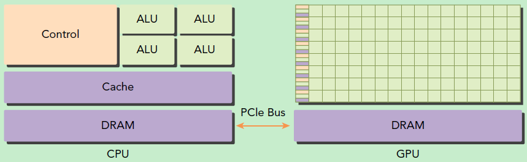
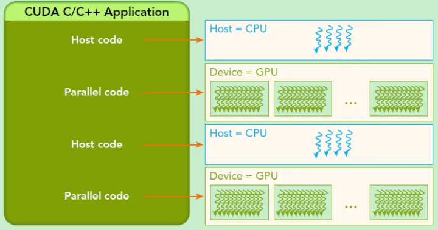
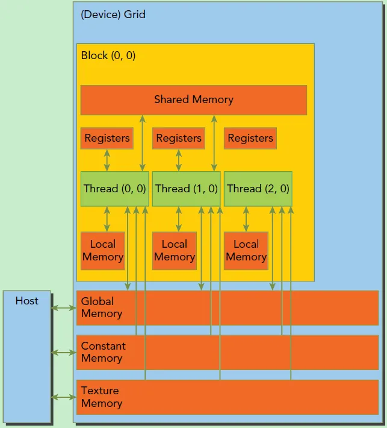
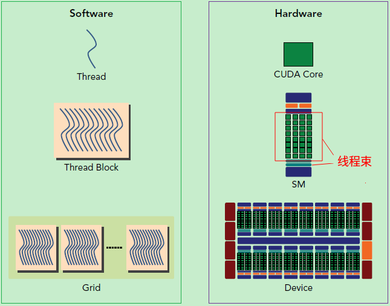
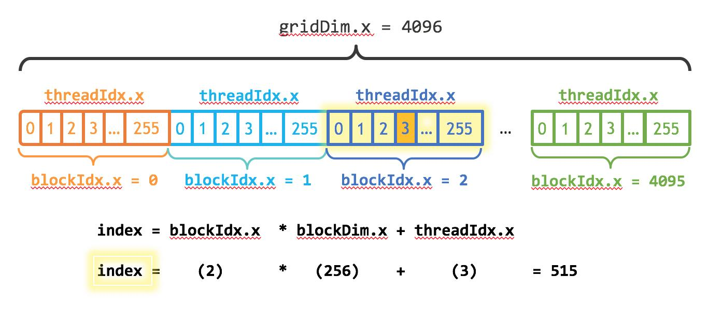
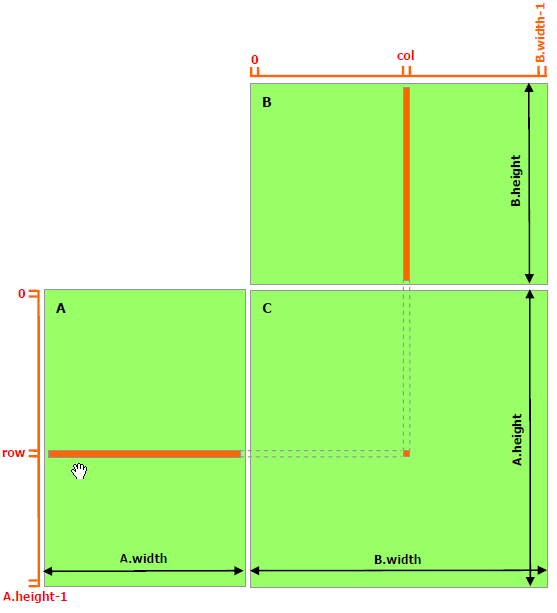

# CUDA

[CUDA 编程教程推荐](https://zhuanlan.zhihu.com/p/346910129)

# 0 环境搭建

```bash
# 查看电脑的显卡
lspci | grep -i vga
```

## 0.1 安装问题纪实

[nvidia 显卡驱动 安装最顺的教程](https://zhuanlan.zhihu.com/p/302692454)，推荐查看

- [配合食用：Ubuntu18.04 显卡驱动安装教程(解决各种疑难杂症)](https://zhuanlan.zhihu.com/p/463656273)

[选择显卡驱动版本和toolkit版本下载，不含安装报错的显卡驱动安装教程](https://blog.csdn.net/weixin_39928010/article/details/131142603)

[ubuntu cudnn 安装](https://blog.csdn.net/shanglianlm/article/details/130219640)

```bash
# 1. 安装驱动，下载local(run file)

# Error : your appear to running an x server；please exit x before installing .for further details
# 解决方案： https://blog.csdn.net/qq_32415217/article/details/123185645
sudo chmod +x NVIDIA-Linux-x86_64-535.54.03.run
sudo ./NVIDIA-Linux-x86_64-535.54.03.run -no-x-check

# ERROR: The Nouveau kernel driver is currently in use by your system. This driver is incompatible with the NVIDIA driver……
sudo vi /etc/modprobe.d/nvidia-installer-disable-nouveau.conf
# 在文件尾部添加，没有禁用过nouveau，是没有这个文件的。
blacklist nouveau
options nouveau modeset=0
# 更新上述修改
sudo update-initramfs -u
# 重启电脑，记得一定要重启电脑
reboot

# 2. 安装cuda toolkit
sudo chmod +x cuda_12.0.0_525.60.13_linux.run
sudo ./cuda_12.0.0_525.60.13_linux.run
# 提前安装了驱动，在cuda toolkit 中就不要安装gpu驱动

sudo gedit ~/.bashrc
# 添加两个环境变量
export PATH=/usr/local/cuda-11.3/bin${PATH:+:${PATH}}
export LD_LIBRARY_PATH=/usr/local/cuda11.3/lib64${LD_LIBRARY_PATH:+:${LD_LIBRARY_PATH}}
# 更新环境
source ~/.bashrc

# 测试是否安装成功
nvcc -V

# 3. 跑cuda sample 代码
# 下载sample代码。cuda toolkit安装包在11.6之后便不再安装sample代码，需要自行在github上下载，https://blog.csdn.net/qq_27273607/article/details/127499808
git clone -b v12.0 --depth=1 git@github.com:NVIDIA/cuda-samples.git

# gpu设备查询sample
cd cuda-samples/Samples/1_Utilities/deviceQuery

make
# make 执行，生成的可执行文件放在cuda-samples/bin/x86_64/linux/release
/usr/local/cuda/bin/nvcc -ccbin g++ -I../../../Common -m64 --threads 0 --std=c++11 -gencode arch=compute_50,code=sm_50 -gencode arch=compute_52,code=sm_52 -gencode arch=compute_60,code=sm_60 -gencode arch=compute_61,code=sm_61 -gencode arch=compute_70,code=sm_70 -gencode arch=compute_75,code=sm_75 -gencode arch=compute_80,code=sm_80 -gencode arch=compute_86,code=sm_86 -gencode arch=compute_90,code=sm_90 -gencode arch=compute_90,code=compute_90 -o deviceQuery.o -c deviceQuery.cpp
/usr/local/cuda/bin/nvcc -ccbin g++ -m64 -gencode arch=compute_50,code=sm_50 -gencode arch=compute_52,code=sm_52 -gencode arch=compute_60,code=sm_60 -gencode arch=compute_61,code=sm_61 -gencode arch=compute_70,code=sm_70 -gencode arch=compute_75,code=sm_75 -gencode arch=compute_80,code=sm_80 -gencode arch=compute_86,code=sm_86 -gencode arch=compute_90,code=sm_90 -gencode arch=compute_90,code=compute_90 -o deviceQuery deviceQuery.o 
mkdir -p ../../../bin/x86_64/linux/release
cp deviceQuery ../../../bin/x86_64/linux/release

# 这个文件夹下生成可执行文件deviceQuery
cd cuda-samples/bin/x86_64/linux/release
# 运行
./deviceQuery


./deviceQuery Starting...

 CUDA Device Query (Runtime API) version (CUDART static linking)

Detected 1 CUDA Capable device(s)

Device 0: "NVIDIA GeForce RTX 3060 Ti"
  CUDA Driver Version / Runtime Version          12.2 / 12.0
  CUDA Capability Major/Minor version number:    8.6
  Total amount of global memory:                 7972 MBytes (8359641088 bytes)
  (038) Multiprocessors, (128) CUDA Cores/MP:    4864 CUDA Cores
  GPU Max Clock rate:                            1695 MHz (1.70 GHz)
  Memory Clock rate:                             7001 Mhz
  Memory Bus Width:                              256-bit
  L2 Cache Size:                                 3145728 bytes
  Maximum Texture Dimension Size (x,y,z)         1D=(131072), 2D=(131072, 65536), 3D=(16384, 16384, 16384)
  Maximum Layered 1D Texture Size, (num) layers  1D=(32768), 2048 layers
  Maximum Layered 2D Texture Size, (num) layers  2D=(32768, 32768), 2048 layers
  Total amount of constant memory:               65536 bytes
  Total amount of shared memory per block:       49152 bytes
  Total shared memory per multiprocessor:        102400 bytes
  Total number of registers available per block: 65536
  Warp size:                                     32
  Maximum number of threads per multiprocessor:  1536
  Maximum number of threads per block:           1024
  Max dimension size of a thread block (x,y,z): (1024, 1024, 64)
  Max dimension size of a grid size    (x,y,z): (2147483647, 65535, 65535)
  Maximum memory pitch:                          2147483647 bytes
  Texture alignment:                             512 bytes
  Concurrent copy and kernel execution:          Yes with 2 copy engine(s)
  Run time limit on kernels:                     Yes
  Integrated GPU sharing Host Memory:            No
  Support host page-locked memory mapping:       Yes
  Alignment requirement for Surfaces:            Yes
  Device has ECC support:                        Disabled
  Device supports Unified Addressing (UVA):      Yes
  Device supports Managed Memory:                Yes
  Device supports Compute Preemption:            Yes
  Supports Cooperative Kernel Launch:            Yes
  Supports MultiDevice Co-op Kernel Launch:      Yes
  Device PCI Domain ID / Bus ID / location ID:   0 / 3 / 0
  Compute Mode:
     < Default (multiple host threads can use ::cudaSetDevice() with device simultaneously) >

deviceQuery, CUDA Driver = CUDART, CUDA Driver Version = 12.2, CUDA Runtime Version = 12.0, NumDevs = 1
Result = PASS
```


FLOPS——float-point Operation per Second，每秒浮点操作次数，GFLOPS——g（billion） FLOPS，TFLOPS—— T（1000g） FLOPS


```bash
# 查看cuda版本
nvidia-smi

+---------------------------------------------------------------------------------------+
| NVIDIA-SMI 535.54.03              Driver Version: 535.54.03    CUDA Version: 12.2     |
|-----------------------------------------+----------------------+----------------------+
| GPU  Name                 Persistence-M | Bus-Id        Disp.A | Volatile Uncorr. ECC |
| Fan  Temp   Perf          Pwr:Usage/Cap |         Memory-Usage | GPU-Util  Compute M. |
|                                         |                      |               MIG M. |
|=========================================+======================+======================|
|   0  NVIDIA GeForce RTX 3060 Ti     Off | 00000000:03:00.0  On |                  N/A |
|  0%   59C    P8              23W / 200W |   1109MiB /  8192MiB |      3%      Default |
|                                         |                      |                  N/A |
+-----------------------------------------+----------------------+----------------------+
                                                                                         
+---------------------------------------------------------------------------------------+
| Processes:                                                                            |
|  GPU   GI   CI        PID   Type   Process name                            GPU Memory |
|        ID   ID                                                             Usage      |
|=======================================================================================|
|    0   N/A  N/A      2317      G   /usr/lib/xorg/Xorg                          597MiB |
|    0   N/A  N/A      2439      G   ...libexec/gnome-remote-desktop-daemon        2MiB |
|    0   N/A  N/A     10182      G   /usr/bin/gnome-shell                         98MiB |
|    0   N/A  N/A     11550      G   ...ures=TFLiteLanguageDetectionEnabled      131MiB |
|    0   N/A  N/A     13633      G   ...ures=SpareRendererForSitePerProcess      109MiB |
|    0   N/A  N/A     23125      G   ...sion,SpareRendererForSitePerProcess       33MiB |
|    0   N/A  N/A    169621      G   ...irefox/3026/usr/lib/firefox/firefox      112MiB |
|    0   N/A  N/A    199079      G   ...ures=SpareRendererForSitePerProcess        3MiB |
+---------------------------------------------------------------------------------------+

```


## 0.2 helloworld

### 0.2.1 配置编译器

```bash
# ubuntu clion新建cuda工程
# https://blog.csdn.net/c991262331/article/details/109318565
# 发现创建后，自动运行的结果报
# No CMAKE_CUDA_COMPILER could be found，
# file->setting->build->cmake ，CMake options
# 配置cmake 编译参数
-DCMAKE_CUDA_COMPILER:PATH=/usr/local/cuda-12.0/bin/nvcc

# 如果仅添加上面一项，就会报
#CMake Warning:
#  Manually-specified variables were not used by the project:
#    CMAKE_CXX_COMPILER
# 	 CMAKE_C_COMPILER

# 所以加全应该是如下
-DCMAKE_C_COMPILER=/usr/bin/gcc -DCMAKE_CXX_COMPILER=/usr/bin/g++ -DCMAKE_CUDA_COMPILER:PATH=/usr/local/cuda-12.0/bin/nvcc

```

### 0.2.2 hello

```cmake
cmake_minimum_required(VERSION 3.25)
project(cudaDemo CUDA)

set(CMAKE_CUDA_STANDARD 17)
include_directories(/usr/include /usr/local/cuda-12.0/include)
add_executable(cudaDemo main.cu)

set_target_properties(cudaDemo PROPERTIES
        CUDA_SEPARABLE_COMPILATION ON)

```

[CUDA查询和选取设备信息](https://blog.csdn.net/dcrmg/article/details/54577709)

```c++
#include <iostream>
#include <cuda_runtime.h>
#include <device_launch_parameters.h>

int main() {

    int dev = 0;
    cudaDeviceProp deviceProp;
    cudaGetDeviceProperties(&deviceProp, dev);
    std::cout << "使用GPU device " << dev << ": " << deviceProp.name << std::endl;
    std::cout << "SM的数量：" << deviceProp.multiProcessorCount << std::endl;
    std::cout << "每个线程块的共享内存大小：" << deviceProp.sharedMemPerBlock / 1024.0 << " KB" << std::endl;
    std::cout << "每个线程块的最大线程数：" << deviceProp.maxThreadsPerBlock << std::endl;
    std::cout << "每个EM的最大线程数：" << deviceProp.maxThreadsPerMultiProcessor << std::endl;
    std::cout << "每个SM的最大线程束数：" << deviceProp.maxThreadsPerMultiProcessor / 32 << std::endl;
    std::cout << "Hello, World!" << std::endl;
    return 0;
    
/*  
	使用GPU device 0: NVIDIA GeForce RTX 3060 Ti
    SM的数量：38
    每个线程块的共享内存大小：48 KB
    每个线程块的最大线程数：1024
    每个EM的最大线程数：1536
    每个SM的最大线程束数：48
*/
}
```

```c++
// 硬件信息
struct cudaDeviceProp {
    char name[256]; // 识别设备的ASCII字符串（比如，"GeForce GTX 940M"）
    
    size_t totalGlobalMem; // 全局内存大小
    size_t sharedMemPerBlock; // 每个线程块block的共享内存大小
    
    int regsPerBlock; // 每个block 32位寄存器的个数
    int warpSize; // warp大小
    size_t memPitch; // 内存中允许的最大间距字节数
    
    int maxThreadsPerBlock; // 每个Block中最大的线程数是多少
    
    int maxThreadsDim[3]; // 一个块中每个维度的最大线程数
    int maxGridSize[3]; // 一个网格的每个维度的块数量
    size_t totalConstMem; // 可用恒定内存量
    int major; // 该设备计算能力的主要修订版号
    int minor; // 设备计算能力的小修订版本号
    int clockRate; // 时钟速率
    size_t textureAlignment; // 该设备对纹理对齐的要求
    int deviceOverlap; // 一个布尔值，表示该装置是否能够同时进行cudamemcpy()和内核执行
    
    int multiProcessorCount; // 设备上的处理器的数量,SM的数量
    int maxThreadsPerMultiProcessor; 	//每个EM的最大线程数,每个SM的最大线程束数 = maxThreadsPerMultiProcessor / 32
    
    int kernelExecTimeoutEnabled; // 一个布尔值，该值表示在该设备上执行的内核是否有运行时的限制
    int integrated; // 返回一个布尔值，表示设备是否是一个集成的GPU（即部分的芯片组、没有独立显卡等）
    int canMapHostMemory; // 表示设备是否可以映射到CUDA设备主机内存地址空间的布尔值
    int computeMode; // 一个值，该值表示该设备的计算模式：默认值，专有的，或禁止的
    int maxTexture1D; // 一维纹理内存最大值
    int maxTexture2D[2]; // 二维纹理内存最大值
    int maxTexture3D[3]; // 三维纹理内存最大值
    int maxTexture2DArray[3]; // 二维纹理阵列支持的最大尺寸
    int concurrentKernels; // 一个布尔值，该值表示该设备是否支持在同一上下文中同时执行多个内核
}
```


## 0.3 [初识和相关概念](https://zhuanlan.zhihu.com/p/34587739)

### 0.3.1 前言

GPU并不是一个独立运行的计算平台，而需要与CPU协同工作，可以看成是CPU的协处理器，因此当我们在说GPU并行计算时，其实是指的基于CPU+GPU的异构计算架构。

在异构计算架构中，GPU与CPU通过PCIe总线连接在一起来协同工作，CPU所在位置称为为主机端（host），而GPU所在位置称为设备端（device）



GPU包括更多的运算核心，其特别适合数据并行的计算密集型任务，如大型矩阵运算。

CPU的运算核心较少，但是其可以实现复杂的逻辑运算，因此其适合控制密集型任务。

另外，CPU上的线程是重量级的，上下文切换开销大，但是GPU由于存在很多核心，其线程是轻量级的。

因此，基于CPU+GPU的异构计算平台可以优势互补，CPU负责处理逻辑复杂的串行程序，而GPU重点处理数据密集型的并行计算程序，从而发挥最大功效。



CUDA是NVIDIA公司所开发的GPU编程模型，它提供了GPU编程的简易接口，基于CUDA编程可以构建基于GPU计算的应用程序。

CUDA提供了对其它编程语言的支持，如C/C++，Python，Fortran等语言

### 0.3.2 CUDA编程模型基础

CUDA编程模型是一个异构模型，需要CPU和GPU协同工作。

#### 概念：**host**和**device**

- host指代CPU及其内存
- device指代GPU及其内存。
- CUDA程序中既包含host程序，又包含device程序，它们分别在CPU和GPU上运行。同时，host与device之间可以进行通信，这样它们之间可以进行数据拷贝。
- 典型的CUDA程序的执行流程如下：
  1. 分配host内存，并进行数据初始化；

1. 分配device内存，并从host将数据拷贝到device上；
2. 调用CUDA的核函数在device上完成指定的运算；
3. 将device上的运算结果拷贝到host上；
4. 释放device和host上分配的内存


#### **kernel**

- kernel是在device上线程中并行执行的函数
- 函数类型区分：
  - `__global__`：
    - 在device上执行，从host中调用（一些特定的GPU也可以从device上调用）
    - 返回类型必须是`void`，不支持可变参数参数，不能成为类成员函数。
    - `__global__`定义的kernel是**异步**的，这意味着host不会等待kernel执行完就执行下一步。
  - `__device__`：在device上执行，单仅可以从device中调用
  - `__host__`：在host上执行，仅可以从host上调用，一般省略不写。可和`__device__`同时用，此时函数会在device和host都编译。


#### 线程结构的**层次**概念

- 第一层次网格grid：
  - kernel在device上执行时实际上是启动很多线程，一个kernel所启动的所有线程称为一个**网格**（grid），同一个网格上的线程共享相同的全局内存空间
- 第二层次线程块block：
  - 网格又可以分为很多**线程块**（block），线程块又包含许多线程。
- 第三层次线程thread
- 一个线程需要两个内置的坐标变量（blockIdx，threadIdx）来唯一标识，它们都是`dim3`类型变量，其中blockIdx指明线程所在grid中的位置，而threaIdx指明线程所在block中的位置


```c++
// Kernel定义
__global__ void MatAdd(float A[N][N], float B[N][N], float C[N][N]) 
{ 
    int i = blockIdx.x * blockDim.x + threadIdx.x; 
    int j = blockIdx.y * blockDim.y + threadIdx.y; 
    if (i < N && j < N) 
        C[i][j] = A[i][j] + B[i][j]; 
}
int main() 
{ 
    ...
    // Kernel 线程配置
    dim3 threadsPerBlock(16, 16); 
    dim3 numBlocks(N / threadsPerBlock.x, N / threadsPerBlock.y);
    // kernel调用
    MatAdd<<<numBlocks, threadsPerBlock>>>(A, B, C); 
    ...
}
```


#### 内存模型

每个线程有自己的私有本地内存（Local Memory）

而每个线程块有包含共享内存（Shared Memory），可以被线程块中所有线程共享，其生命周期与线程块一致。

此外，所有的线程都可以访问全局内存（Global Memory）。还可以访问一些只读内存块：常量内存（Constant Memory）和纹理内存（Texture Memory）。



#### 硬件

一个kernel实际上会启动很多线程，这些线程是逻辑上并行的，但是在物理层却并不一定。

- 多线程如果没有多核支持，在物理层是无法并行的。

GPU存在大量的CUDA核心，**GPU硬件的一个核心组件SM（Streaming Multiprocessor，流式多处理器）**

- SM的核心组件包括CUDA核心，共享内存，寄存器
- SM可以并发地执行数百个线程，并发能力就取决于SM所拥有的资源数

当一个kernel被执行时，它的gird中的线程块被分配到SM上，**一个线程块只能在一个SM上被调度**，SM一般可以调度多个线程块，这要看SM本身的能力。

一个kernel的各个线程块被分配多个SM，所以grid只是逻辑层，而SM才是执行的物理层。

**SM采用的是SIMT(Single-Instruction, Multiple-Thread，单指令多线程)架构**。

SM基本的执行单元是线程束（**warps**)，线程束包含32个线程，**这些线程同时执行相同的指令（kernel函数的多个代码行，经过编译翻译为多个指令）**，但是每个线程都包含自己的指令地址计数器和寄存器状态，也有自己独立的执行路径。

所以尽管线程束中的线程同时从同一程序地址执行，但是可能具有不同的行为，比如遇到了分支结构，一些线程可能进入这个分支，但是另外一些有可能不执行，它们只能死等（一人死干，多人围观），因为**GPU规定线程束中所有线程在同一周期执行相同的指令（因为条件结构造成分化，所以一个线程执行某个条件分支，其它线程只有等着该线程跳出该条件分支，才能继续向下执行相同的指令）**，线程束分化会导致性能下降。

当线程块被划分到某个SM上时，它将进一步划分为多个线程束，因为这才是SM的基本执行单元，但是一个SM同时并发的线程束数是有限的。这是因为资源限制，SM要为每个线程块分配共享内存，而也要为每个线程束中的线程分配独立的寄存器。所以SM的配置会影响其所支持的线程块和线程束并发数量。

**一个kernel的grid、block都是逻辑并发，而SM内的线程束才是物理并发。**一个kernel的所有线程其实在物理层是不一定同时并发的。所以kernel的grid和block的配置不同，性能会出现差异，这点是要特别注意的。

由于SM的基本执行单元是包含32个线程的线程束，所以block大小一般要设置为32的倍数。



在进行CUDA编程前，可以先检查一下自己的GPU的硬件配置，

## 0.4 向量运算实例

### 0.4.1 向量加法


```c++
// device上分配size字节的内存(显存)
cudaError_t cudaMalloc(void** devPtr, size_t size);
// 负责host和device之间数据通信
cudaError_t cudaMemcpy(void* dst, const void* src, size_t count, cudaMemcpyKind kind);
// src 数据源，dst 目标区域，count 字节数
// kind控制复制的方向：cudaMemcpyHostToHost, cudaMemcpyHostToDevice, cudaMemcpyDeviceToHost及cudaMemcpyDeviceToDevice，如cudaMemcpyHostToDevice将host上数据拷贝到device上。

```

实现一个向量加法的实例，这里grid和block都设计为1-dim，首先定义kernel如下：

```c++
#include <iostream>
#include <cuda_runtime.h>
#include <device_launch_parameters.h>

// 两个向量加法kernel，grid和block均为一维
__global__ void add(float* x, float * y, float* z, int n)
{
    // 获取全局索引
    int index = threadIdx.x + blockIdx.x * blockDim.x;
    // 步长
    int stride = blockDim.x * gridDim.x;
    for (int i = index; i < n; i += stride)
    {
        z[i] = x[i] + y[i];
    }
}
int main()
{
    int N = 1 << 20;
    int nBytes = N * sizeof(float);
    // 申请host内存
    float *x, *y, *z;
    x = (float*)malloc(nBytes);
    y = (float*)malloc(nBytes);
    z = (float*)malloc(nBytes);

    // 初始化数据
    for (int i = 0; i < N; ++i)
    {
        x[i] = 10.0;
        y[i] = 20.0;
    }

    // 申请device内存
    float *d_x, *d_y, *d_z;
    cudaMalloc((void**)&d_x, nBytes);
    cudaMalloc((void**)&d_y, nBytes);
    cudaMalloc((void**)&d_z, nBytes);

    // 将host数据拷贝到device
    cudaMemcpy((void*)d_x, (void*)x, nBytes, cudaMemcpyHostToDevice);
    cudaMemcpy((void*)d_y, (void*)y, nBytes, cudaMemcpyHostToDevice);
    // 定义kernel的执行配置
    dim3 blockSize(256);
    dim3 gridSize((N + blockSize.x - 1) / blockSize.x);
    // 执行kernel
    add << < gridSize, blockSize >> >(d_x, d_y, d_z, N);

    // 将device得到的结果拷贝到host
    cudaMemcpy((void*)z, (void*)d_z, nBytes, cudaMemcpyDeviceToHost);

    // 检查执行结果
    float maxError = 0.0;
    for (int i = 0; i < N; i++)
        maxError = fmax(maxError, fabs(z[i] - 30.0));
    std::cout << "最大误差: " << maxError << std::endl;

    // 释放device内存
    cudaFree(d_x);
    cudaFree(d_y);
    cudaFree(d_z);
    // 释放host内存
    free(x);
    free(y);
    free(z);

    return 0;
}

```

在上面的实现中，我们需要单独在host和device上进行内存分配，并且要进行数据拷贝，这是很容易出错的。好在CUDA 6.0引入统一内存（[Unified Memory](https://link.zhihu.com/?target=http%3A//docs.nvidia.com/cuda/cuda-c-programming-guide/index.html%23um-unified-memory-programming-hd)）来避免这种麻烦，简单来说就是统一内存使用一个托管内存来共同管理host和device中的内存，并且自动在host和device中进行数据传输。CUDA中使用cudaMallocManaged函数分配托管内存：

```c++
cudaError_t cudaMallocManaged(void **devPtr, size_t size, unsigned int flag=0);
```



```c++
int main()
{
    int N = 1 << 20;
    int nBytes = N * sizeof(float);

    // 申请托管内存
    float *x, *y, *z;
    cudaMallocManaged((void**)&x, nBytes);
    cudaMallocManaged((void**)&y, nBytes);
    cudaMallocManaged((void**)&z, nBytes);

    // 初始化数据
    for (int i = 0; i < N; ++i)
    {
        x[i] = 10.0;
        y[i] = 20.0;
    }

    // 定义kernel的执行配置
    dim3 blockSize(256);
    dim3 gridSize((N + blockSize.x - 1) / blockSize.x);
    // 执行kernel
    add << < gridSize, blockSize >> >(x, y, z, N);

    // 同步device 保证结果能正确访问
    cudaDeviceSynchronize();
    // 检查执行结果
    float maxError = 0.0;
    for (int i = 0; i < N; i++)
        maxError = fmax(maxError, fabs(z[i] - 30.0));
    std::cout << "最大误差: " << maxError << std::endl;

    // 释放内存
    cudaFree(x);
    cudaFree(y);
    cudaFree(z);

    return 0;
}
```


### 0.4.2 向量乘法



```c++
#include <iostream>
#include <cuda_runtime.h>
#include <device_launch_parameters.h>

// 矩阵类型，行优先，M(row, col) = *(M.elements + row * M.width + col)
struct Matrix
{
    int width;
    int height;
    float *elements;
};
// 获取矩阵A的(row, col)元素
__device__ float getElement(Matrix *A, int row, int col)
{
    return A->elements[row * A->width + col];
}

// 为矩阵A的(row, col)元素赋值
__device__ void setElement(Matrix *A, int row, int col, float value)
{
    A->elements[row * A->width + col] = value;
}

// 矩阵相乘kernel，2-D，每个线程计算一个元素
__global__ void matMulKernel(Matrix *A, Matrix *B, Matrix *C)
{
    float Cvalue = 0.0;
    int row = threadIdx.y + blockIdx.y * blockDim.y;
    int col = threadIdx.x + blockIdx.x * blockDim.x;
    for (int i = 0; i < A->width; ++i)
    {
        Cvalue += getElement(A, row, i) * getElement(B, i, col);
    }
    setElement(C, row, col, Cvalue);
}
int main()
{
    int width = 1 << 10;
    int height = 1 << 10;
    Matrix *A, *B, *C;
    // 申请托管内存
    cudaMallocManaged((void**)&A, sizeof(Matrix));
    cudaMallocManaged((void**)&B, sizeof(Matrix));
    cudaMallocManaged((void**)&C, sizeof(Matrix));
    int nBytes = width * height * sizeof(float);
    cudaMallocManaged((void**)&A->elements, nBytes);
    cudaMallocManaged((void**)&B->elements, nBytes);
    cudaMallocManaged((void**)&C->elements, nBytes);

    // 初始化数据
    A->height = height;
    A->width = width;
    B->height = height;
    B->width = width;
    C->height = height;
    C->width = width;
    for (int i = 0; i < width * height; ++i)
    {
        A->elements[i] = 1.0;
        B->elements[i] = 2.0;
    }

    // 定义kernel的执行配置
    dim3 blockSize(32, 32);
    dim3 gridSize((width + blockSize.x - 1) / blockSize.x,
                  (height + blockSize.y - 1) / blockSize.y);
    // 执行kernel
    matMulKernel << < gridSize, blockSize >> >(A, B, C);


    // 同步device 保证结果能正确访问
    cudaDeviceSynchronize();
    // 检查执行结果
    float maxError = 0.0;
    for (int i = 0; i < width * height; ++i)
        maxError = fmax(maxError, fabs(C->elements[i] - 2 * width));
    std::cout << "最大误差: " << maxError << std::endl;

    return 0;
}
```

