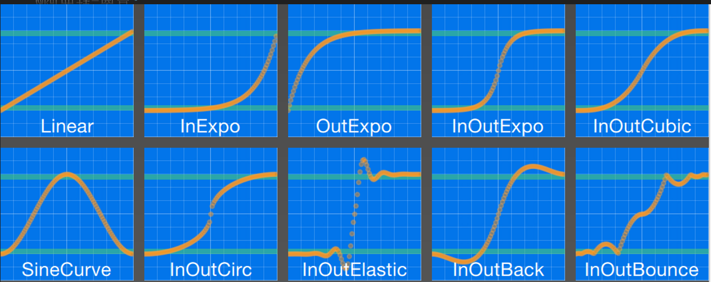
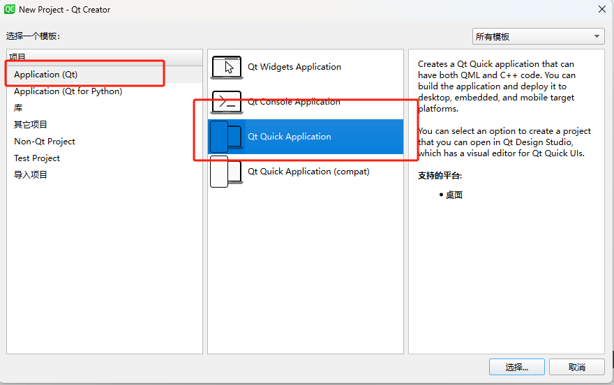
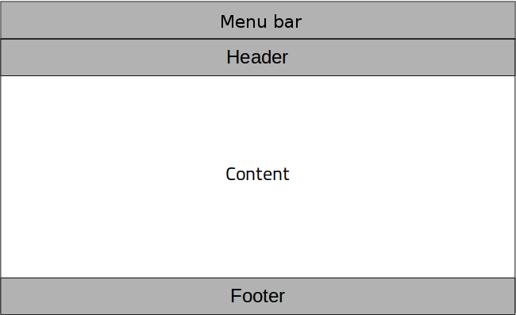
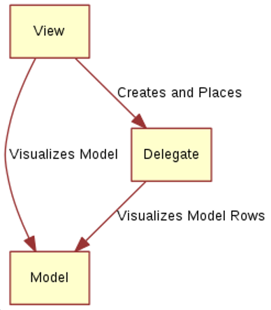
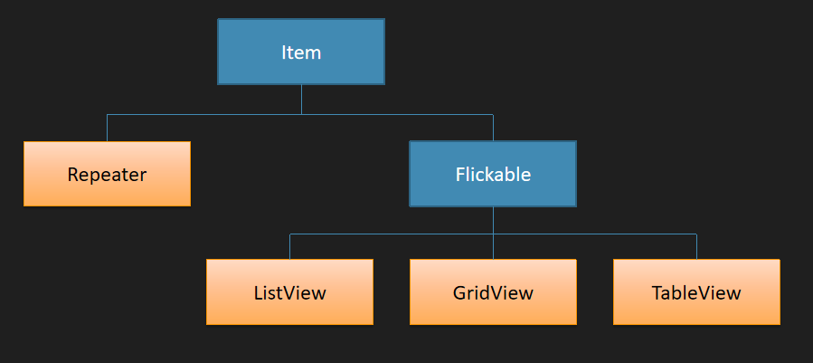
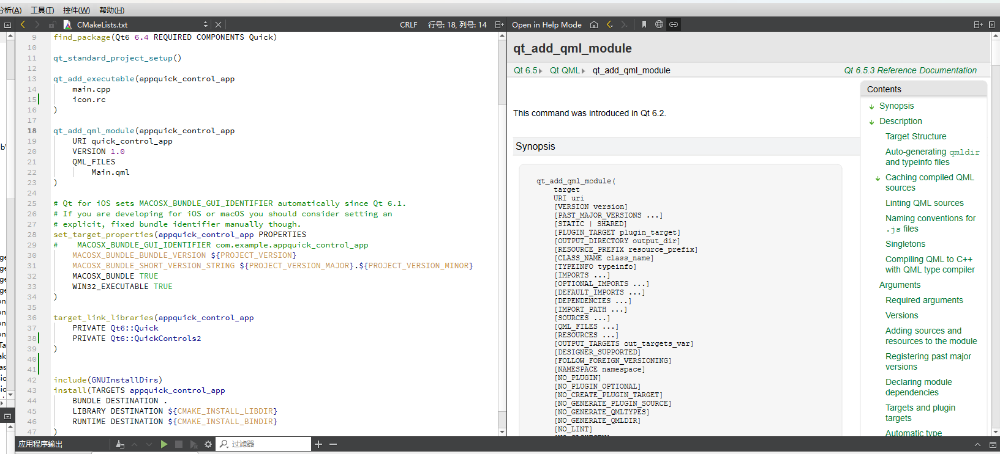

# QML

Qt Meta-object Language，是一种用户界面的标记语言。

UI分类：

- 命令式UI：
- 声明式UI：QML就是基于声明式UI，然后绑定模型，模型变化，UI发生变化，类似于MVC，MVVM

QML是一种用于描述对象如何相互关联的声明式语言，类似于HTML

Qt Quick是基于QML的框架

# 0 组件

## 0.1 helloworld

文件->new project

- 其他项目 -> Qt quick UI Prototype：会有一个.qml文件，您可以在其中设计UI并进行一些基本的交互逻辑。
- Application -> Qt Quick Application：除了.qml文件，通常还会生成一个C++源文件，用于扩展您的QML应用程序。


### Quick Application

```c++
// main.cpp
#include <QGuiApplication>
#include <QQmlApplicationEngine>

int main(int argc, char *argv[])
{
    QGuiApplication app(argc, argv);

    QQmlApplicationEngine engine;
    const QUrl url(QStringLiteral("qrc:/qml_base_app/Main.qml"));
    QObject::connect(
        &engine,
        &QQmlApplicationEngine::objectCreationFailed,
        &app,
        []() { QCoreApplication::exit(-1); },
        Qt::QueuedConnection);
    engine.load(url);

    return app.exec();
}
```

main.qml和prototype创建的一致。

application还有一个CMakeLists.txt

```cmake
cmake_minimum_required(VERSION 3.16)

project(qml_base_app VERSION 0.1 LANGUAGES CXX)

set(CMAKE_CXX_STANDARD_REQUIRED ON)

find_package(Qt6 6.4 REQUIRED COMPONENTS Quick)

qt_standard_project_setup()

qt_add_executable(appqml_base_app
    main.cpp
)

qt_add_qml_module(appqml_base_app
    URI qml_base_app
    VERSION 1.0
    QML_FILES
        Main.qml
)

# Qt for iOS sets MACOSX_BUNDLE_GUI_IDENTIFIER automatically since Qt 6.1.
# If you are developing for iOS or macOS you should consider setting an
# explicit, fixed bundle identifier manually though.
set_target_properties(appqml_base_app PROPERTIES
#    MACOSX_BUNDLE_GUI_IDENTIFIER com.example.appqml_base_app
    MACOSX_BUNDLE_BUNDLE_VERSION ${PROJECT_VERSION}
    MACOSX_BUNDLE_SHORT_VERSION_STRING ${PROJECT_VERSION_MAJOR}.${PROJECT_VERSION_MINOR}
    MACOSX_BUNDLE TRUE
    WIN32_EXECUTABLE TRUE
)

target_link_libraries(appqml_base_app
    PRIVATE Qt6::Quick
)

include(GNUInstallDirs)
install(TARGETS appqml_base_app
    BUNDLE DESTINATION .
    LIBRARY DESTINATION ${CMAKE_INSTALL_LIBDIR}
    RUNTIME DESTINATION ${CMAKE_INSTALL_BINDIR}
)
```


### UI Prototype

下面这个应用是使用 Qt quick UI Prototype构建的。在第0和第1章都将使用到这种创建方式。

```q
import QtQuick

Rectangle{
    id:root
    width:600
    height:600

    Text {
        id:thisLabel

        // 定位
        x:100; y:100

        // 属性依赖
        height: 2 * width

        Rectangle{
            anchors.fill: parent
            color: "yellow"
            z:parent.z -1
        }

        // 自定义属性
        property int times:24

        // 属性别名，可以被文档外访问
        property alias anotherTimes: thisLabel.times

        text: "thislabel" + anotherTimes

        // 组属性
        font.family: "Blod"
        font.pixelSize: 24
        /*
        font{
                family: "Blod"
                pixelSize: 24
            }
        */

        // 事件处理
        onHeightChanged: console.log('height', height)

        // 按tab键后会跳到thatLabel对象上
        KeyNavigation.tab: thatLabel
		
        focus:true
        color: focus ? "red": "green"

    }
    Text {
        id: thatLabel
        text: "thatLabel " + thisLabel.times
        focus: !thisLabel.focus
        KeyNavigation.tab: thisLabel
        color: focus ? "red": "green"

        // 使用js函数
        Keys.onSpacePressed: increment()
        // Keys.onSpacePressed: {
        //     increment()
        // }

        // 直接执行js代码
        Keys.onEscapePressed: {
            thisLabel.times -= 1
            this.text = 'thatLabel'+ thisLabel.times
        }

        // 可使用箭头函数
        onTextChanged: (text) => {
            console.log("text changed to ", text)
        }
        // onTextChanged: function(text){
        //     console.log("text changed to ", text)
        // }

        // 定义js函数
        function increment(){
            thisLabel.times += 1;
        }
    }

    Image{
        id:image
        source: "../images/pinwheel.jpg"
        width: 300

        fillMode: Image.PreserveAspectFit
        x:(root.width - width)/2; y:400
    }

}
```

1. import 语句导入模块，qt 5 中还需要在模块后面加版本号，而qt 6 不需要版本号，会自动加载最高版本
2. 对象
   - 每个QML文档有且只有一个根对象（根元素），对象可以嵌套。
   - 对象名就是类型名，以大写字母开头，后面跟一对`{ }`，花括号中是该对象的属性
3. 属性
   - 属性以键值对 “ 属性名: 值 ” 形式给出，同一行若出现多个属性需要用“  ;  ”隔开，行与行之间则无需分号隔开
   - **子对象可以使用 `parent`关键字访问父对象**，anchors属性通常涉及到布局
   - **QML中子对象也可视为父对象的属性**
   - **属性可以依赖于其他属性（或其他对象的属性）**
   - `property限定符`
     - 向元素添加新属性，格式：`property <类型> <新属性名>:<值>`
   - 属性别名
     - 属性也可以有别名，QML使用alias关键字声明属性别名，`property alias 别名: 属性名`
     - **定义别名的目的是为了在外部QML文档中也能访问当前别名属性。**
4. 对象标识符
   - 每一个对象都可以指定一个唯一的id值（当前文档唯一），id无法被改变
   - 在对象所在的QML文档中的任何地方，都可以通过该对象的**id来引用该对象**
5. 注释
   - 单行注释：`//`
   - 多行注释：`/* */`

## 0.2 元素和组件

### 0.2.1 元素

元素可以分为视觉元素和非视觉元素

- 视觉元素（eg：Rectangle）
- 非视觉元素（eg：timer）提供一般功能，通常用于控制视觉元素

**Item是所有视觉元素的基础元素（类）**，

- 因此所有其他视觉元素都从Item继承，它本身不绘制任何东西，但定义了视觉元素的共同属性
- 包括：几何属性（x,y,width,height）
- 布局处理（anchors）
- 键处理（Keys, Navication），
- 变换（scale，rotate，transform，transformerOrigin）
- 视觉（opacity，visible，clip，smooth）
- 状态定义（states）

核心可视元素

- Rectangle：绘制矩形
- Text：显示文本
- Image：显示图像

### 0.2.2 组件

右击工程-> add New -> Qt -> QML file

组件调用方只能修改根元素的属性，设置子元素的属性将无效，除非根元素和子元素拥有同样的属性

如果要在调用方设置组件里子元素的属性需要在根元素通过property alias声明属性别名

**使用“this”解决属性绑定的歧义**

```q
// 组件Button

import QtQuick


Rectangle{
    id: button
	// 对外暴露属性
    property alias text: label.text
	// 对外暴露信号
    signal clicked


    x:12;y:12
    width:116;height:26
    color:"lightsteelblue"
    border.color:"slategrey"
    Text{
        id: label
        anchors.centerIn: parent
        text:"start"
    }

    MouseArea{
        anchors.fill: parent
		// 触发信号事件
        onClicked:{
            button.clicked()
        }
    }
}


// 如果只想暴露text和clicked信号，那么可以在Rectangle外加一个Item，调用方只能修改根元素的属性，设置子元素的属性将无效，除非根元素和子元素拥有同样的属性
import QtQuick

Item{
    id:root
    property alias text: label.text
    signal clicked
    Rectangle{
        id: button
        x:12;y:12
        width:116;height:26
        color:"lightsteelblue"
        border.color:"slategrey"
        Text{
            id: label
            anchors.centerIn: parent
            text:"start"
        }
        MouseArea{
            anchors.fill: parent
			// 触发信号事件
            onClicked:{
				// 这里要设置为根元素的id
                root.clicked()
            }
        }
    }
}
```

```q
// 调用方

import QtQuick

Window{
    id: root
    width: 400
    height:260
    visible:true
    title:"component"
	
	//使用组件，这里的属性可以是组件根元素的所有属性
    Button{
      text: "开始"
	  color: "yellow"	// 如果使用第一种组件声明方式，
      onClicked: {		// 事件处理函数
        text1.text = "按钮被点击"
      }
    }

    Text {
        id: text1
        x:12
        y:76
        width:116
        height: 26
        text:"waiting..."
        horizontalAlignment: Text.AlignHCenter
    }
}
```

### 0.2.3 [组件交互](https://blog.csdn.net/qq_35662333/article/details/140108539)

1. 子组件通过父组件的id直接引用父组件的全部组件和属性值。（缺点：子组件中父组件的id是写死的，不灵活）

   ```q
   // 父界面
   import QtQuick 2.15
   import QtQuick.Layouts 1.15
   import QtQuick.Controls 1.4
   
   ColumnLayout {
       anchors.fill: parent
       Rectangle {
           id: rootRec
           Layout.fillWidth: true
           Layout.preferredHeight: Math.round(parent.height / 5)
           color: "gray"
           opacity: 0.5
           Text {
               id: rootRecSize
               text: rootRec.width + " * " + rootRec.height
               font.pixelSize: 22
               anchors.centerIn: parent
           }
       }
   
       // 子界面
       SecondPane {
           Layout.alignment: Qt.AlignHCenter
           Layout.topMargin: 50
           Layout.fillWidth: true
           Layout.preferredHeight: 80
       }
   }
   
   // 子界面
   import QtQuick 2.15
   import QtQuick.Controls 1.4
   
   TextField {
       id: secondText
       // 内部明确size, 便于预览效果，   实际size在调用处再次设置
       width: 200
       // 子界面可以直接调用父界面的组件
       text: "second call root:  " + rootRecSize.text						// 通过父组件id，
       font.pixelSize: 20
       horizontalAlignment: Qt.AlignHCenter
       verticalAlignment: Qt.AlignVCenter
   }
   
   
   
   ```

   

2. [属性绑定](https://zhuanlan.zhihu.com/p/561088573)：

   - 使用冒号进行单向绑定

     ```q
     Text {
             id: text1
             x: 205
             y: 176
             width: 230
             height: 40
             //将slider的value属性与text1的text进行绑定。当slider的value的值改变时将会改变text1的显示文本。
             text: qsTr("%1".arg(slider.value))
             font.pixelSize: 33
             horizontalAlignment: Text.AlignHCenter
             verticalAlignment: Text.AlignVCenter
         }
     ```

     

   - **在属性绑定中，静态值的赋值将删除对象之间的绑定**。

     ```q
     Window {
         id: window
         width: 640
         height: 480
         visible: true
         color: "#99c4e9"
         title: qsTr("Hello World")
     
         Text {
             id: text1
             x: 205
             y: 176
             width: 230
             height: 40
             text: qsTr("%1".arg(slider.value))
             font.pixelSize: 33
             horizontalAlignment: Text.AlignHCenter
             verticalAlignment: Text.AlignVCenter
         }
     
         Button {
             id: button
             x: 270
             y: 253
             text: qsTr("点击我")
             onClicked:
             {
                 //如果此点击事件处理函数得以执行，那么text1的text属性将被重新赋值为“999”。此后
                 //text1对象将与slider对象解除绑定。【那么再滑动slider，text1的文本将不会改变】
                 text1.text = qsTr("999");
             }
         }
     
         Slider {
             id: slider
             x: 459
             y: 105
             width: 40
             height: 315
             to: 100
             orientation: Qt.Vertical
             value: 0
         }
     }
     ```

   - 两个对象之间各做一次属性绑定，即可实现双向绑定。

3. 信号传递

4. 条件信号传递connect

5. Connections

## 0.3 [布局](https://blog.csdn.net/weixin_42219627/article/details/134771466)

### 0.3.1 定位器

定位器是QML中专用于定位的一类元素，主要有：ROW，Column，Grid，Flow

```q
import QtQuick

// 红色组件
Rectangle {
    width:48
    height:48
    color:"red"
    border.color:Qt.lighter(color)
}

Rectangle {
    width:48
    height:48
    color:"green"
    border.color:Qt.lighter(color)
}

Rectangle {
    width:48
    height:48
    color:"blue"
    border.color:Qt.lighter(color)
}

Rectangle {
    width:48
    height:48
    color:"gray"
    border.color:Qt.lighter(color)
}


// 调用者
DarkSqure{
    id: root
    width: 400
    height: 260
	
	// 列布局
    Column{
        anchors.centerIn: parent
        spacing: 10
        RedSquare{}
        GreenSquare{
            width: 96
        }
        BlueSquare{}
    }
	
	// 行布局
	Row{
        anchors.centerIn: parent
        spacing: 10
        RedSquare{}
        GreenSquare{
            width: 90
        }
        BlueSquare{}
    }
	
	// 网格布局
	Grid{
        anchors.centerIn: parent
        spacing: 20
        rows:2
        columns:3		// 默认值为4
        RedSquare{}
        GreenSquare{}
        BlueSquare{}
        RedSquare{}
        GreenSquare{}
        BlueSquare{}
    }

	// 流布局
	Flow{
        anchors.fill:parent
        anchors.margins: 20
        spacing: 20
        RedSquare{}
        GreenSquare{}
        BlueSquare{}
        RedSquare{}
        GreenSquare{}
        BlueSquare{}
    }
}


```

### 0.3.2 repeater渲染

repeater重复器，他可以重复创建任何QML基本的可视元素

```q
import QtQuick

DarkSqure{
    id: root
    width: 400
    height: 260
	property var colorArray: ["#00bde3","#67c111","#ea7025"]

    Grid{
        anchors.centerIn: parent
        anchors.margins: 8
        spacing: 4
		// columns默认为4

        Repeater{
            model:16		// Repeater会按照其model属性定义的个数循环生成子元素
            Rectangle{
                id:rect         //Repeater会为每个子元素注入一个id属性，并赋值给你声明的变量，在这里为rect
                property int colorIndex: Math.floor(Math.random() * 3)
                color:root.colorArray[colorIndex]
                width: 56
                height: 56
                Text{
                    anchors.centerIn: parent
					color:"white"
                    text:"Cell" + index         //Repeater会为每个子元素注入一个index属性，作为当前循环索引
                    // rect.Positioner.index与index值相同
                }
            }
        }
    }
}
```


### 0.3.3 anchor锚


每个元素都可被认为有一组无形的 “锚线”：

- left，right，top，bottom，horizontalCenter，verticalCenter

锚系统还允许为一个元素的锚指定边距（margin）和偏移（offset）

- 边距指定了元素锚到外边界的空间量：topMargin，rightMargin，bottomMargin，leftMargin
- 偏移允许使用中心锚线来定位：horizontalCenterOffset，verticalCenterOffset，baselineOffset（对于Text元素才有，对于没有文本的元素它与top相当）
- fill属性用于将一个元素充满另一个元素

以上属性均对应于元素中的anchors.left，anchors.right属性组内的属性。

只能在父子或兄弟元素之间才能使用锚。基于锚的布局谨慎与其他布局、绝对的位置定义（直接设置x，y）混合使用，否则会出现不确定的结果


```q
// 组件

import QtQuick

//GreenSquare
Rectangle{
    width: 100; height: 100
    color:'green'
    border.color: Qt.lighter(color)
}

//BlueSquare
Rectangle{
    width: 50; height: 50
    color:'blue'
    border.color: Qt.lighter(color)

    property alias text: label.text
    Text {
        id: label
        text: qsTr("text")
        color:'white'
        anchors.centerIn: parent
    }
}
```

```q
// 调用
import QtQuick

Window {
    width: 640
    height: 480
    visible: true
    title: qsTr("layout")

    GreenSquare{
        //        BlueSquare{
        //            text: '(1)'
        //            anchors.fill: parent
        //            anchors.margins: 8
        //        }

        //        BlueSquare{
        //            text: '(2)'
        //            anchors.left: parent.left
        //            y:8
        //            anchors.margins: 8
        //        }

        //        BlueSquare{
        //            text: '(3)'
        //            anchors.left: parent.right
        //        }

        //        BlueSquare{
        //            id:blue1
        //            text: '(4-1)'
        //            //anchors.top: parent.top
        //            y:8
        //            anchors.horizontalCenter: parent.horizontalCenter
        //            anchors.margins: 8
        //            height: 25

        //        }
        //        BlueSquare{
        //            text: '(4-2)'
        //            //anchors.top: parent.top
        //            width: 75
        //            anchors.top: blue1.bottom
        //            anchors.horizontalCenter: parent.horizontalCenter
        //            anchors.margins: 8
        //            height: 25

        //        }

//        BlueSquare{
//            text: '(5)'
//            anchors.centerIn: parent
//        }

        BlueSquare{
            text: '(6)'
            anchors.horizontalCenter: parent.horizontalCenter
            anchors.verticalCenter: parent.verticalCenter
            anchors.horizontalCenterOffset: -12
        }
    }
}
```

### 0.3.4 布局管理器

定位器中的布局方式，除了anchors.fill外，都没有对元素宽高进行调整，实际很多情况下，当窗口大小调整后，希望元素的大小能自适应窗口大小的变化。而布局管理器则是为了处理这种情况而出现的。

```q
import QtQuick.Layouts
RowLayout {
    anchors.fill: parent
    spacing: 5

    Rectangle {
        Layout.preferredWidth: 100
        Layout.fillHeight: true
        color: "gold"
    }

    Rectangle {
        Layout.fillWidth: true
        Layout.fillHeight: true
        color: "lightseagreen"
    }

    Rectangle {
        Layout.preferredWidth: 100
        Layout.fillHeight: true
        color: "lightcoral"
    }
}

//布局管理器实现方式与定位器类似，都是管理子元素的位置信息，在使用时需要注意，原本的width、height将不再生效，取而代之的是附加属性Layout.preferredWidth、Layout.preferredHeight或是隐式宽高implicitWidth、implicitHeight，推荐使用附加属性。
```

#### RowLayout、ColumnLayout

RowLayout、ColumnLayout为行布局和列布局,用法与Row、Column类似，附加属性Layout有很多参数可以调节，如fillWidth、maximumWidth、minimumWidth、margins等等。

#### GridLayout

GridLayout为[栅格布局](https://so.csdn.net/so/search?q=栅格布局&spm=1001.2101.3001.7020)，用法与Grid类似，主要是通过附加属性Layout.row、Layout.column调整行号、列号，以此完成特殊的表单布局。

#### StackLayout

StackLayout为栈布局，主要用于多页签切换使用

## 0.4 事件处理

### 0.4.1 鼠标事件

与以前的窗口部件不同，在QML中如果一个元素想要处理鼠标事件，则要在其上放置一个MouseArea元素（鼠标输入元素），也就是说，用户只能在MouseArea确定的范围内进行鼠标的动作。

```q
import QtQuick


Rectangle{
    id: button
	// 对外暴露属性
    property alias text: label.text
	// 对外暴露信号
    signal clicked

    x:12;y:12
    width:116;height:26
    color:"lightsteelblue"
    border.color:"slategrey"
    Text{
        id: label
        anchors.centerIn: parent
        text:"start"
    }

    MouseArea{
        anchors.fill: parent
		// 触发信号事件
        onClicked:{
            button.clicked()
        }
    }
}
```

```q
// 调用方

import QtQuick

Window{
    id: root
    width: 400
    height:260
    visible:true
    title:"component"
	
	//使用组件，这里的属性可以是组件根元素的所有属性
    Button{
      text: "开始"
	  color: "yellow"	// 如果使用第一种组件声明方式，
      onClicked: {		// 事件处理函数
        text1.text = "按钮被点击"
      }
    }

    Text {
        id: text1
        x:12
        y:76
        width:116
        height: 26
        text:"waiting..."
        horizontalAlignment: Text.AlignHCenter
    }
}
```


### 0.4.2 键盘事件

当一个按键被按下或释放，都会产生一个键盘事件，并将其传递给获得了焦点的QML元素。

在QML中，Keys属性提供了基本的键盘事件处理器，所有可视元素都可以通过它来进行按键的处理。


```q
DarkSqure{
    id: root
    width: 400
    height: 260

   Rectangle{
        id:square
        color:'green'
        width:100
        height:width
   }

   focus:true
   Keys.onLeftPressed: square.x -=8								// 左箭头
   Keys.onRightPressed: square.x +=8							// 右箭头
   Keys.onUpPressed: square.y -=8								// 上箭头
   Keys.onDownPressed: square.y +=8								// 下箭头
   Keys.onPressed: function (event){
       switch(event.key){

        case Qt.Key_Plus:square.scale += 0.2;break;			// 加号键，放大
        case Qt.Key_Minus:square.scale -= 0.2;break;		// 减号键，缩小

       }
   }

}
```


### 0.4.3 输入控件与焦点

QML用于接收键盘输入的有两个元素：

1. TextInput：单行文本输入，支持验证器，输入掩码和现实模式，与QLineEdit不同，它只有一个闪动的光标和用户输入的文本，没有边框等可视元素
2. TextEdit

```q
// 组件TextInputBox
import QtQuick
FocusScope {		// FocusScope元素中：当焦点作用域接收焦点时，焦点为true的最后一个子元素接收焦点。因此它将焦点转发到最后一个请求焦点的子元素。
    property alias label: label.text			// 向外暴露标签文本
    property alias text: input.text				// 向外暴露内部输入框的输入内容
    Row {										// 水平布局
        spacing: 5
        Text {									//输入提示文本
            id: label
            text: "标签"
        }
        Rectangle{								
            width: 100
            height: 20
            color: "white"						//白底色
            border.color: "gray"					//灰色边框
            TextInput {							
                id: input
                anchors.fill: parent				//充满矩形
                anchors.margins: 4
                focus: true						//捕捉焦点
                text: "请输入内容..."				//初始文本
            }
        }
    }
}
```

```q
// 调用
import QtQuick

BrightSqure{
    id: root
    width: 400
    height: 260

    TextInputBox{
        id:tib1
        x:25;y:25
        focus:true
        label:"学号"
        text: focus?"":"请输入内容"
        KeyNavigation.tab:tib2
    }
    TextInputBox{
        id:tib2
        x:25;y:60
        label:"姓名"
        text: focus?"":"请输入内容"
        KeyNavigation.tab:tib1
    }
}
```

# 1 动画

Animation元素

- 所有的动画元素都继承自Animation元素。
- 尽管它本身无法直接创建对象，但却为其他各种动画元素提供了通用的属性和方法，例如：running属性，start()，stop()方法控制动画的启停，用loops属性设定动画的循环次数

## 1.1 PropertyAnimation

PropertyAnimation（属性动画元素）

- 用来为属性提供动画的最基本的动画元素，直接继承Animation
- 可以用来为real，int，color，rect，point，size和vector3d等属性设置动画
- 其他动画类型元素大多继承于PropertyAnimation，
  - NumberAnimation：为实数和整数类属性提供更高效的实现
  - ColorAnimation：颜色属性
  - RotationAnimation：旋转属性
  - Vectior3dAnimation：矢量3d属性

```q

import QtQuick
DarkSquare{
    id:root
    width: 600
    height:300
    property int padding: 40
    property bool running: false
    GreenSquare{
        id:qq
        x:root.padding;y:(root.height-height)/2
        width:100
        height:100

        // 下面的动画元素都可以使用PropertyAnimation元素替代
        NumberAnimation on x{
            to:root.width-qq.width-root.padding                 // 在动画结束时达到的目标值，还有个属性叫from
            duration: 3000                                      // 动画时长
            running:root.running                                // 指定什么时候开始
        }

        RotationAnimator on rotation{
            to:360
            duration: 3000
            running:root.running
        }

    }
    OpacityAnimator on opacity{
        target: qq              // 也可以写在控制元素的外面，使用target属性指定动画应用的对象
        to:0
        duration: 3000
        running:root.running
    }

    MouseArea{
        anchors.fill: parent
        onClicked: root.running = true
    }
}

```

### 动画执行时机

- 属性上的动画（PropertyAnimation on）：在元素完全加载后自动运行
- 属性上的行为（Behavior on）：属性值更改时自动运行
- 独立动画（standalone）：使用start()显式启动动画或将running设置为true时运行

```q
// 组件ClickableImage
import QtQuick 

Item { 
    id: root 
    width: container.childrenRect.width 
    height: container.childrenRect.height 
    property alias text: label.text 
    property alias source: image.source 
    signal clicked 

    Column { 
    	id: container 

        Image { 
        	id: image 
        } 

        Text { 
            id: label 
            width: image.width 
            horizontalAlignment: Text.AlignHCenter 
            wrapMode: Text.WordWrap 
            color: "#ececec" 
        } 
    } 

    MouseArea { 
        anchors.fill: parent 
        onClicked: root.clicked() 
    } 
} 

```

```q
Window {
    id:root
    width: 640
    height: 480
    visible: true
    title: qsTr("Hello World")
    color:'gray'

	// 属性上的动画（PropertyAnimation on）：在元素完全加载后自动运行
    ClickableImage {
        id: qq1 
        x: 40; y: root.height-height 
        source: "assets/box_green.png" 
        text: qsTr("animation on property") 

        NumberAnimation on y { 
            to: 40; duration: 4000 
        } 
    }
	
	// 属性上的行为（Behavior on）：属性值更改时自动运行
    ClickableImage { 
        id: qq2 
        x: (root.width-width)/2; y: root.height-height 
        source: "assets/box_blue.png" 
        text: qsTr("behavior on property") 
        Behavior on y { 
        	NumberAnimation { duration: 4000 } 
        } 

        onClicked: y = 40 
        // random y on each click 
        // onClicked: y = 40 + Math.random() * (205-40) 
    } 
	
	// 独立动画
	ClickableImage{
        id:qq3
        x:qq2.x+qq1.width+20;y:root.height-height
        source:"../images/qq.png"
        text:"animation on property"
       // onClicked: anim.restart()

        NumberAnimation{
            id:anim
            target:qq3
            from:root.height-qq3.height
            to:40;duration:3000
            property:"y"
            running:area.pressed
        }

        MouseArea{
            id:area
            anchors.fill: parent
        }
    }


}

```

## 1.2 缓动曲线



```q
EasingType { 
    easingType: Easing.Linear 
    onClicked: { 
    	animation.easing.type = easingType
		box.toggle = !box.toggle 
    } 
}
……
Rectangle { 
……
    Behavior on x {
        NumberAnimation { 
        	id: animation 
        	duration: 500 
        }
	}
}

```

## 1.3 分组动画


## 1.4 状态与切换

Qt quick允许用户在State对象中声明各种不同的UI状态

# 2 内置组件

Qt Quick Controls是自qt 5.1 开始引入的QML模块，它提供了大量类似于Qt Widgets那样可以重用的UI 组件，eg：按钮，菜单，对话框，视图等，这些组件具备很好的跨平台性能。

## 2.1 ApplicationWindow



ApplicationWindow的布局如图：



### 静态资源加载

```cmake
# 搜索 images 目录中的所有 png 文件
file(GLOB_RECURSE RESOURCE_FILES "images/*.png")

# 生成资源文件列表
set(RESOURCE_FILES_XML "")
foreach(RESOURCE_FILE ${RESOURCE_FILES})
    file(RELATIVE_PATH RELATIVE_RESOURCE_FILE ${CMAKE_SOURCE_DIR} ${RESOURCE_FILE})
    set(RESOURCE_FILES_XML "${RESOURCE_FILES_XML}    <file>${RELATIVE_RESOURCE_FILE}</file>\n")
endforeach()

# 生成 resources.qrc 文件
set(QRC_CONTENT "<RCC>\n  <qresource prefix=\"/\">\n${RESOURCE_FILES_XML}  </qresource>\n</RCC>\n")
file(WRITE ${CMAKE_BINARY_DIR}/resources.qrc ${QRC_CONTENT})

# 添加资源文件到项目中
qt6_add_resources(QRC_FILES ${CMAKE_BINARY_DIR}/resources.qrc)

# 这里只生成了qrc文件，却没有将images文件夹整个复制到build目录下
# 所以如果还要自动一点的话，在编译完成后，还需要将对应的images文件夹整个复制过去

qt_add_executable(appquick_control_desktop
    main.cpp
    icon.rc
    ${QRC_FILES}
)
```


### 风格控制

- Default：默认样式，具有基础的外观和感觉，适用于各种平台。
- Fusion：一个统一的样式，具有干净、现代的外观，适用于跨平台应用。
- Imagine
- Material：基于 Google Material Design 指南的样式，具有现代化和一致的外观，非常适合 Android 应用和其他希望使用 Material Design 风格的应用。
- Universal：基于 Microsoft Universal Windows Platform (UWP) 风格的样式
- Basic：轻量级的样式，旨在提供基本的控件外观，不包含任何平台特定的定制。适合需要最小化资源使用的情况。
- Windows：模仿了早期 Windows 操作系统的外观。
- Macintosh：模仿了早期 macOS 操作系统的外观

```cma
find_package(Qt6 REQUIRED COMPONENTS QuickControls2)
target_link_libraries(appquick_control_desktop
    PRIVATE Qt6::QuickControls2
)
```

```c++
#include <QGuiApplication>
#include <QQmlApplicationEngine>
#include <QQuickStyle>			//风格头文件
int main(int argc, char *argv[])
{
    QGuiApplication app(argc, argv);

    // 设置主题风格
    QQuickStyle::setStyle("Material");		// 桌面应用风格
    // QQuickStyle::setStyle("Fusion");		// 移动端风格

    QQmlApplicationEngine engine;
    const QUrl url(QStringLiteral("qrc:/quick_control_desktop/Main.qml"));
    QObject::connect(
        &engine,
        &QQmlApplicationEngine::objectCreationFailed,
        &app,
        []() { QCoreApplication::exit(-1); },
        Qt::QueuedConnection);
    engine.load(url);

    return app.exec();
}
```

### desktop

```q
import QtQuick
import QtQuick.Controls
import Qt.labs.platform as Platform

ApplicationWindow {
    width: 640
    height: 480
    visible: true
    title: qsTr("Hello World")

    background: Rectangle{
        color:"darkGray"
    }

    Image{
        id:image
        source:"qrc:/images/qq.png"
        anchors.fill: parent
        fillMode: Image.PreserveAspectFit
        asynchronous: true
    }

    header:ToolBar{
        Flow{
            anchors.fill:parent
            ToolButton{
                text:"打开"
                icon.source: "qrc:/images/open.png"
                onClicked: fileOpenDialog.open()
            }
        }
    }
	// 文件选择对话框
    Platform.FileDialog{
        id:fileOpenDialog
        title:"选择图片"
        nameFilters: [
            "Images files(*.png *.jpg)",
            "all files(*.*)"
        ]
        onAccepted: {
            image.source = fileOpenDialog.file
        }
    }

    menuBar:MenuBar{
        Menu{
            title: "&File"
            MenuItem{
                text:"&Open..."
                icon.source:"qrc:/images/open.png"
                onTriggered: fileOpenDialog.open()
            }
        }
        Menu{
            title: "&Help"
            MenuItem{
                text:"&About..."
                onTriggered: aboutDialog.open()
            }
        }
    }
	// 简单对话框
    Dialog{
        id:aboutDialog
        width:300;height:150
        anchors.centerIn: parent
        title:"About"
        standardButtons: Platform.StandardButton.Ok
        Label{
            anchors.fill:parent
            text:"AAAAA\nBBBBBBBBBBBB"
            horizontalAlignment: Text.AlignHCenter
        }
    }

}

```

### mobile

```q
import QtQuick
import QtQuick.Controls
import Qt.labs.platform as Platform
import QtQuick.Controls.Material

ApplicationWindow {
    width: 320
    height: 480
    visible: true
    title: qsTr("Hello World")

    background: Rectangle{
        color:"darkGray"
    }

    Image{
        id:image
        source:"qrc:/images/qq.png"
        anchors.fill: parent
        fillMode: Image.PreserveAspectFit
        asynchronous: true
    }


    header:ToolBar{
        Material.background: Material.Orange
        ToolButton{
            // icon.source:"qrc:/images/soccer_ball.png"
			text:"\u2630"   // 三个横杠
            onClicked: drawer.open()
        }
        Label{
            anchors.centerIn: parent
            text:"image viewer"
            font.pixelSize: 20
        }
    }

    Platform.FileDialog{
        id:fileOpenDialog
        title:"选择图片"
        nameFilters: [
            "Images files(*.png *.jpg)",
            "all files(*.*)"
        ]
        onAccepted: {
            image.source = fileOpenDialog.file
        }
    }


    Drawer{
        id:drawer
        width:parent.width * 2 /3
        height: parent.height
        ListView{
            id:listView
            anchors.fill:parent
            model:ListModel{
                ListElement{
                    text:"open..."
                    triggered:function(){
                        fileOpenDialog.open();
                    }
                }
                ListElement{
                    text:"about..."
                    triggered:function(){
                        aboutDialog.open();
                    }
                }
            }
            delegate:ItemDelegate{
                text:model.text
                width:listView.width
                highlighted:ListView.isCurrentItem
                onClicked:{
                    drawer.close();
                    model.triggered();
                }
            }
        }
    }
    Dialog{
        id:aboutDialog
        width:300;height:150
        anchors.centerIn: parent
        title:"About"
        standardButtons: Platform.StandardButton.Ok
        Label{
            anchors.fill:parent
            text:"AAAAA\nBBBBBBBBBBBB"
            horizontalAlignment: Text.AlignHCenter
        }
    }

}
```

## 2.2 quick 基本控件

1. Button：按钮
2. CheckBox：复选框
3. ComboBox：下拉选择框
4. GroupBox：组框
5. Label：标签
6. RadioButton：单选按钮
7. TextArea：文本区
8. TextField：文本框
9. BusyIndicator：忙指示
10. Calendar：日历
11. ProgressBar：进度条
12. Slider：滑动条
13. SpinBox：数值旋转框
14. Switch：开关

## 2.3 对话框

1. Dialog：标准对话框
2. FileDialog
3. FontDialog
4. ColorDialog
5. MessageDialog

## 2.4 View-Model

在Qt-Quick中，数据通过model-view模式，从显示中分离出来。

在QML中，model和view由delegate连接。职责划分如下：

- model提供数据。每个数据项，可能有多个值。例如每个电话簿条目都有姓名、图片和号码。
- 数据排列在一个view中，其中每个项都使用delegate进行可视化。
- view的任务是排列delegate，而每个delegate向用户显示每个模型项的值。

每个代理delegate都可以访问许多附加的属性，其中一些来自数据模型，另一些来自视图。

- 从模型中：属性将每个项目的数据传递给delegate。
- 从视图中：属性将状态信息传递与给delegate。




### 基础



#### Repeater

Repeater类型用于创建大量类似项。与其他视图类型一样，Repeater有一个model和一个delegate。

在Repeater中，model有三种类型：数字，数组，ListModel


# C 其他

## C.1  [C++与QML混合编程](https://blog.csdn.net/m0_37845735/article/details/128551956)

混合编程就是通过Qml高效便捷的构建UI界面，而使用C ++来实现业务逻辑和复杂算法。

Qt集成了**QML引擎**和**Qt元对象系统**，使得QML很容易从C ++中得到扩展，在一定的条件下，QML就可以访问**QObject派生类**的成员，例如信号、槽函数、枚举类型、属性、成员函数等。


## C.2 [QWidgets 与 Qml 相互嵌入](https://blog.csdn.net/u011283226/article/details/117398629)


## C.3 js,qml,img资源

- 作为一种静态资源使用

  ```q
  // js文件的引入
  import "qrc:/scripts/js/Test.js" as Test
  ```


## C.4 [基于qml的FluentUI ](https://blog.csdn.net/summer__7777/article/details/139819435)


# log

1. [QT设置程序图标的方法](https://blog.csdn.net/liitdar/article/details/125321817)

2. 点击cmake中的某个函数，然后按F1即可在右侧弹出它的用法文档

   

3. 