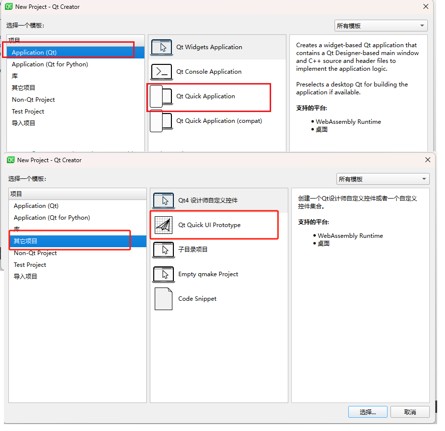
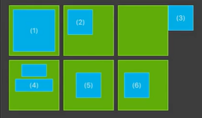

# QML

Qt Meta-object Language，是一种用户界面的标记语言。

UI分类：

- 命令式UI：
- 声明式UI：QML就是基于声明式UI，然后绑定模型，模型变化，UI发生变化，类似于MVC，MVVM

QML是一种用于描述对象如何相互关联的声明式语言，类似于HTML

Qt Quick是基于QML的框架

# 0 绪论

## 0.1 helloworld

文件->new project

- 其他项目 -> Qt quick UI Prototype：会有一个.qml文件，您可以在其中设计UI并进行一些基本的交互逻辑。
- Application -> Qt Quick Application：除了.qml文件，通常还会生成一个C++源文件，用于扩展您的QML应用程序。



下面这个应用是使用 Qt quick UI Prototype构建的。

```q
import QtQuick

Rectangle{
    id:root
    width:600
    height:600

    Text {
        id:thisLabel

        // 定位
        x:100; y:100

        // 属性依赖
        height: 2 * width

        Rectangle{
            anchors.fill: parent
            color: "yellow"
            z:parent.z -1
        }

        // 自定义属性
        property int times:24

        // 属性别名，可以被文档外访问
        property alias anotherTimes: thisLabel.times

        text: "thislabel" + anotherTimes

        // 组属性
        font.family: "Blod"
        font.pixelSize: 24
        /*
        font{
                family: "Blod"
                pixelSize: 24
            }
        */

        // 事件处理
        onHeightChanged: console.log('height', height)

        // 按tab键后会跳到thatLabel对象上
        KeyNavigation.tab: thatLabel
		
        focus:true
        color: focus ? "red": "green"

    }
    Text {
        id: thatLabel
        text: "thatLabel " + thisLabel.times
        focus: !thisLabel.focus
        KeyNavigation.tab: thisLabel
        color: focus ? "red": "green"

        // 使用js函数
        Keys.onSpacePressed: increment()
        // Keys.onSpacePressed: {
        //     increment()
        // }

        // 直接执行js代码
        Keys.onEscapePressed: {
            thisLabel.times -= 1
            this.text = 'thatLabel'+ thisLabel.times
        }

        // 可使用箭头函数
        onTextChanged: (text) => {
            console.log("text changed to ", text)
        }
        // onTextChanged: function(text){
        //     console.log("text changed to ", text)
        // }

        // 定义js函数
        function increment(){
            thisLabel.times += 1;
        }
    }

    Image{
        id:image
        source: "../images/pinwheel.jpg"
        width: 300

        fillMode: Image.PreserveAspectFit
        x:(root.width - width)/2; y:400
    }

}
```

1. import 语句导入模块，qt 5 中还需要在模块后面加版本号，而qt 6 不需要版本号，会自动加载最高版本
2. 对象
   - 每个QML文档有且只有一个根对象（根元素），对象可以嵌套。
   - 对象名就是类型名，以大写字母开头，后面跟一对`{ }`，花括号中是该对象的属性
3. 属性
   - 属性以键值对 “ 属性名: 值 ” 形式给出，同一行若出现多个属性需要用“  ;  ”隔开，行与行之间则无需分号隔开
   - **子对象可以使用 `parent`关键字访问父对象**，anchors属性通常涉及到布局
   - **QML中子对象也可视为父对象的属性**
   - **属性可以依赖于其他属性（或其他对象的属性）**
   - `property限定符`
     - 向元素添加新属性，格式：`property <类型> <新属性名>:<值>`
   - 属性别名
     - 属性也可以有别名，QML使用alias关键字声明属性别名，`property alias 别名: 属性名`
     - **定义别名的目的是为了在外部QML文档中也能访问当前别名属性。**
4. 对象标识符
   - 每一个对象都可以指定一个唯一的id值（当前文档唯一），id无法被改变
   - 在对象所在的QML文档中的任何地方，都可以通过该对象的**id来引用该对象**
5. 注释
   - 单行注释：`//`
   - 多行注释：`/* */`

## 0.2 元素和组件

### 0.2.1 元素

元素可以分为视觉元素和非视觉元素

- 视觉元素（eg：Rectangle）
- 非视觉元素（eg：timer）提供一般功能，通常用于控制视觉元素

**Item是所有视觉元素的基础元素（类）**，

- 因此所有其他视觉元素都从Item继承，它本身不绘制任何东西，但定义了视觉元素的共同属性
- 包括：几何属性（x,y,width,height）
- 布局处理（anchors）
- 键处理（Keys, Navication），
- 变换（scale，rotate，transform，transformerOrigin）
- 视觉（opacity，visible，clip，smooth）
- 状态定义（states）

核心可视元素

- Rectangle：绘制矩形
- Text：显示文本
- Image：显示图像

### 0.2.2 组件

右击工程-> add New -> Qt -> QML file

组件调用方只能修改根元素的属性，设置子元素的属性将无效，除非根元素和子元素拥有同样的属性

如果要在调用方设置组件里子元素的属性需要在根元素通过property alias声明属性别名

```q
// 开放式组件

import QtQuick


Rectangle{
    id: button
	// 对外暴露属性
    property alias text: label.text
	// 对外暴露信号
    signal clicked


    x:12;y:12
    width:116;height:26
    color:"lightsteelblue"
    border.color:"slategrey"
    Text{
        id: label
        anchors.centerIn: parent
        text:"start"
    }

    MouseArea{
        anchors.fill: parent
		// 触发信号事件
        onClicked:{
            button.clicked()
        }
    }
}


// 如果只想暴露text和clicked信号，那么可以在Rectangle外加一个Item，调用方只能修改根元素的属性，设置子元素的属性将无效，除非根元素和子元素拥有同样的属性
import QtQuick

Item{
    id:root
    property alias text: label.text
    signal clicked
    Rectangle{
        id: button
        x:12;y:12
        width:116;height:26
        color:"lightsteelblue"
        border.color:"slategrey"
        Text{
            id: label
            anchors.centerIn: parent
            text:"start"
        }
        MouseArea{
            anchors.fill: parent
			// 触发信号事件
            onClicked:{
				// 这里要设置为根元素的id
                root.clicked()
            }
        }
    }
}
```

```q
// 调用方

import QtQuick

Window{
    id: root
    width: 400
    height:260
    visible:true
    title:"component"
	
	//使用组件，这里的属性可以是组件根元素的所有属性
    Button{
      text: "开始"
	  color: "yellow"	// 如果使用第一种组件声明方式，
      onClicked: {		// 事件处理函数
        text1.text = "按钮被点击"
      }
    }

    Text {
        id: text1
        x:12
        y:76
        width:116
        height: 26
        text:"waiting..."
        horizontalAlignment: Text.AlignHCenter
    }
}
```

## 0.3 定位器

### 0.3.1 基本布局

定位器是QML中专用于定位的一类元素，主要有：ROW，Column，Grid，Flow

```q
import QtQuick

// 红色组件
Rectangle {
    width:48
    height:48
    color:"red"
    border.color:Qt.lighter(color)
}

Rectangle {
    width:48
    height:48
    color:"green"
    border.color:Qt.lighter(color)
}

Rectangle {
    width:48
    height:48
    color:"blue"
    border.color:Qt.lighter(color)
}

Rectangle {
    width:48
    height:48
    color:"gray"
    border.color:Qt.lighter(color)
}


// 调用者
DarkSqure{
    id: root
    width: 400
    height: 260
	
	// 列布局
    Column{
        anchors.centerIn: parent
        spacing: 10
        RedSquare{}
        GreenSquare{
            width: 96
        }
        BlueSquare{}
    }
	
	// 行布局
	Row{
        anchors.centerIn: parent
        spacing: 10
        RedSquare{}
        GreenSquare{
            width: 90
        }
        BlueSquare{}
    }
	
	// 网格布局
	Grid{
        anchors.centerIn: parent
        spacing: 20
        rows:2
        columns:3		// 默认值为4
        RedSquare{}
        GreenSquare{}
        BlueSquare{}
        RedSquare{}
        GreenSquare{}
        BlueSquare{}
    }

	// 流布局
	Flow{
        anchors.fill:parent
        anchors.margins: 20
        spacing: 20
        RedSquare{}
        GreenSquare{}
        BlueSquare{}
        RedSquare{}
        GreenSquare{}
        BlueSquare{}
    }
}


```

### 0.3.2 repeater渲染

repeater重复器，他可以重复创建任何QML基本的可视元素

```q
import QtQuick

DarkSqure{
    id: root
    width: 400
    height: 260
	property var colorArray: ["#00bde3","#67c111","#ea7025"]

    Grid{
        anchors.centerIn: parent
        anchors.margins: 8
        spacing: 4
		// columns默认为4

        Repeater{
            model:16		// Repeater会按照其model属性定义的个数循环生成子元素
            Rectangle{
                id:rect         //Repeater会为每个子元素注入一个id属性，并赋值给你声明的变量，在这里为rect
                property int colorIndex: Math.floor(Math.random() * 3)
                color:root.colorArray[colorIndex]
                width: 56
                height: 56
                Text{
                    anchors.centerIn: parent
					color:"white"
                    text:"Cell" + index         //Repeater会为每个子元素注入一个index属性，作为当前循环索引
                    // rect.Positioner.index与index值相同
                }
            }
        }
    }
}
```

### 0.3.3 anchor锚


每个元素都可被认为有一组无形的 “锚线”：

- left，right，top，bottom，horizontalCenter，verticalCenter

锚系统还允许为一个元素的锚指定边距（margin）和偏移（offset）

- 边距指定了元素锚到外边界的空间量：topMargin，rightMargin，bottomMargin，leftMargin
- 偏移允许使用中心锚线来定位：horizontalCenterOffset，verticalCenterOffset，baselineOffset（对于Text元素才有，对于没有文本的元素它与top相当）
- fill属性用于将一个元素充满另一个元素

以上属性均对应于元素中的anchors.left，anchors.right属性组内的属性。

只能在父子或兄弟元素之间才能使用锚。基于锚的布局谨慎与其他布局、绝对的位置定义（直接设置x，y）混合使用，否则会出现不确定的结果




```q
// 组件

import QtQuick

//GreenSquare
Rectangle{
    width: 100; height: 100
    color:'green'
    border.color: Qt.lighter(color)
}

//BlueSquare
Rectangle{
    width: 50; height: 50
    color:'blue'
    border.color: Qt.lighter(color)

    property alias text: label.text
    Text {
        id: label
        text: qsTr("text")
        color:'white'
        anchors.centerIn: parent
    }
}
```

```q
// 调用
import QtQuick

Window {
    width: 640
    height: 480
    visible: true
    title: qsTr("layout")

    GreenSquare{
        //        BlueSquare{
        //            text: '(1)'
        //            anchors.fill: parent
        //            anchors.margins: 8
        //        }

        //        BlueSquare{
        //            text: '(2)'
        //            anchors.left: parent.left
        //            y:8
        //            anchors.margins: 8
        //        }

        //        BlueSquare{
        //            text: '(3)'
        //            anchors.left: parent.right
        //        }

        //        BlueSquare{
        //            id:blue1
        //            text: '(4-1)'
        //            //anchors.top: parent.top
        //            y:8
        //            anchors.horizontalCenter: parent.horizontalCenter
        //            anchors.margins: 8
        //            height: 25

        //        }
        //        BlueSquare{
        //            text: '(4-2)'
        //            //anchors.top: parent.top
        //            width: 75
        //            anchors.top: blue1.bottom
        //            anchors.horizontalCenter: parent.horizontalCenter
        //            anchors.margins: 8
        //            height: 25

        //        }

//        BlueSquare{
//            text: '(5)'
//            anchors.centerIn: parent
//        }

        BlueSquare{
            text: '(6)'
            anchors.horizontalCenter: parent.horizontalCenter
            anchors.verticalCenter: parent.verticalCenter
            anchors.horizontalCenterOffset: -12
        }
    }
}
```

## 0.4 事件处理

### 0.4.1 鼠标事件

与以前的窗口部件不同，在QML中如果一个元素想要处理鼠标事件，则要在其上放置一个MouseArea元素（鼠标输入元素），也就是说，用户只能在MouseArea确定的范围内进行鼠标的动作。

### 0.4.2 键盘事件

当一个按键被按下或释放，都会产生一个键盘事件，并将其传递给获得了焦点的QML元素。

在QML中，Keys属性提供了基本的键盘事件处理器，所有可视元素都可以通过它来进行按键的处理。

```q
// 组件，TextInput，TextEdit
import QtQuick

//Rectangle{
//    width: 200;height:30
//    color:'lightsteelblue'
//    border.color: "gray"
//    property alias text: input.text
//    property alias input: input

//    TextInput{
//        id:input
//        anchors.fill: parent
//        anchors.margins: 2
//    }
//}

FocusScope{
    width: 200;height:50
    Rectangle{
        anchors.fill: parent
        color:'lightsteelblue'
        border.color: "gray"
    }
    property alias text: input.text
	// 对外暴露整个子元素
    property alias input: input

    TextEdit/*TextInput*/{
        id:input
        anchors.fill: parent
        anchors.margins: 2
        focus:true
        wrapMode:Text.WordWrap
    }
}
```

```q
import QtQuick

Window {
    width: 640
    height: 480
    visible: true
    title: qsTr("input")

//    Rectangle{
//        width: 200;height:80
//        color:'linen'
//        TextInput{
//            id:input1
//            x:8;y:8
//            width: 96;height:20
//            focus: true
//            text:'Text input 1'
//            KeyNavigation.tab: input2
//        }

//        TextInput{
//            id:input2
//            x:8;y:36
//            width: 96;height:20
//            //focus: true
//            text:'Text input 2'
//            KeyNavigation.tab: input1
//        }
//    }
    TLineEditV1{
        id:input1
        text: "Text input 1"
        input.font.pixelSize: 16
        height: 10*input.font.pixelSize+10
        input.color: 'white'
        focus:true
        KeyNavigation.tab: input2
    }

    TLineEditV1{
        id:input2
        text: "Text input 2"
        input.font.pixelSize: 16
        y:input1.y+input1.height+12
        height: input.font.pixelSize+10
        input.color: 'white'
        KeyNavigation.tab: input1
    }
}
```

