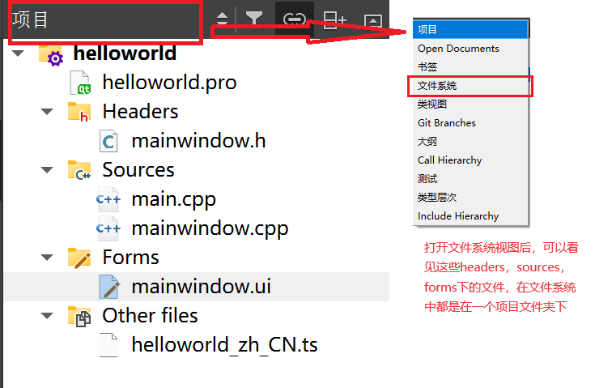
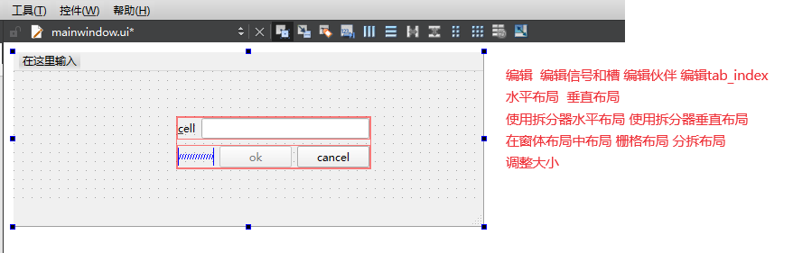
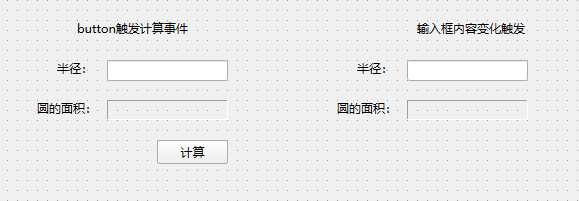
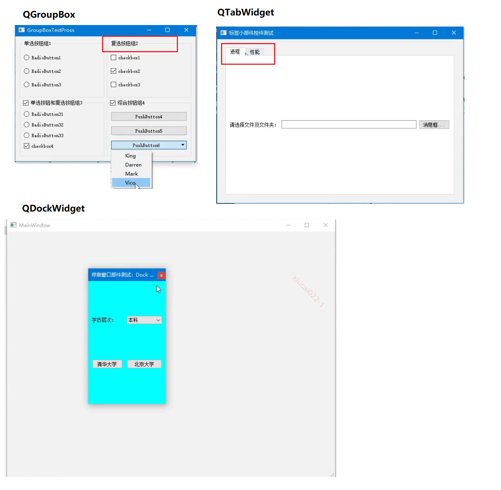
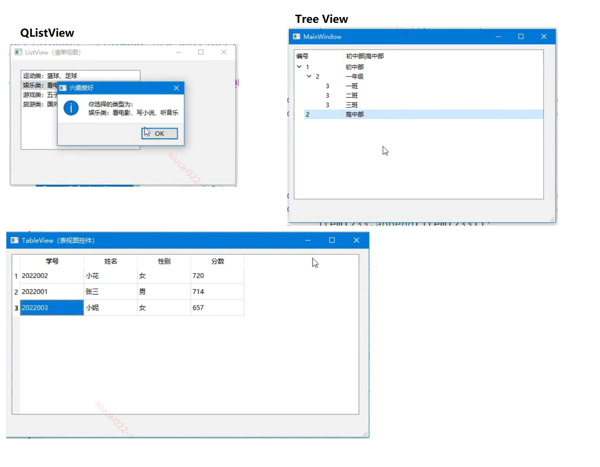
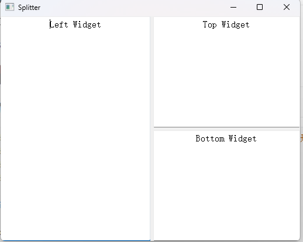
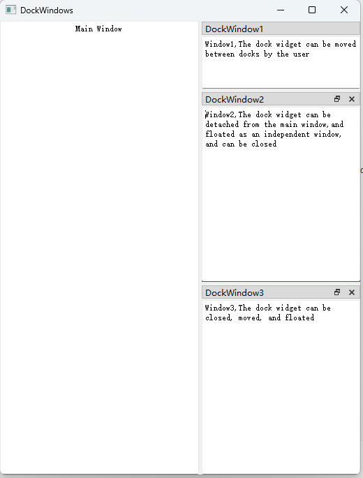
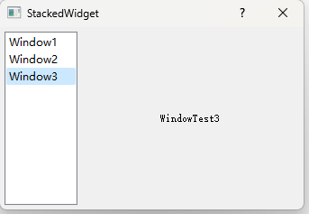
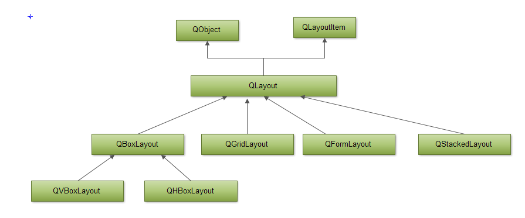

# QT

QT是一个跨平台的C++ 图形用户界面库，目前包括Qt Creator、Qt Designer等快速开发工具。

Qt很容易扩展，并且允许真正的组件化编程。

Qt与GTK、MFC、OWL、ATL是一样的图形界面库。

优势：

1. 优良跨平台特性：支持 所有Linux/Unix系统，还支持windows，Android、IOS、嵌入式系统QNX、Vxworks。
2. 丰富的API（250个以上C++类，基于模板Collections、file、serialization I/O、device等）
3. 支持2D/3D图形渲染，支持OpenGl
4. XML支持/大量开发文档

Qt的开源软件库的相关市场软件：WPS office，VLC多媒体播放器，Google Earth（3D/2D图形渲染）

Qt开发工具：

1. Qt Creator：用于Qt开发的轻量级跨平台集成开发环境，
2. Qt Designer：强大的拖拽式图形化用户界面排版和设计工具
3. Qmake：跨平台的makefile生成器
4. Qt Assistant：帮助文档浏览查询工具
5. Qt linguist：多语言界面支持

Qt基本模块：

| 名称          | 功能                                                         |
| ------------- | ------------------------------------------------------------ |
| Qt Core       | 非图形相关基础类                                             |
| Qt GUI        | 图形界面相关的基础类                                         |
| Qt Multimedia | 用于支持音视频、摄像头功能的类<br />Qt Multimedia Widgets：用于支持多媒体的图形类 |
| Qt Network    | 用于简化网络编程的类                                         |
| Qt QML        | QML and JavaScript相关的类                                   |
| Qt Quick      | 用于构建高动态和易交互的用户界面的声明式框架<br />Qt Quick Controls：提供轻量级的QML类型，用于为桌面、嵌入式和移动设备创建高性能的用户界面<br />Qt Quick Dialogs：用于创建对话框的QML types<br />Qt Quick Layouts：用于布局的QML types<br />Qt Quick Test：用于对QML 应用的进行单元测试 |
| Qt SQL        | 用于SQL相关操作                                              |
| Qt Test       | 用于对Qt应用和库进行单元测试                                 |
| Qt Widgets    | 提供一组UI元素来创建经典用户界面                             |
| Qt Webkit     | 提供了一个Web浏览器引擎，使用它便可以很容易的将www中的内容嵌入到Qt应用程序中 |


Qt扩展模块：

| 扩展模块         | 功能                                                         |
| ---------------- | ------------------------------------------------------------ |
| Qt Concurrent    | 封装了底层线程技术的类库，方便开发多线程程序。               |
| **Qt D-Bus**     | 利用 D-Bus 协议进行进程间交互。                              |
| **Qt 3D**        | 提供声明式语法，在 Qt 程序中可以简单地嵌入 3D 图像。         |
| **Qt Contacts**  | 用于访问地址簿或者联系人数据库的 C++ 和 QML API。            |
| **Qt Location**  | 提供定位机制、地图和导航技术、位置搜索等功能的 QML 和 C++ API。 |
| **Qt Bluetooth** | 提供用于访问蓝牙无线设备的 C++ 和 QML API                    |

# 0 基础

## 0.0 环境搭建

[安装qt 5.15.2](https://zhuanlan.zhihu.com/p/697911596)

## 0.1 [helloworld](https://www.bilibili.com/read/cv18834817)

### 0.1.1 创建项目步骤

1. new project -> application
   - Qt Widgets Application：支持桌面平台的GUI应用程序
   - Qt Console Application：控制台应用程序（没有GUI），一般做服务进程
   - Qt Quick Application-xxx：创建基于Qt quick组件的可部署相关应用程序
2. project  location：
   - 名称：项目名称
   - 创建路径：项目存放的路径
3. build System：
   - qmake
   - cmake
4. details
   - Class Name：一栏中，可以输入主窗口的类名，可以自定义一个名字,例如“MyWidget”。
   - Base class
     - QMainWindow
     - QWidget
     - QDialog
     - 三者之间的关系：
       - QWidget 是QMainWindow和QDialog的父类。
       - QWidget 是一个最简单的窗口，这个窗口被创建出来后，窗口内部什么都没有。
       - QMainWindow 在窗口内部包含了菜单栏，还包含一些工具以及状态栏等。
       - QDialog是一个对话框。对话框是在一个窗口中弹出来的窗口，一般会拥有两个选择按钮，例如确定和取消。
5. translation
   - 设置窗体的语言
6. kits
   - Desktop Qt 5.12.10 MinGW 32-bit
7. summary

### 0.1.2 项目结构



1. helloworld.pro：项目管理文件
2. Headers文件夹：项目内部的所有头文件
3. Sources文件夹：项目源文件
   - main.cpp：主函数文件，应用程序的入口
   - mainwindow.cpp主窗口类文件，与headers中的同名.h文件相对应
4. Forms文件夹：窗体设计文件
   - **双击mainwindow.ui即可在设计选项卡设计ui**
5. Other files：用来存放国际化等

**在实际文件目录中，是没有上面这个文件层级结构的。cpp和h文件都放在同一个文件夹中的。**


## 0.2 信号与槽机制

信号槽是观察者模式的一种使用。

信号：本质就是事件，当某一事件发生以后，则发出一个信号。

槽：就是对信号响应的函数。槽函数可以与一个信号关联，当信号被发射的时候，关联的槽函数被自动执行处理。

信号与槽关联是使用**`QObject::connect()`**，QObject是所有QT类的基类。

### 0.2.1 原理

信号和槽机制底层是通过函数之间进行相互调用实现的

- 每个信号都可以用函数来表示，称为**信号函数**，每个槽也可以用函数表示，称为**槽函数**。
- 信号函数**只需要声明**（不需要定义和实现），而槽函数**需要定义实现**

signals和slots是QT开发当中在C++语言基础上扩展的关键词，专门用于指明信号函数和槽函数。 

```c++
[static] QMetaObject::Connection QObject::connect(const QObject *sender, const char *signal, const QObject *receiver, const char *method, Qt::ConnectionType type = Qt::AutoConnection);

// 参数：
//1. sender：发出信号的对象，
//2. signal: 订阅sender对象的什么信号
//3. receiver：信号接收者
//4. method：信号接收者的槽函数，对对应信号做出响应。
```

信号与槽机制连接方式：

1. 一个信号可以跟另一个信号相连，一个信号可以引起另一个信号的发生
2. 同一信号可以跟多个槽相连（一对多），一个信号可以触发多个槽函数
3. 同一个槽可以响应多个信号（多对一），一个槽函数也可以处理多个信号

信号与槽机制的优势：

- 松散耦合，信号和槽之间通过订阅来建立连接。信号类和槽类之间不相互接触，一个类如果要支持信号和槽，必须继承QObject或QObject的派生类。QT信号和槽机制不支持模板的使用。

信号与槽机制效率：

- **增强对象之间通信的灵活性，但也会损失一些性能。**通过传递一个信号来调用槽函数，将会比直接调用非虚函数慢
- 主要原因：
  - 多线程的时候，信号可能需要排队等待。
  - 编组和解组传递的参数
  - 需要定位接收信号的对象，将信号与之相关的所有槽安全的关联。

### 0.2.2 练习


输入半径，计算对应圆的面积

New Project -> Application -> Qt Widgets Application

Location（项目名称，存放路径）-> 构建系统（选择Cmake）-> Details （基类选择QDialog） -> Translation(国际化，基本上不用) -> 构建套件MinGW 64 bit（使用debug就行）

#### 使用Qt designer实现

##### designer工具栏



1. [编辑伙伴](https://blog.csdn.net/LaoYuanPython/article/details/101909730)：Edit Buddies（编辑伙伴关系）子菜单，该菜单的作用是将一个Label与其他控件关联起来，当Label控件设置了快捷键时，通过Label的快捷键就可以直接使关联控件获得焦点。
2. 水平和垂直布局：先选中多个组件，然后在点击布局，这多个组件就会按照需要进行布局

##### 编写代码与注解

1. main.cpp解析：项目自动添加，main函数就是此工程的入口

   ```c++
   // main.cpp
   #include "dialog.h"
   #include <QApplication>         // Application类的定义，在每个使用Qt图形化应用程序中都必须使用一个QApplication对象
   
   int main(int argc, char *argv[])        // 应用程序入口
   {
       QApplication a(argc, argv);
       Dialog w;
       w.show();       // 当创建一个窗口部件的时候，默认它不可见，必须调用show函数，使其变为可见
       return a.exec();            // 程序进入消息循环，等待可能得输入进行响应。这里将main函数的控制权交由Qt，Qt接收并处理用户和系统的事件并且将它们传递给适当的窗口部件
   }
   ```

2. 双击dialog.ui，对界面进行设计

   ```ui
   <?xml version="1.0" encoding="UTF-8"?>
   <ui version="4.0">
    <class>Dialog</class>
    <widget class="QDialog" name="Dialog">
     <property name="geometry">
      <rect>
       <x>0</x>
       <y>0</y>
       <width>800</width>
       <height>600</height>
      </rect>
     </property>
     <property name="windowTitle">
      <string>Dialog</string>
     </property>
     <widget class="QPushButton" name="pushButton">
      <property name="geometry">
       <rect>
        <x>190</x>
        <y>150</y>
        <width>71</width>
        <height>24</height>
       </rect>
      </property>
      <property name="text">
       <string>计算</string>
      </property>
     </widget>
     <widget class="QLabel" name="label">
      <property name="geometry">
       <rect>
        <x>90</x>
        <y>70</y>
        <width>54</width>
        <height>16</height>
       </rect>
      </property>
      <property name="text">
       <string>半径：</string>
      </property>
     </widget>
     <widget class="QLineEdit" name="button_edit">
      <property name="geometry">
       <rect>
        <x>140</x>
        <y>70</y>
        <width>121</width>
        <height>21</height>
       </rect>
      </property>
     </widget>
     <widget class="QLabel" name="label_2">
      <property name="geometry">
       <rect>
        <x>70</x>
        <y>110</y>
        <width>54</width>
        <height>16</height>
       </rect>
      </property>
      <property name="text">
       <string>圆的面积：</string>
      </property>
     </widget>
     <widget class="QLabel" name="button_res">
      <property name="geometry">
       <rect>
        <x>140</x>
        <y>110</y>
        <width>121</width>
        <height>20</height>
       </rect>
      </property>
      <property name="frameShape">
       <enum>QFrame::Panel</enum>
      </property>
      <property name="frameShadow">
       <enum>QFrame::Sunken</enum>
      </property>
      <property name="text">
       <string/>
      </property>
     </widget>
     <widget class="QLabel" name="label_4">
      <property name="geometry">
       <rect>
        <x>110</x>
        <y>30</y>
        <width>131</width>
        <height>16</height>
       </rect>
      </property>
      <property name="text">
       <string>button触发计算事件</string>
      </property>
     </widget>
     <widget class="QLabel" name="label_5">
      <property name="geometry">
       <rect>
        <x>450</x>
        <y>30</y>
        <width>131</width>
        <height>16</height>
       </rect>
      </property>
      <property name="text">
       <string>输入框内容变化触发</string>
      </property>
     </widget>
     <widget class="QLineEdit" name="input_change">
      <property name="geometry">
       <rect>
        <x>440</x>
        <y>70</y>
        <width>121</width>
        <height>21</height>
       </rect>
      </property>
     </widget>
     <widget class="QLabel" name="label_3">
      <property name="geometry">
       <rect>
        <x>390</x>
        <y>70</y>
        <width>54</width>
        <height>16</height>
       </rect>
      </property>
      <property name="text">
       <string>半径：</string>
      </property>
     </widget>
     <widget class="QLabel" name="input_res">
      <property name="geometry">
       <rect>
        <x>440</x>
        <y>110</y>
        <width>121</width>
        <height>20</height>
       </rect>
      </property>
      <property name="frameShape">
       <enum>QFrame::Panel</enum>
      </property>
      <property name="frameShadow">
       <enum>QFrame::Sunken</enum>
      </property>
      <property name="text">
       <string/>
      </property>
     </widget>
     <widget class="QLabel" name="label_6">
      <property name="geometry">
       <rect>
        <x>370</x>
        <y>110</y>
        <width>54</width>
        <height>16</height>
       </rect>
      </property>
      <property name="text">
       <string>圆的面积：</string>
      </property>
     </widget>
    </widget>
    <resources/>
    <connections/>
   </ui>
   
   ```

   

   

3. 右击ui控件（转到槽），设置槽函数

   ```c++
   // dialog.h
   #ifndef DIALOG_H
   #define DIALOG_H
   
   #include <QDialog>
   
   QT_BEGIN_NAMESPACE
   namespace Ui {
   class Dialog;
   }
   QT_END_NAMESPACE
   
   class Dialog : public QDialog
   {
       Q_OBJECT
   
   public:
       Dialog(QWidget *parent = nullptr);
       ~Dialog();
   
   private slots:
       // 槽函数命名：on_objectName_signalName
       void on_pushButton_clicked();
   
       void on_input_change_textChanged(const QString &arg1);
   
   private:
       Ui::Dialog *ui;
   };
   #endif // DIALOG_H
   
   
   
   
   // dialog.cpp
   #include "dialog.h"
   #include "./ui_dialog.h"
   #define M_PI 3.14
   
   Dialog::Dialog(QWidget *parent)
       : QDialog(parent)
       , ui(new Ui::Dialog)
   {
       // 在构造函数中，使用该句进行界面初始化  
       ui->setupUi(this);
   }
   
   Dialog::~Dialog()
   {
       delete ui;
   }
   
   // 按钮点击槽函数
   void Dialog::on_pushButton_clicked()
   {
       bool ok;
       QString areaStr;
       QString radusStr = ui->button_edit->text();
       int radius = radusStr.toInt(&ok);
       double area = radius * radius * M_PI;
       ui->button_res->setText(areaStr.setNum(area));
   }
   
   // 输入框内容变化槽函数
   void Dialog::on_input_change_textChanged(const QString &arg1)
   {
       bool ok;
       QString areaStr;
       QString radusStr = ui->input_change->text();
       int radius = radusStr.toInt(&ok);
       double area = radius * radius * M_PI;
       ui->input_res->setText(areaStr.setNum(area));
   }
   ```

   

4. 点击右下角，运行就可以看到效果


#### 使用代码实现简单实例

上面的例子是通过设计ui，生成一个类似于XML文档，然后由QT解析此文档，生成对应的ui对象，绑定槽函数。

下面将通过完全代码的方式构建ui，然后绑定槽函数。

```c++
// dialog.h

#ifndef DIALOG_H
#define DIALOG_H

#include <QDialog>
#include <QLabel>
#include <QLineedit.h>
#include<QPushButton>
#include<QGridLayout>
#include<QFrame>
#define M_PI 3.14

QT_BEGIN_NAMESPACE
namespace Ui {
class Dialog;
}
QT_END_NAMESPACE

class Dialog : public QDialog
{
    Q_OBJECT

public:
    Dialog(QWidget *parent = nullptr);
    ~Dialog();

private:
    Ui::Dialog *ui;
    QLabel *radiusLabel;
    QLabel *circleArea;
    QLineEdit *radiusInput;
    QPushButton *computeButton;
private slots:
    void computeCircleArea();

};
#endif // DIALOG_H

```

```c++
// dialog.cpp

#include "dialog.h"
#include "./ui_dialog.h"

Dialog::Dialog(QWidget *parent)
    : QDialog(parent)
    , ui(new Ui::Dialog)
{
    radiusLabel = new QLabel(this);
    radiusInput = new QLineEdit(this);
    computeButton = new QPushButton(this);
    circleArea = new QLabel(this);

    radiusLabel->setText("半径：");

    computeButton->setText("计算对应圆的面积");
    circleArea->setMaximumHeight(50);
    circleArea->setFrameShape(QFrame::Panel);
    circleArea->setFrameShadow(QFrame::Sunken);

    QGridLayout* gridLayout = new QGridLayout(this);
    gridLayout->addWidget(radiusLabel,0,0);
    gridLayout->addWidget(radiusInput,0,1);
    gridLayout->addWidget(circleArea,1,0);
    gridLayout->addWidget(computeButton,1,1);

    // 绑定槽函数api connect
    connect(computeButton,SIGNAL(clicked()), this, SLOT(computeCircleArea()));

    ui->setupUi(this);
}
void Dialog::computeCircleArea(){
    bool ok;
    QString areaStr;
    QString radiusStr = radiusInput->text();
    int radius = radiusStr.toInt(&ok);
    double area = radius * radius * M_PI;
    circleArea->setText(areaStr.setNum(area));
}
Dialog::~Dialog()
{
    delete ui;
}

```


## 0.3 Qt基本数据类型

定义在：`#include<QtGlobal>`


## 0.4 常用容器类

如果希望自定义数据类型能存储在 Qt 数据容器里面，那么自定义类型必须至少满足三个条件：

- 定义默认构造函数，比如 MyData() ;
- 定义复制构造函数，比如 MyData(const MyData &d);
- 定义赋值运算符 = 函数，比如 MyData& operator=(const MyData &d)


### 0.3.1 [QString](https://blog.csdn.net/qq_41802658/article/details/121490656)

1. 组合（操作）字符串方法：
   - 后向追加append/push_back，前向追加prepend/push_front
   - 模板字符串sprintf/arg
   - 替换与插入replace/insert
2. 查询字符串：
   - 是否以xx开头结尾startsWith/endsWith
   - 包含contains，比较compare
3. 转换
   - 字符数字转换：toInt/toLong/toFloat/toDouble
   - QString转UTF-8(ASCII)：toUtf8
4. 

```c++
#include <QCoreApplication>//QT 提供一个事件循环
#include<QDebug> //输出流
#include<QDateTime>
#include<iostream>
using namespace std;

int main(int argc, char *argv[])
{
    QCoreApplication a(argc, argv);

    // 1. QString
    QString str1 = "I ";
    str1 += "love you";             // 等价于 str1 = str1 + "love you"
    qDebug()<< str1;                //打印出的字符有双引号
    qDebug()<<qPrintable(str1);     //字符串无双引号

    // 2. QString::append(), 等价于+=
    //相关函数：prepend/push_front前向追加，append/push_back
    QString str2 = "I love you";
    str1.append(", me too");        //I love you, me too

    // 3. QString::sprintf()，组合字符串
    //  和c++中的string.h中的sprintf等价
    QString str3 = "I love you";
    str3.sprintf("%s haha %s", "happy 4.5","cheat you"); //happy 4.5 haha cheat you

    // 4. QString::arg()
    QString str4 = QString("%1 is %2 of %3").arg(2000).arg("number").arg("real");
    //   2000 is number of real


    // 5. QString::startsWith()
    QString str5 = "BeiJing welcome to you";

    str5.startsWith("BeiJing",Qt::CaseSensitive);       //true
    str5.endsWith("yo",Qt::CaseSensitive);              //false
    str5.contains("welcome",Qt::CaseSensitive);         //true

    //6. QString::toInt()
    QString str6 = "17";
    bool toIsSuccess = false;
    int hex= str6.toInt(&toIsSuccess,16);
    // 这里的16表示的是原数17的进制是16进制的，0x17 => 23
    // toIsSuccess = true,hex = 23,

    // 7. QString::compare()
    int a1 = QString::compare("abcd","abcd",Qt::CaseSensitive);//a与a的差值，为0
    int b1 = QString::compare("abcd","ABCD",Qt::CaseSensitive);//a（97）与A（65）的差值，32
    int c1 = QString::compare("abcd","c",Qt::CaseInsensitive);//a与c的差值，为-2
    //cout<<"a1= "<<a1<<" b1= "<<b1<<" c1= "<<c1<<endl;// a1= 0 b1= 32 c1= -2

    // 8. QString::toUtf8()
    QString str = "ABC abc";
    QByteArray bytes = str.toUtf8();
    for (int i =0; i<str.size();++i){
        qDebug()<<bytes.at(i);
    }

    

    return a.exec();
}

```

### 0.3.2 QDateTime

```c++
    QDateTime dt;
    QString dtStr = dt.currentDateTime().toString("yyyy-MM-dd HH:mm:ss");	//"2023-04-19 15:59:56"
```

### 0.3.3 [QByteArray](https://blog.csdn.net/kenfan1647/article/details/120326901)

```c++
QString qstrData;
QFile qfile("d:\\testfile.txt");
while(!qfile.atEnd()){
    QByteArray ay =qfile.readLine();
    QString strs(ay);
    qStrdData.append(strs);
}
ui->textBrowser->setText(qstrData);
```


### 0.3.4 QVector

```c++
#include <QCoreApplication>
#include<QDebug>
#include<iostream>
using namespace std;
int main(int argc, char *argv[])
{
    QCoreApplication a(argc, argv);
    QVector<int> qvr;
    //添加方式1
    qvr<<10;
    qvr<<20;
    //添加方式2
    qvr.append(30);
    qvr.append(40);
    
    qDebug()<<qvr;  //QVector(100, 200, 300, 400)

    qvr.count();    //获取元素的个数，4
    qvr<<50;
    qvr<<60;
    qvr.remove(0);   //删除第一个元素, 删除10
    qvr.remove(1,3); //从第二个元素后，删除3个元素（左开右闭），删除30,40,50

    // 遍历
    for(int i = 0;i<qvr.count();i++){
        qDebug()<<qvr[i];
    }

    //是否包含某个元素
    qvr.contains(60);   //true
    return a.exec();
}

```

### 0.3.5 [QList与QLinkedList](https://blog.csdn.net/Newmamahaha/article/details/123277360)

`QList`

对于不同的数据类型，`QList<T>`采取不同的存储策略，策略如下：

- 如果T是一个指针类型或指针大小的基本类型，`QList<T>`将数值直接存储在它的数组中
- 如果QList存储对象的指针，则该指针指向实际存储的对象。

```c++
#include <QCoreApplication>
#include<QDebug>
int main(int argc, char *argv[])
{
    QCoreApplication a(argc, argv);
    QList<int> qlist;
    for(int i=0; i<10; ++i){
        qlist.insert(qlist.end(),i+10);     //插入元素
    }       //(10, 11, 12, 13, 14, 15, 16, 17, 18, 19)

    // QList<int>::iterator 读写迭代器
    QList<int>::iterator x;
    for(x=qlist.begin();x!=qlist.end();x++){
        *x = *x *10 + 6;
    }       //(106, 116, 126, 136, 146, 156, 166, 176, 186, 196)
    // 还有const_iterator只读迭代器，开始需要用constBegin(),结尾要用constEnd()

    //添加元素
    qlist.append(888);
    //查询元素
    qlist.at(3);// 通过索引3，第四个元素，查询元素值，136
    qlist.contains(136);
    //修改qlist列表里的值
    qlist.replace(5,999);//通过索引5，第6个元素，修改为999
    //删除元素
    qlist.removeAt(0);
    qlist.removeFirst();
    qlist.removeAt(6);


    qDebug()<<qlist;

    return a.exec();
}

```

`QLinkedList`

- 是一个链式列表，它以非连续的内存块保存数据
- 不能通过下标引用元素，只能通过迭代器访问数据项，
- 执行插入操作是，拥有更高的效率
- 保存大规模数量量的时候建议使用

```c++
//使用QLinkedList需要包含头文件。#include<QLinkedList>
    QLinkedList<QString> qAllMonth;
    for(int i =1; i<=12;++i){
        qAllMonth<<QString("%1%2").arg("Month:").arg(i);
    }

    QLinkedList<QString>::iterator itrw = qAllMonth.begin();
    for(;itrw!=qAllMonth.end();++itrw){
        qDebug()<<*itrw;
    }
```


### 0.3.6 QMap与QHash


`QMap<K, T>`

- 提供一个类型为k的键到类型为T值的映射。按照键K的次序存储数据T。
- 为提供一键多值的情况，`QMap<K, T>::insertMulti() 和 QMap<K, T>::values()`，也可以采用**QMultiMap<K,T>**

```c++
#include <QCoreApplication>
#include<QDebug>
#include<iostream>
using namespace std;
int main(int argc, char *argv[])
{
    QCoreApplication a(argc, argv);
    QMap<QString,int> qmap;
    qmap["Chinese"] = 100;
    qmap["English"] = 120;
    qmap.insert("Math", 115);
    qmap.insert("Physics",99);
    qmap.insert("Chemistry", 75);
    qDebug()<<qmap;

    qmap.remove("Physics");
    qDebug()<<qmap;

    //1.qt风格迭代
    QMapIterator<QString,int> itr(qmap);
    while(itr.hasNext()){
        itr.next();
        qDebug()<<itr.key()<<":"<<itr.value();
    }

    cout<<endl;
    //2.类STL方式的迭代
    QMap<QString,int>::const_iterator mapitr = qmap.constBegin();
    while (mapitr!=qmap.constEnd()) {
        qDebug()<<mapitr.key()<<":"<<mapitr.value();
        mapitr++;
    }

    //根据key或T相互查找
    qDebug()<<"key-->T"<<qmap.value("Math");
    qDebug()<<"T-->KEY"<<qmap.key(100);

    //修改值
    qmap["English"] = 130;
    qmap.insert("Math", 120);   //覆盖原有值
    qDebug()<<qmap.value("Math");

    //查询是否包含某个键
    qDebug()<<"是否包含Chinese："<<qmap.contains("Chinese");

    //输出所有的键或所有的值
    QList<QString> akeys = qmap.keys();
    qDebug()<<akeys;
    QList<int> avalues = qmap.values();
    qDebug()<<avalues;


    //一个键对应多个值
    QMultiMap<QString,QString> mulmap;
    mulmap.insert("student","no");
    mulmap.insert("student","name");
    mulmap.insert("student","sex");
    mulmap.insert("student","age");
    mulmap.insert("student","high");
    qDebug()<<mulmap;
    return a.exec();
}

```

`QHash<K, T>`

- 具有与QMap一样的API，哈希表的大小与QHash的数据项的数目相适应。
- QHash以任意顺序组织它的数据，当存储数据的顺序无关紧要时，建议使用QHash

```c++
#include <QCoreApplication>
#include<QDebug>
#include<iostream>
using namespace std;
int main(int argc, char *argv[])
{
    QCoreApplication a(argc, argv);
    QHash<QString, int> qhash;
    qhash["key1"] = 100;
    qhash["key2"] = 200;
    qhash["key3"] = 300;
    qhash.insert("key4",400);

    //遍历方式1：通过Qlist
    QList<QString> list = qhash.keys();
    for(int i =0; i<list.length();i++){
        qDebug()<<list[i]<<": "<<qhash.value(list[i]);
    }

    //遍历方式2：通过迭代器
    QHash<QString,int>::const_iterator itr;
    for(itr=qhash.begin();itr!=qhash.end();itr++){
        qDebug()<<itr.key()<<"-->"<<itr.value();
    }

    return a.exec();
}

```

二者区别：

- QHash查找速度更快
- QMap是按照键的顺序进行存储的，QHash是任意顺序存储的。
- **QMap的键必须提供 "<" 运算符，而QHash的键必须提供 "==" 运算符，和一个名为qHash的全局散列函数**

### 0.3.7 QVariant

QVariant 可以保存很多Qt的数据类型，包括QBrush、QColor、QCursor、QDateTime、QFont、QKeySequence、 QPalette、QPen、QPixmap、QPoint、QRect、QRegion、QSize和QString，并且还有C++基本类型，如 int、float等。

也支持自定义类型，被QVariant存储的数据类型需要有一个默认的构造函数和一个拷贝构造函数。为了实现这个功能，首先必须使用**Q_DECLARE_METATYPE()**宏。

```c++
#include "mainwindow.h"
#include<QVariant>
#include<QDebug>
MainWindow::MainWindow(QWidget *parent)
    : QMainWindow(parent)
{
    // 1. 一般类型的使用
    QVariant qv1("ABC");
    qDebug()<<"qv1:"<<qv1.toString();

    // 2. QVariant与QMap结合使用
    QMap<QString,QVariant> qmap;
    qmap["int"] = 2000;
    qmap["double"] = 90.99;
    qmap["string"] = "Good";
    qmap["color"] = QColor(255,255,0);

    //输出：转换函数来处理
    qDebug()<<qmap["int"]<<" "<<qmap["int"].toInt();            //QVariant(int, 2000)   2000
    qDebug()<<qmap["double"]<<" "<<qmap["double"].toDouble();   //QVariant(double, 90.99)   90.99
    qDebug()<<qmap["string"]<<" "<<qmap["string"].toString();   //QVariant(QString, "Good")   "Good"
    qDebug()<<qmap["color"]<<" "<<qmap["color"].value<QColor>();//QVariant(QColor, QColor(ARGB 1, 1, 1, 0))   QColor(ARGB 1, 1, 1, 0)

    // 3. QVariant与QStringList
    QStringList qsl;
    qsl<<"A"<<"B"<<"C"<<"D";
    QVariant qvsl(qsl);
    if(qvsl.type() == QVariant::StringList){
        QStringList qlist = qvsl.toStringList();
        for(int i=0; i<qlist.size();++i){
            qDebug()<<qlist.at(i);
        }   // "A"  "B"  "C"  "D"
    }

    // 4.  QVariant与自定义结构体Student
    // 在.h文件中，定义及声明为Q_DECLARE_METATYPE
    //struct Student{
    //    int no;
    //    QString name;
    //};
    //Q_DECLARE_METATYPE(Student)
    Student stu;
    stu.no = 12345;
    stu.name = "qkk";

    QVariant qstu = QVariant::fromValue(stu);
    //判断是否可以转换原始对象
    if(qstu.canConvert<Student>()){
        //获取原始对象方式一
        Student temp = qstu.value<Student>();			//student: { no:  12345  name:  "qkk" }
        //获取原始对象方式二
        Student qtemp = qvariant_cast<Student>(qstu);	//student: { no:  12345  name:  "qkk" }
        qDebug()<<"student: {"<<"no: "<<temp.no<<" name: "<<temp.name<<"}";
    }
}

MainWindow::~MainWindow()
{
}


```

# 1 常用控件


## 1.1 Button

常用button：

1. Push Button
2. Tool Button
3. Radio Button
4. Check Box
5. Command Link Button
6. Button Box

## 1.2  容器控件

1. Group Box：组合框：提供带有标题的组合框框架。 
2. Scroll Area：滚动区域。
3.  Tool Box：工具箱。 
4. Tab Widget：标签小部件，tab页
5. Stacked Widget：堆叠部件。 
6. Frame：框架。 
7. Widget：小部件。 
8. MdiArea：MDI 区域。 
9. Dock Widget：停靠窗体部件。 只能停靠在mainwindow
10. QAxWidget：封装 Flash 的 A

```c++
#include <QFrame>

Widget::Widget(QWidget *parent)
    : QWidget(parent)
    , ui(new Ui::Widget)
{
    ui->setupUi(this);

    setWindowTitle("Frame框架控件测试");
	
    // ui就是我们绘制界面的对象，可以通过名字来获取相关控件。
    ui->frame_1->setStyleSheet("background-color:yellow");
    ui->frame_2->setStyleSheet("background-color:green");

    ui->frame_1->setLineWidth(1);
    ui->frame_1->setMidLineWidth(1);
    ui->frame_1->setFrameShape(QFrame::Box);
    ui->frame_1->setFrameShadow(QFrame::Raised);

    ui->frame_2->setLineWidth(0);
    ui->frame_2->setMidLineWidth(1);
    ui->frame_2->setFrameShape(QFrame::Box);
    ui->frame_2->setFrameShadow(QFrame::Sunken);

}
```



## 1.3 项目视图item views

model-based

提供数据模型和视图分开的操作方法。QListView继承于QAbstractItemView

1. List View：清单视图。 
2. Tree View：树视图。
3.  Table View：表视图。 
4. Column View：列视图。
5.  Undo View：撤销命令视图。

`#include <QStandardItemModel>`



## 1.4 项目控件item widgets

item-based

QListWidget将视图和模型柔和在一起，使用户在item上显示窗口的操作更加简单。

QListWidget继承于QListView，这就提供了视图的操作功能。

1. List Widget：清单控件。`#include <QListWidget>`
2. Tree Widget：树形控件。 
3. Table Widget：表。

[项目视图与项目控件的区别](https://blog.csdn.net/qq_38813056/article/details/88804711?utm_medium=distribute.pc_relevant.none-task-blog-2%7Edefault%7EBlogCommendFromBaidu%7Edefault-5.control&depth_1-utm_source=distribute.pc_relevant.none-task-blog-2%7Edefault%7EBlogCommendFromBaidu%7Edefault-5.control)

## 1.5 Containers

Widget对应QWidget。

QWidget是所有Qt GUI界面类的基类，每种类型的组件都是由QWidget的特殊子类提供的。而QWidget又是QObject的子类。

```c++
// QWidget的构造函数
QWidget(QWidget* parent=0, Qt::WindowFlags f=0);
// parent参数：用于指定组件的父窗口，拥有父窗口的Widget对象是一个子窗口组件，而没有父窗口的Widget对象则自成一个窗口
// 窗口标识f参数：它定义了窗口类型（窗口的系统属性）和窗口提示（定义了顶层窗口的外观），Qt::WindowFlags是枚举类，可以通过位或的操作，同时设定好几个flags
// QWidget参数可以调用QWidget::setWindowFlags()和QWidget::setParent()函数去设置上面两个在构造函数中的参数
```

对于QObject，可使用父对象创建Widget以表明其所属关系，每个子类都显示在其父级所拥有的屏幕区域内，当删除父窗口对象时，其包含的所有Widget也都被自动删除。

## 1.6 Input & Display

## 1.7 [布局Layout](https://www.pianshen.com/article/9051976084/)


- 


### 1.1.1 QGridLayout

```c++
// widget.h
#ifndef WIDGET_H
#define WIDGET_H

#include <QWidget>

#include <QGridLayout> // 网格控件头文件
#include <QLabel> // 标签控件头文件
#include <QPushButton> // 命令按钮控件头文件


class Widget : public QWidget
{
    Q_OBJECT

public:
    Widget(QWidget *parent = nullptr);
    ~Widget();


    QGridLayout *pGrid_layouts;

    QPushButton *button1;
    QPushButton *button2;
    QPushButton *button3;
    QPushButton *button4;

};
#endif // WIDGET_H
```

```c++
// widget.cpp

#include "widget.h"

Widget::Widget(QWidget *parent)
    : QWidget(parent)
{
    button1=new QPushButton(this);
    button1->setText("第一区：顶部菜单栏选项");
    button1->setFixedHeight(40); // 设置固定大小高度
    button1->setSizePolicy(QSizePolicy::Expanding,QSizePolicy::Expanding);

    button2=new QPushButton(this);
    button2->setText("第二区：侧边栏选项");
    button2->setFixedWidth(100); // 设置固定大小宽度
    button2->setSizePolicy(QSizePolicy::Expanding,QSizePolicy::Expanding);

    button3=new QPushButton(this);
    button3->setText("第三区：底部选项");
    button3->setFixedHeight(40);
    button3->setSizePolicy(QSizePolicy::Expanding,QSizePolicy::Expanding);

    button4=new QPushButton(this);
    button4->setText("第四区：子窗体选项");
    button3->setSizePolicy(QSizePolicy::Expanding,QSizePolicy::Expanding);

    pGrid_layouts=new QGridLayout();

    // 通过此函数设置左侧 顶部 右侧 底部边距，主要方便布局周围进行使用
    pGrid_layouts->setContentsMargins(0,0,0,0);


    // pGrid_layouts->setMargin(30);
    // pGrid_layouts->setSpacing(40);

    pGrid_layouts->setSpacing(0);


    // 显示位置
    // addWidget(参数1，参数2，参数3，参数4，参数5，参数6)
    /*
    1:我要插入的子布局对象
    2:插入的开始行
    3:插入的开始列
    4:占用的行数
    5:占用的列数
    6:指定对齐方式
    */
    pGrid_layouts->addWidget(button1,0,1);
    pGrid_layouts->addWidget(button2,0,0,3,1);
    pGrid_layouts->addWidget(button3,2,1);
    pGrid_layouts->addWidget(button4,1,1);

    setLayout(pGrid_layouts);

}

Widget::~Widget()
{
}


```


### QDockWidgets（窗口停靠）

QDockWidgets类提供一个窗体部件，其可以停靠在QMainWindow，本身作为一个在桌面的顶级窗口（也就是父窗体）

## 1.8 对话框

QDialog类的子类主要有QMessageBox，QFileDialog，QColorDialog，QFontDialog，QInputDialog等

1. QFileDialog：通过QFileDialog类允许用户遍历系统文件，选择一个或多个文件或目录。

## 1.9 文件操作

QFile，QDir，QFileInfo

QSettings

# 2 布局管理

## 2.1 分割窗口QSpliter类

QSplitter用来进行分裂布局，QSpliter派生于QFrame



```c++
#include <QApplication>         // Application类的定义，在每个使用Qt图形化应用程序中都必须使用一个QApplication对象
#include<QSplitter>
#include<QTextEdit>
#include<QTextCodec>

int main(int argc, char *argv[])        // 应用程序入口
{
    QApplication a(argc, argv);
    QFont font("ZYSong18030",12);								 //指定显示字体
    a.setFont(font);

    //主分割窗口
    QSplitter *splitterMain =new QSplitter(Qt::Horizontal,0);	//(a)
    QTextEdit *textLeft =new QTextEdit(QObject::tr("Left Widget"), splitterMain);																	//(b)
    textLeft->setAlignment(Qt::AlignCenter);					//(c)

    // 右分割窗口													//(d)
    QSplitter *splitterRight =new QSplitter(Qt::Vertical,splitterMain);
    splitterRight->setOpaqueResize(false);						//(e)
    QTextEdit *textUp =new QTextEdit(QObject::tr("Top Widget"), splitterRight);
    textUp->setAlignment(Qt::AlignCenter);

    QTextEdit *textBottom =new QTextEdit(QObject::tr("Bottom Widget"),splitterRight);
    textBottom->setAlignment(Qt::AlignCenter);
    splitterMain->setStretchFactor(1,1);						//(f)
    splitterMain->setWindowTitle(QObject::tr("Splitter"));
    splitterMain->show();
    //MainWindow w;
    //w.show();
    return a.exec();            // 程序进入消息循环，等待可能得输入进行响应。这里将main函数的控制权交由Qt，Qt接收并处理用户和系统的事件并且将它们传递给适当的窗口部件
}
```

## 2.2 窗口停靠QDockWidgets

创建

```c++
// main.cpp

#include <QApplication>         // Application类的定义，在每个使用Qt图形化应用程序中都必须使用一个QApplication对象
#include"dockwindows.h"

int main(int argc, char *argv[])        // 应用程序入口
{
    QApplication a(argc, argv);
    DockWindows dw;
    dw.show();
    return a.exec();            // 程序进入消息循环，等待可能得输入进行响应。这里将main函数的控制权交由Qt，Qt接收并处理用户和系统的事件并且将它们传递给适当的窗口部件
}
```

```c++
// dockwindows.h

#ifndef DOCKWINDOWS_H
#define DOCKWINDOWS_H
#include<QMainWindow>
#include<QDockWidget>
#include<QTextEdit>
class DockWindows:public QMainWindow
{
    Q_OBJECT
public:
    DockWindows(QWidget *parent=0);
    ~DockWindows();
};

#endif // DOCKWINDOWS_H

```


```c++
// dockwindows.cpp

#include "dockwindows.h"

DockWindows::DockWindows(QWidget *parent) : QMainWindow(parent)
{
    setWindowTitle(tr("DockWindows"));	//设置主窗口的标题栏文字

    QTextEdit *te=new QTextEdit(this);	//定义一个QTextEdit对象作为主窗口
    te->setText(tr("Main Window"));
    te->setAlignment(Qt::AlignCenter);
    setCentralWidget(te);          		//将此编辑框设为主窗口的中央窗体

    //停靠窗口1
    QDockWidget *dock=new QDockWidget(tr("DockWindow1"),this);		//创建停靠窗
    
    dock->setFeatures(QDockWidget::DockWidgetMovable);	// 可移动，指定停靠窗口特性
    dock->setAllowedAreas(Qt::LeftDockWidgetArea|Qt::RightDockWidgetArea);	// 设置停靠窗口可以停靠的区域

    QTextEdit *te1 =new QTextEdit();
    te1->setText(tr("Window1,The dock widget can be moved between docks by the user" ""));
    dock->setWidget(te1);		// 在停靠窗体内添加组件
    addDockWidget(Qt::RightDockWidgetArea,dock);	// 将停靠窗口插入QMainWindow，就是当前窗体


    //停靠窗口2
    dock=new QDockWidget(tr("DockWindow2"),this);
    dock->setFeatures(QDockWidget::DockWidgetClosable|QDockWidget::DockWidgetFloatable); 										//可关闭、可浮动
    QTextEdit *te2 =new QTextEdit();
    te2->setText(tr("Window2,The dock widget can be detached from the main window,""and floated as an independent window, and can be closed"));
    dock->setWidget(te2);
    addDockWidget(Qt::RightDockWidgetArea,dock);


    //停靠窗口3
    dock=new QDockWidget(tr("DockWindow3"),this);
    dock->setFeatures(QDockWidget::AllDockWidgetFeatures);   //全部特性
    QTextEdit *te3 =new QTextEdit();
    te3->setText(tr("Window3,The dock widget can be closed, moved, and floated"));
    dock->setWidget(te3);
    addDockWidget(Qt::RightDockWidgetArea,dock);
}
DockWindows::~DockWindows(){
}

```



## 2.3 堆栈QStackedWidget窗体

效果：当选择左侧列表框（QListWidget）中不同的选项时，右侧显示所选的不同窗体。



```c++
// stackdlg.h

#ifndef STACKDLG_H
#define STACKDLG_H
#include<QDialog>
#include<QWidget>
#include<QListWidget>
#include<QLabel>
#include<QStackedWidget>
#include<QHBoxLayout>

class StackDlg:public QDialog
{
    Q_OBJECT
public:
    StackDlg(QWidget *parent=0);
    ~StackDlg();
private:
    QListWidget* list;
    QStackedWidget* stack;
    QLabel* label1;
    QLabel* label2;
    QLabel* label3;
};

#endif // STACKDLG_H

```

```c++
// stackdlg.cpp

#include "stackdlg.h"

StackDlg::StackDlg(QWidget *parent) : QDialog(parent)
{
    setWindowTitle(tr("StackedWidget"));
    // 列表框
    list =new QListWidget(this);	//新建一个QListWidget控件对象
    //在新建的QListWidget控件中插入三个条目，作为选择项
    list->insertItem(0,tr("Window1"));
    list->insertItem(1,tr("Window2"));
    list->insertItem(2,tr("Window3"));


    //创建三个QLabel标签控件对象，作为堆栈窗口需要显示的三层窗体
    label1 =new QLabel(tr("WindowTest1"));
    label2 =new QLabel(tr("WindowTest2"));
    label3 =new QLabel(tr("WindowTest3"));

    //新建一个QStackedWidget堆栈窗体对象
    stack =new QStackedWidget(this);

    //将创建的三个QLabel标签控件依次插入堆栈窗体中
    stack->addWidget(label1);
    stack->addWidget(label2);
    stack->addWidget(label3);

    QHBoxLayout *mainLayout =new QHBoxLayout(this);
        //对整个对话框进行布局
    mainLayout->setMargin(5);		//设定对话框（或窗体）的边距为5
    mainLayout->setSpacing(5);		//设定各个控件之间的间距为5

    mainLayout->addWidget(list);
    mainLayout->addWidget(stack,0,Qt::AlignHCenter);
    mainLayout->setStretchFactor(list,1);		//(a)
    mainLayout->setStretchFactor(stack,3);

    connect(list,SIGNAL(currentRowChanged(int)),stack,SLOT(setCurrentIndex (int)));											//(b)
}

StackDlg::~StackDlg(){}

```

## 2.4 基本布局



- QBoxLayout：直线布局，可以规定排序的方向是从左到右还是从右到左，从上到下还是从下到上布局  

  - QHBoxLayout  ：水平布局

  - QVBoxLayout  ：垂直布局

- QGridLayout  ： 将空间划分为若干个行和列，并把子窗口部件放置到划分成的一个个小空间中

- QFormLayout ：表格布局把布局空间划分为两列，一列一般放标签，另一列一般用于放置LableEdit之类的窗口部件。  

- QStackedLayout：把一系列窗口部件排列成堆叠的形式，每次只能顶部的部件是可见的。

在QBoxLayout和QGridLayout中，都存在addWidget()和addLayout()

- addWidget：用于向布局中添加组件
- addLayout：用于向布局中添加子布局

而QFormLayout和QStackedLayout，只存在addWidget方法。

```c++
```

