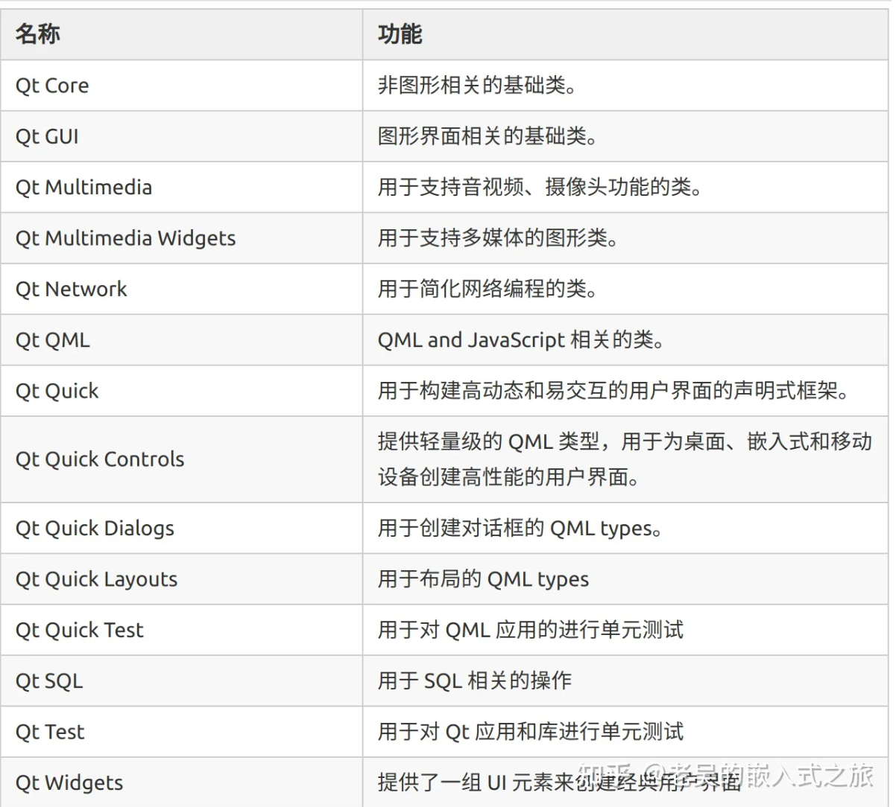

# QT

QT是一个跨平台的C++ 图形用户界面库，目前包括Qt Creator、Qt Designer等快速开发工具。

QT支持 所有Linux/Unix系统，还支持windows平台。Qt很容易扩展，并且允许真正的组件化编程。

Qt与GTK、MFC、OWL、ATL是一样的图形界面库。

优势：

1. 优良跨平台特性
2. 丰富的API（250个以上C++类，基于模板Collections、file、serialization I/O、device等）
3. 支持2D/3D图形渲染，支持OpenGl
4. XML支持/大量开发文档

Qt的开源软件库的相关市场软件：WPS office，VLC多媒体播放器，Google Earth（3D/2D图形渲染）

Qt开发工具：

1. Qt Creator：用于Qt开发的轻量级跨平台集成开发环境，
2. Qt Designer：强大的拖拽式图形化用户界面排版和设计工具
3. Qmake：跨平台的makefile生成器
4. Qt Assistant：帮助文档浏览查询工具
5. Qt linguist：多语言界面支持

Qt基本模块：

Qt扩展模块：

| 扩展模块         | 功能                                                         |
| ---------------- | ------------------------------------------------------------ |
| Qt Concurrent    | 封装了底层线程技术的类库，方便开发多线程程序。               |
| **Qt D-Bus**     | 利用 D-Bus 协议进行进程间交互。                              |
| **Qt 3D**        | 提供声明式语法，在 Qt 程序中可以简单地嵌入 3D 图像。         |
| **Qt Contacts**  | 用于访问地址簿或者联系人数据库的 C++ 和 QML API。            |
| **Qt Location**  | 提供定位机制、地图和导航技术、位置搜索等功能的 QML 和 C++ API。 |
| **Qt Bluetooth** | 提供用于访问蓝牙无线设备的 C++ 和 QML API                    |