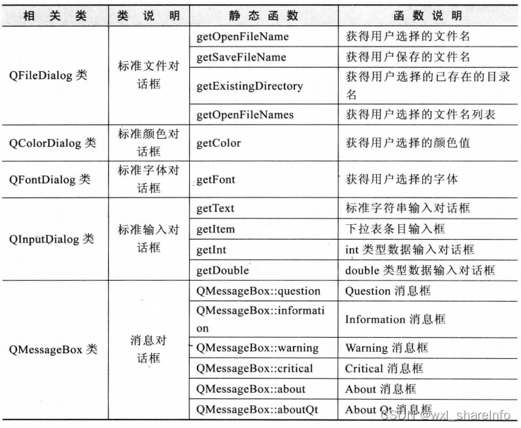

# QT

QT是一个跨平台的C++ 图形用户界面库，目前包括Qt Creator、Qt Designer等快速开发工具。

Qt很容易扩展，并且允许真正的组件化编程。

Qt与GTK、MFC、OWL、ATL是一样的图形界面库。

优势：

1. 优良跨平台特性：支持 所有Linux/Unix系统，还支持windows，Android、IOS、嵌入式系统QNX、Vxworks。
2. 丰富的API（250个以上C++类，基于模板Collections、file、serialization I/O、device等）
3. 支持2D/3D图形渲染，支持OpenGl
4. XML支持/大量开发文档

Qt的开源软件库的相关市场软件：WPS office，VLC多媒体播放器，Google Earth（3D/2D图形渲染）

Qt开发工具：

1. Qt Creator：用于Qt开发的轻量级跨平台集成开发环境，
2. Qt Designer：强大的拖拽式图形化用户界面排版和设计工具
3. Qmake：跨平台的makefile生成器
4. Qt Assistant：帮助文档浏览查询工具
5. Qt linguist：多语言界面支持

Qt基本模块：

| 名称          | 功能                                                         |
| ------------- | ------------------------------------------------------------ |
| Qt Core       | 非图形相关基础类                                             |
| Qt GUI        | 图形界面相关的基础类                                         |
| Qt Multimedia | 用于支持音视频、摄像头功能的类<br />Qt Multimedia Widgets：用于支持多媒体的图形类 |
| Qt Network    | 用于简化网络编程的类                                         |
| Qt QML        | QML and JavaScript相关的类                                   |
| Qt Quick      | 用于构建高动态和易交互的用户界面的声明式框架<br />Qt Quick Controls：提供轻量级的QML类型，用于为桌面、嵌入式和移动设备创建高性能的用户界面<br />Qt Quick Dialogs：用于创建对话框的QML types<br />Qt Quick Layouts：用于布局的QML types<br />Qt Quick Test：用于对QML 应用的进行单元测试 |
| Qt SQL        | 用于SQL相关操作                                              |
| Qt Test       | 用于对Qt应用和库进行单元测试                                 |
| Qt Widgets    | 提供一组UI元素来创建经典用户界面                             |
| Qt Webkit     | 提供了一个Web浏览器引擎，使用它便可以很容易的将www中的内容嵌入到Qt应用程序中 |


Qt扩展模块：

| 扩展模块         | 功能                                                         |
| ---------------- | ------------------------------------------------------------ |
| Qt Concurrent    | 封装了底层线程技术的类库，方便开发多线程程序。               |
| **Qt D-Bus**     | 利用 D-Bus 协议进行进程间交互。                              |
| **Qt 3D**        | 提供声明式语法，在 Qt 程序中可以简单地嵌入 3D 图像。         |
| **Qt Contacts**  | 用于访问地址簿或者联系人数据库的 C++ 和 QML API。            |
| **Qt Location**  | 提供定位机制、地图和导航技术、位置搜索等功能的 QML 和 C++ API。 |
| **Qt Bluetooth** | 提供用于访问蓝牙无线设备的 C++ 和 QML API                    |

# 0 基础

## 0.0 环境搭建

[安装qt 5.15.2](https://zhuanlan.zhihu.com/p/697911596)

## 0.1 [helloworld](https://www.bilibili.com/read/cv18834817)

### 0.1.1 创建项目步骤

1. new project -> application
   - Qt Widgets Application：支持桌面平台的GUI应用程序
   - Qt Console Application：控制台应用程序（没有GUI），一般做服务进程
   - Qt Quick Application-xxx：创建基于Qt quick组件的可部署相关应用程序
2. project  location：
   - 名称：项目名称
   - 创建路径：项目存放的路径
3. build System：
   - qmake
   - cmake
4. details
   - Class Name：一栏中，可以输入主窗口的类名，可以自定义一个名字,例如“MyWidget”。
   - Base class
     - QMainWindow
     - QWidget
     - QDialog
     - 三者之间的关系：
       - QWidget 是QMainWindow和QDialog的父类。
       - QWidget 是一个最简单的窗口，这个窗口被创建出来后，窗口内部什么都没有。
       - QMainWindow 在窗口内部包含了菜单栏，还包含一些工具以及状态栏等。
       - QDialog是一个对话框。对话框是在一个窗口中弹出来的窗口，一般会拥有两个选择按钮，例如确定和取消。
5. translation
   - 设置窗体的语言
6. kits
   - Desktop Qt 5.12.10 MinGW 32-bit
7. summary

### 0.1.2 项目结构


1. helloworld.pro：项目管理文件
   - 这是使用qmake作为构建工具才会用到.pro文件
   - 如果使用cmake作为构建工作会用到CMakefilelist.txt
   - 在高版本的qt中，qt creator提供了cmake作为构建工具，并逐渐放弃qmake。我在5.15.2可以看到这两个工具都还存在。
2. Headers文件夹：项目内部的所有头文件
3. Sources文件夹：项目源文件
   - main.cpp：主函数文件，应用程序的入口
   - mainwindow.cpp主窗口类文件，与headers中的同名.h文件相对应
4. Forms文件夹：窗体设计文件
   - **双击mainwindow.ui即可在设计选项卡设计ui**
5. Other files：用来存放国际化等

**在实际文件目录中，是没有上面这个文件层级结构的。cpp和h文件都放在同一个文件夹中的。**


## 0.2 [信号与槽机制](https://blog.csdn.net/qq_54169998/article/details/125982843)

**信号（Signals）** ：是Qt独有的一种机制，用于**对象之间的通信**。信号由对象发出，其他对象可以连接（connect）到这个信号，以便在信号发出时被通知。

**槽（Slots）**：就是对信号响应的函数。槽函数可以与一个信号关联，当信号被发射的时候，关联的槽函数被自动执行处理。

信号与槽关联是使用**`QObject::connect()`**，QObject是所有QT类的基类。

**要使用信号与槽机制必须在类里添加Q_OBJECT宏**

**使用场景**：

- 用户交互响应：当用户在界面上执行某些操作（如点击按钮）时，发出信号以通知应用程序进行响应。
- 内部状态变化通知：当对象的某些内部状态发生变化时，可以发出信号通知其他对象。例如，当模型数据改变时，通知视图进行更新。

### 0.2.1 原理

信号和槽机制底层是通过函数之间进行相互调用实现的

- 每个信号都可以用函数来表示，称为**信号函数**，每个槽也可以用函数表示，称为**槽函数**。
- 信号函数**只需要声明**（不需要定义和实现），而槽函数**需要定义实现**
- **使用emit关键字发送信号**，我们可以在任何地方使用emit关键字发送信号，包括在槽方法内
- 信号与槽连接：在**构造函数**中，通过connect将信号与定义的槽方法绑定起来 

signals和slots是QT开发当中在C++语言基础上扩展的关键词，专门用于指明信号函数和槽函数。 

[槽函数常用写法](https://blog.csdn.net/LF__plus/article/details/136917892)

```c++
QT_BEGIN_NAMESPACE
namespace Ui {
class Dialog;
}
QT_END_NAMESPACE

// dialog.h
class Dialog : public QDialog
{
    Q_OBJECT

public:
    Dialog(QWidget *parent = nullptr);
    ~Dialog();

private:
    Ui::Dialog *ui;
// 定义信号函数
signals:
    void testFun(QString& str); //信号不能也无需实现
    void Common(QString& str);
// 声明槽函数    
private slots:
    void on_whBtn_clicked();
    void on_zgBtn_clicked();
    void CommonGuys(QString& str);
};

Dialog::Dialog(QWidget *parent)
    : QDialog(parent)
    , ui(new Ui::Dialog)
{

	//信号与槽connect法一：
    connect(this,&Dialog::Common,this,&Dialog::CommonGuys);
    //信号与槽connect法二：
    connect(computeButton,SIGNAL(Common()), this, SLOT(CommonGuys()));

    ui->setupUi(this);
}


void Dialog::on_whBtn_clicked()
{
    QString str="武汉";
    emit Common(str);
}
 
void Dialog::on_zgBtn_clicked()
{
    QString str="中国";
    emit Common(str);
}
void Dialog::CommonGuys(QString& str)
{
    // ....
}
```


```c++
[static] QMetaObject::Connection QObject::connect(const QObject *sender, const char *signal, const QObject *receiver, const char *method, Qt::ConnectionType type = Qt::AutoConnection);

// 参数：
//1. sender：发出信号的对象，
//2. signal: 订阅sender对象的什么信号
//3. receiver：信号接收者
//4. method：信号接收者的槽函数，对对应信号做出响应。

// 信号和槽连接方式一：采用SIGNAL()及SLOT()，这里的函数原型只能写出类型，不能有任何参数名，否则连接将会失败。
connect(this,SIGNAL(Commeon(QString&)),this,SLOT(CommeonGuys(QString&)));
// 信号和槽连接方式二：不使用SIGNAL和SLOT，直接信号和槽的地址
connect(this,&Dialog::Common,this,&Dialog::CommonGuys);
```

信号与槽机制连接方式：

1. 一个信号可以跟另一个信号相连，一个信号可以引起另一个信号的发生
2. 同一信号可以跟多个槽相连（一对多），一个信号可以触发多个槽函数
3. 同一个槽可以响应多个信号（多对一），一个槽函数也可以处理多个信号

信号与槽机制的优势：

- 松散耦合，信号和槽之间通过订阅来建立连接。信号类和槽类之间不相互接触，一个类如果要支持信号和槽，必须继承QObject或QObject的派生类。QT信号和槽机制不支持模板的使用。

信号与槽机制效率：

- **增强对象之间通信的灵活性，但也会损失一些性能。**通过传递一个信号来调用槽函数，将会比直接调用非虚函数慢
- 主要原因：
  - 多线程的时候，信号可能需要排队等待。
  - 编组和解组传递的参数
  - 需要定位接收信号的对象，将信号与之相关的所有槽安全的关联。


### 0.2.2 练习


输入半径，计算对应圆的面积

New Project -> Application -> Qt Widgets Application

Location（项目名称，存放路径）-> 构建系统（选择Cmake）-> Details （基类选择QDialog） -> Translation(国际化，基本上不用) -> 构建套件MinGW 64 bit（使用debug就行）

#### 使用Qt designer实现

##### designer工具栏


1. [编辑伙伴](https://blog.csdn.net/LaoYuanPython/article/details/101909730)：Edit Buddies（编辑伙伴关系）子菜单，该菜单的作用是将一个Label与其他控件关联起来，当Label控件设置了快捷键时，通过Label的快捷键就可以直接使关联控件获得焦点。
2. 水平和垂直布局：先选中多个组件，然后在点击布局，这多个组件就会按照需要进行布局

##### 编写代码与注解

1. main.cpp解析：项目自动添加，main函数就是此工程的入口

   ```c++
   // main.cpp
   #include "dialog.h"
   #include <QApplication>         // Application类的定义，在每个使用Qt图形化应用程序中都必须使用一个QApplication对象
   
   int main(int argc, char *argv[])        // 应用程序入口
   {
       QApplication a(argc, argv);
       Dialog w;
       w.show();       // 当创建一个窗口部件的时候，默认它不可见，必须调用show函数，使其变为可见
       return a.exec();            // 程序进入消息循环，等待可能得输入进行响应。这里将main函数的控制权交由Qt，Qt接收并处理用户和系统的事件并且将它们传递给适当的窗口部件
   }
   ```

2. 双击dialog.ui，对界面进行设计

   ```ui
   <?xml version="1.0" encoding="UTF-8"?>
   <ui version="4.0">
    <class>Dialog</class>
    <widget class="QDialog" name="Dialog">
     <property name="geometry">
      <rect>
       <x>0</x>
       <y>0</y>
       <width>800</width>
       <height>600</height>
      </rect>
     </property>
     <property name="windowTitle">
      <string>Dialog</string>
     </property>
     <widget class="QPushButton" name="pushButton">
      <property name="geometry">
       <rect>
        <x>190</x>
        <y>150</y>
        <width>71</width>
        <height>24</height>
       </rect>
      </property>
      <property name="text">
       <string>计算</string>
      </property>
     </widget>
     <widget class="QLabel" name="label">
      <property name="geometry">
       <rect>
        <x>90</x>
        <y>70</y>
        <width>54</width>
        <height>16</height>
       </rect>
      </property>
      <property name="text">
       <string>半径：</string>
      </property>
     </widget>
     <widget class="QLineEdit" name="button_edit">
      <property name="geometry">
       <rect>
        <x>140</x>
        <y>70</y>
        <width>121</width>
        <height>21</height>
       </rect>
      </property>
     </widget>
     <widget class="QLabel" name="label_2">
      <property name="geometry">
       <rect>
        <x>70</x>
        <y>110</y>
        <width>54</width>
        <height>16</height>
       </rect>
      </property>
      <property name="text">
       <string>圆的面积：</string>
      </property>
     </widget>
     <widget class="QLabel" name="button_res">
      <property name="geometry">
       <rect>
        <x>140</x>
        <y>110</y>
        <width>121</width>
        <height>20</height>
       </rect>
      </property>
      <property name="frameShape">
       <enum>QFrame::Panel</enum>
      </property>
      <property name="frameShadow">
       <enum>QFrame::Sunken</enum>
      </property>
      <property name="text">
       <string/>
      </property>
     </widget>
     <widget class="QLabel" name="label_4">
      <property name="geometry">
       <rect>
        <x>110</x>
        <y>30</y>
        <width>131</width>
        <height>16</height>
       </rect>
      </property>
      <property name="text">
       <string>button触发计算事件</string>
      </property>
     </widget>
     <widget class="QLabel" name="label_5">
      <property name="geometry">
       <rect>
        <x>450</x>
        <y>30</y>
        <width>131</width>
        <height>16</height>
       </rect>
      </property>
      <property name="text">
       <string>输入框内容变化触发</string>
      </property>
     </widget>
     <widget class="QLineEdit" name="input_change">
      <property name="geometry">
       <rect>
        <x>440</x>
        <y>70</y>
        <width>121</width>
        <height>21</height>
       </rect>
      </property>
     </widget>
     <widget class="QLabel" name="label_3">
      <property name="geometry">
       <rect>
        <x>390</x>
        <y>70</y>
        <width>54</width>
        <height>16</height>
       </rect>
      </property>
      <property name="text">
       <string>半径：</string>
      </property>
     </widget>
     <widget class="QLabel" name="input_res">
      <property name="geometry">
       <rect>
        <x>440</x>
        <y>110</y>
        <width>121</width>
        <height>20</height>
       </rect>
      </property>
      <property name="frameShape">
       <enum>QFrame::Panel</enum>
      </property>
      <property name="frameShadow">
       <enum>QFrame::Sunken</enum>
      </property>
      <property name="text">
       <string/>
      </property>
     </widget>
     <widget class="QLabel" name="label_6">
      <property name="geometry">
       <rect>
        <x>370</x>
        <y>110</y>
        <width>54</width>
        <height>16</height>
       </rect>
      </property>
      <property name="text">
       <string>圆的面积：</string>
      </property>
     </widget>
    </widget>
    <resources/>
    <connections/>
   </ui>
   
   ```

   

   

3. 右击ui控件（转到槽），设置槽函数

   ```c++
   // dialog.h
   #ifndef DIALOG_H
   #define DIALOG_H
   
   #include <QDialog>
   
   QT_BEGIN_NAMESPACE
   namespace Ui {
   class Dialog;
   }
   QT_END_NAMESPACE
   
   class Dialog : public QDialog
   {
       Q_OBJECT
   
   public:
       Dialog(QWidget *parent = nullptr);
       ~Dialog();
   
   private slots:
       // 槽函数命名：on_objectName_signalName
       void on_pushButton_clicked();
   
       void on_input_change_textChanged(const QString &arg1);
   
   private:
       Ui::Dialog *ui;
   };
   #endif // DIALOG_H
   
   
   
   
   // dialog.cpp
   #include "dialog.h"
   #include "./ui_dialog.h"
   #define M_PI 3.14
   
   Dialog::Dialog(QWidget *parent)
       : QDialog(parent)
       , ui(new Ui::Dialog)
   {
       // 在构造函数中，使用该句进行界面初始化  
       ui->setupUi(this);
   }
   
   Dialog::~Dialog()
   {
       delete ui;
   }
   
   // 按钮点击槽函数
   void Dialog::on_pushButton_clicked()
   {
       bool ok;
       QString areaStr;
       QString radusStr = ui->button_edit->text();
       int radius = radusStr.toInt(&ok);
       double area = radius * radius * M_PI;
       ui->button_res->setText(areaStr.setNum(area));
   }
   
   // 输入框内容变化槽函数
   void Dialog::on_input_change_textChanged(const QString &arg1)
   {
       bool ok;
       QString areaStr;
       QString radusStr = ui->input_change->text();
       int radius = radusStr.toInt(&ok);
       double area = radius * radius * M_PI;
       ui->input_res->setText(areaStr.setNum(area));
   }
   ```

   

4. 点击右下角，运行就可以看到效果


#### 使用代码实现简单实例

上面的例子是通过设计ui，生成一个类似于XML文档，然后由QT解析此文档，生成对应的ui对象，绑定槽函数。

下面将通过完全代码的方式构建ui，然后绑定槽函数。

```c++
// dialog.h

#ifndef DIALOG_H
#define DIALOG_H

#include <QDialog>
#include <QLabel>
#include <QLineedit.h>
#include<QPushButton>
#include<QGridLayout>
#include<QFrame>
#define M_PI 3.14

QT_BEGIN_NAMESPACE
namespace Ui {
class Dialog;
}
QT_END_NAMESPACE

class Dialog : public QDialog
{
    Q_OBJECT

public:
    Dialog(QWidget *parent = nullptr);
    ~Dialog();

private:
    Ui::Dialog *ui;
    QLabel *radiusLabel;
    QLabel *circleArea;
    QLineEdit *radiusInput;
    QPushButton *computeButton;
private slots:
    void computeCircleArea();

};
#endif // DIALOG_H

```

```c++
// dialog.cpp

#include "dialog.h"
#include "./ui_dialog.h"

Dialog::Dialog(QWidget *parent)
    : QDialog(parent)
    , ui(new Ui::Dialog)
{
    radiusLabel = new QLabel(this);
    radiusInput = new QLineEdit(this);
    computeButton = new QPushButton(this);
    circleArea = new QLabel(this);

    radiusLabel->setText("半径：");

    computeButton->setText("计算对应圆的面积");
    circleArea->setMaximumHeight(50);
    circleArea->setFrameShape(QFrame::Panel);
    circleArea->setFrameShadow(QFrame::Sunken);

    QGridLayout* gridLayout = new QGridLayout(this);
    gridLayout->addWidget(radiusLabel,0,0);
    gridLayout->addWidget(radiusInput,0,1);
    gridLayout->addWidget(circleArea,1,0);
    gridLayout->addWidget(computeButton,1,1);

    // 绑定槽函数api connect
    connect(computeButton,SIGNAL(clicked()), this, SLOT(computeCircleArea()));

    ui->setupUi(this);
}
void Dialog::computeCircleArea(){
    bool ok;
    QString areaStr;
    QString radiusStr = radiusInput->text();
    int radius = radiusStr.toInt(&ok);
    double area = radius * radius * M_PI;
    circleArea->setText(areaStr.setNum(area));
}
Dialog::~Dialog()
{
    delete ui;
}

```

## 0.3 事件

**事件（Events）** 是一种用于处理用户输入（如键盘、鼠标事件）和其他异步事件（如定时器事件）的机制。

事件通常在事件循环中分发，控件可以通过重实现事件处理函数来响应这些事件。

- Qt 程序需要在main()函数创建一个QApplication对象，然后调用它的exec()函数。这个函数就是开始 Qt 的事件循环。在执行exec()函数之后，程序将进入事件循环来监听应用程序的事件。
- 当事件发生时，Qt 将创建一个事件对象。Qt 中所有事件类都继承于QEvent。在事件对象创建完毕后，Qt 将这个事件对象首先传递给目标对象QObject，目标对象内的处理函数决定是否将事件转发给父控件（**相当于js事件的冒泡模式，由内而外**）。
- 如果目标对象有事件过滤器eventFilter，则先判定事件是否被过滤，如果没有被过滤，那么紧接着执行目标对象的event函数。如果被过滤，那么不会执行目标对象event函数）。event()函数并不直接处理事件，而是按照事件对象的类型分派给特定的事件处理函数（event handler），每个类可以对特定的事件处理函数进行重载。


使用场景：

1. 用户输入处理：处理用户的鼠标点击、键盘输入等事件。
2. 定时器事件：使用定时器触发定时任务。
3. 自定义事件

事件和信号是两个不同的概念，信号与事件的区别：

1. 事件指代程序运行中发生的动作或状态改变，通常由操作系统或框架生成和处理。
2. 信号是一种对象间通信机制，用于实现松耦合的消息传递和响应。
3. 它们在编程中有不同的使用场景和目的。


### 0.3.1 [Qt事件相关函数的两种通信方式](https://blog.csdn.net/xiaoyink/article/details/79398953)

1. 通过返回值，通常是boolean类型
   - 返回值决定的事件传递是在同一目标对象的各个事件处理函数之间（eventFilter()，event() ）
2. 通过accept和ignore
   - 事件accept属性（通过event->isAccepted()获取）对应的accept()函数和ignore()函数，他们决定的事件传递是发生在父子控件之间，决定事件是否转发给父控件。**事件是否转发并不取决于accept属性。**
   - 在各个事件处理函数（eventFilter()，event() ）中都可以调用ignore()和accept()，以最后一个调用这两个函数的事件处理函数设置的accept属性值为最终值。
   - 如果在当前目标控件的事件函数处理过程中使用了accept函数，那么事件将不会转发给父控件
   - 如果在当前目标控件的事件函数处理过程中没有使用accept和ignore函数，那么事件将转发给父控件
   - 一旦事件进入到event函数，或者具体事件的处理函数（不论是子控件的还是父控件的事件处理函数），那么event->isAccepted()获取到的值都是true，也就是说，每次事件被event()函数、xxxEvent()(特定事件处理函数)接收到时，事件的accept属性都已经在传入之前被重置为true。

```c++
// 父控件
// mainwindow.h
#include"mylabel.h"
#include <QDebug>
QT_BEGIN_NAMESPACE
namespace Ui {
class MainWindow;
}
QT_END_NAMESPACE

class MainWindow : public QWidget
{
    Q_OBJECT

public:
    MainWindow(QWidget *parent = nullptr);
    ~MainWindow();
protected:
    //重载的事件过滤函数eventFilter
    bool eventFilter(QObject *watched, QEvent *event) override;
    // 重载的事件处理函数handle，它被event函数调用
    void mousePressEvent(QMouseEvent *event) override;
    // event函数内部通过switch(event->type())，对于不同的事件类型，执行不同的handle分支
    // 我们也可以对event函数进行重写，监听当前控件的所有事件，对部分需要处理的事件做出自定义的行为
    // bool event(QEvent *e);
    
private:
    Ui::MainWindow *ui;
    // 子控件
    MyLabel* ml;
};


// mainwindow.cpp
#include "mainwindow.h"
#include "./ui_mainwindow.h"

MainWindow::MainWindow(QWidget *parent)
    : QWidget(parent)
    , ui(new Ui::MainWindow)
{
    ml = new MyLabel("press",this);
    // 允许对象使用自定义的事件过滤器。允许对象在处理其自身事件之前拦截这些事件，并有机会对其进行自定义处理或修改。
    installEventFilter(this);
    
    // ml->installEventFilter(this);
    // 如果子控件mylabel的自定义事件过滤器和父控件的自定义过滤器相同，那么在这里执行这一段代码就行
    // 子控件如果在这里使用了installEventFilter，那么就不要在子控件的构造器里再使用installEventFilter，
    // 否则子控件会执行两个事件过滤器，先执行父控件的过滤器，再执行子控件的过滤器
    
    
}

MainWindow::~MainWindow()
{
    delete ui;
}

bool MainWindow::eventFilter(QObject *watched, QEvent *event) {
    if (event->type() == QEvent::MouseButtonPress) {
        qDebug() << "ParentWidget eventFilter: Mouse button pressed.";
        // qDebug()<< event->isAccepted();
        event->ignore();	
        // 使用ignore或者 没有使用ignore（并且不使用accept），这个事件的accept属性将会被置为false
        // 当在当前对象内执行完剩余该执行的函数后，向父控件转发该事件
        return false;  
        // 返回为false，表示该事件没有被过滤，原本下一个在当前对象内该执行的event()函数将会被执行
        // 返回为true，表示事件被过滤，原本下一个在当前对象内该执行的event()函数将不会被执行
    }
    return QWidget::eventFilter(watched, event); // 默认处理
}

void MainWindow::mousePressEvent(QMouseEvent *event) {
    qDebug() << "ParentWidget mousePressEvent: Mouse button pressed.";
}
```

```c++
// 子控件
// malabel.h

#ifndef MYLABEL_H
#define MYLABEL_H

#include <QObject>
#include <QWidget>
#include<QLabel>
#include <QDebug>
#include<QEvent>
#include<QMouseEvent>

class MyLabel: public QLabel
{
    Q_OBJECT
public:
    MyLabel(QString text,QWidget *parent = nullptr);
    bool eventFilter(QObject *watched, QEvent *event) override;
    void mousePressEvent(QMouseEvent *event) override;
};

#endif // MYLABEL_H


// mylabel.cpp
#include "mylabel.h"

MyLabel::MyLabel(QString text,QWidget *parent):QLabel(text, parent) {
    installEventFilter(this);
}

bool MyLabel::eventFilter(QObject *watched, QEvent *event)  {
    if (event->type() == QEvent::MouseButtonPress) {
        qDebug() << "ChildWidget eventFilter: Mouse button pressed.";
        event->ignore();
        return false;  
    }
    return QWidget::eventFilter(watched, event); // 默认处理
}

void MyLabel::mousePressEvent(QMouseEvent *event) {
    qDebug() << "ChildWidget mousePressEvent: Mouse button pressed.";
    event->ignore();
}
```

打印结果：

```
ChildWidget eventFilter: Mouse button pressed.
ChildWidget mousePressEvent: Mouse button pressed.
ParentWidget eventFilter: Mouse button pressed.
ParentWidget mousePressEvent: Mouse button pressed.
```


### 0.3.2 事件队列

事件循环的简单模型可以描述为Qt程序在while循环中一直调用processEvent()函数，processEvent()函数会处理事件并删除，所以事件循环队列会减少，但在处理事件的过程中Qt程序可能调用postEvent()函数添加新的事件到事件循环队列中去，同时操作系统也会添加事件到事件循环队列中去，所以程序才能一直响应用户请求，sendEvent()函数不添加事件到队列中去，但是它可以看成是应用程序处理当前事件的延长，即在本次processEvent()调用中插入了一个事件，处理完插入的事件，才能继续返回处理本次processEvent()调用要处理的本来事件，并最终又回到事件循环队列中去，而不用像postEvent()那样，将传递的事件放到以后的processEvent()函数调用中去处理。所以sendEvent()可以看成传递的事件被立即处理（同步），postEvent()不能掌控它所传递事件到底什么时候被处理，因为它不知道事件循环队列中排在它所传递的事件之前还有多少个事件（异步）。


假设我们在主窗口类的某一个槽函数allTransactionDone()中调用了QMessageBox::information()函数，我们都知道，这会产生一个模态的对话框，对话框弹出后，我们不能操作主窗口，并且，此槽函数将阻塞到我们做出操作，按照上述逻辑，我们的第一反应是，在槽函数返回前程序都无法维护事件循环队列，主窗口发生的事件将得不到响应，例如主窗口有一个定时器一直触发其相应的槽函数去更新主窗口的图像，那么，我们肯定认为，此时主窗口的图像将停止更新，其实不然，如果按照这种思维，那么当我们去操作弹出的MessageBox时所产生的事件也将无法得到响应，那么程序将无法进行下去，真实的情况是QMessageBox::information()函数最终调用了QMessageBox::exec()来维护事件循环队列，否则，按照上述逻辑，我们同样不能操作弹出的模态对话框，QMessageBox::exec()程序维护的事件循环队列和QApplication::exec()维护的是同一个事件循环队列，并且Qt程序仅此一个事件循环队列，这就像是Qt程序在处理某个事件时，调用了processEvent()函数来将主线程的控制权交出去，去处理其他事件，处理完成后在收回控制权继续处理当前事件，当前事件处理完成后最终将控制权返回给主循环。


## 0.4 项目构建

在使用Qt 5.15.2 的时候，我采用qmake构建整个项目，

通过对CMakeList.txt分析，着重探讨项目构建上的相关问题。

cmake构建示例（简化版）：

``` cmake
cmake_minimum_required(VERSION 3.5)

project(MyProject VERSION 0.1 LANGUAGES CXX)

set(CMAKE_AUTOMOC ON)
# 自动处理Qt的元对象编译
# 当设置为ON时，CMake会自动调用moc（Meta-Object Compiler）工具，处理带有Qt元对象系统相关宏（如Q_OBJECT）的头文件，生成相应的MOC文件。
# 目的：处理信号和槽机制、属性系统和Qt的其他元对象功能。


set(CMAKE_AUTORCC ON)
# 自动处理Qt的资源文件（.qrc）
# 当设置为ON时，CMake会自动调用rcc（Resource Compiler）工具，将资源文件（.qrc）编译为C++代码。
# 目的：将应用程序的资源（如图像、UI文件、其他资源）嵌入到可执行文件中。

set(CMAKE_AUTOUIC ON)
# 自动处理Qt Designer生成的.ui文件
# 控制内容：当设置为ON时，CMake会自动调用uic（User Interface Compiler）工具，将.ui文件转换为对应的C++头文件。
# 目的：将用户界面文件（.ui）转换为可以在C++代码中使用的ui_classname.h。

set(CMAKE_CXX_STANDARD 17)
set(CMAKE_CXX_STANDARD_REQUIRED ON)

find_package(QT NAMES Qt6 Qt5 REQUIRED COMPONENTS Widgets)
find_package(Qt${QT_VERSION_MAJOR} REQUIRED COMPONENTS Widgets)

set(UI_FILES
    mainwindow.ui
)
set(SOURCE_FILES
    main.cpp
    mainwindow.cpp
)
set(HEADER_FILES
    mainwindow.h
)

add_executable(MyProject ${SOURCE_FILES} ${HEADER_FILES} ${UI_FILES})

target_link_libraries(MyProject PRIVATE Qt${QT_VERSION_MAJOR}::Widgets)
```


## 0.5 如何将.ui文件集成到项目中

### 0.5.1 通过ui生成c++代码

#### 构建工具自动生成

Qt Creator使用的`.ui`文件是基于XML格式的文件，用于描述用户界面的布局和组件。

1. 在QT Creator的ide集成环境中，使用使用Qt Designer创建或编辑UI文件（如：mainwindow.ui）
2. uic工具生成头文件（由构建工具【cmake or qmake】自动完成）
   - Qt提供了一个名为`uic`（User Interface Compiler）的工具，它将`.ui`文件转换为C++头文件。通常生成的文件名格式为`ui_classname.h`。
3. 在CMake或qmake中添加规则
   - 项目构建系统（如CMake或qmake）会配置规则，开启set(CMAKE_AUTOUIC ON)
   - 以便在构建时自动调用`uic`工具，生成所需的C++头文件，并将其包含在项目中。
   - 生成的头文件通常会在My_project/build/Deskop_xxxxxxxxx-Debug/My_project_autogen/include中

```c++
// 在ui_mainwindow.h中，会生成两个类
// 一个类Ui_MainWindow
// 一个类namespace Ui {
//    class MainWindow: public Ui_MainWindow {};
// } 

/********************************************************************************
** Form generated from reading UI file 'mainwindow.ui'
**
** Created by: Qt User Interface Compiler version 5.15.2
**
** WARNING! All changes made in this file will be lost when recompiling UI file!
********************************************************************************/

#ifndef UI_MAINWINDOW_H
#define UI_MAINWINDOW_H

#include <QtCore/QVariant>
#include <QtWidgets/QApplication>
#include <QtWidgets/QMainWindow>
#include <QtWidgets/QMenuBar>
#include <QtWidgets/QStatusBar>
#include <QtWidgets/QWidget>

QT_BEGIN_NAMESPACE

class Ui_MainWindow
{
public:
    QWidget *centralwidget;
    QMenuBar *menubar;
    QStatusBar *statusbar;

    void setupUi(QWidget *MainWindow)
    {
        if (MainWindow->objectName().isEmpty())
            MainWindow->setObjectName(QString::fromUtf8("MainWindow"));
        MainWindow->resize(800, 600);
        centralwidget = new QWidget(MainWindow);
        centralwidget->setObjectName(QString::fromUtf8("centralwidget"));
        MainWindow->setCentralWidget(centralwidget);
        menubar = new QMenuBar(MainWindow);
        menubar->setObjectName(QString::fromUtf8("menubar"));
        menubar->setGeometry(QRect(0, 0, 800, 21));
        MainWindow->setMenuBar(menubar);
        statusbar = new QStatusBar(MainWindow);
        statusbar->setObjectName(QString::fromUtf8("statusbar"));
        MainWindow->setStatusBar(statusbar);

        retranslateUi(MainWindow);

        QMetaObject::connectSlotsByName(MainWindow);
    } // setupUi

    void retranslateUi(QWidget *MainWindow)
    {
        MainWindow->setWindowTitle(QCoreApplication::translate("MainWindow", "MainWindow", nullptr));
    } // retranslateUi

};

namespace Ui {
    class MainWindow: public Ui_MainWindow {};
} // namespace Ui

QT_END_NAMESPACE

#endif // UI_MAINWINDOW_H
```


#### [手动生成](https://blog.csdn.net/qq_41359157/article/details/122217975)

当然这个.ui文件转化为ui_classname.h的这个过程，也可以手动完成。


```bash
# 打开qt的命令行工具，输入以下命令即可生成ui对应的头文件。
uic -o ui_classname.h classname.ui
```


### 0.5.2[从类中访问ui实例](https://blog.csdn.net/e5Max/article/details/9869977)

在Qt中，当你使用Qt Designer创建一个UI文件（.ui）并将其转换为C++代码（头文件）后，需要**包含到**对应的类中，然后才能使用。这会涉及到自动生成的代码和手动编写的代码之间的接口问题。也就是**`Ui`命名空间和`setupUi`方法**。

```c++
// mainwindow.h

#ifndef MAINWINDOW_H
#define MAINWINDOW_H

#include <QWidget>

QT_BEGIN_NAMESPACE
namespace Ui {
class MainWindow;
}
QT_END_NAMESPACE

class MainWindow : public QWidget
{
    Q_OBJECT

public:
    MainWindow(QWidget *parent = nullptr);
    ~MainWindow();

private:
    Ui::MainWindow *ui;
};

#endif // MAINWINDOW_H


// mainwindow.cpp
#include "mainwindow.h"
// 将ui_classname.h包括到对应的类
#include "ui_mainwindow.h"	
// 如果是自己手动生成的ui_mainwindow.h，那么需要找到位置自行包括进入就行
// 如果是构建工具cmake自动生成的，那么只需要"ui_classname.h"即可，或者"./ui_classname.h"
MainWindow::MainWindow(QWidget *parent) :
    QWidget(parent),
    ui(new Ui::MainWindow)
{
    ui->setupUi(this); // 初始化界面
}

MainWindow::~MainWindow()
{
    delete ui;
}
```

`ui->setupUi(this)` 应该在构造函数中调用，这是因为：

- **初始化时机**：在构造函数中调用可以确保在对象创建时，所有UI组件都被正确地初始化和设置。
- **设置父子关系**：**将UI文件中定义的组件正确地添加到窗口或对话框中**，并设置它们的**父子关系**。

通过这种方式，你的C++类可以访问和操作由Qt Designer创建的UI组件。例如，**您可以在构造函数或其他成员函数中使用`ui`指针来访问这些被定义在.ui文件中的组件。**

当然还有其他的访问方案，可以参考：[在Qt中如何使用QtDesigner创建的UI文件](https://blog.csdn.net/e5Max/article/details/9869977)

 除了在编译时处理ui文件外，Qt还提供了在运行时动态加载ui文件的机制。通过QtUiTools模块的QUiLoader可以在运行时加载ui文件。可参考：[链接](https://blog.csdn.net/e5Max/article/details/9872309)

## 0.6 元对象

`CMAKE_AUTOMOC` 处理的元对象（Meta-Object）是Qt的元对象系统的一部分。元对象系统是Qt实现其信号和槽机制、属性系统和其他高级功能的核心技术之一。

了解`CMAKE_AUTOMOC`和Qt的元对象系统，需要了解以下几个关键概念：

### 0.6.1元对象系统

Qt的元对象系统是一个反射系统，提供了在运行时查询和操作对象信息的能力。它包含以下主要功能：

1. **信号和槽机制**：用于对象间的通信。
2. **属性系统**：支持对象属性的动态查询和设置。
3. **反射机制**：允许在运行时查询对象的信息，如类名、信号、槽、属性等。

#### Q_OBJECT

**任何需要使用元对象系统的Qt类都必须包含 `Q_OBJECT` 宏。**

**如果一个对象需要使用到信号和槽机制等元对象系统功能，那么它必须包含 `Q_OBJECT`宏**

```c++
class MainWindow : public QWidget
{
    Q_OBJECT

public:
    MainWindow(QWidget *parent = nullptr);
    ~MainWindow();

private:
    Ui::MainWindow *ui;
    
signals:
    void mySignal();

public slots:
    void mySlot();
};
```

#### MOC（Meta-Object Compiler）

MOC是Qt的元对象编译器，用于处理包含`Q_OBJECT`宏的类，生成与元对象系统相关的代码。具体来说，MOC会生成一个包含元对象信息的C++源文件（通常是`moc_<classname>.cpp`），该文件包含以下内容：

- 信号和槽的实现
- 元对象的静态元数据
- 动态属性和方法的实现

#### 元对象构建

在项目的CMakeLists.txt中，必须**`set(CMAKE_AUTOMOC ON)`**，这样构建器才能对属于元对象的类进行编译。这样之后，CMake 会自动处理包含 `Q_OBJECT` 宏的类并生成相应的 MOC 文件。

### 0.6.2 属性系统

#### 动态属性

Qt 的属性系统允许你为任何 `QObject` 派生类的对象动态添加属性，而不需要在类定义中提前声明这些属性。

这种动态属性可以随时设置和查询，无需在类定义中声明。它们的存在仅限于运行时，并且不会影响类的实际结构或预定义属性。

特点：

1. **无需提前声明**：动态属性不需要在类定义中声明，可以在运行时随时添加。
2. **灵活性**：可以根据需要动态调整和使用属性，而不需要修改类的定义。
3. **临时性**：动态属性的生命周期与对象的生命周期一致，当对象销毁时，这些属性也会消失。

**定义方式**：在运行时使用 `setProperty` 和 `property` 方法动态添加和查询属性。

**适用场景**：

- 适合临时需要的属性，不需要在类定义中显式声明。
- 用于插件系统、脚本系统或需要在运行时动态调整配置的场景。
- 灵活性高，但缺乏编译时检查和元数据支持。

```c++
QWidget *widget = new QWidget();
widget->setProperty("myProperty", 42);
QVariant value = widget->property("myProperty");

// 临时定义属性
widget->setProperty("customTitle", "My Custom Widget");
widget->setProperty("customWidth", 300);
widget->setProperty("customHeight", 200);
// 通过这些自定义的属性，拿到值然后赋值给其他属性
QString title = widget->property("customTitle").toString();
int width = widget->property("customWidth").toInt();
int height = widget->property("customHeight").toInt();
widget->setWindowTitle(title);
widget->resize(width, height);
```

#### Q_PROPERTY

**定义方式**：在类定义中使用 `Q_PROPERTY` 宏显式声明。

`Q_PROPERTY` 宏定义类的属性，使得这些属性可以被元对象系统识别和处理。这些属性在运行时和设计时都可以使用，并且可以在对象的元数据中反映出来。

**适用场景**：

- 适合需要在设计时就明确的属性，提供更好的类型安全和编译时检查。
- 支持更多的特性，比如只读属性、写入通知、绑定信号等。
- 生成元数据，可以被Qt的元对象系统识别，用于属性系统、反射、Qt Designer等。
- **信号和槽**：`Q_PROPERTY` 可以与信号和槽机制结合使用，提供属性变化通知的机制，这在数据绑定和动态用户界面更新中非常有用。

语法：

```c++
Q_PROPERTY(type name 
           READ getter 
           [WRITE setter] 
           [RESET resetter] 
           [NOTIFY notifier] 
           [REVISION int] 
           [DESIGNABLE bool] 
           [SCRIPTABLE bool] 
           [STORED bool] 
           [USER bool] 
           [CONSTANT]
           [FINAL])

```

使用示例：

```c++
class MyClass : public QObject {
    Q_OBJECT
    Q_PROPERTY(int value READ value WRITE setValue NOTIFY valueChanged)
    // Q_PROPERTY 声明了一个名为 value 的属性。
    // READ 指定了读取属性的函数 value()。
    // WRITE 指定了写入属性的函数 setValue(int)
    // NOTIFY 指定了属性变化时发出的信号 valueChanged(int)

public:
    MyClass(QObject *parent = nullptr) : QObject(parent), m_value(0) {}
	
    // 读取value属性的函数 
    int value() const { return m_value; }
    // 写value属性的函数
    void setValue(int value) {
        if (m_value != value) {
            m_value = value;
            emit valueChanged(m_value);
        }
    }

signals:
    // value属性发生变化时，触发什么信号
    void valueChanged(int newValue);

private:
    int m_value;
};

```

### 0.6.3反射机制

#### 元对象系统的核心组件

1. **Q_OBJECT 宏**：在类定义中包含 `Q_OBJECT` 宏，使得该类能够生成元数据。这些元数据包括类名、属性、信号和槽等信息。
2. **QMetaObject**：包含了有关类的元数据，可以用于查询类的信息，例如属性、方法、信号和槽等。
3. **QMetaProperty**、**QMetaMethod**、**QMetaEnum** 等：提供对类属性、方法和枚举的访问接口。

性能：反射操作比直接调用方法和访问属性稍慢，应避免在性能关键的代码中频繁使用。

类型安全：反射操作通常通过字符串进行，不如直接调用类型安全，使用时需谨慎。


#### 主要功能

###### 查询类的元数据

通过 `QMetaObject`，可以查询类的元数据，例如类名、属性、信号、槽等。

```c++
#include <QCoreApplication>
#include <QObject>
#include <QMetaObject>
#include <QMetaProperty>
#include <QDebug>

class MyClass : public QObject {
    Q_OBJECT
    Q_PROPERTY(int value READ value WRITE setValue NOTIFY valueChanged)

public:
    MyClass(QObject *parent = nullptr) : QObject(parent), m_value(0) {}

    int value() const { return m_value; }
    void setValue(int value) {
        if (m_value != value) {
            m_value = value;
            emit valueChanged(m_value);
        }
    }

signals:
    void valueChanged(int newValue);

private:
    int m_value;
};

int main(int argc, char *argv[]) {
    QCoreApplication app(argc, argv);

    MyClass obj;
    const QMetaObject *metaObj = obj.metaObject();

    qDebug() << "Class name:" << metaObj->className();
    qDebug() << "Property count:" << metaObj->propertyCount();

    for (int i = metaObj->propertyOffset(); i < metaObj->propertyCount(); ++i) {
        QMetaProperty prop = metaObj->property(i);
        qDebug() << "Property name:" << prop.name();
        qDebug() << "Property type:" << prop.typeName();
    }

    return app.exec();
}

```

##### 动态调用方法

可以使用反射机制动态调用对象的方法，包括槽函数。

```c++
#include <QCoreApplication>
#include <QObject>
#include <QMetaObject>
#include <QDebug>

class MyClass : public QObject {
    Q_OBJECT

public:
    MyClass(QObject *parent = nullptr) : QObject(parent) {}

public slots:
    void mySlot() {
        qDebug() << "mySlot called";
    }
};

int main(int argc, char *argv[]) {
    QCoreApplication app(argc, argv);

    MyClass obj;
    const QMetaObject *metaObj = obj.metaObject();

    metaObj->invokeMethod(&obj, "mySlot");

    return app.exec();
}

```


## 0.5 [数据类型](https://blog.csdn.net/yaolcc/article/details/119395584)

定义在：`#include<QtGlobal>`，QtGlobal头文件包括基本的全局声明。 它包含在大多数其他 Qt 头文件中。

### 0.5.1 基本数据类型

<table><thead><tr><th>类型名称</th><th>注释</th><th>备注</th></tr></thead><tbody><tr><td>qint8</td><td>signed char</td><td>有符号8位数据类型</td></tr><tr><td>qint16</td><td>signed short</td><td>有符号16位数据类型</td></tr><tr><td>qint32</td><td>signed int</td><td>有符号32位数据类型</td></tr><tr><td>qint64</td><td>long long int（或__int64）</td><td>有符号64位数据类型</td></tr><tr><td>qintptr</td><td>qint32 或 qint64</td><td>指针类型，用于带符号整型。 （32位系统为qint32、64位系统为qint64）</td></tr><tr><td>qlonglong</td><td>long long int 或(__int64)</td><td>和qint64定义一样</td></tr><tr><td>qptrdiff</td><td>qint32 或 qint64</td><td>表示指针差异的整型。32位系统为qint32、64位系统为qint64</td></tr><tr><td>qreal</td><td>double</td><td>除非配置了-qreal float选项，否则默认为double</td></tr><tr><td>quint8</td><td>unsigned char</td><td>无符号8位数据类型</td></tr><tr><td>quint16</td><td>unsigned short</td><td>无符号16位数据类型</td></tr><tr><td>quint32</td><td>unsigned int</td><td>无符号32位数据类型</td></tr><tr><td>quint64</td><td>unsigned long long int 或 (unsigned __int64)</td><td>无符号64位数据类型，Windows中定义为unsigned __int64</td></tr><tr><td>quintptr</td><td>quint32 或 quint64</td><td>指针类型，用于无符号整型。32位系统为quint32、64位系统为quint64</td></tr><tr><td>qulonglong</td><td>unsigned long long int 或 (unsigned __int64)</td><td>和quint64定义一样</td></tr><tr><td>uchar</td><td>unsigned char</td><td>无符号字符类型</td></tr><tr><td>uint</td><td>unsigned int</td><td>无符号整型</td></tr><tr><td>ulong</td><td>unsigned long</td><td>无符号长整型</td></tr><tr><td>ushort</td><td>unsigned short</td><td>无符号短整型</td></tr></tbody></table>

### 0.5.2 常用容器类

如果希望自定义数据类型能存储在 Qt 数据容器里面，那么自定义类型必须至少满足三个条件：

- 定义默认构造函数，比如 MyData() ;
- 定义复制构造函数，比如 MyData(const MyData &d);
- 定义赋值运算符 = 函数，比如 MyData& operator=(const MyData &d)


####  [QString](https://blog.csdn.net/qq_41802658/article/details/121490656)

1. 组合（操作）字符串方法：
   - 后向追加append/push_back，前向追加prepend/push_front
   - 模板字符串sprintf/arg
   - 替换与插入replace/insert
2. 查询字符串：
   - 是否以xx开头结尾startsWith/endsWith
   - 包含contains，比较compare
3. 转换
   - 字符数字转换：toInt/toLong/toFloat/toDouble
   - QString转UTF-8(ASCII)：toUtf8
4. 

```c++
#include <QCoreApplication>//QT 提供一个事件循环
#include<QDebug> //输出流
#include<QDateTime>
#include<iostream>
using namespace std;

int main(int argc, char *argv[])
{
    QCoreApplication a(argc, argv);

    // 1. QString
    QString str1 = "I ";
    str1 += "love you";             // 等价于 str1 = str1 + "love you"
    qDebug()<< str1;                //打印出的字符有双引号
    qDebug()<<qPrintable(str1);     //字符串无双引号

    // 2. QString::append(), 等价于+=
    //相关函数：prepend/push_front前向追加，append/push_back
    QString str2 = "I love you";
    str1.append(", me too");        //I love you, me too

    // 3. QString::sprintf()，组合字符串
    //  和c++中的string.h中的sprintf等价
    QString str3 = "I love you";
    str3.sprintf("%s haha %s", "happy 4.5","cheat you"); //happy 4.5 haha cheat you

    // 4. QString::arg()
    QString str4 = QString("%1 is %2 of %3").arg(2000).arg("number").arg("real");
    //   2000 is number of real


    // 5. QString::startsWith()
    QString str5 = "BeiJing welcome to you";

    str5.startsWith("BeiJing",Qt::CaseSensitive);       //true
    str5.endsWith("yo",Qt::CaseSensitive);              //false
    str5.contains("welcome",Qt::CaseSensitive);         //true

    //6. QString::toInt()
    QString str6 = "17";
    bool toIsSuccess = false;
    int hex= str6.toInt(&toIsSuccess,16);
    // 这里的16表示的是原数17的进制是16进制的，0x17 => 23
    // toIsSuccess = true,hex = 23,

    // 7. QString::compare()
    int a1 = QString::compare("abcd","abcd",Qt::CaseSensitive);//a与a的差值，为0
    int b1 = QString::compare("abcd","ABCD",Qt::CaseSensitive);//a（97）与A（65）的差值，32
    int c1 = QString::compare("abcd","c",Qt::CaseInsensitive);//a与c的差值，为-2
    //cout<<"a1= "<<a1<<" b1= "<<b1<<" c1= "<<c1<<endl;// a1= 0 b1= 32 c1= -2

    // 8. QString::toUtf8()
    QString str = "ABC abc";
    QByteArray bytes = str.toUtf8();
    for (int i =0; i<str.size();++i){
        qDebug()<<bytes.at(i);
    }

    

    return a.exec();
}

```

#### QDateTime

```c++
    QDateTime dt;
    QString dtStr = dt.currentDateTime().toString("yyyy-MM-dd HH:mm:ss");	//"2023-04-19 15:59:56"
```

#### [QByteArray](https://blog.csdn.net/kenfan1647/article/details/120326901)

```c++
QString qstrData;
QFile qfile("d:\\testfile.txt");
while(!qfile.atEnd()){
    QByteArray ay =qfile.readLine();
    QString strs(ay);
    qStrdData.append(strs);
}
ui->textBrowser->setText(qstrData);
```


#### QVector

```c++
#include <QCoreApplication>
#include<QDebug>
#include<iostream>
using namespace std;
int main(int argc, char *argv[])
{
    QCoreApplication a(argc, argv);
    QVector<int> qvr;
    //添加方式1
    qvr<<10;
    qvr<<20;
    //添加方式2
    qvr.append(30);
    qvr.append(40);
    
    qDebug()<<qvr;  //QVector(100, 200, 300, 400)

    qvr.count();    //获取元素的个数，4
    qvr<<50;
    qvr<<60;
    qvr.remove(0);   //删除第一个元素, 删除10
    qvr.remove(1,3); //从第二个元素后，删除3个元素（左开右闭），删除30,40,50

    // 遍历
    for(int i = 0;i<qvr.count();i++){
        qDebug()<<qvr[i];
    }

    //是否包含某个元素
    qvr.contains(60);   //true
    return a.exec();
}

```

#### [QList与QLinkedList](https://blog.csdn.net/Newmamahaha/article/details/123277360)

`QList`

对于不同的数据类型，`QList<T>`采取不同的存储策略，策略如下：

- 如果T是一个指针类型或指针大小的基本类型，`QList<T>`将数值直接存储在它的数组中
- 如果QList存储对象的指针，则该指针指向实际存储的对象。

```c++
#include <QCoreApplication>
#include<QDebug>
int main(int argc, char *argv[])
{
    QCoreApplication a(argc, argv);
    QList<int> qlist;
    for(int i=0; i<10; ++i){
        qlist.insert(qlist.end(),i+10);     //插入元素
    }       //(10, 11, 12, 13, 14, 15, 16, 17, 18, 19)

    // QList<int>::iterator 读写迭代器
    QList<int>::iterator x;
    for(x=qlist.begin();x!=qlist.end();x++){
        *x = *x *10 + 6;
    }       //(106, 116, 126, 136, 146, 156, 166, 176, 186, 196)
    // 还有const_iterator只读迭代器，开始需要用constBegin(),结尾要用constEnd()

    //添加元素
    qlist.append(888);
    //查询元素
    qlist.at(3);// 通过索引3，第四个元素，查询元素值，136
    qlist.contains(136);
    //修改qlist列表里的值
    qlist.replace(5,999);//通过索引5，第6个元素，修改为999
    //删除元素
    qlist.removeAt(0);
    qlist.removeFirst();
    qlist.removeAt(6);


    qDebug()<<qlist;

    return a.exec();
}

```

`QLinkedList`

- 是一个链式列表，它以非连续的内存块保存数据
- 不能通过下标引用元素，只能通过迭代器访问数据项，
- 执行插入操作是，拥有更高的效率
- 保存大规模数量量的时候建议使用

```c++
//使用QLinkedList需要包含头文件。#include<QLinkedList>
    QLinkedList<QString> qAllMonth;
    for(int i =1; i<=12;++i){
        qAllMonth<<QString("%1%2").arg("Month:").arg(i);
    }

    QLinkedList<QString>::iterator itrw = qAllMonth.begin();
    for(;itrw!=qAllMonth.end();++itrw){
        qDebug()<<*itrw;
    }
```


#### QMap与QHash


`QMap<K, T>`

- 提供一个类型为k的键到类型为T值的映射。按照键K的次序存储数据T。
- 为提供一键多值的情况，`QMap<K, T>::insertMulti() 和 QMap<K, T>::values()`，也可以采用**QMultiMap<K,T>**

```c++
#include <QCoreApplication>
#include<QDebug>
#include<iostream>
using namespace std;
int main(int argc, char *argv[])
{
    QCoreApplication a(argc, argv);
    QMap<QString,int> qmap;
    qmap["Chinese"] = 100;
    qmap["English"] = 120;
    qmap.insert("Math", 115);
    qmap.insert("Physics",99);
    qmap.insert("Chemistry", 75);
    qDebug()<<qmap;

    qmap.remove("Physics");
    qDebug()<<qmap;

    //1.qt风格迭代
    QMapIterator<QString,int> itr(qmap);
    while(itr.hasNext()){
        itr.next();
        qDebug()<<itr.key()<<":"<<itr.value();
    }

    cout<<endl;
    //2.类STL方式的迭代
    QMap<QString,int>::const_iterator mapitr = qmap.constBegin();
    while (mapitr!=qmap.constEnd()) {
        qDebug()<<mapitr.key()<<":"<<mapitr.value();
        mapitr++;
    }

    //根据key或T相互查找
    qDebug()<<"key-->T"<<qmap.value("Math");
    qDebug()<<"T-->KEY"<<qmap.key(100);

    //修改值
    qmap["English"] = 130;
    qmap.insert("Math", 120);   //覆盖原有值
    qDebug()<<qmap.value("Math");

    //查询是否包含某个键
    qDebug()<<"是否包含Chinese："<<qmap.contains("Chinese");

    //输出所有的键或所有的值
    QList<QString> akeys = qmap.keys();
    qDebug()<<akeys;
    QList<int> avalues = qmap.values();
    qDebug()<<avalues;


    //一个键对应多个值
    QMultiMap<QString,QString> mulmap;
    mulmap.insert("student","no");
    mulmap.insert("student","name");
    mulmap.insert("student","sex");
    mulmap.insert("student","age");
    mulmap.insert("student","high");
    qDebug()<<mulmap;
    return a.exec();
}

```

`QHash<K, T>`

- 具有与QMap一样的API，哈希表的大小与QHash的数据项的数目相适应。
- QHash以任意顺序组织它的数据，当存储数据的顺序无关紧要时，建议使用QHash

```c++
#include <QCoreApplication>
#include<QDebug>
#include<iostream>
using namespace std;
int main(int argc, char *argv[])
{
    QCoreApplication a(argc, argv);
    QHash<QString, int> qhash;
    qhash["key1"] = 100;
    qhash["key2"] = 200;
    qhash["key3"] = 300;
    qhash.insert("key4",400);

    //遍历方式1：通过Qlist
    QList<QString> list = qhash.keys();
    for(int i =0; i<list.length();i++){
        qDebug()<<list[i]<<": "<<qhash.value(list[i]);
    }

    //遍历方式2：通过迭代器
    QHash<QString,int>::const_iterator itr;
    for(itr=qhash.begin();itr!=qhash.end();itr++){
        qDebug()<<itr.key()<<"-->"<<itr.value();
    }

    return a.exec();
}

```

二者区别：

- QHash查找速度更快
- QMap是按照键的顺序进行存储的，QHash是任意顺序存储的。
- **QMap的键必须提供 "<" 运算符，而QHash的键必须提供 "==" 运算符，和一个名为qHash的全局散列函数**

#### QVariant

QVariant 可以保存很多Qt的数据类型，包括QBrush、QColor、QCursor、QDateTime、QFont、QKeySequence、 QPalette、QPen、QPixmap、QPoint、QRect、QRegion、QSize和QString，并且还有C++基本类型，如 int、float等。

也支持自定义类型，被QVariant存储的数据类型需要有一个默认的构造函数和一个拷贝构造函数。为了实现这个功能，首先必须使用**Q_DECLARE_METATYPE()**宏。

```c++
#include "mainwindow.h"
#include<QVariant>
#include<QDebug>
MainWindow::MainWindow(QWidget *parent)
    : QMainWindow(parent)
{
    // 1. 一般类型的使用
    QVariant qv1("ABC");
    qDebug()<<"qv1:"<<qv1.toString();

    // 2. QVariant与QMap结合使用
    QMap<QString,QVariant> qmap;
    qmap["int"] = 2000;
    qmap["double"] = 90.99;
    qmap["string"] = "Good";
    qmap["color"] = QColor(255,255,0);

    //输出：转换函数来处理
    qDebug()<<qmap["int"]<<" "<<qmap["int"].toInt();            //QVariant(int, 2000)   2000
    qDebug()<<qmap["double"]<<" "<<qmap["double"].toDouble();   //QVariant(double, 90.99)   90.99
    qDebug()<<qmap["string"]<<" "<<qmap["string"].toString();   //QVariant(QString, "Good")   "Good"
    qDebug()<<qmap["color"]<<" "<<qmap["color"].value<QColor>();//QVariant(QColor, QColor(ARGB 1, 1, 1, 0))   QColor(ARGB 1, 1, 1, 0)

    // 3. QVariant与QStringList
    QStringList qsl;
    qsl<<"A"<<"B"<<"C"<<"D";
    QVariant qvsl(qsl);
    if(qvsl.type() == QVariant::StringList){
        QStringList qlist = qvsl.toStringList();
        for(int i=0; i<qlist.size();++i){
            qDebug()<<qlist.at(i);
        }   // "A"  "B"  "C"  "D"
    }

    // 4.  QVariant与自定义结构体Student
    // 在.h文件中，定义及声明为Q_DECLARE_METATYPE
    //struct Student{
    //    int no;
    //    QString name;
    //};
    //Q_DECLARE_METATYPE(Student)
    Student stu;
    stu.no = 12345;
    stu.name = "qkk";

    QVariant qstu = QVariant::fromValue(stu);
    //判断是否可以转换原始对象
    if(qstu.canConvert<Student>()){
        //获取原始对象方式一
        Student temp = qstu.value<Student>();			//student: { no:  12345  name:  "qkk" }
        //获取原始对象方式二
        Student qtemp = qvariant_cast<Student>(qstu);	//student: { no:  12345  name:  "qkk" }
        qDebug()<<"student: {"<<"no: "<<temp.no<<" name: "<<temp.name<<"}";
    }
}

MainWindow::~MainWindow()
{
}


```

# 1 常用控件


## 1.1 Button

常用button：

1. Push Button
2. Tool Button
3. Radio Button
4. Check Box
5. Command Link Button
6. Button Box

## 1.2  容器控件

1. Group Box：组合框：提供带有标题的组合框框架。 
2. Scroll Area：滚动区域。
3.  Tool Box：工具箱。 
4. Tab Widget：标签小部件，tab页
5. Stacked Widget：堆叠部件。 
6. Frame：框架。 
7. Widget：小部件。 
8. MdiArea：MDI 区域。 
9. Dock Widget：停靠窗体部件。 只能停靠在mainwindow
10. QAxWidget：封装 Flash 的 A

```c++
#include <QFrame>

Widget::Widget(QWidget *parent)
    : QWidget(parent)
    , ui(new Ui::Widget)
{
    ui->setupUi(this);

    setWindowTitle("Frame框架控件测试");
	
    // ui就是我们绘制界面的对象，可以通过名字来获取相关控件。
    ui->frame_1->setStyleSheet("background-color:yellow");
    ui->frame_2->setStyleSheet("background-color:green");

    ui->frame_1->setLineWidth(1);
    ui->frame_1->setMidLineWidth(1);
    ui->frame_1->setFrameShape(QFrame::Box);
    ui->frame_1->setFrameShadow(QFrame::Raised);

    ui->frame_2->setLineWidth(0);
    ui->frame_2->setMidLineWidth(1);
    ui->frame_2->setFrameShape(QFrame::Box);
    ui->frame_2->setFrameShadow(QFrame::Sunken);

}
```


## 1.3 [项目视图item views](https://blog.csdn.net/jason_thinking/article/details/138041232)

model-based

提供数据模型和视图分开的操作方法。QListView继承于QAbstractItemView

1. List View：清单视图。 
2. Tree View：树视图。
3.  Table View：表视图。 
4. Column View：列视图。
5.  Undo View：撤销命令视图。

`#include <QStandardItemModel>`

QListView是一个基于模型-视图架构的控件，用于展示列表形式的数据。它本身并不存储数据，而是依赖于一个QAbstractListModel或其子类（如QStandardItemModel）来提供数据。使用时需创建模型，填充数据，然后将模型设置给QListView

```c++
#include <QApplication>
#include <QListView>
#include <QStandardItemModel>

int main(int argc, char *argv[])
{
    QApplication app(argc, argv);

    // 创建模型
    QStandardItemModel model;
    for (int i = 0; i < 5; ++i) {
        QStandardItem *item = new QStandardItem(QString("Item %1").arg(i));
        model.appendRow(item);
    }

    // 创建并配置QListView
    QListView listView;
    listView.setModel(&model);
    listView.setWindowTitle("QListView Example");

    // 显示窗口
    listView.show();

    return app.exec();
}

```


## 1.4 [项目控件item widgets](https://blog.csdn.net/jason_thinking/article/details/138041232)

item-based

QListWidget将视图和模型柔和在一起，使用户在item上显示窗口的操作更加简单。

QListWidget继承于QListView，这就提供了视图的操作功能。

1. List Widget：清单控件。`#include <QListWidget>`
2. Tree Widget：树形控件。 
3. Table Widget：表。

[项目视图与项目控件的区别](https://blog.csdn.net/qq_38813056/article/details/88804711)

## 1.5 Containers

Widget对应QWidget。

QWidget是所有Qt GUI界面类的基类，每种类型的组件都是由QWidget的特殊子类提供的。而QWidget又是QObject的子类。

```c++
// QWidget的构造函数
QWidget(QWidget* parent=0, Qt::WindowFlags f=0);
// parent参数：用于指定组件的父窗口，拥有父窗口的Widget对象是一个子窗口组件，而没有父窗口的Widget对象则自成一个窗口
// 窗口标识f参数：它定义了窗口类型（窗口的系统属性）和窗口提示（定义了顶层窗口的外观），Qt::WindowFlags是枚举类，可以通过位或的操作，同时设定好几个flags
// QWidget参数可以调用QWidget::setWindowFlags()和QWidget::setParent()函数去设置上面两个在构造函数中的参数
```

对于QObject，可使用父对象创建Widget以表明其所属关系，每个子类都显示在其父级所拥有的屏幕区域内，当删除父窗口对象时，其包含的所有Widget也都被自动删除。

## 1.6 Input & Display

## 1.7 [布局Layout](https://www.pianshen.com/article/9051976084/)


- 


### 1.1.1 QGridLayout

```c++
// widget.h
#ifndef WIDGET_H
#define WIDGET_H

#include <QWidget>

#include <QGridLayout> // 网格控件头文件
#include <QLabel> // 标签控件头文件
#include <QPushButton> // 命令按钮控件头文件


class Widget : public QWidget
{
    Q_OBJECT

public:
    Widget(QWidget *parent = nullptr);
    ~Widget();


    QGridLayout *pGrid_layouts;

    QPushButton *button1;
    QPushButton *button2;
    QPushButton *button3;
    QPushButton *button4;

};
#endif // WIDGET_H
```

```c++
// widget.cpp

#include "widget.h"

Widget::Widget(QWidget *parent)
    : QWidget(parent)
{
    button1=new QPushButton(this);
    button1->setText("第一区：顶部菜单栏选项");
    button1->setFixedHeight(40); // 设置固定大小高度
    button1->setSizePolicy(QSizePolicy::Expanding,QSizePolicy::Expanding);

    button2=new QPushButton(this);
    button2->setText("第二区：侧边栏选项");
    button2->setFixedWidth(100); // 设置固定大小宽度
    button2->setSizePolicy(QSizePolicy::Expanding,QSizePolicy::Expanding);

    button3=new QPushButton(this);
    button3->setText("第三区：底部选项");
    button3->setFixedHeight(40);
    button3->setSizePolicy(QSizePolicy::Expanding,QSizePolicy::Expanding);

    button4=new QPushButton(this);
    button4->setText("第四区：子窗体选项");
    button3->setSizePolicy(QSizePolicy::Expanding,QSizePolicy::Expanding);

    pGrid_layouts=new QGridLayout();

    // 通过此函数设置左侧 顶部 右侧 底部边距，主要方便布局周围进行使用
    pGrid_layouts->setContentsMargins(0,0,0,0);


    // pGrid_layouts->setMargin(30);
    // pGrid_layouts->setSpacing(40);

    pGrid_layouts->setSpacing(0);


    // 显示位置
    // addWidget(参数1，参数2，参数3，参数4，参数5，参数6)
    /*
    1:我要插入的子布局对象
    2:插入的开始行
    3:插入的开始列
    4:占用的行数
    5:占用的列数
    6:指定对齐方式
    */
    pGrid_layouts->addWidget(button1,0,1);
    pGrid_layouts->addWidget(button2,0,0,3,1);
    pGrid_layouts->addWidget(button3,2,1);
    pGrid_layouts->addWidget(button4,1,1);

    setLayout(pGrid_layouts);

}

Widget::~Widget()
{
}


```


### QDockWidgets（窗口停靠）

QDockWidgets类提供一个窗体部件，其可以停靠在QMainWindow，本身作为一个在桌面的顶级窗口（也就是父窗体）

## 1.8 对话框

QDialog类的子类主要有QMessageBox，QFileDialog，QColorDialog，QFontDialog，QInputDialog等

1. QFileDialog：通过QFileDialog类允许用户遍历系统文件，选择一个或多个文件或目录。

## 1.9 文件操作

QFile，QDir，QFileInfo

QSettings

# 2 布局管理

## 2.1 分割窗口QSpliter类

QSplitter用来进行分裂布局，QSpliter派生于QFrame


```c++
#include <QApplication>         // Application类的定义，在每个使用Qt图形化应用程序中都必须使用一个QApplication对象
#include<QSplitter>
#include<QTextEdit>
#include<QTextCodec>

int main(int argc, char *argv[])        // 应用程序入口
{
    QApplication a(argc, argv);
    QFont font("ZYSong18030",12);								 //指定显示字体
    a.setFont(font);

    //主分割窗口
    QSplitter *splitterMain =new QSplitter(Qt::Horizontal,0);	//(a)
    QTextEdit *textLeft =new QTextEdit(QObject::tr("Left Widget"), splitterMain);																	//(b)
    textLeft->setAlignment(Qt::AlignCenter);					//(c)

    // 右分割窗口													//(d)
    QSplitter *splitterRight =new QSplitter(Qt::Vertical,splitterMain);
    splitterRight->setOpaqueResize(false);						//(e)
    QTextEdit *textUp =new QTextEdit(QObject::tr("Top Widget"), splitterRight);
    textUp->setAlignment(Qt::AlignCenter);

    QTextEdit *textBottom =new QTextEdit(QObject::tr("Bottom Widget"),splitterRight);
    textBottom->setAlignment(Qt::AlignCenter);
    splitterMain->setStretchFactor(1,1);						//(f)
    splitterMain->setWindowTitle(QObject::tr("Splitter"));
    splitterMain->show();
    //MainWindow w;
    //w.show();
    return a.exec();            // 程序进入消息循环，等待可能得输入进行响应。这里将main函数的控制权交由Qt，Qt接收并处理用户和系统的事件并且将它们传递给适当的窗口部件
}
```

## 2.2 窗口停靠QDockWidgets

创建

```c++
// main.cpp

#include <QApplication>         // Application类的定义，在每个使用Qt图形化应用程序中都必须使用一个QApplication对象
#include"dockwindows.h"

int main(int argc, char *argv[])        // 应用程序入口
{
    QApplication a(argc, argv);
    DockWindows dw;
    dw.show();
    return a.exec();            // 程序进入消息循环，等待可能得输入进行响应。这里将main函数的控制权交由Qt，Qt接收并处理用户和系统的事件并且将它们传递给适当的窗口部件
}
```

```c++
// dockwindows.h

#ifndef DOCKWINDOWS_H
#define DOCKWINDOWS_H
#include<QMainWindow>
#include<QDockWidget>
#include<QTextEdit>
class DockWindows:public QMainWindow
{
    Q_OBJECT
public:
    DockWindows(QWidget *parent=0);
    ~DockWindows();
};

#endif // DOCKWINDOWS_H

```


```c++
// dockwindows.cpp

#include "dockwindows.h"

DockWindows::DockWindows(QWidget *parent) : QMainWindow(parent)
{
    setWindowTitle(tr("DockWindows"));	//设置主窗口的标题栏文字

    QTextEdit *te=new QTextEdit(this);	//定义一个QTextEdit对象作为主窗口
    te->setText(tr("Main Window"));
    te->setAlignment(Qt::AlignCenter);
    setCentralWidget(te);          		//将此编辑框设为主窗口的中央窗体

    //停靠窗口1
    QDockWidget *dock=new QDockWidget(tr("DockWindow1"),this);		//创建停靠窗
    
    dock->setFeatures(QDockWidget::DockWidgetMovable);	// 可移动，指定停靠窗口特性
    dock->setAllowedAreas(Qt::LeftDockWidgetArea|Qt::RightDockWidgetArea);	// 设置停靠窗口可以停靠的区域

    QTextEdit *te1 =new QTextEdit();
    te1->setText(tr("Window1,The dock widget can be moved between docks by the user" ""));
    dock->setWidget(te1);		// 在停靠窗体内添加组件
    addDockWidget(Qt::RightDockWidgetArea,dock);	// 将停靠窗口插入QMainWindow，就是当前窗体


    //停靠窗口2
    dock=new QDockWidget(tr("DockWindow2"),this);
    dock->setFeatures(QDockWidget::DockWidgetClosable|QDockWidget::DockWidgetFloatable); 										//可关闭、可浮动
    QTextEdit *te2 =new QTextEdit();
    te2->setText(tr("Window2,The dock widget can be detached from the main window,""and floated as an independent window, and can be closed"));
    dock->setWidget(te2);
    addDockWidget(Qt::RightDockWidgetArea,dock);


    //停靠窗口3
    dock=new QDockWidget(tr("DockWindow3"),this);
    dock->setFeatures(QDockWidget::AllDockWidgetFeatures);   //全部特性
    QTextEdit *te3 =new QTextEdit();
    te3->setText(tr("Window3,The dock widget can be closed, moved, and floated"));
    dock->setWidget(te3);
    addDockWidget(Qt::RightDockWidgetArea,dock);
}
DockWindows::~DockWindows(){
}

```


## 2.3 堆栈QStackedWidget窗体

效果：当选择左侧列表框（QListWidget）中不同的选项时，右侧显示所选的不同窗体。


```c++
// stackdlg.h

#ifndef STACKDLG_H
#define STACKDLG_H
#include<QDialog>
#include<QWidget>
#include<QListWidget>
#include<QLabel>
#include<QStackedWidget>
#include<QHBoxLayout>

class StackDlg:public QDialog
{
    Q_OBJECT
public:
    StackDlg(QWidget *parent=0);
    ~StackDlg();
private:
    QListWidget* list;
    QStackedWidget* stack;
    QLabel* label1;
    QLabel* label2;
    QLabel* label3;
};

#endif // STACKDLG_H

```

```c++
// stackdlg.cpp

#include "stackdlg.h"

StackDlg::StackDlg(QWidget *parent) : QDialog(parent)
{
    setWindowTitle(tr("StackedWidget"));
    // 列表框
    list =new QListWidget(this);	//新建一个QListWidget控件对象
    //在新建的QListWidget控件中插入三个条目，作为选择项
    list->insertItem(0,tr("Window1"));
    list->insertItem(1,tr("Window2"));
    list->insertItem(2,tr("Window3"));


    //创建三个QLabel标签控件对象，作为堆栈窗口需要显示的三层窗体
    label1 =new QLabel(tr("WindowTest1"));
    label2 =new QLabel(tr("WindowTest2"));
    label3 =new QLabel(tr("WindowTest3"));

    //新建一个QStackedWidget堆栈窗体对象
    stack =new QStackedWidget(this);

    //将创建的三个QLabel标签控件依次插入堆栈窗体中
    stack->addWidget(label1);
    stack->addWidget(label2);
    stack->addWidget(label3);

    QHBoxLayout *mainLayout =new QHBoxLayout(this);
        //对整个对话框进行布局
    mainLayout->setMargin(5);		//设定对话框（或窗体）的边距为5
    mainLayout->setSpacing(5);		//设定各个控件之间的间距为5

    mainLayout->addWidget(list);
    mainLayout->addWidget(stack,0,Qt::AlignHCenter);
    mainLayout->setStretchFactor(list,1);		//(a)
    mainLayout->setStretchFactor(stack,3);

    connect(list,SIGNAL(currentRowChanged(int)),stack,SLOT(setCurrentIndex (int)));											//(b)
}

StackDlg::~StackDlg(){}

```

## 2.4 基本布局


- QBoxLayout：直线布局，可以规定排序的方向是从左到右还是从右到左，从上到下还是从下到上布局  

  - QHBoxLayout  ：水平布局

  - QVBoxLayout  ：垂直布局

- QGridLayout  ： 将空间划分为若干个行和列，并把子窗口部件放置到划分成的一个个小空间中

- QFormLayout ：表格布局把布局空间划分为两列，一列一般放标签，另一列一般用于放置LableEdit之类的窗口部件。  

- QStackedLayout：把一系列窗口部件排列成堆叠的形式，每次只能顶部的部件是可见的。

在QBoxLayout和QGridLayout中，都存在addWidget()和addLayout()

- addWidget：用于向布局中添加组件
- addLayout：用于向布局中添加子布局

而QFormLayout和QStackedLayout，只存在addWidget方法。

### 水平布局


```c++
// main.cpp
#include "mainframe.h"
#include <QApplication>
int main(int argc, char *argv[])
{
    QApplication a(argc, argv);
    MainFrame* w = new MainFrame();
    w->show();
    return a.exec();
}
// mainFrame.cpp
MainFrame::MainFrame(QWidget *parent)
    : QDialog(parent)
    , ui(new Ui::MainFrame)
{
    QHBoxLayout* layout = new QHBoxLayout(this);
    QListWidget* list = new QListWidget(this);
    list->addItem("基本信息");
    list->addItem("联系方式");
    list->addItem("详情");
    list->addItem("背景");

    Content * content = new Content(this);

    layout->addWidget(list);
    layout->addWidget(content);

    // // //设置拉伸比例
    layout->setStretch(0, 2);
    layout->setStretch(1, 8);


    QSizePolicy qp = this->sizePolicy();
    qp.setHorizontalPolicy(QSizePolicy::Expanding);
    qp.setVerticalPolicy(QSizePolicy::Expanding);
    this->setSizePolicy(qp);
    this->setStyleSheet("background-color: blue;");
    this->setLayout(layout);
    
}

```


为了使`QSplitter`充满整个`MainFrame`，我们需要将`QSplitter`设置为`MainFrame`的主布局。可以通过设置布局管理器来实现。

```c++
// main.cpp
#include "mainframe.h"
#include <QApplication>

int main(int argc, char *argv[])
{
    QApplication a(argc, argv);
    MainFrame* w = new MainFrame();
    w->show();
    return a.exec();
}

// mainframe.cpp
#include "mainframe.h"
#include "./ui_mainframe.h"

MainFrame::MainFrame(QWidget *parent)
    : QDialog(parent)
    , ui(new Ui::MainFrame)
{

    QSplitter* splitter = new QSplitter(this);

    QListWidget* list = new QListWidget(this);
    list->addItem("基本信息");
    list->addItem("联系方式");
    list->addItem("详情");
    list->addItem("背景");

    Content *content = new Content(this);

    splitter->addWidget(list);
    splitter->addWidget(content);
    splitter->setStyleSheet("background-color: green;");

    // 创建布局管理器，并将splitter添加到布局中
    QVBoxLayout *layout = new QVBoxLayout(this);
    layout->addWidget(splitter);
    setLayout(layout);

    // 确保MainFrame和splitter的大小策略为Expanding
    QSizePolicy qp = this->sizePolicy();
    qp.setHorizontalPolicy(QSizePolicy::Expanding);
    qp.setVerticalPolicy(QSizePolicy::Expanding);
    this->setSizePolicy(qp);

    splitter->setSizePolicy(QSizePolicy::Expanding, QSizePolicy::Expanding);
    this->setStyleSheet("background-color: blue;");
}

MainFrame::~MainFrame()
{
    delete ui;
}
```


## 2.5 [QSizePolicy](http://www.360doc.com/content/23/1018/16/65283686_1100667935.shtml)

基于 [QWidget](https://so.csdn.net/so/search?q=QWidget&spm=1001.2101.3001.7020) 的控件都会继承 sizePolicy 属性（ QSizePolicy 类型），这个属性包括两个大的方面内容：**伸展因子 （Stretch Factor）和 伸展策略（Policy）**，这些都会影响到界面最终的布局显示。

在Qt中，布局管理器（如`QHBoxLayout`, `QVBoxLayout`, `QGridLayout`等）本身是没有`QSizePolicy`属性的。`QSizePolicy`是一个用于控件（如`QWidget`及其子类）的属性，用于指定控件在布局管理器中的大小调整行为。

布局管理器的任务是管理它包含的子控件的布局和大小，并根据子控件的`QSizePolicy`和父控件的约束来分配空间。因此，布局管理器本身没有直接的`QSizePolicy`，而是通过包含的控件的`QSizePolicy`来进行大小调整。

### 2.5.1 布局管理器的工作原理

当添加控件到布局器时，布局器的工作原理如下：

1. 所有的控件初始时，布局器根据布局内子控件自己的 QWidget::sizePolicy() 和 QWidget::sizeHint()，分配相应的空间给各个控件。

   - sizePolicy() 就是控件的尺寸调整策略，比如 QSizePolicy::Fixed 就是不拉伸，空间就是固定的，而 QSizePolicy::Expanding 就是尽可能占据空间，死劲拉伸。
   - sizeHint() 就是控件本身的建议尺寸，或叫最佳尺寸，这个建议尺寸是 Qt 类库自己根据需要显示的内容计算的，所有的控件和窗体都能自己计算建议尺寸。

2. 如果有控件自己设置了大于零的伸展因子（stretch factors），那么在主界面窗口变大时，新增的空闲区域按照控件的伸展因子比例进行分配。

   - 如果有控件的伸展因子设置为 0，那么这个控件会尽量不占用窗口变大后的空闲区域，如果其他控件都不想要空闲区域，伸展因子为 0 的控件才会去尝试占据窗口变大后的空闲区域。
   - 默认情况下，所有控件的伸展因子其实都是 0，这时候布局器会优先拉伸尺寸策略为 QSizePolicy::Expanding 的控件。

3. 当窗口缩小时，布局器会根据控件的最小尺寸限定控件尺寸下限，控件到达它的最小尺寸后就不会继续缩小。

   - 最小尺寸可以是 minimumSize 指定的最小尺寸，如果没设置 minimumSize ，那么最小尺寸是 minimumSizeHint 指定的最小建议尺寸，minimumSizeHint 是 Qt 类库自己计算的，一般不需要程序员设置。（有些特殊情况，如果控件尺寸仅仅由伸展因子 stretch factor 决定，那么就没有最小尺寸和最小建议尺寸）。

   - ```c++
     void setMinimumSize(const QSize &);       //最小尺寸
     
     void setMinimumSize(int minw, int minh);  //最小尺寸
     ```

4. 当窗口变大时，布局器会根据控件的最大尺寸限定控件的尺寸上限，控件达到它的最大尺寸后就不再增长。

   - 最大尺寸由控件的 maximumSize 指定。（有些特殊情况，如果控件尺寸仅仅由伸展因子 stretch factor 决定，那么就没有最大尺寸）。

   - ```c++
     void setMaximumSize(const QSize &);       //最大尺寸
     
     void setMaximumSize(int maxw, int maxh);  //最大尺寸
     ```

     

### 2.5.2 伸展因子

控件和水平布局器、垂直布局器、网格布局器都可以设置**伸展因子**。

窗口拉伸时，布局器会根据每个控件或子布局器的水平和垂直方向的伸展因子，分配新增的空闲空间。例外的是如果控件设置了 sizePolicy 属性里的策略为 QSizePolicy::Fixed 固定高度或固定宽度，**那就不拉伸控件，只拉伸控件之间的间隙。**对于固定宽度或高度的控件，没什么好讨论，因为它们不拉伸。我们下面考虑会拉伸的情形。

如果把 "One" 按钮的 "水平伸展" 设为 2，"Two" 按钮的 "水平伸展" 设为 4，"Three" 按钮的 "水平伸展" 设为 0，那么在窗口拉大时，分配规律就是：先计算伸展因子之和 2+4+0 == 6，新的空间按照 2/6 ，4/6，0/6 的比例划分给这三个按钮。


#### 控件自身设置伸展因子

```c++
void QSizePolicy::setHorizontalStretch(int stretchFactor);
void QSizePolicy::setVerticalStretch(int stretchFactor);
// stretchFactor 的取值范围是 0 到 255，负数就当做 0，大于 255 就当做 255

//获取旧的尺寸策略作为底板，修改需要变动的伸展因子
QSizePolicy sp = ui->pushButton1->sizePolicy();
sp.setHorizontalStretch(2); //水平伸展因子
sp.setVerticalStretch(0);   //垂直伸展因子
//把新策略设置给按钮1
ui->pushButton1->setSizePolicy(sp);
```

#### 布局器设置伸展因子

除了控件自身可以设置伸展因子，布局器也可以为内部直属的控件或子布局器设置伸展因子。

如果布局器和内部直属的控件都设置了伸展因子，那么**布局器的设置会覆盖直属控件的伸展因子**。因此不建议直接设置控件自己的伸展因子属性，而是通过布局器来设置各个子控件或子布局器的伸展因子。

```c++
// 设置序号为 index 的控件或子布局的伸展因子。
void setStretch(int index, int stretch);
// 设置布局器内部 widget 控件的伸展因子, 仅仅设置直属的子控件，该布局器的子布局器内部的孙子控件是不管的。
bool setStretchFactor(QWidget * widget, int stretch);
// 设置内部子布局器 layout 的伸展因子, 仅仅置直属的子布局器，而在子布局器内部的孙子布局器是不管的
bool setStretchFactor(QLayout * layout, int stretch);

// 获取伸展因子
int stretch(int index) const
```

##### 网格布局的伸展因子设置

网格布局器本身是二维的，它会始终保持控件在行和列上的对齐。**不建议直接设置网格布局器内部控件的伸展因子属性**，因为改变一个控件的伸展因子属性就会影响到全部的网格布局。应该通过网格布局器的函数或属性来设置行或列的伸展因子。

```c++
void setRowStretch(int row, int stretch);       //设置整行的伸展因子

void setColumnStretch(int column, int stretch); //设置整列的伸展因子

// 另外还可以设置某个整行的最小高度，或者设置某个整列的最小宽度：

void setRowMinimumHeight(int row, int minSize);      //第 row 行最小高度设置为 minSize

void setColumnMinimumWidth(int column, int minSize); //第 column 列的最小宽度设置为 minSize
```

### 2.5.3 伸展策略

QSizePolicy 关于伸展策略的内容可以分为两个层级：

1. 策略的基本标志位

   - 由 QSizePolicy::PolicyFlag 类型枚举

   - | **枚举标志位**              | **数值** | **描述**                                                     |
     | --------------------------- | -------- | ------------------------------------------------------------ |
     | **QSizePolicy::GrowFlag**   | 1        | 可增长标志，如果有必要的话，可以在建议尺寸之外继续增长。     |
     | **QSizePolicy::ExpandFlag** | 2        | 尽量扩展标志，能占多大空间就占多大。                         |
     | **QSizePolicy::ShrinkFlag** | 4        | 可收缩标志，如果有必要的话，可以在缩小到建议尺寸之后继续缩小。 |
     | **QSizePolicy::IgnoreFlag** | 8        | 忽略建议尺寸，这个增长方式最野蛮，能占多大空间就占多大空间   |

     控件通常不会直接设置策略的基本标志位，因为没有这方面的设置函数。基本标志位的用途，是为了组合成为实用的策略枚举常量，也就是下面第二层级的内容。

2. 策略的枚举常量

   - 伸展策略的枚举常量由 QSizePolicy::Policy 类型枚举，有七个定义好的常量，用于设置控件的水平和垂直伸展策略：

   - | **枚举常量**                      | **数值**                             | **拉伸特点** | **描述**                                                     |
     | --------------------------------- | ------------------------------------ | ------------ | ------------------------------------------------------------ |
     | **QSizePolicy::Fixed**            | 0                                    | 固定         | 以建议尺寸固定住，对于水平方向是固定宽度，垂直方向是固定高度。 |
     | **QSizePolicy::Minimum**          | GrowFlag                             | 被动拉大     | 以建议尺寸为最小尺寸，如果有多余的空间就拉伸，没有多余的空间就保持建议尺寸。被动扩张。 |
     | **QSizePolicy::Maximum**          | ShrinkFlag                           | 被动缩小     | 以建议尺寸为最大尺寸，窗口缩小时，如果其他控件需要，该控件可以尽量缩小为其他控件腾出空间。 |
     | **QSizePolicy::Preferred**        | GrowFlag \| ShrinkFlag               | 被动伸缩     | 以建议尺寸为最佳尺寸，能屈能伸，窗口缩小时可以为其他控件腾出空间，窗口变大时，也可以占据其他控件不需要的空闲空间。基类 QWidget 默认是这种策略。被动扩张。 |
     | **QSizePolicy::Expanding**        | GrowFlag \| ShrinkFlag \| ExpandFlag | 主动扩张     | 建议尺寸仅仅是明智的建议，但控件基本不采用。这个模式也是能屈能伸，但它倾向于主动扩张，它会尽可能占据新增的区域。 |
     | **QSizePolicy::MinimumExpanding** | GrowFlag \| ExpandFlag               | 主动扩张     | 以建议尺寸作为最小尺寸，主动扩张，尽可能占据新增的区域。     |
     | **QSizePolicy::Ignored**          | ShrinkFlag \| GrowFlag \| IgnoreFlag | 野蛮扩张     | 忽略建议尺寸，虽然能屈能伸，但是它会尽最大可能占据空间。     |

     ```c++
     void QSizePolicy::setHorizontalPolicy(Policy policy)  //设置水平策略
     
     void QSizePolicy::setVerticalPolicy(Policy policy)    //设置垂直策略
     ```

     

### 2.5.4 宽高相关性

多数情况下建议尺寸 sizeHint() 的高度和宽度是不相关的，但有些特殊情况，比如能够自动换行的标签控件、菜单栏（后面章节讲解），比如一行长文本自动换行变成两行时，高度是双倍的，如果把标签拉宽，当两 行文本恢复成一行的时候，高度就变成单行的。这种控件越宽，它高度相对低一些，越窄，高度就高一些。因此这些控件的建议尺寸计算时，高度和宽度是相关的。

```c++
void QSizePolicy::setHeightForWidth(bool dependent);   //设置高度依赖宽度
bool QSizePolicy::hasHeightForWidth() const;        //判断高度是否依赖宽度

void QSizePolicy::setWidthForHeight(bool dependent);  //设置宽度依赖高度
bool QSizePolicy::hasWidthForHeight() const;          //判断宽度是否依赖高度
```

### 2.5.5 控件隐藏空间是否释放

程序运行时，控件都可以通过函数 hide() 隐藏自己。在控件隐藏时，控件是否还占据布局器里的空间，这是可以设置的：

```c++
void QSizePolicy::setRetainSizeWhenHidden(bool retainSize)  //设置控件在隐藏时是否仍占据布局器空间

bool QSizePolicy::retainSizeWhenHidden() const     //判断隐藏控件是否占据布局器空间
```


# 3 对话框和主窗口

[Qt QWidget、QDialog、QMainWindow的区别](https://blog.csdn.net/wzz953200463/article/details/134119220)

**QWidget**

- QWidget是所有Qt GUI界面类的基类，每种类型的组件都是由QWidget的特殊子类提供的。而QWidget又是QObject的子类。
- 是Qt框架中最基础的窗口类，可以理解为用户界面的最基本单元。
- QWidget类提供了一个**空白窗口**，可以通过继承该类来创建自定义的窗口类。
- QWidget类提供了基本的窗口属性和方法，如大小、位置、标题、图标等。

**QDialog**

- 是QWidget类的子类，用于**创建对话框窗口**。
- 对话框是指与用户进行交互的特殊窗口，例如提示信息、选择项、输入框等。
- QDialog类提供了一些常用的对话框窗口样式，如消息框、输入框、文件选择框等。

**QMainWindow**

- 同样是QWidget类的子类，用于**创建主窗口**。
- 主窗口一般是应用程序的顶级窗口，通常包含菜单栏、工具栏、状态栏等控件。
- QMainWindow类提供了一些用于创建主窗口的特殊功能，如设置中心部件、状态栏、工具栏等。
- 注意在使用QMainWindow作为基类时，**控件一定要将子控件内容放在CentralWidget中**，否则子控件将无法显示完全。（换言之就是，将子控件的所有内容放在一个QWidget中，然后this->setCentralWidget(widget)）

标准基本对话框：




# log

1. [error: invalid use of incomplete type 'class QMouseEvent'](https://blog.csdn.net/qq_43768296/article/details/116525372)

   ```c++
   // 出现此类错误的原因一般都是没有使用类的头文件。
   // 可以通过查询类的头文件，将其包含进来即可。
   #include<QMouseEvent>
   ```

   

2. ​       
