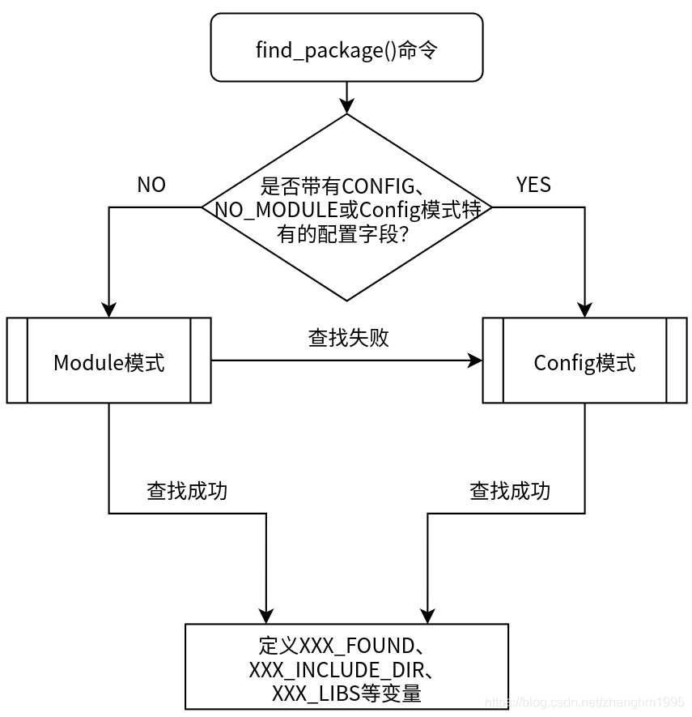
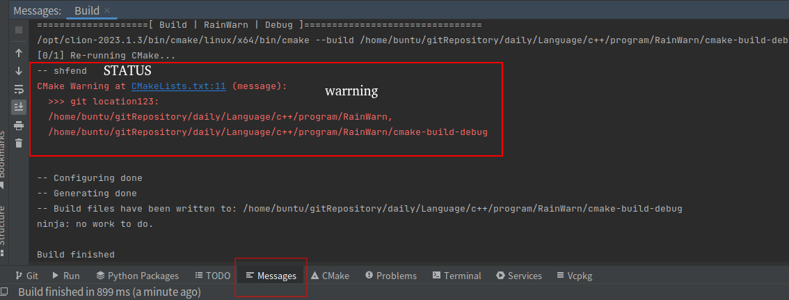

# [CMAKE](https://cmake.org)

[cmake-cookbook书籍](https://github.com/dev-cafe/cmake-cookbook)

cmake内置命令是不区分大小写的， 因此`add_subdirectory`与`ADD_SUBDIRECTORY`作用一致。

cmake所有变量是区分大小写的

# 1 基本打包

## 1.1 [add_executable](https://blog.csdn.net/HandsomeHong/article/details/122402395)：指定可执行文件

```cmake
# 使用指定的源文件创建出一个可执行文件（target）

# 1. 普通可执行文件
add_executable(<name> [WIN32] [MACOSX_BUNDLE]
               [EXCLUDE_FROM_ALL]
               [source1] [source2 ...])
# name：可执行文件名（target name）
# [source]: 构建可执行目标文件所需要的源文件。也可以通过target_sources(在add_executable或add_library之后使用)继续为可执行目标文件添加源文件

# 2. 导入可执行文件
add_executable(<name> IMPORTED [GLOBAL])

set(GIT_EXECUTABLE "/usr/local/bin/git")
add_executable(Git::Git IMPORTED)
set_property(TARGET Git::Git PROPERTY IMPORTED_LOCATION "${GIT_EXECUTABLE}") 

# 3. 别名可执行文件
add_executable(<name> ALIAS <target>)
# 为目标文件取一个别名，以便后续继续使用。为目标创建别名之后，可以使用别名读取目标的属性，但不能修改目标属性。
# The <target> may not be an ALIAS.
```


## 1.2 [add_library](https://www.jianshu.com/p/31db466bc4e5)：声明库

声明或手动编译一个库（target）add_library：用指定文件给工程添加一个库（这个库一般在工程的子目录下），子目录有自己的CMakeLists，但不编译库（由上层主动编译），除非手动

- [包括](https://cmake.org/cmake/help/latest/command/add_library.html#command:add_library)：

- ```cmake
  # 1. 普通库
  add_library(
  	<name>
  	[STATIC | SHARED | MODULE]
  	[EXCLUDE_FROM_ALL] 
  	[source1] [source2 ...]				#soruce也可以是头文件
  	)
  	
  # STATIC 静态库
  # SHARED 动态库
  SET(LIBHELLO_SRC hello.c java.c)
  ADD_LIBRARY(hello SHARED ${LIBHELLO_SRC})
  
  # 给库暴露头文件供上层包含
  target_include_directories(ReadXml PUBLIC ${CMAKE_CURRENT_SOURCE_DIR}/include)
  
  	
  # 2. 导入库 IMPORTED
  #  直接导入已经生成(现有)的库，cmake不会给这类library添加编译规则。
  add_library(
  	<name>
  	<SHARED|STATIC|MODULE|OBJECT|UNKNOWN>
  	IMPORTED
  	[GLOBAL]
  	)
  
  
  # 3. 对象库  OBJECT
  # 编译了源文件，但不链接
  add_library(<name> OBJECT <src>...)
  
  # 4. 别名库  ALIAS
  # 给定library添加一个别名，后续可使用<name>来替代<target>
  add_library(<name> ALIAS <target>)
  
  # 5. 接口库 INTERFACE
  add_library(<name> INTERFACE [IMPORTED [GLOBAL]])
  
  ```

- 实际

  ```cmake
  # add_library 没有指定库类型时，会按照BUILD_SHARED_LIBS变量值，来决定是动态库还是静态库
  # 如果未指定BUILD_SHARED_LIBS 变量，则默认为 STATIC。
  if (NOT DEFINED BUILD_SHARED_LIBS)
      set(BUILD_SHARED_LIBS ON)
  endif()
  ```

  

## 1.3 [add_subdirectory](https://www.jianshu.com/p/07acea4e86a3)：编译库

编译一个库：add_subdirectory：为工程（父目录）添加一个子目录（source_dir），并按照子目录下的CMakeLists.txt构建（编译）该子目录，然后将构建产物输入到binary_dir。主要为工程（父目录）编译库（子目录，至于是动态库还是静态库，由子目录下的CMakeLists.txt 里的add_library 参数决定）。

- 在父目录的CMakeLists.txt执行到此函数时，子目录的CMakeLists.txt开始执行，然后再回到父目录的CMakeLists.txt执行此函数后面的编译选项。

```bash
add_subdirectory (source_dir [binary_dir] [EXCLUDE_FROM_ALL])
# source_dir
# 必选参数。该参数指定一个子目录，子目录下应该包含CMakeLists.txt文件和代码文件。
# 子目录可以是相对路径也可以是绝对路径，如果是相对路径，则是相对当前目录的一个相对路径。

# binary_dir
# 可选参数。该参数指定一个目录，用于存放输出文件。
# 可以是相对路径也可以是绝对路径，如果是相对路径，则是相对当前目录的一个相对路径。
# 如果该参数没有指定，则默认的输出目录使用source_dir。

# EXCLUDE_FROM_ALL
# 可选参数。当指定了该参数，则子目录下的目标不会被父目录下的目标文件包含进去
# 父目录的CMakeLists.txt不会构建子目录的目标文件，必须在子目录下显式去构建。
# 例外情况：当父目录的目标依赖于子目录的目标，则子目录的目标仍然会被构建出来以满足依赖关系（例如使用了target_link_libraries）
```

[实例：CMake - 子目录构建链接动静态库和动态库](https://blog.csdn.net/Jay_Xio/article/details/122019770)


## 1.4 [link_XXX 链接库](https://blog.csdn.net/weixin_38346042/article/details/131069948)

链接一个库：link_directories,  LINK_LIBRARIES,  target_link_libraries

- link_libraries已被废弃（失效）了，建议使用target_link_libraries替代，存疑

- 如果不指定库后缀，默认优先链接动态库。

### link_directories

- ```cmake
  # 1.添加需要链接的库文件目录（https://blog.csdn.net/fengbingchun/article/details/128292359）
  # 相当于g++命令的-L选项，添加编译器可以查找库的文件夹路径，但不会将库链接到target上。
  link_directories(directory1 directory2 ...)
  # 添加路径使链接器可以在其中搜索库。提供给此命令的相对路径被解释为相对于当前源目录。
  # 该命令只适用于在它被调用后创建的target。
  # 还有
  target_link_directories()
  
  
  
  
  ```

- **target_link_libraries 要在 add_executable '之后'，link_libraries 要在 add_executable '之前'**

### link_libraries

```cmake
# 2.添加需要链接的库文件路径（绝对路径），将库链接到稍后添加的所有目标。
link_libraries(absPath1 absPath2...)
link_libraries("/opt/MATLAB/R2012a/bin/glnxa64/libeng.so")
# 如果target调用了某个库，而没有取link，那么就会报undefined reference to `xxx'
# 例如：使用mysql.h里的函数，而没有link mysqlclient 就会报undefined reference to `mysql_init'
```

### target_link_libraries

```cmake
# 3.添加要连接的库文件名称，默认优先链接动态库
# 指定链接 给定目标和其依赖项时 要使用的库或标志。
# 它会在你的生成库或程序中添加rpath。这个可能会在你开发便携时程序时导致某些库找不到。
target_link_libraries(<target>
                      <PRIVATE|PUBLIC|INTERFACE> <item>...
                     [<PRIVATE|PUBLIC|INTERFACE> <item>...]...)
                     
# target不能是ALIAS target。
# PUBLIC 在public后面的库会被Link到你的target中，并且里面的符号也会被导出，提供给第三方使用。
# PRIVATE 在private后面的库仅被link到你的target中，并且终结掉，第三方不能感知你调了啥库
# INTERFACE 在interface后面引入的库不会被链接到你的target中，只会导出符号。
target_link_libraries(myProject eng mx)     
#equals to below 
#target_link_libraries(myProject -leng -lmx) `
#target_link_libraries(myProject libeng.so libmx.so)`

# 以下写法都可以： 
target_link_libraries(myProject comm)       # 连接libhello.so库，默认优先链接动态库
target_link_libraries(myProject libcomm.a)  # 显示指定链接静态库
target_link_libraries(myProject libcomm.so) # 显示指定链接动态库
```


## 1.5 include 包含头

包含头：[include_directories](https://blog.csdn.net/sinat_31608641/article/details/121666564)，[target_include_directories](https://blog.csdn.net/sinat_31608641/article/details/121713191)

- **include_directories 的影响范围最大，可以为CMakelists.txt后的所有target添加头文件目录**
- **一般写在最外层CMakelists.txt中影响全局（向下传递，父目录包含，那么其子目录也自动包含）**

```cmake
# 将指定目录添加到编译器的头文件搜索路径之下，指定的目录被解释成当前源码路径的相对路径。
include_directories ([AFTER|BEFORE] [SYSTEM] dir1 [dir2 ...])

# 默认情况下，include_directories命令会将目录添加到查找列表最后，可以通过命令设置CMAKE_INCLUDE_DIRECTORIES_BEFORE变量为ON来改变它默认行为，将目录添加到列表前面。
# 也可以在每次调用include_directories命令时使用AFTER或BEFORE选项来指定是添加到列表的前面或者后面。
# 如果使用SYSTEM选项，会把指定目录当成系统的搜索目录。该命令作用范围只在当前的CMakeLists.txt。


# 指定目标需要包含的头文件路径。
target_include_directories(
	<target> 
	[SYSTEM] [AFTER|BEFORE]
  	<INTERFACE|PUBLIC|PRIVATE> [items1...]
  	[<INTERFACE|PUBLIC|PRIVATE> [items2...] ...]
)
# target_include_directories的影响范围可以自定义。如加关键子PRIVATE或这PUBLIC。
```


## 1.6 [.cmake文件](https://blog.csdn.net/qq_38410730/article/details/102677143)

`CmakeLists.txt`才是`cmake`的正统文件，而`.cmake`文件是一个模块文件，可以被`include`到`CMakeLists.txt`中。

.cmake文件里包含了一些cmake命令和一些宏/函数，当CMakeLists.txt包含该.cmake文件时，当编译运行时，该.cmake里的一些命令就会在该包含处得到执行，并且在包含以后的地方能够调用该.cmake里的一些宏和函数。

### include指令

include指令**一般用于语句的复用**，也就是说，如果有一些语句需要在很多CMakeLists.txt文件中使用，为避免重复编写，可以将其写在.cmake文件中，然后在需要的CMakeLists.txt文件中进行include操作就行了。

```cmake
include(<file|module> [OPTIONAL] [RESULT_VARIABLE <var>]
                      [NO_POLICY_SCOPE])
include(file|module)

```

**注意**：为了使`CMakeLists.txt`能够找到该文件，需要指定文件完整路径(绝对路径或相对路径)，当然如果指定了`CMAKE_MODULE_PATH`，就可以直接`include`该目录下的`.cmake`文件了。

**.cmake文件里包含了一些cmake命令和一些宏/函数，当CMakeLists.txt包含该.cmake文件时，当编译运行时，该.cmake里的一些命令就会在该包含处得到执行，并且在包含以后的地方能够调用该.cmake里的一些宏和函数**。

### macro宏和function函数

```cmake
macro(<name> [arg1 [arg2 [arg3 ...]]])
  COMMAND1(ARGS ...)            # 命令语句
  COMMAND2(ARGS ...)
  ...
endmacro()

function(<name> [arg1 [arg2 [arg3 ...]]])
  COMMAND1(ARGS ...)            # 命令语句
  COMMAND2(ARGS ...)
  ...
function()

```

定义一个名称为`name`的宏（函数），`arg1...`是传入的参数。我们除了**可以用`${arg1}`来引用变量**以外，系统为我们提供了一些特殊的变量：

| 变量  | 说明                                                 |
| ----- | ---------------------------------------------------- |
| argv# | #是一个下标，0指向第一个参数，累加                   |
| argv  | 所有的定义时要求传入的参数                           |
| argn  | 定义时要求传入的参数以外的参数                       |
| argc  | 传入的实际参数的个数，也就是调用函数是传入的参数个数 |

其实和`C/C++`里面宏和函数之间的区别差不多

- **当宏和函数调用的时候，如果传递的是经`set`设置的变量，必须通过`${}`取出内容**；
- **在宏的定义过程中，对变量进行的操作必须通过`${}`取出内容，而函数就没有这个必要**。


# 2 变量

## 2.1 set

```cmake
set(hello "good")
include(CMakePrintHelpers)		# 这是一个打印帮助工具
cmake_print_variables(hello)
set(hello)
cmake_print_variables(hello)
set(world "morning")
cmake_print_variables(world)
unset(world)
cmake_print_variables(world)
# 结果
-- hello="good"
-- hello=""
-- world="morning"
-- world=""

# 如果设置多个值，将会连接起来(用";"分隔)作为一个整体赋值给变量。
set(VAR0 1 2 3 4)
set(VAR1 "hello" "good" "evening")
message(STATUS "var0 is: ${VAR0}, var1 is: ${VAR1}")
# 结果
-- var0 is: 1;2;3;4, var1 is: hello;good;evening
```

### 2.1.1 普通变量

```cmake
#设置普通变量
set(<variable> <value>... [PARENT_SCOPE]) # 不指定PARENT_SCOPE，变量是函数作用域和目录作用域，加了PARENT_SCOPE就在父作用域
```

### 2.1.2 缓存变量

```cmake
#设置缓存条目
set(<variable> <value>... CACHE <type> <docstring> [FORCE])
# 默认不会覆盖已存在的缓存变量，通过可选参数FORCE可以强制重写。
# 整个编译生命周期都有效。缓存作用域Persistent Cache（cache变量）
# type值并没有强制作用，只作为给读者的提示。
# type必须是以下之一：
#	BOOL：值为ON/OFF
#	FILEPATH：文件路径
#	PATH：文件所在目录的路径
#	STRING：一行文本
#	INTERNAL：文本，主要在运行过程中存储变量，不对外展示。

set(VAR2 "hello" CACHE BOOL "it is my set BOOL test" FORCE)
set(VAR3 "good" CACHE FILEPATH "it is my set FILEPATH test" FORCE)
set(VAR4 "study" CACHE PATH "it is my set PATH test" FORCE)
set(VAR5 "beautiful" CACHE STRING "it is my set STRING test" FORCE)
set(VAR6 "perfect" CACHE INTERNAL "it is my set INTERNAL test" FORCE)

foreach(var VAR2 VAR3 VAR4 VAR5 VAR6)
    message(STATUS "var is ${${var}}")
endforeach()
# 结果
-- var is hello
-- var is good
-- var is study
-- var is beautiful
-- var is perfect

# 在CMakeCache.txt中会有
//it is my set BOOL test
VAR2:BOOL=hello

//it is my set FILEPATH test
VAR3:FILEPATH=good

//it is my set PATH test
VAR4:PATH=study

//it is my set STRING test
VAR5:STRING=beautiful

//it is my set INTERNAL test
VAR6:INTERNAL=perfect
```

### 2.1.3 环境变量

```cmake
#设置环境变量
set(ENV{<variable>} [<value>])		# 环境变量仅用于cmake编译过程，不能用于目标程序，也不会修改操作系统的操作环境变量
$ENV{<variable>}		# 读取环境变量

# 在cmake中查看linux操作系统的环境变量
message(WARNING "PATH=$ENV{PATH}")
```


### [set变量作用域](https://blog.csdn.net/weixin_43708622/article/details/108315184)

- 变量是通过set或unset来设置或取消设置的。
- 函数作用域Function Scope（普通变量），类似于javascript变量作用域，有一个作用域链。除非PARENT_SCOPE来改变函数作用域
- 目录作用域Directory Scope（普通变量），
  - 变量拷贝：当前父目录下CMakeLists.txt的变量，在通过add_subdirectory函数后，子目录的CMakeLists.txt会将变量进行全部拷贝，子目录对变量的修改不会影响父目录CMakeLists.txt的变量的值。
  - 向下有效：具有继承关系的子目录才能获取到父目录的变量。
- 缓存作用域Persistent Cache（cache变量）
  - 缓存变量在整个cmake工程的编译生命周期内都有效，工程内的其他任意目录都可以访问缓存变量，注意cmake是从上到下来解析CMakeLists.txt文件的（所以add_subdirectory执行有个先后顺序，没有继承关系的子目录之间需要，在别人设置之后才能读到）。
  - 所有的 Cache 变量都会出现在 CMakeCache.txt 文件中。
  - 有一个与 Cache 变量同名的 Normal 变量出现时，后面使用这个变量的值都是以 Normal 为准，如果没有同名的 Normal 变量，CMake 才会自动使用 Cache 变量。

[CMake 变量、环境变量、持久缓存区别](https://blog.csdn.net/m0_57845572/article/details/118400027)

## 2.2 [property](https://blog.csdn.net/jjjstephen/article/details/122464085)

**属性不像变量那样持有独立的值，它提供特定于它所附加的实体的信息。**

它们总是附加到特定的实体上，无论是目录、目标、源文件、测试用例、缓存变量，还是整个构建过程本身。

### set_property

```cmake
set_property(<GLOBAL                      |
              DIRECTORY [<dir>]           |
              TARGET    [<target1> ...]   |
              SOURCE    [<src1> ...]
                        [DIRECTORY <dirs> ...]
                        [TARGET_DIRECTORY <targets> ...] |
              INSTALL   [<file1> ...]     |
              TEST      [<test1> ...]     |
              CACHE     [<entry1> ...]    >
             [APPEND] [APPEND_STRING]
             PROPERTY <name> [<value1> ...])
 
 # 其基本格式为：
 set_property(<Scope> [APPEND] [APPEND_STRING] PROPERTY <name> [value...])
 # Scope：属性的宿主，所属对象，或者说属性的范围
 # [APPEND | APPEND_STRING] 可选，表示属性是可扩展的列表。
 # PROPERTY 是标识
 # name：属性名称
 # value：属性值，其值可选。
 
 add_executable(foo foo.cpp)
 set_target_properties(foo PROPERTIES
    CXX_STANDARD 14
    CXX_EXTENSIONS OFF
)
```

<table><tbody><tr><td> <p style="text-align:center;">Scope</p> </td><td> <p style="text-align:center;">Description</p> </td><td> <p style="text-align:center;">相似命令</p> </td></tr><tr><td> <p>GLOBAL</p> </td><td> <p>属性在全局范围内有效，属性名称需唯一</p> </td><td></td></tr><tr><td> <p>DIRECTORY</p> </td><td> <p>在指定目录内有效，可以是相对路径也可以是绝对路径</p> </td><td> <p>set_directory_properties</p> </td></tr><tr><td> <p>TARGET</p> </td><td> <p>设置指定 TARGET 的属性</p> </td><td> <p>set_target_properties/get_target_property</p> </td></tr><tr><td> <p>SOURCE</p> </td><td> <p>属性对应零个或多个源文件。默认情况下，源文件属性仅对添加在同一目录 (CMakeLists.txt) 中的目标可见。</p> </td><td> <p>set_source_files_properties</p> </td></tr><tr><td> <p>INSTALL</p> </td><td> <p>属性对应零个或多个已安装的文件路径。这些可供 CPack 使用以影响部署。</p> </td><td></td></tr><tr><td> <p>TEST</p> </td><td> <p>属性对应零个或多个现有测试。</p> </td><td> <p>set_tests_properties</p> </td></tr><tr><td> <p>CACHE</p> </td><td> <p>属性对应零个或多个缓存现有条目。</p> </td><td></td></tr></tbody></table>


### get_property

```cmake
# 将属性值存放在变量中
get_property(<variable>
             <GLOBAL             |
              DIRECTORY [<dir>]  |
              TARGET    <target> |
              SOURCE    <source>
                        [DIRECTORY <dir> | TARGET_DIRECTORY <target>] |
              INSTALL   <file>   |
              TEST      <test>   |
              CACHE     <entry>  |
              VARIABLE           >
             PROPERTY <name>
             [SET | DEFINED | BRIEF_DOCS | FULL_DOCS])
# variable：变量名
# GLOBAL/DIRECTORY ... /VARIABLE：表示属性对应的范围，与 set_property() 相同
# PROPERTY <name> : 属性名，同 set_property()

# [SET | DEFINED | BRIEF_DOCS | FULL_DOCS] : 可选参数

# SET : 将变量设置为布尔值，指示是否已设置属性；
# DEFINED : 将变量设置为布尔值，指示属性是否已被定义
# BRIEF_DOCS | FULL_DOCS : 如果给定了 Brief_DOCS 或 FULL_DOCS，则将变量设置为包含所请求属性的文档的字符串。
```


```cmake
# 例子
#CMakeLists.txt
cmake_minimum_required(VERSION 3.10.2)
project(test)

set(GIT_EXECUTABLE "/usr/local/bin/git")
add_executable(Git::Git IMPORTED)
set_property(TARGET Git::Git PROPERTY IMPORTED_LOCATION "${GIT_EXECUTABLE}") 
# https://cmake.org/cmake/help/latest/prop_tgt/IMPORTED_LOCATION.html
get_target_property(git_location Git::Git IMPORTED_LOCATION)
get_target_property(git_imported Git::Git IMPORTED)
message(">>> git location: ${git_location}, ${git_imported}")
```

## 2.3  [list](https://www.jianshu.com/p/89fb01752d6f)

`list`命令即对列表的一系列操作，cmake中的`列表`变量是用分号`;`分隔的一组字符串

### 创建列表

```cmake
set (list_test a b c d) # 创建列表变量"a;b;c;d"
list (LENGTH list_test length)
message (">>> LENGTH: ${length}")	# LENGTH: 4
```

### 查询

```cmake
# 得到索引元素
# list (GET <list> <element index> [<element index> ...] <output variable>)
# output variable为新创建的变量，也是一个列表
set (list_test a b c d)
list (GET list_test 0 1 -1 -2 list_new)			# 索引：正数——正序索引，负数——倒序索引
message (">>> GET: ${list_new}")			# GET:a;b;d;c

# 子列表
# list (SUBLIST <list> <begin> <length> <output variable>)
# <length>
#		为-1或列表的长度小于<begin>+<length>，那么将列表中从<begin>索引开始的剩余元素返回。
# 		为0，返回空列表。

# 查找
# list (FIND <list> <value> <output variable>)
# 用于查找列表是否存在指定的元素，找到返回元素的索引，找不到返回-1
set (list_test a b c d)
list (FIND list_test d list_index)			
message (">>> FIND 'd': ${list_index}")		# FIND 'd': 3
```

### 修改

```cmake
# 增
# 会改变原来列表的值。
list (APPEND <list> [<element> ...])
list (INSERT <list> <element_index> <element> [<element> ...])	# 如果元素的位置超出列表的范围，会报错。
list (POP_BACK <list> [<out-var>...])		# 将原列表的最后一个元素移除
list (POP_FRONT <list> [<out-var>...])		# 将原列表的第一个元素移除。

# 过滤
list (FILTER <list> <INCLUDE|EXCLUDE> REGEX <regular_expression>)
# 根据模式的匹配结果，将元素添加（INCLUDE选项）到列表或者从列表中排除（EXCLUDE选项）。
# 此命令会改变原来列表的值。模式REGEX表明会对列表进行正则表达式匹配。
set (list_test a b c d 1 2 3 4) 
list (FILTER list_test INCLUDE REGEX [a-z])
message (">>> FILTER: ${list_test}")		# FILTER: a;b;c;d

# 调序
list (REVERSE <list>)
list (SORT <list> [COMPARE <compare>] [CASE <case>] [ORDER <order>])
```

## 2.4 option

CMake中的option用于控制cmake编译流程。在项目中，难免的需要添加一些选项以供下游选择。

**option命令定义的变量不影响c或c++源码中#ifdef或者#ifndef逻辑判断**

**对于同一选项，子项目值遵循主项目的定义。**

```cmake
option(<variable> "<help_text>" [value])


CMAKE_MINIMUM_REQUIRED(VERSION 3.10)
 
#项目信息
PROJECT(main)
 
IF(TEST)
	MESSAGE("TEST is defined,vlaue:${TEST}")
ELSE()
	MESSAGE("TEST is not defined")
ENDIF()
 
#command option
option(TEST "test affect to code" ON) 
 
#可执行文件
ADD_EXECUTABLE(main main.cpp)
 
IF(TEST)
	MESSAGE("TEST is defined,vlaue:${TEST}")
ELSE()
	MESSAGE("TEST is not defined")
ENDIF()
```

### add_definitions

`add_definitions`的功能和`C/C++`中的`#define`是一样的，可以和option配合使用，也可单独使用。

```c++
#include <iostream>
int main()
{
#ifdef TEST_IT_CMAKE
	std::cout<<"in ifdef"<<std::endl;
#endif
	std::cout<<"not in ifdef"<<std::endl;
}
```


```cmake
cmake_minimum_required(VERSION 3.10)
project(optiontest)

add_executable(optiontest main.cpp)
option(TEST_IT_CMAKE "test" ON)
message(${TEST_IT_CMAKE})
if(TEST_IT_CMAKE)
	message("itis" ${TEST_IT_CMAKE})
	add_definitions(-DTEST_IT_CMAKE)		# option名前需要加-D
endif()
```

## 2.5 [条件结构](https://zhuanlan.zhihu.com/p/653282782)

```cmake
if(<condition>)
  <commands>
elseif(<condition>) # optional block, can be repeated
  <commands>
else()              # optional block
  <commands>
endif()
```

在if后面的变量，不需要使用`${Var}`的形式获取Var的值，而是直接使用Var。

`if(P)`的语法看起来非常奇怪: 尝试对一个变量名称**自动求值**。

如果希望处理一个可能是**变量名的字符串**，建议使用双引号`if("${P}")`，这会**抑制if的自动求值**。

### 2.5.1 基本变量

P可以是最基本的常量，字符串或者变量名。

1. P是有意义的常量：`if(<constant>)`
   - true：
     - 1, ON, YES, TRUE, Y
     - 非零的数，甚至浮点数
   - false：
     - 空字符串
     - 0, OFF, NO, FALSE, N, IGNORE, NOTFOUND, *-NOTFOUND
   - 这里的bool量，不区分大小写，true，True，TRUE都是正。
   - 其它情形会被视作一个变量或一个字符串进行处理
2. P是一个变量的名称(而非变量的值)：`if(<variable>)`
   - true：
     - 变量已定义，并且变量的值不是上述False常量的情形
   - false：
     - 变量已定义，但是变量的值是上述False常量的情形
     - 变量未定义
     - 上述规则对宏结构不使用，对环境变量也不使用(环境变量的名称总是得到False)
3. P是字符串：`if(<string>)`
   - true：可以被解析为True常量的字符串
   - false：通常情形下，其它的字符串

### 2.5.2 逻辑运算

P可以是一些简单的逻辑判断

```cmake
# 取反运算
if(NOT <condition>)

# 与运算
if(<cond1> AND <cond2>)

# 或运算
if(<cond1> OR <cond2>)

if((condition1) AND (condition2 OR (condition3)))
```

### 2.5.3 存在性判断

- `if(COMMAND command-name)`: 判断这个command-name是否属于命令、可调用的宏或者函数的名称，则返回True
- `if(TARGET target-name)`: 判断这个target是否已经被`add_executable(), add_library(), add_custom_target()`这类命令创建，即使target不在当前目录下
- `if(DEFINED <name>|CACHE{<name>}|ENV{<name>})`: 判断这个变量是否已定义
- `if(<variable|string> IN_LIST <variable>)`: 判断这个变量或字符串是否在列表中，见下文的列表操作

### 2.5.4 大小比较

```cmake
# 数字比较
# 小于
if(<variable|string> LESS <variable|string>)
# 大于
if(<variable|string> GREATER <variable|string>)
# 等于
if(<variable|string> EQUAL <variable|string>)
# 小于或等于
if(<variable|string> LESS_EQUAL <variable|string>)
# 大于或等于
if(<variable|string> GREATER_EQUAL <variable|string>)

# 字符串比较
if(<variable|string> STRLESS <variable|string>)
if(<variable|string> STRGREATER <variable|string>)
if(<variable|string> STREQUAL <variable|string>)
if(<variable|string> STRLESS_EQUAL <variable|string>)
if(<variable|string> STRGREATER_EQUAL <variable|string>)

# 版本号比较
if(<variable|string> VERSION_LESS <variable|string>)
if(<variable|string> VERSION_GREATER <variable|string>)
if(<variable|string> VERSION_EQUAL <variable|string>)
if(<variable|string> VERSION_LESS_EQUAL <variable|string>)
if(<variable|string> VERSION_GREATER_EQUAL <variable|string>)
```

### 2.5.5 路径与文件判断

细节比较多，用时再查文档

```cmake
# 完整路径是否存在，这里~开头的还不行
if(EXISTS path-to-file-or-directory)

# 两个完整路径下的文件比较时间戳
if(file1 IS_NEWER_THAN file2)

# 完整路径是否是一个目录
if(IS_DIRECTORY path-to-directory)

# 完整路径是不是绝对路径
if(IS_ABSOLUTE path)
# 对于windows，要求路径以盘符开始
# 对于linux，要求路径以~开始
# 空路径视作false
```

## 2.6 [循环结构](https://blog.csdn.net/maizousidemao/article/details/132654835)

### 2.6.1 foreach

```cmake
foreach(<loop_var> <item1> <item2> <item3>...)
  <commands>
endforeach()
# eg:
set(item1 a)
set(item2 b)
set(item3 c)
set(item4 d)
foreach(var ${item1} ${item2} ${item3} ${item4})
    message("var = ${var}")
endforeach()

foreach(<loop_var> RANGE <stop>)
# eg:
foreach(var RANGE 5)
    message("var = ${var}")
endforeach()

foreach(<loop_var> RANGE <start> <stop> [<step>])
#eg:
foreach(var RANGE 2 10 2)
    message("var = ${var}")
endforeach()

foreach(<loop_var> IN [LISTS [<lists>]] [ITEMS [<items>]]) 		# 用LISTS指定列表后不需要用 ${}对列表进行取值。
# eg:
set(myList 1 2 3 4)
foreach(var IN LISTS myList)
    message("var = ${var}")
endforeach()

foreach(<loop_var>... IN ZIP_LISTS <lists>)
eg:
set(myList0 a b c d)
set(myList1 1 2 3 4)
foreach(var0 var1 IN ZIP_LISTS myList0 myList1)
    message("var0 = ${var0}, var1 = ${var1}")
endforeach()
```

### 2.6.2 while

```cmake
while(<condition>)
	<commands>
endwhile()

list(LENGTH myList listLen)
while(listLen GREATER 0)
    message("myList = ${myList}")
    list(POP_FRONT myList)
    list(LENGTH myList listLen)
endwhile()
----------------
myList = 1;2;3;4
myList = 2;3;4
myList = 3;4
myList = 4

```

也可以通过 `break()` 跳出循环，通过 `continue()` 结束本次循环并继续下次循环。


## cmake内置变量

```cmake
CMAKE_SOURCE_DIR			# 源码树的最顶层目录(也就是项目CMakeLists.txt文件所在的地方)
CMAKE_CURRENT_SOURCE_DIR	# CMake正在处理的CMakeLists.txt文件所在的目录。
							# 每次在add_subdirectory()调用的结果中处理新文件时，它都会更新，并在完成对该目录的处理后再次恢复。
CMAKE_CURRENT_LIST_DIR		# 自2.8.3开始，代表当前正在处理的列表文件的完整目录，和CMAKE_CURRENT_SOURCE_DIR几乎一样
							# 只是在CMakeLists.txt里有include(src/CMakeLists.txt)代码时，
							# CMAKE_CURRENT_SOURCE_DIR指向外部的CMakeLists，而CMAKE_CURRENT_LIST_DIR将指向src
							# https://blog.csdn.net/jacke121/article/details/106550720
							
CMAKE_BINARY_DIR			# 构建树的最顶层目录。
CMAKE_CURRENT_BINARY_DIR	# 当前CMake正在处理的CMakeLists.txt文件对应的构建目录。
							# 每次调用add_subdirectory()时它都会改变，并在add_subdirectory()返回时再次恢复。

EXECUTABLE_OUTPUT_PATH		# 指定最终的可执行文件生成的位置
LIBRARY_OUTPUT_PATH			# 指定库文件的输出目录
```


# 3 [依赖](https://blog.csdn.net/zhizhengguan/article/details/118396145)

## 3.1 [add_dependencies](https://blog.csdn.net/BeanGuohui/article/details/120217097) 指定依赖

给目标指定依赖项，依赖项可被先行编译。如此就不会报undefined reference

```cmake
add_dependencies(<target> [<target-dependency>]...)
```

在项目中通常会遇见这样的情况：（例如一个项目中有：main，libhello.a， libworld.a），当项目过小的时候，编译顺序是*.a，然后是main，但是当一个项目的文件过于庞大，就会导致编译的顺序不会按照主CMAKE的add_subdirectory引入的先后顺序，为了解决这一问题，就需要使用add_dependencies进行依赖指定。

```cmake
├── CMakeLists.txt// 下面用主CMAKE表示
├── hello
│   ├── CMakeLists.txt		// 下面用HELLOCMAKE表示
│   ├── hello.c
│   └── hello.h
├── main
│   ├── CMakeLists.txt		// 下面用MAINCMAKE表示
│   └── main.c
└── world
    ├── CMakeLists.txt		// 下面用WORLDCMAKE表示
    ├── world.c
    └── world.h
```

```cmake
# hellocmake
cmake_minimum_required(VERSION 3.5.1)
set(CMAKE_C_STANDARD 99)
add_library(hello STATIC world.c hello.h)

# worldcmake
cmake_minimum_required(VERSION 3.5.1)
set(CMAKE_C_STANDARD 99)
add_library(world STATIC world.c world.h)

# maincmake 
cmake_minimum_required(VERSION 3.5.1)
project(CmakeDemo C)
set(CMAKE_LIBRARY_OUTPUT_DIRECTORY /home/lib)
set(CMAKE_C_STANDARD 99)

add_executable(CmakeDemo main.c)
link_directories(/home/lib)			# 依赖hello.a 和 world.a
target_link_libraries(
        CmakeDemo
        hello
        world
)

# 主cmake 最外层CMakeLists.txt
cmake_minimum_required(VERSION 3.5)

add_subdirectory(main)	# main是依赖后二者的，而这里add_subdirectory却写在后二者的前面
						# 所以这里应该让hello和world先编译，故有了add_dependencies
add_subdirectory(hello)
add_subdirectory(world)

add_dependencies(CmakeDemo hello world)
# add_dependencies中所填写的名字应该是其他CMAKE生成目标的名字。
# 该示例中如果写成add_dependencies（CmakeDemo libhello.a libworld.a）则会报错。

# 这样写的好处在于，当一个项目构建的时候，由于依赖关系的存在，所以被依赖的项目总是最先构建，这样就不会出现找不到库而报错。
```


[参考1](https://blog.csdn.net/KingOfMyHeart/article/details/112983922)


## 3.2 查找文件find_file

- **该命令用于查找指定文件的完整路径**。
- 创建一个名为< VAR >的缓存条目(如果指定了NO_CACHE，则是一个普通变量)来存储此命令的结果。
  - 如果找到文件的完整路径，则结果存储在变量中，**并且搜索不会重复，除非该变量被清除。**
  - 如果没有找到，结果将是< VAR >-NOTFOUND。

```cmake
find_file (<VAR> name1 [path1 path2 ...])
find_file (
          <VAR>
          name | NAMES name1 [name2 ...]
          [HINTS [path | ENV var]... ]
          [PATHS [path | ENV var]... ]
          [PATH_SUFFIXES suffix1 [suffix2 ...]]
          [DOC "cache documentation string"]
          [NO_CACHE]
          [REQUIRED]
          [NO_DEFAULT_PATH]
          [NO_PACKAGE_ROOT_PATH]
          [NO_CMAKE_PATH]
          [NO_CMAKE_ENVIRONMENT_PATH]
          [NO_SYSTEM_ENVIRONMENT_PATH]
          [NO_CMAKE_SYSTEM_PATH]
          [CMAKE_FIND_ROOT_PATH_BOTH |
           ONLY_CMAKE_FIND_ROOT_PATH |
           NO_CMAKE_FIND_ROOT_PATH]
         )

```

## 3.3 查找包[find_package](https://blog.csdn.net/zhanghm1995/article/details/105466372)

`find_package`本质上就是一个**搜包的命令**，通过一些特定的规则（路径）找到`<package_name>Config.cmake`或`Find<PackageName>.cmake`包配置文件，通过执行该配置文件，从而定义了一系列的变量（eg：`OpenCV_DIR`、`OpenCV_INCLUDE_DIRS`和`OpenCV_LIBS`），通过这些变量就可以准确定位到**OpenCV库的头文件和库文件**，完成编译。

find_package命令有两种工作模式，这两种工作模式的不同决定了其搜包路径的不同：

- Module模式
  find_package命令基础工作模式(Basic Signature)，也是默认工作模式。

- Config模式
  find_package命令高级工作模式(Full Signature)。 只有在find_package()中指定CONFIG、NO_MODULE等关键字，或者**Module模式查找失败后才会进入到Config模式。**



### module模式

```cmake
find_package(<package> [version] [EXACT] [QUIET] [MODULE]
             [REQUIRED] [[COMPONENTS] [components...]]
             [OPTIONAL_COMPONENTS components...]
             [NO_POLICY_SCOPE])

```

**Module**模式下是要查找到名为`Find<PackageName>.cmake`的配置文件。

Module模式只有两个查找路径：**CMAKE_MODULE_PATH**和cmake安装路径(**CMAKE_ROOT**)下的**Modules**目录

```cmake
# 一定记住是在这两个路径的Modules目录下查找Find<PackageName>.cmake
message(STATUS "CMAKE_MODULE_PATH = ${CMAKE_MODULE_PATH}")		# 默认为空
message(STATUS "CMAKE_ROOT = ${CMAKE_ROOT}")

# 如果直接使用find_package报找不到FindXxxx.cmake, 可以指定文件目录去查找，例如下面这个TensorRT的例子
list (APPEND CMAKE_MODULE_PATH ${CMAKE_CURRENT_SOURCE_DIR}/cmake)
```


### config模式

```cmake
find_package(<package> [version] [EXACT] [QUIET]
             [REQUIRED] [[COMPONENTS] [components...]]
             [CONFIG|NO_MODULE]
             [NO_POLICY_SCOPE]
             [NAMES name1 [name2 ...]]
             [CONFIGS config1 [config2 ...]]
             [HINTS path1 [path2 ... ]]
             [PATHS path1 [path2 ... ]]
             [PATH_SUFFIXES suffix1 [suffix2 ...]]
             [NO_DEFAULT_PATH]
             [NO_CMAKE_ENVIRONMENT_PATH]
             [NO_CMAKE_PATH]
             [NO_SYSTEM_ENVIRONMENT_PATH]
             [NO_CMAKE_PACKAGE_REGISTRY]
             [NO_CMAKE_BUILDS_PATH] # Deprecated; does nothing.
             [NO_CMAKE_SYSTEM_PATH]
             [NO_CMAKE_SYSTEM_PACKAGE_REGISTRY]
             [CMAKE_FIND_ROOT_PATH_BOTH |
              ONLY_CMAKE_FIND_ROOT_PATH |
              NO_CMAKE_FIND_ROOT_PATH])

```

**CMake默认采取Module模式，如果Module模式未找到库，才会采取Config模式。**

**Config**模式下是要查找名为`<PackageName>Config.cmake`或`<lower-case-package-name>-config.cmake`的模块文件。

**Config**模式需要查找的路径非常多，具体查找顺序为：

1. 名为`<PackageName>_DIR`的CMake变量或环境变量路径
2. 名为`CMAKE_PREFIX_PATH`、`CMAKE_FRAMEWORK_PATH`、`CMAKE_APPBUNDLE_PATH`的CMake变量或**环境变量**路径
3. `PATH`环境变量路径

如果没有，CMake会继续**检查或匹配**这些根目录下的以下路径

```cmake
<prefix>/(lib/<arch>|lib|share)/cmake/<name>*/
<prefix>/(lib/<arch>|lib|share)/<name>*/ 
<prefix>/(lib/<arch>|lib|share)/<name>*/(cmake|CMake)/
```

### 查找指定位置的.cmake

如果你明确知道想要查找的库`<PackageName>Config.cmake`或`<lower-case-package-name>-config.cmake`文件所在路径，为了能够准确定位到这个包，可以直接设置变量`<PackageName>_DIR`为具体路径，如：

```cmake
set(OpenCV_DIR "/home/zhanghm/Softwares/enviroment_config/opencv3_4_4/opencv/build")
```

如果你有多个包的配置文件需要查找，可以将这些配置文件都统一放在一个命名为cmake的文件夹下，然后设置变量CMAKE_PREFIX_PATH变量指向这个cmake文件夹路径，需要注意根据上述的匹配规则，此时每个包的配置文件需要单独放置在命名为包名的文件夹下（文件夹名不区分大小写），否则会提示找不到。

```cmake
find_package(OpenCV REQUIRED)

message(WARNING "CMAKE_MODULE_PATH=${CMAKE_MODULE_PATH}")
message(WARNING "CMAKE_ROOT=${CMAKE_ROOT}")
message(WARNING "CMAKE_APPBUNDLE_PATH=${CMAKE_APPBUNDLE_PATH}")
message(WARNING "CMAKE_FRAMEWORK_PATH=${CMAKE_FRAMEWORK_PATH}")
message(WARNING "CMAKE_PREFIX_PATH=${CMAKE_PREFIX_PATH}")
message(WARNING ${OpenCV_DIR})
message(WARNING ${OpenCV_INCLUDE_DIRS})
message(WARNING ${OpenCV_LIBS})
```


其它例子：

```cmake
find_package(CUDA REQUIRED)
list(APPEND ALL_LIBS 
  ${CUDA_LIBRARIES} 
  ${CUDA_cublas_LIBRARY} 
  ${CUDA_nppc_LIBRARY} ${CUDA_nppig_LIBRARY} ${CUDA_nppidei_LIBRARY} ${CUDA_nppial_LIBRARY})
message(${CUDA_INCLUDE_DIRS})
```


## 3.4 查找库find_library

该命令用于查找库（动态库或者静态库，**默认查找动态库**），当构建依赖于第三方库/系统库，可以使用该命令来查找并使用库。

[每个参数的讲解](https://blog.csdn.net/fengbingchun/article/details/127232175)，[搜索路径和优先级](https://blog.csdn.net/u013250861/article/details/127935842)

```cmake
find_library(
          <VAR>
          name | NAMES name1 [name2 ...] [NAMES_PER_DIR]
          [HINTS [path | ENV var]... ]
          [PATHS [path | ENV var]... ]
          [REGISTRY_VIEW (64|32|64_32|32_64|HOST|TARGET|BOTH)]
          [PATH_SUFFIXES suffix1 [suffix2 ...]]
          [DOC "cache documentation string"]
          [NO_CACHE]
          [REQUIRED]
          [NO_DEFAULT_PATH]
          [NO_PACKAGE_ROOT_PATH]
          [NO_CMAKE_PATH]
          [NO_CMAKE_ENVIRONMENT_PATH]
          [NO_SYSTEM_ENVIRONMENT_PATH]
          [NO_CMAKE_SYSTEM_PATH]
          [NO_CMAKE_INSTALL_PREFIX]
          [CMAKE_FIND_ROOT_PATH_BOTH |
           ONLY_CMAKE_FIND_ROOT_PATH |
           NO_CMAKE_FIND_ROOT_PATH]
)
# NO_CACHE：该选项将<var>变量当成一个普通变量而不是一个缓存条目
# REQUIRED：指定该选项后，当找不到库，会输出一条错误信息并终止cmake处理过程；未指定REQUIRED选项，当find_library未找到库时，后续find_library有针对<var>的调用会继续查找。
```


- `<VAR>`

  - `<VAR>`可以是普通变量（需要指定`NO_CACHE`选项），也可以是缓存条目（意味着会存放在`CMakeCache.txt`中，不删除该文件或者用`set`重新设置该变量，其存储的值不会再刷新）；

  - 当库能被找到，`<var>`会被存放正常的库路径，当库未被找到，`<var>`中存放的值为`"<var>-NOTFOUND"`。只要`<var>`中的值`不是"<var>-NOTFOUND"`，那么即使多次调用`find_library`，`<var>`也不会再刷新;

- name

  - `name`用于指定待查找的库名称，库名称可以使用全称，例如`libmymath.a`（优先会当成全名搜索），**全称必须前后缀都在，不然查找不到**；
  - 也可以不带前缀（例如前缀`lib`）和后缀（例如`Linux`中的`.so`、`.a`，`Mac`中的`.dylib`等），直接使用`mymath`（**前后缀都不在**）；、

- NAMES：为要查找的库指定一个或多个可能的名字

  - 默认情况下此命令将一次考虑一个name并在每个目录中搜索它。（外循环多个name，内循环多个目录）
  - NAMES_PER_DIR选项告诉此命令一次考虑一个目录并搜索其中的所有名称。（外循环多个目录，内循环多个name）

- HINTS, PATHS：指定除默认位置外要搜索的目录。下面会有介绍搜索路径

- PATH_SUFFIXES：若在PATHS或HINTS指定的路径中没有找到，则继续会在PATHS/PATH_SUFFIXES或HINTS/PATH_SUFFIXES指定的路径中搜索。

```cmake
# 
unset(var CACHE) # 清除变量,带有CACHE也从缓存文件CMakeCache.txt中清除,若不带CACHE则缓存文件CMakeCache.txt中仍然存在var的值
find_library(var NAMES opencv_core) # 查找默认路径,默认查找动态库?在/usr/lib/x86_64-linux-gnu/目录下既有libopencv_core.so也有libopencv_core.a
message("var: ${var}") # var: /usr/lib/x86_64-linux-gnu/libopencv_core.so
 
# 如果找到库，则结果将存储在变量中，除非清除变量，否则不会重复搜索
find_library(var NAMES opencv_highgui) # 注意:未清除变量，不会重复搜索，最终结果是不对的，并没有查找opencv_highgui
message("var: ${var}") # var: /usr/lib/x86_64-linux-gnu/libopencv_core.so
 
unset(var CACHE) # 若不带CACHE,var是/usr/local/lib/libopencv_core.so而不是/usr/lib/x86_64-linux-gnu/libopencv_highgui.so
find_library(var NAMES opencv_highgui)
message("var: ${var}") # var: /usr/lib/x86_64-linux-gnu/libopencv_highgui.so
 
unset(var CACHE)
find_library(var opencv_highgui) # 最简格式：find_library(<VAR> name)
message("var: ${var}") # var: /usr/lib/x86_64-linux-gnu/libopencv_highgui.so
 
unset(var CACHE)
find_library(var NAMES opencv_xxxx) # 如果没找到库，结果将为<VAR>-NOTFOUND
message("var: ${var}") # var: var-NOTFOUND
if(${var} STREQUAL "var-NOTFOUND")
    message(WARNING "the specified library was not found")
endif()
if(NOT var) # 注意这里是var不是${var}
    message(WARNING "the specified library was not found")
endif()
unset(var) # 不带CACHE则缓存文件CMakeCache.txt中仍然存在var的值
```

库的搜索路径分为两大类： 默认搜索路径 和 附加搜索路径 。

- 默认搜索 路径包含 cmake 定义的以 CMAKE 开头的一些变量、标准的系统环境变量（例如系统环境变量 LIB 和 PATH 定义的路径）、系统的默认的库安装路径（例如 /usr 、 /usr/lib 等）；
  - 通过命令行使用 -D 指定的 CMAKE_XXX_PATH 变量，也就是形如 cmake . -DCMAKE_XXX_PATH=paths 的格式。其中 CMAKE_XXX_PATH （例如 CMAKE_LIBRARY_ARCHITECTURE 、 CMAKE_PREFIX_PATH 、 CMAKE_LIBRARY_PATH 、 CMAKE_FRAMEWORK_PATH ）
- 附加搜索路径 即 find_library 命令中通过 HINTS 或 PATHS 指定的路径；

路径搜索优先级（由高到低）：

- 通过命令行使用`-D`指定的`CMAKE_XXX_PATH`变量
- 通过在**环境变量**中指定`CMAKE_XXX_PATH`变量
-  `HINTS`选项指定的路径
- 系统环境变量指定的目录，默认是`LIB`和`PATH`指定的路径
- 跟当前系统相关的平台文件路径，一般来说指的是当前系统安装软件的标准目录，不同的操作系统对应的路径有所不同
- `PATHS`选项指定的路径。

HINTS与PATHS区别：**HINTS是在搜索系统路径之前先搜索HINTS指定的路径。PATHS是先搜索系统路径，然后再搜索PATHS指定的路径**。

### 循环查找多个库

```cmake
include(CMakePrintHelpers)		# 这是一个打印帮助工具

set(ffmpeg_libs_DIR /usr/lib/x86_64-linux-gnu)
set(ffmpeg_headers_DIR /usr/include/x86_64-linux-gnu)

SET(ffmpeg_LIB_NAME avcodec avformat avutil swresample swscale avfilter)
cmake_print_variables(ffmpeg_LIB_NAME)
SET(FFMPEG_LIBS)

FOREACH (flib IN LISTS ffmpeg_LIB_NAME)

    unset(tmp)
    find_library(tmp ${flib} HINTS ${ffmpeg_libs_DIR} NO_CACHE)
    
    if(tmp)
        LIST(APPEND FFMPEG_LIBS ${tmp})
    else()
        message("${flib} not found")
    endif ()
    
ENDFOREACH ()

cmake_print_variables(FFMPEG_LIBS)
```


## 3.5 查找头文件find_path

find_path 一般用于在某个目录下查找一个或者多个头文件，命令的执行结果会保存到 `<VAR>` 中。同时命令的执行结果也会默认缓存到 CMakeCache.txt 中。

```cmake
find_path (
          <VAR>
          NAMES name1 [name2 ...] 
          [HINTS [path | ENV var]... ]
          [PATHS [path | ENV var]... ]
          [NO_CACHE]
          [REQUIRED]
)
```

- `<VAR>`：用于保存命令的执行结果
- NAMES：要查找的头文件
- HINTS | PATHS
  - HINTS：先搜索指定路径，后搜索系统路径
  - PATHS：先搜索系统路径，后搜索指定路径
- NO_CACHE：搜索结果将存储在普通变量中而不是缓存条目（即CMakeCache.txt）中
- REQUIRED：如果没有找到指定头文件，就出发错误提示，变量会设为` <VAR>-NOTFOUND`

```cmake
include(CMakePrintHelpers)		# 这是一个打印帮助工具
set(TensorRT_ROOT /opt/TensorRT-8.6.1.6)
find_path(TENSORRT_INCLUDE_DIR NAMES NvInfer.h HINTS ${TensorRT_ROOT} PATH_SUFFIXES include)
CMAKE_PRINT_VARIABLES(TENSORRT_INCLUDE_DIR)
# -- TENSORRT_INCLUDE_DIR="/opt/TensorRT-8.6.1.6/include"
```


## 3.6 [find_package和find_library的区别](https://juejin.cn/post/7213575951114977341)

在CMake中，`find_package`和`find_library`都是用来找到和链接库的方法，但它们的用法和适用场景略有不同。

- `find_package`主要用于寻找具有CMake配置文件的库，这些库通常遵循CMake的规范，提供了用于导入目标、库路径、头文件路径等的配置文件。这使得使用`find_package`更加简洁，只需指定需要的组件即可自动处理头文件路径、库路径等。`find_package`更适合于较大、更复杂的库，如Boost。在找到库后，`find_package`会生成相关的导入目标（如`Boost::filesystem`）供你在`target_link_libraries`中使用。

- `find_library`则是一个更基本的方法，用于在系统中搜索特定的库文件。它不依赖于库提供的CMake配置文件，而是直接查找库文件。使用`find_library`时，需要手动指定库文件路径、头文件路径等。`find_library`更适合于较小或没有CMake配置文件的库，如Crypto++。比如实际应用中，我们使用`find_library`来找到Crypto++库，因为Crypto++库没有提供CMake配置文件。而对于Boost，我们使用`find_package`，因为Boost库提供了CMake配置文件，使得库的查找和链接更简便。

总之，`find_package`和`find_library`都可以用于在CMake中查找和链接库，但**`find_package`更适用于具有CMake配置文件的库，而`find_library`则适用于没有CMake配置文件的库。**

## 3.7 查找源文件

```cmake
# GLOB 子命令允许我们在指定的目录中查找匹配的文件。这是一个快速且简单的方法，特别是当你知道所有文件都位于同一目录中时。
file(GLOB SOURCES "src/*.cpp")
# GLOB_RECURSE 则为我们提供了递归查找的能力，使我们能够在指定的目录及其所有子目录中查找匹配的文件。
file(GLOB_RECURSE HEADERS "include/*.h")

file(GLOB CPPS
  ${CMAKE_CURRENT_SOURCE_DIR}/*.cpp
  ${CMAKE_CURRENT_SOURCE_DIR}/*.cu
  ${CMAKE_CURRENT_SOURCE_DIR}/../utils/*.cu
  ${CMAKE_CURRENT_SOURCE_DIR}/../utils/*.cpp
  ${TensorRT_ROOT}/samples/common/logger.cpp
  ${TensorRT_ROOT}/samples/common/sampleOptions.cpp
  ${TensorRT_ROOT}/samples/common/sampleUtils.cpp
  )
```


# 4 [cmake构建](https://blog.csdn.net/qq_21438461/article/details/129797348)

CMake 项目的构建分为两步：

- **第一步**是 `cmake -B build`，称为**配置阶段**（**configure**），这时**只检测环境并生成构建规则**

- - 会在 `build` 目录下**生成本地构建系统能识别的项目文件**（`Makefile` 或是 `.sln`）

- ```bash
  /opt/clion-2023.1.3/bin/cmake/linux/x64/bin/cmake 
  -DCMAKE_BUILD_TYPE=Debug
  -DCMAKE_MAKE_PROGRAM=/opt/clion-2023.1.3/bin/ninja/linux/x64/ninja
  -DCMAKE_C_COMPILER=/usr/bin/gcc
  -DCMAKE_CXX_COMPILER=/usr/bin/g++
  -DCMAKE_C_COMPILER=/usr/bin/gcc
  -DCMAKE_CXX_COMPILER=/usr/bin/g++
  -DCMAKE_CUDA_COMPILER:PATH=/usr/local/cuda-12.0/bin/nvcc
  -G Ninja
  -S /home/buntu/gitRepository/person-density/yolov8
  -B /home/buntu/gitRepository/person-density/yolov8/cmake-build-debug
  
  ```

- 

- **第二步**是 `cmake --build build`，称为**构建阶段**（**build**），这时才**实际调用编译器来编译代码**

## 4.1 [内部构建与外部构建](https://blog.csdn.net/hubing_hust/article/details/128505399)

内部构建：通过`cmake .`在CMakeLists.txt所在目录下，生成一系列中间文件，以及Makefile文件。这些文件和源码混在一起。

外部构建：通过`cd build && cmake ..`，在当前的build文件夹下，生成一系列中间文件，以及Makefile文件

out-of-source外部构建，一个最大的好处就是，对于原有的工程没有任何影响，所有动作全部发生在编译目录中。通过这一点，也足以说服我们全部采用外部编译的方式构建工程。

## 4.2 命令行参数

[使用CMake的命令行小技巧](https://zhuanlan.zhihu.com/p/631112052)

- -G：**指定要用的生成器**

  - CMake 是一个跨平台的构建系统，可以从 `CMakeLists.txt` 生成不同类型的构建系统（比如 Linux 的 `make`，Windows 的 `MSBuild`），从而让构建规则**可以只写一份**，**跨平台使用**。

  - 过去的软件（例如 `TBB`）要跨平台，只好 `Makefile` 的构建规则写一份，`MSBuild` 也写一份。现在只需要写一次 `CMakeLists.txt`，他会视不同的操作系统，生成不同构建系统的规则文件。

  - **和操作系统绑定**的构建系统（make、MSBuild）称为**本地构建系统**（native buildsystem）。

  - 负责从 `CMakeLists.txt` 生成本地构建系统构建规则文件的，称为**生成器**（generator）。

  - 系统支持的生成器可以通过`cmake -G`命令来查看

  - ```bash
    # 在ubuntu系统上查看
    $ cmake -G
    CMake Error: No generator specified for -G
    
    Generators
      Green Hills MULTI            = Generates Green Hills MULTI files
                                     (experimental, work-in-progress).
    * Unix Makefiles               = Generates standard UNIX makefiles.				# 系统默认的生成器
      Ninja                        = Generates build.ninja files.
      Ninja Multi-Config           = Generates build-<Config>.ninja files.
      Watcom WMake                 = Generates Watcom WMake makefiles.
      CodeBlocks - Ninja           = Generates CodeBlocks project files.
      CodeBlocks - Unix Makefiles  = Generates CodeBlocks project files.
      CodeLite - Ninja             = Generates CodeLite project files.
      CodeLite - Unix Makefiles    = Generates CodeLite project files.
      Eclipse CDT4 - Ninja         = Generates Eclipse CDT 4.0 project files.
      Eclipse CDT4 - Unix Makefiles= Generates Eclipse CDT 4.0 project files.
      Kate - Ninja                 = Generates Kate project files.
      Kate - Unix Makefiles        = Generates Kate project files.
      Sublime Text 2 - Ninja       = Generates Sublime Text 2 project files.
      Sublime Text 2 - Unix Makefiles
                                   = Generates Sublime Text 2 project files.
                                   
      # 不同系统的默认生成器
        # Linux 系统上的 CMake 默认用是 Unix Makefiles 生成器；
        # Windows 系统默认是 Visual Studio 生成器；
        # MacOS 系统默认是 Xcode 生成器。
    ```

  - ubuntu 安装ninja：`apt install ninja-build`

- -D：定义CMake变量（缓存变量），-D参数可以用于在CMake中定义变量并将其传递给CMakeLists.txt文件，这些变量可以用于控制构建过程中的行为。

  - **这些变量都是缓存变量，保存在bulid/CMakeCache.txt中**

  ```cmake
  # -D参数可以用于：
  
  # 定义变量并设置其值，例如：-DVAR_NAME=VALUE。
  # 定义布尔类型的变量，其值为ON，例如：-DVAR_NAME。
  # 定义路径类型的变量，例如：-DVAR_NAME:PATH=/path/to/dir。
  # 定义配置变量（缓存变量），例如：-DVAR_NAME:STRING=VALUE。
  
  
  cmake -B build -DCMAKE_INSTALL_PREFIX=/opt/openvdb-8.0
  cmake -B build -DCMAKE_BUILD_TYPE=Release
  cmake -B build
  # 第二次配置时没有 -D 参数，但是之前的 -D 设置的变量都会被保留（此时缓存里仍有你之前定义的 CMAKE_BUILD_TYPE 和 CMAKE_INSTALL_PREFIX，这些变量保存在bulid/CMakeCache.txt中）
  ```

- -B：指定构建目录。-B参数用于指定生成的构建目录，即将CMake生成的Makefile或项目文件保存到指定的目录中。这个目录可以是相对路径或绝对路径。

  ```cmake
  cmake -B path_to_build_directory # 在源码目录(CMakeLists.txt所在目录)用 -B 直接创建 path_to_build_directory 目录并生成 path_to_build_directory/Makefile
  # cmake将使用它作为构建的根目录，如果这个目录不存在，那么cmake将会创建它
  ```

- -S，指定源码目录。

  ```cmake
  # 用于分别指定构建目录和源代码目录。这两个参数允许你将构建和源代码分开。
  cmake -S path_to_source_directory -B path_to_build_directory
  ```

- -E，用于执行一些与构建无关的命令，例如创建目录、复制文件、压缩文件等。这些命令不会生成Makefile或项目文件，而是在构建之外执行。

  - 这使得我们可以在构建过程之外执行一些必要的操作，例如在构建之前创建目录，或在构建之后删除临时文件。

- **--build**：用于执行构建过程。使用已有的Makefile执行构建，具有跨平台的作用，**统一**了不同平台（Linux 上会调用 make，Windows 上调用 devenv.exe）

  ```cmake
  cmake --build path_to_build_directory
  ```

- **--config**：用于指定构建类型。例如 Debug 或 Release。

  ```cmake
  cmake --build path_to_build_directory --config Release
  ```

- `-j`：生成时要使用的最大并发进程数

### 4.3.1 add_compile_options

在CMAKE脚本中，**设置编译选项**可以通过add_compile_options命令，也可以通过set命令修改变量CMAKE_CXX_FLAGS或CMAKE_C_FLAGS。

**add_compile_options命令添加的编译选项是针对所有编译器的(包括c和c++编译器)**，而set命令设置CMAKE_C_FLAGS或CMAKE_CXX_FLAGS变量则是分别只针对c（gcc）和c++编译器（g++）的。

`target_compile_options`命令。它会将编译选项应用于指定的目标。

```cmake
CMAKE_MINIMUM_REQUIRED(VERSION 3.22)
PROJECT(compile_options_test)

ADD_COMPILE_OPTIONS(-Wunused-variable)

ADD_EXECUTABLE(main main.cpp)
```

```c++
int main(int argc, char** argv)
{
    // 在编译时，可以看到编译器发出了“ warning: unused variable ‘not_use_var’ [-Wunused-variable]”警告：
    const char* not_use_var = "Hello world!";
    return 0;
}
```


### 4.3.2 add_compile_definitions

`add_definitions` 和 `add_compile_definitions` 是 CMake 中用于**添加编译时宏定义**的两个命令

`add_definitions` 是较早版本的 CMake 中使用的命令，适用于 CMake 2.x 和 3.x。

`add_compile_definitions` 是在 CMake 3.12 引入的，作为替代 `add_definitions` 的新命令。

用于向整个项目添加全局性的编译时宏定义，会影响所有的目标（可执行文件、库等）。会将定义添加到当前目录中的目标的编译器命令行，无论这个命令是在添加目标之前还是之后调用的，以及在此命令调用后添加的子目录中的目标。

`target_compile_definitions(<target> <INTERFACE|PUBLIC|PRIVATE> [items1])  `，为指定target增加编译时宏。

```cmake
add_definitions(-DENABLE_FEATURE_A)  
# add_compile_definitions不用加-D
add_compile_definitions(ENABLE_FEATURE_A) 
add_executable(my_executable main.cpp)
target_compile_definitions(my_executable PUBLIC ENABLE_FEATURE_A) 
```

```c++
// main.cpp

#include <iostream>

int main() {
#ifdef ENABLE_FEATURE_A
    std::cout << "Feature A is enabled.\n";
#else
    std::cout << "Feature A is disabled.\n";
#endif

    return 0;
}

```


## 4.3 [cmake指定编译器](https://blog.csdn.net/kv110/article/details/119121255)

- 法一：在CMakeLists.txt指定

  ```cmake
  set(CMAKE_C_COMPILER "/path/to/gcc")
  
  set(CMAKE_CXX_COMPILER "/path/to/g++")
  
  # 指定路径并指定版本
  set(CMAKE_CXX_COMPILER "/usr/bin/g++-4.2")
  ```

- 法二：cmake -D

  ```bash
  cmake -DCMAKE_C_COMPILER=/usr/bin/gcc -DCMAKE_CXX_COMPILER=/usr/bin/g++ -DCMAKE_CUDA_COMPILER:PATH=/usr/local/cuda-12.0/bin/nvcc
  # 通过加横杠加版本
  cmake -DCMAKE_C_COMPILER=/usr/bin/gcc -DCMAKE_CXX_COMPILER=/usr/bin/g++-4.2
  ```

  

## 4.4 cmake部署（install）

[CMake的install命令（在CMakeLists.txt）的基本结构](https://www.jianshu.com/p/c2b18fbdb503)如下：

```cmake
install(<TYPE> files... 
		[EXPORT <export-name>]
		[ARCHIVE|LIBRARY|RUNTIME|OBJECTS|FRAMEWORK|BUNDLE|
        PRIVATE_HEADER|PUBLIC_HEADER|RESOURCE|FILE_SET <set-name>]
		DESTINATION <dir>
        [PERMISSIONS permissions...]
        [CONFIGURATIONS [Debug|Release|...]]
        [COMPONENT <component>]
        [OPTIONAL] [NAMELINK_ONLY|NAMELINK_SKIP])
```

在这个结构中，我们可以看到以下几个关键部分：

- `<TYPE>`：这是一个必选参数，它定义了我们要安装的内容的类型。

  - 这个参数可以是TARGETS（目标），FILES（文件），DIRECTORY（目录）等。
  - 对于常规的可执行文件、静态库文件、共享库文件，`DESTINATION`安装选项不是必须的，因为在未提供`DESTINATION`选项时，会从变量`GNUInstallDirs`获取一个默认值，如果该变量也未定义，会设置为内置的默认值。

- `files...`：这是一个或多个我们要安装的文件或目标。

  - 对于TARGETS，这将是我们在add_executable或add_library中定义的目标名称。
  - 对于FILES和DIRECTORY，这将是文件或目录的路径。

- `EXPORT`：可以通过`install(EXPORT)`命令将我们的目标导出为一个导出集（Export Set），然后在其他的CMake项目中通过`find_package()`命令来查找和使用这个导出集。

  - 该选项必须出现在任何其他安装目标选项之前。

  - ```cmake
    # 例如，我们可以使用以下命令将我们的目标导出为一个名为MyLibraryTargets的导出集
    install(TARGETS my_library EXPORT MyLibrary)
    # 然后，我们可以在其他的CMake项目中使用以下命令来查找和使用这个导出集
    find_package(MyLibrary)
    ```

  - `EXPORT`将会生成并安装一个`CMake`文件，该`CMake`文件包含将目标从安装树导出信息到其他工程的代码。

- `DESTINATION <dir>`：这是一个必选参数，它定义了我们要将文件或目标安装到哪个目录。

- `[PERMISSIONS permissions...]`：这是一个可选参数，它允许我们定义安装的文件或目标的权限。如果我们不指定这个参数，CMake将使用默认的权限。

- `[CONFIGURATIONS [Debug|Release|...]]`：这是一个可选参数，它允许我们定义在哪些构建配置中执行安装命令。如果我们不指定这个参数，CMake将在所有的构建配置中执行安装命令。

- `[COMPONENT <component>]`：这是一个可选参数，它允许我们将安装的文件或目标分组到一个组件中。这个参数在创建安装包时非常有用。

  - 组件（Components）是CMake Install的一个高级概念。在一个大型的项目中，我们可能会有多个目标需要安装，这些目标可能属于不同的组件。我们可以通过在install命令中使用COMPONENT参数来为目标指定其所属的组件。

- `[OPTIONAL]`：这是一个可选参数，它允许我们定义如果文件或目标不存在，CMake是否应该继续执行安装命令。

- `[NAMELINK_ONLY|NAMELINK_SKIP]`：这是一个可选参数，它只对库目标有效。它允许我们定义是否安装库的名字链接。

[CMake Install：深度解析与实践](https://zhuanlan.zhihu.com/p/661283021)

### CMake Install的配置过程

可以分为三个主要步骤：

- 定义安装规则（Defining Install Rules），在CMakeLists.txt中定义
- 配置安装目录（Configuring Install Directories），在CMakeLists.txt中定义
- 生成安装脚本（Generating Install Scripts）。在命令行通过命令选项配置

#### 定义安装规则

在CMakeLists.txt中，通过install函数定义规则

```cmake
# 我们将myExecutable目标安装到了bin目录，将myLibrary目标安装到了lib目录。
install(TARGETS myExecutable DESTINATION bin)
install(TARGETS myLibrary DESTINATION lib)
install(FILES readme.txt DESTINATION doc)
```

#### 配置安装目录

```cmake
# 使用变量管理安装目录
set(INSTALL_BIN_DIR bin)
install(TARGETS myExecutable DESTINATION ${INSTALL_BIN_DIR})

# 使用GNUInstallDirs模块管理安装目录
# CMake提供了一个名为GNUInstallDirs的模块，可以帮助我们更好地管理安装目录。这个模块定义了一些变量，表示了GNU系统中常见的安装目录。例如，CMAKE_INSTALL_BINDIR表示二进制文件的安装目录，CMAKE_INSTALL_LIBDIR表示库文件的安装目录。
# 使用GNUInstallDirs模块可以使我们的项目更加符合GNU的标准，同时也使得安装目录的管理更加方便。
include(GNUInstallDirs)
install(TARGETS myExecutable DESTINATION ${CMAKE_INSTALL_BINDIR})
install(TARGETS myLibrary DESTINATION ${CMAKE_INSTALL_LIBDIR})

# 使用CMAKE_INSTALL_PREFIX
# CMAKE_INSTALL_PREFIX为cmake内置变量，是cmake install函数安装的路径前缀。其默认值为/usr/local，也就是我们执行make install<时如果没有设置该变量，对于cmake脚本里的install函数，默认会把内容安装到/usr/local下。
set(CMAKE_INSTALL_PREFIX /usr/local)
install(TARGETS test DESTINATION bin) #将test安装到/usr/local/bin目录下
```

#### install命令行选项

```cmake
# --prefix`或`-P`选项用于指定安装的前缀路径。这是一个全局选项，会影响所有的安装路径。
cmake --install . --prefix /usr/local

# `--component`或`-C`选项用于指定要安装的组件。如果一个项目有多个组件，我们可以选择只安装其中的一部分。
cmake --install . --component runtime

# --default-directory-permissions选项用于指定默认的目录权限。这是一个高级选项，通常只在需要特殊权限的情况下使用。
cmake --install . --default-directory-permissions u=rwx,g=rx,o=rx
```

## 4.5 [add_custom_command](https://zhuanlan.zhihu.com/p/661284935)

该命令可以为生成的构建系统添加一条自定义的构建规则。

它包含两种使用方式，一种是通过自定义命令在构建中生成输出文件，另外一种是向构建目标添加自定义命令。

### 4.5.1 构建输出文件

```cmake
add_custom_command(
    OUTPUT output1 [output2 ...]
    COMMAND command1 [ARGS] [args1...]
    [COMMAND command2 [ARGS] [args2...] ...]
    [MAIN_DEPENDENCY depend]
    [DEPENDS [depends...]]
    [BYPRODUCTS [files...]]
    [WORKING_DIRECTORY dir]
    [COMMENT comment]
    [VERBATIM]
)
```

- `OUTPUT output1 [output2 ...]`：这个参数用于指定自定义命令的输出文件。这些文件在构建过程中会被生成，如果这些文件不存在，那么CMake就会执行这条自定义命令。
- `COMMAND command1 [ARGS] [args1...]`：这个参数用于指定要执行的命令。你可以提供任何有效的命令，包括**系统命令、脚本，或者其他的构建工具**。`ARGS`关键字后面可以跟随一系列的参数，这些参数会被传递给命令。
- `MAIN_DEPENDENCY depend`：这个参数用于指定自定义命令的主要依赖。如果这个依赖的文件被修改，那么自定义命令就会被执行。
- `DEPENDS [depends...]`：这个参数用于指定自定义命令的其他依赖。如果这些依赖的文件被修改，那么自定义命令也会被执行。
- `BYPRODUCTS [files...]`：这个参数用于指定自定义命令的副产品。如果你指定了一个或多个文件作为副产品，那么这些文件将会被添加到构建系统的清理列表中。
- `WORKING_DIRECTORY dir`：这个参数用于指定自定义命令的工作目录。如果你没有指定这个参数，那么自定义命令将会在当前的源码目录中执行。
- `COMMENT comment`：这个参数用于指定一个注释，这个注释将会在执行自定义命令时被打印出来。
- `VERBATIM`：这个参数用于控制命令参数的处理方式。如果你指定了`VERBATIM`，那么命令参数将会被按照字面意义处理，而不会被解析为变量或表达式。

```cmake
add_custom_command(
    TARGET myTarget
    POST_BUILD
    COMMAND python3 myScript.py
)
```

### 4.5.2 为已有构建目标添加自定义命令

向目标（如库或可执行文件）添加自定义命令。这对于在构建目标之前或之后执行操作非常有用。

```cmake
add_custom_command(
   TARGET <target>
   PRE_BUILD | PRE_LINK | POST_BUILD
   COMMAND command1 [ARGS] [args1...]
   [COMMAND command2 [ARGS] [args2...] ...]
   [BYPRODUCTS [files...]]
   [WORKING_DIRECTORY dir]
   [COMMENT comment]
   [VERBATIM] [USES_TERMINAL]
   [COMMAND_EXPAND_LISTS]
)
```

- TARGET：由 `add_executable` 或 `add_library` 生成的目标文件名称，这个目标可以是任何CMake支持的目标类型，包括库（Library）、可执行文件（Executable）、测试（Test）等。它的主要作用是指定一个目标，自定义命令将会在构建这个目标时被执行。

  - `TARGET`指定的目标必须是已经存在的目标。如果你试图指定一个不存在的目标，CMake会在配置阶段报错。
  - `TARGET`选项指定的目标，必须是在`add_custom_command`命令之前定义的。如果你试图在`add_custom_command`命令之后定义目标，CMake会在配置阶段报错。

- `PRE_BUILD`、`PRE_LINK`和`POST_BUILD`是非常重要的选项，它们用于指定自定义命令在构建过程中的执行时机。

  - 分别表示编译之前执行命令，链接之前执行命令，生成目标文件后执行命令

  - | 选项                 | 执行时机     | 常见用途                                                     |
    | -------------------- | ------------ | ------------------------------------------------------------ |
    | PRE_BUILD（预构建）  | 在编译之前   | 执行预处理任务，如清理上一次构建的残留文件，检查某些必要的条件是否满足 |
    | PRE_LINK（链接前）   | 链接之前     | 执行需要在编译完成但链接未开始之前的任务，如生成或更新一些需要链接的库文件 |
    | POST_BUILD（构建后） | 生成目标之后 | 执行后处理任务，如复制生成的文件到指定的目录，执行一些测试和验证任务 |

```cmake
SET(MODEL_LIST "PersonGather" "PersonInvasion" "GuardAbsense" "OfficeAbsense" "PersonCross")
SET(MODEL_SRC_LIST "Gather" "Gather" "Absense" "Absense" "Cross")
foreach(MD MD_SRC IN ZIP_LISTS MODEL_LIST MODEL_SRC_LIST)
    message("var = ${MD} ${MD_SRC}")
    FILE(COPY ./weights DESTINATION ./${MD})
    
    # 将指定的目标拷贝到指定的文件夹，并重命名。（使用了系统的cp命令），当target构建的时候，就会执行自定义命令。
    ADD_CUSTOM_COMMAND(TARGET ${MD_SRC} POST_BUILD COMMAND cp ${CMAKE_BINARY_DIR}/${MD_SRC} ${CMAKE_BINARY_DIR}/${MD}/${MD})
endforeach()
```


# 5 Cmake内置变量

## 路径有关的变量

```cmake
CMAKE_SOURCE_DIR			# 源码树的最顶层目录(也就是项目CMakeLists.txt文件所在的地方)
CMAKE_CURRENT_SOURCE_DIR	# CMake正在处理的CMakeLists.txt文件所在的目录。
							# 每次在add_subdirectory()调用的结果中处理新文件时，它都会更新，并在完成对该目录的处理后再次恢复。
CMAKE_CURRENT_LIST_DIR		# 自2.8.3开始，代表当前正在处理的列表文件的完整目录，和CMAKE_CURRENT_SOURCE_DIR几乎一样
							# 只是在CMakeLists.txt里有include(src/CMakeLists.txt)代码时，
							# CMAKE_CURRENT_SOURCE_DIR指向外部的CMakeLists，而CMAKE_CURRENT_LIST_DIR将指向src
							# https://blog.csdn.net/jacke121/article/details/106550720
							
CMAKE_BINARY_DIR			# 构建树的最顶层目录。
CMAKE_CURRENT_BINARY_DIR	# 当前CMake正在处理的CMakeLists.txt文件对应的构建目录。
							# 每次调用add_subdirectory()时它都会改变，并在add_subdirectory()返回时再次恢复。

EXECUTABLE_OUTPUT_PATH		# 指定最终的可执行文件生成的位置
LIBRARY_OUTPUT_PATH			# 指定库文件的输出目录

CMAKE_PREFIX_PATH			# 指定要搜索的库文件和头文件的目录。
CMAKE_MODULE_PATH			# 指定要搜索的CMake模块的目录。
```


## 构建有关的变量

```cmake
CMAKE_BUILD_TYPE			# 指定构建类型(Debug/Release等)
BUILD_SHARED_LIBS			# 指定构建库的默认类型(Static/Share)

# 编译器
CMAKE_C_COMPILER			# 指定c编译器位置和版本
CMAKE_CXX_COMPILTER			# 指定c++编译器位置和版本
CMAKE_CUDA_COMPILER			# 指定cuda编译器位置和版本

# 编译器选项
CMAKE_CXX_FLAGS				# 为c++编译器增加编译选项，set(CMAKE_CXX_FLAGS "-pthread -g -Wall")就相当于在编译某个cpp文件时为g++编译器增加一些选项，就像 g++ -pthread -g -Wall

CMAKE_C_FLAGS				# 为c编译器增加编译选项


CMAKE_TOOLCHAIN_FILE 		# CMake 的一个内定变量，它指定了一个文件，该文件用于设置和配置工具链。
							# 在跨平台开发中，开发者经常需要为不同的目标平台编译代码。例如，你可能需要为 Windows、Linux 和 macOS 编译同一个项目，或者为 x86 和 ARM 架构编译。每个平台或架构可能都有自己的编译器和工具链。
							# 为了简化这个过程，CMake 提供了 CMAKE_TOOLCHAIN_FILE 这个变量，允许开发者为每个目标平台提供一个预定义的工具链文件。这样，当你需要为不同的平台编译时，只需指定相应的工具链文件，而不是手动配置每个工具链参数。
```

## 版本有关的变量

```cmake
CMAKE_MAJOR_VERSION				# cmake 主版本号
CMAKE_MINOR_VERSION				# cmake 次版本号
```


## [CMAKE_INSTALL_RPATH](https://www.cnblogs.com/rickyk/p/3884257.html)

`CMAKE_INSTALL_RPATH` 是用于**设置安装后**的运行时库搜索路径（RPATH）

`CMAKE_BUILD_RPATH`是用于设置**构建目录中**的运行时库搜索路径（RPATH）

简单介绍下CMake关于RPATH的机制，在之前文章中介绍过，如果你[没有显示指定](https://www.cnblogs.com/rickyk/p/3875084.html)

- CMAKE_SKIP_RPATH
- CMAKE_BUILD_WITH_INSTALL_RPATH
  - 当值为 `TRUE` 时，CMake 在构建阶段使用与安装阶段相同的 RPATH 设置。
  - 当 值为 `FALSE` 时（默认值），构建阶段会使用默认的 RPATH 设置，而不考虑安装阶段的设置。
- CMAKE_SKIP_BUILD_RPATH：
  -  控制是否在构建阶段跳过为目标设置 RPATH。如果设置为 `TRUE`，则在构建时不会设置 RPATH。这意味着在构建目标时，将不会包含指定的运行时库搜索路径。默认情况下，它是 `FALSE`。
- CMAKE_SKIP_INSTALL_RPATH：当值为 `TRUE` 时，CMake 不会在安装目标时设置任何 RPATH。

的话，默认CMake在帮你编译之后，如果你使用了相关动态库，它会在相应的executable中增加你相关生成动态库的路径，这样当你每次去执行的时候你不需要每次都LD_LIBRARY_PATH就可以正常运行。这个时候你可以用一下

```bash
# 查看当前myexe中的RPATH字段有一个Library rpath,其中指定了你生成相应动态库target的目标路径
readelf -d myexe
# 来查看当前executable已经寻找到了哪些动态库
ldd -r myexe
```

 再来说一下make install下CMake是如何处理RPATH的。CMake为了方便用户的安装，默认在**make install之后会自动remove删除掉相关的RPATH**,这个时候你再去查看exe的RPATH，已经发现没有这个字段了。因此，当每次make install之后，我们进入到安装路径下执行相关exe的时候，就会发现此时的exe已经找不到相关的库路径了，因为它的RPATH已经被CMake给去除了。

  那么，如何让CMake能够在install的过程中写入相关RPATH并且该RPATH不能使当初build的时候的RPATH呢？答案就是CMAKE_INSTALL_RPATH这个全局变量和INSTALL_RPATH这个target属性。下面举一下简单的例子。

  大家都知道，CMake在安装的过程会有一个和configure一样的安装路径，CMAKE_INSTALL_PREFIX（configure下是--prefix,当然也可以用shell下的全局变量DESTDIR）,这个时候它会把你的安装文件安装到你prefix下的相对路径下，因此当我们希望在make install的时候，比如当前的share_lib在lib目录下，我们希望安装之后的RPATH可以自动找到它，我们就可以这么写

```
set(CMAKE_INSTALL_RPATH ${CMAKE_INSTALL_PREFIX}/lib)
```

需要注意的是，这个变量是全局变量，意味着你所有的target的RPATH都会在install的时候被写成这个(包括myexe和不需要RPATH的share_lib)，有没有简单的针对某个target呢，聪明的你应该已经想到了

```
set_target_properties(myexe PROPERTIES INSTALL_RPATH "${CMAKE_INSTALL_PREFIX}/lib")
```

这样就可以保证只针对当前的target进行make install的时候RPATH的写入了。

### [RPATH](https://www.jianshu.com/p/505a32ccdc91)

rpath全称是`run-time search path`。Linux下所有elf（Executable and Linkable Format）格式的文件都包含它，特别是可执行文件。它规定了可执行文件在寻找`.so`文件时的第一优先位置。

另外，elf文件中还规定了runpath。它与rpath相同，只是优先级低一些。

搜索`.so`的优先级顺序

- RPATH： 写在elf文件中
- LD_LIBRARY_PATH： 环境变量
- RUNPATH： 写在elf文件中
- `ldconfig`的缓存： 配置`/etc/ld.conf*`可改变
- 默认的`/lib`, `/usr/lib`

对于任意的elf文件，可以使用`readelf -d Density` 或 `$ readelf -d xxx | grep 'R*PATH'`来查看。

```bash
Dynamic section at offset 0xde530 contains 35 entries:
  标记        类型                         名称/值
 0x0000000000000001 (NEEDED)             共享库：[libyolov8.so]
 0x0000000000000001 (NEEDED)             共享库：[libcurl.so.4]
 0x0000000000000001 (NEEDED)             共享库：[libopencv_videoio.so.4.5d]
 0x0000000000000001 (NEEDED)             共享库：[libopencv_core.so.4.5d]
 0x0000000000000001 (NEEDED)             共享库：[libstdc++.so.6]
 0x0000000000000001 (NEEDED)             共享库：[libm.so.6]
 0x0000000000000001 (NEEDED)             共享库：[libgcc_s.so.1]
 0x0000000000000001 (NEEDED)             共享库：[libc.so.6]
 0x000000000000001d (RUNPATH)            Library runpath: [/home/buntu/gitRepository/xxx/cmake-build-debug:/usr/local/cuda/lib64:/opt/TensorRT-8.6.1.6/lib]
 0x000000000000000c (INIT)               0x1c000
 0x000000000000000d (FINI)               0xaf8a8
 0x0000000000000019 (INIT_ARRAY)         0xdc800
 0x000000000000001b (INIT_ARRAYSZ)       120 (bytes)
 0x000000000000001a (FINI_ARRAY)         0xdc878
 0x000000000000001c (FINI_ARRAYSZ)       8 (bytes)
 0x000000006ffffef5 (GNU_HASH)           0x3e8
 0x0000000000000005 (STRTAB)             0x6c80
 0x0000000000000006 (SYMTAB)             0x17d8
 0x000000000000000a (STRSZ)              47602 (bytes)
 0x000000000000000b (SYMENT)             24 (bytes)
 0x0000000000000015 (DEBUG)              0x0
 0x0000000000000003 (PLTGOT)             0xdf7a0
 0x0000000000000002 (PLTRELSZ)           5928 (bytes)
 0x0000000000000014 (PLTREL)             RELA
 0x0000000000000017 (JMPREL)             0x1a3a0
 0x0000000000000007 (RELA)               0x12f90
 0x0000000000000008 (RELASZ)             29712 (bytes)
 0x0000000000000009 (RELAENT)            24 (bytes)
 0x000000000000001e (FLAGS)              BIND_NOW
 0x000000006ffffffb (FLAGS_1)            标志： NOW PIE
 0x000000006ffffffe (VERNEED)            0x12d80
 0x000000006fffffff (VERNEEDNUM)         5
 0x000000006ffffff0 (VERSYM)             0x12672
 0x000000006ffffff9 (RELACOUNT)          955
 0x0000000000000000 (NULL)               0x0

```

#### [RPATH和RUNPATH](https://zhuanlan.zhihu.com/p/675090398#:~:text=rpath%E5%92%8Crunpath%E5%85%B6%E5%AE%83%E6%96%B9%E9%9D%A2%E7%9A%84%E4%B8%8D%E5%90%8C)

二者除了在动态库的查找优先级方面：RPATH大于RUNPATH

他们还有所区别：

1. 如果同时有rpath和runpath，那么rpath是失效的，只有runpath有效。
2. 对间接库的查找：
   - 在搜索程序或库的间接依赖时，rpath和runpath是不同的。
   - rpath设置的路径对间接库的搜索也生效，即搜索间接库时，也会优先从rpath指定的路径中搜索。而runpath设置的路径在对间接库搜索时是不起作用的。
   - 所谓的间接库是指一个库所依赖的库中又依赖的别的库，如test程序依赖liba.so，而liba.so又依赖libb.so，那么对于test程序来说，libb.so就是一个间接依赖库。那么加载器在加载test程序时，寻找libb.so的时候，rpath和runpath的作用是不同的。

#### [ELF文件](https://zhuanlan.zhihu.com/p/628432429)

[ELF文件详解](https://blog.csdn.net/u014587123/article/details/115276998)

ELF主要用于Linux平台，Windows下是PE/COFF格式。

ELF （Executable and Linkable Format）文件，也就是在 Linux 中的目标文件，主要有以下三种类型：

- 可重定位文件（Relocatable File），包含由编译器生成的代码以及数据。链接器会将它与其它目标文件链接起来从而创建可执行文件或者共享目标文件。在 Linux 系统中，这种文件的后缀一般为 .o 。
- 可执行文件（Executable File），就是我们通常在 Linux 中执行的程序。
- 共享目标文件（Shared Object File），包含代码和数据，这种文件是我们所称的库文件，一般以 .so 结尾。

一般情况下，它有以下两种使用情景：

- 链接器（Link eDitor, ld）可能会处理它和其它可重定位文件以及共享目标文件，生成另外一个目标文件。
- 动态链接器（Dynamic Linker）将它与可执行文件以及其它共享目标组合在一起生成进程镜像。

#### $ORIGIN

`$ORIGIN` 是一个在可执行文件运行时由动态链接器解析的特殊字符串，表示可执行文件所在的目录。它通常用于设置运行时库搜索路径（RPATH）或在可执行文件中指定动态库的路径。

# 6 文件系统

## 6.1 创建文件夹

```cmake
# 创建文件夹，根据需要创建给定的目录及其父目录。
file(MAKE_DIRECTORY [<directories>...])

# eg: 创建多个目录
set(DIRS ${CMAKE_CURRENT_BINARY_DIR}/add/a ${CMAKE_CURRENT_BINARY_DIR}/add/b ${CMAKE_CURRENT_BINARY_DIR}/add/c)
file(MAKE_DIRECTORY ${DIRS})

# 输入路径的相对地址时，是相对CMAKE_CURRENT_SOURCE_DIR来创建的
# 该命令在构建时执行，如果指定的目录不存在，则会自动创建它们。如果指定目录已存在，也不会报错。
```

## 6.2 [文件复制](https://blog.csdn.net/zhaodeming000/article/details/102712648)

```cmake
file(<COPY|INSTALL> <files>... DESTINATION <dir>
     [FILE_PERMISSIONS <permissions>...]
     [DIRECTORY_PERMISSIONS <permissions>...]
     [NO_SOURCE_PERMISSIONS] [USE_SOURCE_PERMISSIONS]
     [FOLLOW_SYMLINK_CHAIN]
     [FILES_MATCHING]
     [[PATTERN <pattern> | REGEX <regex>]
     [EXCLUDE] [PERMISSIONS <permissions>...]] [...])

# COPY将文件，目录和符号链接复制到目标文件夹。

# 相对于当前源目录评估相对输入路径(CMAKE_CURRENT_SOURCE_DIR)，相对于当前构建目录评估相对目的地(CMAKE_CURRENT_BINARY_DIR)。
# 如果DESTINATION <dir> 不存在那么它将会，自动根据需要创建给定的目录及其父目录。
# 如果没有指定DESTINATION 或者 DESTINATION后面的变量为空，将会报：FILE COPY given no DESTINATION

# eg：复制模型文件到构建目录
# 模型源文件名
SET(MODEL_FILE_NAME yolov8md.trt)
# 模型源文件存放目录
SET(MODEL_SRC_SAVE_DIR_PATH "${CMAKE_CURRENT_SOURCE_DIR}/../data/yolov8")
SET(MODEL_SRC_FILE_PATH "${MODEL_SRC_SAVE_DIR_PATH}/${MODEL_FILE_NAME}")
# 判断模型文件是否存在
if(NOT EXISTS ${MODEL_SRC_FILE_PATH})
    MESSAGE(FATAL_ERROR "model src file not exist")
ENDIF ()
# 拷贝模型
FILE(COPY ${MODEL_SRC_FILE_PATH} DESTINATION ./model)
```

- 复制将保留输入文件的权限，除非给出明确的权限或NO_SOURCE_PERMISSIONS（默认为USE_SOURCE_PERMISSIONS）。

- 如果指定了FOLLOW_SYMLINK_CHAIN，则COPY将在给定的路径上递归解析符号链接，直到找到真实文件为止，然后在目标位置为遇到的每个符号链接安装相应的符号链接。

  - 对于已安装的每个符号链接，解析都会从目录中剥离，仅保留文件名，这意味着新符号链接指向与符号链接相同目录中的文件。此功能在某些Unix系统上很有用，在这些系统中，库是作为带有符号链接的版本号安装的，而较少特定的版本指向的是特定版本。FOLLOW_SYMLINK_CHAIN会将所有这些符号链接和库本身安装到目标目录中。

  - ```cmake
    # 例如，如果您具有以下目录结构：
    # /opt/foo/lib/libfoo.so.1.2.3
    # /opt/foo/lib/libfoo.so.1.2 -> libfoo.so.1.2.3
    # /opt/foo/lib/libfoo.so.1 -> libfoo.so.1.2
    # /opt/foo/lib/libfoo.so -> libfoo.so.1
    
    file(COPY /opt/foo/lib/libfoo.so DESTINATION lib FOLLOW_SYMLINK_CHAIN)
    # 这会将所有符号链接和libfoo.so.1.2.3本身安装到lib中。
    ```

  - 

## 6.3 查找文件

`file(GLOB ...)` 命令用于获取匹配指定模式的文件列表。`file(GLOB ...)` 命令的一种常见用法是用于收集源文件列表，例如 C++ 源文件（`.cpp`）和 C 源文件（`.c`）。

```cmake
file(GLOB 
variable 
[LIST_DIRECTORIES true|false]
[RELATIVE path]
[CONFIGURE_DEPENDS]
[globbingexpressions]...
)

# LIST_DIRECTORIES 是一个可选的参数，用于指定是否包含目录，默认为 true，返回是带目录的
# RELATIVE path，相对路径<path> 返回的结果将不是绝对路径，而是将绝对路径中的<path>部分去掉，返回相对路径
# <globbing-expression>：匹配表达式,表达式类似与正则匹配
```

虽然使用 file(GLOB ...) 简便，但有一些潜在的问题：

- 不会自动检测新增或删除的文件： 使用 file(GLOB ...) 时，CMake 不会自动检测源文件的变化，因此在添加或删除源文件时，需要手动重新运行 CMake。

- 不建议在大型项目中使用： 对于大型项目，由于可能包含大量的源文件，使用 file(GLOB ...) 可能会导致性能问题。

## 6.4 读取文件内容

```bash
# file(STRINGS) 函数主要用于读取文件的内容并将其逐行提取到变量中。
file(STRINGS "example.txt" content ENCODING "UTF-8")
# 读取example文件的内容，并逐行提取到content变量中
foreach(line IN LISTS content)
    message("Line: ${line}")
endforeach()

# 限制读取的行数
file(STRINGS "example.txt" content LIMIT 5)
# REGEX: 仅保留匹配正则表达式的行
file(STRINGS "example.txt" content REGEX "pattern")
# 消掉换行符 
file(STRINGS "example.txt" content NEWLINE_CONSUME)
# NEWLINE_CONSUME: 如果设置了这个选项，将消耗换行符。默认情况下，换行符会被保留在每一行的末尾。

```

## 6.5 路径操作

```cmake
# 将一个相对地址修改为一个绝对地址
get_filename_component(CMAKE_RUNTIME_OUTPUT_DIRECTORY ${CMAKE_CURRENT_SOURCE_DIR}/../out ABSOLUTE)
```


# 7 [字符串](https://blog.csdn.net/weixin_41923935/article/details/122155064)

## 7.1 查找与替换

```cmake
# 查找
string(FIND <string> <substring> <output_variable> [REVERSE])
# 在<string>中查找<substring>，返回值存放于<output_variable>，找到则返回在<string>中的下标，找不到返回-1。默认为首次出现的匹配，如果使用了REVERSE则为最后一次匹配。注：下标从0开始，以字节做为单位，因此遇到中文时下标表示字符编码第一字节的位置。
# eg:
include(FindPackageHandleStandardArgs)
SET(SRC /opt/local/opencv)
STRING(FIND ${SRC} "/local" index)
cmake_print_variables(index)

# 替换
string(REPLACE <match_string> <replace_string> <output_variable> <input> [<input>...])
# 从所有<input> ...中查找<match_string>并使用<replace_string>替换，替换后的字符串存放于<output_variable>。多个输入时，先将所有输入连接后，再做查找替换。
# eg:
SET(SRC /opt/local/opencv)
SET(SRC1 /usr/local/opencv)
string(REPLACE "opencv" "cv" CVDST ${SRC} ${SRC1})
CMAKE_PRINT_VARIABLES(CVDST)
# -- CVDST="/opt/local/cv/usr/local/cv"


# 正则匹配查找
string(REGEX MATCH <regular_expression> <output_variable> <input> [<input>...])		# 只做一次匹配
string(REGEX MATCHALL <regular_expression> <output_variable> <input> [<input>...])	# 会匹配所有

# 正则匹配替换
string(REGEX REPLACE <regular_expression> <replacement_expression> <output_variable> <input> [<input>...])

# 根据正则表达式查找，并替换。找不到则输出为输入字符串。<replacement_expression>可以使用\\1 \\2 ..,\\9来表示()元字符匹配到的字符 。这里使用两个\是因为\要先在字符串中转义，然后在正则匹配中进行转义。
```

## 7.2 字符串操作

```cmake
# 尾部追加
string(APPEND <string_variable> [<input>...])
# 头部插入
string(PREPEND <string_variable> [<input>...])

# 连接
string(JOIN <glue> <output_variable> [<input>...])
# 使用<glue>作为连接符，连接所有<input>，输出于<output_variable>

# 大小写转换
string(TOLOWER <string> <output_variable>)
string(TOUPPER <string> <output_variable>)

# 计算字节长度
string(LENGTH <string> <output_variable>)
# 计算<string>的字节长度，输出于<output_variable>。注：中文这种多字节编码的字符，字节长度大于字符长度

# 取子串
string(SUBSTRING <string> <begin> <length> <output_variable>)
# 从<string>中取出<begin>为起始下标，长度为<length>的子串，输出于<output_variable>。
# 注：如果<length>为-1或大于源字符串长度则子串为余下全部字符串。

# 删除首尾空白字符
string(STRIP <string> <output_variable>)

# 删除字符串中的生成器表达式
string(GENEX_STRIP <string> <output_variable>)

# 复制字符串
string(REPEAT <string> <count> <output_variable>)
# 将<string>复制<count>个并连接在一起，输出于<output_variable>

```

## 7.3 其它功能

```cmake

# 字符串比较
string(COMPARE LESS <string1> <string2> <output_variable>) # 输出1：string1 < string2，否则输出0
string(COMPARE GREATER <string1> <string2> <output_variable>)#输出1：string1 > string2，否则输出0
string(COMPARE EQUAL <string1> <string2> <output_variable>) #输出1：string1 = string2，否则输出0
string(COMPARE NOTEQUAL <string1> <string2> <output_variable>)#输出1：string1 != string2，否则输出0
string(COMPARE LESS_EQUAL <string1> <string2> <output_variable>)#输出1：string1 <= string2，否则输出0
string(COMPARE GREATER_EQUAL <string1> <string2> <output_variable>)#输出1：string1 >= string2，否则输出0

# 字符串加密
string(<HASH> <output_variable> <input>)
# 根据指定的编码规则，将<input>进行加密编码，输出于<output_variable>
# <HASH>可取值如下：MD5、SHA1、SHA224、SHA256、SHA384、SHA512、SHA3_224、SHA3_256、SHA3_384、SHA3_512

#  数转字符
string(ASCII <number> [<number> ...] <output_variable>)
# 将ASCii码转为对应的字符，如65转为A，66转为B

string(HEX <string> <output_variable>)
# 将<string>转换为对应的16进制ASii码，如A转为61（61为A十六进制ascii）。


# 变量（引用）替换
string(CONFIGURE <string> <output_variable>
           [@ONLY] [ESCAPE_QUOTES])
# 示例：
set(myVar "test")
string(CONFIGURE "first${myVar}end, next${myVar2}end" POS) #输出POS变量值为"firsttestend, nextend"

# 将特殊符号替换为下划线
string(MAKE_C_IDENTIFIER <string> <output_variable>)
# 将<string>中所有非字符数字替换为_。如+hello*world()会被替换为_hello_world__

# 生成uuid
string(UUID <output_variable> NAMESPACE <namespace> NAME <name>
       TYPE <MD5|SHA1> [UPPER])
# 根据NAMESPACE和NAME生成一个UUID字符串。其中NAMESPACE必须为UUID格式的字符串。相同的NAMESPACE和NAME生成的UUID是相同的。
# UUID字符串格式xxxxxxxx-xxxx-xxxx-xxxx-xxxxxxxxxxxx
# [UPPER]表示输出的UUID字符串为大写
# TYPE <MD5|SHA1>表示生成UUID时使用的算法
```


## 7.4 [生成器表达式](https://blog.csdn.net/weixin_39766005/article/details/122979811)

**生成器表达式用于引用仅在构建阶段时已知，但在配置阶段时未知或难于知晓的信息**

生成器表达式的格式为**$<...>**，生成器表达式可以嵌套。

### 7.4.1 bool生成器表达式

布尔生成器表达式的计算结果为0或1（也就是说整个表达式会生成一个true or false值）。它们通常用于在**条件生成器表达式**中构造条件。

```cmake
# 逻辑运算
$<BOOL:string>：如果字符串为空，或者是不区分大小写的0、FALSE、OFF、N、NO、IGNORE、NOTFOUND，或者是以NOTFOUND结尾，则为0；否则为1
$<AND:conditions>：逻辑与，conditons是以逗号分割的条件列表
$<OR:conditions>：逻辑或，conditons是以逗号分割的条件列表
$<NOT:condition>：逻辑非

# 字符串比较
$<STREQUAL:string1,string2>：判断字符串是否相等
$<EQUAL:value1,value2>：判断数值是否相等
$<IN_LIST:string,list>：判断string是否包含在list中，list使用分号分割
$<VERSION_LESS:v1,v2>：版本号V1小于V2则为1，否则0
$<VERSION_GREATER:v1,v2>：版本号V1大于V2则为1，否则0
$<VERSION_EQUAL:v1,v2>：判断版本号是否相等 
$<VERSION_LESS_EQUAL:v1,v2>：版本号V1小于等于V2则为1，否则0
$<VERSION_LESS_EQUAL:v1,v2>：版本号V1大于等于V2则为1，否则0

# 变量查询
$<TARGET_EXISTS:target>：target存在则为1
$<CONFIG:cfgs>：判断编译类型配置是否包含在cfgs列表（比如"release,debug"）中；不区分大小写 。eg:$<CONFIG:Debug>
$<PLATFORM_ID:platform_ids> ：判断CMake定义的平台ID是否包含在platform_ids列表中
$<COMPILE_LANGUAGE:languages>：判断CMake定义的平台ID是否包含在platform_ids列表中。 eg:$<COMPILE_LANGUAGE:CXX>
```

### 7.4.2 字符串值生成器表达式

字符串值生成器表达式的计算结果为一个字符串（也就是说整个表达式会生成一个字符串）。字符串值表达式也可以与其他表达式组合使用。

```cmake
# 条件表达式
$<condition:true_string>：如果condition为1则值为true_string，否则为空字符串
$<IF:condition,true_string,false_string>：如果condition为1则值为true_string，否则为false_string

# 字符串转换
$<LOWER_CASE:string>：将字符串转为小写
$<UPPER_CASE:string>：将字符串转为大写

# 变量查询
$<CONFIG>：配置名称
$<PLATFORM_ID>：当前系统的 CMake 平台 ID
$<CXX_COMPILER_ID>：使用的 CXX 编译器的 CMake 编译器 ID

# 编译目标查询
$<TARGET_NAME_IF_EXISTS:tgt>：如果目标tgt存在，则表示目标名称，否则为空字符串
$<TARGET_FILE:tgt>：获取编译目标tgt的文件路径
$<TARGET_FILE_BASE_NAME:tgt>：获取编译目标的基础名字，也就是文件名去掉前缀和扩展名


```


# 工具函数

## [工程声明project](https://www.jianshu.com/p/cdd6e56c2422)

project命令用于指定cmake工程的名称，实际上，它还可以指定cmake工程的版本号（`VERSION`关键字）、简短的描述（`DESCRIPTION`关键字）、主页URL（`HOMEPAGE_URL`关键字）和编译工程使用的语言（`LANGUAGES`关键字）。

```cmake
PROJECT(yolov8 VERSION 1.0.0 LANGUAGES C CXX CUDA DESCRIPTION “This istest project.”)
# 实际上在调用project命令指定当前工程名字的同时，cmake内部会为如下变量赋值
# 1. PROJECT_NAME：工程名，在此为yolov8
# 2. PROJECT_SOURCE_DIR：当前工程的源码路径
# 3. <PROJECT-NAME>_SOURCE_DIR：指定工程的源码路径， 若<PROJECT-NAME>就是当前工程，则该变量和PROJECT_SOURCE_DIR相等。
# 4. PROJECT_BINARY_DIR：当前工程的二进制路径
# 5. <PROJECT-NAME>_BINARY_DIR：指定工程的二进制路径， 若<PROJECT-NAME>就是当前工程，则该变量和PROJECT_BINARY_DIR相等。
# 6. CMAKE_PROJECT_NAME：顶层工程的名称。

# 在调用project命令指定VERSION，LANGUAGES等项时，cmake内部也会生成相关变量

# 有如下结构
/test
/test/CMakeLists.txt
/test/subtest
/test/subtest/CMakeLists.txt


# test/CMakeLists.txt
cmake_minimum_required (VERSION 3.10.2)
set (TOP_PROJECT_NAME "mytest") # 定义了变量TOP_PROJECT_NAME为"mytest"
project (${TOP_PROJECT_NAME}) 

message (">>> top PROJECT_NAME: ${PROJECT_NAME}")
message (">>> top PROJECT_SOURCE_DIR: ${PROJECT_SOURCE_DIR}")
message (">>> top <PROJECT_NAME>_SOURCE_DIR: ${${TOP_PROJECT_NAME}_SOURCE_DIR}") 
message (">>> top PROJECT_BINARY_DIR: ${PROJECT_BINARY_DIR}")
message (">>> top <PROJECT_NAME>_BINARY_DIR: ${${TOP_PROJECT_NAME}_BINARY_DIR}")
message (">>> top CMAKE_PROJECT_NAME: ${CMAKE_PROJECT_NAME}")

add_subdirectory (sub_test) # 调用sub_test下的CMakeList.txt进行构建

# test/sub_test/CMakeLists.txt
cmake_minimum_required (VERSION 3.10.2)
set (SUB_LEVEL_PROJECT_NAME "mysubtest") # 定义了变量SUB_LEVEL_PROJECT_NAME为"mysubtest"
project (${SUB_LEVEL_PROJECT_NAME}) 

message (">>>>>> sub PROJECT_NAME: ${PROJECT_NAME}")
message (">>>>>> sub PROJECT_SOURCE_DIR: ${PROJECT_SOURCE_DIR}")
message (">>>>>> sub <PROJECT_NAME>_SOURCE_DIR: ${${SUB_LEVEL_PROJECT_NAME}_SOURCE_DIR}") 
message (">>>>>> sub <PROJECT_NAME>_SOURCE_DIR(top level): ${${TOP_PROJECT_NAME}_SOURCE_DIR}") 
message (">>>>>> sub PROJECT_BINARY_DIR: ${PROJECT_BINARY_DIR}")
message (">>>>>> sub <PROJECT_NAME>_BINARY_DIR: ${${SUB_LEVEL_PROJECT_NAME}_BINARY_DIR}")
message (">>>>>> sub <PROJECT_NAME>_BINARY_DIR(top level): ${${TOP_PROJECT_NAME}_BINARY_DIR}")
message (">>>>>> sub CMAKE_PROJECT_NAME: ${CMAKE_PROJECT_NAME}")

# 在test/下执行cmake .
>>> top PROJECT_NAME: mytest
>>> top PROJECT_SOURCE_DIR: test/
>>> top <PROJECT_NAME>_SOURCE_DIR: test/
>>> top PROJECT_BINARY_DIR: test/ 
>>> top <PROJECT_NAME>_BINARY_DIR: test/
>>> top CMAKE_PROJECT_NAME: mytest
>>>>>> sub PROJECT_NAME: mysubtest
>>>>>> sub PROJECT_SOURCE_DIR: test/sub_test
>>>>>> sub <PROJECT_NAME>_SOURCE_DIR: test/sub_test
>>>>>> sub <PROJECT_NAME>_SOURCE_DIR(top level): test/
>>>>>> sub PROJECT_BINARY_DIR: test/sub_test
>>>>>> sub <PROJECT_NAME>_BINARY_DIR: test/sub_test
>>>>>> sub <PROJECT_NAME>_BINARY_DIR(top level): test/
>>>>>> sub CMAKE_PROJECT_NAME: mytest
```


## [获取目录下所有文件：`aux_source_directory，file`](https://blog.csdn.net/a2886015/article/details/126830638)

```cmake
# 搜集所有在指定路径下的源文件的文件名，将输出结果列表储存在指定的变量中。
aux_source_directory(< dir > < variable >)
# aux_source_directory 命令生成的是源文件的相对路径，传递到上一层之后无法正常使用。

# file(GLOB) 命令来查找源文件(可以使用通配符)，它会生成文件的绝对路径。注意 file() 可以通过GLOB_RECURSE递归查找的，也就是说子目录下的源代码也会被找到。
file(GLOB <variable> DIR)

# 文件结构
|--mat
|	|---add.cpp
|	|---sub.cpp
|	|---he
|		|---ha
|			|--multi.cpp
|--CMakeLists.txt
# 在当前文件夹下的math文件夹里查找源码
aux_source_directory(mat SOUR1)				#	SOUR1: mat/add.cpp;mat/sub.cpp
aux_source_directory(./mat SOUR2)			# 	SOUR2：./mat/add.cpp;./mat/sub.cpp	
file(GLOB SOUR3 "mat/*.cpp")
#	SOUR3:/home/buntu/code/ctest/mat/add.cpp;/home/buntu/code/ctest/mat/sub.cpp
file(GLOB SOUR4 "./mat/*.cpp")
#	SOUR4 /home/buntu/code/ctest/./mat/add.cpp;/home/buntu/code/ctest/./mat/sub.cpp
file(GLOB_RECURSE SOUR5 "mat/*.cpp")					#SOUR5：/home/buntu/code/ctest/mat/add.cpp;/home/buntu/code/ctest/mat/he/ha/multi.cpp;/home/buntu/code/ctest/mat/sub.cpp
file(GLOB_RECURSE SOUR6 "mat/he/*.cpp")		#	SOUR6：/home/buntu/code/ctest/mat/he/ha/multi.cpp

# 如果某个文件下只需要部分源码，可以通过变量来简化书写
set( SOUR7 mat/add.cpp mat/sub.cpp)			# SOUR7：mat/add.cpp;mat/sub.cpp

add_executable(${PROJECT_NAME}  ${SOURCES})
```

## 打印message

```cmake
message([<mode>] "message text" ...)
# mode 的值包括 FATAL_ERROR、STATUS、WARNING、AUTHOR_WARNING、VERBOSE等。
# FATAL_ERROR：产生 CMake Error，会停止编译系统的构建过程；
# STATUS：project用户可能感兴趣的主要信息。理想情况下，这些信息应该简明扼要，不超过一行，但仍然信息丰富。
# WARNING：显示警告信息。
# VERBOSE：针对project用户的详细信息消息。这些消息应提供在大多数情况下不感兴趣的额外详细信息。
# "message text"为显示在终端的内容。
message(">>> git location: ${git_location}, ${git_imported}")

# 如果想在clion看到cmake编译信息，可以在底部Messages栏查看
```



## [configure_file](https://www.jianshu.com/p/2946eeec2489)

- 将一个文件(由`input`参数指定)拷贝到指定位置(由`output`参数指定)，并根据`options`修改其内容。

- **configure_file命令一般用于自定义编译选项或者自定义宏的场景。**

- `configure_file(<input> <output> [options])`

- configure_file命令会根据`options`指定的规则，自动对`input`文件中`cmakedefine`关键字及其内容进行转换。

- 具体来说，会做如下几个替换：

  - 将input文件中的`@var@`或者`${var}`替换成cmake中指定的值。
  -  将input文件中的`#cmakedefine var`关键字替换成`#define var`或者`#undef var`，取决于cmake是否定义了var。

- c++获取项目路径的两种方式中有应用

# 最佳实践

## 1 [c++获取项目路径的两种方式](https://blog.csdn.net/qq_36614557/article/details/120713808)

在某些特定的条件运行时不能使用局部地址，例如ci流程等，这就要求读取文件时必需使用全局地址，但是在项目路径不定的情况下很难知道某个文件的全局地址，目前存在两种获取项目路径的方式，其中一种更适用于ci流程。

###  Cmake传参：适用于简单场景

```cmake
# CMakeLists.txt，/home/buntu/gitRepository/daily/Language/c++/program/RainWarn
set(PROJECT_ROOT_PATH ${PROJECT_SOURCE_DIR})
configure_file(includes/SelfENV.h.in ../includes/SelfENV.h)
message( "view vars: ${CMAKE_CURRENT_SOURCE_DIR}, ${CMAKE_CURRENT_BINARY_DIR}")
# view vars:
# /home/buntu/gitRepository/daily/Language/c++/program/RainWarn,
# /home/buntu/gitRepository/daily/Language/c++/program/RainWarn/cmake-build-debug

# 强调一点：
# configure_file(<input> <output> [options])
# input: 输入文件的路径，它是一个相对路径，以CMAKE_CURRENT_SOURCE_DIR为路径前缀。此外，它必须是一个文件，不能是目录
# output - 输出文件或目录，它也是一个相对路径，以CMAKE_CURRENT_BINARY_DIR为前缀。


# SelfENV.h.in，/home/buntu/gitRepository/daily/Language/c++/program/RainWarn/includes
#define PROJECT_ROOT_PATH "@PROJECT_ROOT_PATH@"


# cmake后，会在includes下生成一个SelfENV.h
#define PROJECT_ROOT_PATH "/home/buntu/gitRepository/daily/Language/c++/program/RainWarn"
```

### 环境变量中获取

C++中自带函数getenv/putenv（获取和设置），可以读取指定的环境变量，返回char *。

```c
#include <stdlib.h> 

// 返回指向value的指针，若未找到则为NULL 
char *getenv(const char *name);

// 以 "var_name=value"的形式设置环境变量
int putenv(char *string);
```

## 2 [camke发布release版本](https://blog.csdn.net/weixin_39766005/article/details/122439200)

```bash
# cmake构建的项目默认是debug,可以通过下面命令构建release版本：

cmake --build . --config Release

# 在构建的最后加上 --config Release即可。
```

## 3 将可执行文件所在目录设置为动态库查找位置

```cmake
# cmake中
set_target_properties(Gather PROPERTIES LINK_FLAGS "-Wl,--disable-new-dtags,-rpath,./")

# -Wl，将逗号分割的选项传递给链接器
# 参考：[gcc编译参数-Wl和rpath的理解](https://blog.csdn.net/fengyuyeguirenenen/article/details/130739830)
# --disable-new-dtags：表示使用的是rpath，去掉后编译器默认使用runpath。
#           rpath和runpath的区别一部分在于rpath可查找间接依赖的库
#           例如：target依赖库a,而库a又依赖库b，rpath可以在查找到库a后，再去查库b。而runpath不会，它仅仅会查库a
# -rpath,./ : 指定可执行文件在当前可执行文件所在目录查找动态库

# 给多个对象同时设置属性
SET_PROPERTY(TARGET Gather Absense Cross Block PROPERTY LINK_FLAGS "-Wl,--disable-new-dtags,-rpath,./")
# 使用下面这一种方法好像没有效果
set(CMAKE_CXX_FLAGS   "-Wl,-z,origin,-rpath,$ORIGIN")

# 也可以通过指定对应的变量来设置Rpath
# 设置构建目录中的运行时库搜索路径
set(CMAKE_BUILD_RPATH "$ORIGIN")
# 设置安装后的运行时库搜索路径
set(CMAKE_INSTALL_RPATH "$ORIGIN")

# gcc中
gcc -o test test.c -I. -L. -lc -Wl,-rpath=.

# 直接修改可执行文件的rpath
# 将rpath路径修改为当前可执行文件所在目录./
chrpath -r ./  my_executeable
chrpath -r ./ my_lib.so
# 如果想查看上述文件的rpath，可以使用l参数
chrpath -l my_executeable
```

[CMakeList.txt中增加rpath选项](https://blog.csdn.net/u013171226/article/details/122047692)

[【cmake开发（8）】cmake 编译无法找到库，和编译通过后运行时无法找到库](https://blog.csdn.net/djfjkj52/article/details/131243531)


# 其它

1. [**target_xxx 中的 PUBLIC，PRIVATE，INTERFACE**](https://zhuanlan.zhihu.com/p/82244559)
   - PRIVATE：当前的修饰对象item对target的上层（target的调用层）不可见，target的调用层不使用当前修饰对象的功能。target无需暴露并且隐藏该item
   
   - INTERFACE：target不使用当前修饰对象item的功能，可target的调用层会使用到当前修饰对象的功能，target需要暴露当前item的接口
   
   - PUBLIC = INTERFACE + PRIVATE
   
   - | 情况                             | 使用参数  |
     | -------------------------------- | --------- |
     | 只有源文件（.cpp）中包含了库文件 | PRIVATE   |
     | 只有头文件（.hpp）中包含了库文件 | INTERFACE |
     | 源文件和头文件都包含了库文件     | PUBLIC    |
   
2. 

# 常用包

1. [读取xml的工具](http://www.firstobject.com/dn_markupmethods.htm)

   - [每个函数的汉语意思](https://dandelioncloud.cn/article/details/1575145342054395905)
   - [CMarkup简介](https://blog.51cto.com/u_2339637/1345249)

   ```c++
   map<string, string> info;
   MCD_STR strName, strAttrib;
   int n = 0;
   while ( xml.GetNthAttrib(n++, strName, strAttrib) )
   {
   
       info.insert(make_pair(strName, strAttrib));
       // do something with strName, strAttrib
   }
   ```

2. [读取json](https://blog.csdn.net/luxpity/article/details/116809954)

3. tinyxml

   - [Linux 下配置Tinyxml,将其编译为静态库](https://blog.csdn.net/yasi_xi/article/details/38872467)
   - [Cmake链接tinyxml静态库](https://blog.csdn.net/qq_40089175/article/details/107536133)

4. 


# log

1. [合并静态库](https://zhuanlan.zhihu.com/p/389448385)

1. [静态库合并到动态库中去](https://blog.csdn.net/qq_16810885/article/details/94036214)，静态库塞到动态库中去。参考下面的 动态库无法链接静态库

   - 目的：libimp.a libalog.a 和 业务源码 一起打包成libaudioplug.so里面去。

   - 总结：要想将libimp.a libalog.a文件打包到ibaudioplug.so里面去，必须在编译libimp.a libalog.a的时候和编译业务源码的时候，都使用-fPIC，才能将3个合二为一。

   - 要实现就使用动态库libimp.so  libalog.so，就可以了，连接就完事了，运行时，就需要libaudioplug.so libimp.so  libalog.so 三个库。

   - [linux下动态库链接静态库问题记录](https://blog.csdn.net/hong_yu0315/article/details/128077943)

     - 在使用cmake编译静态库时，需要添加

       ```cmake
       add_compile_options(-fPIC)
       ```

1. 设置可执行目标文件的输出目录：`SET(CMAKE_RUNTIME_OUTPUT_DIRECTORY output) `

1. [子目录创建静态库和动态库](https://blog.csdn.net/Jay_Xio/article/details/122019770)

1. [使用子目录](https://blog.csdn.net/jjjstephen/article/details/122455635)

1. [动态库无法链接静态库](https://zhuanlan.zhihu.com/p/631234923)

   - 我们首先添加一个静态库`otherlib`，然后再添加一个动态库`mylib`，但是这个动态库需要链接静态库`otherlib`，此时就会出错，让静态库编译时也**生成位置无关的代码**(PIC)，这样才能装在动态库里

   - ```cmake
     add_library(otherlib STATIC otherlib.cpp)
     set_property(TARGET otherlib PROPERTY POSITION_INDEPENDENT_CODE ON)			# 只针对一个库启用位置无关的代码(PIC)
     
     add_library(mylib SHARED mylib.cpp)
     target_link_libraries(mylib PUBLIC otherlib)
     
     add_executable(main main.cpp)
     target_link_libraries(main PUBLIC mylib)
     ```

   - 

1. [彻底清除cmake产生的缓存](https://blog.csdn.net/kris_fei/article/details/81982565)：删除cmake产生的build和release产物

1. [cmake 产生警告](https://blog.csdn.net/weixin_43662429/article/details/132286514)：CMP0074

   ```cmake
   # Policy CMP0074 is not set: find_package uses ＜PackageName＞_ROOT variables
   # CMake Warning (dev) at CMakeLists.txt:83 (find_package):
   #  Policy CMP0074 is not set: find_package uses <PackageName>_ROOT variables.
   #  Run "cmake --help-policy CMP0074" for policy details.  Use the cmake_policy
   #  command to set the policy and suppress this warning.
   
   #  CMake variable PCL_ROOT is set to:
   
   #    /usr
   
   #  For compatibility, CMake is ignoring the variable.
   # This warning is for project developers.  Use -Wno-dev to suppress it.
   
   # 解决办法
   cmake_policy(SET CMP0074 NEW)
   ```

   

1. 打印Cmake find_package产生的各种变量

   ```cmake
   find_package(YourPackage REQUIRED)
   
   get_property(pkg_vars DIRECTORY ${CMAKE_CURRENT_SOURCE_DIR} PROPERTY VARIABLES)
   foreach(var ${pkg_vars})
       if(var MATCHES "^YourPackage_")
           message("${var} = ${${var}}")
       endif()
   endforeach()
   
   ```

   

1. [“DSO missing from command line”解决及其原理](https://blog.csdn.net/zrq293/article/details/105969423)

   - DSO是动态共享对象（Dynamic Shared Object）的缩写，也称为共享库（Shared Library）或共享对象库（Shared Object）

   - `error adding symbols: DSO missing from command line`，原因：你所依赖的动态库依赖了其它动态库，需要显式指定。

   - 自从binutils 2.22版本以后，如果你在程序中使用了你依赖的动态库所依赖的动态库中的函数时，**你就必须显式的指定你依赖的动态库所依赖的动态库**

   - binutils在2.22版本以后，默认把–no-copy-dt-needed-entries这个选项打开了。当打开了这个选项的时候，编译器在链接的时候是不会递归的去获取依赖动态库的依赖项的，于是就会出现上述的问题。

   - 跟在–no-copy-dt-needed-entries它后面的库都不会遍历其依赖项，使用–copy-dt-needed-entries则相反。也就是使用下面的指令来编译mian.cpp就可以避免该问题了。

   - ```cmake
     target_link_libraries(target_a PUBLIC -Wl,--copy-dt-needed-entries)
     ```

   - 

1. 

   

# 1 从可执行文件到库

## 1.1 生成器

CMake是一个构建系统生成器，可以使用单个CMakeLists.txt为不同平台上的不同工具集配置项目