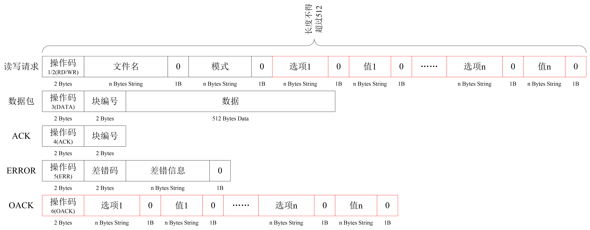

# linux网络编程

1. 计算机网络概念，七层和四层模型，协议族（TCP/IP），mac地址，IP地址，端口port，子网掩码，
2. 数据包的组包和拆包流程，TCP/UDP特点
3. UDP编程，编程准备（字节序，端口，ip，大小端转换的函数），UDPAPI，发送/接收数据
4. UDP-TFTP编程，udp广播，多播
5. TCP编程，客户端和服务器编写流程，三次握手，四次挥手
6. TCP高并发服务器，多进程，多线程服务器，select，poll，epoll实现的服务器，epoll+线程池
7. 网络通信过程
8. 原始套接字，自己组底层的数据包，收一帧完整的数据包
9. web服务器

# 1. 计算机网络概念

## 1.1 TCP/IP协议族


### 1.3.1 分层结构

OSI（7层）：物理层，链路层，网络层，传输层，会话层，表示层，应用层（谐音：物联网谁会使用）

TCP/IP（4层）：链路层，网络层，传输层，应用层

链路层：设备之间的连接

网络层：主机之间

传输层：进程之间

# 2 UDP 编程

## 2.1 字节序

字节序是指**多字节数据**的存储顺序。

小端：高位字节数据存储在内存的高地址中，低位字节数据存储在内存的低地址中。

大端：高位字节数据存储在内存的低地址中，低位字节数据存储在内存的高地址中。**和我们的阅读习惯一致**

主机字节序和网络字节序：数据在网络中传输用的是大端（**网络字节序是大端**），而每个主机它的字节序因机器而异（主机字节序因机而异）。

```c
// 判断主机的字节序
bool isLittleEndian(){
    unsigned short a = 0x1218;//0x表示这个数按照16进制数识别，一个数字占4bit，所以1218占用2byte

    if( (*(char*)&a)  == 0x18){
        return true;
    }else{
        return false;
    }
}

#include<stdio.h>

typedef union Data {
	unsigned short a;
	char b[2];//b[0]和b[1]分别代表了a的两个字节
} data;
int main() {
	data tmp;
	tmp.a = 0x6141;// 16进制数的61等于十进制的97（a)，而16进制41是十进制的65（A）
	if (tmp.b[0] == 0x61) {
		printf("%c", tmp.b[0]);//打印出a，说明是0x61，就是大端，和我们的阅读习惯一致
	}
	else {
		printf("%c", tmp.b[0]);//打印出A，说明是0x41，就是小端，和我们的阅读习惯不一致
	}
	return 0;
}
```

### 2.1.1 字节序转换函数


头文件：`#include<arpa/inet.h>`，windows则需要`#include <windows.h>`

在linux下，`/usr/include/arpa/inet.h`可以找到对应的文件。

1. `uint32_t htonl(uint_t hostint32)`：host to net long（这个long，仅代表是4个byte（32位）的长度）
   - 功能：将32位主机字节序数据转换成网络字节序数据
   - 四个字节，一般用来转ip
2. `uint16_t htons(uint16_t hostint16)`：host to net short（这个short，仅代表是2个byte（16位）的长度）
   - 功能：将16位主机字节序数据转换成网络字节序数据
   - 一般用来转端口
3. `uint32_t ntohl(uint32_t netint32)`：net to host long
   - 功能：将32位网络字节序数据转换成主机字节序数据
4. `uint16_t ntohs(uint16_t netint16)`：net to host short

```c
#include<stdio.h>
//linux 环境
//#include<arpa/inet.h>
//windows 环境
#include <windows.h>
#pragma comment(lib, "wsock32.lib")

int main() {
	int num4bytehost = 0x01020304;
	short num2bytehost = 0x0102;
	printf("%x\n", htonl(num4bytehost));
	printf("%x\n", htons(num2bytehost));
	return 0;
}
```


### 2.1.2 地址转换函数

点分十进制ip串转成整型的数据，便于将ip串放入分组包中。

1. `int inet_pton(int af,const char *src, void *dst)`

   - af：地址族address family（相当于协议族），AF_INET——ipv4
   - src：点分10进制串的首元素地址
   - dst：整型数据
   - 返回值：1——转换成功，其他值转换失败

2. `const char *inet_ntop(int af, const void *src, char *dst, socklen_t size)`

   - 功能：将网络大端32位数据转换为一个点分十进制

   - src：32网络大端的数据地址

   - dst：点分十进制

   - `#define INET_ADDRSTRLEN  16`  //for ipv4

     `#define INET6_ADDRSTRLEN 46` //for ipv6

3. 

```c
#include<stdio.h>
#include<arpa/inet.h>

int main() {
	char buf_ip[] = "192.168.1.2";
	int num = 0;
	inet_pton(AF_INET, buf_ip, &num);
	unsigned char* p = (unsigned char *)&num;
	printf("%d %d %d %d \n", *p, *(p + 1), *(p + 2), *(p + 3));

    #include<stdio.h>
#include<arpa/inet.h>

int main() {
	char buf_ip[] = "192.168.1.2";
	int num = 0;
	inet_pton(AF_INET, buf_ip, &num);
	unsigned char* p = (unsigned char *)&num;
	printf("%d %d %d %d \n", *p, *(p + 1), *(p + 2), *(p + 3));

	char ip[INET_ADDRSTRLEN] = "";
	printf("ip=%s\n", &num, ip, INET_ADDRSTRLEN);
    
	return 0;
}
```

## 2.2 UDP通信流程

**网络通信要解决的是不同主机进程间的通信**

socket提供不同主机上的进程之间的通信

- 每个套接字都有一个ip:port
- 对于UDP来讲，可以没有服务器，通常认定主动发送的一方为客户端，被动接收的一方为服务器。
- 如作为UDP服务器被动接收别人发送的数据，必须通过bind()指定ip:port，并且告知客户端，客户端的ip:port可以随机，
- 客户端发消息给服务器，会携带客户端ip和port，当UDP服务器给客户端，就可以从客户端发的数据当中获取客户端的ip:port
- 流程：创建套接字 -> 绑定（ip:port，非必须) -> 读写 -> 关闭

每一台主机必须要有和对方主机成对出现的一个socket，socket在不同的主机间必须成对存在（socket pair）


UDP客户端也可以同tcp一样，在send前进行连接connect，这样可以提高send成功率

## 2.3 创建套接字

`#include <sys/socket.h>`

`int socket(int domain, int type, int protocol);`

- 功能：创建一个socket套接字
- domain：选择协议，一般AF_INET
- type：通信的语义
  - SOCKET_STREAM：流式套接字，用于TCP通信
  - SOCKET_DGRAM：报式套接字，用于UDP通信
- protocol：0，自动指定
- 返回值：返回一个套接字（文件描述符）


`#include <sys/socket.h>`

`int bind(int sockfd, const struct sockaddr *addr, socklen_t addrlen)`

- 功能：给套接字绑定一个固定的ip和端口

- 参数：

  - sockfd：套接字

  - addr：这里是一个通用套接字结构体，网络通信需要解决三大问题：协议，ip，port，可以把这三个数据封装在一个结构体中，

    - 为了使不同格式地址能被传入套接字函数,地址须要强制转换成通用套接字地址结构

      ```c
      #include <netinet/in.h>
      struct sockaddr
      {
      	sa_family_t sa_family;	// 2字节
      	char sa_data[14]	//14字节
      };
      ```

      

    - ipv4套接字结构体：\#include <netinet/in.h>

      ```c
      struct in_addr
      {
      	in_addr_t s_addr;//4字节
      };
      struct sockaddr_in
      {
      	sa_family_t sin_family;//2字节，AF_INET
      	in_port_t sin_port;//2字节，端口
      	struct in_addr sin_addr;//4字节，ip地址
      };
      
      ```

    - ipv6套接字结构体

    - 本地套接字结构体

- addrlen：INET_ADDRSTRLEN，值为16

- 返回值：1成功


`#include<sys/types.h>`

`#include <sys/socket.h>`

`ssize_t sendto(int socketfd, const void *buf, size_t len, int flags, const struct sockaddr *dest_addr, socklen_t addrlen)`

- buf：发送的内容地址
- len：发送的内容长度
- flags：0，
- dest_addr：ipv4套接字结构体（目的地址信息）
- 返回值：发送的字节数

`ssize_t recvfrom(int sockfd, void *buf, size_t len, int flags, struct sockaddr *src_addr, socklen_t *addrlen);`

- 返回值：将返回收到的字节数


### 2.3.1 客户端UDP编程

```c
#include<stdio.h>
#include<arpa/inet.h>
#include<sys/socket.h>
#include<string.h>
#include<unistd.h>
#include<sys/types.h>
int main(){
    //ipv4结构体
    struct sockaddr_in server_addr;
    server_addr.sin_family = AF_INET;
    server_addr.sin_port = htons(9000);
    inet_pton(AF_INET,"192.168.1.6",&server_addr.sin_addr.s_addr);
    // 创建套接字
    int sock_fd = socket(AF_INET,SOCK_DGRAM,0);
    if(sock_fd<0){
        perror("");
    }
    while(1){
        // 获取发送的内容
        char buf[128]="";
        fgets(buf,sizeof(buf),stdin);
        buf[strlen(buf) - 1]=0;
        // 发送
        sendto(sock_fd,buf,strlen(buf),0,(struct sockaddr*) &server_addr,sizeof(server_addr));
        char read_buf[128]="";
        // 接收
        // 只要是设备文件，管道，网络，默认都会堵塞
        recvfrom(sock_fd, read_buf,sizeof(read_buf),0,NULL,NULL);
        printf("%s\n", read_buf);
    }
}
```

### 2.3.2 服务器UDP编程

INADDR_ANY 通配地址，值为0，`#include<sys/socket.h>`

```c
#include<stdio.h>
#include<arpa/inet.h>
#include<sys/socket.h>
#include <unistd.h>
int main(){
    // 创建socket
    int sock_fd= socket(AF_INET,SOCK_DGRAM,0);
    if(sock_fd<0)perror("");

    struct sockaddr_in addr;
    addr.sin_family = AF_INET;
    addr.sin_port = htons(9000);
    //inet_pton(AF_INET,"192.168.127.129",&addr.sin_addr.s_addr);
    addr.sin_addr.s_addr = 0;// 通配地址，表示该主机的所有ip,#include<sys/socket.h>,INADDR_ANY

    // 绑定
    int res = bind(sock_fd,(struct sockaddr*) &addr,sizeof(addr));
    if(res<0)perror("");

    struct sockaddr_in client_addr;
    socklen_t len = sizeof(client_addr);

    while(1){
        char buf[128]="";
        // 接收
        recvfrom(sock_fd, buf, sizeof(buf), 0, (struct sockaddr*) &client_addr, &len);
        printf("%s\n",buf);
        // 发送
        sendto(sock_fd, buf, sizeof (buf), 0, (struct sockaddr*)&client_addr, sizeof(client_addr));
    }
    close(sock_fd);
}
```

## 2.4 [TFTP](https://blog.csdn.net/qq_45740212/article/details/113034164)

TFTP（Trivial File Transfer Protocol）简单文件传输协议，一般用于局域网传输文件

提供不复杂、开销不大的文件传输服务，端口号为69。

特点：基于UDP，不会对用户进行验证（无需用户名和密码校验），而FTP需要校验

数据传输模式：

- octet：二进制模式
- netascii：文本模式
- mail：已经不再支持

### 2.4.1 TFTP通信过程

1. 服务器在69号端口等待客户端的请求
2. 服务器若批准此请求,则使用**临时端口**与客户端进行通信
3. 每个数据包的编号都有变化（从1开始）
4. 每个数据包都要得到ACK的确认如果出现超时,则需要重新发送最后的包（数据或ACK）
5. 数据的长度以512Byte传输
6. 小于512Byte的数据意味着传输结束


#### TFTP包格式

TFTP共定义了五种类型的包，包的类型由数据包前两个字节确定，我们称之为Opcode（操作码）字段。这五种类型的数据包分别是：

1. 读文件请求包：Read request，简写为RRQ，对应Opcode字段值为1，从服务器上下载
2. 写文件请求包：Write requst，简写为WRQ，对应Opcode字段值为2，上传文件到服务器
   - tsize选项
     - 当读操作时，tsize选项的参数必须为“0”，服务器会返回待读取的文件的大小
     - 当写操作时，tsize选项参数应为待写入文件的大小，服务器会回显该选项
   - blksize选项
     - 修改传输文件时使用的数据块的大小（范围：8～65464）
   - timeout选项
     - 修改默认的数据传输超时时间（单位：秒）
3. 文件数据包：Data，简写为DATA，对应Opcode字段值为3
4. 回应包：Acknowledgement，简写为ACK，对应Opcode字段值为4，如果读写请求包带有选项，将会返回OACK包
5. 错误信息包：Error，简写为ERROR，对应Opcode字段值为5
   - 未定义,参见错误信息
   - File not found.
   - Access violation.
   -  Disk full or allocation exceeded.
   - illegal TFTP operation.
   - Unknown transfer ID
   -  File already exists.
   -  No such user.
   - Unsupported option(s) requested.



TFTP下载请求流程：

1. 客户端创建一个套接字
2. 客户端打开或创建一个文件
3. 客户端发送一个下载请求：sprintf()
4. 循环接收数据，存在文件中

```c
//下载
void tftp_down(char *argv)
{
	int fd;
	unsigned short p_num = 0;
	unsigned char cmd = 0;
	char cmd_buf[512] = "";
	char recv_buf[516] = "";
	struct sockaddr_in client_addr;
	socklen_t cliaddr_len = sizeof(client_addr);

	if(dest_addr.sin_port == 0){
		dest_addr.sin_family = AF_INET;
		dest_addr.sin_port = htons(69); 
		puts("send to IP:");
		fgets(recv_buf,sizeof(recv_buf),stdin);
		*(strchr(recv_buf,'\n')) = '\0';
		inet_pton(AF_INET, recv_buf, &dest_addr.sin_addr);
	}
	
	//构造下载请求,argv为文件名
	int len = sprintf(cmd_buf, "%c%c%s%c%s%c", 0, 1, argv, 0, "octet", 0);	//发送读数据包请求
	sendto(sockfd, cmd_buf, len, 0, (struct sockaddr *)&dest_addr, sizeof(dest_addr));
	
	fd = open(argv, O_WRONLY|O_CREAT, 0666);
	if(fd < 0 ){
		perror("open error");
		close(sockfd);
		exit(-1);
	}
	
	do{
		//接收服务器发送的内容
		len = recvfrom(sockfd, recv_buf, sizeof(recv_buf), 0, (struct sockaddr*)&client_addr, &cliaddr_len);
		
		cmd = recv_buf[1];
		if( cmd == 3 )	//是否为数据包
		{
			//接收的包编号是否为上次包编号+1
			if((unsigned short)(p_num+1) == ntohs(*(unsigned short*)(recv_buf+2) ))
			{
				write(fd, recv_buf+4, len-4);
				p_num = ntohs(*(unsigned short*)(recv_buf+2));
				
				printf("recv:%d\n", p_num);//十进制方式打印包编号
			}			
			recv_buf[1] = 4;
			sendto(sockfd, recv_buf, 4, 0, (struct sockaddr*)&client_addr, sizeof(client_addr));
		}
		else if( cmd == 5 ) //是否为错误应答
		{
			close(sockfd);
			close(fd);
			unlink(argv);//删除文件
			printf("error:%s\n", recv_buf+4);
			exit(-1);
		}		
	}while((len == 516)||(cmd == 6)); //如果收到的数据小于516则认为出错
	close(fd);
	PRINT("Download File is Successful\n", RED);
	return;
}
```


## 2.5 UDP广播

广播：由一台主机向该主机所在子网内的所有主机发送数据的方式，不能发送到另一个子网。

广播只能用UDP或原始套接字实现，不能用TCP。

基于UDP的广播协议：

1. 地址解析协议（ARP）：是根据IP地址获取物理地址的一个TCP/IP协议。RARP由物理地址获取ip
2. 动态主机配置协议（DHCP）：向路由器申请一个ip。需要IP地址的主机在启动时就向DHCP服务器广播发现报文。
3. 网络时间协议（NTP）

广播的特点：

1. 处于同一子网的所有主机都必须处理数据
2. UDP数据包会沿着协议栈一直向上至传输（UDP)层
   - 链路层，广播mac地址全f，地址：ff:ff:ff:ff:ff:ff
   - 在网络层，ip地址 = < 网络号，主机号>，路由器隔离广播域，不转发广播数据包
     - **定向广播地址**，主机号ip全1，地址：192.168.252.255/24，
     - **受限广播地址**，网络号和主机号全1，地址：255.255.255.255，
   - 所以这个数据包，网络层和链路层都会被处理
3. 运行音视频等较高速率工作的应用，会带来大的负荷
4. 局限于同一子网


### UDP广播编程

`int setsockopt(int sockfd, int level, int optname, const void *optval, socklen_t optlen);`

`int getsockopt(int sockfd, int level, int optname, void *optval, socklen_t *optlen);`

1. int sockfd: 很简单，socket句柄
2. int level: 选项定义的层次；目前仅支持SOL_SOCKET和IPPROTO_TCP层次
3. int optname: 需设置的选项
   - level=SOL_SOCKET时，可设置的optname有
     - SO_BROADCAST
     - SO_RCVBUF
     - SO_SNDBUF 
     - 等等
4. const void *optval: 指针，指向存放选项值的缓冲区
5. socklen_t optlen: optval缓冲区的长度


设置套接字有广播功能：

- sock：套接字
- level：SOL_SOCKET
- optname：SO_BROADCAST，默认6
- optval：int类型变量的地址，这个值设置为1，
- optlen：optval类型的大小

```c
int main(int argc,char *argv[]){
    int sock_fd=0;
    char buff[1024]="";
    unsigned short port = 8000;
    struct sockaddr_in send_addr;
    
    bzero (&send_addr, sizeof(send_addr));
    send_addr.sin_family = AF_INET;
    send_addr.sin_port = htons(port);
    sock_fd = socket(AF_INET, SOCK_DGRAM,0);
    
    if(sock_fd<0){
		perror("socket failed");
        close(sock_fd);
        exit(1);
    }
    
    if(argc >1){
        send_addr.sin_addr.s_addr = inet_addr(argv[1]);
    }else{
        printf("not have a server ip");
        exit(1);
    }
    
    int yes = 1;
    setsockopt(sock_fd,SOL_SOCKET,SO_BROADCAST, &yes, sizeof(yes));
    strcpy(buff,"broadcast success");
    int len = sendto(sock_fd,buff,strlen(buff),0,(struct sockaddr *) &send_addr, sizeof(send_addr));
    if(len<0){
        printf("send error\n");
        close(sock_fd);
        exit(1)
    }
    return 0;
}
```

## 2.6 UDP多播

数据的收发仅仅在同一分组中进行。

多播的特点：

- 一个多播地址（D类地址）标识一个多播分组，一个分组内的所有主机，都有一个相同的多播ip地址

- 多播可以用于广域网使用

  | 类型 | ipv4 | ipv6   |
  | ---- | ---- | ------ |
  | 单播 | 支持 | 支持   |
  | 多播 | 可选 | 支持   |
  | 广播 | 支持 | 不支持 |
  | 任播 | 支持 | 支持   |

多播ip地址：D类IP，规定是224.0.0.0-239.255.255.255。

- 224.0.0.0：基准地址，保留
- 224.0.0.1：表示组内所有主机
- 其他的多播地址有的有特殊的含义。

多播mac地址：

- 多播mac地址是第一个字节的最低位为1的所有地址，例如01-12-0f-00-00-02。
- 后三个字节一般是多播ip地址的映射，01-12-0f-**00-00-01**，加粗部分是ip后三个点分十进制的映射。

所有加入多播组的主机都会得到一个同样的多播ip地址，同时根据多播ip地址生成一个临时的多播mac地址。

### 多播编程

在IPv4因特网域(AF_INET)中，多播地址结构体用如下结构体ip_mreq表示

```c
struct in_addr{
    in_addr_t s_addr;
}
struct ip_mreq{
    struct in_addr imr_multiaddr;//多播组ip地址
    struct in_addr imr_interface;//将要添加到多播组的主机ip
}
```

多播套接字选项

`int setsockopt(int sockfd, int level, int optname, const void *optval, socklen_t optlen);`

- | level      | optname            | 说明       | optval类型 |
  | ---------- | ------------------ | ---------- | ---------- |
  | IPPROTO_IP | IP_ADD_MEMBERSHIP  | 加入多播组 | ip_mreq{}  |
  | IPPROTO_IP | IP_DROP_MEMBERSHIP | 离开多播组 | ip_mreq{}  |

```c
char group[INET_ADDRSTRLEN]= "224.0.0.1";

struct ip_mreq mreq;
mreq.imr_multiaddr.s_addr = inet_addr(group);
mreq.imr_interface.s_addr = honl(INADDR_ANY);//INADDR_ANY,全0，表示网络本身，

setsockopt(sockfd, IPPROTO_IP, IP_ADD_MEMBERSHIP, &mreq, sizeof(mreq));
```

# 3 TCP 编程


## 3.1 创建套接字

### 3.1.1 客户端

`int socket(int domain, int type, int protocol);`

- 功能：创建一个socket套接字
- domain：选择协议，一般AF_INET
- type：通信的语义
  - SOCKET_STREAM：流式套接字，用于TCP通信
  - SOCKET_DGRAM：报式套接字，用于UDP通信
- protocol：0，自动指定
- 返回值：返回一个套接字（文件描述符）


`int connect(int sockfd, const struct sockaddr *addr,socklen_t addrlen);`

- 功能：连接服务器
- 参数：
  - sockfd：套接字
  - addr：服务器地址信息
  - addrlen：addr结构体大小
- 返回值：0——成功，-1——失败，

客户端不能发送0长度的数据包。

```c
#include <stdio.h>
#include <sys/socket.h>
#include <unistd.h>
#include <arpa/inet.h>
#include <string.h>

int main(int argc, char *argv[])
{
	//创建流式套接字
	int s_fd = socket(AF_INET,SOCK_STREAM,0);
	if(s_fd < 0) perror("");
    
	//连接服务器
	struct sockaddr_in ser_addr;
	ser_addr.sin_family = AF_INET;
	ser_addr.sin_port = htons(8080);//服务器的端口
	ser_addr.sin_addr.s_addr = inet_addr("192.168.127.1");//服务器的ip
	int ret = connect(s_fd, (struct sockaddr*)&ser_addr,sizeof(ser_addr));
	if(ret<0) perror("");
    
	//收发数据
	while(1)
	{
		char buf[128]="";
		char r_buf[128]="";
		fgets(buf,sizeof(buf),stdin);
		buf[strlen(buf)-1]=0;
        //发
		write(s_fd,buf,strlen(buf));
		//收
        int cont = read(s_fd,r_buf,sizeof(r_buf));
        
        ////如果对方挂断，会发送一个0长度的数据报，此时cont为0
		if(cont == 0)
		{
			printf("server close\n");
			break;//对方关闭
		}
		printf("recv server = %s\n",r_buf);
	
	}
	//关闭套接字'
	close(s_fd);
	return 0;
}
```

### 3.1.2 服务器

1. socket()：创建套接字
2. bind()：绑定ip和端口
3. listen()：监听
   - `int listen(int sockfd, int backlog);`
   - 功能：
     - 套接字由主动变为被动（**监听套接字，lfd**）
     - 创建两个连接队列，一个已完成连接队列（完成三次握手），一个未完成连接队列
   - 参数：
     - backlog：两个连接对列的连接数目之和最大值
4. accept()：提取
   - `int accept(int sockfd, struct sockaddr *addr, socklen_t *addrlen);`
   - 功能：
     - 从已完成连接队列里提取一个新的连接，
     - 然后**创建一个新的已连接套接字（通信套接字，cfd）**，
     - 使用这个已连接套接字和当前连接的客户端通信
   - 参数：
     - addr保存客户端地址的信息结构体
   - 返回值：成功返回已连接套接字
5. read()/write()
6. close()

**accept和read是带阻塞的。无法在一个服务器上，同时和多个客户端通信**

**当accept和read被信号（CTRL + C）中断后，他们将不会再阻塞**


```c
// 处理单个客户端
#include <stdio.h>
#include <sys/socket.h>
#include <unistd.h>
#include <arpa/inet.h>
int main(int argc, char *argv[])
{
	//创建套接字，监听套接字
	int lfd = socket(AF_INET,SOCK_STREAM,0);
	if(lfd < 0)
		perror("");
	//绑定
	struct sockaddr_in myaddr;
	myaddr.sin_family = AF_INET;
	myaddr.sin_port = htons(9999);
	myaddr.sin_addr.s_addr = 0;//本机的ip都绑定
	bind(lfd,(struct sockaddr*)&myaddr,sizeof(myaddr));//绑定
	//监听
	listen(lfd,128);
	//提取
	struct sockaddr_in cliaddr;
	socklen_t len = sizeof(cliaddr);
	
	// 通信套接字
	int cfd = accept(lfd,(struct sockaddr *)&cliaddr,&len);//提取
	if(cfd < 0 )
		perror("");
	char ip[16]="";
	printf("client ip=%s port=%d\n",
			inet_ntop(AF_INET,&cliaddr.sin_addr.s_addr,ip,16),ntohs(cliaddr.sin_port));
	//读写
	while(1)
	{
		char buf[256]="";
		//回射服务器
		int ret = read(cfd,buf,sizeof(buf));
		if(ret == 0)
		{
			printf("client close\n");
			break;
		}
		printf("recv = [%s]\n",buf);
		write(cfd,buf,ret);
	
	}
	//关闭
	close(lfd);
	close(cfd);
	return 0;
}
```

## 3.2 并发服务器

### 3.2.1 多进程实现


```c
#include <stdio.h>
#include <unistd.h>
#include <stdlib.h>
#include <sys/socket.h>
#include <arpa/inet.h>
#include <signal.h>
#include <sys/types.h>
#include <sys/wait.h>

//回收子进程资源
void cath_child(int num)
{
	pid_t pid;
	while(1)
	{
		pid = waitpid(-1,NULL,WNOHANG);
		if(pid <= 0)
		{
            //pid = -1，所有子进程都回收了
            //pid = 0，还有子进程活着
			break;
		}
		else if(pid > 0)
		{
            //继续回收，某个子进程被回收了
			printf("child process %d\n",pid);
			continue;
		}
	}

}
int main(int argc, char *argv[])
{
	//将SIGCHLD 加入到阻塞集中
	sigset_t set;
	sigemptyset(&set);
	sigaddset(&set,SIGCHLD);
	sigprocmask(SIG_BLOCK,&set,NULL);
    
    
	// 创建套接字
	int lfd = socket(AF_INET,SOCK_STREAM,0);
	if(lfd <0) perror("");
	// 绑定
	struct sockaddr_in myaddr;
	myaddr.sin_family = AF_INET;
	myaddr.sin_port = htons(6666);
	myaddr.sin_addr.s_addr = 0;
	bind(lfd,(struct sockaddr *)&myaddr,sizeof(myaddr));
	// 监听
	listen(lfd,128);
	// 提取
	struct sockaddr_in cliaddr;
	socklen_t len = sizeof(cliaddr);
	while(1)
	{
        //当accept和read被信号（CTRL + C）中断后，他们将不会再阻塞,所以这里有点问题
        // 当父进程被Ctrl +c后，accept不会阻塞，程序向下进行，将会出问题。
		int cfd = accept(lfd,(struct sockaddr*)&cliaddr,&len);
		if(cfd < 0)perror("");
        
		char ip[16]="";
        
        //打印客户端相关信息
		printf("client ip=%s port=%d\n",
				inet_ntop(AF_INET,&cliaddr.sin_addr.s_addr,ip,16),
				ntohs(cliaddr.sin_port));
        
     	// 创建子进程
		pid_t pid;
		pid = fork();
		if(pid ==0 )//子进程
		{
			close(lfd);
			while(1){
				sleep(1);
				char buf[256]="";
				int n = read(cfd,buf,sizeof(buf));
				// 通信结束子进程退出
                if(0==n){
					printf("client close\n");
					break;
				}
				printf("[***%s***]\n",buf);
				write(cfd,buf,n);
			}
			close(cfd);
			exit(0);
		}
        
        // 父进程
		else if(pid > 0)
		{
			close(cfd);
			struct sigaction act;
			act.sa_handler = cath_child;
			act.sa_flags = 0;
			sigemptyset(&act.sa_mask);
			sigaction(SIGCHLD,&act,NULL);

			sigprocmask(SIG_UNBLOCK,&set,NULL);
		}
	 }
	

	return 0;
}
```


### 3.2.2 多线程实现

```c
#include <stdio.h>
#include <sys/socket.h>
#include <arpa/inet.h>
#include <unistd.h>
#include <pthread.h>
#include <string.h>

#include <stdlib.h>
typedef struct _info
{
	int cfd;
	struct sockaddr_in client;

}INFO;

// 与客户端通信
void* resq_client(void *arg)
{
	INFO *info = (INFO*)arg;
	char ip[16]="";
	printf("client ip=%s port=%d\n",
			inet_ntop(AF_INET,&(info->client.sin_addr.s_addr),ip,16),
			ntohs(info->client.sin_port));
	while(1)
	{
		char buf[1024]="";
		int n = read(info->cfd,buf,sizeof(buf));
		if(n == 0)
		{
			printf("cleint close\n");
			break;
		}
		printf("%s\n",buf);
		write(info->cfd,buf,n);
	}
	close(info->cfd);
	free(info);
}

int main(int argc, char *argv[])
{
	int lfd = socket(AF_INET,SOCK_STREAM,0);
	if(lfd <0)
		perror("");

	int opt=1;
	setsockopt(lfd,SOL_SOCKET,SO_REUSEADDR,&opt,sizeof(opt));

	struct sockaddr_in myaddr;
	myaddr.sin_family = AF_INET	;
	myaddr.sin_port= htons(8888);
	myaddr.sin_addr.s_addr = 0;
	if( bind(lfd,(struct sockaddr*)&myaddr,sizeof(myaddr))< 0)
		perror("bind:");


	listen(lfd,128);
	while(1)
	{
		struct sockaddr_in client;
		socklen_t len = sizeof(client);
		int cfd = accept(lfd,(struct sockaddr*)&client,&len);
		INFO *info = malloc(sizeof(INFO));
		info->cfd =cfd;
		info->client = client;
		pthread_t pthid;
		pthread_create(&pthid,NULL,resq_client,info);
		pthread_detach(pthid);
	}

	close(lfd);
	return 0;
}
```


### 3.2.3 非阻塞忙轮询

多线程和多进程的方式，对资源的消耗是巨大的。来一个客户端请求，服务器就创建一个进程或线程处理，这种方式实现并发，大多数时间，我们的进程和线程都处于休眠状态（阻塞，阻塞等待（accept和read默认都是带阻塞的）），这样非常浪费资源。

由服务器进程不停的访问每个套接字，查看是否有连接或数据到达。

这样的方式非常浪费cpu。

这时需要使用IO多路复用

## 3.3 IO多路复用

服务器单进程 + 内核监听请求（多个fd）的方式

IO多路复用：由内核监听多个文件描述符的读写缓冲区的变化（不仅仅能监听网络的fd，管道的，stdin/stdout/stderr，任何设备的都可以进行监听），一旦有变化，就会让服务器进程来处理。

在这里，监听的文件描述符分两类，一个是lfd，一个是cfd

进程A执行到创建socket语句的时候，创建socket对象，进程A进入阻塞态，等待接收socket传来的网络数据，当socket已接收到数据之后，进程A进入执行态


IO多路复用有两种方式：[select和epoll](https://www.jianshu.com/p/c9190109c7d8)


### 3.3.1 select

select准备一个数组fds（文件描述符），存放需要监视的所有socket，然后调用select，如果fds中所有的socket都没有数据，select会阻塞，直到有一个socket收到数据，select返回，唤醒进程，用户可以遍历fds，通过FD_ISSET判断哪个socket收到了数据，然后做出处理。windows下面用的最多的就是select


 

       #include <sys/select.h>
       #include <sys/time.h>
       #include <sys/types.h>
       #include <unistd.h>

`int select(int nfds, fd_set *readfds, fd_set *writefds, fd_set *exceptfds, struct timeval *timeout);`

- 函数功能：监听多个文件描述符的属性变化（读写缓冲区的变化）

- 参数：

  - nfds：需要监听的文件描述符的个数 +1（n个cfd + lfd），最大支持FD_SETSIZE=1024

  - readfds：需要监听读属性变化的文件描述符集合

  - writefds：需要监听写属性变化的文件描述符集合

  - exceptfds：需要监听异常属性变化的文件描述符集合

  - timeout：超时时间，表示等待多长时间之后就放弃等待

    - 传 NULL 表示等待无限长的时间，持续阻塞直到有事件就绪才返回。
    - 大于0，超时时间
    - =0，不等待立即返回

    ```c
    struct timeval{
        long tv_sec;//秒
        long tv_usec;//微秒
    }
    ```

- 返回值：变化的文件描述符个数

内核在监听到readfds有fd读属性变化的时候，就会将readfds集合重置为变化的fd的集合（而不是一开始的需要监听的fd集合），所以我们需要对初始需要监听的fd集合做一个备份，以便下一次继续监听。

文件描述符集合操作函数：

- `void FD_CLR(int fd, fd_set *set);`：将fd从集合set中剔除
- ``int  FD_ISSET(int fd, fd_set *set);`：判断fd是否在set里面
- `void FD_SET(int fd, fd_set *set);`：添加fd到set里面
- `void FD_ZERO(fd_set *set);`：清空set集合

优点：

- 可跨平台，windows，linux都可以
- 并发量高，效率高，消耗资源少

缺点：

- 最大监听fd数目为1024
- 每一次监听都需要再次设置需要监听的集合，集合从用户态拷贝至内核态消耗资源
- 监听到fd变化后，需要用户自己遍历集合，才知道具体哪个fd发生了变化
- 大量并发，少数活跃，select效率低

#### 代码实现

```c
#include <stdio.h>
#include "wrap.h"
#include <sys/time.h>
#include <sys/select.h>
#include <sys/types.h>
int main(int argc, char *argv[])
{
	//创建套接字
	//绑定
	int lfd = tcp4bind(9999,NULL);//在wrap.h中
	//监听
	listen(lfd,128);
	int max_fd = lfd;
    // ready set
	fd_set r_set;
	fd_set old_set;
	FD_ZERO(&old_set);
	FD_ZERO(&r_set);

	FD_SET(lfd,&old_set);
	int nready=0;
	while(1)
	{
		r_set = old_set;
		nready = select(max_fd+1,&r_set,NULL,NULL,NULL);
		if(nready < 0)
		{		
			perror("");
			break;
		}
		else if(nready >= 0)
		{
			//判断lfd是否变化了，如果变化生成一个新的cfd
			if(FD_ISSET(lfd,&r_set))
			{
				// 提取新的连接
				struct sockaddr_in cliaddr;
				socklen_t len=sizeof(cliaddr);
				char ip[16]="";
				int cfd = Accept(lfd,(struct sockaddr*)&cliaddr,&len);
				printf("client ip=%s port=%d\n",
						inet_ntop(AF_INET,&cliaddr.sin_addr.s_addr,ip,16),
						ntohs(cliaddr.sin_port));
				//将cfd加入到old_set
				FD_SET(cfd,&old_set);
				//更新最大值
				if(max_fd < cfd)
				max_fd = cfd;
				//如果只有lfd变化,执行下一次监听
				if( --nready == 0)
					continue;
			
			}
			for(int i=lfd+1;i<=max_fd;i++)
			{
				//cfd变化
				if(FD_ISSET(i,&r_set))
				{
					char buf[1024]="";
					int n = Read(i,buf,sizeof(buf));
					if(n == 0)
					{
						printf("client close\n");
						close(i);
						//将i从old_set删除
						FD_CLR(i,&old_set);
					}
					else if(n < 0)
					{
						perror("");
					
					}
					else
					{
						printf("%s\n",buf);
						Write(i,buf,n);
					}
				}
				
			
			
			}
		}
	
	}
	return 0;
}

```

#### select优化

主要是在查找哪个fd变化上（遍历fds）上做优化

### 3.3.2 epoll

epoll创建epoll对象，维护一个就绪列表和等待队列。当socket接收到数据，中断程序一方面修改rdlist，另一方面唤醒eventpoll等待队列中的进程，由于rdlist的存在，进程A可以知道哪些socket发生了变化。


`#include <sys/epoll.h>`

`int epoll_create(int size);`

- 功能：创建一个红黑树，用于管理需要监听的fds
- 参数：size大于0即可，容量不够时，函数会自动扩容
- 返回值：树的句柄

`int epoll_ctl(int epfd, int op, int fd, struct epoll_event *event);`

- 功能：对树节点做操作

- 参数：

  - epfd：树的根节点（句柄）

  - op：

    - EPOLL_CTL_ADD：添加fd
    - EPOLL_CTL_MOD：修改fd
    - EPOLL_CTL_DEL：删除fd

  - fd：需要操作的fd

  - event：树上的节点

    ```c
    typedef union epoll_data{
        void *ptr;//epoll反应堆里使用
        int fd;//需要监听的fd
        unint32_t u32;
        unint64_t u64;
    } epoll_data_t;
    struct epoll_event{
        unint32_t events;//监听fd的什么事件，EPOLLIN读事件，EPOLLOUT写事件，EPOLLET边沿触发,EPOLLLT水平触发,EPOLLRDHUP，EPOLLPRI，等等
        epoll_data_t data;
    }
    ```

- 返回值：操作成功0，失败-1

`int epoll_wait(int epfd, struct epoll_event *events,int maxevents, int timeout);`

- 功能：开启监听树上所有节点的属性变化
- 参数：
  - epfd：树的句柄
  - epoll_events：存放变化的fd的数组
  - maxevents：epoll_events的容量
  - timeout：永久监听（-1），限时等待（>0），**函数在程序段的阻塞时间**。超时则执行epoll_wait下面的代码
- 返回值：变化的fd个数

select与epoll的区别

- 每次调用select，都需要把fd集合从用户态拷贝到内核态，这个开销在fd很多时会很大；而epoll保证了每个fd在整个过程中只会拷贝一次。
- 每调用一次select都会遍历一次fd集合，知晓哪个有数据，而epoll只会轮询一次fd集合，查看rdlist
- select最大支持1024个fd，而epoll没有这个限制

#### 代码实现

```c
#include<wrap.h>
#include<sys/epoll.h>
// 本文件中，首字母大写的函数都在wrap.c中
int main(int argc, char *argv[]){
    //创建套接字，并绑定
    int lfd = tcp4bind(7777, NULL);// 在wrap.c中实现
    //监听
    listen(lfd, 128);
    // 创建树
    int epfd = epoll_create(1);
    // 将lfd上树
    struct epoll_event ev;
    ev.events = EPOLL_IN;//读事件
    ev.data.fd = lfd;
    epoll_ctl(epfd,EPOLL_CTL_ADD, lfd, &ev);
    //循环监听树
    struct epoll_event evs[1024];//存放变化的fds
    while(1){
        int n = epoll_wait(epfd, evs, 1024, -1);// -1将无限期的阻塞在这里
        if(n<0){
            perror("");
            exit(-1);
        }else if(n>=0){
            for(int i; i<n; i++){
                int fd = evs[i].data.fd;
                //如果是lfd变化，并且是读事件变化
                if(fd == lfd && evs[i].events&EPOLLIN){//位与运算

                    struct  sockaddr_in cliaddr;
                    socklen_t len = sizeof(cliaddr);
                    char ip[16] = ""
                    int cfd = Accept(lfd,(struct sockaddr*) &cliaddr,&len);
                    printf("client ip = %s port =%n\n",
                        inet_ntop(AF_INET, &cliaddr.sin_addr, ip, 16),
                        ntohs(cliaddr.sin_port);
                    )
                    //将cfd上树
                    ev.data.fd = cfd;
                    ev.events = EPOLLIN;
                    epoll_ctl(epfd, EPOLL_CTL_ADD, cfd, &ev);

                }else if(evs[i].events&EPOLLIN){//cfd变化，并且是读事件
                
                    char buf[1500] = "";
                    int count = Read(fd, buf, sizeof(buf));
                    if(count<0){
                        printf("error or client close\n");
                        close(fd);
                        epoll_ctl(epfd, EPOLL_CTL_DEL, fd, &evs[i]);
                    }else {
                        printf("%s\n",buf);
                        Write(fd,buf,count);
                    }

                }
            }
        }
    }
    
}
```

#### 水平触发和边沿触发

这个概念最早是一个电学概念，

水平触发：电平一致为1或0的时候触发

边沿触发：电平由高到低，或由低到高，跳变的时候触发。

使用epoll多路复用编程时，会用epoll_wait阻塞等待事件的发生，对应有边沿触发和水平触发两种工作模式。

假设一个客户端发送100字节的数据，而服务器设定read每次读取20字节

**水平触发（EPOLLLT）：只要缓冲区有数据，epoll_wait就会一直被触发，直到缓冲区为空；**

- 优点：保证了数据的完整输出（首次，epoll_wait触发一次，read读20字节，因为缓冲区还有80字节，epoll第二次触发，read又读20字节，epoll_wait触发第三次，第四次，直到read读完）；
- 缺点：当数据较大时，需要不断从用户态和内核态（epoll_wait和read之间）切换，消耗了大量的系统资源，影响服务器性能；
- 应用场景：应用较少，一般用于连接请求较少及客户端发送的数据量较少的服务器，可一次性接收所有数据。此时，若使用边沿触发，会多调用一次accept/read等来判断数据是否为空。

**边沿触发（EPOLLET）：只有所监听的事件状态改变或者有事件发生时，epoll_wait才会被触发；**

- epoll边沿触发时，假设一个客户端发送100字节的数据，而服务器设定read每次读取20字节，那么一次触发只能读取20个字节，然后内核调用epoll_wait直到下一次事件发生，才会继续从剩下的80字节读取20个字节（首次，epoll_wait触发成功，首先读取了20字节，还剩80字节，这之后epoll_wait不再触发，所以还留有80字节未读），由此可见，这种模式其工作效率非常低且无法保证数据的完整性，因此边沿触发不会单独使用。

- 边沿触发通常与非阻塞IO一起使用，其工作模式为：epoll_wait触发一次，在while（1）循环内非阻塞IO读取数据，直到缓冲区数据为空（保证了数据的完整性），内核才会继续调用epoll_wait等待事件发生。

```c

...
#include<fcntl.h>
...
// 截取部分优化
if(fd == lfd && evs[i].events&EPOLLIN){//位与运算

    struct  sockaddr_in cliaddr;
    socklen_t len = sizeof(cliaddr);
    char ip[16] = ""
        int cfd = Accept(lfd,(struct sockaddr*) &cliaddr,&len);
    printf("client ip = %s port =%n\n",
           inet_ntop(AF_INET, &cliaddr.sin_addr, ip, 16),
           ntohs(cliaddr.sin_port);
          )
    //将cfd上树
    ev.data.fd = cfd;

    // 分析第2步
	//将Cfd设置为非阻塞,那么在 read的时候，
    int flag = fcntl(cfd, F_GETFL);
    flag |= O_NONBLOCK;
    fcntl(cfd, F_SETFL,flag);
    
    
    // 分析第3步
    // 将树节点设置为边沿触发
    // 边沿触发+ 非阻塞式io
    ev.events = EPOLLIN | EPOLLET;
    
    
    epoll_ctl(epfd, EPOLL_CTL_ADD, cfd, &ev);

}else if(evs[i].events&EPOLLIN){//cfd变化，并且是读事件

    
    //循环读
    while(1){
        char buf[5] = "";
  
        // 分析第1步
        // 为了循环读数据，所以这里要让他非阻塞（要在fd里设置非阻塞）
        // 否则没数据给他读的时候，它不会向下执行并且跳出循环读
        int count = Read(fd, buf, sizeof(buf));
        
        // 读完或关闭，或出错，跳出循环读
        if(count<0 && errno == EAGAIN){
            
            if(){
                break;//缓冲区已无数据，数据被读完了
            }else {//出错了
               	printf("error or client close\n");
                close(fd);
                epoll_ctl(epfd, EPOLL_CTL_DEL, fd, &evs[i]);
                break;
            }
            
        }else if(count == 0){
            printf("error or client close\n");
            close(fd);
            epoll_ctl(epfd, EPOLL_CTL_DEL, fd, &evs[i]);
            break;
        }
        else {
            printf("%s\n",buf);
            Write(fd,buf,count);
        }
    }
    

}
```


针对于fd读缓冲区来说：

- 水平触发（默认）：
  - 读缓冲区只要有数据就会被触发。
  - 读缓冲区大小设置为buf[5]，那么写10个字母，将会触发两次fd读变化
- 边沿触发：缓冲区有数据到达就会被触发。

针对于fd的写缓存区来说：

- 水平触发：写缓冲区没有满（可写）就会被触发，所以**监听写事件的时候，只能采用边沿触发**
- 边沿触发：数据被发送后，就触发

**在开发中，应尽量使用边沿触发 + 非阻塞io的方式**

### 3.3.3 epoll + 线程池

前面的代码，我们都可以看到我们在read之后，是做一个很简单的事，不需要耗费很长的时间。

如果，我们在read之后，读到client的消息是帮它做一个很耗时的任务，此时就会在读那里跳不出来，无法继续epoll_wait，如果并发量越高这里就越有问题。

现在有很多商用的服务器都是采用这样的epoll + 线程池的方式。

主线程监听，**在read之后，write之前的工作任务都交给线程去做**，这里没有代码，后面实践之后继续补充。


```c
else if(evs[i].events & EPOLLIN){//普通的读事件
    struct epoll_event *e = (struct epoll_event *) malloc(sizeof( struct epoll_event));
    memcpy(e, &evs[i], sizeof(struct epoll_event));
    addtask(thrPool, evs[i],data.fd, e);
}
```

### 3.3.4 epoll 反应堆

epoll反应堆模型 （重点，Libevent库的核心思想）

epoll模型原来的流程

```c
epoll_create(); // 创建监听红黑树
epoll_ctl(); // 向书上添加监听fd
epoll_wait(); // 监听
有监听fd事件发送--->返回监听满足数组--->判断返回数组元素--->
lfd满足accept--->返回cfd---->read()读数据--->write()给客户端回应。

```

epoll反应堆模型的流程

```c
epoll_create(); // 创建监听红黑树
epoll_ctl(); // 向书上添加监听fd
epoll_wait(); // 监听
有客户端连接上来--->lfd调用initAccept()--->将cfd挂载到红黑树上监听其读事件--->
epoll_wait()返回cfd--->cfd回调readata()--->将cfd修改为监听写事件--->
epoll_wait()返回cfd--->cfd回调senddata()--->将cfd修改为监听读事件--->...--->

```

```c
//反应堆
#include <stdio.h>
#include <unistd.h>
#include <stdlib.h>
#include <fcntl.h>
#include <string.h>
#include <sys/types.h>
#include <sys/stat.h>
#include <sys/socket.h>
#include <arpa/inet.h>
#include <sys/epoll.h>
#include "wrap.h"

#define _BUF_LEN_  1024
#define _EVENT_SIZE_ 1024

//全局的epoll树根
int gepfd = 0;

// 事件驱动的结构体
typedef struct xx_event{
    int fd;
    int events;
    void (*call_back)(int fd,int events,void *arg);
    void *arg;
    char buf[1024];
    int buflen;
    int epfd;
}xevent;

xevent myevents[_EVENT_SIZE_+1];

void readData(int fd,int events,void *arg);

//添加事件
//eventadd(lfd,EPOLLIN,initAccept,&myevents[_EVENT_SIZE_-1],&myevents[_EVENT_SIZE_-1]);
void eventadd(int fd,int events,void (*call_back)(int ,int ,void *),void *arg,xevent *ev)
{
    ev->fd = fd;
    ev->events = events;
    //ev->arg = arg;//代表结构体自己，通过arg得到结构体的所有信息
    ev->call_back = call_back;

    struct epoll_event epv;
    epv.events = events;
    epv.data.ptr = ev;//核心思想
    epoll_ctl(gepfd,EPOLL_CTL_ADD,fd,&epv);//上树
}

//修改事件
//eventset(fd,EPOLLOUT,senddata,arg,ev);
void eventset(int fd,int events,void (*call_back)(int ,int ,void *),void *arg,xevent *ev)
{
    ev->fd = fd;
    ev->events = events;
    //ev->arg = arg;
    ev->call_back = call_back;

    struct epoll_event epv;
    epv.events = events;
    epv.data.ptr = ev;
    epoll_ctl(gepfd,EPOLL_CTL_MOD,fd,&epv);//修改树节点
}

//删除事件
void eventdel(xevent *ev,int fd,int events)
{
	printf("begin call %s\n",__FUNCTION__);

    ev->fd = 0;
    ev->events = 0;
    ev->call_back = NULL;
    memset(ev->buf,0x00,sizeof(ev->buf));
    ev->buflen = 0;

    struct epoll_event epv;
    epv.data.ptr = NULL;
    epv.events = events;
    epoll_ctl(gepfd,EPOLL_CTL_DEL,fd,&epv);//下树
}

//发送数据
void senddata(int fd,int events,void *arg)
{
    printf("begin call %s\n",__FUNCTION__);

    xevent *ev = arg;
    Write(fd,ev->buf,ev->buflen);
    eventset(fd,EPOLLIN,readData,arg,ev);
}

//读数据
void readData(int fd,int events,void *arg)
{
    printf("begin call %s\n",__FUNCTION__);
    xevent *ev = arg;

    ev->buflen = Read(fd,ev->buf,sizeof(ev->buf));//把读到的数据存在buf中
    if(ev->buflen>0) //读到数据
	{	
		//void eventset(int fd,int events,void (*call_back)(int ,int ,void *),void *arg,xevent *ev)
        eventset(fd,EPOLLOUT,senddata,arg,ev);
        // 在这里，并没有直接的写数据，而修改节点的监听为写，
        // 写数据的时候，可能写缓存区已满，缓存区不是可写状态，
        // 当修改监听为写时，一旦写缓存区可写（水平触发），那么就可以发送数据了
        // 不过这里又要回到main的while里面，重新通过epoll_wait监听可写，然后执行对应的senddata
        // 因为存储收的数据在buf中，所以，在senddata中可以使用，读到的数据。
        // 而senddata，在发完数据之后，又要将节点的监听修改为听，等待下一次写数据
        // 如此循环往复，听-> 写 -> 听 ->写

    }
	else if(ev->buflen==0) //客户端连接断开
	{
        Close(fd);
        eventdel(ev,fd,EPOLLIN);
    }

}
//新连接请求处理
//lfd，EPOLLIN, ptr
void initAccept(int fd,int events,void *arg)
{
    printf("begin call %s,gepfd =%d\n",__FUNCTION__,gepfd);//__FUNCTION__ 预定义宏，函数名

    int i;
    struct sockaddr_in addr;
    socklen_t len = sizeof(addr);
    int cfd = Accept(fd,(struct sockaddr*)&addr,&len);//是否会阻塞？不会，因为有读事件来了。
	
	//查找myevents数组中可用的位置
    for(i = 0 ; i < _EVENT_SIZE_; i ++)
	{
        if(myevents[i].fd==0)
		{
            break;
        }
    }

    //添加读事件，上树

    //lfd的回调和cfd的回调不一样，lfd的initAccept，cfd的readData
    eventadd(cfd,EPOLLIN,readData,&myevents[i],&myevents[i]);
}

int main(int argc,char *argv[])
{
	//创建socket
    int lfd = Socket(AF_INET,SOCK_STREAM,0);

    //设置端口复用
    int opt = 1;
    setsockopt(lfd,SOL_SOCKET,SO_REUSEADDR,&opt,sizeof(opt));

	//绑定
    struct sockaddr_in servaddr;
    servaddr.sin_family = AF_INET;
    servaddr.sin_port = htons(8888);
    servaddr.sin_addr.s_addr = htonl(INADDR_ANY);
    Bind(lfd,(struct sockaddr*)&servaddr,sizeof(servaddr));
    
	//监听
    Listen(lfd,128);

	//创建epoll树根节点
    gepfd = epoll_create(1024);
    printf("gepfd === %d\n",gepfd);

    struct epoll_event events[1024];

    //添加最初的事件，将监听的描述符lfd上树，放在数组的最后一个。//lfd的回调和cfd的回调不一样，lfd的initAccept，cfd的readData
    eventadd(lfd,EPOLLIN,initAccept,&myevents[_EVENT_SIZE_],&myevents[_EVENT_SIZE_]);
    //void eventadd(int fd,int events,void (*call_back)(int ,int ,void *),void *arg,xevent *ev)

    while(1)
	{
        int nready = epoll_wait(gepfd,events,1024,-1);
		if(nready<0) //调用epollwait失败
		{
			perr_exit("epoll_wait error");
			
		}
        else if(nready>0) //调用epoll_wait成功,返回有事件发生的描述符个数
		{
            int i = 0;
            for(i=0;i<nready; i++)
			{
                xevent *xe = events[i].data.ptr;//取ptr指向结构体的地址
                printf("fd=%d\n",xe->fd);

                // 监听的事件和返回的事件，位与一下
                if(xe->events & events[i].events)
				{
                    xe->call_back(xe->fd,xe->events,xe);//调用事件的对应回调
                }
            }
        }
    }

	//关闭监听文件描述符
	Close(lfd);

    return 0;
}


// 为什么要可读以后设置可写，然后一直交替？
// 答：服务器的基本工作无非数据的收发，epoll反应堆模型准从TCP模式，一问一答。服务器收到了数据，再给与回复，是目前绝大多数服务器的情况。

// 服务器能收到数据并不是一定能写数据
// 假设一 ：服务器接收到客户端数据，刚好此时客户端的接收滑动窗口满，我们假设不进行可写事件设置，并且客户端是有意让自己的接收滑动窗口满的情况(黑客)。那么，当前服务器将随客户端的状态一直阻塞在可写事件，除非你自己在写数据时设置非阻塞+错误处理
// 假设二 ：客户端在发送完数据后突然由于异常原因停止，这将导致一个FIN发送至服务器，如果服务器不设置可写事件监听，那么在接收数据后写入数据会引发异常SIGPIPE，最终服务器进程终止。
```


## 3.3 其他概念

### 3.3.1 netstat

- **跟踪网络，查看进程对外和对内通信情况。**输出分两部分，分别是网络与系统进程相关性部分

- **netstat -[ atunlp ]**

- a—列出系统当前所有的连接、监听、sockete数据。（包括监听与未监听）

- t—列出tcp连接，u—列出udp连接

- n—不列进程的服务名称，以端口号显示，会影响Local Adress分号后面是端口号还是服务名

- l—列出正在网络监听的服务

```bash
# 列出系统当前所有的连接、监听、sockete数据。（包括监听与未监听）
netstat -a # a——all
# 列出所有TCP端口
netstat -at
# 列出所有UDP端口
netstat -au

# 列出所有处于监听状态的Sockets
netstat -l
netstat -lt
netstat -lu
netstat -lx

# 列出每个协议的统计信息
netstat -s
netstat -st
netstat -su

# 显示pid和进程名称
netstat -p 

```

### 3.3.2 地址复用

服务器启动后，谁主动关闭，谁就需要等待2MSL，服务占据的端口在2MSL之后，端口才会被释放。

如果在2MSL时间内，再次启动服务器，将会绑定失败，因为端口还未被释放。

`bind: address  already in use`

地址重用：SO_REUSEADDR

```c
int opt = 1;
setsocket(listenfd, SOL_SOCKET, SO_REUSEADDR, &opt,sizeof(opt));
//要在bind之前
```

注意：重新使用这个端口之后，原来的那个程序就不能用了

### 3.3.3 半关闭

半关闭：一边关闭（第一次挥手客户端发FIN，第二次挥手服务器发ACK，两次挥手之间），这时候处于FIN_WAIT_2状态，这个时候客户端只能收不能发。

如果客户端调用close只会关闭写（发），这时候读端还可以读数据，如果在收到服务器的FIN和ACK（第三次挥手服务器向客户端发送FIN，第四次挥手客户端回ACK时），这个时候才全部关闭。这里的半关闭状态是底层帮我们实现的，我们能不能在应用层写一个只能收或只能发的通信？

应用层实现半关闭状态：
`int shutdown(int sockfd,int how);`

- how:
  - SHUT_RD，关闭读操作，不能接收数据
  - SHUT_WR，关闭写操作，不能发数据
  - SHUT_RDWR，关闭读写操作，相当于调用了两次shutdown，首先是以SHUT_RD，然后SHUT_WR

### 3.3.4 心跳包

```c
int keepalive = 1;
setsocketopt(listenfd, SOL_SOCKET, SO_KEEPALIVE, (void *) &keepAlive,sizeof(keepAlive));
```

SO_KEEPALIVE保持连接，检测对方主机是否崩溃，避免服务器永远阻塞于TCP连接的输入，设置此选项后，如果两小时内此套接口的任一一方都没有数据交换，就会发出探测包，检测对方是否还正常。

**由于两小时时间太长，基本没什么应用场景。**

一般心跳包，由程序自行实现。

乒乓包：也是心跳包，携带的信息比较多


# 4 通信过程

## 4.1 交换机

网络交换机（又称“网络交换器”），是一个扩大网络的器材，可以把更多的计算机等网络设备连接到当前的网络中。

功能：

1. 转发过滤：当一个数据帧的目的地址在MAC地址表中有映射时，它被转发到连接目的节点的端口而不是所有端口（如该数据帧为广播/组播帧则转发至所有端口）
2. 学习功能：以太网交换机了解每一端口相连设备的MAC地址，并将地址同相应的端口映射起来存放在交换机缓存中的MAC地址表中
3. 目前交换机还具备了一些新的功能，如对VLAN（虚拟局域网）的支持、对链路汇聚的支持，甚至有的还具有防火墙的功能。


### 通信过程（PC + switch ）


举例

每台PC必须手动设置ip、netmask

192.168.1.1/255.255.255.0

​    ……

192.168.1.8/255.255.255.0

参考演示demo-1

 

**总结：**

如果PC不知目标IP所对应的MAC，那么可以看出，PC会先发送ARP广播，得到对方的MAC然后，再进行数据的传送

当switch第一次收到ARP广播数据，会把ARP广播数据包转发给所有端口（除来源端口）；如果以后还有PC询问此IP的MAC，那么只是向目标的端口进行转发数据

 

每台PC都会有一个ARP缓存表，用来记录IP所对应的的MAC


## 4.2 路由器

路由器（Router）又称网关设备（Gateway）是用于连接多个逻辑上分开的网络

所谓逻辑网络是代表一个单独的网络或者一个子网。当数据从一个子网传输到另一个子网时，可通过路由器的路由功能来完成

具有判断网络地址和选择IP路径的功能。

### 通信过程（PC + switch + router）


配置所有PC的IP、netmask

PC0（192.168.1.1/24），并需要给pc配置默认网关，

PC1（192.168.1.2/24）

PC2（192.168.3.1/24）

PC3（192.168.3.2/24）

配置router，这里的两个路由器，都有两个网卡，顾要配置两个ip，以及静态路由表

router0(192.168.1.254/24,192.168.2.1/24，路由表192.168.3.0/24 via 192.168.2.2，这样LAN1才知道LAN3在哪)

router1(192.168.3.254/24,192.168.2.2/24，路由表192.168.1.0/24 via 192.168.2.1)

**总结：**

不在同一网段的PC，需要设置默认网关才能把数据传送过去

通常情况下，都会把路由器设为默认网关

当路由器收到一个其它网段的数据包时，会根据“路由表”来决定把此数据包发送到哪个端口；路由表的设定有静态和动态方法，在这里我们需要去设置一个静态的路由表，否则传输数据会失败。

# 5 原始套接字

收发数据的函数：

发：

- sendto，一般用于UDP和原始套接字
- write(sock_fd, buf, len)
- write(sock_fd, buf, len, 0)

收：

- recvfrom，一般用于UDP和原始套接字
- read(sock_fd, buf, sizeof(buf))
- recv(sock_fd, buf, sizeof(buf), 0)

**想一想？**

1. 能否截获网络中的数据？
2. 怎样发送一个自定义的IP包？
3. 怎样伪装本地的IP、MAC？
4. 网络攻击是怎么回事？
5. 路由器、交换机怎样实现

## 5.1 原始套接字概述

原始套接字（SOCK_RAW）：**指在传输层下面使用的套接字**（网络层和链路层）

1、一种不同于SOCK_STREAM（TCP协议数据）、SOCK_DGRAM（UDP协议数据）的套接字（二者仅在应用层，配合libevent工具包使用），它实现于系统核心

2、可以接收本机网卡上所有的数据帧（数据包），配合使用**libpcap（抓包）和libnet（发包）**，对于监听网络流量和分析网络数据很有作用

3、开发人员可发送自己组装的数据包到网络上

4、广泛应用于高级网络编程

5、网络专家、黑客通常会用此来编写奇特的网络程序


原始套接字可以自动组装数据包（伪装本地IP和本地MAC），可以接收本机网卡上所有的数据帧（数据包）。另外，**必须在管理员权限下才能使用原始套接字。**（**sudo ./a.out**）

原始套接字直接置“根”于操作系统网络核心（Network Core），而SOCK_STREAM、SOCK_DGRAM则“悬浮”于TCP和UDP协议的外围

### 5.1.1 创建原始套接字

`int socket(AF_INET, SOCK_RAW, protocol)`

- protocol：指定可以接收或发送的数据报类型，\#include <netinet/ether.h>
  - ETH_P_IP：ipv4数据包
  - ETH_P_ARP：ARP数据包
  - ETH_P_ALL：任何协议数据包
  - **这些值不是一个字节的，可能是一个字节或多个字节的，htons(protocol)**
- 返回值：>0，套接字。

## 5.2 数据包格式

使用原始套接字进行编程开发时,首先要对不同协议的数据包进行学习,需要手动对IP、TCP、UDP、ICMP等包头进行组装或者拆解

ubuntu12.04中描述网络协议结构的头文件如下：


在TCP/IP协议栈中的每一层为了能够正确解析出上层的数据包，从而使用一些“协议类型”来标记，详细如下图：


### 5.2.1 以太网帧格式

WLAN一般指无线局域网（Wireless Local Area Network）。

我们只需要组LAN的数据包就行，无线网卡会自动帮我们加上数据部分的前缀。


### 5.2.2 ip报格式


### 5.2.3 UDP数据包格式

UDP的数据一定是偶数个字节，不足补零


### 5.2.4 TCP数据包格式


### 5.2.5 ICMP数据包格式

类型和代码（<type / code>）共同决定了报文的功能。<0 / 0>——回显应答，<8 / 0>——回显请求，


### 5.2.6 ARP数据包格式

**OP： 1（ ARP请求） ， 2（ ARP应答） ， 3（ RARP请求） ， 4（ RARP应答）**


## 5.3 分析MAC包


```c
#include<stdio.h>
#include<unistd.h>
#include<stdlib.h>
#include<sys/socket.h>
#include<netinet/in.h>
#include<netinet/ether.h>
#include<string.h>

int main(){

    int fd = socket(PF_PACKET, SOCK_RAW, htons(ETH_P_ALL));
    if(fd<0) perror("");
    unsigned char buf[1500] = "";
    unsigned char src_mac[18] = "";
    unsigned char dst_mac[18] = "";
    unsigned char src_ip[18] = "";
    unsigned char dst_ip[18] = "";
    while(1){
        bzero(buf,sizeof(buf));
        bzero(src_mac,sizeof(src_mac));
        bzero(dst_mac,sizeof(dst_mac));
        recvfrom(fd, buf, sizeof(buf), 0, NULL, NULL);

        sprintf(dst_mac, "%x:%x:%x:%x:%x:%x", buf[0], buf[1], buf[2], buf[3], buf[4], buf[5]);
        sprintf(src_mac, "%x:%x:%x:%x:%x:%x", buf[6], buf[7], buf[8], buf[9], buf[10], buf[11]);
        printf("src_mac=%s --> dst_mac=%s\n", src_mac, dst_mac);

        // 网络中是大端
        if(buf[12] == 0x08 && buf[13] == 0x00){
            printf("IP报文\n");
            sprintf(src_ip,"%d.%d.%d.%d", buf[26], buf[27], buf[28], buf[29]);
            sprintf(dst_ip,"%d.%d.%d.%d", buf[30], buf[31], buf[32], buf[33]);
            printf("src_ip=%s --> dst_ip=%s\n", src_ip, dst_ip);
            if(buf[23] == 6){
                printf("TCP\n");
                printf("src_port=%d\n",ntohs(* (unsigned short *)(buf +34)));
                printf("dst_port=%d\n",ntohs(* (unsigned short *)(buf +36)));
            }else if(buf[23] == 17){
                printf("TCP\n");
            }
        }else if([12] == 0x08 && buf[13] == 0x06){
            printf("ARP\n");
        }else if([12] == 0x80 && buf[13] == 0x06){
            printf("RARP\n");
        }

    }

}
```

### 5.3.1 混杂模式

**混杂模式**

1. 指一台机器的网卡能够接收所有经过它的数据包，而不论其目的地址是否是它。
2. 一般计算机网卡都工作在非混杂模式下，如果设置网卡为混杂模式需要root权限

**linux下设置**

1. 设置混杂模式：`ifconfig eth0 promisc`
2. 取消混杂模式：`ifconfig eth0 -promisc`

linux下通过程序设置网卡混杂模式：


```c
#include<net/if.h>
// /usr/include/net/if.h
// if——interface
// 用来保存某个接口(网卡等)的信息
struct ifreq
  {
# define IFHWADDRLEN    6
# define IFNAMSIZ       IF_NAMESIZE
    union
      {
        char ifrn_name[IFNAMSIZ];       /* Interface name, e.g. "en0".  */
      } ifr_ifrn;

    union
      {
        struct sockaddr ifru_addr;
        struct sockaddr ifru_dstaddr;
        struct sockaddr ifru_broadaddr;
        struct sockaddr ifru_netmask;
        struct sockaddr ifru_hwaddr;
        short int ifru_flags;
        int ifru_ivalue;
        int ifru_mtu;
        struct ifmap ifru_map;
        char ifru_slave[IFNAMSIZ];      /* Just fits the size */
        char ifru_newname[IFNAMSIZ];
        __caddr_t ifru_data;
      } ifr_ifru;
  };
```


## 5.4 sendto发送数据

`sendto(sock_raw_fd, msg, msg_len, 0,(struct sockaddr*)&sll, sizeof(sll));`

- sll：**本机网络接口**，指发送的数据应该从本机的哪个网卡出去，而不是以前的目的地址。因为我们数据包里已经组好了。
  - `#include <netpacket/packet.h>`
  - `struct sockaddr_ll`
  - `struct sockaddr_ll sll`

```c
struct sockaddr_ll{
    unsigned short int sll_family;		//一般为PF_PACKET
    unsigned short int sll_protocol;	//上层协议
    int sll_ifindex;					//接口类型
    unsigned short int sll_hatype;		//报头类型
    unsigned char sll_pktype;			//包类型
    unsigned char sll_halen;			//地址长度
    unsigned char sll_addr[8];			//mac地址
}
// 只需要对sll.sll_ifindex赋值，就可使用
```

```c
int sock_raw_fd = socket(PF_PACKET, SOCK_RAW, htons(ETH_P_ALL));
struct sockaddr_ll sll;
bzero(&sll, sizeof(sll));
sll.sll_ifindex = ;/*获取本机出去的接口地址，如何获取，需要通过ioctl，下一小节会知晓*/
int len = sendto (sock_raw_fd, msg, sizeof(msg), 0, (struct sockaddr*) &sll, sizeof(sll));
```

### 5.4.1 通过ioctl来获取网络接口地址

```c
#include <sys/ioctl.h>

// 获取网卡信息
struct ifreq ethreq;							//网络接口地址
strncpy(ethreq.ifr_name, "eth0", IFNAMSIZ);		//指定网卡的名称
if(-1 == ioctl(sock_raw_fd, SIOCGIFINDEX, &ethreq)){
    perror("ioctl");
    close(sock_raw_fd);
    exit(-1);
}

// 给网络接口赋值
struct sockaddr_ll sll;
bzero(&sll, sizeof(sll));
sll.sll_ifindex = ethreq.ifr_ifindex;

// 发送消息
int len = sendto (sock_raw_fd, msg, sizeof(msg), 0, (struct sockaddr*) &sll, sizeof(sll));
```

## 5.5 练习

### 5.5.1 MAC地址扫描器

将本网段的所有主机的mac地址都获取到。

广播mac地址全f，地址：ff:ff:ff:ff:ff:ff


### 5.5.2 飞秋欺骗（UDP)

飞鸽格式

版本:包编号:用户名:主机名:命令字:附加消息

### 5.5.3 三次握手连接器（TCP)

# 6 网络开发工具包

## 6.1 libpcap

1. 是一个网络数据捕获开发包
2. 是一套高层的编程接口的集合；其隐藏了操作系统的细节，可以捕获网上的所有,包括到达其他主机的数据包
3. 使用非常广泛，几乎只要涉及到网络数据包的捕获的功能，都可以用它开发,如wireshark
4. 开发语言为C语言,但是也有基于其它语言的开发包,如Python语言的开发包pycap

### 6.1.1 功能

Libpcap主要的作用如下：

1. 捕获各种数据包，列如：网络流量统计
2. 过滤网络数据包，列如：过滤掉本地上的一些数据，类似防火墙
3. 分析网络数据包，列如：分析网络协议，数据的采集
4. 存储网络数据包，列如：保存捕获的数据以为将来进行分析

安装：`sudo apt-get install libpcap-dev`

### 6.1.2 开发实例

**利用libpcap函数库开发应用程序的基本步骤：**

1. 打开网络设备
2. 设置过滤规则
3. 捕获数据
4. 关闭网络设备

**捕获网络数据包常用函数：**

1. pcap_lookupdev( )
2. pcap_open_live( )
3. pcap_lookupnet( )
4. pcap_compile( )、 pcap_setfilter( )
5. pcap_next( )、pcap_loop( )
6. pcap_close( )


## 6.2 libnet

专业的构造和发送网络数据包的开发工具包

是个高层次的API函数库，允许开发者自己构造和发送网络数据包

- 隐藏了很多底层细节，省去了很多麻烦；如缓冲区管理、字节流顺序、校验和计算等问题，使开发者把重心放到程序的开发中

- 可以轻松、快捷的构造任何形式的网络数据包，从而开发各种各样的网络程序
- 使用非常广泛，例如著名的软件Ettercap、Firewalk、Snort、Tcpreplay等
- 在1998年就出现了，但那时还有很多缺陷，比如计算校验和非常繁琐等；从2001年开始Libnet的作者Mike Schiffman对其进行了完善，而且功能更加强大。至此，可以说Libnet开发包已经非常完美了，使用Libnet开发包的人越来越多

### 6.2.1 开发实例

利用libnet函数库开发应用程序的基本步骤：

1. 数据包内存初始化
2. 构造数据包
3. 发送数据
4. 释放资源


libnet库主要功能：

1. 内存管理
2. 地址解析
3. 包处理

## 6.3 libevent

Libevent 是一个用C语言编写的、轻量级的开源**高性能事件通知库**。

主要有以下几个亮点：

- 事件驱动（ event-driven），高性能;
  - Reactor（反应堆）模式是libevent的核心框架，libevent以事件驱动，自动触发回调功能，之前epoll反应堆源码，就是从libevent中抽取出来的
- 轻量级，专注于网络，不如 ACE 那么臃肿庞大；
- 源代码相当精炼、易读；
- 跨平台，支持 Windows、 Linux、 BSD和 Mac Os；
- 支持多种 I/O 多路复用技术， epoll、 poll、 dev/poll、 select 和 kqueue 等；
- 支持 I/O，定时器和信号等事件；
- 注册事件优先级。

应用实例：Chromium（chrome 背后的引擎）、Memcached（分布式的高速缓存系统）、NTP、HTTPSQS等著名的开源程序都使用libevent库，足见libevent的稳定。

libevent包括事件管理，缓存管理，DNS，HTTP，缓存事件几大部分。

- 事件管理包括各种IO、定时器、信号等事件
- 缓存管理是指evbuffer功能，
- DNS是libevent提供的一个异步DNS查询功能。
- HTTP是libevent的一个轻量级http实现，包括服务器，客户端
- 部分支持SSL（Secure Sockets Layer 安全套接字协议），

### 6.3.1 安装

```bash
# 1.解压源码压缩包
tar -zxvf libevent-2.0.22-stable.tar.gz
# 2.执行configure脚本，检查系统环境，生成对应的makefile
sudo ./configure
# 3.编译源码，生成libevent.so
sudo make
# 4.安装库，到库路径：/usr/local/lib
sudo make install
# 头文件路径，/usr/local/include/event.h, /usr/include
```

## 6.4 [tcpdump](https://www.cnblogs.com/sandyflower/p/13478707.html)

TcpDump是Linux中强大的网络数据采集分析工具之一。windows平台有wireshark等工具

tcpdump可以根据使用者需求对网络上传输的数据包进行捕获。tcpdump可以将网络中传输的数据包的“包头”全部捕获过来进行分析，其支持网络层、特定的传输协议、数据发送和接收的主机、网卡和端口的过滤，并提供and、or、not等语句进行逻辑组合捕获数据包或去掉不用的信息。

```bash
# 抓包选项：
# -c：指定要抓取的包数量，这个数量是过滤后，符合条件包的个数
# -i：interface，指定tcpdump需要监听的接口（可以通过ifconfig查看）。可以使用'any'关键字表示所有网络接口。
# -D：列出可用于抓包的接口。将会列出接口的数值编号和接口名，它们都可以用于"-i"后。
# -P：指定要抓取的包是流入还是流出的包。可以给定的值为"in"、"out"和"inout"，默认为"inout"。
# -s len：设置tcpdump的数据包抓取长度为len，如果不设置默认将会是65535字节。
    #对于要抓取的数据包较大时，长度设置不够可能会产生包截断
    #若出现包截断，输出行中会出现"[|proto]"的标志(proto实际会显示为协议名)。
    #但是抓取len越长，包的处理时间越长，并且会减少tcpdump可缓存的数据包的数量，从而会导致数据包的丢失，
    #所以在能抓取我们想要的包的前提下，抓取长度越小越好。
#-w：将抓包数据输出到文件中而不是标准输出。
    #可以同时配合"-G time"选项使得输出文件每time秒就自动切换到另一个文件。
```

```bash
# 条件过滤数据包

# 类型关键字
# host(缺省类型): 指明一台主机，如：host 210.27.48.2
# net: 指明一个网络地址(网段)，如：net 202.0.0.0
# port: 指明端口号，如：port 23

# 方向关键字
# src: src 210.27.48.2, IP包源地址是210.27.48.2
# dst: dst net 202.0.0.0, 目标网络地址是202.0.0.0
# dst or src(缺省值)
# dst and src
# 默认监听本机和目标主机的所有数据。

# 协议的关键字：缺省值是监听所有协议的信息包
# fddi
# ip
# arp
# rarp
# tcp
# udp

# 多条件
# 非 : ! 或 not 
# 且 : && 或 and
# 或 : || 或 or
```

[一些复杂的过滤表达式可查看](https://blog.csdn.net/zhiyuan2021/article/details/114572620)

## 6.5 [wireshark](https://blog.csdn.net/weixin_49231595/article/details/122476351)


# 7 web服务器

## 7.1 搭建BOA服务器

**BOA 服务器**是一个小巧高效的web服务器，是一个运行于unix或linux下的，支持CGI的、适合于嵌入式系统的单任务的http服务器，源代码开放、性能高。

在浏览器中输入“www.baidu.com”，实际上会转为对应的ip，如果没有写端口，那么默认80端口，如果没有写你要请求的文件，默认位index.html。

```bash
tar -zxvf boa-0.94.13.tar.gz -c ./
cd  boa-0.94.13/src

# 生成makefile
sudo ./configure
# 编译源码，生成boa可执行文件
sudo make
cd ..
ls
# 可以看到boa.conf是boa的配置文档
# 其余百度吧，
```

## 7.2 编写自己的web服务器

还是做socket通信。
