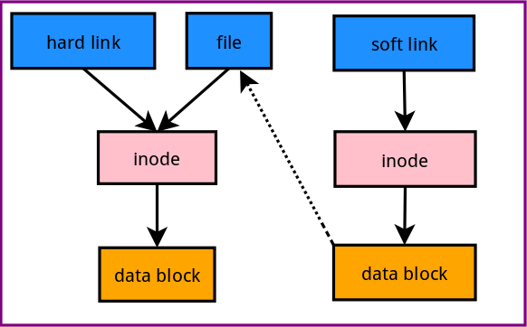
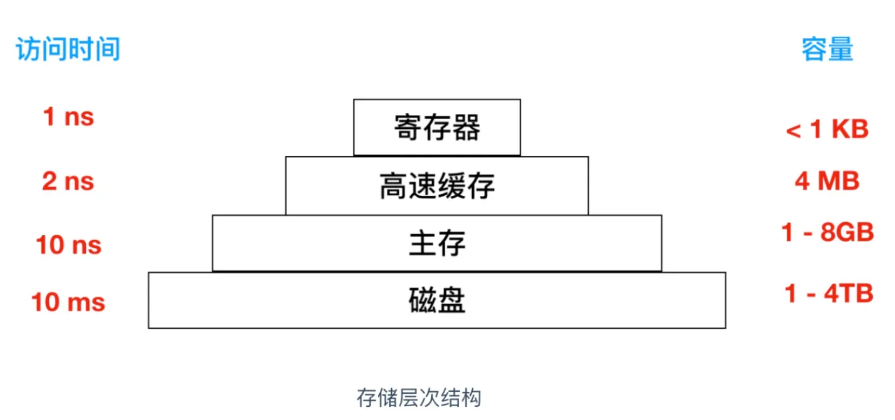
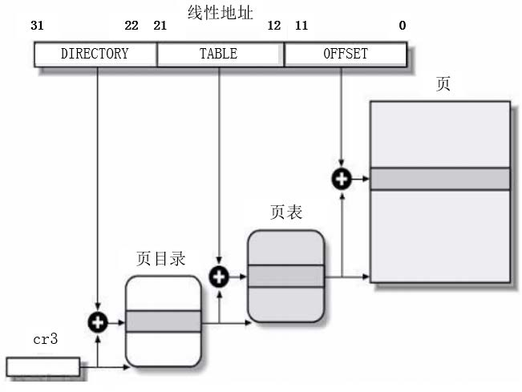
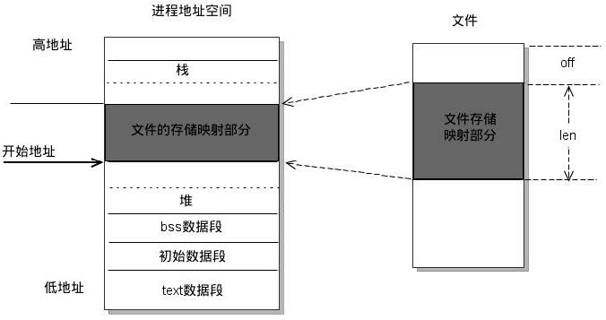
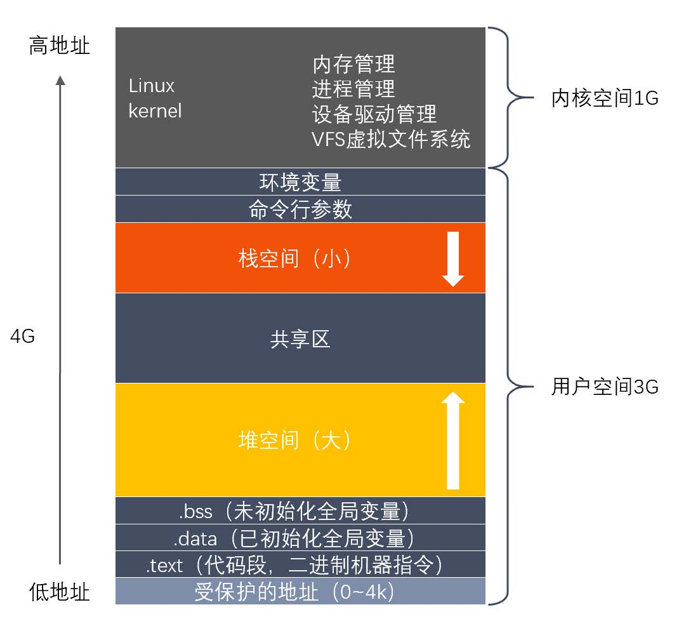
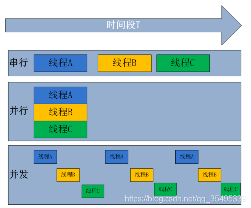
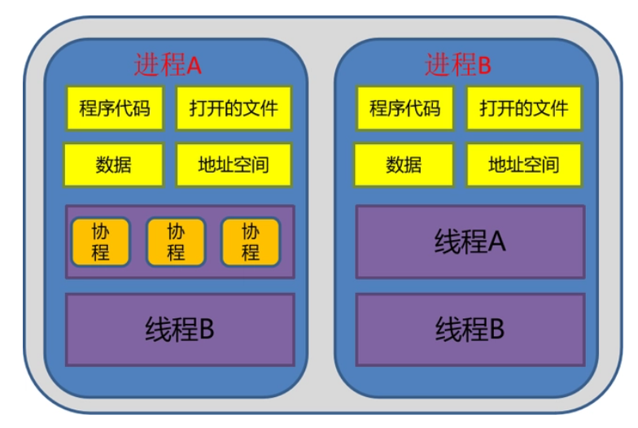
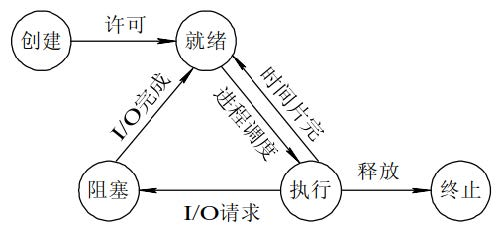

# offer

# 1 C/C++

## 1.1 语言基础

1. C++语言特点

   - 继承C的面向过程，结构化语言，执行效率高（比汇编慢10%~20%）。
   - 面向对象：封装（结构清晰），继承（代码重用），多态（丰富扩展性，面向接口编程）。
   - 泛型编程：引入模板编程思想，在此基础上实现STL，实现算法和数据结构的分离，极大提高代码的可复用度，提高开发效率。
   - 更加安全易用，增加了引用，四个类型转换，try_catch异常类型机制
   - 发展的语言：lambda函数、右值引用，可变参数模板，智能指针等。

2. C和C++的特点

   - C++是C的超集，C++可以很好的兼容C，并且增加了许多新特性。
   - C++是面向对象的语言，而C面向过程
   - C++可复用性更高，引入泛型编程中的模板思想，在此基础上构建了STL，使C++相较于C更加灵活，更加通用
   - C++更安全，引用，智能指针，try_catch异常机制，cast转换。

3. C++中class与struct的区别

   - 使用场景：struct更多用于描述一个数据结构集合，而class是对一个对象数据的封装。
   - 本质区别是：访问控制
     - struct默认的访问权限是public，而class是private
     - struct默认的继承权限是public，而class是private
   - 泛型方面：struct不支持模板参数，而class可以。
   - 其余方面struct和class没什么大的区别:
     - class可以继承struct，struct也可以继承class，取决于继承者的类型
   - 

4. C++中的struct和C中的struct的区别

   - 声明时：

     |          | C                      | C++                      |
     | -------- | ---------------------- | ------------------------ |
     | 成员函数 | 不能有                 | 可以有                   |
     | 静态成员 | 不能有                 | 可以有                   |
     | 访问控制 | public，不可修改       | public/private/protected |
     | 继承关系 | 不可继承               | 可从其他类或结构体继承   |
     | 初始化   | 不能直接初始化数据成员 | 可以                     |

   - 初始化声明时：C中必须加上关键字struct，而C++中可以省略。

5. [include头文件中双引号""和尖括号<>的区别](https://blog.csdn.net/qq_27825451/article/details/102568482)

   - 头文件的文件类型：尖括号中的系统文件，双引号中的是自定义文件
   - 查找文件的路径顺序：
     - 双引号：
       1. 当前源文件所在的工作目录
       2. 编译器设置的头文件查找路径，编译器有默认的头文件查找路径。（当然也可以-**i**指定）
       3. 系统变量CPLUS_INCLUDE_PATH/C_INCLUDE_PATH指定的头文件路径（vs，如果安装在C盘就在programfile x86下的Windows Kits\10\Source\10.0.22000.0\ucrt，如果在其他盘就在盘下的Windows Kits\10\Source\10.0.22000.0\ucrt）
     - 尖括号就在后两个路径上找

6. 在C++中导入C语言代码的关键字。

   - 关键字是extern，表达形式是extern "C"
   - 主要作用：为了实现C++代码调用其他C语言代码，加上extern "C"后，会指示编译器这部分代码按C语言进行编译，而不是C++
   - 在函数方面，C编译器和C++编译器编译有所不同，由于C++支持函数重载，编译时函数名会加上参数的类型，而C不会。

7. 简述C++从代码到可执行的二进制文件的过程

   - C++和C语言类似，总过程：预处理（预编译，.i），编译（.s），汇编（.o），链接（.exe）
   - 预处理阶段：主要做宏处理，宏分四类：define宏定义，include宏，if条件编译宏，预定义宏
     - 处理宏定义展开
     - 处理所有条件编译宏
     - 处理include宏，将被包含的文件插入到预编译指令的位置
     - 处理预定义宏，添加行号，文件名，日期等。
     - 生成.i的临时文件
   - 编译阶段
     - 词法分析，语法分析，语义分析，代码优化，生成汇编代码，汇编代码优化
     - 生成.s临时文件
   - 汇编阶段
     - 将汇编代码转变为机器可以执行的指令。
     - 生成目标文件.o或.obj
   - 链接阶段
     - 将不同源文件产生的目标文件进行链接，从而形成可执行的程序。
     - 生成可执行文件（window为.exe，linux为.out)
     - 链接分为静态和动态链接：
       - 静态链接：将函数和数据编译成一个静态链接库文件（windows为.lib，linux为.a），在链接的时候，把需要调用的函数或过程嵌入链接到生成的可执行文件中，现在就算你把静态库删除也不会影响可执行程序的执行。
         - 静态库本身并不需要与可执行文件一起发行。
       - 动态链接：将函数和数据编译成生成动态链接库文件（windows为.dll，linux为.so），在链接的时候，并没有把调用的函数和过程嵌入链接进入可执行文件中，只包含函数的重定位信息。所以当你删除动态链接库的时候，可执行程序就不能运行。

8. 关键字static的作用

   - 静态局部变量和静态全局变量，
     - 静态全局变量：
     - 静态局部变量：在编译时分配内存并赋初值（之后不再赋初值），函数调用后，内存不释放
   - 静态函数
   - 静态变量和静态函数都被限制在本文件中。
   - 在C++的类中，被用于定义静态成员（变量和函数），
     - 静态成员只有一份拷贝，为所有对象共享
     - this指针无法引用

9. [指针和数组的区别](https://blog.csdn.net/qq_36992917/article/details/79238874)

   - |          | 数组                                               | 指针                       |
     | -------- | -------------------------------------------------- | -------------------------- |
     | 访问效率 | 直接访问，效率高                                   | 间接访问，效率低           |
     | 字节大小 | 不固定，数组类型和元素个数决定                     | 固定，由操作系统的字长决定 |
     | 标识符   | 指针常量，不可以使用自增++                         | 指针变量，可以使用自增++   |
     | 内存空间 | 存储的是一系列数值，对应的空间大小不可变，内容可变 | 存储的是地址               |
     | 赋值     | 遍历数组进行赋值                                   | 同类型指针变量可以相互赋值 |

   - 数组对应一块内存区域，地址和容量在其生命周期不会改变，其内容可变。而指针指向一块内存区域，指向的区域地址和大小可变。

10. 函数指针

    - 概念：指向函数的指针，每一个函数都有一个入口地址，该入口地址就是函数指针指向的地址

    - 定义：

      ```c
      int func(){}
      int (*f)();
      f= &func;
      ```

    - 应用场景：做回调函数。

11. [静态变量初始化时机](https://blog.csdn.net/u011723812/article/details/78151533)

    - 全局变量，文件域的静态变量和类的静态成员变量，在main执行之前，分配内存并初始化（编译期初始化）
    - 局部静态变量在第一次使用时分配内存并初始化。
    - 初始化线程安全性：非局部静态变量线程安全。而局部静态变量线程不安全（编译器的实现是通过一个标识，来标定这个局部静态变量是否初始化），而在支持C++11标准的编译环境下，它是线程安全的。
    - 全局或静态对象当且仅当对象首次用到时才进行构造

12. 用nullptr初始化类的对象，可不可以调用类的成员函数

    - nullptr可以调用成员函数，因为成员函数在编译对象时，就已经绑定了函数地址，和指针空不空没有关系

    - ```c++
      class animal{
      	public:
      		void sleep(){ cout << "animal sleep" << endl; }
      		void breathe(){ cout << "animal breathe haha" << endl; }
      };
      class fish :public animal{
      	public:
      		void breathe(){ cout << "fish bubble" << endl; }
      };
      int main(){
      	animal *pAn=nullptr;
      	pAn->breathe(); // 输出：animal breathe haha
      	fish *pFish = nullptr;
      	pFish->breathe(); // 输出：fish bubble
      }
      ```

13. [野指针](https://blog.csdn.net/qq_40927789/article/details/80686723)

    - 没有初始化的指针，指针指向的位置不可知。

    - 悬垂指针：指向已经释放内存区域的指针

    - 危害：

      - 指向一个不可访问的空间
      - 指向一个没有明确意义的空间，在这种情况下， 程序是正确的，可以正常运行，然而事实上是有问题存在，掩盖了程序上的错误
      - 指向一个可用，并且正在被使用的空间，如果我们用这样的指针对所指空间进行了修改，这个修改对程序的运行大概率会有影响，进而导致程序崩溃，或数据被损坏

    - 避免方法:

      - 初始化置NULL

      - 申请内存后判空

      - 内存释放后指针置空

      - 使用智能指针

      - ```c
        int *p = NULL; //初始化置NULL
        
        p = (int *)malloc(sizeof(int)*n); //申请n个int内存空间
        assert(p != NULL); //判空，防错设计
        
        p = (int *) realloc(p, 25);//重新分配内存, p 所指向的内存块会被释放并分配一个新的内存地址
        free(p);
        p = NULL; //释放后置空
        ```

14. 静态局部变量，静态全局变量，全局变量，局部变量的区别。

    - 作用域：
      - 全局变量：全局作用域，可以通过extern作用于其他非定义的源文件
      - 静态全局变量：文件作用域
      - 局部变量：局部作用域
      - 静态局部变量：局部作用域，只初始化一次，直到程序结束
    - 所在空间
      - 除局部变量在栈区（动态存储区），其他都在静态存储区。
    - 生命周期
      - 由于局部变量在栈上，出了作用域就回收存储，而其他都在静态存储区上，知道程序结束才回收内存。

15. 内联函数和宏函数的区别

    - 内联函数：广义的来说，定义时被inline修饰的函数。一般用于比较小而简单的，频繁调用的函数。
    - 宏函数：通过define定义的标识符，带参数的宏
    - 相同点：
      - 宏函数和内联函数都会在适当位置进行展开，都是以代码膨胀为代价，避免函数调用开销。
    - 区别：
      - 性质：宏函数不是函数（只是像，但不是），而内联函数是函数。
      - 处理阶段：宏函数在预处理阶段，而内联函数在编译阶段
      - 参数方面：宏函数没有类型检查（只进行简单的字符串替换），而内联函数会进行类型检查。

16. 内联函数和函数的区别

    - 定义需要inline修饰
    - 内联函数没有函数调用开销
    - 内联函数无需寻址（代码在调用处展开）
    - 选择：调用开销、执行函数体时间、代码量，三个维度来决定函数是内联还是普通

17. 运算符`i++和++i`的区别

    - 赋值顺序不同，
    - 效率不同：后置++比前置++效率低，后置`++`要多生成一个局部对象 tmp，因此执行速度比前置的慢。
    - i++不能作为左值，而++i可以
    - 二者都不是原子操作。

18. new和malloc的区别，各自底层实现原理

    - 区别：

      |      | new                                                          | malloc                                     |
      | ---- | ------------------------------------------------------------ | ------------------------------------------ |
      | 类型 | 操作符                                                       | 函数                                       |
      | 重载 | 可重载                                                       | 不可重载                                   |
      | 异常 | 发生错误，抛异常，分配内存更直接更安全，                     | 返回NULL                                   |
      | 构造 | **new** 和 **delete** 分别是 **开空间+构造函数**、**析构函数+释放空间** | 开空间和释放空间                           |
      |      | 会调用构造函数，无需指定内存大小，指针无需强转               | 需要给定申请的内存大小，返回的指针需要强转 |

    - [malloc底层实现](https://blog.csdn.net/Allelujah123/article/details/123874128)

      - https://blog.csdn.net/weixin_43340455/article/details/124570759
      - malloc采用的是内存池的管理方式，以减少内存碎片。先申请大块内存作为堆区，然后将堆区分为多个内存块。当用户申请内存时，直接从堆区分配一块合适的空闲快。采用隐式链表为每一个空闲块记录了一个未分配的、连续的内存地址。

    - new底层实现

      - 创建一个新的对象
      - 将构造函数的作用域赋值给这个新的对象
      - 执行构造函数的代码
      - 返回新对象

19. [const详解](https://blog.csdn.net/qq_40337086/article/details/125519833)

    - [const 修饰变量](https://blog.csdn.net/weiyuanzhang123/article/details/117592035)：**const默认作用于其左边的东西，如果左边没东西，则作用于其右边的东西。**
      - const int * ：`(const int) *`——指针指向一个整型常量，不可改变指针指向的内容，但指针本身可以改变
      - int const *：`(int const) *`——同上
      - int * const：`int (* const)`——指针常量指向一个整型变量，可改变指针指向的内容，但指针本身不可改变
      - const int * const：`(const int) (* const) `——指针常量指向整型常量
      - int const *const：`(int const) (* const)`
    - 

20. C++有几种传值方式

    - 值传递：改变形参的值，不会改变实参的值
    - 引用传递：改变形参的值，会改变实参的值
    - 指针传递：如果指针的指向没有改变，改变形参的值，会影响实参的值

21. 使用指针的注意

    - 防止野指针：
      - 定义指针变量时，初始化为NULL
      - 申请内存后，判空
      - 释放内存后，置为NULL
    - 动态内存申请和释放必须配对，防止内存泄漏
    - 避免指针越界

22. 常量定义：const和define 

    - 生效阶段：const在编译阶段，define在预处理阶段
    - 内存占用：const定义的变量需要占用内存空间，define运行时时直接的操作数
    - 类型：const定义的变量时有类型的，而define无

23. 


## 1.2 C++内存

1. [堆和栈的区别](https://blog.csdn.net/mynameisJW/article/details/105150558)
   - 管理方式：栈由操作系统自动分配和释放，堆的分配释放由开发者控制，容易产生内存泄漏。
   - 空间大小：每个进程拥有的栈空间要远远小于堆的大小，64bits windows默认栈是1M，64bits linux默认10M，而可申请的堆理论大小是虚拟内存的大小
   - 生长方向：堆生长方向向上，内存地址由低到高，栈的生长方向向下，内存地址由高到低。
   - 分配方式：
     - 堆只能动态分配，栈动态和静态分配都有。
     - 静态分配是由操作系统完成的，比如局部变量的分配。
     - 堆的动态分配由malloc或new函数进行分配，须手动free和delete。栈的动态分配不同于堆，**栈中动态分配内存**的函数`alloca`，用法与malloc，但不用free，由操作系统自动释放。
   - 分配效率：
     - 栈由操作系统自动分配，会在硬件层级对栈提供支持：提供专门的寄存器存放栈的地址，压栈出栈都有专门的指令执行，效率高
     - 堆则由C/C++提供库函数或运算符来完成管理，实现机制较为复杂，频繁的内存申请容易产生内存碎片，效率低。
   - 存放内容:
     - 栈存放函数变量、参数、地址、寄存器内容
     - 堆一般存放对象，具体内容由开发者填充
   - 生命周期：栈短堆长，栈中存储的数据随函数执行完成而结束，系统自动释放空间。而堆如果不手动释放，其生命周期等同进程生命周期
   - 数据结构：栈是一种线性数据结构，遵守FILO的规则，而堆是一种非线性的完全二叉树
2. [C++内存管理](https://blog.csdn.net/weixin_41055260/article/details/118981630?utm_medium=distribute.pc_relevant.none-task-blog-2~default~baidujs_baidulandingword~default-0-118981630-blog-124414552.pc_relevant_3mothn_strategy_recovery&spm=1001.2101.3001.4242.1&utm_relevant_index=3)
   - 内存管理（分配方式）机制：分为5个区，栈区，堆区，自由存储区，静态存储区，常量区，代码区。
     - 栈区：存放函数内的局部存储单元
     - 堆区：由new分配的内存块，需要delete释放
     - 自由存储区：由malloc等分配的内存块，和堆是十分相似的，不过是用free来结束自己的生命。（在C里面，这就是堆）
     - 静态存储区：存放全局，静态变量
     - 常量存储区：存储的是常量，不允许修改
     - 代码区：存放可执行的机器码
   - 内存泄漏机制：
     - 内存泄漏：程序在申请内存后，无法释放已申请的空间，占用有用内存，最终导致内存溢出。
     - 泄漏分为两类：
       - 堆内存泄漏：堆上申请资源后，使用结束后，未释放
       - 资源泄漏：通常指系统资源，比如socket，文件描述符等。因为这些在系统中都是有限的，创建而不释放，系统资源会耗尽
     - 产生方式分类：
       - 常发性内存泄漏：每执行一次，就会造成一次泄漏
       - 偶发性内存泄漏：特定场景下执行，就会一次泄漏
       - 一次性内存泄漏：造成泄漏的代码只会被执行一次。
       - 隐式内存泄漏：不停分配内存。
     - 泄漏的场景：
       - new和malloc申请资源使用后，没有用delete和free释放；
       - 子类继承父类时，父类析构函数不是虚函数。
       - Windows句柄资源使用后没有释放。
     - 怎么检测（避免）内存泄漏：
       - 申请和释放一定要成对存在
       - 分配的内存的指针以链表形式管理，使用完成后从链表中删除，程序结束时检查链表中的指针是否都得到了释放。
       - 使用智能指针
       - 一些常见的工具插件，如ccmalloc、Dmalloc、Leaky、Valgrind等等。
   - 内存回收机制
     - 垃圾回收技术所解决只有两个问题：
       - 如何识别当前内存中未被引用的内存块
       - 如何将失去管理的内存进行回收
     - 引用计数：除内存块外增加一个引用计数，当内存块被引用，计数加1，当内存块失去引用，计数减1，同时检查引用计数，如果为0，就销毁释放内存
     - 标记清除：垃圾回收器扫描所有内存块，将被引用的内存块进行标记，标记完成后，统一检测内存，将所有未被标记的内存块回收
   - 
3. [内存对齐](https://blog.csdn.net/qq_39397165/article/details/119745975)
   - 由于CPU对内存的访问不是随机的，而是在特定地址或字长的整数位置访问内存，所以对数据的存储要按照一定的空间规则，使CPU对一个数据单元访问的次数尽量小，这就是内存对齐。
4. C++程序启动过程
   - 操作系统首先创建相应的进程并分配私有的进程空间，操作系统的加载器负责把可执行文件的数据段和代码段映射到进程虚拟内存空间。
   - 加载器读入可执行程序的导入符号表，根据这些符号可以查找出该可执行程序的所有依赖的动态链接库。
   - 加载器针对该进程的每个动态链接库，调用LoadLibrary
     - 查找动态库文件，读入动态链接库，调用动态链接库初始化应用程序的函数
   - 初始化应用程序的全局变量，对于全局对象自动调用构造函数
   - 进入应用程序入口点函数开始执行
5. 

## 1.3 面向对象

1. 三大特征：

   - 封装：将数据和操作数据的方法进行有机结合，加以权限区分，隐藏对象的属性和实现细节，仅对外公开来和对象进行交互。
   - 继承：利用已有类定义新类，新类可以使用和扩展已有类的功能。
     - 三种继承方式：public，private，protected（父类成员权限被继承方式限制）
     - 构造函数，析构函数，operator=，都不能继承（子类不会复制父类的函数，类的函数，只有一份，为所有对象共享，包括子类对象），对象的空间计算包含：对象的父类和本身的非静态属性。
   - 多态：
     - **同一类型的多个实例，在执行同一方法时，呈现出多种行为特征——多态**
     - 静态多态（编译时多态）：重载，重定义（子类重新定义父类的非虚函数，覆盖）
     - 动态多态（运行时多态）：重写（子类重写父类虚函数）
       - 协变（子替代父）是重写的特例，基类中返回值是基类类型的引用或指针，在派生类中，返回值为派生类类型的引用或指针。
       - 不变（两个毫不相关的类，不能相互替代），协变（子替代父），逆变（父替代子）
   - 

2. C++的重载和重写

   - 重载：同一作用域，同名函数，参数的顺序、个数、类型不同 都可以重载。（返回值类型不同不能作为重载的条件）
     - 采用命名倾轧技术，重载函数在编译时，会将参数类型的首字母作为函数名的一部分，以此来区分重载的多个函数。
   - 重写：子类重写父类的虚函数，返回值类型、函数名，参数顺序，个数，类型都必须一致。
     - 在基类的函数前加virtual修饰，在子类中重写该函数，运行时将会根据对象的实际类型调用相应的函数
     - 采用虚函数动态绑定原理，
       - 当声明父类一个函数为虚函数时，就会为这个类声明一个虚函数指针vfptr，这个指针指向一个虚函数表vftable，表里记录这虚函数的入口地址。
       - 当子类继承父类时，会继承这个vfptr和vftable，当子类重写了父类虚函数的同时，通过vfptr找到vftable，修改这个函数对应的入口地址为子类的函数地址。
       - 当父类指针指向子类的空间时，本质上还是调用父类的那个函数，当调用父类的那个函数时，发现此函数是一个虚函数指针，通过这个指针找到这个vftable，从而找到子类函数的入口地址，间接调用了子类函数
   - 重定义：子类重定义父类的同名函数（非虚），参数的顺序，个数，类型可以不同。

3. C实现函数重载

   - C不允许函数同名，因为编译时，同名函数名都是一样的

   - 采用函数指针，将一个函数的一个参数类型定义为函数指针，其他参数为这个函数指针的参数

   - 使用可变参数函数（stdarg.h，val_list类型和三个宏函数va_start，va_arg，va_end）

   - [gcc内置函数](https://www.it1352.com/1987845.html)可以实现函数重载

   - ```c++
     // 函数指针实现函数重载
     #include<stdio.h>
     
     typedef void (*ptr)(void *); //typedef申明一个函数指针
     
     void func_int(void * a){
     	printf("%d\n",*(int*)a); //输出int类型，注意 void * 转化为int
     }
     void func_double(void * b){
     	printf("%.2f\n",*(double*)b);
     }
     
     void c_func(ptr p,void *param){
     	p(param); //调用对应函数
     }
     
     int main(){
     	int a = 23;
     	double b = 23.23;
     	c_func(func_int,&a);
     	c_func(func_double,&b);
     	return 0;
     }
     
     // 可变参数实现函数重载
     #include<stdarg.h>
     int fun(int n, ...){
         //1. 在函数中创建一个va_list类型的变量
         val_list ap;
         //2. 初始化一个参数列表
         va_start(ap,n);
     //    for(int i = 0;i < n; i++){
     		//3.访问参数列表的内容
         	va_arg(ap,int);
     //    }
     	//4. 清理
         va_end(ap);
     };
     ```

   - 

4. 仿函数

   - 重载了operator()的类，其对象称为函数对象，是行为类似函数的对象，也叫仿函数
   - 它是一个类的实例，而不是函数。
   - 超出普通函数概念，可以拥有自己的状态。
   - 模板函数使得函数对象的通用型更好，这也是它的优点之一。

5. 类方法和数据的权限

   - public：类的实例可以**直接访问**
   - protected：允许本类及子类的**成员函数可以访问**
   - private：允许本类的成员函数可以访问。

6. 派生类的继承方式（权限）影响对父类成员的访问。

   - 继承方式（权限）会限制父类成员的访问权限，继承权限大的不会影响访问权限小的父类成员，继承权限小的会缩小访问权限大的父类成员至继承权限。

7. 构造函数的种类

   - 默认构造函数、初始化构造函数、拷贝构造函数、移动构造函数，转换构造函数。

   - 默认构造函数（无参构造）和初始化构造函数（有参构造）

     - 在定义对象时，完成对象的初始化工作，
     - 定义了有参构造，编译器不再提供无参构造

   - 拷贝构造函数

     - 完成对是整个对象的拷贝，旧对象和复制构造的对象各自占有不同的同样大小的堆内存。
     - 拷贝构造的形参是一个左值引用。

     - 三种情况被调用：
       - **旧对象初始化（构造）新对象**，记得是初始化，而不是赋值（=），如果等号的左边是一个已定义的对象，那么就不会发生拷贝构造
       - 函数的参数是对象，而非对象的引用。在调用函数的时候，会发生拷贝构造
       - 函数的返回值是对象，而非对象的引用。在调用函数并执行返回的时候，会发生拷贝构造。所以**引用可以大大减小拷贝构造开销**

   - 移动构造函数：**右值（临时（匿名）对象、不可寻址的字面常量）初始化新对象时**（C++11）

     - 生成一个指针指向源对象地址，接管源对象的内存。
     - 移动构造的形参是一个右值引用。

   - 转换构造函数：

     - 通过利用单参数的构造函数（转换构造）可以隐式转换其他对象为本构造对象，再配合相应的运算符重载，完成相关运算。
     - 类型转换函数：将本对象隐式转换为其他类型对象，完成相应的计算。

8. 拷贝和移动的区别

   - 形参：拷贝是左值引用，移动是右值引用
   - 拷贝是对整个对象的拷贝，移动是生成一个指针指向源对象的地址，接管源对象。

9. 拷贝构造参数是什么传递方式，为什么

   - 引用传递方式
   - 如果是传值，传值的方式会调用该类的拷贝构造，从而造成无穷递归调用拷贝构造

10. 空类默认有哪些函数

    - 默认构造，拷贝构造，重载赋值，析构

11. 多重继承下的构造和析构

    - 父类构造函数–>成员类对象构造函数–>自身构造函数
    - 其中成员变量的构造与在当前类声明顺序有关，父类构造函数的调用顺序是当前子类继承列表中的顺序。（与当前子类初始化列表顺序无关）
    - 析构顺序和构造顺序相反。

12. 类型转换

    - 上下行转换：
      - 上行转换：父类指针指向子类空间，不会造成内存越界，安全
      - 下行转换：子类指针指向父类空间，可能会造成内存越界，不安全
    - C++提供四种类型转换
      - static_cast：用于基类与派生类之间的指针或引用转换
      - dynamic_cast：用于类层次的上行转换
      - const_cast：用于将const修饰和非const修饰的对象之间的转换
      - reinterpret_cast：重新解释类型转换（可用于无关类之间的转换）

13. 深拷贝和浅拷贝

    - 浅拷贝：将原对象的引用直接赋值给新对象，新对象只是原对象的一个引用
    - 深拷贝：开辟一个和原对象一样的空间，创建一个新的对象，把原对象属性的“值”拷贝一份，是值而不是引用。（如果这个值是对象，那就还需迭代开辟空间）

14. 常函数

    - 类的成员函数后边被const修饰，被称作常函数。
    - 常函数体内不可修改对象中任何非静态成员变量，但是可以修改静态成员变量和mutable修饰的成员变量。
    - 常量（即 const修饰的）类的实例对象可以调用const 成员函数，而不能调用非const修饰的函数。正如非const类型的数据可以给const类型的变量赋值一样。

15. 菱形继承

    - 孙子类的多个父类有共同的祖先
    - 孙子类及其派生类会拥有多份公共的数据，当孙子类及其派生类访问这份公共数据时，出现二义性，而出错

16. 虚继承

    - 在继承方式前加virtual修饰，子类虚继承父类，子类只会保存一份公共数据。
    - 虚继承解决 菱形继承中，多份公共祖先数据的问题。

17. 多态

    - 同一个类型的不同实例，在执行同一方法时，呈现出多种行为特征。
    - 除了虚函数（动态多态，运行时）可以实现多态， 还有函数重载（静态多态，编译时）可以实现多态

18. 为什么要虚析构，而不能虚构造

    - 虚析构：
      - 虚析构：析构函数被virtual修饰
      - 通过父类指针 释放整个子类空间，防止内存泄漏。原理：vfptr，通过vftable，找到虚析构函数，而这个析构函数实际指的是子类的析构函数，子类析构之后，会自动调父类的析构函数。
    - 虚构造
      - 从功能上说：虚函数是用来实现多态的，也就是对象的动态行为，而构造函数的作用是提供初始化，在对象的生命周期只执行一次，不是对象的动态行为，没有必要称为虚函数。
      - 构造函数是在创建对象时自动调用的，不可能通过父类的指针或者引用去调用

19. 哪些函数不能是虚函数

    - 普通函数（非成员函数）：只能被重载，不能被重写。
    - 构造函数：执行初始化行为，而不是对象的动态行为。自动调用，而不是通过父类指针或引用去调用
    - 内联成员函数：编译时被展开，而虚函数是运行时动态绑定函数
    - 静态成员函数：属于一个类，而非某个对象，没有this指针，无法进行对象的判别
    - 友元函数：无法继承，所以没有虚函数的说法。

20. 虚函数表里存放的内容？什么时候写进去的？

    - 存储虚函数地址的数组，存放该类重写的及父类未被重写的所有虚函数入口地址。
    - [虚表写入时机](https://blog.csdn.net/weixin_43919932/article/details/104356460)：分配内存空间后，调用构造函数前。

21. 构造函数中能不能调用虚函数

    - 语法上讲：调用完全没有问题
    - 从效果上讲：不能达到多态的效果，
      - 因为派生类对象构造期间（父类构造函数在派生类构造之前调用），派生类还没完全创建，此时它当做一个父类对象，
      - 同样，进入基类析构函数时（子类析构函数在父类析构之前调用），对象也是基类类型。
    - 基类中声明纯虚函数并且在基类的析构函数中调用，编译器会报错。
      - 如果在**基类构造函数中调用虚函数**被解析成**调用派生类的虚函数**，而**派生类的虚函数中又访问到未初始化的派生类数据**，这是危险的，将会导致程序出现未知行为及bug。

22. 虚函数与纯虚函数的区别

    - 可以同时定义一个类中，都可以被重写，以多态的形式被调用。
    - 都不能被static修饰，因为被static修饰的函数在编译时静态绑定，然而虚函数是运行时动态绑定。
    - 含有纯虚函数的类被称为抽象类，只含有虚函数的类不能被称为抽象类；
    - 虚函数在基类中已定义，而纯虚函数在基类中仅仅只声明。虚函数可以直接被使用，因为在父类中有函数体，也可以被子类重写，以多态的形式调用。而纯虚函数必须在子类中实现，因为纯虚函数在父类中没有函数体。

23. 虚函数与纯虚函数

    - 虚函数的作用主要为了实现多态。
    - 纯虚函数的作用主要是为了实现一个接口，用来规范派生类的行为。

24. 含有纯虚函数的类能实例化吗？它的派生类要必须重写纯虚函数吗？

    - 含有纯虚函数的类被称为抽象类，抽象类不能实例化对象。在底层，拥有虚函数都有一个vftable，纯虚函数的对应的函数入口地址为0，也就是指向一个不存在的函数，由于编译器绝对不允许有调用一个不存在的函数的可能，所以该类不能实例化对象。
    - 抽象类的派生类必须重写所有纯虚函数，否则依然是一个抽象类，抽象类不能实例化对象。
    - 定义纯虚函数是为了实现一个接口，用来规范派生类的行为。

25. 抽象类

    - 抽象类：有**纯虚函数**的类
    - 纯虚函数：函数原型后加“=0”
    - 特点：
      - 抽象类只能用作其他类的基类，不能建立抽象类对象。
      - 抽象类不能用作函数的返回值类型，参数类型或显示转换的类型
      - 可以定义指向抽象类的指针和引用，指针可以指向它的派生类，继而实现多态

26. 类模板和模板类的区别

    - 类**模板**是一个模板的定义，**含有通用类型参数的类定义**，可以看作是做蛋糕的模具

    - 模板**类**：**类模板中通用类型具体化后的类**，可以看作是通过蛋糕模具做出来的蛋糕。

    - ```c++
      // 类模板
      template<class T1, class T2>
      class Data{}
      
      // 模板类
      Data<int, float>
      ```

27. 函数模板

    - 会编译两次：在编译时编译，在调用处类型具体化后的编译
    - 每使用一次函数模板（模板的类型不同的话），都会产生一个新的函数空间

28. 

## 1.4 STL

1. STL基本组成部分

   - 广义上来讲分三类：容器，迭代器，算法，容器和算法之间通过迭代器进行无缝衔接。

   - 详细来说有六类：容器，迭代器，算法，仿函数，适配器，空间配置器
   - 容器（container）：是一种数据结构，用来存放对象的模板类，为了访问容器内的数据，可以通过容器类提供的迭代器
   - 算法（algorithm）：操作容器中数据的模板函数，函数本身与操作的数据的结构和类型无关。
   - 迭代器（iterator）：提供访问容器中对象的方法。事实上，指针也是一种迭代器，迭代器也可以是那些定义了operator*()以及其他重载了指针的操作符方法的类对象;
   - 仿函数（functor）：又称函数对象，重载了"operator()"的类，它是一个类，不是一个函数，可以拥有自己的状态
   - 适配器（adapter）：简单来说是一个接口类，专门用来修改现有类的接口，提供一种新的接口，或调用现有函数来实现某种功能。主要包含三类：容器适配器，迭代器适配器，函数适配器。
   - 空间配置器（allocator）：为STL提供空间控制系统，主要包括两部分：对象的创建和销毁，内存的获取与释放

2. STL中常见的容器

   - 分为三类：顺序容器，关联式容器，容器适配器
   - 顺序容器
     - 容器并非排序的，元素插入位置同元素值无关。包含vector，deque，list
     - vector：单端动态数组，内存连续，存取常数时间，在尾端增删元素具有较佳性能
     - deque：双向队列。内存连续，存取常数时间（仅次于vector），在两端增删元素具有较佳性能
     - list：双向链表，内存不连续。任何位置增删常数时间。不支持随机存取。
       - 还有forward_list——单向链表，链表中的节点只能向后搜索，支持前向迭代器。
   - 关联性容器
     - 有序关联：set、multiset、map、multimap，支持双向迭代器
       - 元素是排序的；插入任何元素，都按相应的排序规则来确定其位置；查找性能高；通常以**平衡二叉树（红黑树）**的方式实现。
     - 无序关联：unordered_set/unordered_multiset，unordered_map/unordered_multimap，支持前向迭代器，
       - 元素无序，按**哈希表**存放，查找速度比有序关联的快。
   - 容器适配器（不支持迭代器）：封装了一些基本的容器，底层可能是序列容器或者链表。
     - stack：默认的底层容器是deque，FILO
     - queue：默认的底层容器是deque，FIFO
     - priority_queue：内部元素按照有序堆（大顶堆降序、小顶堆升序）进行存放，按优先级执行，高级先出，同级才FIFO

3. STL中map、hashtable、deque、list的实现原理

   - map：红黑树（非严格平衡二叉搜索树）
     - map内部实现了红黑树，它有自动排序功能，树的每个节点都代表map的一个元素，因此对map的增删查等操作就是对红黑树的操作。由于map中的元素是按照二叉树存储的，所有左子树的所有节点都比根节点小，右子树都比所有根节点大，使用树的中序遍历，可将键值按照从小到达遍历出来。
   - unordered_map：hashtable，散列表
     - 采用函数映射思想将元素的存储位置和元素的关键字联系起来，它能快速的定位到想要查找的元素，而不是依靠元素的关键字进行比较来进行查找
   - deque：双向队列
     - 内部实现了一个双向队列，元素在内存连续存放，随机存取常数时间，两端增删性能较优
   - list：双线链表
     - 内部实现的是一个双向链表，内存不连续，任意位置增删常数时间，不支持随机存取，访问第i个元素都需从头挨个遍历到第i

4. 介绍一下STL空间配置器

   - 程序包括数据结构和算法，而数据结构作为存储数据的组织形式，与内存分配有着密切的联系，在C++ STL中，空间配置器便是用来实现内存空间分配的工具。每一种空间的分配都是通过空间配置器来实现。
   - 空间配置器没有简单采用new和delete的方式，而是采用了一个高效的方式。
   - 首先把对象构造始末分成了空间配置和对象构造两部分，
     - 空间配置：内存配置allocator，内存释放deallocator
     - 对象构造：构造construct，释放destroy
   - 对于内存空间的配置，SGI STL采用类两级结构：
     - 一级空间配置器：管理大块内存
       - 对malloc和free进行了封装，同时增加了申请空间失败抛出异常机制
       - 主要作用：向操作系统申请内存，申请失败抛异常
     - 二级空间配置器：管理小块内存
       - 采用内存池来提高申请空间速度和减少额外空间的浪费，在内存池内右采用哈希桶来提高获取空间的速度和高效管理（但增加了内存碎片），也有在内存池内采取链表的形式来管理，可是获取空间的速度不高。

5. 各种容器的时间复杂度

   |      | vector<br />（单端数组） | deque<br />(双向队列) | list<br />（双向链表） | map/multi~<br />set/multi~<br />（红黑树） | unordered_map/~_multimap<br />unordered_set/~_multiset<br />（散列表） |
   | ---- | ------------------------ | --------------------- | ---------------------- | ------------------------------------------ | ------------------------------------------------------------ |
   | 插入 | O(N)                     | O(N)                  | O(1)                   | O(logN)                                    | O(1)，最坏O(N)                                               |
   | 查看 | O(1)                     | O(1)                  | O(N)                   | O(logN)                                    | O(1)，最坏O(N)                                               |
   | 删除 | O(N)                     | O(N)                  | O(1)                   | O(logN)                                    | O(1)，最坏O(N)                                               |

6. 迭代器什么时候失效（STL怎么删除元素）

   - 对于顺序容器的vector、deque来说，使用erase后，后面每个元素的迭代器都会失效，后面每一个元素都会往前移动一位。erase返回下一个有效迭代器。
   - 对于关联容器map、set来说，使用了erase后，当前元素的迭代器会失效，但其结构是红黑树，删除当前元素，不会影响下一个元素的迭代器，所以在调erase方法之前，记录下一个元素的迭代器即可
   - 对于list来说，它使用了不连续的内存，并且erase会返回下一个有效的迭代器，因此上面两种方式都可用。

7. 迭代器的作用，有指针为什么还要迭代器

   - 用于提供一种方法顺序访问一个聚合对象中各个元素, 而又不需暴露该对象的内部表示。
   - 作用：
     - 用于指向顺序容器和关联容器中的元素
     - 通过迭代器可以读取它指向的元素
     - 通过非const迭代器还可以修改其指向的元素
   - 迭代器不是指针，是类模板，表现的像指针，他只是模拟了指针的一些功能，重载了指针的一些操作符。本质是封装了原生指针。
   - 迭代器返回的是对象的引用而不是对象的值。

   ```c++
   int main() {
   	vector<int> v; //一个存放int元素的数组，一开始里面没有元素
   	v.push_back(1);
   	v.push_back(2);
       v.push_back(3);
       v.push_back(4);
   	vector<int>::const_iterator i; //常量迭代器
   	for (i = v.begin(); i != v.end(); ++i){ //v.begin()表示v第一个元素迭代器指针，++i指向下一个元素
           cout << *i << ","; //*i表示迭代器指向的元素
           cout << endl;
       }
   	vector<int>::reverse_iterator r; //反向迭代器
       for (r = v.rbegin(); r != v.rend(); r++){
           cout << *r << ",";
           cout << endl;
       }
       vector<int>::iterator j; //非常量迭代器
       for (j = v.begin();j != v.end();j++){
       	*j = 100;
       }
       for (i = v.begin();i != v.end();i++){
       	cout << *i << ",";
       }
   return 0;
   }
   /*
   运行结果：
   1,2,3,4,
   4,3,2,1,
   100,100,100,100,
   */
   ```

8. 迭代器分类

   - 输入迭代器，输出迭代器，前向迭代器，双向迭代器，随机访问迭代器
   - 容器支持情况：
     - vector，deque：随机访问迭代器
     - list，map，multimap，set，multiset：双向迭代器
     - forward_list，unordered_map，~set，~multimap，~multiset：前向迭代器
     - stack，queue，priority_queque：不支持迭代器

9. STL 中resize和reserve的区别

   - size和capacity
     - size：容器中元素的个数
     - capacity：容器的容量，拥有capacity属性的容器只有vector和string。
   - resize
     - resize(num)：重新指定容器size为num，容器原有个数大于num直接截断，容器原有个数小于num，增加新位置并以默认值填充新位置
     - resize(num)的作用：size变成指定的num，capacity视情况变化，
       - num<capacity，capacity不变
       - num>capacity，capacity变得大于等于num
   - reserve
     - 预留容器空间
     - reserve(num1)的作用：不改变size，capacity视情况变化，
       - num1>size，capacity置为num1
       - num1<size，capacity不变

10. STL 动态链接可能产生的问题

    - 给动态库函数传递容器对象本身，可能会出现内存堆栈破坏的问题
    - 容器和动态链接库相互支持不够好，动态链接库函数中使用容器时，参数中只能传递容器的引用，并且要保证容器的大小不能超出初始大小，否则导致容器自动重新分配，就会出现内存堆栈破坏问题。

11. map和unordered_map的区别，底层实现

    - map元素排列有序，unordered_map无序，归根结底是底层实现不同。
    - map内部实现了一个红黑树，红黑树有自动排序功能
    - unordered实现了一个hash表，采用函数映射思想将元素的存储位置和元素的关键字联系起来

12. vector和list区别，应用场景

    - vector：是一个单端动态数组，内存连续，支持随机存取，插入删除数据和扩容开辟空间比较麻烦，适用于高效访问的场景。
    - lsit：是一个双向链表，内存不连续，支持任意位置插入删除，适用于高效插入和删除的场景

13. vector实现原理

    - 底层实现原理为一维数组，内存连续
    - 新增时：
      - 如果数组已满，则需要另辟更大的空间，复制原数据，然后再新增和插入
      - 在尾端新增，很简单
      - 通过迭代器在中间插入数据，需要当前迭代器后面的所有元素向后移动一位，腾开一个位置给这个新插入的数据
    - 删除时：
      - 在尾端删除pop_back很简单
      - 通过迭代器在中间删除，当前迭代器后面的所有元素向前移动一位，尾端多出的空间空闲在那，不释放。

14. push_back和emplace_back的区别

    - 传匿名对象或旧对象时，二者效率相同，会先调构造，再调移动构造
    - 传单构造参数时，emplace_back效率高，都会调构造，但emplace_back不会调用移动构造

15. 

## 1.5 新特性

1. c++11新特性

   - 统一初始化形式，还提供了模板类initializer_list
   - 成员变量默认初始化：构建一个类的对象不需要用构造函数初始化成员变量。
   - auto关键字：用于定义变量，编译器可以自动判断的类型，定义时必须初始化，否则无法推导类型
   - decltype(exp)：根据exp表达式来推导类型，定义时可不必初始化，因为变量的类型和左值右值没有关系，类型由exp决定。
   - 智能指针：shared_ptr，weak_ptr（配合shared_ptr解决循环引用的问题），unique_ptr
   - 空指针nullptr：nullptr_t类型的右值常量，专用于初始化空类型指针。依据nullptr 我们也可以创建属于自己的空指针对象
   - 右值引用和move语义 让程序员有意识减少进行深拷贝操作
   - 增加stl模板类：无序关联容器unordered_map/~multimap，~set/~multiset
   - 正则表达式，实质是一个字符串，该字符串描述了一种特定模式的字符串
   - Lambda表达式：最简：`[捕获上下文列表](参数列表){函数体}`，底层实现是一个匿名对象。
   - 可变参数模板

   ```c++
   // 统一初始化形式
   int a{1};//等价int a(1);，等价int a=1;
   int b{2+2};
   	//c++11后
   Student stu{ 1,85.5f,"qqq" };//结构体
   Data d{1,1.2};//自定义对象
   
   // 成员变量默认初始化
   class Data {
   public:
   	int a = 1;
   };
   
   // auto
   auto var = 55; 
   vector< vector<int> >::iterator i = v.begin();// 类型太长时，可以不用写，用auto代替
   auto i = v.begin();
   
   // decltype
   decltype<1+1> a;
   a = 100;
   sizeof(decltype(1+1.5));
   ```

   

2. 

# 2 操作系统

1. 常用的linux命令

   - 文件权限：chmod
   - 文件与目录管理：
     - 目录：cd/pwd
     - 文件：touch/rm/mv/cp
   - 文件压缩与备份：
     - 压缩：tar/gzip/zip
     - 备份：dump/restore
   - 用户管理：
     - su/useradd/userdel/usermod
   - 例行工作：
     - 突发性：at
     - 例行性：crontab/anacron(任务补漏)
   - 程序管理：
     - 工作管理：jobs(查看后台工作情况)/fg/bg/nohup(脱机管理)
     - 进程管理：ps(当前进程情况)/top(持续检测)/kill/free(资源查看)
   - 服务管理
     - stand alone：service
     - super daemon：xinted
   - 软件安装：
     - yum/apt-get

2. 文件权限修改chmod

   - `chmod nnn file_name`

3. 如何以root权限运行某程序

   ```bash
   sudo chown root filename
   sudo chmod u+s filename # 就是给某个程序的所有者以suid权限,可以像root用户一样操作。
   ./filename
   ```

## 内存管理

1. 软连接和硬链接

   - 文件系统将文件数据分为两个部分：文件权限和属性、文件内容
   - 文件权限和属性，存放在inode中，文件内容存放在data block中，inode有指向datablock的指针
   - 定义上：
     - 软连接又叫符号链接，这个文件的文件内容里包含了另一个文件的路径名，相当于**具有快捷方式功能的文件**。
     - 硬连接就是**一个文件的一个或多个多件名**，
     - 
   - 限制上：
     + 硬链接只能对同一文件系统下的文件进行链接
     + 软连接可以跨文件系统，对文件和目录都可以链接
   - 操作上：
     - 修改：通过链接来编辑文件，都会导致源文件爱被修改
     - 删除：
       - 当指向inode的硬链接（所有文件名的都是硬链接）数目为0的时候就会删除源文件本身。
       - 软链接是本身就是一个文件，你删除了就删除了软链接本身，不会对源文件造成影响。但如果源文件被删除，这个软链接就成了死链接，如果恢复源文件，那这个软链接也可恢复。

2. 动态库和静态库的制作，及区别

   ```bash
   # 静态库制作
   # 1.编译生成.o文件
   gcc -c add.c
   gcc -c sub.c
   # 2.由.o文件生成静态库，使用ar工具
   ar -rc libcal.a add.o sub.o # 库名称cal，lib是它的前缀，.a是它的后缀
   # 3.整理liccal.a和add.h，sub.h到一个文件结构下，供他人使用
   mkdir -p mathlib/lib
   mkdir -p mathlib/include
   cp *.a mathlib/lib
   cp *.h mathlib/include
   
   #4.编译含有main函数的test.c文件，test.c中用到了add.h的函数
   gcc test.c -I ./mathlib/include -L ./mathlib/lib -l cal -o mytest
   #5.运行可执行文件
   ./mytest
   
   # 动态库制作
   # 1.编译生成位置无关的.o文件
   gcc -fPIC -c add.c
   gcc -fPIC -c sub.c
   # 2.由.o文件生成共享库格式的动态库
   gcc -shared -o libcal.so add.o sub.o
   # 3.整理库结构，同上
   # 4.编译含有main函数的test.c文件
   gcc test.c -I mlib/include/ -L mlib/lib/ -l cal -o mytest
   # 5.告诉操作系统运行时在哪找动态库
   export LD_LIBRARY_PATH=$LD_LIBRARY_PATH:/home/mylib/lib/
   # 6.运行可执行文件
   ./mytest
   ```

   - 区别：
     - 静态库代码装载速度快，执行速度也比动态库快
     - 动态库更加节省内存，可执行文件体积比静态库小很多
     - 静态库在编译时加载，动态库是在运行时加载
     - 生成静态库，windows是.lib，linux是.a。生成动态库，windows是.dll，linux是.so
   - 

3. LRU算法及其实现方式

   - LRU算法：用于缓存淘汰，思路是将缓存中最近最少使用的对象删除掉

   - 实现方式：利用链表和hashmap

     - 当需要插入新的数据项的时候，如果新数据项在链表中存在（一般称为命中），则把该节点移到链表头部，如果不存在，则新建一个节点，放到链表头部，若缓存满了，则把链表最后一个节点删除即可。
     - 如果命中，则移至头部，如果未命中，则创建在头部，链表最后一个节点即为最久未访问数据

   - ```c++
     class LRUCache {
     	list<pair<int, int>> cache;//创建双向链表
     	unordered_map<int, list<pair<int, int>>::iterator> map;//创建哈希表
     	int cap;
     public:
     	LRUCache(int capacity) {
     		cap = capacity;
     	}
     	int get(int key) {
             if (map.count(key) > 0){
                 auto temp = *map[key];
                 cache.erase(map[key]);
                 map.erase(key);
                 cache.push_front(temp);
                 map[key] = cache.begin();//映射头部
                 return temp.second;
             }
             return -1;
     	}
         void put(int key, int value) {//添加数据
             //如果查询到链表里有这个数据，则删除；这个if{}里的和else if{}后面的内容和get方法内容相似
             //都为的是将历史同样数移至链表头部
             if (map.count(key) > 0){
                 cache.erase(map[key]);
                 map.erase(key);
             }
             else if (cap == cache.size()){//这里是查询链表是否已满，如果满，则删除链表尾部数据
                 auto temp = cache.back();
                 map.erase(temp.first);
                 cache.pop_back();
             }
             cache.push_front(pair<int, int>(key, value));
             map[key] = cache.begin();//映射头部
         }
     };
     
     int main(){
         LRUCache* obj = new LRUCache(capacity);
     	//访问查询数据
         int param_1 = obj->get(key);
         // 添加数据
         obj->put(key,value);
     }
     ```

4. 一个线程占多大的内存

   - linux中大概8M

5. 虚拟内存和物理内存

   - 物理内存：寄存器，高速缓存器，主存，磁盘。访问速度一次递减，访问容量依次增大。有一个专门的内存管理器记录内存的使用情况，完成分配和回收的工作。

     

   - 虚拟内存：操作系统为每一个进程分配一个独立的地址空间，它是虚拟的空间。虚拟内存与物理内存通过页表建立映射关系。

   - 早期内存分配方式存在的问题：

     - 进程地址空间不隔离，会导致数据被随意修改。
     - 内存使用效率低。
     - 程序运行的地址不确定。操作系统随机为进程分配内存空间，所以程序运行的地址是不确定的。

   - 虚拟内存的优点

     - 扩大地址空间，每个进程占4G，真实物理空间并没有那么大
     - 内存保护，防止不同进程对物理内存的争夺和践踏，可以对特定内存地址提供写保护，防止恶意篡改。
     - 内存共享，方便进程通信。
     - 可以避免内存碎片，虽然物理内存可能不连续，但映射到虚拟内存上可以连续。

   - 虚拟内存的缺点

     - 虚拟内存需要额外构建数据结构，占用空间。
     - 虚拟地址到物理地址的转换，增加了执行时间。
     - 页面换入换出耗时。
     - 一页如果只有一部分数据，浪费内存。

6. 什么是页表

   - 操作系统虚拟内存到物理内存的映射表，就被称之为页表
   - 如果虚拟内存的每个字节都对应到物理内存上，那么这张表将大得真正的物理地址也放不下。于是操作系统引入页（page）的概念。
   - 在64位的操作系统中，虚拟内存每页的大小为4kbyte（物理内存的页框大小同样），即2*12次方，需要12位来表示页内的所有地址（页内偏移最大为2^12）,如果用64位中的48位来表示虚拟地址，48位的低12位用来记录数据在页内的地址，高36位用来表示页码（页号）
   - 系统在启动时，操作系统将将整个物理内存以4K为单位，划分为各个页，之后进行内存分配时，都以页为单位，那么虚拟内存页到物理内存页框的映射表就大大减小，4G内存只需要8M大小的页表就可以映射。

7. 缺页，缺页异常，缺页中断

   - 缺页：一个程序被加载运行时，只是加载了很少一部分到内存，另外一部分在需要时再从磁盘载入，被加载到内存的部分标识为“驻留”，而未被加载的部分标识为“未驻留”，当操作系统根据需要读取虚拟地址表，如果读取到虚拟地址表中记录的地址为“未驻留”，表示这部分地址记录内存未被加载到内存，需要从磁盘读入，则这种情况就是缺页。
   - 缺页异常：malloc和mmap函数在分配内存时只是建立了进程虚拟地址空间，并没有分配虚拟内存对应的物理内存。当进程访问这些没有建立映射关系的虚拟内存时，处理器自动触发一个缺页异常，引发缺页中断。
   - 缺页中断：缺页异常后将产生一个缺页中断，此时操作系统会根据页表中的外存地址在外存中找到所缺的一页，将其调入内存。

8. 虚拟地址到物理地址怎么映射

   - 操作系统为每一个进程维护了一个从虚拟地址到物理地址的映射关系的数据结构，叫页表。页表中的每一项都记录了这个页的基地址。
   - 三级页表转换 方法：
     - 逻辑地址转线性地址：段起始地址+段内偏移地址=线性地址
     - 线性地址转物理地址：每一个32位的线性地址被划分为三部分：页目录索引（DIRECTORY，10位）、页表索引（TABLE，10位）、页内偏移（OFFSET，12位）
       - 从cr3中取出进程的页目录地址（操作系统调用进程时，这个地址被装入寄存器中）
         - 页目录地址 + 页目录索引 = 页表地址
         - 页表地址 + 页表索引 = 页地址
         - 页地址 + 页内偏移 = 物理地址
   - 

9. 堆栈溢出

   - 堆栈溢出就是不顾堆栈中分配的局部数据块大小，向该数据块写入了过多的数据，导致数据越界。
   - 本质上一种数据结构的满溢情况。
   - 堆溢出：假如不断的new，而不释放，最终导致堆内存不足，报OutOfMemory Error
   - 栈溢出：一次函数调用中，栈中将被依次压入：参数，返回地址等，而方法如果递归比较深或进去死循环，就会导致栈溢出。将会报错：StackOverflow Error。

10. 操作系统的malloc实现原理

    - 当开辟空间小于128kb时，调用brk函数。
    - 当开辟空间大于128kb时，调用mmap函数
    - malloc采用的是内存池的管理方式，先申请一大块内存作为堆区，然后将堆区分为多个内存块，采用隐式链表记录所有空闲块块，用户申请时，就分配一个空闲块。

11. mmap的原理和使用场景

    - mmap是一种**内存映射文件**的方法，即将一个文件或者其它对象映射到进程的地址空间（文件被映射到多个页上），实现文件磁盘地址和进程虚拟地址空间中一段虚拟地址的一一对映关系。
    - 进程就可以采用指针的方式读写操作这一段内存，而系统会自动回写脏页面（以文件格式当然看不懂指针到底写了什么进去）到对应的文件磁盘上，即完成了对文件的操作而不必再调用read, write等系统调用函数。
    - 相反，内核空间对这段区域的修改也直接反映用户空间，从而可以实现不同进程间的文件共享。
    - 
    - 使用场景：
      - 对同一块区域频繁读写操作；
      - 可用于实现用户空间和内核空间的高效交互
      - 可提供进程间共享内存及相互通信
      - 可实现高效的大规模数据传输。

12. 进程空间从高位到低位都有什么

    - 内核空间：1G
    - 程序空间：3G，由高到低：环境变量，命令行参数，栈空间，共享区，堆空间，.bss(未初始化全局)，.data(已初始化全局)，代码段，受保护的地址。

    

13. 32位系统能访问4G以上的内存空间吗？

    - 正常情况下不可以，2^32次方等于4G，一个操作字长最多能到4G的空间。
    - PAE（physical address extension）技术，PAE最初是为了弥补32位地址在PC服务器应用上的不足而推出的，4GB普通桌面应用差不多够用，但对于服务器来说还是显不足，PAE技术将地址扩展至36位，系统能够容纳64G的内存。

## 进程

1. 并发和并行

   - 并发：单核CPU（单个处理器），在同一时刻只有一个进程在运行，多个线程的执行在不同时间片中。

   - 并行：多核CPU，多个处理器，同时处理多个进程。

   - 区别：

     - | 并发（时分复用）                     | 并行（空分复用）       |
       | ------------------------------------ | ---------------------- |
       | 多个事件（任务）在同一时间间隔发生。 | 多个事件同时发生       |
       | 在同一实体（处理器）上的多个事件     | 在不同实体上的多个事件 |

       

2. 进程，线程，协程

   - 进程：

     - 是程序的实体，是系统进行资源分配和调度的基本单位，

     - 进程有5种基本状态：初始态、就绪状态、执行状态、等待（阻塞）状态、终止状态。

   - 线程：

     - 是程序执行中一个单一的顺序控制流程，是处理器调度和分派的基本单位。
     - 一个进程可以有多个线程，多个线程共享进程中的所有资源，各个线程有各自的调用栈和线程本地存储

   - 协程：

     - 微线程，比线程更加轻量的存在，协程不被操作系统所管理，完全由程序所控制
     - 一个线程可以有多个协程，可以比作子程序，子程序可中断。
     - 协程适用于IO阻塞且需要大量并发的场景

   - 
   - 进程和线程的区别
     - 线程从属于进程，
     - 进程是系统资源调度的最小单位，线程是CPU调度的最小单位
     - 进程拥有独立的内存单元，多个线程共享进程的内存，线程拥有自己的栈段和寄存器组
     - 进程切换需要刷新页表缓冲并获取新的地址空间，然后切换硬件上下文和内核栈。线程切换只执行后二者。
     - 通信方式不一样
     - 进程适用于多核，多机分布。线程适用于多核
   - 线程和协程的区别
     - 协程执行效率极高，切换开销更小更快，直接操作栈没有内核切换的开销。
     - 协程不需要多线程的锁机制，因为多个协程从属于一个线程，不存在同时写变量冲突，效率比线程高。

3. linux fork函数

   - 用于创建子进程，我们在shell下执行一个命令其实也是通过fork()实现的。
   - fork()函数创建一个新进程后，会为这个新进程分配进程空间，将父进程的进程空间中的内容复制到子进程的进程空间中，包括父进程的数据段和堆栈段，并且和父进程共享代码段。这时候，子进程和父进程一模一样，都接受系统的调度。
   - fork()最大的特点就是一次调用，两次返回，两次返回主要是区分父子进程，因为fork()之后将出现两个进程，所以有两个返回值，父进程返回子进程ID，子进程返回0。如果创建失败返回-1

4. 孤儿进程，僵尸进程

   - 孤儿进程：父进程退出后，而子进程还在运行，被称作孤儿进程，孤儿进程将被init进程（进程号为1）接管和记录状态
   - 僵尸进程：一个进程使用fork函数创建子进程，如果子进程退出，而父进程并没有调用wait()或者waitpid()系统调用取得子进程的终止状态，那么子进程的进程描述符仍然保存在系统中，占用系统资源，这种进程称为僵尸进程。
   - 解决僵尸进程
     - fork子进程后，都要及时调用wait系统调用。
     - kill进程。

5. 守护进程，[如何实现](https://blog.csdn.net/m0_72772587/article/details/126692497)

   - 运行在后台，长生存期（系统启动到关闭）的进程，通常独立于控制终端，并且周期性的执行某种任务或等待处理某些发生的事件。Daemon，处理一些系统级的任务。

   - 如何实现：

     - 创建子进程，终止父进程。(使子进程称为后台进程)：调用fork，然后杀父进程

     - 创建一个新会话，使进程完全独立：调用setid()

       - linux以会话，进程组的方式管理进程，每个进程属于一个进程组，会话则是多个进程组的集合。

     - 将当前目录更改为根目录。使用fork() 创建的子进程也继承了父进程的当前工作目录。

       - 便于让守护进程以绝对路径的形式访问资源

     - 重设文件权限掩码。

       - 将文件掩码设置为0，方便后续守护进程创建时，创建出来的文件权限符合我们的预期，增强守护进程的灵活性

     - 关闭子进程从父进程继承打开的文件描述符。

       - 进程继承了父进程已经打开的文件，这些文件可能永远不会被守护进程读写，但一样会消耗资源，所以需要关闭这些不用的文件描述符。

       ```c
       #include <stdio.h>
       #include <sys/stat.h>
       #include <sys/types.h>
       #include <unistd.h>
       #include <stdlib.h>
        
       int main()
       {
       	//1.创建子进程，关闭父进程
       	pid_t pid=0;
       	pid=fork();
       	if(pid<0)
       	{
       		perror("fork error");
       		return -1;
       	}
       	if(pid>0)
       	{
       		exit(0);//关闭父进程
       	}
       	//2.创建新会话
       	pid=setsid();
       	if(pid<0)
       	{
       		perror("setsid error");
       		return -1;
       	}
       	//3.设置工作目录
       	chdir("/tmp");
       	//4.重设文件掩码
       	umask(0);
       	//5.关闭从父进程继承下来的文件描述符
       	int i=0;
       	for(i=0;i<getdtablesize();i++)
       	{
       		close(i);
       	}
       	//6.执行任务(每5秒记录一次系统时间)
       	while(1)
       	{
       		system("echo `date` >> time.txt");
       		sleep(5);
       	}
       	return 0;
       }
       //根目录tmp文件夹下多了一个time.txt文件。查看该文件，可以看到守护进程每5秒写入的系统时间。
       ```

6. 进程间通信

   - 进程间通信主要包括管道、系统IPC（包括消息队列、信号量、信号、共享内存）、套接字socket。
   - 管道：管道本质是一种文件，
     - 无名管道（半双工）：只能用于具有亲缘关系的进程直接通信
     - 命名管道：可以允许无亲缘关系进程间的通信。
   - 系统IPC(inter-process communication)
     - 消息队列
     - 信号量semaphore：是一个计数器，可以用来控制多个进程对共享资源的访问。信号量用于实现进程间的互斥与同步。
     - 信号：用于通知接收进程某个事件的发生。
     - 内存共享：使多个进程访问同一块内存空间。
   - 套接字socket：用于不同主机直接的通信。

7. 进程通信中管道的实现原理

   - 操作系统在内核中开辟一块缓冲区（称为管道）用于通信，管道本质是文件，一般文件的 I/O 函数都可以用于管道，如close()、read()、write()等。
   - 管道具有单向通信的机制，所以要实现全双工需要两个管道
   - 

   ```c
   // 父子进程间的管道通信
   #include<unistd.h>
   #include<stdio.h>
   #include<stdlib.h>
   #include<string.h>
   #define INPUT 0
   #define OUTPUT 1
   int main(){
       //1.创建管道
       int fd[2];
       pipe(fd);
       //2.创建子进程
       pid_t pid = fork();
       if (pid < 0){
       	printf("fork error!\n");
       	exit(-1);
       }
       else if (pid == 0){//执行子进程
       	printf("Child process is starting...\n");
           //3. 子进程向父进程写数据，关闭管道的读端
           close(fd[INPUT]);
           write(fd[OUTPUT], "hello douya!", strlen("hello douya!"));
           exit(0);
       }
       else{//执行父进程
        	printf ("Parent process is starting......\n");
           //4.父进程从管道读取子进程写的数据 ，关闭管道的写端
           close(fd[OUTPUT]);
           char buf[255];
           int output = read(fd[INPUT], buf, sizeof(buf));
           printf("%d bytes of data from child process: %s\n", output, buf);   
       }
       
       return 0;
       
   }
   ```

8. 常见的信号有哪些

   - | 信号代号 | 名称    | 说明                                                         |
     | -------- | ------- | ------------------------------------------------------------ |
     | **1**    | SIGHUP  | 该信号让进程立即关闭.然后重新读取配置文件之后重启            |
     | 2        | SIGINT  | 程序中止信号，用于中止前台进程。相当于输出 Ctrl+C 快捷键     |
     | 19       | SIGSTOP | 该信号可以暂停前台进程，相当于输入 Ctrl+Z 快捷键。本信号不能被阻断 |
     | **15**   | SIGTERM | 正常结束进程的信号，kill 命令的默认信号。如果进程已经发生了问题，那么这 个信号是无法正常中止进程的，这时我们才会尝试 SIGKILL 信号，也就是信号 9 |
     | **9**    | SIGKILL | 用来立即结束程序的运行。本信号不能被阻塞、处理和忽略。般用于强制中止进程 |
     | **17**   | SIGCHLD | 子进程结束时, 父进程会收到这个信号。                         |
     | 18       | SIGCONT | 该信号可以让暂停的进程恢复执行。本信号不能被阻断             |

9. linux进程调度算法

   - 先来先服务调度算法：按照进程队列的先后选择一个或多个作业
   2. 短作业(进程)优先调度算法：从进程队列选择一个或若干估计运行时间最短的
   3. 高优先级优先调度算法
   4. 时间片轮转法
   5. 多级反馈队列调度算法：综合前面多种调度算法。
   - 这些调度算法中，抢占式和非抢占式的区别：
     - 非抢占式：进程一旦被执行，就直到完成，除非主动放弃处理机。可用于对实时性要求不严的实时系统中
     - 抢占式：正在执行的进程，和新的就绪进程的优先级比较，高者获取执行权。故而常用于要求比较严格的实时系统中，以及对性能要求较高的批处理和分时系统中。

10. 进程的状态

    - 创建、就绪、执行、阻塞、终止。
    - 一个进程创建后，被放入队列处于就绪状态，等待操作系统调度执行，执行过程中可能切换到阻塞状态（并发），任务完成后，进程销毁终止。
    - 

11. 死锁，产生条件，如何解决

    - 是指多个进程在执行过程中，因争夺资源而造成了互相等待。此时系统产生了死锁。比如两只羊过独木桥，若两只羊互不相让，争着过桥，就产生死锁。
    - 四个必要条件：
      - 互斥条件：进程对所分配到的资源不允许其他进程访问，若其他进程访问，只能等待，直到进程使用完成后释放该资源；
      - 请求保持：进程获得一定资源后，又对其他资源发出请求，但该资源被其他进程占有，此时请求阻塞，而且该进程不会释放自己已经占有的资源；
      - 不可剥夺：进程已获得的资源，只能自己释放，不可剥夺；
      - 环路等待：若干进程之间形成一种头尾相接的循环等待资源关系。
    - 如何解决
      - 资源一次性分配，解决请求保持
      - 可剥夺资源：当新的资源未得到满足，释放已有资源，破坏不可剥夺条件
      - 资源有序分配，破坏环路等待条件

12. 线程间通信（同步）的方式

    - 临界区、互斥量、信号量、条件变量、读写锁
    - 临界区
      - 是指进程中的一段需要访问共享资源，并且当另一个进程处于相应代码区域时便不会被执行的代码区域。
      - 临界资源是一次仅允许一个线程使用的共享资源，多个线程必须互斥的对它进行访问
    - 互斥量：采用互斥对象机制，只有拥有互斥对象的线程才可以访问。因为互斥对象只有一个，所以可以保证公共资源不会被多个线程同时访问。
    - 读写锁：读写锁与互斥量类似。但互斥量要么是锁住状态，要么就是不加锁状态。读写锁一次只允许一个线程写，但允许一次多个线程读，这样效率就比互斥锁要高。
    - 信号量：计数器，允许多个线程同时访问同一个资源。
    - 条件变量：通过条件变量通知操作的方式来保持多线程同步。

13. 有了进程为什么还要线程

    - 在早期的多任务操作系统，进程是基本的执行单元，每次进程切换，都要先保存进程资源然后再恢复，这称为上下文切换。但是进程频繁切换将引起额外开销从而严重影响性能，为了减小进程切换的开销，人们把两个任务放到一个进程中，每个任务用一个更小粒度的执行单元来实现并发执行，这就是线程。
    - 线程的切换开销更小，

14. 单核机器上写多线程程序，是否还要加锁

    - 要加锁
    - 时间片的大小不定。比如单个时间片只能完成给定任务的一半，剩下的那一半就只有等下一个时间片了。而在等待的过程中，如果不加锁，就没法保证其他线程不使用我们的资源，数据就有可能出错。
    - A在吃饭用碗，还没吃完（时间片结束），给碗加个锁。下一个时间片，B过来吃饭，看见碗被锁住，所以这个时间片将等待，再下一个时间片，A吃完，将碗的锁释放。下一个时间片，B就可以吃饭用碗。

15. 互斥锁和读写锁

    - 互斥锁同一时间只允许一个线程访问该对象，无论读写；
    - 读写锁同一时间内只允许一个写者，但是允许多个读者同时读对象。

16. 信号量，有什么作用

    - 

17. linux系统态（内核态）与用户态，什么时候会进入系统态

18. 简述操作系统如何申请和管理内存

19. GDB常见调试命令，条件断点，多进程如何调试

20. 大端小端，如何判断大端小端
