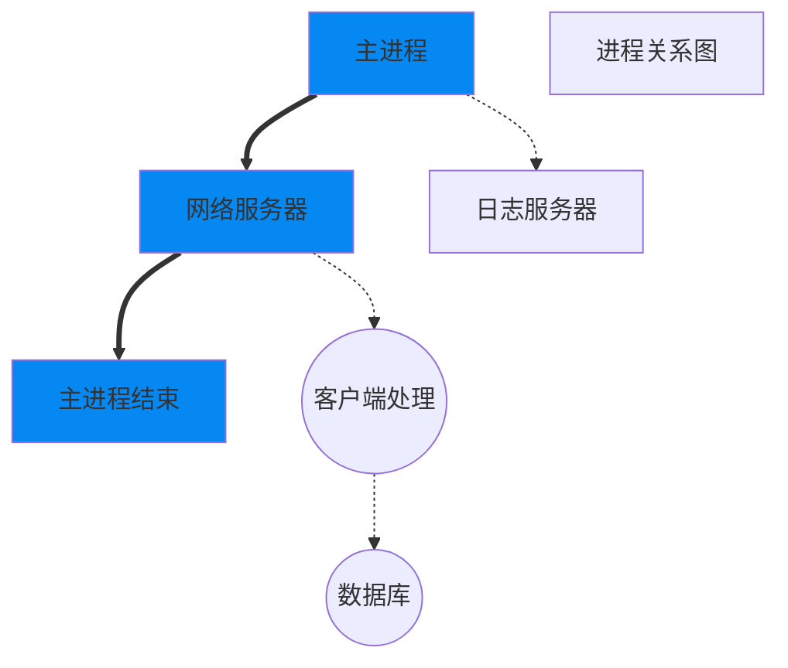
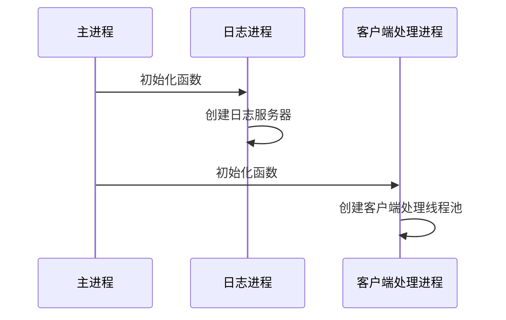

# 1 项目创建

1. vs2019，工具->选项->跨平台
2. [ubuntu服务器C++运行环境搭建](https://blog.csdn.net/qq_33867131/article/details/126540537)
3. 

# 2 进程

## 2.1 项目进程规划

如果要充分利用系统资源，最好的形式是多线程和多进程模式

最好将一个整体功能，分散到多个进程之中，从而实现资源利用率的最大化。否则就只能多个线程在一个进程内进行竞争，没法充分利用系统的资源。毕竟多个进程竞争资源，比一个进程竞争资源，要有利得多。



方框部分都是主进程模块，圆框则是子进程。

- 主进程：只负责网络服务器部分，接入客户端，其他一概不管。
- 客户端处理进程：接入客户端之后，发送给客户端处理进程。
- 数据库进程：如果处理过程需要数据库，则和数据库进程进行交互。
  - 数据库我们最后会使用MySQL，而MySQL进程是由第三方提供并随服务器启动而启动的服务程序。
- 日志进程：日志则由日志服务器进程来处理。

这样，将一个进程完成的事情，分成了四个进程进行。而且每个进程中可以依据自己的需求，开启多个线程来完成。

## 2.2 进程创建

在Linux中，开启进程一般通过exec系列函数或者fork函数来完成。即使是exec函数，也会要使用到fork函数。

- 当用fork函数创建新的子进程后，子进程往往要调用一种exec函数以执行另一个程序。
- 当程序调用一种exec函数时，该进程执行的程序完全替换为新程序，而新程序则从其main函数开始执行。
- 因为调用exec并不创建新进程，所以前后的进程ID并未改变。exec只是用磁盘上的一个新程序替换了当前进程的正文段、数据段、堆段和栈段。

### 2.2.1 fork和exec

#### fork

- 作用：创建一个子进程。
- 通过复制  调用进程(主进程)  的方式创建一个新进程，新进程称为子进程，调用进程称为父进程。子进程几乎复制了父进程全部的内容，除：子进程不继承父进程的内存锁，进程资源占用及CPU时间计数重置为0
- 最大的特点就是：一次调用，两次返回，**父子进程共享代码段**。这就是为什么后面if else都会进入的原因
  - fork()成功时，在父进程中返回子进程的ID，在子进程中返回0
  - 失败时，返回-1

```c
#include <unistd.h>
pid_t fork(void);
```

fork不会复制父进程的线程。

#### [exec](https://blog.csdn.net/qq_52551323/article/details/119635363)

exec函数族的作用是根据指定的文件名找到可执行文件，并用它来取代调用进程的内容，换句话说，就是在调用进程内部执行一个可执行文件。这里的可执行文件既可以是二进制文件，也可以是任何Linux下可执行的脚本文件。

```c
       #include <unistd.h>

       extern char **environ;

1.     int execl(const char *path, const char *arg, ...);
2.     int execlp(const char *file, const char *arg, ...);
3.     int execle(const char *path, const char *arg,..., char * const envp[]);
4.     int execv(const char *path, char *const argv[]);
5.     int execvp(const char *file, char *const argv[]);
6.     int execvpe(const char *file, char *const argv[],char *const envp[]);

```


### 2.2.2 进程创建流程

日志子进程应该优先创建，然后再创建客户端处理子进程。



## 2.3 进程模块的实现方案

1. 首先，每个子进程的逻辑并不一样，所需要的参数可能相互冲突。
2. 其次，客户端处理进程，需要处理客户端请求。
   - 我们这是一个网络程序，主进程接收到客户端之后，如何通知子进程去处理呢？
   - 客户端这个时候是一个文件描述符，怎么告诉子进程去处理呢？

所以我们需要两个功能：

- 灵活的进程入口函数
  - 使用无属性的指针参数和固定参数的进程入口函数来实现
  2. 使用面向对象的参数和统一的进程入口函数来实现
  3. 使用模板函数来实现
- 进程间传递文件描述符


# 头文件

1. [cstdio](http://yncoders.com/show/41)

   - `cstdio` 是 C++ 标准库中的一个头文件，提供了一些与标准 I/O 操作相关的函数和类型。

   - 它是 C 语言头文件 `stdio.h` 的 C++ 版本，因此包含了 C 语言标准库的所有函数。

   - ```c++
     int scanf(const char* format, ...);
     int printf(const char* format, ...);
     
     FILE* fopen(const char* filename, const char* mode);
     int fclose(FILE* stream);
     
     size_t fread(void* ptr, size_t size, size_t count, FILE* stream);
     size_t fwrite(const void* ptr, size_t size, size_t count, FILE* stream);
     
     int fprintf(FILE* stream, const char* format, ...);
     int fscanf(FILE* stream, const char* format, ...);
     
     int fseek(FILE* stream, long int offset, int origin);
     long int ftell(FILE* stream);
     
     void perror(const char* str);
     ```

   - 

2. unistd.h 

   - uni-std

   - 是一个用于定义类**Uni**x标准函数原型的标准库。

   - 它包含一些系统调用的和系统数据类型的定义，用于linux程序的开发和编译。

   - ```c++
     fork()
     ```

3. 

# 开发日志

1. 虚拟机

   - 如果宿主机是通过wifi连接互联网的，那么客户机就不需要采用桥接模式

2. 固定客户机的ip，否则ip可能会变，如果连不上客户机我们就需要往这边想了。

3. vs 工具->选项->跨平台->连接管理器

   - 可以连接linux环境，作为编译环境。
   - 如果通过ssh，使用root用户登录不上，并且使用xshell登录root也不行，[解决SSH服务拒绝了密码，请再试一次，但密码是正确的](https://zhuanlan.zhihu.com/p/478405010)

4. 在修改系统的配置文件时，希望先备份此文件为xx.bak，然后再修改

   ```bash
   cp sshd_config sshd_config.bak
   ```

   

5. [在使用 CLion 运行程序时，报错：Could not load cache](https://www.cnblogs.com/xxxxxxxxx/p/13984856.html)

   - 右键工程顶级目录，点击 “Reload Cmake Project”

   

6. `error: need ‘typename’ before ‘std::_Bindres_helper<int, _FUNCTION_, _ARGS_ ...>::type’ because ‘std::_Bindres_helper<int, _FUNCTION_, _ARGS_ ...>’ is a dependent scope std::_Bindres_helper<int, _FUNCTION_,_ARGS_...>::type m_binder;`

   - 此时会发生编译错误，编译器在编译时无法知道`std::_Bindres_helper<int, _FUNCTION_, _ARGS_ ...>::type`是一个变量还是一个类型，只能在运行时才能确定，所以需要通过typename 指定它为一个类型。

7. 在调试多进程的时候，在通过Clion Eplayer 运行（而不是debug）的时候，你会看到，Fork经常“不成功”（或者说不进入子进程，或者说每次运行结果都不一致），然而只有在debug模式，或者直接运行cmake-build-debug->Eplayer可执行文件的时候，才发现是执行成功了的，该打印都打印了，我猜想是终端的问题，因为是多进程的原因，所以打印不全，所以以后调试多进程尽量在debug模式，或者直接执行可执行文件，这样才能看到效果。


