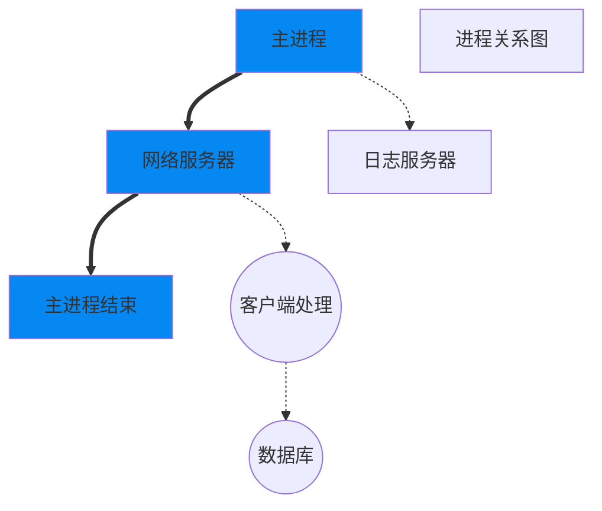
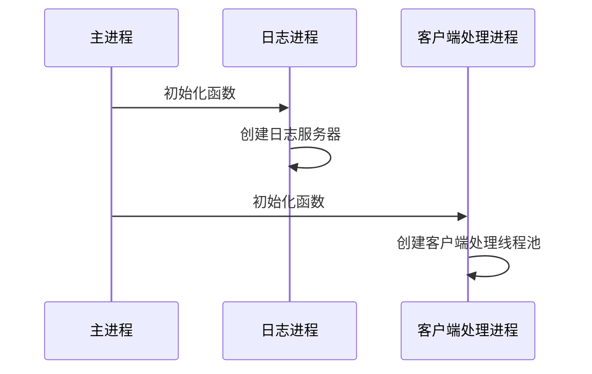
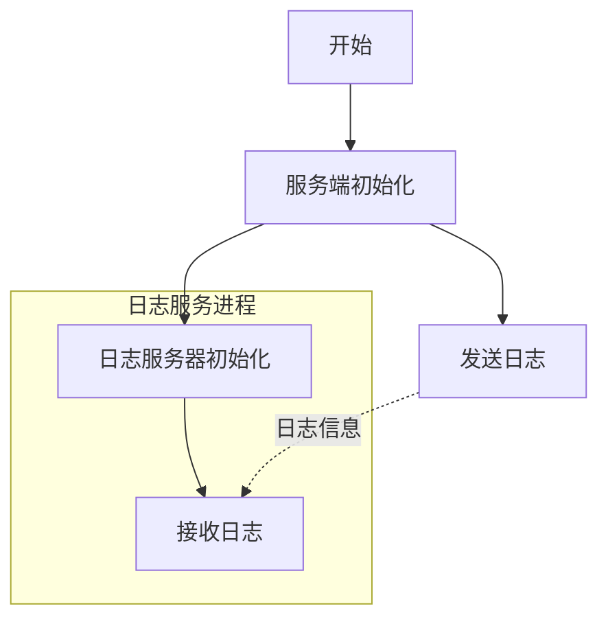

# 1 项目创建

[tinyWebserver](https://github.com/qinguoyi/TinyWebServer/tree/master)

1. vs2019，工具->选项->跨平台
2. [ubuntu服务器C++运行环境搭建](https://blog.csdn.net/qq_33867131/article/details/126540537)
3. 

# 2 进程

## 2.1 项目进程规划

如果要充分利用系统资源，最好的形式是多线程和多进程模式

最好将一个整体功能，分散到多个进程之中，从而实现资源利用率的最大化。否则就只能多个线程在一个进程内进行竞争，没法充分利用系统的资源。毕竟多个进程竞争资源，比一个进程竞争资源，要有利得多。



方框部分都是主进程模块，圆框则是子进程。

- 主进程：只负责网络服务器部分，接入客户端，其他一概不管。
- 客户端处理进程：接入客户端之后，发送给客户端处理进程。
- 数据库进程：如果处理过程需要数据库，则和数据库进程进行交互。
  - 数据库我们最后会使用MySQL，而MySQL进程是由第三方提供并随服务器启动而启动的服务程序。
- 日志进程：日志则由日志服务器进程来处理。

这样，将一个进程完成的事情，分成了四个进程进行。而且每个进程中可以依据自己的需求，开启多个线程来完成。

## 2.2 进程创建

在Linux中，开启进程一般通过exec系列函数或者fork函数来完成。即使是exec函数，也会要使用到fork函数。

- 当用fork函数创建新的子进程后，子进程往往要调用一种exec函数以执行另一个程序。
- 当程序调用一种exec函数时，该进程执行的程序完全替换为新程序，而新程序则从其main函数开始执行。
- 因为调用exec并不创建新进程，所以前后的进程ID并未改变。exec只是用磁盘上的一个新程序替换了当前进程的正文段、数据段、堆段和栈段。

### 2.2.1 fork和exec

#### fork

- 作用：创建一个子进程。
- 通过复制  调用进程(主进程)  的方式创建一个新进程，新进程称为子进程，调用进程称为父进程。子进程几乎复制了父进程全部的内容，除：子进程不继承父进程的内存锁，进程资源占用及CPU时间计数重置为0
- 最大的特点就是：一次调用，两次返回，**父子进程共享代码段**。这就是为什么后面if else都会进入的原因
  - fork()成功时，在父进程中返回子进程的ID，在子进程中返回0
  - 失败时，返回-1

```c
#include <unistd.h>
pid_t fork(void);
```

fork不会复制父进程的线程。

#### [exec](https://blog.csdn.net/qq_52551323/article/details/119635363)

exec函数族的作用是根据指定的文件名找到可执行文件，并用它来取代调用进程的内容，换句话说，就是在调用进程内部执行一个可执行文件。这里的可执行文件既可以是二进制文件，也可以是任何Linux下可执行的脚本文件。

```c
       #include <unistd.h>

       extern char **environ;

1.     int execl(const char *path, const char *arg, ...);
2.     int execlp(const char *file, const char *arg, ...);
3.     int execle(const char *path, const char *arg,..., char * const envp[]);
4.     int execv(const char *path, char *const argv[]);
5.     int execvp(const char *file, char *const argv[]);
6.     int execvpe(const char *file, char *const argv[],char *const envp[]);

```


### 2.2.2 进程创建流程

日志子进程应该优先创建，然后再创建客户端处理子进程。



### 2.2.3 进程模块的实现方案

1. 首先，每个子进程的逻辑并不一样，所需要的参数可能相互冲突。
2. 其次，客户端处理进程，需要处理客户端请求。
   - 我们这是一个网络程序，主进程接收到客户端之后，如何通知子进程去处理呢？
   - 客户端这个时候是一个文件描述符，怎么告诉子进程去处理呢？

所以我们需要两个功能：

- 灵活的进程入口函数
  - 使用无属性的指针参数和固定参数的进程入口函数来实现
  2. 使用面向对象的参数和统一的进程入口函数来实现
  3. 使用模板函数来实现
- 进程间传递文件描述符

```c++
//
// Created by buntu on 2023/7/24.
//
#include <iostream>
#include<unistd.h>
#include<functional>
#include<memory.h>
#include<sys/socket.h>  //socket_pair
#include<sys/types.h>   //类型的定义
#include<sys/stat.h>    //system的状态值
#include<fcntl.h>       //文件操作
#include<signal.h>
#include "../../include/MultiProcess.h"
class CFunctionBase{
public:
    virtual ~CFunctionBase(){}
    virtual int operator()()=0;     //所有子类必须实现()符号重载
};

template<typename _FUNCTION_,typename... _ARGS_>
class CFunction:public CFunctionBase{
public:
    // 这里必须对m_binder进行初始化，否则会报错
    //  error: no matching function for call to ‘std::_Bind_result<int, int (*(CProcess*))(CProcess*)>::_Bind_result()’
    CFunction(_FUNCTION_ func,_ARGS_... args)
            :m_binder(std::forward<_FUNCTION_>(func),std::forward<_ARGS_>(args)...)         //std::forward实现完美转发
    {

    }
    virtual ~CFunction(){}
    virtual int operator()(){
        return m_binder();
    }
    // 这里必须加typename，告知编译器这里是一个类型。否则会报错
    //error: need ‘typename’ before ‘std::_Bindres_helper<int, _FUNCTION_, _ARGS_ ...>::type’ because ‘std::_Bindres_helper<int, _FUNCTION_, _ARGS_ ...>’ is a dependent scope
    // std::_Bindres_helper<int, _FUNCTION_,_ARGS_...>::type m_binder;
    typename std::_Bindres_helper<int, _FUNCTION_,_ARGS_...>::type m_binder;
};


class CProcess{
public:
    CProcess(){
        m_func = NULL;
        memset(pipes,0,sizeof(pipes));
    }
    virtual ~CProcess(){
        //因为有new，所以需要析构函数来释放
        if(m_func !=NULL){
            delete m_func;
            m_func = NULL;
        }

    }
    template<typename _FUNCTION_,typename... _ARGS_>        // 可变参数模板
    int SetEntryFunction(_FUNCTION_ func,_ARGS_... args){
        m_func = new CFunction<_FUNCTION_,_ARGS_...>(func,args...);       //“...” 定义的时候在类型后加，使用的时候，在实参后加
        return 0;
    }
    int CreateSubProcess(){
        if(m_func == NULL) return -1;
        int ret =socketpair(AF_LOCAL,SOCK_STREAM,0,pipes);

        if(ret == -1) return -2;
        printf("pipes 生成成功\n");
        pid_t pid = fork();         // 子进程复制了父进程的所有内容，包括这里的pipes，所以父进程有一个pipes[2],子进程也有一个pipes[2],这两个pipes通过socketpair函数连接在一起。
        if (pid==-1) return -3;
        printf("fork 成功，pid：%d\n",pid);
        // 子进程
        if(pid == 0){
            printf("sub process (%d):<%s> pid=%d\n", __LINE__, __FUNCTION__, getpid());
            close(pipes[1]);        //关闭写端
            pipes[1] = 0;
            (*m_func)();
            exit(0);
        }

        // 父进程
        printf("父进程\n");
        close(pipes[0]);            //关闭读端
        pipes[0] = 0;

        m_pid = pid;
        return 0;
    }

    // 主进程发送文件描述符
    int SendFD(int fd){

        // 这里的消息主体是不重要的
        struct msghdr msg {};
        iovec iov[2];
        char buf[][10] ={"qq","kk"};
        iov[0].iov_base = buf[0];         // 最后我们传递的是文件描述符，所以这里的消息缓冲不重要，作为一种冗余放在这里。
        iov[0].iov_len = sizeof(buf[0]);
        iov[1].iov_base = buf[1];
        iov[1].iov_len = sizeof(buf[1]);
        msg.msg_iov= iov;
        msg.msg_iovlen = 2;


        // 下面的数据才是我们需要传递的数据，之前的都是幌子
        cmsghdr * cmsg =  new (std::nothrow) cmsghdr;       //std::nothrow参数来告诉new操作符不要抛出异常，而是返回一个空指针。然后，我们检查指针p是否为空，以确定内存是否分配成功。
        if(cmsg == nullptr) return -1;
        bzero(cmsg,sizeof(cmsghdr));        //前两句可以简写为c的方式：cmsghdr * cmsg = (cmsghdr *) calloc(1, CMSG_LEN(sizeof(int)));如果采用这种，那么下面的delete需要修改为free
        cmsg->cmsg_len = CMSG_LEN(sizeof(int));     // #define CMSG_LEN(len)   (CMSG_ALIGN (sizeof (struct cmsghdr)) + (len))
        cmsg->cmsg_level = SOL_SOCKET;
        cmsg->cmsg_type = SCM_RIGHTS;
        *(int*) CMSG_DATA(cmsg) = fd;


        msg.msg_control = cmsg;     // control msg
        msg.msg_controllen = cmsg->cmsg_len;

        ssize_t ret = sendmsg(pipes[1],&msg,0);
        delete cmsg;
        if(ret ==-1)return -2;

        return 0;
    }

    int RecvFD(int & fd){
        printf("子进程%s\n",__FUNCTION__);
        struct msghdr msg{};
        iovec iov[2];
        char buf[][10] = {"",""};
        iov[0].iov_base = buf[0];
        iov[0].iov_len = sizeof(buf[0]);
        iov[1].iov_base = buf[1];
        iov[1].iov_len = sizeof(buf[1]);
        msg.msg_iov = iov;
        msg.msg_iovlen = 2;

        cmsghdr * cmsg = (cmsghdr *) calloc(1, CMSG_LEN(sizeof(int)));
        if (cmsg ==NULL) return -1;
        cmsg->cmsg_len = CMSG_LEN(sizeof(int));
        cmsg->cmsg_level = SOL_SOCKET;
        cmsg->cmsg_type = SCM_RIGHTS;

        msg.msg_control = cmsg;
        msg.msg_controllen = cmsg->cmsg_len;

        ssize_t ret = recvmsg(pipes[0],&msg,0);
        if (ret ==-1) {
            free(cmsg);
            return -2;
        }
        fd = *(int *) CMSG_DATA(cmsg);
        return 0;
    }

private:
    // 这里为什么不直接用CFunction，而要用父类，就是为了避免模板的传染性，这里通过基类隔离一下，当前类（CProcess）就不会被传染
    // 如果这里用了CFunction<T1,T2>, 由于CFunction是一个模板类，那么在声明其类型的时候肯定使用类型模板T1，这就会导致CProcess变成一个模板类。
    CFunctionBase* m_func;
    pid_t m_pid;
    int pipes[2];       //0读，1写。子进程关闭写端，父进程关闭读端。
};
int CreateLogServer(CProcess * proc){
    printf("pid=%d <%s> \n", getpid(), __FUNCTION__);
    return 0;
}
int CreateClientServer(CProcess * proc){
    printf("子进程执行函数：CreateClientServer\n");
//    printf("%s(%d):<%s> pid=%d\n", __FILE__, __LINE__, __FUNCTION__, getpid());
    int fd = -1;

    sleep(1);
    int ret = proc->RecvFD(fd);
    printf("(%d):<%s>%d,%d\n",__LINE__, __FUNCTION__,ret, fd);
    printf("子进程fd：%d\n",fd);
    char buf[10] = "";
    lseek(fd, 0, SEEK_SET);
    read(fd, buf, sizeof(buf));
    printf("读到的内容：%s",buf);
    close(fd);
    return 0;
}
int testMultiProcess(){
    //proclog.SetEntryFunction(CreateLogServer,&proclog);
    procclient.SetEntryFunction(CreateClientServer,&procclient);    // 可以自动推导类型
    procclient.CreateSubProcess();

    int fd = open("./test.txt",O_RDWR | O_CREAT | O_APPEND);
    if (fd ==-1) return -3;
    write(fd,"qqqkkkhhh",9);
    int ret =procclient.SendFD(fd);
    if (ret != 0) printf("errno:%d msg:%s\n", errno, strerror(errno));
    close(fd);
    printf("父进程\n");
    return 0;
}
```


## 2.3 守护进程

守护进程输出的将被屏蔽掉（终端看不到程序的打印），所以这里先学，而后再加入的项目中。

一般的进程在关闭终端后，程序就会退出。而守护进程，当你把终端（会话，每一次ssh连接，就称为一个会话）关闭了，依然在运行。

[守护进程不一定要fork两次，他是可选的](https://blog.csdn.net/bitlxlx/article/details/71544036)

[fork两次的原因](https://segmentfault.com/a/1190000008556669)：`setsid`的进程不能是`session leader`,

```c++
    static int SwitchDaemon(){
        //主进程
        pid_t ret = fork();
        if(ret<0) return -1;
        if(ret>0) exit(0);      //主进程退出

        // 父进程继续
        // 2.创建新会话
        ret =setsid();
        if(ret < 0) return -2;          // setsid error
        ret = fork();
        if(ret < 0) return -3;
        if(ret > 0) exit(0);    //父进程退出

        //孙进程如下，
        //3.设置工作目录
        chdir("/tmp");
        //4.重设文件掩码
        umask(0);
        //5.关闭从父进程继承下来的文件描述符
        for(int i=0;i<getdtablesize();i++) close(i);
        // signal(SIGCHLD, SIG_IGN);                // 这句代码存疑，一般signal(SIGCHLD, SIG_IGN)放在父进程中，以处理僵尸进程的情况。可这里放在了孙子进程中，有点奇怪
        // 守护进程的执行内容
        // ....
        //
        return 0;
    }
int testMultiProcess(){
    // 开启守护进程模式
    //CProcess::SwitchDaemon();
    CProcess procclient;
    //proclog.SetEntryFunction(CreateLogServer,&proclog);
    procclient.SetEntryFunction(CreateClientServer,&procclient);    // 可以自动推导类型
    procclient.CreateSubProcess();
	// .....
}
```

## 2.4 日志模块的设计

进程间通信，最方便最快速就是**本地套接字**通信

其它通信方式的缺点：

- 文件通信，磁盘读写速度慢（比内存间通信慢太多）
- 管道通信，首先，单向（在这里好像没问题），内容穿（串）插（在多线程的情况下，线程A发送aaaa，线程B发送bbbb，管道接收端收到的可能是aabbbaab）
- 信号量，能传递的信息量太少。
- 内存共享，并未提供同步机制，需要自行反复加锁同步（内容串扰，内容覆盖）
- 消息函数（sendmsg，recvmsg）需要创建是就创建
- 网络套接字通信，需要额外的ip和端口（哪怕进程间ip都是127.0.0.1，但是也要消耗端口），发生资源挤占

本地套接字优点：

- 无需ip和端口，不影响服务器对外的资源
- 信息无需加锁，可以多线程并发
- 数据传输量巨大，传输速率高（纯内存读写）





# 头文件

1. [cstdio](http://yncoders.com/show/41)

   - `cstdio` 是 C++ 标准库中的一个头文件，提供了一些与标准 I/O 操作相关的函数和类型。

   - 它是 C 语言头文件 `stdio.h` 的 C++ 版本，因此包含了 C 语言标准库的所有函数。

   - ```c++
     int scanf(const char* format, ...);
     int printf(const char* format, ...);
     
     FILE* fopen(const char* filename, const char* mode);
     int fclose(FILE* stream);
     
     size_t fread(void* ptr, size_t size, size_t count, FILE* stream);
     size_t fwrite(const void* ptr, size_t size, size_t count, FILE* stream);
     
     int fprintf(FILE* stream, const char* format, ...);
     int fscanf(FILE* stream, const char* format, ...);
     
     int fseek(FILE* stream, long int offset, int origin);
     long int ftell(FILE* stream);
     
     void perror(const char* str);
     ```

   - 

2. unistd.h 

   - uni-std

   - 是一个用于定义类**Uni**x标准函数原型的标准库。

   - 它包含一些系统调用的和系统数据类型的定义，用于linux程序的开发和编译。

   - ```c++
     fork()
     ```

3. 

# 开发日志

1. 虚拟机

   - 如果宿主机是通过wifi连接互联网的，那么客户机就不需要采用桥接模式

2. 固定客户机的ip，否则ip可能会变，如果连不上客户机我们就需要往这边想了。

3. vs 工具->选项->跨平台->连接管理器

   - 可以连接linux环境，作为编译环境。
   - 如果通过ssh，使用root用户登录不上，并且使用xshell登录root也不行，[解决SSH服务拒绝了密码，请再试一次，但密码是正确的](https://zhuanlan.zhihu.com/p/478405010)

4. 在修改系统的配置文件时，希望先备份此文件为xx.bak，然后再修改

   ```bash
   cp sshd_config sshd_config.bak
   ```

   

5. [在使用 CLion 运行程序时，报错：Could not load cache](https://www.cnblogs.com/xxxxxxxxx/p/13984856.html)

   - 右键工程顶级目录，点击 “Reload Cmake Project”

   

6. `error: need ‘typename’ before ‘std::_Bindres_helper<int, _FUNCTION_, _ARGS_ ...>::type’ because ‘std::_Bindres_helper<int, _FUNCTION_, _ARGS_ ...>’ is a dependent scope std::_Bindres_helper<int, _FUNCTION_,_ARGS_...>::type m_binder;`

   - 此时会发生编译错误，编译器在编译时无法知道`std::_Bindres_helper<int, _FUNCTION_, _ARGS_ ...>::type`是一个变量还是一个类型，只能在运行时才能确定，所以需要通过typename 指定它为一个类型。

7. 在调试多进程的时候，在通过Clion Eplayer 运行（而不是debug）的时候，你会看到，Fork经常“不成功”（或者说不进入子进程，或者说每次运行结果都不一致），然而只有在debug模式，或者直接运行cmake-build-debug->Eplayer可执行文件的时候，才发现是执行成功了的，该打印都打印了，我猜想是终端的问题，因为是多进程的原因，所以打印不全，所以以后调试多进程尽量在debug模式，或者直接执行可执行文件，这样才能看到效果。


