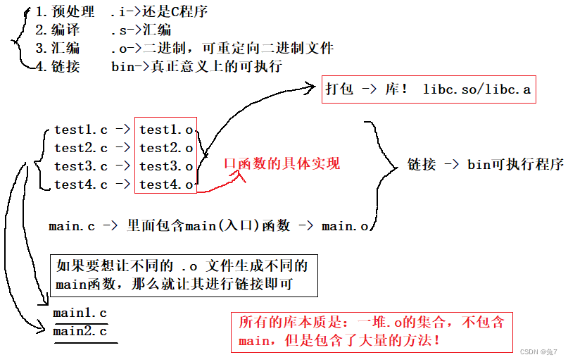
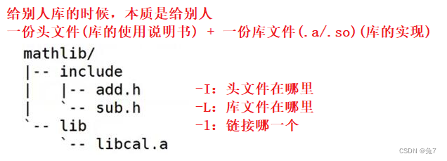

# C

1. C语言因UNIX系统而生。
2. GNU（GNU's Not UNIX）项目始于1987年，是一个开发大量自由UNIX软件的集合。
3. GCC——GNU编译器集合（GNU Compiler Collection，GCC），
   - 其中包含GCC C编译器。
   - GCC有各种版本以适应不用硬件平台和操作系统，包括UNIX，LINUX，Windows
   - gcc命令便可调用GCC C编译器，许多系统都用cc作为gcc的别名
4. c语言优点
   - 高效性，快速
   - 可移植性，找到合适的编译器，就能在源代码的基础上，稍作修改或不修改就能在其他系统运行

C语言是一门面向过程的语言，面向过程编程思想的核心：功能分解，自顶向下，逐层细化。**程序 = 数据结构 + 算法**

# 0 绪论

## 0.1 C语言标准

1. 第一个C标准——ANSI/ISO 标准——C90，ANSI/ISO标准的最终版本通常叫做C89（ANSI于1989年批准该标准）或C90（ISO于1990年批准该标准）
2. C99——1999年
3. C11——2011年

## 0.2 编程机制

1. 源代码：在文本编辑器中，敲入的复合语法规范的代码
2. 预处理器：
   - 在c程序顶部的信息集合被称为头文件，头文件包含了编译器创建最终可执行程序要用到的信息。
   - `#include`这行代码就是一条预处理器指令
3. 编译器：
   - 编译器把源代码转换为中间代码（目标代码），链接器把中间代码和其他代码合并生成可执行代码。
   - 编译器可检测出不符合C语言规范的语法错误，无法检测出语义错误（也就是代码逻辑），报错的位置比真正错误滞后一行。
4. 链接器
   - 把目标代码、系统标准启动代码和库代码这三个部分合并成一个可执行文件
   - 目标代码只包含编译器为你编写的代码翻译的机器语言代码。
   - 可执行文件中还包含你编写的程序中使用库函数和启动代码的机器代码


### 0.2.1 可执行文件里的内容


1. 正文段 

   - 又叫代码段，程序源代码编译后的 机器指令 就被放在代码段。代码段是可 共享的 ，所以即便是频繁执行的程序，在存储器中也只有一个副本。 当系统中运行着多个该程序的副本时，它们的指令都是一样的，所以 内存中只需要保存一份该程序的指令部分，因此， 代码段通常是 只读 的，以防止程序由于意外而修改其指令。

2. 初始化数据段 

   - 即.data段，包含了程序中已明确赋值的全局变量和静态变量以及它们的值。
   - 还包含.rodata段，存放只读数据，如const修饰的变量和字符串常量。

3. 未初始化数据段, 

   - 通常将此称段为bss段（block started by symbol）,与已初始化数据段相对应，它保存的是未初始化的全局变量和静态变量。有些全局未初始化的变量不会放到目标文件的bss段，会等最终链接时在放到bss段，这于强符号和弱符号有关。当全局变量和局部静态变量被初始化为0时，会被放到bss段中，因为未初始化都是0。

   - 注意：**未初始化段中存的是未初始化的全局变量和静态变量在实际内存中所需要的空间大小，它只是为它们预留了位置，并没有实质的内容，所以也不占空间。**也就是说， 未初始化段的内容并不存放在磁盘程序文件中，因为内核在程序开始执行前将它们全部初始化为0或NULL，这样也许可以把它们放入初始化数据段，但因为它们都是0，所以为它们在初始化数据段分配空间并存放0是非常没有必要的。当这个内存区进入程序的地址空间后，包括初始化数据段的和bss段的整个区段此时统称为数据区。
     

4. 堆 

   - 位于未初始化数据段与栈之间，这部分内存是由低地址向高地址分配。我们通常在堆中进行 动态存储分配 ，即malloc申请的内存，这段空间会一直存在，直至我们使用free释放，如果没有主动释放，在进程运行结束时也会被系统释放掉。而内存泄露就是指我们我们没有释放堆空间，从而导致堆不断增长，使内存空间不断减少。

5. 栈

   - 是从高地址向低地址分配的，栈中存放的是局部变量，以及每次函数调用时，返回的地址以及调用者的环境信息。栈也经常被叫做栈帧，因为栈以帧为单位，当程序调用函数的时侯，栈会向下增长一帧，帧中存储被调用函数的参数和局部变量，以及该函数的返回地址。此时，位于栈最下方的帧和全局变量一起，构成了当前的环境。一般来说，你只允许使用位于栈最下方的帧，当该函数又调用另一个函数的时候，栈又会向下增长一帧，此时控制权会转移到新的函数中，当函数返回时，会从栈中弹出，并根据帧中记录的地址信息，返回到调用它的函数中，然后删除帧。直到最后main()函数返回，其返回地址为空，进程结束。所以，递归太多层的话可能会让栈溢出。

6. 环境变量 类似Linux下的PATH、HOME等环境变量。

这就是可执行文件中存放的内容，在被执行后，称为一个进程，它对应一段虚拟内存。

### 0.2.2 [虚拟内存和物理内存](https://blog.csdn.net/qq_34888036/article/details/117969279)

#### 虚拟内存

每个程序被运行起来后，它将拥有自己独立的线性空间，这个线性空间由cpu的位数决定，比如32位硬件平台决定了线性地址空间的寻 址空间为02^32-1，即0x000000000xFFFFFFFF，也就是4GB大小。如果每个进程都有4GB，那我们的内存根本就不够用。其实，这4GB并不是真正的内存空间，它是虚拟内存空间，顾名思义，之所以称为虚拟内存，是和系统中的物理内存相对而言的，它是操作系统内核为了对进程地址空间进行管理而设计的一个逻辑意义上的内存空间概念。我们程序中的指针其实都是这个虚拟内存空间中的地址。虚拟内存是将系统硬盘空间和系统实际内存联合在一起供进程使用，给进程提供了一个比内存大的多的虚拟空间。在程序运行时，只需要把虚拟内存空间的一小部分通过页映射模式，经过MMU部件转换映射到物理内存即可。
     那么这4GB的空间是不是就由该进程随意使用呢？遗憾的是，不可以。因为操作系统需要监控进程，进程只能使用那些操作系统分配给它们的地址，如果访问未经允许的空间，那么操作系统会捕获到这些访问，将进程的这种访问当作非法操作，强制结束进程。Linux操作系统将进程的4G虚拟空间分配为1：3的结构，1G是操作系统本身，剩下的3G是留给进程使用的。所以在一个进程的眼里，只有操作系统和它自己，就像整个计算机都被它“承包”了。

要注意的是，这个地址空间是虚拟的，并非实际存在的。
大家每次创建一个进程的时候，操作系统都会给进程分配这样的一个虚拟内存。


上图为32位进程的内存布局，从上图中主要包含以下几个块：

- 内核空间：供内核使用，存放的是内核代码和数据
- stack：这就是我们经常所说的栈，用来存储自动变量(automatic variable)
- mmap:也成为内存映射（memory map），用来在进程虚拟内存地址空间中分配地址空间，创建和物理内存的映射关系
- heap:就是我们常说的堆，动态内存的分配都是在堆上
- bss（block started by symbol）:包含所有未初始化的全局和静态变量，此段中的所有变量都由0或者空指针初始化，程序加载器在加载程序时为BSS段分配内存
- ds:初始化的数据块
  - 包含显式初始化的全局变量和静态变量
  - 此段的大小由程序源代码中值的大小决定，在运行时不会更改
  - 它具有读写权限，因此可以在运行时更改此段的变量值
  - 该段可进一步分为初始化只读区和初始化读写区

- text：也称为文本段
  - 该段包含已编译程序的二进制文件。
  - 该段是一个只读段，用于防止程序被意外修改
  - 该段是可共享的，因此对于文本编辑器等频繁执行的程序，内存中只需要一个副本

#### 虚拟内存和物理内存的映射关系

既然虚拟内存是一个虚拟的概念。也就表名了虚拟地址不能真正的存放数据。
数据在真正读写的时候，是对真实的地址空间进行读写的。
处理器运算器和应用程序设计人员看到的只是虚拟内存空间和虚拟地址，而处理器片外的地址总线看到的只是物理地址空间和物理地址。
将虚拟地址转换成物理地址的任务叫 【地址翻译】。
虚拟内存的地址如何转成真实地址。中间需要一个转换（映射）的机制。
这个东西我们叫做 MMU (存储器管理单元)。
MMU 把虚拟地址转化为实际物理地址的依据。
记录表与存储管理单元MMU的作用如下图所示：


这里的物理内存包含：随机存储器（RAM)和硬盘（HDD）

Linux把虚存空间分成若干个大小相等的存储分区，Linux把这样的分区叫做**页**（page）。

物理内存中的块空间是用来容纳虚存页实际内容的容器，所以物理内存中的块叫做**页框**（page frame）。

物理内存和虚拟内存被分成了页框与页之后，其存储单元原来的地址都被自然地分成了两段，并且这两段各自代表着不同的意义：

高位段分别叫做页框码和页码，它们是识别页框和页的编码；（内容大小，区段，偏移，d）
低位段分别叫做页框偏移量和页内偏移量，它们是存储单元在页框和页内的地址编码。（内容位置，区段起始位置，）

> 高低位段可能有错误，暂无法求证。


## 0.3 HelloWorld

```c
#include<stdio.h>	/*头文件，预处理器指令，包含了编译器创建最终可执行程序要用到的信息*/
// c程序一定从main()函数开始执行
int main(void) {	// 花括号用于标记函数体和块
    
    int num1, num2 = 3; 
    
    // 声明变量，为变量创建和标识存储空间
    // int c语言关键字，关键字语言定义的单词，不能作他用。
    // num1是一个标识符，
    // 命名规则：
    // 首字符：下划线和字母
    // 非首字符：字母、数字、下划线
    
    num1 =1; // 赋值语句
    
    printf("The C Language is simple %d", num1); 
    // print + format，
    // %d 占位符，指明num1将以什么样的形式和位置出现
    
    // 调用函数看，称为回调函数
    butler();
    return 0; // 返回值
}
// 定义函数
void butler() {
    printf("you rang, sir?\n")
}
```

程序状态是在程序执行过程中，某给定点上所有变量的集合，它是计算机当前状态的一个快照。

## 0.4 关键字和保留字


# 1 顺序结构

## 1.1 常量和变量

1. 常量：
   - 整型常量，eg：1，123，-345
   - 实型常量，包含两种形式，小数形式，指数形式，**按双精度处理**
   - 字符常量：
     - 普通字符（单引号括起来的单个字符）
     - 转义字符（以反斜杠开头的具有特殊意义的字符）
     - 字符串常量（双引号括起来的若干字符）
     - 符号常量
       - 用`#define`指令指定用一个符号名称代表一个常量，eg：`#define PI 3.1415`
2. 变量
   - 变量必须先声明后使用，并且尽量初始化。
   - 变量名实际上是一个名字代表的存储地址
3. 常变量（C99）
   * `const float pi=3.1415`
   * 有类型，占用存储单元，值不可变
4. 标识符：只能由字母、数字、下划线组成，并且以字母或下划线为首。区分大小写

在预编译后，符号常量就不存在了，对符号常量的名字不分配存储单元，而常变量要占用存储单元，有变量值，只是该值不改变而已。

## 1.2 数据类型

c++规定在创建一个变量或常量时，必须要指定出相应的数据类型，否则无法给变量分配内存

1. 基本类型
   - 整型类型
     - 整型（int，2个or4个字节），无符号整型（unsigned int）
     - 短整型（short int，2个字节），无符号短整型（unsigned short int）
     - 长整型（long int，4个字节），双长整型（long long int，8个字节），无符号...
     - 字符型（char，1个字节），有符号（)，无符号（0~2^8）
     - 布尔型（bool）
   - 浮点类型（以小数或指数形式出现）
     - 单精度浮点型（float，4个字节）
     - 双精度浮点型（double，8个字节），长双精度（long double，8or 16个字节）
     - 复数浮点型（float_complex，double_complex， long long_comple)
2. 枚举类型（enum）
3. 空类型（void）
4. 构造类型
   - 数组（[ ]）
   - 结构体（struct）
   - 共用体（union）
5. 指针类型
6. 函数类型


构造类型、指针类型、函数类型也可以称作是派生类型

字符类型是按其代码（整数，ASCII码）形式存储的，因此C99把字符型数据作为整数类型的一种

```c
float a = 3.1415;
// 在进行编译时，对float变量分配4个字节，而实型常量3.1415会按照双精度处理
// warning:trunction from 'const double' to 'float'
// 可以在常量的末尾加专用字符，强制指定常量的类型
float a= 3.1415f;
long double b = 1.23L;
```

## 1.3 运算符

1. 算术运算符，`+ - * / % ++ --`
2. 关系运算符，`> < == >= <= !=`
3. 逻辑运算符，`! && || `
4. 位运算符，`<< >> ~ | ^ &`
5. 赋值运算符，`= += -=等`
6. 条件运算符（三目运算符），`cond ? t_exp : f_exp`
7. 逗号运算符
8. 指针运算符，`* &`
9. 字节数运算符，`sizeof`
10. 强制类型转换符，`(type_name) (exp)`
11. 成员运算符， `.->`

```c
// 1.算术运算符
// 取余%，两边的操作数必须为整型
// 自增自减，不能用于常量和表达式

// 自动类型转换：不同类型数据间的混合运算，往大容量数据类型转化
// 强制类型转换：将表达式的值转换成所需类型。
// 字符型数据（ASCII码，即数值）与整型数据进行运算。
(type_name) (expression);
(int) (x + y);
(float) (5 % 3);
```

## 1.4 数据的输入输出

c语言函数库中有一批“标准的输入输出函数”，它是以标准的输入输出设备（一般为终端设备）为输入输出对象。

其中有：

1. `putchar('输出字符')，getchar('输入字符'),`
2. ``printf(格式输出)，scanf(格式输入)`
3. `puts("输出字符串")，gets("输入字符串")`

### 1.4.1 printf

一般格式：

**printf("格式控制", 输出列表)**

格式声明：
   **% 修饰符 格式字符**

```c
printf("%d %d\n",a, b);
// 格式控制包括：
// %d 格式声明，做占位和格式指定
// 普通字符，原样输出
// 格式控制必须有
```

| 格式字符 | 说明                                                         |
| -------- | ------------------------------------------------------------ |
| **d，i** | 以十进制形式输出整数（正数无符号）                           |
| **o**    | 八进制（不输出前导符0）                                      |
| **x，X** | 十六进制（不输出前导符0x），x小写字母，X大写字母形式，输出a-f |
| **u**    | 以无符号输出整数                                             |
| **c**    | 以符号形式输出，只输出一个字符                               |
| **s**    | 输出字符串                                                   |
| **f**    | 以小数形式输出单双精度，默认输出6位小数                      |
| **e，E** | 以指数形式输出实数，                                         |
| **g，G** | 选用%f或%e格式中输出宽度较短的一种格式，不输出0              |

| 修饰符  | 说明                                                         |
| ------- | ------------------------------------------------------------ |
| **l**   | 用于长整型整数，可在格式符d，o，x，u                         |
| **m.n** | m：指定数据占用的总位数。n：指定小数的位数，长度不够时，左端补空格 |
| **-**   | 数据长度不够时，数据向左靠，右端补空格                       |

```c
// %d
printf("%5d\n%5d\n",12,-345);
   12//前面有三个空格，指定数据能占用的总位数为5
 -345 //前面有一个空格

// %c
printf("%c",'a');
a
short b = 121;
printf("%c", b);
y
// 0~127 范围内的数字，在以%c的形式输出时，将会转化为ASCII码对应的字符
int c = 377;
printf("%c", c);
y
// %c只考虑一个字节，对于两字节的int，只看后一个字节的数据，即十进制的121，是ASCII码中的y
    
// %f
printf("%f\n",1/3);
0.333333 //默认6位小数
printf("%20.15f\n",1/3);
0.333333333333333 //15位小数，0前面还有3个空格
printf("%-20.15f\n",1/3);
0.333333333333333 //15位小数，最后一个3后面还有3个空格

// %e
printf("%e", 123.456);
1.234560e+002 // 默认小数为6位数，指数占5列，e为1列1 +为1列 002为3列
printf("%13.2e", 123.456);
1.23e+002 //1前面还有4个空格
```

如果想原样输出%号，需要连续使用两个%表示

### 1.4.2 scanf

一般形式：

**scanf("格式控制", 地址列表)**

注意：

1. 地址列表应当是变量的地址名，而不是变量名
2. 在输入数据时，应在对应的位置输入同样的字符
   - 输入数值时，在两个数值之间需要插入空格或其他分割符（回车，tab，不属于数值的字符），以使系统得以区分两个数值
   - 在连续输入字符时，在两个字符之间不要插入空格或其他分割符
3. 

| 格式字符       | 说明                                                         |
| -------------- | ------------------------------------------------------------ |
| **d，i**       | 用来输出有符号的十进制整数                                   |
| **u**          | 用来输入无符号的十进制整数                                   |
| **o**          | 用来输入无符号的八进制整数                                   |
| **x，X**       | 用来输入无符号的十六进制（不输出前导符0x），x小写字母，X大写字母形式，输出a-f |
| **c**          | 用来输入单个字符                                             |
| **s**          | 用来输入字符串，将字符串送到字符数组中，以非空白字符开始，以空白符结束，字符串以`\0`作为其最后一个字符 |
| **f**          | 用来输出实数，可以用小数形式或指数形式输入                   |
| **e，E，g，G** | 与f作用相同，e与f，g可以互相替换                             |

| 修饰符  | 说明                                                         |
| ------- | ------------------------------------------------------------ |
| **l**   | 用于长整型数据（可用%ld，%lo，%lx，%lu）以及double型数据（用%lf或%le） |
| **h**   | 用于短整型数据（可用%ld，%lo，%lx）                          |
| **m.n** | 域宽                                                         |
| *****   | 表示本输入项在读入后不赋给相应的变量                         |

```c
#include<stdio.h>
#include<math.h>
int main() {
    double a,b,c,disc,x1,x2,p,q;
    scanf("%lf%lf%lf",&a,&b,&c); 
    // %lf,将输入的数值转化为浮点型。
    // 三个数的输入，之间用空格隔开，不能用逗号
    
    disc = b*b - 4*a*c;
    p = -b/(2.0*a);
    q = sqrt(disc) / 2.0*a;
    x1 = p+q;
    x2 = p-q;
    
    // %7.2f，指定数据占7列，小数占两列
    printf("x1=%7.2f\nx2=%7.2f\n",x1,x2);
}
```

### 1.4.3 putchar

putchar函数是输出字符的函数，它输出的是字符而不能输出整数。

对于0~127的整数，会输出对应ASCII值的字符

### 1.4.4 getchar

从终端获取一个字符。

注意：

getchar不仅可以从终端获取一个可显示的字符，而且可以获取在屏幕上无法显示的字符，例如回车

```c
#include<stdio.h>
int main() {
    char a,b,c;
    a = getchar();
    b = getchar();
    c = getchar();
    
    // 一定要在连续输入BOY之后再敲回车，否则回车会被下一个getchar捕获
    putchar(a);
    putchar(b);
    putchar(c);
    
    putchar('\n');
    return 0;
}
```

# 2 选择结构

## 2.1 if结构

```c
// 1 单判断，没有else
if(expr) 语句1;

// 2 双判断
if(expr) 语句1;
else 语句2;

// 3 多判断
if(expr1) 语句1;
else if(expr2) 语句2;
else if(expr3) 语句3;
...
else 语句n;
```

注意：

1. 如果语句是复合语句（多语句）需要用花括号括起来。
2. if语句可以嵌套

## 2.2 switch结构

```c
switch(expr){
    case constant1: 语句1;break;
    case constant2: 语句2;break;
    ...
    case constantn: 语句n;break;
    default: 语句n+1;
}
```

注意：

1. expr的值应为整数类型（包括字符型）
2. 每个case的常量必须互不相同
3. 可以没有default语句
4. case后面如果有多个语句可以不用花括号，因为通过case找到语句执行的入口后，后面会顺序执行。所以如果不想入口后面的case执行，就必须添加break
5. 多个case可以共用一个语句

## 2.3 关系与逻辑

运算符之间的优先级：

`！> 算术运算符 > 关系运算符 > && 和 || > 条件运算符（? :）> 赋值运算符`

在c编译系统中，

1. 在表示逻辑运算结果时，以数值1代表为真，以数值0代表为假
2. 在判断一个量时，以非0为真，以0为假。
3. 逻辑运算符两侧的运算对象不但可以是0和1，或者是0或非0，也可以是字符型、浮点型、枚举型或指针型

c99增加逻辑型_Bool变量，

```c
_Bool a;
// 如果使用头文件stdbool.h，bool定义为_Bool的同义词，同时定义了两个符号常量true（代表1）和false（代表0），
```

# 3 循环结构

## 3.1 while结构

```c
// while，当循环条件为真，就执行循环体;
// 先判断，后执行
int i = 1, sum = 0;
while(i <= 100) {
    sum = sum + i;
    i++;
}
// do...while
// 先执行，判断
int i = 1, sum = 0;
do{
    sum = sum + i;
    i++;
}while(i <= 100)
```

## 3.2 for结构

```c
for(expr1; expr2; expr3) {
    //expr1：设置初始条件，只执行一次，可以为0个，但其后的省略号不能省，可以为循环言变量设置初值，也可以是与循环变量无关的表达式
    //expr2: 循环条件表达式，先判断，后执行
    //expr3：循环调整，执行完循环体后执行
    
    //expr1和expr3可以是一个简单的表达式，也可以是逗号分割多个简单表达式。
}
```

## 3.3 循环中断

break：提前终止循环

continue：提前结束本次循环

goto：改变程序执行的顺序，从goto执行处跳转至标记处

- C 语言中的 **goto** 语句允许把控制无条件转移到**同一函数内**的被标记的语句。

- 标签在哪里，goto语句就可以往哪跳，可往当前执行goto语句之前跳，可往之后跳

- 应用场景：终止程序在某些深度嵌套的结构的处理过程

- 在程序中不建议使用goto语句，以免造成程序流程混乱

- ```c++
  for(...)
      for(...)
     {
          for(...)
         {
              if(disaster)
                  goto error;
         }
     }
      …
  error:
   if(disaster)
  ```

- 

# 4 数组

数组名代表了数组的起始地址。

## 4.1 一维数组

**1 定义**

**type array_name[constants_expr]**

- constants_expr：可以包含常量和符号常量，不能包含变量

- constants_expr在函数中定义数组，其长度可以为变量或非常量表达式

  ```c
  int arr0[10];
  void func(int n) {
      int arr[2*n];// 此时称为可变长数组
      // 如果指定数组为静态存储方式，则不能用可变长数组
      // 错误eg: static int arr[2*n];
  }
  ```

**2 初始化**

**type array_name[constants_expr] = {initial_list}**

```c
// 这种初始化方式在C++98中叫做初始化列表
int arr1[10] = {0,1,2,3,4,5,6,7,8,9};
int arr2[10] = {0,1,2,3,4,5}; // 其余5个元素自动赋初值0
int arr3[] = {1,2,3,4,5}; // 数据个数确定，此时可以不指定数组长度

// 如果初始值的个数大于数组长度，则会出现语法错误。如果小于，那些未被初始化的元素将会被自动初始化为默认值
// 如果在定义数值型数组时，指定了数组的长度并初始化（部分元素被初始化），那些未被初始化的元素（部分没有初始化），系统会自动把他们初始化为0。
// 如果是字符型数组，那些未被初始化的元素将被自动初始化为 '\0'
// 如果是指针型数组，那些未被初始化的元素将被自动初始化为 NULL
```

**3 引用**

**array_name[index]**

## 4.2 二维数组

**1 定义**

**`type array_name[constants_expr][constants_expr]`**

```c
float arr[3][4];
// arr[0],arr[1],arr[2]是包含4个元素的一维数组
// c语言，二维数组中元素排列顺序是按行排列的，在内存单元中是连续存放的，是线性的
```

**2 初始化**

```c
// 1.分行对二维数组进行初始化
int arr[3][4] = {
    {1,2,3,4},
    {5,6,7,8},
    {9,10,11,12}
};
// 2.按内存顺序进行初始化
int arr[3][4] = {1,2,3,4,5,6,7,8,9,10,11,12};
// 3. 对部分赋初值
int arr[3][4] = {{1}, {5}, {9}};
int arr[3][4] = {{1}, {5,6}, {9,10}};
int arr[3][4] = {{1}, {}, {9}};

// 4.如果对全部元素赋初值，可以不写第1维的长度，但第2维的长度不能省，系统会自动根据数据的个数与第2维的长度计算第1维的长度
int arr[][4] = {1,2,3,4,5,6,7,8,9,10,11,12};
// 5.如果对部分元素赋初值，而省略第1维的长度，须按行赋初值
int arr[][4] = {{1}, {5}, {9}};

// 6.同样如果只初始化部分数组元素，那些未被初始化的元素将会被自动初始化
```

**3 引用**

**`array_name[dim1_index][dim2_index]`**

## 4.3 字符数组

```c
// 字符数组定义、初始化、引用都一样
char arr[10] = {'I', ' ', 'a', 'm', ' ', 'h', 'a', 'p', 'p', 'y'}; // 长度为10
char arr[] ={"I am happy"}; //长度为11，最后一个字符为'\0'，在ASCII码中是空操作符
char arr[] = "I am happy";//长度为11
// 字符数组的每个元素只能存放一个字符
// 如果初值的个数小于数组长度，剩余未被初始化的元素，将会被自动赋值为'\0'
```

### 字符串

C语言中，将字符串作为字符数组来处理。并且规定了一个“字符串结束标志”，以字符'\0'作为结束标志。

### 字符数组的输入输出

```c
char arr[] = "china";
printf("%s", arr);
china

// 如果scanf函数的输入项，如果是字符数组名，不要加地址符&，因为C语言中数组名代表了数组的起始地址。
char arr1[10];
scanf("%s", arr1);

//如果利用scanf输入多个字符，应在输入时以空格分割
char str1[5],str2[5],str3[5];
scanf("%s%s%s",str1,str2,str3);
```

### 字符串处理函数

```c
#include<string.h>
//1.输出字符串函数
puts(字符数组);
//2.输入字符串函数
gets(字符数组);
//3.字符串连接函数
strcat(字符数组1, 字符数组2);
//4.字符串复制函数
strcpy(字符数组, 字符串);//将字符串复制到字符数组中
strncpy(字符数组, 字符串, n); //将字符串中的前n个复制到字符数组中
//5.字符串比较函数
strcmp(字符串1，字符串2); // 两个字符串从左至右逐个字符相比（按ascii值比较），知道出现不同的字符或遇'\0'为止。
// = return 0
// > return +n
// < return -n
//6.字符串长度
strlen(字符串);
//7.大小写转换
strupr(字符串);
strlwr(字符串);

```

# 5 函数

## 5.1 定义函数

```c
#include<stdio.h>
int main(void) {
    //max函数声明
    int max(int x, int y);
    
    int c;
    c = 3 * max(1, 2);//实际参数
    printf("%d\n",c);
}
//1.定义无参函数
void hello() {//无返回值
    printf("你好");
}
int hello(void) {//返回值类型为int
    printf("你好");
    return 1;
}
//2.定义有参函数
int max(int x, int y) {//形式参数
    int z;
    z = x>y ? x : y;
    return z;
}
```

注意：

- 实参可以是常量，变量或表达式，在使用函数时，要求他们有确定的值
- 实参与形参的类型应相同或赋值兼容
- 对于不带返回值得函数，应当定义函数为"**void类型**"，此时在函数体重不能出现return语句
- 形参数组可以不指定大小

```c
float average(float arr[]){
    ...
}
```


## 5.2 函数声明和函数原型

在一个函数中调用另一个函数须具备以下条件：

- 被调函数已定义（是库函数或自定义的函数）
- 如果用到库函数，则需要**#include<*.h>**
- 如果自定义的函数在主调函数的后面（同一文件），则应该在主调函数中对被调用的函数做**声明**，

**声明的作用**：是把函数名、函数参数个数和类型等信息通知编译系统，以便在遇到函数调用时，编译系统能正确识别函数病检查调用是否合法。

函数的声明和函数定义的第1行（函数首部）基本相同，只是多了一个**";"**

函数的首行（部）被称作**函数原型**

函数声明基本有两种形式：

```c
// 形式1携带形参名，便于通过形参名了解函数的功能
函数类型 函数名(形参类型1 形参1, 形参类型2 形参2,,,形参类型n 形参n);
// 形式2不携带形参名
函数类型 函数名(形参类型1, 形参类型2,,,形参类型n);
```

如果已在函数的开头（所有函数之前），对本文件中所调用的函数进行了声明，则各函数中不必对其所调用的函数再做声明。

## 5.3 嵌套和递归

一个函数内不能再定义另一个函数，也就是不能嵌套定义函数，但可以嵌套调用函数。

**嵌套调用**——调用自身外的函数

**递归调用**——**直接或间接**地调用该函数本身

## 5.4 数组作为函数参数

数组中的元素作为函数的实参时，向形参传递的是值——传值

数组名作为函数的实参时，向形参传递的是数组的首元素地址——传址

形参数组可以不指定大小（一维），如果是多维，则必须指定其他高维的大小，而省略第1维的大小。

## 5.5 变量的作用域

空间角度观察变量分为

**局部变量**：

- 在函数内部定义对的变量都称作局部变量，只在本函数范围内有效
- 在函数体**程序块（花括号括起来的内容，也叫复合语句）**中定义变量，只在程序块中有效

**全局变量**：

- 在函数之外定义的变量是全局变量（也称外部变量），有效范围为从定义变量的位置开始到本源文件结束。
- c程序有个习惯，将全局变量的第一个字母大写。

如果局部变量和全局变量重名时，采用就近原则（局部变量的作用范围内，局部变量有效，而全局变量在此域内被屏蔽）

## 5.6 变量的生存期

存在时间（生存期）角度观察变量

也就是说，变量的存储方式（存储类别）有两种：

1. **静态存储方式**：程序运行的整个过程都是存在的，在程序结束后释放。
2. **动态存储方式**：调用其所在函数时才临时分配存储单元，调用结束后被释放

存储空间可以分为：[程序区，静态存储区，动态存储区](https://blog.csdn.net/m0_47486635/article/details/127200885)

1. 程序区
   - 用于存储程序的代码，即程序的二进制代码。
2. 静态存储区
   - 用于存储全局变量和静态变量，这些变量的空间在程序编译时就已经分配好了。
3. 动态存储区
   - 用于在程序执行时分配的内存，又分为：堆区（heap）和栈区（stack）。
     （1）堆区：用于动态内存分配，程序运行时由内存分配函数在堆上分配内存。堆中存储的数据若未释放，则其生命周期等同于程序的生命周期。
     （2）栈区：在函数执行时，函数内部的局部变量和函数参数的存储单元的内存区域，函数运行结束时，这些内存区域会自动释 放。

变量和函数都有两个属性：数据类型（int，float等）和数据的存储类别

### 5.6.1 局部变量的存储类别

1. 自动变量（auto）
   - 函数调用结束时，就自动释放这些存储空间
   - 用关键字auto修饰，auto可省略，不写auto则隐含指定为"自动存储类别"
   - 存储在动态存储区（临时区）
2. 静态局部变量（static）
   - 函数调用结束后不消失，而继续保留原值，即其占用的存储空间不释放，下一次调用函数时，该变量已有值
   - 用关键字static修饰
   - 存储在静态存储区
   - 静态局部变量在编译时赋初值，即只赋值一次，以后每次调用函数不在重新赋初值，而只是保留上次函数调用结束时的值。
3. 寄存器变量
   - 一些变量使用相当频繁，从内存中存取变量需要花费不少时间，为提高效率将局部变量的值放在cpu的寄存器中。
   - 用register修饰
   - 存储在cpu的寄存器中

```c
// 静态局部变量，计算n的阶乘
int main() {
    int fac(int n);
    for(int i=1;i<=5;i++) {
        printf("%d!=%d\n",i,fac(i));
    }
    return 1;
}
int fac(int n) {
    static int f=1;//在编译时赋初值，再次调用保留上次函数调用结束时的值
    f=f*n;
    return f;
}
```

### 5.6.2 全局变量的存储类别

1. 扩展外部变量作用域

   - 如果出于某种考虑，在**定义点之前的函数**需要引用该外部变量，则应该在引用之前用**extern**对该变量进行**声明**
   - 用extern声明外部变量时，**类型名可以省略**，因为它不是定义变量，可以不指定类型

2. 将外部变量的作用域**扩展到其他文件**

   - 如果出于某种考虑，多个文件间需要共用一个变量，而不会出现重复定义的情况
   - 做法：在任一一个文件中定义外部变量，而在另一文件中用extern对变量进行"外部变量的声明"
   - 实际上，在编译时遇到extern时，先在本文件找，如果找到，就在本文件扩展作用域，如果找不到，就在连接时其他文件找，依次向外找，找到就扩展作用域到本文件，如果再找不到就报错。

3. 将外部变量限制在本文件

   - 如果出于某种考虑，希望某些外部变量只限于本文件引用，这时可以加static声明
   - 加static声明，只能用于本文件的外部变量称为**静态外部变量**

   

   ```c
   // 扩展外部变量作用域到定义变量之前
   #include<stdio.h>
   int main() {
       int max();
       extern A,B,C;
       scanf("%d%d%d",&A,&B,&C);
       printf("max is %d\n",max());
   }
   int A,B,C;
   int max() {
       int m;
       m = A>B?A:B;
       if(m<C) m=C;
       return m;
   }
   
   //扩展变量作用域到其他文件
   // file1.c
   int A;
   int main() {
       
   }
   // file2.c
   extern A;
   int power() {
       int y;
       y = A;
   }
   
   //限制变量作用域在本文件内
   //file1.c
   static int A;
   int main(){
       ...
   }
   //file2.c
   extern A;
   void power() {
       int y;
       y = A;//将报错
   }
   ```


## 5.7 声明和定义

对于函数而言：

- 一般函数由两部分组成：声明部分和执行语句。
- 函数声明的作用是对有关标识符的属性进行声明（函数的原型），而函数的定义是对函数功能的定义。

对于变量而言：

- 声明出现的变量有两种情况，一种是需要建立存储空间的（如：int a），另一种是不需要建立存储空间的（如：extern a）
- 前者是**定义性声明**，后者是**引用性声明**，广义上来说是，声明包含定义，而并非所有声明都是定义
- 一般来说，建立存储空间的声明称定义，而把不需要建立存储空间的声明称为声明

## 5.8 函数的作用域

函数的本质是全局的。

一个函数的目的就是要被另外的函数调用，如果不加声明的话，一个文件得函数即可被本文件的函数调用，也可被其他文件得函数调用。

根据函数是否能被其他源文件调用，将函数分为**内部函数和外部函数**

1. 内部函数

   - ```c
     static type func_name(param1，params2...) {
         //
     }
     ```

   - 又称为静态函数

   - static的作用，使得函数的作用域局限于所在文件，而不能被其他文件调用

2. 外部函数

   - ```c
     extern type func_name(param1，params2...) {
         //
     }
     ```

   - 如果在定义函数时省略extern，则默认为外部函数

## 5.9 参数可变的函数

任何一个可变参数的函数都可以分为两部分：固定参数和可选参数。

- 至少要有一个固定参数，其声明与普通函数参数声明相同；

- 可选参数由于数目不定(0个或以上)，声明时用"…"表示。

固定参数和可选参数共同构成可变参数函数的参数列表。


# 6 指针

## 6.1 直接与间接访问

1. 将3直接送到变量i所标志的单元，eg："**i = 3**"
2. 将3送到变量i_pointer所指向的单元（即变量i的存储单元），eg：“***i_pointer = 3**”，其中`*i_pointer表示i_pointer指向的对象`


直接访问：直接通过变量名**i**进行的访问

间接访问：将变量i的地址存放在**i_pointer**变量中，然后通过该变量来找到**变量i的地址**，从而访问变量i

指向通过地址来体现。

**一个变量的地址称为该变量的指针**，如果有一个变量专门用来存放另一个变量的地址，则称它为**指针变量**，指针变量的值是地址

**指针是一个地址，而指针变量存放地址的变量。**

## 6.2 指针变量

###  6.2.1 定义

**type *pointer_name;**

- type：**基类型**，用来指定指针变量可以指向的变量的类型
-  定义指针变量时必须指定基类型，因为要取出一个变量的数据，需要知道指定存储单元的地址和该变量的存储长度。
- 一个变量的指针含义包括两方面：
  - 存储单元编号表示的地址
  - 指向存储单元的数据类型
- 指针类型的表示：指向整型数据的指针类型表示为`int *`，当然还有其他指针类型的`float *, char *`
- 指针变量中只能存储地址，不要将一个整数赋给一个指针变量。

### 6.2.2 引用

两个运算符：

- **&**：取址运算符。
- *****：指针运算符（也称间接访问运算符），*p代表指针变量p指向的对象

```c
// p3是指向float型变量的指针变量，简称float指针
float *p3;

float a = 99.5, b = 10.6;
char c = '@', d = '#';
// 定义指针变量并初始化
float *p1 = &a;
char *p2 = &c;

// *p1代表指针变量p1指向的 a，此时输出99.5
printf("%f", *p1);

// 修改指针变量的值
p1 = &b;// &将b的地址取出给p1
p2 = &d;
```

### 6.2.3 指针变量作为函数的参数

函数的参数不仅可以是基本类型等数据，还可以是指针类型，他的作用是**将一个变量的地址传送给另一个变量**

C语言中实参和形参之间的数据传递是单向的"**值传递**"方式。用指针变量作为函数的参数同样遵循注意规则，**不可能通过执行函数来改变实参指针变量的值，但是可以改变实参指针变量所指变量的值。**

```c
#include<stdio.h>
int main() {
    void swap(int *p1,int *p2);
    int a,b;
    int *pointer_1,*pointer_2;
    printf("please enter a and b:");
    scanf("%d,%d", &a,&b);
    pointer_1 = &a;
    pointer_2 = &b;
    if(a<b) swap(pointer_1, pointer_2);
    printf("max=%d,min=%d\n", a,b);
}
// 交换a，b的值，而p1和p2的值不变
void swap(int *p1, int *p2){
    int temp;
    temp = *p1;
    *p1 = *p2;
    *p2 = temp;
}
```

## 6.3 指针引用数组

```c
int a[10] = {1,2,3,4,5,6,7,8,9,10};
int *p;
//引用1，取数组首元素的地址赋给p
p = &a[0];
//引用2，数组名代表数组中首元素的地址
p = a;
```

在指针指向数组时，可以对指针进行如下的运算：

1. `+i`：p+1，p+i指向p当前位置之后的第i个元素，`*(a+i), *(p+i), a[i]`
2. `-i`：p-1，p-i指向p当前位置之前的第i个元素
3. 自加：p++，++p
4. 自减：p--，--p
5. 同一数组两个指针相减：p1-p2，就知道他们所指元素的相隔几个数组元素。

注意：

1. 指针变量p可以指向数组以后的单元，在这个例子里：a的长度为10，最后一个元素是a[9]，但是可以引用`*(a+10)`,这样编译不会出错，但逻辑会出错
2. 指向数组的指针变量也可以使用下标，因为在程序编译时，**对p[i]的处理成`*(p+i)`**。如果p指的位置不是a的首元素，那么p[i]将不等于a[i]，如果p当前指向的是第3个数组元素，那么p[2]将等于a[3+2]
3. 指针运算符与自加自减运算符同优先级，结合方向自右而左。
   - `*p++等价与*(p++)，先引用p的值，实现*p的运算，然后再使p自增1`
   - `++(*p)，表示p所指向的元素值加1，而不是指针值加1`
4. `fun(int arr[], int n)等价于fun(int *arr,int n)`

### 6.3.1 指针引用多维数组

```c
int a[3][4] = {
    {1,2,3,4},
    {5,6,7,8},
    {9,10,11,12}
}
```

主要把握两个点：

- `a+1 -> a[1] -> a[1][0]`
- `a+1指向a[1]，a+1 = &a[1]，a[1] = *(a+1),`
- `a[1]指向a[1][0]，a[1] = &a[1][0]`

| 表示形式                              | 含义                   |
| ------------------------------------- | ---------------------- |
| a                                     | a -> a[0]              |
| `*a, *(a+0), a[0] `                   | a+0 -> a[0]，a -> a[0] |
| `a+1, &a[1]`                          | a+1 -> a[1]            |
| `*(a+1), a[1]`                        | a+1 -> a[1]            |
| `*(a+1) +2, a[1] +2, &a[1][2] `       | `a[1] + 2 -> a[1][2]`  |
| `*(*(a+1) + 2), *(a[1] + 2), a[1][2]` | `a[1] + 2 -> a[1][2]`  |

注意：

- a和a[0]的值虽然相同（都是地址2000），但由于指针类型不同，**a指向一维数组a[0]，而a[0]指向第一行的列元素`a[0][0]`**
- 二维数组名a是指向行的，一维数组名a[0]是指向行的列元素的

### 6.3.2 指向多维“数组元素”的指针变量

```c
#include<stdio.h>
int main() {
    int a[3][4] = {
        {1,2,3,4},
        {5,6,7,8},
        {9,10,11,12}
    };
    int *p;
    //注意这里的初值，p=a[0]
    for(p=a[0];p < a[0]+12; p++) {
        if((p-a[0])%4 ==0) printf("\n");
        printf("%4d", *p);
    }
    printf("\n")
}
```

p是一个int * 型的指针变量，它可以指向一般的整型变量，也可以指向整型的数组元素。

二维数组大小m x n，`a[i][j] = *(p + i*n + j)`

### 6.3.3 指向“一维数组”的指针变量

在二维数组中，调整p指向一个包含n个元素的一维数组。使得p+1指向a[1]，而不再是`a[0][1]`

```c
#include<stdio.h>
int main(){
   int a[3][4] = {
        {1,2,3,4},
        {5,6,7,8},
        {9,10,11,12}
    };
    int (*p)[4],i,j;
    p=a;
    printf("please enter row and column: ");
    scanf("%d,%d",&i,&j);
    printf("a[%d,%d]=%d\n", *(*(p+i)+j));
}
```

`int (*p)[4]`表示定义一个指针变量（可以同数组定义方式做比较，`int a[4]`，*p替代的是就是a，所以p指向一维数组），它指向包含4个整型元素的一维数组。`p -> a， a -> a[0]`

注意`*p`两侧的括号不能少，如果写成`int *p[4]`，由于[]运算级别较高，因此p先与4结合，再与`*`结合，*p[4]就是指针数组了。

```c
#include<stdio.h>
int main(){
    int a[4] = {1,2,3,4};
    int (*p)[4];
    //这里不能写成p=a，因为这样写表示p的值是&a[0]。
    // p=&a，表示p指向一维数组行，*p=a，(*p)[3]=a[4];
    p = &a;
    printf("%d\n", (*p)[3]);
    
    
    //这里尤为注意a与&a的区别
    // a、&a、&a[0]在内存空间上，他们指向的地址是相同的
    printf("%d\n",a);
	printf("%d\n",&a);
    //对a的直接引用将产生一个指向数组第一个元素的指针(int *)，int *p; p=a，*p = a[0]
    //而对&a的直接引用将产生一个指向整个数组的指针(int (*)[])，int (*p)[4]; p=&a，*p -> a
    
    return 0;
}
```


这里p的类型是不是`int *`型，而是`int (*)[4]`型，p被定义为指向一维整型数组的指针，一维数组有4个元素，因此p的基类型是一维数组，其长度为16字节。

### 6.3.4 指向数组的指针做函数参数

```c
#include<stdio.h>
int main() {
    void average(float *p, int n);
    void search(float (*p)[4], int n);
	//3个学生，4门功课的成绩数组
    float score[3][4] = {
        {65,67,70,60},
        {80,87,90,81},
        {90,99,100,98}
    };
    average(*score, 12);//求12个数的平均分，注意这里的*
    	// score -> score[0]，*score=score[0]，一维数组名是score[0]，float *p=score[0]
    search(score, 2);// 求序号为2的学生的成绩
}
void average(float *p, int n) {
    float *p_end;
    float sum=0,aver;
    p_end = p+n -1;
    for(;p<=p_end;p++) {
        sum = sum + (*p);
    }
    aver = sum/n;
    printf("average=%5.2f\n", aver);
}
void search(float (*p)[4], int n) {
    int i;
    printf("the score of No.%d is:\n",n);
    for(i=0; i<4; i++) {
        printf("%5.2f",*(*(p+n) + i));
    }
    printf("\n");
}
```

## 6.4 指针引用字符串

```c
char string[] = "i love china";
printf("%s",string);//"i love china"
// 字符指针变量指向一个字符串常量
// string指向了字符串的第一个字符
char *string = "i love china";
printf("%s",string);//"i love china"

#include<stdio.h>
int main() {
    char a[] = "i am a boy", b[20], *p1, *p2;
    p1=a;
    p2=b;
    for(;*p1!='\0';p1++,p2++) {
        *p2=*p1;
    }
    *p2='\0';
    printf("string a is:%s\n",a);
    printf("string b is:%s\n",b);
}
```

**调用函数时实参形参的类型都可以是字符数组名和字符指针变量**

### 字符指针变量和字符数组

```c
//1.可以对字符指针变量赋值，但不能对数组名赋值
char *a;
a = "i love china";// 合法，将字符串首地址赋给指针变量
char str[20];
str = "i love china"; //非法，数组名是地址，是常量，不能赋值。

//2.初始化的含义
char *a = "china";
//等价
char *a;
a = "china";
//而
char str[14] = "china";
//不等价，并且出错
char str[14];
str[] = "china";

//3.指针变量的值可以改变，而数组名的值不能改变（代表一个固定的值，数组首元素的地址）
int *p = "i love china";
p = p+7;
printf("%s",p);//china
//而
char str[]= "i love china";
str = str + 7;//报错

//4.字符数组中各元素的值是可以改变的（可以对他们再赋值），但字符指针变量指向的字符串常量中的内容是不可以改变（不能再对他们赋值）
char a[]="house";
char *b="house";
a[2]='r';
b[2]='r';//非法，字符串常量不可改变

//5.存储单元的内容，编译时为字符数组分配若干存储单元，以存放各元素的值，而对字符指针变量只分配一个存储单元
char *a;
scanf("%s",a);//错误，a的值为一个地址，而这个地址并未具体指向某一个对象，如果指向内存的有用空间，可能会造成系统的破坏。
// 而
char *a,str[10];
a=str;
scanf("%s",a);//正确
```

## 6.5 指向函数的指针

也可以称作函数指针。

**在编译时，编译系统为函数代码分配一段存储空间，这段存储空间的起始地址称为这个函数的指针。**

```c
#include<stdio.h>
int main() {
    int max(int, int);
    int (*p)(int, int);
    int a,b,c;
    // 将函数max入口地址赋给p
    p=max;//也可以p = &max;
    printf("please enter a and b:");
    scanf("%d,%d",&a, &b);
    // *p = max
    c = (*p)(a,b);
    printf("a=%d\nb=%d\nmax=%d\n",a,b,c);
    return 0;
}
int max(int x,int y){
    int z;
    if(x>y)z=y;
    else z=x;
    return z;
}
```

1. 指向函数的指针变量，在定义后，只能指向在定义时**“指定的类型”**的函数，如`int (*p)(int,int)`，这个指针变量p只能指向返回值为整型，参数数目相同且参数类型为整型的函数。一个指针变量可以先后指向同类型的不同函数。
2. 指针变量调用函数比较灵活，可以根据不同情况，先后调用同类型的不同函数。

### 6.5.1 指向函数的指针作为函数的参数

指向函数的指针变量的一个重要用途是把函数的地址作为参数传递到其他函数。

```c
#include<stdio.h>
int main() {
    int fun(int x,int y,int (*p)(int, int));
    int max(int,int);
    int min(int,int);
    int add(int,int);
    int a=34,b=-21,n;
    printf("please choose 1,2 or 3\n");
    scanf("%d",&n);
    if(n == 1) fun(a,b,max);
    else if fun(a,b,min);
    else if fun(a,b,sum);
    return 0;
}
int fun(int x,int y,int (*p)(int, int)){
    int result;
    result=(*p)(x,y);
    return result;
}
int max(int x,int y){
    int z;
    if(x>y) z=x;
    else z=y;
    printf("max=%d\n",z);
    return z;
}
int min(int x,int y){
    int z;
    if(x<y) z=x;
    else z=y;
    printf("min=%d\n",z);
    return z;
}
int add(int x,int y){
    int z;
    z = x+y;
    printf("sum=%d\n",z);
    return z;
}
```

## 6.6 返回指针值的函数

也可以称作指针函数

`int *a(int x, int y);`，a是函数名，调用它后，能得到一个方`int*`型（指向整型数据）的指针，即整型数据的地址

```c
//3个学生，4门课的成绩，打印第k个学生的成绩
#include<stdio.h>
int main() {
    float *search(float (*p)[4], int n);
    float score[][4]={{60,70,80,90},{56,89,67,88},{34,78,90,66}};
    float *p;
    int i,k;
    printf("enter the number of student:\n");
    scanf("%d",&k);
    printf("the scores of No.%d are :\n", k);
    p=search(score,k);
    for(i=0;i<4;i++){
        printf("5.2f\t",*(p+i));
    }
    printf("\n");
    return 0;
}

float *search(float (*p)[4], int n){
    float *pt;
    pt=*(p+n);
    return pt;
}
```

[对象作为函数参数的几种情况](https://blog.csdn.net/weixin_44948467/article/details/108947360)

## 6.7 指针数组和多重指针

一个数组，若其元素均为指针型数据，则称之为**指针数组**

`int *p[4]`

由于`[]`比`*`的优先级高，p先与[4]结合，形成p[4]形式（数组形式），表示p数组有4个元素。然后在于p前面的`*`结合，`*`表示此数组是指针类型的，**每个数组元素都可以指向一个整型变量**

也可以同数组（**int a[4]**）的定义方式对比，`int *`是数组元素的类型。

```c
#include<stdio.h>
#include<string.h>
int main() {
    void sort(char *name[], int n);
    void print(char *name[], int n);
    // 每个数组元素都指向字符串的首字符的地址，指针变量指向字符串：char *string="abcde"
    char *name[]={"Follow me", "BASIC", "Greate Wall", "FORTRAN", "Computer design"};
    
    int n = 5;
    sort(name, n);
    print(name, n);
    return 0;
}
void sort(char *name[], int n){
    char *temp;
    
    // 选择法排序
    int i,j,k;
    for(i=0;i<n-1;i++){
        k=i;
        for(j=i+1;j<n;j++) {
            if(strcmp(name[k],name[i])>0) k=i;
        }
        if(k!=i) {
            temp = name[i];
            name[i] = name[k];
            name[k] = temp;
        }
    }
}
void print(char *name[], int n){
    int i;
    for(i=0;i<n;i++) {
        printf("%s\n",name[i]);
    }
}
```


### 6.7.1 指向指针数据的指针

`char **p`

`p前面有两个*号，*号的结合性从右向左，因此**p相当于*(*p)`

`可以把它分为两部分来看：char * 和 (*p)，后面的(*p)表示p是指针变量，前面的char*表示p指向的是char *型的数据`


```c
#include<stdio.h>
int main() {
    char *name[]={"Follow me", "BASIC", "Greate Wall", "FORTRAN", "Computer design"};
    char **p;
    int i;
    for(i=0;i<5;i++){
        p = name +i;
        printf("%s\n",*p);
    }
    return 0;
}
```

### 6.7.2 main函数的形参

`int main (int argc, char *argv[])`

- argc，参数个数
- argv，参数字符串指针数组
- 通常main函数和其他函数组成一个文件模块，有一个文件名（文件路径+文件名）。对这个文件进行编译和连接，得到一个可执行文件exe，用户执行这个可执行文件，操作系统就调用main函数，从而实现程序的功能。

执行可执行文件，是通过命令行的形式：

- `命令名 param1, param2,...paramn`
- 命令名：文件路径 + 可执行文件名，
- 执行，eg：`file1 china beijing`
- 

## 6.8 动态分配

全局变量分配在内存中的静态存储区。

局部变量（非静态）分配在内存中的动态存储区，这个区域叫做**栈**

C语言还允许建立内存动态分配区域，以存放一些临时用的数据，这些数据不需要在程序的声明部分定义，也不必等到函数结束时才释放，随时开辟，随时释放，这些数据临时存放在一个特别的自由存储区，这个区域叫做**堆**

**堆区**可以根据需要向系统申请所需大小的空间。由于未在声明部分定义他们为变量或数组，因此不能通过变量名或数组名引用这些数据，**只能通过指针来引用**

### 6.8.1 void 指针类型

c99允许使用基类型为void的指针类型。

可以定义一个基类型为void的指针变量（即**`void *`**型变量），它不指向任何类型的数据。

**不要**把“**指向void类型**”理解为能指向任何类型的数据，**而应**理解为**"指向空类型"或”不指向确定的类型“**的数据。

**它仅提供一个纯地址，而不能指向任何具体的对象**

在将它的值赋给另一指针变量时，由系统对它进行类型转换，使之适合于被赋值的变量的类型。

```c
int a=3;
int *p1=&a;
char *p2;
void *p3;
// 可以省略强制类型转换
p3 = (void *) p1;// 可以写为 p3 = p1;

//void指针变量p所指向的内容不能通过*p去访问
printf("*p=%d\n", *p);

p2 = (char *) p3;// 可以写为 p2 = p3;
printf("%d", *p1);
p3 = &a;
printf("%d", *p3);
```

**当把void指针赋值给不同基类型的指针变量，或者不同基类型的指针变量赋值给void指针时，编译系统会自动进行转换，不必用户自己进行强制转换。**

### 6.8.2 建立内存的动态分配

对内存的动态分配是通过系统提供的库函数（**`#include<stdlib.h>`**）来实现的，主要有`malloc, calloc, free, realloc`这4个函数。

除free外的3个函数都是返回值为指针的函数，它们的返回值都是void类型的指针。

1. malloc
   - 函数原型：`void *mall(unsigned int size);`
   - 作用：在内存的动态存储区中分配一个长度为**size（单位：字节）的连续空间**
   - 返回值：该分配域的开头位置（第1个字节的地址）
   - 如果此函数未能成功（eg：内存空间不足）地执行，则返回空指针（NULL）
2. calloc
   - 函数原型：`void *calloc(unsigned n, unsigned int size);`
   - 作用：在内存的动态存储区中分配**n个长度为size的连续空间**，calloc函数可以为一维数组开辟动态存储空间，n为数组元素的个数，每个元素长度为size，这就是动态数组
   - 执行失败，返回NULL
3. free
   - 函数原型：`void  free(void *p)`
   - 作用：**释放**指针变量p所指向的动态空间，p应是malloc或calloc的返回值
4. realloc
   - 函数原型：`void *realloc(void *p, unsigned int size);`
   - 作用：如果已经通过malloc函数或call函数获得动态空间，想改变其大小，可以用realloc函数进行**重新分配空间**

```c
#include<stdlib.h>
#include<stdio.h>
int main(){
    void check(int *);
    int *p1,i;
    p1 =(int *) malloc(5 * sizeof(int));
    if(p1 == NULL){
        return;
    }
    for(i=0;i<5;i++){
        scanf("%d", p1+i);
    }
    check(p1);
    return 0;
}
void check(int *p) {
    int i;
    printf("they are fail:");
    for(i=0;i<5;i++) {
        if(p[i]<60) printf("%d",p[i]);
    }
    printf("\n");
}
```

## 6.8 指针小结

**指针就是地址。凡是出现指针的地方，都可以用”地址“代替。**

指针变量就是用来存放地址的变量。

`void *`指针**仅提供纯地址**，而**不指向**任何具体的对象。

| 变量的定义       | 类型表示       | 含义                                                         |
| ---------------- | -------------- | ------------------------------------------------------------ |
| **int i;**       | **int**        | 定义整型变量i                                                |
| **int *p;**      | **int ***      | 定义p为指向整型数据的指针变量                                |
| **int a[5];**    | **int [5]**    | 定义一个整型数组a，                                          |
| **int *p[4];**   | **int * [4]**  | 定义指针数组p，它由4个指向整型数据的指针元素组成<br />[]与*，前者优先级高<br />p先与[4]结合，p[4]，int * 变量p[4]的数组元素为指向整型数组的指针<br /> |
| **int (*p)[4];** | **int (*)[4]** | p为指向包含4个元素的一维数组的指针变量                       |
| **int fun();**   | **int  ()**    | fun为返回整型函数值的函数                                    |
| **int *p();**    | **int * ()**   | p为返回指针值的函数（指针函数），该指针指向整型数据          |
| **int (*p)();**  | **int (*)()**  | p为指向函数的指针（函数指针），该函数返回整型值              |
| **`int **p;`**   | **`int **`**   | `*(*p)`，双重指针，指向一个指向整型数据的指针变量            |
| **void *p;**     | **void ***     | p是一个指针变量，基类型为void（空类型），不指向任何具体的对象 |

**指针变量可以有空值，即该指针变量不指向任何变量**，

- `p=NULL`，NULL是一个符号常量，代表整数0，在stdio.h里面（`#define NULL 0`），

- NULL并不是C++的关键字，它是一个宏定义

- ```c
  //c98支持
  int* p = NULL;
  int* q = 0;
  //相当于指向了0地址，也就是0x0000 0000这个内存空间。这个0地址呢，在很多操作系统（像Windows、Linux的等等）是不允许用户操作使用的
  // *p = 4;//不被允许
  ```

- 

## 6.9 [各种指针](https://www.jianshu.com/p/b6ed44ff406e)

空指针、野指针、悬垂指针、void指针

### 6.9.1 空指针常量

**值为0的整型常量表达式，或强制（转换）为 void \* 类型的此类表达式，称为 空指针常量 。**

如0、0L、3-3、'\0'、0*17、(void*)0等都属于空指针常量。

至于系统会采用哪种形式来作为**空指针常量**使用，则是和具体实现相关。

把空指针常量赋给指针类型的变量p，p就成为了一个**空指针**。

### 6.9.2 NULL值

NULL是一个标准规定的宏定义，用来表示空指针常量。

```c
//我们找到 stddef.h 中的该宏定义：
#define NULL ((void *)0)
```

**NULL就是一种空指针常量。**

那有个问题，我们可以自定义NULL值吗？
 实际上NULL是标准库中的一个 reserved identifier (保留标识符) ，所以如果包含了相应的标准头文件引入了NULL的话，再在程序中重新定义NULL为其他值（比如把NULL定义为3）就是非法的。

### 6.9.3 空指针（null pointer）

**只要将空指针常量赋给指针类型变量，该指针变量就是空指针。**

```c
int *p;
p = 0;
p = 0L;
p = '\0';
p = 3 - 3;
p = 0 * 17;
p = (void*)0;
p = NULL;

//如上所示，经过其中任何一种赋值操作后，p就成为了一个空指针。
```

#### 空指针的内存指向

具体使用 0x0地址 还是其他地址来表示空指针，都依赖于具体系统的实现。

#### 空指针的使用

空指针的使用，主要就是防止野指针和防止悬垂指针。

```c
// 防止野指针
int *p = NULL;

// 防止悬垂指针
int *p = malloc(sizeof(int));
free(p);
p = NULL;  // 置空
```

### 6.9.4 [野指针（wild pointer](https://blog.csdn.net/qq_40927789/article/details/80686723)

野指针：没有初始化的指针，指向地址未知。

```c
// p1未被初始化，它的缺省值是随机的
int *p1;

// 因此尽量在声明变量时，对其初始化。
int a = 3;
int *p = &a;
// 或者
int *p = NULL;
int *p = 0;
```

危害：

1. 指向不可访问的地址
   - 危害：触发段错误。
2. 指向一个可用的，但是没有明确意义的空间
   - 危害：程序可以正确运行，但通常这种情况下，我们就会认为我们的程序是正确的没有问题的，然而事实上就是有问题存在，所以这样就掩盖了我们程序上的错误。
3. 指向一个可用的，而且正在被使用的空间
   - 危害：如果我们对这样一个指针进行解引用，对其所指向的空间内容进行了修改，但是实际上这块空间正在被使用，那么这个时候变量的内容突然被改变，当然就会对程序的运行产生影响，因为我们所使用的变量已经不是我们所想要使用的那个值了。通常这样的程序都会崩溃，或者数据被损坏。
     

### 6.9.5 悬垂指针（dangling pointer）

悬垂指针：指向已经被释放的自由区内存(free store)的指针。

它和野指针的区别就在于：悬垂指针曾经有效过，现在失效了；但是野指针从未有效过。

#### 产生原因

```c
// 1 内存释放后，未置空
#include<stdio.h>
#include<stdlib.h>

int main()
{
    int* p = NULL;
    p = (int *) malloc(sizeof(int));
    *p = 3;
    printf("Before free, p = %p, *p = %d\n", p, *p);
    free(p);
    
    //解决方案：在free后，p = NULL;
    
    /* 注意，此时p和p指向的内容并没有发生变化，但是free内存后已经失去了，对堆上那块内存的合法操作性 */
    printf("After free, p = %p, *p = %d\n", p, *p);

    return 0;
}


//2 指向同一块内存多个指针之一被释放
int *p = malloc(sizeof(int));
*p = 3;
int *pd = p;
/* 当前p和pd指向的是同一块内存 */
free(p);
p = NULL;
/* 释放掉p所指向的内存，并将p置0 */


//3 指针操作超出变量生命周期
char *getString()
{
    char *p = "Hello World!";
    return p;
}
```

### 6.9.6 void指针

void的意思是“无类型”，所以void指针又被称为“**无类型指针**”，void指针可以指向任何类型的数据，所以void指针一般被称为**通用指针**或者**泛指针**，也被叫做**万能指针**。

它是一个纯地址，但是它无法指向（访问）地址所存储的内容。

#### void指针的使用

```c
//1. void指针变量p所指向的内容不能通过*p去访问
int a = 5;
void *p = &a;
printf("*p=%d\n", *p);//incomplete type is not allowed.

// 如果要通过void指针去获取它所指向的变量值时候，需要先将void指针强制类型转换成和变量名类型想匹配的数据类型指针后再进行操作
printf("*p = %d\n", *(int *)p);


//2.void指针赋给其他类型的指针
//一个常见的使用场景就是：动态内存申请与释放。
//c语言和c++在一些语法实现上有区别
//C语言中，void指针赋给其他任意类型的指针(除开函数指针，void指针赋给函数指针下面讨论)，是天经地义的，无需手动强转；其他任意类型的指针赋给void指针，也是天经地义的。(c++中有警告)
typedef struct {
    ...
    ...
} complex_struct;   
// c语言中的正确写法：
complex_struct = malloc(sizeof(complex_struct));
// c语言中多此一举的写法：
// complex_struct = (complex_struct)malloc(sizeof(complex_struct));


//3.void指针赋给函数指针
// linux下面有一个dlsym函数，声明如下：
void *dlsym(void *handle, const char *symbol);

int main()
{
    ...
    void *handle;
    double (*cosine)(double);
    ...
    //这是因为C99标准的遗漏，导致了void指针无法直接转换成函数指针。所以它用了下面这种夸张的转换：
    *(void **) (&cosine) = dlsym(handle, "cos");
    // 先把consine取地址变成二级指针，然后将这个强转成(void **)这个void二级指针，再经过指针运算符*变成void一级指针，这样左右两边类型就匹配了。
    
    //如果没有遗漏，那么下面两种方式就更直观
    //cosine = dlsym(handle, "cos");
	//cosine = (double (*)(double)) dlsym(handle, "cos");
    ...
}

//4.其他类型的指针赋给void指针
//void指针可以用作泛型，接收任意数据类型指针。
void *memcpy(void *des, void *src, size_t n);
//此处的void *des和void *src可以接收任意类型的数据类型指针
```


# 7 自建数据类型

## 7.1 结构体

有些数据是有内在联系的，成组存在，例如：学生的学号、姓名、性别、年龄、成绩、家庭地址等（数据类型各不相同）。

**结构体中只能定义成员变量，而不能定义成员函数。**

**它仅提供一个纯地址，而不能指向任何具体的对象**


### 7.1.1 结构体声明、定义、初始化

#### 7.1.1.1 结构体类型

结构体变量所占内存的长度是各成员所占内存之和

```c
/*
struct 结构体名{
	type1 成员1;
	type2 成员2;
	...
	typen 成员n;
}
*/
struct Student{
    int num;
    char name[20];
    char sex;
    int age;
    float score;
    char addr[30];
    struct Date birthday; //结构体嵌套
};
struct Date{
	int year;
    int month;
    int day;
}
```


#### 7.1.1.2 定义结构体变量

```c
// 1.先声明，后定义
struct Student{
    int num;
    char name[20];
    char sex;
    int age;
    float score;
    char addr[30];
};
struct Student stud1, stud2;

//2.声明的同时，定义变量
struct Student{
    int num;
    char name[20];
    char sex;
    int age;
    float score;
    char addr[30];
} stud1, stud2;
//3.结构体如需只使用一次，则可以不指定结构体名，而直接定义变量
struct{
    int num;
    char name[20];
    char sex;
    int age;
    float score;
    char addr[30];
} stud1, stud2;
```

#### 7.1.1.3 结构体变量的初始化和引用

```c
#include<stdio.h>
int main(){
    //1.定义结构体变量的同时，初始化
    struct Student{
        long int num;
        char name[20];
        char sex;
    }stud1={10101, "Qin", 'm'};//无成员名时，这些常量依次赋给结构体变量中的各成员
    //2.仅初始化部分成员
    struct Student stud2 = {.num=100101, .name="Qin"};
    	//“.name”隐含b中的成员name，其他未被初始化的成员，数值型被初始化为0，字符型成员被初始化为'\0';
    //3.引用成员
    printf("%s",stud1.name);
    	//"."是成员运算符，它在所有运算符中，优先级最高
    	//不能企图输出对结构体变量名来达到输出结构体变量所有成员的值，错误：printf("%s",stud1);
    
    //4.成员本身是又属另一个结构体类型, 只能对最低级的成员进行赋值或存取以及运算
    stud1.name;
    stud1.birthday.year;
    stud1.birthday;//错误
    
    //5.结构体变量间可以相互赋值
    stud1=stud2;
    //6.可以引用结构体变量的地址，也可以引用结构体变量成员的地址
    scanf("%d", &stud1.num);
    printf("%o", &sutd1);//输出结构体首地址
}
```

### 7.1.2 结构体数组

```c
//1.定义结构体同时定义结构体数组
struct Student {
    long int num;
    char name[20];
} list[10];
//2.先定义结构体类型，然后再用此类型定义结构体数组
struct Student list[10];

//3.初始化
//形式1
list[10]={1001,"q1", 1002,"q2", 1003, "q3"};
//形式2
list[10]={
    	{1001,"q1"},
    	{1002,"q2"},
    	{1003, "q3"}
	};
```

### 7.1.3 结构体指针

#### 7.1.3.1 指向结构体变量的指针

`struct Student *p;`

```c
#include<stdio.h>
void main() {
    struct Student{
        int num;
        char name[20];
    }
    struct Student *p;
    struct Student stud1 = {1001,"qqq"};
    p = &stud1;
    printf("num=%d\nname=%s\n",stud1.num,stud1.name);
    printf("num=%d\nname=%s\n",(*p).num,(*p).name);
    printf("num=%d\nname=%s\n",p->num,p->name);
}
```

为了方便和直观，C语言规定，如果p指向一个结构体变量，以下三种用法等价：

1. `stud1.name`
2. `(*p).name`
3. `p->name`，**`->`**称为**指向运算符**

#### 7.1.3.2 指向结构体数组的指针

```c
#include<stdio.h>
struct Student{
    int num;
    char name[20];
}
struct Student stud[3] = {
    {1001, "Q1"},
    {1002, "Q2"},
    {1003, "Q3"}
}
void main() {
    struct Student *p;
    for(p=stud;p<stud+3;p++){
        printf("num=%d,name=%s",p->num,p->name);
    }
}
```

#### 7.1.3.3 结构体变量和结构体变量的指针作函数参数

### 7.1.4 用指针处理链表

## 7.2 共用体

同一段内存（同一地址开始的内存单元）存放不同类型的变量。

把一个short int， char，float变量放在开始地址为1000的内存单元，使用覆盖技术，后一个数据覆盖前面的数据。

这种使几个不同的变量共享同一段内存的结构，称为“共用体”类型的结构。


```c
//1.同一个内存段可以用来存放几种不同类型的成员，但每一个瞬间只能存放其中一个成员
union Data{
    int i;
    char ch;
    float f;
}a;
a.i=97;
// 2.在对共用体初始化时，但初始化表中只能有一个变量
union Data{
    int i;
    char ch;
    float f;
}b={1,'a',1.05} //错误，只能由一个量
union Data c={1}; //正确
union Data d={.f=1.05}; //正确
//3.共用体变量中起作用的成员是最后一次被赋值的成员
a.ch ='a';
a.f =1.5;
a.i=40;
	//内存中存放的值是40，前面的'a',1.5都被覆盖了
//4.共用体变量的地址和它的各个成员的地址都是同一地址
//5.不能对共用体变量名赋值，也能企图用共用体变量名来得到一个值（必须指定到成员）
//6.c99以后允许共用体变量作为函数参数
//7.共用体可以出现在共用体类型定义中，也可以定义共用体数组
```

## 7.3 枚举

枚举常量的命名完全是为了见名知意，完全可以用常数代替其中的量。

```c
//1.声明枚举类型
//enum 枚举类名{枚举元素列表};
//每一个枚举元素都代表一个整数，c语言按照定义时的顺序，默认他们为0,1,2,3... 
enum Weekday{sun,mon,tue,wed,thu,fri,sat};
//也可以显式指定枚举元素所代表的值，后面的按顺序+1
enum Weekday{sun=7,mon=1,tue,wed,thu,fri,sat};
// 2.定义枚举类型变量
enum Weekday workday,weekend;

//3.枚举类型的枚举元素按常量处理，故称枚举常量，不能被赋值
sun=1; //错误

workday=sun;
//相当于
workday=0;
//4.枚举元素可以用来判断和比较
if(workday==mon){}
if(workday>sun){}
```

```c
#include<stdio.h>
int main(){
    enum Color{red,yellow,blue,white,black};
    enum Color i,j,k,pri;
    int n,loop;
    n=0;
    
    for(i=red;i<=black;i++){
        for(j=red;j<black;j++){
            if(i!=j){
                for(k=red;k<black;k++){
                    if(k!=i && k!=j){
                        n=n+1;
                        printf("%-4d",n);
                        for(loop=1;loop<=3;loop++){
                            switch(loop){
                                case 1: pri=i;break;
                                case 2: pri=j;break;
                                case 3: pri=k;break;
                                default: break;
                            }
                        }
                        switch(pri){
                            case red: printf("%-10s","red");break;
                            case yellow: printf("%-10s","yellow");break;
                            case blue: printf("%-10s","blue");break;
                            case white: printf("%-10s","white");break;
                            case black: printf("%-10s","black");break;
                            default: break;
                        }
                    }
                    printf("\n");
                }
            }
        }
    }
}
```


## 7.4 typedef声明新类型名

C语言提供的标准类型名：基本类型（int，char，float，double，long等）和 自定义的结构体，共用体，枚举类型

我们还可以用**typedef指定新的类型名来代替已有的类型名**。

### 7.4.1 简单地用一个新类型名代替原有的类型名

```c
typedef int Integer;
typedef float Real;
Integer i; // <=> int i;
Real a; // <=> float a;
```

### 7.4.2 命名一个简单的类型名代替复杂的类型表示方法

C语言还会用到许多看起来比较复杂的类型：

eg：`int *(*(*)[10])(void)`

- 先看外围`int *()(void)`，表明是函数指针类型

- 再看`* [10]`，指针数组

- 再看`(*)`，指向

- 指向一个一维指针数组

声明一个新的类型名的方法是：

1. 先按定义变量的方法写出定义体（如：`int arr[100];`）
2. 将变量名替换成新的类型名（如：`int Num[100];`）
3. 在前面加上typedef，得到`typedef int Num[100];`
4. 定义变量：`Num a;`，就相当于把a替换Num，重新定义了一下，int a[100];

```c
typedef int (*Pointer)();
Pointer p1,p2; //p1,p2为Pointer类型变量
//就相当于将int (*Pointer)();替换成int (*p1)();
//声明一个指向函数类型的指针p1，该函数返回整型值
```

以上方法发，**实际上是为特定类型制定了一个同义字**，在定义变量的时候，将新变量名重新替换，就形成了新的变量

typedef名称，有利于程序的通用与移植，有时程序会依赖硬件的特性，例如：有的计算机int型数据占用2bit，而有的占4bit，一般办法是将每个int改为long，如果程序多处用到int定义变量，那么需要改多处，如果用`Integer`代替int，那么只需要修改`typedef int Integer`为`typedef long Integer`

# 8 文件的输入输出

# 9 [宏](https://blog.csdn.net/as480133937/article/details/101479907)

宏是学习任何语言所不可缺少的，优秀的宏定义可以使得代码变得很简洁且高效，有效地提高编程效率。

宏是一种预处理指令，它提供了一种机制，可以用来替换源代码中的字符串，解释器或编译器在遇到宏时会自动进行这一模式替换

C语言有简单的宏系统，由编译器或汇编器的预处理器实现。C的宏预处理器的工作只是简单的文本搜索和替换，

C语言的宏非常简单，我们只需要做好宏定义，其余交给编译器预处理即可


C语言的宏(预处理功能)有以下几类：

1. 宏定义
2. 包含头文件的宏
3. 条件编译宏
4. 预定义宏

## 9.1 宏定义

包括带参数的宏定义和不带参数的宏定义。具体是指用一个**指定的标志符来进行简单的字符串替换或者进行阐述替换。**

作用仅仅是用来替换

`#define  标志符[（参数表）] 字符串`

```c
//宏定义
#define SIZE 1000

//取消宏
#undef SIZE

//普通宏
#define PI 3.1415926

//带参数的宏，宏函数
#define   m(a,b)  a*3+b*4
c = m(5+6,2+4)	//41，宏仅仅只做替换，在字符上替换后的表达式，实际的运算为5+6*3+2+4*4，
d = m((5+6),(2+4))  // 57,  这里有括号，所以会先计算实参，11*3+6*4

// 宏连接，C语言中，使用两个#即可将两个字符连接成为一个
#include <stdio.h>
#define A1 printf("print A1\r\n")
#define A2 printf("print A2\r\n")
#define A(NAME) A##NAME
int main()
{
    A(1);//A1，会触发A1的宏替换
    return 0;
}
```

> 注意事项：
>
> 1. 定义宏不占用内存，只有在使用时才分配内存
> 2. 宏定义不存在类型问题，它的参数也是无类型的
> 3. 字符串" "中不能使用宏定义
> 4. 预处理是在编译之前的处理，而编译工作的任务之一就是语法检查，预处理不做语法检查
> 5. 宏替换在预处理阶段进行，函数调用在编译后程序运行时进行，并且分配内存。预处理在编译之前，因此宏替换不分配内存
> 6. 宏定义前面的替换必须是C语言合法的用户标识符 如 #define 0a 25 就是错误的
> 7. 重复定义的宏只有最后一个是有效的
> 8. **宏定义不是C语句，不必在行未加“；”号，如果加了连“；”号一起进行置换；**

## 9.2 包含头文件的宏

用include表示，引入头文件有两种区别

1. C语言自带的头文件,用 **`< >`**来表示。
   - 直接到系统指定的目录下查找该文件
2. 用户自定义头文件，用**`" "`**来表示。
   - 先在自定义路径（工程目录）查找有无该头文件，有则包含该目录下的头文件，没有则到系统指定的目录下找该头文件

\#include 引入头文件的本质就是**源码替换**，预处理的时候将那些.h文件中的代码替换到头文件引入的位置进行编译。比如printf就会从stdio.h中寻找对应源码，之后进行替换，再替换以后的结果再交给编译器处理，进行编译。

## 9.3 条件编译宏

c语言中条件编译相关的预编译指令

```c
#define            定义一个预处理宏
#undef            取消宏的定义

#if                   编译预处理中的条件命令，相当于C语法中的if语句
#ifdef              判断某个宏是否被定义，若已定义，执行随后的语句
#ifndef            与#ifdef相反，判断某个宏是否未被定义
#elif                若#if, #ifdef, #ifndef或前面的#elif条件不满足，则执行#elif之后的语句，相当于C语法中的else-if
#else              与#if, #ifdef, #ifndef对应, 若这些条件不满足，则执行#else之后的语句，相当于C语法中的else
#endif             #if, #ifdef, #ifndef这些条件命令的结束标志.
#defined         　与#if, #elif配合使用，判断某个宏是否被定义

#error            编译程序时如果遇到#error就会生成一个编译错误提示信息并停止编译
```

```c
#define  ZZX

#ifdef  ZZX
printf("定义了Z小旋"); 
#else 
printf("没有定义Z小旋"); 
#endif 


#ifndef _DataCollect_H_
#define _DataCollect_H_

#代码块

#endif

```


## 9.4 预定义宏

标准的预定义宏都是用一两个下划线字符开头和结尾，**这类宏不能被#undef所取消也不能被编程人员重新定义和修改** ，常用来说明文件信息等

| 宏名称   | 功能                        |
| -------- | --------------------------- |
| _*LINE*_ | 正在编译的文件的行号        |
| _*FILE*_ | 正在编译的文件的名字        |
| _DATE_   | 编译时刻的日期字符串        |
| _TIME_   | 编译时刻的时间字符串        |
| _STDC_   | 判断该程序是否为标准的c程序 |

# 10 [模块化编程](https://blog.csdn.net/as480133937/article/details/93400979)

一个程序工程包含多个源文件（.c 文件和 .h 文件），每个 .c 文件可以被称为一个模块，每一个模块都有其各自的功能，而每一个.h文件则是声明该模块，相当于功能说明书

## 10.1 模块化的基本实现

```c
// LED.h

#ifndef LED.h
 
#define LED.h
 
extern void LED_Open();   //开启LED灯 
 
extern void LED_Close();  //关闭LED灯
 
#endif

```

```c
// LED.C

void LED_Open(){
  //亮灯代码
}
void LED_Close(){
  //关灯代码
}
```

```c
// main.c
#include "LED.h"
 
int main(void)
{    
    LED_Open();  //开启LED灯
 
    while(1);
}
```

.h文件注意事项：

1. 函数默认是extern属性 也就是我们声明函数的时候前面的extern可有可无
2. 在.h中只能声明，不能定义
3. 头文件(.h)命名应与源文件(.c)一致，便于清晰的查看各个头文件
4. `#include <stdio.h>,#include "myfile.h"`，双引号先在工程目录里寻找，再去系统目录里寻找
5. 不想让外界知道的信息，就不应该出现在头文件里，而想让外部调用的函数或变量，则一定要在头文件中声明
6. 声明变量不会占用内存，定义变量才会

.c文件注意事项：

1. 模块中想要被其他文件访问的变量，一定要是全局变量，并且在.h中声明
2. .模块内不想被外部引用的函数和全局变量需在“.c”文件头冠以static关键字声明。 
3. 变量的声明必须加上extern，否则编译器无法识别声明。

# 11 C标准库

## 11.1 [stdarg.h]()

stdarg.h 头文件定义了一个变量类型 va_list 和三个宏，这三个宏可用于在参数个数未知（即参数个数可变）时获取函数中的参数.可变参数的函数通在参数列表的末尾是使用省略号(,…)定义的。

**使用可变参数还是有一定的限制的，你必须准确知道参数的个数与类型，才能准确适用。**

```c
#include<stdarg.h>
int fun(int n, ...){
    //1. 在函数中创建一个va_list类型的变量
    val_list ap;
    //2. 初始化一个参数列表
    va_start(ap,n);
//    for(int i = 0;i < n; i++){
		//3.访问参数列表的内容
    	va_arg(ap,int);
//    }
	//4. 清理
    va_end(ap);
};
// n,表示省略号部分的参量个数

//val_list:该数据对象用于存放省略号部分代表的参量，可以看出变量类似于一个字符串指针
typedef char* val_list

//va_start: 可变函数需要将参数列表复制到va_list变量，
//在调用时，函数参数放在连续的栈中，可以通过首参数的位置来获取变参数的位置
#define va_start(ap,v) ( ap = (va_list)(&v) + sizeof(v) )
    
//va_arg：依次取可变参数的值
#define va_arg(ap,t) (   *  (t *)(   (ap += sizeof(t)) - sizeof(t)  )      )
    
//va_end：清理指针
#define va_end(ap) ( ap = NULL )
```

# 12 [动静态库](https://blog.csdn.net/weixin_69725192/article/details/125986479)

[参考地址1](https://blog.csdn.net/qq_45489600/article/details/124640807)

动态库和静态库

- 静态库（.a）：程序在编译链接的时候把库的代码链接到可执行文件中。程序运行的时候将不再需要静态库。
- 动态库（.so）：程序在运行的时候才去链接动态库的代码，多个程序共享使用库的代码。
- 一个与动态库链接的可执行文件仅仅包含它用到的函数入口地址的一个表，而不是外部函数所在目标文件的整个机器码。
- 在可执行文件开始运行以前，外部函数的机器码由操作系统从磁盘上的该动态库中复制到内存中，这个过程称为动态链接（dynamic linking）。
- 动态库可以在多个程序间共享，所以动态链接使得可执行文件更小，节省了磁盘空间。操作系统采用虚拟内存机制允许物理内存中的一份动态库被要用到该库的所有进程共用，节省了内存和磁盘空间。
  



环境：

- 生成add.h，add.c，
- 生成sub.h，sub.c
- linux下，gcc，ar，工具

```c
//add.h
#pragma once
#include<stdio.h>

extern int my_add(int x, int y);

//add.c
#include "add.h"

int my_add(int x, int y) {
	return x + y;
}

//sub.h
#pragma once
#include<stdio.h>

extern int my_sub(int x, int y);

//sub.c
#include "sub.h"

int my_sub(int x, int y) {
	return x - y;
}
```


## 12.1 静态库

### 12.1.1 生成静态库

**生成静态库的工具是 ar 。**

```bash
gcc -c add.c
gcc -c sub.c
ar -rc libcal.a add.o sub.o

# 生成静态库
# libcal.a，lib是前缀，.a是后缀，库名cal
```

### 12.1.2 给别人使用

```bash
mkdir -p mathlib/lib
mkdir -p mathlib/include
cp *.a mathlib/lib
cp *.h  mathlib/include

#生成了一个mathlib的文件
#mathlib
#	|__include
#	|	|__add.h
#	|	\__sub.h
#	|
#	|__lib
#		\__libcal.a
```



### 12.1.3 如何使用

代码中使用：

```c
//test.c
#include<stdio.h>
#include<add.h>
int main(){
    int x = 10, y = 10;
    int z = my_add(x, y);
    printf("z=%d",z);
    return 0;
}
```

编译代码

```bash
gcc test.c -I ./mathlib/include -L ./mathlib/lib -l cal -o mytest
# -I，指定头文件位置
# -L，指定库文件位置（函数实现位置）
# -l，指定库名cal
# 生成可执行程序mytest.out

#那么我们如果不想使用这么多选项也是可以的。
#我们之所以要使用这么多选项是因为我们自己实现的头文件和库没有在系统里，如果把我们的头文件和库拷贝到系统路径下，那么我们也就不需要带那些选项了
sudo cp mathlib/include/* /usr/include/
sudo cp mathlib/lib/libcal.a /lib64

# 编译的时候依旧要带库文件的名字
gcc test.c -l cal -o mytest

# 编译完成后，就可以直接运行
./mytest
```

## 12.2 动态库

### 12.2.1 生成动态库

**生成动态库就不用 ar 了，直接就 gcc 或者 g++ 。**

- **shared: 表示生成共享库格式**
- **fPIC：产生位置无关码(position independent code)**
- **库名规则：libxxx.so**

```bash
gcc -fPIC -c add.c
gcc -fPIC -c sub.c
gcc -shared -o libcal.so add.o sub.o
```

### 12.2.2 打包给别人用

```bash
#生成了一个mathlib的文件
#mlib
#	|__include
#	|	|__add.h
#	|	\__sub.h
#	|
#	|__lib
#		\__libcal.so
```

### 12.2.3 如何使用

```bash
gcc test.c -I mlib/include/ -L mlib/lib/ -l cal -o mytest
# -I，指定头文件位置
# -L，指定库文件位置（函数实现位置）
# -l，指定库名cal
# 生成可执行程序mytest.out

# 因为是动态库，所以可执行程序中并没有包含要执行的函数，需要告诉环境，动态库在哪找
# 这里有三种方法：
# 1.将这个 libcal.so 这个库拷贝到系统路径下(不推荐)
# 2.在系统中做配置(ldconfig 配置/etc/ld.so.conf.d/，ldconfig更新)
# 3.导出一个环境变量 LD_LIBRARY_PATH ，它代表的是程序运行时，动态查找库时所要搜索的路径。
export LD_LIBRARY_PATH=$LD_LIBRARY_PATH:/home/mylib/lib/

# 然后就可以运行了
./mytest 
```

## 12.3 总结


## 12.4 [动态链接库dll](https://zhuanlan.zhihu.com/p/490440768?utm_id=0)

dynamic linking library

加载动态库有两种方式：分为隐式加载和显示加载。

- 隐式加载：
  - 所需文件：接口.h头文件，dll文件，lib文件。.h和.lib加载方式与静态加载完全一致。但.dll文件必须放在环境变量指定的目下。当然通常是与目标.exe文件放在一起。

- 显式加载：
  - 所需文件：dll文件。
  - 利用LoadLibrary（）函数进行加载。

# 其他

## 1 [assert](https://blog.csdn.net/qq_41854911/article/details/119453790)

C 标准库的 **assert.h**头文件提供了一个名为 **assert** 的宏，它可用于验证程序做出的假设，并在假设为假时输出诊断消息（弹出警告窗，并终止程序）。

```c
int *p = NULL; //初始化置NULL

p = (int *)malloc(sizeof(int)*5); //申请5个int内存空间
assert(p != NULL); //判空，防错设计
```

