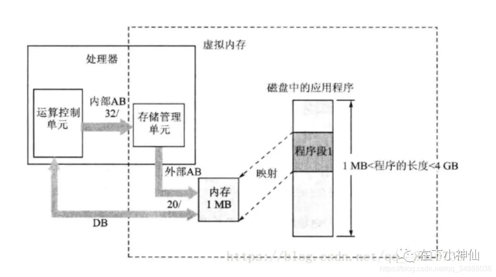
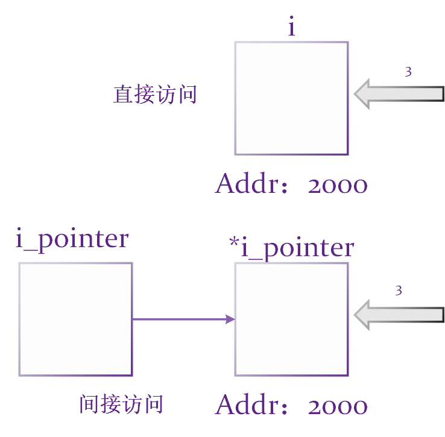

# C

1. C语言因UNIX系统而生。
2. GNU（GNU's Not UNIX）项目始于1987年，是一个开发大量自由UNIX软件的集合。
3. GCC——GNU编译器集合（GNU Compiler Collection，GCC），
   - 其中包含GCC C编译器。
   - GCC有各种版本以适应不用硬件平台和操作系统，包括UNIX，LINUX，Windows
   - gcc命令便可调用GCC C编译器，许多系统都用cc作为gcc的别名
4. c语言优点
   - 高效性，快速
   - 可移植性，找到合适的编译器，就能在源代码的基础上，稍作修改或不修改就能在其他系统运行

C语言是一门面向过程的语言，面向过程编程思想的核心：功能分解，自顶向下，逐层细化。**程序 = 数据结构 + 算法**

# 0 绪论

## 0.1 C语言标准

1. 第一个C标准——ANSI/ISO 标准——C90，ANSI/ISO标准的最终版本通常叫做C89（ANSI于1989年批准该标准）或C90（ISO于1990年批准该标准）
2. C99——1999年
3. C11——2011年

## 0.2 编程机制

1. 源代码：在文本编辑器中，敲入的复合语法规范的代码
2. 预处理器：
   - 在c程序顶部的信息集合被称为头文件，头文件包含了编译器创建最终可执行程序要用到的信息。
   - `#include`这行代码就是一条预处理器指令
3. 编译器：
   - 编译器把源代码转换为中间代码（目标代码），链接器把中间代码和其他代码合并生成可执行代码。
   - 编译器可检测出不符合C语言规范的语法错误，无法检测出语义错误（也就是代码逻辑），报错的位置比真正错误滞后一行。
4. 链接器
   - 把目标代码、系统标准启动代码和库代码这三个部分合并成一个可执行文件
   - 目标代码只包含编译器为你编写的代码翻译的机器语言代码。
   - 可执行文件中还包含你编写的程序中使用库函数和启动代码的机器代码


### 0.2.1 可执行文件里的内容


1. 正文段 

   - 又叫代码段，程序源代码编译后的 机器指令 就被放在代码段。代码段是可 共享的 ，所以即便是频繁执行的程序，在存储器中也只有一个副本。 当系统中运行着多个该程序的副本时，它们的指令都是一样的，所以 内存中只需要保存一份该程序的指令部分，因此， 代码段通常是 只读 的，以防止程序由于意外而修改其指令。

2. 初始化数据段 

   - 即.data段，包含了程序中已明确赋值的全局变量和静态变量以及它们的值。
   - 还包含.rodata段，存放只读数据，如const修饰的变量和字符串常量。

3. 未初始化数据段, 

   - 通常将此称段为bss段（block started by symbol）,与已初始化数据段相对应，它保存的是未初始化的全局变量和静态变量。有些全局未初始化的变量不会放到目标文件的bss段，会等最终链接时在放到bss段，这于强符号和弱符号有关。当全局变量和局部静态变量被初始化为0时，会被放到bss段中，因为未初始化都是0。

   - 注意：**未初始化段中存的是未初始化的全局变量和静态变量在实际内存中所需要的空间大小，它只是为它们预留了位置，并没有实质的内容，所以也不占空间。**也就是说， 未初始化段的内容并不存放在磁盘程序文件中，因为内核在程序开始执行前将它们全部初始化为0或NULL，这样也许可以把它们放入初始化数据段，但因为它们都是0，所以为它们在初始化数据段分配空间并存放0是非常没有必要的。当这个内存区进入程序的地址空间后，包括初始化数据段的和bss段的整个区段此时统称为数据区。
     

4. 堆 

   - 位于未初始化数据段与栈之间，这部分内存是由低地址向高地址分配。我们通常在堆中进行 动态存储分配 ，即malloc申请的内存，这段空间会一直存在，直至我们使用free释放，如果没有主动释放，在进程运行结束时也会被系统释放掉。而内存泄露就是指我们我们没有释放堆空间，从而导致堆不断增长，使内存空间不断减少。

5. 栈

   - 是从高地址向低地址分配的，栈中存放的是局部变量，以及每次函数调用时，返回的地址以及调用者的环境信息。栈也经常被叫做栈帧，因为栈以帧为单位，当程序调用函数的时侯，栈会向下增长一帧，帧中存储被调用函数的参数和局部变量，以及该函数的返回地址。此时，位于栈最下方的帧和全局变量一起，构成了当前的环境。一般来说，你只允许使用位于栈最下方的帧，当该函数又调用另一个函数的时候，栈又会向下增长一帧，此时控制权会转移到新的函数中，当函数返回时，会从栈中弹出，并根据帧中记录的地址信息，返回到调用它的函数中，然后删除帧。直到最后main()函数返回，其返回地址为空，进程结束。所以，递归太多层的话可能会让栈溢出。

6. 环境变量 类似Linux下的PATH、HOME等环境变量。

这就是可执行文件中存放的内容，在被执行后，称为一个进程，它对应一段虚拟内存。

### 0.2.2 [虚拟内存和物理内存](https://blog.csdn.net/qq_34888036/article/details/117969279)

#### 虚拟内存

每个程序被运行起来后，它将拥有自己独立的线性空间，这个线性空间由cpu的位数决定，比如32位硬件平台决定了线性地址空间的寻 址空间为0～2^32-1，即0x000000000xFFFFFFFF，也就是4GB大小。如果每个进程都有4GB，那我们的内存根本就不够用。其实，这4GB并不是真正的内存空间，它是虚拟内存空间，顾名思义，之所以称为虚拟内存，是和系统中的物理内存相对而言的，它是操作系统内核为了对进程地址空间进行管理而设计的一个逻辑意义上的内存空间概念。我们程序中的指针其实都是这个虚拟内存空间中的地址。虚拟内存是将系统硬盘空间和系统实际内存联合在一起供进程使用，给进程提供了一个比内存大的多的虚拟空间。在程序运行时，只需要把虚拟内存空间的一小部分通过页映射模式，经过MMU部件转换映射到物理内存即可。
     那么这4GB的空间是不是就由该进程随意使用呢？遗憾的是，不可以。因为操作系统需要监控进程，进程只能使用那些操作系统分配给它们的地址，如果访问未经允许的空间，那么操作系统会捕获到这些访问，将进程的这种访问当作非法操作，强制结束进程。Linux操作系统将进程的4G虚拟空间分配为1：3的结构，1G是操作系统本身，剩下的3G是留给进程使用的。所以在一个进程的眼里，只有操作系统和它自己，就像整个计算机都被它“承包”了。

要注意的是，这个地址空间是虚拟的，并非实际存在的。
大家每次创建一个进程的时候，操作系统都会给进程分配这样的一个虚拟内存。


上图为32位进程的内存布局，从上图中主要包含以下几个块：

- 内核空间：供内核使用，存放的是内核代码和数据
- stack：这就是我们经常所说的栈，用来存储自动变量(automatic variable)
- mmap:也成为内存映射（memory map），用来在进程虚拟内存地址空间中分配地址空间，创建和物理内存的映射关系
- heap:就是我们常说的堆，动态内存的分配都是在堆上
- bss（block started by symbol）:包含所有未初始化的全局和静态变量，此段中的所有变量都由0或者空指针初始化，程序加载器在加载程序时为BSS段分配内存
- ds:初始化的数据块
  - 包含显式初始化的全局变量和静态变量
  - 此段的大小由程序源代码中值的大小决定，在运行时不会更改
  - 它具有读写权限，因此可以在运行时更改此段的变量值
  - 该段可进一步分为初始化只读区和初始化读写区

- text：也称为文本段
  - 该段包含已编译程序的二进制文件。
  - 该段是一个只读段，用于防止程序被意外修改
  - 该段是可共享的，因此对于文本编辑器等频繁执行的程序，内存中只需要一个副本

#### 虚拟内存和物理内存的映射关系

既然虚拟内存是一个虚拟的概念。也就表名了虚拟地址不能真正的存放数据。
数据在真正读写的时候，是对真实的地址空间进行读写的。
处理器运算器和应用程序设计人员看到的只是虚拟内存空间和虚拟地址，而处理器片外的地址总线看到的只是物理地址空间和物理地址。
将虚拟地址转换成物理地址的任务叫 【地址翻译】。
虚拟内存的地址如何转成真实地址。中间需要一个转换（映射）的机制。
这个东西我们叫做 MMU (存储器管理单元)。
MMU 把虚拟地址转化为实际物理地址的依据。
记录表与存储管理单元MMU的作用如下图所示：


这里的物理内存包含：随机存储器（RAM)和硬盘（HDD）

Linux把虚存空间分成若干个大小相等的存储分区，Linux把这样的分区叫做**页**（page）。

物理内存中的块空间是用来容纳虚存页实际内容的容器，所以物理内存中的块叫做**页框**（page frame）。

映射  虚拟内存的页  到  物理内存的页框  的映射表，就被称之为**页表**

物理内存和虚拟内存被分成了页框与页之后，其存储单元原来的地址都被自然地分成了两段，并且这两段各自代表着不同的意义：

高位段分别叫做页框码和页码，它们是识别页框和页的编码；（内容大小，区段，偏移，d）
低位段分别叫做页框偏移量和页内偏移量，它们是存储单元在页框和页内的地址编码。（内容位置，区段起始位置，）


## 0.3 HelloWorld

```c
#include<stdio.h>	/*头文件，预处理器指令，包含了编译器创建最终可执行程序要用到的信息*/
// c程序一定从main()函数开始执行
int main(void) {	// 花括号用于标记函数体和块
    
    int num1, num2 = 3; 
    
    // 声明变量，为变量创建和标识存储空间
    // int c语言关键字，关键字语言定义的单词，不能作他用。
    // num1是一个标识符，
    // 命名规则：
    // 首字符：下划线和字母
    // 非首字符：字母、数字、下划线
    
    num1 =1; // 赋值语句
    
    printf("The C Language is simple %d", num1); 
    // print + format，
    // %d 占位符，指明num1将以什么样的形式和位置出现
    
    // 调用函数看，称为回调函数
    butler();
    return 0; // 返回值
}
// 定义函数
void butler() {
    printf("you rang, sir?\n")
}
```

程序状态是在程序执行过程中，某给定点上所有变量的集合，它是计算机当前状态的一个快照。

## 0.4 关键字和保留字


# 1 顺序结构

## 1.1 常量和变量

1. 常量：
   - 整型常量，eg：1，123，-345
   - 实型常量，包含两种形式，小数形式，指数形式，**按双精度处理**
   - 字符常量：
     - 普通字符（单引号括起来的单个字符）
     - 转义字符（以反斜杠开头的具有特殊意义的字符）
     - 字符串常量（双引号括起来的若干字符）
     - 符号常量
       - 用`#define`指令指定用一个符号名称代表一个常量，eg：`#define PI 3.1415`
2. 变量
   - 变量必须先声明后使用，并且尽量初始化。
   - 变量名实际上是一个名字代表的存储地址
3. 常变量（C99）
   * `const float pi=3.1415`
   * 有类型，占用存储单元，值不可变
4. 标识符：只能由字母、数字、下划线组成，并且以字母或下划线为首。区分大小写

在预编译后，符号常量就不存在了，对符号常量的名字不分配存储单元，而常变量要占用存储单元，有变量值，只是该值不改变而已。

## 1.2 数据类型

c++规定在创建一个变量或常量时，必须要指定出相应的数据类型，否则无法给变量分配内存

1. 基本类型
   - 整型类型
     - 整型（int，2个or4个字节），无符号整型（unsigned int）
     - 短整型（short int，2个字节），无符号短整型（unsigned short int）
     - 长整型（long int，4个字节），双长整型（long long int，8个字节），无符号...
     - 字符型（char，1个字节），有符号（)，无符号（0~2^8）
     - 布尔型（bool）
   - 浮点类型（以小数或指数形式出现）
     - 单精度浮点型（float，4个字节）
     - 双精度浮点型（double，8个字节），长双精度（long double，8or 16个字节）
     - 复数浮点型（float_complex，double_complex， long long_comple)
2. 枚举类型（enum）
3. 空类型（void）
4. 构造类型
   - 数组（[ ]）
   - 结构体（struct）
   - 共用体（union）
5. 指针类型
6. 函数类型


构造类型、指针类型、函数类型也可以称作是派生类型

字符类型是按其代码（整数，ASCII码）形式存储的，因此C99把字符型数据作为整数类型的一种

```c
float a = 3.1415;
// 在进行编译时，对float变量分配4个字节，而实型常量3.1415会按照双精度处理
// warning:trunction from 'const double' to 'float'
// 可以在常量的末尾加专用字符，强制指定常量的类型
float a= 3.1415f;
long double b = 1.23L;
```

## 1.3 运算符

1. 算术运算符，`+ - * / % ++ --`
2. 关系运算符，`> < == >= <= !=`
3. 逻辑运算符，`! && || `
4. 位运算符，`<< >> ~ | ^ &`
5. 赋值运算符，`= += -=等`
6. 条件运算符（三目运算符），`cond ? t_exp : f_exp`
7. 逗号运算符
8. 指针运算符，`* &`
9. 字节数运算符，`sizeof`
10. 强制类型转换符，`(type_name) (exp)`
11. 成员运算符， `.->`

```c
// 1.算术运算符
// 取余%，两边的操作数必须为整型
// 自增自减，不能用于常量和表达式

// 自动类型转换：不同类型数据间的混合运算，往大容量数据类型转化
// 强制类型转换：将表达式的值转换成所需类型。
// 字符型数据（ASCII码，即数值）与整型数据进行运算。
(type_name) (expression);
(int) (x + y);
(float) (5 % 3);
```

## 1.4 数据的输入输出

c语言函数库中有一批“标准的输入输出函数”，它是以标准的输入输出设备（一般为终端设备）为输入输出对象。

其中有：

1. `putchar('输出字符')，getchar('输入字符'),`
2. `printf(格式输出)，scanf(格式输入)`
3. `puts("输出字符串")，gets("输入字符串")`

### 1.4.1 printf

一般格式：

**printf("格式控制", 输出列表)**

格式声明：
   **% 修饰符 格式字符**

```c
printf("%d %d\n",a, b);
// 格式控制包括：
// %d 格式声明，做占位和格式指定
// 普通字符，原样输出
// 格式控制必须有
```

| 格式字符 | 说明                                                         |
| -------- | ------------------------------------------------------------ |
| **d，i** | 以十进制形式输出整数（正数无符号）                           |
| **o**    | 八进制（不输出**前导符0**）                                  |
| **x，X** | 十六进制（不输出**前导符0x**），x小写字母，X大写字母形式，输出a-f |
| **u**    | 以无符号输出整数                                             |
| **c**    | 以符号形式输出，只输出一个字符                               |
| **s**    | 输出字符串                                                   |
| **f**    | 以小数形式输出单双精度，默认输出6位小数                      |
| **e，E** | 以指数形式输出实数，                                         |
| **g，G** | 选用%f或%e格式中输出宽度较短的一种格式，不输出0              |
| **zu**   | 打印size_t类型数据                                           |

| 修饰符  | 说明                                                         |
| ------- | ------------------------------------------------------------ |
| **l**   | 用于长整型整数，可在格式符d，o，x，u                         |
| **m.n** | m：指定数据占用的总位数。n：指定小数的位数，长度不够时，左端补空格 |
| **-**   | 数据长度不够时，数据向左靠，右端补空格                       |

```c
// %d
printf("%5d\n%5d\n",12,-345);
   12//前面有三个空格，指定数据能占用的总位数为5
 -345 //前面有一个空格

// %c
printf("%c",'a');
a
short b = 121;
printf("%c", b);
y
// 0~127 范围内的数字，在以%c的形式输出时，将会转化为ASCII码对应的字符
int c = 377;
printf("%c", c);
y
// %c只考虑一个字节，对于两字节的int，只看后一个字节的数据，即十进制的121，是ASCII码中的y
    
// %f
printf("%f\n",1/3);
0.333333 //默认6位小数
printf("%20.15f\n",1/3);
0.333333333333333 //15位小数，0前面还有3个空格
printf("%-20.15f\n",1/3);
0.333333333333333 //15位小数，最后一个3后面还有3个空格

// %e
printf("%e", 123.456);
1.234560e+002 // 默认小数为6位数，指数占5列，e为1列1 +为1列 002为3列
printf("%13.2e", 123.456);
1.23e+002; //1前面还有4个空格

//%02X表示输出的16进制使用两个位置，如果只有一位的前面添0，比如15就输出0F。
```

如果想原样输出%号，需要连续使用两个%表示

### 1.4.2 scanf

一般形式：

**scanf("格式控制", 地址列表)**

注意：

1. 地址列表应当是变量的地址名，而不是变量名
2. 在输入数据时，应在对应的位置输入同样的字符
   - 输入数值时，在两个数值之间需要插入空格或其他分割符（回车，tab，不属于数值的字符），以使系统得以区分两个数值
   - 在连续输入字符时，在两个字符之间不要插入空格或其他分割符
3. 

| 格式字符       | 说明                                                         |
| -------------- | ------------------------------------------------------------ |
| **d，i**       | 用来输出有符号的十进制整数                                   |
| **u**          | 用来输入无符号的十进制整数                                   |
| **o**          | 用来输入无符号的八进制整数                                   |
| **x，X**       | 用来输入无符号的十六进制（不输出前导符0x），x小写字母，X大写字母形式，输出a-f |
| **c**          | 用来输入单个字符                                             |
| **s**          | 用来输入字符串，将字符串送到字符数组中，以非空白字符开始，以空白符结束，字符串以`\0`作为其最后一个字符 |
| **f**          | 用来输出实数，可以用小数形式或指数形式输入                   |
| **e，E，g，G** | 与f作用相同，e与f，g可以互相替换                             |

| 修饰符  | 说明                                                         |
| ------- | ------------------------------------------------------------ |
| **l**   | 用于长整型数据（可用%ld，%lo，%lx，%lu）以及double型数据（用%lf或%le） |
| **h**   | 用于短整型数据（可用%ld，%lo，%lx）                          |
| **m.n** | 域宽                                                         |
| *****   | 表示本输入项在读入后不赋给相应的变量                         |

```c
#include<stdio.h>
#include<math.h>
int main() {
    double a,b,c,disc,x1,x2,p,q;
    scanf("%lf%lf%lf",&a,&b,&c); 
    // %lf,将输入的数值转化为浮点型。
    // 三个数的输入，之间用空格隔开，不能用逗号
    
    disc = b*b - 4*a*c;
    p = -b/(2.0*a);
    q = sqrt(disc) / 2.0*a;
    x1 = p+q;
    x2 = p-q;
    
    // %7.2f，指定数据占7列，小数占两列
    printf("x1=%7.2f\nx2=%7.2f\n",x1,x2);
}
```

### 1.4.3 putchar

putchar函数是输出字符的函数，它输出的是字符而不能输出整数。

对于0~127的整数，会输出对应ASCII值的字符

### 1.4.4 getchar

从终端获取一个字符。

注意：

getchar不仅可以从终端获取一个可显示的字符，而且可以获取在屏幕上无法显示的字符，例如回车

```c
#include<stdio.h>
int main() {
    char a,b,c;
    a = getchar();
    b = getchar();
    c = getchar();
    
    // 一定要在连续输入BOY之后再敲回车，否则回车会被下一个getchar捕获
    putchar(a);
    putchar(b);
    putchar(c);
    
    putchar('\n');
    return 0;
}
```

# 2 选择结构

## 2.1 if结构

```c
// 1 单判断，没有else
if(expr) 语句1;

// 2 双判断
if(expr) 语句1;
else 语句2;

// 3 多判断
if(expr1) 语句1;
else if(expr2) 语句2;
else if(expr3) 语句3;
...
else 语句n;
```

注意：

1. 如果语句是复合语句（多语句）需要用花括号括起来。
2. if语句可以嵌套

## 2.2 switch结构

```c
switch(expr){
    case constant1: 语句1;break;
    case constant2: 语句2;break;
    ...
    case constantn: 语句n;break;
    default: 语句n+1;
}
```

注意：

1. expr的值应为整数类型（包括字符型）
2. 每个case的常量必须互不相同
3. 可以没有default语句
4. case后面如果有多个语句可以不用花括号，因为通过case找到语句执行的入口后，后面会顺序执行。所以如果不想入口后面的case执行，就必须添加break
5. 多个case可以共用一个语句

## 2.3 关系与逻辑

运算符之间的优先级：

`！> 算术运算符 > 关系运算符 > && 和 || > 条件运算符（? :）> 赋值运算符`

在c编译系统中，

1. 在表示逻辑运算结果时，以数值1代表为真，以数值0代表为假
2. 在判断一个量时，以非0为真，以0为假。
3. 逻辑运算符两侧的运算对象不但可以是0和1，或者是0或非0，也可以是字符型、浮点型、枚举型或指针型

c99增加逻辑型_Bool变量，

```c
_Bool a;
// 如果使用头文件stdbool.h，bool定义为_Bool的同义词，同时定义了两个符号常量true（代表1）和false（代表0），
```

# 3 循环结构

## 3.1 while结构

```c
// while，当循环条件为真，就执行循环体;
// 先判断，后执行
int i = 1, sum = 0;
while(i <= 100) {
    sum = sum + i;
    i++;
}
// do...while
// 先执行，判断
int i = 1, sum = 0;
do{
    sum = sum + i;
    i++;
}while(i <= 100)
```

## 3.2 for结构

```c
for(expr1; expr2; expr3) {
    //expr1：设置初始条件，只执行一次，可以为0个，但其后的省略号不能省，可以为循环言变量设置初值，也可以是与循环变量无关的表达式
    //expr2: 循环条件表达式，先判断，后执行
    //expr3：循环调整，执行完循环体后执行
    
    //expr1和expr3可以是一个简单的表达式，也可以是逗号分割多个简单表达式。
}
```

## 3.3 循环中断

break：提前终止循环

continue：提前结束本次循环

goto：改变程序执行的顺序，从goto执行处跳转至标记处

- C 语言中的 **goto** 语句允许把控制无条件转移到**同一函数内**的被标记的语句。

- 标签在哪里，goto语句就可以往哪跳，可往当前执行goto语句之前跳，可往之后跳

- 应用场景：终止程序在某些深度嵌套的结构的处理过程

- 在程序中不建议使用goto语句，以免造成程序流程混乱

- ```c++
  for(...)
      for(...)
     {
          for(...)
         {
              if(disaster)
                  goto error;
         }
     }
      …
  error:
   if(disaster)
  ```

- 

# 4 数组

数组名代表了数组的起始地址。

## 4.1 一维数组

**1 定义**

**type array_name[constants_expr]**

- constants_expr：可以包含常量和符号常量，不能包含变量

- constants_expr在函数中定义数组，其长度可以为变量或非常量表达式

  ```c
  int arr0[10];
  void func(int n) {
      int arr[2*n];// 此时称为可变长数组
      // 如果指定数组为静态存储方式，则不能用可变长数组
      // 错误eg: static int arr[2*n];
  }
  ```

**2 初始化**

**type array_name[constants_expr] = {initial_list}**

```c
// 这种初始化方式在C++98中叫做初始化列表
int arr1[10] = {0,1,2,3,4,5,6,7,8,9};
int arr2[10] = {0,1,2,3,4,5}; // 其余5个元素自动赋初值0
int arr3[] = {1,2,3,4,5}; // 数据个数确定，此时可以不指定数组长度

// 如果初始值的个数大于数组长度，则会出现语法错误。如果小于，那些未被初始化的元素将会被自动初始化为默认值
// 如果在定义数值型数组时，指定了数组的长度并初始化（部分元素被初始化），那些未被初始化的元素（部分没有初始化），系统会自动把他们初始化为0。
// 如果是字符型数组，那些未被初始化的元素将被自动初始化为 '\0'
// 如果是指针型数组，那些未被初始化的元素将被自动初始化为 NULL
```

**3 引用**

**array_name[index]**


**4 数组的长度**

```c
    string stra[] = {"IP","port","userName","pwd","dbName"};
    int len = sizeof(stra) / sizeof(stra[0]);
    printf("string Array len：%d\n",len);	// string Array len：5

    int arr[] = {1,2,3,4,5,6,7};
    int intlen = sizeof(arr)/sizeof(arr[0]);
    printf("int Array len：%d\n",intlen);	// int Array len：7
```


## 4.2 二维数组

**1 定义**

**`type array_name[constants_expr][constants_expr]`**

```c
float arr[3][4];
// arr[0],arr[1],arr[2]是包含4个元素的一维数组
// c语言，二维数组中元素排列顺序是按行排列的，在内存单元中是连续存放的，是线性的
```

**2 初始化**

```c
// 1.分行对二维数组进行初始化
int arr[3][4] = {
    {1,2,3,4},
    {5,6,7,8},
    {9,10,11,12}
};
// 2.按内存顺序进行初始化
int arr[3][4] = {1,2,3,4,5,6,7,8,9,10,11,12};
// 3. 对部分赋初值
int arr[3][4] = {{1}, {5}, {9}};
int arr[3][4] = {{1}, {5,6}, {9,10}};
int arr[3][4] = {{1}, {}, {9}};

// 4.如果对全部元素赋初值，可以不写第1维的长度，但第2维的长度不能省，系统会自动根据数据的个数与第2维的长度计算第1维的长度
int arr[][4] = {1,2,3,4,5,6,7,8,9,10,11,12};
// 5.如果对部分元素赋初值，而省略第1维的长度，须按行赋初值
int arr[][4] = {{1}, {5}, {9}};

// 6.同样如果只初始化部分数组元素，那些未被初始化的元素将会被自动初始化
```

**3 引用**

**`array_name[dim1_index][dim2_index]`**

## 4.3 字符数组

```c
// 字符数组定义、初始化、引用都一样
char arr[10] = {'I', ' ', 'a', 'm', ' ', 'h', 'a', 'p', 'p', 'y'}; // 长度为10
char arr[] ={"I am happy"}; //长度为11，最后一个字符为'\0'，在ASCII码中是空操作符
char arr[] = "I am happy";//长度为11
// 字符数组的每个元素只能存放一个字符
// 如果初值的个数小于数组长度，剩余未被初始化的元素，将会被自动赋值为'\0'
```

### 字符串

C语言中，将字符串作为字符数组来处理。并且规定了一个“字符串结束标志”，以字符'\0'作为结束标志。

### 字符数组的输入输出

```c
char arr[] = "china";
printf("%s", arr);
china

// 如果scanf函数的输入项，如果是字符数组名，不要加地址符&，因为C语言中数组名代表了数组的起始地址。
char arr1[10];
scanf("%s", arr1);

//如果利用scanf输入多个字符，应在输入时以空格分割
char str1[5],str2[5],str3[5];
scanf("%s%s%s",str1,str2,str3);
```

### 字符串处理函数

```c
#include<string.h>
//1.输出字符串函数
puts(字符数组);
//2.输入字符串函数
gets(字符数组);
//3.字符串连接函数
strcat(字符数组1, 字符数组2);
//4.字符串复制函数
strcpy(字符数组, 字符串);//将字符串复制到字符数组中
strncpy(字符数组, 字符串, n); //将字符串中的前n个复制到字符数组中
//5.字符串比较函数
strcmp(字符串1，字符串2); // 两个字符串从左至右逐个字符相比（按ascii值比较），知道出现不同的字符或遇'\0'为止。
// = return 0
// > return +n
// < return -n
//6.字符串长度
strlen(字符串);
//7.大小写转换
strupr(字符串);
strlwr(字符串);

```

# 5 函数

## 5.1 定义函数

```c
#include<stdio.h>
int main(void) {
    //max函数声明
    int max(int x, int y);
    
    int c;
    c = 3 * max(1, 2);//实际参数
    printf("%d\n",c);
}
//1.定义无参函数
void hello() {//无返回值
    printf("你好");
}
int hello(void) {//返回值类型为int
    printf("你好");
    return 1;
}
//2.定义有参函数
int max(int x, int y) {//形式参数
    int z;
    z = x>y ? x : y;
    return z;
}
```

注意：

- 实参可以是常量，变量或表达式，在使用函数时，要求他们有确定的值
- 实参与形参的类型应相同或赋值兼容
- 对于不带返回值得函数，应当定义函数为"**void类型**"，此时在函数体重不能出现return语句
- 形参数组可以不指定大小

```c
float average(float arr[]){
    ...
}
```


## 5.2 函数声明和函数原型

在一个函数中调用另一个函数须具备以下条件：

- 被调函数已定义（是库函数或自定义的函数）
- 如果用到库函数，则需要**#include<*.h>**
- 如果自定义的函数在主调函数的后面（同一文件），则应该在主调函数中对被调用的函数做**声明**，

**声明的作用**：是把函数名、函数参数个数和类型等信息通知编译系统，以便在遇到函数调用时，编译系统能正确识别函数病检查调用是否合法。

函数的声明和函数定义的第1行（函数首部）基本相同，只是多了一个**";"**

函数的首行（部）被称作**函数原型**

函数声明基本有两种形式：

```c
// 形式1携带形参名，便于通过形参名了解函数的功能
函数类型 函数名(形参类型1 形参1, 形参类型2 形参2,,,形参类型n 形参n);
// 形式2不携带形参名
函数类型 函数名(形参类型1, 形参类型2,,,形参类型n);
```

如果已在函数的开头（所有函数之前），对本文件中所调用的函数进行了声明，则各函数中不必对其所调用的函数再做声明。

## 5.3 嵌套和递归

一个函数内不能再定义另一个函数，也就是不能嵌套定义函数，但可以嵌套调用函数。

**嵌套调用**——调用自身外的函数

**递归调用**——**直接或间接**地调用该函数本身

## 5.4 数组作为函数参数

数组中的元素作为函数的实参时，向形参传递的是值——传值

数组名作为函数的实参时，向形参传递的是数组的首元素地址——传址

形参数组可以不指定大小（一维），如果是多维，则必须指定其他高维的大小，而省略第1维的大小。

## 5.5 变量的作用域

空间角度观察变量分为

**局部变量**：

- 在函数内部定义对的变量都称作局部变量，只在本函数范围内有效
- 在函数体**程序块（花括号括起来的内容，也叫复合语句）**中定义变量，只在程序块中有效

**全局变量**：

- 在函数之外定义的变量是全局变量（也称外部变量），有效范围为从定义变量的位置开始到本源文件结束。
- c程序有个习惯，将全局变量的第一个字母大写。

如果局部变量和全局变量重名时，采用就近原则（局部变量的作用范围内，局部变量有效，而全局变量在此域内被屏蔽）

## 5.6 变量的生存期

存在时间（生存期）角度观察变量

也就是说，变量的存储方式（存储类别）有两种：

1. **静态存储方式**：程序运行的整个过程都是存在的，在程序结束后释放。
2. **动态存储方式**：调用其所在函数时才临时分配存储单元，调用结束后被释放

存储空间可以分为：[程序区，静态存储区，动态存储区](https://blog.csdn.net/m0_47486635/article/details/127200885)

1. 程序区
   - 用于存储程序的代码，即程序的二进制代码。
2. 静态存储区
   - 用于存储全局变量和静态变量，这些变量的空间在程序编译时就已经分配好了。
3. 动态存储区
   - 用于在程序执行时分配的内存，又分为：堆区（heap）和栈区（stack）。
     （1）堆区：用于动态内存分配，程序运行时由内存分配函数在堆上分配内存。堆中存储的数据若未释放，则其生命周期等同于程序的生命周期。
     （2）栈区：在函数执行时，函数内部的局部变量和函数参数的存储单元的内存区域，函数运行结束时，这些内存区域会自动释 放。

变量和函数都有两个属性：数据类型（int，float等）和数据的存储类别

### 5.6.1 局部变量的存储类别

1. 自动变量（auto）
   - 函数调用结束时，就自动释放这些存储空间
   - 用关键字auto修饰，auto可省略，不写auto则隐含指定为"自动存储类别"
   - 存储在动态存储区（临时区）
2. 静态局部变量（static）
   - 函数调用结束后不消失，而继续保留原值，即其占用的存储空间不释放，下一次调用函数时，该变量已有值
   - 用关键字static修饰
   - 存储在静态存储区
   - 静态局部变量在编译时赋初值，即只赋值一次，以后每次调用函数不在重新赋初值，而只是保留上次函数调用结束时的值。
3. 寄存器变量
   - 一些变量使用相当频繁，从内存中存取变量需要花费不少时间，为提高效率将局部变量的值放在cpu的寄存器中。
   - 用register修饰
   - 存储在cpu的寄存器中

```c
// 静态局部变量，计算n的阶乘
int main() {
    int fac(int n);
    for(int i=1;i<=5;i++) {
        printf("%d!=%d\n",i,fac(i));
    }
    return 1;
}
int fac(int n) {
    static int f=1;//在编译时赋初值，再次调用保留上次函数调用结束时的值
    f=f*n;
    return f;
}
```

### 5.6.2 全局变量的存储类别

1. 扩展外部变量作用域

   - 如果出于某种考虑，在**定义点之前的函数**需要引用该外部变量，则应该在引用之前用**extern**对该变量进行**声明**
   - 用extern声明外部变量时，**类型名可以省略**，因为它不是定义变量，可以不指定类型

2. 将外部变量的作用域**扩展到其他文件**

   - 如果出于某种考虑，多个文件间需要共用一个变量，而不会出现重复定义的情况
   - 做法：在任一一个文件中定义外部变量，而在另一文件中用extern对变量进行"外部变量的声明"
   - 实际上，在编译时遇到extern时，先在本文件找，如果找到，就在本文件扩展作用域，如果找不到，就在连接时其他文件找，依次向外找，找到就扩展作用域到本文件，如果再找不到就报错。

3. 将外部变量限制在本文件

   - 如果出于某种考虑，希望某些外部变量只限于本文件引用，这时可以加static声明
   - 加static声明，只能用于本文件的外部变量称为**静态外部变量**

   

   ```c
   // 扩展外部变量作用域到定义变量之前
   #include<stdio.h>
   int main() {
       int max();
       extern A,B,C;
       scanf("%d%d%d",&A,&B,&C);
       printf("max is %d\n",max());
   }
   int A,B,C;
   int max() {
       int m;
       m = A>B?A:B;
       if(m<C) m=C;
       return m;
   }
   
   //扩展变量作用域到其他文件
   // file1.c
   int A;
   int main() {
       
   }
   // file2.c
   extern A;
   int power() {
       int y;
       y = A;
   }
   
   //限制变量作用域在本文件内
   //file1.c
   static int A;
   int main(){
       ...
   }
   //file2.c
   extern A;
   void power() {
       int y;
       y = A;//将报错
   }
   ```


## 5.7 声明和定义

对于函数而言：

- 一般函数由两部分组成：声明部分和执行语句。
- 函数声明的作用是对有关标识符的属性进行声明（函数的原型），而函数的定义是对函数功能的定义。

对于变量而言：

- 声明出现的变量有两种情况，一种是需要建立存储空间的（如：int a），另一种是不需要建立存储空间的（如：extern a）
- 前者是**定义性声明**，后者是**引用性声明**，广义上来说是，声明包含定义，而并非所有声明都是定义
- 一般来说，建立存储空间的声明称定义，而把不需要建立存储空间的声明称为声明

## 5.8 函数的作用域

函数的本质是全局的。

一个函数的目的就是要被另外的函数调用，如果不加声明的话，一个文件的函数即可被本文件的函数调用，也可被其他文件得函数调用。

根据函数是否能被其他源文件调用，将函数分为**内部函数和外部函数**

1. 内部函数

   - ```c
     static type func_name(param1，params2...) {
         //
     }
     ```

   - 又称为静态函数

   - static的作用，使得函数的作用域局限于所在文件，而不能被其他文件调用

2. 外部函数

   - ```c
     extern type func_name(param1，params2...) {
         //
     }
     ```

   - 如果在定义函数时省略extern，则默认为外部函数

## 5.9 参数可变的函数

任何一个可变参数的函数都可以分为两部分：固定参数和可选参数。

- 至少要有一个固定参数，其声明与普通函数参数声明相同；

- 可选参数由于数目不定(0个或以上)，声明时用"…"表示。

固定参数和可选参数共同构成可变参数函数的参数列表。

## 5.10 [函数的返回值](https://blog.csdn.net/weixin_30716641/article/details/117008763)

函数调用结束后，返回值被临时存储到寄存器中，并没有放到堆或栈中，也就是说与内存没有关系了。

当退出函数的时候，临时变量可能被销毁，但是返回值却被放到寄存器中与临时变量的生命周期没有关系。

如果我们需要返回值，一般使用赋值语句就可以了（A a = func();）

但是将一个指向局部变量的指针作为函数的返回值是有问题的。由于指针指向局部变量，因此在函数返回时，临时变量被销毁，指针指向一块无意义的地址空间，所以一般不会有返回值（如果这段内存没被修改，那么可以获得正确的值，但概率低）。

常规程序中，函数返回的指针(函数指针，数组指针，结构体指针，联合体指针等)通常应该是：

1. 指向静态(static)变量；
2. 指向专门申请分配的(如用malloc或new)空间；
3. 指向常量区(如指向[字符串](https://so.csdn.net/so/search?q=字符串&spm=1001.2101.3001.7020)"hello")；
4. 指向全局变量；
5. 指向程序代码区(如指向函数的指针)。

# 6 指针

## 6.1 直接与间接访问

1. 将3直接送到变量i所标志的单元，eg："**i = 3**"
2. 将3送到变量i_pointer所指向的单元（即变量i的存储单元），eg：“***i_pointer = 3**”，其中`*i_pointer表示i_pointer指向的对象`



直接访问：直接通过变量名**i**进行的访问

间接访问：将变量i的地址存放在**i_pointer**变量中，然后通过该变量来找到**变量i的地址**，从而访问变量i

指向通过地址来体现。

**一个变量的地址称为该变量的指针**，如果有一个变量专门用来存放另一个变量的地址，则称它为**指针变量**，指针变量的值是地址

**指针是一个地址，而指针变量存放地址的变量。**

## 6.2 指针变量

###  6.2.1 定义

**type *pointer_name;**

- type：**基类型**，用来指定指针变量可以指向的变量的类型
-  定义指针变量时必须指定基类型，因为要取出一个变量的数据，需要知道指定存储单元的地址和该变量的存储长度。
- 一个变量的指针含义包括两方面：
  - 存储单元编号表示的地址
  - 指向存储单元的数据类型
- 指针类型的表示：指向整型数据的指针类型表示为`int *`，当然还有其他指针类型的`float *, char *`
- 指针变量中只能存储地址，不要将一个整数赋给一个指针变量。

### 6.2.2 引用

两个运算符：

- **&**：取址运算符。
- *****：指针运算符（也称间接访问运算符），*p代表指针变量p指向的对象

```c
// p3是指向float型变量的指针变量，简称float指针
float *p3;

float a = 99.5, b = 10.6;
char c = '@', d = '#';
// 定义指针变量并初始化
float *p1 = &a;
char *p2 = &c;

// *p1代表指针变量p1指向的 a，此时输出99.5
printf("%f", *p1);

// 修改指针变量的值
p1 = &b;// &将b的地址取出给p1
p2 = &d;
```

### 6.2.3 指针变量作为函数的参数

函数的参数不仅可以是基本类型等数据，还可以是指针类型，他的作用是**将一个变量的地址传送给另一个变量**

C语言中实参和形参之间的数据传递是单向的"**值传递**"方式。用指针变量作为函数的参数同样遵循注意规则，**不可能通过执行函数来改变实参指针变量的值，但是可以改变实参指针变量所指变量的值。**

```c
#include<stdio.h>
int main() {
    void swap(int *p1,int *p2);
    int a,b;
    int *pointer_1,*pointer_2;
    printf("please enter a and b:");
    scanf("%d,%d", &a,&b);
    pointer_1 = &a;
    pointer_2 = &b;
    if(a<b) swap(pointer_1, pointer_2);
    printf("max=%d,min=%d\n", a,b);
}
// 交换a，b的值，而p1和p2的值不变
void swap(int *p1, int *p2){
    int temp;
    temp = *p1;
    *p1 = *p2;
    *p2 = temp;
}
```

## 6.3 指针引用数组

```c
int a[10] = {1,2,3,4,5,6,7,8,9,10};
int *p;
//引用1，取数组首元素的地址赋给p
p = &a[0];
//引用2，数组名代表数组中首元素的地址
p = a;
```

在指针指向数组时，可以对指针进行如下的运算：

1. `+i`：p+1，p+i指向p当前位置之后的第i个元素，`*(a+i), *(p+i), a[i]`
2. `-i`：p-1，p-i指向p当前位置之前的第i个元素
3. 自加：p++，++p
4. 自减：p--，--p
5. 同一数组两个指针相减：p1-p2，就知道他们所指元素的相隔几个数组元素。

注意：

1. 指针变量p可以指向数组以后的单元，在这个例子里：a的长度为10，最后一个元素是a[9]，但是可以引用`*(a+10)`,这样编译不会出错，但逻辑会出错
2. 指向数组的指针变量也可以使用下标，因为在程序编译时，**对p[i]的处理成`*(p+i)`**。如果p指的位置不是a的首元素，那么p[i]将不等于a[i]，如果p当前指向的是第3个数组元素，那么p[2]将等于a[3+2]
3. 指针运算符与自加自减运算符**同优先级，结合方向自右而左**。
   - `*p++等价与*(p++)，先引用p的值，实现*p的运算，然后再使p自增1`
   - `++(*p)，表示p所指向的元素值加1，而不是指针值加1`
4. `fun(int arr[], int n)等价于fun(int *arr,int n)`

### 6.3.1 指针引用多维数组

```c
int a[3][4] = {
    {1,2,3,4},
    {5,6,7,8},
    {9,10,11,12}
}
```

主要把握两个点：

- `a+1 -> a[1] -> a[1][0]`
- `a+1指向a[1]，a+1 = &a[1]，a[1] = *(a+1),`
- `a[1]指向a[1][0]，a[1] = &a[1][0]`

| 表示形式                              | 含义                   |
| ------------------------------------- | ---------------------- |
| a                                     | a -> a[0]              |
| `*a, *(a+0), a[0] `                   | a+0 -> a[0]，a -> a[0] |
| `a+1, &a[1]`                          | a+1 -> a[1]            |
| `*(a+1), a[1]`                        | a+1 -> a[1]            |
| `*(a+1) +2, a[1] +2, &a[1][2] `       | `a[1] + 2 -> a[1][2]`  |
| `*(*(a+1) + 2), *(a[1] + 2), a[1][2]` | `a[1] + 2 -> a[1][2]`  |

注意：

- a和a[0]的值虽然相同（都是地址2000），但由于指针类型不同，**a指向一维数组a[0]，而a[0]指向第一行的列元素`a[0][0]`**
- 二维数组名a是指向行的，一维数组名a[0]是指向行的列元素的

### 6.3.2 指向多维“数组元素”的指针变量

```c
#include<stdio.h>
int main() {
    int a[3][4] = {
        {1,2,3,4},
        {5,6,7,8},
        {9,10,11,12}
    };
    int *p;
    //注意这里的初值，p=a[0]
    for(p=a[0];p < a[0]+12; p++) {
        if((p-a[0])%4 ==0) printf("\n");
        printf("%4d", *p);
    }
    printf("\n")
}
```

p是一个int * 型的指针变量，它可以指向一般的整型变量，也可以指向整型的数组元素。

二维数组大小m x n，`a[i][j] = *(p + i*n + j)`

### 6.3.3 指向“一维数组”的指针变量

在二维数组中，调整p指向一个包含n个元素的一维数组。使得p+1指向a[1]，而不再是`a[0][1]`

```c
#include<stdio.h>
int main(){
   int a[3][4] = {
        {1,2,3,4},
        {5,6,7,8},
        {9,10,11,12}
    };
    int (*p)[4],i,j;//p是一个指向一维数组的元素。
    p=a;// 二维数组，a->a[0], a[0]是一个含有4个元素的一维数组，
    printf("please enter row and column: ");
    scanf("%d,%d",&i,&j);
    printf("a[%d,%d]=%d\n", *(*(p+i)+j));
}
```

`int (*p)[4]`表示定义一个指针变量（可以同数组定义方式做比较，`int a[4]`，*p替代的是就是a，所以p指向一维数组），它指向包含4个整型元素的一维数组。`p -> a， a -> a[0]`

注意`*p`两侧的括号不能少，如果写成`int *p[4]`，由于[]运算级别较高，因此p先与4结合，再与`*`结合，*p[4]就是指针数组了。

```c
#include<stdio.h>
int main(){
    int a[4] = {1,2,3,4};
    int (*p)[4];
    //这里不能写成p=a，因为这样写表示p的值是&a[0]。
    // p=&a，表示p指向一维数组行，*p=a，(*p)[3]=a[4];
    p = &a;
    printf("%d\n", (*p)[3]);
    
    
    //这里尤为注意a与&a的区别
    // a、&a、&a[0]在内存空间上，他们指向的地址是相同的
    printf("%d\n",a);
	printf("%d\n",&a);
    //对a的直接引用将产生一个指向数组第一个元素的指针(int *)，int *p; p=a，*p = a[0]
    //而对&a的直接引用将产生一个指向整个数组的指针(int (*)[])，int (*p)[4]; p=&a，*p -> a
    
    return 0;
}
```


这里p的类型是不是`int *`型，而是`int (*)[4]`型，p被定义为指向一维整型数组的指针，一维数组有4个元素，因此p的基类型是一维数组，其长度为16字节。

### 6.3.4 指向数组的指针做函数参数

```c
#include<stdio.h>
int main() {
    void average(float *p, int n);
    void search(float (*p)[4], int n);
	//3个学生，4门功课的成绩数组
    float score[3][4] = {
        {65,67,70,60},
        {80,87,90,81},
        {90,99,100,98}
    };
    average(*score, 12);//求12个数的平均分，注意这里的*
    	// score -> score[0]，*score=score[0]，一维数组名是score[0]，float *p=score[0]
    search(score, 2);// 求序号为2的学生的成绩
}
void average(float *p, int n) {
    float *p_end;
    float sum=0,aver;
    p_end = p+n -1;
    for(;p<=p_end;p++) {
        sum = sum + (*p);
    }
    aver = sum/n;
    printf("average=%5.2f\n", aver);
}
void search(float (*p)[4], int n) {
    int i;
    printf("the score of No.%d is:\n",n);
    for(i=0; i<4; i++) {
        printf("%5.2f",*(*(p+n) + i));
    }
    printf("\n");
}
```

## 6.4 指针引用字符串

```c
char string[] = "i love china";
printf("%s",string);//"i love china"
// 字符指针变量指向一个字符串常量
// string指向了字符串的第一个字符
char *string = "i love china";
printf("%s",string);//"i love china"

#include<stdio.h>
int main() {
    char a[] = "i am a boy", b[20], *p1, *p2;
    p1=a;
    p2=b;
    for(;*p1!='\0';p1++,p2++) {
        *p2=*p1;
    }
    *p2='\0';
    printf("string a is:%s\n",a);
    printf("string b is:%s\n",b);
}
```

**调用函数时实参形参的类型都可以是字符数组名和字符指针变量**

### 字符指针变量和字符数组

```c
//1.可以对字符指针变量赋值，但不能对数组名赋值
char *a;
a = "i love china";// 合法，将字符串首地址赋给指针变量
char str[20];
str = "i love china"; //非法，数组名是地址，是常量，不能赋值。

//2.初始化的含义
char *a = "china";
//等价
char *a;
a = "china";
//而
char str[14] = "china";
//不等价，并且出错
char str[14];
str[] = "china";

//3.指针变量的值可以改变，而数组名的值不能改变（代表一个固定的值，数组首元素的地址）
int *p = "i love china";
p = p+7;
printf("%s",p);//china
//而
char str[]= "i love china";
str = str + 7;//报错，str是一个char * const，指针常量。

//4.字符数组中各元素的值是可以改变的（可以对他们再赋值），但字符指针变量指向的字符串常量中的内容是不可以改变（不能再对他们赋值）
char a[]="house";
char *b="house";
a[2]='r';
b[2]='r';//非法，字符串常量不可改变

//5.存储单元的内容，编译时为字符数组分配若干存储单元，以存放各元素的值，而对字符指针变量只分配一个存储单元
char *a;
scanf("%s",a);//错误，a的值为一个地址，而这个地址并未具体指向某一个对象，如果指向内存的有用空间，可能会造成系统的破坏。
// 而
char *a,str[10];
a=str;
scanf("%s",a);//正确
```

## 6.5 指向函数的指针

也可以称作函数指针。

**在编译时，编译系统为函数代码分配一段存储空间，这段存储空间的起始地址称为这个函数的指针。**

```c
#include<stdio.h>
int main() {
    int max(int, int);
    int (*p)(int, int);
    int a,b,c;
    // 将函数max入口地址赋给p
    p=max;//也可以p = &max;
    printf("please enter a and b:");
    scanf("%d,%d",&a, &b);
    // *p = max
    c = (*p)(a,b);
    printf("a=%d\nb=%d\nmax=%d\n",a,b,c);
    return 0;
}
int max(int x,int y){
    int z;
    if(x>y)z=y;
    else z=x;
    return z;
}
```

1. 指向函数的指针变量，在定义后，只能指向在定义时**“指定的类型”**的函数，如`int (*p)(int,int)`，这个指针变量p只能指向返回值为整型，参数数目相同且参数类型为整型的函数。一个指针变量可以先后指向同类型的不同函数。
2. 指针变量调用函数比较灵活，可以根据不同情况，先后调用同类型的不同函数。

### 6.5.1 指向函数的指针作为函数的参数

指向函数的指针变量的一个重要用途是把函数的地址作为参数传递到其他函数。

```c
#include<stdio.h>
int main() {
    int fun(int x,int y,int (*p)(int, int));
    int max(int,int);
    int min(int,int);
    int add(int,int);
    int a=34,b=-21,n;
    printf("please choose 1,2 or 3\n");
    scanf("%d",&n);
    if(n == 1) fun(a,b,max);
    else if fun(a,b,min);
    else if fun(a,b,sum);
    return 0;
}
int fun(int x,int y,int (*p)(int, int)){
    int result;
    result=(*p)(x,y);
    return result;
}
int max(int x,int y){
    int z;
    if(x>y) z=x;
    else z=y;
    printf("max=%d\n",z);
    return z;
}
int min(int x,int y){
    int z;
    if(x<y) z=x;
    else z=y;
    printf("min=%d\n",z);
    return z;
}
int add(int x,int y){
    int z;
    z = x+y;
    printf("sum=%d\n",z);
    return z;
}
```

## 6.6 返回指针值的函数

也可以称作指针函数

`int *a(int x, int y);`，a是函数名，调用它后，能得到一个方`int*`型（指向整型数据）的指针，即整型数据的地址

```c
//3个学生，4门课的成绩，打印第k个学生的成绩
#include<stdio.h>
int main() {
    float *search(float (*p)[4], int n);
    float score[][4]={{60,70,80,90},{56,89,67,88},{34,78,90,66}};
    float *p;
    int i,k;
    printf("enter the number of student:\n");
    scanf("%d",&k);
    printf("the scores of No.%d are :\n", k);
    p=search(score,k);
    for(i=0;i<4;i++){
        printf("5.2f\t",*(p+i));
    }
    printf("\n");
    return 0;
}

float *search(float (*p)[4], int n){
    float *pt;
    pt=*(p+n);
    return pt;
}
```

[对象作为函数参数的几种情况](https://blog.csdn.net/weixin_44948467/article/details/108947360)

## 6.7 指针数组和多重指针

一个数组，若其元素均为指针型数据，则称之为**指针数组**

`int *p[4]`

由于`[]`比`*`的优先级高，p先与[4]结合，形成p[4]形式（数组形式），表示p数组有4个元素。然后在于p前面的`*`结合，`*`表示此数组是指针类型的，**每个数组元素都可以指向一个整型变量**

也可以同数组（**int a[4]**）的定义方式对比，`int *`是数组元素的类型。

```c
#include<stdio.h>
#include<string.h>
int main() {
    void sort(char *name[], int n);
    void print(char *name[], int n);
    // 每个数组元素都指向字符串的首字符的地址，指针变量指向字符串：char *string="abcde"
    char *name[]={"Follow me", "BASIC", "Greate Wall", "FORTRAN", "Computer design"};
    
    int n = 5;
    sort(name, n);
    print(name, n);
    return 0;
}
void sort(char *name[], int n){
    char *temp;
    
    // 选择法排序
    int i,j,k;
    for(i=0;i<n-1;i++){
        k=i;
        for(j=i+1;j<n;j++) {
            if(strcmp(name[k],name[i])>0) k=i;
        }
        if(k!=i) {
            temp = name[i];
            name[i] = name[k];
            name[k] = temp;
        }
    }
}
void print(char *name[], int n){
    int i;
    for(i=0;i<n;i++) {
        printf("%s\n",name[i]);
    }
}
```


### 6.7.1 指向指针数据的指针

`char **p`

`p前面有两个*号，*号的结合性从右向左，因此**p相当于*(*p)`

`可以把它分为两部分来看：char * 和 (*p)，后面的(*p)表示p是指针变量，前面的char*表示p指向的是char *型的数据`


```c
#include<stdio.h>
int main() {
    char *name[]={"Follow me", "BASIC", "Greate Wall", "FORTRAN", "Computer design"};
    char **p;
    int i;
    for(i=0;i<5;i++){
        p = name +i;
        printf("%s\n",*p);
    }
    return 0;
}
```

### 6.7.2 main函数的形参

`int main (int argc, char *argv[])`

- argc，参数个数
- argv，参数字符串指针数组
- 通常main函数和其他函数组成一个文件模块，有一个文件名（文件路径+文件名）。对这个文件进行编译和连接，得到一个可执行文件exe，用户执行这个可执行文件，操作系统就调用main函数，从而实现程序的功能。

执行可执行文件，是通过命令行的形式：

- `命令名 param1, param2,...paramn`
- 命令名：文件路径 + 可执行文件名，
- 执行，eg：`file1 china beijing`
- 

## 6.8 动态分配

全局变量分配在内存中的静态存储区。

局部变量（非静态）分配在内存中的动态存储区，这个区域叫做**栈**

C语言还允许建立内存动态分配区域，以存放一些临时用的数据，这些数据不需要在程序的声明部分定义，也不必等到函数结束时才释放，随时开辟，随时释放，这些数据临时存放在一个特别的自由存储区，这个区域叫做**堆**

**堆区**可以根据需要向系统申请所需大小的空间。由于未在声明部分定义他们为变量或数组，因此不能通过变量名或数组名引用这些数据，**只能通过指针来引用**

### 6.8.1 void 指针类型

c99允许使用基类型为void的指针类型。

可以定义一个基类型为void的指针变量（即**`void *`**型变量），它不指向任何类型的数据。

**不要**把“**指向void类型**”理解为能指向任何类型的数据，**而应**理解为**"指向空类型"或”不指向确定的类型“**的数据。

**它仅提供一个纯地址，而不能指向任何具体的对象**

在将它的值赋给另一指针变量时，由系统对它进行类型转换，使之适合于被赋值的变量的类型。

```c
int a=3;
int *p1=&a;
char *p2;
void *p3;
// 可以省略强制类型转换
p3 = (void *) p1;// 可以写为 p3 = p1;

//void指针变量p所指向的内容不能通过*p去访问
printf("*p=%d\n", *p);

p2 = (char *) p3;// 可以写为 p2 = p3;
printf("%d", *p1);
p3 = &a;
printf("%d", *p3);
```

**当把void指针赋值给不同基类型的指针变量，或者不同基类型的指针变量赋值给void指针时，编译系统会自动进行转换，不必用户自己进行强制转换。**

**除了函数指针和成员指针， void*能与其它任何类型的指针相互转换。**

### 6.8.2 建立内存的动态分配

对内存的动态分配是通过系统提供的库函数（**`#include<stdlib.h>`**）来实现的，主要有`malloc, calloc, free, realloc`这4个函数。

除free外的3个函数都是返回值为指针的函数，它们的返回值都是void类型的指针。

1. malloc
   - 函数原型：`void *malloc(unsigned int size);`
   - 作用：在内存的动态存储区中分配一个长度为**size（单位：字节）的连续空间**
   - 返回值：该分配域的开头位置（第1个字节的地址）
   - 如果此函数未能成功（eg：内存空间不足）地执行，则返回空指针（NULL）
2. calloc
   - 函数原型：`void *calloc(unsigned n, unsigned int size);`
   - 作用：在内存的动态存储区中分配**n个长度为size的连续空间**，calloc函数可以为一维数组开辟动态存储空间，n为数组元素的个数，每个元素长度为size，这就是动态数组
   - 执行失败，返回NULL
3. free
   - 函数原型：`void  free(void *p)`
   - 作用：**释放**指针变量p所指向的动态空间，p应是malloc或calloc的返回值
4. realloc
   - 函数原型：`void *realloc(void *p, unsigned int size);`
   - 作用：如果已经通过malloc函数或call函数获得动态空间，想改变其大小，可以用realloc函数进行**重新分配空间**

```c
#include<stdlib.h>
#include<stdio.h>
int main(){
    void check(int *);
    int *p1,i;
    p1 =(int *) malloc(5 * sizeof(int));
    if(p1 == NULL){
        return;
    }
    for(i=0;i<5;i++){
        scanf("%d", p1+i);
    }
    check(p1);
    return 0;
}
void check(int *p) {
    int i;
    printf("they are fail:");
    for(i=0;i<5;i++) {
        if(p[i]<60) printf("%d",p[i]);
    }
    printf("\n");
}
```

## 6.8 指针小结

**指针就是地址。凡是出现指针的地方，都可以用”地址“代替。**

指针变量就是用来存放地址的变量。

`void *`指针**仅提供纯地址**，而**不指向**任何具体的对象。

| 变量的定义       | 类型表示       | 含义                                                         |
| ---------------- | -------------- | ------------------------------------------------------------ |
| **int i;**       | **int**        | 定义整型变量i                                                |
| **int *p;**      | **int ***      | 定义p为指向整型数据的指针变量                                |
| **int a[5];**    | **int [5]**    | 定义一个整型数组a，                                          |
| **int *p[4];**   | **int * [4]**  | 定义指针数组p，它由4个指向整型数据的指针元素组成<br />[]与*，前者优先级高<br />p先与[4]结合，p[4]，int * 变量p[4]的数组元素为指向整型数组的指针<br /> |
| **int (*p)[4];** | **int (*)[4]** | p为指向包含4个元素的一维数组的指针变量                       |
| **int fun();**   | **int  ()**    | fun为返回整型函数值的函数                                    |
| **int *p();**    | **int * ()**   | p为返回指针值的函数（指针函数），该指针指向整型数据          |
| **int (*p)();**  | **int (*)()**  | p为指向函数的指针（函数指针），该函数返回整型值              |
| **`int **p;`**   | **`int **`**   | `*(*p)`，双重指针，指向一个指向整型数据的指针变量            |
| **void *p;**     | **void ***     | p是一个指针变量，基类型为void（空类型），不指向任何具体的对象 |

**指针变量可以有空值，即该指针变量不指向任何变量**，

- `p=NULL`，NULL是一个符号常量，代表整数0，在stdio.h里面（`#define NULL 0`），

- NULL并不是C++的关键字，它是一个宏定义

- ```c
  //c98支持
  int* p = NULL;
  int* q = 0;
  //相当于指向了0地址，也就是0x0000 0000这个内存空间。这个0地址呢，在很多操作系统（像Windows、Linux的等等）是不允许用户操作使用的
  // *p = 4;//不被允许
  ```

- 

## 6.9 [各种指针](https://www.jianshu.com/p/b6ed44ff406e)

空指针、野指针、悬垂指针、void指针

### 6.9.1 空指针常量

**值为0的整型常量表达式，或强制（转换）为 void \* 类型的此类表达式，称为 空指针常量 。**

如0、0L、3-3、'\0'、0*17、(void*)0等都属于空指针常量。

至于系统会采用哪种形式来作为**空指针常量**使用，则是和具体实现相关。

把空指针常量赋给指针类型的变量p，p就成为了一个**空指针**。

### 6.9.2 NULL值

NULL是一个标准规定的宏定义，用来表示空指针常量。

```c
//我们找到 stddef.h 中的该宏定义：
#define NULL ((void *)0)
```

**NULL就是一种空指针常量。**

那有个问题，我们可以自定义NULL值吗？
 实际上NULL是标准库中的一个 reserved identifier (保留标识符) ，所以如果包含了相应的标准头文件引入了NULL的话，再在程序中重新定义NULL为其他值（比如把NULL定义为3）就是非法的。

### 6.9.3 空指针（null pointer）

**只要将空指针常量赋给指针类型变量，该指针变量就是空指针。**

```c
int *p;
p = 0;
p = 0L;
p = '\0';
p = 3 - 3;
p = 0 * 17;
p = (void*)0;
p = NULL;

//如上所示，经过其中任何一种赋值操作后，p就成为了一个空指针。
```

#### 空指针的内存指向

具体使用 0x0地址 还是其他地址来表示空指针，都依赖于具体系统的实现。

#### 空指针的使用

空指针的使用，主要就是防止野指针和防止悬垂指针。

```c
// 防止野指针
int *p = NULL;

// 防止悬垂指针
int *p = malloc(sizeof(int));
free(p);
p = NULL;  // 置空
```

### 6.9.4 [野指针（wild pointer）](https://blog.csdn.net/qq_40927789/article/details/80686723)

野指针：没有初始化的指针，指向地址未知。

```c
// p1未被初始化，它的缺省值是随机的
int *p1;

// 因此尽量在声明变量时，对其初始化。
int a = 3;
int *p = &a;
// 或者
int *p = NULL;
int *p = 0;
```

危害：

1. 指向不可访问的地址
   - 危害：触发段错误。
2. 指向一个可用的，但是没有明确意义的空间
   - 危害：程序可以正确运行，但通常这种情况下，我们就会认为我们的程序是正确的没有问题的，然而事实上就是有问题存在，所以这样就掩盖了我们程序上的错误。
3. 指向一个可用的，而且正在被使用的空间
   - 危害：如果我们对这样一个指针进行解引用，对其所指向的空间内容进行了修改，但是实际上这块空间正在被使用，那么这个时候变量的内容突然被改变，当然就会对程序的运行产生影响，因为我们所使用的变量已经不是我们所想要使用的那个值了。通常这样的程序都会崩溃，或者数据被损坏。
     

### 6.9.5 悬垂指针（dangling pointer）

悬垂指针：指向已经被释放的自由区内存(free store)的指针。

它和野指针的区别就在于：悬垂指针曾经有效过，现在失效了；但是野指针从未有效过。

#### 产生原因

```c
// 1 内存释放后，未置空
#include<stdio.h>
#include<stdlib.h>

int main()
{
    int* p = NULL;
    p = (int *) malloc(sizeof(int));
    *p = 3;
    printf("Before free, p = %p, *p = %d\n", p, *p);
    free(p);
    
    //解决方案：在free后，p = NULL;
    
    /* 注意，此时p和p指向的内容并没有发生变化，但是free内存后已经失去了，对堆上那块内存的合法操作性 */
    printf("After free, p = %p, *p = %d\n", p, *p);

    return 0;
}


//2 指向同一块内存多个指针之一被释放
int *p = malloc(sizeof(int));
*p = 3;
int *pd = p;
/* 当前p和pd指向的是同一块内存 */
free(p);
p = NULL;
/* 释放掉p所指向的内存，并将p置0 */


//3 指针操作超出变量生命周期
char *getString()
{
    char *p = "Hello World!";
    return p;
}
```

### 6.9.6 void指针

void的意思是“无类型”，所以void指针又被称为“**无类型指针**”，void指针可以指向任何类型的数据，所以void指针一般被称为**通用指针**或者**泛指针**，也被叫做**万能指针**。

它是一个纯地址，但是它无法指向（访问）地址所存储的内容。

#### void指针的使用

```c
//1. void指针变量p所指向的内容不能通过*p去访问
int a = 5;
void *p = &a;
printf("*p=%d\n", *p);//incomplete type is not allowed.

// 如果要通过void指针去获取它所指向的变量值时候，需要先将void指针强制类型转换成和变量名类型想匹配的数据类型指针后再进行操作
printf("*p = %d\n", *(int *)p);


//2.void指针赋给其他类型的指针
//一个常见的使用场景就是：动态内存申请与释放。
//c语言和c++在一些语法实现上有区别
//C语言中，void指针赋给其他任意类型的指针(除开函数指针，void指针赋给函数指针下面讨论)，是天经地义的，无需手动强转；其他任意类型的指针赋给void指针，也是天经地义的。(c++中有警告)
typedef struct {
    ...
    ...
} complex_struct;   
// c语言中的正确写法：
complex_struct = malloc(sizeof(complex_struct));
// c语言中多此一举的写法：
// complex_struct = (complex_struct)malloc(sizeof(complex_struct));


//3.void指针赋给函数指针
// linux下面有一个dlsym函数，声明如下：
void *dlsym(void *handle, const char *symbol);

int main()
{
    ...
    void *handle;
    double (*cosine)(double);
    ...
    //这是因为C99标准的遗漏，导致了void指针无法直接转换成函数指针。所以它用了下面这种夸张的转换：
    *(void **) (&cosine) = dlsym(handle, "cos");
    // 先把consine取地址变成二级指针，然后将这个强转成(void **)这个void二级指针，再经过指针运算符*变成void一级指针，这样左右两边类型就匹配了。
    
    //如果没有遗漏，那么下面两种方式就更直观
    //cosine = dlsym(handle, "cos");
	//cosine = (double (*)(double)) dlsym(handle, "cos");
    ...
}

//4.其他类型的指针赋给void指针
//void指针可以用作泛型，接收任意数据类型指针。
void *memcpy(void *des, void *src, size_t n);
//此处的void *des和void *src可以接收任意类型的数据类型指针
```


# 7 自建数据类型

## 7.1 结构体

有些数据是有内在联系的，成组存在，例如：学生的学号、姓名、性别、年龄、成绩、家庭地址等（数据类型各不相同）。

**结构体中只能定义成员变量，而不能定义成员函数。**

**它仅提供一个纯地址，而不能指向任何具体的对象**


### 7.1.1 结构体声明、定义、初始化

#### 7.1.1.1 结构体类型

结构体变量所占内存的长度是各成员所占内存之和

```c
/*
struct 结构体名{
	type1 成员1;
	type2 成员2;
	...
	typen 成员n;
}
*/
struct Student{
    int num;
    char name[20];
    char sex;
    int age;
    float score;
    char addr[30];
    struct Date birthday; //结构体嵌套
};
struct Date{
	int year;
    int month;
    int day;
}
```


#### 7.1.1.2 定义结构体变量

```c
// 1.先声明，后定义
struct Student{
    int num;
    char name[20];
    char sex;
    int age;
    float score;
    char addr[30];
};
struct Student stud1, stud2;

//2.声明的同时，定义变量
struct Student{
    int num;
    char name[20];
    char sex;
    int age;
    float score;
    char addr[30];
} stud1, stud2;
//3.结构体如需只使用一次，则可以不指定结构体名，而直接定义变量
struct{
    int num;
    char name[20];
    char sex;
    int age;
    float score;
    char addr[30];
} stud1, stud2;
```

#### 7.1.1.3 结构体变量的初始化和引用

```c
#include<stdio.h>
int main(){
    //1.定义结构体变量的同时，初始化
    struct Student{
        long int num;
        char name[20];
        char sex;
    }stud1={10101, "Qin", 'm'};//无成员名时，这些常量依次赋给结构体变量中的各成员
    //2.仅初始化部分成员
    struct Student stud2 = {.num=100101, .name="Qin"};
    	//“.name”隐含b中的成员name，其他未被初始化的成员，数值型被初始化为0，字符型成员被初始化为'\0';
    //3.引用成员
    printf("%s",stud1.name);
    	//"."是成员运算符，它在所有运算符中，优先级最高
    	//不能企图输出对结构体变量名来达到输出结构体变量所有成员的值，错误：printf("%s",stud1);
    
    //4.成员本身是又属另一个结构体类型, 只能对最低级的成员进行赋值或存取以及运算
    stud1.name;
    stud1.birthday.year;
    stud1.birthday;//错误
    
    //5.结构体变量间可以相互赋值
    stud1=stud2;
    //6.可以引用结构体变量的地址，也可以引用结构体变量成员的地址
    scanf("%d", &stud1.num);
    printf("%o", &sutd1);//输出结构体首地址
}
```

### 7.1.2 结构体数组

```c
//1.定义结构体同时定义结构体数组
struct Student {
    long int num;
    char name[20];
} list[10];
//2.先定义结构体类型，然后再用此类型定义结构体数组
struct Student list[10];

//3.初始化
//形式1
list[10]={1001,"q1", 1002,"q2", 1003, "q3"};
//形式2
list[10]={
    	{1001,"q1"},
    	{1002,"q2"},
    	{1003, "q3"}
	};
```

### 7.1.3 结构体指针

#### 7.1.3.1 指向结构体变量的指针

`struct Student *p;`

```c
#include<stdio.h>
void main() {
    struct Student{
        int num;
        char name[20];
    }
    struct Student *p;
    struct Student stud1 = {1001,"qqq"};
    p = &stud1;
    printf("num=%d\nname=%s\n",stud1.num,stud1.name);
    printf("num=%d\nname=%s\n",(*p).num,(*p).name);
    printf("num=%d\nname=%s\n",p->num,p->name);
}
```

为了方便和直观，C语言规定，如果p指向一个结构体变量，以下三种用法等价：

1. `stud1.name`
2. `(*p).name`
3. `p->name`，**`->`**称为**指向运算符**

#### 7.1.3.2 指向结构体数组的指针

```c
#include<stdio.h>
struct Student{
    int num;
    char name[20];
}
struct Student stud[3] = {
    {1001, "Q1"},
    {1002, "Q2"},
    {1003, "Q3"}
}
void main() {
    struct Student *p;
    for(p=stud;p<stud+3;p++){
        printf("num=%d,name=%s",p->num,p->name);
    }
}
```

#### 7.1.3.3 结构体变量和结构体变量的指针作函数参数

### 7.1.4 用指针处理链表

### 7.1.5 [位段](https://blog.csdn.net/weixin_45897952/article/details/121385409)

C语言允许在一个结构体中以位为单位来指定其成员所占内存长度，这种以位为单位的成员称为位段。利用位段能够用较少的位数存储数据。

 位段涉及很多不确定因素，位段是不跨平台的，注重可移植的程序应该避免使用位段。

位段不能跨字节存储.

```c
struct S {
 char a:3;
 char b:4;
 char c:5;
 char d:4;
};
struct S s = {0};
s.a = 10; 
s.b = 12; 
s.c = 3; 
s.d = 4;
```


## 7.2 共用体

同一段内存（同一地址开始的内存单元）存放不同类型的变量。

把一个short int， char，float变量放在开始地址为1000的内存单元，使用覆盖技术，后一个数据覆盖前面的数据。

这种使几个不同的变量共享同一段内存的结构，称为“共用体”类型的结构。


```c
//1.同一个内存段可以用来存放几种不同类型的成员，但每一个瞬间只能存放其中一个成员
union Data{
    int i;
    char ch;
    float f;
}a;
a.i=97;
// 2.在对共用体初始化时，但初始化表中只能有一个变量
union Data{
    int i;
    char ch;
    float f;
}b={1,'a',1.05} //错误，只能有一个量
union Data c={1}; //正确
union Data d={.f=1.05}; //正确
//3.共用体变量中起作用的成员是最后一次被赋值的成员
a.ch ='a';
a.f =1.5;
a.i=40;
	//内存中存放的值是40，前面的'a',1.5都被覆盖了
//4.共用体变量的地址和它的各个成员的地址都是同一地址
//5.不能对共用体变量名赋值，也能企图用共用体变量名来得到一个值（必须指定到成员）
//6.c99以后允许共用体变量作为函数参数
//7.共用体可以出现在共用体类型定义中，也可以定义共用体数组
```

## 7.3 枚举

枚举常量的命名完全是为了见名知意，完全可以用常数代替其中的量。

```c
//1.声明枚举类型
//enum 枚举类名{枚举元素列表};
//每一个枚举元素都代表一个整数，c语言按照定义时的顺序，默认他们为0,1,2,3... 
enum Weekday{sun,mon,tue,wed,thu,fri,sat};
//也可以显式指定枚举元素所代表的值，后面的按顺序+1
enum Weekday{sun=7,mon=1,tue,wed,thu,fri,sat};
// 2.定义枚举类型变量
enum Weekday workday,weekend;

//3.枚举类型的枚举元素按常量处理，故称枚举常量，不能被赋值
sun=1; //错误

workday=sun;
//相当于
workday=0;
//4.枚举元素可以用来判断和比较
if(workday==mon){}
if(workday>sun){}
```

```c
#include<stdio.h>
int main(){
    enum Color{red,yellow,blue,white,black};
    enum Color i,j,k,pri;
    int n,loop;
    n=0;
    
    for(i=red;i<=black;i++){
        for(j=red;j<black;j++){
            if(i!=j){
                for(k=red;k<black;k++){
                    if(k!=i && k!=j){
                        n=n+1;
                        printf("%-4d",n);
                        for(loop=1;loop<=3;loop++){
                            switch(loop){
                                case 1: pri=i;break;
                                case 2: pri=j;break;
                                case 3: pri=k;break;
                                default: break;
                            }
                        }
                        switch(pri){
                            case red: printf("%-10s","red");break;
                            case yellow: printf("%-10s","yellow");break;
                            case blue: printf("%-10s","blue");break;
                            case white: printf("%-10s","white");break;
                            case black: printf("%-10s","black");break;
                            default: break;
                        }
                    }
                    printf("\n");
                }
            }
        }
    }
}
```


## 7.4 typedef声明新类型名

C语言提供的标准类型名：基本类型（int，char，float，double，long等）和 自定义的结构体，共用体，枚举类型

我们还可以用**typedef指定新的类型名来代替已有的类型名**。

### 7.4.1 简单地用一个新类型名代替原有的类型名

```c
typedef int Integer;
typedef float Real;
Integer i; // <=> int i;
Real a; // <=> float a;
```

### 7.4.2 命名一个简单的类型名代替复杂的类型表示方法

C语言还会用到许多看起来比较复杂的类型：

eg：`int *(*(*)[10])(void)`

- 先看外围`int *()(void)`，表明是函数指针类型

- 再看`* [10]`，指针数组

- 再看`(*)`，指向

- 指向一个一维指针数组

声明一个新的类型名的方法是：

1. 先按定义变量的方法写出定义体（如：`int arr[100];`）
2. 将变量名替换成新的类型名（如：`int Num[100];`）
3. 在前面加上typedef，得到`typedef int Num[100];`
4. 定义变量：`Num a;`，就相当于把a替换Num，重新定义了一下，int a[100];

```c
typedef int (*Pointer)();
Pointer p1,p2; //p1,p2为Pointer类型变量
//就相当于将int (*Pointer)();替换成int (*p1)();
//声明一个指向函数类型的指针p1，该函数返回整型值
```

以上方法发，**实际上是为特定类型制定了一个同义字**，在定义变量的时候，将新变量名重新替换，就形成了新的变量

typedef名称，有利于程序的通用与移植，有时程序会依赖硬件的特性，例如：有的计算机int型数据占用2bit，而有的占4bit，一般办法是将每个int改为long，如果程序多处用到int定义变量，那么需要改多处，如果用`Integer`代替int，那么只需要修改`typedef int Integer`为`typedef long Integer`

# 8 文件的输入输出

文件有不同的类型，主要用到两种文件程序文件（.c，.obj，.exe）和数据文件。

为了简化用户对输入输出设备的操作，使用户不必区分各种输入输出设备之间的区别，**操作系统把各种设备都统一作为文件来处理。**

根据数据的组织形式，数据文件可分为：

- 二进制文件：数据在内存中是以二进制形式存储的，如果不加转换的输出到外存，就是二进制文件。
- ASCII文件（文本文件）：如果要求在外存上一ASCII代码形式存储，则需要在存储前进行转换。

ANSI C标准采用缓冲文件系统处理数据文件，所谓缓冲文件系统是指系统自动地在内存区为程序中每一个正在使用的文件开辟一个**文件缓冲区**，从内存向磁盘输出数据必须先送到内存中的缓冲区，装满缓冲区后才一起送到磁盘中，如果从磁盘向计算机读入数据，则一次从磁盘文件按将一批输入到内存缓冲区，然后再冲缓冲区逐个地将数据送到程序数据区。


**文件类型指针**

```c
type struct
{
    short level;        //缓冲区满或空的程度
    unsigned flags;     //文件描述状态
    char fd;            //文件描述符
    unsigned char hold; //如缓存区为内容不读取字符
    short bsize;        //缓冲区的大小
    unsigned char *buffer; //数据缓冲区的位置
    unsigned char *curp;   //文件位置标记当前指针当前的指向
    unsigned istemp;       //临时文件指示器
    short token;           //用于有效性检查
}FILE;
```


## 8.1 打开与关闭文件

```c
FILE *fopen(const char *filename, const char *mode);
//使用给定的模式 mode 打开 filename 所指向的文件。
```

| 模式 | 描述                                                         |
| :--- | :----------------------------------------------------------- |
| "r"  | 打开一个用于读取的文件。该文件必须存在。                     |
| "w"  | 创建一个用于写入的空文件。如果文件名称与已存在的文件相同，则会删除已有文件的内容，文件被视为一个新的空文件。 |
| "a"  | 追加到一个文件。写操作向文件末尾追加数据。如果文件不存在，则创建文件。 |
| "r+" | 打开一个用于更新的文件，可读取也可写入。该文件必须存在。     |
| "w+" | 创建一个用于读写的空文件。                                   |
| "a+" | 打开一个用于读取和追加的文件。                               |

如果处理的是二进制文件，则需在模式加" b "字符。

```c
int fclose(FILE *stream);
//关闭流 stream
```

## 8.2 顺序读写数据文件

```c
//读一个字符，指定的流 stream 获取下一个字符（一个无符号字符），并把位置标识符往前移动。
int fgetc(FILE *stream);
// 写一个字符，把参数 char 指定的字符（一个无符号字符）写入到指定的流 stream 中，并把位置标识符往前移动。
int fputc(int char, FILE *stream);
// 测试给定流 stream 的文件结束标识符。
int feof(FILE *stream);

// 读写一个字符串，
char *fgets(char *str, int n, FILE *stream);
int fputs(const char *str, FILE *stream);

//发送格式化的数据输出到流 stream 中
int fprintf(FILE *stream, const char *format, ...);
int fscanf(FILE *stream, const char *format, ...);

// 读写数据块（结构体）
size_t fread(void *ptr, size_t size, size_t nmemb, FILE *stream);
size_t fwrite(const void *ptr, size_t size, size_t nmemb, FILE *stream);
```

```c
do
   {
      c = fgetc(fp);
      if( feof(fp) )
      {
          break ;
      }
      printf("%c", c);
}while(1);
```


## 8.3 随机读写数据文件

```c
//强制文件位置标记指向文件开头
void rewind(FILE *stream);
// 设置流 stream 的文件位置为给定的偏移 offset，参数 offset 意味着从给定的 whence 位置查找的字节数。
int fseek(FILE *stream, long int offset, int whence);
```


## 8.4 文件读写的出错检测

```c
// 在调用各种输入输出函数时，如果出现错误，除了函数返回值有所反应，还可以使用ferror函数检查
int ferror(FILE *stream);
// 使文件错误标志和文件结束标志置为0
void clearerr(FILE *stream);
```


# 9 [宏](https://blog.csdn.net/as480133937/article/details/101479907)

宏是学习任何语言所不可缺少的，优秀的宏定义可以使得代码变得很简洁且高效，有效地提高编程效率。

宏是一种预处理指令，它提供了一种机制，可以用来替换源代码中的字符串，解释器或编译器在遇到宏时会自动进行这一模式替换

C语言有简单的宏系统，由编译器或汇编器的预处理器实现。C的宏预处理器的工作只是简单的文本搜索和替换，

C语言的宏非常简单，我们只需要做好宏定义，其余交给编译器预处理即可


C语言的宏(预处理功能)有以下几类：

1. 宏定义
2. 包含头文件的宏
3. 条件编译宏
4. 预定义宏

## 9.1 宏定义

包括带参数的宏定义和不带参数的宏定义。具体是指用一个**指定的标志符来进行简单的字符串替换或者进行阐述替换。**

作用仅仅是用来替换

`#define  标志符[（参数表）] 字符串`

```c
//宏定义
#define SIZE 1000

//取消宏
#undef SIZE

//普通宏
#define PI 3.1415926

//带参数的宏，宏函数
#define   m(a,b)  a*3+b*4
c = m(5+6,2+4)	//41，宏仅仅只做替换，在字符上替换后的表达式，实际的运算为5+6*3+2+4*4，
d = m((5+6),(2+4))  // 57,  这里有括号，所以会先计算实参，11*3+6*4


```

> 注意事项：
>
> 1. 定义宏不占用内存，只有在使用时才分配内存
> 2. 宏定义不存在类型问题，它的参数也是无类型的
> 3. 字符串" "中不能使用宏定义
> 4. 预处理是在编译之前的处理，而编译工作的任务之一就是语法检查，预处理不做语法检查
> 5. 宏替换在预处理阶段进行，函数调用在编译后程序运行时进行，并且分配内存。预处理在编译之前，因此宏替换不分配内存
> 6. 宏定义前面的替换必须是C语言合法的用户标识符 如 #define 0a 25 就是错误的
> 7. 重复定义的宏只有最后一个是有效的
> 8. **宏定义不是C语句，不必在行未加“；”号，如果加了连“；”号一起进行置换；**

下面聊一下宏函数中的**#、##、可变参数宏**

### 9.1.1 符号#

在C语言的宏中，**#的功能**就是将字符串中的宏参数进行字符串转化操作，简单说就是在将字符串中的宏变量原样输出并在其左右各加上一个双引号。

```c
#define WARN_IF(EXP)    do{ if(EXP)   fprintf(stderr, "Warning: " #EXP "\n"); }while(0)
WARN_IF (d == 0);
// 上面这一行被替换为下面
do {
      if (d == 0)
      fprintf(stderr, "Warning" "d == 0" "\n");
} while(0);
```

### 9.1.2 符号##

\##被称为连接符（宏连接），用来将两个字符串连接为一个字符串。

```c
// 宏连接，C语言中，使用两个#即可将两个字符连接成为一个
#include <stdio.h>
#define A1 printf("print A1\r\n")
#define A2 printf("print A2\r\n")
#define A(NAME) A##NAME			// A(1)，对应NAME为1，故A##NAME，就为A1，在这里就会被A1的宏给替换掉
int main()
{
    A(1);//A1，会触发A1的宏替换
    return 0;
}


//
struct command
{
	char * name;
	void (*function) (void);
};
#define COMMAND(NAME) { NAME, NAME ## _command }
// 预先定义好的命令来方便的初始化一个command结构的数组
struct command commands[] = {
	COMMAND(quit),			// 这一行将被替换为：{quit, quit_command}，这个
	COMMAND(help),
	...
}


// n个##符号连接 n+1个字符串
#define LINK_MULTIPLE(a,b,c,d) a##_##b##_##c##_##d
typedef struct _record_type LINK_MULTIPLE(name,company,position,salary);
// 上面这一行将会被转换为下面这一行
typedef struct _record_type name_company_position_salary;


```

### 9.1.3 [可变参数宏](https://blog.csdn.net/WHEgqing/article/details/105750057)

[参考2](https://blog.csdn.net/u013554213/article/details/78857887)

在宏函数中，`...`在C宏中称为变参宏

```c
// 1.显式地命名变参为arg，那么在宏定义中就可以用arg来代指变参了。
#define dev_info(dev, fmt, arg...) _dev_info(dev, fmt, ##arg)

// 2.没有对变参起名，用默认的宏__VA_ARGS__来替代它。
#define dev_emerg_once(dev, fmt, ...) dev_level_once(dev_emerg, dev, fmt, ##__VA_ARGS__)

// 3.当参数只够 定参的数目时（也就是，没有多余参数时），就会令编译出问题。
	// 这里的问题来源于变参前面的逗号","
// eg:
#define pr_debug(fmt,arg...)  printf(err,fmt,arg)

pr_debug("Tom","hello");		//能被正确的编译，被替换为替换为 printf("OK","Tom","hello");
pr_debug("Tom");				//不能被正确的编译，因为他被替换为printf("OK","Tom",);
								//就是因为在“Tom”后面有个“,”，但是“,“后面没有参数了，所以出错

// ##VA_ARGS 宏前面加上##的作用在于，当可变参数的个数为0时，这里的##起到把前面多余的","去掉的作用,否则会编译出错
#define pr_debug(fmt,arg...)  printf(err,fmt,##arg)	
pr_debug("Tom");
//能被正确的编译，被替换为替换为printf("OK","Tom");，##使得“Tom”后面的“,”消失了，所以编译正确
```


## 9.2 包含头文件的宏

用include表示，引入头文件有两种区别

1. C语言自带的头文件,用 **`< >`**来表示。
   - 直接到系统指定的目录下查找该文件
2. 用户自定义头文件，用**`" "`**来表示。
   - 先在自定义路径（工程目录）查找有无该头文件，有则包含该目录下的头文件，没有则到系统指定的目录下找该头文件

\#include 引入头文件的本质就是**源码替换**，预处理的时候将那些.h文件中的代码替换到头文件引入的位置进行编译。比如printf就会从stdio.h中寻找对应源码，之后进行替换，再替换以后的结果再交给编译器处理，进行编译。

[.c文件中是否需要把.h中的include再include一遍?](https://www.zhihu.com/question/49635545)

```c
// 如果在a.h中include头，那么如果a.c中用到了这个头，那么a.c中就无需再包含这个头。
// 如果想加，也可以。但是没必要的
// 虽然没有必要，但是工程上我们一般建议，每个c都显式的包含自己显示引用的符号所在的头文件。

// main.h
#ifndef CODE_A_H
#define CODE_A_H
#include <stdio.h>
#endif //CODE_A_H

// main.c
#include "a.h"
int main(void)
{
    printf("%s","fahfd");
    return 0;
}
```


## 9.3 条件编译宏

c语言中条件编译相关的预编译指令

```c
#define            定义一个预处理宏
#undef            取消宏的定义

#if                   编译预处理中的条件命令，相当于C语法中的if语句
#ifdef              判断某个宏是否被定义，若已定义，执行随后的语句
#ifndef            与#ifdef相反，判断某个宏是否未被定义
#elif                若#if, #ifdef, #ifndef或前面的#elif条件不满足，则执行#elif之后的语句，相当于C语法中的else-if
#else              与#if, #ifdef, #ifndef对应, 若这些条件不满足，则执行#else之后的语句，相当于C语法中的else
#endif             #if, #ifdef, #ifndef这些条件命令的结束标志.
#defined         　与#if, #elif配合使用，判断某个宏是否被定义

#error            编译程序时如果遇到#error就会生成一个编译错误提示信息并停止编译
```

```c
#define  ZZX

#ifdef  ZZX
printf("定义了Z小旋"); 
#else 
printf("没有定义Z小旋"); 
#endif 


//#include guards，也叫 header guard，macro guard，file guard。
//在头文件中定义一个唯一标识该头文件的宏，然后通过判断该宏是否被定义来决定是否编译其中内容
#ifndef _DataCollect_H_
#define _DataCollect_H_

#代码块

#endif

```


### 9.3.1 [避免头文件内容被重复包含（头文件内容被重复编译）](https://www.cnblogs.com/opangle/p/2650814.html)

```c
// file: headerA.h
struct foo
{
    int member;
};

// file: headerB.h
#include "headerA.h"
...

// file: main.cpp
#include "headerA.h"
#include "headerB.h"
int main()
{
    return 0;
}
```


#### include guard

也叫 header guard，macro guard，file guard。

```c
#ifndef uniquexxx
#define uniquexxx
...
#endif
```

在头文件中定义一个唯一标识该头文件的宏，然后通过判断该宏是否被定义来决定是否编译其中内容。

```c
// file: headerA.h
#ifndef __HEADER_A_H__
#define __HEADER_A_H__
struct foo
{
    int member;
};
#endif

// file: headerB.h
#include "headerA.h"

// file: main.cpp
#include "headerA.h"
#include "headerB.h"
int main()
{
    return 0;
}
```

#### pragma once

在每一个头文件中添加预处理指令来避免头文件内容重复被包含，这也是我们最常见的处理方式。但是有一个问题：其中标识头文件的宏必须唯一。

当程序使用第三方库时，这一点很难完全保证，因此，目前的很多编译器（包括gcc、clang、vc、intel c++ complier等）提供了预处理指令#pragma once来解决这个问题。

```c
// file: headerA.h
#pragma once
struct foo
{
    int member;
};

// file: headerB.h
#include "headerA.h"

// file: main.cpp
#include "headerA.h"
#include "headerB.h"
int main()
{
    return 0;
}
```

\#pragma once并不是C++标准规定的，但是很多编译器都支持它。

## 9.4 预定义宏

标准的预定义宏都是用一两个下划线字符开头和结尾，**这类宏不能被#undef所取消也不能被编程人员重新定义和修改** ，常用来说明文件信息等

| 宏名称         | 功能                        |
| -------------- | --------------------------- |
| `__LINE__`     | 正在编译的文件的行号        |
| `__FUNCTION__` | 正在编译的函数的名字        |
| `__FILE__`     | 正在编译的文件的名字        |
| `__DATE__`     | 编译时刻的日期字符串        |
| `__TIME__`     | 编译时刻的时间字符串        |
| `__STDC__`     | 判断该程序是否为标准的c程序 |

# 10 [模块化编程](https://blog.csdn.net/as480133937/article/details/93400979)

一个程序工程包含多个源文件（.c 文件和 .h 文件），每个 .c 文件可以被称为一个模块，每一个模块都有其各自的功能，而每一个.h文件则是声明该模块，相当于功能说明书

## 10.1 模块化的基本实现

```c
// LED.h

#ifndef LED.h
 
#define LED.h
 
extern void LED_Open();   //开启LED灯 
 
extern void LED_Close();  //关闭LED灯
 
#endif

```

```c
// LED.C

void LED_Open(){
  //亮灯代码
}
void LED_Close(){
  //关灯代码
}
```

```c
// main.c
#include "LED.h"
 
int main(void)
{    
    LED_Open();  //开启LED灯
 
    while(1);
}
```

.h文件注意事项：

1. 函数默认是extern属性 也就是我们声明函数的时候前面的extern可有可无
2. 在.h中只能声明，不能定义
3. 头文件(.h)命名应与源文件(.c)一致，便于清晰的查看各个头文件
4. `#include <stdio.h>,#include "myfile.h"`，双引号先在工程目录里寻找，再去系统目录里寻找
5. 不想让外界知道的信息，就不应该出现在头文件里，而想让外部调用的函数或变量，则一定要在头文件中声明
6. 声明变量不会占用内存，定义变量才会

.c文件注意事项：

1. 模块中想要被其他文件访问的变量，一定要是全局变量，并且在.h中声明
2. .模块内不想被外部引用的函数和全局变量需在“.c”文件头冠以static关键字声明。 
3. 变量的声明必须加上extern，否则编译器无法识别声明。

# 11 C标准库

## 11.1 [stdarg.h](https://blog.csdn.net/baidu_15952103/article/details/105886761)

stdarg.h 头文件定义了一个变量类型 va_list 和三个宏，这三个宏可用于在参数个数未知（即参数个数可变）时获取函数中的参数.可变参数的函数通在参数列表的末尾是使用省略号(,…)定义的。

- `val_list ap`，声明一个val_list类型的变量ap，这个变量是**指向参数的指针（不是指向可变参数的）**
- `va_start(va_list ap, last_arg)`，
  - 初始化变量刚定义的va_list变量
  - last_arg 是最后一个传递给函数的已知的固定参数，即省略号之前的最后一个参数。这样就可以找到剩余可变参数的位置
- ` va_arg(va_list ap, type)`
  - 检索函数参数列表中类型为 **type** 的下一个参数
  - 返回可变参数，va_arg的第二个参数是你要返回的参数的类型（如果多个可变参数，依次调用va_arg获取各个参数）
- `va_end`结束可变参数的获取。

**使用可变参数还是有一定的限制的，你必须准确知道参数的个数与类型，才能准确适用。**

```c
#include<stdarg.h>
int fun(int n, ...){
    //1. 在函数中创建一个va_list类型的变量，这个变量是指向参数的指针。
    val_list ap;
    //2. 初始化一个参数列表
    va_start(ap,n);				
//    for(int i = 0;i < n; i++){
		//3.访问参数列表的内容
    	va_arg(ap,int);
//    }
	//4. 清理
    va_end(ap);
};
// n,表示省略号部分的参量个数

//val_list:该数据对象用于存放省略号部分代表的参量，可以看出变量类似于一个字符串指针
typedef char* val_list

//va_start: 可变函数需要将参数列表复制到va_list变量，
//在调用时，函数参数放在连续的栈中，可以通过首参数的位置来获取变参数的位置
#define va_start(ap,v) ( ap = (va_list)(&v) + sizeof(v) )
    
//va_arg：依次取可变参数的值
#define va_arg(ap,t) (   *  (t *)(   (ap += sizeof(t)) - sizeof(t)  )      )
    
//va_end：清理指针
#define va_end(ap) ( ap = NULL )
```

### [vasprintf](https://blog.csdn.net/qq_51282224/article/details/130142811)

```c
int vasprintf(char **str, const char *format, va_list ap);
// str：指向指针变量的指针，用于存储格式化字符串的结果。
// format：格式化字符串的格式，与 printf 函数中的用法相同。
// ap：指向使用 va_start 和 va_arg 函数处理的可变参数列表的指针。
```


## 11.2 [time.h](https://www.runoob.com/cplusplus/cpp-date-time.html)

**time.h** 头文件定义了四个变量类型、两个宏和各种操作日期和时间的函数。

### 11.2.1 4个变量类型

- `size_t`：无符号整数类型，它是 **sizeof** 关键字的结果。

- `clock_t`：存储处理器时间的类型。只用于程序计时

- `time_t`：存储日历时间的类型（日历时）。表示距离 UTC 时间 1970-01-01 00:00:00 的秒数。它归根结底是long int

- `struct tm`：存储时间和日期的结构

  ```c
  struct tm {
     int tm_sec;         /* 秒，范围从 0 到 59        */
     int tm_min;         /* 分，范围从 0 到 59        */
     int tm_hour;        /* 小时，范围从 0 到 23        */
     int tm_mday;        /* 一月中的第几天，范围从 1 到 31    */
     int tm_mon;         /* 月，范围从 0 到 11        */
     int tm_year;        /* 自 1900 年起的年数        */
     int tm_wday;        /* 一周中的第几天，范围从 0 到 6    */
     int tm_yday;        /* 一年中的第几天，范围从 0 到 365    */
     int tm_isdst;       /* 夏令时                */
  };
  ```

  

### 11.2.2 2个宏

- `NULL`：空指针常量
- `CLOCKS_PER_SEC`：每秒的处理器时钟个数（每秒包含的处理器时钟个数）。

### 11.2.3 [函数](https://blog.csdn.net/weixin_43460876/article/details/94832561)

```c
#include<time.h>
clock_t clock(void)：						返回程序执行起（开头）到clock函数执行时，经历的处理器时钟个数。
time_t time(time_t *seconds)：				获取当前系统时间（UTC时间）的time_t值。
    											seconds -- 这是指向类型为 time_t 的对象的指针，用来存储 seconds 的值。
char *ctime(const time_t *timer)：			将time_t值转换为表示本地时间的字符串。格式：Www Mmm dd hh:mm:ss yyyy 
                                                其中，Www 表示星期几，Mmm 是以字母表示的月份，dd 表示一月中的第几天，
                                                hh:mm:ss 表示时间，yyyy 表示年份。
struct tm *gmtime(const time_t *timer)：		将time_t值转换为表示GMT时间的tm
struct tm *localtime(const time_t *timer)：	将time_t转换为表示本地时间的tm
time_t mktime(struct tm *timeptr)：			将表示本地时间的struct tm转换为time_t。
char *asctime(const struct tm *timeptr)：	将struct tm转换为字符串形式。格式：Www Mmm dd hh:mm:ss yyyy 
double difftime(time_t time1, time_t time2)：得到两个日历时之间的差值。

size_t strftime(char *str, size_t maxsize, const char *format, const struct tm *timeptr)：
    										 根据 format 中定义的格式化规则，格式化结构 timeptr 表示的时间，并把它存储在 str 中
```

```c
// char *asctime(const struct tm *timeptr);
int main()
{
   struct tm t;

   t.tm_sec    = 10;
   t.tm_min    = 10;
   t.tm_hour   = 6;
   t.tm_mday   = 25;
   t.tm_mon    = 2;
   t.tm_year   = 89;
   t.tm_wday   = 6;

   puts(asctime(&t));
   // Sat Mar 25 06:10:10 1989
   return(0);
}


// clock_t clock(void);
#include <time.h>
#include <stdio.h>
 
int main()
{
   clock_t start_t, end_t;
   double total_t;
   int i;
 
   start_t = clock();
   printf("程序启动，start_t = %ld\n", start_t);
    
   printf("开始一个大循环，start_t = %ld\n", start_t);
   for(i=0; i< 10000000; i++)
   {
   }
   end_t = clock();
   printf("大循环结束，end_t = %ld\n", end_t);
   
   total_t = (double)(end_t - start_t) / CLOCKS_PER_SEC;
   printf("CPU 占用的总时间：%f\n", total_t  );
   printf("程序退出...\n");
 
   return(0);
}
/*
程序启动，start_t = 2614
开始一个大循环，start_t = 2614
大循环结束，end_t = 28021
CPU 占用的总时间：0.025407
程序退出...
*/


// time_t time(time_t *seconds)
time_t seconds;
time(&seconds);
printf("自 1970-01-01 起的小时数 = %ld\n", seconds/3600);
// 自 1970-01-01 起的小时数 = 468851

char * time_str = ctime(&seconds);
printf("%s\n",time_str);
// Tue Jun 27 19:27:21 2023


// c++ 将字符串转换为时间戳
time_t convertTimeStr2TimeStamp(std::string timeStr){
    struct tm timeinfo;
    strptime(timeStr.c_str(), "%Y-%m-%d %H:%M:%S",  &timeinfo);
    timeinfo.tm_isdst = -1;
    time_t timeStamp = mktime(&timeinfo);
    return timeStamp;
};
// c++ 将时间戳转换为字符串
string convertTimeStamp2TimeStr(time_t timeStamp){
    struct tm *timeinfo = nullptr;
    char buffer[80];
    timeinfo = localtime(&timeStamp);
    strftime(buffer,80,"%Y-%m-%d %H:%M:%S",timeinfo);
    return string(buffer);
}
```

## 11.3 [string.h](https://www.runoob.com/cprogramming/c-strings.html)

在 C 语言中，字符串实际上是使用空字符 \0 结尾的一维字符数组。因此，\0 是用于标记字符串的结束。

```c
char site[] = "RUNOOB";			// site 本质上是一个char*

char *strcpy(char *dest, char *src);		//拷贝src字符串到另一个dest，dest长度不够，也可以完整复制src的内容
size_t strlen(const char *str);				//计算字符串的长度,遇到 '\0'，长度计算终止。字符数组的实际长度= strlen() + 1(\0)
char *strcat(char *dest, const char *src);	//字符衔接
int strcmp(const char *str1, const char *str2);	//比较两个字符串是否一样，这里对其按序比较的是ASCII 值，
														// 返回大于0,则前者大，等于0,字符串相同，小于0,则前者小
int memcmp(const void *str1, const void *str2, size_t n);	//对字符串str1和str2的前n个字符进行比较
																//n -- 要被比较的字节数。一个char就是一个字节。
//memcmp和strcmp的用法基本上是一样的，只不过一个是比较整串字符串的值，而另一个比较的是自己定义的前n个值。

char * strchr(s1, ch);				//返回一个指针，指向字符串 s1 中字符 ch 的第一次出现的位置。
strstr(s1, s2);				//返回一个指针，指向字符串 s1 中字符串 s2 的第一次出现的位置。
```

# 12 多线程

多线程模型，某个线程异常，能够导致所在进程直接挂掉。

多进程模型，某个进程异常，不会影响其他进程。

进程是资源管理的最小单元，线程是程序执行（调度和分配）的最小单元。


[线程共享的资源](http://www.taodudu.cc/news/show-1845985.html)包括：

1. 进程代码段，
2. 进程的公有数据（利用这些公有的数据，线程很容易实现相互之间的通信，**全局变量，堆上的数据，局部静态变量**）
3. 进程打开的**文件描述符**，A线程打开的文件也可以由B线程读写
4. 信号处理器
5. 进程当前目录、进程用户id与进程组id

线程私有资源：

1. 线程ID
2. **寄存器组的值**
3. **线程栈**（线程运行的本质就是函数运行，函数运行时信息是保存在栈）
4. 错误返回码errno值
5. 线程信号屏蔽码
6. 线程优先级

## 12.1 多线程的相关函数

[参考连接1，说了点进程与线程的理论总结，主要讲述线程相关的函数](https://blog.csdn.net/m0_66491772/article/details/122583614)

[参考连接2，包含锁的概念，eg：互斥量，读写锁，条件变量](https://blog.csdn.net/m0_66491772/article/details/122583614)

 pthread 库不是 Linux 系统默认的库，连接时需要使用静态库 libpthread.a，所以在使用 pthread_create()创建线程，以及调用 pthread_atfork()函数建立fork处理程序时，需要链接该库。

`gcc thread.c  -lpthread`

```c
// 包
#include<pthread.h>

//1. 声明线程ID
pthread_t thread_id;	//声明线程ID

//2. 创建线程
int pthread_create(
    pthread_t *thread, // 线程ID
    const pthread_attr_t *attr, //线程自身的属性，可设置线程的状态等属性
    void *(*start_routine) (void *), //交付线程执行的任务函数
    void *arg// 传递给任务函数的参数，如果有多个参数，封装为一个结构体即可
);
// 若线程创建成功，则返回0。

//3. 退出线程，用在任务函数之内，用于退出时，返回一个任务函数的 非局部变量（任务执行结果），我们可以在pthread_join的参数**retval中拿到
// http://c.biancheng.net/view/8608.html
void pthread_exit(void *retval);
// 除了用 pthread_exit() 函数外，还可以使用 return 语句。也可以在pthread_join中拿到返回值
// pthread_exit() 可以自动调用线程清理程序（本质是一个由 pthread_cleanup_push() 指定的自定义函数），return 则不具备这个能力。总之在实际场景中，如果想终止某个子线程执行，强烈建议大家使用 pthread_exit() 函数。


//那么线程什么时候退出？
//a. 在线程函数运行完后，该线程也就退出了
//b. 线程内调用函数pthread_exit()主动退出
//c. 当线程可以被取消时，通过其他线程调用pthread_cancel的时候退出
//d. 创建线程的进程退出
//e. 主线程执行了exec类函数，该进程的所有的地址空间完全被新程序替换，子线程退出


//4. 在主线程等待线程结束的函数
int pthread_join(pthread_t thread_id, void **retval);
// 如果线程还在运行，那么该函数会被阻塞。

//5. 线程的状态
// 线程pthread有两种状态：joinable状态和unjoinable状态；
//a. 如果线程是joinable状态，当线程函数自己返回退出时或pthread_exit时都不会释放线程所占用堆栈和线程描述符（总计8K多）。只有当你调用了pthread_join之后这些资源才会被释放。
//b. 若是unjoinable状态的线程，这些资源在线程函数退出时或pthread_exit时自动会被释放。pthread的状态在创建线程的时候指定，创建一个线程默认的状态是joinable。

// 分离joinable线程，状态不可逆，pthread_detach这个函数就是用来分离主线程和子线程，这样做的好处就是当子线程退出时系统会自动释放线程资源。
int pthread_detach(pthread_t thread);

//6. 获取线程自身的id
pthread_t pthread_self(void);
// pthread_t的类型为unsigned long int，所以在打印的时候要使用%lu方式，否则显示结果出问题。

//7. 在指定任务代码段内退出时，调用清理函数
// 注册清理函数，在指定代码段的开始位置调用，可以标记指定代码的开始位置
void pthread_cleanup_push(
    void (*routine)(void *),	//清理函数的入口
    void *arg 					//清理函数的参数
); 
// 指定代码段的结束位置，在指定代码段的结束位置调用，可以标记指定代码的结束位置
void pthread_cleanup_pop(int execute); 
// 导致清理函数调用的充要条件：
// a. 在指定任务代码段内调用pthread_exit()和异常终止
// b.pthread_cleanup_pop的形参为1，


// 8.取消其他线程
int pthread_cancel(pthread_t tid);
// 返回值0, 取消成功
// 取消线程，可以终止某个线程的运行，但是并不是立马终止，而是当子线程执行到一个取消点，线程才会终止。
// 取消点：系统规定好的一些系统调用，可以粗略的理解为从用户区到内核区的切换。这个位置称之为取消点。
// 普通的printf就是一个取消点
```


### 代码示例

```c
#include <stdio.h>
#include <pthread.h>
#include <stdlib.h>
 
//线程清理函数
void routine_func(void *arg)
{
	 printf("线程资源清理成功\n");
}
	
// 3. 线程工作函数
void *task_run(void *dev)
{
    // 标记指定代码段的开始位置
	pthread_cleanup_push(routine_func,NULL);
 
	//终止线程
	pthread_exit("你好0");
	
    // 标记指定代码段的结束位置
   	pthread_cleanup_pop(1); //1会导致清理函数被调用。0不会调用。
 
}
 
int main(int argc,char *argv[])
{
	pthread_t thread_id;  //存放线程的标识符
    //1. 创建线程
	int pflag = pthread_create(&thread_id,NULL,task_run,NULL);
	if(pflag !=0)
	{
	   printf("线程创建失败!\n");		
	}
    
    //2. 等待线程运行结束
    void * thread_result;//用于存放线程返回值
	pthread_join(thread_id, &thread_result);
    
    printf("%s", (char*)thread_result); // 你好0
	return 0;	
}
```

## 12.2 线程锁

**线程间的同步方式:** A.互斥量 B.自旋锁 C.条件变量 D.读写锁 E.线程信号 F.全局变量

### 12.2.1 互斥锁

在多线程的程序中，多个线程**共享临界区资源**（临界区：访问公共资源的代码片段），那么就会有竞争问题。

互斥锁mutex是用来**保护线程间共享的全局变量安全**的一种机制， 保证多线程中在**某一时刻只允许某一个线程对临界区**的访问。

```c
#include <pthread.h>
int pthread_mutex_init(pthread_mutex_t * mutex ,pthread_mutexattr_t * attr);
int pthread_mutex_destroy(pthread_mutex_t * mutex);
int pthread_mutex_lock(pthread_mutex_t * mutex ); 
// 作用：使线程获取互斥锁，锁住mutex
// 如果mutex 已经被其他线程获取锁住，调用这个函数的线程阻塞直到mutex 可用为止。
// 当前线程函数返回的时候，mutex被当前线程获取并锁住，然后就可执行接下来的任务

//阻塞式
int pthread_mutex_unlock(pthread_mutex_t * mutex );
int pthread_mutex_trylock(pthread_mutex_t * mutex );

//非阻塞式
int pthread_mutex_timedlock(pthread_mutex_t mutex, const struct timespec *tsptr);
//返回值: 成功则返回 0, 出错则返回错误编号.

```

```c
//使用互斥量解决多线程抢占资源的问题
#include<stdio.h>
#include<stdlib.h>
#include<unistd.h>
#include<pthread.h>
#include<string.h>

//全部变量，公共资源
char* buf[5]; //字符指针数组 全局变量
int pos; //用于指定上面数组的下标

//1.定义互斥量
pthread_mutex_t mutex;
void *task(void *p){
	//3.使用互斥量进行加锁
	pthread_mutex_lock(&mutex); 
    
	buf[pos] = (char *)p; 
	usleep(200); 
    //耗时操作 
    pos++;
    
    //4.使用互斥量进行解锁
    pthread_mutex_unlock(&mutex);
}
int main(void){
	//2.初始化互斥量, 默认属性
 	pthread_mutex_init(&mutex, NULL);//1.启动一个线程 向数组中存储内容
 	
    pthread_t tid, tid2;
	pthread_create(&tid, NULL, task, (void *)"str1"); 
 	pthread_create(&tid2, NULL, task, (void *)"str2");
    
 	//主线程进程等待,并且打印最终的结果 
 	pthread_join(tid, NULL); 
 	pthread_join(tid2, NULL);
 	
    //5.销毁互斥量 
 	pthread_mutex_destroy(&mutex);
 	
    int i = 0;
	 printf("字符指针数组中的内容是：");
	 for(i = 0; i < pos; ++i) {
		 printf("%s ", buf[i]); //str1 str2
	 }
 	 printf("\n");
 	 return 0;
 }


```

### 12.2.2 读写锁

如果当前线程读数据 则允许其他线程进行读操作 但不允许写操作

如果当前线程写数据 则其他线程的读写都不允许操作

线程 A 获取了读锁，线程 B 想获取写锁，此时线程B会被阻塞，线程 C 可以继续获取读锁，直到 A 和 C 释放锁，线程 B 才可以获取写锁。

线程B获取写锁后，线程A，C想获取读锁，此时线程A，C会被阻塞，知道B释放写锁，线程A，C才能获取读锁。

读写锁更适用于读操作多的场景，通过其并行的特性，可以提高效率。

**也是用来保护临界资源的。**

```c
#include<pthread.h>
int pthread_rwlock_init(pthread_rwlock_t *rwlock,constpthread_rwlockattr_t *attr);

// 阻塞式
int pthread_rwlock_rdlock(pthread_rwlock_t *rwlock ); 
//之前有读锁，可以加锁成功；之前有写锁，此时加读锁失败，不返回，会读阻塞。
int pthread_rwlock_wrlock(pthread_rwlock_t *rwlock ); 
//之前只要加锁，就阻塞（之前加读锁，读锁和写锁不能同时存在； 之前加写锁，写独享）。

// 非阻塞式
int pthread_rwlock_tryrdlock(pthread_rwlock_t *rwlock);
// 之前有读锁，可以加成功，返回 0；之前有写锁，加读锁失败，直接返回错误号，不阻塞
int pthread_rwlock_trywrlock(pthread_rwlock_t *rwlock); 
// 之前没锁，可以加锁成功，返回 0；之前有锁，无论读写，直接返回错误号，不阻塞。

int pthread_rwlock_unlock(pthread_rwlock_t *rwlock); 
int pthread_rwlock_destroy(pthread_rwlock_t *rwlock);
```

```c
#include<errno.h>
#include<pthread.h>
#include<stdio.h>
#include<stdlib.h>
#include<unistd.h>
#include<string.h>

static pthread_rwlock_t rwlock;
#define WORK_SIZE 1024
char work_area[WORK_SIZE];
int time_to_exit;

void *thread_function_read_A(void *arg);
void *thread_function_read_B(void *arg);
void *thread_function_write_C(void *arg);
void *thread_function_write_D(void *arg);

int main(int argc,char *argv[]){
    
    int res;
    res=pthread_rwlock_init(&rwlock,NULL);
    
	
	pthread_t a_thread,b_thread,c_thread,d_thread;
	void *thread_result;
    
    print("time_to_exit：%d\n", time_to_exit)
    
    res = pthread_create(&a_thread, NULL, thread_function_read_A, NULL);
    res = pthread_create(&b_thread, NULL, thread_function_read_B, NULL);
    res = pthread_create(&c_thread, NULL, thread_function_write_C, NULL);
    res = pthread_create(&d_thread, NULL, thread_function_write_D, NULL);

    res = pthread_join(a_thread, &thread_result); 
    res = pthread_join(b_thread, &thread_result); 
    res = pthread_join(c_thread, &thread_result); 
    res = pthread_join(d_thread, &thread_result); 

    pthread_rwlock_destroy(&rwlock);
	exit(EXIT_SUCCESS);
}


// 读线程A
void *thread_function_read_A(void *arg){ 
	while(strncmp("end", work_area, 3) != 0) 
	{ 
        pthread_rwlock_rdlock(&rwlock);
        printf("this is thread read one.\n");
        printf("read characters is %s\n",work_area); 
        pthread_rwlock_unlock(&rwlock); 
        sleep(1); 
	} 
	pthread_rwlock_unlock(&rwlock); 
	time_to_exit=1; 
	pthread_exit(0);
}

// 读线程B
void *thread_function_read_B(void *arg){
	while(strncmp("end", work_area, 3) != 0) 
	{ 
		pthread_rwlock_rdlock(&rwlock);
		printf("this is thread read two.\n");
		printf("read characters is %s\n",work_area); 
		pthread_rwlock_unlock(&rwlock); 
		sleep(2); 
	} 
	time_to_exit=1; 
	pthread_exit(0);
}

// 写线程C
void *thread_function_write_C(void *arg){
    
	while(!time_to_exit) 
	{ 
        pthread_rwlock_wrlock(&rwlock);
        printf("this is write thread one.\nInput some text.\n"); 
        fgets(work_area, WORK_SIZE, stdin); 
        pthread_rwlock_unlock(&rwlock); 
        sleep(1); 
	} 
	pthread_rwlock_unlock(&rwlock); 
	pthread_exit(0);
}

//写线程D
void *thread_function_write_D(void *arg){
    while(!time_to_exit) { 
        pthread_rwlock_wrlock(&rwlock);
        printf("this is write thread two.\nInput some text.\n"); 
        fgets(work_area, WORK_SIZE, stdin); 
        pthread_rwlock_unlock(&rwlock); 
        sleep(2); 
    } 
    pthread_rwlock_unlock(&rwlock); 
    pthread_exit(0);
}
```

两个线程操作同一临界区时，通过互斥锁保护，若A线程已经加锁，B线程再加锁时候会被阻塞。直到A释放锁，B再获得锁运行，进程B必须不停的主动获得锁、检查条件、释放锁、再获得锁、再检查、再释放，一直到满足运行的条件的时候才可以（而此过程中其他线程一直在等待该线程的结束），这种方式是比较消耗系统的资源的。

### 12.2.3 [条件变量](https://blog.csdn.net/qq_39852676/article/details/121368186)

mutex体现的是一种竞争，我离开了，通知你进来。

cond体现的是一种协作，我准备好了，通知你开始吧。

条件变量的作用是用于多线程之间的线程同步。

线程同步是指线程间需要**按照预定的先后顺序**进行的行为，

比如我想要线程1完成了某个步骤之后（使条件成立），才允许线程2开始工作，这个时候就可以使用条件变量来达到目的。

条件变量通常结合互斥锁一起使用。

```c
#include<pthread.h>
int pthread_cond_init(pthread_cond_t *restrict cond, constpthread_condattr_t *restrict attr);
int pthread_cond_destroy(pthread_cond_t *cond);

//阻塞等待条件变量
int pthread_cond_wait(pthread_cond_t *restrict cond, pthread_mutex_t *restrict mutex);
// cond:条件变量
// mutex：互斥锁
// 作用：用于阻塞当前线程,等待别的线程唤醒，
// 阻塞当前线程后，等待别的线程使用pthread_cond_signal()或pthread_cond_broadcast来唤醒它。
// pthread_cond_wait() 必须与pthread_mutex配套使用。
// pthread_cond_wait()函数一进入wait状态就会自动释放互斥锁 mutex。
// 当其他线程通过pthread_cond_signal()或pthread_cond_broadcast，把该线程唤醒，使pthread_cond_wait()通过（返回）时，该线程又自动获得该mutex。

//超时等待
int pthread_cond_timedwait(pthread_cond_t *restrict cond, pthread_mutex_t *restrict mutex, const struct timespec *restrict abstime);
//如果不想一直等待某一条件变量，当时间越过abstime，阻塞解开。
//abstime是一个时间点（其值为系统时间 + 等待时间），而不是一个时间长度。


//唤醒一个或者多个等待的线程
int pthread_cond_signal(pthread_cond_t *cond);
//作用：发送一个信号给另外一个正在处于阻塞等待状态的线程,使其脱离阻塞状态,继续执行

//唤醒所有的等待的线程条件变量通过允许线程阻塞和等待另一个线程发送信号，可以解决消费者和生产者的关系
int pthread_cond_broadcast(pthread_cond_t *cond);


```

```c
#include <stdio.h>
#include <stdlib.h>
#include <unistd.h>
#include <pthread.h>

//链表的结点
struct msg
{
    int num; 
    struct msg *next; 
};
 
struct msg *head = NULL;    //头指针
struct msg *temp = NULL;    //节点指针

//静态方式初始化互斥锁和条件变量
pthread_mutex_t mutex = PTHREAD_MUTEX_INITIALIZER;
pthread_cond_t has_producer = PTHREAD_COND_INITIALIZER;
 
void *producer(void *arg)
{
    while (1)   //线程正常不会解锁，除非收到终止信号
	{
        pthread_mutex_lock(&mutex);         //加锁

        temp = malloc(sizeof(struct msg));
        temp->num = rand() % 100 + 1;
        temp->next = head;
        head = temp;                        //头插法
        printf("---producered---%d\n", temp->num);

        pthread_mutex_unlock(&mutex);       //解锁
        pthread_cond_signal(&has_producer); //唤醒消费者线程
        usleep(rand() % 3000);              //为了使该线程放弃cpu,让结果看起来更加明显。
    }
 
    return NULL;
}
 
void *consumer(void *arg)
{
    while (1)       //线程正常不会解锁，除非收到终止信号
	{
        pthread_mutex_lock(&mutex);     //加锁
        
        // 
        while (head == NULL)            //条件，如果共享区域没有数据，则解锁并等待条件变量
	    {
            pthread_cond_wait(&has_producer, &mutex);   //我们通常在一个循环内使用该函数
            // 条件变量同样是阻塞，还需要通知才能唤醒（而互斥锁，无需通知即可唤醒）
            // 线程被唤醒后，它将重新检查判断条件（在这里就是head == null）是否满足，
            // 如果还不满足，该线程就休眠了，应该仍阻塞在这里，等待条件满足后被唤醒，节省了线程不断运行浪费的资源。
            // 这个过程一般用while语句实现。while(head == NULL)
        }
        temp = head;
        head = temp->next;
        printf("------------------consumer--%d\n", temp->num);
        free(temp);                     //删除节点，头删法
        temp = NULL;                    //防止野指针
        pthread_mutex_unlock(&mutex);   //解锁

        usleep(rand() % 3000);          //为了使该线程放弃cpu,让结果看起来更加明显。
    }
 
    return NULL;
}
 
int main(void)
{
    pthread_t ptid, ctid;
    srand(time(NULL));      //根据时间摇一个随机数种子

    //创建生产者和消费者线程
    pthread_create(&ptid, NULL, producer, NULL);
    pthread_create(&ctid, NULL, consumer, NULL);

    //主线程回收两个子线程
    pthread_join(ptid, NULL);
    pthread_join(ctid, NULL);
 
    return 0;
}

```

# 13 多进程

进程是一个动态过程，而非静态文件，它是程序的一次运行过程，当应用程序被加载到内存中运行之后，它就称为了一个进程，当程序运行结束后也就意味着进程终止，这就是进程的一个生命周期。

一个程序需要完成很多逻辑功能，有的功能（如数据处理）特别耗时，为了不影响主进程的处理速度，一般在启动一个主进程后，可以同时启动一个或多个进程，或者在需要的时候启动额外的进程去完成一些耗时的或独立的功能.

每个进程都拥有独立的地址空间，子进程崩溃不影响主进程

## 13.1 进程的环境变量

每一个进程都有一组与其相关的环境变量（子进程会继承父进程）

这些环境变量以字符串形式存储在一个字符串数组列表中，把这个数组称为环境列表。

其中每个字符串都是以“名称=值（name=value）”形式定义。

`#include <stdlib.h>`

1. [environ](https://www.likecs.com/show-306080431.html)

   - environ是一个全局的外部变量，所以切记使用前要用extern关键字进行声明，然后在使用。
   - unistd.h头文件中声明了这个变量，所以也可以将unistd.h进行include，这个时候就不用再对environ进行extern声明了（应为unistd.h中已经声明了）
   - 其实，main函数还带有第三个参数，就是env环境变量列表

   ```c
   #include <stdio.h>
   #define __USE_GNU
   #include <unistd.h>
   //extern char ** environ;
   int main()
   {
       char ** envir = environ;
       
       while(*envir)
       {
           fprintf(stdout,"%s\n",*envir);
           envir++;
       }
       return 0;
   }
   
   int main(int argc, char *argv[], char *env[])
   {
       int index = 0;
       while(env[index] != NULL)
       {
           printf("env[%d]: %s\n", index, env[index]);
           ++index;
       } 
       return 0;
   }
   ```

   

2. getenv

   - 获取环境变量名name对应的value

   ```c
   char *getenv(const char *name)
   
   #include <stdio.h>
   #include <stdlib.h>
   int main()
   {
   	printf("PATH: %s\n",getenv("PATH"));
   	return 0;
   }
   
   ```

3. putenv

   - 增加环境变量
   - **该函数将设定的environ变量（字符串数组）中的某个元素（字符串指针）指向该string字符串，没有重新分配空间，不能随意修改参数 string 所指向的内容，这将影响进程的环境变量**

   ```c
   int putenv(char *string);
   ```

4. setenv

   - 向环境变量列表中添加一个新的环境变量或修改现有的环境变量(**该函数会分配空间的**)
   - setenv()函数会为环境变量分配一块内存缓冲区，随之称为进程的一部分；
   - overwrite：
     - 在参数 overwrite 为 0 的情况下，若参数 name 标识的环境变量已经存在，setenv()函数将不改变现有环境变量的值，也就是说本次调用没有产生任何影响；
     - 如果参数 overwrite 的值为非 0，若参数 name标识的环境变量已经存在，则覆盖，不存在则表示添加新的环境变量。

   ```c
   int setenv(const char *name, const char *value, int overwrite);
   ```

5. unsetenv

   - 移除环境变量

   ```c
   int unsetenv(const char *name);
   ```

6. clearenv

   - 清空环境变量
   - setenv()函数会为环境变量分配一块内存缓冲区，随之称为进程的一部分；而调用 clearenv()函数时没有释放该缓冲区。
   - clearenv()调用并不知晓该缓冲区的存在，故而也无法将其释放），反复调用者两个函数的程序，会不断产生内存泄漏。

   ```c
   int clearenv(void);
   ```


## 13.2 多进程创建

### 13.2.1 常用API

1. fork

   - 作用：创建一个子进程。
   - 通过复制  调用进程(主进程)  的方式创建一个新进程，新进程称为子进程，调用进程称为父进程。子进程几乎复制了父进程全部的内容，除：子进程不继承父进程的内存锁，进程资源占用及CPU时间计数重置为0
   - 最大的特点就是：一次调用，两次返回，父子进程共享代码段。这就是为什么后面if else都会进入的原因
     - fork()成功时，在父进程中返回子进程的ID，在子进程中返回0
     - 失败时，返回-1

   ```c
   #include <unistd.h>
   pid_t fork(void);
   ```

2. getpid，getppid

   - 作用：获取当前进程ID，获取当前进程父进程的ID

   ```c
   pid_t getpid(void);
   pid_t getppid(void);
   ```

3. wait

   - 作用：阻塞，直到有信号来到或子进程结束，回收子进程结束后的资源

   - ```c
     #include <sys/types.h>  
     #include <sys/wait.h>
     
     pid_t wait (int * status);
     ```

4. waitpid

   - 作用：等待子进程的状态，回收子进程结束后的资源
   - waitpid()会暂时停止目前进程的执行（阻塞，options为WNOHANG时 ，不阻塞）, 直到有信号来到或子进程结束。
   - **一次wait或waitpid调用只能回收一个子进程**，如果回收的是多个子进程，则哪一个子进程先结束，则回收哪一个。如果都回收，则可以采用循环（for、while、do while等）。

   ```c
   #include <sys/wait.h>
   pid_t waitpid(pid_t pid, int *status, int options);
   ```

   - 参数：
     - pid
       - 小于-1：等待**进程组号为pid**绝对值的任何子进程
       - -1：等待任何子进程
       - 0： 等待任何进程组ID与目前进程相同的任何子进程
       - `>0`，回收指定参数（pid）的PID进程
     - status：子进程的结束状态值会由参数status 返回，如果不是NULL的话，返回状态信息，可以通过WIFEXITED(status)、WEXITSTATUS(status)等宏定义获取具体的信息。
     - option:
       - WNOHANG 没有子进程退出时立即返回
       - WUNTRACED 子进程停止时返回
       - WCONTINUED 处于停止状态的子进程恢复时返回
   - 返回值：如果执行成功则返回子进程识别码(PID), 如果有错误发生则返回-1. 失败原因存于errno 

   ```c
   #include <unistd.h>
   #include <stdlib.h>
   #include <stdio.h>
   #include <sys/wait.h>
    
   int main(void)
   {
           pid_t pid, pid2, wpid;
           int flg = 0;
    
           pid = fork();
           pid2 = fork();  //此时总共有4个进程（不包括shell）
    
           if(pid == -1){
                   perror("fork error");
                   exit(1);
           } else if(pid == 0){  //注意：pid=0的进程有两个，子进程和子进程的子进程
                   printf("I'm process child, pid = %d\n", getpid());
                   sleep(5);
                   exit(4);
           } else {        //注意：pid>0的进程有两个，父进程和子进程
               
               	// 循环回收所有子进程的资源
                   do {
                           wpid = waitpid(pid, NULL, WNOHANG);
                       	//WNOHANG,如果子进程还在运行，则立即返回，不阻塞，并执行下一次循环
                       
                           printf("---wpid = %d--------%d\n", wpid, flg++);
                           if(wpid == 0){
                                   printf("NO child exited\n");
                                   sleep(1);
                           }
                   } while (wpid == 0);            //子进程不可回收
    
                   if(wpid == pid){                //回收了指定子进程
                           printf("I'm parent, I catched child process,"
                                           "pid = %d\n", wpid);
                   } else {
                           printf("other...\n");
                   }
           }
    
           return 0;
   }
   ```

fork()代码中为什么if(){} else{}都能执行？

- [参考1](https://blog.csdn.net/feliciafay/article/details/41241173)，[重要参考](http://bbs.chinaunix.net/thread-311067-1-1.html)

- fork()函数创建一个新进程后，会为这个新进程分配进程空间，将父进程的进程空间中的内容复制到子进程的进程空间中，包括父进程的数据段和堆栈段，并且和父进程共享代码段。这时候，子进程和父进程一模一样，都接受系统的调度。

- fork()最大的特点就是一次调用，两次返回，两次返回主要是区分父子进程，因为fork()之后将出现两个进程，所以有两个返回值，父进程返回子进程ID，子进程返回0。如果创建失败返回-1

- 其实在fork后，运行着两个进程一个父进程和一个子进程，两个进程共享代码段，所以if else是被共享的，然后两个进程中，fork的返回值不同，所以进入的if else的分支就会不同。

  

```c
// 最简单的多进程
#include <stdio.h>
#include <string.h>
#include <unistd.h>
#include <sys/wait.h>

int main(int argc, char *argv[])
{
            
    pid_t ret_pid = -1;

    ret_pid = fork();
    if (ret_pid < 0) {
            
        printf("fork() failed, ret_pid:%d\n", ret_pid);
    } else if (0 == ret_pid) {
            
        printf("I am child process, ret_pid:%d\n", ret_pid);
        sleep(2);
        printf("child exit\n");
    } else {
            
        printf("I am parent process, ret_pid:%d\n", ret_pid);
        printf("wait child exit\n");
        waitpid(ret_pid, NULL, 0);
        printf("wait child exit end\n");
    }

    return 0;
}

// 运行结果
$ ./a.out 
I am parent process, ret_pid:76977
wait child exit
I am child process, ret_pid:0
child exit
wait child exit end


// 多进程，获取进程id
#include <stdio.h>
#include <string.h>
#include <unistd.h>
#include <sys/wait.h>

void child_process()
{
            
    pid_t pid = -1;
    pid_t ppid = -1;

    pid = getpid();
    ppid = getppid();

    printf("%s: pid[%d], parent pid[%d]\n", __FUNCTION__, pid, ppid);
    sleep(2);
}

void parent_process()
{
            
    pid_t pid = -1;
    pid_t ppid = -1;

    pid = getpid();
    ppid = getppid();

    printf("%s: pid[%d], parent pid[%d]\n", __FUNCTION__, pid, ppid);
}

int main(int argc, char *argv[])
{
            
    pid_t ret_pid = -1;

    ret_pid = fork();
    if (ret_pid < 0) {
            
        printf("fork() failed, ret_pid:%d\n", ret_pid);
    } else if (0 == ret_pid) {
            
        child_process();
    } else {
            
        parent_process();
    }

    waitpid(ret_pid, NULL, 0);

    return 0;
}

$ ./a.out 
parent_process: pid[77080], parent pid[76350]
child_process: pid[77081], parent pid[77080]
```

### 13.2.2 僵尸进程

一个进程使用fork函数创建子进程，如果子进程退出，而父进程并没有调用wait()或者waitpid()系统调用取得子进程的终止状态，那么子进程的进程描述符仍然保存在系统中，占用系统资源，这种进程称为僵尸进程。

父进程没有回收子进程资源，也就是没有执行waitpid(ret_pid, NULL, 0);


## 13.3 进程间通信

- 进程间通信主要包括管道、系统IPC（包括消息队列、信号量、信号、共享内存）、套接字socket。
- 管道：管道本质是一种文件，
  - 无名管道（半双工）：只能用于具有亲缘关系的进程直接通信
  - 命名管道：可以允许无亲缘关系进程间的通信。
- 系统IPC(inter-process communication)
  - 消息队列
  - 信号量semaphore：是一个计数器，可以用来控制多个进程对共享资源的访问。信号量用于实现进程间的互斥与同步。
  - 信号：用于通知接收进程某个事件的发生。（软中断）
  - 内存共享：使多个进程访问同一块内存空间。
- 套接字socket：用于不同主机直接的通信。


## 13.4 管道

管道：管道本质是一种文件，

- 无名管道（半双工）：只能用于具有亲缘关系的进程直接通信
- 命名管道：可以允许无亲缘关系进程间的通信。

### 13.4.1 无名管道

**仅用于具有亲缘关系的进程间通信。**

`int pipe(int fd[2])`

- int fd[2]：管道的两个文件描述符，之后就是可以直接操作这两个文件描述符
- 该函数创建的管道的两端处于一个进程中间，在实际应用中没有太大意义，因此，一个进程在由pipe()创建管道后，一般再fork一个子进程，然后通过管道实现父子进程间的通信
- 管道是半双工的，数据只能向一个方向流动；需要双方通信时，需要建立起两个管道；
- 读写规则：
  - 管道两端可 分别用描述字fd[0]以及fd[1]来描述，
  - 需要注意的是，管道的两端是固定了任务的。即**一端只能用于读，由描述字fd[0]表示，称其为管道读端；另 一端则只能用于写，由描述字fd[1]来表示，称其为管道写端。**
  - 如果试图从管道写端读取数据，或者向管道读端写入数据都将导致错误发生。一般文件的I/O 函数都可以用于管道，如close、read、write等等。

```c
#include <stdio.h>
#include <string.h>
#include <unistd.h>
#include <stdlib.h>
#include <sys/wait.h>

int g_pipefd[2];

void child_process()
{
            
    char buf[64] = {
            0};
    pid_t pid = -1;
    pid_t ppid = -1;

    pid = getpid();
    ppid = getppid();
	
    
    //fd[0]：读端，fd[1]：写端
   	//由于无名管道是半双工，读的时候，关闭写端
    close(g_pipefd[1]);

    while (1) {
        read(g_pipefd[0], buf, sizeof(buf));
        printf("%s: read data:%s\n", __FUNCTION__, buf);
        sleep(1);
    }
}

void parent_process()
{
            
    pid_t pid = -1;
    pid_t ppid = -1;
    char buf[64] = {
            0};
    int number = 0;

    pid = getpid();
    ppid = getppid();
	
    //写的时候，关闭读端
    close(g_pipefd[0]);
    while (1) {
            
        number++;
        snprintf(buf, sizeof(buf), "NO. %02d: hello world", number);
        write(g_pipefd[1], buf, strlen(buf));
        printf("%s: write data:%s\n", __FUNCTION__, buf);
        sleep(1);
    }
}

int main(int argc, char *argv[])
{
            
    
    pid_t ret_pid = -1;
    
    int ret = 0;
    // 1.创建无名管道
    ret = pipe(g_pipefd);//返回值 成功0 失败-1
    
    if (ret < 0) {   
        printf("pipe failed\n");
        return -1;
    }
    
    // 2.创建父子进程
    ret_pid = fork();
    if (ret_pid < 0) {
            
        printf("fork() failed, ret_pid:%d\n", ret_pid);
    } else if (0 == ret_pid) {
        // 子进程作为读端
        child_process();
    } else {
       // 父进程作为写端
        parent_process();
    }

    waitpid(ret_pid, NULL, 0);

    while (1) {
            
        sleep(1);
    }

    return 0;
}
```

```bash
$>./a.out
parent_process: write data:NO. 01: hello world
child_process: read data:NO. 01: hello world
parent_process: write data:NO. 02: hello world
child_process: read data:NO. 02: hello world
parent_process: write data:NO. 03: hello world
child_process: read data:NO. 03: hello world
parent_process: write data:NO. 04: hello world
child_process: read data:NO. 04: hello world
parent_process: write data:NO. 05: hello world
child_process: read data:NO. 05: hello world
```

### 13.4.2 具名管道

FIFO类似于管道，它是一个单向（半双工）数据流，每个FIFO有一个路径名与之关联，从而允许无亲缘关系的进程访问同一个FIFO，也称为有名管道（named pipe）。

`int mkfifo( const char *pathname, mode_t mode );`

- 参数：
  - pahtname是一个普通的UNIX路径名，它是该FIFO的名字
  - mode 文件的访问权限，eg：0777，就像chmod +777
- 一个FIFO创建完毕后，它必须或者打开来读，或者打开来写，它不能打开来既读又写，因为它是半双工的。

利用fifo文件，进行通信。

```c
// 读进程 read_process.c
#include <stdio.h>
#include <string.h>
#include <unistd.h>
#include <stdlib.h>
#include <fcntl.h>

#define FIFO_NAME "/tmp/myfifo"

int main(int argc, char *argv[])
{
            
    int ret = 0;
    int fd = -1;
    char buf[64] = {
            0};
    pid_t ret_pid = -1;

    unlink(FIFO_NAME);

    // 1. 创建fifo文件，符合先进先出，数据读了就没有了
    ret = mkfifo(FIFO_NAME, 0666);
    if (ret < 0) {
            
        printf("mkfifo failed\n");
        return -1;
    }
	
   	// 2. 打开fifo文件，以只读的方式
    fd = open(FIFO_NAME,O_RDONLY);
    if (fd < 0) {
            
        printf("open failed\n");
        return -1;
    }

    while (1) {
        //3. 循环读
        read(fd, buf, sizeof(buf));
        printf("%s: read data:%s\n", __FUNCTION__, buf);
        sleep(1);
    }

    return 0;
}
```

```c
//写进程， write_process.c

#include <stdio.h>
#include <string.h>
#include <unistd.h>
#include <stdlib.h>
#include <fcntl.h>

#define FIFO_NAME "/tmp/myfifo"

int main(int argc, char *argv[])
{
            
    int ret = 0;
    int fd = -1;
    int number = 0;
    char buf[64] = {
            0};
    pid_t ret_pid = -1;

    //1.打开fifo文件，以只写的方式打开。
    fd = open(FIFO_NAME, O_WRONLY);
    if (fd < 0) {
            
        printf("open failed\n");
        return -1;
    }

    while (1) {
            
        number++;
        snprintf(buf, sizeof(buf), "NO. %02d: hello world", number);
        
        //2. 循环写
        write(fd, buf, strlen(buf));
        printf("%s: write data:%s\n", __FUNCTION__, buf);
        sleep(1);
    }   

    return 0;
}
```

## 13.5 [系统IPC](https://blog.csdn.net/xxxx123041/category_12098719.html)

Posix 是“可移植操作系统接口”（Portable Operating System Interface）的首字母缩写。 它并不是一个单一标准，而是一个由电气与电子工程师学会即IEEE开发的一系列标准。 Posix 标准还是由 ISO（国际标准化组织）和 IEC（国际电工委员会）采纳的国际标准.

目前 POSIX 已经成为类 UNIX（Unix-like）操作系统编程的通用接口，极大方便了类 UNIX 环境下应用程序源码级的可移植性。

System V（System Five），是 Unix 操作系统众多版本中的一支，就是当年UNIX 厂家混战中，比较强大的一个诸侯王.

在 Linux/Unix 系统编程中支持 System V 和 POXIS。我们常见的一个名词就是POSIX IPC 和 System V IPC。

系统IPC(inter-process communication)

- 消息队列
- 信号量semaphore：是一个计数器，可以用来控制多个进程对共享资源的访问。信号量用于实现进程间的互斥与同步。
- 信号：用于通知接收进程某个事件的发生。
- 内存共享：使多个进程访问同一块内存空间。

### 13.5.1 [IPC共性描述](https://blog.csdn.net/chary8088/article/details/2322611)

System V IPC指以下三种类型的IPC：

- System V消息队列
- System V信号灯
- System V共享内存区


<div class="table-box"><table border="1"><tbody><tr><td>&nbsp;</td><td>消息队列</td><td>信号灯</td><td>共享内存区</td></tr><tr><td>头文件</td><td>sys/msg.h</td><td>sys/sem.h</td><td>sys/shm.h</td></tr><tr><td>创建或打开函数</td><td>msgget</td><td>semget</td><td>shmget</td></tr><tr><td>控制操作函数</td><td>msgctl</td><td>semctl</td><td>shmctl</td></tr><tr><td>操作函数</td><td>msgsnd<br>msgrcv</td><td>semop</td><td>shmat<br>shmdt</td></tr></tbody></table></div>

#### key_t键和ftok函数

无论是消息队列，信号量，还是共享内存区，都需要一个IPC对象，借由这个IPC对象才能创建各自对应类型的对象，这个IPC对象有一个唯一标识ID（key_t），他们在操作系统中是唯一的，这样进程间才可以实现通信。

System V IPC使用key_t值作为它们的名字。

头文件<sys/types.h>把key_t定义为一个整数，它通常是一个至少32位的整数。这些整数通常是由ftok函数赋予的。

\#include <sys/ipc.h>

`key_t ftok( const char *pahtname, int id );`

- 作用：ftok函数把一个已存在的路径名和一个整数标识符转换成一个key_t值，称为IPC键（IPC key）
- 注意：
  - 不能保证两个不同的路径名与同一个id值的组合产生不同的键。
  - 用于产生键的pahtname不能是服务器存活期间由它反复创建并删除的文件，否则会导致ftok多次调用返回不同的值。

#### ipc对象的结构icp_perm

内核为每个IPC对象维护一个信息结构：

```c
struct ipc_perm {
    // 属主ID
    uid_t uid; // owner's user id
    gid_t gid; // owner's group id 		//分别设置为调用进程的有效用户ID和有效组ID
    // 创建者ID
    uid_t cuid; // creator's user id
    gid_t cgid; // creator's group id 	// 也分别设置为调用进程的有效用户ID和有效组ID
    
    // IPC对象的读写权限位
    mode_t mode; // access modes，
	// 八进制（由九个权限标志构成，每个8进制占3bit，共三个）
    // 0400：由用户（属主）读；
    // 0200：由用户（属主）写；
    // 0040：由（属）组成员读；
    // 0020：由（属）组成员写；
    // 0004：由其他用户读；
    // 0002：由其他用户写；
    
    
    // 槽位使用情况序列号
    ulong_t seq;
    // 该变量是一个由内核为在系统中的每个潜在的IPC对象维护的计数器。
    // 每当删除一个IPC对象时，内核就递增相应的槽位号，若溢出则循环回0。这避免在短时间内重用IPC标识符。
    
    // ipc的标识符，唯一ID，IPC键
    key_t key; /* key */
};
```

#### 创建和打开IPC对象

三种IPC对象创建的函数：msgget，semget，shmget

这三个函数都至少有两个参数代表相同的含义：

- key_t key
  - IPC的唯一标识ID
  - 它的值可以通过两种方式获取：
    - ftok函数生成
    - IPC_PRIVATE，它保证创建一个新的、唯一的IPC对象。
- int oflag：它指定IPC对象的读写权限位（ipc_perm结构中的mode成员），由九个权限标志构成
  - IPC_CREAT，如果key标识的对象不存在，则创建。如果对象存在，就直接引用.
  - IPC_CREAT | IPC_EXCL，如果key标识的对象不存在，则创建。如果对象存在，报错（errno=EEXIST）.
  - 无特殊标志，不存在，报错（errno=ENOENT）。存在，直接引用
- 

### 13.5.2 [消息队列](https://blog.csdn.net/xxxx123041/article/details/127803054)

**消息队列是全双工，可读可写的通信方式**

对于系统中的每个System V消息队列，内核维护一个如下的结构：

```c
struct msqid_ds {
    struct ipc_perm msg_perm; /* operation permission struct */
    
    struct msg *msg_first; /* ptr to first message on q */
    struct msg *msg_last; /* ptr to last message on q */
    
    unsigned short msg_cbytes; /* current # bytes on q */
    
    msgqnum_t msg_qnum; /* # of messages on q */
    
    msglen_t msg_qbytes; /* max # of bytes on q */
    
    pid_t msg_lspid; /* pid of last msgsnd */
    pid_t msg_lrpid; /* pid of last msgrcv */
    
    time_t msg_stime; /* last msgsnd time */
    time_t msg_rtime; /* last msgrcv time */
    time_t msg_ctime; /* last change time */
};
```

`#include<sys/msg.h>`

`int msgget( key_t key, int oflag );`

- 作用：用于创建一个新的System V消息队列或访问一个已经存在的消息队列。
- 参数解释，查看前面的共性描述
- 返回值：成功执行时，返回消息队列标识值。其他三个msg函数用它来指代该队列。
- 当创建一个消息队列时，msqid_ds结构的如下成员被初始化：
  - msg_perm结构的uid和cuid被设置为当前进程的有效用户ID，gid和cgid被设置为当前用户的有效组ID；
  - oflag中的读写权限位存放在msg_perm.mode中；
  - msg_qnum、msg_lspid、msg_lrpid、msg_stime和msg_rtime被置为0；
  - msg_ctime被设置成当前时间；
  - msg_qbytes被设置为系统限制值。


`int msgsend(int msgid, const void *msg_ptr, size_t msg_sz, int msgflg);`

- 作用：用于往消息队列上放置一个消息。

- 参数：

  - msgid：msgget的返回值，

  - **msg_ptr**：是一个指向准备发送消息的指针，但是消息的数据结构却有一定的要求，指针msg_ptr所指向的消息结构一定要是以一个长整型成员变量开始的结构体，接收函数将用这个成员来确定消息的类型。

    ```c
    struct my_message{
        long int message_type;
        //其他字段可以是我们想要发送的消息
        /* The data you wish to transfer*/
    };
    
    ```

  - **msg_sz**：是msg_ptr指向的消息的长度，注意是消息的长度（除开long int message_type），而不是my_message结构体的大小，

  - **msgflg**：用于控制当前消息队列满或队列消息到达系统范围的限制时将要发生的事情。

- **返回值**：如果调用成功，消息数据的一分副本将被放到消息队列中，并返回0，失败时返回-1.


`int msgrcv(int msgid, void *msg_ptr, size_t msg_st, long int msgtype, int msgflg);`

- 作用：函数用来从一个消息队列获取消息
- 参数：
  - **msgtype**：可以实现一种简单的接收优先级。如果msgtype为0，就获取队列中的第一个消息。**如果它的值大于零，将获取具有相同消息类型的第一个信息（可以用于标记数据的类型，协议消息的作用）**。如果它小于零，就获取类型等于或小于msgtype的绝对值的第一个消息。
  - **msgflg**：用于控制当队列中没有相应类型的消息可以接收时将发生的事情。取址可以是：
    - 0，表示忽略；
    - **IPC_NOWAIT**，如果消息队列为空，则返回一个ENOMSG
    - **MSG_NOERROR**，如果函数取得的消息长度大于msgsz，将只返回msgsz 长度的信息，剩下的部分被丢弃了。
- **返回值**：调用成功时，该函数返回放到接收缓存区中的字节数，消息被复制到由msg_ptr指向的用户分配的缓存区中，然后删除消息队列中的对应消息。失败时返回-1。当消息从队列内取出后，相应的消息就从队列中删除了。


`int msgctl(int msgid, int command, struct msgid_ds *buf);`

- 作用：该函数用来控制消息队列，它与共享内存的shmctl函数和信号量semctl相似
- 参数：
  - **ommand**：是将要采取的动作，它可以取3个值
    - **IPC_RMID**：删除消息队列，
    - **IPC_SET**：如果进程有足够的权限，就把消息列队的当前关联值设置为msgid_ds结构中给出的值
    - **IPC_STAT**：把msgid_ds结构中的数据设置为消息队列的当前关联值，即用消息队列的当前关联值覆盖msgid_ds的值。
- **返回值**：成功时返回0，失败时返回-1.

#### 进程单收，进程单发

```c
//接收消息
#include <unistd.h>
#include <stdlib.h>
#include <stdio.h>
#include <string.h>
#include <errno.h>
#include <sys/msg.h>
 
struct msg_st
{
	long int msg_type;
	char text[BUFSIZ];
};
 
int main()
{
	int running = 1;
	int msgid = -1;
	struct msg_st data;
	long int msgtype = 0; //注意1
    key_t msg_key = Ftok(FILD_LOAD, 'a'));//获取系统IPC键值
	//建立消息队列
	msgid = msgget(msg_key, 0666 | IPC_CREAT);
	if(msgid == -1)
	{
		fprintf(stderr, "msgget failed with error: %d\n", errno);
		exit(EXIT_FAILURE);
	}
	//从队列中获取消息，直到遇到end消息为止
	while(running)
	{
		if(msgrcv(msgid, (void*)&data, BUFSIZ, msgtype, 0) == -1)
		{
			fprintf(stderr, "msgrcv failed with errno: %d\n", errno);
			exit(EXIT_FAILURE);
		}
		printf("You wrote: %s\n",data.text);
		//遇到end结束
		if(strncmp(data.text, "end", 3) == 0)
			running = 0;
	}
	//删除消息队列
	if(msgctl(msgid, IPC_RMID, 0) == -1)
	{
		fprintf(stderr, "msgctl(IPC_RMID) failed\n");
		exit(EXIT_FAILURE);
	}
	exit(EXIT_SUCCESS);
}

```

```c
// 发送消息
#include <unistd.h>
#include <stdlib.h>
#include <stdio.h>
#include <string.h>
#include <sys/msg.h>
#include <errno.h>
 
#define MAX_TEXT 512
struct msg_st
{
	long int msg_type;
	char text[MAX_TEXT];
};
 
int main()
{
	int running = 1;
	struct msg_st data;
	char buffer[BUFSIZ];
	int msgid = -1;
    key_t msg_key = Ftok(FILE_PATH, 'a'));//获取系统IPC键值
	//建立消息队列
	msgid = msgget(msg_key, 0666 | IPC_CREAT);
	if(msgid == -1)
	{
		fprintf(stderr, "msgget failed with error: %d\n", errno);
		exit(EXIT_FAILURE);
	}
 
	//向消息队列中写消息，直到写入end
	while(running)
	{
		//输入数据
		printf("Enter some text: ");
		fgets(buffer, BUFSIZ, stdin);
		data.msg_type = 1;    //
		strcpy(data.text, buffer);
		//向队列发送数据
		if(msgsnd(msgid, (void*)&data, MAX_TEXT, 0) == -1)
		{
			fprintf(stderr, "msgsnd failed\n");
			exit(EXIT_FAILURE);
		}
		//输入end结束输入
		if(strncmp(buffer, "end", 3) == 0)
			running = 0;
		sleep(1);
	}
	exit(EXIT_SUCCESS);
}

```

#### [进程聊天（可收可发）](https://blog.csdn.net/weixin_40921797/article/details/82729410)

```c
//segqueue_r.c 先接收数据再发送数据
 #include<stdio.h>
 #include<unistd.h>
 #include<stdlib.h>
 #include<string.h>
 #include<errno.h>
 #include<sys/msg.h>
 #include<sys/ipc.h>

 #define IPC_KEY 0x123123
  //定义消息队列的key，好知道写道那个队列中，取哪个队列中拿
  #define TYPE_R 1
  #define TYPE_W 2
  //我们赋值传输的数据库类型

  struct msgbuf
  {
      long mtype;
      char mtext[1024];
  };
  int main()
  {
      int msqid = -1;
 //创建消息队列，若存在则打开，不存在则创建
      msqid = msgget(IPC_KEY,IPC_CREAT|0664);
      if(msqid < 0)
      {
          perror("msgget error");
          return -1;
      }
      while(1)
      {
          struct msgbuf buf;
          //接收数据
          memset(&buf,0,sizeof(struct msgbuf));
          msgrcv(msqid,&buf,1024,TYPE_W,0);
          printf("w say:[%s]\n",buf.mtext);
          //发送数据
          memset(&buf,0,sizeof(struct msgbuf));
          buf.mtype = TYPE_R;
          printf(">>>");
          scanf("%s",buf.mtext);
          msgsnd(msqid,&buf,1024,0);
      }
      msgctl(msqid,IPC_RMID,NULL);
      return 0;
  }
```

```c
//segqueue_w.c 先发送数据再接收数据
 #include<stdio.h>
 #include<unistd.h>
 #include<stdlib.h>
 #include<string.h>
 #include<errno.h>
 #include<sys/msg.h>
 #include<sys/ipc.h>

 #define IPC_KEY 0x123123
  //定义消息队列的key，好知道写道那个队列中，取哪个队列中拿
  #define TYPE_R 1
  #define TYPE_W 2
  //我们赋值传输的数据库类型

  struct msgbuf
  {
      long mtype;
      char mtext[1024];
  };
  int main()
  {
      int msqid = -1;
 //创建消息队列，若存在则打开，不存在则创建
      msqid = msgget(IPC_KEY,IPC_CREAT|0664);
      if(msqid < 0)
      {
          perror("msgget error");
          return -1;
      }
      while(1)
      {
          struct msgbuf buf;
          //发送数据
          memset(&buf,0,sizeof(struct msgbuf));
          buf.mtype = TYPE_W;
          printf(">>>");
          scanf("%s",buf.mtext);
          msgsnd(msqid,&buf,1024,0);
          //接收数据
          memset(&buf,0,sizeof(struct msgbuf));
          msgrcv(msqid,&buf,1024,TYPE_R,0);
          printf("r say:[%s]\n",buf.mtext);
      }
      msgctl(msqid,IPC_RMID,NULL);
      return 0;
  }
```

### 13.5.3 [信号量](https://blog.csdn.net/xxxx123041/article/details/127812218)

信号量（semaphore）是一个计数器，与其它进程间通信方式不大相同，它主要用于控制**多个进程间或一个进程内的多个线程间**对共享资源的访问。

它常作为一种锁机制，防止某进程在访问资源时其它进程也访问该资源。Linux 提供了一组精心设计的信号量接口来对信号量进行操作，它们声明在头文件 sys/sem.h 中。

信号量sv是一个特殊的变量，对它只有两个操作：

- **P(sv)**：如果sv的值大于零，就给它减1；如果它的值为零，就挂起该进程的执行。
- **V(sv)**：如果有其他进程因等待sv而被挂起，就让它恢复运行，如果没有进程因等待sv而挂起，就给它加1。

例如：两个进程共享信号量sv，一旦其中一个进程执行了P(sv)操作，它将得到信号量，并可以进入临界区（指访问公共资源的程序代码段），使sv减1。而第二个进程将被阻止进入临界区，因为当它试图执行P(sv)时，sv为0，它会被挂起以等待第一个进程离开临界区域并执行V(sv)释放信号量，这时第二个进程就可以恢复执行。

最简单的信号量是只能取0和1的变量，这也是信号量最常见的一种形式，叫做**二进制信号量（互斥信号量）**。而可以取多个正整数的信号量被称为通用信号量。

```c
// 获取ipc对象的唯一标识
key_t ftok( const char * fname, int id );

// 通过IPC唯一标识，创建一个新信号量或取得一个已有信号量
int semget(key_t key, int num_sems, int sem_flags);
//num_sems：指定需要的信号量数目，它的值几乎总是1（二进制信号量）
//返回值：相应信号量标识符sem_id（非零），失败返回-1.

// 操作（P操作和V操作）信号量
int semop(int sem_id, struct sembuf *sem_opa, size_t num_sem_ops);
struct sembuf{
    short sem_num;//除非使用一组信号量，否则它为0
    short sem_op;//信号量在一次操作中需要改变的数据，通常是两个数，一个是-1，即P（等待）操作，
                    //一个是+1，即V（发送信号）操作。
    short sem_flg;//通常为SEM_UNDO,使操作系统跟踪信号，
                    //并在进程没有释放该信号量而终止时，操作系统释放信号量
};

int semctl(int sem_id, int sem_num, int command, ...);
//sem_id、sem_num两个参数与semget函数中的一样。
// command：通常是下面两个值中的其中一个
//    SETVAL：用来把信号量初始化为一个已知的值。p 这个值通过union semun中的val成员设置，其作用是在信号量第一次使用前对它进行设置。
//    IPC_RMID：用于删除一个已经无需继续使用的信号量标识符。
//如果有第四个参数，它通常是一个union semum结构，定义如下：
union semun{
    int val;
    struct semid_ds *buf;
    unsigned short *arry;
};

```

```c
#include <unistd.h>
#include <sys/types.h>
#include <sys/stat.h>
#include <fcntl.h>
#include <stdlib.h>
#include <stdio.h>
#include <string.h>
#include <sys/sem.h>
 
union semun
{
	int val;
	struct semid_ds *buf;
	unsigned short *arry;
};
 
static int sem_id = 0;

//用于初始化信号量，在使用信号量前必须这样做
static int set_semvalue()
{
	union semun sem_union;
	sem_union.val = 1;
	if(semctl(sem_id, 0, SETVAL, sem_union) == -1)
		return 0;
	return 1;
}
 
//删除信号量
static void del_semvalue()
{
	
	union semun sem_union;
 
	if(semctl(sem_id, 0, IPC_RMID, sem_union) == -1)
		fprintf(stderr, "Failed to delete semaphore\n");
}
 
//对信号量做减1操作，即等待P（sv）
static int semaphore_p()
{
	
	struct sembuf sem_b;
	sem_b.sem_num = 0;
	sem_b.sem_op = -1;//P()
	sem_b.sem_flg = SEM_UNDO;
	if(semop(sem_id, &sem_b, 1) == -1)
	{
		fprintf(stderr, "semaphore_p failed\n");
		return 0;
	}
	return 1;
}
 
//这是一个释放操作，它使信号量变为可用，即发送信号V（sv）
static int semaphore_v()
{
	struct sembuf sem_b;
	sem_b.sem_num = 0;
	sem_b.sem_op = 1;//V()
	sem_b.sem_flg = SEM_UNDO;
	if(semop(sem_id, &sem_b, 1) == -1)
	{
		fprintf(stderr, "semaphore_v failed\n");
		return 0;
	}
	return 1;
}


int main(int argc, char *argv[])
{
	char message = 'X';
	int i = 0;
 	key_t sem_key = Ftok(FILE_PATH, 'a'));//获取系统IPC键值
	//创建信号量
	sem_id = semget(sem_key, 1, 0666 | IPC_CREAT);
 
	if(argc > 1)
	{
		//程序第一次被调用，初始化信号量
		if(!set_semvalue())
		{
			fprintf(stderr, "Failed to initialize semaphore\n");
			exit(EXIT_FAILURE);
		}
		//设置要输出到屏幕中的信息，即其参数的第一个字符
		message = argv[1][0];
		sleep(2);
	}
	for(i = 0; i < 10; ++i)
	{
		//进入临界区
		if(!semaphore_p())
			exit(EXIT_FAILURE);
		//向屏幕中输出数据
		printf("%c", message);
		//清理缓冲区，然后休眠随机时间
		fflush(stdout);
		sleep(rand() % 3);
		//离开临界区前再一次向屏幕输出数据
		printf("%c", message);
		fflush(stdout);
		//离开临界区，休眠随机时间后继续循环
		if(!semaphore_v())
			exit(EXIT_FAILURE);
		sleep(rand() % 2);
	}
 
	sleep(10);
	printf("\n%d - finished\n", getpid());
 
	if(argc > 1)
	{
		//如果程序是第一次被调用，则在退出前删除信号量
		sleep(3);
		del_semvalue();
	}
	exit(EXIT_SUCCESS);
}

```

### 13.5.4 共享内存

共享内存就是映射一段能被其它进程所访问的内存，这段共享内存由一个进程创建，但其它的多个进程都可以访问，使得多个进程可以访问同一块内存空间。共享内存是最快的 IPC 方式，它是针对其它进程间通信方式运行效率低而专门设计的，它往往与其它通信机制，譬如结合信号量来使用，以实现进程间的同步和通信。

共享内存就是允许两个不相关的进程访问同一个逻辑内存。不同进程之间共享的内存通常安排为同一段物理内存。进程可以将同一段共享内存连接到它们自己的地址空间中，所有进程都可以访问共享内存中的地址。

共享内存并未提供同步机制，也就是说，在第一个进程结束对共享内存的写操作之前，并无自动机制可以阻止第二个进程开始对它进行读取。所以我们通常需要用其他的机制来同步对共享内存的访问，例如信号量。

```c
#include <sys/shm.h>

// 获取IPC标识符
key_t ftok( const char * fname, int id );
// 通过IPC标识符，创建共享内存
int shmget(key_t key, size_t size, int shmflg);
//size：以字节为单位指定需要共享的内存容量


//用来启动对该共享内存的访问，并把共享内存连接到当前进程的地址空间
void *shmat(int shm_id, const void *shm_addr, int shmflg);
//shm_addr：指定共享内存连接到当前进程中的地址位置，通常为空，表示让系统来选择共享内存的地址。
//shm_flg：是一组标志位，通常为0。
//返回值：调用成功时返回一个指向共享内存第一个字节的指针，如果调用失败返回-1.

//用于将共享内存从当前进程中分离。注意，将共享内存分离并不是删除它，只是使该共享内存对当前进程不再可用
int shmdt(const void *shmaddr);
//参数shmaddr是shmat函数返回的地址指针，调用成功时返回0，失败时返回-1.


//用来控制共享内存
int shmctl(int shm_id, int command, struct shmid_ds *buf);
//command是要采取的操作，它可以取下面的三个值 ：
//    IPC_STAT：把shmid_ds结构中的数据设置为共享内存的当前关联值，即用共享内存的当前关联值覆盖shmid_ds的值。
//    IPC_SET：如果进程有足够的权限，就把共享内存的当前关联值设置为shmid_ds结构中给出的值
//    IPC_RMID：删除共享内存段
//buf是一个结构指针，它指向共享内存模式和访问权限的结构。shmid_ds结构至少包括以下成员：
struct shmid_ds
{
    uid_t shm_perm.uid;
    uid_t shm_perm.gid;
    mode_t shm_perm.mode;
};

```

```c
// shmdata.h
#ifndef _SHMDATA_H_HEADER
#define _SHMDATA_H_HEADER
 
#define TEXT_SZ 2048
 
struct shared_use_st
{
	int written;//作为一个标志，非0：表示可读，0表示可写
	char text[TEXT_SZ];//记录写入和读取的文本
};
 
#endif

```

```c
// shmread.c
#include <unistd.h>
#include <stdlib.h>
#include <stdio.h>
#include <sys/shm.h>
#include "shmdata.h"
 
int main()
{
	int running = 1;//程序是否继续运行的标志
	void *shm = NULL;//分配的共享内存的原始首地址
	struct shared_use_st *shared;//指向shm
	int shmid;//共享内存标识符
	key_t shm_key = ftok(FILE_PATH, 'a'));//获取系统IPC键值
	//创建共享内存
	shmid = shmget(shm_key, sizeof(struct shared_use_st), 0666|IPC_CREAT);
	if(shmid == -1)
	{
		fprintf(stderr, "shmget failed\n");
		exit(EXIT_FAILURE);
	}
	//将共享内存连接到当前进程的地址空间
	shm = shmat(shmid, 0, 0);
	if(shm == (void*)-1)
	{
		fprintf(stderr, "shmat failed\n");
		exit(EXIT_FAILURE);
	}
	printf("\nMemory attached at %X\n", (int)shm);
	//设置共享内存
	shared = (struct shared_use_st*)shm;
	shared->written = 0;
	while(running)//读取共享内存中的数据
	{
		//没有进程向共享内存定数据有数据可读取
		if(shared->written != 0)
		{
			printf("You wrote: %s", shared->text);
			sleep(rand() % 3);
			//读取完数据，设置written使共享内存段可写
			shared->written = 0;
			//输入了end，退出循环（程序）
			if(strncmp(shared->text, "end", 3) == 0)
				running = 0;
		}
		else//有其他进程在写数据，不能读取数据
			sleep(1);
	}
	//把共享内存从当前进程中分离
	if(shmdt(shm) == -1)
	{
		fprintf(stderr, "shmdt failed\n");
		exit(EXIT_FAILURE);
	}
	//删除共享内存
	if(shmctl(shmid, IPC_RMID, 0) == -1)
	{
		fprintf(stderr, "shmctl(IPC_RMID) failed\n");
		exit(EXIT_FAILURE);
	}
	exit(EXIT_SUCCESS);
}

```

```c
//shmwrite.c
#include <unistd.h>
#include <stdlib.h>
#include <stdio.h>
#include <string.h>
#include <sys/shm.h>
#include "shmdata.h"
 
int main()
{
	int running = 1;
	void *shm = NULL;
	struct shared_use_st *shared = NULL;
	char buffer[BUFSIZ + 1];//用于保存输入的文本
	int shmid;
	key_t shm_key = ftok(FILE_PATH, 'a'));//获取系统IPC键值
	//创建共享内存
	shmid = shmget(shm_key , sizeof(struct shared_use_st), 0666|IPC_CREAT);
	if(shmid == -1)
	{
		fprintf(stderr, "shmget failed\n");
		exit(EXIT_FAILURE);
	}
	//将共享内存连接到当前进程的地址空间
	shm = shmat(shmid, (void*)0, 0);
	if(shm == (void*)-1)
	{
		fprintf(stderr, "shmat failed\n");
		exit(EXIT_FAILURE);
	}
	printf("Memory attached at %X\n", (int)shm);
	//设置共享内存
	shared = (struct shared_use_st*)shm;
	while(running)//向共享内存中写数据
	{
		//数据还没有被读取，则等待数据被读取,不能向共享内存中写入文本
		while(shared->written == 1)
		{
			sleep(1);
			printf("Waiting...\n");
		}
		//向共享内存中写入数据
		printf("Enter some text: ");
		fgets(buffer, BUFSIZ, stdin);
		strncpy(shared->text, buffer, TEXT_SZ);
		//写完数据，设置written使共享内存段可读
		shared->written = 1;
		//输入了end，退出循环（程序）
		if(strncmp(buffer, "end", 3) == 0)
			running = 0;
	}
	//把共享内存从当前进程中分离
	if(shmdt(shm) == -1)
	{
		fprintf(stderr, "shmdt failed\n");
		exit(EXIT_FAILURE);
	}
	sleep(2);
	exit(EXIT_SUCCESS);
}

```

### 13.5.5 [信号](https://blog.csdn.net/weixin_44421186/article/details/125696042)

**信号的本质是软件层次上对中断的一种模拟（软中断）**。

中断： 硬件/进程发，内核收

信号（软中断）：

1. 内核发，进程收；
2. 进程发，（其他或自己）进程收


```c
#include <sys/types.h> 
#include <signal.h>
// 信号发送函数
int kill(pid_t pid,int sig)
//进程可以通过kill函数向包括它本身在内的其他进程发送一个信号
//Kill不是杀死(软中断)而是发送 信号给XXX进程。
```

## 13.6 mmap内存映射文件


- mmap是一种**内存映射文件**的方法，即将一个文件或者其它对象映射到进程的地址空间（文件被映射到多个页上），实现文件磁盘地址和进程虚拟地址空间中一段虚拟地址的一一对映关系。
- 进程就可以采用指针的方式读写操作这一段内存，而系统会自动回写脏页面（以文件格式当然看不懂指针到底写了什么进去）到对应的文件磁盘上，即完成了对文件的操作而不必再调用read, write等系统调用函数。
- 相反，内核空间对这段区域的修改也直接反映用户空间，从而可以实现不同进程间的文件共享。
- 使用场景：
  - 对同一块区域频繁读写操作；
  - 可用于实现用户空间和内核空间的高效交互
  - 可提供进程间共享内存及相互通信
  - 可实现高效的大规模数据传输。

```c
#include<sys/mman.h>

void* mmap(void* start,size_t length,int prot,int flags,int fd,off_t offset);
// 参数：
// addr:指定映射的起始位置，通常设置成NULL,由系统指定
// length:映射到内存的文件长度
// prot:映射区的保护方式，最常用：读：PROT_READ,写：PROT_WRITE,读写：PROT_READ | PROT_WRITE
// flags:映射区的特性，可以是
// 		MAP_SHARED:写入映射区的数据会写回文件，且允许其他映射该文件的进程共享
// 		MAP_PRIVATE:对映射区的会产生一个映射区的复制(copy-on-write),对此区域所做的修改不会写回原文件。
// fd:由open()返回的文件描述符，代表要映射的文件
// offset:以文件开始处的偏移量，必须是4k的整数倍，通常为0，表示从文件头开始映射。
// 返回值：mmap()返回被映射区的指针void* addr

// 在进程地址空间中解除一个映射关系
int munmap(void* start,size_t length);

// 进程空间的操作同步回文件
int msync( void *addr, size_t len, int flags )
// 一般说来，进程在映射空间的对共享内容的改变并不直接写回到磁盘文件中，往往在调用munmap（）后才执行该操作。
// 可以通过调用msync()实现磁盘上文件内容与共享内存区的内容一致。
```

[mmap可以实现进程间通信，父子进程和进程间都可以](https://blog.csdn.net/challenglistic/article/details/128173381)

```c
// 父子进程间通信
#include <sys/mman.h>
#include <sys/types.h>
#include <sys/stat.h>
#include <fcntl.h>
#include <string.h>
#include <unistd.h>
#include <stdio.h>
 
int main(){
	int fd = open("./log.txt", O_RDWR);
	if(fd < 0)
	{
		perror("open");
		return -1;
	}
 
	int len = lseek(fd, 0, SEEK_END);
	void* addr = mmap(NULL, len, PROT_WRITE, MAP_SHARED | MAP_ANONYMOUS, fd, 0);
	if(addr == MAP_FAILED)
	{
		perror("mmap");
		return -1;
	}
	close(fd);
 
	pid_t pid = fork();
	if(pid < 0)
	{
		perror("fork");
		return -1;
	}
	else if(pid > 0) 
	{
		// 父进程
		const char* str = "hello, world";
		memcpy(addr, str, strlen(str));
 
		wait(NULL);
	}
	else
	{
		// 子进程
		sleep(1);  // 因为不知道谁先执行完，这么做可以保证父进程先写，子进程后读
		printf("%s\n",(char*)addr);
	}
}
```

# 14 池技术

内存池、连接池、线程池、进程池、协程池。

## 14.1 [线程池](https://subingwen.cn/linux/threadpool/)

**频繁创建线程和销毁线程需要时间，那么有没有一种办法使得线程可以复用，就是执行完一个任务，并不被销毁，而是可以继续执行其他的任务**

线程池的组成主要分为 3 个部分，这三部分配合工作就可以得到一个完整的线程池：

- 任务队列，存储需要处理的任务，由工作的线程来处理这些任务
  - 通过线程池提供的 API 函数，将一个待处理的任务添加到任务队列，或者从任务队列中删除
  - 已处理的任务会被从任务队列中删除
  - 线程池的使用者，也就是调用线程池函数往任务队列中添加任务的线程就是生产者线程
  - 任务队列可以是一个队列（环形与非环形），也可以是多个队列，也可以是一棵树
- 工作的线程（任务队列任务的消费者） ，N个
  - 线程池中维护了一定数量的工作线程，他们的作用是是不停的读任务队列，从里边取出任务并处理
  - 工作的线程相当于是任务队列的消费者角色，
  - 如果任务队列为空，工作的线程将会被阻塞 (使用条件变量 / 信号量阻塞)
  - 如果阻塞之后有了新的任务，由生产者将阻塞解除，工作线程开始工作
- 管理者线程（不处理任务队列中的任务），1个
  - 它的任务是周期性的对任务队列中的任务数量以及处于忙状态的工作线程个数进行检测
  - 当任务过多的时候，可以适当的创建一些新的工作线程
  - 当任务过少的时候，可以适当的销毁一些工作的线程

### 14.1.1 线程数目

线程池的设计思路，线程池中线程的数量由什么确定？

- 实现线程池设计思路：
  - 设置一个生产者消费的任务队列，作为临界资源（任何时候只有一个进程访问的资源）。
  - 初始化n个线程，并让其运行起来，对任务队列加锁，去队列里取任务运行
  - 当任务队列为空时，所有空闲的线程阻塞。
  - 当生产者队列来了一个任务后，先对队列加锁，把任务挂到队列上，然后使用条件变量去通知阻塞中的一个线程来处理。
- 线程池中线程数量，[实际](https://juejin.cn/post/7067183465224994852),[理论](https://juejin.cn/post/7066675779966337031)
  - 因素：CPU，IO、并行、并发
  - 线程等待时间所占比例越高，需要越多线程。线程CPU时间所占比例越高，需要越少线程。
  - 最佳线程数目：`（线程等待时间与线程CPU执行时间之比 + 1 ）* 2`
  - 对于计算密集型应用，线程池中线程数目推荐：`CPU核数 + 1`
  - 对于IO密集型应用：`2 * CPU核数 + 1`
  - 计算密集型如果是完成一件事情，线程为越少越好。可以减少上下文切换的时间。
  - I/O密集在线程池线程的数量在一定范围内越多越好，处理完成一件事情耗时也越少。但是增加到一定程度后会增加上下文的切换耗时反而导致时间增加。
  - 对于完成一件事情，线程池数量的多少不影响。

### 14.1.2 线程池简单实现

**已有的库对线程池的支持**：

- Qt提供了线程池类QThreadPool
- boost提供在boost/threadpool.hpp

#### 数据结构

```c
//任务结构
typedef struct Task {
	void(*function)(void* arg);
	void* arg;
} Task;

// 线程池结构体
struct ThreadPool {
	Task* taskQ;			//任务队列
	int queueCapacity;		//当前队列容量
	int queueSize;			//当前任务个数
	int queueFront;			//队头
	int queueRear;			//队尾

	pthread_t managerID;	//管理者线程ID
	pthread_t *threadIDs;	//工作线程ID
	int minNum;				//线程池中最少线程个数
	int maxNum;				//线程池中最多线程个数
	int busyNum;			//当前正在工作的线程个数
	int liveNum;			//当前存活（池中）的线程个数
	int exitNum;			//要销毁的线程个数

	pthread_mutex_t mutexPool;		//任务队列锁
	pthread_mutex_t mutexBusy;		//锁busyNum，因为此量容易被频繁操作
	pthread_cond_t notFull;			//任务队列是不是满了
	pthread_cond_t notEmpty;		//任务队列是不是空了

	int shutdown;			//是不是要销毁线程池，要1，不要0

};
```

#### 实现

```c
// threadpool.h


#pragma once
#ifndef _THREADPOOL_H
#define _THREADPOOL_H

// 在threapool.c中已定义
typedef struct ThreadPool ThreadPool;

// 创建线程池并初始化
ThreadPool * threadPoolCreate(int min, int max, int queueCapacity);

// 销毁线程池
int threadPoolDestroy(ThreadPool * pool);

// 给线程池添加任务
void threadAddTask(ThreadPool * pool, void(*func)(void *), void *arg);

// 获取忙碌的线程个数
int getThreadPoolBusyNum(ThreadPool * pool);

// 获取存活（池中）的线程个数
int getThreadPoolLiveNum(ThreadPool *pool);

// 工作线程函数
void * worker(void * arg);

// 管理线程函数
void * manager(void * arg);

// 线程退出函数
void threadExit(ThreadPool* pool);

#endif
```


```c
//threadpool.c


#include "threadpool.h"
#include<stdio.h>
#include<stdlib.h>
#include <memory.h>
#include<unistd.h>
#include <pthread.h>

// 每次最多能增加多少个线程
const int MAX_NUMBER_PER_ADD_OR_EXIT = 2;

// 任务结构体
typedef struct Task {
	void(*function)(void* arg);
	void* arg;
} Task;

// 线程池结构体
struct ThreadPool {
	Task* taskQ;			//任务队列
	int queueCapacity;		//当前队列容量
	int queueSize;			//当前任务个数
	int queueFront;			//队头
	int queueRear;			//队尾

	pthread_t managerID;	//管理者线程ID
	pthread_t *threadIDs;	//工作线程ID
	int minNum;				//线程池中最少线程个数
	int maxNum;				//线程池中最多线程个数
	int busyNum;			//当前正在工作的线程个数
	int liveNum;			//当前存活（池中）的线程个数
	int exitNum;			//要销毁的线程个数

	pthread_mutex_t mutexPool;		//任务队列锁
	pthread_mutex_t mutexBusy;		//锁busyNum，因为此量容易被频繁操作
	pthread_cond_t notFull;			//任务队列是不是满了
	pthread_cond_t notEmpty;		//任务队列是不是空了

	int shutdown;			//是不是要销毁线程池，要1，不要0

};

ThreadPool * threadPoolCreate(int min, int max, int queueCapacity) {
	// 创建结构体
	ThreadPool* pool = (ThreadPool *)malloc(sizeof(ThreadPool));

	// 这里的do while(0)用来做free，如果有异常，跳出并free掉空间，防止堆内存泄漏
	do {
			if (pool == NULL) {
				printf("malloc threadPool fail...\n");
				break;
			}

			pool->threadIDs = (pthread_t *)malloc(sizeof(pthread_t) * max);
			if (pool->threadIDs == NULL) {
				printf("malloc threadIDs fail...\n");
				break;
			}
			memset(pool->threadIDs, 0, sizeof(pthread_t) * max);

			pool->minNum = min;
			pool->maxNum = max;
			pool->busyNum = 0;
			pool->liveNum = min;		//初始化存活的线程，按照最小线程数创建
			pool->exitNum = 0;

			if (pthread_mutex_init(&pool->mutexPool, NULL) != 0 ||
				pthread_mutex_init(&pool->mutexBusy, NULL) != 0 ||
				pthread_cond_init(&pool->notEmpty, NULL) != 0 ||
				pthread_cond_init(&pool->notFull, NULL) != 0
				){
				printf("mutex or condition init fail...\n");
				break;
			}

			//任务队列
			pool->taskQ = (Task *)malloc(sizeof(Task) * queueCapacity);
			pool->queueCapacity = queueCapacity;
			pool->queueSize = 0;
			pool->queueFront = 0;
			pool->queueRear = 0;

			pool->shutdown = 0;

			pthread_create(&pool->managerID, NULL, manager, pool);
			for (int i = 0; i < min; ++i) {
				// worker在头文件中做了声明，worker后面的pool是传给worker的参数，worker在下面有实现
				pthread_create(&pool->threadIDs[i],NULL,worker,pool);

			}

			return pool;
	} while (0);
	
	if (pool && pool->threadIDs)free(pool->threadIDs);
	if (pool && pool->taskQ) free(pool->taskQ);
	if (pool) free(pool);
}

void * worker(void * arg) {
	ThreadPool * pool = (ThreadPool *)arg;
	while (1) {
		
		pthread_mutex_lock(&pool->mutexPool);
		
		//判断当前队列是否为空
		while (pool->queueSize == 0 && !pool->shutdown) {
			//当前任务队列没有任务，阻塞工作线程,直到被条件变量notEmpty唤醒。
			pthread_cond_wait(&pool->notEmpty, &pool->mutexPool);

			// 判断当前线程是否需要自杀（退出），管理线程那里会控制exitNum
			if (pool->exitNum > 0) {
				pool->exitNum--;
				pool->liveNum--;
				// 线程自杀之前，记得要把锁解开，否则死锁
				pthread_mutex_unlock(&pool->mutexPool);		
				threadExit(pool);
			}
		}
		
		//判断线程池是否关闭
		if (pool->shutdown) {
			pthread_mutex_unlock(&pool->mutexPool);
			threadExit(pool);
		}

		// 如果线程池没有被关闭，从任务队列中取任务
		Task task;
		task.function = pool->taskQ[pool->queueFront].function;
		task.arg = pool->taskQ[pool->queueFront].arg;

		//维护一个环形任务队列
		//取出一个任务后，头结点向后移动一位，任务队列的任务数减一
		//如果头结点已经在队列的尾部了，(queueFront + 1) % queueCapacity的运算又会使queueFront回到队列的开头。
		pool->queueFront = (pool->queueFront + 1) % pool->queueCapacity;
		pool->queueSize--;

		//取出任务后，最后解锁
		pthread_mutex_unlock(&pool->mutexPool);
        //通知生产者队列，告诉他，我刚刚消费了一个任务，现在任务队列不是满的了
		pthread_cond_signal(&pool->notFull);


		printf("thread %ld start working ...\n", pthread_self());
		// 开始执行任务前，要使任务busyNum +1。当然在最开始也可以把busyNum变量声明为原子类型，这样就不需要用锁了
		pthread_mutex_lock(&pool->mutexBusy);
		pool->busyNum++;
		pthread_mutex_unlock(&pool->mutexBusy);

		//执行任务函数
		task.function(task.arg);
		//推荐task.arg传过来是一个堆内存
		free(task.arg);
		task.arg = NULL;

		//任务执行完成后，要使忙碌的线程数量busyNum - 1
		pthread_mutex_lock(&pool->mutexBusy);
		pool->busyNum--;
		pthread_mutex_unlock(&pool->mutexBusy);
		printf("thread %ld end working ...\n", pthread_self());

	}
}

void * manager(void * arg) {
	ThreadPool * pool = (ThreadPool *)arg;
	while (!pool->shutdown) {
		//每隔三秒检测一次线程池的情况
		sleep(3);
		
		//获取线程池数目的相关情况
		pthread_mutex_lock(&pool->mutexPool);
		int queueSize = pool->queueSize;
		int liveNum = pool->liveNum;
		int busyNum = pool->busyNum;
		pthread_mutex_unlock(&pool->mutexPool);

		// 添加线程
		// 任务个数>存活的线程个数 && 存活的线程数<最大线程数
		if (queueSize > liveNum && liveNum < pool->maxNum) {
			pthread_mutex_lock(&pool->mutexPool);
			
			// 用于对每次增加的线程数进行计数，counter应小于MAX_NUMBER_PER_ADD_OR_EXIT
			int counter = 0;

			for (int i = 0;
				i < pool->maxNum 
				&& counter < MAX_NUMBER_PER_ADD_OR_EXIT
				&& pool->liveNum < pool->maxNum;
				++i) {

				if (pool->threadIDs[i] == 0) {
					pthread_create(&pool->threadIDs[i], NULL, worker, pool);
					counter++;
					pool->liveNum++;
				}

			}
			pthread_mutex_lock(&pool->mutexPool);
		}

		// 销毁线程
		// 忙的线程*2 < 存活的线程数  && 存活的线程数 > 最小线程数
		if (pool->busyNum * 2 < pool->liveNum && pool->liveNum > pool->minNum) {
			pthread_mutex_lock(&pool->mutexPool);
			pool->exitNum = MAX_NUMBER_PER_ADD_OR_EXIT;
			pthread_mutex_unlock(&pool->mutexPool);

			//让工作线程自杀（自行销毁）
			for (int i = 0; i < MAX_NUMBER_PER_ADD_OR_EXIT; ++i) {
				// 每次唤醒的时候，只有一个线程会在取任务时退出（因为只有一个线程会获取到mutexPool锁）
				pthread_cond_signal(&pool->notEmpty);
			}
		}

	}
}

void threadExit(ThreadPool *pool) {
	pthread_t tid = pthread_self();
	for (int i = 0; i < pool->maxNum; ++i) {
		if (pool->threadIDs[i] == tid) {
			pool->threadIDs[i] = 0;
			printf("threadExit() called, %ld exiting...\n", tid);
			break;
		}
	}
	pthread_exit(NULL);
}

void threadAddTask(ThreadPool * pool, void(*func)(void *), void *arg) {
	pthread_mutex_lock(pool->mutexPool);
	//一旦任务队列满，就要等待任务队列不满
	while (pool->queueSize == pool->queueCapacity && !pool->shutdown) {
		//阻塞生产者线程,唤醒要在消费者（取任务那里）操作
		pthread_cond_wait(&pool->notFull, &pool->mutexPool);
	}

	if (pool->shutdown) {
		pthread_mutex_unlock(&pool->mutexPool);
		return;
	}

	//添加任务
	pool->taskQ[pool->queueRear].function = func;
	pool->taskQ[pool->queueRear].arg = arg;
	pool->queueRear = (pool->queueRear + 1) % pool->queueCapacity;
	pool->queueSize++;
	pthread_mutex_unlock(pool->mutexPool);
}
// 获取忙碌的线程个数
int getThreadPoolBusyNum(ThreadPool * pool) {
	pthread_mutex_lock(&pool->mutexBusy);
	int busyNum = pool->busyNum;
	pthread_mutex_unlock(&pool->mutexBusy);
	return busyNum;
}
// 获取存活（池中）的线程个数
int getThreadPoolLiveNum(ThreadPool *pool) {
	pthread_mutex_lock(&pool->mutexPool);
	int liveNum = pool->liveNum;
	pthread_mutex_unlock(&pool->mutexPool);
	return liveNum;
}

// 销毁线程池
int threadPoolDestroy(ThreadPool * pool) {
	if (pool == NULL) {
		return -1;
	}
	//给管理线程和工作线程一个信号，让其自行退出
	pool->shutdown = 1;
	pthread_join(pool->managerID);
	for (int i = 0; i < pool->liveNum; ++i) {
		pthread_cond_signal(&pool->notEmpty);
	}

	//释放堆内存
	if (pool->taskQ) {
		free(pool->taskQ);
		pool->taskQ = NULL;
	}
	if (pool->threadIDs) {
		free(pool->threadIDs);
		pool->threadIDs = NULL;
	}
	pthread_mutex_destroy(&pool->mutexPool);
	pthread_mutex_destroy(&pool->mutexBusy);
	pthread_cond_destroy(&pool->notEmpty);
	pthread_cond_destroy(&pool->notFull);
	free(pool);
	pool = NULL;

}
```

```c
//main.c


#include<stdio.h>
#include<string.h>
#include<stdlib.h>
#include<unistd.h>
#include"threadpool.h"

void taskFunc(void * arg) {
	int num = *(int *) arg;
	printf("thread %ld is working, number = %d\n",pthread_self(), num);
	sleep(1);
}
int main() {
	ThreadPool * pool = threadPoolCreate(3, 10, 20);
	for (int i = 0; i < 100; ++i) {
		int* num = (int *)malloc(sizeof(int));
		*num = i + 100;
		threadAddTask(pool, taskFunc,num);
	}

	sleep(30);
	threadPoolDestroy(pool);
	return 0;
}
```

## 14.2 内存池

内存的频繁分配和释放，容易造成内存碎片，而且服务器在长时间运行后，由于内存碎片的原因，malloc可能会出现malloc分配内存失败的情况。这种情况就棘手了，这就是对内存的管理和使用方式不对。

内存池要尽量使用，并且不要自己造，但原理自己要懂。


## 14.3 异步请求池

类似于axios去请求第三方接口。这里和高并发服务器不同。

异步请求池有四步

1. init初始化池

   - epoll_create
   - pthread_create

2. commit提交异步请求

   - 创建socket
   - connect server第三方服务器
   - 整理协议数据，send
   - fd加入epoll

3. 异步请求回调

   - ```c
     while(1){
         epoll_wait();
         recv();
         parser();
         epoll_ctl(epfd, EPOLL_CTL_DEL, fd, &evs[i]);
     }
     ```

   - 

4. destroy

   - close
   - pthread_cancel


# 其他

## 1 [assert](https://blog.csdn.net/qq_41854911/article/details/119453790)

C 标准库的 **assert.h**头文件提供了一个名为 **assert** 的宏，它可用于验证程序做出的假设，并在假设为假时输出诊断消息（弹出警告窗，并终止程序）。

```c
int *p = NULL; //初始化置NULL

p = (int *)malloc(sizeof(int)*5); //申请5个int内存空间
assert(p != NULL); //判空，防错设计
```


## 2 sizeof与sizeof()

- sizeof可以用于计算数组、结构体、联合体、枚举、基本数据类型等（求对象或者类型的大小）的大小。sizeof运算符在编译时计算，返回一个常量表达式
- sizeof()函数通常用于计算表达式或变量的大小。而sizeof()函数在运行时计算，返回一个值。

```c
// 运算符sizeof 后面跟变量名
printf("The size of n is %d \r\n",sizeof a);        /* 打印变量a的大小(单位：byte) */
// sizeof()，参数传类型名
printf("The size of int is %d \r\n",sizeof(int));   /* 打印变量类型的大小(单位：byte) */
```


[c语言练习](https://blog.csdn.net/m0_46606290/article/details/123646039)

