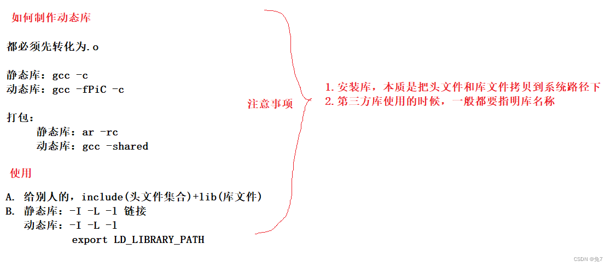

# CTOOL

# 1 [gcc](https://subingwen.cn/linux/gcc/)

**GCC 是 Linux 下的编译工具集**，是 GNU Compiler Collection 的缩写，包含 gcc、g++ 、gcj（编译java）等编译器。这个工具集不仅包含编译器，还包含其他工具集，例如 ar、nm 等。

GCC 工具集不仅能编译 C/C++ 语言，其他例如 Objective-C、Pascal、Fortran、Java、Ada 等语言均能进行编译。GCC 在可以根据不同的硬件平台进行编译，即能进行交叉编译，在 A 平台上编译 B 平台的程序，支持常见的 X86、ARM、PowerPC、mips 等，以及 Linux、Windows 等软件平台。

## 安装gcc

```bash
# 安装软件必须要有管理员权限
# ubuntu
$ sudo apt update   		# 更新本地的软件下载列表, 得到最新的下载地址
$ sudo apt install gcc g++	# 通过下载列表中提供的地址下载安装包, 并安装

# centos
$ sudo yum update   		# 更新本地的软件下载列表, 得到最新的下载地址
$ sudo yum install gcc g++	# 通过下载列表中提供的地址下载安装包, 并安装

# 查看 gcc 版本
$ gcc -v
$ gcc --version

# 查看 g++ 版本
$ g++ -v
$ g++ --version
```

## gcc工作流

分为 4 个阶段：预处理（预编译）、编译和优化、汇编和链接

- 预处理：在这个阶段主要做了三件事: 展开头文件 、宏替换 、去掉注释行，**生成 .i 文件**
  - 这个阶段需要 GCC 调用预处理器来完成，最终得到的还是源文件，文本格式
- 编译：这个阶段需要 GCC 调用编译器对文件进行编译，最终得到一个汇编文件，**生成 .s 文件**
- 汇编：这个阶段需要 GCC 调用汇编器对文件进行汇编，最终得到一个二进制文件，**生成  .o 文件**
- 链接：这个阶段需要 GCC 调用链接器对程序需要调用的库进行链接，最终得到一个可执行的二进制文件

```bash
# 1. 预处理, -o 指定生成的文件名
$ gcc -E test.c -o test.i
# 2. 编译, 得到汇编文件
$ gcc -S test.i -o test.s

# 3. 汇编，生成.o文件
# -c 选项并非只能用于加工 .s 文件。
# 事实上，-c 选项只是令 GCC 编译器将指定文件加工至汇编阶段，但不执行链接操作。
# gcc -c *c/*.i/*.s 都可以
$ gcc -c test.s -o test.o

# 4. 链接
$ gcc test.o -o test
```

## gcc常用参数

| gcc 编译选项                                | 选项的意义                                                   |
| ------------------------------------------- | ------------------------------------------------------------ |
| -E                                          | 预处理指定的源文件，不进行编译                               |
| -S                                          | 编译指定的源文件，但是不进行汇编                             |
| -c                                          | 编译、汇编指定的源文件，但是不进行链接                       |
| -o [file1] [file2] <br />[file2] -o [file1] | 将文件 file2 编译成文件 file1，指定生成文件的文件名          |
| -I directory                                | 大写的 i，指定 include 头文件的搜索目录                      |
| -g                                          | 在编译的时候，生成调试信息，该程序可以被调试器调试           |
| -D                                          | 在程序编译的时候，指定一个宏                                 |
| -w                                          | 不生成任何警告信息，不建议使用，有些时候警告就是错误         |
| -Wall                                       | 生成所有警告信息                                             |
| -On                                         | n 的取值范围：0~3。编译器的优化选项的 4 个级别<br />-O0 表示没有优化，-O1 为缺省值，-O3 优化级别最高 |
| -l                                          | 在程序编译的时候，指定使用的库                               |
| -L                                          | 指定编译的时候，搜索的库的路径。（指定链接时，要引入的库目录） |
| -fPIC/fpic                                  | 生成与位置无关的代码，<br />代码在加载到内存时使用相对地址，所有对固定地址的访问都通过全局偏移表(GOT)来实现。 |
| -shared                                     | 生成共享目标文件。通常用在建立共享库时                       |
| -std                                        | 指定 C 方言，如:-std=c99，gcc 默认的方言是 GNU C             |
| `-Wl,<options> `                            | `Pass comma-separated <options> on to the linker`，<br />将逗号分割的选项传递给链接器 |
| `-Wp,<options>`                             | `Pass comma-separated <options> on to the preprocessor`      |
| `-Wa,<options>`                             | `Pass comma-separated <options> on to the assembler`         |
|                                             |                                                              |
|                                             |                                                              |

- -D 参数的应用场景:

  - 在发布程序的时候，一般都会要求将程序中所有的 log 输出去掉，如果不去掉会影响程序的执行效率，很显然删除这些打印 log 的源代码是一件很麻烦的事情，解决方案是这样的：

  - ```c
    // 如果DEBUG宏存在，那么就打印，输出日志
    #ifdef DEBUG
        printf("我是一个程序猿, 我不会爬树...\n");
    #endif
    ```

  - ```bash
    # -D,用于假定DEBUG这个宏存在
    $ gcc test.c -o app -D DEBUG
    ```

  - 将所有的打印 log 的代码都写到一个宏判定中，可以模仿上边的例子
    在编译程序的时候指定 -D 就会有 log 输出
    在编译程序的时候不指定 -D, log 就不会输出

- --as-needed和--no-as-needed 

  ```bash
  gcc -o my_program my_program.o -lmy_library --as-needed -ldependency1 --no-as-needed -ldependency2
  ```

### Wl参数

将-Wl参数后以逗号分割的选项传递给链接器

- [-soname(简单共享名，Short for shared object name)](https://blog.csdn.net/dielucui7698/article/details/101400429)，会影响生成动态库属性中的soname，一般用来将简短软链接指定到具体版本的库。

- [--as-needed和--no-as-needed](https://www.cnblogs.com/OCaml/archive/2012/06/18/2554086.html#sec-1-4-1)

  - **--as-needed**，动态库在需要时才被链接，只给用到的动态库设置DT_NEEDED（会影响生成的elf文件中的NEEDED标签）。
  - **--no-as-needed **，无论库是否被需要都会被链接

  ```bash
  g++ -shared  PyGalaxy.o -lGalaxyParser -lxxx  -lrt  -o PyGalaxy.so
  # 这样链接一个PyGalaxy.so的时候，假设PyGalaxy.so里面用到了libGalaxyParser.so但是没 有用到libxxx.so。查看依赖关系如下：
  readelf -d PyGalaxy.so 
  
  Dynamic section at offset 0x7dd8 contains 26 entries:
    Tag        Type                         Name/Value
   0x0000000000000001 (NEEDED)             Shared library: [libGalaxyParser.so]
   0x0000000000000001 (NEEDED)             Shared library: [libxxx.so]
   # 发现没有用到的libxxx.so也被打上了NEEDED标签。
   
   
   g++ -shared  -Wl,--as-needed PyGalaxy.o -lGalaxyParser -lxxx  -lrt  -o PyGalaxy.so
   # 开启–as-needed的时候
   readelf -d PyGalaxy.so 
  
  Dynamic section at offset 0x7dd8 contains 26 entries:
    Tag        Type                         Name/Value
   0x0000000000000001 (NEEDED)             Shared library: [libGalaxyParser.so]
   # 发现NEEDED标签中已经没有libxxx.so了，说明needed生效。
   # –as-needed就是忽略链接时没有用到的动态库，只将用到的动态库set NEEDED。
   
   
   # 开启–as-needed的一些常见的问题：
   # 1. 链接主程序模块或者是静态库的时的‘undefined reference to: xxx’
   g++ -Wl,--as-needed -lGalaxyRT -lc -lm -ldl -lpthread   -L/home/ocaml/lib/  -lrt -o mutex mutex.o
   # 假设mutex依赖libGalaxyRT.so中的东西。想想，因为gcc对库的顺序要求 和–as-needed（因为libGalaxyRT.so在mutex.o的左边，所以gcc认为没有 用到它，–as-needed将其忽略），ld忽略libGalaxyRT.so，定位mutex.o的 符号的时候当然会找不到符号的定义！所以‘undefined reference to’这个 错误是正常地
   # 故正确的写法是：
   g++ -Wl,--as-needed mutex.o -lGalaxyRT -lc -lm -ldl -lpthread   -L/home/ocaml/lib/  -lrt -o mutex
   
   # 对链接顺序导致问题的解决方案。
   # 在项目开发过层中尽量让lib是垂直关系，避免循环依赖；越是底层的库，越是往后面写
   g++ ...  obj($?) -l(上层逻辑lib) -l(中间封装lib) -l(基础lib) -l(系统lib)  -o $@
   # 这样写可以避免很多问题，这个是在搭建项目的构建环境的过程中需要考虑 清楚地，在编译和链接上浪费太多的生命不值得
  ```

  

- --copy-dt-needed-entries和--no-copy-dt-needed-entries

  - 可执行文件会有它的依赖库（直接的，一级的）。而这些依赖库也有它自己的依赖库（可执行文件的间接的，二级的）
  - 链接器通常不会将二级依赖添加进入可执行文件的NEEDED列表中去，然而，在命令行上指定--copy-dt-needed-entries后，任何在命令行中跟随在此参数后面的库，都将添加NEEDED
  -  使用 --copy-dt-needed-entries 将递归搜索命令行上提到的动态库，遵循其 DT_NEEDED 标签到其他库，以便解析输出二进制文件所需的符号。 


### gcc指定Rpath

```bash
gcc -o test test.c -I. -L. -lc -Wl,-rpath=.   

#-I. 是指定头文件路径为当前目录下;
#-L. 是指定库文件路径为当前目录下;
#-lc 是从-L指定库文件路径下去找libc.so.6这个库，也就是库名砍头去尾(类似使用过-lpthread);

# -Wl,-rpath=. 为告诉编译器将后面的参数传递给链接器
```

[【gcc编译选项】-L、-Wl 的区别（运行时无法链接到动态库）](https://blog.csdn.net/challenglistic/article/details/129687387)

## 编译运行

```bash
# 一步到位
# 直接生成可执行程序 test
$ gcc -o test string.c main.c
# 运行可执行程序
$ ./test

# 两步走
# 汇编生成二进制目标文件, 指定了 -c 参数之后, 源文件会自动生成 string.o 和 main.o
$ gcc –c string.c main.c
# 链接目标文件, 生成可执行程序 test
$ gcc –o test string.o main.o
# 运行可执行程序
$ ./test


```

## gcc与g++

1. 在代码编译阶段（第二个阶段）:
   - 后缀为 .c 的，gcc 把它当作是 C 程序，而 g++ 当作是 C++ 程序
   - 后缀为.cpp 的，两者都会认为是 C++ 程序，C++ 的语法规则更加严谨一些
   - g++ 会调用 gcc，对于 C++ 代码，两者是等价的，也就是说 gcc 和 g++ 都可以编译 C/C++ 代码
2. 在链接阶段（最后一个阶段）:
   - gcc 和 g++ 都可以自动链接到标准 C 库
   - g++ 可以自动链接到标准 C++ 库，gcc 如果要链接到标准 C++ 库需要加参数 -lstdc++
3. 关于 `__cplusplus` 宏的定义
   1. g++ 会自动定义`__cplusplus` 宏，但是这个不影响它去编译 C 程序
   2. gcc 需要根据文件后缀判断是否需要定义` __cplusplus `宏 （规则参考第一条）

综上所述：

- 不管是 gcc 还是 g++ 都可以编译 C 程序，编译程序的规则和参数都相同
- g++ 可以直接编译 C++ 程序， gcc 编译 C++ 程序需要添加额外参数 -lstdc++
- 不管是 gcc 还是 g++ 都可以定义 __cplusplus 宏


## [pkg-config](https://blog.csdn.net/chen_jianjian/article/details/123890413)

```bash
pkg-config <options> <library-name>
```


大家应该都知道一般用第三方库的时候，就少不了要使用到第三方的头文件和库文件。我们在编译、链接的时候，必须要指定这些头文件和库文件的位置。对于一个比较大的第三方库，其头文件和库文件的数量是比较多的，如果我们一个个手动地写，那将是相当的麻烦的。因此，pkg-config就应运而生了。pkg-config能够把这些头文件和库文件的位置指出来，给编译器使用。pkg-config主要提供了下面几个功能：

- 检查库的版本号。 如果所需要的库的版本不满足要求，它会打印出错误信息，避免链接错误版本的库文件
- 获得编译预处理参数，如宏定义、头文件的位置
- 获得链接参数，如库及依赖的其他库的位置，文件名及其他一些链接参数
- 自动加入所依赖的其他库的设置

pkg-config 的原理：

- 默认去/usr/lib/pkconfig/下去找.pc，如果你还有其它路径存放.pc文件，可以添加PKG_CONFIG_PATH环境变量，以告知pkg-config 那些.pc文件的位置
- .pc文件中包含有包的相关信息

```bash
# $PKG_CONFIG_PATH 默认为 /usr/lib/pkconfig/
echo $PKG_CONFIG_PATH

# 修改它的环境变量/etc/profile
vim /etc/profile
# 尾部插入一行
export PKG_CONFIG_PATH=$PKG_CONFIG_PATH:/usr/lib/x86_64-linux-gnu/pkgconfig/:/usr/local/lib/pkgconfig/
source /etc/profile

# 可以在/usr/lib/x86_64-linux-gnu/pkgconfig路径下查看大量的.pc
/usr/lib/x86_64-linux-gnu/pkgconfig# ls
IlmBase.pc       glesv1_cm.pc              gthread-2.0.pc       libbrotlicommon.pc  libglvnd.pc         libpcrecpp.pc              libtirpc.pc       pciaccess.pc       wayland-scanner.pc  xi.pc
OpenEXR.pc       glesv2.pc                 harfbuzz-gobject.pc  libbrotlidec.pc     libgphoto2.pc       libpcreposix.pc            libudev.pc        pthread-stubs.pc   wayland-server.pc   xinerama.pc
alsa.pc          glib-2.0.pc               harfbuzz-icu.pc      libbrotlienc.pc     libgphoto2_port.pc  libpng.pc                  libva-drm.pc      sdl2.pc            x11.pc              xkbcommon.pc
blkid.pc         glu.pc                    harfbuzz.pc          libcrypt.pc         libidn2.pc          libpng16.pc                libva-glx.pc      sm.pc              x264.pc             xrandr.pc
dbus-1.pc        glx.pc                    hogweed.pc           libdc1394-2.pc      libjpeg.pc          libpulse-mainloop-glib.pc  libva-wayland.pc  sndio.pc           xau.pc              xrender.pc
egl.pc           gmodule-2.0.pc            ibus-1.0.pc          libdecor-0.pc       liblzma.pc          libpulse-simple.pc         libva-x11.pc      tbb.pc             xcb-render.pc       xscrnsaver.pc
expat.pc         gmodule-export-2.0.pc     ice.pc               libdeflate.pc       libnsl.pc           libpulse.pc                libva.pc          uuid.pc            xcb-shape.pc        xt.pc
fontconfig.pc    gmodule-no-export-2.0.pc  icu-i18n.pc          libdrm.pc           libpcre.pc          libraw1394.pc              libxcrypt.pc      vdpau.pc           xcb-shm.pc          xv.pc
freetype2.pc     gmp.pc                    icu-io.pc            libdrm_amdgpu.pc    libpcre16.pc        libselinux.pc              mount.pc          vorbis.pc          xcb-xfixes.pc       xxf86vm.pc
fribidi.pc       gmpxx.pc                  icu-uc.pc            libdrm_intel.pc     libpcre2-16.pc      libsepol.pc                nettle.pc         vorbisenc.pc       xcb.pc              zlib.pc
gbm.pc           gnutls-dane.pc            libass.pc            libdrm_nouveau.pc   libpcre2-32.pc      libswresample.pc           ogg.pc            vorbisfile.pc      xcursor.pc
gio-2.0.pc       gnutls.pc                 libavcodec.pc        libdrm_radeon.pc    libpcre2-8.pc       libswscale.pc              opencv4.pc        wayland-client.pc  xdmcp.pc
gio-unix-2.0.pc  gobject-2.0.pc            libavformat.pc       libexif.pc          libpcre2-posix.pc   libtasn1.pc                opengl.pc         wayland-cursor.pc  xext.pc
gl.pc            graphite2.pc              libavutil.pc         libffi.pc           libpcre32.pc        libtiff-4.pc               p11-kit-1.pc      wayland-egl.pc     xfixes.pc


# 查看opencv所依赖的头文件和库文件
pkg-config --libs --cflags opencv4
-I/usr/include/opencv4 -lopencv_stitching -lopencv_alphamat -lopencv_aruco -lopencv_barcode -lopencv_bgsegm -lopencv_bioinspired -lopencv_ccalib -lopencv_dnn_objdetect -lopencv_dnn_superres -lopencv_dpm -lopencv_face -lopencv_freetype -lopencv_fuzzy -lopencv_hdf -lopencv_hfs -lopencv_img_hash -lopencv_intensity_transform -lopencv_line_descriptor -lopencv_mcc -lopencv_quality -lopencv_rapid -lopencv_reg -lopencv_rgbd -lopencv_saliency -lopencv_shape -lopencv_stereo -lopencv_structured_light -lopencv_phase_unwrapping -lopencv_superres -lopencv_optflow -lopencv_surface_matching -lopencv_tracking -lopencv_highgui -lopencv_datasets -lopencv_text -lopencv_plot -lopencv_ml -lopencv_videostab -lopencv_videoio -lopencv_viz -lopencv_wechat_qrcode -lopencv_ximgproc -lopencv_video -lopencv_xobjdetect -lopencv_objdetect -lopencv_calib3d -lopencv_imgcodecs -lopencv_features2d -lopencv_dnn -lopencv_flann -lopencv_xphoto -lopencv_photo -lopencv_imgproc -lopencv_core
```


- pkg-config: 编译时、 链接时
- LD_LIBRARY_PATH: 链接时、 运行时

# 2 [动静态库](https://blog.csdn.net/weixin_69725192/article/details/125986479)

[参考地址1](https://blog.csdn.net/qq_45489600/article/details/124640807)

[苏丙榅](https://subingwen.cn/linux/library/)

动态库和静态库

- 静态库（.a）：程序在编译链接的时候把库的代码链接到可执行文件中。程序运行的时候将不再需要静态库。
  - 静态库的后缀名是.a（a是archive的缩写，也就是文档文件），是一个文档，然后解压缩，将其解压缩至当前目录，进入目录中，里面都是以.o后缀名的文件
- 动态库（.so）：程序在运行的时候才去链接动态库的代码，多个程序共享使用库的代码。
- 一个与动态库链接的可执行文件仅仅包含它用到的函数入口地址的一个表，而不是外部函数所在目标文件的整个机器码。
- 在可执行文件开始运行以前，外部函数的机器码由操作系统从磁盘上的该动态库中复制到内存中，这个过程称为动态链接（dynamic linking）。
- 动态库可以在多个程序间共享，所以动态链接使得可执行文件更小，节省了磁盘空间。操作系统采用虚拟内存机制允许物理内存中的一份动态库被要用到该库的所有进程共用，节省了内存和磁盘空间。


环境：

- 生成add.h，add.c，
- 生成sub.h，sub.c
- linux下，gcc，ar，工具

```c
//add.h
#pragma once
#include<stdio.h>

extern int my_add(int x, int y);

//add.c
#include "add.h"

int my_add(int x, int y) {
	return x + y;
}

//sub.h
#pragma once
#include<stdio.h>

extern int my_sub(int x, int y);

//sub.c
#include "sub.h"

int my_sub(int x, int y) {
	return x - y;
}
```


## 2.1 静态库

### 2.1.1 生成静态库

**生成静态库的工具是 ar 。**

```bash
gcc -c add.c
gcc -c sub.c
ar -rc libcal.a add.o sub.o

# 生成静态库
# libcal.a，lib是前缀，.a是后缀，库名cal
```

### 2.1.2 给别人使用

```bash
mkdir -p mathlib/lib
mkdir -p mathlib/include
cp *.a mathlib/lib
cp *.h  mathlib/include

#生成了一个mathlib的文件
#mathlib
#	|__include
#	|	|__add.h
#	|	\__sub.h
#	|
#	|__lib
#		\__libcal.a
```


### 2.1.3 如何使用

代码中使用：

```c
//test.c
#include<stdio.h>
#include<add.h>
int main(){
    int x = 10, y = 10;
    int z = my_add(x, y);
    printf("z=%d",z);
    return 0;
}
```

编译代码

```bash
gcc test.c -I ./mathlib/include -L ./mathlib/lib -l cal -o mytest
# -I，指定头文件位置
# -L，指定库文件位置（函数实现位置）
# -l，指定库名cal
# 生成可执行程序mytest.out

#那么我们如果不想使用这么多选项也是可以的。
#我们之所以要使用这么多选项是因为我们自己实现的头文件和库没有在系统里，如果把我们的头文件和库拷贝到系统路径下，那么我们也就不需要带那些选项了
sudo cp mathlib/include/* /usr/include/
sudo cp mathlib/lib/libcal.a /lib64

# 编译的时候依旧要带库文件的名字
gcc test.c -l cal -o mytest

# 编译完成后，就可以直接运行
./mytest
```

## 2.2 动态库

### 2.2.1 生成动态库

**生成动态库就不用 ar 了，直接就 gcc 或者 g++ 。**

- **shared: 表示生成共享库格式**
- **fPIC：产生位置无关码(position independent code)**
- **库名规则：libxxx.so**

```bash
gcc -fPIC -c add.c
gcc -fPIC -c sub.c
gcc -shared -o libcal.so add.o sub.o
```

### 2.2.2 打包给别人用

```bash
#生成了一个mathlib的文件
#mlib
#	|__include
#	|	|__add.h
#	|	\__sub.h
#	|
#	|__lib
#		\__libcal.so
```

### 2.2.3 如何使用

```bash
# 编译
gcc test.c -I mlib/include/ -L mlib/lib/ -l cal -o mytest
# -I，指定头文件位置
# -L，指定库文件位置（函数实现位置）
# -l，指定库名cal
# 生成可执行程序mytest.out

# 指定动态库查找位置
# 因为是动态库，所以可执行程序中并没有包含要执行的函数，需要告诉环境，动态库在哪找
# 这里有三种方法：
# 1.将这个 libcal.so 这个库拷贝到系统路径下(不推荐)
# 2.在系统中做配置(ldconfig 配置/etc/ld.so.conf.d/，ldconfig更新)
# 3.导出一个环境变量 LD_LIBRARY_PATH ，它代表的是程序运行时，动态查找库时所要搜索的路径。
export LD_LIBRARY_PATH=$LD_LIBRARY_PATH:/home/mylib/lib/

# 然后就可以运行了
./mytest 
```

#### [/etc/ld.so.conf.d](https://zhuanlan.zhihu.com/p/569404946)

[原文](https://www.cnblogs.com/chris-cp/p/3591306.html)

/etc/ld.so.conf 此文件记录了编译时使用的动态库的路径，也就是加载so库的路径。

默认情况下，编译器只会使用/lib和/usr/lib这两个目录下的库文件，而通常通过源码包进行安装时，如果不指定--prefix，就会将库安装在/usr/local目录下。在此情况下，如果又没有在文件/etc/ld.so.conf中添加/usr/local/lib这个目录，这样虽然安装了源码包，但是使用时仍然找不到相关的.so库，就会报错。也就是说系统不知道安装了源码包。

对于此情况有2种解决办法：

- 在用源码安装时，用--prefix指定安装路径为/usr/lib。这样的话也就不用配置PKG_CONFIG_PATH
- 直接将路径/usr/local/lib路径加入到文件/etc/ld.so.conf文件的中。在文件/etc/ld.so.conf中末尾直接添加：/usr/local/lib（这个方法给力！），然后执行ldconfig命令，将动态库

### 2.2.4 **ldconfig**

 ldconfig是linux提供的动态库配置工具，主要用来完成两个工作：

- 配置动态库的搜索路径。
- 加载动态库到系统缓存。

ldconfig这个程序，位于/sbin下，它的作用是将文件/etc/ld.so.conf列出的路径下的库文件缓存到/etc/ld.so.cache（**此文件保存有已排好序的动态链接库名字列表。**）以供使用，因此当安装完一些库文件，或者修改/etc/ld.so.conf增加了库的新的搜索路径，需要运>行一下ldconfig，使所有的库文件都被缓存到文件/etc/ld.so.cache中，如果没做，可能会找不到刚安装的库。

```bash
# 法一：在ld.so.conf最后添加一行
/usr/local/yolo

# 法二：在/etc/ld.so.conf.d/下面新建一个xxx.conf，写入你需要添加的动态库存放地址
/usr/local/yolo
# 当然你必须确保ld.so.conf包含以下内容
include /etc/ld.so.conf.d/*.conf

# 写完之后，必须执行ldconfig，否则ld.so.cache里面没有刚刚写入的地址
ldconfig

# 检查是否生效
ldconfig -p | grep yolov8
	libyolov8.so (libc6,x86-64) => /usr/local/yolo/libyolov8.so
```

```bash
 # -p或--print-cache：此选项指示ldconfig打印出当前缓存文件所保存的所有共享库的名字。
 ldconfig -p | grep opencv
 
 ldconfig可用的选项说明如下：
(1) -v或—verbose： 用此选项时，ldconfig将显示正在扫描的目录及搜索到的动态链接库，还有它所创建的连接的名字。
(2) –n：用此选项时，ldconfig仅扫描命令行指定的目录，不扫描默认目录(/lib、/usr/lib)，也不扫描配置文件/etc/ld.so.conf所列的目录。
(3) –N：此选项指示ldconfig不重建缓存文件(/etc/ld.so.cache)。若未用-X选项，ldconfig照常更新文件的连接。
(4) –X：此选项指示ldconfig不更新文件的连接。若未用-N选项，则缓存文件正常更新。
(5) -f CONF：此选项指定动态链接库的配置文件为CONF，系统默认为/etc/ld.so.conf。
(6) -C CACHE：此选项指定生成的缓存文件为CACHE(系统默认的是/etc/ld.so.cache，此文件存放已排好序的可共享的动态链接库的列表)。
(7) -r ROOT：此选项改变应用程序的根目录为ROOT(是调用chroot函数实现的)。选择此项时，系统默认的配置文件/etc/ld.so.conf，实际对应的为 ROOT/etc/ld.so.conf。如用-r/usr/zzz时，打开配置文件/etc/ld.so.conf时，实际打开的是/usr/zzz/etc/ld.so.conf文件。用此选项，可以大大增加动态链接库管理的灵活性。
(8) –l：通常情况下，ldconfig搜索动态链接库时将自动建立动态链接库的连接。选择此项时，将进入专家模式，需要手工设置连接。一般用户不用此项。
(9) -p或--print-cache：此选项指示ldconfig打印出当前缓存文件所保存的所有共享库的名字。
(10) -c FORMAT 或 --format=FORMAT：此选项用于指定缓存文件所使用的格式，共有三种：ld(老格式)、new(新格式)和compat(兼容格式,此为默认格式)。
(11) –V：此选项打印出ldconfig的版本信息，而后退出。
(12) - 或 --help 或 –usage：这三个选项作用相同，都是让ldconfig打印出其帮助信息（使用方法），而后退出。
```

#### eg

```bash
# 参考：https://blog.csdn.net/weixin_34202952/article/details/91871191

# 示例：
# 有三个动态库文件 libtest.1.so，libtest.2.so，libtest.3.so，并且这三个动态库的SONAME(简单共享名，Short for shared object name)都是 libtest.so。
# 默认情况下：执行 $ ，会搜索 /etc/ld.so.conf 文件下配置的所有路径，更新软链，并更新 /etc/ld.so.cache 文件。
ldconfig

# -n directory，扫描指定目录directory下的所有so，根据文件名中的最新版本号，更新软链，并更新 /etc/ld.so.cache文件。
ldconfig -n ./    # 生成 libtest.so，libtest.so是一个软链接，指向版本号最大的动态库 libtest.3.so
 ls -al
-rwxrwxr-x 1 yepanl yepanl 8612 Oct  8 11:38 libtest.1.so
-rwxrwxr-x 1 yepanl yepanl 8612 Oct  8 11:38 libtest.2.so
-rwxrwxr-x 1 yepanl yepanl 8612 Oct  8 11:38 libtest.3.so
lrwxrwxrwx 1 yepanl yepanl 12 Oct  9 16:56 libtest.so -> libtest.3.so

# -l src dest选项：重新指定软链的连接目标，手动指定
ldconfig -l libtest.so libtest.2.so    # 指定 libtest.so 链接到 libtest.2.so
ls -al
-rwxrwxr-x 1 yepanl yepanl 8612 Oct  8 11:38 libtest.1.so
-rwxrwxr-x 1 yepanl yepanl 8612 Oct  8 11:38 libtest.2.so
-rwxrwxr-x 1 yepanl yepanl 8612 Oct  8 11:38 libtest.3.so
lrwxrwxrwx 1 yepanl yepanl 12 Oct  9 16:59 libtest.so -> libtest.2.so

```


## 2.3 总结



## 2.4 [动态链接库dll](https://zhuanlan.zhihu.com/p/490440768?utm_id=0)

dynamic linking library

加载动态库有两种方式：分为隐式加载和显示加载。

- 隐式加载：
  - 所需文件：接口.h头文件，dll文件，lib文件。.h和.lib加载方式与静态加载完全一致。但.dll文件必须放在环境变量指定的目下。当然通常是与目标.exe文件放在一起。

- 显式加载：
  - 所需文件：dll文件。
  - 利用LoadLibrary（）函数进行加载。

## 2.5 [ubuntu动态库加载优先级](https://blog.csdn.net/weixin_35804181/article/details/131652982)

加载的路径：

- 默认库加载路径，如：/lib 和/usr/lib
- ldconfig指定加载路径：通过配置文件 /etc/ld.so.conf 中指定动态库搜索路径
- 编译指定加载路径：在编译目标代码时指定该程序的动态库搜索路径，通过 gcc 的参数 “-Wl,-rpath,”
- 环境变量指定加载路径：通过环境变量 LD_LIBRARY_PATH 指定动态库搜索路径


加载顺序：

动态库的加载搜索优先级，由高到低：

- 编译指定加载路径
- 环境变量指定加载路径（LD_LIBRARY_PATH）
- ldconfig指定加载路径
- 默认库加载路径

说明：

 “/usr/local/lib”和“/usr/local/lib/x86_64-linux-gnu、/lib/x86_64-linux-gnu和/usr/lib/x86_64-linux-gnu都是是ldconfig指定加载路径，位置分别在/etc/ld.so.conf.d/libc.conf和/etc/ld.so.conf.d/x86_64-linux-gnu.conf。

# 3 [makefile](https://blog.csdn.net/weixin_38391755/article/details/80380786)

gcc在编译单个文件是比较方便的，而在工程结构下拥有大量文件，此时gcc变得力不从心。

一个工程中的源文件不计数，其按类型、功能、模块分别放在若干个目录中，makefile定义了一系列的规则来指定，哪些文件需要先编译，哪些文件需要后编译，哪些文件需要重新编译，甚至于进行更复杂的功能操作。

其实，在Windows的IDE内部为我们做了make的工作

## 3.0 基础

###  3.0.1 规则简介

Makefile 的框架是由规则构成的。make 命令执行时先在 Makefile 文件中查找各种规则，对各种规则进行解析后运行规则。规则的基本格式为：

```bash
# 每条规则的语法格式:
target1,target2...: depend1, depend2, ...
	command
	......
	......
```

每条规则由三个部分组成分别是**目标(target)， 依赖(depend) 和命令(command)。**

- 命令：当前这条规则的动作，一般情况下这个动作就是一个 shell 命令
  - 例如：通过某个命令编译文件、生成库文件、进入目录等。
  - 动作可以是多个，**每个命令前必须有一个Tab缩进并且独占占一行。**
- 依赖：规则所必需的依赖条件，在规则的命令中可以使用这些依赖。
  - 例如：生成可执行文件的目标文件（*.o）可以作为依赖使用
  - 如果规则的命令中不需要任何依赖，那么规则的依赖可以为空
  - **当前规则中的依赖可以是其他规则中的某个目标，这样就形成了规则之间的嵌套**
  - 依赖可以根据要执行的命令的实际需求，指定很多个
- 目标： 规则中的目标，这个目标和规则中的命令是对应的，**目标一般是一个文件**
  - targets是文件名，以空格分开，可以使用通配符。
  - 通过执行规则中的命令，可以生成一个和目标同名的文件
  - 规则中可以有多个命令，因此可以通过这多条命令来生成多个目标，所有目标也可以有很多个
  - 通过执行规则中的命令，可以只执行一个动作，不生成任何文件，这样的目标被称为伪目标

```makefile
edit : main.o kbd.o command.o display.o \
          insert.o search.o files.o utils.o
	cc -o edit main.o kbd.o command.o display.o \
		insert.o search.o files.o utils.o

main.o : main.c defs.h
	cc -c main.c

kbd.o : kbd.c defs.h command.h
	cc -c kbd.c

command.o : command.c defs.h command.h
	cc -c command.c

display.o : display.c defs.h buffer.h
	cc -c display.c

insert.o : insert.c defs.h buffer.h
	cc -c insert.c

search.o : search.c defs.h buffer.h
	cc -c search.c

files.o : files.c defs.h buffer.h command.h
	cc -c files.c

utils.o : utils.c defs.h
	cc -c utils.c

clean :
	rm edit main.o kbd.o command.o display.o \
		insert.o search.o files.o utils.o
```

**反斜杠（\）**是换行符的意思。

### 3.0.2 make原理

1. make会在当前目录下找名字叫“Makefile”或“makefile”的文件。（父子makefile的名称必须一致，不能一个首字母大写，一个首字母小写。）
2. 如果找到，它会找文件中的第一个规则的目标文件（target），在上面的例子中，他会找到“edit”这个文件，并把这个文件作为最终的目标文件。
3. 如果edit文件不存在，或是edit所依赖的后面的 .o 文件的文件修改时间要比edit这个文件新（目标更新时间<依赖时间），那么，他就会执行后面所定义的命令来生成edit这个文件。
4. 如果edit所依赖的.o文件也存在，那么make会在当前文件中找目标为.o文件的依赖性，如果找到，则再对比目标和依赖的更新时间，如果目标<依赖，那么执行命令重新生成.o文件。
5. 当然，你的C文件和H文件是存在的啦，于是make会生成 .o 文件，然后再用 .o 文件声明make的终极任务，也就是执行文件edit了。

这就是整个make的依赖性（依赖链），make会一层又一层地去找文件的依赖关系，直到最终编译出第一个规则的目标文件。

如果通过依赖链也解决不了依赖缺失的问题（依赖文件依旧不存在），就不再工作。

在找寻的过程中，如果出现错误，比如最后被依赖的文件找不到，那么make就会直接退出，并报错，而对于所定义的命令的错误，或是编译不成功，make根本不理。

### 3.0.3 使用变量

变量的使用如同宏定义一样，替换每一处使用到变量的地方

```makefile
objects = main.o kbd.o command.o display.o \
             insert.osearch.o files.o utils.o 
   edit : $(objects)
           cc -o edit $(objects)
   main.o : main.c defs.h
           cc -c main.c
           
           。。。。
```

### 3.0.4 自动推导

GNU的make很强大，它可以自动推导文件以及文件依赖关系后面的命令，于是我们就没必要去在每一个[.o]文件后都写上类似的命令，因为，我们的make会自动识别，并自己推导命令。

  只要make看到一个[.o]文件，它就会自动的把[.c]文件加在依赖关系中，如果make找到一个whatever.o，那么whatever.c，就会是whatever.o的依赖文件。并且 cc -c whatever.c 也会被推导出来，于是，我们的makefile再也不用写得这么复杂。我们的是新的makefile又出炉了。

```makefile
   objects = main.o kbd.o command.o display.o \
             insert.o search.o files.o utils.o
 
   edit : $(objects)
           cc -o edit $(objects)
 
   main.o : defs.h
   kbd.o : defs.h command.h
   command.o : defs.h command.h
   display.o : defs.h buffer.h
   insert.o : defs.h buffer.h
   search.o : defs.h buffer.h
   files.o : defs.h buffer.h command.h
   utils.o : defs.h
 
   .PHONY : clean
   clean :
           rm edit $(objects)
```

这种方法，也就是make的“隐晦规则”。上面文件内容中，“.PHONY”表示，clean是个伪目标文件。

### 3.0.5 另类风格的makefile

那么我看到那堆[.o]和[.h]的依赖依旧不爽，那么多的重复的[.h]，能不能把其**收拢起来**

```makefile
   objects = main.o kbd.o command.o display.o \
             insert.o search.o files.o utils.o
 
   edit : $(objects)
           cc -o edit $(objects)
 
   $(objects) : defs.h
   kbd.o command.o files.o : command.h
   display.o insert.o search.o files.o : buffer.h
 
   .PHONY : clean
   clean :
           rm edit $(objects)
```

### 3.0.6 清空目标文件的规则

每个Makefile中都应该写一个清空目标文件（.o和执行文件）的规则，这不仅便于重编译，也很利于保持文件的清洁。这是一个“修养”。

```makefile
# 一般的风格都是：
clean:
	rm edit $(objects)
	
# 更为稳健的做法
.PHONY : clean
clean :
	-rm edit $(objects)

# PHONY意思表示clean是一个“伪目标”。
# 而在rm命令前面加了一个小减号的意思就是，也许某些文件出现问题，但不要管，继续做后面的事。
# 当然，clean的规则不要放在文件的开头，不然，这就会变成make的默认目标，相信谁也不愿意这样。
# 不成文的规矩是——“clean从来都是放在文件的最后”。
```

### 3.0.7 注释符

如果某行的第一个非空字符为 #，则此行会被 make 解释为注释行。

如果#号以tab开头，makefile虽然不会执行，但是会回显到终端上。

建议在书写 makefile 时将注释作为一个独立的行，而不要和 makefile 的有效行放在同一行中书写。make 有时候会把 # 字符之前的内容作为有效行的内容（如定义变量的时候）。

```makefile
dir = /foo/bar    # directory to put the frobs in
# dir这个变量的值是“/foo/bar”，后面还跟了4个空格，然后再写的注释符#，这时候dir变量的内容里面还包含了4个空格在里面，
# 如果我们这样使用这样变量来指定别的目录——“$(dir)/file”那么就完蛋了，实际得到的是"/foo/bar /file"，路径中带有空格，所以会找不到，无效的。
```


## 3.1 总述

### 3.1.1 makefile主要组成

Makefile里**主要**包含了五个东西：**显式规则、隐晦规则、变量定义、文件指示和注释**

次要：函数

1. 显式规则。显式规则说明了，如何生成一个或多的的目标文件。这是由Makefile的书写者明显指出，要生成的文件，文件的依赖文件，生成的命令。
2. 隐晦规则。由于我们的make有自动推导的功能，所以隐晦的规则可以让我们比较粗糙地简略地书写Makefile，这是由make所支持的。
3. 变量的定义。在Makefile中我们要定义一系列的变量，变量一般都是字符串，这个有点你C语言中的宏，当Makefile被执行时，其中的变量都会被扩展到相应的引用位置上。
4. 文件指示。其包括了三个部分，一个是在一个Makefile中引用另一个Makefile，就像C语言中的include一样；另一个是指根据某些情况指定Makefile中的有效部分，就像C语言中的预编译#if一样；还有就是定义一个多行的命令。有关这一部分的内容，我会在后续的部分中讲述。
5. 注释。Makefile中只有行注释，和UNIX的Shell脚本一样，其注释是用“#”字符，这个就像C/C++中的“//”一样。如果你要在你的Makefile中使用“#”字符，可以用反斜框进行转义，如：“\#”。

### 3.1.2 makefile文件的命名

make命令会在当前目录下**按顺序找寻**文件名为**“GNUmakefile（GNU的make才能识别）”、“makefile”、“Makefile（推荐）”**的文件，找到了就解释这个文件。

大多数的make都支持“**makefile”和“Makefile”**这两种默认文件名。

如果要使用其他文件名来书写makefile，那么在使用make命令的时候，需要加上`-f or --file`参数，用于指定文件名

```bash
make -f Make.Linux

make --file Make.AIX
```

### 3.1.3 引用其他makefile

在Makefile使用include关键字可以把别的Makefile包含进来，这很像C语言的#include，**被包含的文件会原模原样的放在当前文件的包含位置。**

**在include前面可以有一些空字符，但是绝不能是[Tab]键开始。**

**include和文件之间可以用一个或多个空格隔开。**

```makefile
#你有这样几个Makefile：a.mk、b.mk、c.mk，还有一个文件叫foo.make，以及一个变量$(bar)，其包含了e.mk和f.mk，那么，下面的语句：
include foo.make *.mk $(bar)
#等价于
include foo.make a.mk b.mk c.mk e.mk f.mk
```

**文件查找路径**：

1. 首先当前目录下
2. 如果make执行时，有“-I”或“--include-dir”参数，那么make就会在这个参数所指定的目录下去寻找。
3. 如果目录/include（一般是：/usr/local/bin或/usr/include）存在的话，make也会去找。

如果有文件没有找到的话，make会生成一条警告信息，但不会马上出现致命错误。它会继续载入其它的文件，一旦完成makefile的读取，make会再重试这些没有找到，或是不能读取的文件，如果还是不行，make才会出现一条致命信息。如果你想让make不理那些无法读取的文件，而继续执行，你可以在include前加一个减号“-”。

### 3.1.4 环境变量MAKEFILES

如果你的当前环境中定义了**环境变量MAKEFILES**，**那么，make会把这个变量中的值做一个类似于include的动作。这个变量中的值是其它的Makefile，用空格分隔。**只是，它和include不同的是，从这个环境变中引入的Makefile的“目标”不会起作用，如果环境变量中定义的文件发现错误，make也会不理。

但是在这里我还是建议不要使用这个环境变量，因为只要这个变量一被定义，那么当你使用make时，所有的Makefile都会受到它的影响，这绝不是你想看到的。在这里提这个事，只是为了告诉大家，也许有时候你的Makefile出现了怪事，那么你可以看看当前环境中有没有定义这个变量。

### 3.1.5 makefile的解析流程

1. 读入所有的Makefile。

2. 读入被include的其它Makefile。

3. 初始化文件中的变量。

4. 推导隐晦规则，并分析所有规则。

5. 为所有的目标文件创建依赖关系链。

6. 根据依赖关系，决定哪些目标要重新生成。

7. 执行生成命令。

1-5步为第一个阶段，6-7为第二个阶段。

第一个阶段中，如果定义的变量被使用了，那么，make会把其展开在使用的位置。但make并不会完全马上展开，make使用的是拖延战术，如果变量出现在依赖关系的规则中，那么仅当这条依赖被决定要使用了，变量才会在其内部展开。

当然，这个工作方式你不一定要清楚，但是知道这个方式你也会对make更为熟悉。有了这个基础，后续部分也就容易看懂了。

## 3.2 规则

**makefile的第一个规则的第一个目标**，就是整个makefile的最终编译目标。其他规则和目标都是第一个规则和目标的依赖。

```makefile
# 每条规则的语法格式:
target1,target2...: depend1, depend2, ...
	command
[TAB]......
	......
```

```makefile
foo.o: foo.c defs.h       # foo模块
	cc -c -g foo.c

#1. 文件的依赖关系，foo.o依赖于foo.c和defs.h的文件，如果foo.c和defs.h的文件日期要比foo.o文件日期要新，或是foo.o不存在，那么依赖关系发生。

#2.如果生成（或更新）foo.o文件。也就是那个cc命令，其说明了，如何生成foo.o这个文件。（当然foo.c文件include了defs.h文件）
```

### 3.2.1 make中使用通配符

make支持三个通配符：**“*”，“?”和“[...]”**。这是和Unix的B-Shell是相同的。

还支持**"~"**，这个符号表示家目录。~/test——当前用户的$HOME目录下的test目录，~chen/test——当前用户chen下的test

### 3.2.2 文件搜寻

#### 变量VPATH

在一些大的工程中，有大量的源文件，我们通常的做法是把这许多的源文件分类，并存放在不同的目录中。

所以，当make需要去找寻文件的依赖关系时，你可以在文件前加上路径，但**最好的方法是把一个路径告诉make，让make在自动去找。**

Makefile文件中的**特殊变量“VPATH”就是用于指定文件路径。**

如果没有指明这个变量，make只会在当前的目录中去找寻依赖文件和目标文件。

如果定义了这个变量，那么，make就会在当当前目录找不到的情况下，到所指定的目录中去找寻文件了。

```makefile
VPATH = src:../headers
#首先在当前目录查询，然后再VPATH指定定两个目录，“src”和“../headers”中查询，make会按照这个顺序进行搜索。
#目录由“冒号”分隔。
```

#### 关键字vpath

这不是变量，这是一个make的关键字。

它可以指定不同的文件在不同的搜索目录中。

1. `vpath <pattern> < directories>`   为符合模式`< pattern>`的文件指定搜索目录`<directories>`。
   - < pattern>指定了要搜索的文件集，
     - 需要包含“%”字符。“%”的意思是匹配零或若干字符，例如，“%.h”表示所有以“.h”结尾的文件。
   - < directories>则指定了的文件集的搜索的目录。
     - 多个目录间使用冒号 **:** 相隔

2. `vpath <pattern>  `      清除符合模式`< pattern>`的文件的搜索目录。

3. `vpath`     清除所有已被设置好了的文件搜索目录。

```makefile
# 该语句表示，要求make在“../headers”目录下搜索所有以“.h”结尾的文件。（如果某文件在当前目录没有找到的话）
vpath %.h ../headers

#我们可以连续地使用vpath语句，以指定不同搜索策略。
#如果连续的vpath语句中出现了相同的< pattern>，或是被重复了的< pattern>，那么，make会按照vpath语句的先后顺序来执行搜索。
vpath %.c foo:bar
vpath %   blish
```

### 3.2.3 目标

#### 伪目标

如果害怕伪目标名和文件名重复，可以使用一个特殊的标记“.PHONY”来显示地指明一个目标是“伪目标”。

```makefile
# 伪目标做默认目标
all : prog1 prog2 prog3
.PHONY : all

prog1 : prog1.o utils.o
	cc -o prog1 prog1.o utils.o

prog2 : prog2.o
	cc -o prog2 prog2.o

prog3 : prog3.o sort.o utils.o
	cc -o prog3 prog3.o sort.o utils.o
	
#Makefile中的第一个目标会被作为其默认目标。我们声明了一个“all”的伪目标，其依赖于其它三个目标。由于伪目标的特性是，总是被执行的，所以其依赖的那三个目标就总是不如“all”这个目标新。所以，其它三个目标的规则总是会被决议。也就达到了我们一口气生成多个目标的目的。“.PHONY : all”声明了“all”这个目标为“伪目标”。
```

```makefile
# 伪目标做依赖，达到做子任务的目的
.PHONY: cleanall cleanobj cleandiff

cleanall : cleanobj cleandiff
	rm program

cleanobj :
	rm *.o

cleandiff :
	rm *.diff
```

#### 多目标

Makefile的规则中的目标可以不止一个，其支持多目标，有可能我们的多个目标同时依赖于一个文件，并且其生成的命令大体类似。于是我们就能把其合并起来。

然而，多个目标的生成规则的执行命令是同一个，这可能会可我们带来麻烦，不过好在我们的可以使用一个自动化变量“$@”

```makefile
# 多个目标，拥有相同的依赖，执行类似的命令
bigoutput littleoutput : text.g
	generate text.g -$(subst output, ,$@) > $@
	
#等价于
bigoutput : text.g
	generate text.g -big > bigoutput

littleoutput : text.g
	generate text.g -little > littleoutput
	
	
#其中，-$(subst output,,$@)中的“$”表示执行一个Makefile的函数，函数名为subst，后面的为参数。关于函数，将在后面讲述。
# 这里的这个函数是截取字符串的意思，“$@”表示目标的集合，就像一个数组，“$@”依次取出目标，并执于命令。

# 效果$@，将多个目标中的output用空串替代，就形成了这里的little和big
```

### 3.2.4 静态模式

```makefile
<targets...>: <target-pattern>: <prereq-patterns ...>

　　　<commands>
```

target-pattern匹配targets中复合模式的目标，然后依赖prereq-patterns又从target-pattern中匹配，有种过滤的效果。

```makefile
objects = foo.o bar.o
all: $(objects)
$(objects): %.o: %.c
	$(CC) -c $(CFLAGS) $< -o $@
	
#上面的例子中，指明了我们的目标从$object中获取，“%.o”表明要所有以“.o”结尾的目标，也就是“foo.o bar.o”，也就是变量$object集合的模式，
#而依赖模式“%.c”则取模式“%.o”的“%”，也就是“foo bar”，并为其加下“.c”的后缀，于是，我们的依赖目标就是“foo.c bar.c”。
# 而命令中的“$<”和“$@”则是自动化变量，“$<”表示所有的依赖目标集（也就是“foo.c bar.c”），“$@”表示目标集（也foo.o bar.o”）。于是，上面的规则展开后等价于下面的规则：

foo.o : foo.c
	$(CC) -c $(CFLAGS) foo.c -o foo.o

bar.o : bar.c
	$(CC) -c $(CFLAGS) bar.c -o bar.o
```

### 3.2.5 自动生成依赖性


## 3.4  命令

每条规则中的命令和操作系统Shell的命令行是一致的。make会一按顺序一条一条的执行命令，每条命令的开头必须以[Tab]键开头，除非，命令是紧跟在依赖规则后面的分号后的。

在多行命令行之间中的空格或是空行会被忽略，但是如果该空格或空行是以Tab键开头的，那么make会认为其是一个空命令。

### 3.4.1 显示命令

通常，make会把其要执行的命令行在命令执行前输出到屏幕上。当我们用“@”字符在命令行前，那么，这个命令将不被make显示出来。

```makefile
# 如果命令行行首加上 @符， 如下
	@echo 正在编译XXX模块......
# 那么make执行时，会输出
正在编译XXX模块......

# 如果命令行行首没有加@符，如下
	echo 正在编译XXX模块......
# 那么make执行时，会先输出命令行需要执行的命令语句本身，然后时命令执行时打印的内容。
echo 正在编译XXX模块......
正在编译XXX模块......
	
```


### 3.4.2 执行命令

如果你要让上一条命令的结果应用在下一条命令时，你应该使用分号分隔这两条命令。

eg：你的第一条命令是cd命令，你希望第二条命令得在cd之后的基础上运行，那么你就不能把这两条命令写在两行上，而应该把这两条命令写在一行上，用分号分隔。

```makefile
exec:
	cd /home/chen
	pwd

exec:
	cd /home/chen; pwd

# 当我们执行“make exec”时，第一个例子中的cd没有作用，pwd会打印出当前的Makefile目录，而第二个例子中，cd就起作用了，pwd会打印出“/home/hchen”。
```

### 3.4.3 命令出错

命令开头加 减号“-”，用于忽略出错，标记这条命令无论是否出错，都认为是成功的。

```makefile
clean:
	-rm -f *.o
```


make中有个参数"-k" "--keep-going"，这个参数的意思是，如果某规则中的命令出错了，那么就终止改规则的执行，但可以继续执行其他规则。

### 3.4.4 嵌套执行make

在一些大的工程中，我们会把我们不同模块或是不同功能的源文件放在不同的目录中，我们可以在每个目录中都书写一个该目录的Makefile，这有利于让我们的Makefile变得更加地简洁，而不至于把所有的东西全部写在一个Makefile中，这样会很难维护我们的Makefile，这个技术对于我们模块编译和分段编译有着非常大的好处。

```makefile
sub_module:
    cd subdir && $(MAKE)

# 上面等同于
sub_module:
    $(MAKE) -C subdir
```

**CURDIR变量**

- 此变量代表当前make的工作目录，如果进入了子模块目录中make，那么CURDIR就变成了子目录的位置。
- 你可以修改此变量的值，修改之后，就失去了原本的意义。

**MAKEFILES变量**

- 如果我们执行“总控Makefile”时有make参数或是在上层Makefile中定义了这个变量，那么MAKEFILES变量将会是这些参数，并会传递到下层Makefile中，这是一个系统级的环境变量。

- 但是make命令中的有几个参数并不往下传递，它们是“-C”,“-f”,“-h”“-o”和“-W”

- 如果不想向子工程中传递，如下：

  ```makefile
  sub_module:
  	cd subdir && $(MAKE) MAKEFLAGS=
  ```

### 3.4.5 命令序列

如果Makefile中，有一些频繁使用的多个命令需要依次执行（命令序列），那么我们可以为这些相同的命令序列定义一个变量，然后在需要用到的地方直接用变量表示。

```makefile
define run-yacc
	yacc $(firstword $^)
	mv y.tab.c $@
endef

# “run-yacc”是这个命令包的名字，其不要和Makefile中的变量重名
# 在“define”和“endef”中的两行就是定义命令序列开始和结束


foo.c : foo.y
	$(run-yacc)
```

## 3.5 变量

在 Makefile中的定义的变量，就像是C/C++语言中的**宏**一样，**代表了一个文本字串**，在Makefile中执行的时候其会自动原模原样地**展开**在所使用的地方。但区别是变量的值可以变化，而宏不行。

变量的命名字可以包含字符、数字，下划线（可以是数字开头），区分大小写。

 变量在声明时需要给予初值，而在**使用时**，需要给在变量名前 加上“$”符号，但最好用小括号“（）”或是大括号“{}”把变量给包括起来。如果你要使用真实的“$”字符，那么你需要用“$$”来表示。变量可以使用在许多地方，如规则中的“目标”、“依赖”、“命令”以及新的变量中。

```makefile
# 变量会在使用它的地方精确地展开，就像C/C++中的宏一样，例如：
foo = c
prog.o : prog.$(foo)
	$(foo)$(foo) -$(foo) prog.$(foo)

# 展开后得到：
prog.o : prog.c
	cc -c prog.c
```

```makefile
objects = program.o foo.o utils.o
program : $(objects)
	cc -o program $(objects)

$(objects) : defs.h
```


### 3.5.1 变量中的变量

在定义变量的值时，我们可以使用其它变量来构造变量的值，在Makefile中有两种方式来在用变量定义变量的值。

#### 等号定义

“=”左侧是变量，右侧是变量的值，右侧变量的值可以定义在文件的任何一处（右侧变量不一定是定义好的，也可以是未定义的变量）

```makefile
foo = $(bar)
bar = $(ugh)
ugh = Huh?		# 前面定义的变量依赖后面定义的变量


all:
	echo $(foo)
	
# 这种方式太过于灵活，容易造成循环引用，而导致无限展开。
# eg:
CFLAGS = $(CFLAGS) -O
# or
A = $(B)
B = $(A)

# 这会让make陷入无限的变量展开过程中去，当然，我们的make是有能力检测这样的定义，并会报错。
```

#### 冒号等于定义

为了避免上面循环引用的问题，于是就有了冒号等于的用法 `:=`

这种冒号等于的方式，左变量在被赋值为右变量时，也不管右变量是否被定义，如果没有定义，就当做是一个空字串作为引用。它不会造成循环展开的问题。

```makefile
y := $(x) bar
x := foo

# y的值是“bar”，而不是“foo bar”。
```

#### 问号等于定义

```makefile
FOO ?= bar
```

如果FOO没有定义过，那么FOO变量的值就是bar，如果FOO先前定义过，那么这条语句什么也不做。

### 3.5.2 变量高级用法

#### 变量值替换

格式是“$(var:a=b)”或是“${var:a=b}”，其意思是，把变量“var”中所有以“a”字串“结尾”的“a”替换成“b”字串。**这里的“结尾”意思是“空格”或是“结束符”。**

```makefile
foo := a.o b.o c.o
bar := $(foo:.o=.c)
```

这个示例中，我们先定义了一个“$(foo)”变量，而第二行的意思是把“$(foo)”中所有以“.o”字串“结尾”全部替换成“.c”，所以我们的“$(bar)”的值就是“a.c b.c c.c”。

#### 变量的值做为变量名

```makefile
x = y
y = z
a := $($(x))

# $(x)的值是“y”，所以$($(x))就是$(y)，于是$(a)的值就是“z”。（注意，是“x=y”，而不是“x=$(y)”）
# 上面的例子是两个层次，我们还可以用更多的层次
```

### 3.5.3 追加变量值

使用“+=”操作符给变量追加值。

```makefile
objects = main.o foo.o bar.o utils.o
objects += another.o
# $(objects)值变成：“main.o foo.o bar.o utils.o another.o”

# 上面操作等同于下方
objects = main.o foo.o bar.o utils.o
objects := $(objects) another.o
```

如果变量之前没有定义过，那么，“+=”会自动变成“=”，如果前面有变量定义，那么“+=”会继承于前次操作的赋值符。

如果前一次的是“:=”，那么“+=”会以“:=”作为其赋值符

```makefile
variable := value
variable += more

variable := value
variable := $(variable) more
```

### 3.5.4 override指示符

如果有变量是通常make的命令行参数设置的，那么Makefile中对这个变量的赋值会被忽略。如果你想在Makefile中设置这类参数的值，那么，你可以使用“override”指示符。其语法是：

`override <variable> = <value>`
`override <variable> := <value>`
`override <variable> += <more text>`

### 3.5.5 多行变量

使用define关键字设置变量的值可以有换行，这有利于定义一系列的命令（命令序列）

### 3.5.6 环境变量

就是操作系统中的环境变量。

make 运行时的系统环境变量可以在make开始运行时被载入到Makefile文件中，但是如果Makefile中已定义了这个变量，或是这个变量由make命令行带入，那么系统的环境变量的值将被覆盖。

### 3.5.7 内置变量

```bash
CURDIR := /home/zht # 记录makefile所在路径
SHELL = /bin/sh
MAKEFILE_LIST :=  Makefile
.DEFAULT_GOAL := all
MAKEFLAGS = p
HOSTARCH := x86_64
CC = cc 		# C语言编译器的名称
CPP = $(CC) -E  # C语言预处理器的名称 $(CC) -E
CXX = g++       # C++语言的编译器名称
RM = rm -f		# 删除文件程序的名称
CFLAGS			# C语言编译器的编译选项，无默认值
CPPFLAGS  		# C语言预处理器的编译选项，无默认值
CXXFLAGS		# C++语言编译器的编译选项，无默认值
......
```

### 3.5.8 自动变量

变量的值依赖于规则的目标和依赖目标的定义。

```makefile
$@: 表示目标文件的名称，包含扩展名
$^: 表示所有的依赖文件，以空格隔开，不重复
$<: 表示第一个依赖文件的名称
$+: 表示所有的依赖文件，空格隔开，可以重复
$*: 表示目标文件的名称，不包含扩展名
$?: 依赖项中，所有比目标文件新的依赖文件
```

### 3.5.10 目标变量

前面我们所讲的在Makefile中定义的变量（除自动变量）都是“全局变量”，在整个文件，我们都可以访问这些变量。

为某个目标设置的局部变量——目标变量（Target-specific Variable），它可以和“全局变量”同名，因为它的作用范围只在这条规则以及连带规则中，所以其值也只在作用范围内有效。而不会影响规则链以外的全局变量的值。

其语法：

- `<target ...> : <variable-assignment>`
- `<target ...> : overide <variable-assignment>`

`<variable-assignment>`可以是前面讲过的各种赋值表达式

```makefile
prog : CFLAGS = -g
prog : prog.o foo.o bar.o
	$(CC) $(CFLAGS) prog.o foo.o bar.o

prog.o : prog.c
	$(CC) $(CFLAGS) prog.c

foo.o : foo.c
	$(CC) $(CFLAGS) foo.c

bar.o : bar.c
	$(CC) $(CFLAGS) bar.c
	
# 在这个示例中，不管全局的$(CFLAGS)的值是什么，在prog目标，以及其所引发的所有规则中（prog.o foo.o bar.o的规则），$(CFLAGS)的值都是“-g”
```

### 3.5.11 模式变量

模式变量的好处就是，我们可以给定一种“模式”，可以把变量定义在符合这种模式的所有目标上。

模式变量的语法和“目标变量”一样：

- `<pattern ...> : <variable-assignment>`
- `<pattern ...> : override <variable-assignment>`

```makefile
# make的“模式”一般是至少含有一个“%”的，所以，我们可以以如下方式给所有以[.o]结尾的目标定义目标变量：

%.o : CFLAGS = -O
```


## 3.6 函数

make所支持的函数也不算很多，不过已经足够我们的操作了。

### 3.6.1 调用

函数调用，很像变量的使用，也是以“$”来标识的

`$(<function> <arguments> )` or `${<function> <arguments>}`

```makefile
comma:= ,
empty:=
space:= $(empty) $(empty)
foo:= a b c
bar:= $(subst $(space),$(comma),$(foo))

# 在这个示例中，
# $(comma)的值是一个逗号。
# $(space)使用了$(empty)定义了一个空格
# $(foo)的值是“a b c”
# $(bar)的定义调用了函数“subst”
# 这是一个替换函数，这个函数有三个参数，第一个参数是被替换字串，第二个参数是替换字串，第三个参数是替换操作作用的字串。这个函数也就是把$(foo)中的空格替换成逗号，所以$(bar)的值是“a,b,c”。

```

### 3.6.2 字符串处理函数

```makefile
# 字符串替换函数
$(subst <from>,<to>,<text> )
# 功能：把字串<text>中的<from>字符串替换成<to>。
# 返回：函数返回被替换过后的字符串。

# 模式字符串替换函数
$(patsubst <pattern>,<replacement>,<text> )
# 功能：查找<text>中的单词（单词以“空格”、“Tab”或“回车”“换行”分隔）是否符合模式<pattern>，如果匹配的话，则以<replacement>替换。
# 这里<pattern>可以包括通配符“%”，表示任意长度的字串。如果<replacement>中也包含“%”，那么，<replacement>中的这个“%”将是<pattern>中的那个“%”所代表的字串。

# 去空格函数
$(strip <string> )
# 去掉<string>字串中开头和结尾的空字符。
# 返回被去掉空格的字符串值

# 查找字符串函数
$(findstring <find>,<in> )
# 功能：在字串<in>中查找<find>字串
# 返回：如果找到，那么返回<find>，否则返回空字符串。
```

### 3.6.3 文件名操作函数


### 3.6.4 foreach函数


### 3.6.5 if函数


### 3.6.6 call函数


### 3.6.7 origin函数

告诉你，这个变量是哪里来的

### 3.6.8 shell函数

shell 函数也不像其它的函数。顾名思义，它的参数应该就是操作系统Shell的命令。它和反引号“`”是相同的功能。这就是说，shell函数把执行操作系统命令后的输出作为函数返回。

### 3.6.9 控制make函数

make提供了一些函数来控制make的运行。通常，你需要检测一些运行Makefile时的运行时信息，并且根据这些信息来决定，你是让make继续执行，还是停止。

## 其他

1. [linux 源码编译 ./configure 的配置和用法](https://blog.csdn.net/mayue_web/article/details/103988629)

   - configure是一个脚本（shell脚本），一般由autotool工具生成，它会检验当前的系统环境，看是否满足安装软件所必需的条件：比如当前系统是否支持待安装软件，是否已经安装软件依赖等。configure脚本最后会生成一个Makefile文件。
   - 比如他检查某个内核函数可不可用的时候，他就会 先写一个test.c 然后通过cat命令追加到这个test.c文件当中。然后编译运行，看看gcc是否报错。如果不报错说明该系统支持该内核函数。
   - [参考2](https://blog.csdn.net/shenyanasop/article/details/9788145)

2. [configure、 make、 make install 背后的原理](https://zhuanlan.zhihu.com/p/77813702)

   - [原文（英）](https://thoughtbot.com/blog/the-magic-behind-configure-make-make-install)

   ```mermaid
   graph LR
   	configure.ac--autoconf-->configure-->file[Makefile]
   	Makefile.am--automake-->Makefile.in-->file[Makefile]
   	
   ```

   

3. makefile制作静态库动态库

   - 静态库

   ```makefile
   a.out: main.c libmath.a
   	gcc main.c -L . -l math -o a.out 
   #上边这一行: -L参数:指定目录; -l参数:要链接的库,"-l math"可以连写成"-lmath";
   #这里注意,math库不要写"labmath.a"
    
   libmath.a: add.o mul.o
   	ar -r libmath.a add.o mul.o
   #上边这一行:将两个.o文件加入math库中
    
   add.o: add.c
   	gcc add.c -c
   mul.o: mul.c
   	gcc mul.c -c
    
   #.PHONY:clear表示clear是一个伪目标.
   #如果不加.PHONY,当前目录下由clear的文件就会执行不了,且提示该文件是最新的.
   #rm前边多减号表示:不管出现什么问题,都要做后边多事情
   .PHONY:clear
   clear:
   	rm *.o a.out libmath.a
   ```

   - 动态库

   ```makefile
   a.out: main.c libmath.so
   	gcc main.c -L . -l math -o a.out 
   #上边这一行: -L参数:指定目录; -l参数:要链接的库,"-l math"可以连写成"-lmath";
   #这里注意,math库不要写"labmath.so"
    
   libmath.so: add.o mul.o
   	gcc -shared add.o mul.o -o libmath.so
   #	ar -r libmath.a add.o mul.o  对比一下静态库的方法.
   #	-shared:表示输出结果是共享库类型
    
   add.o: add.c
   	gcc -c -fpic add.c
   mul.o: mul.c
   	gcc -c -fpic mul.c
   #上边这几行,添加了参数"-fpic",表示将源文件编译成带有PIC标志的目标文件.
    
    
   .PHONY:clear
   clear:
   	rm *.o a.out libmath.so
    
    
   #注意,动态库执行时,要把生成多动态库文件移动到/lib目录下!
   ```

   

4. [命令前加 at号@，减号- 和 加号+的作用](https://blog.csdn.net/happylzs2008/article/details/102826381)

   - at号@：在make执行此条命令的时候，输出的信息中，不要在屏幕的输出中显示此行命令的执行。
   - 减号-：忽略当前此行命令执行时候所遇到的错误。
   - 加号+：对于命令行前面加上加号+的含义，表明在使用 make -n 命令的时候，其他行都只是显示命令而不执行，只有+ 行的才会被执行。

5. 

## [make](https://cloud.tencent.com/developer/article/2288359?areaId=106001)

- make
  - 根据Makefile文件编译源代码、连接、生成目标文件、可执行文件。
  - `make`后面加上一个名字，它通常会被当作是一个目标（target）。在`makefile`或`Makefile`文件中，这个目标可能代表一个需要构建的文件、一系列需要执行的步骤或者一个规则。
-  make check
  - 测试刚刚编译的软件（某些程序可能不支持）
  - 如果Makefile 里有check的话，会执行测试，也就是检查下编译出来的东西能不能用。
-  make clean
  - 清除上次的make命令所产生的object文件（后缀为“.o”的文件）及可执行文件。
-  make install
  - 将编译成功的可执行文件安装到系统目录中，一般为/usr/local/bin目录。
  - [修改文件安装位置](https://blog.csdn.net/cnjhk2012/article/details/126812461)，[参考2](https://geek-docs.com/linux/linux-basic/change-the-install-directory-with-make-install.html)，[参考3](https://blog.csdn.net/weixin_42732867/article/details/104789431)
- make uninstall
  - uninstall命令用于卸载已安装的文件。在安装完成后，我们可能需要卸载已安装的文件（删除刚刚放到/usr/local/bin里的文件）
- make dist
  - 产生发布软件包文件（即distributi on package）。这个命令将会将可执行文件及相关文件打包成一个tar.gz压缩的文件用来作为发布软件的软件包。
     它会在当前目录下生成一个名字类似“PACKAGE-VERSION.tar.gz”的文件。PACKAGE和VERSION,是我们在configure.in中定义的AM_INIT_AUTOMAKE（PACKAGE, VERSION）。
-  make distcheck
  - 生成发布软件包并对其进行测试检查，以确定发布包的正确性。这个操作将自动把压缩包文件解开，然后执行configure命令，并且执行make,来确认编译不出现错误，最后提示你软件包已经准备好，可以发布了。
-  make distclean
  - 类似make clean,但同时也将configure生成的文件全部删除掉，包括Makefile文件。
- make depend
  - depend命令用于自动更新源文件的依赖关系
- make 参数 
  - -B，make 命令不会编译那些自从上次编译之后就没有更改的文件，-B 会强制重新编译所有的目标文件以及最终的执行文件。
  -  -C 选项改变目录，指定寻找makefile的目录
  - -d ，如果想知道 make 执行时实际做了什么，使用 -d选项
  - -f 将指定的文件名，当成Makefile
  - 

### [make -j 参数加快编译效率](https://blog.csdn.net/KingOfMyHeart/article/details/105438151)

对于大型项目，在使用cmake控制编译时，仅仅执行make指令效率较低，使用make -j后面跟一个数字，比如make -j4 make -j6 make -j14等。

含义是 让make最多允许n个编译命令同时执行，这样可以更有效的利用CPU资源。

假设我们的系统是cpu是12核，在不影响其他工作的情况下，我们可以make -j12
将cpu资源充分利用起来，一般来说，最大并行任务数为cpu_num * 2

```bash
cpu_num=`cat /proc/stat | grep cpu[0-9] -c`
echo "make -j${cpu_num}"
make -j${cpu_num}

# 也可以直接用nproc
make -j$(nproc)
```


# 4 GDB

GDB（GNU symbolic debugger）是 GNU Project 调试器

## 4.1 [常用命令](https://blog.csdn.net/weixin_61857742/article/details/126067930)

```bash
# 查看当前系统是否有gdb，直接输入gdb命令
-bash：/bin/gdb：没有那个文件或目录

# 安装GDB
yum -y install gdb


# gcc编译源程序的时候，编译后的可执行文件不会包含源程序代码，如果你打算编译后的程序可以被调试，编译的时候要加-g的参数
gcc -g -o book113 book13.c

# 在命令的提示符下输入gdb book113就可以调试book113了
gdb book113
```


| 命令                                               | 命令说明                                                     |
| -------------------------------------------------- | ------------------------------------------------------------ |
| l                                                  | 查看代码内容，默认10行，<br />**当指定行号时，会生成以指定行号为中间的共10行代码** |
| r                                                  | run<br />开始调试，直到程序结束或遇到断点暂停。              |
| where                                              | 查看此时执行位置                                             |
|                                                    |                                                              |
| **断点相关**                                       |                                                              |
| b                                                  | **在指定行打断点**<br />eg：b 10                             |
| info b                                             | **显示全部断点信息**，也可以在b后加编号显示指定断点          |
| d 断点编号                                         | **删除指定断点**，不加编号则删除全部<br />断点编号不是行号，可以使用info来查看。 |
| c                                                  | continue<br />从当前调试位置直接执行到下一个断点处           |
| disable  断点编号                                  | 关闭断点并不是删除断点。只是在调试时不会在该处暂停，但是断点依旧存在。 |
| enable   断点编号                                  | 打开端点                                                     |
| b 行数 if cond                                     | 条件断点，当条件成立，才能进入断点，eg：`b 10 if cnt > 100`  |
| b &var，b *addr                                    | 数据断点，但数据（var）发生变化时，才能进入断点。当指定地址上的内容发生变化时，触发断点 |
| b funcName                                         | 函数断点，当程序执行到某个程序时就会触发断点。对于内联函数和静态函数可能无效 |
| watch *addr，<br />watch var，<br />watch （cond） | 监视，可以监测栈变量和堆变量值的变化                         |
|                                                    |                                                              |
| **查看变量和数组**                                 |                                                              |
| p 变量名                                           | 查看变量地址，&变量名，数组可以是arr[0]，arr[1]<br />p后面也可以跟c语言代码，执行依据代码或函数，eg: p strcpy(name, "www.freecplus.net") |
| display 变量名                                     | 需要在调试中一直显示某个变量的值，那么就需要display命令      |
| undisplay 变量编号                                 | 删除指定常显示变量<br />info display 可以看见变量编号        |
|                                                    |                                                              |
| **逐步调试**                                       |                                                              |
| s                                                  | step，逐语句调试：**在遇到函数时，认为函数由多条语句构成，会进入函数内部。** |
| n                                                  | next，逐过程调试：**在遇到函数时，会把函数从整体上看做一条语句，不会进入函数内部；** |
|                                                    |                                                              |
| **函数**                                           |                                                              |
| bt                                                 | **查看当前堆栈调用**，主要用于调试至函数内部或者递归调用函数时 |
| finish                                             | 可以直接跑完当前函数，若函数只有一层则直接跑完函数。<br />如果是函数递归调用，当还没开始递归时，finish会执行完整个函数，自动走完全部递归过程（前提无断点）。<br />当已经递归调用后，在哪一层递归finish就会返回至它的前一层。 |
| until 行号                                         | 执行至指定行                                                 |
|                                                    |                                                              |
| **反汇编**                                         |                                                              |
| disassemble                                        | 查看语句附近的反汇编                                         |
|                                                    |                                                              |
| **执行linux语句**                                  |                                                              |
| shell cmd                                          | 在gdb界面中执行linux指令                                     |
|                                                    |                                                              |
| quit                                               | 退出gdb                                                      |
|                                                    |                                                              |
| **设置参数**                                       |                                                              |
| set args                                           | 就是命令行参数，传入main函数的参数<br />set args /oracle/c/book1.c /tmp/book1.c |
| set var name = value                               |                                                              |
|                                                    |                                                              |


## 4.2 多进程与多线程调试

| **多进程**                  |                                                              |
| --------------------------- | ------------------------------------------------------------ |
| set follow-fork-mode parent | 默认，调试的是父进程，同时，子进程会执行，只是调试是在父进程中 |
| set follow-fork-mode child  | 指定调试的是子进程，同时，父进程会执行，只是调试是在子进程中 |
| set detach-on-fork on       | 默认on，表示调试当前进程的时候，其他进程继续运行，           |
| set detach-on-fork off      | 如果用off，调试当前进程的时候，其他进程被gdb挂起，<br />**还可以借由inferior 切换进程，来回在多个进程间调试** |
| info inferiors              | 查看当前程序有哪些进程。                                     |
| inferior 进程id             | 切换当前调试的进程。                                         |
|                             |                                                              |
| **多线程**                  |                                                              |
| info threads                | 查看当前程序有几个线程                                       |
| thread 线程id               | 切换线程                                                     |
| set scheduler-locking off   | 默认，运行全部线程                                           |
| set scheduler-locking on    | 只运行当前线程，其他线程挂起                                 |
| thread apply 线程id cmd     | 指定某线程执行某gdb命令，                                    |
| thread apply all cmd        | 全部的线程执行某gdb命令                                      |

在shell中执行

- 查看当前运行的进程：ps aux | grep 运行的程序名
- 查看当前运行的轻量级进程（线程）：ps -aL | grep 运行的程序名
- 查看主线程和子线程的关系：pstree -p 主线程id

## 4.3 调试core文件

开发和使用 Unix程序时, 有时程序莫名其妙的down了, 却没有任何的提示(有时候会提示core dumped). 这时候可以查看一下有没有形如core.进程号的文件生成, 这个文件便是操作系统把程序down掉时的内存内容扔出来生成的, 它可以做为调试程序的参考。

core dump又叫核心转储, 当程序运行过程中发生异常, 程序异常退出时, 由操作系统把程序当前的内存状况存储在一个core文件中, 叫core dump.

```bash
$> gcc -g -o book book.c
$> ./book.out
段错误
# 查看当前用户的所有限制情况
$> ulimit -a
core file size   (blocks , -c)  0
# 可以看到此时用户的core文件的大小被限制为0，不能生成core文件
$> ulimit -c 1000
# 表示限制为1000kb
# ulimit -c unlimited 设置core文件大小为不限制大小

# 现在再去运行有段错误的book.out
$> ./book
段错误(吐核)
# 现在就可以看到当前文件夹下生成了一个类似于core.19356的文件
# centos8 core文件有变化，可以自行百度

# 调试core文件
$> gdb book core.19356

# 从这里面调试可以看到在程序出错时（core dump时），程序的运行出错情况
# bt，可以查看在core dump时，的程序调用栈情况
```

## 4.4 调试正在运行的程序

如果一个程序正在运行，我们并不想断掉它，我们可以在运行的同时，在另一个终端中对它进行调试

```bash
# 查看程序进程的进程号
ps -ef | grep book
root 21495 21361 0 11:37 pts/0 00:00:00 ./book
root 21510 21393 0 11:37 pts/1 00:00:00 grep --core=auto book

# 调试正在运行的进程 加-p参数，并加程序进程号
gdb book -p 21495
# 一旦进入程序调试，当前运行的程序就会阻塞，一旦quit离开gdb，程序又会接着跑
```

## 4.5 程序运行日志

设置断点或单步跟踪可能会严重干扰多进程或多线程之间的竞争关系，导致我们看到的是一个假象。

一旦我们在某个线程中设置了断点，该线程在断点处停住，只剩下另一个线程在跑，这时候，并发的场景已经完全被破坏掉，通过调试器看到的只是一个和谐的场景。

调试者的调试行为干扰了程序的运行，导致看到的是一个干扰后的现象。既然断点和单步不一定好用，那么我们只能通过输出程序运行的log日志，它可以避免断点和单步所导致的副作用。

有程序日志框架提供日志类或日志函数。

# 5 生成安装包的工具

## 5.1 [windows 环境](https://www.cnblogs.com/skyay/p/16719345.html)

1. **Windows Intaller**
2. [**Qt installer framework**](https://blog.csdn.net/q1302182594/article/details/51673064)
3. windeployqt
4. **InstallShield**
5. [**EasySetup**](https://blog.csdn.net/q1302182594/article/details/51672546)
6. **Setup2Go**
7. **Advanced Installer**
8. **WinRAR**
9. [**VNISEdit和Nullsoft Install System(NSIS)**](https://blog.csdn.net/qq_35241071/article/details/97631569?spm=1001.2101.3001.6650.1&utm_medium=distribute.pc_relevant.none-task-blog-2~default~BlogCommendFromBaidu~default-1-97631569-blog-41518959.pc_relevant_default&depth_1-utm_source=distribute.pc_relevant.none-task-blog-2~default~BlogCommendFromBaidu~default-1-97631569-blog-41518959.pc_relevant_default&utm_relevant_index=2)

## 5.2 Linux 环境

1. [Centos RPM安装包制作](https://blog.csdn.net/q1009020096/article/details/110953465)，[参考2](https://blog.csdn.net/u012373815/article/details/73257754)
2. 

# 6 [pkg-config](https://zhuanlan.zhihu.com/p/661282452)

`pkg-config`是一个命令行工具，用于提供库（libraries）的编译和链接信息。当你在项目中使用外部库时，通常需要知道这些库的头文件（header files）和库文件（library files）的位置。`pkg-config`通过读取特定的`.pc`（Package Config）文件来提供这些信息。

## 6.1 原理

### 6.1.1 工作流程

1. **查询库信息**: 当你执行`pkg-config`命令时，它首先会在预定义的目录（通常是`/usr/lib/pkgconfig/`或`/usr/share/pkgconfig/`）中查找与指定库相关的`.pc`文件。
2. **读取`.pc`文件**: 找到`.pc`文件后，`pkg-config`会解析其中的字段，这些字段包括但不限于`Cflags`（编译选项）和`Libs`（链接选项）。
3. **输出信息**: 根据你的命令选项（如`--cflags`或`--libs`），`pkg-config`会输出相应的信息，这些信息可以直接用于编译和链接。

### 6.1.2 作用和目的

- **简化编译和链接**: 通过自动提供正确的编译和链接选项，`pkg-config`减少了手动管理这些选项的复杂性。
- **统一接口**: 不同的库可能有不同的配置方式，`pkg-config`提供了一个统一的接口，使得处理多个库变得更加简单。
- **便于自动化**: 在构建系统和脚本中，`pkg-config`可以自动化地解决依赖问题，无需人工干预。

### 6.1.3 相关命令

```bash
# 获取库的编译选项（Compile Flags）。它会输出一系列的编译器选项，这些选项通常包括头文件的路径。
pkg-config --cflags opencv4
# 用于获取库的链接选项（Link Flags）。它会输出一系列用于链接的库文件路径和其他链接选项。
pkg-config --libs
# 列出所有已安装的库，以及pkg-config能够找到的.pc文件。
pkg-config --list-all
# 用于查询指定库的版本信息。
pkg-config --modversion
# 检查指定的库是否存在
pkg-config --exists
```

### 6.1.4 环境变量

`pkg-config`的行为受到几个关键环境变量的影响。这些环境变量允许你自定义`pkg-config`的行为，使其更加灵活和适应不同的项目需求。

- `PKG_CONFIG_PATH`：用于指定`.pc`文件的搜索路径
- `PKG_CONFIG_LIBDIR`：这个环境变量用于覆盖默认的`.pc`文件搜索路径。、
  - 与`PKG_CONFIG_PATH`不同，设置这个变量会完全替换默认路径，而不是在默认路径的基础上添加。


### 6.1.5 `.pc`文件解析

## 6.2 CMake中集成pkg-config

```cmake
# CMake提供了一个名为PkgConfig的模块，用于查找和使用pkg-config。
# CMakeLists.txt 示例
find_package(PkgConfig REQUIRED)
# 查找名为 'mylib' 的库
pkg_search_module(MYLIB REQUIRED mylib)

# 设置编译和链接选项
target_include_directories(my_target PUBLIC ${MYLIB_INCLUDE_DIRS})
target_link_libraries(my_target ${MYLIB_LIBRARIES})
```


# log

1. [程序执行时无法找到库（动态库）](https://blog.csdn.net/djfjkj52/article/details/131243531)

   - 法一：/etc/ld.so.conf 

   - 法二：修改二进制文件里面的 rpath

     - ##### chrpath 修改rpath，`apt install chrpath`

     - ##### patchelf设置rpath， `apt install patchelf`

     - ##### gcc 指定rpath 编译选项

     - cmake中指定rpath选项

   - 法三：修改LD_LIBRARY_PATH

2. [**编译时**报：“undefined reference to XXX”，**运行时**报：“undefined symbol:xxx”](https://blog.csdn.net/prettyshuang/article/details/48676815)

   - 编译源代码时，链接的时候查找顺序（编译时）是:
     -  **-L 指定的路径, 从左到右依次查找**
     - 由环境变量 LIBRARY_PATH 指定的路径,使用":"分割从左到右依次查找
     - /etc/ld.so.conf 指定的路径顺序
     - /lib 和 /usr/lib (64位下是/lib64和/usr/lib64)
   - 动态库调用的查找顺序（运行时）:
     - ld的-rpath参数指定的路径, 这是写死在代码中的
     - ld脚本指定的路径
     - LD_LIBRARY_PATH 指定的路径
     - /etc/ld.so.conf 指定的路径
     - /lib和/usr/lib(64位下是/lib64和/usr/lib64)

3. [LD_LIBRARY_PATH和LIBRARY_PATH的区别](https://www.cnblogs.com/lixiaomeng/p/18013728)

   - LIBRARY_PATH
     - 作用于程序编译阶段，告诉编译器（如 gcc）在编译时寻找动态链接库（.so 文件）的附加搜索路径。
       当编译一个程序，并且该程序依赖于某些非标准路径下的共享库时，设置 LIBRARY_PATH 可以确保编译器能找到这些库并正确链接到可执行文件中。
   - LD_LIBRARY_PATH
     - 作用于程序运行阶段，指定了动态链接器（ld.so）在加载已编译好的可执行文件时，查找动态链接库的额外路径。
       当一个可执行文件需要加载系统默认路径之外的共享库来运行时，设置 LD_LIBRARY_PATH 能让操作系统在运行时能够找到并加载那些非标准位置的动态链接库。
   - LIBRARY_PATH 是编译时用到的环境变量，用于解决编译时链接问题；而 LD_LIBRARY_PATH 是运行时环境变量，用来解决运行时动态链接库的加载问题。
