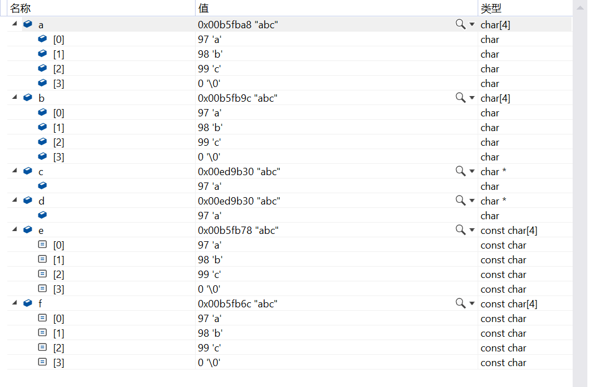
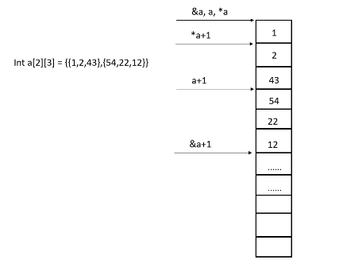

# 理论

## [数组作为函数参数退化为指针问题](https://blog.51cto.com/u_14202100/5079786)

```c
// 将 数组 作为 函数参数 , 传递时会 退化为高一级的指针 ;如果是多维数组，也只能退化高一级的指针
// 无论数组是普通数组，还是指针数组都会退化为指针

#include <stdio.h>

void fun(int array[3])			// 退化为int* array， 数组的首地址, 变为指针地址, 函数中无法判定数组的大小;
{
    printf("fun : sizeof(array)=%d\n", sizeof(array));
}

int main(int argc, char **args)
{
    // 将要作为实参的数组
    int array[3] = {1, 2, 3};
    printf("main : sizeof(array)=%d\n", sizeof(array));

    // 将数组作为参数传递到函数中
    fun(array);

    return 0;
}

// main : sizeof(array)=12
// fun : sizeof(array)=8

// 编译器会将 形参中的数组 作为指针处理 , 只会为其分配 指针 所占用的内存;
// 如果 编译器 将 形参作为 数组处理 , 需要 将数组中的所有元素 , 都要拷贝到栈中 , 如果这个数组很大 , 有几千上万个元素 , 那么该函数的执行效率就很低了 ;
```

- [**不能用二级指针做参数传递二维数组**](https://blog.csdn.net/u011232393/article/details/88298851)

```c
#include <stdio.h>

void fun(int array[][2])		// 退化为int (*array)[2]，只能退化一级，不能完全退化
{
    printf("fun : sizeof(array)=%d\n", sizeof(array));
}

int main(int argc, char **args)
{
    int **ptr;
    fun(ptr);

    return 0;
}

// 多维数组作为函数的形参int array[][y][z]会退化为int (*array)[y][z]
// 在这里函数形参类型会退化为int (*array)[2]，如果将实参int **ptr赋值给形参int (*array)[2]，会报error: cannot convert 'int**' to 'int (*)[2]'
```


# 习题

1. ["abc" 在常量区还是栈区](https://blog.csdn.net/qq_40024275/article/details/100526940)

   ```c
   	void func() {
   		char a[] = "abc"; //栈
   		char b[] = "abc"; //栈
   		char* c = "abc"; //abc在常量区，c在栈上。
   		char* d = "abc"; //编译器可能会将它与c所指向的"abc"优化成一个地方。
   		const char e[] = "abc"; //栈
   		const char f[] = "abc"; //栈
   
   		cout << a << "/" << b << "/" << c << "/" << d << "/" << e << "/" << f << endl;
           	// abc/abc/abc/abc/abc/abc
   
   		cout << *a << *b << *c  << *d << *e << *f << endl;//aaaaaa
   
   		cout << strcmp(a,b) << strcmp(c, d) << strcmp(e, f) << endl;// 000，说明字符串是相等的
   
   		// 比较的是地址值,看是否指向同一个地址
   		cout << (a == b ? 1 : 0)  << (c == d ? 1 : 0)  << (e == f ? 1 : 0) << endl; //010
   
   	}
   ```

   

2. sizeof()

   - 函数的实参若为数组，那么传址
   - sizeof(x)在**编译**时确定其值, 计算出x在内存中所占字节数。所以, **括号内的赋值和函数, 不会被执行，但括号内的运算还是会执行**

   ```c++
   void func(short b[])		// 可以看作是void func(short* b)
   {
   	cout << sizeof(b)<<endl; //一个地址所占字节数为4byte(32位电脑)， 8byte（64位电脑）
   }
   int main() {
   	cout << sizeof(char) << endl;//1
   	cout << sizeof(short) << endl;// 2
   	cout << sizeof(int) << endl;// 4
   	cout << sizeof(long int) << endl;//4
   	cout << sizeof(double) << endl;//8
   	cout << "------------" << endl;
   
   	short a[10] = {0};
   	cout<<sizeof(a)<<endl;//20
   	cout << sizeof(*a) << endl;// 2，*a 等价于a[0]
   	cout << a[110] << endl;// 0，这里索引早已越界，所以读出的值，是不确定的
   	cout<< sizeof(a[110])<<endl;//2，但所占大小依旧是2byte
   
   	
   	cout<< &a <<endl; //0079FBEC, *a 等价于a[0]
   	cout << &a[0] << endl; //0079FBEC，，&a等价于&a[0]
   	cout << sizeof(&a) << endl;//4，地址所占的空间
   	cout<< sizeof(&a[0]) <<endl;//4，地址所占的空间
   
   	
   
   	std::cout << "----sizeof 数组------" << std::endl;
   	short c[2][3] = { {1,2,3},{4,5,6} };
   	short c[2][3] = { {1,2,3},{4,5,6} };
       std::cout << sizeof(c) << std::endl;	//12，整个二维数组的大小
       std::cout << sizeof(c + 1) << std::endl; //8，c+1 指向的是c[1]，所以c+1是一个地址值，而c[1]指向的是c[1][0]
       std::cout << sizeof(*(c + 1)) << std::endl;//6，c+1取星后，获得c[1],而c[1]是一个一维数组名，所以是2x3
       // 二维数组c -> c[0]，而c[0]->c[0][0]
       
       std::cout << "----sizeof 函数------" << std::endl;
       int Sum(int i, short s);
       std::cout<< sizeof(Sum(32, 8)) <<std::endl;		//// 结果:4, 只会判断返回类型的大小. 函数是不会执行的
       
       // 函数传址
       short b[100];
   	func(b);//数组名作为实参，是传址
       
       
   	std::cout << "----sizeof 结构体------" << std::endl;
       struct T1{
           int   a;                  // 成员随意位置
           char  b;
           int   c;
           short d;
       }t1;
       std::cout<< sizeof(t1) <<std::endl;     // 结果:16, 4+4+4+4
       struct T2{
           int   a;                  // 合理安排成员位置
           char  b;
           short d;
           int   c;
       }t2;
       std::cout<< sizeof(t2) <<std::endl;     // 结果:12, 4+4+4, 设计结构时，调整成员的位置，可节省存储空间。
       // 字节对齐,为快速处理数据,内存是按32位读取写的,而不是一字节一字节地读写
       // 结构体的首地址自动对齐至能被对齐字节数大小所整除。
       // 结构体每个成员在结构体内的偏移地址都是成员大小的整数倍，否则, 在前方填充byte。
       // 结构体的总大小为结构体对齐字节数大小的整数倍
       
       
       std::cout << "----sizeof 字符------" << std::endl;
       char c = 'a';							// 小心, char和'a'在被=动作前, 是两个独立类型, 没关联
       std::cout<< sizeof(c) <<std::endl;      // 结果:1, char类型是1字节
       std::cout<< sizeof('a') <<std::endl;    // C99的标准，    'a'是整型字符常量，常量!常量!常量!被看成是int型， 所以占4字节。
                                               // ISO C++的标准，'a'是字符字面量  ，被看成是char型，所以占1字节。
       
       std::cout << "----sizeof 字符串------" << std::endl;
       std::cout<< sizeof("abc") <<std::endl;  // 4，双引号会在尾部自动添加转义字符'\0',即数据0X00, 所以是4
       // 双引号作用: (1)字符串尾部加0, (2)开辟内存空间, (3)提取地址
       
       std::cout << "----sizeof 指针------" << std::endl;
       char *p="老师,早上好!";
       std::cout<< sizeof(p) <<std::endl;       // 8, 
       std::cout<< sizeof(*p) <<std::endl;       // 1,
       char *a[4];
       std::cout<< sizeof(a)<<std::endl;          // 4 * 8
       std::cout<< sizeof(*(a + 1))<<std::endl;    // 8
       std::cout<< sizeof(**(a + 1))<<std::endl;   // 1
       
       std::cout << "----sizeof 数值------" << std::endl;
       char c=8;
       int  i=32;
       std::cout<< sizeof(c    ) <<std::endl;      // 1, 因为char就是1字节
       std::cout<< sizeof(c+i  ) <<std::endl;      // 4, i是4字节, 运算时c值被隐式转换成int, 运算值是4字节
       std::cout<< sizeof(c=c+i  ) <<std::endl;    // 1, 等同于(c), 编译时, 因为=不被执行, 所以=的右边只是个屁
   }
   ```

3. sizeof(void)

   - `sizeof(void)`：编译报错，非法的 sizeof 操作数
   - `sizeof(void *)`：返回的值 与编译器的目标平台有关

   

4. strlen遇0不再计数

   ```c++
   
   	char a[1000];
   	int i;
   	for (i = 0; i < 1000; i++)
   	{
   		a[i] = -1 - i;
   		printf("%d", a[i]);
   		// -1~-128 127~1 0 -1....
   	}
   	printf("%d", strlen(a));//255，strlen遇0就不再计数。
   ```

   

5. strlen和指针的混用

   ```c
   #include<stdio.h>
   #include<string.h>
   int main(void) {
       int n;
       char y[10] = "ntse";
       char* x = y;
       n = strlen(x);
       *x = x[n];
       x++;
       printf("x=%s,", x);
       printf("y=%s\n", y);
       return 0;
   }
   // 问题：此程序打印出来是什么？
   int main(void) {
       int n;
       char y[10] = "ntse";
       char* x = y;			// x指向y[0]
       n = strlen(x);			// n = 4
       *x = x[n];				// x[4]='\0'，x -> y[0]，所以y[0]='\0'，
       						// y-> {'\0','t','s','e','\0'}
       x++;					// x -> y[1]
       printf("x=%s,", x);		// tse
       printf("y=%s\n", y);	// ''
       return 0;
   }
   ```

   

6. [复数以补码的形式存储](https://blog.csdn.net/b1480521874/article/details/102723491)

   - 补码：

     - 绝对值源码二进制书写，

     - 原码从右往左扫描，遇到0直接抄下来，遇到第一个1也直接抄下来，从第一个1往后，所有的数字都取反

       ```
       eg：
       -12
       绝对值源码书写：|-12| = 0000 1100
       从右至左扫描：1111 0100（补码）
       
       法一：
       5的原码：0000 0101
       5的反码：1111 1010 （原码取反）
       5的补码：1111 1011 （反码 +1）
       
       法二：
       5的原码：0000 0101
       5的补码：1111 1011（原码从右往左扫描，遇到0直接抄下来，遇到第一个1也直接抄下来，从第一个1往后，所有的数字都取反）
       ```
       
     - 八位二进制数表示有符号数,为什么最大值为127而不是128：
     
       - 八位二进制数,共有 256 个编码,只能表示 256 个有符号数。一半(128个)是负数,一半(128个)是零和正数。正数的最大值,如果是 128,那就需要 129 个编码
     
       - ```
         127:	0111 1111
         -128:	1000 0000
         -127:	1000 0001
         ```
     
     - **最值溢出**：类型的最大数 + 1 = 类型的最小数，类型的最小数 - 1 = 类型的最大数
     
       ```c
           signed char i;
           i=-129;
           printf("%d\n",i);	// 127，-129 = 类型的最小值（-128） - 1
           i=129;
           printf("%d\n",i);	// -127，-128 = 类型的最大值（127） + 1，-128 + 1 = -127
       
       
       ```
       
     - signed short最大值：32767，最小值：-32768

7. 指针指向

   - 取星*元素维度降一维，取址&元素维度加一维

   

   ```c
   	int a[2][2][3] = { {{1,2,3},{4,5,6}},{{7,8,9},{10,11,12}} };
   
   	int* ptr = (int*)(&a + 1);
   	// &a处在第四维，元素的跨度为12
   
   	printf(" %d %d", *(int*)(a + 1), *(ptr - 1));//7 12
   	// a处在第三维，元素的跨度为6，故a + 1指向 7
   
   	printf(" %d %d", *(int*)(*a + 1), *(int*)(*a + 2));//4 7
   	// *a处在第二维，元素的跨度为3, 故*a + 1指向4，*a + 2 直向7
   
   	return 0;
   ```

8. **函数 fun 的声明为 int fun(int *p[4]), 以下哪个变量可以作为fun的合法参数（）**

   - **n 维数组名称本质 是 n-1 维数组 的指针**
   - **`type** (**p)[]`，type 类型后面描述的是数组存储的类型，括号里面是指针的级别**
   - **将 数组 作为 函数参数 , 传递时会 退化为高一级的指针 ;如果是多维数组，也只能退化高一级的指针**

   ```c
   A int a[4][4];				// a 是 二级指针
   B int **a;					// a 是 二级指针
   C int **a[4];				// a 是 三级指针
   D int (*a)[4];				// a 是 一级指针
   
   // 数组作为函数形参会退化为指针，所以这里的int fun(int *p[4])会退化为int fun(int** p)
   
   // int a[4][4]，a本质上是一个一维数组包含4个元素的指针int (*p)[4]
   // 由于函数参数退化为int **p， 所以这里的类型转化将失败，报 error: cannot convert 'int (*)[2]' to 'int**'
   
   // int** a[4]; a 指向数组，数组里面存放的是二级指针, a 可以看做三级指针
   
   // int (**a)[4]; a 是一个二级指针，数组里面存放 int 型，error: cannot convert 'int (**)[2]' to 'int**'
   
   // int (*a)[4]; a 是个一级指针，数组里面存放 int 型, int(*a)[4]和 int a[4]的区别在于一个是指针，一个是数组名(指针常量)
   // error: cannot convert 'int (*)[2]' to 'int**'
   
   ```

9. 类的权限

   - **public:**可以被任意实体访问，类外部可以访问
   - **protected:**只允许本类**及子类**的成员函数访问，类外部访问不可见
   - **private:**只允许本类的成员函数访问，类外部访问不可见。

   ```c++
   // 派生类对象可以访问基类成员中的
   // A 公有继承的私有成员
   // B 私有继承的公有成员
   // C 公有继承的保护成员
   // D 以上都错
   
   // 类外不能直接访问 类的私有(private)和保护(protected)数据
   // 类外，对象只能访问public成员
   // 子类对象只能访问公共(public)继承的公共(public)成员。
   ```

10. 拷贝构造函数，移动构造函数，重载赋值运算符函数调用时机

   - 拷贝构造调用时机
     - 旧对象赋值新对象
     - 普通对象而非对象的引用 作为函数参数
     - 函数返回  普通对象而非对象的引用
   - 移动构造调用时机
     - 右值（临时（匿名）对象、不可寻址的字面常量）初始化新对象时
   - 重载赋值运算符函数调用时机
     - 将一个已有对象的值赋给另一个已有对象。

   ```c++
   #include <stdio.h>
   class A
   {
       public:
       A(){
       	printf("1");
       }
       A(const A& a){
       	printf("2");
       }
   	A& operator=(const A& a){
           printf("3");
           return *this;
       }
   };
   int main()
   {
       A a;			// 调用无参构造
       A b = a;		// 旧对象初始化新对象，调用拷贝构造
   }
   
   // 答案:12
   ```

   

11. char ** 和 char *

    - 指针+1，地址的偏移量都是sizeof(所指向类型)

    ```c
    #include<stdio.h>
    int main()
    {
        char * str[3] = { (char*)"stra",(char*)"strb",(char*)"strc" };
        char * p = str[0];
        int i = 0;
        while (i < 3)
        {
            printf("%p\t", str +i);         // 以16进制的方式打印变量，特别是用在显示内存地址的时候
            printf("%s\t", *(str+i));
            printf("%s\n", p+i);
            i++;
        }
        return 0;
    }
    
    /*
    000000357e1ffc60        stra    00007ff62e47a001        stra
    000000357e1ffc68        strb    00007ff62e47a002        tra
    000000357e1ffc70        strc    00007ff62e47a003        ra
    */
    
    // str是一个char** 指针常量，地址偏移量的大小为sizeof(char *)
    // p是一个char* 指针变量，在+1时，地址偏移量的大小为sizeof(char)

12. 友元函数

    - 类的私有成员无法在类的外部访问，但是有时候，需要在类的外部访问私有成员

    - **什么可以作友元？**

      1. 普通的全局函数可以作为类的友元。(友元函数，没有this指针)

      2. 一个类的成员函数可以作为另一个类的友元。(友元函数，可以使用this指针)

      3. 一个类可以作为另一个类的友元。(友元类)

    - **友元关系不能被继承。** 友元函数不是作为另一个类的成员，所以不能继承。**并没有破坏继承机制。**

    - **友元关系是单向的。**类A是类B的朋友，但类B不一定是类A的朋友。

    - **友元关系不具有传递性。**类B是类A的朋友，类C是类B的朋友，但类C不一定是类A的朋友

13. 转义字符

    ```c++
    void main() {
    	char s[] = "\\123456\123456\t";
    	printf("%d\n", strlen(s));
        // \\  \123  \t 这些都是转义字符
        // \\ 就是\
        // \123，由于ascii码最大的8进制表达为\177(对应十进制127)，所以这里只能取\123，它10进制为83，对应asii码中代表S
        // \t 就是制表符
        
        // 这些转义的字符都代表了一个字符，所以长度为12
    }
    ```

    

14. 运算符优先级

    - ！> 算术运算符 > 关系运算符 > && 和 || > 条件运算符（? :）> 赋值运算符

    ```c
    int a =0;
    printf("%d", a=-1? 2:3);			// 先计算 -1?2:3，然后再执行赋值运算
    printf("%d", a=0? 2:3);
    
    // 结果：23
    
    // 下面的循环体会被执行几次？
    for(int i=10, j=1; i=j=0; i++, j--);
    
    // 答案0次
    // i = j = 0; 这里的条件部分是一个赋值表达式。按照C语言的运算符优先级，先执行 j = 0，再将结果赋给 i，即 i = 0。因此，整个条件部分的值是 0
        
    
    // 下面的程序会打印什么
    int a = 5, b = 0, c = 0;
    if (a = b + c) printf("***\n");
    else printf("$$$\n");
    
    // 答案：$$$
    // if 后面的表达式可以是任何类型的表达式，当然可以是赋值表达式
    // a = b + c，先执行b+c，等于0，然后将0赋值给a，a等于0，然后if(a)，所以走else
    ```

    

15. scanf输入

    ```c
        int a[3][2] = { 0 }, (*ptr)[2], i, j;
        for (i = 0; i < 3; i++)
        {
            ptr = a + i;
            scanf("%d", ptr);
            printf("scanf execute %dth time\n", i);
        }
    
        for (i = 0; i < 5; i++)
        {
            for (j = 0; j < 2; j++)
                printf("%2d", a[i][j]);
            printf("\n");
        }
    /*
    // 如果scanf那里的循环执行了三次，那么会打印出如下
    1 2 3 4
    scanf execute 0th time
    scanf execute 1th time
    scanf execute 2th time
     1 0
     2 0
     3 0
     0 1
    -112826942427
    */
    
    
    int a[3][2] = { 0 }, (*ptr)[2], i, j;
        for (i = 0; i < 4; i++)
        {
            ptr = a + i;
            scanf("%d", ptr);
            printf("scanf execute %dth time\n", i);
        }
    
        for (i = 0; i < 5; i++)
        {
            for (j = 0; j < 2; j++)
                printf("%2d", a[i][j]);
            printf("\n");
        }
    
    /*
    // 如果scanf那里的循环执行了4次，那么会打印出如下
    1 2 3 4
    scanf execute 0th time
    scanf execute 1th time
    scanf execute 2th time
    scanf execute 3th time
     1 0
     2 0
     3 0
     4 1
    -71304504236
    
    
    // 在C语言中，数组越界通常不会在运行时由语言本身直接检测到，这是因为C语言不会在运行时检查数组边界。
    // 你的代码尝试访问或修改数组边界之外的内存时，它不会抛出错误，而是会继续执行，这可能导致未定义行为，
    // 包括但不限于以下几种情况：
    
    	1. 访问无效的内存，可能会导致程序崩溃。
    	2. 修改了不应该修改的内存，可能会导致数据损坏或其他程序部分的异常行为。
    	3. 读取了无效的内存，可能会得到垃圾数据。
    */
    ```

    

16. 后自加++，后自减--

    ```c
    int x;
    scanf("%d", &x);		// 输入5 回车
    if (x++ > 5)
    	printf("%d\n", x);
    else
    	printf("%d\n", x--);
    // 结果打印出：6
    
    // x++ > 5，这个运算先执行比较，比较出结果false后，执行++操作，x = 6
    // printf("%d\n", x--), 先执行printf操作，打印出6，然后执行--操作，x=5
    ```

    

17. 用数组 M[0..N-1] 用来表示一个循环队列， FRONT 指向队头元素，REAR 指向队尾元素的**后一个位置**，则当前队列中的元素个数是几个？

    - 队列中 rear 指向为下一个地址，rear-front=已经存入的个数 。队列是一个循环队列，所以rear 的序号可能就比 front 序号小，所以需要+n

      再%n。

18. 若数组 S[1..n]作为两个栈 S1 和 S2 的存储空间，对任何一个栈，只有当[1..n]全满时才不能进行进栈操作。那么如何设置栈底的位置，使存储空间利用更加有效？

    - **栈 S1** 的栈底设置在数组的起始位置，即索引 1。S1 向右增长，即它的栈顶位置随着元素的进栈而增加。

    - **栈 S2** 的栈底设置在数组的末尾位置，即索引 n。S2 向左增长，即它的栈顶位置随着元素的进栈而减少。

    - ```
      栈 S1 的栈底  ->  栈 S1 的栈顶        空闲空间        栈 S2 的栈顶  <-  栈 S2 的栈底
      |    |    |    |    |    |    |    |    |    |    |    |    |    |    |    |
      1    2    3    4    5    6    7    8    9   10   11   12   13   14   15   16
      
      ```

    - 

19. C语言入口函数main的原型

    - 返回值必须为int类型
    - 参数列表，可以为void

    ```c
    int main(void);
    int main(int argc , char* argv[]);
    // 由于数组作为函数形参会退化为指针，所以也可以如下写
    int main(int argc, char ** argv);
    
    
    // 访问命令行参数
    int main(int argc, char ** argv){
        for(int i = 0; i<argc;i++){
            printf("%s\n",*(argv+i));
        }
    }
    
    ```

    

20. 在C语言中，函数的隐含存储类别是

    - 在 C 语言中，函数的隐含存储类别是 `extern`，可以在多个文件之间共享。
    - static，只在它的文件内部可见

21. const用法

    - [const 修饰变量](https://blog.csdn.net/weiyuanzhang123/article/details/117592035)：**const默认作用于其左边的东西，如果左边没东西，则作用于其右边的东西。**

      - const int * ：`(const int) *`——指针指向一个整型常量，不可改变指针指向的内容，但指针本身可以改变
      - int const *：`(int const) *`——同上
      - int * const：`int (* const)`——指针常量指向一个整型变量，可改变指针指向的内容，但指针本身不可改变
      - const int * const：`(const int) (* const) `——指针常量指向整型常量
      - int const *const：`(int const) (* const)`——同上

      ```c
      int main()
      {
          int x = 5;
          const int* const p = &x;			// (const int) (* const) p;	p是一个指针常量，指向整型常量
          const int & q = x;					// (const int) & q; q是一个整型常量的左值引用
          int const * next = &x;				// (int const) *next: next是一个指针变量，指向整型常量
          const int * j = &x;					// (const int) *j: j是一个指针变量，指向指针常量
      }
      
      /*
      题目：
      则有语法错误的是（）
      A * p =1;
      B q++;
      C next++;
      D (*j)++;
      正确答案：A B D
      
      1>p 是指向常量的常量指针,(*p)是常量不能再赋值,
      2>q 是常量的引用,不能赋值
      3>next 是指向常量的指针,next 本身可以改变
      4>j 是指向常量的指针,值不能改变
      
      */
      ```

      

22. 字符串的初始化

    ```c++
    // 下面三个等效
    char s[5]={"abc"};
    char s[5]={'a','b','c'};
    char s[5]="abc";
    
    char s[5]="abcdef";		// 这个会报错：error: initializer-string for 'char [5]' is too long [-fpermissive]
    ```

    

23. 对象的指针类型的成员变量如何使用

    ```c++
    class A
    {
        public:
            int m;
            int* p;
    };
    int main()
    {
        A s;
        s.m = 10;
        cout << s.m << endl; //10
        s.p = &s.m;
        () = 5;			// 这里应该填什么
        cout << s.m << endl; //5
    	return 0;
    }
    
    
    // 应该填：*s.p = 5
    ```

    

24. 指针值传递

    ```c
    void GetMemeory(char* p) {
    	p = (char *)malloc(100);
    }
    void Test() {
        char* str = NULL;
        GetMemeory(str);
        strcpy(str,"Thunder");
        strcat(str + 2,"Downloader");
        printf(str);
    }
    // 这个程序的运行结果是：崩溃
    // str将指针值，传递给形参p，而后，p接受了新的地址值，而str的指针值，并未发生变化，仍旧为NULL
    // 如果str那里没错的话，那么字符操作的结果为：ThunderDownloader
    // 应该使用二级指针 
    
    // 正确做法
    void GetMemeory(char** p) {
    	*p = (char *)malloc(100);
    }
    void Test() {
        char* str = NULL;
        GetMemeory(&str);
        strcpy(str,"Thunder");
        strcat(str + 2,"Downloader");
        printf(str);
    }
    ```

    

25. 有无virtual修饰符的函数，父类指针调用函数将会出现不同的行为。参数为数组时，数组会退化为指针

    ```c++
    #include<iostream>
    using namespace std;
    
    class Base
    {
    public:
        virtual int foo(int x)
        {
            return x * 10;
        }
    
        int foo(char x[14])
        {
            return sizeof(x) + 10;
        }
    };
    
    class Derived: public Base
    {
        int foo(int x)
        {
            return x * 20;
        }
    
        virtual int foo(char x[10])
        {
            return sizeof(x) + 20;
        }
    } ;
    
    int main()
    {
        Derived stDerived;
        Base *pstBase = &stDerived;
    
        char x[10];
        printf("%d\n", pstBase->foo(100) + pstBase->foo(x));
    
        return 0;
    }
    
    // 答案：2014
    
    // 如果你想要通过基类指针调用子类中重写的函数，你需要在基类中将该函数声明为虚函数（使用 virtual 关键字），然后在子类中重写这个函数。否则将无法通过父类指针调用子类中重写的函数
    
    // 所以pstBase->foo(100)，在基类中有virtual修饰，所以调用的是子类中重写的函数
    // pstBase->foo(x),在基类中无virtual修饰，所以调用的是基类中的函数
    // 2000 + 14 = 2014
    ```

26. 数组名表达式

    ```c
    // 已知 ii，j 都是整型变量，下列表达式中，与下标引用X[ii][j]不等效的是（）。
    A *(X[ii]+j);
    B *(X+ii)[j];
    C *(X+ii+j);
    D *(*(X+ii)+j);
        
    
    // X+ii -> X[ii] -> X[ii][0]
    // *(X + ii) = X[ii]
    // []与*，前者优先级高
    ```

    

27. 类占用内存空间的问题

    - 空类的内存大小至少１个字节，每个类的实例都需要有一个唯一的地址，这个地址的大小至少1字节
    - 计算一个类实例所占用的内存大小时，是不考虑**函数**和**静态成员变量**的。
    - 子类和基类各自有自己虚函数表和虚函数指针，在多继承的情况下，子类可以有多个虚函数表指针和多个虚函数表。

28. 迭代器失效问题：

    - 容器的类型

      - 顺序型容器：内存连续（vector，deque），内存不连续（list）
      - 关联性容器：有序关联（map，multimap，set，multiset），无序关联（unordered_set/unordered_multiset，unordered_map/unordered_multimap）

      ```
      当向 vector 容器插入（push_back）一个元素后，end 操作返回的迭代器肯定失效（true）
      当向 vector 容器插入(push_back)一个元素后，capacity 返回值与没有插入元素之前相比有改变,此时 first 和 end 操作返回的迭代器都会失效（true）
      在 deque 容器非头尾的任何位置的插入和删除操作将使指向该容器元素的所有迭代器失效（true）
      对于节点式容器(map, list, set)元素的删除，插入操作会导致指向该元素的迭代器失效，其他元素迭代器不受影响（true）
      ```

29. 协议

    - 基于TCP的：**HTTP，FTP，TELNET（远程登录终端），EMAIL**
    - 基于UDP的：**DNS，TFTP(Trivial File Transfer Protocol,简单文件) 和 SNMP(Simple Network Management Protoco,简单网关监控协议)**：数据量传输很小

30. 设置抽象类（虚基类）的目的是消除二义性

31. 内存对齐：

    - 字节对齐的三个准则：
      - 结构体变量的首地址能够被其最宽基本类型成员的大小所整除； 
      - 结构体每个成员相对于结构体首地址的偏移量都是成员大小的整数倍，如有需要编译器会在成员之间加上填充字节； 
      - 结构体的总大小为结构体最宽基本类型成员大小的整数倍，如有需要编译器会在最末一个成员之后加上填充字节。

    ```c
    struct T {
        char a;				// 1byte
        int *d;				// 8byte
        int b;				// 4byte
        int c:16;			// 2byte，位段，C语言允许在一个结构体中以位为单位来指定其成员所占内存长度，这种以位为单位的成员称为位段。利用位段能够用较少的位数存储数据。
        double e;			// 8byte，float 4byte
    };
    T *p;
    在64位系统以及64位编译器下，以下描述正确的是
    A sizeof(p) == 24
    B sizeof(*p) == 24
    C sizeof(p->a) == 1
    D sizeof(p->e) == 4
    ```

    

32. 构造与析构的顺序

    - 创建派生类对象时，程序先调用基类构造函数，再调用子类成员的构造函数，最后调用派生类构造函数
    - 派生类有的多个基类中有虚基类（虚拟继承的父类）时，优先调用虚基类的构造函数。
    - 派生类有多个基类时，按派生类声明中的基类列表顺序调用构造函数（和子类成员调用顺序规则一致）
    - 派生类构造函数的参数列表后，应当指明基类的构造函数，否则使用基类的默认构造函数；该指明顺序（初始化序列顺序）与基类构造函数调用顺序无关
    - 在多重派生中，由同一个初始基类派生的多个类（都虚继承初始基类）作为派生类的基类时，该初代基类的构造函数只调用一次。如果没有虚拟继承初始基类，那么会初始基类会调用多次。
    - 析构函数顺序，与构造函数调用顺序相反。

    ```c++
    #include<iostream>
    using namespace std;
    class A {
    public:
        A(char* s)
        {
            cout << s << endl;
        }
        ~A() {}
    };
    class B :virtual public A
    {
    public:
        B(char* s1, char* s2) :A(s1) {
            cout << s2 << endl;
        }
    };
    class C :virtual public A
    {
    public:
        C(char* s1, char* s2) :A(s1) {
            cout << s2 << endl;
        }
    };
    class D :public B, public C
    {
    public:
        D(char* s1, char* s2, char* s3, char* s4) :B(s1, s2), C(s1, s3), A(s1)
        {
            cout << s4 << endl;
        }
    };
    int main() {
        D* p = new D("class A", "class B", "class C", "class D");
        delete p;
        return 0;
    }
    
    /*
    class A
    class B
    class C
    class D
    
    */
    ```

    

33. 操作符重载

    - ` . , .* , :: , ? : , sizeof , typeid `这几个运算符不能被重载，其他运算符都能被重载。
    - ` .* `表示指向成员操作的指针

    ```c++
    #include <iostream>
    
    class MyClass {
    public:
        int data;
        void display() {
            std::cout << "Data: " << data << std::endl;
        }
    };
    
    int main() {
        MyClass obj;
        obj.data = 10;
    
        // 定义指向 MyClass 类的 int 型数据成员的指针
        int MyClass::*pData = &MyClass::data;
    
        // 使用 .* 运算符访问数据成员
        std::cout << "Data: " << obj.*pData << std::endl;
    
        // 定义指向 MyClass 类的成员函数的指针
        void (MyClass::*pFunc)() = &MyClass::display;
    
        // 使用 .* 运算符调用成员函数
        (obj.*pFunc)();
    
        return 0;
    }
    ```

    - f

    ```c++
    #include <iostream>
    #include <typeinfo>
    
    class Base {
    public:
        virtual ~Base() {}  // 多态基类需要一个虚析构函数
    };
    
    class Derived : public Base {};
    
    int main() {
        Base* b = new Base();
        Base* d = new Derived();
    
        std::cout << "Type of b: " << typeid(*b).name() << std::endl;
        std::cout << "Type of d: " << typeid(*d).name() << std::endl;
    
        delete b;
        delete d;
    
        return 0;
    }
    /*
    Type of b: 4Base
    Type of d: 7Derived
    */
    
    // 在C++中，typeid 运算符用于获取对象或类型的类型信息。它返回一个 std::type_info 对象，该对象包含了关于类型的信息，比如类型名。
    // typeid 主要在运行时识别对象的实际类型，尤其在多态上下文中很有用。
    
    // 注意：typeid 仅在基类拥有至少一个虚函数时，才能正确获取多态类型对象的动态类型。如果没有虚函数，typeid 会返回指针或引用的静态类型。
    ```

    

34. 继承方式，成员默认修饰符

    - 继承方式：继承方式大于成员修饰方式时，可保证成员修饰方式不变。继承方式小于成员修饰方式时，成员修饰方式缩小为继承方式。
    - 成员默认修饰符：private

    ```c++
    #include <iostream>
    using namespace std;
    class A {
    	int a1;
    protected:
        int a2;
    public:
        int a3;
    };
    class B : public A {
    	int b1;
    protected:
    	int b2;
    public:
    	int b3;
    };
    class C :private B {
    	int c1;
    protected:
    	int c2;
    public:
    	int c3;
    };
    int main() {
        B obb;
        C obc;
        cout << obb.a1;		// x
        cout << obb.a2;		// x
        cout << obb.a3;		// √
        cout << obc.b1;		// x
        cout << obc.b2;		// x
        cout << obc.b3;		// x
        cout << obc.c3;		// √
        return 0;
    }
    ```

    

35. 构造函数调用顺序，多态

    - 构造函数调用顺序：虚基类构造函数（多个虚基类的话，按照继承顺序）-> 基类构造函数（多个非虚基类的话，按照继承顺序）->  成员变量构造函数（多个成员变量按照声明顺序）-> 类自身构造函数
    - 如果你想要通过基类指针调用子类中重写的函数，你必须在基类中将该函数声明为虚函数（使用 `virtual` 关键字），然后在子类中重写这个函数。否则将无法达到目的

    ```c++
    class A {
    public:
    	A() :m_iVal(0) { test(); }
    	virtual void func() { std::cout << m_iVal << ' '; }
    	void test() { func(); }
    public:
    	int m_iVal;
    };
    class B : public A {
    public:
        B() { test(); }
        virtual void func() {
            ++m_iVal;
            std::cout << m_iVal << ' ';
        }
    };
    int main(int argc , char* argv[]) {
        A* p = new B;
        p->test();
        return 0;
    }
    /*
    0 1 2
    */
    ```

    

36. `strlen(char *)和sizeof(char *)`

    ```c++
    char* GetWelcome(void) {
        char* pcWelcome;
        char* pcNewWelcome;
        pcWelcome = "Welcome to Huawei Test";
        pcNewWelcome = (char*)malloc(strlen(pcWelcome)); //1
        if (NULL == pcNewWelcome) {
        	return NULL; //2
        }
        strcpy(pcNewWelcome, pcWelcome); //3
        return pcNewWelcome; //4
    }
    
    printf("%s\n", GetWelcome());
    
    
    // 这段代码，哪里存在问题？
    
    // sizeof(char *) = strlen(char *) + 1
    // 任何字符串字面值都会自动包含一个结尾的 '\0' 字符，所以要想完整的从pcWelcome中复制到pcNewWelcome，pcNewWelcome的内存分配还差一个字节，
    // 1和3有问题，修改了1，3的问题自然解决
    ```

    

37. 指针

    ```c++
    以下叙述中正确的是（）
    A 即使不进行强制类型转换，在进行指针赋值运算时，指针变量的基类型也可以不同	// 通常情况下，进行指针赋值运算时，指针变量的基类型应该相同
        											 //尽管在某些特定场景下可以进行不同类型的指针赋值，但这种做法是不安全的，容易导致错误。
    B 如果企图通过一个空指针来访问一个存储单元，将会得到一个出错信息			 // 空指针：指针变量被赋值为空指针常量
        															// 访问空指针指向的存储单元（0地址），会报错
    C 设变量p是一个指针变量，则语句p=0;是非法的，应该使用p=NULL;			// 0，NULL 是等价的
    D 指针变量之间不能用关系运算符进行比较								// 同类型的两个指针是可以相互比较的
    ```

    

38. 指针指向

    ```c++
    // 当参数*x=1,*y=1,*z=1 时，下列不可能是函数 add 的返回值的( )?
    int add(int *x, int *y, int *z){
        *x += *x;
        *y += *x;
        *z += *y;
        return *z;
     }
    
    // 分析：x，y，z三个参数是否指向同一地址（或者说调用该函数时是否实参相同）
    // x,y,z指向同一区域：8
    // x,y指向同一区域:5
    // x,z指向同一区域:5
    // y,z指向同一区域:6
    // x,y,z都指向不同区域：4
    ```

    

39. 下列关于数组的描述，错误的是

    ```c++
    A C++中数组的存储方式为列优先存储				// x，行优先
    B 数组名可以作为实参赋值给指针类型的形参		// √	
    C 数组下标索引从 1 开始，至数组长度 n 结束		// x, 0~n-1
    D 数组指针的语法形式：类型名 *数组名[下标表达式]		//x type (*arr_name)[n]
    ```

    

40. 父子进程

    ```c++
    int main(){
       int pid;
       int num = 1;
       pid = fork();
        // 子进程中fork的返回值是0，父进程中fork的返回值是子进程的进程号
       if(pid > 0){
       		num++;
       		printf("in parent:num:%d addr:%x\n", num, &num);
       }
       else if(pid == 0){
       		printf("in child:num:%d addr:%x\n", num, &num);
       }
    }
    
    // 父子进程中输出的num不同,num地址相同
    
    // 其实刚刚fork出来不止虚拟地址一样，物理地址也一样。当进程发生分歧时，即修改此变量时，才会分配不同的物理地址，也就是copy-on-write，写时复制。
    // 写时复制（Copy-On-Write，简称 COW）是一种优化技术，常用于内存管理和数据结构的实现中。它的基本思想是在复制资源时，延迟实际的复制操作，直到有必要对资源进行修改为止。
    ```

    

41. 对象中存储的内容

    ```c++
    #include<iostream>
    using namespace std;
    class animal
    {
    protected:
        int age;
    public:
        virtual void print_age(void) = 0;
    };
    class dog : public animal
    {
    public:
           dog() {this -> age = 2;}
           ~dog() { }
           virtual void print_age(void) 
           {
               cout<<"Wang, my age = "<<this -> age<<endl;
           }
    };
    class cat: public animal
    {
    public:
        cat() {this -> age = 1;}
        ~cat() { }
        virtual void print_age(void) 
        {
            cout<<"Miao, my age = "<<this -> age<<endl;
        }
    };
    int main(void)
    {
        cat kitty;
        dog jd;
        animal * pa;
        int * p = (int *)(&kitty);
        int * q = (int *)(&jd);
        p[0] = q[0];
        pa = &kitty;
        pa -> print_age();
        return 0;
    }
    /*
    
    Wang, my age = 1
    
    
    首先这里需要清楚几个概念：
    1.类的首地址一般是指向类的第一个成员变量的地址，但是如果类中含有虚函数那么类内存中头4字节指向的是虚函数表指针项(32bit系统)，那么p[0] =  q[0];把q[0]的虚指针给了p，那么调用p当中的虚函数就不再是原来的那个虚函数了，而是新赋值的。
    2.类的函数参数中都默认带有this，这里是编译器编译的时候生成的，一般我们看不见。那么这里当我们调用kitty这个类的函数的时候传递的this还是指向原来的cat类对象，但是调用的函数是dog里的函数。所以这题答案就明确了。
    */
    ```

    

42. 当一个类的某个函数被说明为virtual，则在该类的所有派生类中的同原型函数 `__都是虚函数__`

43. 在 32位机器上用 gcc编译以上代码，求sizeof(A)，sizeof(B)分别是（)

    ```c++
    class A {
        int a;
        short b;
        int c;
        char d;
    };
    class B {
        double a;
        short b;
        int c;
        char d;
    };
    
    // 16 20
    
    // GCC 默认 4 字节对齐，所以double按照两个4字节对齐
    ```

    

44. 