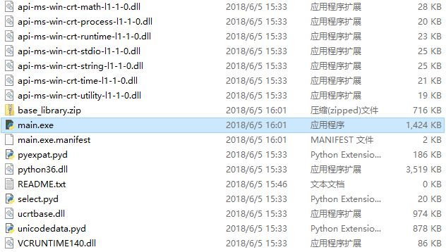
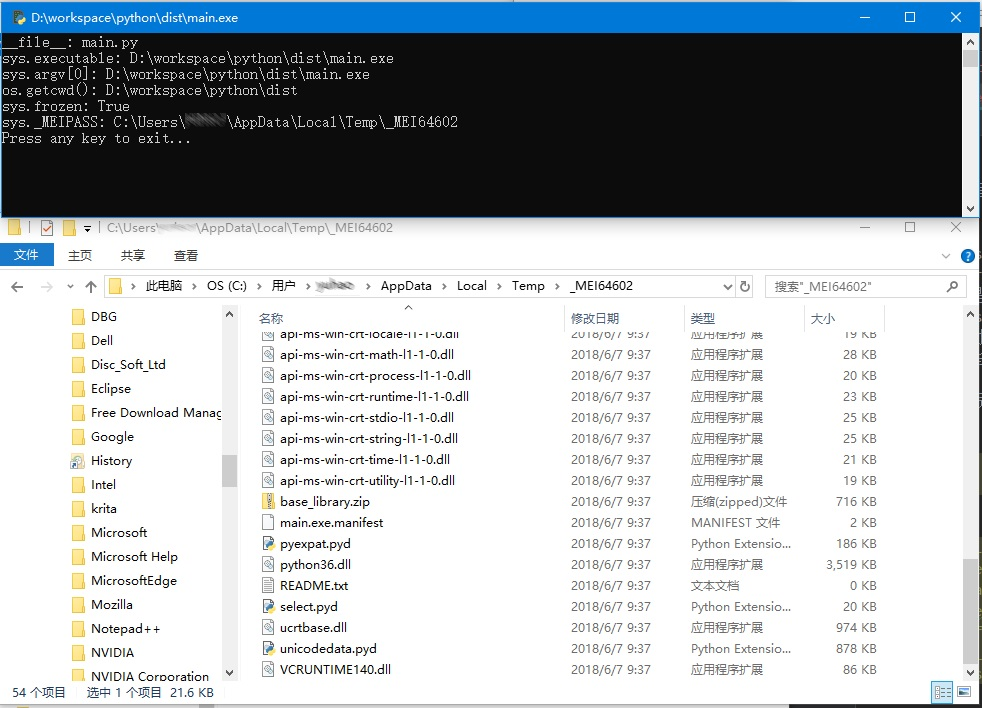

[spec文件的用法](https://blog.csdn.net/tangfreeze/article/details/112240342)


# 0 [Pyinstaller](https://www.cnblogs.com/cocoonink/p/13858039.html)

PyInstaller 是一个跨平台的 Python 应用打包工具，支持 Windows/Linux/MacOS 三大主流平台，能够把 Python 脚本及其所在的 Python 解释器打包成可执行文件，从而允许最终用户在无需安装 Python 的情况下执行你的程序。

 PyInstaller 的作用是打包而不是安装。

PyInstaller 制作出来的执行文件并不是跨平台的。如果你需要分别为三大平台打包的话，那么你就要在三个平台上分别运行 PyInstaller，不要指望“一次编译，到处运行”（当然可以利用虚拟机简化多环境配置）。

```bash
# 安装
pip install PyInstaller

# 运行Pyinstaller
# PyInstaller 最简单的运行形式，只需要指定作为程序入口的脚本文件。假定这个文件叫做 main.py
pyinstaller main.py

```

运行之后，我们会看到目录中多了这些内容：

- main.spec 文件，其前缀和脚本名相同。它本质上是一个 Python 文件，指定了打包时所需的各种参数，熟悉格式以后也可以手工修改，其角色类似于 setup.py；

- build 子目录，其中存放打包过程中生成的临时文件（日志以及工作文件）。有几个文件需要关注一下：

  - warnxxxx.txt：该文件记录了生成过程中的警告/错误信息。在一切正常的情况下，该文件也可能包含若干类似 missing module 的信息，这些信息并不表示出错，但如果 PyInstaller 运行有问题的话，你就需要检查这个文件来获取错误的详细内容了。

  - **xref-xxxx.html**：该文件（/build/项目名/xref-xxx.html）输出了 PyInstaller 分析脚本得到的**模块依赖关系图**。如果出现类似找不到模块的信息，你可以查找这个文件来获得一些线索。但该文件的内容比较庞大，一般情况下很少会直接使用它。

- dist 子目录，存放生成的最终文件。如果使用单文件模式————后面会讲到），那么这里将只有单个执行文件；如果使用目录模式的话，那么这里还会有一个和脚本同名的子目录，其下才是真正的可执行文件（以及相关的其他附属文件）。双击可执行文件就会启动程序。

## 0.1 [pyinstaller命令行参数](https://blog.csdn.net/weixin_39000819/article/details/80942423)

## 0.2 spec

看到上述这么多命令，你应该可以想象，通过命令行输入这么多参数应该是一件多么痛苦的事情。

这个问题有两个解决办法。第一，我们可以把需要的命令保存成 Shell/批处理脚本。第二，也可以通过运行 .spec 文件来达到同样的效果。

## 0.3 UPX

有不少用户会觉得 PyInstaller 生成的文件太大，不便于发布。由于 Python 解释器本身的体积很难裁剪，所以 PyInstaller 提供了一个方案。如果 PyIntaller 在系统路径上发现了 UPX，那么它会用 UPX 来压缩执行文件。如果你确实有 UPX，但又并不希望裁剪的话，可以用--no-upx 开关来屏蔽它。

尽管 UPX 对大多数程序都能有不错的压缩率，但作为代价，使用 UPX 以后程序执行速度可能会有所减慢。此外，个别程序也存在不兼容 UPX 的情况，因此请你自己权衡是否值得使用。

## 0.4 为执行文件添加版本信息

PyInstaller 考虑到了这一点，因此它为你提供了一个用于提取版本记录的辅助命令：`pyi_grab_version`。如果你的 PyInstaller 是通过 PIP 安装的，那么该程序应该位于 Pythonxx\Scripts 子目录下，并且如果 Python 已经添加到系统 PATH 的话，你可以直接运行此命令：

# 1 [单目录和单文件模式](https://www.cnblogs.com/cocoonink/p/13858062.html)

## 1.1 单目录模式

单目录模式，就是 PyInstaller 将 Python 程序编译为同一个目录下的多个文件，其中 xxxx.exe 是程序入口点（xxxx 是脚本文件名称，你也可以通过命令行修改），以及其他的辅助文件。单目录是 PyInstaller 的默认模式，并不需要特意指明，不过你想要更明确的话，也可以自己加上 `-D` 或者 `--onedir` 开关。



可以看到，除了主程序之外，其他文件还包括 Python 解释器（PythonXX.dll）、系统运行库（ucrtbase.dll 以及一大堆 apixx.dll），以及一些编译后的 Python 模块（.pyd 文件）。

这里可以稍微解释一下 PyInstaller 打包程序的运行原理。主程序文件之所以比较大，是因为它包含了运行程序的启动（Bootstrap）代码。简而言之，Bootstrap 代码的工作过程大概是这样的：

1. 修改运行配置，并设置一些内部变量，为下一步的解释器执行创建环境；
2. 加载 Python 解释器和内置模块；
3. 如果有需要的话，执行一些称为运行时钩子（Runtime Hook）的特殊过程；
4. 加载编译过的入口脚本；
5. 调用解释器执行入口脚本。脚本运行后，接下来的工作就由解释器接管了；
6. 当解释器执行完毕后，清理环境并退出。

## 1.2 单文件模式

和单目录模式不同，单文件模式是将整个程序编译为单一的可执行文件。要开启的话，需要在命令行添加 `-F` 或者 `--onefile` 开关。

生成的产物时一个可执行的二进制程序(.exe)

## 1.3 不推荐使用单文件模式

有个问题你不妨考虑一下：我们把程序编译成了单一的可执行文件，但是从上面的单目录模式结果可以知道，要让程序运行还需要其他很多的辅助文件，此外我们自己也可以添加数据文件（--add-data）和二进制文件（--add-binary）,那么这些文件哪里去了？你如何访问这些文件？

这才是秘密所在！本质上，Python 是解释程序，而不是 native 的编译程序，它并不能真正产生出真正单一的可执行文件。PyInstaller 这里变了个小戏法，如果我们使用单文件模式的话，那么 PyInstaller 生成的实际上类似于 WinZIP/WinRAR 生成的自动解压程序。它需要先把所有文件解压到一个临时目录（通常名为_MEIxxxx，xxxx是随机数字），再从临时目录加载解释器和附属文件。程序运行完毕后，如果一切正常，那么它会把临时目录再悄悄删除掉。

为了让这个过程顺利执行，PyInstaller 会对运行时的 Python 解释器做一些修改，特别是下面两个变量：

- **`sys.frozen`** 如果你直接运行 Python 脚本的话，那么该变量是不存在的。但 PyInstaller 则会设置它为 True（不论单目录还是单文件模式）。因此，你可以用**它来判断程序是手工运行的，还是通过 PyInstaller 生成的可执行文件运行的**；
- **`sys._MEIPASS`** 如果使用单文件模式，该变量包含了 PyInstaller 自动创建的临时目录名。你可以用 --runtime-tmpdir 命令行开关来强制使用特定的目录，但是鉴于最终用户有哪些目录不在程序员控制范围内，通常还是应该避免使用它。

```python
import sys
import os

print('__file__:', __file__)
print('sys.executable:', sys.executable)
print('sys.argv[0]:', sys.argv[0])
print('os.getcwd():', os.getcwd())
print('sys.frozen:', getattr(sys, 'frozen', False))
print('sys._MEIPASS:', getattr(sys, '_MEIPASS', None))
input('Press any key to exit...')
```



你可以看到临时目录包含了运行输出所需的各种辅助文件，除了主程序.EXE 之外。仔细分析一下，我们也能明白为什么单文件模式下容易出错了。尽管 PyInstaller 努力使得各种输出和直接运行脚本的结果尽可能相似，但差别还是很明显的：

- __file__ 指向的脚本名不变，但该文件已经不存在于磁盘上了。这使得依赖于 __file__ 去解析相对文件位置的代码非常容易出错。这也是绝大多数错误的来源，请务必注意！
- sys.executable 不再指向 Python.exe，而是指向生成的文件位置了。如果你使用该变量判断系统库位置的话，那么也请小心；
- os.getcwd() 指向执行文件的位置（双击运行的话是这样，但如果从命令行启动的话则未必）。但请注意，你添加的数据/二进制文件并非位于此目录，而是在临时目录上，不明白这一点的话，也很容易出现找不到文件的问题。

需要说明的是，上述问题不只存在于你自己写的代码里。有相当多的库没有考虑到在 PyInstaller 打包后下执行的场景，它们在使用这些变量的时候很有可能会出问题。事实上这也是 PyInstaller 添加 Runtime Hook 机制的一个重要原因。

### 静态文件路径问题

如果你的脚本需要引用辅助文件路径的话，那么一种可能的形式如下：

```python
if getattr(sys, 'frozen', False):
    tmpdir = getattr(sys, '_MEIPASS', None) 
    if tmpdir:
        filepath = os.path.join(tmpdir, 'README.txt')
    else:
        filepath = os.path.join(os.getcwd(), 'README.txt')
else:
    filepath = os.path.join(os.path.dirname(__file__), 'README.txt')
    
    
if getattr(sys, 'frozen', None):
    basedir = sys._MEIPASS
else:
    basedir = os.path.dirname(__file__)
```

上述代码并不是唯一可行的代码，或许也不是最简洁的，但是你应当明白了，要正确处理该过程并不是轻而易举的事情。很多用户之所以出错又找不到问题，就是因为他们根本不清楚临时目录这回事，也不知道上哪里去找这些文件。如果使用单目录模式的话，那么文件在哪里是可以直接看到的，出现问题的可能性就小多了，即使有问题也很容易排查。这就是我为什么强烈推荐用户不要使用单文件模式的原因————除了看起来比较清爽之外，单文件模式基本上没有其他好处，而且它带来的麻烦比这一点好处要多太多了。

除此之外，单文件模式还带来了其他一些负面效应：

- 因为有临时目录和解压文件这个过程，所以单文件模式的程序启动速度会比较慢。对于稍大的程序，这个延迟是肉眼可以感觉到的；
- 如果你的程序运行到一半崩溃了，那么临时目录将没有机会被删除。日积月累的话，可能会在临时目录下遗留一大堆 _MEIxxxx 目录，占用大量磁盘空间。

或许对你来说上面这两个问题并不是特别重要，但知道它们的存在还是有好处的。

希望本文能够帮助你明白这个过程，并理解我为什么要这样建议。

#### 路径处理

[pyinstaller打包前后os.path.abspath(__file__)和os.path.realpath(sys.executable)的区别](https://blog.csdn.net/sy20173081277/article/details/116541195)

```python
import os
import sys 

# 使用pycharm 返回脚本绝对路径
print(os.path.abspath(__file__))

# 使用pycharm 返回脚本上一层目录路径
root_path1 = os.path.dirname(os.path.abspath(__file__))
print(root_path1)


# 使用pycharm 返回脚本上两层目录路径
root_path2 = os.path.dirname(os.path.dirname(os.path.abspath(__file__)))
print(root_path2)


# 打包使用 获取当前目录路径
root_path3 = os.path.dirname(os.path.realpath(sys.executable))
print(root_path3)

# 打包使用 获取当前上一级目录路径
root_path4 = os.path.dirname(os.path.dirname(os.path.realpath(sys.executable)))
print(root_path4)
```


# 2 spec文件


```bash
# 创建spec文件，pyi-makespec的参数项和pyinstaller的参数项相同。
pyi-makespec -D main.py

# 依据spec文件，打包
pyinstaller main.spec
```

- Analysis: 分析脚本的引用关系，并将所有查找到的相关内容记录在内部结构中，供后续步骤使用；
- PYZ: 将所有 Python 脚本模块编译为对应的 .pyd 并打包；
- EXE: 将打包后的 Python 模块及其他文件一起生成可执行的文件结构；
- COLLECT: 将引用到的附属文件拷贝到生成目录的对应位置。

**.Spec 本质上是 Python 脚本文件**，因此你可以在其中应用任何你所知道的 Python 代码技巧。比如，如果数据文件很多导致 Analysis 太长的话，那么你可以把它提取为单独的变量

## 2.1 Analysis

### 2.1.1 [分析依赖和导入关系](https://www.cnblogs.com/cocoonink/p/13858095.html)

绝大多数实际的程序都是有多个模块甚至是多个包构成的。为了从它们生成可执行的文件，PyInstaller 当然需要知道程序究竟知道哪些模块/包，并将它们包含在发布的文件中。但我们并没有明确告知 PyInstaller 我们使用了哪些文件，那么 PyInstaller 又是如何知道这些信息的呢？

简单的说，PyInstaller 使用了递归方法，从入口的脚本文件逐个分析，看它们到底使用了哪些模块。像下面这些引用形式就是 PyInstaller 可以明确识别的：

```python
import xx
from xx import yy
```

此外，PyInstaller 也能识别 ctypes、SWIG、Cython 等形式的模块调用，但前提是文件名必须为字面值。

但是，PyInstaller 无法识别动态（动态导入）和调用，例如 **`__import__()`**、exec、eval, 以及**以变量为参数的调用**（因为不到运行时无法知道实际值）。

或者在运行时操作sys.path的值等等。这些都是pyinstaller无法直接识别的。需要你手动做一些其他的工作帮助pyinstaller识别这些内容。

当 PyInstaller 识别完所有模块后，会在内部构成一个树形结构表示调用关系图，该关系在生成目标时也会一并输出（也就是前面提到过的 xref-xxxx.html 文件）。PYZ 步骤会将所有识别到的模块汇集起来，如果有必要的话编译成 .pyd，然后将这些文件打包。这就是大致的模块处理过程。

但这个过程还有一些潜在的问题没有解决。一个就是我们前面提到的，有些动态模块调用未必可以自动识别到，这样它们就不会打包到文件中，最终执行时肯定会出现问题。另一个是：有些模块并非是以模块的形式，而是通过文件系统去访问 .py 的，这些代码在运行时同样会出现问题。对这样的程序该如何处理呢？

[hook](https://www.cnblogs.com/cocoonink/p/13858095.html)可以在导入指定模块或加载特定模块的时候，执行额外的hook脚本（import hook 和 runtime hook）。

```python
# a——Analysis类的实例，要求传入各种脚本用于分析程序的导入和依赖
a = Analysis(
    ['main.py'],
    pathex=['/home/buntu/.conda/envs/pa_env/lib/python3.7','./utils'],
    datas=[('./config.xml','.')],
    binaries=[( '/usr/lib/libiodbc.2.dylib', '.' )],
    hiddenimports=[
    'sklearn.utils._typedefs'
    ],
    hookspath=[],
    runtime_hooks=[],
    excludes=['PyQt5'],
    win_no_prefer_redirects=False,
    win_private_assemblies=False,
    cipher=block_cipher,
    noarchive=False)
             
# 1. scripts
# 当你执行可执行文件时，你需要执行几个脚本文件（程序启动的时候，你想要执行几个脚本），那就写几个，可执行程序会依次执行这些脚本，并且可执行程序的命名为第一个脚本的名字。

# 2. pathex
# 项目需要从什么地方导入库，这个库可以是自定义库，也可以是沙箱的库。如果不将沙箱的库导入，python内在的包也会报找不到。
# 当我们的一些模块不在这个路径下，记得把用到的模块的路径添加到这个list变量里。同命令“-p DIR/–paths DIR”.

# 3. datas
# 作用是：将本地文件打包时拷贝到目标路径下
# datas是一个元素为元组的列表，每个元组有两个元素，都必须是字符串类型，元组的第一个元素为数据文件或文件夹，元组的第二个元素为运行时（打包后）这些文件或文件夹的位置。
# eg:
# datas=[(’./src/a.txt’, ‘./dst’)]，表示打包时将"./src/a.txt"文件添加（copy）到相对于exe目录下的dst目录中。
# 也可以使用通配符：datas= [ (’/mygame/sfx/*.mp3’, ‘sfx’ ) ]，表示将/mygame/sfx/目录下的所有.mp3文件都copy到sfx文件夹中。
# 也可以添加整个文件夹：datas= [ (’/mygame/data’, ‘data’ ) ]，表示将/mygame/data文件夹下所有的文件都copy到data文件夹下。同命令“–add-data”。

# 4. binaries，https://www.jianshu.com/p/e684c17ee91c
# 作用是：将本地的动态库，拷贝到目标路径下
# 程序如果需要依赖动态库（在linux中，即以.so结尾的文件），如果程序需要运行，则.so文件和main.exe需要一起发布

# 5. hiddenimports，https://blog.csdn.net/tangfreeze/article/details/112240342
# 动态导入和动态调用的模块，__import__()、exec、eval, 以及以变量为参数的调用，这些模块不会被pyinstaller所识别，所以需要显示指定并打包。
# 指定脚本中需要隐式导入的模块，比如在__import__、imp.find_module()、exec、eval等语句中导入的模块，这些模块PyInstaller是找不到的，需要手动指定导入，这个选项可以使用多次。
# 该参数的值是数组，数组元素的值就是__import__、imp.find_module()、exec、eval需要导入的模块名，而不是模块所在的地址，模块的地址需要通过pathex参数指定。
```


## pyinstaller的全局变量

PyInstaller全局变量可以在spec文件使用。

- **DISTPATH：**相对于dist文件夹的相对路径，如果--distpath参数选项被指定了，则使用被指定的参数值。
- **HOMEPATH：**pyinstaller查找的绝对路径，一般是Python解释器的site-packages文件夹的绝对路径。
- **SPEC：**在命令行中指定的spec文件路径。
- **SPECPATH：**os.path.split(SPEC)的第一个值。
- **specnm：**spec文件的文件名，不含文件类型后缀。
- **workpath：**相对于build文件夹的相对路径，如果workpath=参数选项被指定了，这使用被指定的值。
- **WARNFILE：**在build文件夹中警告文件的全路径，一般是warn-myscript.txt
