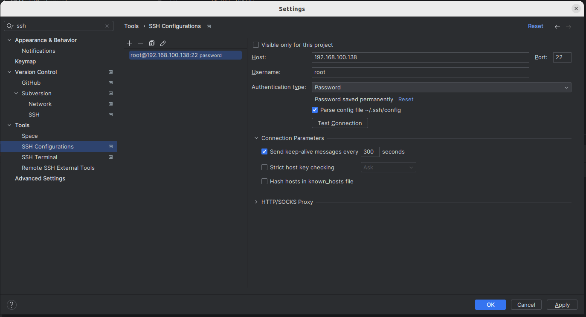
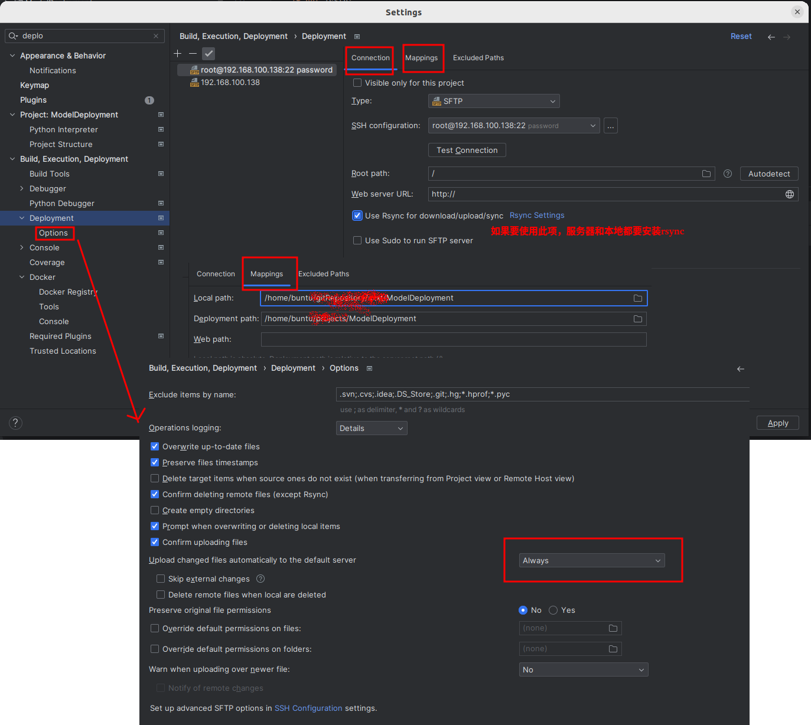
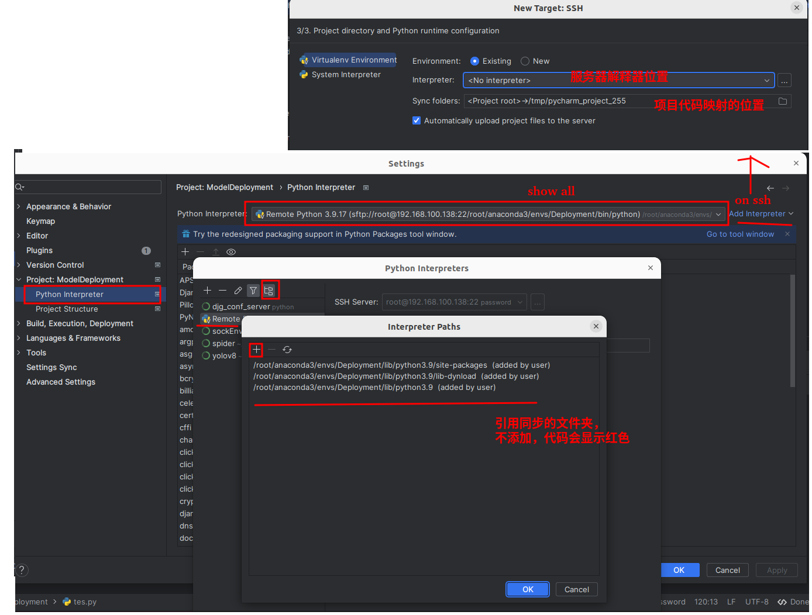
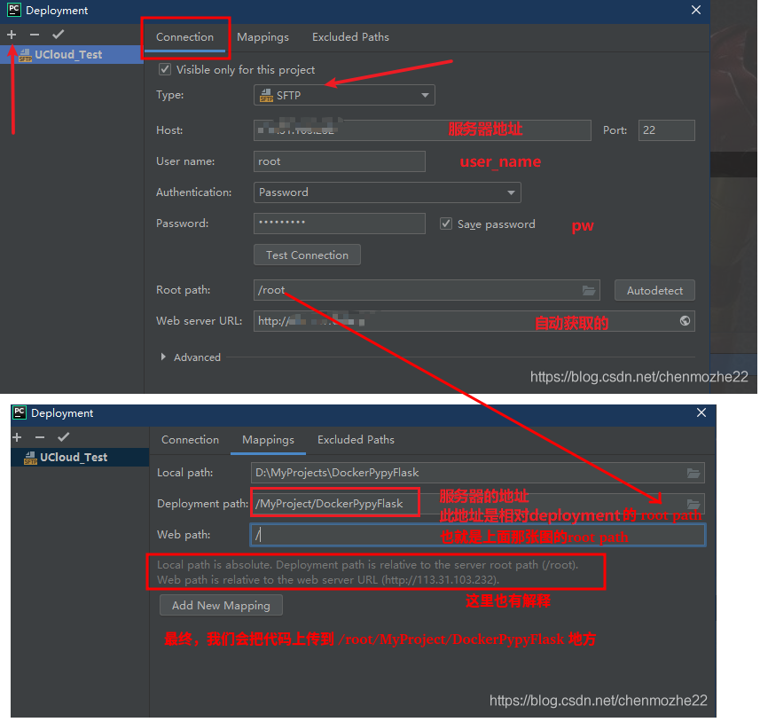
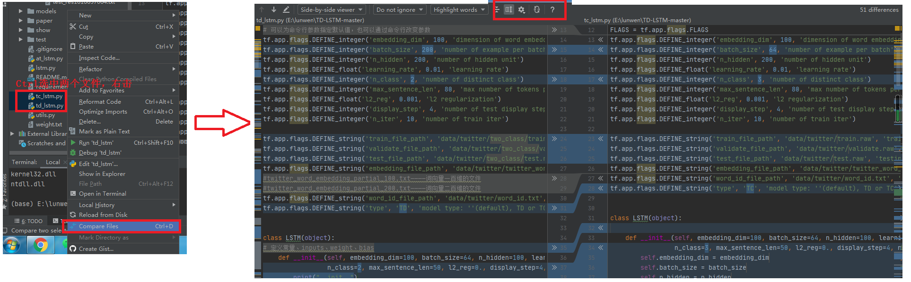
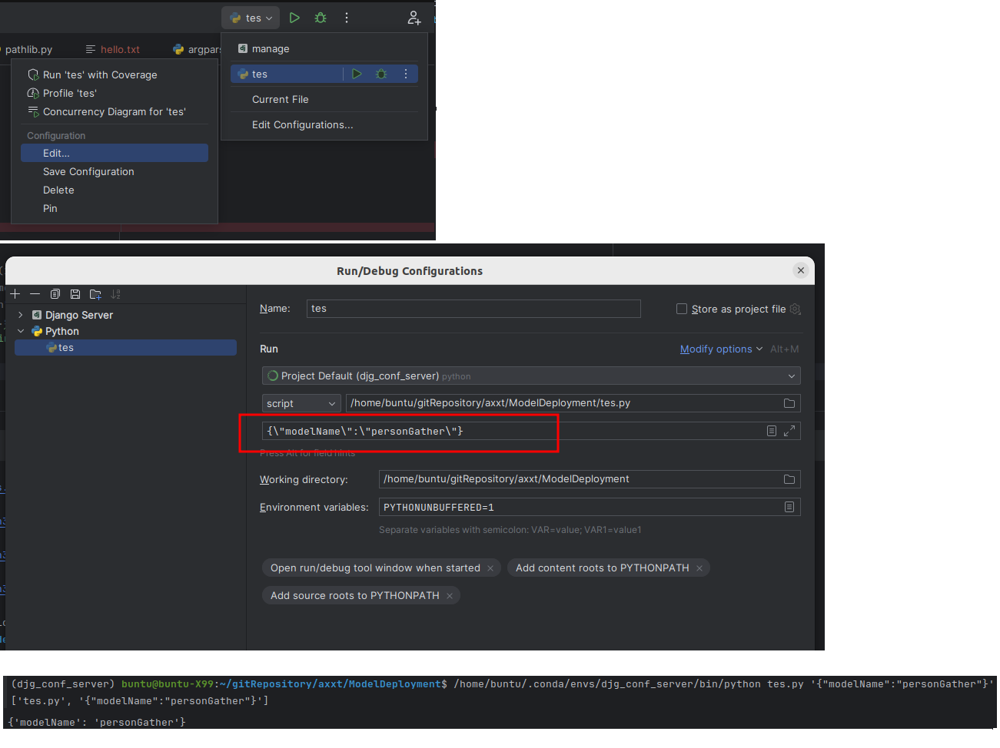

# Python

# 1 基础

- python是一种面向对象、解释型、弱类型的脚本语言

- python程序严格区分大小写，
- python程序不要求语句使用分号结尾，当然也可以使用分号

## 1.1 注释

- 单行注释：**#**，跟在#后面直到这行结束的代码都将被注释
- 多行注释：三个单引号**'''**和三个双引号**"""**，可以将多行的代码注释掉
- 退出python命令行：【Ctrl +z】或【quit() + Enter】或【exit() + Enter】

## 1.2 变量

python是**弱类型语言**，特点：

- 变量无须声明即可直接赋值
- 变量的数据类型可以动态改变，可以被赋不同类型的值

### 1.2.1 打印输出函数print()

<pre>print(val1,val2,...,valn,[sep=分割符,end=结束符,file=输出目标,flush=输出缓存控制])</pre>

### 1.2.2  变量命名规则

**python语言的标识符必须以字母、下划线（_）开头，后面可以接任意数目的字母（包括中文，日文，英文），数字和下划线**

### 1.2.3 关键字和内置函数

关键字：

| False | None   | Ture     | and   | as     | assert   |
| ----- | ------ | -------- | ----- | ------ | -------- |
| break | class  | continue | def   | del    | elif     |
| else  | except | finally  | for   | from   | global   |
| if    | import | in       | is    | lambda | nonlocal |
| not   | or     | pass     | raise | return | try      |
| while | with   | yield    |       |        |          |

内置函数：

许多，

## 1.3 数值类型

为提高数值的可读性，python 3.x允许为数值增加下划线作为分隔符而并不会影响数值本身。

整型：十进制/二进制（0b开头）/八进制（0o开头）/十六进制（0x开头），eg：26/0b11010/0o32/0x1a

浮点数：普通浮点数/科学计数，eg：3.1415926E3

复数：python支持复数，复数的虚部用j或J表示，eg：3+0.2j，复数的计算模块 cmath。使用时，必须导入：import cmath

```python
# str( )是python自带函数，是python保留的关键字，定义变量时应该避免使用str作为变量名
# 如果在使用str( )函数之前已经定义过str变量，则会出现TypeError: ‘str’ object is not callable这个报错

# 字符串转数字
s = '100'
print(int(s))
print(float(s))

# 数字转字符串
print(str(12145))
print('列表转字符串：'+str([1,2,3,4])+'\n')
print('字典转字符串：'+str({'a':10,'b':15,'c':20})+'\n')

# 复数
print(complex(1,2))

```


## 1.4 字符串

python要求字符串必须使用引号（单引号或双引号）括起来。支持**转义字符（\\)**

### 1.4.1 基本使用

**拼接**

1. 字符串与字符串：加号（+）拼接，s4 = s1 + s2
2. 字符串与数字：python不允许直接拼接数值和字符串，必须先将数值转换成字符串（  str(num)   、repr(  num  )  ），然后再用加号连接两个字符串

**字符串输入**

input()函数用于向用户生成一条提示，然后获取用户输入的内容，并返回一个字符串。

```python
msg=input("请输入你的值：");
print(type(msg));
print(msg);
```

**长字符串**

用多行注释的方法，将注释的内容赋值给变量，这就是长字符串，他可以换行书写便于查看，

**原始字符串**

```python
s1=r'G:\hello\test.txt'
print(s1)
#G:\hello\test.txt
```

**字节串**

bytes保存的就是原始的字节（二进制格式）数据，因此bytes对象可用于在网络上传输数据，也用于存储各种二进制格式文件，如图片，音乐等文件。

一个汉字三个字节。有三种方式将字符串转为bytes对象。不做详述。

### 1.4.2 深入使用

1. 字符串格式化输出

```python
print("%s is a %s years old boy" % (user,age));
#  %后面是转换说明符，格式输出类似于C语言的格式输出
# s——利用str()将变量或表达式转换为字符串
# f——转化为十进制形式的浮点数

```

2. 索引操作字符串（<b> [  ] </b>）

   ```python
   s1='wangqian，nihao！'
   # 左闭右开
   # 第1个字符索引为0，倒数第1个字符为-1
   print(s1[9:])#从第10个字符开始，nihao
   print(s1[:-7])#从开始到倒数第7个字符，
   ```

3. **in**判断是否包含某个子字符串

4. **字符串方法len()，strip()，find()，replace()，maketrans()等等，用时可查**

5. `str.format()`：自2.6起，新增，字符串格式化功能

   ```python
   
   # 不设置指定位置，按默认顺序
   "{} {}".format("hello", "wq")    
   # hello wq
   
   # 设置指定位置
   "{1} {0} {1}".format("hello", "wqq")  
   #wqq hello wqq
   
   #关键字参数
   print("爱好：姓名：{name}, 性别： {sex}".format(name="wqqian", sex="female"))
   #爱好：姓名：wqqian, 性别： female
   
   #数字格式化
   "{:.2f}".format(3.1415926)
   # 保留小数点后两位
   # 3.14
   "{:+.2f}".format(3.1415926)
   #带符号保留小数点后两位
   # +3.14
   ```

6. 

## 1.5 运算符

1. 赋值运算符：支持连续赋值，**=**，扩展赋值运算符

2. 算术运算符：+ ， -  ， *，  /（普通除），  //（整除），  % ，**\*\*（乘方）** 

3. 位运算符

4. 索引运算符**[  ]**

5. 比较运算符，**判断引用对象is， is not，>，<，>=，<=，==，!=**

6. 逻辑运算符，**and，or，not**

7. in运算符（not in），用于判断某个成员是否位于序列中

   <h5>三目运算符

   <pre>
   	True_statement if 条件表达式 else False_statement    
   </pre>

## 1.5 帮助文档

python非常方便，它甚至不需要用户查询文档，python是自带文档的，

- **dir(  )**：列出指定类或模块包含的全部内容（包括函数、方法、类、变量等）
- **help(  ) :**查看某个函数或方法的帮助文档

<pre>
  eg：dir(  str )，将会列出str类提供的所有方法。
  help(str.title)，列出str类的title方法
</pre>
# 2 python常用数据结构

Python内置三种常用的三种数据结构：列表（list）、元组（tuple）和字典（dict）

在python中，语句中包含**[  ]，{  }，(  ) **括号中间换行的就不需要使用多行连接符。

## 2.1 序列

python的常见序列类型包括字符串（不可变）、元组（不可变）和列表（可变）等;

### 2.1.1 创建元组和列表

<pre>
  元组：(ele1,ele2,...,elen)
  列表：[ele1,ele2,...,elen]
</pre>

### 2.1.2 元组和列表的公共用法

1. 索引使用：**[  +/-  n ]**

2. 子序列:**[ start(起始索引，包含) : end(结束索引，不包含)  : step(步长)  ]**

3. 加法：列表只能加列表，元组只能加元组，两个序列首尾衔接

4. 乘法：n个序列首尾衔接，还可以混合乘法和加法运算

5. in：判断是否包含某个元素

6. 序列封包和解包

   序列支持以下两种赋值方式

   - 程序把多个值赋值给一个变量时，系统会自动将多个字封装成元组——序列封包
   - 程序允许将序列（元组或列表）直接赋值给多个变量，要求：变量数和序列元素个数相同——序列解包
     - 解包时，python允许被赋值的变量之前添加**“ * ” **，那么该变量就代表一个列表，可以保存集合中多个元素

   ```python
   #索引用法
   a_tuple=("autumn_moon",10,2.6);
   print(a_tuple[0]);# autumn_moon
   print(a_tuple[-1]);# 2.6
   #子序列
   a_list=[15,"ordinary_world",9.5];
   print(a_list[0,-2])#[15,"ordinary_world"]
   #加法
   b_list=[10,"extraordinary_person",12.5];
   sum_list=a_list+b_list;
   print(sum_list);#[15,"ordinary_world",9.5,10,"extraordinary_person",12.5]
   #乘法
   mul_list=a_list*3;
   print(mul_list);#[15,"ordinary_world",9.5,15,"ordinary_world",9.5,15,"ordinary_world",9.5]
   #in
   print(15 in a_list);#true
   piint(15 not in a_list);#false
   #序列封包
   pack=1,2,3;
   print(pack);#(1,2,3)
   #序列解包
   a,b,c,d=(1,2,3,4);
   #星号*的使用，和ES6中剩余参数相似
   j,*k,l=range(6)	#j=1,k=[2,3,4,5],l=6
   #封解包混合使用
   e,f,g,h=1,2,3,4
   
   ```

   

## 2.2 列表

1. 创建列表：

   - **[  ]**：直接创建

   - **list(  )**：可用于将元组，区间（range）等对象转换为列表

2. 增：
   - append()：追加参数到列表最后面（让参数成为一个元素），参数可以为单个值，元组，列表
   - extend()：也是追加，当参数是序列时，拆分成多个元素依次追加。消除嵌套的情形

3. 删：del、索引、子序列和赋空列表的方法可删除，

4. 改：索引，子序列

   ```python
   a_list=[1,2,3]
   # 引用
   a_list[0]#1
   a_list[-1]#3
   #元组转列表
   a_tuple=(5,6,7)
   b_list=list(a_tuple)
   #增,原列表发生变化
   a_list.append(4)#[1,2,3,4]
   a_list.append(b_list)#[1,2,3,4,[5,6,7]]
   c_list=[8,9,10]
   c_list.extend(b_list)#[8,9,10,5,6,7]
   #删
   del a_list[4]#[1,2,3,4]
   del a_list[0:2:2]#[2,4]
   c_list[1:2]=[];#[8,5,6,7]
   #插
   a_list[1:1]=['a','b']
   print(a_list)#[2,'a','b',4]
   
   # 数组合并
   array1 = [1, 2, 3]
   array2 = [4, 5, 6]
   
   # 使用extend()方法合并数组
   array1.extend(array2)	# array1 [1, 2, 3, 4, 5, 6]
   merged_array = array1 + array2 #merged_array [1, 2, 3, 4, 5, 6]
   ```


5. 其他方法，[查找](https://blog.csdn.net/qq_31747765/article/details/80944227)
   - len()，获取最外层数组的长度，对于numpy同样适用
   - count()，统计列表中某元素的出现次数
   - index()，判读列表中某元素的位置
   - pop()，出栈
   - reverse()，倒序
   - sort()，排序

## 2.3 字典

1. 创建字典
   - 花括号语法：**{k1:v1,k2:v2,...,kn:vn}**
   - dict()函数：传入映射键值对**dict([k1,k2,k3],[v1,v2,v3]) ** /   传入列表（里的每一个元素是一个只包含键和值两个元素的元组或列表，eg：**dict([[k:v],[k1:v1],(k2,v2)])**）

2. 访问：通过key访问value使用的也是方括号语法
3. 增：通过对不存在的key赋值
4. 改：对存在的key赋新值
5. 删：通过del删

```python
#创建
a_dict={'chinese':150,'english':150,('biology','geography','history'):90}
b_dict=dict([['chinese',150],['english':150],['math':150]])
c_dict=dict(['chinese','english','math'],[150,150,150])
#访问
print(a_dict['chinese'])#150
#增
a_dict['math']=150
#改
a_dict['english']=100
#删
del a_dict[('biology','geography','history')]

# 字典合并，有则更，无则增
a = {1: 'a', 2: 'aa'}
b = {3: 'aaa', 4: 'aaaa'}
dict(a, **b)
# {1: 'a', 2: 'aa', 3: 'aaa', 4: 'aaaa'}
a.update(b)
print(a)
# {1: 'a', 2: 'aa', 3: 'aaa', 4: 'aaaa'}
```

6. 其他方法
   - clear()：清空字典，返回空字典{}
   - get()：无key则返None
   - **update()：有则更，无则增**
   - items(),keys(),values()：返回键值对，键，值的对象，可通过list做转换
   - pop(),popitem()
   - fromkeys()

7. 注意：字典相当于索引是任意不可变类型的列表，因此元组可以做字典的索引，而列表不能。

# 4 流程控制

## 4.1 代码块

python不是格式自由的语言，不像java语言的代码块是用花括号**{  }**区别，python的代码块是靠缩进来区别的

代码块一定要缩进，否则就不是代码块。**不要随意缩进，同一个代码块内的代码必须保持相同的缩进**。

通常引起代码块的语句都有一个**“ : ”**

**pass**语句：空语句，该语句不做任何事情，只做标记和预留位置的作用。

### 4.1.1 with 上下文管理

```python
with EXPR as VAR:
    BLOCK
```

基本思想是with所求值的对象必须有一个\_\_enter\_\_()方法，一个\_\_exit\_\_()方法。

紧跟with后面的语句被求值后，返回对象的\_\_enter\_\_()方法被调用，这个方法的返回值将被赋值给as后面的变量（as 语句可有可无）。当with后面的代码块全部被执行完之后，将调用前面返回对象的__exit__()方法。

```python
class Sample:
  def __enter__(self):
    print("In __enter__()")
    return "Foo"
  
  def __exit__(self, type, value, trace):
    print("In __exit__()")
  
def get_sample():
  return Sample()
  
with get_sample() as sample:
    print("sample:%s" % sample)
    ha = 5
print("ha = %s" % ha)
#ha = 5
#主程序段依然能访问到，with里面声明的变量
```

运行代码后，输出如下：

In \_\_enter\_\_()
sample: Foo
In \_\_exit\_\_()

## 4.2 条件结构

### 4.2.1 if结构

<pre>
  if expression :
  	statements...
  elif expression:
  	statements...
  ...
  else:
  	statement...
</pre>

if条件可以是任意类型

下面的值会被解释器当做**false**处理

False、None、0、“ ”、（ ），[ ]、{ }

### 4.2.2 断言

<pre>
  assert expression
</pre>
true程序继续向下执行，false会引发AssertionError错误

### 4.2.3 switch

在python 3.10的版本引入switch case语句

## 4.3 循环结构

循环控制：break（结束此循环）、continue（结束本次循环）

### 4.3.1 while循环

<pre>
  [init_statements]
  while condition_expresstion :
  	body_statements
  	[iteration_statements]
</pre>

初始化语句、循环条件、循环体、迭代语句

### 4.3.2 for-in循环

专门用于遍历范围、列表、元素和字典等可迭代对象包含的元素

<pre>
    for 变量  in  字符串 | 范围 | 集合 ：
    	statements
</pre>
变量的值受for-in循环控制，改变量将会在每次循环开始时自动被赋值，因此程序不应该对该变量赋值。

```python
# 使用enumerate可以返回下标
for index,val in enumerate(['ni','hao','ya','wqq']):
    print(index,val,end=",")
    
# 同时遍历多个等长列表
list1 = ['a', 'b', 'c', 'd']
list2 = ['apple', 'boy', 'cat', 'dog']
list3 = ['i','love','you','wqq']
for x, y, z in zip(list1, list2,list3):
    print(x, 'is', y,'say',z)
```


<h5>for-in遍历字典</h5>

字典包含items()，keys()，values()三个方法，他们都返回三个列表。

```python

# 对于3.x版本，因为python3改变了dict.keys，返回的是dict_keys对象，支持iterable 但不支持indexable，我们可以将其明确的转化成list。

dict = {'tp':10,'tn':20}
keys = dict.keys()
print(keys[1])
# TypeError: 'dict_keys' object does not support indexing
keys_list = list(keys)
print(keys_list[1])

```


<h5>循环结束else</h5>

当循环条件为False时，程序会执行else代码块，它的主要作用是便于生成更优雅的Python代码。

当循环未被break终止时，程序会执行else块中的语句。

### 4.3.3 for表达式

for表达式用于利用其它区间、元组、列表，字典等可迭代对象创建新的列表

<pre>
    [ 表达式 for 变量  in 可迭代对象 [ if cond_expression ] ]
</pre>

如果将**方括号[]换为圆括号()**，这样表达式不会再生成列表，而生成一个**生成器（generator）**，他也可以for-in循环。

for表达式也可**嵌套循环**

```python
#for语句
b_list=[x*x for x in a_range if x % 2 == 0]
print(b)#[0,4,16,36,64]

#for语句的嵌套循环
c_list=[(x,y) for x in range(3) for y in range(4) if x <=1 and y <=3 ]
print(c_list)#[(0,0),(0,1),(0,2),(0,3),(1,0),(1,1),(1,2),(1,3),(2,0),(2,1),(2,2),(2,3)]

# 生成字典
d = {'modelName': 'personGather', 'version': '', 'url': 'http://192.168.100.51/soft/yolov5l.pt'}
e = {k: v for k, v in d.items() if d[k]}
# {'modelName': 'personGather', 'url': 'http://192.168.100.51/soft/yolov5l.pt'}
```


### 4.3.4 常用工具函数

1. zip()，可以把多个列表（以长度最短的列表为标准）压缩成一个zip对象（可迭代对象），这个可迭代对象所包含的元素是由原列表元素组成的元组。
2. reversed()，可接收各种序列（元组，列表、区间等）的参数，返回反序排列的迭代器。
3. sorted(sequence,reverse)，默认从小到大排，reverse参数为true，就从大到小排列了。

```python
target={'语文' : 120,'数学':110,'英语':110}
for key,val in target.items():
    print("科目：%s \n 成绩：%s \n " % (key,val))
else :
	print('循环结束');
a_range=range(10)

#zip()
a=['a','b','c']
b=['1','2','3']
c=zip(a,b)		#c=[('a',1),('b',2),('c',3)]
```

# 5 函数

## 5.1 函数定义

<pre>
    def 函数名(param1,param2,...):
    	'''
    	函数说明文字，只要把一段字符串放在函数声明之后，函数体之前，这段字符串将作为函数的说明文档
    	'''
    	函数体
    	[return [返回值]]
</pre>

- 参数列表：一旦在定义函数时制定了形参列表，**调用该函数时就必须传入对应的参数值。**
- 函数说明文字：通过  **help(函数名)**或打印**print(函数名.\_\_doc\_\_)**，可以查看函数的说明文档。
- 返回值：如果程序需要有多个返回值，我们可以主动包装成列表之后返回。如果python函数直接返回多个值，**python会自动将多个返回值封装成元组**

```python
def max(x,y) :
	'''
	比较两个数，获取较大数的值。

	max(x,y)
	返回x和y数之间较大的那个数。
	'''
	z = x if x > y else y
	return z
```

## 5.2 函数参数

### 5.2.1 位置和关键字参数

- 位置参数：按照形参位置传入的参数，必须按照形参的顺序传入参数值。

- 关键字参数：按照形参名传入指定的参数值，无需按照形参定义的顺序传入参数值。

  **注意：位置参数必须在关键字参数之前。**

### 5.2.2 参数默认值

在定义函数时，可以为形参指定默认值，这样在调用函数时就可以省略为该形参传入参数值，而是直接使用该形参的默认值。

python要求将带默认值的参数定义在形参列表的最后。

```python
def girth(width,height=20):
    print('width:',width)
    print('height:',height)
    return 2*(width+height)
print(girth(10,12))#普通参数就是位置参数
print(girth(height=6,width=5))#关键字参数，可交换位置

print(girth(2.5,height=3))#位置参数只能在关键字参数之前

print(girth(10))#参数默认值，可省略有默认值的参数的传入
```


### 5.2.3 参数收集

和JavaScript的剩余参数相似。python允许在形参前面添加星号（  *  ），这样就意味着，该参数可接收多个参数值。

有两种参数收集方式

- 普通参数收集：形参名前面加一个星号（**"  *  " **），多个普通参数值被当成元组传入。
- 关键字参数收集：形参名前面加两个星号（**" * * "**)，多个以关键字参数传入的参数将被当成字典传入。

一个函数最多只能带一个支持"普通参数收集"的形参。

```python
def test(x,y,z=3,*books,**scores) :
    print(x,y,z)
    print(books)
    print(scores)
print(test(1,2,3,"高等数学","大学生英语"，语文=70,数学=110))
#1 2 3
#('高等数学','大学生英语')
#{语文:70,数学：110}

def func(a, **kwargs):
	c = kwargs.pop('key', 2)		# 字典 pop() 方法删除字典给定键 key 所对应的值，返回值为被删除的值。
	print(c)
```


<h5>逆向参数收集</h5>

所谓逆向参数收集，指的是在程序已有列表，元组、字典等对象的前提下，把他们的元素**“拆开”**后传给函数的参数。

逆向参数收集需要在传入的列表、元组参数之前添加一个星号，在字典参数之前添加两个星号。

```python
def foo(name,*scores):
    print('学生姓名：',name)
    print('主科分数：',scores)
a_tuple=(110,120,115)
foo('秦奋',*a_tuple)
#学生姓名：秦奋
#主科分数: (110,120,115)

def bar(book,price,desc):
    print("书名：%s，价格：%s，描述：%s" % ( book,price,desc))
my_book={'price':34,'book':'数据科学与大数据分析','desc':'一本关于数据的书'}
bar(**my_book)
```

### 5.2.4 传参机制

python中函数的参数传递机制都是——值传递。

对象传入和java的相似，依旧不是传址。

如果函数收到的是一个可变对象（比如字典或者列表）的引用，就能修改对象的原始值－－相当于通过“传引用”来传递对象。如果函数收到的是一个不可变对象（比如数字、字符或者元组）的引用，就不能直接修改原始对象－－相当于通过“传值'来传递对象。

## 5.3 变量作用域

局部变量：在函数中定义的变量，包括参数。

全局变量：在函数外面，全局范围内定义的变量。

python提供如下三个工具来获取指定范围内的**“变量字典”**（键为变量名，变量值为对应键的值）

- globals()：该函数返回全局范围内所有变量组成的“变量字典”
- locals()：该函数返回当前局部范围内所有变量组成的“变量字典”
- vars( obj )：获取在指定对象obj范围下所有变量组成的“变量字典”，如果不传入obj参数和locals()的作用相同。

使用globals()和locals()获取的变量字典只应该被访问（读），不应该被修改（写）。但实际上是可以被修改的

全局范围内，locals和globals获取的变量字典可读可写。局部范围内，locals获取的变量字典只可读不可写，glabal依旧可读可写。

**python是没有块级作用域的**

```python
if True:
    x = "hello world"
# 因为没有块级作用域，故 if 代码块中的变量 x 可以被外部访问到
print(x)
```

### [python中的作用域](https://blog.csdn.net/weixin_39818662/article/details/110627545?utm_medium=distribute.pc_aggpage_search_result.none-task-blog-2~aggregatepage~first_rank_v2~rank_aggregation-1-110627545.pc_agg_rank_aggregation&utm_term=python%E5%86%85%E5%BB%BA%E4%BD%9C%E7%94%A8%E5%9F%9F&spm=1000.2123.3001.4430)

Python 的作用域一共有 4 种，分别如下：

1. L（Local）：局部命名空间，每个函数所拥有的命名空间，记录了函数中定义的所有变量，包括函数的入参、内部定义的局部变量。
2. E（Enclosing）：闭包，包含非局部（nonlocal）也非全局（nonglobal）的变量，在嵌套函数中，函数 A 包含函数 B，在 B 中去访问 A 中的变量，作用域就是 nonlocal，直白理解就是闭包函数外的函数中的变量；
3. G（Global）：代码最外层，全局变量；全局命名空间，每个模块加载执行时创建的，记录了模块中定义的变量，包括模块中定义的函数、类、其他导入的模块、模块级的变量与常量。
4. B（Built-in）：包含内建变量，自带的内建命名空间，任何模块均可以访问，放着内置的函数和异常。在python解释器启动时创建，一直保留直到解释器退出。

创建：python解释器启动 ->创建内建命名空间 -> 加载模块 -> 创建全局命名空间 ->函数被调用 ->创建局部命名空间

销毁：各命名空间销毁顺序：函数调用结束 -> 销毁函数对应的局部命名空间 -> python虚拟机(解释器)退出 ->销毁全局命名空间 ->销毁内建命名空间

变量查找法则：python解释器动态执行过程中，对遇到的变量进行解释时，是按照一条固定的作用域链查找解释的，又称为LEGB法则。

## 5.4 局部函数

在函数体内定义的函数——局部函数

局部函数只能在封闭的函数内有效

## 5.5 函数变量

函数变量——所有函数都是function对象，这意味着可以把函数本身赋值给变量。而被赋值的变量也可以通过函数调用的形式调用函数。

既然函数可以作为变量，那么**函数也可以作为函数的形参**。当实参传的是函数的时候，那么形参将接收到一个函数。

函数变量、形参和实参都不需要带**(  )**，只有在做函数使用的时候需要带。

## 5.6 lambda表达式

lambda 表达式的本质是匿名的、单行函数体的函数。

<pre>
    lambda [param1,param2,...] : 表达式
</pre>

好处：

- 对于单行函数，使用lambda表达式的适应性更强。
- 对于不需要多次复用的函数，使用lambda表达式可以在用完之后立即释放掉。
- lambda可以作为函数参数被传递，在三目运算符中也经常被用到，也经常用来替代局部函数。

## 5.7 函数装饰器@

使用@符号引用已有的函数，可用于修饰其他函数

使用“@函数A”去装饰函数B，实际上完成了如下两步

- 首先，将B作为参数传给A函数
- 然后，将B替换为A函数的返回值

因此，被修饰的函数B完全由A函数的返回值决定。

函数装饰器是一个非常实用的功能，它既可以在被修饰函数之前添加额外的处理逻辑，也可以在之后添加一些处理逻辑。

```python
def A(fn):
	def bar(param):
		print("参数是：",param)
		return fn(param*2)
	return bar
@A
def B(param):
	print("输入参数的平方：",param*param)
    return param*param
print(B)#<function A.<locals>.bar at 0x00000000021FA...>
#B函数实质上已被替换为bar函数
print(B(10))
#参数是：10
#输入参数的平方：400
#400
```

## 5.8 魔术方法

在Python中，所有以双下划线`__`包起来的方法，统称为**Magic Method（魔术方法）**，它是一种的特殊方法，普通方法需要调用，而魔术方法不需要调用就可以自动执行。

魔术方法在类或对象的某些事件出发后会自动执行，让类具有神奇的“魔力”。如果希望根据自己的程序定制自己特殊功能的类，那么就需要对这些方法进行重写。

```python
class People(object):
    # 创建对象
    def __new__(cls, *args, **kwargs):
        print("触发了构造方法")
        ret = super().__new__(cls) # 调用父类的__new__()方法创建对象
        return ret ## 将对象返
    # 实例化对象
    def __init__(self, name, age):
        self.name = name
        self.age = age
        print("初始化方法")
    #  删除对象
    #   del 对象名或者程序执行结束之后
    def __del__(self):
        print("析构方法，删除对象")
        
class Fib(object):
    def __init__(self):
        pass
    # 对象被当作函数一样被调用时，会触发此函数
    def __call__(self,num):
        a,b = 0,1;
        self.l=[]

        for i in range (num):
            self.l.append(a)
            a,b= b,a+b
        return self.l
    def __str__(self):
        return str(self.l)
    __rept__=__str__

f = Fib()
print(f(10))
输出：
[0, 1, 1, 2, 3, 5, 8, 13, 21, 34]
```


# 6 面向对象

## 6.1 类和对象

类是面向对象的重要内容，可以把类当成一种自定义类型，可以使用类来定义变量，也可以使用类来创建对象

### 6.1.1 类

<pre>
    class 类名：
    	执行语句...
    	类变量...
    	方法...
</pre>
1. 类变量——在类体中为新变量赋值就是增加类变量。通过del语句即可删除已有类变量。
2. 实例变量——只要对新实例变量进行赋值就是增加实例变量。通过del语句即可删除已有对象的实例变量。
3. 类中定义的方法默认是实例方法。方法的定义和函数的定义基本相同。只是**实例方法的第一个参数会被自动绑定到方法的实例对象——因此实例方法的第一个参数应该定义为self**
4. 构造方法\__init__( self , param1 , ...)。构造方法是一个类创建对象的根本途径。如果开发者没有显示定义此函数，那么python会自动为该类定义一个包含self的默认的构造函数。
5. python允许在类范围内放置可执行代码。

### 6.1.2 对象

创建对象的根本途径是调用构造方法，python无须像java通过new调用构造方法，也不需显示通过类显示调用\__init__(self,... )。仅仅通过

```python 
obj =className(self,init_params)
```

python对象大致有如下作用

- 操作对象的实例变量（增，删，改）
- 操作对象的方法（增，删，改）

```python
class Person :
    #类变量
    hair="black"
    
    #构造函数的self指向正在初始化的对象
    def __init__(self,name = 'john',age=22):
        #构造函数里可初始化对象的实例变量，需要在声明实例时，传入相应的参数，当然在这里已有默认值了
        self.name=name
        self.age=age
    def say(self,content):
    	print(content)
   	#普通实例方法的self指向调用方法的对象
    def jump(self):
        print("正在执行jump方法")
    def run(self):
        #在实例方法内，调用另一个实例方法时，不能省略调用的对象self
        self.jump()
        print("正在执行run方法")
#创建对象
p=Person()#在括号里可以填实例对象的初始化参数，由于已经有了默认值，故不再
print(p.name,p.age)#john 22

#调用实例方法，第一个参数self时自动绑定的，因此可以只为第二个形参指定一个值
p.say('love autumn_moon')#love autumn_moon

#对实例变量的操作
#修改实例变量
p.name = 'john_Q'
print(p.name,p.age)#john_Q 22
#增加实例变量，一个p的skills实例变量
p.skills=['programming','swimming']
print(p.skills)
#删除实例变量
del p.name
```

<h5>self</h5>

1. 在类体中，定义的方法默认为实例方法，python会**自动绑定**方法的第一个参数为self，该参数它的指向
   - 构造方法\__init__(self,...)，self的指向正在初始化的对象
   - 普通实例方法的self指向调用此方法的对象

2. 通过实例对象，为对象增加实例方法，python不会自动为该方法绑定self，需要开发者**手动绑定**

   ```python
   def info(self):
       print("--对象p的info函数--",self)
   #法一、手动为增加的实例，绑定第一个参数为实例对象p
   p.foo = info(p)
   #法二、MethodType
   from types import MethodType
   p.foo = MethodType(info,p)
   ```

## 6.2 方法

### 6.2.1 类调用实例方法

类调用实例方法时，python不会自动为实例方法的第一个参数绑定实例对象。必须手动为方法的第一个参数传入参数值（实例方法中，如果第一个参数self用作实例对象，那么传入的参数必须为实例对象）

### 6.2.2 实例调用类方法与静态方法

使用@classmethod修饰的方法就是类方法

使用@staticmethod修饰的方式就是静态方法

他们都推荐使用类来调用（使用对象也可以调用，情形和类调用一致），类方法的第一个参数会自动绑定到类本身cls，静态方法则不会自动绑定cls

编程时，很少用到类方法和静态方法。但在特殊的场景（比如使用工厂模式）下，类方法或静态方法也是不错的选择。

```python
class Bird:
    @classmethod
    def fly(cls):
        print('类方法的第一个参数：',cls)
    @staticmethod
    def info(p)
    	print('静态方法的第一个参数',p)
b = Bird()
#类和对象调用类方法，都会为类方法自动绑定cls
Bird.fly()
b.fly()#实质上，依然还是使用类调用
#类和对象调用静态方法，不会绑定cls，故必须手动传入第一个参数
Bird.info('通过类调用静态方法')
b.info('通过对象调用静态方法')#实质上，依然还是使用类调用
```

 ## 6.3 成员变量

### 6.3.1 类变量

在类体内定义的变量——类变量

python推荐使用类来读写类变量。

**对象对类变量只有读操作，没有写操作。**对象读类变量实质还是通过类名在读。对象想通过赋值修改类变量实质上并未修改类变量，而是重新定义了一个与类变量同名的实例变量。

### 6.3.2 实例变量

在类的方法体内，可通过self增加实例变量。

<h5>property()</h5>

如果为python定义**为实例变量定义了getter，setter等访问器**，则可使用property()函数在类体中将他们定义为**属性（相当于实例变量，常用作计算属性，在后面的封装隐藏中会用到）**

<pre>
    obj_field_name = property(fget=None,fset=None,fdel=None,doc=None)
</pre>

property函数的四个参数分别是getter方法，setter方法，del方法和doc说明文档。参数默认值为None，如果不传默认没有该操作。

<h5>@property</h5>

还可以使用@property装饰器修饰方法使之成为属性。

```python
class RectAngle:
    name='rectAngle' #类变量
    def __init__(self,width,height):
        self.width=width#实例变量
        self.height=height
    def setSize(self,size):
        self.width,self.height=size
    def getSize(self):
        return self.width , self.height
    def delSize(self):
        self.width=0
        self.height=0
	#计算属性：size
	size=property(getSize,setSize,delSize,'用于描述矩形大小的属性')

print(RectAngle.size.__doc__)
help(RectAngle.size)

rect=RectAngle(4,3)
print(rect.size)#(4,3)

rect.size=6,8
print(rect.width)#6
print(rect.height)#8

del rect.size
print(rect.width)#0
print(rect.height)#0

class Cell(object):
    def __init__(self):
        self._state = None

    @property#为state属性定义getter方法
    def state(self):
        return self._state
    @state.setter#为state属性定义setter方法
    def state(self,val):
        if 'alive' in value.lower():
            self._state='alive'
        else:
            self._state='dead'
    @state.deleter
    def state(self):
        del self._state
#如果只定义了如上三个方法，那么属性只有读写删三个方法
c=Cell()
c.state='alive'
print(c.state)#alive
```

## 6.4 封装

为了实现良好的封装，需要：

1. 将对象的属性和实现细节隐藏起来，不允许外部直接访问
2. 把方法暴露出来，让方法来控制这些属性进行安全的访问和操作

python并没有提供类似于其他语言的private等修饰符，因此**python并不能真正支持隐藏。**

为了隐藏类中的成员，python完了一个小技巧：只要将python类的成员命名为以**双下划线开头**的，python就会把他们隐藏起来。

```python
class User:
    def __hide(self):
        print('示范隐藏hide方法')
    def getName(self):
        return self.__name
    def setName(self,name):
        if len(name)<3 or len(name)>8:
            raise ValueError('用户名长度必须在3~8个字符之间')
       	self.__name=name
	name=property(getName,setName)
u=User()
u.name='fk' #引发value错误：用户名长度必须在3~8之间
u.__hide() #AttributeError:'User' object has no attribute '__hide'

#python其实没有真正的隐藏机制
u._User__hide()#示范隐藏的hide方法
u._User__name='fk'
print(u.name)#fk
    
```

## 6.5 继承

python的继承是多继承机制。推荐尽量使用单继承。

<pre>
    class subClass(superClass1,superClass2,...):
    	类体
</pre>

object类是所有类的父类。如果定义一个类时，未显示指定直接父类，则默认object类。

子类扩展（extend）了父类，父类派生（derive）出子类

### 6.5.1 多继承

当一个子类有多个直接的父类时，子类会继承得到所有父类的方法。

- **如果父类中包含了同名的方法，此时排在前面的父类中的方法会“遮蔽”排在后面的父类中的同名方法（就近原则）**
- **子类也会继承得到父类的构造方法，如果子类有多个直接父类，那么排在前面的父类的构造方法会被优先使用（就近原则）**

### 6.5.2 重写方法

子类包含与父类同名的方法的现象被称为**方法重写（Override）**，也被称为方法覆盖，符合**就近原则**。

**如果在子类中需要调用父类中被重写的方法，可以通过父类来调用实例方法（第一个参数不会自动绑定self，需要手动）——未绑定方法**

### 6.5.3 super()与构造方法

1. 子类**没有重写**构造方法——如果子类有多个直接父类，那么排在前面的父类的构造方法会被优先使用（就近原则）

2. 子类**重写**了构造方法——python要求：如果子类重写了父类的构造方法，那么子类的构造方法必须调用父类的构造方法。

   子类调用父类方法有两种方式：

   - 使用未绑定方法
   - 使用**super()**函数调用父类的构造方法。

super()的本质就是调用super类的构造方法来创建super对象，super对象可以调用父类的实例方法和类方法(包括构造方法），并且能自动绑定第一个参数为self和cls。

<pre>
    super()
    super(type)#type为类名，通过类名可以区分是哪一个类
    super(type,obj)#要求obj是type类的实例。
</pre>
```python
class A(object):
    def __init__(self,xmlPath):
        print("class ---- A ----")
 
class B(A):
    def __init__(self,path):
        print("class ---- B ----")
        super(B, self).__init__(path)
```

#### [菱形继承中，构造器的调用顺序](https://blog.csdn.net/wanzew/article/details/106993425)

- **super(cls)** 函数就会在**__mro__** 里从**cls的下一个类**开始顺序调用构造函数
- **`__mro__`的目的就是 按照一定顺序，保证父类的函数只调用一次**。

```python
#coding=utf-8
#实例一：
class A(object):
    def __init__(self):
        print("class ---- A ----")
 
class B(A):
    def __init__(self):
        print("class ---- B ----")
        super(B, self).__init__()
 
class C(A):
    def __init__(self):
        print("class ---- C ----")
        super(C, self).__init__()
 
class D(B, C):
    def __init__(self):
        print(D.__mro__)
        print("class ---- D ----")
        super(D, self).__init__()
 
d = D()
'''
#输出结果：
(<class '__main__.D'>, <class '__main__.B'>, <class '__main__.C'>, <class '__main__.A'>, <type 'object'>)
class ---- D ----
class ---- B ----
class ---- C ----
class ---- A ----
'''


class D(B, C):
    def __init__(self):
        print("class ---- D ----")
        super(B, self).__init__()
 
d = D()
'''
#输出结果：
class ---- D ----
class ---- C ----
class ---- A ----

```

## 6.6 多态

对于弱类型的语言来讲，变量并没有声明类型，因此同一个变量完全可以在不同时间引用不同的对象。

**当同一变量在调用同一方法时，完全可以呈现出多种行为（具体呈现出哪种行为由该变量所引用的对象来决定）——多态（Polymophism)**

## 6.7 动态性

python是动态语言，动态语言的典型特征就是：类、对象的属性和方法都可以动态增加和修改。

### 6.7.1 \__slots__和动态属性

**如果希望为所有的实例都添加方法，则可以通过为类添加方法实现。**

动态性固然有好处，但程序定义好的类有可能被后面的程序修改，这就带来了不确定性。

如果程序要限制为某个类动态添加属性和方法，则可以通过\__slots__属性来指定

<h5>__slots__</h5>

1. \__slots__属性的值是一个元组，该元组的所有元素列出了**<u>该类的实例允许动态添加的所有属性名和方法名</u>**。

2. \__slots__属性并不限制通过类来动态添加属性和方法。
3. \__slots__属性只对当前类的实例有效，对它的子类无效。

### 6.7.2 type()和动态类

type()可以查看变量（包括对象）的类型。

实际上python完全允许使用type()函数来创建type对象，又由于type类的实例就是类，因此python可以使用type()来**<u>动态创建类</u>**

<pre>
    type(className , (superClass1 , superClass2 , ...),dict(field1,..fun1,...))
</pre>

### 6.7.3 类型检查

python提供了如下两个函数来检查类型

1. issubclass(cls, class_or_tuple)：检查cls是否为后一个类或元组包含的多个类中任意类的子类。
2. isinstance(obj , class_or_tuple)：检查obj是否为后一个类或元组包含的多个类中任意类的对象。
3. Python为所有类提供了一个\__base__属性，通过该属性可以查看该类的所有直接父类，该属性返回直接父类组成的元组。

## 6.8 枚举类

实例有限且固定的类——枚举类

程序有两种方式定义枚举类：

1. 直接使用enum.Enum()方法列出多个枚举值来创建简单枚举类。
2. 通过集成enum.Enum基类来派生复杂枚举类（带方法）。

枚举值都是该枚举类的成员变量，也是枚举类的实例对象，每个成员对象都有name（该枚举值得变量名），value（枚举值的值，默认为枚举值得序号，通常从1开始）两个属性

```python
#法一
import enum
Season=enum.Enum(Season,('spring','summer','autumn','winter'))#第一个参数，枚举类类名，第二个参数，是一个元组，用于列举所有枚举值
#直接访问枚举对象
print(Season.spring)
#访问枚举成员的变量名
print(Season.spring.name)
#访问枚举成员的值
print(Season.spring.value)
#通过枚举变量名访问枚举对象
print(Season['spring'])
#通过枚举值访问枚举对象
print(Season(1))

#法二
import enum
class Orientation(enum.Enum):
    #为序列值指定value
    East='东'
    South='南'
    West='西'
    North='北'
    def info(self):
        print('这是一个代表%s的枚举' % self.value)
Orientation.East.info()#这是代表东的枚举
```

## 6.9 接口类

接口类实际上就是一个规范子类的类

- 接口类内部的方法本身不实现（都必须是抽象方法），子类继承接口类，子类必须实现接口的功能，否则报错。

  `TypeError: Can't instantiate abstract class 父类 with abstract methods 父类的抽象方法`

- 每个方法都是抽象方法，不可实例化

在Python中定义一个接口类，我们需要**`abc模块`（抽象类基类，Abstract Base Classes）**中的两个工具

- ABCMeta：抽象类元类，默认情况下object类是所有自定义类的"元类"
- abstractmethod：抽象方法装饰器

```python
from abc import ABCMeta,abstractmethod #从abc模块中导入ABCMeta这个元类
class GraphicRule(metaclass=ABCMeta): #接口类:
    @abstractmethod
    def area(self,length,width):
        pass
    @abstractmethod
    def perimeter(self,length,width):
        pass

class Rectangle(GraphicRule): #子类继承了接口类后,才可以实现接口类中指定好的规范
    def __init__(self,length,width):
        self.length = length
        self.width = width
    #对父类这个接口类中指定好的规范进行实现
    def area(self,length,width):
        return length * width
    def perimeter(self,length,width):
        return (length+width)*2

r = Rectangle(2,3)
r.area(2,3)
```


## 6.10 抽象类

- 如果类是从现实对象抽象而来的，那么抽象类就是基于类抽象而来的。
- 抽象类中**有抽象方法**，也有实例方法，该类**不能被实例化**，只能被继承，且子类必须实现所有抽象方法（否则仍然是一个抽象类）。

```python
from abc import abstractmethod, ABCMeta
class Fruit(metaclass=ABCMeta):
    @abstractmethod
    def func1(self):
        pass
    @abstractmethod
    def func2(self):
        pass
    #可以定义正常方法
    def normalFunc(self):
        print('i am nomal func!')
class Apple(Fruit):
    def func1(self):
        print('i am func1')
    def func2(self):
        print('i am func2')
        
Apple().normalFunc()
```

# 9 模块和包

python3的标准库[参考文档](https://docs.python.org/3/library/index.html)

## 9.1 模块化编程

模块就是python程序，模块文件的文件名就是他的模块名。

对于一个真实的python程序，我们不可能自己完成所有的工作，通常需要借助于第三方类库。此外也不可能在一个源文件中编写整个程序的源代码，这些都需要以模块化的方式来组织项目的源代码。

### 9.1.1 导入模块

import 语句主要有两种用法：

1.导入整个模块(所有成员)

<pre>
    import module1 [as alias1], module2 [as alias2],....,模块名n [as 别名n]
</pre>

2.导入模块中的指定成员

<pre>
    form module import member1 [as alias1], member2 [as alias2],....,成员名n [as 别名n]
</pre>

当使用第一种import 语句导入模块中的成员时，必须添加模块名或模块别名作为前缀

当使用第二种import 语句导入模块中的成员时，直接使用成员名或成员别名即可

```python
import sys as s, os as o
print(s.argv[0],o.sep)#输出程序名，分隔符、
from sys import argv as v
print(v[0])
```

<h5>导入模块的本质</h5>

- 使用 import module 导入模块的本质就是：将module.py中全部的代码加载到内存中并执行，然后将整个模块内容赋值给与模块同名的变量，该变量的类型是module，而在该模块中定义的所有程序单元都相当于该module对象成员。

- 使用from module import member导入模块的本质：将module中的全部代码加载到内存并执行，然后只导入指定成员，并不会将整个模块导入

**Python解释器对于单例模式有原生的支持，主要体现在其import机制。Python的模块、类、实例在一个程序的某个模块被导入了一次以后，在其他模块便不再重复导入。如果需要重新导入，则需要使用importlib的reload方法。**

<h5><pre>模块的__all__变量</pre></h5>

模块的\_\_all\_\_变量，将变量的值设置成为一个列表，只有该列表的程序单元或成员变量才会被暴露到模块之外

```python
def hello():
    print('hello')
def world():
    print('this is python world')
def test():
    print('this test unit')
__all__=['hello','world']
#引入的模块无法from module import * 引入所有成员，使用test会报错
```

使用\_\_all\_\_列表之外的成员，可以通过import module 前缀加成员名调用，也可以通过from module import specialmember 调用程序单元。

### 9.1.2 定义模块

模块就是python程序，模块文件的文件名就是他的模块名。

#### 为模块编写说明文档

在模块开始处定义一个字符串直接量即可，即在第一行代码之前

```python
'''
模块说明
name：属性名
add:增加
del：减少
'''
import sys as s
......
```

#### 为模块编写测试代码

当编写模块完成的时候，需要测试代码是否无误。当模块被其他模块引入时，又无需测试该模块代码。

此时可借助所有模块内置的\_\_name\_\_变量区分，如果直接使用python命令来运行一个模块，\_\_name\_\_变量值为\_\_main__；如果该模块被导入到其他模块中，\_\_name\_\_变量的值就是模块名；

即我们可以在模块中添加一段如下代码

```python
if __name__ =='__main__' :
    #测试代码块
```

[**main可以定义一些变量，这些变量默认为全局变量**](https://blog.csdn.net/TracelessLe/article/details/123691579)，其他方法可在此`if __name__ =='__main__' :`内部调用，从而使用此main中定义的全局变量。

```python
import argparse
print(globals())
# 报错，NameError: name 'opt' is not defined.
print(opt)


def ha():
    print(opt.weights)
    print(c)

def wo():
    print(opt)

# 函数中，可使用，但不能在__name__ == '__main__'之外的地方调用
wo()	#name 'opt' is not defined

if __name__ == '__main__':
    parser = argparse.ArgumentParser()
    parser.add_argument('--weights', nargs='+', type=str, default='runs/train/exp5/weights/best.pt',help='model.pt path(s)')
    opt = parser.parse_args()
    c = "nihao"
    # ha函数中可以获取到这里定义的两个全局变量	
    ha()

print(globals())
```


### 9.1.3 加载模块

在编写一个python模块之后，如果直接使用import或from...import 来导入模块，python通常并不能加载该模块，道理很简单：python怎么知道去哪里找到这个模块呢？

为了让python找到我们编写（或第三方提供）的模块，可以用以下两种方式来告诉它。

- 使用环境变量
- 将模块放在默认的模块加载路径下。（lib\site-packages，通过print(sys.path)可以找到模块存放的路径）路径，它专门用于存放python的扩展模块和包

#### python导入自定义模块的几种方法

1. 直接 import

   - 前提：你的 py 执行文件和模块同属于同个目录 (父级目录)。（在实际开发中，默认包含了当前目录为搜索路径，所以，当前目录下的模块和子模块均可以正常访问。）

2. 通过 sys 模块导入自定义模块的 path

   ```python
   # 手动导入当前工具包
   import os
   curPath = os.path.abspath(os.path.dirname(__file__))
   # 获取项目根路径，内容为当前项目的名字
   rootPath = curPath[:curPath.find('ps')+len('ps')]
   utilsPath= rootPath + r"/utils"
   sys.path.append(utilsPath)
   ```

3. 把自定义模块（代码）放入模块路径（sys.path）下，编译器通过 path 找到自定义模块

#### 重复导入

python多个模块导入一个公共模块，这多个模块又被导入一个模块中，会不会重复导入？

只有在程序执行过程中*第一次* `import` 模块才会被加载。在第一个导入之后的每个进一步导入都只是从“缓存”字典(`sys.modules`，由模块名称字符串索引)获取模块对象，因此它非常快和没有副作用。因此，不需要守卫。

## 9.2 包

为了更好地管理多个模块源文件，python提供了包的概念。

什么是包？

- 从物理角度看，包就是一个文件夹，该文件夹下包含了一个\_\_init\_\_.py文件，该文件夹可以包含多个模块源文件
- 从逻辑上来看，包的本质依然是模块。导入包和导入模块的语法完全相同

### 9.2.1 定义包

当python检测到一个目录下存在`__init__.py`文件时，python就会把它当成一个模块(module)。`__init__.py`可以是一个空文件，也可以有非常丰富的内容。

- 创建一个文件夹，该文件夹的名字就是该包的包名。
- 在该文件夹内添加一个\_\_init\_\_.py文件即可

使用import package 导入包的本质就是加载并执行_\_init\_\_.py文件，然后将整个文件内容赋值给与包同名的变量，该变量的类型是module。

在包内创建多个module.py文件，然后在_\_init\_\_.py编辑

```python
from . import module1
from .module1 import *
```

有相对路径导入方法

[`__init__.py 和__all__` 详解](https://zhuanlan.zhihu.com/p/571294861)

[如何构建自己的包并发布](https://zhuanlan.zhihu.com/p/609180587)

# 10 常见模块

## 10.1 sys

sys 模块代表了python解释器，主要用于获取和python解释器相关的信息。

1. sys.argv：获取python程序的命令行参数，

   - sys.argv[0]——指该python程序的全路径，

   - sys.argv[1]，sys.argv[2]，指该python程序提供的第一、第二参数

   - ```python
     python test.py arg1 arg2 arg3
     #程序里面可以通过sys.argv获取参数
     import sys
     import os
     print(sys.argv[1],sys.argv[2])
     os.path.basename(sys.argv[0])#当前文件名称
     os.path.basename(__file__)#当前文件名称
     # 当已知后缀名时，可通过字符串序列方法提取文件名
     os.path.basename(__file__)[:-3]# 文件后缀名'.py',左闭右开,所以从开始取到倒数第三个字符 
     ```

   - 

2. 

## 10.2 time

time模块主要包含各种提供日期、时间功能的类和函数。该模块既提供了把日期、时间格式化为字符串的功能，反之亦然。

1. time.time()：返回当前时间的时间戳（1970纪元后经过的浮点秒数）

   - ```python
     import time
     print(time.time())
     #1616331007.7832582
     print(int(time.time()))
     #1616331007
     ```

2. `time.strftime('%Y-%m-%d %H:%M:%S')`

   - 按格式返回系统时间

   - ```python
     import time
     print(time.strftime('%Y-%m-%d %H:%M:%S'))
     # 2021-03-25 14:31:37
     ```

3. 

## 10.3  os

1. [os.environ 获取环境变量](https://blog.csdn.net/happyjacob/article/details/109279118)

   - **os.environ 是一个字典，是环境变量的字典**。

     ```python
     >>> os.environ['HOME']
     '/home/buntu'
     >>>os.environ['PATH']
     /opt/anaconda3/bin:/opt/jdk1.8.0_271/bin:/usr/local/sbin:/usr/local/bin:/usr/sbin:/usr/bin:/sbin:/bin:/usr/games:/usr/local/games:/snap/bin:/snap/bin'
     ```

     

2. 

## 10.4 typing

typing 是在 python 3.5 才有的模块

```python
from typing import Union
va: Union[int, str]
va = 1
va = '124'
va = []		# 报错

vars: Union[int, str]
# 等价于
vars: [int or str]


vars: Union[int]
# 等价于
vars: int
```

## 10.5 [pathlib](https://www.cnblogs.com/liguanzhen/p/8974505.html)

```python
from pathlib import Path
he = Path("./hello.txt")
# 创建文件
he.touch(mode=0o666, exist_ok=True)
# 追加内容模式
f = he.open("a")
f.write("123")
f.write("\n")
```

## 10.6 argparse

将命令行参数转为json

```python
import json
import argparse

parser = argparse.ArgumentParser()
parser.add_argument("--param1", type=str, default="test")
parser.add_argument("--param2", type=int, default=100)
parser.add_argument("--param3", type=float, nargs="+", default=[0.1, 0.2, 0.3])
args = parser.parse_args()

with open("./params.json", mode="w") as f:
    json.dump(args.__dict__, f, indent=4)
```

```json
{
    "param1": "test",
    "param2": 100,
    "param3": [
        0.1,
        0.2,
        0.3
    ]
}
```

## 10.7 [tqdm](https://blog.csdn.net/weixin_44676081/article/details/104834371)

`tqdm`是一个快速的，易扩展的进度条提示模块

```bash
pip install tqdm -i https://pypi.tuna.tsinghua.edu.cn/simple/
```

```python
# 向tqdm中传入迭代类型即可
from tqdm import tqdm
import time

text = ""
for char in tqdm(["a", "b", "c", "d"]):
    time.sleep(0.25)
    text = text + char
```


# 12 文件I/O

```python
#open(file_name[,access_mode],encoding='utf-8')
#w、w，不能打开文件夹不存在的文件，但能打开文件夹存在且文件不存在的文件，如不存在就会新建
```


## 读文件

```python
#读取文件
f = open(r'./rest_2014_lstm_train_new.txt', "r", encoding="utf-8")
# 读取文件所有行
lines = f.readlines()
for i in lines:
    print(i)
for i in range(5):
    print(f.readline())
```

# 13 多进程

Python 的多线程是鸡肋，不是真正意义上的多线程。

由于GIL的存在，一个python进程中只能运行一个线程，所以并不是真正意义上的多线程。python的多进程相当于c++的多线程。

## 13.1 常用接口

```python
from multiprocessing import Process,Pipe,Queue,Lock

Process([group [, target [, name [, args [, kwargs]]]]])
# group：参数未使用，默认值为None。
# target：表示调用对象，即子进程要执行的任务。
# args：表示调用的位置参数元组（元组的末尾一定要加一个逗号，即使只有一个参数）。
# kwargs：表示调用对象的字典。如kwargs = {'name':Jack, 'age':18}，
# name：子进程名称


```

<table align="center" border="1" cellpadding="1" cellspacing="1"><caption>
   Process属性方法介绍 
 </caption><thead><tr><th>方法/属性</th><th>说明</th></tr></thead><tbody><tr><td>start()</td><td>启动进程，调用进程中的run()方法。</td></tr><tr><td>run()</td><td>进程启动时运行的方法，正是它去调用target指定的函数，我们自定义类的类中一定要实现该方法 。</td></tr><tr><td>terminate()</td><td>强制终止进程，不会进行任何清理操作。如果该进程终止前，创建了子进程，那么该子进程在其强制结束后变为僵尸进程；如果该进程还保存了一个锁那么也将不会被释放，进而导致死锁。使用时，要注意。<br/><b>terminate()函数在linux系统下的行为是向进程发送SIGTERM</b></td></tr><tr><td>is_alive()</td><td>判断某进程是否存活，存活返回True，否则False。</td></tr><tr><td>join([timeout])</td><td>主线程等待子线程终止。timeout为可选择超时时间；需要强调的是，<b>p.join只能join住start开启的进程，而不能join住run开启的进程 。</b></td></tr><tr><td>daemon</td><td>默认值为False，<b>如果设置为True，代表该进程为后台守护进程；当该进程的父进程终止时，该进程也随之终止；并且设置为True后，该进程不能创建子进程</b>，设置该属性必须在start()之前</td></tr><tr><td>name</td><td>进程名称。默认情况下为Process-1</td></tr><tr><td>pid</td><td>进程pid</td></tr><tr><td>exitcode</td><td>进程运行时为None，如果为-N，表示被信号N结束了。</td></tr><tr><td>authkey</td><td>进程身份验证，默认是由os.urandom()随机生成32字符的字符串。这个键的用途是设计涉及网络连接的底层进程间的通信提供安全性，这类连接只有在具有相同身份验证才能成功。</td></tr></tbody></table>

- **当子进程执行完毕后，会产生一个僵尸进程，其会被join函数回收，或者再有一条进程开启，start函数也会回收僵尸进程，所以不一定需要写join函数。**
- **windows系统在子进程结束后会立即自动清除子进程的Process对象，而linux系统子进程的Process对象如果没有join函数和start函数的话会在主进程结束后统一清除。**

## 13.2 进程通信

### [pipe](https://blog.csdn.net/ouyangzhenxin/article/details/100023496)

Pipe常用来在两个进程间进行通信，两个进程分别位于管道的两端。

Pipe方法返回（conn1， conn2）代表一个管道的两个端。Pipe方法有duplex参数，如果duplex参数为True（默认值），那么这个参数是全双工模式，也就是说conn1和conn2均可收发。

- 若duplex为False，conn1只负责接收消息，conn2只负责发送消息。send和[recv](https://so.csdn.net/so/search?q=recv&spm=1001.2101.3001.7020)方法分别是发送和接受消息的方法。

- 若duplex为True（全双工模式），可以调用conn1.send发送消息，也可以conn1.recv接收消息。如果没有消息可接收，recv方法会一直阻塞。如果管道已经被关闭，那么recv方法会抛出EOFError。

[在调用Process(target=modelFunc,args=(pipe[1]))时发生 args TypeError: 'Connection' object is not iterable](https://www.codenong.com/31884175/)

```python
from multiprocessing import Process,Pipe
from threading import Thread,Lock
import time
import os
import signal
def terminate(sig_num, addtion):
    print('term current pid is %s, group id is %s' % (os.getpid(), os.getpgrp()))
    os.killpg(os.getpgid(os.getpid()), signal.SIGKILL)
signal.signal(signal.SIGTERM, terminate)


def modelPipeReceive(pipe):
    while True:
        fromMain =pipe.recv()
        print("Model recv:",fromMain)
def modelPipeSend(pipe):
   while True:
       pipe.send("Model send")
       print("Model sended")
       time.sleep(3)
def modelFunc(pipe):
    tPipeReceive = Thread(target=modelPipeReceive,args=(pipe,))
    tPipeReceive.start()
    tPipeSend = Thread(target=modelPipeSend, args=(pipe,))
    tPipeSend.start()

def mainPipeReceive(pipe):
    while True:
        fromModel =pipe.recv()
        print("Main recv:",fromModel)
def mainPipeSend(pipe):
   while True:
       pipe.send("Main send")
       print("Main sended")
       time.sleep(3)
def mainFunc(pipe):
    tPipeReceive = Thread(target=mainPipeReceive, args=(pipe,))
    tPipeReceive.start()
    tPipeSend = Thread(target=mainPipeSend, args=(pipe,))
    tPipeSend.start()

pipe = Pipe(duplex = True)

modelProcess = Process(target=modelFunc,args=(pipe[1],))		
# args的元组元素即使只有一个参数，也要在第一个参数后面加“,”，否则报错 args TypeError: 'Connection' object is not iterable
modelProcess.daemon = True
modelProcess.start()
mainFunc(pipe[0])
```

### queue

Queue是多进程安全的队列

### Manager


## 13.3 [多个进程一起退出](https://blog.csdn.net/lucia555/article/details/105957928)

```python
# 杀死主进程，也立即关闭子进程
def terminate(sig_num, addtion):
    print('term current pid is %s, group id is %s' % (os.getpid(), os.getpgrp()))
    os.killpg(os.getpgid(os.getpid()), signal.SIGKILL)		# 杀死同一个进程组的进程
signal.signal(signal.SIGTERM, terminate)


pipeMain = Pipe(duplex=True)
pipeModel = Pipe(duplex=True)
modelProcess = Process(target=modelFunc, args=(pipeModel[0], pipeMain[1]))
modelProcess.daemon = True		# 一旦进程的daemon为True，那么modelProcess内部不能在再创建子进程
modelProcess.start()
```

## 13.4 [进程中执行脚本](https://blog.csdn.net/liuyingying0418/article/details/100939697)

在python脚本中，我们需要执行另一个python脚本，或者执行shell命令或者shell脚本，这种情况下就要用到python的多进程方法了。这里仅介绍subprocess.Popen()方法。（当然也可以使用`os.system(command)，os.popen(command)`）

```python
import subprocess as sp
p = sp.Popen(['echo','helloword.py'], stdin=sp.PIPE, stdout=sp.PIPE, stderr=sp.PIPE)
```


# 14 [错误处理](https://blog.csdn.net/JackMengJin/article/details/107151374)

```python
try:
    print(operation(2,1))
except ValueError as err:		# 捕获异常，并处理
    print('出错了，错误类型为：{}'.format(err))
    raise ValueError('Jack在列表中！')	# 向捕获结构的外层继续抛异常，如果外层有异常捕获，那么将会被处理，否则将中止程序
except IndexError as err:
    print('出错了，错误类型为：{}'.format(err))
finally:						# finally 语句无论是否发生异常都将执行最后的代码。
    print('运行结束')
```

# 15 日志模块

## 15.1 [python 多个logger对象使用，输出到多个文件](https://blog.csdn.net/zhanxiaohai/article/details/123851624)

```python
import logging
from logging import handlers
import os

class logger:
	def startLog(self):
        # 生成两个日志记录器，分别将不同的日志放在不同的文件
        self.logger = self.get_logger('socket_server')
        self.resLogger = self.get_logger('model_server')
    def writeLog(self):
        self.logger.info('adfdf')
        self.resLogger.info('ccc')
    def get_logger(self, logName):
        # 获取项目路径
        projectPath = ConfigInfo.getProjectPosition()
        # 日志存放路径
        logPath = "{}/log".format(projectPath)
        if not os.path.exists(logPath):
            os.mkdir(logPath)
        # 日志存放文件路径
        saveLogPath = os.path.join(logPath, logName)
        
        logger = logging.getLogger(logName)
        logger.setLevel(level=logging.INFO)
        
        # 按天分割，有一个坑，一定要从下面的链接了解
        handler = handlers.TimedRotatingFileHandler(filename=saveLogPath, when='D', interval=1, backupCount=7, encoding='utf-8')
        handler.suffix = "%Y-%m-%d_%H-%M-%S.log"
        handler.extMatch = re.compile(r"^\d{4}-\d{2}-\d{2}_\d{2}-\d{2}-\d{2}.log$")
        
        handler.setLevel(logging.INFO)
        formatter = logging.Formatter('%(asctime)s - %(name)s - %(levelname)s - %(message)s')
        handler.setFormatter(formatter)
        logger.addHandler(handler)
        return logger
```


[Python自带TimedRotatingFileHandler巨坑，日志无法按天分割，使用需谨慎（附源码逻辑解释）](https://blog.csdn.net/weixin_38107388/article/details/90639151)

[2020-12-13：Python日志模块中RotatingFileHandler(循环覆盖式日志处理)类的使用](https://blog.csdn.net/qq_32670879/article/details/111145257)

# 16 定时器模块

## 16.1 [APScheduler](https://www.cnblogs.com/can-xue/p/13098395.html)

[参考2](https://zhuanlan.zhihu.com/p/144506204)，[官网](https://apscheduler.readthedocs.io/en/3.x/)

### 16.1.1 4个基本对象

- 触发器 `triggers` ：用于设定触发任务的条件
- 任务储存器 `job stores`：用于存放任务，把任务存放在内存或数据库中
- 执行器 `executors`： 用于执行任务，可以设定执行模式为单线程或线程池
- 调度器 `schedulers`： 把上方三个组件作为参数，通过创建调度器实例来运行

### 16.1.2 触发器

指定时间点触发任务

APScheduler有三种内置的触发器：

- `date` 日期时间：触发任务运行的具体日期时间

- `interval` 间隔：触发任务运行的时间间隔

- `cron` 周期：触发任务运行的周期

  - | 表达式   | 参数类型 | 描述                                     |
    | -------- | -------- | ---------------------------------------- |
    | `*`      | 所有     | 通配符。例：hour='*'即每小时触发         |
    | `*/a`    | 所有     | 可被a整除的通配符。                      |
    | `a-b`    | 所有     | 范围a-b触发                              |
    | `a-b/c`  | 所有     | 范围a-b，且可被c整除时触发               |
    | `xth y`  | 日       | 第几个星期几触发。x为第几个，y为星期几   |
    | `last x` | 日       | 一个月中，最后个星期几触发               |
    | `last`   | 日       | 一个月最后一天触发                       |
    | `x,y,z`  | 所有     | 组合表达式，可以组合确定值或上方的表达式 |

  - **注意:`month`和`day_of_week`参数分别接受的是英语缩写`jan`– `dec` 和 `mon` – `sun`**

```python
from apscheduler.schedulers.blocking import BlockingScheduler
def job_function(s):
    print("Hello World,{}".format(s))

sched = BlockingScheduler()

# date触发器
# 将在2020-01-06 08:30:00执行，并代参传给任务函数
sched.add_job(job_function, trigger='date', run_date='2020-01-06 08:30:00', args=['qqq'])
sched.add_job(job_function, trigger='date', args=['qqq'])	# 立即触发

# interval触发器
# 将在2023-08-23 10:00:00执行，也就是在start_date后的2小时执行一次任务
sched.add_job(job_function, 'interval', hours=2, start_date='2023-08-23 08:00:00')		#trigger
# interval只支持周，天，时，分，秒的量级
# 'days', 'weeks',  'hours', 'minutes', 'seconds', 'start_date', 'end_date', 'timezone', 'jitter'
# start_date, end_date可以用来适用时间范围

# cron触发器
# 任务会在6月、7月、8月、11月和12月的第三个周五，00:00、01:00、02:00和03:00触发
sched.add_job(job_function, 'cron', month='6-8,11-12', day='3rd fri', hour='0-3')
# 在2020-01-01 00:00:00前，每周一到每周五 08:30运行
sched.add_job(job_function, 'cron', day_of_week='mon-fri', hour=8, minute=30, end_date='2020-01-01')
# 'year','month', 'day', 'week', 'day_of_week', 'hour', 'minute', 'second', 'start_date', 'end_date', 'timezone', 'jitter'

sched.start()
```

一个任务也可以设定多种触发器（复合触发器），比如，可以设定同时满足所有触发器条件而触发，或者满足一项即触发。

### 16.1.3 调度器

根据开发需求选择相应的组件，以下是不同的调度器组件：

- `BlockingScheduler` 阻塞式调度器：适用于只跑调度器的程序。
- `BackgroundScheduler` 后台调度器：适用于非阻塞的情况，调度器会在后台独立运行。`
- `AsyncIOScheduler` AsyncIO调度器，适用于应用使用AsnycIO的情况。`
- `GeventScheduler` Gevent调度器，适用于应用通过Gevent的情况。`
- `TornadoScheduler` Tornado调度器，适用于构建Tornado应用。
- `TwistedScheduler` Twisted调度器，适用于构建Twisted应用。
- `QtScheduler` Qt调度器，适用于构建Qt应用。

#### 配置调度器

APScheduler 有多种不同的配置方法，你可以选择直接传字典或传参的方式创建调度器；也可以先实例一个调度器对象，再添加配置信息。灵活的配置方式可以满足各种应用场景的需要。

```python
from pytz import utc
from apscheduler.schedulers.background import BackgroundScheduler
from apscheduler.jobstores.mongodb import MongoDBJobStore
from apscheduler.jobstores.sqlalchemy import SQLAlchemyJobStore
from apscheduler.executors.pool import ThreadPoolExecutor, ProcessPoolExecutor

jobstores = {
    'mongo': MongoDBJobStore(),
    'default': SQLAlchemyJobStore(url='sqlite:///jobs.sqlite')
}
executors = {
    'default': ThreadPoolExecutor(20),
    'processpool': ProcessPoolExecutor(5)
}
job_defaults = {
    'coalesce': False,
    'max_instances': 3
}
# 设置 coalesce为 False：设置这个目的是，比如由于某个原因导致某个任务积攒了很多次没有执行（比如有一个任务是1分钟跑一次，但是系统原因断了5分钟），如果 coalesce=True，那么下次恢复运行的时候，会只执行一次，而如果设置 coalesce=False，那么就不会合并，会5次全部执行。
# max_instances=5：同一个任务同一时间最多只能有5个实例在运行。比如一个耗时10分钟的job，被指定每分钟运行1次，如果我 max_instance值5，那么在第6~10分钟上，新的运行实例不会被执行，因为已经有5个实例在跑了。
scheduler = BackgroundScheduler(jobstores=jobstores, executors=executors, job_defaults=job_defaults, timezone=utc)
```

# 17 协程

协程（Coroutine），是一种用户态的轻量级线程。

**async/await关键字**：**python3.5用于定义协程的关键字**，**async定义一个协程，await用于挂起阻塞的异步调用接口。**

优点：

1. 无需线程上下文切换的开销，协程避免了无意义的调度，由此可以提高性能（但也因此，程序员必须自己承担调度的责任，同时，协程也失去了标准线程使用多CPU的能力）
2. 无需原子操作锁定及同步的开销
3. 方便切换控制流，简化编程模型
4. 高并发+高扩展性+低成本：一个CPU支持上万的协程都不是问题。所以很适合用于高并发处理。

缺点：

1. 无法利用多核资源：协程的本质是个单线程,它不能同时将单个CPU的多个核用上,协程需要和进程配合才能运行在多CPU上.当然我们日常所编写的绝大部分应用都没有这个必要，除非是cpu密集型应用。
2. 进行阻塞（Blocking）操作（如IO时）会阻塞掉整个程序。


协程有两种，一种**无栈协程**，python中以 **asyncio** 为代表， 一种**有栈协程**，python 中 以 **gevent** 为代表

<table align="center" border="1" cellpadding="1" cellspacing="1" style="width:690px;"><thead><tr><th style="width:94px;"> <p></p> </th><th style="width:208px;"> <p>有栈线程</p> </th><th style="width:229px;"> <p>无栈线程</p> </th><th style="width:168px;"> <p>备注</p> </th></tr></thead><tbody><tr><td style="width:94px;"> <p><strong>例子：</strong></p> </td><td style="width:208px;"> <p>lua&nbsp;thread</p> <p><strong>python&nbsp;gevent</strong></p> </td><td style="width:229px;">C# yield return <p>C# async\await</p> <p><strong>python asyncio</strong></p> </td><td style="width:168px;">无</td></tr><tr><td style="width:94px;"> <p><strong>是否拥有单独的上下文：</strong></p> </td><td style="width:208px;">是</td><td style="width:229px;">否</td><td style="width:168px;">上下文包括寄存器、栈帧</td></tr><tr><td style="width:94px;"> <p><strong>局部变量保存位置：</strong></p> </td><td style="width:208px;">栈</td><td style="width:229px;">堆</td><td style="width:168px;">无栈协程的局部变量保存在堆上，比如generator的数据成员。</td></tr><tr><td style="width:94px;"> <p><strong>优点：</strong></p> </td><td style="width:208px;">1. 每个协程有单独的上下文，可以在任意的嵌套函数中任何地方挂起此协程。 <p></p> <p>2. 不需要编译器做语法支持，通过汇编指令即可实现</p> </td><td style="width:229px;">1. 不需要为每个协程保存单独的上下文，内存占用低。 <p></p> <p>2. 切换成本低，性能更高。</p> </td><td style="width:168px;">无</td></tr><tr><td style="width:94px;"> <p><strong>缺点：</strong></p> </td><td style="width:208px;"> <p>1. 需要提前分配一定大小的堆内存保存每个协程上下文，所以会出现内存浪费或者栈溢出。</p> <p></p> <p>2. 上下文拷贝和切换成本高，性能低于无栈协程。</p> </td><td style="width:229px;"> <p>1. 需要编译器提供语义支持，比如C# yield return语法糖。</p> <p></p> <p>2. 只能在这个生成器内挂起此协程，无法在嵌套函数中挂起此协程。</p> <p></p> <p>3. 关键字有一定传染性，异步代码必须都有对应的关键字。作为对比，有栈协程只需要做对应的函数调用。</p> </td><td style="width:168px;">无栈协程无法<b>在嵌套函数中</b>挂起此协程，有栈协程由于是通过保存和切换上下文包括寄存器和执行栈实现，可以在协程函数的嵌套函数内部yield这个协程并唤醒。</td></tr></tbody></table>

## 17.1 yield next send

Python 对 协 程 的 支 持 是 通 过 generator 实 现 的 。

在 generator 中 ， 不 但 可 以 通 过 for 循 环 来 迭 代 ， 还 可 以 不 断 调 用 next()函 数 获 取 由 yield 语 句 返 回 的 下 一 个 值 。send 是 发 送 一 个 参 数 给 yield所在语句赋值。

- yield，用于中断执行和返回数据（return）
- next，用于启动执行和恢复中断
- send，用于向中断点发送数据和恢复中断的作用

```python
def foo():
    print("starting...")
    while True:
        res = yield 4
        print("res:",res)

g = foo()				# 程序开始执行以后，因为foo函数中有yield关键字，所以foo函数并不会真的执行，而是先得到一个生成器g(相当于一个对象)
print(next(g))			# 直到调用next方法，foo函数正式开始执行，先执行foo函数中的print方法，然后进入while循环
						# 程序遇到yield关键字，然后把yield想成return,return了一个4之后，程序停止
    					# 并没有执行赋值给res操作，此时next(g)语句执行完成，所以输出的前两行（第一个是while上面的print的结果,第二个是return出的结果）是执行print(next(g))的结果，
print("*"*20)
print(next(g))

# 结果
starting...
4
********************
res: None
4


def foo():
    print("starting...")
    while True:
        res = yield 4
        print("res:",res)

g = foo()
print(next(g))
print("*"*20)
print(g.send(10))

# 结果
starting…
4
********************
res: 10
4
```

## 17.2 异步io协程

使用异步IO，无非是提高我们写的软件系统的并发。

并发的方式有多种，多线程，多进程，异步IO等。多线程和多进程更多应用于CPU密集型的场景，比如科学计算的时间都耗费在CPU上，利用多核CPU来分担计算任务。多线程和多进程之间的场景切换和通讯代价很高，不适合IO密集型的场景。而异步IO就是非常适合IO密集型的场景，比如网络爬虫和Web服务。

IO就是读写磁盘、读写网络的操作，这种读写速度比读写内存、CPU缓存慢得多，前者的耗时是后者的成千上万倍甚至更多。这就导致，IO密集型的场景99%以上的时间都花费在IO等待的时间上。异步IO就是把CPU从漫长的等待中解放出来的方法。

**asyncio**是Python3.4版本引入的标准库，直接内置了对异步IO的支持。asyncio的编程模型就是一个消息循环。我们从asyncio模块中直接获取一个EventLoop的引用，然后把需要执行的协程扔到EventLoop中执行，就实现了异步IO。


1. event_loop事件循环：程序开启一个无限的循环，程序员会把一些函数注册到事件循环上。当满足事件发生的时候，调用相应的协程函数。
2. coroutine协程：协程对象，指一个使用async关键字定义的函数，它的调用不会立即执行函数，而是会返回一个协程对象。协程对象需要注册到事件循环，由事件循环调用。
3. task任务：一个协程对象就是一个原生可以挂起的函数，任务则是对协程进一步封装，其中包含任务的各种状态。
4. future：代表将来执行或没有执行的任务的结果。它和task上没有本质的区别

## 17.3 gevent

libevent 是一个事件分发引擎，greenlet 提供了轻量级线程的支持，gevent 就是基于这两个的一个专门处理网络逻辑的并行库。

# Pycharm

## [配置远程服务器](https://blog.csdn.net/qq_45100200/article/details/130355935)

跨平台开发。

要跨平台开发必须是专业版。社区版不支持。

步骤：

1. ssh configure，配置ssh链接

   

2. deployment

   

3. 新增解释器interpreter，并进行引用同步

   - 引用同步参考：[SSH连接远程服务器，代码能跑但导入的库被标红的解决方案](https://zhuanlan.zhihu.com/p/660353345)

   

   

使用远程服务器的其它问题：

1. [pycharm在deployment下的rootpath的含义](https://blog.csdn.net/chenmozhe22/article/details/113996091)

   -

2. [解决Pycharm运行服务器文件时出现Cannot find remote credentials for target config com.jetbrains.plugins.remotesdk.](https://blog.csdn.net/yxn4065/article/details/127466041)


### 其它问题


1. 对比文件：

   - 在右侧文件栏，Ctrl选中两个文件，右击选中Compare Files
   - 

2. 在pycharm 的debug模式下，查看对象包含哪些方法
   - Evaluate Expression-> dir(my_object)

3. pycharm关于命令行中传递json字符串

   - 编译工具传递json字符串需要对json体内的双引号加转译字符
   - 如果命令行直接运行则无需加转译字符
   - [参考1](https://cloud.tencent.com/developer/ask/sof/945081)

   ```python
   import json
   import sys
   print(sys.argv)
   cmdParams = json.loads(sys.argv[1])
   print(cmdParams)
   cmdParamsJson = json.dumps(cmdParams)
   print(cmdParamsJson)
   
   ['/home/buntu/gitRepository/axxt/ModelDeployment/tes.py', '{"modelName":"personGather"}']
   {'modelName': 'personGather'}
   {"modelName": "personGather"}
   ```

   

   

   

4. 

5. 

# 常用函数

1. **id( obj )**：
   - 查看对象内存地址
2. 

# 开发日志

1. [Python合并2个字典成1个新字典的9种方法](https://blog.csdn.net/xzmlwwb/article/details/125219343)

   ```python
   commonRyryPerson= {"cs_mine_code":"001","ps_person_post":"特种人员"}
   person = {"ps_person_card":"05DEJ", "ps_person_name":"张1"}
   print(dict(commonRyryPerson, **person))
   # {"cs_mine_code":"001", "ps_person_post":"特种人员", "ps_person_card":"05DEJ", "ps_person_name":"张1"}
   ```

2. [深拷贝](https://zhuanlan.zhihu.com/p/532260575)

   ```python
   mylist = [1,2,3,4,5]
   import copy
   newmylist = copy.deepcopy(mylist) 
   ```

3. [乘法运算符将指定字符重复 N 次](https://www.jiyik.com/tm/xwzj/prolan_2194.html)

   ```python
   my_str = 'a' * 5
   print(my_str)  # aaaaa
   ```

4. 将列表转为字符串

   ```python
   lis = ['1','2','3','4','5']
   s = " " .join (lis)
   print(s)
   
   list1 = [1, 2, 3]
   ans = ",".join(map(str, list1))
   print(ans) # 1,2,3
   ```

5. [Python中导入自定义模块的几种方法总结](https://www.jb51.net/article/271629.htm)

   ```python
   
   ```

6. [python获取项目根路径](https://blog.csdn.net/lovedingd/article/details/126479745)

7. [Python for 循环解包两个列表](https://blog.csdn.net/qq_41737845/article/details/129215544)

   ```python
   arr1 = [5,3,1]
   arr2 = [2,5,0]
   res = [a-b for a,b in zip(arr1,arr2)]
   print(res)# [3,-2,1]
   ```

8. [判断是否字典里是否包含key](https://blog.csdn.net/zz00008888/article/details/127632381)

   ```python
   dic = { 'name': 'dzm', 'age': '20' }
   print('name' in dic) 	#  True
   ```

9. 复制字典中的key，并且置value为0

   ```python
   { k:0 for k in enterMineDict.keys()}
   ```

10. [数组拼接](https://blog.csdn.net/p1279030826/article/details/110384827)

    ```python
    a = [1,2,3,4,7,5,6]
    b = ['a','b']
    c = ['h',12,'c']
     
    d = a + b +c
    print(d)
     
    #结果：[1, 2, 3, 4, 7, 5, 6, 'a', 'b', 'h', 12, 'c']
    ```

    

11. [获取本天/周/月/年，上一天/周/月/年的开始及结束日期](https://blog.csdn.net/VIP099/article/details/129347624)

12. [在调用Process(target=modelFunc,args=(pipe[1]))时发生 args TypeError: 'Connection' object is not iterable](https://www.codenong.com/31884175/)

    ```python
    pipe = Pipe(duplex = True)
    print(pipe[0])
    modelProcess = Process(target=modelFunc,args=(pipe[1]))			# args 报TypeError: 'Connection' object is not iterable
    # 在args的赋值的元组元素后面加 ","
    # modelProcess = Process(target=modelFunc,args=(pipe[1],))	
    modelProcess.start()
    
    
    # 在thread哪里同样如此
    tPipeReceive = Thread(target=modelPipeReceive,args=(pipe))		# TypeError: modelPipeReceive() argument after * must be an iterable, not Connection
    # 需要在pipe后面加逗号。
    # tPipeReceive = Thread(target=modelPipeReceive,args=(pipe,))	
    tPipeReceive.start()
    ```

    

13. [函数返回字符串，得到的值却是一个tuple，原来是在调用的函数后面多写了一个逗号，然后就变为tuple](https://blog.csdn.net/handsomehuo/article/details/96294104)

14. [获取相对当前文件的目录名](https://blog.csdn.net/F1004145107/article/details/106006655)

    ```python
    import os
    
    # 获取当前目录
    print(os.getcwd())
    print(os.path.dirname(__file__))
    print(os.path.abspath(os.path.dirname(__file__)))
    
    # 获取上级目录
    print(os.path.abspath(os.path.dirname(os.path.dirname(__file__))))
    print(os.path.abspath(os.path.dirname(os.getcwd())))
    print(os.path.abspath(os.path.join(os.getcwd(), "..")))
    
    # 获取上上级目录
    print(os.path.abspath(os.path.join(os.getcwd(), "../..")))
    
    # 获取上上上级目录
    print(os.path.abspath(os.path.join(os.getcwd(), "../../..")))
    
    ```

15. [内存耗用：VSS/RSS/PSS/USS](https://www.jianshu.com/p/3bab26d25d2e)

16. [操作xml](https://www.cnblogs.com/steven223-z/p/11869109.html)

    ```python
    import xml.etree.ElementTree as ET
    
    """
        ElementTree.write()       将构建的XML文档写入（更新）文件。
        Element.set(key, value)   添加和修改属性
        Element.text = ''         直接改变字段内容
        Element.remove(Element)   删除Element节点
        Element.append(Element)   为当前的Elment对象添加子对象
        ET.SubElement(Element,tag)创建子节点 
    """
    
    #  增加自动缩进换行
    def indent(elem, level=0):
        i = "\n" + level*"  "
        if len(elem):
            if not elem.text or not elem.text.strip():
                elem.text = i + "  "
            if not elem.tail or not elem.tail.strip():
                elem.tail = i
            for elem in elem:
                indent(elem, level+1)
            if not elem.tail or not elem.tail.strip():
                elem.tail = i
        else:
            if level and (not elem.tail or not elem.tail.strip()):
                elem.tail = i
                
    
    #------------新增XML----------
    
    #创建根节点
    a = ET.Element("student")
    #创建子节点，并添加属性
    b = ET.SubElement(a,"name")
    b.attrib = {"NO.":"001"}
    #添加数据
    b.text = "张三"
    #创建elementtree对象，写文件
    indent(a,0)
    tree = ET.ElementTree(a)
    tree.write("writeXml.xml",encoding="utf-8")
    
    #----------编辑XML--------
    # 读取待修改文件
    updateTree = ET.parse("writeXml.xml")
    root = updateTree.getroot()
    
    # --新增--
    
    # 创建新节点并添加为root的子节点
    newnode = ET.Element("name")
    newnode.attrib = {"NO.":"003"}
    newnode.text = "张三水"
    root.append(newnode)
    
    #---修改---
    
    sub1 = root.findall("name")[2]
    # --修改节点的属性
    sub1.set("NO.","100")
    # --修改节点内文本
    sub1.text="陈真"
    
    #----删除---
    
    #--删除标签内文本
    sub1.text = ""
    #--删除标签的属性
    del sub1.attrib["NO."]
    #--删除一个节点
    root.remove(sub1)
    
    
    # 写回原文件
    indent(root,0)
    updateTree.write("writeXml.xml",encoding="utf-8", xml_declaration=True)
    
    
    def change_node_properties(nodelist, kv_map, is_delete=False):
        '''修改/增加 /删除 节点的属性及属性值
           nodelist: 节点列表
           kv_map:属性及属性值map'''
        for node in nodelist:
            for key in kv_map:
                if is_delete:
                    if key in node.attrib:
                        del node.attrib[key]
                else:
                    node.set(key, kv_map.get(key))
    
    def change_node_text(nodelist, text, is_add=False, is_delete=False):
        '''改变/增加/删除一个节点的文本内容
           nodelist:节点列表
           text : 更新后的文本'''
        for node in nodelist:
            if is_add:
                node.text += text
            elif is_delete:
                node.text = ""
            else:
                node.text = text
    
    def create_childnode(node,tag, property_map, content):
        '''新造一个子节点
           node:节点
           tag:子节点标签
           property_map:属性及属性值map
           content: 节点闭合标签里的文本内容
         '''
        element = ET.Element(tag, property_map)
        element.text = content
        node.append(element)
    
    def del_node_by_tagkeyvalue(node, tag, kv_map):
        '''通过属性及属性值定位一个节点，并删除之
           node: 父节点
           tag:子节点标签
           kv_map: 属性及属性值列表'''
        for child in node:
            if child.tag == tag and child.attrib==kv_map:
                node.remove(child)
    ```

    

17. 字符串转换数字

    ```python
    def transFormToNumber(, strs):
        s = str(strs)
        if s.isdigit():
            return int(s)
        try:  # 如果能运行float(s)语句，返回True（字符串s是浮点数）
            return float(s)
        except ValueError:  # ValueError为Python的一种标准异常，表示"传入无效的参数"
            pass  # 如果引发了ValueError这种异常，不做任何事情（pass：不做任何事情，一般用做占位语句）
        return s
    ```

    

18. [paramiko AttributeError: 'NoneType' object has no attribute 'time'](https://blog.csdn.net/beikewz/article/details/133047246)

19. [Python中，如何让多个py文件的logging输出到同一个日志log文件](https://blog.csdn.net/feng98ren/article/details/80044019)

20. [python全局变量（模块法和global）](https://blog.csdn.net/qq_41659872/article/details/99702235)

21. [python动态生成类&动态生成方法](https://blog.csdn.net/qq_39208536/article/details/132298474)

22. [java调用python程序获取返回值](https://blog.51cto.com/u_16213301/7882562)

    - python文件里面通过标准输出返回脚本运行结果

    ```python
    def add(a, b):
        return a + b
    
    result = add(1, 2)
    print(result)
    # or
    # sys.stdout.write(result)
    ```

    - java文件

    ```java
    import java.io.BufferedReader;
    import java.io.IOException;
    import java.io.InputStreamReader;
    
    public class Example {
        public static void main(String[] args) {
            try {
                // 创建一个ProcessBuilder对象，并指定要执行的命令
                ProcessBuilder pb = new ProcessBuilder("python", "example.py");
    
                // 启动进程并获取其输入流
                Process process = pb.start();
                BufferedReader reader = new BufferedReader(new InputStreamReader(process.getInputStream()));
    
                // 读取进程的输出
                String line;
                while ((line = reader.readLine()) != null) {
                    // 输出每一行
                    System.out.println(line);
                }
    
                // 等待进程执行完毕
                int exitCode = process.waitFor();
                System.out.println("Exit Code: " + exitCode);
            } catch (IOException | InterruptedException e) {
                e.printStackTrace();
            }
        }
    }
    ```

    

23. 查看python

    ```bash
    whereis python  # 查看所有python的路径
    which python    # 查看当前使用的python路径
    ```

    

24. 
