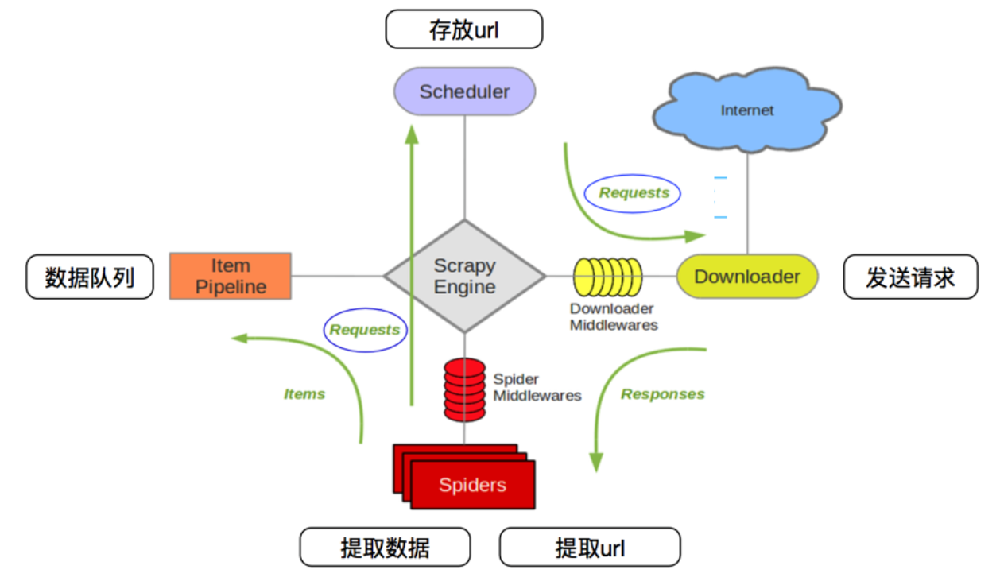

# Scrapy



工作流程：

1. 爬虫中起始的url构造request对象，并传递给调度器
2. 引擎从调度器中获取到request对象，然后传递给下载器
3. 由下载器来获取到页面源代码，并封装成response对象，并返回给引擎
4. 引擎将获取到response对象传递给spider，由spider对数据进行解析（parse），并返回给引擎
5. 引擎将数据传递给pipeline进行数据持久化保存或进一步的数据处理
6. 在此期间，如果spider中提取到的并不是数据，而是子url，可以进一步提交给调度器，重复流程2 

```bash
# 通过包名安装
pip install -i https://pypi.tuna.tsinghua.edu.cn/simple scrapy
# 通过手动下载whl包，安装
pip install Twisted-21.7.0-py3-none-any.whl

# 查看版本
scrapy version

# 创建爬虫项目
scrapy startproject Example4399

cd Example4399/Example4399/spiders

# 新建爬虫
scrapy genspider spi4399
```

