# Badminton

# 反手后场高远

1. 持稳球拍，拍面面向来球，迎接来球
2. 手掌朝向外侧，手腕立住，击球时旋转手腕
3. 反向引拍，不能收肘，引拍要慢，击球要快
4. 击球点，要远离身体，在身侧
5. 击球时，不能过度拉伸手肘，要有一定的弯曲度。
6. 左手反向挥动
7. 必须要依靠并步调整位置（比较短距离的侧向运动），最后的跨步要大，右脚落地，同时击球。
8. 击球后，拍面要有一定的回弹，不能顺势挥出
9. 四指发力，手腕旋转，大拇指辅助发力。

# 步伐

基本步伐：

1. 并步

   - 并步上网

   - <video src='./legend/badminton/并步上网.mp4'/>

   - 并步后退

   - <video src='./legend/badminton/并步后退.mp4'/>

2. 交叉步

   - 前交叉

   - <video src='./legend/badminton/前交叉步.mp4'/>

   - 后交叉

   - <video src='./legend/badminton/后交叉步.mp4'/>

3. 蹬跨步

   - 后脚蹬地，前脚向前跨步，如上图，后交叉步之后就是一个蹬跨步上网
   - 在蹬跨步时，向前跨步的腿承受了巨大的冲击力，膝盖的压力是非常大的，所以要注意一点：**大腿和小腿的夹角一定要大于90度**，也就是膝盖不超过脚尖。

4. 

1. 如何起动：
   - 轻跳起，类似于轻踮的高度，动作要快。
2. 如何停止：
   - 脚尖指向来球，不要内撇和外摆，容易崴脚受伤。
   - 不要只观察来球，还要观察对手的场地
3. 如何回位：
   - 击球之后，必须快速的做出回位的第一小步。这一步保证你持续地移动
   - 有时间看到对手的击球，就能及时衔接下一次启动
   - 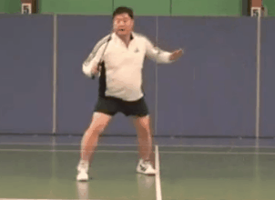
4. 双打网球扑球：
   - 三个步骤：准备（起动），击球（跨一步），准备（一步回位）。网球扑球时，对手回球也会很快，必须击球后，立马回到准备位。
   - 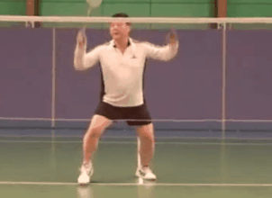
5. 单打网前移动步伐：
   - 注意回位“落地”的时机是在对方击球时，不是提前不是推迟。
   - 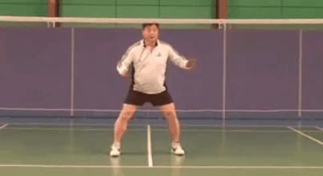
6. 双打正手网前挑球
   - 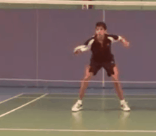
7. 双打反手网前挑球
   - 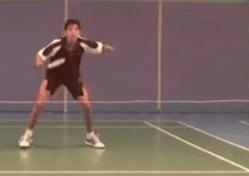
8. 双打正手平抽
   - 5步：起动，横移左脚后横移右脚，击球，回位，准备
   - 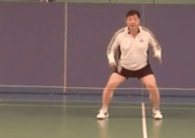
9. 双打反手平抽
   - 4步：起动（迈右脚），右脚落地时同时击球，小步回位，准备
   - 
10. 单打正手接杀
    - 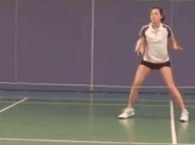
11. 单打反手接杀
    - 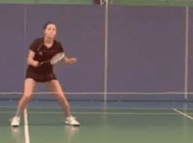
12. 双打防守（对手网前进攻）
    - 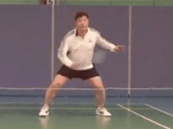
13. 双打防守（接杀挑高球）
    - 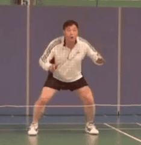
14. 

# 击球

1. 杀球
   - 击球点一定要在身前
   - 握拍转动十度，大拇指向下一点（在食指和中指之间，稍握圆球拍。）
   - 视线在来球，左手不能挡住视线
   - 身体不能扭转过度
   - 击球前，瞬间暂停，可以增大击球力度。
   - 先移动左手，再挥出右手
   - 重心从右脚移到左脚
2. 反手网前搓球
   - 手指握拍，依靠手指捻动球拍，并形成一个小半圆
   - 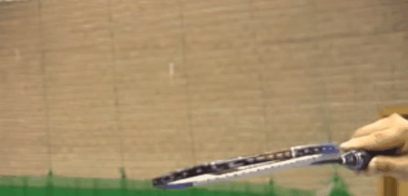
   - 手臂要从正手位移动到反手位，从右到左。移动范围要大
   - 击球时，右脚同时落地。
3. 正手网前搓球
   - 击球点在身前，而不是身侧。
   - 拇指和食指都要伸直（），手腕轻转。
4. 反手平抽
   - 拍子指向来球，然后再击球。
   - 并步侧移，迈右脚，使球在身前，身前击球，身前而不是身侧。
   - 手腕低于拍头。击球点要与视线水平。
5. 

# 词汇

1. shuttlecock：
   - n，羽毛球，毽球
   - vi，往返移动，走来走去
   - vt，将什么抛来抛去
2. 