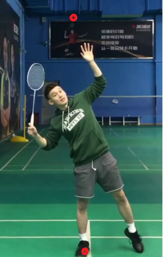
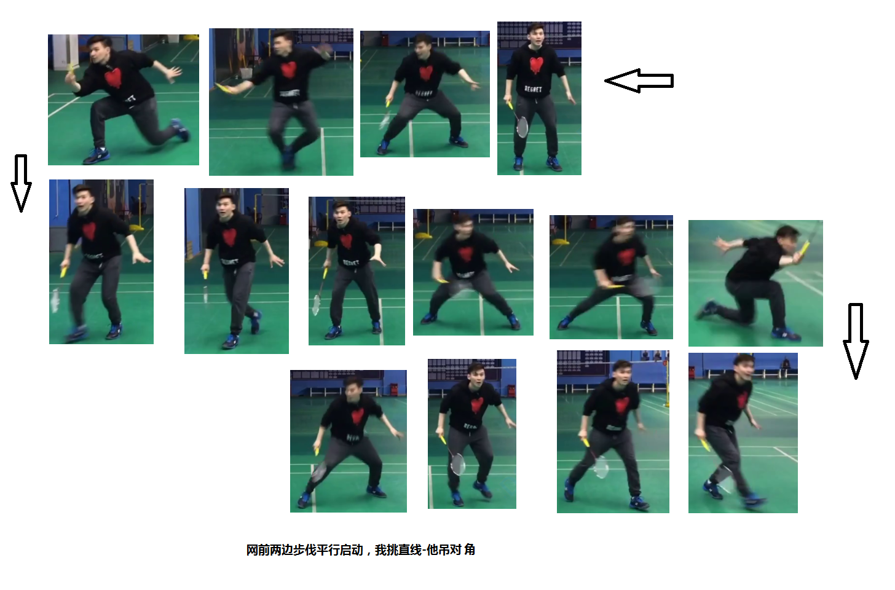
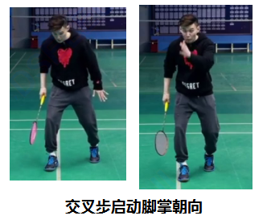

# Badminton

发球：正手发高远球，反手发网前球

击球：放网，搓，推，勾，扑，挑，平抽，高远，杀。

步伐：并，交叉，蹬跨，垫，弓箭步，启动，回位，全场米字步伐。

# 1 杀球

挥拍：用于回高远球，原地击球

转身：让发力更自然，更容易回位

定点杀球，移动杀球，单腿起跳杀球，正手不转身杀球，头顶一步起跳杀球，双腿起跳杀球，单腿起跳收双腿杀球。

## 1.1 挥拍

1. 原地挥拍：一架二引三击四收。

2. 一架：

   - 

   - 脚

     - 侧身（拉开拍与球之间的距离，才有空间加速），

     - 通常以并步后退，以确认步（右脚确认）的形式，找到合适的位置，一定要使球在你的身前方。

     - 重心放在右脚上，左脚踮起，

   - 手

     - 左右手都要做投降状，有个展肩的蓄力（有点扩胸的感觉，扩展肩胛骨）
     - 左手用来瞄球，
     - 身体与大臂，大臂与小臂尽量呈90度。
     - 左肩高过右肩

   - 腰：
     - 侧腰要像弓一样拉满，**记住要抬头，身体往后仰**（这样你的整个身体才能很好的呈弓状，重心也会移至右脚）

3. 二引：

   - 
   - 手
     - 拉左肩下移，右肩高过左肩（两肩顶到肩胛骨），左肩的一个反作用力能帮助到右肩向上。
     - 要顶肘，肘不能顶的太高（当然刚开始练的时候，动作幅度大一点是好的），要往前顶一点，小臂手腕自然后倒，
     - 大臂和小臂不能夹着，依旧差不多90度左右
     - 顶肘不能贴耳，离耳要有一定的距离
   - 脚和腰
     - 右脚将身体往前送，身体有个转动的过程，使身体正面面向对方。
     - 重心从右脚转移至左脚
   - 注意：**如果肘顶不上去，一部分是因为没有没有抬头以及身体没有往后仰**

4. 三击：

   - 
   - 手
     - 大臂往前弹（推）小臂，小臂由倒状，自然直立伸直，在整个大臂-小臂-手腕要伸直的时候（在这之前拍面不是正面朝前），小臂内旋手腕外折（拍面正面朝前）
     - 如果手腕不外折，我们会伤到肘（网球肘）
     - 在手能够到最高点（头右前方一点点）球拍的甜区击球。抢高点要找到够高但是不至于让自己身体感觉很僵的高点。
       - 有人击球不在最高点，而是会歪向右侧，不是直直的击球。
       - 练习的时候是好好的，而让他们加速的时候就会歪。
       - 原因一：没有，抬头和身体往后仰
       - 原因二：他们想在收拍的时候，向身体的左侧收拍。
     - 关于转腕，在有压球时，转腕（有待商榷）
     - 在击球之前，手都不能握的太紧，太紧，会使你挥拍的速度，和转腕都会变慢。只有在击球瞬间握紧球拍即可
   - 脚
     - 随右手向前击球时，左脚向后拉，随后右脚向前过渡（右手和右脚不能同步）
   - 腰
     - 转身的重点主要是想通过用腰，把力量放大。重心向前，腰向前躬，将拉满弓的能量释放。
     - 击球前一瞬间转身，**不能提前转身**，不然用不到腰的力量。
   - 先动左手左腿，

5. 四收

   - 
   - 在击球后，往下再挥一段，再往身侧收。（这是击球发力的一小段发力过程）
   - 身侧收：一部分原因是你的身体还是在向左侧旋转，所以你才可以做到收拍会收向左侧。

## 1.2 转身

1. 转身的目的在于用上腰
2. 腰是连接上半身和下半身的肌肉群，可以用于力的传导（从下半身传到上半身）
3. 错误一：转身往前迈右腿。
   - 正确：转身不是往前迈右腿，而是拉左腿，往后跨，右腿仅有一个原地踏，或者略微往前迈的动作，而且这样的动作也仅仅是为了回位。
4. 错误二：右手右腿同时发力。
   - 正确：右手挥出后，右腿再随身体向前。
5. 错误三：提前转身或不转身
   - 正确：击球前一瞬间转身，**不能提前转身**（提前拉左腿，已经后胯后再击球是没用的），不然用不到腰的力量。
6. 错误四：整个身体是直的。那么将不会用到腰的力
   - 正确：抬头，身体有点往后仰，把腰和整个身体像弓一样拉开
7. 动作详解：
   - 首先，必须先说明，我们的身体并不是以左腿为轴，去转身，这样并不会用到腰的力。
   - 正确的是：我们先侧身，拉我的左边，身体已经被左侧像弓一样被拉满，然后右侧挥出去，就如同释放弓的弹性势能般，更加有力。
   - 当然这种力并不是只有左肩与右肩（水平轴）有这种弹性势能，并且还有上半身与下半身（竖直轴，抬头往后仰）也会有这种能量。
   - 侧身架拍，左手瞄球，右腿确认（前后位置差不多在右腿踩的点靠前一点上，左右位置在脑袋偏右侧一点），球高右腿步子开的小，球低而快开的大。
   - 重心压右腿越多，后面越好发力。

- 

- 
- 
- 

## 1.3 定点杀球

球很高，足以移动到位等球到位杀球。

实施：

1. 架：确认步，架拍（左肩左手抬高），重心压在右腿，展肩挺胸，抬头腰撑住身体后仰一点，抬左腿（不用抬很高，收起来一点，也可以踮左腿）
2. 引（转换重心）：拉左肩，放左腿，上右肩（左肩下的多，右肩上的多），展肩挺腰，顶肘（肘朝前外与眼睛差不多高），倒拍（倒手腕）
3. 击：小臂，食指推，抓紧，肘朝外，摆平，弯腰，挥下去，抬右腿（反作用力）。
4. 注意：
   - 只要还没有挥拍，球一定要在我的视野当中，尽量抬头使其处于我们的脑门前面
   - 顶肘不用顶到位了，才挥小臂，很多前后动作是，前面动作到一半的时候，就要开启后面的动作了。
   - 引拍的幅度不需要太大，有时候为了迅速的回击，顶肘，倒手腕就可（不用倒太多的小臂），不需要将拍框触及到自己的腰背。为了快，我们不能引拍太大。
5. 

问题：

1. 击球点在哪？：抬头顶腰后，下巴的延长线。抬头是为了顶腰更充分，也是为了产生击球的空间感（拉开击球距离）

## 1.4 移动杀球

移动杀球就是在定点杀球的基础上，加上并步退，最后杀的时候还要加上一个小跳。

定点杀球：是一个完全的主动进攻

移动杀球的目的是：我们还没有到杀球的位置，所以我们要移动，所以不完全是一个主动的进攻。

在移动过程中，有可能球就不是很高，一旦移动到位，我们就要杀了。

如果我们刚移动到位，我们还用定点杀球的动作，我们会仰着打，打出的球将不会很远。

实施：

1. 移动杀球：一做确认步（**右腿一定要过球，让球在你的右前方一点**）就先抬左腿，这样可以防止我们仰着打。
   - 抬左腿（不用抬很高，抬一些就行），压右腿（压的越多，可以跳的越高）架拍，拉左肩左手，放左腿，引拍，杀，抬右腿。
   - 我身体往后压（压右腿），无所谓，因为我靠着惯性，过球了。
2. 

注意：

1. 引拍时就可以跳了。

## 1.5 双腿起跳杀球

目的：能够更多的用上腰。（能够将弓拉得更满）

有两种：定点双腿起跳杀（主动）和移动双腿起跳杀（半主动）

### 1.5.1 定点双腿起跳杀

条件：别人起个很高的球，我先退到位了，甚至还可以等一下，球头一旦朝下，就可以起跳

实施：

- 后撤：前交叉退（如果球很高，我可以处于一个主动的状态，那么可以前交叉维持一个慢节奏击球），退过球（一点，不用太多），
- 侧身确认步，两脚并在一起，微微踮起，膝关节和髋关节微曲，起跳，身体舒张为弓状，双腿向后弯曲（收双腿），吸气，同时左右手同时架拍，左肩高，右肩低
- 引拍，肘略微向前顶，拍自然后倒，向下拉左肩
- 击球，腰腹发力，将身体的弓状能量释放，身体由舒张态变为收缩态，击球
- 

注意：

1. 击球点的位置：和定点杀球与人的**相对位置**一样，只是相对于地面的高度变高了。

### 1.5.2 移动双腿起跳杀

单腿起跳，收双腿。（一旦右腿到位后，收左腿，压右腿，右腿跳，收右腿）。其余就和定点双腿起跳杀一样了。

**落地的时候**两腿的间距较大（定点双腿起跳杀两腿的间距小）

移动双腿起跳杀基本都是在后场头顶杀球用。后场正手区一般做不转身杀球。

## 1.6 正手不转身杀球

因为球在正手区太靠边（但不是很高，这时我无法做到很主动），没有办法转身，所以才使用正手不转身杀球。

1. 追球：启动，并步（**并过球**，不需要架拍），确认（重心从左腿推到右腿，右脚踮，压右腿膝盖），右腿直着往上跳（仍旧有个向后的惯性，所以看起来好像是向右后方在跳，置空向后的速度差不多和球的速度一致）。
2. 置空：挺腰挺胸，架拍（左手往前伸，右手往后展，因为是不转身，所以我们的肩膀不需要一高一低，两肩差不多高，左肩略高一点。此时的球大致在左肩面前的这个位置）
3. 借力/发力：左手肘往背侧后收（并且略有一点点下收），右手肘有往胸前侧略顶（并且有一点点上顶，反作用力），倒手腕，杀。（此时依旧挺胸挺腰）
4. 落地：由于惯性，左右腿在空中会后移，而我击球时上半身会前移一点，所以最后重心会落在靠左脚一点（而不是右脚）

# 2 步伐

击球永远是在右脚（右撇子）。

击球时，尽量使脚尖对着来球，不要朝外，也不要朝内，容易崴脚。

前脚掌为着力点跑。

基本步伐：启动步，弓箭步（前场），确认步（后场），并步，交叉步，垫步，蹬跨步

组合步伐：

## 2.1 [启动步](https://www.bilibili.com/video/BV1Ev411i7ZS)

1. 没有启动，甭想移动。
2. 基本动作详解：

   - 准备：双脚差不多与肩同宽，双脚微微踮起（利用前脚掌触地），膝盖微微弯曲。注意：在别人击球前，你就需要用前脚掌触地。随时准备下沉。
   - 下沉（对方击球时）：双腿展开（**展开可以展成双脚平行位，也可以展成双脚前后位，有利于你下一步有方向的移动**），脚后跟抬高（踮高），身体往下沉，屁股往下坐，**膝盖弯曲**（整个腿都是紧绷的，需要移动到哪边，就让另一侧大腿发力，整个腿伸直后就把人推出去了）
   - 移动：需要去向那边，另外一侧的腿（前脚掌为着力点，大腿发力）发力，将身体推向那边（不是发力往上推）
3. 要下沉多少？：取决于你需要多大的推动力，如果需要的推动力越大，那么你屈膝就应该越多（但不能超过90度）
4. 双腿要展开多大？：

   - 为了让你的推动力的作用力方向不是向上太多（所以你要适当展开），目的是要让作用力方向与你需要移动的方向夹角更小。
   - 但也不能开太大，否则不能用上前脚掌。在准备的过程中，也不能把双腿开太大（与肩差不多就行）。
   - 开的变化幅度越大，越费时间。
5. 什么时候启动？：

   - 具体时机：架拍时准备，引拍时离地，碰球时屈膝压大腿看球的去向（在空中压重心，屈膝，下坐），知道方向后碰地推身体
   - 在别人击球时启动。击球前，容易被晃，击球后，来不及。
   - 启动时机可以通过让对方错误估计击球时机，给己方机会。（假动作，停顿）
6. 单腿启动（移动中启动）
   - 在打球的时候，很少有机会双腿（并排）准备，大部分都只能通过单腿做准备（将重心放在一只脚上），然后直接就下沉移动。
   - 哪只脚作为行进方向的前脚，哪只脚就作为重心脚，以重心脚为支点，由重心脚去进行准备阶段
   - 交叉步启动：向前走启动，后退启动。
     - 先做迈步，在迈的时候，以重心脚为支点，做准备
     - 收另外一只脚（有点向重心脚收拢后，再展开，类似于关了再开的感觉），下坐展开
   - 并步启动
7. 启动类别：
   - **防守启动**：
     - 面向（身体对着，略微斜站，但双脚依然平行）对手的双脚平行站位启动，在我起球之后，都要进行防守启动。
     - 如果对方真的杀下来，我才能很好的照顾到全场，避免视野盲区。
   - **进攻启动**：
     - 双脚前后站位启动（打哪里，右腿就对着哪里），方便我们前后跑。
     - 只要我不起球（杀，吊，挡网，勾球等），或对方处于防守，我都要用进攻启动。
     - 注意腿不是像弓箭步与身侧向平行，而是与身侧近乎垂直（如并步般）
     - 
8. 二次启动：
   - 在被晃后，再次启动。
   - 启动后发现与自己预想的方向不一致，第二次启动（以一只脚多为单脚启动）
   - 练习小密步和前后踏（在线的前后用脚尖踏）
9. **不能为了回位而回位，不管你是否回到中间了没有，它什么时候打，你就减速/不移动，准备启动。**
10. 启动训练：
    - 启动中场防守左右。
    - 小密步：以高抬腿为前奏，以前脚掌为着力点，慢慢降低抬腿高度，形成密步，加速即可。
    - 前后踏：双腿屈膝前后踏步，脚后跟抬起来。
    - 准备与下坐状态快速交换
    - 交叉步单腿启动（前后行进，行进的前脚为重心脚，惯性向前）
    - 并步单腿启动（转换为平行启动位）
## 2.2 步伐基本理论

### 2.2.1 弓箭步

1. 只要是下手球都要用弓箭步去接。

   - 常常用在前场和中场步伐中。

2. 弓箭步运用了：高度与距离的转换，

   - 牺牲高度，换大距离
   - 补偿高度，牺牲距离

3. 简述：

   - 弯左腿，
   - 身体后倾（有助于抬高右腿，进行大迈步），重心放在左腿，
   - 迈（弯）右腿（右脚的脚踝不能放松，要保持脚后跟先着地，翘着前脚掌）。
   - 压重心（将重力均匀分配在两腿上，右脚膝盖切莫过脚尖）
   - 弯腰（增大击球距离）
   - 收左腿（帮助我们卸力和回位）
   - 

4. 注意：

   - 这样重心低，不会太过于靠前，对右腿的膝盖造成压力小。并且也容易回位。
   - 脚掌与身侧平行，否则容易崴脚。

5. 功能：右撇子一定要迈右腿，这样可以增大击球距离，右手才能发力，身体才能站稳，才能顺利回位。如果迈左脚会很别扭

   

### 2.2.2 空间感与节奏感

1. **空间感**：击球要有空间感，要拉开拍与球的距离，才能很好的发力。
   - **打下手球：在步伐方面，固定需要用弓箭步。**
2. **节奏感**：视球速和自己离球的距离，换用不同特点的步伐
   - 球速快且距离自己近，并步
   - 球速慢且距离自己远，前交叉
   - 球速较快，但距离自己远，后交叉（大型并步）
3. 时间节奏：
   - 球速快的羽毛球在空中飞行的时间最多只能够让你移动两步（或快速或稍快速的两步）。
   - 球速慢的羽毛球在空中飞行的时间最多只能够让你移动四步
     - 通常一种类型的基本步伐最多只能做两步，两步后就要换用其他类别的步伐，所以四步就需要用两种步伐去移动
     - 换用步伐类型，我猜想有可能是为了消耗过长的时间，才用换步伐调整节奏。
   - 
4. 

### 2.2.3 [并步](https://www.bilibili.com/video/BV1Ut4y1U7x9)

1. 什么时候用并步：球离自己近且球速快（接杀球等）
2. 并步特点：步子小而节奏快，并步是最快能做到一个弓箭步的基本步伐。

### 2.2.4 交叉步

1. 什么时候用交叉步：
   - 前交叉：球离自己远且球速慢的球。
   - **后交叉：球离自己远，但球速比较快。**
2. 交叉步特点：步子大而节奏慢
3. 类别：
   - 前交叉：正常走路，**双脚进攻启动，才能获得较快的速度。**
   - 后交叉：大型并步，球速比较快，但距离远。
4. 

## 2.3 网前

快速吊球羽毛球掉落的位置一般在网前发球线前后一点，这里的位置属于球速快且距离近。

慢速吊球羽毛球将很靠近网带。

### 2.3.1 正手平行启动

因为球速快且距离近，故采用并步+弓箭步的步伐，接正手的快速吊球。

<h4>去

条件：我正手打个正手对角高远球，并且回中成功，对手打我正手以快速吊球。

实施：

1. 平行启动：准备，下坐（**确认球的方向**，看是左还是右，切不可展成前后斜站位）。其实我们在发完球之后，就可以在原地踏步，适机单腿启动。
2. 第一步并步：左腿平行并向右腿（并完之后，确认球的去向，后场，中场，前场），
3. 第二步弓箭步：如果是前场，弓箭步，右腿斜向前迈出。

细节：

1. 并步：保持膝盖弯曲，为弓箭步做准备
2. 弓箭步：迈步的时候，右腿伸直，脚踝绷住，脚后跟先落地，

<h4>回位

不能为了回位而回位，不管你是否回到中间了没有，它什么时候打，你就减速/不移动，准备启动。

如果挑对角，可以采用并步退，回中防守。

如果挑直线，大部分时候我们都用交叉退。

- 原因一：挑球，有时间，节奏合适。
- 原因二：弓箭步站起来后，**因为挑的是直线，就可以一直面对着看着对手。**如果采用并步（斜着退，背后有移动的盲区）。
- 原因三：我们并不需要完全回中，防守正手半场就可以，在正手半场靠近发球中线即可。就算对手杀我反手，因为距离够长，也能够进行中场防守。

实施：

1. 收左腿（不是并左腿，两脚之间还是有一小步距离。**收的越多，回中越快**）。抬头看对手，然后重心换至左腿。
2. 交叉退

在大部分时候，你最多可以完整的退一步（如果加上收左腿的一小步，那有两步），如果挑的很高，那么可以多退几步再单腿交叉启动。如果实在时间长，可以在中点，以左腿为重心，缓慢拖右脚，等待启动。

**这个就是步伐之间的连贯衔接，而不是打完快速回中然后平行再启动。**

对手回球如果很慢（也就是说，球会很靠近网带）：并两步+弓箭步，以靠近网带。

### 2.3.2 反手平行启动

接反手快速吊球：直接启动+弓箭步

- 这里省去右腿向左腿并的原因是：我们弓箭步最后迈的是右腿，而不是左腿，而且右腿并过去迈的还是右腿，还不如直接跨右腿
- 反手直接弓箭步，和正手并步再弓箭步，距离是一样的。

如果反手慢速吊球（意味着很靠近网带）：启动+右腿迈一步（转身）+并步（左腿并向右腿）+弓箭步（左腿弯曲，右腿迈）。

实施：

1. 启动：准备，下坐，移动，右腿发力，压左腿
   - 从右腿到左腿的过程中有个重心的转移，右腿发力（重心在右腿），伸直，身体开始倾向左侧，左腿开始屈膝弯曲（重心在左腿）
   - 而不是简简单单以左腿为支点，一定要压，左腿被压得越多，右腿抬得越高，左腿蹬得才有力，右腿跨得才更远。
2. 弓箭步
   - 手上反手握拍，大指姆还是在宽面上，略微有点向斜楞靠近
   - 此时要抬肘，大臂和肘与肩差不多高。
3. **整个过程：推压蹬跨**

### 2.3.3 网前两边平行启动

1. 我挑直线-他吊对角
   - 我挑直线，要前交叉回位，我正面面对着对手。
   - 
2. 我挑对角-他吊直线
   - 挑对角后（我面对着对角），回位可以用并步或后交叉。
   - 
3. 

### 2.3.4 网前两边平行启动训练

1. 前场正手
   - 1.基本前场正手动作:
     - 启动（准备，下坐），
     - 平行并步（这里的平行是为了判定到底是中场还是前场）
     - 弓箭步（压左脚，抬高伸直右脚，绷紧脚踝）
     - 回位（收左腿，前交叉步最多退两步，先合两脚，再展开启动，进阶后可采用单腿启动）
   - 基本前场正手动作+缓慢单腿启动（控制节奏）
   - 基本前场正手动作+最多退一步（左腿一挪过来就启动）+单腿启动4.正手挑对角（可以用并步退，也可以用后交叉退）

2. 前场反手
   - 基本前场反手动作
     - 启动（准备，下坐，移动（重心先在右脚，伸直后重心移至左脚，压左腿））
     - 弓箭步（压左腿，左腿屈膝，伸直抬高右腿，绷紧脚踝，脚后跟着地）
     - 回位（收左腿，最多后退两步，先合两脚，再展开启动，进阶后可采用单腿启动）
   - 基本前场反手动作+缓慢拖单腿启动（控制节奏）
   - 基本前场反手动作+最多退一步+单腿启动
   - 反手挑对角（可以用并步退，也可以用后交叉退）
3. 前场正反手
   - 前场挑直线（退一步就启动，防半场所以可以回少一点）
   - 前场挑对角（退两步，需要回多一点）
4. 带球前场正手
   - 注意：当我们退到第二步的时候，你的伙伴抬手扔球，单腿启动。  

### 2.3.5 正手前后启动

只要你不起球，你就应该前后启动站位。

只要对方没法进攻，那么我们就是前后启动。

条件：我发网前小球（不发高远），接球后，挡网（不起球）

<h4>去

实施

1. 前后启动
   - 在平行站位的基础上（与肩同宽），双脚前后站一点，屈膝，一般右腿在前，左腿在后。
   - 可以双腿启动下坐，也可以一只腿为重心腿进行单腿启动。
   - 左腿发力
   - 如果第一步是并步或者是后交叉，双脚在准备时，斜着平行站，双腿要开大。
   - 如果第一步是前交叉，双脚的脚尖都要对着对手，准备，下坐的时候，双脚不能开太大（开太大，你就不能用前脚掌发力）。
   - 
2. 第一步：
   - 视距离远近，球速快慢，可以采用并步，后交叉或前交叉（近->远，快->慢）
3. 弓箭步
   - 视球的高低，判断自己是否可以抢高点，如果可以，那么弓箭步就不需要压太多左腿。
   - 如果无法抢高点，球要落地了，那么就需要压左腿，大步弓箭步。
   - 

<h4>回

我们挡完网后，如果挑球，那么节奏就慢，你可以交叉步回。但如果别人，继续挡网，那么节奏就会很快。所以就会使用并步退。

实施：

1. 挡网后，收左腿，向后并一步
   - 如果收左腿收得多，那么在回的时候，先向后展开左腿（向后踏，相当于左腿向后跨了一点而右腿没有动，这个我们叫做并半步），再并步，如果收的少直接并步就可以。
   - 为什么我不用回中场？因为他最快的回球方式就是继续挡网，如果他起球，那么我们有足够时间去向后场。勾对角，推球都有时间。
   - 甚至有时候，我们就不需要动，更有甚者还向前走，如果他挡的不好，我们可以直接扑球。
   - 所以，按理说，我并一步后，它就挡网碰球了
   - 向后并的一步，不需要太大。
   - 如果后退用交叉步，如果对方勾对角，死。（有进阶如此使用，但现在不这样做）
2. 单腿启动：
   - 并步后退一步后单腿启动：以左腿为重心腿，一抬右腿，启动。（如果没有那么快，就拖右腿）
   - 很多人会以为，我们后退并了两步，把单腿启动的那个动作当成是并步
   - 其实不然。第二个步子是右腿抬，双腿展开，而不是并步的右腿抬，双腿关。
   - 
   - 如果我挡完后，对手立马就挡回来了，那么我们收左腿后，左腿立马向后踏（前后单腿启动），下坐。
3. 并步再上前重复正手挡网。

### 2.3.6 反手前后启动

反手区基本和正手差不多。

实施：

1. 双腿前后站，右脚在前左脚在后，重心压在右腿上。
2. 第一步：
   - 并步：启动开大点，前进才有力。
   - 前交叉：脚尖要对着球，启动不可开太大。
   - 注意：这里没有后交叉，因为在向我们的反手区移动时，后交叉它的前进方向和反手区域不太一致，前进方向会偏右一点，会很别扭
3. 弓箭步
4. 回：和正手一致（正常高度挡网）。
   - 用并步回退的过程中，身体不能太多斜着退（它不像正手，盲区仅仅只有背后右后方一点），不然你的盲区会很多（左前方的其它区域都是盲区），所以要稍稍正着点退。
   - 如果，自己是在低点挡的网（自身处于被动，对手处于主动，eg:推球），那么我们必须调整自己，通常采用：转身的方式（右腿向后，让左腿处于网前，然后以右腿为重心腿单腿启动）。
5. 

### 2.3.7 网前两边前后启动

#### 我正手挡直线-对手勾

发现对手勾对角后，启动切莫在空中转身体以去向反手区。

**对手正常勾对角**：有一个转身踏的过程（右脚抬，紧接着换方向踏出去，并一步，弓箭步就去反手区了）

**对手快速勾对角**：如果我在正手区挡了网，弓箭步后（对手快速的勾了对角），后撤的第一步单腿启动就换向去反手（和平行启动去网前反手一样）。

#### 我反手挡直线-对手勾

在并步后，以左脚为重心脚，抬右脚单腿启动（转向去正手），但大部分时间来不及。

通常我们会采用，以左脚为重心脚，抬右脚单腿启动（不转向）后，后交叉（左脚平行侧向移动，右脚随之跟上），弓箭步。

实施：前后启动，并一步，弓箭步，后退并一步，并步后侧单腿启动，后交叉，弓箭步

#### 我正手勾-对手挡直线

我勾完之后，要主动进行对着球，主动转向到反手

#### 我反手勾-对手挡直线

一种是并一步后再转向单腿启动（对方不是很快），一种是直接转向启动（对方很快）

## 组合步

1. [后场步伐](https://www.bilibili.com/video/BV1zi4y1g7Lp)
   - 后场移动之前站位：一般平行站，或右腿在前站位（防别人攻击你的反手位）
   - 后撤：
     - **用并步退（无论正手还是头顶），在抬右脚转侧身位（启动就转侧身位）的过程中，让左脚有个小跳（垫步），左脚落地后再并步退。**
     - 如果球特别靠边，我没办法回球后转身，那么就采用不转身打，并步退然后并步回。
   - 回位：大部分正手击球后，都用交叉步回位（包括起球和杀球），
     - 如果回球是正手直线，还是用交叉步回位（这样是为了一边可以正面看着对手，防止他回直线，不至于落于被动，一边回位）
     - 如果回球是正手斜线，可以用并步或交叉步回位
   - 头顶有一个特殊，有时候我们会交叉退，退到位，确认步，击球，转身。这个主要用于当别人起的特别高，你有时间准备的时候
   - 练习时，要多思考，在我们击球后，别人会怎样，带着套路去练习。
   - 其它打法：
     - 在后场吊球，通常，落地后一个并步回，然后启动，准备击下一个球。
     - 在后场杀完球，通常对方回球会很快速，我脚落地后，就做一个启动，准备击下一个球。
   - 
2. [单打防守步伐](https://www.bilibili.com/video/BV1Bi4y1g7RU)（中场步伐）
   - 在击完起球和高远球，回位后，平行站位。
   - 重点：手带动身体，先伸拍，再动身体，通常在启动之后，就要立马伸拍。
   - 启动：脚后跟抬起，重心前移，屈膝往下一坐，双脚站的更开。
   - 正手防守：
     - 正手：左脚发力推，并步向右脚，然后右脚迈出，做弓箭步。
     - 另外一种：如果球速很快，不并，直接弓箭步防
     - 
   - 反手防守
     - 迈右腿防：右脚发力，迈向右侧转身（打得很靠近边线）
     - 弓步防：不用迈右腿（打得比较靠近身侧）
     - 
   - 回位后的站位：
     - 起球双脚平行站位
     - 挡球双脚前后站位：挡哪右脚就朝哪，右前左后，这样的做法，我认为是防对方打你的反手。
     - 
   - 握拍：
     - 排面斜向上45度，大拇指按在斜楞上
   - 
3. 

# 击球

1. 双打发球：
   - 右手拇指按在拍柄的宽面上，握拍靠柄前一点
   - 左手拇指和食指（最多加一个中指），压在两根羽毛之间的位置
   - 球头的朝向，根据你想击打的高度和方向做上下左右调整。右手的要保持拍面与地面垂直，直推，可以略微朝上（仅仅是略微），球高或球低都不会去调整右手，只需调整球头的朝向。
   - 击球前：拍面侧架在回拉之前可以放在左手拇指指肚根上，回拉时右手收腕并且略微弯肘，
   - 击球：右手拇指发力，放腕，肘自然伸直（也是略弯），不要加速，推球即可
   - 双脚前后站位，右脚在前
2. 双打网前接发球：
   - 左前右后前后站位，降低重心（也可以略微降低重心，只要在移动过程中降低就行），拍面略高于头
   - 如果站的靠中场，启动压左腿（一定要先压左腿，降低重心后在迈），迈右脚，拍面高于头击球，与网差不多高或者说平行
   - 如果靠近发球线，启动直接迈左脚，拍面高于头击球。
   - 如果偷后场，那么右脚迈开，并步退即可。
   - 
3. 回高远球：
   - 原地挥拍：一架二引三击四收，
   - 一架：
     - 
     - 脚
       - 侧身（拉开拍与球之间的距离，才有空间加速），
       - 通常以并步后退，以确认步（右脚确认）的形式，找到合适的位置，一定要使球在你的身前方。
       - 重心放在右脚上，左脚踮起，
     - 手
       - 左右手都要做投降状，有个展肩的蓄力（有点扩胸的感觉，扩展肩胛骨）
       - 左手用来瞄球，
       - 身体与大臂，大臂与小臂尽量呈90度。
       - 左肩高过右肩
     - 腰：
       - 侧腰要像弓一样拉满，**记住要抬头，身体往后仰**（这样你的整个身体才能很好的呈弓状，重心也会移至右脚）
   - 二引：

     - 
     - 手
       - 拉左肩下移，右肩高过左肩（两肩顶到肩胛骨），左肩的一个反作用力能帮助到右肩向上。
       - 要顶肘，肘不能顶的太高（当然刚开始练的时候，动作幅度大一点是好的），要往前顶一点，小臂手腕自然后倒，
       - 大臂和小臂不能夹着，依旧差不多90度左右
       - 顶肘不能贴耳，离耳要有一定的距离
     - 脚和腰
       - 右脚将身体往前送，身体有个转动的过程，使身体正面面向对方。
       - 重心从右脚转移至左脚
     - 注意：**如果肘顶不上去，一部分是因为没有没有抬头以及身体没有往后仰**
     - 
   - 三击：

     - 
     - 手
       - 大臂往前弹（推）小臂，小臂由倒状，自然直立伸直，在整个大臂-小臂-手腕要伸直的时候（在这之前拍面不是正面朝前），小臂内旋手腕外折（拍面正面朝前）
       - 如果手腕不外折，我们会伤到肘（网球肘）
       - 在手能够到最高点（头右前方一点点）球拍的甜区击球。抢高点要找到够高但是不至于让自己身体感觉很僵的高点。
         - 有人击球不在最高点，而是会歪向右侧，不是直直的击球。
         - 练习的时候是好好的，而让他们加速的时候就会歪。
         - 原因一：没有，抬头和身体往后仰
         - 原因二：他们想在收拍的时候，向身体的左侧收拍。
       - 关于转腕，在有压球时，转腕（有待商榷）
       - 在击球之前，手都不能握的太紧，太紧，会使你挥拍的速度，和转腕都会变慢。只有在击球瞬间握紧球拍即可
     - 脚
       - 随右手向前击球时，左脚向后拉，随后右脚向前过渡（右手和右脚不能同步）
     - 腰
       - 转身的重点主要是想通过用腰，把力量放大。重心向前，腰向前躬，将拉满弓的能量释放。
       - 击球前一瞬间转身，**不能提前转身**，不然用不到腰的力量。
     - 先动左手左腿，
   - 四收
     - 
     - 在击球后，往下再挥一段，再往身侧收。（这是击球发力的一小段发力过程）
     - 身侧收：一部分原因是你的身体还是在向左侧旋转，所以你才可以做到收拍会收向左侧。
   - 
4. 杀球
   - [基础动作](https://www.bilibili.com/video/BV1Hv41117wQ)：和回高远差不多，要保证击球点在你的靠右前方。
   - [双腿起跳杀](https://www.bilibili.com/video/BV1wK411K7Kw)：
     - 后撤确认步，两脚并在一起，微微踮起，膝关节和髋关节微曲，起跳，身体舒张为弓状，双腿向后弯曲，同时左右手同时架拍，左肩高，右肩低
     - 引拍，肘略微向前顶，拍自然后倒，向下拉左肩
     - 击球，腰腹发力，将身体的弓状能量释放，身体由舒张态变为收缩态，击球
   - 
5. [挑球（接吊球）](https://www.bilibili.com/video/BV17a4y1j7KV)
   - 先压左腿（弯左腿），再迈（弯）右腿。这样重心低，不会太过于靠前，对右腿的膝盖造成压力。并且也容易回位。
   - 
6. [吊球](https://www.bilibili.com/video/BV1Rp4y1x7WW)
   - 握拍转换：食指回收一点，拇指向前一点，使拍面相对于回高远球的拍面（面向正前方）倾斜一点（斜前方，有一种切的感觉）。
   - 击球点：
     - 大致放在身右侧，而不是头顶击球（在头顶左右的话，拍面就完全变为菜刀式击球，那么就会下网）
     - 还是要在身前一点，但不能太前，否则会下网，不能在身后，否则会打高球。总之击球应该是在手臂竖直前一点点的时候（和高远差不多）
   - 注意：这时要进行握拍的转换而不是转小臂
   - 
7. 双打前三拍
   - 单数区，发对方的左脚。对方只能放你右手，或者推你右后场
   - 放右手，发完之后，立马迈右脚，向前扑杀
   - 推右后场，由队友封网，或者尝试几次后，发现他们一直推后场，那么你就无需再向前迈右脚扑杀，直接在原地封网（顶住你的腰，往后抬拍，封网）。
   - 如果对方要放或推直线，那么他一定会慢下来，等球去向他的左脚，然后他会将球推高，那么迈右脚扑杀，或者往右侧一个蹬跨扑杀即可
8. 

# 力量训练

1. 腕力
2. 腰腹
3. 脚踝：
   - 单双腿提蹱：上提要快，下放要慢
   - 单双腿跳绳：单双摇
4. 启动