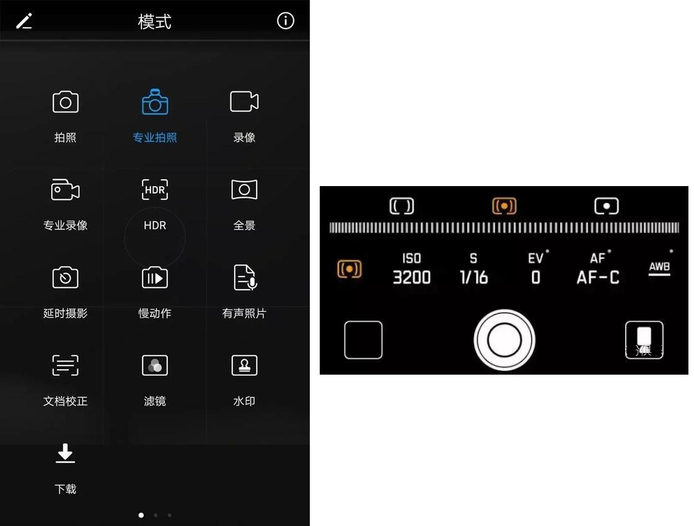
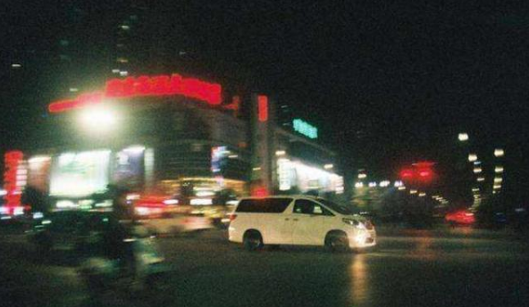
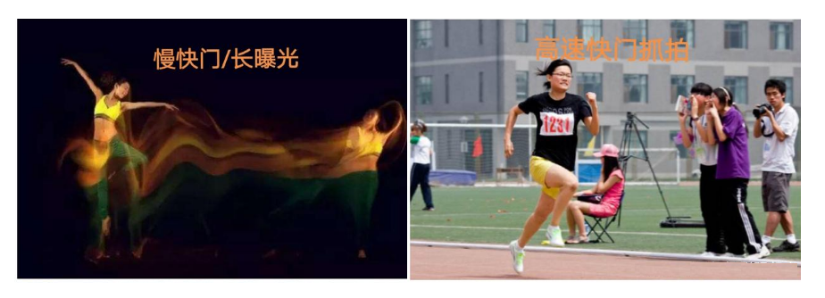
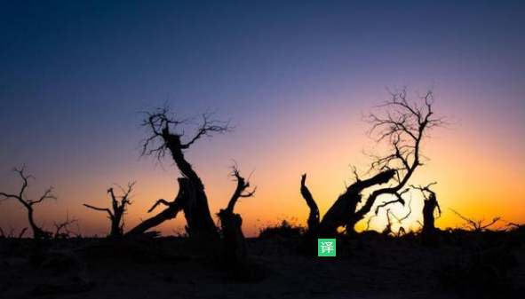
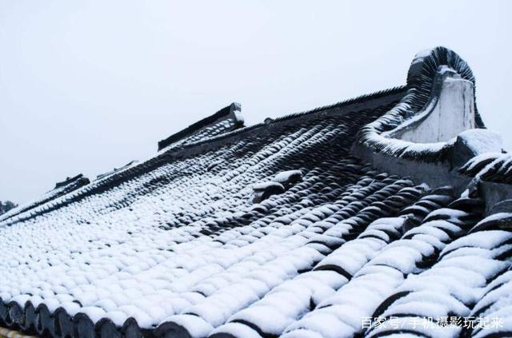
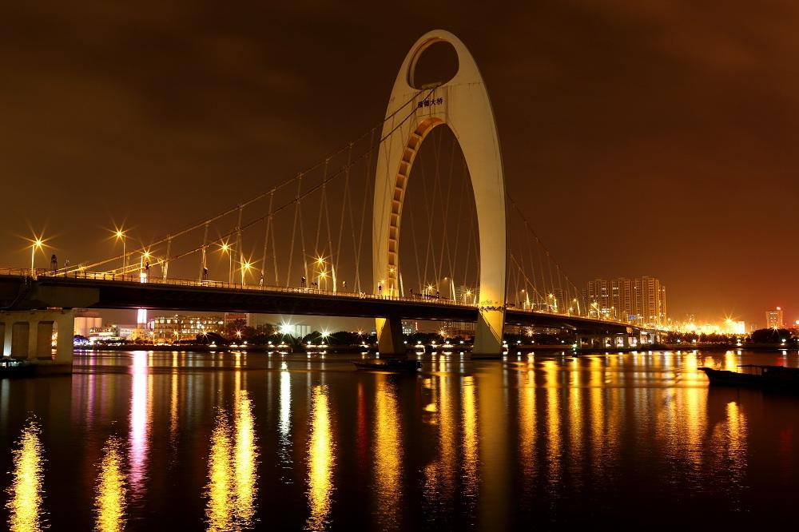
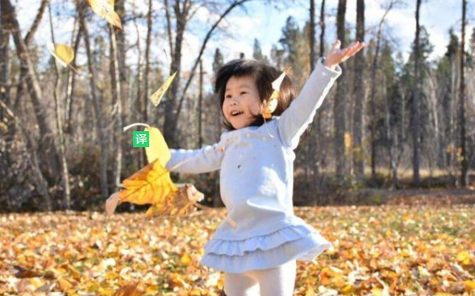
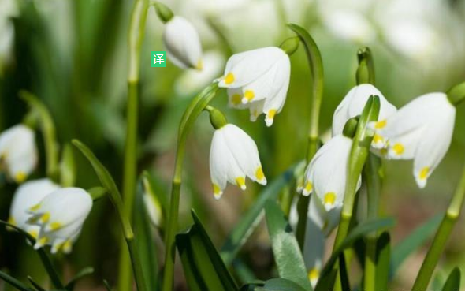

# Camera

# 1 文艺拍

文艺拍的特点就是朦胧感和想象空间，只要有助于这样的感觉都可以叫做文艺拍。文艺拍不只包括人像文艺拍也包括景色文艺拍。

## 1.1 逆光拍摄

逆光为了让背光的面部亮度正常，人像的背景常常会过度曝光。

曝光技巧：

1. 对焦人像面部，上下调节曝光补偿度，这能让面部更白，主体的轮廓将有亮亮的轮廓光。

   

2. 拍剪影（像影子一样的照片）时，降低人像的曝光度，直至人像有微光的轮廓或一片黑。

   

## 1.2 残缺拍摄

通过遮挡或只拍摄不完整的人像，这样留下想象的空间，也可以遮挡不好看的部分。

# 2 专业模式

**一般稍微好点的安卓手机都有专业模式，苹果手机没有专业模式，不过可以下载Procam6辅助软件**，跟安卓自带的专业模式功能是一样的。

## 2.1 模式参数

### 2.1.1 测光模式

**手机提供三种测光模式，从左到右，分别是矩阵测光、中央重点测光、点测光。**矩阵测光是对整个画面进行综合测光，中央重点测光是对画面的中心部分进行重点测光，点测光是对选中的点进行测光。比如拍纯黑背景只留主体，可以用点测光实现。

### 2.1.2 ISO

感光度，是指感光元件对于光的灵敏程度，数值区间一般为50-102400，ISO值越小，画面越暗；ISO值越大，画面越亮，但是ISO越高，画面噪点也越大，**要想得到清晰的画质，ISO值必须小，越小越好，**所以ISO值一般都是设置成50或者100。

用普通智能模式拍摄夜景，机器会把ISO调的很高，500-1500不等，这样拍出来的夜景照片噪点很大画面很粗糙，如果用专业模式把ISO设置成50，快门速度调慢一点就可以解决这个问题。

### 2.1.3 S

**快门速度，是指快门从打开到关闭一次的时间，数值区间一般为1/4000秒（就是1秒钟的四千分之一）到30秒，**快门一次就好比人眨眼睛一次，眨的越快看到的内容越少，眨的越慢看到的内容越多。

**我们常说的慢门/长曝光就是指把这个快门时间设置的比较长（比如0.5秒）**，拍摄出来的是一种糊的效果，就有运动轨迹呈现，如果拍摄流水就会有一种雾化的效果。如果你想把运动的物体拍的很清晰不糊，就需要把快门速度设置的很快（比如1/1000秒），比如抓拍运动员。

### 2.1.4 EV

曝光补偿是控制曝光的一种方式，虽然跟ISO一样都有提高画面亮度的效果，但是还是有区别，**曝光补偿主要是用在相机测光不准确的场景**

比如拍摄雪景，大片白色雪花交叉反射，机器会认为环境很亮，所以自动调低曝光，拍出来的雪就是灰色的，这个时候就需要手动增加曝光补偿，使拍出来的雪是白色的。这种情况下提高ISO就起不到好效果了，反而带来大量噪点。

### 2.1.5 AF

对焦方式，**对焦方式分为自动单次对焦（AF-S），自动连续对焦（AF-C），手动对焦（MF）。**自动单次对焦适合拍摄静止的物体，自动连续对焦适合抓拍运动的物体，也就是焦点会自动追着物体走；手动对焦是自己根据场景选择，往左适合拍花草微距，往右适合拍大场面的风光。

### 2.1.6 AWB

白平衡，不同的光源环境下画面会有色彩偏差，钨丝灯下画面会偏黄，日光灯下画面会偏绿，要消除这种光源造成的细微偏差，就需要用到白平衡，不过我一般都是默认，因为很多时候差别不明显，照片后期也可以调整。

## 2.2 场景参数

### 2.2.1 逆光剪影

选择矩阵测光，并把测光点对准光源（太阳、路灯、白炽灯等）；ISO设置成50-100；S设置成1/1500-1/15秒；其他项默认即可。

### 2.2.2 逆光人像

选择矩阵测光，把测光点对准人物脸部；ISO设置成50-100；S设置成1/1500-1/15秒；曝光补偿减一档或者两档（即-0.3或者-0.7）使背景不过曝；其他项默认即可。

### 2.2.3 雪景

选择矩阵测光；ISO设置成50-100；S设置成1/1000-1/50秒；曝光补偿加一档或者两档；其他项默认即可。

### 2.2.4 夜景

选择矩阵测光；ISO设置成最低50；S设置成1/10-1秒（必须配合三脚架，不然画面会糊）；其他项默认即可。

### 2.2.5 抓拍运动物体

选择中央重点测光；ISO设置成50-100；S设置成1/1500-1/50秒；对焦方式选择自动连续对焦；其他项默认。

### 2.2.6 **慢门（也叫长曝光）**

选择矩阵测光；ISO设置成最低50；S设置成1/30-1/5秒（必须配合三脚架，不然本该清晰的物体也会糊）；其他默认即可。

### 2.2.7 微距

选择矩阵测光；ISO设置成50-100；S设置成1/1500-1/100秒；对焦方式选择手动对焦并移至靠左边；其他默认。

# 3 Snapseed

## 3.1 后期三参数

