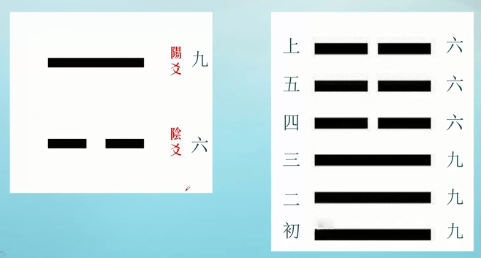
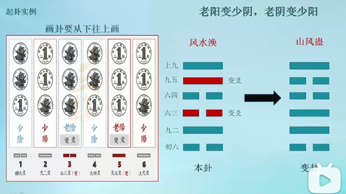
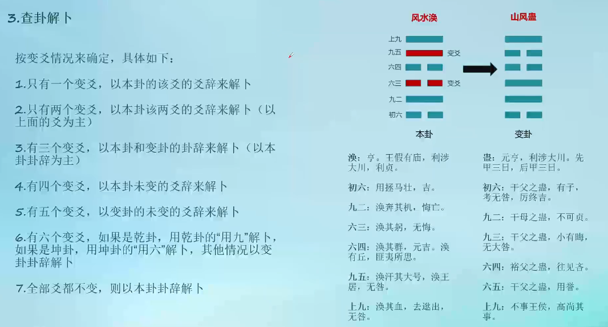

# 周易

## 0.1 卦

萌芽于上古殷商，成形于周代，内容包括重叠八卦而成的64卦

乾（qián）为天，

巽 （xùn）为风，巽者，入也。象征风“无孔不入”的特性。

坎 （kǎn）为水，意为水洼、“坎”陷之意。

艮 （gèn）为山，

坤 （kūn）为地，

震（zhèn）为雷，震者，“动”也。

离（lí）为火，亦有“丽”之意。

兑（duì）为泽，兑者，悦也。代表“喜悦”之意。

方位有不同，

内侧八卦：伏羲八卦，先天八卦，顺序：乾巽坎艮坤震离兑（乾始，顺时针）

外侧八卦：文王八卦，后天八卦，顺序：乾坎艮震巽离坤兑（乾始，顺时针）

## 0.2 爻

每卦有六爻，

爻的顺序由下而上，依次称为初，二，三，四，五，上。

爻又分阴阳，阴爻以六来表示，符号为线两段。阳爻以九来表示，符号为线未断。偶数为阴（2+4=6，故用6表示阴爻），奇数为阳（1+3+5=9，故用9表示阳爻）

例如图中右边的卦从下往上读：初九，九二，九三，六四，六五，上六（要注意首尾爻的读法）

# 1 易经占卜

三枚硬币，心中想着要占卜的事，连续摇6次，每次要记爻位。

- 三字为老阳，变爻（极阳易变，故为变爻，用于画变卦）
- 三花为老阴，变爻（极阴易变，故为变爻，用于画变卦）
- 两花一字为少阴
- 两字一花为少阳

占卜未来的事，要顺着从下往上画卦，占卜过去的事，要从上往下画卦。

# 参考

1. https://www.bilibili.com/video/BV1mJ41197Pb