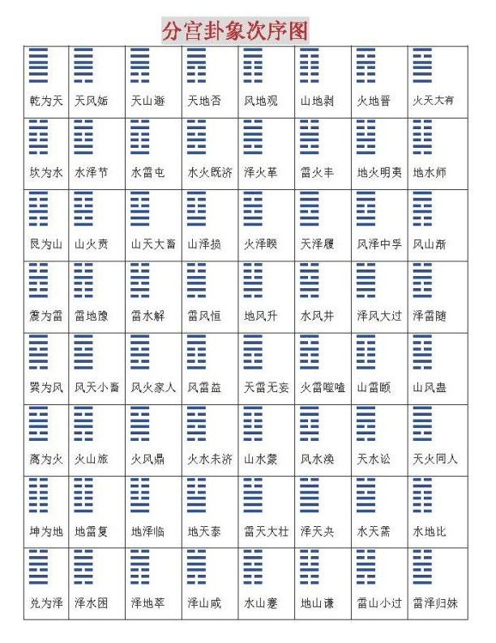

# 周易

萌芽于上古殷商，成形于周代，内容包括重叠八卦而成的64卦

乾（qián）为天，

巽 （xùn）为风，巽者，入也。象征风“无孔不入”的特性。

坎 （kǎn）为水，意为水洼、“坎”陷之意。

艮 （gèn）为山，

坤 （kūn）为地，

震（zhèn）为雷，震者，“动”也。

离（lí）为火，亦有“丽”之意。

兑（duì）为泽，兑者，悦也。代表“喜悦”之意。

方位有不同，

内侧八卦：伏羲八卦，先天八卦，顺序：乾巽坎艮坤震离兑（正南始，顺时针）

外侧八卦：文王八卦，后天八卦，顺序：离坤兑乾坎艮震巽（正南始，顺时针）

# 1 易经占卜

# 参考

1. https://www.bilibili.com/video/BV1mJ41197Pb