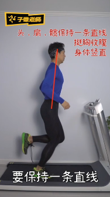
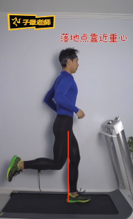
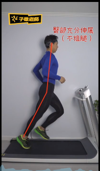
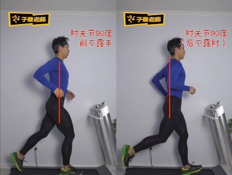
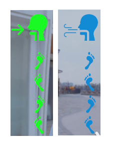

# [新手跑步一般跑法](https://www.bilibili.com/video/BV1WE411P7CB)

脚后跟着地

1. 头肩髋，保持直线，挺胸收腹，身体竖直。

   - 身体不要过度前倾

   

2. 落地点尽量靠近重心

   - 落地点尽量与重心保持竖直一线。

   

3. 臀部要尽量的伸展，运用到我们下肢的弹性

   - 弹性：膝关节和髋关节微屈

   

4. 手部摆动做到：肘关节90度，前不露手，后不露肘，手的胸前交叉不超过中线位置。

   - 长跑，肘关节宜75度。

   

5. 提高步幅，提高速度，可以采取送髋。

   - 先找到髋关节的位置，再去找以脚为支点的送髋的感觉

6. 

# 跑步呼吸

**节奏呼吸法：**按着步伐的节奏，踩着一定的步频去呼吸。

- 顿开呼吸法：
  - 四步一吸四步一呼（吸，吸，吸，吸，呼，呼，呼，呼）
  - 三步一吸三步一呼（吸，吸，吸，呼，呼，呼）
  - 两步一吸两步一呼（吸，吸，呼，呼）
- 连贯呼吸法：实际上这种方法用的多一点
  - 四步一吸四步一呼（吸吸吸吸，呼呼呼呼）
  - 三步一吸三步一呼（吸吸吸，呼呼呼）
  - 两步一吸两步一呼（吸吸，呼呼）
- 提升呼吸效率
- 降低煎熬感，数拍子，可以让你感觉时间过得更快

**选择步频去呼吸**

- 速度非常快：一步一吸一步一呼，百米冲刺这种
- 速度快，一步一吸两步一呼（非对称方式的呼吸方式），这样呼吸效率会被提的很高，
- 速度越高，两步一吸两步一呼
- 速度越低，四步一吸四步一呼

**选择通道**

- 鼻吸鼻呼：有氧慢跑，会让身体放松下来（呼吸道很长，效率低）
- 鼻吸口呼：长跑，速度中等
- 口吸口呼：短跑，800,1000等（呼吸道短，效率高）
- 刚开始：鼻吸鼻呼，后半程：鼻吸口呼

**舒适跑的速度**

- 鼻吸鼻呼，跑两公里，感觉不会太煎熬的速度，就是你的舒适速度

**对称选择**

- 对称呼吸法：会造成左右力量不均衡，因为每个周期，吸气或呼气只会落在同一只脚上，这样就会造成力量的不均衡，这种不平衡就会影响到跑姿，以及跑步功能，甚至受伤
- 非对称呼吸法：
  - 两步一吸三步一呼
  - 三步一呼两步一吸
  - 呼吸和脚步会不停去循环，帮助我们去减少力学上的不均衡

**舌尖要抵到上牙齿**

- 速度上来的时候，口吸口呼
- 舌头在中间拦着，舌头两边形成通道，会湿润空气，不至于嗓子喉咙太干

# 参考

1. https://www.bilibili.com/video/BV1WE411P7CB
2. https://www.bilibili.com/video/BV14E411W76v
3. https://www.bilibili.com/video/BV1vp4y1q7rE