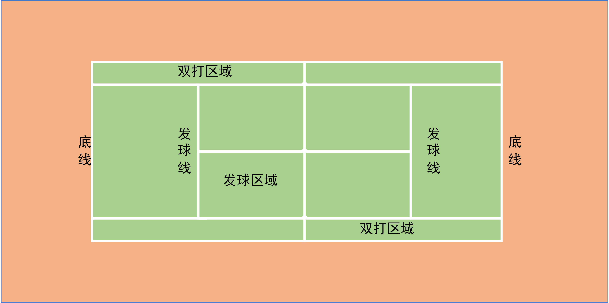

# [网球](https://www.bilibili.com/video/BV15J41157X3?from=search&seid=7309900816959986885)

底线：回球时不能过底线，否则出界

发球线：发球时不能超过发球线，否则发球失误

发球中间线：用于发斜对角球判定

双打回球区域可以在双打区域，发球依然和单打相同。

每一次发球必须轮流在半场的两个发球区进行，每局的第一次发球应先从右边开始。

局点set point，赛点match point

**球场分类**

- 硬地：快速硬地和慢速硬地

- 草地和红土，红土球速最慢，草地速度最快

网球四大满贯赛事：澳大利亚，法国，温布尔顿以及美国网球公开赛。

# 网球计分

比赛中，男子通常为：5盘3胜制，女子通常为：3盘两胜制。

每盘胜利规则（盘>局）：

率先获得6局比赛胜利并领先对手至少2局的选手赢得该盘。但现在更为常见的记分方法是，当双方在一盘中战成6 比6平时，将举行一局特殊的“决胜局”，又称“抢七局”。

局分（局点）通常有：15，30，40，60，获得局分并净胜2分才能获得本局的胜利。

deuce——局末平分，advantage——占先

