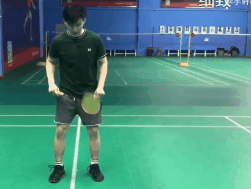
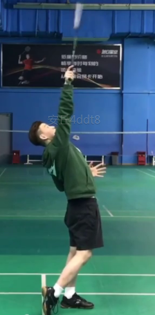

# Badminton

发球：正手发高远球，反手发网前球

击球：放网，搓，推，勾，扑，挑，平抽，高远，杀。

步伐：并，交叉，蹬跨，垫，弓箭步，启动，回位，全场米字步伐。

# 步伐

击球永远是在右脚。

击球时，尽量使脚尖对着来球，不要朝外，也不要朝内，容易崴脚。

脚尖跑。

## 基本步

1. [启动步](https://www.bilibili.com/video/BV1Ev411i7ZS)
   - 没有启动，难再移动。
   - 一个脚尖小跳，重点不是在起跳时的向上发力，而是在下落到地面时的脚尖的向下发力，地面对人的反作用力
   - 启动不能跳太高
   - 小跳落地时，用脚尖发力，同时屈膝，加上大腿的力量。
   - 双脚平行站位启动：防守启动
   - 双脚前后站位启动：有确定移动方向的启动
   - 启动时机，在别人击球时启动。击球前，容易被晃，击球后，来不及。可以通过让对方错误估计击球时机，给己方机会。（假动作，停顿）
   - 二次启动：练习小密步和前后踏（在线的前后用脚尖踏），有助于在被晃后，再次启动。
   - **不能为了回位而回位，不管你是否回到中间了没有，它什么时候打，你就减速/不移动，准备启动。**
2. [并步](https://www.bilibili.com/video/BV1Ut4y1U7x9)
   - 小而快

   - 什么时候用并步：球离自己近且球速快（杀球等）

   - 并步可以同时打，同时踏地

   - 启动>接球>慢慢回位（等待别人击球，连贯着，这样可以省去一个再次启动，省时省力）。

   - <video src='./legend/badminton/并步上网.mp4'/>

   - 

   - <video src='./legend/badminton/并步后退.mp4'/>

3. 交叉步
   - 大而慢

   - 什么时候用交叉步：球离自己远且球速慢的球

   - 前交叉：正常走路

   - <video src='./legend/badminton/前交叉步.mp4'/>

   - 后交叉

   - <video src='./legend/badminton/后交叉步.mp4'/>
4. 弓箭步
5. 垫步
6. 蹬跨步

## 组合步

1. [后场步伐](https://www.bilibili.com/video/BV1zi4y1g7Lp)
   - 后场移动之前站位：一般平行站，或右腿在前站位（防别人攻击你的反手位）
   - 后撤：
     - **用并步退（无论正手还是头顶），在抬右脚转侧身位（启动就转侧身位）的过程中，让左脚有个小跳（垫步），左脚落地后再并步退。**
     - 如果球特别靠边，我没办法回球后转身，那么就采用不转身打，并步退然后并步回。
   - 回位：大部分正手击球后，都用交叉步回位（包括起球和杀球），
     - 如果回球是正手直线，还是用交叉步回位（这样是为了一边可以正面看着对手，防止他回直线，不至于落于被动，一边回位）
     - 如果回球是正手斜线，可以用并步或交叉步回位
   - 头顶有一个特殊，有时候我们会交叉退，退到位，确认步，击球，转身。这个主要用于当别人起的特别高，你有时间准备的时候
   - 练习时，要多思考，在我们击球后，别人会怎样，带着套路去练习。
   - 其它打法：
     - 在后场吊球，通常，落地后一个并步回，然后启动，准备击下一个球。
     - 在后场杀完球，通常对方回球会很快速，我脚落地后，就做一个启动，准备击下一个球。
   - 
2. [单打防守步伐](https://www.bilibili.com/video/BV1Bi4y1g7RU)（中场步伐）
   - 在击完起球和高远球，回位后，平行站位。
   - 重点：手带动身体，先伸拍，再动身体，通常在启动之后，就要立马伸拍。
   - 启动：脚后跟抬起，重心前移，屈膝往下一坐，双脚站的更开。
   - 正手防守：
     - 正手：左脚发力推，并步向右脚，然后右脚迈出，做弓箭步。
     - 另外一种：如果球速很快，不并，直接弓箭步防
     - 
   - 反手防守
     - 迈右腿防：右脚发力，迈向右侧转身（打得很靠近边线）
     - 弓步防：不用迈右腿（打得比较靠近身侧）
     - 
   - 回位后的站位：
     - 起球双脚平行站位
     - 挡球双脚前后站位：挡哪右脚就朝哪，右前左后，这样的做法，我认为是防对方打你的反手。
     - 
   - 握拍：
     - 排面斜向上45度，大拇指按在斜楞上
   - 
3. 

# 击球

1. 双打发球：
   - 右手拇指按在拍柄的宽面上，握拍靠柄前一点
   - 左手拇指和食指（最多加一个中指），压在两根羽毛之间的位置
   - 球头的朝向，根据你想击打的高度和方向做上下左右调整。右手的要保持拍面与地面垂直，直推，可以略微朝上（仅仅是略微），球高或球低都不会去调整右手，只需调整球头的朝向。
   - 击球前：拍面侧架在回拉之前可以放在左手拇指指肚根上，回拉时右手收腕并且略微弯肘，
   - 击球：右手拇指发力，放腕，肘自然伸直（也是略弯），不要加速，推球即可
   - 双脚前后站位，右脚在前
2. 双打网前接发球：
   - 左前右后前后站位，降低重心（也可以略微降低重心，只要在移动过程中降低就行），拍面略高于头
   - 如果站的靠中场，启动压左腿（一定要先压左腿，降低重心后在迈），迈右脚，拍面高于头击球，与网差不多高或者说平行
   - 如果靠近发球线，启动直接迈左脚，拍面高于头击球。
   - 如果偷后场，那么右脚迈开，并步退即可。
   - 
3. 回高远球：
   - 一架：

     - 
     - 脚
       - 侧身（拉开拍与球之间的距离，才有空间加速），
       - 通常以并步后退，以确认步（右脚确认）的形式，找到合适的位置，一定要使球在你的身前方。
       - 重心放在右脚上，左脚踮起，
     - 手
       - 左右手都要做投降状，有个展肩的蓄力（有点扩胸的感觉，扩展肩胛骨）
       - 左手用来瞄球，
       - 身体与大臂，大臂与小臂尽量呈90度。
       - 左肩高过右肩
     - 腰：
       - 侧腰要像弓一样拉满，**记住要抬头，身体往后仰**（这样你的整个身体才能很好的呈弓状，重心也会移至右脚）
   - 二引：

     - 
     - 手
       - 拉左肩下移，右肩高过左肩（两肩顶到肩胛骨），左肩的一个反作用力能帮助到右肩向上。
       - 要顶肘，肘不能顶的太高（当然刚开始练的时候，动作幅度大一点是好的），要往前顶一点，小臂手腕自然后倒，
       - 大臂和小臂不能夹着，依旧差不多90度左右
       - 顶肘不能贴耳，离耳要有一定的距离
     - 脚和腰
       - 右脚将身体往前送，身体有个转动的过程，使身体正面面向对方。
       - 重心从右脚转移至左脚
     - 注意：**如果肘顶不上去，一部分是因为没有没有抬头以及身体没有往后仰**
     - 
   - 三击：

     - 
     - 手
       - 大臂往前弹（推）小臂，小臂由倒状，自然直立伸直，在整个大臂-小臂-手腕要伸直的时候（在这之前拍面不是正面朝前），小臂内旋手腕外折（拍面正面朝前）
       - 如果手腕不外折，我们会伤到肘（网球肘）
       - 在手能够到最高点（头右前方一点点）球拍的甜区击球。
         - 有人击球不在最高点，而是会歪向右侧，不是直直的击球。
         - 练习的时候是好好的，而让他们加速的时候就会歪。
         - 原因一：没有，抬头和身体往后仰
         - 原因二：他们想在收拍的时候，向身体的左侧收拍。
       - 关于转腕，在有压球时，转腕（有待商榷）
       - 在击球之前，手都不能握的太紧，太紧，会使你挥拍的速度，和转腕都会变慢。只有在击球瞬间握紧球拍即可
     - 脚
       - 随右手向前击球时，左脚向后拉，随后右脚向前过渡（右手和右脚不能同步）
     - 腰
       - 转身的重点主要是想通过用腰，把力量放大。重心向前，腰向前躬，将拉满弓的能量释放。
       - 击球前一瞬间转身，**不能提前转身**，不然用不到腰的力量。
     - 先动左手左腿，
   - 四收
     - 
     - 在击球后，往下再挥一段，再往身侧收。（这是击球发力的一小段发力过程）
     - 身侧收：一部分原因是你的身体还是在向左侧旋转，所以你才可以做到收拍会收向左侧。
   - 
4. 杀球
   - [基础动作](https://www.bilibili.com/video/BV1Hv41117wQ)：和回高远差不多，要保证击球点在你的靠右前方。
   - [双腿起跳杀](https://www.bilibili.com/video/BV1wK411K7Kw)：
     - 后撤确认步，两脚并在一起，微微踮起，膝关节和髋关节微曲，起跳，身体舒张为弓状，双腿向后弯曲，同时左右手同时架拍，左肩高，右肩低
     - 引拍，肘略微向前顶，拍自然后倒，向下拉左肩
     - 击球，腰腹发力，将身体的弓状能量释放，身体由舒张态变为收缩态，击球
   - 
5. [挑球（接吊球）](https://www.bilibili.com/video/BV17a4y1j7KV)
   - 先压左腿（弯左腿），再迈（弯）右腿。这样重心低，不会太过于靠前，对右腿的膝盖造成压力。并且也容易回位。
   - 
6. [吊球](https://www.bilibili.com/video/BV1Rp4y1x7WW)
   - 握拍转换：食指回收一点，拇指向前一点，使拍面相对于回高远球的拍面（面向正前方）倾斜一点（斜前方，有一种切的感觉）。
   - 击球点：
     - 大致放在身右侧，而不是头顶击球（在头顶左右的话，拍面就完全变为菜刀式击球，那么就会下网）
     - 还是要在身前一点，但不能太前，否则会下网，不能在身后，否则会打高球。总之击球应该是在手臂竖直前一点点的时候（和高远差不多）
   - 注意：这时要进行握拍的转换而不是转小臂
   - 
7. 双打前三拍
   - 单数区，发对方的左脚。对方只能放你右手，或者推你右后场
   - 放右手，发完之后，立马迈右脚，向前扑杀
   - 推右后场，由队友封网，或者尝试几次后，发现他们一直推后场，那么你就无需再向前迈右脚扑杀，直接在原地封网（顶住你的腰，往后抬拍，封网）。
   - 如果对方要放或推直线，那么他一定会慢下来，等球去向他的左脚，然后他会将球推高，那么迈右脚扑杀，或者往右侧一个蹬跨扑杀即可
8. 

# 力量训练

1. 腕力
2. 腰腹
3. 脚踝：
   - 单双腿提蹱：上提要快，下放要慢
   - 单双腿跳绳：单双摇
4. 启动