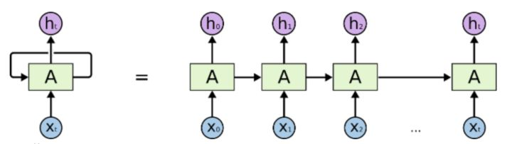
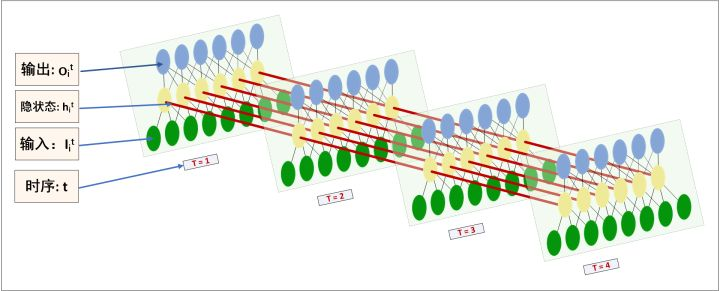
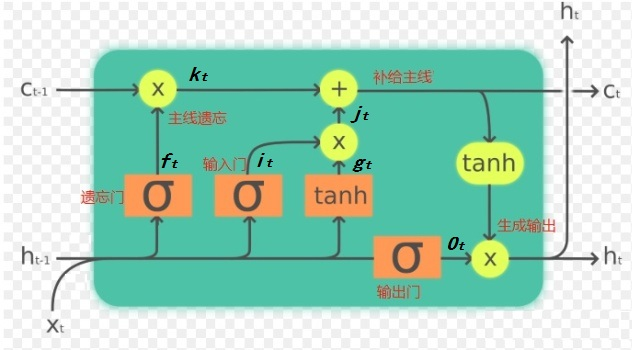
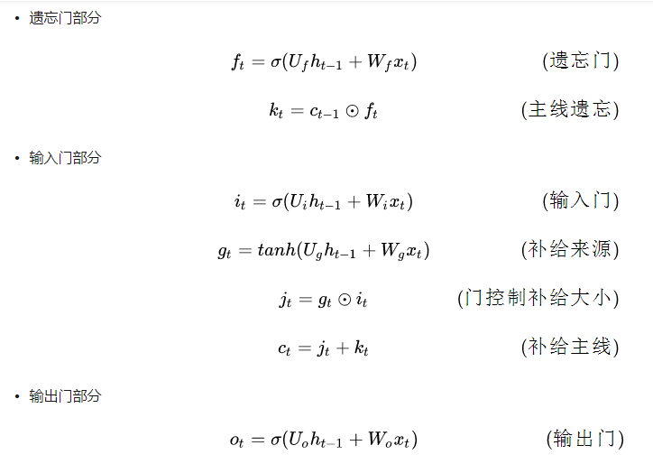
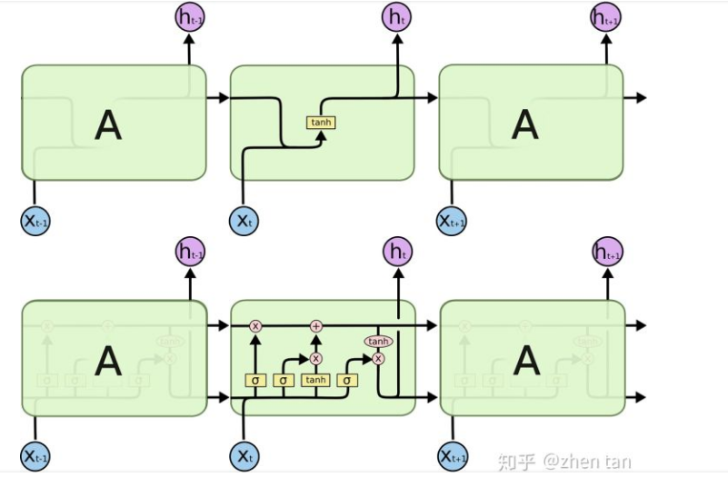

# 自然语言处理（NLP，Nature Language Processing ）

分词，词性标注和命名实体识别，作为中文信息处理中基础性关键技术。

# 1 中文分词技术（segement）

中文分词技术主要归纳为“规则分词”，“统计分词”和“混合分词（规则+统计）”这三个流派

## 1.1 规则分词

基于规则的分词是一种机械分词方法，主要通过维护词典，在切分语句时，将语句的每个字符串与词表中的词进行逐一匹配，找到则切分，否则不予切分。

按照匹配的切分方式，主要有正向最大匹配法，逆向最大匹配法以及双向最大匹配法三种方法。

## 1.2 统计分词

主要思想是把每个词看做是由词的最小单位的各个字组成，如果相连的字在不同的文本中出现的次数越多，就证明这相连的字很可能就是一个词。因此我们就可以利用紫与字相邻出现的评率来反应成词的可靠度，统计语料中相邻共现的各个字的组合的频度，当组合频度高于某一个临界值时，我们便可认为此字组可能会构成一个词语。

基于统计的分词，一般要做如下两步：

1. 建立统计语言模型，
2. 对句子进行单词划分，然后对划分结果进行概率计算，获得概率最大的分词方式。常用的统计学习算法HMM(隐含马尔可夫模型)，CRF(条件随机场),CNN等深度学习算法

## 1.3 混合分词

在实际的工程应用中，多是基于一种分词算法加以辅助。最常用的方式及时现给予词典的范式进行分词，人后再用统计分词方法进行辅助。

## 1.4 中文分词工具

[jieba结巴中文分词](https://github.com/fxsjy/jieba)

[pkuseg-北大](https://github.com/lancopku/PKUSeg-python)

[THULAC-清华](http://thulac.thunlp.org/)

# [Word2Vec](<https://www.zhihu.com/question/44832436/answer/266068967?utm_source=wechat_session&utm_medium=social&utm_oi=1255234978943954944>)

首先你需要预处理（分词，加停用词）你的文本语料库（Corpus），将他们的one-hot向量作为word2vec的输入，通过word2vec训练低维词向量（word embedding）。

目前有两种训练模型（CBOW_上下文预测中心词 和 Skip-gram_中心词预测上下文）两种模型，两种加速算法（Negative Sample 和 Hierachical Softmax）

word2vec如何将corpus的one-hot向量（模型输入）转换成低维词向量（模型的中间产物——输入权重矩阵）。

以CBOW为例，

- 语料库的单词数量也成one-hot向量的维度为V，
- 输入权重矩阵W<b>V*N</b>，N为自己制定的数，N越大计算量就越大，最后得到的词向量就是N维的。
- 输出权重矩阵W<b>'</b><b>N*V</b>。

$$
\begin{align}
X_1W=P_1，X_2W=P_2，X_3W=P_3，&维度运算（1×V)×（V×N)=(1×N)
\\
P_1+P_2+P_3...+P_c=P_A&
\\
\frac{P_A}{C}=\overline{P_A}&
\\
\overline{P_A}×W^{'}=Y，&维度运算（1×N)×（N×V)=(1×V)

\end{align}
$$

采用梯度下降，更新W与W'

最后，词向量等于X*W=(1×N)，如果X全都为one-hot码，那么词向量矩阵为W，每一行代表一个词向量。否则必须通过X×W，一个一个得到词向量，然后拼接成矩阵。

当然，输入矩阵也可以不为独热码，里面还可以人为的携带其他信息，包括词序，词的情感等信息，用一些来规定来编码输入词向量。得到W，最后转化为词向量。

# RNN

Recurrent Neural Network——循环神经网络

ht里面携带了h0，h1,...等之前时刻的信息，最后用ht来预测可能性。

eg：在nlp中，一句话"我今天打羽毛球"，可以通过x0=我，x1=今天，x2=打，最后输出h2来判定我今天打什么。

RNN它会记住输入的所有信息，即使时间间隔较长，每一个输出的比重都一致，这并不符合常理，故适用于短文本。

上图中的单个xi，A，hi又是一个神经网络。如下图的用板代表的一层

# [LSTM](<https://zhuanlan.zhihu.com/p/88892937>)

长短期记忆（Long short-term memory, LSTM）是一种特殊的RNN，主要是为了解决长序列训练过程中的梯度消失和梯度爆炸问题。简单来说，就是相比普通的RNN，LSTM能够在更长的序列中有更好的表现。

从下图看，LSTM只多了一个参数C，C为控制参数，是LSTM中最核心的参数。C用来控制什么样的特征保留下来， 什么样的特征用于遗忘，C并不是一成不变的，乘法那里用于遗忘，加法那里用于记忆。根据遗忘门sigmod函数传过来的[0,1]来计算遗忘程度的大小。间隔时间的长短，会影响每个输出在最终输出里的比重。

它们可以学习只保留相关信息来进行预测，并忘记不相关的数据。

上图为单个LSTM，如果把LSTM当成黑盒子看待，可以分为以下关键变量（参考题图）：
$$
\begin{align}
h_{t-1}：& t-1时刻的隐藏层
\\
x_t：&t时刻的特征向量
\\
h_t：&加softmax即可作为真正的输出，否则作为隐藏层
\\
主线/记忆：&c_{t-1}和c_t
\end{align}
$$
遗忘门、输入们和输出们都用的是sigmod函数，所以并不是只取0和1的门。激励函数用的是tanh

    <B>RNN与LSTM</B>

# SVM

一个线性分类器的学习目标便是要在n维的数据空间中找到一个超平面（hyper plane），把空间分割开，这个超平面方程可以表示为:
$$
WX+b=0
$$
在添加超平面的时候，尽可能的使**最靠近**分离超平面的那个元素（特征点）与超平面的距离变大。

实际上，大多数特征点距离超平面太远，所以对于分离超平面都没有太大的影响。只有那些离超平面相较很近的点，对超平面的分离才有非常强大的影响。

**这些对于分离超平面有这非常强大影响的数据点（距离超平面很近的点）也被称为支持向量**

## 核函数

在原始特征的维度上，能直接找到一条分离超平面将数据完美的分成两类的情况。但如果找不到呢

利用**特征映射**，在高维空间就可以将低维空间中线性不可分的问题解决，**核函数就是用来进行特征映射的**，

## 松弛变量

如果在正常数据中混入了，异常数据，很有可能会是应该的最贱分离超平面移位，或者直接使数据变得线性不可分。这时候就该引入松弛变量，松弛变量可以允许某些数据点在不满足分离超平面的类别要求，从而使得严格线性不可分，变得线性可分。

# 专业英语

| English                               | Chinese            | Description                               |
| ------------------------------------- | ------------------ | ----------------------------------------- |
| segment                               | 分词               |                                           |
| part-of-speech tagging                | 词性标注           |                                           |
| NER                                   | 命名实体识别       | Named Entity Recognition                  |
| Sentiment Analysis and opinion mining | 情感分析与观点挖掘 |                                           |
| CRF                                   | 条件随机场         | Conditional Random Field                  |
| TF/IDF                                | 词频与逆文档频次   | Term Frequency-Inverse Document Frequency |
| TextRank                              | 文档内排名         | 有向有权图，在文档内句子层面              |
| PageRank                              | 页面排名           | 有向无权图，在文档层面                    |
| corpus                                | 语料库，文集       |                                           |
| NNLM                                  | 神经网络语言模型   | Neural Network Language Model             |
| CBOW                                  | Word2Vec           | 根据上下文预测嵌入词的概率                |
| Skip-Gram                             | Word2Vec           | 根据当前词预测上下文                      |
| lemmatize                             | 词形还原           |                                           |

# 骚操作

## python自然语言处理实战核心技术与算法

1. **拉普拉斯平滑（p87）**

   - 分母+1，避免部分词没有在语料库中出现过，导致分母为零的情况

2. **阻尼系数（p90）**

   - （1-d）+ d x 概率，d为阻尼系数，避免分数为零。

3. 窗口（p91）

   - 窗口内的事物，都有关系。有点像卷积窗口

4. 

   

