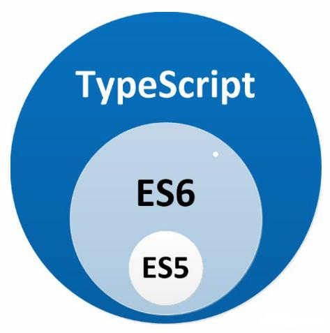

# TypeScript

## 0.1 概述

1. typeScript是由微软开发的一款开源编程语言

2. typeScript是javascript的超集，遵循了ES6和ES5规范，typescript扩展了javascript的语法。

3. typescript更像后端java，c#等语言，可以让js开发大型企业项目。

4. 最新的React，Vue可以集成typescript，angular2.x就是基于typescript语法。

5. nodejs框架Nestjs，midway中用的就是Typescript语法

   

## 0.2 环境配置

### 手动将ts编译成js

```bash
#全局安装typescript
npm install -g typescript
#查看安装是否完毕，查看typescript版本
tsc -v
#生成一个index.ts文件，浏览器不能识别.ts文件，需要手动将.ts文件转为.js文件
tsc index.ts
#执行后就会在当前文件夹下生成一个index.js文件

```

### vscode自动编译.ts文件

```bash
#1.生成tsconfig.json文件
init --init

```

```json
/*tsconfig.json文件*/

{
  "compilerOptions": {
    /* Visit https://aka.ms/tsconfig.json to read more about this file */

    /* Basic Options */
    // "incremental": true,                   /* Enable incremental compilation */
    "target": "ES2015",                          
      /* 指定ECMAScript目标版本（就是指定将ts转换为指定版本的js）: 'ES3' (default), 'ES5', 'ES2015', 'ES2016', 'ES2017', 'ES2018', 'ES2019', 'ES2020', or 'ESNEXT'. */
    "module": "commonjs",                     /* Specify module code generation: 'none', 'commonjs', 'amd', 'system', 'umd', 'es2015', 'es2020', or 'ESNext'. */
    // "lib": [],                             /* Specify library files to be included in the compilation. */
    // "allowJs": true,                       /* Allow javascript files to be compiled. */
    // "checkJs": true,                       /* Report errors in .js files. */
    // "jsx": "preserve",                     /* Specify JSX code generation: 'preserve', 'react-native', or 'react'. */
    // "declaration": true,                   /* Generates corresponding '.d.ts' file. */
    // "declarationMap": true,                /* Generates a sourcemap for each corresponding '.d.ts' file. */
    // "sourceMap": true,                     /* Generates corresponding '.map' file. */
    // "outFile": "./",                       /* Concatenate and emit output to single file. */
    /*修改编译生成的js所存放的位置*/
      "outDir": "./js",                        /* Redirect output structure to the directory. */
    // "rootDir": "./",                       /* Specify the root directory of input files. Use to control the output directory structure with --outDir. */
    // "composite": true,                     /* Enable project compilation */
    // "tsBuildInfoFile": "./",               /* Specify file to store incremental compilation information */
    // "removeComments": true,                /* Do not emit comments to output. */
    // "noEmit": true,                        /* Do not emit outputs. */
    // "importHelpers": true,                 /* Import emit helpers from 'tslib'. */
    // "downlevelIteration": true,            /* Provide full support for iterables in 'for-of', spread, and destructuring when targeting 'ES5' or 'ES3'. */
    // "isolatedModules": true,               /* Transpile each file as a separate module (similar to 'ts.transpileModule'). */

    /* Strict Type-Checking Options */
    "strict": true,                           /* Enable all strict type-checking options. */
    // "noImplicitAny": true,                 /* Raise error on expressions and declarations with an implied 'any' type. */
    // "strictNullChecks": true,              /* Enable strict null checks. */
    // "strictFunctionTypes": true,           /* Enable strict checking of function types. */
    // "strictBindCallApply": true,           /* Enable strict 'bind', 'call', and 'apply' methods on functions. */
    // "strictPropertyInitialization": true,  /* Enable strict checking of property initialization in classes. */
    // "noImplicitThis": true,                /* Raise error on 'this' expressions with an implied 'any' type. */
    // "alwaysStrict": true,                  /* Parse in strict mode and emit "use strict" for each source file. */

    /* Additional Checks */
    // "noUnusedLocals": true,                /* Report errors on unused locals. */
    // "noUnusedParameters": true,            /* Report errors on unused parameters. */
    // "noImplicitReturns": true,             /* Report error when not all code paths in function return a value. */
    // "noFallthroughCasesInSwitch": true,    /* Report errors for fallthrough cases in switch statement. */

    /* Module Resolution Options */
    // "moduleResolution": "node",            /* Specify module resolution strategy: 'node' (Node.js) or 'classic' (TypeScript pre-1.6). */
    // "baseUrl": "./",                       /* Base directory to resolve non-absolute module names. */
    // "paths": {},                           /* A series of entries which re-map imports to lookup locations relative to the 'baseUrl'. */
    // "rootDirs": [],                        /* List of root folders whose combined content represents the structure of the project at runtime. */
    // "typeRoots": [],                       /* List of folders to include type definitions from. */
    // "types": [],                           /* Type declaration files to be included in compilation. */
    // "allowSyntheticDefaultImports": true,  /* Allow default imports from modules with no default export. This does not affect code emit, just typechecking. */
    "esModuleInterop": true,                  /* Enables emit interoperability between CommonJS and ES Modules via creation of namespace objects for all imports. Implies 'allowSyntheticDefaultImports'. */
    // "preserveSymlinks": true,              /* Do not resolve the real path of symlinks. */
    // "allowUmdGlobalAccess": true,          /* Allow accessing UMD globals from modules. */

    /* Source Map Options */
    // "sourceRoot": "",                      /* Specify the location where debugger should locate TypeScript files instead of source locations. */
    // "mapRoot": "",                         /* Specify the location where debugger should locate map files instead of generated locations. */
    // "inlineSourceMap": true,               /* Emit a single file with source maps instead of having a separate file. */
    // "inlineSources": true,                 /* Emit the source alongside the sourcemaps within a single file; requires '--inlineSourceMap' or '--sourceMap' to be set. */

    /* Experimental Options */
    // "experimentalDecorators": true,        /* Enables experimental support for ES7 decorators. */
    // "emitDecoratorMetadata": true,         /* Enables experimental support for emitting type metadata for decorators. */

    /* Advanced Options */
    "skipLibCheck": true,                     /* Skip type checking of declaration files. */
    "forceConsistentCasingInFileNames": true  /* Disallow inconsistently-cased references to the same file. */
  }
}

```

```bash
# 2 vscode
#Terminal->run build task->tsc:watch-tsconfig.json
#然后保存代码的时候就会自动编译了，输出到outDir指定的文件夹里面
```

# 1 基础

## 1.1 变量声明

```typescript
let|const|var [变量名] : [类型] = 值;
//const声明时必须初始化
//let和var除声明any类型外，其他类型的所有变量都需要赋初值

```

## 1.2 数据类型

为了使编写的代码更规范，更有利于维护，增加了类型校验。注意：数据类型中已经没有object

1. 布尔类型boolean

   ```typescript
   //声明变量类型
   let flag:boolean=false;
   flag=true;
   flag="你好";//编译报错，不符合变量声明的类型
   ```

2. 数字类型number

3. 字符串类型string

   ```typescript
   //number，string同上声明
   ```

4. 数组类型array

   ```typescript
   //数组array两种声明方式（指定数组元素的类型）
   //a.普通定义方式
   let arr:number[]=[1,2,3];
   arr=[1,"hah"]//编译报错
   //b.泛型定义方式
   let arr:Array<number>=[1,2,3];
   ```

5. 元组类型tuple，属于数组的一种

   ```typescript
   //元组，声明长度并声明类型
   let arr:[string,boolean]=['nihao',false];
   //数组只能包含两个元素，并且第一个元素的类型为number，第二个数据类型为boolean
   ```

6. 枚举类型enum

   ```typescript
   enum enum_name {
       mark1[=integer_num],//如果不赋整型数值，默认为索引值，第一个为0，第二个为1，后面依次
       mark2[=integer_num],//如果既存在默认赋值情况，又存在显式赋值的情况，那么在显式赋值后面的默认赋值，会从显式值处递增
       mark3[=integer_num],
   };
   //eg1:
   enum Flag{
       success:1,
       error:0,
   } 
   let f:Flag=Flag.success;
   console.log(Flag.error);
   console.log(f);//1
   //eg2:
   enum Color1{
       red,green,blue
   }
   console.log(Color1.red)//0
   console.log(Color1.green)//1
   enum Color2{
       orange,yellow=5,purple,
   }
   console.log(Color2.orange)//0
   console.log(Color2.yellow)//5
   console.log(Color2.purple)//6
   
   enum List {
     A = getValue(),
     B = 2,  // 此处必须要初始化值，不然编译不通过
     C
   }
   ```

   

7. 任意类型any，可以用作Object代替

   ```typescript
   let dyntype:any=123;
   dyntype=true;
   console.log(dyntype)//true
   dyntype="你好";
   console.log(dyntype)//你好
   
   ```

8. null 和 undefined，null表示一个空对象引用。

   ```typescript
   let num:number;//声明但没有赋值将会报错
   console.log(num)
   let num1:undefined;//这里就不会报错
   console.log(num1)
   let num2:number|undefined;
   console.log(num2)
   
   let num3:null;
   num3=null;
   ```

   

9. void，没有任何任何类型，一般用于定义方法的时候，没有返回值

   ```typescript
   function fun():void{
       console.log("hah")
   }
   function fun1():number{
       return 1;//返回其他类型将报错
   }
   ```

   

10. never：是其他类型（包括null和undefined）的子类型，代表从不会出现的值。这意味着声明never的变量只能被never类型所赋值。在函数中它通常表现为抛出异常或无法执行到终止点（例如无限循环）

    ```typescript
    // 返回值为 never 的函数可以是抛出异常的情况
    function error(message: string): never {
        throw new Error(message);
    }
    
    // 返回值为 never 的函数可以是无法被执行到的终止点的情况
    function loop(): never {
        while (true) {}
    }
    ```


### 类型别名type

起别名不会新建一个类型 - 它创建了一个新名字来引用那个类型。

类型别名和接口相似，但无法extends和implements。

```typescript
//属性接口
type User = {
 name: string
 age: number
};
//函数接口
type SetUser = (name: string, age: number): void;

//泛型接口
type container<t>={value:t};
let c:container<string>={value:'nihao'}

//通过&符进行扩展
type Name = { 
 name: string; 
}
type User = Name & { age: number };


//type 可以声明基本类型别名，联合类型，元组等类型
// 基本类型别名
type Name = string

// 联合类型
interface Dog {
 wang();
}
interface Cat {
 miao();
}
type Pet = Dog | Cat | Name

// 具体定义数组每个位置的类型
type PetList = [Dog, Pet]
```


### 联合类型 ' | '

为变量指定多类型

```typescript
let dyn:number|boolean|undefined;
console.log(dyn);//undefined
dyn=1;
dyn=true;
```

### 交叉类型 ' & '

交叉类型是将多种类型叠加到一起成为一种类型。

```typescript
interface Person {
  name: string;
  age: number;
}
interface Worker {
  companyId: string;
}
type Employee = Person & Worker;
```


## 1.3 函数

```typescript
//es5中声明
    function fun1(a=1,b,c){
        //to do
        return ...
    }
    //匿名函数声明方式
    let fun2=function(){
		//to do
        return ...
    }
//ts中声明
    //返回值声明
        function fun3():string{
            return "qin"       
        }
    //参数函数声明，下面有详细说明
        function fun4(name:string='qin',age?:number=24,...arg:any[]):string{//没有返回值void
            return `${name}---${age}`;
        }
        console.log(fun4())//有默认值可以不传参
```

### 带参函数

```typescript
//1.可选参数函数
//如果写了age参数，那么一定要传age参数，
//如果加了一个问号那么就变成了一个可选参数，在调用函数的时候，可以不传此参数
//可选参数必须放置在所有参数最后面。
function fun5(name:string='qin',age?:number):void{
    if(age){
        console.log(`${name}---${age}`)
    }else{
        console.log(`${name}---年龄保密`)
    }
}
fun5('lxx')
fun5('lxx',25)

//2.默认参数
function fun6(name:string='qin'):string{
    console.log(name)
    return name
}
fun6();

//3.剩余参数
function sum(a:number,...args:number[]):number{
    let total:number=args.reduce((total,item)=>{
        return total+=item
    })
    console.log(a,total)
    return total;
}
sum(1,2,3)

```

### 函数重载

ES5中，出现同名方法，下面的会替换上面的方法

java中的方法重载指的是，两个或两个以上同名函数，但他们的参数不一样，这是就会出现重载的情况。

ts为了兼容es5以及es6，通过为同一个函数提供多个函数类型定义来实现多种功能的目的。

重载是方法名字相同，而参数不同，返回类型可以相同也可以不同。每个重载的方法（或者构造函数）都必须有一个独一无二的参数类型列表。

作用：实现参数的类型校验，使函数实现多种功能

```typescript
function getInfo(name:string):void;
function getInfo(name:string,age:number):void;
function getInfo(name:string,age?:number):void{
    if(age){
        console.log(`姓名：${name}，年龄：${age}`)
    }else{
        console.log(`姓名：${name}，年龄保密`)
    }
}
getInfo('qin');
getInfo('qin',15);
getInfo(15);//报错
```

# 2 面向对象

## 2.1 ES5

### 定义类

```javascript
function Person(name,age){
    this.name=name;//实例属性
    this.age=age;
    this.hello=function(){//实例方法
        console.log("hello!my name is "+this.name)
    }
}
//静态方法
Person.info=function(){
    console.log('我是人类')
}
//原型链上的属性会被多个实例共享
Person.prototype.info=function(){
    console.log(`${this.name}+${this.age}`)
}
let p=new Person('qin',20)
p.hello()
p.info()
Person.info();
```

### 继承

```js
//1.对象冒充实现继承，缺点没法继承原型链上的属性和方法
function Child1(){
    Person.call(this)
}

//2.原型链实现继承，可以继承构造函数中的方法，也可以继承原型链的方法，缺点：实例化子类的时候没法给父类传参
function Child2(){}
Child2.prototype=new Person()

//3.原型链+构造函数
function Child3(name,age){
    Person.call(this,name,age)//继承了构造函数中的属性和方法，并且实例化子类时实现给父类传参
}
Child3.prototype=new Person();//继承原型链上的属性和方法
```

## 2.2 ts定义与继承示例

和ES6很相似

```typescript
class Person{
    name:string;
    age:number;
    
    //readonly修饰的是只读属性，
    readonly id:number=0;
    //使用 readonly关键字将属性设置为只读的。 只读属性必须在声明时或构造函数里被初始化。
    //最简单判断该用readonly还是const的方法是看要把它做为变量使用还是做为一个属性。 做为变量使用的话用const，若做为属性则使用readonly。
    
    constructor(name:string,age:number,id?:number){
        this.name=name;
        this.age=age;
        if(id){
            this.id=id;
        }
        
    }
    run():string{//实例方法
        return `${this.name}在奔跑`
    }
}
class Child extends Person{
    constructor(name:string,age:number){
        super(name,age)//其中 super 关键字是对父类的直接引用，该关键字可以引用父类的属性和方法。
    }
    run():string{//多态
        return `${this.name}孩子在玩耍`
    }
    sleep():void{
        console.log('睡得很香');
    }
}

```

## 2.3 访问控制修饰符

TypeScript 中，可以使用访问控制符来保护对类、变量、方法和构造方法的访问。

1. `private：私有，只能被其定义所在的类访问。`
2. `protected：受保护，可以被其自身以及其子类和父类访问。`
3. `public（默认修饰符）：公有，可以在任何地方被访问。`

## 2.4 static关键字

static 关键字用于定义类的数据成员（属性和方法）为静态的，静态成员可以直接通过类名调用。静态方法里面不能调用实例的属性和方法

## 2.5 abstract关键字

抽象类做为其它派生类的基类使用，**不能被直接实例化**。

抽象类里面可以有抽象方法，也可以有非抽象方法和其他属性。

 不同于接口，抽象类可以包含成员的实现细节。

abstract关键字是用于**定义抽象类和在抽象类内部定义抽象方法**。

抽象类的子类必须实现抽象类里面的所有抽象方法

```typescript
abstract class Animal{
    name:string;
    color:string;
    constructor(name:string,color:string){
        this.name=name;
        this.color=color;
    }
    getInfo():string{
        return this.name
    }
    abstract food():void;
    abstract show():void;
}
class Dog extends Animal{
    constructor(name:string,color:string){
        super(name,color)
    }
    food(){
        console.log(`${this.name}喜欢吃骨头`)
    }
    show(){
        console.log(`${this.name}是一只${this.color}颜色的狗`)
    }
}
let d=new Dog('嘿嘿嘿','black');
d.food();
```

## 2.6 接口interface


接口是一种规范的定义，它定义了行为和动作的规范，在程序设计里面，接口起到一种限制和规范的作用。接口定义了某一批类所需要遵守的规范，接口不关心这些类的内部状态数据，也不关心这些类里方法的实现细节，它只规定这批类里必须提供某些方法，提供这些方法的类就可以满足实际需要。 

typescript中的接口分为：

1. 属性类接口
2. 函数类型接口
3. 可索引接口
4. 类类型接口

接口也可以被继承，称作接口的扩展。

### 2.6.1 接口分类

#### 属性类接口

```typescript
interface FullName{
    firstname:string;
    secondname:string;
}
function getName(name:FullName):string{
    return `${name.firstname}${name.secondname}`;
}
let NAME={
    age:12,
    firstname:'lee',
    secondname:'xin'
}
console.log(getName(NAME))

//额外的属性检查
//如果一个对象字面量存在任何“目标类型”不包含的属性时，你会得到一个错误。
// getName({
//     age:12,//这里编译报错，直接写就必须和接口的规范一致
//     firstname:'lee',
//     secondname:'xin'
// })
```

##### 接口的可选属性

```typescript
interface Info{
    firstname:string;
    secondname:string;
    age?:number;
}
function getInfo(info:Info):string{
    if(info.hasOwnProperty('age')){
        return `${info.firstname}${info.secondname}的年龄是：${info.age}`
    }else{
        return `${info.firstname}${info.secondname}年龄保密`
    }
}
let info={
    age:12,
    firstname:'lee',
    secondname:'xin'
}
console.log(getInfo(info))
let info1={
    firstname:'lee',
    secondname:'xin'
}
console.log(getInfo(info1))
```

##### 接口的只读属性

```typescript
interface Point {
    readonly x: number;
    readonly y: number;
}
let p1: Point = { x: 10, y: 20 };
p1.x = 5; // error!
```

#### 函数类型接口

对方法传入的参数，以及返回值进行约束

```typescript

interface encryption{
    (key:string,value:string):string;
//（参数类型限制）：返回值类型限制
}
var md5:encryption=function(key:string,value:string):string{
    return key+value;
}
console.log(md5("123","mimi"))
```

#### 可索引接口

数组、对象的约束（不常用）

```typescript
//数组约束接口
interface ArrConstrain{
    [index:number]:string
    //[数组索引值类型约束]:数组元素值类型约束
}
let arr:ArrConstrain=["你好","lx"]

//对象约束接口
interface ObjConstrain{
    [index:string]:any
}
let obj:ObjConstrain={
    name:'qkh',
    age:123,
}
```

#### 类类型约束

```typescript
interface Adult{
    name:string;
    expresslove(name:string):void;
}
//实现类必须实现接口里所有属性和方法
class ME implements Adult{
    name:string;
    constructor(name:string){
        this.name=name;
    }
    expresslove(name:string):void{
        console.log("it's me "+this.name+", l love you , "+ "my love , "+name)
    }
    invite(name:string):void{//可以写其他函数
        console.log("能一起吃个饭吗？")
    }
}
let m=new ME('QIN');
m.invite('lx');
m.expresslove('lx');
```

### 2.6.2 接口的扩展

```typescript
interface Animal{
    name:string;
    eat():void;
}
interface Person extends Animal{
    work():void;
}
class Adult implements Person{
    name:string;
    constructor(name:string){
        this.name=name;
    }
    eat(){
        console.log('我们吃熟食');
    }
    work(){
        console.log('我们需要上班');
    }
}
```

### 2.6.3 继承类与实现接口

```typescript
interface Animal{
    name:string;
    eat():void;
}
class Person{
    age:number;
    constructor(age:number){
        this.age=age;
    }
    work():void{
        console.log('是个人ta都得工作');
    }
}
class Adult extends Person implements Animal{
    name:string;
    constructor(name:string,age:number){
        super(age);
        this.name=name;
    }
    eat(){
        console.log('我们吃熟食');
    }
}
let a=new Adult('human',20);
console.log(a);
```

# 3 泛型

泛型就是解决类、接口、方法的复用性以及对不特定类型的支持

```typescript
//泛型函数
function getData4<T>(data:T):any{
    return data;
}
console.log(getData4<string>('你好'))

//泛型类
class minClass<T>{
    target:T[]=[];
    add(val:T):void{
        this.target.push(val);
    }
    minVal():T{
        let min:T=this.target[0];
        this.target.map((item)=>{
            if(min>item){
                min=item
            }
        })
        return min
    }
}
//也可以将自定义的类传入泛型类中，作为泛型类的参数
let mc=new minClass<number>()
mc.add(2)
mc.add(4)
mc.add(7)
mc.add(1)
console.log(mc.minVal())

let mcs=new minClass<string>()
mcs.add('d')
mcs.add('e')
mcs.add('k')
mcs.add('b')
console.log(mcs.minVal())

//泛型接口
interface myInterface1{
    <T>(name:T):T;
}
let mi1:myInterface1=function<T>(val:T):T{
    return val;
}
console.log(mi1<string>('qin'))


interface myInterface2<T>{
    (name:T):T;
}
let mi2:myInterface2<string>=function(val:string):string{
    return val;
}
console.log(mi2('nihao'))

```

# 4 模块

typescript 1.5 里术语已发生变化，**内部模块现在称作命名空间，外部模块现在简称为"模块"**，模块在其自身的作用域里执行，而不是在全局作用域里。

模块内的变量、函数、类等等在模块外是不可见的，除非通过export导出

相反，如果想使用其他模块导出的变量，函数，类，接口等的时候，必须通过import导入

## 4.1 命名空间

主要用于组织代码，避免命名冲突

```typescript
export namespace B{
    interface Animal{
        name:string;
        eat():void;
    }
    //要想在命名空间外使用，必须通过export关键字进行导出
    export class Dog implements Animal{
        name:string;
        constructor(name:string){
            this.name=name;
        }
        eat(){
            console.log(`${this.name}吃骨头`)
        }
    }
}
let b=new B.Dog("小黑")
b.eat()

export B;//报错，导出只能在声明那里导
```

## 4.2 模块

侧重于代码的重用，一个模块可以有多个命名空间。

```typescript
//index.ts
export function hello(name:string):void{
    console.log(`hello, my name is ${name}`)
}
export default class Person{
    name:string;
    constructor(name:string){
        this.name=name
    }
    say():void{
        console.log("hello, my name is "+this.name);
    }
}
export namespace B{
    interface Animal{
        name:string;
        eat():void;
    }
    //要想在命名空间外使用，必须通过export关键字进行导出
    export class Dog implements Animal{
        name:string;
        constructor(name:string){
            this.name=name;
        }
        eat(){
            console.log(`${this.name}吃骨头`)
        }
    }
}

//index2.ts
import Person,{hello as sayhello} from './index'
let p=new Person("qin");
p.say()
sayhello('lxx')

```

# 5 装饰器

装饰器是一种特殊类型的声明，它能够被附加到类声明，方法， 访问符，属性或参数上。 装饰器使用 @expression这种形式。expression必须是一个函数，它会在运行时被调用，被装饰的声明信息做为参数传入。

通俗的讲，装饰器在原有代码外层包装了一层处理逻辑。

装饰器是过去几年中，js最大的成就之一，已是ES7的标准特性之一

要使用装饰器首先在`tsconfig.json`中打开装饰器。

```json
    {
        "compilerOptions": {
            ...
            "experimentalDecorators": true
            ...
        }
    }
```

## 5.1 类装饰器

```typescript
//1. 无参普通装饰器

function logDecorator(decoratedObj:any){
    console.log('2')
    //装饰器动态扩展的属性方法
    decoratedObj.prototype.url="192.168.199.145";
    decoratedObj.prototype.run=function():void{
        console.log('5开始运行')
    }
}
console.log('1')
@logDecorator
class HttpClient{
    constructor(){
        console.log('4')
    }
}
console.log('3')
let h:any=new HttpClient();//不知道为什么这里一定要写个any类型符，否则编译报错
h.run();
```

```typescript

//2. 装饰器工厂可传参

function logDecorator(params:any){
    console.log(params)
    return function(decoratedObj:any){
        decoratedObj.prototype.url=params;
    }
}
@logDecorator('192.168.199.145')
class HttpClient{
    constructor(){
        console.log('4')
    }
}
let h:any=new HttpClient();
console.log(h.url);
```

```typescript

//3. 类装饰器重载构造函数以及方法
function logDecorator(decoratedObj:any){
    return class extends decoratedObj{
        url:string='装饰器中的api，重载的属性，类似于子类的多态';
        getData():void{
            console.log('装饰器中的getData'+this.url);
        }
    }
}
@logDecorator
class HttpClient{
    url:string|undefined;
    constructor(){
        this.url = '我在构造函数里';
    }
    getData():void{
        console.log('原类中的getData'+this.url);
    }
}
let h:any=new HttpClient();//不知道为什么这里一定要写个any类型符，否则编译报错
console.log(h.url);
```

## 5.2 属性装饰器

```typescript

function urlProperty(params:string){
    
    //表达式会在运行时当做函数被调用传入2个参数 ：
    // 1、第一个参数，对于静态成员来说是类的构造函数，对于实例成员是类的原型对象 
    // 2、第二个参数，成员的名字
    return function(target:any,attr:any){
        console.log(target)
        console.log(attr)
        target[attr]=params;
    }
}
class HttpClient{
    @urlProperty('192.168.199.145')
    url:string|undefined;
    getData():void{
        console.log('原类中的getData'+this.url);
    }
}
let h:any=new HttpClient();
console.log(h.url);
```

## 5.3 方法装饰器

```typescript
function get(params:any){

    //表达式会在运行时当做函数被调用传入2个参数 ：
    // 1、第一个参数，对于静态成员来说是类的构造函数，对于实例成员是类的原型对象 
    // 2、第二个参数，成员的名字
    // 3、第三个参数，方法的描述
    return function(target:any,methodName:any,desc:any){
        console.log(target,methodName,desc);
        target.url=params;
        target.run=function(){
            console.log('开始运行')
        }
        let orginalMethod=desc.value//是原函数
        //用于修改原函数
        desc.value=function(...args:any[]){
            //把函数的所有参数都转化为字符串类型
            args=args.map((item)=>{
                return String(item)
            })
            console.log('这里是装饰器修改后的函数')
            //并且执行原函数
            orginalMethod.apply(this,args)
        }
    }
}
class HttpClient{
    url:string|undefined;
    @get('192.168.199.145')
    getData(args?:any[]):void{
        console.log('原类中的getData'+this.url);
    }
}
let h =new HttpClient();
h.getData()

```

## 5.4 方法参数装饰器

```typescript
function paramDecorator(params:any){
    return function(target:any,methodName:any,paramsIndex:any){
        console.log('hah')
    }
}
class HttpClient{
    url:string|undefined;
    getData(@paramDecorator(1) data:any):void{
        console.log(data)
    }
}
let h =new HttpClient();
h.getData(1)
```

## 5.5 装饰器执行顺序

总体遵循由从右到左，由内而外，从上到下

装饰器嵌套：由内而外

类里：遵循从上到下，

方法：先方法参数装饰器从右至左，然后再执行方法装饰器

```typescript
function classDecorator(params:any){
    return function(target:any){
        console.log('类装饰器'+params)
    }
}
function propertyDecorator(params:any){
    return function(target:any,attr:any){
        console.log('属性装饰器'+params)
    }
}
function methodDecorator(params:any){
    return function(target:any,methodName:any,desc:any){
        console.log('方法装饰器'+params)
    }
}
function paramDecorator(params:any){
    return function(target:any,methodName:any,paramsIndex:any){
        console.log('方法参数装饰器',paramsIndex)
    }
}
@classDecorator(1)
@classDecorator(2)
class HttpClient{
    @propertyDecorator(1)
    url:string|undefined;
    @methodDecorator(2)
    setData(val:string):void{
        console.log(val)
    }
    @methodDecorator(1)
    @methodDecorator(11)
    getData(@paramDecorator(1) p1:any,@paramDecorator(2) p2:any):void{
        console.log(p1,p2)
    }
    @propertyDecorator(2)
    uuid:string|undefined;

}
let h =new HttpClient();


```


