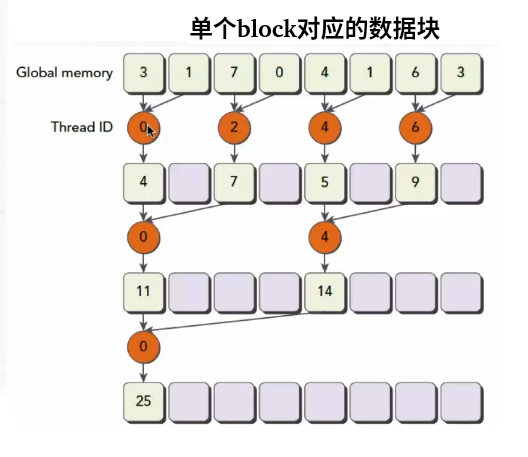
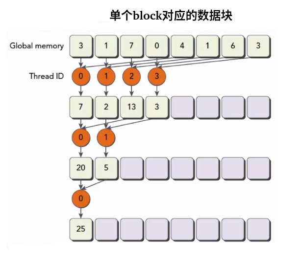

# CUDA

Compute Unified Device Architecture。

[CUDA 编程教程推荐](https://zhuanlan.zhihu.com/p/346910129)

# 0 环境搭建

```bash
# 查看电脑的显卡
lspci | grep -i vga
# 检查GPU是否支持cuda技术
https://developer.nvidia.com/cuda-gpus
```

## 0.1 安装问题纪实

### 0.1.1 tensorRT提醒

```bash
# 查看是否安装过tensorRT
# 如果是通过deb包安装的，则在下面的文件夹里查找
# 头文件
/usr/include/x86_64-linux-gnu
# 库
/usr/lib/x86_64-linux-gnu
# libnvinfer开头的

# 如果没有通过deb而是通过tar包安装的，则
find / -name tensorrt*
```


#### [tar包安装](https://blog.csdn.net/zong596568821xp/article/details/86077553)

选择tar包 [TensorRT 8.6 GA for Linux x86_64 and CUDA 12.0 and 12.1 TAR Package](https://developer.nvidia.com/downloads/compute/machine-learning/tensorrt/secure/8.6.1/tars/TensorRT-8.6.1.6.Linux.x86_64-gnu.cuda-12.0.tar.gz) 下载

**推荐**

```bash
# 解压
tar xzvf TensorRT-8.6.1.6.Linux.x86_64-gnu.cuda-12.0.tar.gz

cd TensorRT-8.6.1.6.Linux.x86_64-gnu.cuda-12.0/TensorRT-8.6.1.6

# 要使用trtexec，就要将命令的查找路径加入PATH
PATH = $PATH:/opt/TensorRT-8.6.1.6/bin
# 并且要将动态库的链接路径加入到LD_LIBRARY_PATH
LD_LIBRARY_PATH=$LD_LIBRARY_PATH:/opt/TensorRT-8.6.1.6/lib

# TensorRT路径下，将头文件和库放到指定位置，方便在程序中引入
sudo cp -r ./lib/* /usr/lib
sudo cp -r ./include/* /usr/include

```


#### deb安装

建议不要用deb安装，因为它要求cuda也要通过deb安装。麻烦的很

**最麻烦**

首先考虑需不需要安装**tensorRT**，如果要安装，在官网下载的tensorRT安装包大多是deb的，如果要安装通过deb的方式安装tensorRT，那么cuda也需要通过deb安装。所以尽量通过deb的方式安装所有东西。

由于如果要通过deb安装cuda，而deb的cuda安装方式，不支持剔除nvidia驱动安装，所以此时无需提前安装nvidia驱动。否则来回覆盖安装会有问题。

[tensorRT安装踩坑](https://blog.csdn.net/ws18921818762/article/details/103006076)

[ubuntu 20.04 环境下安装CUDA 11.8, cuDNN v8.6.0和TensorRT 8.6.0（deb方式）](https://blog.csdn.net/shanglianlm/article/details/130219640)

[ubuntu完全卸载CUDA](https://blog.csdn.net/weixin_44711603/article/details/110233047)，[Ubuntu卸载cuda、cudnn的方法](https://blog.csdn.net/Williamcsj/article/details/123514435)

```bash
sudo dpkg -i nv-tensorrt-local-repo-ubuntu2204-8.6.1-cuda-12.0_1.0-1_amd64.deb
sudo cp /var/nv-tensorrt-local-repo-ubuntu2204-8.6.1-cuda-12.0/*-keyring.gpg /usr/share/keyrings/
sudo apt-get update
# 安装 tensorrt
sudo apt-get install tensorrt
# 如果使用 Python
sudo apt-get install python3-libnvinfer-dev
# 如果转换 onnx 模型
sudo apt-get install onnx-graphsurgeon
# 如果转换 TensorFlow 模型
sudo apt-get install uff-converter-tf

# 安装位置
# 头文件
/usr/include/x86_64-linux-gnu
# 库
/usr/lib/x86_64-linux-gnu
# libnvinfer开头的
```


### 0.1.2 通过run安装显卡驱动

[nvidia 显卡驱动 安装最顺的教程](https://zhuanlan.zhihu.com/p/302692454)，推荐查看

- [配合食用：Ubuntu18.04 显卡驱动安装教程(解决各种疑难杂症)](https://zhuanlan.zhihu.com/p/463656273)

```bash
sudo ./NVIDIA-Linux-x86_64-xxx.run -no-x-check -no-nouveau-check -no-opengl-files

# 查看是否安装成功
nvidia-smi

# 安装过程中的问题

1. Error: the distribution-provided pre-install script failed.
2. Error: Unable to find the development tool 'cc' in your path.
3. Error: Unable to find the development tool 'make' in your path.
4. Error: The kernel module failed to load. Secure boot is enabled on this system.
5. The signed kernel module failed to load.
6. Error: Unable to load the kernel module 'nvidia.ko'
7. Error: An NVIDIA kernel 'nvidia-drm' appears to already be loaded in your kernel.
8. Error: An NVIDIA kernel module 'nvidia-modeset' appears to already be loaded in your kernel.
9. WARNING: Unable to find a suitable destination to install 32-bit compatibility libraries.
10. WARNING: Unable to determine the path to install the libglvnd EGL vendor library config files.

遇到了报错不要担心，正常情况，让我们逐一解决

解决方法
1. 第一个错误，继续安装即可，这个错误只是确认你是否要安装这个驱动

2. 第二个、第三个错误产生的原因是Ubuntu环境缺少所需要的依赖

解决：

sudo apt-get install gcc
sudo apt-get install make

3. 第四个错误与第五个错误产生的原因是BIOS没有关闭 Secure boot

解决：

重启电脑在主板信息界面，按F2或Del进入BIOS界面
按F7进入高级设置菜单
在菜单栏中点击进入启动分页
将快速启动设置为 Disabled
点击 安全启动菜单
操作系统类型如果是双系统依旧保持UEFI模式，如果不是双系统，设置为其他操作系统
点击 密钥管理
点击 清除安全启动密钥，再点击确认清除
保存设置并退出

4. 第六个错误，证明准备工作没有做好

输入命令reboot重启电脑
在用户登录界面，按 Alt + Ctrl + F2 进入命令行
输入命令：sudo systemctl isolate multi-user.target进入无窗口界面
输入用户名与密码进行登录
输入命令：sudo modprobe -r nvidia_drm、sudo modprobe -r nvidia_modeset
重新进入驱动安装
退出无窗口界面：sudo systemctl start graphical.target

5. 第七个错误和第八个错误，首先要确保关闭了Secure Boot，然后删除已经安装的显卡驱动：

sudo apt-get purge nvidia*
sudo apt-get autoremove
sudo reboot
再到第六个错误的部分解决准备工作的问题

最后两个警告，不影响安装，如果有需要，可以自己安装需要的依赖


安装时的选项
不放图了，选择基本如下，自行对号入座：

Q:The distribution-provided pre-install script failed! Are you sure you want to continue?
>>> yes
Q:Would you like to register the kernel module souces with DKMS? This will allow DKMS to automatically build a new module, if you install a different kernel later?
>>> No
Q:Would you like to sign the NVIDIA kernel module?
>>> Install without signing
Q:Nvidia’s 32-bit compatibility libraries? 
>>> No
Q:Would you like to run the nvidia-xconfigutility to automatically update your x configuration so that the NVIDIA x driver will be used when you restart x? Any pre-existing x confile will be backed up.
>>> Yes

```

```bash
# 查看驱动是否安装成功
nvidia-smi
# 下面的cuda VERSION是此驱动支持的cuda的最高版本
+---------------------------------------------------------------------------------------+
| NVIDIA-SMI 535.54.03              Driver Version: 535.54.03    CUDA Version: 12.2     |
|-----------------------------------------+----------------------+----------------------+
| GPU  Name                 Persistence-M | Bus-Id        Disp.A | Volatile Uncorr. ECC |
| Fan  Temp   Perf          Pwr:Usage/Cap |         Memory-Usage | GPU-Util  Compute M. |
|                                         |                      |               MIG M. |
|=========================================+======================+======================|
|   0  NVIDIA GeForce RTX 3060 Ti     Off | 00000000:03:00.0  On |                  N/A |
|  0%   59C    P8              23W / 200W |   1109MiB /  8192MiB |      3%      Default |
|                                         |                      |                  N/A |
+-----------------------------------------+----------------------+----------------------+
                                                                                         
+---------------------------------------------------------------------------------------+
| Processes:                                                                            |
|  GPU   GI   CI        PID   Type   Process name                            GPU Memory |
|        ID   ID                                                             Usage      |
|=======================================================================================|
|    0   N/A  N/A      2317      G   /usr/lib/xorg/Xorg                          597MiB |
|    0   N/A  N/A      2439      G   ...libexec/gnome-remote-desktop-daemon        2MiB |
|    0   N/A  N/A     10182      G   /usr/bin/gnome-shell                         98MiB |
|    0   N/A  N/A     11550      G   ...ures=TFLiteLanguageDetectionEnabled      131MiB |
|    0   N/A  N/A     13633      G   ...ures=SpareRendererForSitePerProcess      109MiB |
|    0   N/A  N/A     23125      G   ...sion,SpareRendererForSitePerProcess       33MiB |
|    0   N/A  N/A    169621      G   ...irefox/3026/usr/lib/firefox/firefox      112MiB |
|    0   N/A  N/A    199079      G   ...ures=SpareRendererForSitePerProcess        3MiB |
+---------------------------------------------------------------------------------------+
```


#### 后期出现mismatch问题

有时候驱动因为自动升级而导致在输入nvidia-smi的时候会出现：[Failed to initialize NVML: Driver/library version mismatch](https://blog.csdn.net/qq_41076797/article/details/124909408)这样的问题

注意在解决后，一定要重启一次，否则重装之后，立即nvidia-smi还是会出现mismatch

### 0.1.3 安装CUDA

[选择显卡驱动版本和toolkit版本下载，不含安装报错的显卡驱动安装教程](https://blog.csdn.net/weixin_39928010/article/details/131142603)

[Ubuntu22.04安装CUDA、cudnn详细步骤](https://blog.csdn.net/takedachia/article/details/130375718)


#### run文件方式

通过run文件，可剔除显卡驱动而单独安装cuda toolkit

```bash
# 2. 安装cuda toolkit
sudo chmod +x cuda_12.0.0_525.60.13_linux.run
sudo ./cuda_12.0.0_525.60.13_linux.run
# 提前安装了驱动，在cuda toolkit 中就不要安装gpu驱动
```

#### deb文件方式

无法剔除显卡驱动而单独安装cuda toolkit

```bash
sudo wget https://developer.download.nvidia.com/compute/cuda/repos/ubuntu2204/x86_64/cuda-ubuntu2204.pin
sudo mv cuda-ubuntu2204.pin /etc/apt/preferences.d/cuda-repository-pin-600
sudo wget https://developer.download.nvidia.com/compute/cuda/12.0.0/local_installers/cuda-repo-ubuntu2204-12-0-local_12.0.0-525.60.13-1_amd64.deb
sudo dpkg -i cuda-repo-ubuntu2204-12-0-local_12.0.0-525.60.13-1_amd64.deb
sudo cp /var/cuda-repo-ubuntu2204-12-0-local/cuda-*-keyring.gpg /usr/share/keyrings/
sudo apt-get update
sudo apt-get -y install cuda
```

#### 添加环境变量

```bash
# 配置 CUDA ,注意安装CUDA后，会在您的 /usr/local/文件夹下多一个 /usr/local/cuda 的文件夹，该文件夹其实是 /usr/local/cuda-12.0 文件夹的一个链接，两者本质上是相同的，所以配置的时候，可以直接按照 /usr/local/cuda 进行配置就行，会自动链接到 /usr/local/cuda-12.0。
lrwxrwxrwx  1 root root   21  9月 14 11:36 cuda -> /usr/local/cuda-12.0//
drwxr-xr-x 17 root root 4096  9月 14 11:37 cuda-12.0/
# 【再说一遍】：cuda安装目录为/usr/local/cuda-xxx，xxx为版本号，同时，cuda还会建立一个/usr/local/cuda同步链接，所以可以直接将该路径添加至环境变量，之后更换cuda版本，也不需要修改环境变量。

# 下面的配置没有按照上面的说法弄，而直接用的是cuda-12.0

sudo gedit ~/.bashrc
# 添加两个环境变量
export PATH=$PATH:/usr/local/cuda-12.0/bin
export LD_LIBRARY_PATH=$LD_LIBRARY_PATH:/usr/local/cuda-12.0/lib64

# 更新环境
source ~/.bashrc

# 测试是否安装成功,并可以看到cuda的版本
nvcc -V
nvcc: NVIDIA (R) Cuda compiler driver
Copyright (c) 2005-2022 NVIDIA Corporation
Built on Mon_Oct_24_19:12:58_PDT_2022
Cuda compilation tools, release 12.0, V12.0.76
Build cuda_12.0.r12.0/compiler.31968024_0
```


```bash
# 3. 跑cuda sample 代码
# 下载sample代码。cuda toolkit安装包在11.6之后便不再安装sample代码，需要自行在github上下载，https://blog.csdn.net/qq_27273607/article/details/127499808
git clone -b v12.0 --depth=1 git@github.com:NVIDIA/cuda-samples.git

# gpu设备查询sample
cd cuda-samples/Samples/1_Utilities/deviceQuery

make
# make 执行，生成的可执行文件放在cuda-samples/bin/x86_64/linux/release
/usr/local/cuda/bin/nvcc -ccbin g++ -I../../../Common -m64 --threads 0 --std=c++11 -gencode arch=compute_50,code=sm_50 -gencode arch=compute_52,code=sm_52 -gencode arch=compute_60,code=sm_60 -gencode arch=compute_61,code=sm_61 -gencode arch=compute_70,code=sm_70 -gencode arch=compute_75,code=sm_75 -gencode arch=compute_80,code=sm_80 -gencode arch=compute_86,code=sm_86 -gencode arch=compute_90,code=sm_90 -gencode arch=compute_90,code=compute_90 -o deviceQuery.o -c deviceQuery.cpp
/usr/local/cuda/bin/nvcc -ccbin g++ -m64 -gencode arch=compute_50,code=sm_50 -gencode arch=compute_52,code=sm_52 -gencode arch=compute_60,code=sm_60 -gencode arch=compute_61,code=sm_61 -gencode arch=compute_70,code=sm_70 -gencode arch=compute_75,code=sm_75 -gencode arch=compute_80,code=sm_80 -gencode arch=compute_86,code=sm_86 -gencode arch=compute_90,code=sm_90 -gencode arch=compute_90,code=compute_90 -o deviceQuery deviceQuery.o 
mkdir -p ../../../bin/x86_64/linux/release
cp deviceQuery ../../../bin/x86_64/linux/release

# 这个文件夹下生成可执行文件deviceQuery
cd cuda-samples/bin/x86_64/linux/release
# 运行
./deviceQuery


./deviceQuery Starting...

 CUDA Device Query (Runtime API) version (CUDART static linking)

Detected 1 CUDA Capable device(s)

Device 0: "NVIDIA GeForce RTX 3060 Ti"
  CUDA Driver Version / Runtime Version          12.2 / 12.0
  CUDA Capability Major/Minor version number:    8.6
  Total amount of global memory:                 7972 MBytes (8359641088 bytes)
  (038) Multiprocessors, (128) CUDA Cores/MP:    4864 CUDA Cores
  GPU Max Clock rate:                            1695 MHz (1.70 GHz)
  Memory Clock rate:                             7001 Mhz
  Memory Bus Width:                              256-bit
  L2 Cache Size:                                 3145728 bytes
  Maximum Texture Dimension Size (x,y,z)         1D=(131072), 2D=(131072, 65536), 3D=(16384, 16384, 16384)
  Maximum Layered 1D Texture Size, (num) layers  1D=(32768), 2048 layers
  Maximum Layered 2D Texture Size, (num) layers  2D=(32768, 32768), 2048 layers
  Total amount of constant memory:               65536 bytes
  Total amount of shared memory per block:       49152 bytes
  Total shared memory per multiprocessor:        102400 bytes
  Total number of registers available per block: 65536
  Warp size:                                     32
  Maximum number of threads per multiprocessor:  1536
  Maximum number of threads per block:           1024
  Max dimension size of a thread block (x,y,z): (1024, 1024, 64)
  Max dimension size of a grid size    (x,y,z): (2147483647, 65535, 65535)
  Maximum memory pitch:                          2147483647 bytes
  Texture alignment:                             512 bytes
  Concurrent copy and kernel execution:          Yes with 2 copy engine(s)
  Run time limit on kernels:                     Yes
  Integrated GPU sharing Host Memory:            No
  Support host page-locked memory mapping:       Yes
  Alignment requirement for Surfaces:            Yes
  Device has ECC support:                        Disabled
  Device supports Unified Addressing (UVA):      Yes
  Device supports Managed Memory:                Yes
  Device supports Compute Preemption:            Yes
  Supports Cooperative Kernel Launch:            Yes
  Supports MultiDevice Co-op Kernel Launch:      Yes
  Device PCI Domain ID / Bus ID / location ID:   0 / 3 / 0
  Compute Mode:
     < Default (multiple host threads can use ::cudaSetDevice() with device simultaneously) >

deviceQuery, CUDA Driver = CUDART, CUDA Driver Version = 12.2, CUDA Runtime Version = 12.0, NumDevs = 1
Result = PASS
```


FLOPS——float-point Operation per Second，每秒浮点操作次数，GFLOPS——g（billion） FLOPS，TFLOPS—— T（1000g） FLOPS

### 0.1.4 安装cudnn

[ubuntu cudnn 安装](https://blog.csdn.net/shanglianlm/article/details/130219640)

下载cudnn-local-repo-ubuntu2204-8.9.5.30_1.0-1_amd64.deb

需要适配cuda的版本这个版本适合12.x

```bash
sudo dpkg -i cudnn-local-repo-ubuntu2204-8.9.5.30_1.0-1_amd64.deb

sudo cp /var/cudnn-local-repo-ubuntu2204-8.9.5.30/cudnn-local-FB167084-keyring.gpg /usr/share/keyrings/

cd /var/cudnn-local-repo-ubuntu2204-8.9.5.30/

sudo apt-get install libcudnn8_8.9.5.30-1+cuda12.2
sudo apt-get install libcudnn8-dev_8.9.5.30-1+cuda12.2
sudo apt-get install libcudnn8-samples_8.9.5.30-1+cuda12.2
```

```bash
# 查看是否安装成功
# 查看cuDNN版本，旧版本指令为cat /usr/include/cudnn.h | grep CUDNN_MAJOR -A2，新版本有更新，将cuDNN版本信息单拉了一个文件名为cudnn_version.h，所以新版本查看cuDNN版本的命令为cat /usr/include/cudnn_version.h | grep CUDNN_MAJOR -A 2
```


### 0.1.5 查看是否安装成功

[Win10安装cuda、cudnn检测是否安装成功](https://blog.csdn.net/wzk4869/article/details/127540610)

```bash
# 测试驱动是否安装成功
nvidia-smi
# 测试CUDA是否安装成功(前提是添加环境变量)
nvcc -V
# 测试cudnn，进入/usr/local/cuda-12.0/extras/demo_suite，执行对应的可执行文件，得到对应的信息，即安装成功
sudo ./deviceQuery

./deviceQuery Starting...

 CUDA Device Query (Runtime API) version (CUDART static linking)

Detected 1 CUDA Capable device(s)

Device 0: "NVIDIA GeForce RTX 3060 Ti"
  CUDA Driver Version / Runtime Version          12.2 / 12.0
  CUDA Capability Major/Minor version number:    8.6
  Total amount of global memory:                 7972 MBytes (8359641088 bytes)
  (38) Multiprocessors, (128) CUDA Cores/MP:     4864 CUDA Cores
  GPU Max Clock rate:                            1695 MHz (1.70 GHz)
  Memory Clock rate:                             7001 Mhz
  Memory Bus Width:                              256-bit
  L2 Cache Size:                                 3145728 bytes
  Maximum Texture Dimension Size (x,y,z)         1D=(131072), 2D=(131072, 65536), 3D=(16384, 16384, 16384)
  Maximum Layered 1D Texture Size, (num) layers  1D=(32768), 2048 layers
  Maximum Layered 2D Texture Size, (num) layers  2D=(32768, 32768), 2048 layers
  Total amount of constant memory:               65536 bytes
  Total amount of shared memory per block:       49152 bytes
  Total number of registers available per block: 65536
  Warp size:                                     32
  Maximum number of threads per multiprocessor:  1536
  Maximum number of threads per block:           1024
  Max dimension size of a thread block (x,y,z): (1024, 1024, 64)
  Max dimension size of a grid size    (x,y,z): (2147483647, 65535, 65535)
  Maximum memory pitch:                          2147483647 bytes
  Texture alignment:                             512 bytes
  Concurrent copy and kernel execution:          Yes with 2 copy engine(s)
  Run time limit on kernels:                     Yes
  Integrated GPU sharing Host Memory:            No
  Support host page-locked memory mapping:       Yes
  Alignment requirement for Surfaces:            Yes
  Device has ECC support:                        Disabled
  Device supports Unified Addressing (UVA):      Yes
  Device supports Compute Preemption:            Yes
  Supports Cooperative Kernel Launch:            Yes
  Supports MultiDevice Co-op Kernel Launch:      Yes
  Device PCI Domain ID / Bus ID / location ID:   0 / 3 / 0
  Compute Mode:
     < Default (multiple host threads can use ::cudaSetDevice() with device simultaneously) >

deviceQuery, CUDA Driver = CUDART, CUDA Driver Version = 12.2, CUDA Runtime Version = 12.0, NumDevs = 1, Device0 = NVIDIA GeForce RTX 3060 Ti
Result = PASS

sudo ./bandwidthTest

[CUDA Bandwidth Test] - Starting...
Running on...

 Device 0: NVIDIA GeForce RTX 3060 Ti
 Quick Mode

 Host to Device Bandwidth, 1 Device(s)
 PINNED Memory Transfers
   Transfer Size (Bytes)	Bandwidth(MB/s)
   33554432			12105.5

 Device to Host Bandwidth, 1 Device(s)
 PINNED Memory Transfers
   Transfer Size (Bytes)	Bandwidth(MB/s)
   33554432			12543.2

 Device to Device Bandwidth, 1 Device(s)
 PINNED Memory Transfers
   Transfer Size (Bytes)	Bandwidth(MB/s)
   33554432			373770.4

Result = PASS

NOTE: The CUDA Samples are not meant for performance measurements. Results may vary when GPU Boost is enabled.
```


## 0.2 helloworld

### 0.2.1 配置编译器

```bash
# ubuntu clion新建cuda工程
# https://blog.csdn.net/c991262331/article/details/109318565
# 发现创建后，自动运行的结果报
# No CMAKE_CUDA_COMPILER could be found，
# file->setting->build->cmake ，CMake options
# 配置cmake 编译参数
-DCMAKE_CUDA_COMPILER:PATH=/usr/local/cuda-12.0/bin/nvcc

# 如果仅添加上面一项，就会报
#CMake Warning:
#  Manually-specified variables were not used by the project:
#    CMAKE_CXX_COMPILER
# 	 CMAKE_C_COMPILER

# 所以加全应该是如下
-DCMAKE_C_COMPILER=/usr/bin/gcc -DCMAKE_CXX_COMPILER=/usr/bin/g++ -DCMAKE_CUDA_COMPILER:PATH=/usr/local/cuda/bin/nvcc

```

### 0.2.2 hello

```cmake
cmake_minimum_required(VERSION 3.25)
project(cudaDemo LANGUAGES C CXX CUDA)
# 如果在project这里不加LANGUAGES CUDA
# CMake Error: CMake can not determine linker language for target: XXXXX
# 如果在cu文件里使用c++，也要添加CXX


set(CMAKE_CUDA_STANDARD 17)
include_directories(/usr/include /usr/local/cuda-12.0/include)
add_executable(cudaDemo main.cu)

set_target_properties(cudaDemo PROPERTIES
        CUDA_SEPARABLE_COMPILATION ON)

```

[CUDA查询和选取设备信息](https://blog.csdn.net/dcrmg/article/details/54577709)

```c++
#include <iostream>
#include <cuda_runtime.h>
#include <device_launch_parameters.h>

int main() {

    int dev = 0;
    cudaDeviceProp deviceProp;
    cudaGetDeviceProperties(&deviceProp, dev);
    std::cout << "使用GPU device " << dev << ": " << deviceProp.name << std::endl;
    std::cout << "SM的数量：" << deviceProp.multiProcessorCount << std::endl;
    std::cout << "每个线程块的共享内存大小：" << deviceProp.sharedMemPerBlock / 1024.0 << " KB" << std::endl;
    std::cout << "每个线程块的最大线程数：" << deviceProp.maxThreadsPerBlock << std::endl;
    std::cout << "每个EM的最大线程数：" << deviceProp.maxThreadsPerMultiProcessor << std::endl;
    std::cout << "每个SM的最大线程束数：" << deviceProp.maxThreadsPerMultiProcessor / 32 << std::endl;
    std::cout << "Hello, World!" << std::endl;
    return 0;
    
/*  
	使用GPU device 0: NVIDIA GeForce RTX 3060 Ti
    SM的数量：38
    每个线程块的共享内存大小：48 KB
    每个线程块的最大线程数：1024
    每个EM的最大线程数：1536
    每个SM的最大线程束数：48
*/
}
```

```c++
// 硬件信息
struct cudaDeviceProp {
    char name[256]; // 识别设备的ASCII字符串（比如，"GeForce GTX 940M"）
    
    size_t totalGlobalMem; // 全局内存大小
    size_t sharedMemPerBlock; // 每个线程块block的共享内存大小
    
    int regsPerBlock; // 每个block 32位寄存器的个数
    int warpSize; // warp大小
    size_t memPitch; // 内存中允许的最大间距字节数
    
    int maxThreadsPerBlock; // 每个Block中最大的线程数是多少
    
    int maxThreadsDim[3]; // 一个块中每个维度的最大线程数
    int maxGridSize[3]; // 一个网格的每个维度的块数量
    size_t totalConstMem; // 可用恒定内存量
    int major; // 该设备计算能力的主要修订版号
    int minor; // 设备计算能力的小修订版本号
    int clockRate; // 时钟速率
    size_t textureAlignment; // 该设备对纹理对齐的要求
    int deviceOverlap; // 一个布尔值，表示该装置是否能够同时进行cudamemcpy()和内核执行
    
    int multiProcessorCount; // 设备上的处理器的数量,SM的数量
    int maxThreadsPerMultiProcessor; 	//每个EM的最大线程数,每个SM的最大线程束数 = maxThreadsPerMultiProcessor / 32
    
    int kernelExecTimeoutEnabled; // 一个布尔值，该值表示在该设备上执行的内核是否有运行时的限制
    int integrated; // 返回一个布尔值，表示设备是否是一个集成的GPU（即部分的芯片组、没有独立显卡等）
    int canMapHostMemory; // 表示设备是否可以映射到CUDA设备主机内存地址空间的布尔值
    int computeMode; // 一个值，该值表示该设备的计算模式：默认值，专有的，或禁止的
    int maxTexture1D; // 一维纹理内存最大值
    int maxTexture2D[2]; // 二维纹理内存最大值
    int maxTexture3D[3]; // 三维纹理内存最大值
    int maxTexture2DArray[3]; // 二维纹理阵列支持的最大尺寸
    int concurrentKernels; // 一个布尔值，该值表示该设备是否支持在同一上下文中同时执行多个内核
}
```

### 0.2.3 在c++ cuda混合编程

[Cmake C++ cuda 混合编程 入门](https://blog.csdn.net/qq_43331089/article/details/131103281)

```c++
// nvCvt.cu

#include "nvCvt.h"
__global__
void bgra2yuv_kernel(const uchar4* src, uchar* y, uchar* u, uchar* v, int width, int height) {
    int x = blockIdx.x * blockDim.x + threadIdx.x;
    int y_idx = blockIdx.y * blockDim.y + threadIdx.y;
    int idx = y_idx * width + x;

    if (x < width && y_idx < height) {
        uchar4 pixel = src[idx];

        // BGRA to YUV conversion
        y[idx] = (uchar)(0.299f * pixel.x + 0.587f * pixel.y + 0.114f * pixel.z);
        u[idx] = (uchar)(-0.147f * pixel.x - 0.289f * pixel.y + 0.436f * pixel.z + 128);
        v[idx] = (uchar)(0.615f * pixel.x - 0.515f * pixel.y - 0.100f * pixel.z + 128);
    }
}

void bgra2yuv(cv::cuda::GpuMat& bgra, cv::cuda::GpuMat& yuv) {
    // Allocate memory for Y, U, V channels
    cv::cuda::GpuMat y(bgra.size(), CV_8UC1);
    cv::cuda::GpuMat u(bgra.size(), CV_8UC1);
    cv::cuda::GpuMat v(bgra.size(), CV_8UC1);

    // Launch CUDA kernel
    dim3 block(32, 32);
    dim3 grid((bgra.cols + block.x - 1) / block.x, (bgra.rows + block.y - 1) / block.y);
    bgra2yuv_kernel<<<grid, block>>>(reinterpret_cast<uchar4*>(bgra.data), y.data, u.data, v.data, bgra.cols, bgra.rows);
    cudaDeviceSynchronize();

    // Merge Y, U, V channels into YUV I420 format
    std::vector<cv::cuda::GpuMat> channels = {y, u, v};
    cv::cuda::merge(channels,yuv);
}
```

```c++
// nvCvt.h
// 头文件中不能暴露核函数的声明。bgra2yuv_kernel这个函数就不能写在.h文件中，否则会报错，有些类型无法识别
#ifndef HELLO_NVCVT_H
#define HELLO_NVCVT_H
#include <opencv2/opencv.hpp>
#include <opencv2/cudaimgproc.hpp>
#include <opencv2/core/cuda.hpp>
#include <opencv2/cudaarithm.hpp>
#include <opencv2/cudacodec.hpp>
#include "stdint.h"
void bgra2yuv(cv::cuda::GpuMat& bgra, cv::cuda::GpuMat& yuv);
#endif //HELLO_NVCVT_H
```

```c++
// mian.cpp
#include "nvCvt.h"
int main(){
	cv::cuda::GpuMat gpuMat;
    cv::cuda::GpuMat yuv(gpuMat.rows, gpuMat.cols * 3 / 2, CV_8UC1);
    bgra2yuv(gpuMat, yuv);
}
```


## 0.3 [初识和相关概念](https://zhuanlan.zhihu.com/p/34587739)

### 0.3.1 前言

GPU并不是一个独立运行的计算平台，而需要与CPU协同工作，可以看成是CPU的协处理器，因此当我们在说GPU并行计算时，其实是指的基于CPU+GPU的异构计算架构。

在异构计算架构中，GPU与CPU通过PCIe总线连接在一起来协同工作，CPU所在位置称为为主机端（host），而GPU所在位置称为设备端（device）


GPU包括更多的运算核心，其特别适合数据并行的计算密集型任务，如大型矩阵运算。

CPU的运算核心较少，但是其可以实现复杂的逻辑运算，因此其适合控制密集型任务。

另外，CPU上的线程是重量级的，上下文切换开销大，但是GPU由于存在很多核心，其线程是轻量级的。

因此，基于CPU+GPU的异构计算平台可以优势互补，CPU负责处理逻辑复杂的串行程序，而GPU重点处理数据密集型的并行计算程序，从而发挥最大功效。


CUDA是NVIDIA公司所开发的GPU编程模型，它提供了GPU编程的简易接口，基于CUDA编程可以构建基于GPU计算的应用程序。

CUDA提供了对其它编程语言的支持，如C/C++，Python，Fortran等语言

### 0.3.2 CUDA编程模型基础

CUDA编程模型是一个异构模型，需要CPU和GPU协同工作。

#### 概念：**host**和**device**

- host指代CPU及其内存
- device指代GPU及其内存。
- CUDA程序中既包含host程序，又包含device程序，它们分别在CPU和GPU上运行。同时，host与device之间可以进行通信，这样它们之间可以进行数据拷贝。
- 典型的CUDA程序的执行流程如下：
  1. 分配host内存，并进行数据初始化；

1. 分配device内存，并从host将数据拷贝到device上；
2. 调用CUDA的核函数在device上完成指定的运算；
3. 将device上的运算结果拷贝到host上；
4. 释放device和host上分配的内存


#### **kernel**

- kernel是在device上线程中并行执行的函数
- 函数类型区分：
  - `__global__`：
    - 在device上执行，从host中调用（一些特定的GPU也可以从device上调用）
    - 返回类型必须是`void`，不支持可变参数参数，不能成为类成员函数。
    - `__global__`定义的kernel是**异步**的，这意味着host不会等待kernel执行完就执行下一步。
  - `__device__`：在device上执行，单仅可以从device中调用
  - `__host__`：在host上执行，仅可以从host上调用，一般省略不写。可和`__device__`同时用，此时函数会在device和host都编译。


#### 线程结构的**层次**概念

- 第一层次网格grid：
  - kernel在device上执行时实际上是启动很多线程，一个kernel所启动的所有线程称为一个**网格**（grid），同一个网格上的线程共享相同的全局内存空间
- 第二层次线程块block：
  - 网格又可以分为很多**线程块**（block），线程块又包含许多线程。
- 第三层次线程thread
- 一个线程需要两个内置的坐标变量（blockIdx，threadIdx）来唯一标识，它们都是`dim3`类型变量，其中blockIdx指明线程所在grid中的位置，而threaIdx指明线程所在block中的位置


```c++
// Kernel定义
__global__ void MatAdd(float A[N][N], float B[N][N], float C[N][N]) 
{ 
    int i = blockIdx.x * blockDim.x + threadIdx.x; 
    int j = blockIdx.y * blockDim.y + threadIdx.y; 
    if (i < N && j < N) 
        C[i][j] = A[i][j] + B[i][j]; 
}
int main() 
{ 
    ...
    // Kernel 线程配置
    dim3 threadsPerBlock(16, 16); 
    dim3 numBlocks(N / threadsPerBlock.x, N / threadsPerBlock.y);
    // kernel调用
    MatAdd<<<numBlocks, threadsPerBlock>>>(A, B, C); 
    ...
}
```


#### 内存模型

每个线程有自己的私有本地内存（Local Memory）

而每个线程块有包含共享内存（Shared Memory），可以被线程块中所有线程共享，其生命周期与线程块一致。

此外，所有的线程都可以访问全局内存（Global Memory）。还可以访问一些只读内存块：常量内存（Constant Memory）和纹理内存（Texture Memory）。


#### 硬件

一个kernel实际上会启动很多线程，这些线程是逻辑上并行的，但是在物理层却并不一定。

- 多线程如果没有多核支持，在物理层是无法并行的。

GPU存在大量的CUDA核心，**GPU硬件的一个核心组件SM（Streaming Multiprocessor，流式多处理器）**

- SM的核心组件包括CUDA核心，共享内存，寄存器
- SM可以并发地执行数百个线程，并发能力就取决于SM所拥有的资源数

当一个kernel被执行时，它的gird中的线程块被分配到SM上，**一个线程块只能在一个SM上被调度**，SM一般可以调度多个线程块，这要看SM本身的能力。

一个kernel的各个线程块被分配多个SM，所以grid只是逻辑层，而SM才是执行的物理层。

**SM采用的是SIMT(Single-Instruction, Multiple-Thread，单指令多线程)架构**。

SM基本的执行单元是线程束（**warps**)，线程束包含32个线程，**这些线程同时执行相同的指令（kernel函数的多个代码行，经过编译翻译为多个指令）**，但是每个线程都包含自己的指令地址计数器和寄存器状态，也有自己独立的执行路径。

所以尽管线程束中的线程同时从同一程序地址执行，但是可能具有不同的行为，比如遇到了分支结构，一些线程可能进入这个分支，但是另外一些有可能不执行，它们只能死等（一人死干，多人围观），因为**GPU规定线程束中所有线程在同一周期执行相同的指令（因为条件结构造成分化，所以一个线程执行某个条件分支，其它线程只有等着该线程跳出该条件分支，才能继续向下执行相同的指令）**，线程束分化会导致性能下降。

当线程块被划分到某个SM上时，它将进一步划分为多个线程束，因为这才是SM的基本执行单元，但是一个SM同时并发的线程束数是有限的。这是因为资源限制，SM要为每个线程块分配共享内存，而也要为每个线程束中的线程分配独立的寄存器。所以SM的配置会影响其所支持的线程块和线程束并发数量。

**一个kernel的grid、block都是逻辑并发，而SM内的线程束才是物理并发。**一个kernel的所有线程其实在物理层是不一定同时并发的。所以kernel的grid和block的配置不同，性能会出现差异，这点是要特别注意的。

由于SM的基本执行单元是包含32个线程的线程束，所以block大小一般要设置为32的倍数。


在进行CUDA编程前，可以先检查一下自己的GPU的硬件配置，

## 0.4 向量运算实例

### 0.4.1 向量加法


```c++
// device上分配size字节的内存(显存)
cudaError_t cudaMalloc(void** devPtr, size_t size);
// 负责host和device之间数据通信
cudaError_t cudaMemcpy(void* dst, const void* src, size_t count, cudaMemcpyKind kind);
// src 数据源，dst 目标区域，count 字节数
// kind控制复制的方向：cudaMemcpyHostToHost, cudaMemcpyHostToDevice, cudaMemcpyDeviceToHost及cudaMemcpyDeviceToDevice，如cudaMemcpyHostToDevice将host上数据拷贝到device上。

```

实现一个向量加法的实例，这里grid和block都设计为1-dim，首先定义kernel如下：

```c++
#include <iostream>
#include <cuda_runtime.h>
#include <device_launch_parameters.h>

// 两个向量加法kernel，grid和block均为一维
__global__ void add(float* x, float * y, float* z, int n)
{
    // 获取全局索引
    int index = threadIdx.x + blockIdx.x * blockDim.x;
    // 步长
    int stride = blockDim.x * gridDim.x;
    for (int i = index; i < n; i += stride)
    {
        z[i] = x[i] + y[i];
    }
}
int main()
{
    int N = 1 << 20;
    int nBytes = N * sizeof(float);
    // 申请host内存
    float *x, *y, *z;
    x = (float*)malloc(nBytes);
    y = (float*)malloc(nBytes);
    z = (float*)malloc(nBytes);

    // 初始化数据
    for (int i = 0; i < N; ++i)
    {
        x[i] = 10.0;
        y[i] = 20.0;
    }

    // 申请device内存
    float *d_x, *d_y, *d_z;
    cudaMalloc((void**)&d_x, nBytes);
    cudaMalloc((void**)&d_y, nBytes);
    cudaMalloc((void**)&d_z, nBytes);

    // 将host数据拷贝到device
    cudaMemcpy((void*)d_x, (void*)x, nBytes, cudaMemcpyHostToDevice);
    cudaMemcpy((void*)d_y, (void*)y, nBytes, cudaMemcpyHostToDevice);
    // 定义kernel的执行配置
    dim3 blockSize(256);
    dim3 gridSize((N + blockSize.x - 1) / blockSize.x);
    // 执行kernel
    add << < gridSize, blockSize >> >(d_x, d_y, d_z, N);

    // 将device得到的结果拷贝到host
    cudaMemcpy((void*)z, (void*)d_z, nBytes, cudaMemcpyDeviceToHost);

    // 检查执行结果
    float maxError = 0.0;
    for (int i = 0; i < N; i++)
        maxError = fmax(maxError, fabs(z[i] - 30.0));
    std::cout << "最大误差: " << maxError << std::endl;

    // 释放device内存
    cudaFree(d_x);
    cudaFree(d_y);
    cudaFree(d_z);
    // 释放host内存
    free(x);
    free(y);
    free(z);

    return 0;
}

```

在上面的实现中，我们需要单独在host和device上进行内存分配，并且要进行数据拷贝，这是很容易出错的。好在CUDA 6.0引入统一内存（[Unified Memory](https://link.zhihu.com/?target=http%3A//docs.nvidia.com/cuda/cuda-c-programming-guide/index.html%23um-unified-memory-programming-hd)）来避免这种麻烦，简单来说就是统一内存使用一个托管内存来共同管理host和device中的内存，并且自动在host和device中进行数据传输。CUDA中使用cudaMallocManaged函数分配托管内存：

```c++
cudaError_t cudaMallocManaged(void **devPtr, size_t size, unsigned int flag=0);
```


```c++
int main()
{
    int N = 1 << 20;
    int nBytes = N * sizeof(float);

    // 申请托管内存
    float *x, *y, *z;
    cudaMallocManaged((void**)&x, nBytes);
    cudaMallocManaged((void**)&y, nBytes);
    cudaMallocManaged((void**)&z, nBytes);

    // 初始化数据
    for (int i = 0; i < N; ++i)
    {
        x[i] = 10.0;
        y[i] = 20.0;
    }

    // 定义kernel的执行配置
    dim3 blockSize(256);
    dim3 gridSize((N + blockSize.x - 1) / blockSize.x);
    // 执行kernel
    add << < gridSize, blockSize >> >(x, y, z, N);

    // 同步device 保证结果能正确访问
    cudaDeviceSynchronize();
    // 检查执行结果
    float maxError = 0.0;
    for (int i = 0; i < N; i++)
        maxError = fmax(maxError, fabs(z[i] - 30.0));
    std::cout << "最大误差: " << maxError << std::endl;

    // 释放内存
    cudaFree(x);
    cudaFree(y);
    cudaFree(z);

    return 0;
}
```


### 0.4.2 向量乘法


```c++
#include <iostream>
#include <cuda_runtime.h>
#include <device_launch_parameters.h>

// 矩阵类型，行优先，M(row, col) = *(M.elements + row * M.width + col)
struct Matrix
{
    int width;
    int height;
    float *elements;
};
// 获取矩阵A的(row, col)元素
__device__ float getElement(Matrix *A, int row, int col)
{
    return A->elements[row * A->width + col];
}

// 为矩阵A的(row, col)元素赋值
__device__ void setElement(Matrix *A, int row, int col, float value)
{
    A->elements[row * A->width + col] = value;
}

// 矩阵相乘kernel，2-D，每个线程计算一个元素
__global__ void matMulKernel(Matrix *A, Matrix *B, Matrix *C)
{
    float Cvalue = 0.0;
    int row = threadIdx.y + blockIdx.y * blockDim.y;
    int col = threadIdx.x + blockIdx.x * blockDim.x;
    for (int i = 0; i < A->width; ++i)
    {
        Cvalue += getElement(A, row, i) * getElement(B, i, col);
    }
    setElement(C, row, col, Cvalue);
}
int main()
{
    int width = 1 << 10;
    int height = 1 << 10;
    Matrix *A, *B, *C;
    // 申请托管内存
    cudaMallocManaged((void**)&A, sizeof(Matrix));
    cudaMallocManaged((void**)&B, sizeof(Matrix));
    cudaMallocManaged((void**)&C, sizeof(Matrix));
    int nBytes = width * height * sizeof(float);
    cudaMallocManaged((void**)&A->elements, nBytes);
    cudaMallocManaged((void**)&B->elements, nBytes);
    cudaMallocManaged((void**)&C->elements, nBytes);

    // 初始化数据
    A->height = height;
    A->width = width;
    B->height = height;
    B->width = width;
    C->height = height;
    C->width = width;
    for (int i = 0; i < width * height; ++i)
    {
        A->elements[i] = 1.0;
        B->elements[i] = 2.0;
    }

    // 定义kernel的执行配置
    dim3 blockSize(32, 32);
    dim3 gridSize((width + blockSize.x - 1) / blockSize.x,
                  (height + blockSize.y - 1) / blockSize.y);
    // 执行kernel
    matMulKernel << < gridSize, blockSize >> >(A, B, C);


    // 同步device 保证结果能正确访问
    cudaDeviceSynchronize();
    // 检查执行结果
    float maxError = 0.0;
    for (int i = 0; i < width * height; ++i)
        maxError = fmax(maxError, fabs(C->elements[i] - 2 * width));
    std::cout << "最大误差: " << maxError << std::endl;

    return 0;
}
```

# 1 基本模块

- 线程模型
- 内存模型
- 流和事件
- 底层指令优化
- 调试
  - Nvidia Nsight
  - CUDA-GDB
  - 其他一些图形化的性能分析工具

## 1.1 并行与异构计算

并行计算（parallel computing）：是一种计算形式，它将大的问题分解为许多可以并发执行的小问题

- 任务并行：多个任务同时执行（看视频和聊天）
- 数据并行：多个数据可以被同时处理，每个数据有独立线程处理。
  - 数据并行分块方法：块分和循环分块
  - 块分的数据：在一个线程上处理
  - 循环分块的数据：一个线程可能处理多个数据块

异构计算：指在多种类型处理器（CPU和GPU）的系统中完成的计算。

- x86 CPU+GPU的这种异构应该是最常见的，也有CPU+FPGA，CPU+DSP等各种各样的组合
- [进行异构计算时，GPU，FPGA，CPU，DSP这些平台各有什么特点？如何选择？](https://www.zhihu.com/question/22907419)

CPU擅长逻辑和多任务计算，GPU擅长大数据量的数据处理，CPU和GPU之间是通过pcie总线连接。


## 1.2 GPU性能指标

- GPU核心数
- GPU内存容量
- 计算峰值
  - 每秒单精度或双精度运算能力
  - FLOPS——float-point Operation per Second，每秒浮点操作次数，GFLOPS——g（billion） FLOPS，TFLOPS—— T（1000g） FLOPS
- 内存带宽
  - 每秒钟读入和写入GPU内存的数据量

``` bash
# 查看电脑的显卡
lspci | grep -i vga
# OR
lspci | grep -i nvidia
```


## 1.3 CUDA

Compute Unified Device Architecture，是Nvidia公司推出的，基于GPU的通用高性能计算平台和编程模型


**应用场景**：

1. 高性能计算 High Performance Computing
2. 深度学习 Deep Learning
3. 机器学习 Machine Learning
4. 推理 Inference
5. 自动驾驶 Autonomous Vehicle
6. 光追 Ray Tracing
7. 可视化 Design and Visualization
8. 游戏开发Game Development

CUDA平台提供了驱动层接口（Driver API）和运行时接口（Runtime API）


驱动API是低级的API，使用相对困难，运行时API是高级API使用简单，其实现基于驱动API。

这两种API是互斥的，也就是你只能用一个，两者之间的函数不可以混合调用，只能用其中的一个库。

一个CUDA应用通常可以分解为两部分，

- CPU 主机端代码

- GPU 设备端代码

CUDA nvcc编译器会自动分离你代码里面的不同部分，如图中主机代码用C写成，使用本地的C语言编译器编译，设备端代码，也就是核函数，用CUDA C编写，通过nvcc编译，链接阶段，在内核程序调用或者明显的GPU设备操作时，添加运行时库。

## 1.4 CUDA编程模型

编程模型是对底层计算机硬件架构的抽象表达。作为应用程序和底层架构的桥梁，体现在程序开发语言和开发平台中。

1. CUDA平台对线程的管理
   - CUDA平台提供了线程抽象接口，控制GPU中线程
2. CUDA平台对内存访问控制
   - 主机内存和GPU设备内存
   - CPU和GPU之间内存数据传递
3. 内核函数（kernel function）
   - 运行在GPU上的代码，内核代码本身不包含任何并行性，由GPU协调处理线程执行内核。
   - **CPU和GPU处于异步执行状态**

# 2 线程模型

## 2.1 线程模型

**逻辑层面**的线程层次划分：

- 第一层次网格grid：
  - kernel在device上执行时实际上是启动很多线程，一个kernel所启动的所有线程称为一个**网格**（grid），同一个网格上的线程共享相同的全局内存空间
- 第二层次线程块block：
  - 网格又可以分为很多**线程块**（block），线程块又包含许多线程。
  - 相同的block中的线程可以通过同步机制和**块内共享内存**做数据交互。
- 第三层次线程thread

**线程的标识**：

- 一个线程需要两个内置的坐标变量（**blockIdx，threadIdx**）来唯一标识，其中blockIdx指明线程所在grid中的位置，而threaIdx指明线程所在block中的位置
- 线程标识由cuda平台内置和分配，并且可以在内核程序中访问。
- 线程标识（blockIdx, threadIdx)，它们都是**`dim3`类型变量**，通过x, y, z访问

**线程模型的维度**：

- 线程模型维度由内置变量**blockDim和gridDim**标识
- 它们也是三维向量。

**线程管理**：

- 线程id和线程标识符换算关系：
  * 如果`block维度是(Dx, Dy)，线程标识符(i, j)，thread ID = i + j * Dx`
  * thread ID是在一个block中，唯一线程的id
  * 而threadIdx


```c++
// Kernel定义
__global__ void MatAdd(float A[N][N], float B[N][N], float C[N][N]) 
{ 
    int i = blockIdx.x * blockDim.x + threadIdx.x; 
    int j = blockIdx.y * blockDim.y + threadIdx.y; 
    if (i < N && j < N) 
        C[i][j] = A[i][j] + B[i][j]; 
}
int main() 
{ 
    ...
    // Kernel 线程配置
    dim3 threadsPerBlock(16, 16); 
    dim3 numBlocks(N / threadsPerBlock.x, N / threadsPerBlock.y);
    // kernel调用
    MatAdd<<<numBlocks, threadsPerBlock>>>(A, B, C); 
    ...
}
```

## 2.2 nvcc

nvcc 本质上是编译器驱动程序（compiler driver），它根据传入的命令参数执行一系列命令工具，完成对程序编译的各个阶段。它与真正的编译器工具链（eg：gcc）有联系也有区别。

cuda内核程序可以使用指令集架构（CUDA Instruction Set Architecture, ISA，也叫做PTX），或扩展的C语言编写。

nvcc最终的目的就是将PTX或c语言编写的代码编译为可执行程序。

nvcc封装了CUDA程序复杂的编译、链接过程，使开发人员可以很方便的完成CUDA程序的编译。

注：PTX是一个稳定的编程模型和指令集，是Virtual Architecture的汇编产物，这个ISA能够跨越多种GPU。

### 2.2.1 [nvcc 工作流程](https://zhuanlan.zhihu.com/p/432674688)

cuda程序默认编译模式为全程序编译模式（whole program compilation mode）。指的是在同一程序的文件中，既有主机程序，又有设备程序，那么主机程序运行在cpu上，设备程序运行在GPU上，而对于主机程序和设备程序在nvcc的编译过程中，它是分别由不同编译工具链来完成。

- 分离源文件与GPU相关联的内核代码，并将其编译为cubin（如果是使用c语言程序进行开发，就编译为cubin）或者ptx中间文件（如果使用PTX，就编译为ptx中间文件），并保存在fatbinary中。
- 分离源文件与主机相关的代码，使用系统中可以使用的编译器进行编译，例如gcc，gcc编译产生中间文件object file后，再将fatbinary嵌入gcc产生的中间产物中。
- 程序链接时，相关的CUDA运行库（runtime library）会被链接，最后产生可执行程序。
- 


### 2.2.2 [nvcc 命令行参数](https://docs.nvidia.com/cuda/cuda-compiler-driver-nvcc/index.html#command-option-description)

nvcc参数分为长名参数（用--标识，常用在脚本中）和短名参数（用-标识，常用在交互式命令中）

nvcc参数根据其类型分为：bool参数，单值参数和列表参数

参数内容大致分类：

- 指定文件和路径相关参数
- 指定编译过程相关参数
- 指定编译、链接行为相关参数
  - `--debug, -g`，调试主机代码
  - `--device-debug, -G`，调试设备代码
- 传递编译过程相关参数
- 指定nvcc行为相关参数
- 控制CUDA编译过程相关参数
- 控制GPU代码生成相关参数

## 2.3 内核函数

### 2.3.1 定义

内核函数（kernel function），是被GPU上线程并发执行的函数。

- **并发执行并不是从内核函数程序代码本身去实现的，并发执行是GPU设备从硬件层面去实现的。**并不需要从代码层面上考虑并发。

CUDA程序中的函数修饰符

| 修饰符           | 运行         | 调用                                                         | 注意                     |
| ---------------- | ------------ | ------------------------------------------------------------ | ------------------------ |
| **`__global__`** | 执行在设备上 | 既可以被host调用。<br />也可以被计算能力三级（compute capability 3）的设备上调用<br />`__global__`定义的kernel是**异步**的，这意味着host不会等待kernel执行完就执行下一步。 | **返回值类型必须为void** |
| **`__device__`** | 执行在设备上 | 只能被设备代码调用                                           |                          |
| **`__host__`**   | 执行在主机上 | 只能被主机代码调用                                           | 修饰符可省略不写         |

注：`__host__`和`__device__`一起使用，此时函数会在device和host都编译。

**内核函数的限制**：

- 只能访问GPU内存
- 只能使用变长参数
- 不能在函数体中使用static变量
- 不能使用函数指针
- 内核函数执行具有异步性

### 2.3.2 内核函数的执行

- 设置GPU线程
  - 内核执行配置（kernel execution configuration）：**`<<<grid, block>>>`**
  - 设置线程总数和线程布局
- 内核调用
  - **`kernel_function_name<<<grid, block>>>(args list)`**
  - **这里的grid指的是网格中包含的block个数，而block指的是每个块中包含的线程个数。**
- 释放所有与当前进程相关的GPU资源
  - cudaDeviceReset

```c++
#include <stdio.h>

__global__ void helloFromGPU(){
    printf("hello world from GPU\n");
}
int main(int argc, char ** argv){
    printf("hello world from cpu\n");

    // <<<1, 10>>>这里的1指定了网格grid里block的个数为1，10指定了每个block包含的线程数为10
    helloFromGPU<<<1, 10>>>();
    
    // 释放设备资源
    cudaDeviceReset();
    return 0;
}
```

```bash
nvcc hello.cu --output-file hello
# or
nvcc hello.cu -o hello
```

## 2.4 线程索引


通过线程索引可以为线程分配数据。

CUDA平台线程索引包含blockIdx和threadIdx

- 数据类型都是uint3，通过x，y，z下标访问

- blockIdx指明线程所在grid中的位置，
- threaIdx指明线程所在block中的位置。

线程维度包括网格维度gridDim，块维度blockDim。

- 数据类型都是dim3，各维度通过x， y， z下标访问


可以把网格和线程块都看作一个三维的矩阵。这里假设网格是一个的三维矩阵， 线程块是一个的三维矩阵。

- `gridDim = (3, 4, 5)`，gridDim.x、gridDim.y、gridDim.z分别表示网格各个维度的大小，分别等于3, 4, 5
- `blockDim = (4, 5, 6)`，blockDim.x、blockDim.y、blockDim.z分别表示线程块中各个维度的大小，分别等于4, 5, 6
- `blockdx=(blockIdx.x, blockIdx.y, blockIdx.z)`，分别表示当前线程块在所处的线程网格的坐标位置
- `threadIdx= (threadIdx.x, threadIdx.y, threadIdx.z)`分别表示当前线程在所属线程块的坐标位置

总的线程个数N：`gridDim.x * gridDim.y * gridDim.z * blockDim.x * blockDim.y * blockDim.z`

**将所有的线程排成一个序列，序列号为0 , 1 , 2 , … , N ，如何找到当前的序列号？**

```c++
// 1. 先找到当前线程位于网格中的哪一个线程块blockId
blockId = blockIdx.x + blockIdx.y * gridDim.x + blockIdx.z * gridDim.x * gridDim.y;
// 2. 再找到当前线程位于线程块中的哪一个线程threadId
threadId = threadIdx.x + threadIdx.y * blockDim.x + threadIdx.z * blockDim.x * blockDim.y;
// 3. 计算一个线程块中一共有多少个线程M
M = blockDim.x * blockDim.y * blockDim.z;
// 4. 求得当前的线程序列号idx
idx = threadId + M * blockId;
```


1. 

```c++
#include <stdio.h>

__global__ void helloFromGPU(){
    printf("gridDim:x= %d, y=%d, z=%d, lockDim: x= %d, y=%d, z=%d, Current threadIdx: x=%d, y=%d, z=%d\n",
           gridDim.x, gridDim.y, gridDim.z,
           blockDim.x, blockDim.y, blockDim.z,
           threadIdx.x, threadIdx.y, threadIdx.z);
}
int main(int argc, char ** argv){
    printf("hello world from cpu\n");
    // grid 里面包含2 x 2的4个block
    dim3 grid;
    grid.x = 2;
    grid.y = 2;
    // 每个block里面又包含了2 x 2的4个thread
    dim3 block;
    block.x = 2;
    block.y = 2;
    // <<<1, 10>>>这里的1指定了网格grid里block的个数为1，10指定了每个block包含的线程数为10
    helloFromGPU<<<grid, block>>>();
    // 释放设备资源
    cudaDeviceReset();
    return 0;
}
```

## 2.5 错误处理

CUDA中大部分函数执行完成后会返回执行结果，执行成功则返回cudaSuccess（ =0 ），如果失败则返回对应的枚举值

[错误代码枚举值](https://docs.nvidia.com/cuda/cuda-runtime-api/group__CUDART__TYPES.html#group__CUDART__TYPES_1g3f51e3575c2178246db0a94a430e0038)：在此页面中搜索cudaSuccess即可查看这些错误枚举值

- `cudaError_t status`：错误变量
- `cudaGetErrorName(status)`：获取错误的名称
- `cudaGetErrorString(status)`：获取错误的描述

```c++
// common/common.h
#include<sys/time.h>
#include<cuda_runtime.h>
#include<stdio.h>

cudaError_t ErrorCheck(cudaError_t status, const char * filename, int lineNumber){
    if(status != cudaSuccess){
        printf("CUDA RUNTIME API ERROR: \r\n code=%d, name=%s, decription=%s\r\n file=%s, line=%d\r\n", status,
               cudaGetErrorName(status), cudaGetErrorString(status), filename, lineNumber);
    }
    return status;
}


// main
#include "common/common.h"
int main(){
    float * gpuMemory = NULL;
    ErrorCheck(cudaMalloc(&gpuMemory,sizeof(float)), __FILE__, __LINE__);
    ErrorCheck(cudaFree(gpuMemory), __FILE__, __LINE__);
    ErrorCheck(cudaFree(gpuMemory), __FILE__, __LINE__);		// 内存重复释放
    ErrorCheck(cudaDeviceReset(), __FILE__, __LINE__);

    return 1;
}

//CUDA RUNTIME API ERROR: 
//code=1, name=cudaErrorInvalidValue, decription=invalid argument
//file=/home/buntu/gitRepository/daily/Language/c++/CUDA/gate/cudaDemo/2_05_errorHandle.cu, line=6

```

## 2.6 运行时GPU信息查询

```c++
struct __device_builtin__ cudaDeviceProp
{
    char         name[256];                  /**< ASCII string identifying device */
    cudaUUID_t   uuid;                       /**< 16-byte unique identifier */
    char         luid[8];                    /**< 8-byte locally unique identifier. Value is undefined on TCC and non-Windows platforms */
    unsigned int luidDeviceNodeMask;         /**< LUID device node mask. Value is undefined on TCC and non-Windows platforms */
    size_t       totalGlobalMem;             /**< Global memory available on device in bytes */
    size_t       sharedMemPerBlock;          /**< Shared memory available per block in bytes */
    int          regsPerBlock;               /**< 32-bit registers available per block */
    int          warpSize;                   /**< Warp size in threads */
    size_t       memPitch;                   /**< Maximum pitch in bytes allowed by memory copies */
    int          maxThreadsPerBlock;         /**< Maximum number of threads per block */
    int          maxThreadsDim[3];           /**< Maximum size of each dimension of a block */
    int          maxGridSize[3];             /**< Maximum size of each dimension of a grid */
    int          clockRate;                  /**< Clock frequency in kilohertz */
    size_t       totalConstMem;              /**< Constant memory available on device in bytes */
    int          major;                      /**< Major compute capability */
    ......
}

cudaDeviceProp deviceProp;
cudaGetDeviceProperties(&deviceProp,dev);


int main()
{
    int deviceCount;
    cudaGetDeviceCount(&deviceCount);
    for(int i=0;i<deviceCount;i++)
    {
        cudaDeviceProp devProp;
        cudaGetDeviceProperties(&devProp, i);
        std::cout << "使用GPU device " << i << ": " << devProp.name << std::endl;
        std::cout << "设备全局内存总量： " << devProp.totalGlobalMem / 1024 / 1024 << "MB" << std::endl;
        std::cout << "SM的数量：" << devProp.multiProcessorCount << std::endl;
        std::cout << "每个线程块的共享内存大小：" << devProp.sharedMemPerBlock / 1024.0 << " KB" << std::endl;
        std::cout << "每个线程块的最大线程数：" << devProp.maxThreadsPerBlock << std::endl;
        std::cout << "设备上一个线程块（Block）种可用的32位寄存器数量： " << devProp.regsPerBlock << std::endl;
        std::cout << "每个EM的最大线程数：" << devProp.maxThreadsPerMultiProcessor << std::endl;
        std::cout << "每个EM的最大线程束数：" << devProp.maxThreadsPerMultiProcessor / 32 << std::endl;
        std::cout << "设备上多处理器的数量： " << devProp.multiProcessorCount << std::endl;
        std::cout << "======================================================" << std::endl;     
        
    }
    return 0;
}
```

```C++
#include<cuda_runtime.h>
#include<stdio.h>

int main(int argc, char **argv){
    int deviceCount = 0;
    // 查询设备个数
    cudaGetDeviceCount(&deviceCount);
    if(deviceCount == 0){
        printf("there ard no available device(s) that support CUDA \n");
        return 1;
    }else{
        printf("Detect %d CUDA Capable device(s)\n", deviceCount);
    }
    int dev = 0,driverVersion = 0, runtimeVersion = 0;
    // 默认查询第0个设备信息
    cudaSetDevice(dev);
    // 获取设备的属性
    cudaDeviceProp deviceProp;
    cudaGetDeviceProperties(&deviceProp,dev);
    printf("Using Device %d: \"%s\"\n", dev, deviceProp.name);

    cudaDriverGetVersion(&driverVersion);
    cudaRuntimeGetVersion(&runtimeVersion);
    printf("CUDA Driver Version / Runtime Version %d.%d / %d.%d \n",
           driverVersion/1000, (driverVersion % 100)/10,
           runtimeVersion/1000, (runtimeVersion % 100)/10
           );

    //avail可使用的GPU显存大小，total显存总的大小
    size_t avail;
    size_t total;
    cudaMemGetInfo( &avail, &total );
    //全部显存大小
    printf("Amount of global memory: %g GB\n", deviceProp.totalGlobalMem / (1024.0 * 1024.0 * 1024.0));
    //全部显存及剩余可用显存
    printf("Amount of total memory: %g GB avail memory: %g \n", total / (1024.0 * 1024.0 * 1024.0), avail / (1024.0 * 1024.0 * 1024.0));
    //计算能力：标识设备的核心架构、gpu硬件支持的功能和指令，有时也被称为“SM version”
    printf("Compute capability:     %d.%d\n", deviceProp.major, deviceProp.minor);
    //常量大小
    printf("Amount of constant memory:      %g KB\n", deviceProp.totalConstMem / 1024.0);
    //网格最大大小
    printf("Maximum grid size:  %d %d %d\n", deviceProp.maxGridSize[0], deviceProp.maxGridSize[1], deviceProp.maxGridSize[2]);
    //block最大
    printf("maximum block size:     %d %d %d\n", deviceProp.maxThreadsDim[0], deviceProp.maxThreadsDim[1], deviceProp.maxThreadsDim[2]);
    //SM个数
    printf("Number of SMs:      %d\n", deviceProp.multiProcessorCount);
    //每个block的共享内存大小
    printf("Maximum amount of shared memory per block: %g KB\n", deviceProp.sharedMemPerBlock / 1024.0);
    //每个SM 共享内存大小
    printf("Maximum amount of shared memory per SM:    %g KB\n", deviceProp.sharedMemPerMultiprocessor / 1024.0);
    //每个block中寄存器个数
    printf("Maximum number of registers per block:     %d K\n", deviceProp.regsPerBlock / 1024);
    //每个SM中寄存器个数
    printf("Maximum number of registers per SM:        %d K\n", deviceProp.regsPerMultiprocessor / 1024);
    //每个block最大的线程数
    printf("Maximum number of threads per block:       %d\n", deviceProp.maxThreadsPerBlock);
    //每个SM最大的线程数
    printf("Maximum number of threads per SM:          %d\n", deviceProp.maxThreadsPerMultiProcessor);

    return 1;
}
```


## 2.7 逻辑线程和物理线程

### 2.7.1 GPU硬件结构

- SP（Stream Processor）流处理器，也就是一个CUDA CORE
- SM（Stream Multiprocessor）流多处理器，包含多个CUDA CORE
- 单一的SP单元只能用来计算，相当于CPU里的各种ALU（arithmetic and logic unit 算术逻辑单元）。所因此，若要对比CPU的核心数，不应该用SP，而是用一整个SM（或者是[warp](https://www.zhihu.com/search?q=warp&search_source=Entity&hybrid_search_source=Entity&hybrid_search_extra={"sourceType"%3A"answer"%2C"sourceId"%3A2869890178})）作为衡量基准。

在费米16 SM处理器中，SM 以 32 个并行线程为一组（称为 warps，线程束）来调度线程。 每个 SM 有两个warp调度器（一个warp 包括 16个cuda core）和两个指令调度（instruction dispatch）单元，在这种dual结构下，大多数指令可以dual处理（而double精度指令无法被dual处理）。

两个warp相互独立的并发执行，指令在16个一组的cuda core上计算，或在16个存取LD/ST单元运行，或4个SFU上运行。


### 2.7.2 线程束Warps


逻辑层面GPU可以执行成千上万的线程，而在硬件层面上这成千上万的线程并不是同时执行。

- grid中的所有block被分配到GPU中的SM上执行
- 每个block只能在同一个SM中执行，每个SM可执行多个线程块。
- 当block被分配到SM时，会再次以32个线程为一组分割为一个线程束warps。当一个block包含64个thread的时候，该block在SM上就会被分割为两个warps。

SM基本的执行单元是线程束（**warps**)，线程束包含32个线程，**这些线程同时执行相同的指令(物理层面)（kernel函数的多个代码行，经过编译翻译为多个指令）**，但是每个线程都包含自己的指令地址计数器和寄存器状态，也有自己独立的执行路径。

所以尽管线程束中的线程同时从同一程序地址执行，但是可能具有不同的行为，比如遇到了分支结构，一些线程可能进入这个分支，但是另外一些有可能不执行，它们只能死等（一人死干，多人围观），因为**GPU规定线程束中所有线程在同一周期执行相同的指令（因为条件结构造成分化，所以一个线程执行某个条件分支，其它线程只有等着该线程跳出该条件分支，才能继续向下执行相同的指令）**，线程束分化会导致性能下降。

当线程块被划分到某个SM上时，它将进一步划分为多个线程束，因为这才是SM的基本执行单元，但是一个SM同时并发的线程束数是有限的。这是因为资源限制，SM要为每个线程块分配共享内存，而也要为每个线程束中的线程分配独立的寄存器。所以SM的配置会影响其所支持的线程块和线程束并发数量。

**一个kernel的grid、block都是逻辑并发，而SM内的线程束才是物理并发。**一个kernel的所有线程其实在物理层是不一定同时并发的。所以kernel的grid和block的配置不同，性能会出现差异，这点是要特别注意的。

由于SM的基本执行单元是包含32个线程的线程束，所以block大小一般要设置为32的倍数，如果不是就会使用`ceil(block中的thread数量 / 32)`。

## 2.8 中间文件


CUDA定义的虚拟机架构

- 作用：去定义真实的物理GPU它所能支持性能特性或运算特性

- compute_30，后面的数字30，3代表major version，0代表minor version

- ```c++
  cudaDeviceProp deviceProp;
  cudaGetDeviceProperties(&deviceProp,dev);
  printf("Compute capability:     %d.%d\n", deviceProp.major, deviceProp.minor);
  ```

|                                        |                                                              |
| -------------------------------------- | ------------------------------------------------------------ |
| compute_30 and compute_32              | basic features:<br />- 支持kepler 架构<br />- 统一的内存编程 |
| compute_35                             | Dynamic parallelism support                                  |
| compute_50， compute_52 and compute_53 | 支持maxwell架构                                              |
| compute_60， compute_61 and compute_62 | 支持pascal架构                                               |
| compute_70 and compute_72              | 支持Volta架构                                                |
| compute_75                             | 支持turing架构                                               |

CUDA定义的物理真实GPU架构

- 数字越大，计算能力越强

|                         |                                                              |
| ----------------------- | ------------------------------------------------------------ |
| sm_30 and sm_32         | basic features: <br />- 支持kepler 架构 <br />- 统一的内存编程 |
| sm_35                   | Dynamic parallelism support                                  |
| sm_50， sm_52 and sm_53 | 支持maxwell架构                                              |
| sm_60， sm_61 and sm_62 | 支持pascal架构                                               |
| sm_70 and sm_72         | 支持Volta架构                                                |
| sm_75                   | 支持turing架构                                               |

通过ptx的虚拟架构和物理架构就可以完整的定义出基于GPU计算平台的性能和计算能力。

### 2.8.1 PTX

PTX（parallel thread execution）是CUDA平台为基于GPU的通用计算而定义的虚拟机和指令集。

PTX是CUDA平台对于GPU虚拟架构的定义。

CUDA程序可以使用PTX相关指令编写，相对于使用C编写程序，PTX更偏向底层，可以将PTX类比为CUDA平台的汇编语言。

使用C语言编写的CUDA程序首先被转换为PTX指令集，PTX指令再经过优化后再转换为特定GPU架构对应的指令集，nvcc在编译程序时，通常需要指定目标虚拟机架构和真实GPU架构


PTX的作用：

- 为GPU的演化提供了稳定的ISA（Instruction Set Architecture，指令集架构）支持
- 为上层C程序开发提供了与GPU架构无关的ISA支持


#### ptx兼容性

- PTX中的某些指令只能在较高计算能力（compute capability）的GPU上才能使用
- 较低计算能力的PTX可以在同级或更高级的GPU上运行，反之则不行

兼容性设置

- 目的：**为保证CUDA程序能充分的发挥GPU计算能力**
- ptx 兼容性在编译时通过**-arch参数 or --gpu-architecture参数** 设置

```bash
# 不指定虚拟架构，它会有一个默认值
nvcc 2_06_runTimeGpuInfoQuery.cu -ptx
cat 2_06_runTimeGpuInfoQuery.ptx
//
// Generated by NVIDIA NVVM Compiler
//
// Compiler Build ID: CL-31968024
// Cuda compilation tools, release 12.0, V12.0.76
// Based on NVVM 7.0.1
//

.version 8.0
.target sm_52
.address_size 64


# 指定虚拟架构
nvcc -arch=compute_70 2_06_runTimeGpuInfoQuery.cu -ptx
cat 2_06_runTimeGpuInfoQuery.ptx

//
// Generated by NVIDIA NVVM Compiler
//
// Compiler Build ID: CL-31968024
// Cuda compilation tools, release 12.0, V12.0.76
// Based on NVVM 7.0.1
//

.version 8.0
.target sm_70
.address_size 64
```

### 2.8.2 二进制cubin

这里的二进制文件是，cuda编译过程中，所产生的cubin文件，cubin文件是与GPU物理架构相关的二进制文件， 这个文件是属于最终可执行文件的中间状态，它里面只包含了与GPU相关的代码所产生的数据。

兼容性：

- cubin与特定GPU架构相关
- **cubin从低小代（minor version）到高小代兼容，反之则不行**
- **cubin在大代（major version）之间不兼容**

**在编译时，注意：**

- **在设置二进制兼容性时，ptx兼容性必须同时设置**
- **通常将ptx兼容性设置低一些，将二进制兼容性设置高一些。**
- 二进制兼容性在编译时通过**-code参数，or --gpu-code**设置

```bash
 # arch版本要小于，code的版本，否则虚拟架构和物理架构不兼容
 # 并且code的版本大代（major version）要和真实gpu版本大代要一致，否则只会运行非核函数部分的代码。
 
 # 真实物理架构8.6（major version 8, minor version 6），而下面设置的是72（major version 7, minor version 2） ，跨大代是不兼容的
 # 所以这里是不会运行核函数部分的
 nvcc -code=sm_72 -arch=compute_70 2_04_thread_index.cu -o 2_04_thread_index
 
 hello world from cpu

 nvcc -code=sm_86 -arch=compute_70 2_04_thread_index.cu -o 2_04_thread_index
 
hello world from cpu
gridDim:x= 2, y=2, z=1, lockDim: x= 2, y=2, z=1, Current threadIdx: x=0, y=0, z=0
gridDim:x= 2, y=2, z=1, lockDim: x= 2, y=2, z=1, Current threadIdx: x=1, y=0, z=0
gridDim:x= 2, y=2, z=1, lockDim: x= 2, y=2, z=1, Current threadIdx: x=0, y=1, z=0
gridDim:x= 2, y=2, z=1, lockDim: x= 2, y=2, z=1, Current threadIdx: x=1, y=1, z=0
gridDim:x= 2, y=2, z=1, lockDim: x= 2, y=2, z=1, Current threadIdx: x=0, y=0, z=0
gridDim:x= 2, y=2, z=1, lockDim: x= 2, y=2, z=1, Current threadIdx: x=1, y=0, z=0
gridDim:x= 2, y=2, z=1, lockDim: x= 2, y=2, z=1, Current threadIdx: x=0, y=1, z=0
gridDim:x= 2, y=2, z=1, lockDim: x= 2, y=2, z=1, Current threadIdx: x=1, y=1, z=0
gridDim:x= 2, y=2, z=1, lockDim: x= 2, y=2, z=1, Current threadIdx: x=0, y=0, z=0
gridDim:x= 2, y=2, z=1, lockDim: x= 2, y=2, z=1, Current threadIdx: x=1, y=0, z=0
gridDim:x= 2, y=2, z=1, lockDim: x= 2, y=2, z=1, Current threadIdx: x=0, y=1, z=0
gridDim:x= 2, y=2, z=1, lockDim: x= 2, y=2, z=1, Current threadIdx: x=1, y=1, z=0
gridDim:x= 2, y=2, z=1, lockDim: x= 2, y=2, z=1, Current threadIdx: x=0, y=0, z=0
gridDim:x= 2, y=2, z=1, lockDim: x= 2, y=2, z=1, Current threadIdx: x=1, y=0, z=0
gridDim:x= 2, y=2, z=1, lockDim: x= 2, y=2, z=1, Current threadIdx: x=0, y=1, z=0
gridDim:x= 2, y=2, z=1, lockDim: x= 2, y=2, z=1, Current threadIdx: x=1, y=1, z=0
```

## 2.9 runtime库


运行时库功能：

- 设备内存管理，共享内存管理，页锁定内存管理，纹理和曲面内存管理
- 系统内各层次的异步并行执行机制（多内核并发执行，数据拷贝和内核并发执行）
- 多GPU设备管理
- 错误检查机制
- 函数调用栈查询和设置
- 图形接口（openGl、Direct3D）互操作

### 生命周期

- 如果使用运行时库接口开发程序，运行时库的初始化是自动完成的。
- 运行时库在第一次调用**非**CUDA版本管理或设备管理的接口完成初始化。
- 初始化过程中，会为系统中的GPU设备创建独立上下文对象（CUDA Context），然后将设备代码加载到设备内存中
- 主机程序中调用cudaDeviceReset时，CUDA上下文被销毁。

## 2.10 cuda计算基本流程：矩阵加法为例

涉及到的runtime API

- cudaMalloc
- cudaMemcpy

```c++
#include<cuda_runtime.h>
#include"common/common.h"
#include<stdio.h>
#include <time.h>

// 初始化需要计算的数据
int initialData(float *head, int nElem){
    time_t t;
    srand((unsigned) time(&t));
    for(int i=0; i<nElem; i++){
        head[i] = (float) (rand() & 0xFF) / 10.0f;
        printf("%.2f ", head[i]);
    }
    printf("\n");
    return 1;

}
// 矩阵加法计算
__global__ void sumArrayOnGpu(float *a,float *b, float *c, const int N){
    int i = threadIdx.x;
    if(i<N){
        c[i] = a[i] + b[i];
    }
}

int main(int argc, char **argv){
    int nDeviceNumber = 0;
    // 检查设备
    cudaError_t error = ErrorCheck(cudaGetDeviceCount(&nDeviceNumber), __FILE__, __LINE__);
    if(error != cudaSuccess || nDeviceNumber == 0){
        printf("No CUDA compatable GPU found\n");
        return -1;
    }

    // 设置某个设备为工作设备
    int dev = 0;
    error = ErrorCheck(cudaSetDevice(dev), __FILE__, __LINE__);
    if(error != cudaSuccess ){
        printf("fail to set GPU 0 for computing\n");
        return -1;
    }

    //分配主机内存
    int nElem = 16;
    size_t  nBytes = nElem * sizeof(float);
    float *h_a, *h_b,*gpuRef;
    h_a = (float *) malloc(nBytes);
    h_b = (float *) malloc(nBytes);
    gpuRef = (float *) malloc(nBytes);
    if(h_a==NULL || h_b == NULL || gpuRef == NULL){
        printf("memory allocate fail\n");
        if(h_a != NULL) free(h_a);
        if(h_b != NULL) free(h_b);
        if(gpuRef != NULL) free(gpuRef);
        return -1;
    }else{
        printf("memory allocate successfully\n");
    }

    //初始化主机内存
    initialData(h_a,nElem);
    initialData(h_b,nElem);
    memset(gpuRef, 0, nBytes);      //存放结果

    //分配GPU内存
    float *d_a, *d_b,*d_c;
    cudaMalloc((float **)&d_a, nBytes);
    cudaMalloc((float **)&d_b, nBytes);
    cudaMalloc((float **)&d_c, nBytes);
    if(d_a==NULL || d_b == NULL || d_c == NULL){
        printf("fail to allocate GPU memory");
        free(h_a);
        free(h_b);
        free(gpuRef);
        return -1;
    }else{
        printf("GPU memory allocate successfully\n");
    }

    // 将data 从host内存复制到gpu内存中去
    if(
            cudaSuccess == cudaMemcpy(d_a,h_a,nBytes,cudaMemcpyHostToDevice) &&
            cudaSuccess == cudaMemcpy(d_b,h_b,nBytes,cudaMemcpyHostToDevice) &&
            cudaSuccess == cudaMemcpy(d_c,gpuRef,nBytes,cudaMemcpyHostToDevice)
    ){
        printf("Successfully copy data from CPU to GPU\n");
    }else{
        printf("fail to copy data from CPU to GPU\n");
    }

    //设置线程布局
    dim3 block(nElem);
    dim3 grid(1);

    // 调用核函数
    sumArrayOnGpu<<<grid, block>>>(d_a, d_b, d_c, nElem);
    // 将计算结果从gpu中拷贝到cpu中来，内部有同步机制，会等到核函数计算完毕之后，再拷贝
    cudaMemcpy(gpuRef,d_c,nBytes,cudaMemcpyDeviceToHost);
    for(int i=0; i<nElem; i++){
        printf("idx=%d, matrix_A:%.2f, matrix_B:%.2f, result=%.2f\n", i+1, h_a[i], h_b[i], gpuRef[i]);
    }

    // 释放资源
    free(h_a);
    free(h_b);
    free(gpuRef);
    cudaFree(d_a);
    cudaFree(d_b);
    cudaFree(d_c);
    cudaDeviceReset();
    return 0;
}
```

## 2.11 检测GPU内核执行时间

内核和host同步

- GPU内核的和host线程是以异步方式执行的
- 个别GPU运行时库API包含隐式的同步处理，eg：cudaMemcpy
- **GPU内核与主机线程显式同步接口：`cudaDeviceSynchronize()`**


```c++
	inline double GetCPUSecond(){
        struct timeval tp;
        struct timezone tzp;
        int i = gettimeofday(&tp,&tzp);
        return ((double) tp.tv_sec + (double) tp.tv_usec * 1.e-6);
    }	

	//设置线程布局
    dim3 block(32);     //每个block的线程数
    dim3 grid(nElem/32);    // block的数量
    printf("Execution configure <<<%d, %d>>>, total element: %d",grid.x,block.x,nElem);

    double dTime_Begin = GetCPUSecond();
    // 调用核函数
    sumArrayOnGpu<<<grid, block>>>(d_a, d_b, d_c, nElem);
    cudaDeviceSynchronize();
    double dTime_End = GetCPUSecond();
	printf("Element size: %d, Matrix add time Elapse is: %.5f\n", nElem, dTime_End - dTime_Begin);
```


### nvprof监测内核执行时间

nvidia提供了一个命令行工具nvprof，它可以对cuda程序的性能进行分析。

[Warning: nvprof is not supported on devices with compute capability 8.0 and higher.](https://blog.csdn.net/zero_muzi/article/details/121431789)

- nvprof是旧工具，在计算能力在8.0以上的cuda上，已经不能用了，换用Nsight systems(nsys)。

```bash
# 计算能力小于8.0的
nvprof ./2_11_cputimer
# 计算能力大于8.0的
nsys nvprof ./2_11_cputimer
```

## 2.12 索引数据

索引原理：数据再内存中以线性、以行为主的方式存储。


### 2.12.1 二维网格二维块

线程用二维矩阵形式逻辑表达处理，每个线程它的二维坐标`(col, row)`用线程索引表示出来：

```c++
int iy = blockIdx.y * blockDim.y + threadIdx.y; 
int ix = blockIdx.x * blockDim.x + threadIdx.x; 
```

线程矩阵的二维表示对应的一维数据的索引index：

```c++
// nx是数据在逻辑上每一行的宽度
int idx = iy * nx + ix;
```


```c++
__global__ void sumArrayOnGpu2D(int *A,int *B,int *C,const int nx, const int ny){

    int ix = threadIdx.x + blockIdx.x * blockDim.x;
    int iy = threadIdx.y + blockIdx.y * blockDim.y;
    unsigned int idx = iy * nx + ix;
    if(ix<nx && iy<ny) C[idx] = A[idx] + B[idx];
}
```


### 2.12.2 一维网格一维块

```c++
 ix = threadIdx.x + blockIdx.x * blockDim.x;
```


```c++
__global__ void sumArrayOnGpu1D(int *A,int *B,int *C,const int nx, const int ny){

    unsigned int ix = threadIdx.x + blockIdx.x * blockDim.x;
    if(ix < nx){
        for(int iy =0;iy<ny;iy++){
            int idx = iy*nx + ix;
            C[idx] = A[idx]+ B[idx];
        }
    }
}
```

### 2.12.3 二维网格一维块

```c++
ix = threadIdx.x + blockIdx.x * blockDim.x;
iy = blockIdx.y;		//一个线程块处理的是同一行上的数据
idx = iy*nx + ix;
```

### 2.12.4 数据量大于线程数

当数据过大，超过线程数的时候

```c++
// 一维网格一维块
__global__ add(const double *x, const double *y, double *z, int n)
{
	int index = blockDim.x * blockIdx.x + threadIdx.x;
	int stride = blockDim.x * gridDim.x;
	for(; index <n; index +=stride)		// stride为总线程数
		z[index] = x[index] + y[index];
}
```


## 2.13 线程束

### 2.13.1 线程束分支

- GPU设备代码支持与C语言类似的分支代码
- 在一个GPU时钟周期内，线程束中的所有线程必须执行相同的指令。
- 线程束中的线程执行不同分支指令称为**线程束分支（warps divergence）**

这样的现象就会导致某些线程在某些时间间隙处于悬置状态（一方有难，八方围观）

- 线程束分支会降低GPU实际的计算能力，这就需要一个**分支效率（branch efficiency）**衡量


```c++
// 一维网格一维块
__global__ void mathkernel(float *c){
    int tid = blockIdx.x * blockDim.x + threadIdx.x;
    float ia,ib;
    ia=ib=0.0f;
    if(tid % 2 ==0) {
        ia = 100.0f;
    }else{
        ib = 200.0f;
    }
    c[tid] = ia + ib;
}
```

```bash
# 必须使用-G，否则你会看到branch efficiency是100%
nvcc -g -G cudaDemo.cu		# -g 去除对主机程序的优化，-G 去除对Gpu设备程序代码的优化
# 分析
nvprof --metrics branch_efficiency ./cudaDemo
```

#### 线程束分支优化

编译器优化原理：

- 将分支指令替换为预测指令
- 根据运行状态将预测变量设置为0 or 1
- 优化后所有分支代码都会执行，但是只有预测变量值为1的分支下的代码才会被线程执行

局限：

- 编译器对线程分支的优化能力，只有当分支下的代码量很少时，优化才会起作用

```c++
// 模拟编译器优化

// 一维网格一维块
__global__ void mathkernel(float *c){
    int tid = blockIdx.x * blockDim.x + threadIdx.x;
    float ia,ib;
    ia=ib=0.0f;
    bool pred = (tid % 2 ==0);
    // 这样就没有分支了，虽然仍然有两个if，但没有else
    if(pred) {
        ia = 100.0f;
    }
    if(!pred) {
        ib = 200.0f;
    }
    c[tid] = ia + ib;
}
```

#### 线程束分支特点

**特点：分支只会发生在同一个线程束内，不同线程束中的条件判断值，不会造成线程束分支**

```c++
__global__ void mathkernel(float *c){
    int tid = blockIdx.x * blockDim.x + threadIdx.x;
    float ia,ib;
    ia=ib=0.0f;
    // 将同一个线程束中的所有线程设定成同样的行为，这样就不会再由线程束分支
	if((tid / warpSize) % 2 == 0){		// 奇数线程束执行
        ia = 100.0f;
    }else{								// 偶数线程束执行
        ib = 200.0f;
    }
    c[tid] = ia + ib;
}
```

### 2.13.2 线程束资源

线程束资源包括：

1. 程序计数器，作用指示需要执行的指令代码
2. 寄存器
3. 共享内存

线程束所需的计算资源属于片上（on-chip）资源，因此GPU在不同线程束间切换的成本是忽略不计的。

**分配原则：**

- **寄存器在线程间分配（最小分配单位：线程），每个线程占用的寄存器越多，可以并行执行的线程越少。**
- **共享内存在线程块间分配（最小分配单位：block），每个block占用的共享内存越多，可以并行的block越少**
- 如果SM中的资源无法满足至少一个线程块的需求，内核就无法执行。

已经分配资源的线程块称为活动块（active block），所包含的线程束称为活动线程束（active warps）

- 活动线程束根据状态又分为：
  - 被选择（selected）线程束，表示：正被GPU执行的一种状态
  - 闲置（stalled）线程束，表示：某些资源不满足或其他原因，不能被执行。
  - 就绪（eligible）线程束，表示：当前指令所需资源满足，32个cuda核处于可用状态，等待下一个时钟被执行。

`流处理器占用率 = 活动线程束 / 最大线程束`

## 2.14 延迟隐藏

指令可以分为两种：

- 算术指令
  - 算术指令延迟：一个算术操作从开始到它产生输出之间的时间
  - 算术操作为10～20个周期
- 内存指令
  - 内存指令延迟：发送出的加载或存储操作和数据到达目的地之间的时间
  - 全局内存访问为400～800个周期

如果只有一个线程束可以被调用，那么当warp调度器调用warp0执行算术指令后，warp0内部自动执行这个算术指令，而warp调度器就被闲置一个算术指令延迟时间，如果此时有其他的线程束可被调用，那么调度器就没有闲置，就充分的利用了这个延迟时间，去让其他warp去计算。

**指令延迟**指计算指令从调度到指令完成所需的时钟周期。如果每个时钟周期都有就绪的线程束可以被执行，此时GPU处于**满负荷状态**。**指令延迟被GPU满负荷计算状态所掩盖的现象称为延迟隐藏**。

`所需操作数 = 延迟（指令延迟的周期） X 吞吐量（操作per周期）`。

[最大的指令吞吐量](https://docs.nvidia.com/cuda/cuda-c-programming-guide/index.html#maximize-instruction-throughput)

例如：在一个内核中一条指令的平均延迟是5个周期，吞吐量是每个周期执行6个线程束，那么至少需要30个线程束才能达到延迟隐藏。

要使GPU最大程度的去发挥它的计算能力，保持一个满负荷状态，就必须要在每一个时钟周期提供足够的指令（足够的线程束）让它去执行。

### 算术指令并行性需求计算

| GPU 架构 | 算术指令延迟（单位：时钟周期） | 吞吐量 | 操作数 |
| -------- | ------------------------------ | ------ | ------ |
| Fermi    | 20                             | 32     | 640    |
| Kepler   | 20                             | 192    | 3840   |

- 在Fermi架构中，一个线程束中线程所有线程执行相同的指令，也就是说一个线程束一次性就执行了32个指令。

- 满负荷操作数640/每个线程束一次性执行32个指令 = 20个线程束，20个线程束才能满足算术运算指令的并行性需求
- 提升并行性方法：线程更多的独立指令，更多的并发线程

### 内存指令并行性需求计算

- 每个时钟周期吞吐量 = 内存带宽(B/s) / 内存频率
- 每个时钟周期所需操作 = 内存指令延迟(时钟周期) * 每个时钟周期吞吐量

```bash
# 获取内存频率
nvidia-smi -a -q -d CLOCK | fgrep -A 3 "Max Clocks" | fgrep "Memory"
```


## 2.15 并行归约

### 2.15.1 邻域归约计算

将数组分为多个数组块，每个线程块计算一个数组块

邻域（相邻配对）计算适合于任何满足结合律和交换律的计算过程。



```c++
#include<stdio.h>
#include<unistd.h>
#include<cuda_runtime.h>
#include<device_functions.h>
#include"common/common.h"
__global__ void reduceNeighbored(int *g_idata, int *g_odata,unsigned int n){
    unsigned int tid = threadIdx.x;
    unsigned int idx = blockIdx.x * blockDim.x + threadIdx.x;

    int *idata = g_idata + blockIdx.x * blockDim.x;

    //边界检查
    if(idx > n) return;

    for(int stride = 1; stride < blockDim.x;stride *=2){
        if((tid % (2 *stride)) == 0){
            idata[tid] += idata[tid + stride];
        }
        // 线程块同步函数
        __syncthreads();
    }

    if(tid == 0) g_odata[blockIdx.x] = idata[0];

}
int main(){
    int nDeviceNumber = 0;
    // 检查设备
    cudaError_t error = ErrorCheck(cudaGetDeviceCount(&nDeviceNumber), __FILE__, __LINE__);
    if (error != cudaSuccess || nDeviceNumber == 0) {
        printf("No CUDA compatable GPU found\n");
        return -1;
    }

    // 设置某个设备为工作设备
    int dev = 0;
    error = ErrorCheck(cudaSetDevice(dev), __FILE__, __LINE__);
    if(error != cudaSuccess ){
        printf("fail to set GPU 0 for computing\n");
        return -1;
    }

    int size = 1 << 24;
    int blockSize = 512;

    dim3 block(blockSize,1);
    dim3 grid((size + block.x - 1) / block.x, 1);

    size_t bytes = size * sizeof(int);
    int* h_idata = (int *) malloc(bytes);
    int* h_odata = (int *) malloc(grid.x*sizeof(int));
    int* tmp = (int *) malloc(bytes);

    for(int i =0; i<size;i++){
        // 使数字最大是255
        h_idata[i]= (int) (rand() & 0xFF);
    }
    memcpy(tmp, h_idata, bytes);
    double iStart, iElaps;
    int gpu_sum = 0;

    int *d_idata = NULL;
    int *d_odata = NULL;
    cudaMalloc((void **) &d_idata,bytes);
    cudaMalloc((void **) &d_odata,grid.x * sizeof(int));

    cudaMemcpy(d_idata,h_idata,bytes,cudaMemcpyHostToDevice);
    iStart = GetCPUSecond();
    reduceNeighbored<<<grid, block>>>(d_idata,d_odata,size);
    cudaDeviceSynchronize();
    iElaps = GetCPUSecond() - iStart;

    cudaMemcpy(h_odata, d_odata, grid.x * sizeof(int), cudaMemcpyDeviceToHost);
    gpu_sum = 0;

    for(int i =0;i<grid.x;i++) gpu_sum += h_odata[i];
    printf("gpu Neighbored add Elapse is: %.5f sec, gpu_sum: %d <<<grid %d, block %d>>>\n", iElaps, gpu_sum, grid.x, block.x);

    free(h_idata);
    free(h_odata);
    cudaFree(d_idata);
    cudaFree(d_odata);

    cudaDeviceReset();
    return 0;

}
```


### 2.15.2 间域归约计算

将数组分为多个数组块，每个线程块计算一个数组块

间域（交错配对）计算适合于任何满足结合律和交换律的计算过程。



```c++
#include<cuda_runtime.h>
#include<device_functions.h>
__global__ void reduceNeighbored(int *g_idata, int *g_odata,unsigned int n){
    unsigned int tid = threadIdx.x;
    unsigned int idx = blockIdx.x * blockDim.x + threadIdx.x;

    int *idata = g_idata + blockIdx.x * blockDim.x;

    //边界检查
    if(idx > n) return;

    for(int stride = blockIdx.x /2; stride > 0;stride >>=1){
        if(tid < stride){
            idata[tid] += idata[tid + stride];
        }
        // 线程块同步函数
        __syncthreads();
    }

    if(tid == 0) g_odata[blockIdx.x] = idata[0];

}
```

## 2.16 循环展开

- 循环展开是用于优化GPU上循环执行效率的技术
- 循环展开可以减少或完全去除循环
- 循环展开系数指循环中相同代码出现的次数
- 循环展开最适合于顺序处理数组数据的循环
- 循环展开利用了编译器底层对代码的优化能力

实现方法：根据实际情况将循环部分或全部展开

```c
for(int i = 0; i<100;i++){
    a[i] = b[i]+ c[i];
}

for(int i = 0; i<100;i+=2){
    a[i] = b[i]+ c[i];
    a[i +1] = b[i+1] + c[i+1];
}
```


# 3 内存模型

## 3.1 内存架构

GPU具有多种不同用途的内存。

block内：

- 寄存器（registers）
  - 每个线程都有自己专属的寄存器，线程独有
  - GPU中访问速度最快的内存，内核代码中声明的，没有其它修饰符修饰的自动变量，通常放在寄存器中。
  - 用于存放经常访问的变量。
- 线程私有内存（local memory）
  - 线程独有
  - 内核函数中，无法存放到寄存器中的变量会被放到本地内存中，比如在编译代码时，无法确定下标的数组，较大的数据结构，不满足内核寄存器限制条件的变量。
- 共享内存（shared memory）
  - 内核函数中，由`__shared__` 修饰的变量都保存在共享内存中，共享是片上存储空间（on-chip)，具有低延迟和高带宽的特点。
  - 可以被线程块中所有线程共享，其生命周期与线程块一致。

block外：可以与主机host交互

- 全局内存（global memory），所有线程均可访问
  - 全局内存内存数量最大，使用最多，延迟最大。可以作为与主机内存交换的一种途径。
  - 静态分配全局内存：由`__device__`关键字修饰
  - 动态分配全局内存：主机中使用内存管理函数进行动态分配。
- 常量内存（constant memory），只读
  - 由`__constant__`修饰的变量存放在常量内存中，**常量内存可以被所有内核代码访问**
- 纹理内存（texture memory），只读


## 3.2 内存管理

CUDA内存管理包含GPU内存分配、释放、数据在主机和设备（GPU）间的传递。

标准C内存管理函数和CUDA内存管理函数对应关系：

| STANDARD C FUNCTIONS | CUDA C FUNCTIONS |
| -------------------- | ---------------- |
| malloc               | cudaMalloc       |
| memcpy               | cudaMemcpy       |
| memset               | cudaMemset       |
| free                 | cudaFree         |

# docker中搭建cuda环境

1. 首先要在宿主机上安装GPU driver

2. 再安装用于连接docker和宿主机GPU driver的官方插件

   - 这里有些疑点，网上[github](https://github.com/NVIDIA/nvidia-docker) 仓库说[ nvidia-container-toolkit已经代替了nvidia-docker2](https://blog.csdn.net/yjy420/article/details/132305356)了，所以可以不安装nvidia-dcoker2，但这一点我不确定，因为我安装完nvidia-container-toolkit之后，忘了重启docker服务了，而直接去运行gpu在一般镜像，导致它报`Error response from daemon: could not select device driver ““ with capabilities: [[gpu]]`，然后我就开启了一系列安装之路，又安装了`nvidia-container-runtime`，然后继续运行一般镜像，一样的又报了同样的错误，然后又安装了`nvidia-docker2`，运行一般镜像然后报同样的错误，最后才想起重启docker服务，然后运行一般镜像，最后成功了。所以我无法确认到底是安装到哪一步之后，重启docker服务就可以运行一般镜像，所以在后面的部署环境的过程中，需要再去确认。

   - 安装过程如下：

   - ```bash
     # 安装nvidia-container-toolkit
     # 参考：https://docs.nvidia.com/datacenter/cloud-native/container-toolkit/latest/install-guide.html
     # 1. 配置安装源
     curl -fsSL https://nvidia.github.io/libnvidia-container/gpgkey | sudo gpg --dearmor -o /usr/share/keyrings/nvidia-container-toolkit-keyring.gpg \
       && curl -s -L https://nvidia.github.io/libnvidia-container/stable/deb/nvidia-container-toolkit.list | \
         sed 's#deb https://#deb [signed-by=/usr/share/keyrings/nvidia-container-toolkit-keyring.gpg] https://#g' | \
         sudo tee /etc/apt/sources.list.d/nvidia-container-toolkit.list \
       && \
         sudo apt-get update
     # 要记得解决，安装源重复配置的警告，在ubuntu文档里可以看到解决方案关于“使用 apt-get update 命令提示 ...中被配置了多次”
     # 2. 安装nvidia-container-toolkit
     sudo apt-get install -y nvidia-container-toolkit
     # 这一步就安装了 libnvidia-container-tools libnvidia-container1 nvidia-container-toolkit nvidia-container-toolkit-base
     # 3. 这里就应该去重启docker 服务
     systemctl restart  docker
     service docker status
     # 4. 然后去尝试是否可以在一般镜像中调用nvidia-smi命令
     sudo docker run -it --gpus all 9d28ccdc
     # 5. 如果不行，报Error response from daemon: could not select device driver ““ with capabilities: [[gpu]]，继续安装其他插件
     
     
     # 安装nvidia-container-runtime
     # 参考https://blog.csdn.net/weixin_44966641/article/details/123760614
     # 1. 配置安装源
     sudo curl -s -L https://nvidia.github.io/nvidia-container-runtime/gpgkey | \
       sudo apt-key add -
     distribution=$(. /etc/os-release;echo $ID$VERSION_ID)
     sudo curl -s -L https://nvidia.github.io/nvidia-container-runtime/$distribution/nvidia-container-runtime.list | \
       sudo tee /etc/apt/sources.list.d/nvidia-container-runtime.list
     sudo apt-get update
     #2. 安装nvidia-container-runtime
     sudo apt-get install nvidia-container-runtime
     # 3. 再重启docker服务，并且运行一般镜像，看是否可以调用nvidia-smi，如果还不行安装nvidia-docker2
     
     
     # 安装nvidia-docker
     sudo apt-get install -y nvidia-docker2
     ```

3. 下载nvidia官方的dockerhub镜像库：[nvidia/cuda](https://hub.docker.com/r/nvidia/cuda/tags)，[按照系统和相关版本信息下载](https://gitlab.com/nvidia/container-images/cuda/blob/master/doc/supported-tags.md)

   - https://hub.docker.com/r/nvidia/cuda/tags?page=1&name=12.0.1-cudnn8-devel-ubuntu22.04

   ```bash
   docker run -it --gpus all -v /home/buntu/docker:/var/docker -p 8522:22 08cff1be5c71 /bin/bash
   ```

   

4. 在容器内安装tensorRT

参考链接：

1. [nvidia docker, nvidia docker2, nvidia container toolkits三者的区别](https://blog.csdn.net/yjy420/article/details/132305356)
2. [安装nvidia-container-toolkit](https://docs.nvidia.com/datacenter/cloud-native/container-toolkit/latest/install-guide.html)
3. [`安装nvidia-container-runtime 和docker: Error response from daemon: could not select device driver “” with capabilities: \[[gpu\]]`](https://blog.csdn.net/weixin_44966641/article/details/123760614)
4. [Docker 搭建深度学习环境镜像，一次搭建，无限部署](https://blog.csdn.net/hxj0323/article/details/109405492)
5. [nvidia/cuda下载](https://gitlab.com/nvidia/container-images/cuda/blob/master/doc/supported-tags.md)
6. [Docker 快速搭建 TensorRT 环境(超详细)](https://blog.csdn.net/hxj0323/article/details/115859174)

# log

## [nvidia 编码数量限制]()

[突破NVIDIA NVENC并发Session数目限制](https://blog.csdn.net/charleslei/article/details/105761627)

[Docker取消Video Encoding Sessions并发数目限制(OpenEncodeSessionEx failed: out of memory)](https://www.553668.com/manong/427655.html)

[Video Encode and Decode GPU Support Matrix](https://developer.nvidia.com/video-encode-and-decode-gpu-support-matrix-new#Encoder)

NVIDIA NVENC并发Session数目限制


每个nvidia的gpu，它所限制编码的路数不同。[具体限制可参考](https://developer.nvidia.com/video-encode-and-decode-gpu-support-matrix-new#Encoder)。

- [nvidia限制的原理理解：突破NVIDIA NVENC并发Session数目限制](https://blog.csdn.net/charleslei/article/details/105761627)
  - 在libnvcuvid.so的汇编代码中，有关于路数的限制代码，把它改掉就ok了。
- 在把宿主机中的libnvidia-encode.so.xxx.xx.xx，libnvcuvid.so.xxx.xx.xx，copy到容器中后。
- 然后[下载补丁代码，补丁官方介绍](https://github.com/keylase/nvidia-patch#docker-support)。
- 将补丁代码中的patch.sh和docker-entrypoint.sh，拷贝到/usr/local/bin中，然后加可执行权限
- 然后执行docker-entrypoint.sh，补丁即可运行成功

```bash
cp patch.sh /usr/local/bin
cp docker-entrypoint.sh /usr/local/bin
cd /usr/local/bin
chmod +x docker-entrypoint.sh
chmod +x patch.sh
./docker-entrypoint.sh

# 测试脚本
# 声明一个可以存放ffmpeg进程的进程id数组
declare -a ffpidlist
# 开启十路编码推流程序
for i in `seq 1 10`
do
  echo "e${i}"
  ffmpeg -re -stream_loop -1 -i c3.mp4 -vcodec h264_nvenc -acodec copy -b:v 2M -f rtsp -rtsp_transport tcp rtsp://192.168.100.56:554/live/test/${i} 2> /dev/null &
  if [ $? == 0 ]; then
      echo "启动成功pid="$!
      ffpidlist[$i]=$!
  fi
  sleep 1
done
sleep 10

# 查看10个ffmpeg的运行情况，如果运行成功，即证明已经突破了编码限制
ps aux | head -1 && ps aux | grep "ffmpeg -re"
sleep 5

# 然后杀进程
for ind in `seq 1 ${#ffpidlist[@]}`
do
    echo "${ind} : ${ffpidlist[ind]}"
    kill -9 ${ffpidlist[ind]} 2> /dev/null
    sleep 1
done
echo "after kill"
ps aux | head -1 && ps aux | grep "ffmpeg -re"
```

参考:

- https://github.com/keylase/nvidia-patch#docker-support
- [突破NVIDIA NVENC并发Session数目限制](https://blog.csdn.net/charleslei/article/details/105761627)
- [docker中如何操作](https://www.553668.com/manong/427655.html)

## 其它

1. cuda 根据gpu设备的剩余内存选择gpu设备

   - [查询设备的内存信息](https://www.jianshu.com/p/187846d9ede9)
   - [如何查看当前位置显存使用情况](https://blog.csdn.net/qq_41764621/article/details/127522462)

   ```c++
   bool YOLOV8::chooseGPUDeviceWithMemory(int GpuMemoryUsage) {
       int deviceCount = 0;
       cudaGetDeviceCount(&deviceCount);
       if(deviceCount == 0){
           logger.error("当前没有可用的GPU设备");
           return false;
       }else{
           std::string deviceCountInfo = std::string("当前有" + deviceCount) + "个GPU设备";
           logger.info(deviceCountInfo);
           std::cout<< "当前有" << deviceCount<< "个GPU设备" <<std::endl;
       }
   
       // 遍历设备编号信息
       int device;
       int maxRestMemoryDevice = -1;
       double maxRestMemory = GpuMemoryUsage;
       size_t avail(0);//可用显存
       size_t total(0);//总显存
       for (device = 0; device < deviceCount; ++device) {
           // setDevice会在每个gpu上创建一个上下文，如果不手动释放会导致上下文一直占用，所以在使用完之后，要通过cudaDeviceReset来释放上下文
           cudaSetDevice(device);
           cudaError_t cuda_status = cudaMemGetInfo(&avail,&total);
           if (cudaSuccess != cuda_status)
           {
               std::cout << "Error: cudaMemGetInfo fails : " << cudaGetErrorString(cuda_status) << std::endl;
               return false;
           }
           double freeMemory = double(avail) / (1024.0 * 1024.0);     // MB
           if(freeMemory > maxRestMemory){
               maxRestMemoryDevice = device;
               maxRestMemory = freeMemory;
           }
           //cudaDeviceReset来释放setDevice造成的上下文
           cudaDeviceReset(device);
       }
       if(maxRestMemoryDevice != -1){
           cudaSetDevice(maxRestMemoryDevice);
           return true;
       }
       return false;
   }
   ```

   

2. [依据设定的属性选取设备的流程示例](https://blog.csdn.net/dcrmg/article/details/54577709#:~:text=%E4%BB%A5%E4%B8%8B%E6%98%AF-,%E4%BE%9D%E6%8D%AE%E8%AE%BE%E5%AE%9A%E7%9A%84%E5%B1%9E%E6%80%A7%E9%80%89%E5%8F%96%E8%AE%BE%E5%A4%87%E7%9A%84%E6%B5%81%E7%A8%8B%E7%A4%BA%E4%BE%8B,-%EF%BC%9A)

   ```c++
   #include "cuda_runtime.h"
   #include "device_launch_parameters.h"
   #include <iostream>
    
   using namespace std;
    
   int main()
   {
   	//定义需要的设备属性
   	cudaDeviceProp devicePropDefined;
   	memset(&devicePropDefined, 0, sizeof(cudaDeviceProp));  //设置devicepropDefined的值
   	devicePropDefined.major = 5;
   	devicePropDefined.minor = 2;
    
   	int devicedChoosed;  //选中的设备ID
   	cudaError_t cudaError;
   	cudaGetDevice(&devicedChoosed);  //获取当前设备ID
   	cout << "当前使用设备的编号： " << devicedChoosed << endl;
    
   	cudaChooseDevice(&devicedChoosed, &devicePropDefined);  //查找符合要求的设备ID
   	cout << "满足指定属性要求的设备的编号： " << devicedChoosed << endl;
    
   	cudaError = cudaSetDevice(devicedChoosed); //设置选中的设备为下文的运行设备
    
   	if (cudaError == cudaSuccess)
   		cout << "设备选取成功！" << endl;
   	else
   		cout << "设备选取失败！" << endl;
   	getchar();
   	return 0;
   }
   ```

3. RuntimeError: CUDA error: an illegal memory access was encountered

   - 可能原因一：查看cudaSetDevice，要放在所有关于cuda初始化之前
   - 可能原因二：图片的尺寸是否符合要求。
   - [其它](https://blog.csdn.net/yyywxk/article/details/132773782)

4. tensorRT在运行时报`[W] [TRT] CUDA lazy loading is not enabled. Enabling it can significantly reduce device memory usage and speed up TensorRT initialization. See "Lazy Loading" section of CUDA documentation `

   - https://docs.nvidia.com/cuda/cuda-c-programming-guide/index.html#lazy-loading

   - 懒加载无法启动，使能它可以显著的降低设备的内存占用加速tensortRT的初始化。

   - 因为我运行的时候，报这个警告，我会发现我的程序所占用的设备内存（480MB）比没有报这个警告的时候所占用的设备内存（194MB）要差不多大一半，所以我必须解决这个警告。

   - 

   - 首先cuda toolkit必须大于11.7，其次需要设置环境变量CUDA_MODULE_LOADING = LAZY，然后再次运行就不会报警告，设备内存的占用也恢复正常。

   - ```bash
     vim ~/.bashrc
     export CUDA_MODULE_LOADING="LAZY"
     
     source ~/.bashrc
     
     # 看到结果，发现设置成功
     env | grep CUDA_MODULE_LOADING
     CUDA_MODULE_LOADING=LAZY
     
     # 再次运行TensorRT程序就不会报警告了
     ```

   - 参考：[CUDA lazy loading is not enabled. Enabling it can significantly reduce device memory usage and speed](https://blog.csdn.net/s1_0_2_4/article/details/135026761)


