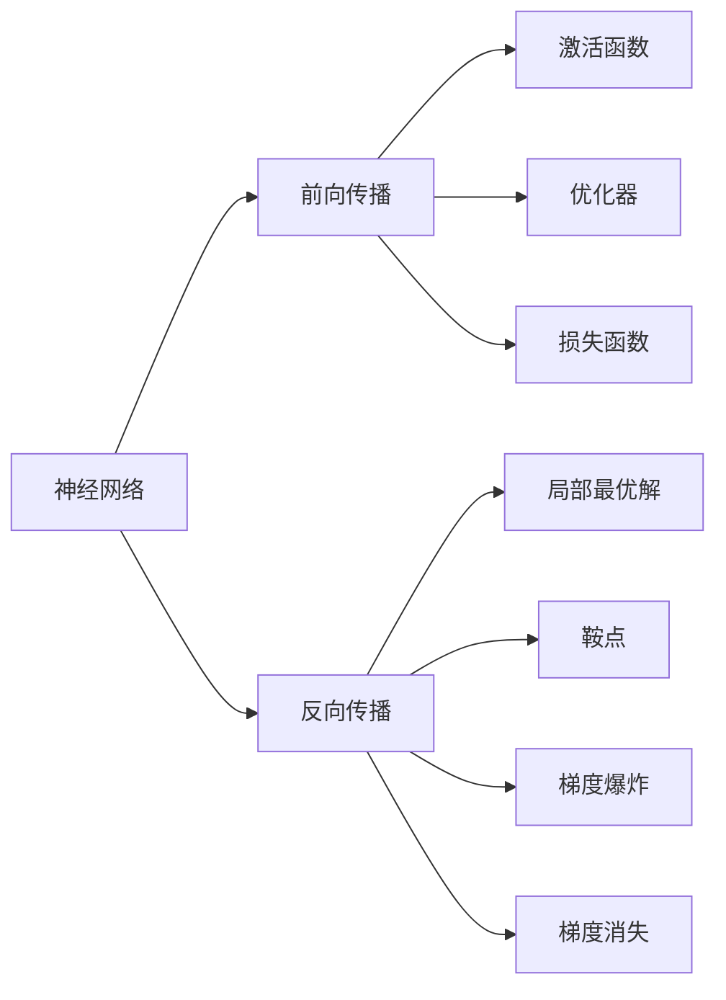
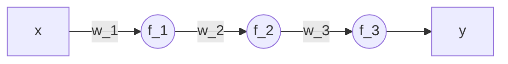
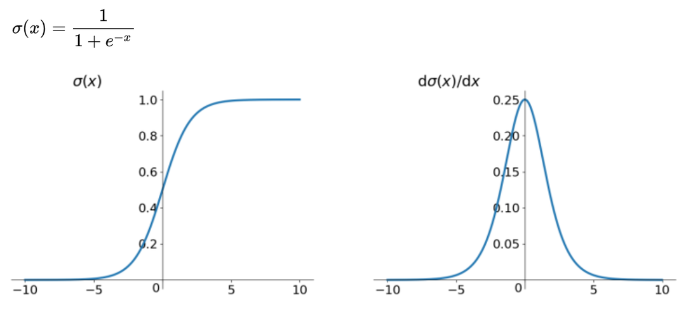

# Detection

# 0 绪论

## 0.1 机器视觉基础

### 0.0.1 传统图像处理

- 图像特征：
  * 颜色特征
  * 几何特征（边缘，角点，斑点）
  * 纹理特征（物体表面结构组织排列的重要信息）

### 0.0.2 深度学习图像处理

1. 图像分类
   - 单标签二分类：单一目标
   - 单标签多分类（多个单标签二分类）
   - 多标签多分类（多个单标签多分类）
2. 图像检测（目标检测）
   - 两个任务：目标定位和目标分类
3. 图像分割
4. 图像描述：以图像为输入，通过模型和计算来输出对应图像的自然语言描述
5. 图像问答：不仅要对图像中的信息进行提取，也需要对问题进行一定的理解和解答
6. 图像生成：通过某种输入数据生成一种新的图像

## 0.2 深度学习基础

前向传播算法是提取图像特征以及预测目标位置、类别等信息的过程。反向传播则是对网络模型中待学习参数进行更新，不断学习和保存特征的过程。

反向传播算法的功能则是不断地将每次前向传播传播算法结果与实际结果进行比对，并计算两者之间的损失，通过反向传播算法不断地对模型中的网络参数进行更新，最终实现目标特征的提取

### 梯度爆炸与梯度消失

**梯度消失和梯度爆炸实际上是梯度累计而导致的**

下面是神经元关联图：

其中x是网络输入层的输入信号，w_1，w_2和w_3是权重参数，f_1、f_2和f_3是每个神经元的激活函数，y是神经元最后的输出结果，三层单神经元结构可表达如下：
$$
f(w_1) = f_3(w_3f_2(w_2f_1(w_1))))，不加偏置
\\
\\
f(w_1) = f_3(w_3f_2(w_2f(b_1) + b_2) + b_3)，加偏置
$$
y以上述微型网络作为示例，展示了梯度消失和梯度爆炸的详细数学过程。

根据链式求导法得到函数对权重值和偏置的导数如下：
$$
\frac{\partial f}{\partial w_1} = \frac{\partial f_3}{\partial f_2} w_3 \times \frac{\partial f_2}{\partial f_1} w_2 \times
\frac{\partial f_1}{\partial w_1}

\\

\frac{\partial f}{\partial b_1} = \frac{\partial f_3}{\partial f_2} w_3 \times \frac{\partial f_2}{\partial f_1} w_2 \times
\frac{\partial f_1}{\partial w_1}
$$

从图中可以看出，sigmoid函数的导数在横轴的0处，得到最大值0.25。假设数据在训练的过程中，呈现出比较稳定的状态，为0～1的高斯分布，那末根据上述对权重的求导公式可以推断出，所有权重参数的绝对值都分布于0～1。每层值与权重的乘积就会小于0.25，随着网络深度的不断增加，反向传播公式中导数项越多，乘积后的值就下降得越快，最终导致梯度消失现象发生。
$$
\frac{\partial f_3}{\partial f_2} w_3
$$
若训练数据不符合初始化权重参数的0～1分布，初始化参数的绝对值abs(w) >4， 那么得到的权重值与导数的乘积会大于1，经过多层累乘，梯度会迅速增长，造成梯度爆炸