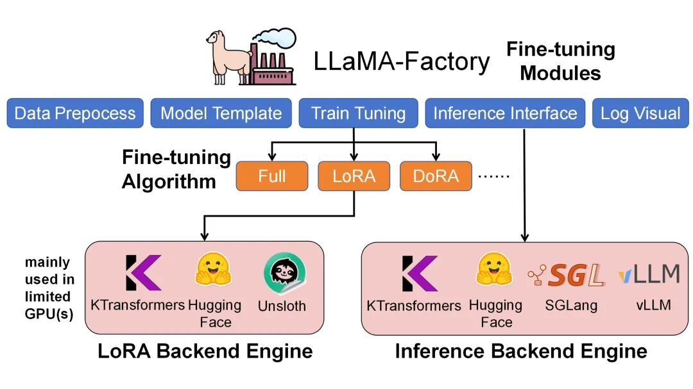

# Supervised Fine Tuning

监督微调 （Supervised Fine Tuning，SFT）是指在预训练模型的基础上，利用标注数据进一步训练，以增强模型在特定任务上的能力。

分类：

1. 全参数微调：对预训练所有参数进行微调
2. 部分参数微调：仅微调预训练模型的部分参数，eg: LayerNorm Tuning等
3. 并联低秩微调：LoRA，AdaLoRA，QLoRA，PiSSA，OLoRA，LoHa，DoRA等
4. Adapter Tuning：在模型中间层插入瓶颈状的Adapter模块
5. 基于Prompt的微调：Prefix-Tuning，Prompt Tuning，P-Tuning，P-Tuning v2


# [llama-factory](https://blog.csdn.net/python12345678_/article/details/140346926)

[demo](https://blog.csdn.net/magic_ll/article/details/143992289)

## 自定义数据集

llama-factory目前支持 **alpaca** 和**sharegpt**两种数据格式。

每一种数据格式，都在data_info.json文件中对应着一个一种数据声明。

```json
// 指令微调数据集格式
[
  {
    "instruction": "人类指令（必填）",
    "input": "人类输入（选填）",
    "output": "模型回答（必填）",
    "system": "系统提示词（选填）",
    "history": [
      ["第一轮指令（选填）", "第一轮回答（选填）"],
      ["第二轮指令（选填）", "第二轮回答（选填）"]
    ]
  }
]

// 例如：
"alpaca_zh_demo.json"
{
  "instruction": "计算这些物品的总费用。 ",
  "input": "输入：汽车 - $3000，衣服 - $100，书 - $20。",
  "output": "汽车、衣服和书的总费用为 $3000 + $100 + $20 = $3120。"
},

// 如果要把符合上面格式的数据，声明到llamafactory中，需要在data_info.json中去如下声明。
"alpaca_zh_demo": {
  "file_name": "alpaca_zh_demo.json",			// file_name是相对于框架的data目录下的路径
  "columns": {
    "prompt": "instruction",
    "query": "input",
    "response": "output",
    "system": "system",
    "history": "history"
  }
}


// 假如你的数据集如下（商品文案生成任务）
// data/AdvertiseSet.json
{  
    "content": "类型#裤*版型#宽松*风格#性感*图案#线条*裤型#阔腿裤",   
    "summary": "宽松的阔腿裤这两年真的吸粉不少，明星时尚达人的心头爱。毕竟好穿时尚，谁都能穿出腿长2米的效果宽松的裤腿，当然是遮肉小能手啊。上身随性自然不拘束，面料亲肤舒适贴身体验感棒棒哒。系带部分增加设计看点，还让单品的设计感更强。腿部线条若隐若现的，性感撩人。颜色敲温柔的，与裤子本身所呈现的风格有点反差萌。"  
}

// 你也想套用这个指令微调数据集格式，有两种方法
// 法一： 把你的数据集，转换为相同的格式，然后复用它在data_info中的声明。
// 法二：在data_info中直接做对应字段的映射
// 展示法二的做法
"gen_advertisement":{
    "file_name": "AdvertiseSet.json",
    "columns": {
		"prompt": "content",
        "response": "summary"
    }
}
```

## 模型微调

微调的参数配置可以参考官网的：https://github.com/hiyouga/LLaMA-Factory/tree/main/examples

这是官网对llama3微调的yaml配置示例文件

```yaml

### model
model_name_or_path: meta-llama/Meta-Llama-3-8B-Instruct
trust_remote_code: true

### method
stage: sft
do_train: true
finetuning_type: lora
lora_rank: 8
lora_target: all

### dataset
dataset: identity,alpaca_en_demo
template: llama3
cutoff_len: 2048
max_samples: 1000
overwrite_cache: true
preprocessing_num_workers: 16
dataloader_num_workers: 4

### output
output_dir: saves/llama3-8b/lora/sft
logging_steps: 10
save_steps: 500
plot_loss: true
overwrite_output_dir: true
save_only_model: false
report_to: none  # choices: [none, wandb, tensorboard, swanlab, mlflow]

### train
per_device_train_batch_size: 1
gradient_accumulation_steps: 8
learning_rate: 1.0e-4
num_train_epochs: 3.0
lr_scheduler_type: cosine
warmup_ratio: 0.1
bf16: true
ddp_timeout: 180000000
resume_from_checkpoint: null

### eval
# eval_dataset: alpaca_en_demo
# val_size: 0.1
# per_device_eval_batch_size: 1
# eval_strategy: steps
# eval_steps: 500
```

这是改编于上面yaml文件的命令行命令

```bash
CUDA_VISIBLE_DEVICES=0 llamafactory-cli train \  
    --stage sft \  
    --do_train \  
    --model_name_or_path /media/codingma/LLM/llama3/Meta-Llama-3-8B-Instruct \  
    --dataset alpaca_gpt4_zh,identity,adgen_local \  
    --dataset_dir ./data \  
    --template llama3 \  
    --finetuning_type lora \  
    --lora_target q_proj,v_proj \  
    --output_dir ./saves/LLaMA3-8B/lora/sft \  
    --overwrite_cache \  
    --overwrite_output_dir \  
    --cutoff_len 1024 \  
    --preprocessing_num_workers 16 \  
    --per_device_train_batch_size 2 \  
    --per_device_eval_batch_size 1 \  
    --gradient_accumulation_steps 8 \  
    --lr_scheduler_type cosine \  
    --logging_steps 50 \  
    --warmup_steps 20 \  
    --save_steps 100 \  
    --eval_steps 50 \  
    --evaluation_strategy steps \  
    --load_best_model_at_end \  
    --learning_rate 5e-5 \  
    --num_train_epochs 5.0 \  
    --max_samples 1000 \  
    --val_size 0.1 \  
    --plot_loss \  
    --fp16

```

```bash
# 常用参数命令
CUDA_VISIBLE_DEVICES=0 llamafactory-cli train \  
    --stage sft \  
    --do_train \  
    --model_name_or_path /media/codingma/LLM/llama3/Meta-Llama-3-8B-Instruct \  
    --dataset alpaca_gpt4_zh,identity,adgen_local \  
    --dataset_dir ./data \  
    --template llama3 \  
    --finetuning_type lora \  
    --lora_target q_proj,v_proj \  
    --output_dir ./saves/LLaMA3-8B/lora/sft \  
    --overwrite_cache \  
    --overwrite_output_dir \  
    --cutoff_len 1024 \  
    --preprocessing_num_workers 16 \  
    --per_device_train_batch_size 2 \  
    --per_device_eval_batch_size 1 \  
    --gradient_accumulation_steps 8 \  
    --lr_scheduler_type cosine \  
    --logging_steps 50 \  
    --warmup_steps 20 \  
    --save_steps 100 \  
    --eval_steps 50 \  
    --evaluation_strategy steps \  
    --load_best_model_at_end \  
    --learning_rate 5e-5 \  
    --num_train_epochs 5.0 \  
    --max_samples 1000 \  
    --val_size 0.1 \  
    --plot_loss \  
    --fp16

```

训练过程中，系统会按照logging_steps的参数设置，定时输出训练日志，包含当前loss，训练进度等。

训练完后就可以在设置的output_dir下看到如下内容，主要包含3部分

1. adapter开头的就是 LoRA保存的结果了，后续用于模型推理融合
2. training_loss 和trainer_log等记录了训练的过程指标
3. 其他是训练当时各种参数的备份

关于loss是什么等，这块不在本教程讨论内容范围之内，只需要记住loss在 正常情况下会随着训练的时间慢慢变小，最后需要下降到1以下的位置才会有一个比较好的效果，可以作为训练效果的一个中间指标。

## 聊天测试

```bash
CUDA_VISIBLE_DEVICES=0 llamafactory-cli webchat \  
    --model_name_or_path /media/codingma/LLM/llama3/Meta-Llama-3-8B-Instruct \  
    --adapter_name_or_path ./saves/LLaMA3-8B/lora/sft  \  
    --template llama3 \  
    --finetuning_type lora

```

## [模型评估](https://blog.csdn.net/ZuanShi1111/article/details/150958867)

它围绕“**任务类型**”和“**评估目标**”构建了两大核心模块：**通用能力评估**与**NLG（自然语言生成）评估**

- 通用能力评估：聚焦模型的“基础学科能力”，通过标准化数据集（如MMLU、CEval、CMMLU）测试模型在多领域（如数学、物理、法律、医学）的知识掌握与推理能力，输出准确率等量化指标，适用于判断模型的通用认知水平。
- NLG评估：聚焦模型的“文本生成质量”，通过BLEU、ROUGE等经典指标衡量**生成文本与参考文本的相似度**，**适用于评估模型在对话生成、摘要、翻译等场景的实用性。**

要评估任务的准确率还是要将生成文本与参考文本扔到满血版的大模型，让它去判断。

## 参数与命令

| parameter          | comment                                                      |
| ------------------ | ------------------------------------------------------------ |
| model_name_or_path | 模型名称或路径<br />1. 模型名称，是huggingface or modelscope上的标准定义，如“meta-llama/Meta-Llama-3-8B-Instruct“<br />2. 已下载到本地的模型路径，如 “/media/codingma/LLM/llama3/Meta-Llama-3-8B-Instruct” |
| template           | 模型问答时所使用的prompt模板<br />1. 因模型的不同而不同，参考：https://github.com/hiyouga/LLaMA-Factory?tab=readme-ov-file#supported-models<br />2. 下面我从网站上拷贝了一份 |

template 参考（截至2025-11-15）：

<table>
<thead>
<tr>
<th>Model</th>
<th>Model size</th>
<th>Template</th>
</tr>
</thead>
<tbody>
<tr>
<td><a href="https://huggingface.co/baichuan-inc" rel="nofollow">Baichuan 2</a></td>
<td>7B/13B</td>
<td>baichuan2</td>
</tr>
<tr>
<td><a href="https://huggingface.co/bigscience" rel="nofollow">BLOOM/BLOOMZ</a></td>
<td>560M/1.1B/1.7B/3B/7.1B/176B</td>
<td>-</td>
</tr>
<tr>
<td><a href="https://huggingface.co/THUDM" rel="nofollow">ChatGLM3</a></td>
<td>6B</td>
<td>chatglm3</td>
</tr>
<tr>
<td><a href="https://huggingface.co/CohereForAI" rel="nofollow">Command R</a></td>
<td>35B/104B</td>
<td>cohere</td>
</tr>
<tr>
<td><a href="https://huggingface.co/deepseek-ai" rel="nofollow">DeepSeek (Code/MoE)</a></td>
<td>7B/16B/67B/236B</td>
<td>deepseek</td>
</tr>
<tr>
<td><a href="https://huggingface.co/deepseek-ai" rel="nofollow">DeepSeek 2.5/3</a></td>
<td>236B/671B</td>
<td>deepseek3</td>
</tr>
<tr>
<td><a href="https://huggingface.co/deepseek-ai" rel="nofollow">DeepSeek R1 (Distill)</a></td>
<td>1.5B/7B/8B/14B/32B/70B/671B</td>
<td>deepseekr1</td>
</tr>
<tr>
<td><a href="https://huggingface.co/baidu" rel="nofollow">ERNIE-4.5</a></td>
<td>0.3B/21B/300B</td>
<td>ernie/ernie_nothink</td>
</tr>
<tr>
<td><a href="https://huggingface.co/tiiuae" rel="nofollow">Falcon</a></td>
<td>7B/11B/40B/180B</td>
<td>falcon</td>
</tr>
<tr>
<td><a href="https://huggingface.co/tiiuae" rel="nofollow">Falcon-H1</a></td>
<td>0.5B/1.5B/3B/7B/34B</td>
<td>falcon_h1</td>
</tr>
<tr>
<td><a href="https://huggingface.co/google" rel="nofollow">Gemma/Gemma 2/CodeGemma</a></td>
<td>2B/7B/9B/27B</td>
<td>gemma/gemma2</td>
</tr>
<tr>
<td><a href="https://huggingface.co/google" rel="nofollow">Gemma 3/Gemma 3n</a></td>
<td>270M/1B/4B/6B/8B/12B/27B</td>
<td>gemma3/gemma3n</td>
</tr>
<tr>
<td><a href="https://huggingface.co/zai-org" rel="nofollow">GLM-4/GLM-4-0414/GLM-Z1</a></td>
<td>9B/32B</td>
<td>glm4/glmz1</td>
</tr>
<tr>
<td><a href="https://huggingface.co/zai-org" rel="nofollow">GLM-4.1V</a></td>
<td>9B</td>
<td>glm4v</td>
</tr>
<tr>
<td><a href="https://huggingface.co/zai-org" rel="nofollow">GLM-4.5/GLM-4.5V</a></td>
<td>106B/355B</td>
<td>glm4_moe/glm4v_moe</td>
</tr>
<tr>
<td><a href="https://huggingface.co/openai-community" rel="nofollow">GPT-2</a></td>
<td>0.1B/0.4B/0.8B/1.5B</td>
<td>-</td>
</tr>
<tr>
<td><a href="https://huggingface.co/openai" rel="nofollow">GPT-OSS</a></td>
<td>20B/120B</td>
<td>gpt</td>
</tr>
<tr>
<td><a href="https://huggingface.co/ibm-granite" rel="nofollow">Granite 3.0-3.3</a></td>
<td>1B/2B/3B/8B</td>
<td>granite3</td>
</tr>
<tr>
<td><a href="https://huggingface.co/ibm-granite" rel="nofollow">Granite 4</a></td>
<td>7B</td>
<td>granite4</td>
</tr>
<tr>
<td><a href="https://huggingface.co/tencent/" rel="nofollow">Hunyuan (MT)</a></td>
<td>7B</td>
<td>hunyuan</td>
</tr>
<tr>
<td><a href="https://huggingface.co/IndexTeam" rel="nofollow">Index</a></td>
<td>1.9B</td>
<td>index</td>
</tr>
<tr>
<td><a href="https://huggingface.co/internlm" rel="nofollow">InternLM 2-3</a></td>
<td>7B/8B/20B</td>
<td>intern2</td>
</tr>
<tr>
<td><a href="https://huggingface.co/OpenGVLab" rel="nofollow">InternVL 2.5-3.5</a></td>
<td>1B/2B/4B/8B/14B/30B/38B/78B/241B</td>
<td>intern_vl</td>
</tr>
<tr>
<td><a href="https://huggingface.co/internlm/" rel="nofollow">InternLM/Intern-S1-mini</a></td>
<td>8B</td>
<td>intern_s1</td>
</tr>
<tr>
<td><a href="https://huggingface.co/moonshotai" rel="nofollow">Kimi-VL</a></td>
<td>16B</td>
<td>kimi_vl</td>
</tr>
<tr>
<td><a href="https://huggingface.co/inclusionAI" rel="nofollow">Ling 2.0 (mini/flash)</a></td>
<td>16B/100B</td>
<td>bailing_v2</td>
</tr>
<tr>
<td><a href="https://github.com/facebookresearch/llama">Llama</a></td>
<td>7B/13B/33B/65B</td>
<td>-</td>
</tr>
<tr>
<td><a href="https://huggingface.co/meta-llama" rel="nofollow">Llama 2</a></td>
<td>7B/13B/70B</td>
<td>llama2</td>
</tr>
<tr>
<td><a href="https://huggingface.co/meta-llama" rel="nofollow">Llama 3-3.3</a></td>
<td>1B/3B/8B/70B</td>
<td>llama3</td>
</tr>
<tr>
<td><a href="https://huggingface.co/meta-llama" rel="nofollow">Llama 4</a></td>
<td>109B/402B</td>
<td>llama4</td>
</tr>
<tr>
<td><a href="https://huggingface.co/meta-llama" rel="nofollow">Llama 3.2 Vision</a></td>
<td>11B/90B</td>
<td>mllama</td>
</tr>
<tr>
<td><a href="https://huggingface.co/llava-hf" rel="nofollow">LLaVA-1.5</a></td>
<td>7B/13B</td>
<td>llava</td>
</tr>
<tr>
<td><a href="https://huggingface.co/llava-hf" rel="nofollow">LLaVA-NeXT</a></td>
<td>7B/8B/13B/34B/72B/110B</td>
<td>llava_next</td>
</tr>
<tr>
<td><a href="https://huggingface.co/llava-hf" rel="nofollow">LLaVA-NeXT-Video</a></td>
<td>7B/34B</td>
<td>llava_next_video</td>
</tr>
<tr>
<td><a href="https://huggingface.co/XiaomiMiMo" rel="nofollow">MiMo</a></td>
<td>7B</td>
<td>mimo</td>
</tr>
<tr>
<td><a href="https://huggingface.co/openbmb" rel="nofollow">MiniCPM 1-4.1</a></td>
<td>0.5B/1B/2B/4B/8B</td>
<td>cpm/cpm3/cpm4</td>
</tr>
<tr>
<td><a href="https://huggingface.co/openbmb" rel="nofollow">MiniCPM-o-2.6/MiniCPM-V-2.6</a></td>
<td>8B</td>
<td>minicpm_o/minicpm_v</td>
</tr>
<tr>
<td><a href="https://huggingface.co/mistralai" rel="nofollow">Ministral/Mistral-Nemo</a></td>
<td>8B/12B</td>
<td>ministral</td>
</tr>
<tr>
<td><a href="https://huggingface.co/mistralai" rel="nofollow">Mistral/Mixtral</a></td>
<td>7B/8x7B/8x22B</td>
<td>mistral</td>
</tr>
<tr>
<td><a href="https://huggingface.co/mistralai" rel="nofollow">Mistral Small</a></td>
<td>24B</td>
<td>mistral_small</td>
</tr>
<tr>
<td><a href="https://huggingface.co/allenai" rel="nofollow">OLMo</a></td>
<td>1B/7B</td>
<td>-</td>
</tr>
<tr>
<td><a href="https://huggingface.co/google" rel="nofollow">PaliGemma/PaliGemma2</a></td>
<td>3B/10B/28B</td>
<td>paligemma</td>
</tr>
<tr>
<td><a href="https://huggingface.co/microsoft" rel="nofollow">Phi-1.5/Phi-2</a></td>
<td>1.3B/2.7B</td>
<td>-</td>
</tr>
<tr>
<td><a href="https://huggingface.co/microsoft" rel="nofollow">Phi-3/Phi-3.5</a></td>
<td>4B/14B</td>
<td>phi</td>
</tr>
<tr>
<td><a href="https://huggingface.co/microsoft" rel="nofollow">Phi-3-small</a></td>
<td>7B</td>
<td>phi_small</td>
</tr>
<tr>
<td><a href="https://huggingface.co/microsoft" rel="nofollow">Phi-4</a></td>
<td>14B</td>
<td>phi4</td>
</tr>
<tr>
<td><a href="https://huggingface.co/mistralai" rel="nofollow">Pixtral</a></td>
<td>12B</td>
<td>pixtral</td>
</tr>
<tr>
<td><a href="https://huggingface.co/Qwen" rel="nofollow">Qwen (1-2.5) (Code/Math/MoE/QwQ)</a></td>
<td>0.5B/1.5B/3B/7B/14B/32B/72B/110B</td>
<td>qwen</td>
</tr>
<tr>
<td><a href="https://huggingface.co/Qwen" rel="nofollow">Qwen3 (MoE/Instruct/Thinking/Next)</a></td>
<td>0.6B/1.7B/4B/8B/14B/32B/80B/235B</td>
<td>qwen3/qwen3_nothink</td>
</tr>
<tr>
<td><a href="https://huggingface.co/Qwen" rel="nofollow">Qwen2-Audio</a></td>
<td>7B</td>
<td>qwen2_audio</td>
</tr>
<tr>
<td><a href="https://huggingface.co/Qwen" rel="nofollow">Qwen2.5-Omni</a></td>
<td>3B/7B</td>
<td>qwen2_omni</td>
</tr>
<tr>
<td><a href="https://huggingface.co/Qwen" rel="nofollow">Qwen3-Omni</a></td>
<td>30B</td>
<td>qwen3_omni</td>
</tr>
<tr>
<td><a href="https://huggingface.co/Qwen" rel="nofollow">Qwen2-VL/Qwen2.5-VL/QVQ</a></td>
<td>2B/3B/7B/32B/72B</td>
<td>qwen2_vl</td>
</tr>
<tr>
<td><a href="https://huggingface.co/Qwen" rel="nofollow">Qwen3-VL</a></td>
<td>2B/4B/8B/30B/32B/235B</td>
<td>qwen3_vl</td>
</tr>
<tr>
<td><a href="https://huggingface.co/ByteDance-Seed" rel="nofollow">Seed (OSS/Coder)</a></td>
<td>8B/36B</td>
<td>seed_oss/seed_coder</td>
</tr>
<tr>
<td><a href="https://huggingface.co/Skywork" rel="nofollow">Skywork o1</a></td>
<td>8B</td>
<td>skywork_o1</td>
</tr>
<tr>
<td><a href="https://huggingface.co/bigcode" rel="nofollow">StarCoder 2</a></td>
<td>3B/7B/15B</td>
<td>-</td>
</tr>
<tr>
<td><a href="https://huggingface.co/Tele-AI" rel="nofollow">TeleChat2</a></td>
<td>3B/7B/35B/115B</td>
<td>telechat2</td>
</tr>
<tr>
<td><a href="https://huggingface.co/xverse" rel="nofollow">XVERSE</a></td>
<td>7B/13B/65B</td>
<td>xverse</td>
</tr>
<tr>
<td><a href="https://huggingface.co/01-ai" rel="nofollow">Yi/Yi-1.5 (Code)</a></td>
<td>1.5B/6B/9B/34B</td>
<td>yi</td>
</tr>
<tr>
<td><a href="https://huggingface.co/01-ai" rel="nofollow">Yi-VL</a></td>
<td>6B/34B</td>
<td>yi_vl</td>
</tr>
<tr>
<td><a href="https://huggingface.co/IEITYuan" rel="nofollow">Yuan 2</a></td>
<td>2B/51B/102B</td>
<td>yuan</td>
</tr>
</tbody>
</table>

## 加速

LLaMA-Factory项目中liger_kernel与unsloth是两种加速方式。

项目提供了两种显存优化技术：liger_kernel和unsloth，但用户在实际使用中可能会遇到版本冲突问题。


liger_kernel是一个专门为大模型训练优化的内核组件，它通过以下方式提升训练效率：

1. 优化内存访问模式
2. 改进计算内核调度
3. 提供更高效的张量操作实现

在LLaMA-Factory项目中，推荐使用liger_kernel的0.5.2版本。这个特定版本经过项目维护者的测试验证，能够与项目代码完美兼容，避免出现潜在的兼容性问题。

unsloth是一种显存垃圾回收优化技术，它通过以下方式降低显存占用：

1. 智能识别并回收不再使用的显存块
2. 优化显存分配策略
3. 减少显存碎片化

值得注意的是，**在LLaMA-Factory项目中，使用unsloth功能(通过use_unsloth_gc参数启用)并不需要额外安装unsloth包，只需要正确安装liger_kernel即可。**

[LLaMA-Factory项目中liger_kernel与unsloth的版本适配指南](https://blog.gitcode.com/d2f35dc1d720c6d4f84a0f66cbd16445.html)

[Liger-Kernel与Unsloth性能对比分析](https://blog.gitcode.com/de56af3152e37d2a188818d8c346c9a4.html)

### [ktransformer](https://blog.csdn.net/Androiddddd/article/details/154727090)

[KTransformers：让显卡轻松驾驭满血DeepSeek的秘籍！](https://blog.csdn.net/drdairen/article/details/145612436)

虽然KTransformers最初是为了解决DeepSeek的推理问题而诞生的，但它并不只能推理DeepSeek的模型。

KTransformers是一个通用的推理框架，它可以兼容各式各样的MoE模型和算子，能够集成各种各样的算子来做各种组合的测试。

这意味着，无论你是使用BERT、GPT还是其他类型的深度学习模型，只要你需要高效的推理性能，KTransformers都能成为你的得力助手。

LLaMA-Factory框架结合KTransformers后端，实现对超大规模混合专家（MoE）模型的高效微调与推理



| Model                  | Configuration | Throughput    | GPU Memory       | CPU Memory |
| ---------------------- | ------------- | ------------- | ---------------- | ---------- |
| DeepSeek-V3 (671B)     | LoRA + AMX    | ~40 tokens/s  | 70GB (multi-GPU) | ~1.3TB     |
| DeepSeek-V2-Lite (14B) | LoRA + AMX    | ~530 tokens/s | 6GB              | ~150GB     |

### [整合llamafactory并安装](https://kvcache-ai.github.io/ktransformers/en/KTransformers-Fine-Tuning_User-Guide.html#ktransformers-fine-tuning-x-llama-factory-integration-%E2%80%93-user-guide)

```bash
# 在python12, cu126, torch29上安装
# 官网的第一步是为了安装gcc和g++，一般ubuntu系统都已安装
# libstdcxx-ng gcc_impl_linux-64
# 第二步安装cuda，我们也早已安装

# install the KTransformers wheel that matches your Torch and Python versions, from https://github.com/kvcache-ai/ktransformers/releases
pip install ktransformers-0.4.1+cu126torch26fancy-cp312-cp312-linux_x86_64.whl

# Install flash-attention, download the corresponding file based on your Python and Torch versions from: https://github.com/Dao-AILab/flash-attention/releases
pip install flash_attn-2.8.2+cu12torch2.7cxx11abiTRUE-cp312-cp312-linux_x86_64.whl
```

### [使用](https://kvcache-ai.github.io/ktransformers/en/KTransformers-Fine-Tuning_User-Guide.html#ktransformers-fine-tuning-x-llama-factory-integration-%E2%80%93-user-guide)

```bash
USE_KT=1 llamafactory-cli train examples/train_lora/deepseek3_lora_sft_kt.yaml

llamafactory-cli chat examples/inference/deepseek3_lora_sft_kt.yaml

API_PORT=8000 llamafactory-cli api examples/inference/deepseek3_lora_sft_kt.yaml
```


## log

1. `ImportError: cannot import name '_CONFIG_FOR_DOC' from 'transformers.models.gemma.modeling_gemma' (/fsx/lewis/git/hf/trl/trl-env/lib/python3.11/site-packages/transformers/models/gemma/modeling_gemma.py)`，

   ```
   https://github.com/linkedin/Liger-Kernel/pull/712
   https://github.com/huggingface/trl/issues/3480
   https://github.com/linkedin/Liger-Kernel/commit/8f940a75d80d7d2abb7e65ae064d486581e1db94
   
   安装：liger-kernel 0.6.0
   ```

   

2. `cuda_utils.c:6:10: fatal error: Python.h: No such file or directory`

   ```bash
   # 在ubuntu24.04中，系统自带python3.12，但并未包含开发python的扩展模块（包括头文件，静态库等等）
   
   # 先查找，看看有没有
   apt search python-dev
   
   # 如果没有则添加一下apt仓库
   apt install -y software-properties-common
   add-apt-repository ppa:deadsnakes/ppa
   apt update
   
   # 然后再装
   apt install python3.12-dev
   
   python3.12-dev
   包含的内容：
       头文件：Python.h, modsupport.h, object.h 等
       静态库文件：libpython3.12.a
       配置文件：pyconfig.h
       pkg-config 文件：python3.12.pc
   使用场景：
       编写 C/C++ 扩展来加速 Python 代码
       编译需要与 Python 交互的第三方库
       例如：pip install 某些需要编译的包时
   
   libpython3.12-dev
   这个包主要用于开发嵌入 Python 解释器的应用程序。
   包含的内容：
       动态链接库：libpython3.12.so
       开发用的符号链接
       用于链接的配置文件
   使用场景：
       在 C/C++ 应用程序中嵌入 Python 解释器
       创建可以执行 Python 脚本的应用程序
       例如：Blender、GIMP 等软件嵌入 Python 功能
       
   # python3.12-dev 通常依赖 libpython3.12-dev，当你安装 python3.12-dev 时，libpython3.12-dev 会自动安装
   
   # 用 apt 安装 python3.12-dev 不会覆盖您系统原有的 python3.12。它们就像是同一个软件包的“程序本体”和“开发工具箱”的关系
   
   # python3.12在/usr/bin中
   # 而安装的python3.12放在了/usr/include/python3.12/ (头文件)，/usr/lib/arm64-linux-gnu/ (库文件，架构相关)
   ```

   

3. 

# docker 环境

下载nvidia官方的dockerhub镜像库：[nvidia/cuda](https://hub.docker.com/r/nvidia/cuda/tags)，[按照系统和相关版本信息下载](https://gitlab.com/nvidia/container-images/cuda/blob/master/doc/supported-tags.md)

```bash
docker pull nvidia/cuda:12.6.2-cudnn-devel-ubuntu24.04

docker network create --subnet=10.1.0.0/16 gpu-net
# 一般宿主机占据子网的1号ip，所以容器需要设置其他号位
docker run -it --network gpu-net --ip 10.1.0.2 --privileged=true --gpus all -v /home/qbuntu/docker:/var/docker --name cu126 dsfegggd /bin/bash

apt-get update
apt install vim

# linux 服务器安装ssh服务
sudo apt-get install openssh-server
# 修改ssh配置，允许root登录
vi /etc/ssh/sshd_config
# 找到下面一项并修改
PermitRootLogin yes
# 若无此项则添加
PasswordAuthentication yes
echo 'root:12345' | chpasswd
systemctl enable ssh
service ssh status
service ssh start
ssh root@10.1.0.2

apt install python3.12
apt install python3.12-venv

cd LLaMA-Factory

pip install -e ".[torch,metrics]"
# 点. 代表在项目根目录下（即 `setup.py` 或 `pyproject.toml` 文件所在目录）
# -e ，可编辑的项目，将当前项目的包，安装到site-package（通过软链接，链接到当前项目），在当前目录的修改可以同步到包中，因为是软链接

```

