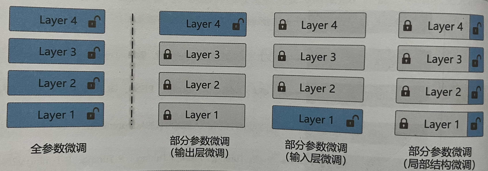
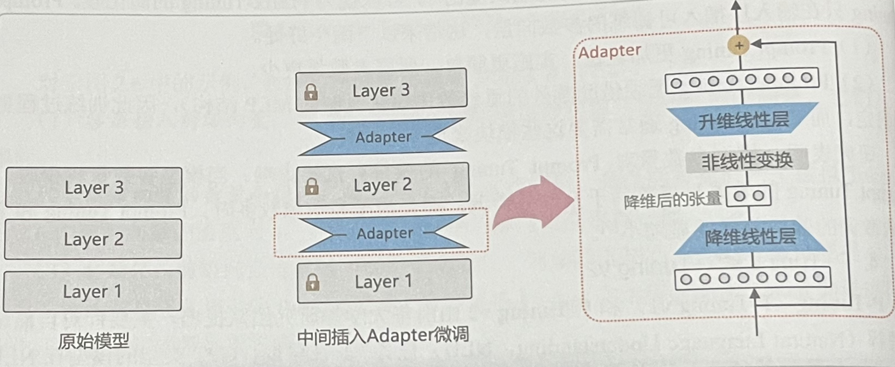
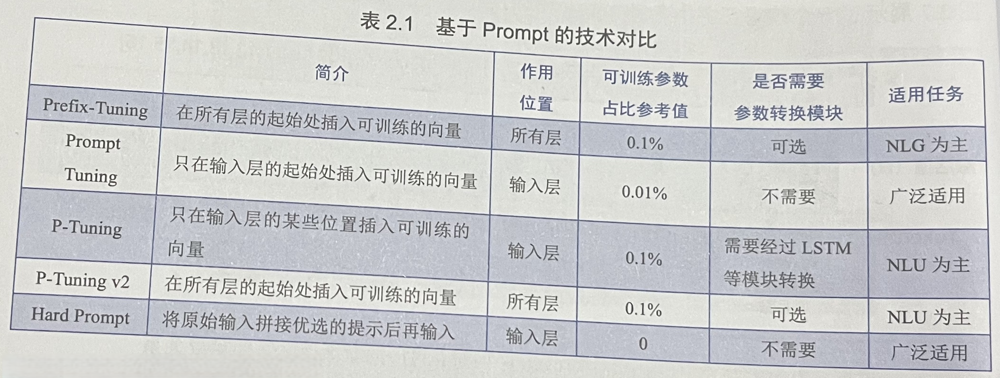

# Supervised Fine Tuning

监督微调 （Supervised Fine Tuning，SFT）是指在预训练模型的基础上，利用标注数据进一步训练，以增强模型在特定任务上的能力。

分类：

1. 全参数微调：对预训练所有参数进行微调
2. 部分参数微调：仅微调预训练模型的部分参数，eg: LayerNorm Tuning等
3. 并联低秩微调：LoRA，AdaLoRA，QLoRA，PiSSA，OLoRA，LoHa，DoRA等
4. Adapter Tuning：在模型中间层插入瓶颈状的Adapter模块
5. 基于Prompt的微调：Prefix-Tuning，Prompt Tuning，P-Tuning，P-Tuning v2








# llama-factory

## 加速

LLaMA-Factory项目中liger_kernel与unsloth是两种加速方式。

项目提供了两种显存优化技术：liger_kernel和unsloth，但用户在实际使用中可能会遇到版本冲突问题。


liger_kernel是一个专门为大模型训练优化的内核组件，它通过以下方式提升训练效率：

1. 优化内存访问模式
2. 改进计算内核调度
3. 提供更高效的张量操作实现

在LLaMA-Factory项目中，推荐使用liger_kernel的0.5.2版本。这个特定版本经过项目维护者的测试验证，能够与项目代码完美兼容，避免出现潜在的兼容性问题。

unsloth是一种显存垃圾回收优化技术，它通过以下方式降低显存占用：

1. 智能识别并回收不再使用的显存块
2. 优化显存分配策略
3. 减少显存碎片化

值得注意的是，**在LLaMA-Factory项目中，使用unsloth功能(通过use_unsloth_gc参数启用)并不需要额外安装unsloth包，只需要正确安装liger_kernel即可。**

[LLaMA-Factory项目中liger_kernel与unsloth的版本适配指南](https://blog.gitcode.com/d2f35dc1d720c6d4f84a0f66cbd16445.html)

[Liger-Kernel与Unsloth性能对比分析](https://blog.gitcode.com/de56af3152e37d2a188818d8c346c9a4.html)

## log

1. `ImportError: cannot import name '_CONFIG_FOR_DOC' from 'transformers.models.gemma.modeling_gemma' (/fsx/lewis/git/hf/trl/trl-env/lib/python3.11/site-packages/transformers/models/gemma/modeling_gemma.py)`，

   ```
   https://github.com/linkedin/Liger-Kernel/pull/712
   https://github.com/huggingface/trl/issues/3480
   https://github.com/linkedin/Liger-Kernel/commit/8f940a75d80d7d2abb7e65ae064d486581e1db94
   
   安装：liger-kernel 0.6.0
   ```

   

2. `cuda_utils.c:6:10: fatal error: Python.h: No such file or directory`

   ```bash
   # 在ubuntu24.04中，系统自带python3.12，但并未包含开发python的扩展模块（包括头文件，静态库等等）
   
   # 先查找，看看有没有
   apt search python-dev
   
   # 如果没有则添加一下apt仓库
   apt install -y software-properties-common
   add-apt-repository ppa:deadsnakes/ppa
   apt update
   
   # 然后再装
   apt install python3.12-dev
   
   python3.12-dev
   包含的内容：
       头文件：Python.h, modsupport.h, object.h 等
       静态库文件：libpython3.12.a
       配置文件：pyconfig.h
       pkg-config 文件：python3.12.pc
   使用场景：
       编写 C/C++ 扩展来加速 Python 代码
       编译需要与 Python 交互的第三方库
       例如：pip install 某些需要编译的包时
   
   libpython3.12-dev
   这个包主要用于开发嵌入 Python 解释器的应用程序。
   包含的内容：
       动态链接库：libpython3.12.so
       开发用的符号链接
       用于链接的配置文件
   使用场景：
       在 C/C++ 应用程序中嵌入 Python 解释器
       创建可以执行 Python 脚本的应用程序
       例如：Blender、GIMP 等软件嵌入 Python 功能
       
   # python3.12-dev 通常依赖 libpython3.12-dev，当你安装 python3.12-dev 时，libpython3.12-dev 会自动安装
   
   # 用 apt 安装 python3.12-dev 不会覆盖您系统原有的 python3.12。它们就像是同一个软件包的“程序本体”和“开发工具箱”的关系
   
   # python3.12在/usr/bin中
   # 而安装的python3.12放在了/usr/include/python3.12/ (头文件)，/usr/lib/arm64-linux-gnu/ (库文件，架构相关)
   ```

   

3. 

# docker 环境

下载nvidia官方的dockerhub镜像库：[nvidia/cuda](https://hub.docker.com/r/nvidia/cuda/tags)，[按照系统和相关版本信息下载](https://gitlab.com/nvidia/container-images/cuda/blob/master/doc/supported-tags.md)

```bash
docker pull nvidia/cuda:13.0.2-cudnn-devel-ubuntu24.04

docker network create --subnet=10.1.0.0/16 gpu-net
# 一般宿主机占据子网的1号ip，所以容器需要设置其他号位
docker run -it --network gpu-net --ip 10.1.0.2 --privileged=true --gpus all -v /home/qbuntu/docker:/var/docker --name cu130 dsfegggd /bin/bash

apt-get update
apt install vim

# linux 服务器安装ssh服务
sudo apt-get install openssh-server
# 修改ssh配置，允许root登录
vi /etc/ssh/sshd_config
# 找到下面一项并修改
PermitRootLogin yes
# 若无此项则添加
PasswordAuthentication yes
echo 'root:12345' | chpasswd
systemctl enable ssh
service ssh status
service ssh start
ssh root@10.1.0.2

apt install python3.12
apt install python3.12-venv

cd LLaMA-Factory
pip install -e ".[torch,metrics]"
```

