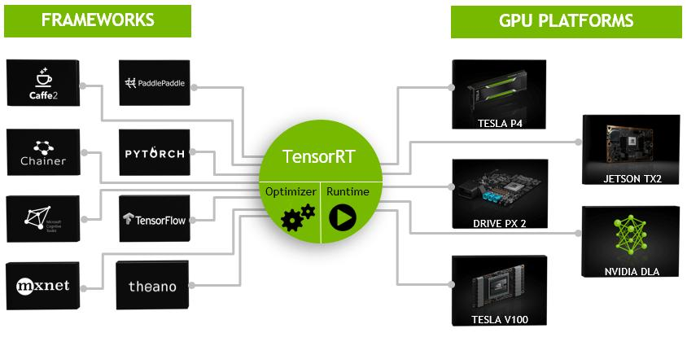
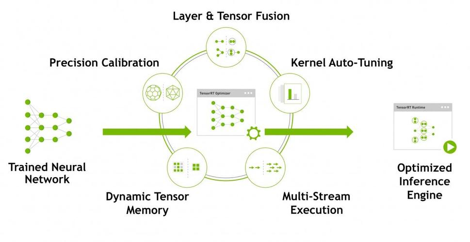
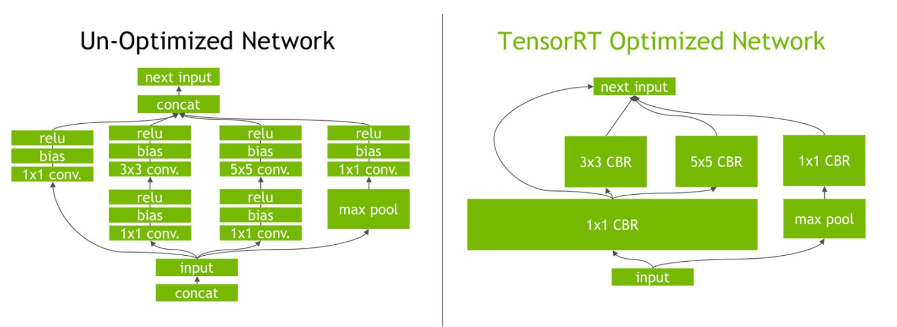
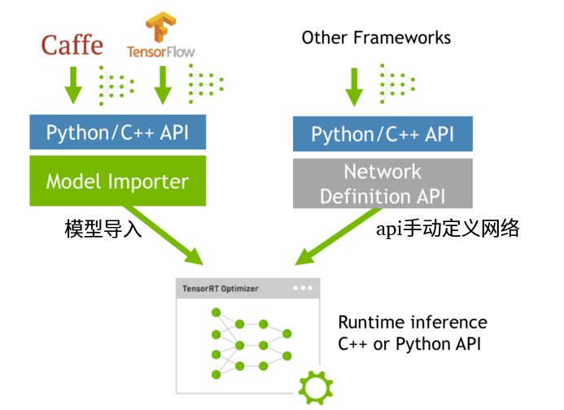
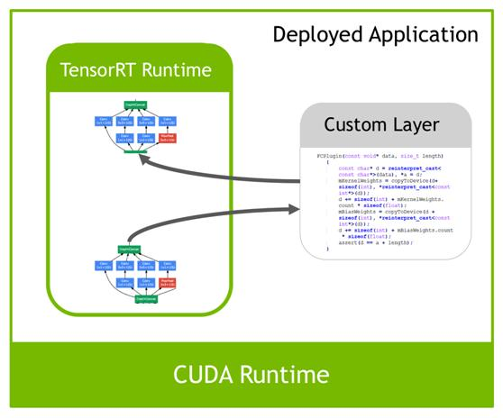

# TensorRT

# 0 绪论

TensorRT是Nidia推出的深度学习推理SDK，能够在Nvidia GPU上实现低延迟，高吞吐的部署

**TensorRT包含用于训练好的模型优化器，以及用于执行推理的runtime（运行时环境）。**

我们可以将TensorRT看成是只有前向传播的深度学习框架，也就是说它只能用于推理。而我们常见的tensorflow，pytorch等等，这些框架是拿来训练的，它们训练好的模型，经过TensorRT的优化器优化，再经由runtime就可以在Nvidia的设备上进行高性能的推理。



## 0.1 优化

TensorRT的核心在于对模型算子的优化，比如：合并算子，利用GPU的特性来选择特定和核函数等等。






TensorRT需要在目标GPU设备（根据硬件，软件环境版本）上实际运行来选择最优算法和配置，所以**TensorRT生成的模型迁移到别的设备或其他版本的TensorRT不一定能运行。**

## 0.2 模型转换



方式1：通过TensorRT api手动定义网络，填充网络权重。

- 比较耗时，难以调试，通用性较差

方式2：直接从其他深度学习模型框架里导入，然后转换为TensorRT可以使用的模型文件。

由于深度学习发展很快，存在一些TensorRT不支持的自定义操作或算子层。TensorRT支持自定义插件的操作层，我们可以使用api来自定义那些TensorRT不支持的操作。



## 0.3 环境搭建

流程：

1. GPU驱动安装
2. Cuda 安装
3. cudnn 安装
4. TensorRT安装

```bash
# GPU驱动安装
# 检查机器建议的驱动
ubuntu-drivers devices

== /sys/devices/pci0000:00/0000:00:01.0/0000:01:00.0 ==
modalias : pci:v000010DEd000021C4sv00001462sd0000C75Abc03sc00i00
vendor   : NVIDIA Corporation
model    : TU116 [GeForce GTX 1660 SUPER]
driver   : nvidia-driver-470 - distro non-free
driver   : nvidia-driver-535-open - distro non-free
driver   : nvidia-driver-535-server - distro non-free
driver   : nvidia-driver-450-server - distro non-free
driver   : nvidia-driver-525 - distro non-free
driver   : nvidia-driver-535 - distro non-free recommended
driver   : nvidia-driver-525-server - distro non-free
driver   : nvidia-driver-535-server-open - distro non-free
driver   : nvidia-driver-470-server - distro non-free
driver   : nvidia-driver-525-open - distro non-free
driver   : xserver-xorg-video-nouveau - distro free builtin

# 安装上面合适的驱动
apt install nvidia-driver-535

# 重启电脑
reboot

# 查看是否安装成功
nvidia-smi
```

## 0.4 tensorRT编程模型

模型转换的方式2

TensorRT分两个阶段运行

- 构建（`Build`）阶段：你向TensorRT提供一个模型定义，TensorRT为目标GPU优化这个模型。这个过程可以离线运行。
- 运行时（`Runtime`）阶段：你使用优化后的模型来运行推理。

构建阶段后，我们可以将优化后的模型保存为模型文件，模型文件可以用于后续加载，以省略模型构建和优化的过程。

### 0.4.1 构建阶段

构建阶段的最高级别接口是 `Builder`。`Builder`负责优化一个模型，并产生`Engine`。通过如下接口创建一个`Builder` 。

```
nvinfer1::IBuilder* builder = nvinfer1::createInferBuilder(logger);
```

要生成一个可以进行推理的`Engine`，一般需要以下三个步骤：

- 创建一个网络定义
- 填写`Builder`构建配置参数，告诉构建器应该如何优化模型
- 调用`Builder`生成`Engine`

```c++
/*
TensorRT build engine的过程
1. 创建builder
2. 创建网络定义：builder ---> network
3. 配置参数：builder ---> config
4. 生成engine：builder ---> engine (network, config)
5. 序列化保存：engine ---> serialize
6. 释放资源：delete
*/

#include <iostream>
#include <fstream>
#include <cassert>
#include <vector>
#include<unistd.h>
#include <NvInfer.h>
#include <string.h>
#include "../utils/utils.h"

// logger用来管控打印日志级别
// TRTLogger继承自nvinfer1::ILogger
class TRTLogger : public nvinfer1::ILogger
{
    void log(Severity severity, const char *msg) noexcept override
    {
        // 屏蔽INFO级别的日志
        if (severity != Severity::kINFO)
            std::cout << msg << std::endl;
    }
} gLogger;
int main()
{
    // ======= 1. 创建builder =======
    TRTLogger logger;
    nvinfer1::IBuilder *builder = nvinfer1::createInferBuilder(logger);

    // ======= 2. 创建网络定义：builder ---> network =======

    // 显性batch
    // 1U代表unsigned 1，nvinfer1::NetworkDefinitionCreationFlag::kEXPLICIT_BATCH为0（可以ctrl + click去看一下）
    // 1 << 0 = 1，二进制移位，左移0位，相当于1（y左移x位，相当于y乘以2的x次方）
    auto explicitBatch = 1U << static_cast<uint32_t>(nvinfer1::NetworkDefinitionCreationFlag::kEXPLICIT_BATCH);
    // 调用createNetworkV2创建网络定义，参数是显性batch
    nvinfer1::INetworkDefinition *network = builder->createNetworkV2(explicitBatch);

    // 定义网络结构
    // mlp多层感知机：input(1,3,1,1) --> fc1 --> sigmoid --> output (2)

    // 创建一个input tensor ，参数分别是：name, data type, dims
    const int input_size = 3;
    nvinfer1::ITensor *input = network->addInput("data", nvinfer1::DataType::kFLOAT, nvinfer1::Dims4{1, input_size, 1, 1});

    // 创建全连接层fc1
    // 这里模拟，从文件中加载权重和偏执，然后读入模型
    // weight and bias
    const float *fc1_weight_data = new float[input_size * 2]{0.1, 0.2, 0.3, 0.4, 0.5, 0.6};
    const float *fc1_bias_data = new float[2]{0.1, 0.5};

    char cwd[128] = {0};
    utils::getExeWd(cwd,128);
    // 将权重保存到文件中，演示从别的来源加载权重
    utils::saveWeights(std::string(cwd) + "/../model/fc2.wts", fc1_weight_data, 6);
    utils::saveWeights(std::string(cwd) + "/../model/fc2.bias", fc1_bias_data, 2);

    // 读取权重
    auto fc1_weight_vec = utils::loadWeights(std::string(cwd) + "/../model/fc2.wts");
    auto fc1_bias_vec = utils::loadWeights(std::string(cwd) + "/../model/fc2.bias");

    // 转为nvinfer1::Weights类型，参数分别是：data type, data, size
    nvinfer1::Weights fc1_weight{nvinfer1::DataType::kFLOAT, fc1_weight_vec.data(), static_cast<int64_t>(fc1_weight_vec.size())};
    nvinfer1::Weights fc1_bias{nvinfer1::DataType::kFLOAT, fc1_bias_vec.data(), static_cast<int64_t>(fc1_bias_vec.size())};
    // nvinfer1::Weights fc1_weight{nvinfer1::DataType::kFLOAT, fc1_weight_vec.data(), fc1_weight_vec.size()}; // Non-constant-expression cannot be narrowed from type 'std::vector::size_type (aka 'unsigned long') to 'int64_t' (aka 'long') in initializer list
                                                                                                                // 这个是C++11的新特性，禁止以列表形式初始化时将高精度类型转为低精度类型，换老版本的编译器可解决问题,也可通过static_cast<int64_t>()。
    //nvinfer1::Weights fc1_bias{nvinfer1::DataType::kFLOAT, fc1_bias_vec.data(), fc1_bias_vec.size()};


    const int output_size = 2;
    // 调用addFullyConnected创建全连接层，参数分别是：input tensor, output size, weight, bias
    nvinfer1::IFullyConnectedLayer *fc1 = network->addFullyConnected(*input, output_size, fc1_weight, fc1_bias);

    // 添加sigmoid激活层，参数分别是：input tensor, activation type（激活函数类型）
    nvinfer1::IActivationLayer *sigmoid = network->addActivation(*fc1->getOutput(0), nvinfer1::ActivationType::kSIGMOID);

    // 设置输出名字
    sigmoid->getOutput(0)->setName("output");
    // 标记输出，没有标记会被当成顺时针优化掉
    network->markOutput(*sigmoid->getOutput(0));

    // 设定最大batch size
    builder->setMaxBatchSize(1);

    // ====== 3. 配置参数：builder ---> config ======
    // 添加配置参数，告诉TensorRT应该如何优化网络
    nvinfer1::IBuilderConfig *config = builder->createBuilderConfig();
    // 设置最大工作空间大小，单位是字节
    config->setMaxWorkspaceSize(1 << 28); // 256MiB

    // ====== 4. 创建engine：builder ---> network ---> config ======
    nvinfer1::ICudaEngine *engine = builder->buildEngineWithConfig(*network, *config);
    if (!engine)
    {
        std::cerr << "Failed to create engine!" << std::endl;
        return -1;
    }
    // ====== 5. 序列化engine ======
    nvinfer1::IHostMemory *serialized_engine = engine->serialize();
    // 存入文件
    std::ofstream outfile(std::string (cwd) + "/../model/mlp.engine", std::ios::binary);
    assert(outfile.is_open() && "Failed to open file for writing");
    outfile.write((char *)serialized_engine->data(), serialized_engine->size());

    

    // ====== 6. 释放资源 ======
    // 理论上，这些资源都会在程序结束时自动释放，但是为了演示，这里手动释放部分
    outfile.close();

    delete serialized_engine;
    delete engine;
    delete config;
    delete network;
    delete builder;

    std::cout << "engine文件生成成功！" << std::endl;


    return 0;
}
```


### 0.4.2 运行时阶段

TensorRT运行时的最高层级接口是`Runtime` 如下：

```cpp
nvinfer1::IRuntime *runtime = nvinfer1::createInferRuntime(loger);
```

当使用`Runtime`时，你通常会执行以下步骤：

- 反序列化一个计划以创建一个`Engine`。
- 从引擎中创建一个`ExecutionContext`。

然后，重复进行：

- 为Inference填充输入缓冲区。
- 在`ExecutionContext`调用`enqueueV2()`来运行Inference

```c++
int main()
{
    char cwd[128] = {0};
    utils::getExeWd(cwd,128);
    
    // ==================== 1. 创建一个runtime对象 ====================
    TRTLogger logger;
    nvinfer1::IRuntime *runtime = nvinfer1::createInferRuntime(logger);

    // ==================== 2. 反序列化生成engine ====================
    // 读取文件
    auto engineModel = utils::loadEngineModel(std::string(cwd) + "/../model/mlp.engine");
    // 调用runtime的反序列化方法，生成engine，参数分别是：模型数据地址，模型大小，pluginFactory
    nvinfer1::ICudaEngine *engine = runtime->deserializeCudaEngine(engineModel.data(), engineModel.size(), nullptr);

    if (!engine)
    {
        std::cout << "deserialize engine failed!" << std::endl;
        return -1;
    }

    // ==================== 3. 创建一个执行上下文 ====================
    nvinfer1::IExecutionContext *context = engine->createExecutionContext();

    // ==================== 4. 填充数据 ====================

    // 设置stream 流
    cudaStream_t stream = nullptr;
    cudaStreamCreate(&stream);

    // 数据流转：host --> device ---> inference ---> host

    // 输入数据
    float *host_input_data = new float[3]{2, 4, 8}; // host 输入数据
    int input_data_size = 3 * sizeof(float);        // 输入数据大小
    float *device_input_data = nullptr;             // device 输入数据

    // 输出数据
    float *host_output_data = new float[2]{0, 0}; // host 输出数据
    int output_data_size = 2 * sizeof(float);     // 输出数据大小
    float *device_output_data = nullptr;          // device 输出数据

    // 申请device内存
    cudaMalloc((void **)&device_input_data, input_data_size);
    cudaMalloc((void **)&device_output_data, output_data_size);

    // host --> device
    // 参数分别是：目标地址，源地址，数据大小，拷贝方向
    cudaMemcpyAsync(device_input_data, host_input_data, input_data_size, cudaMemcpyHostToDevice, stream);

    // bindings告诉Context输入输出数据的位置
    float *bindings[] = {device_input_data, device_output_data};

    // ==================== 5. 执行推理 ====================
    bool success = context -> enqueueV2((void **) bindings, stream, nullptr);
    // 数据从device --> host
    cudaMemcpyAsync(host_output_data, device_output_data, output_data_size, cudaMemcpyDeviceToHost, stream);
    // 等待流执行完毕
    cudaStreamSynchronize(stream);
    // 输出结果
    std::cout << "输出结果: " << host_output_data[0] << " " << host_output_data[1] << std::endl;

    // ==================== 6. 释放资源 ====================
    cudaStreamDestroy(stream);
    cudaFree(device_input_data); 
    cudaFree(device_output_data);

    delete host_input_data;
    delete host_output_data;

    delete context;
    delete engine;
    delete runtime;
    
    return 0;
}
```


# log

1. [CMP0104: CMAKE_CUDA_ARCHITECTURES now detected for NVCC, empty CUDA_ARCHITECTURES not allowed](https://blog.csdn.net/qq_33642342/article/details/116459742)

   ```cmake
   if(NOT DEFINED CMAKE_CUDA_ARCHITECTURES)
       set(CMAKE_CUDA_ARCHITECTURES 70 75 80)
   endif(NOT DEFINED CMAKE_CUDA_ARCHITECTURES)
   ```

   或者将cmake版本降低到3.17.1及以下就行

2. [Error Code 6: Internal Error (Unable to load library: libnvinfer_builder_resourc](https://blog.csdn.net/zlj1572043077/article/details/130466518)

   ```bash
   # 找到libnvinfer_builder_resource.so.8.6.0的位置，在把它复制到/usr/lib
   sudo cp ./libnvinfer_builder_resource.so.8.6.0  /usr/lib
   # 或者在/usr/lib里建立一个libnvinfer_builder_resource.so.8.6.0的软连接
   ln -s ./libnvinfer_builder_resource.so.8.6.0 /usr/lib/libnvinfer_builder_resource.so.8.6.0
   ```

3. [在指定设备上执行推理](https://cloud.tencent.com/developer/article/2315263)

   ```c++
   // 设置当前设备为GPU 0
   cudaSetDevice(0);
   // 初始化TensorRT
   this->runtime = createInferRuntime(gLogger);
   ```

4. [报错： The engine plan file is generated on an incompatible device, expecting compute 7.5 got compute 8.6, please rebuild.](https://blog.csdn.net/xiao_xian_/article/details/132313941)

   - 不同的gpu设备，它的计算能力不兼容，导致其它机器的.engine与当前gpu不兼容
   - 解决：需要在当前设备通过onnx文件重新转换新的engine文件

5. tensorRT转换

   - `/usr/src/tensorrt/bin/trtexec --onnx=yolov8m.onnx --saveEngine=yolov8md.trt --buildOnly --minShapes=images:1x3x640x640 --optShapes=images:4x3x1280x1280 --maxShapes=images:8x3x1920x1920`
   - 后两位尺寸要一致

6. 通过netron可以查看onnx文件的结构

   - [网址](https://netron.app/)
   - 好像也可以通过pip安装。

7. 