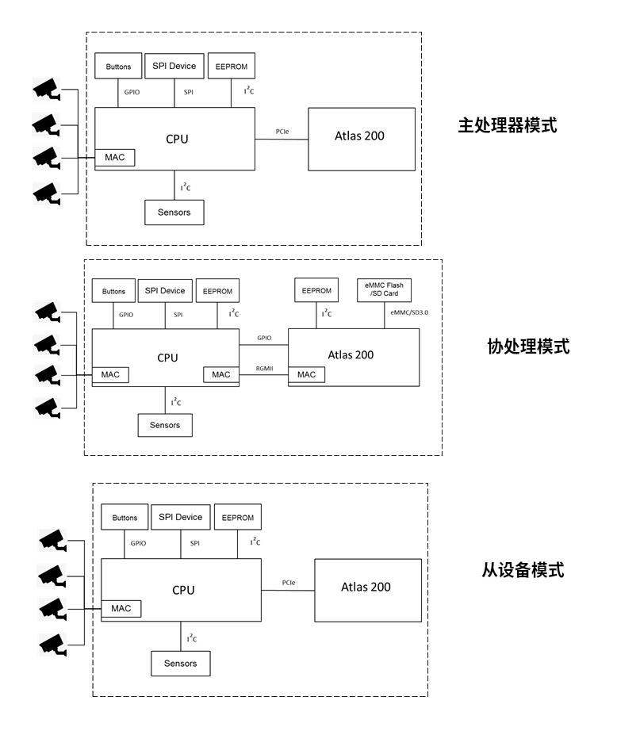
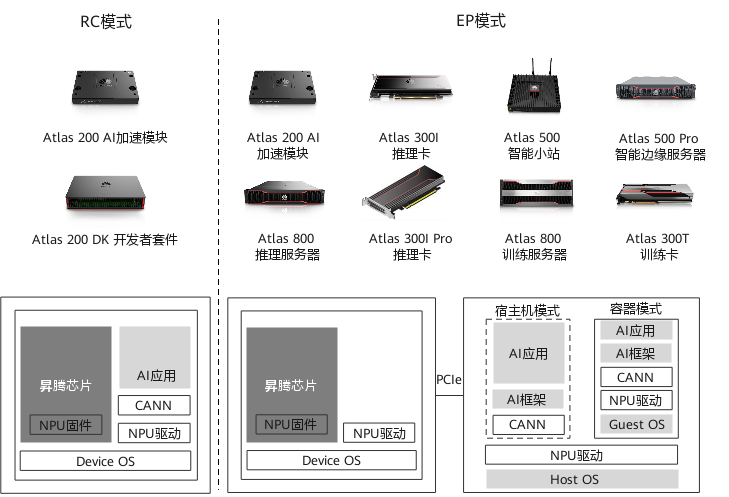
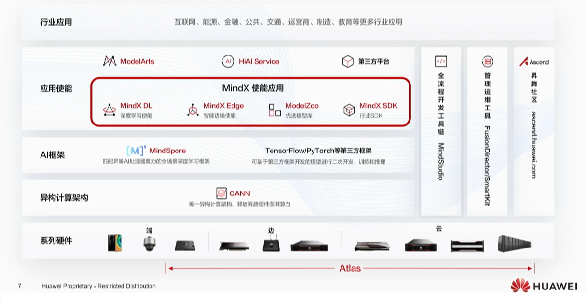
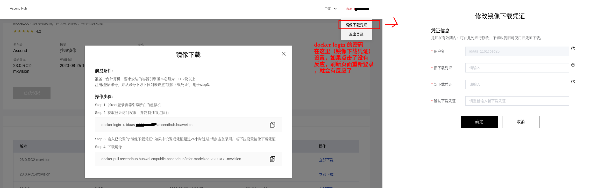
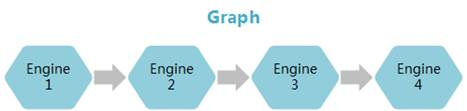
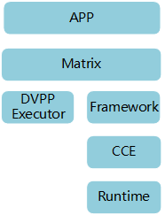

# atlas 200

Atlas 200 AI加速模块是一款高性能的AI智能计算模块。

Atlas 200 AI加速模块集成了海思昇腾310 AI处理器（Ascend 310 AI处理器），可以实现图像、视频等多种数据分析与推理计算，可广泛用于智能监控、机器人、无人机、视频服务器等场景。

能力：

- 16TOPS INT8 @ 13W
- 16路高清视频实时分析，支持JPEG解码
- 8GB内存 | PCIe 3.0 x 4接口
- 工作温度：-25℃～+80℃
- 尺寸：52 x 38 x 10.2 mm

其中：

ascend 310 ai处理器 其中包括：2个DaVinci（达芬奇）AI Core，8个A55 Arm Core（最大主频1.6GHz）

# 0 绪论

## 0.1 [应用模式](https://support.huawei.com/enterprise/zh/doc/EDOC1100223190/9b43259d)

主处理器模式：Atlas 200 AI加速模块内部有8个Cortex-A55核，并提供常见的I2C、USB、SPI、RGMII等外设接口，可以作为嵌入式系统CPU使用。用户将操作系统烧录在eMMC Flash或SD卡中，经过简单的配置，可以让Atlas 200 AI加速模块中的ARM CPU运行用户指定的AI业务软件。

协处理器模式：Atlas 200 AI加速模块的ARM CPU仍然可以运行用户的AI业务软件。区别在于Atlas 200 AI加速模块作为协处理器时，系统中还存在一个主控CPU，Atlas 200 AI加速模块的外设接入、上电、休眠、唤醒等操作由主控CPU控制。用户的AI业务软件对外接口，也通过主控CPU上的软件转发。

从设备模式：Atlas 200 AI加速模块作为PCIe从设备接入CPU系统时，客户的AI业务程序运行在Host系统中，通过PCIe通道与Atlas 200 AI加速模块交互，将AI任务卸载到Ascend 310芯片中运行。



[以昇腾 AI 处理器的PCIe的工作模式进行区分](https://www.cnblogs.com/liqi175/p/16831761.html)：

RC模式 :  Root Complex

- 如果PCIe工作在主模式，可以扩展外设，则称为RC模式

EP模式:  EndPoint

- 如果PCIe工作在从模式，则称为EP模式。
- EP模式通常由Host侧作为主端，Device侧作为从端。客户的AI业务程序运行在Host系统中，产品作为Device系统以PCIe从设备接入Host系统，Host系统通过PCIe通道与Device系统交互，将AI任务加载到Device侧的昇腾 AI 处理器中运行。



Host和Device的概念说明如下：

- Host：是指与昇腾AI处理器所在硬件设备相连接的X86服务器、ARM服务器，利用昇腾AI处理器提供的NN（Neural-Network）计算能力完成业务。
- Device：是指安装了昇腾AI处理器的硬件设备，利用PCIe接口与服务器连接，为服务器提供NN计算能力。

理解：

- 如果把昇腾 AI 处理器所在的产品，当做一台电脑使用，自己可以处理所有东西，**独当一面。就是用RC模式**。
- 如果把昇腾 AI 处理器所在的产品，当做一个外设显卡使用，这时候需要跟别的主机配合使用，**团结合作，就是EP模式。**

[PCIe的RC模式和EP模式有什么区别？ ](https://www.cnblogs.com/yuanqiangfei/p/16649358.html)

- RC：Root Complex
  - RC设备用于连接CPU/内存子系统 和 I/O设备；
  - RC模式下，PCIE配置头中的类型值为1；
  - RC模式下，支持配置和I/O事务

- EP：EndPoint
  - EP设备通常表示一个串行或I/O设备；
  - EP模式下，PCIE配置头中的类型值为0；
  - EP模式下，PCIE控制器接收针对本地内存空间的读写操作

## 0.2 npu-smi

npu-smi是npu的系统管理工具，可以用于收集设备信息，查看设备健康状态，对设备进行配置以及执行固件升级、清除设备信息等功能。

驱动安装过程中会默认安装npu-smi工具。

对于Atlas 200 AI加速模块（EP模式）：安装完成后，npu-smi放置在“/usr/local/sbin/”和“/usr/local/bin/”路径下。

对于Atlas 200 AI加速模块（RC模式）：安装完成后，npu-smi放置在“/usr/local/sbin/”路径下。

不支持多线程并发使用npu-smi命令。

[npu-smi命令参考](https://support.huawei.com/enterprise/zh/doc/EDOC1100273887)

```bash
# 查询所有设备的基本信息
npu-smi info
+--------------------------------------------------------------------------------------------------------+
| npu-smi 22.0.4（npu-smi工具版本）                  Version: 22.0.4（npu驱动版本）                          |
+-------------------------------+-----------------+------------------------------------------------------+
| NPU     Name                  | Health          | Power(W)     Temp(C)           Hugepages-Usage(page) |
| Chip    Device                | Bus-Id          | AICore(%)    Memory-Usage(MB)                        |
+===============================+=================+======================================================+
| 0       310                   | OK              | 12.8         51                0    / 187            |
| 0       0                     | NA              | 0            5745 / 7757                             |
+===============================+=================+======================================================+

字段说明
npu-sminpu-smi 工具版本
Version驱动版本
NPU设备ID
Name芯片名称，310——ascend 310芯片
Health芯片的健康状态，有五种状态：OK、Warning、Alarm、Critical或UNKNOWN
Power(W)芯片功率
Temp(C)芯片温度（单位°C）
Hugepages-Usage(page)大页占比（单位page），每一个page的大小是2048KB。
Chip芯片ID
Device芯片编号
Bus-IdBUS ID
AICore(%)AICore占用率
Memory-Usage(MB)内存占比

# 查询npu设备id
npu-smi info -l
	Card Count                     : 1

	NPU ID                         : 0
	Product Name                   : NA
	Serial Number                  : 033GWL10LB000840			# 产品序列号，可以在华为网站上注册，然后下载相关需要序列号的资料
	Chip Count                     : 1

# 用于查询设备的详细信息。-i后面的数字就是npu-smi info -l 显示的NPU ID
npu-smi info -t board -i 0
	NPU ID                         : 0
	Product Name                   : NA
	Model                          : NA
	Manufacturer                   : NA
	Serial Number                  : 033GWL10LB000840
	Software Version               : 22.0.4						# NPU驱动版本
	Firmware Version               : 1.84.15.1.310				# NPU固件版本
																# NPU驱动和固件包名称中包含的版本为6.0.RC1，但是部署驱动和固件后，
																# 使用npu-smi命令查询获取的驱动版本为22.0.3，固件版本为1.83.10.1.X。			
	Board ID                       : 0x3ec
	PCB ID                         : NA
	BOM ID                         : 0
	Chip Count                     : 1
	Faulty Chip Count              : 0

```

## 0.3 cann-toolkit & cann-nnrt

CANN（Compute Architecture for Neural Networks）是华为公司针对AI场景推出的异构计算架构，通过提供多层次的编程接口，支持用户快速构建基于昇腾平台的AI应用*和*业务。

Ascend-cann-toolkit 和 Ascend-cann-nnrt 是华为Atlas 200系列AI加速卡的软件开发工具包。

Ascend-cann-toolkit 主要用于模型开发和优化阶段，而 Ascend-cann-nnrt 则用于在Atlas 200设备上部署和执行训练好的深度学习模型。

1. **Ascend-cann-toolkit**:
   - 这个工具包通常用于开发人员和研究人员，提供了一系列的开发工具和库，以便他们可以利用Atlas 200系列硬件进行深度学习模型的开发和优化。
   - Ascend-cann-toolkit 提供了针对华为Ascend AI芯片的软件开发工具链，包括编译器、**模型转换工具**、性能分析工具等，使开发者可以在Atlas 200上开发和部署深度学习模型。
2. **Ascend-cann-nnrt**: runtime
   - 这个工具包是华为提供的运行时环境，用于在Atlas 200设备上执行深度学习推理任务。
   - Ascend-cann-nnrt 提供了用于在Atlas 200设备上部署和执行深度学习模型的运行时库和工具，使用户可以在Atlas 200上实现高性能的推理任务。

## 0.4 [MindX生态](https://bbs.huaweicloud.com/blogs/281842)

从AI算法到产品化应用，有三大鸿沟：

1. 算法开发难：模型开发，模型训练，精度提高
2. 应用开发难：流解码，模型衔接，资源调度
3. 业务部署难：数据协同，设备协同，节点管理

为解决上述一系列的问题，华为推出了 Mindx 使能应用

Mindx 应用使能核心包含四大组件(2+1+X)：

- 2： Mindx DL 和 Mindx Edge：
  - Mindx DL 负责深度学习使能，核心是做集群计算（训练、推理） 
  - Mindx Edge 负责边云协同的组件。
- 1：ModelZoo 高性能模型库，选择在昇腾上效率和速率更高的模型 。
  - ModelZoo 为开发者提供多场景、高性能优选模型，筛选出对昇腾性能和效率较高的模型。
- X：Mindx SDK 面向 行业应用 SDK（开发套件）。
  - MindX SDK 每个模块就是一个插件；所有的插件都已经写好了，使用时 只需要替换om文件，就可以进行开发应用 。
  - 主要是为了快速完成 AI 应用开发，主要特点为：面向应用 API 封装、基础领域 SDK 、场景化方案 SDK、典型参考设计。
  - MindX SDK 提供基于流媒体框架 GStreamer 的流程编排与插件开发的开发方式，提供了流程编排 API ：10个，插件开发 API ：111个，相对于用 ApiSamples 进行开发 AI 应用大大缩减了代码开发量和缩短了业务上线是时间。 
  - 现阶段已发布2个 SDK 分别是：针对视频分析的 mxVision 和 针对智能制造的 mxManufacture。mxManufacture 现已在松山湖商用，mxVision 典型的应用场景为南瑞的电力检测等。



## 0.5 [ascend 容器](https://ascendhub.huawei.cn/#/index)

### 0.5.1 [Ascend Docker Runtime](https://www.hiascend.com/document/detail/zh/mindx-dl/50rc2/dockerruntime/dockerruntimeug/dlruntime_ug_001.html)

```bash
# 下载Ascend-docker-runtime_5.0.RC1.1_linux-aarch64.run，大小只有5M
# 加可执行权限
chmod +x Ascend-docker-runtime_5.0.RC1.1_linux-aarch64.run
# 检查包完整性
./Ascend-docker-runtime_5.0.RC1.1_linux-aarch64.run --check
Verifying archive integrity... ./Ascend-docker-runtime_5.0.RC1.1_linux-aarch64.run does not contain an embedded SHA256 checksum.
 ./Ascend-docker-runtime_5.0.RC1.1_linux-aarch64.run does not contain an embedded MD5 checksum.
 ./Ascend-docker-runtime_5.0.RC1.1_linux-aarch64.run does not contain a CRC checksum.
 All good.
Verifying archive integrity... All good.
Uncompressing ascend-docker-runtime  100%

# 安装
./Ascend-docker-runtime_5.0.RC1.1_linux-aarch64.run --install 
Verifying archive integrity... All good.
Uncompressing ascend-docker-runtime  100%  
installing ascend docker runtime
install executable files success
[INFO]     2024/03/27 17:29:57.995431 1       hwlog/api.go:108    installer.log's logger init success
[INFO]     2024/03/27 17:29:57.996334 1       main.go:78    uid: 0 tty: /dev/pts/1  start running script
[INFO]     2024/03/27 17:29:58.002693 1       main.go:91    uid: 0 tty: /dev/pts/1  run install success
create damom.json success
[INFO]: Ascend Docker Runtime has been installed in: /usr/local/Ascend/Ascend-Docker-Runtime
[INFO]: The version of Ascend Docker Runtime is: v5.0.RC1.1
please reboot daemon and container engine to take effect

# 重启docker服务
systemctl daemon-reload && systemctl restart docker
```

[Ascend Docker Runtime会根据实际环境情况默认以只读方式挂载以下目录和文件到容器中。](https://www.hiascend.com/document/detail/zh/mindx-dl/50rc2/dockerruntime/dockerruntimeug/dlruntime_ug_022.html#:~:text=%E6%8C%82%E8%BD%BD%E5%86%85%E5%AE%B9-,%E9%BB%98%E8%AE%A4%E6%8C%82%E8%BD%BD%E5%86%85%E5%AE%B9,-%E6%9B%B4%E6%96%B0%E6%97%B6%E9%97%B4%EF%BC%9A2023)

<table cellpadding="4" cellspacing="0" id="ZH-CN_TOPIC_0000001659560758__zh-cn_topic_0000001538584750_table11867194212594" frame="border" border="1" rules="all" data-header="2" class="is-header-top">
    <thead align="left">
   <tr id="ZH-CN_TOPIC_0000001659560758__zh-cn_topic_0000001538584750_row188668424598">
    <th align="left" class="cellrowborder is-top-col table-top-left-cell col-first col-index-0 table-header top-header" valign="top" width="42.94%" id="mcps1.3.1.3.2.3.1.1"><p id="ZH-CN_TOPIC_0000001659560758__zh-cn_topic_0000001538584750_p1786664285920">路径</p></th>
    <th align="left" class="cellrowborder is-top-col table-top-right-cell col-index-1 col-last table-header top-header" valign="top" width="57.06%" id="mcps1.3.1.3.2.3.1.2"><p id="ZH-CN_TOPIC_0000001659560758__zh-cn_topic_0000001538584750_p1186614245917">说明</p></th>
   </tr>
  </thead>
  <tbody>
   <tr id="ZH-CN_TOPIC_0000001659560758__zh-cn_topic_0000001538584750_row18866174214591">
    <td class="cellrowborder col-first col-index-0" valign="top" width="42.94%" headers="mcps1.3.1.3.2.3.1.1 "><p id="ZH-CN_TOPIC_0000001659560758__zh-cn_topic_0000001538584750_p11866194245916">/dev/davinci<em id="ZH-CN_TOPIC_0000001659560758__zh-cn_topic_0000001538584750_i6866154214591">X</em></p></td>
    <td class="cellrowborder col-index-1 col-last" valign="top" width="57.06%" headers="mcps1.3.1.3.2.3.1.2 "><p id="ZH-CN_TOPIC_0000001659560758__zh-cn_topic_0000001538584750_p19866442115914">NPU设备，X是ID号。例如：davinci0。</p></td>
   </tr>
   <tr id="ZH-CN_TOPIC_0000001659560758__zh-cn_topic_0000001538584750_row686710426597">
    <td class="cellrowborder col-first col-index-0" valign="top" width="42.94%" headers="mcps1.3.1.3.2.3.1.1 "><p id="ZH-CN_TOPIC_0000001659560758__zh-cn_topic_0000001538584750_p1286619426598">/dev/davinci_manager</p></td>
    <td class="cellrowborder col-index-1 col-last" valign="top" width="57.06%" headers="mcps1.3.1.3.2.3.1.2 "><p id="ZH-CN_TOPIC_0000001659560758__zh-cn_topic_0000001538584750_p4867204213598">管理设备。</p></td>
   </tr>
   <tr id="ZH-CN_TOPIC_0000001659560758__zh-cn_topic_0000001538584750_row686744245910">
    <td class="cellrowborder col-first col-index-0" valign="top" width="42.94%" headers="mcps1.3.1.3.2.3.1.1 "><p id="ZH-CN_TOPIC_0000001659560758__zh-cn_topic_0000001538584750_p20867742205912">/usr/local/Ascend/driver/tools</p></td>
    <td class="cellrowborder col-index-1 col-last" valign="top" width="57.06%" headers="mcps1.3.1.3.2.3.1.2 "><p id="ZH-CN_TOPIC_0000001659560758__zh-cn_topic_0000001538584750_p13867342115914">目录，驱动提供的工具包。</p></td>
   </tr>
   <tr id="ZH-CN_TOPIC_0000001659560758__zh-cn_topic_0000001538584750_row14867184211597">
    <td class="cellrowborder col-first col-index-0" valign="top" width="42.94%" headers="mcps1.3.1.3.2.3.1.1 "><p id="ZH-CN_TOPIC_0000001659560758__zh-cn_topic_0000001538584750_p286724217596">/usr/local/Ascend/driver/lib64</p></td>
    <td class="cellrowborder col-index-1 col-last" valign="top" width="57.06%" headers="mcps1.3.1.3.2.3.1.2 "><p id="ZH-CN_TOPIC_0000001659560758__zh-cn_topic_0000001538584750_p15867114213595">目录，驱动提供的用户态库。</p></td>
   </tr>
   <tr id="ZH-CN_TOPIC_0000001659560758__zh-cn_topic_0000001538584750_row0867114235920">
    <td class="cellrowborder col-first col-index-0" valign="top" width="42.94%" headers="mcps1.3.1.3.2.3.1.1 "><p id="ZH-CN_TOPIC_0000001659560758__zh-cn_topic_0000001538584750_p1486744211591">/usr/local/sbin/npu-smi</p></td>
    <td class="cellrowborder col-index-1 col-last" valign="top" width="57.06%" headers="mcps1.3.1.3.2.3.1.2 "><p id="ZH-CN_TOPIC_0000001659560758__zh-cn_topic_0000001538584750_p1867194217591">文件，NPU-SMI工具。</p></td>
   </tr>
   <tr id="ZH-CN_TOPIC_0000001659560758__zh-cn_topic_0000001538584750_row3867184285913">
    <td class="cellrowborder col-first col-index-0" valign="top" width="42.94%" headers="mcps1.3.1.3.2.3.1.1 "><p id="ZH-CN_TOPIC_0000001659560758__zh-cn_topic_0000001538584750_p16867242195910">/etc/hdcBasic.cfg</p></td>
    <td class="cellrowborder col-index-1 col-last" valign="top" width="57.06%" headers="mcps1.3.1.3.2.3.1.2 "><p id="ZH-CN_TOPIC_0000001659560758__zh-cn_topic_0000001538584750_p1867342195912">文件，hdc基础文件。</p></td>
   </tr>
   <tr id="ZH-CN_TOPIC_0000001659560758__zh-cn_topic_0000001538584750_row6867742185918">
    <td class="cellrowborder col-first col-index-0 is-bottom-col table-bottom-left-cell" valign="top" width="42.94%" headers="mcps1.3.1.3.2.3.1.1 "><p id="ZH-CN_TOPIC_0000001659560758__zh-cn_topic_0000001538584750_p10867194295913">/etc/sys_version.conf</p></td>
    <td class="cellrowborder col-index-1 col-last is-bottom-col table-bottom-right-cell" valign="top" width="57.06%" headers="mcps1.3.1.3.2.3.1.2 "><p id="ZH-CN_TOPIC_0000001659560758__zh-cn_topic_0000001538584750_p1886764211596">文件，驱动的版本信息。</p></td>
   </tr>
  </tbody>
 </table>

### 0.5.2 下载容器

容器下载时，让你提供凭证，就按下图设置。




### 0.5.3 启动容器

[华为官方参考：Atlas 200I SoC A1 核心板 6.0.0 NPU驱动和固件安装指南 03](https://support.huawei.com/enterprise/zh/doc/EDOC1100288841/25832de7)

[DLAP221基于mxVision 容器内推理](https://blog.csdn.net/shiner_chen/article/details/128610084)

```bash
# 宿主机设置所有芯片的容器共享模式(推荐)
npu-smi set -t device-share -i 0 -d 1
# 设置设备0中编号为0的芯片的容器共享模式为使能。
npu-smi set -t device-share -i 0 -c 0 -d 1
```


启动容器的命令，宿主机没有的目录需要自己建一个，入口脚本的名字需要后下面的脚本名相同，镜像名要修改为指定的镜像：

```bash
docker run -it \
-u root \
--device=/dev/davinci0 \
--device=/dev/davinci_manager \
--device=/dev/ascend_manager \
--device=/dev/svm0 \
--device=/dev/log_drv \
--device=/dev/event_sched \
--device=/dev/upgrade \
--device=/dev/hi_dvpp \
--device=/dev/ts_aisle \
-v /usr/local/Ascend/driver/tools:/usr/local/Ascend/driver/tools \
-v /usr/local/Ascend/driver/lib64:/usr/local/Ascend/driver/lib64 \
-v /usr/local/sbin/npu-smi:/usr/local/sbin/npu-smi \
-v /usr/lib64/aicpu_kernels:/usr/lib64/aicpu_kernels \
-v /var/hdc_ppc:/var/hdc_ppc \
-v /etc/hdcBasic.cfg:/etc/hdcBasic.cfg \
-v /sys:/sys \
-v /etc/sys_version.conf:/etc/sys_version.conf \
-v /var/dmp_daemon:/var/dmp_daemon \
-v /var/slogd:/var/slogd \
-v /var/log/npu/conf/slog/slog.conf:/var/log/npu/conf/slog/slog.conf \
-v /mnt/sdcard-zhulin/buntu/docker:/var/docker \
-p 7322:22 \
f01b18f3bd8d \
/bin/bash -c "/usr/local/Ascend/driver/tools/dok_cont_ascend_pre1.sh;/bin/bash"
```


启动后的入口脚本，必须赋予可执行权限（否则要出错），并且要将其复制到容器的某个地方或放在主机需要映射的容器卷中：

```bash
#!/bin/bash
[ -d /usr/lib64 ] || mkdir -p /usr/lib64
[ -d /var ] || mkdir -p /var
[ -d /var/driver ] || mkdir -p /var/driver
[ -d /usr/slog ] || mkdir -p /usr/slog
[ -d /run/driver ] || mkdir -p /run/driver
[ -d /var/dmp ] || mkdir -p /var/dmp
[ -d /home/root/hdc_ppc ] || mkdir -p /home/root/hdc_ppc
[ -d /home/HwHiAiUser/hdc_ppc ] || mkdir -p /home/HwHiAiUser/hdc_ppc

cp -arf /usr/local/Ascend/driver/lib64/* /usr/lib64/
# cp -arf /usr/local/Ascend/driver/tools/* /var/

######
chmod 755 /usr/lib64
chown -h HwHiAiUser:HwHiAiUser /usr/slog
chown -h HwHiAiUser:HwHiAiUser /var/dmp
chown -h HwHiAiUser:HwHiAiUser /home/HwHiAiUser/hdc_ppc

if [ ! -f /usr/lib64/libcrypto.so.1.1 ] && [ ! -L /usr/lib64/libcrypto.so.1.1 ]; then
    cp -arf /usr/local/Ascend/driver/lib64/inner/libcrypto.so.1.1 /usr/lib64/
fi

/var/slogd &
sleep 2
/var/dmp_daemon -I -U 8087 &
```

在容器中执行，`npu-smi info`看是否成功。

## 0.6 开发套件

Atlas 200 AI加速模块仅仅是一款高性能的AI智能计算模块。它就像一块集成CPU的GPU，要真正能应用起来，还需要主板，IO口，嵌入其它设备。

Atlas 200DK 是第一代的开发板，Atlas 200I DK A2是第二代的开发板。他们就是可以独立应用起来的"主机"。

相较于1代，2代算力会弱一点，价格便宜很多。

## 0.7 环境部署

[华为Atlas200DK的环境部署与运行demo（人脸识别）](https://blog.csdn.net/weixin_42800966/article/details/122587832)

[华为昇腾服务器 ubuntu20.04 Atlas中心推理卡 23.0.RC3 NPU驱动和固件安装指南 02（Atlas 300V pro）（Ascend 310P）（cann）安装流程记录](https://blog.csdn.net/Dontla/article/details/135009119)

[下载CANN](https://support.huawei.com/enterprise/zh/software/259237969-ESW2000688936)


# 1 [软件开发](https://support.huawei.com/enterprise/zh/doc/EDOC1100107781)

昇腾AI软件栈组件

| 组件                            | 说明                                                         | 参考文档                                                     |
| ------------------------------- | ------------------------------------------------------------ | ------------------------------------------------------------ |
| 框架管理器（Framework ）        | 将原始神经网络模型转换成昇腾AI处理器支持的形态，并将转换的模型与昇腾AI处理器相融合，引导神经网络运行并高效发挥其性能。 | [Framework API参考](https://support.huawei.com/enterprise/zh/doc/EDOC1100107781/85d0f640#ZH-CN_TOPIC_0233103640) |
| 流程编排器（Matrix）            | 负责完成神经网络在昇腾AI处理器上的落地与实现，统筹整个神经网络生效的过程。 | [Matrix API参考](https://support.huawei.com/enterprise/zh/doc/EDOC1100107781/e751c1fc#ZH-CN_TOPIC_0233103559) |
| 数字视觉处理模块（DVPP）        | Davinci架构对输入数据有固定的格式要求，如果数据未满足架构规定的输入格式、分辨率等要求，需要调用DVPP进行格式转换，从而保证后续的推理业务。 | [DVPP API参考](https://support.huawei.com/enterprise/zh/doc/EDOC1100107781/6cb35375#ZH-CN_TOPIC_0233103646) |
| 数据回传工具（IDE-daemon-hiai） | 提供接口给Matrix和Framework调用，用于DVPP预处理数据和神经网络数据回传。 | [IDE-daemon-client命令参考](https://support.huawei.com/enterprise/zh/doc/EDOC1100107781/bd965011#ZH-CN_TOPIC_0233103631) |

## 1.1 [Matrix](https://support.huawei.com/enterprise/zh/doc/EDOC1100107781/16a96329)

Matrix框架核心为Graph和Engine。

Engine为业务的基本功能单元，允许用户自定义Engine的实现（输入图片数据、对图片进行分类处理、输出对图片数据的分类预测结果等）。每个Engine默认对应一个线程运行处理。

Graph管理若干Engine组成的业务流。每个Graph在Ascend 310拉起一个进程实现对应业务。Graph描述了Engine及Engine的数据传输关系。



业务软件的逻辑框架如下图所示：

- Matrix为通用业务流程执行引擎，提供Ascend 310芯片功能接口、完成与APP进行控制命令和处理数据的交互、根据配置文件完成业务流程的建立、根据命令完成业务流程的销毁、Engine调用DVPP的API接口实现媒体预处理以及Engine调用模型管家的API接口实现模型推理。
- DVPP Excutor提供了API接口实现视频编解码、图片编解码以及视觉预处理（包括裁剪、缩放等）功能。
- Framework为离线模型框架，提供接口实现离线模型转换、离线模型执行以及自定义算子实现。
- CCE为加速库，通过API的方式，为上层应用（Framework或者Matrix）提供加速。
- Runtime运行于APP进程空间，为APP提供了Ascend 310设备的Memory管理、Device管理、Stream管理、Event管理以及Kernel执行等功能。



## 1.2 [dvpp](https://support.huawei.com/enterprise/zh/doc/EDOC1100107781/6cb35375)

DVPP是Ascend 310芯片提供的图像预处理硬件加速模块，该模块集成的六个功能如下所示，接口介绍和使用方法请参考《DVPP API参考》。

- 格式转换，抠图与缩放（VPC）
- H264/H265视频解码（VDEC）
- H264/H265视频编码 （VENC）
- Jpeg图片解码（JPEGD）
- Jpeg图片编码（JPEGE）
- Png图片解码（PNGD）

## 1.3 [AIPP](https://support.huawei.com/enterprise/zh/doc/EDOC1100107781/9a68b2eb)

AIPP（AI Preprocessing）用于在AI Core上完成图像预处理，包括改变图像尺寸、色域转换（转换图像格式）、减均值/乘系数（改变图像像素）。

AIPP区分为静态AIPP和动态AIPP。您只能选择静态AIPP或动态AIPP方式来处理图片，不能同时配置静态AIPP和动态AIPP两种方式。

## 1.4 [ATC模型转换](https://www.hiascend.com/document/detail/zh/canncommercial/60RC1/inferapplicationdev/atctool/atctool_0001.html)

## 1.5 [昇腾仓库](https://gitee.com/ascend)

