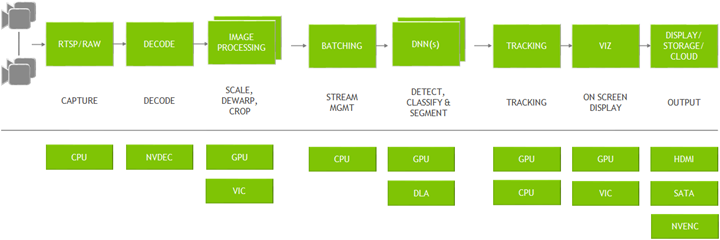

# Deepstream

DeepStream是一个基于NVIDIA GPU和TensorRT的开源视频分析框架。

它提供了一个端到端的、可扩展的平台，可以处理多个视频和图像流，并支持实时的人脸识别、车辆识别、物体检测和跟踪、行为分析等视觉分析任务。DeepStream可以通过在不同的节点上进行分布式部署来实现高吞吐量和低延迟的处理，从而满足各种应用场景的需求，如智能城市、智能交通、工业自动化等。

Deepstream具备稳定高效的读流和推流能力；

特性：

- 支持输入：USB/CSI 摄像头, 文件, RTSP流
- 示例代码：
  - C++: https://docs.nvidia.com/metropolis/deepstream/dev-guide/text/DS_C_Sample_Apps.html
  - python: https://docs.nvidia.com/metropolis/deepstream/dev-guide/text/DS_Python_Sample_Apps.html
- 硬件加速插件：VIC, GPU, DLA, NVDEC, and NVENC
- 使用软件SDK： CUDA, TensorRT, NVIDIA® Triton™ （Deepstream将它们抽象为插件）
- 支持平台：Jetson , 各种 GPU, [container](https://catalog.ngc.nvidia.com/orgs/nvidia/containers/deepstream)

# 0 绪论

### 0.1 图架构（Graph architecture）

> 图示：
>
> - 典型的视频分析应用：都是从读取视频开始，从视频中抽取有价值信息，最后输出
> - 上半部分：用到的所有插件
> - 下半部分：整个App链路中用到的硬件引擎

图架构：

- Deepstream基于开源 [GStreamer](https://enpeicv.com/) 框架开发；
- 优化了内存管理：pipeline上插件之间没有内存拷贝，并且使用了各种加速器来保证最高性能；

插件（plugins）：

- input→ decode: [Gst-nvvideo4linux2](https://docs.nvidia.com/metropolis/deepstream/dev-guide/text/DS_plugin_gst-nvvideo4linux2.html)
- preprocessing:
  - [Gst-nvdewarper](https://docs.nvidia.com/metropolis/deepstream/dev-guide/text/DS_plugin_gst-nvdewarper.html): 对鱼眼或360度相机的图像进行反扭曲
  - [Gst-nvvideoconvert](https://docs.nvidia.com/metropolis/deepstream/dev-guide/text/DS_plugin_gst-nvvideoconvert.html): 颜色格式的调整
  - [Gst-nvstreammux](https://docs.nvidia.com/metropolis/deepstream/dev-guide/text/DS_plugin_gst-nvstreammux.html): 多路复用器，从多个输入源形成一批缓冲区（帧）
  - inference:
    - [Gst-nvinfer](https://docs.nvidia.com/metropolis/deepstream/dev-guide/text/DS_plugin_gst-nvinfer.html): TensorRT
    - [Gst-nvinferserver](https://docs.nvidia.com/metropolis/deepstream/dev-guide/text/DS_plugin_gst-nvinferserver.html): Triton inference server: native frameworks such as TensorFlow or PyTorch
  - [Gst-nvtracker](https://docs.nvidia.com/metropolis/deepstream/dev-guide/text/DS_plugin_gst-nvtracker.html): 目标追踪
  - [Gst-nvdsosd](https://docs.nvidia.com/metropolis/deepstream/dev-guide/text/DS_plugin_gst-nvdsosd.html): 可视化：bounding boxes, segment masks, labels
- output:
  - 格式： 窗口显示，保存到文件，流通过RTSP，发送元数据到云
  - [Gst-nvmsgconv](https://docs.nvidia.com/metropolis/deepstream/dev-guide/text/DS_plugin_gst-nvmsgconv.html) ：将元数据metadata转换为数据结构
  - [Gst-nvmsgbroker](https://docs.nvidia.com/metropolis/deepstream/dev-guide/text/DS_plugin_gst-nvmsgbroker.html)：向服务器发送遥测数据(如Kafka, MQTT, AMQP和Azure IoT)

### 0.2 应用架构（Application Architecture）

> https://docs.nvidia.com/metropolis/deepstream/dev-guide/text/DS_ref_app_deepstream.html#reference-application-configuration

- 包含了一系列的`GStreamer`插件
- 英伟达开发的插件有：
  - Gst-nvstreammux: 从多个输入源形成一批缓冲区（帧）
  - Gst-nvdspreprocess: 对预先定义的roi进行预处理，进行初步推理
  - Gst-nvinfer: TensorRT推理引擎（可用来检测和分类、分割）
  - Gst-nvtracker: 使用唯一ID来跟踪目标物体
  - Gst-nvmultistreamtiler: 拼接多个输入视频源显示
  - Gst-nvdsosd: 使用生成的元数据在合成视频帧上绘制检测框、矩形和文本等
  - Gst-nvmsgconv, Gst-nvmsgbroker: 将分析数据发送到云服务器。