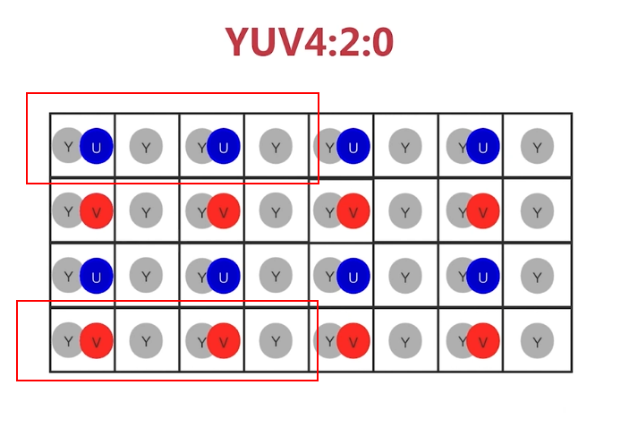

# OpenCV


# 0 基础

机器视觉与图形学之间的关系

opencv与ffmpeg


车辆检测项目

1. 窗口展示
2. 图像/视频的加载
3. 基本图形的绘制
4. 车辆的识别


## 基本图形的绘制

1. 色彩空间

   - RGB：人眼的色彩空间，OpenCV默认使用BGR，顺序不一样而已，主要用在物理显示器，器件当中

   - HSV/HSB/HSL：（主要用在OpenCV）

     - Hue（色相，色调，色彩，0°～360°）
     - Saturation（饱和度，颜色的纯度，0.0～1.0）
     - Value，Brightness，Lightness（亮度，0.0(黑色)～1.0(白色)）

     

     

     YUV 4:2:0：在横向的4个像素里面，y在4个中都有，这里的2如果指U，那么V就是0，如果指V，那么U就是0

2. 像素访问

3. 矩阵基本运算

   - 创建矩阵array()，zeros()，ones()，full()，indentity（方形）/eye()
   - 检索和赋值
   - 获取子数组


OpenCV最重要的数据结构：Mat类表示的是一个n维的 稠密的 单通道或多通道的数值数组。


## 车辆识别涉及知识

1. 基本图像运算与处理
   - 矩阵四则运算，溶合（加权加法），位运算
   - 缩放，翻转，旋转
   - 仿射，透视
   - 图像滤波
2. 形态学
   - 
3. 轮廓查找

# 1 基本图像运算与处理

## 1.1 矩阵基本运算

```python
cv2.add(offset,orgin) 
cv2.subtract(orgin, offset) 

cv2.multiply(a,b)
cv2.divide(a,b)

# 融合
cv2.addWeighted(couple, 0.7, girl1, 0.3, 0)

# 位运算
cv2.bitwise_not(img)
np.bitwise_and(img,img2)
np.bitwise_or(img,img2)
np.bitwise_xor(img,img2)

# 
cv2.resize(couple,(300,400),interpolation=cv2.INTER_NEAREST)
cv2.flip(couple, -1)
cv2.rotate(img, rotateCode)
```


## 1.2 [仿射变换](https://blog.csdn.net/u011681952/article/details/98942207)

#### 仿射变换数学表达

一个集合 XX 的仿射变换为：
$$
f(x) = Ax + b  \space\space\space x\in X
$$
仿射变换是二维平面中一种重要的变换，在图像图形领域有广泛的应用，在二维图像变换中，一般表达为：
$$
\left[
\begin{matrix}
x^\prime \\
y^\prime  \\
0  \\
\end{matrix}
\right]

=

\left[
\begin{matrix}
R_{00} & R_{01} & T_x   \\
R_{10} & R_{11} & T_y   \\
0 & 0 & 1  \\
\end{matrix}
\right]


\left[
\begin{matrix}
x\\
y\\
1 \\
\end{matrix}
\right]
$$
可以视为**线性变换R**和**平移变换T**的叠加


#### 平移变换矩阵

$$
M=
\left[
\begin{matrix}
1 & 0 & T_x   \\
0 & 1 & T_y   \\
0 & 0 & 1  \\
\end{matrix}
\right]
$$

#### 反射变换矩阵

$$
\left[
\begin{matrix}
1 & 0 & 0  \\
0 & -1 & 0  \\
0 & 0 & 1  \\
\end{matrix}
\right]
$$

#### API

```python
# 仿射变换
warpAffine(img, M, (w, h))
# 通过操作获取仿射变换矩阵
getRotationMatrix2D( center, angle, scale )
# 通过变换前多个点和变换后的多个对应的点（三个点），来获取仿射变换矩阵
getAffineTransform(src,dst)
```

## 1.3 [透视变换](https://blog.csdn.net/bby1987/article/details/106317354)


## 1.4 图像滤波

一幅图像通过滤波器得到另一幅图像，其中滤波器又称卷积核，滤波的过程称为卷积


概念：

- 卷积核的大小，3x3，5x5等，一般为奇数
  - 奇数的原因：一方面是增加padding的原因，一方面是保证锚点在中间，防止位置发生偏移的原因
  - 在深度学习中，卷积核越大，看到信息（感受野）越多，提取特征越好，同时计算量也就越大（多个小的卷积核去替代一个大的卷积核）
- 锚点
  - 卷积核的中心点
- 边界扩充
  - 当卷积核尺寸大于1，输出的尺寸会相应变小，为了是输入和输出的尺寸相等，则会对原始图像进行边界扩充，然后得到的输出尺寸就一致了。
  - `N =  (W - F + 2P) / S  + 1`，N输出图像的大小，W源图的大小，F卷积核大小，P为扩充尺寸，S为步长
- 步长
  - 卷积核每次偏移的大小

```python
filter2D(src, ddepth, kernel, anchor, delta, borderType)
# src 源图
# ddepth 位深，-1和源图保持一致
# kernel卷积核
# anchor -1根据卷积核找锚点
# delta 偏移
# borderType 边界的类型
```

1. 低通滤波，可以去除噪音或平滑图像（ps去痘）
   - 方盒滤波（boxFilter）和模糊滤波（blur）
   - 高斯滤波（GaussianBlur），卷积核锚点权重最高，越远离锚点权重越低。可以除掉图像中随机出现的**高斯噪声**
   - 中值滤波（medianBlur），取多个像素点中间的值，作为输出图像的像素值，对于**胡椒噪音有滤出**作用
   - 双边滤波（bilateralFilter），可以保留边缘，同时对边缘内的区域进行平滑处理
     - 高斯滤波之所以会导致图像变得模糊，是因为它在滤波过程中只关注了位置信息
2. 高通滤波，可以帮助查找图像的边缘
   - Sobel索贝尔，内部先使用高斯滤波（对噪音的适应性比较强），再求一阶导，
   - scharr沙尔，固定尺寸3x3，如果索贝尔的卷积核设为-1就约等于沙尔，但沙尔的效果要好一些，但索贝尔可以调整卷积核的大小
   - Laplacian拉普拉斯，**两个方向**可以同时求边缘，但它没有降噪，通常需要自己配合其他降噪使用
     - **沙尔和索贝尔一次只可以求一个方向的边缘，两个方向求完之后，再做加法**
   - [Canny](https://blog.csdn.net/m0_51402531/article/details/121066693)
     - 使用5x5高斯滤波消除噪声
     - 计算四个方向的梯度（0/45/90/135度）
     - 取梯度局部最大值，进行阈值（<min<grad<max<）计算，小于min为非边缘，大于max为强边缘，二者之间虚边缘再做区分
       - 与强边缘连接，则将该边缘处理为边缘
       - 与强边缘无连接，则该边缘为弱边缘，将其抑制。

# 2 形态学

定位物体的位置

形态学图像处理

- 腐蚀与膨胀
- 开运算（先腐蚀，后膨胀）
- 闭运算（先膨胀，后腐蚀）
- 顶帽 （源图 - 开运算）
- 黑帽（源图 - 闭运算）

这些是对二进制图像做处理的方法，也是一种卷积的做法。卷积核决定着图像处理后的效果


## 2.1 [图像二值化](https://zhuanlan.zhihu.com/p/360824614)

传统的机器视觉通常包括两个步骤：预处理和物体检测。而沟通二者的桥梁则是**图像分割（Image Segmentation）**[1]。图像分割通过简化或改变图像的表示形式，使得图像更易于分析。

最简单的图像分割方法是**二值化（Binarization）**。

- 全局阈值
- **自适应阈值**

```python
# 全局阈值
# threshold(img,thresh,maxval,type)，
# type：
# THRESH_BINARY 高于阈值设为maxval，低于阈值设为0 THRESH_BINARY_INV，与前面相反
# THRESH_TRUNC 高于阈值设为maxal，低于阈值保持源值
# THRESH_TOZERO 高于阈值保持不变，低于阈值设为0, THRESH_TOZERO_INV 高于阈值设为0，低于阈值保持源值
# 将源图转为灰度图
gray = cv2.cvtColor(img, cv2.COLOR_BGR2GRAY)
# 二值化
ret, res = cv2.threshold(gray, 180, 255, cv2.THRESH_BINARY)

# 自适应阈值
# adaptiveThreshold(gray,maxValue,adaptiveMethod,type,blockSize,C)
res =cv2.adaptiveThreshold(gray, 255, cv2.ADAPTIVE_THRESH_GAUSSIAN_C, cv2.THRESH_BINARY, 3, 0)
# adaptiveMethod：计算阈值的方法，ADAPTIVE_THRESH_MEAN_C计算邻近区域的平均值，ADAPTIVE_THRESH_GAUSSIAN_C高斯窗口加权平均值
# type：THRESH_BINARY，THRESH_BINARY_INV
# blockSize：光线影响较小可以设大一些
# C：常量，从计算的值中减去一个常量
```

自适应阈值，由于光照不均匀以及阴影的存在，全局阈值二值化会使得在阴影处的白色，被二值化成黑色

## 2.2 腐蚀和膨胀

**腐蚀和膨胀都是针对目标物来说的，目标物就是需要凸显的部分。**

**以下都是用黑底白字做实验，白色是需要凸显的部分**

腐蚀作用：消除物体的边界点，使边界向内收缩，可以把小于结构元素（核）的物体去除。可将两个有细小连通的物体分开。该方法可以用来去除毛刺，小凸起等。如果两个物体间有细小的连通，当结构足够大时，可以将两个物体分开。

当源图像与卷积核所有像素点一致时，才将源图上与锚点对应的点置为1，否则值为0。

```python
import cv2
import numpy as np

img = cv2.imread('../data/word.jpeg')        # 黑底白字
# 将源图转为灰度图
gray = cv2.cvtColor(img, cv2.COLOR_BGR2GRAY)

# kernel = np.ones((3,3),np.uint8)

# 获取卷积核
# cv2.getStructuringElement(type,size)
# type：
# MORPH_RECT 全一
# MORPH_ELLIPSE 椭圆形内是1,椭圆形外是0
# MORPH_CROSS 十字架上是1，十字架外是0
kernel = cv2.getStructuringElement(cv2.MORPH_CROSS, (7,7))
print(kernel)


res = cv2.erode(gray,kernel, iterations=1)       # iterations 腐蚀的次数


cv2.imshow('img', img)
cv2.imshow('gray',gray)
cv2.imshow('res', res)

cv2.waitKey(0)
cv2.destroyAllWindows()
```

膨胀：卷积核的锚点对应的源像素点不为0，那就使源像素点周围的点都不为0

膨胀的作用：将目标物上不连接的像素膨胀，然后去除目标身上的背景噪点。

```python
cv2.dilate(gray, kernel, iterations=2)
```

噪点就是背景色（不需要突出的颜色）

思考：

1. **如果是白底黑字**，怎么腐蚀和膨胀
   - 黑底白字，腐蚀就是缩，膨胀就是胀
   - 白底黑字，腐蚀就是胀，膨胀就是缩
2. 卷积核是否可以设置为全0，可以为全0，处理前后图片没有变化

## 2.3 开运算和闭运算

- 开运算——先腐蚀，后膨胀，可以去除黑色背景中白色的噪点
- 闭运算——先膨胀，后腐蚀，可以去除白色需要凸显字体中的黑色噪点

```python
cv2.morphologyEx(gray, cv2.MORPH_OPEN, kernel)     # 噪点越大，核选择就越大。MORPH_CLOSE
```

## 2.4 形态学梯度

梯度 = 源图 - 腐蚀的图。**用于求边缘**

```python
cv2.morphologyEx(gray, cv2.MORPH_GRADIENT, kernel) 
```

## 2.5 顶帽和黑帽

顶帽 = 源图 - 开运算，去除大目标，得到小目标物（得到黑色背景中的白色噪点）

```python
cv2.morphologyEx(gray, cv2.MORPH_TOPHAT, kernel) 
```

黑帽 = 源图 - 闭运算，得到白色目标物中的黑色噪点，再将黑色噪点转为白色

```python
cv2.morphologyEx(gray, cv2.MORPH_BLACKHAT, kernel)
```


# 3 轮廓

具有相同**颜色**或**强度**的**连续点**的曲线

图像轮廓的作用

- 图形分析
- 物体的识别与检测

## 3.1 轮廓查找和绘制

[findContours函数分析](https://blog.csdn.net/xfijun/article/details/117694917)

```c++
cv::findContours(InputOutputArray image, OutputArrayOfArrays contours, OutputArray hierarchy, int mode, int method, Point offset=Point());
// image 二值图像
// hierarchy表示轮廓的层次关系，对于第 i i i 条轮廓，hierarchy[i][0] , hierarchy[i][1] , hierarchy[i][2] , hierarchy[i][3]分别表示后一条轮廓、前一条轮廓、（同层次的第一个）子轮廓、父轮廓的索引（如果没有对应的索引，则为负数）。
// method参数表示轮廓表示方法，一般采用CHAIN_APPROX_SIMPLE。对于矩形轮廓，只需要4个点来保存
// mode 参数表示“轮廓检索模式（Contour retrieval mode）”，
// 包含了RETR_LIST，RETR_EXTERNAL，RETR_CCOMP，RETR_TREE(从外到里，从右到左排序)四种模式
// ApproximationMode 保存轮廓的模式，CHAIN_APPROX_NONE(保存轮廓上所有点)，，CHAIN_APPROX_SIMPLE（只保存角点）
```

## 3.2 多边形逼近和凸包


```python
import cv2
import numpy as np

# img = cv2.imread('../data/contours.png')
img = cv2.imread('../data/多边形逼近和凸包.jpg')
fil = cv2.bilateralFilter(img, 7, 20, 50)
# 将源图转为灰度图
gray = cv2.cvtColor(fil, cv2.COLOR_BGR2GRAY)
# 二值化
ret, binImg = cv2.threshold(gray,180,255,cv2.THRESH_BINARY)
# 查找轮廓
contours, hierarchy = cv2.findContours(binImg,cv2.RETR_TREE,cv2.CHAIN_APPROX_SIMPLE)
# 绘制轮廓
res = cv2.drawContours(img, contours, -1, (0, 0, 255), 1)
# contourIdx, -1 表示绘制最外层的轮廓
# thickness，线宽，-1表示填充

# 轮廓面积
area = cv2.contourArea(contours[0])
print(area)

# 轮廓周长
lens = cv2.arcLength(contours[0], True)    # close是否是闭合的轮廓
print(lens)

def drawShape(src, points):
    i = 0
    while i < len(points):
        x, y = points[i]
        if i + 1 == len(points):
            x1,y1 = points[0]
        else:
            x1,y1 = points[i+1]
        cv2.line(src,(x,y),(x1,y1), (0,255,0), 2)
        i = i + 1

# 多边形逼近
# approxPolyDP(curve,epsilon,closed)，curve轮廓，closed是否需要闭合
# epsilon 描点精度
approx = cv2.approxPolyDP(contours[0], epsilon=20, closed=True)
approxRSP = approx.reshape(approx.shape[0],approx.shape[2])
drawShape(img, approxRSP)

# 凸包
# convexHull(points,clockwise)
hull = cv2.convexHull(contours[0])
hullRSP = hull.reshape(hull.shape[0], hull.shape[2])
drawShape(img, hullRSP)


cv2.imshow('img', img)

cv2.waitKey(0)
cv2.destroyAllWindows()
```


## 3.3 外接矩形

```python
import cv2
import numpy as np

img = cv2.imread('../data/rect.png')
fil = cv2.bilateralFilter(img, 7, 20, 50)
# 将源图转为灰度图
gray = cv2.cvtColor(fil, cv2.COLOR_BGR2GRAY)
# 二值化
ret, binImg = cv2.threshold(gray, 180, 255, cv2.THRESH_BINARY)
contours, hierarchy = cv2.findContours(binImg,cv2.RETR_TREE,cv2.CHAIN_APPROX_SIMPLE)

# 最小外接矩形
# RotatedRect = cv2.minAreaRect(points)
# RotatedRect：x,y,width,height,angle
mr = cv2.minAreaRect(contours[1])
box = cv2.boxPoints(mr)
box = np.int0(box)
cv2.drawContours(img,[box], 0, (0,0,255),2)


# 最大外接矩形
# Rect= cv2.boundingRect(array)
# Rect：x,y,width,height
x,y,w,h = cv2.boundingRect(contours[1])
cv2.rectangle(img, (x, y), (x + w, y + h), (255,0,0), 2)


cv2.imshow('img', img)
cv2.waitKey(0)
cv2.destroyAllWindows()
```

## 3.4 实战车辆统计

1. 加载视频
2. 形态学识别车辆
3. 对车辆进行统计
4. 显示车辆统计信息

```python
import cv2
import numpy as np

cv2.namedWindow('video', cv2.WINDOW_NORMAL)
cap = cv2.VideoCapture('../data/vehicle.mp4')

min_w = 90
min_h = 90
# 检测线距离上方的距离
lineTop = 550   # 视频的分辨率是1280*720
# 检测线检测高度检测区间（高度偏移量）
lineOffset = 7

# 车辆统计数
carcount = 0

# 这个库在扩展包里，pip install opencv-contrib-python，记得先安装opencv，再安装这个扩展包，版本才能匹配
# 去背景，在时间维度上，多帧图像是静止的事物一般是静止的，有论文可查看
bgsubmog = cv2.bgsegm.createBackgroundSubtractorMOG()

kernel =  cv2.getStructuringElement(cv2.MORPH_RECT, (5, 5))


def center(x,y,w,h):
    return x + int(w/2), y + int(h/2)
while cap.isOpened():

    status, frame = cap.read()

    if status:
        # 灰度
        cv2.cvtColor(frame,cv2.COLOR_BGR2GRAY)
        # 去噪
        blur = cv2.GaussianBlur(frame, (3,3), 5)
        # 去背景
        mask = bgsubmog.apply(blur)
        # 腐蚀，去除背景中的白色噪点，比如说晃动的树和草
        erode = cv2.erode(mask, kernel)
        # 膨胀，去除目标上的黑色背景噪点
        dilate = cv2.dilate(erode, kernel, iterations=3)
        # 闭操作，去掉物体内部的小块，将整个目标连接成一个大目标（内部没有块）
        close = cv2.morphologyEx(dilate, cv2.MORPH_CLOSE, kernel)
        close = cv2.morphologyEx(close, cv2.MORPH_CLOSE, kernel)

        # 查找轮廓
        contours, h = cv2.findContours(close,cv2.RETR_TREE,cv2.CHAIN_APPROX_SIMPLE)
        # 画一条检测线
        cv2.line(frame, (100, lineTop), (1180, lineTop), (255, 255, 0), 2)
        # 存放当前帧有效车辆的数组
        cars = []
        for (i,c) in enumerate(contours):
            (x, y, w, h) = cv2.boundingRect(c)

            # 通过宽高判断是否是有效的车辆
            isValidVehicle = w >= min_w and h >= min_h
            # 如果不是有效的车辆，直接跳过
            if not isValidVehicle:
                continue

            # 绘制车辆的方框
            cv2.rectangle(frame, (x,y), (x+w,y+h),(0,0,255),2)

            # 求车辆的几何中心点
            pc = center(x, y, w, h)

            cars.append(pc)
            #车辆的几何中心在检测线上下lineOffset的范围内将会被统计
            for (x,y) in cars:
                if y >= lineTop - lineOffset and y <= lineTop + lineOffset:
                    carcount += 1
                    print(carcount)

        cv2.putText(frame, "Cars Count:{}".format(carcount),(500,60),cv2.FONT_HERSHEY_SIMPLEX, 2, (255,0,0), 5)
        cv2.imshow('video', frame)
    else:
        break

    key = cv2.waitKey(10)    # 等待 n ms，这里可以通过ffprobe 去探测视频的帧数，以调整waitkey的时间，让视频不过快或过慢
    if key & 0xFF == ord('q'):
        break


cap.release()
cv2.destroyAllWindows()
```

# 5 特征检测

openCV因为版权的问题，将某些算法放在它的扩展库里，`pip install opencv-contrib-python`。

场景：

1. 图像搜索，以图搜图，提取图的特征点
2. 拼图游戏
3. 图像拼接，全景图像

拼图方法

1. 寻找特征
2. 特征是唯一的
3. 可追踪的
4. 能比较的

总结：

1. 平坦部分很难找到它在图中的对应位置
2. 边缘相对来说要好找一些
3. 角点可以一下就确定其位置

图像特征是指有意义的图像区域，具有独特性，易于识别性。

在特征中最重要的是**角点**

- 一般是灰度梯度的最大值对应的像素
- 两条线的交点
- 极值点（一阶导数,二阶导数）


## 5.1 角点检测

harris角点检测

1. 光滑区域，无论向哪里移动，衡量窗口不变
2. 边缘区域，垂直边缘移动时，衡量窗口变化剧烈
3. 在交点区域，往哪个方向移动，衡量窗口都变化剧烈

Shi-Tomasi角点检测

- Shi-Tomasi是harris的改进，由于harris的稳定性和k相关，k值不好设定为最佳值

## 5.2 特征检测

**SIFT**（Scale-Invariant Featrue Transform，尺度不变特征检测）

- 图像在放大后，原来的角点，变得平滑，此时harris就有些拿捏不了
- SIFT可以探测图像的关键点，并不单单是角点
- 
- 关键点中包含的信息：位置，大小和方向
- 关键点描述子：记录了关键点周围对其有贡献的像素点的一组向量值，**其不受仿射变换，光照变换等影响**

**SURF**（Speed-Up Robust Features，加速稳健特征）

- SIFT最大的问题是速度慢，SURF保持了SIFT的优点，并且速度快
- **SURF描述子**不仅具有尺度和旋转不变性，还具有**光照不变性**

[因为版权问题，opencv-contrib-python 3.4以上的版本都不支持SIFT和SURF了，解决方案是切换到3.4的版本](https://blog.csdn.net/Iris6713/article/details/90696213)

[**ORB**（Oriented FAST and Rotated BRIEF）](https://blog.csdn.net/qq_34493401/article/details/128371741)

- Oriented FAST做特征检测（FAST是没有方向的，在FAST基础上加了Oriented方向）， Rotated BRIEF作描述子（BRIEF加快了特征描述建立速度， Rotated加了图像旋转）
- 可以做到实时检测，ORB特征提取速度臂SURF快10倍,比SIFT快100倍。
- ORF能做到实时性，还是放弃了一些特征点的

## 5.3 特征匹配

BF（Brute-Force，暴力特征匹配）

- 使用第一组中的每个特征描述子与第二组中所有的特征描述子进行匹配
- 然后将描述子差距最小的一个返回，如此，直到第一组的所有特征描述子都被匹配为止

FLANN（Fast Library for Approximate Nearest Neighbors，最快邻近区特征匹配）

- 优点速度快，但它使用的是邻近近似值，所以精度较差，
- 如果要做精确匹配的化还是要使用暴力匹配，而如果有批量操作还需要flann


暴力特征匹配步骤：

1. 创建匹配器，`BFMatcher(normalType, crossCheck)`
   - normalType：NORM_L1, NORM_L2, HAMMING1
     - NORM的两个类型，用于SIFT，SURF。HAMMING用于ORB
     - NORM_L1取描述子的绝对值做加法运算，NORM_L2取欧式距离。
   - crossCheck，交叉匹配，互换身份：匹配与被匹配项
2. 特征匹配，`bf.match(desc1, desc2)`
3. 绘制匹配点, `cv2.drawMatches(img1,kp1,img2,kp2...)`


FLANN特征匹配步骤

1. 创建FLANN匹配器：`FlannBasedMatcher(index_params,...)`
   - `index_params`：匹配算法KDTREE(用于SIFT，SURF)，LSH（用于ORB）
   - `search_params`：如果index_params指定的是KDTREE，需要填写该参数，代表遍历树的次数。
   - 一般：
     - `index_params = dict(algorithm = FLANN_INDEX_KETREE, trees = 5)`
     -  `search_params = dict(checks=50) `
2. 进行特征匹配：`flann.match/knnMatch(...)`
   - `DMatch dm = knnMatch(desc,k)`，desc描述子，k表示取欧式距离最近的前k个关键点，返回DMatch 对象
   - DMatch中包含，distance描述子之间的空间距离，queryIdx一个图像的描述子索引值，trainIdx第二个图的描述子索引值，imgIdx第二个图的索引值
3. 绘制匹配点：`cv2.drawMatches/drawMatchesKnn(...)`
   - match特征匹配的需要drawMatch来绘制，而knnMatch需要drawMatchesKnn绘制
   - drawMatchesKnn参数，搜索img，kp。匹配图img，kp，match方法返回的匹配结果
4. 

## 5.4 单应性矩阵

单应性被定义为图像的两个平面投影之间的映射（这个矩阵就是一个映射关系，映射操作，一种变换）。如下图的H。

如原图经过一个单应性映射，可以将原图转换为一个透视图


**应用场景**：

- 手势识别，对着摄像头作ok手势，然后识别出对应的特征的匹配，然后考生开始作答，考试时间开始计时

## 5.5 图像拼接实战

# 6 [图像分割](https://blog.csdn.net/m0_70885101/article/details/126720660)

- 传统图像分割算法
  - 分水岭（Watershed）
  - GrabCut
  - MeanShift
  - 背景剔除
- 基于深度学习的图像分割算法

## 6.1 [分水岭](https://zhuanlan.zhihu.com/p/67741538)

分水岭（Watershed）是基于地理形态的分析的图像分割算法，模仿地理结构（比如山川、沟壑，盆地）来实现对不同物体的分类。

图像的灰度空间很像地球表面的整个地理结构，每个像素的灰度值代表高度。其中的灰度值较大的像素连成的线可以看做山脊，也就是分水岭。其中的水就是用于二值化的gray threshold level，二值化阈值可以理解为水平面，比水平面低的区域会被淹没，刚开始用水填充每个孤立的山谷(局部最小值)。

在该算法中，空间上相邻并且灰度值相近的像素被划分为一个区域。


分水岭算法的整个过程：

1. 把梯度图像中的所有像素按照灰度值进行分类，并设定一个测地距离阈值。
2. 找到灰度值最小的像素点（默认标记为灰度值最低点），让threshold从最小值开始增长，这些点为起始点。
3. 水平面在增长的过程中，会碰到周围的邻域像素，测量这些像素到起始点（灰度值最低点）的测地距离，如果小于设定阈值，则将这些像素淹没，否则在这些像素上设置大坝，这样就对这些邻域像素进行了分类。
4. 随着水平面越来越高，会设置更多更高的大坝，直到灰度值的最大值，所有区域都在分水岭线上相遇，这些大坝就对整个图像像素的进行了分区。

问题：

- 由于噪声点或其它因素的干扰，可能会得到密密麻麻的小区域，即图像被分得太细（over-segmented，过度分割），这因为图像中有非常多的局部极小值点，每个点都会自成一个小区域。
- 其中的解决方法：
  1. 对图像进行高斯平滑操作，抹除很多小的最小值，这些小分区就会合并。
  2. 不从最小值开始增长，可以将相对较高的灰度值像素作为起始点（需要用户手动标记），从标记处开始进行淹没，则很多小区域都会被合并为一个区域，这被称为**基于图像标记(mark)的分水岭算法**。

在opencv处理步骤

1. 标记前景（掩码）
2. 标记背景
3. 标记未知域
4. 进行分割


```python
import cv2
import numpy as np
from matplotlib import pyplot as plt

img = cv2.imread('../data/coin.png')
gray = cv2.cvtColor(img, cv2.COLOR_BGR2GRAY)

# THRESH_OTSU 自适应阀值，这样硬币圆中间就干净多了
ret, thresh = cv2.threshold(gray, 0, 255, cv2.THRESH_BINARY_INV + cv2.THRESH_OTSU)
# cv2.imshow('threh', thresh)

# 开运算
kernel = np.ones((3,3),np.int8)
open1 = cv2.morphologyEx(thresh, cv2.MORPH_OPEN, kernel, iterations=2)

# 获取背景，膨胀
bg = cv2.dilate(open1, kernel, iterations=1)

# 获取前景物体
# 计算非0值距离它最近0值的距离
# distanceType = DIST_L1（|x1-x2| + |y1-y2|）,DIST_L2(平方差开根号)
# maskSize： 一般来说，L1对应用3（3x3），L1对应用5（5x5）
# cv2.distanceTransform(bg, distanceType=, maskSize=)
dist = cv2.distanceTransform(open1, distanceType=cv2.DIST_L2, maskSize=5)
# plt.imshow(dist, cmap='gray')
# plt.show()
ret, fg = cv2.threshold(dist, 0.7 * dist.max(), 255, cv2.THRESH_BINARY)

# 获取未知区域
fg = np.uint8(fg)
unknow = cv2.subtract(bg, fg)

# 创建连通域
# 求连通域，求非0元素的所有连通域，将具有相同像素值且相邻的像素找出来并标记。https://zhuanlan.zhihu.com/p/145449066
# connectivity：相邻的哪几个方向，4（上下左右），8（上下左右斜对角）
# cv2.connectedComponents(img,connectivity=)
ret, marker = cv2.connectedComponents(fg)
marker = marker + 1
marker[unknow == 255] = 0

# 进行图像分割
result = cv2.watershed(img,marker)
img[result == -1] = [255, 255, 0]

cv2.imshow('fg', fg)
cv2.imshow('bg', bg)
cv2.imshow('unknow', unknow)
cv2.imshow('result', img)

cv2.waitKey(0)
cv2.destroyAllWindows()
```

## 6.2 GrabCut

以人机交互的方式来切割图像

1. 用户指定前景的大体区域，剩下的为背景区域
2. 用户还可以明确指定某些地方为前景或背景
3. GRABCut采用分段迭代的方法分析前景物体形成模型树
4. 最后根据权重决定某个像素是前景还是背景

```python
import cv2
import numpy as np

class GrabCutApp:

    startX = 0
    startY = 0
    flag_rect = False # 鼠标左键是否按下
    rect = (0, 0, 0, 0)

    def onmouse(self,event,x,y,flags,params):
        if event == cv2.EVENT_LBUTTONDOWN:
            self.flag_rect = True
            self.startX = x
            self.startY = y
        elif event ==cv2.EVENT_LBUTTONUP:
            self.flag_rect = False
            cv2.rectangle(self.img, (self.startX,self.startY),(x,y),(0,0,255),3)
            self.rect = (min(self.startX,x), min(self.startY,y), abs(self.startX - x), abs(self.startY - y))
        elif event == cv2.EVENT_MOUSEMOVE:
            if self.flag_rect:
                self.img = self.img2.copy()
                cv2.rectangle(self.img, (self.startX, self.startY), (x, y), (0, 255, 0), 3)
            pass

    def run(self):
        cv2.namedWindow('input')
        cv2.setMouseCallback('input', self.onmouse)

        self.img = cv2.imread('../data/lena.jpg')
        self.img2 = self.img.copy()     # 备份
        self.mask = np.zeros(self.img.shape[:2], np.uint8)
        self.output = np.zeros(self.img.shape, np.uint8)
        # 更新图的变化
        while True:
            cv2.imshow('input', self.img)
            cv2.imshow('output', self.output)
            key = cv2.waitKey(100)
            if key & 0xFF == ord('q'):
                break
            # 注意要在output窗口按g
            if key & 0xFF == ord('g'):
                bgdmodel = np.zeros((1,65), np.float64)
                fgdmodel = np.zeros((1,65), np.float64)
                cv2.grabCut(self.img2, self.mask, self.rect, bgdmodel, fgdmodel, 1, cv2.GC_INIT_WITH_RECT)
            mask2 = np.where((self.mask == 1) | (self.mask == 3), 255, 0).astype('uint8')
            self.output = cv2.bitwise_and(self.img2, self.img2, mask=mask2)
        cv2.destroyAllWindows()

#
# cv2.grabCut(img, mask, rect, bgdModel, fgdModel, iterCount)
# mask：BGD——0背景，BGD——1前景，PR_BGD——2可能是背景，PR_FGD——3可能是前景
# Model: bgdModel，np.float64 1x65 (0,0,...)，fgdModel和bgd一样
# mode：GC_INIT_WITH_RECT从一个矩形框里扣，GC_INIT_WITH_MASK也可以从掩码里继续迭代
if __name__ == '__main__':
    ga = GrabCutApp()
    ga.run()
    print(12)
```

## 6.3 MeanShift

严格来说该方法并不是用来对图像分割的，而是在色彩层面的平滑滤波

它会中和色彩分布相近的颜色，平滑色彩细节，侵蚀掉面积较小的颜色区域。

它以图像的任意一点P为圆心，半径为sp，色彩幅值为sr进行不断迭代


```python
import cv2
import numpy as np

src = cv2.imread('../data/flower.png')
mean_img = cv2.pyrMeanShiftFiltering(src, sp=20, sr=30)

canny_filter = cv2.Canny(mean_img, 150, 300)
contours, _= cv2.findContours(canny_filter,cv2.RETR_EXTERNAL,cv2.CHAIN_APPROX_SIMPLE)
cv2.drawContours(src, contours, -1, (0,0,255), 2)
cv2.imshow('src',src)
cv2.imshow('res',mean_img)
cv2.imshow('canny_filter',canny_filter)
cv2.waitKey(0)
cv2.destroyAllWindows()
```

## 6.4 视频背景扣除

视频中帧与帧关系比较密切称为GOP（Group of Picture），在一个GOP中，背景是几乎不变的。

- MOG：混合高斯模型为基础的前景/背景分割算法
- MOG2：对亮度产生的阴影有更好的识别

-  GMG：静态背景图像估计和每个像素的贝叶斯分割抗噪性更强

```python
import cv2
import numpy as np

cap = cv2.VideoCapture()

# MOG
# cv2.bgsegm.createBackgroundSubtractorMOG(history, nmixtures, backgroundRatio, noiseSigma)
# history：默认200，在进行建模的时候需要参考多少毫秒
# nmixtures 高斯范围值，默认5，将一阵图像分为5x5的小块
# backgroundRatio：背景比率，默认0.7，背景占整个图像的比例
# noiseSigma：默认0,自动降噪
# mog = cv2.bgsegm.createBackgroundSubtractorMOG()

# MOG2
# cv2.createBackgroundSubtractorMOG2(history,detectShadows)
# detectShadows 是否检测阴影，默认为True
# 好处可以计算出阴影
# 缺点可以产生横多噪点
mog = cv2.createBackgroundSubtractorMOG2()

# GMG
# cv2.bgsegm.createBackgroundSubtractorGMG(initializationFrames, decisionThreshold)
# initializationFrames： 初始参考帧数，默认120
# 好处，可以算出阴影部分，同时减少噪点
# 缺点，initializationFrames如果采用默认值，会有延迟，但可以改小一点
# mog = cv2.createBackgroundSubtractorGMG
while True:
    ret, frame = cap.read()
    fgmask = mog.apply(frame)
    cv2.imshow('img', fgmask)
    k = cv2.waitKey(10)
    if k == 27:
        break

cap.release()
cv2.destroyAllWindows()
```

## 6.5 图像修复

 ```python
 import cv2
 import numpy as np
 
 # cv2.inpaint(src,mask, inpaintRadius, flags)
 # mask 可以通过用人工绘制需要修复的位置
 # inpaintRadius, 圆形领域的半径
 # flags，INPAINT_NS，INPAINT_TELEA
 
 img = cv2.imread('inpaint.png')
 mask = cv2.imread('inpaint_mask.png',0)     # 加0, 变为灰度图
 dst = cv2.inpaint(img,mask,5,cv2.INPAINT_TELEA)
 cv2.imshow('src', img)
 cv2.imshow('dst', dst)
 cv2.waitKey(0)
 cv2.destroyAllWindows()
 ```

# 7 识别

1. 哈尔（Haar）级联方法
2. 深度学习方法（DNN）

## 7.1 Haar人脸识别

人脸识别

[级联结构文件下载](https://github.com/spmallick/mallick_cascades)，里面还有许多其他的识别，人脸，鼻子，眼睛，嘴巴，身体，车牌等等。

1. 创建Haar级联器
2. 导入图片并将其灰度化
3. 调用detectMultiScale方法进行人脸识别 

```python
import cv2
import numpy as np

# 创建Haar级联器
facer = cv2.CascadeClassifier('../data/haarcascades/haarcascade_frontalface_default.xml')

img = cv2.imread('../data/couple.jpg')
gray = cv2.cvtColor(img, cv2.COLOR_BGR2GRAY)

# detectMultiScale(image, scaleFactor, minNeighbors)
# scaleFactor：缩放因子
# minNeighbors：最小的邻近像素
faces = facer.detectMultiScale(gray, 1.1, 5)
for (x,y,w,h) in faces:
    cv2.rectangle(img,(x,y),(x+w,y+h), (255,0,0), 2)
cv2.imshow('face',img)
cv2.waitKey(0)
cv2.destroyAllWindows()
```

## 7.2 Haar+tesseract车牌识别

1. 通过Haar定位车牌的大体位置
2. 对车牌进行**预处理**（二值化，形态学处理，滤波去噪点，缩放）
3. 调用tesseract进行文字识别

安装tesseract

```bash
sudo apt-get install tesseract-ocr
sudo apt-get install libtesseract-dev
pip3 install pytesseract
```

```python
import cv2
import numpy as np
import pytesseract

# 创建Haar级联器
# 车牌
carer = cv2.CascadeClassifier('../data/haarcascades/haarcascade_russian_plate_number.xml')

img = cv2.imread('../data/car_number.jpeg')
gray = cv2.cvtColor(img, cv2.COLOR_BGR2GRAY)
cars = carer.detectMultiScale(gray, 1.1, 5)
for (x,y,w,h) in cars:
    cv2.rectangle(img,(x,y),(x+w,y+h), (255, 0, 0), 2)
    roi = gray[y:y+h, x:x+w]
    ret, roi_bin = cv2.threshold(roi,0,255,cv2.THRESH_BINARY+ cv2.THRESH_OTSU)
    car_num = pytesseract.image_to_string(roi,lang="chi_sim+eng",config='--psm 8 --oem 3')
    print("车牌号：", car_num)

cv2.imshow('detect',img)
cv2.waitKey(0)
cv2.destroyAllWindows()
```

## 7.3 [Opencv中使用DNN](https://mp.weixin.qq.com/s?__biz=MzU0NjgzMDIxMQ==&mid=2247597500&idx=3&sn=95c292015e4d5a744547d60664eb8081)

1. 读取模型，并得到深度神经网络
   - `readNetFromTensorFlow(model, config)`
   - `readNetFromCaffe(config, model)`
   - `readNetDarknet，YOLO`
   - `readNet(model, [config,[framework]])` 自动识别
2. 读取图片或视频
3. 将图片转为张量，送入神经网络
   - 图片转张量：`blobFromImage(image,scalefactor=1.0, size=Size(), mean=Scalar(), swapRB=false,crop=false...)`
   - 张量送入网络：`net.setInput(blob)`
   - 网络分析张量：`net.forward()`
4. 进行分析，并得到结果

# OpenCV C++

1. cmake中引入opencv

   - 安装opencv

     ```bash
     # 系统中安装opencv，供c语言调用
     sudo apt install libopencv-dev python3-opencv
     ```

   - CMakeLists.txt

   ```cmake
   cmake_minimum_required(VERSION 3.25)
   project(OpencvPkgTest)
   set(CMAKE_CXX_STANDARD 17)
   
   # 找包，然后就能获得OpenCV_DIR、OpenCV_INCLUDE_DIRS 和 OpenCV_LIBS
   find_package(OpenCV REQUIRED)
   
   # 头文件
   include_directories(${OPENCV_INCLUDE_DIRS})
   
   add_executable(OpencvPkgTest main.cpp)
   
   # 静态库
   target_link_libraries(OpencvPkgTest ${OpenCV_LIBS})
   ```

   

2. [OpenCV Mat与Base64编码图像数据的相互转换](https://blog.csdn.net/qq_27278957/article/details/119971305)

   - [CV_IMWRITE_JPEG_QUALITY没定义](https://blog.csdn.net/m0_51849183/article/details/124928562)
   - [opencv4中未定义标识符CV_CAP_PROP_FPS；CV_CAP_PROP_FRAME_COUNT；CV_CAP_PROP_POS_FRAMES问题](https://blog.csdn.net/Zhongai0049/article/details/116423037)：
     - 很多标识符在opecv4中，前面的**CV_**都被去掉了

   ```C++
   #include<opencv2/opencv.hpp>
   #include<opencv2/imgcodecs/legacy/constants_c.h>
   ```

3. 读取rtsp流

   ```c++
   rtsp = "rtsp://127.0.0.1/live/test";
   cv::VideoCapture(rtsp1, cv::CAP_FFMPEG);
   ```

4. 
