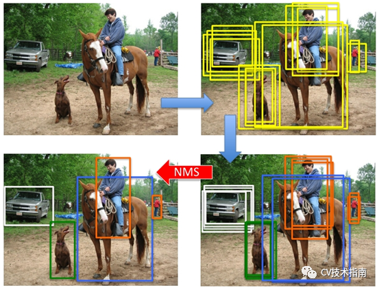

# 术语概念

## [IOU](https://zhuanlan.zhihu.com/p/141719585)

IoU 的全称为交并比（Intersection over Union）

IoU 计算的是 “预测的边框” 和 “真实的边框” 的交集和并集的比值。

## [NMS](https://blog.csdn.net/KANG157/article/details/124649838)

Non-Maximum Suppression（NMS）非极大值抑制。从字面意思理解，抑制那些非极大值的元素，保留极大值元素。其主要用于目标检测，目标跟踪，3D重建，数据挖掘等。

目前NMS常用的有标准NMS, Soft  NMS, DIOU NMS等。后续出现了新的Softer NMS，Weighted NMS等改进版。

以目标检测为例，目标检测推理过程中会产生很多检测框（A,B,C,D,E,F等），其中很多检测框都是检测同一个目标，但最终每个目标只需要一个检测框，NMS选择那个得分最高的检测框（假设是C），再将C与剩余框计算相应的IOU值，当IOU值超过所设定的阈值（普遍设置为0.5，目标检测中常设置为0.7，仅供参考），即对超过阈值的框进行抑制，抑制的做法是将检测框的得分设置为0，如此一轮过后，在剩下检测框中继续寻找得分最高的，再抑制与之IOU超过阈值的框，直到最后会保留几乎没有重叠的框。这样基本可以做到每个目标只剩下一个检测框。

## TTA

Test-Time Augmentation（TTA）测试时数据增强。

数据增强是一种在模型训练期间通常使用的方法，它使用训练数据集中修改过的样本副本来扩展训练集。

通常使用图像数据来执行数据增强，其中通过执行一些图像操作技术来创建训练数据集中的图像副本，例如缩放、翻转、移动等等。

人工扩展的训练数据集可以产生一个更熟练的模型，因为深度学习模型的性能通常会随着训练数据集的大小继续扩大。此外，训练数据集中图像的修改或增强版本可以帮助模型以不受位置、光照等影响的方式提取和学习特征。