# yolov5

yolov5（you only look once，version 5）是基于python环境，在pytorch机器学习框架上，一个开源的**目标检测**模型系列。

[yolo 结合 deepsort 实现目标跟踪](https://blog.csdn.net/Albert_yeager/article/details/129321339)

[pytorch gpu 安装](https://zhuanlan.zhihu.com/p/612181449)

# [0 初识](https://zhuanlan.zhihu.com/p/558477653)

**yolov5 tagv5.0版本代码**

```bash
git clone https://github.com/ultralytics/yolov5.git
```


## 0.1 项目结构

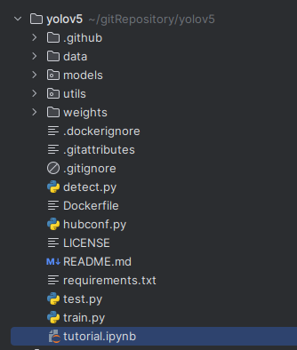

├── data：主要是存放一些超参数的配置文件（这些文件（yaml文件）是用来配置训练集和测试集还有验证集的路径的，其中还包括目标检测的种类数和种类的名称）；还有一些官方提供测试的图片。如果是训练自己的数据集的话，那么就需要修改其中的yaml文件。但是自己的数据集不建议放在这个路径下面，而是建议把数据集放到yolov5项目的同级目录下面。

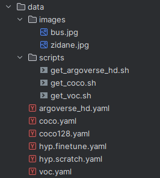

├── models：里面主要是一些网络构建的配置文件和函数，其中包含了该项目的四个不同的版本，分别为是s、m、l、x。从名字就可以看出，这几个版本的大小。他们的检测测度分别都是从快到慢，但是精确度分别是从低到高。这就是所谓的鱼和熊掌不可兼得。如果训练自己的数据集的话，就需要修改这里面相对应的yaml文件来训练自己模型。

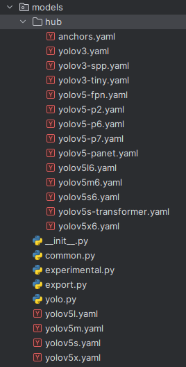

├── utils：存放的是工具类的函数，里面有loss函数，metrics函数，plots函数等等。

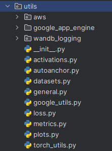

├── weights：放置训练好的权重参数。

- 里面存放了一个download_weights.sh，可以通过sh去下载权重。

- 也可以手动去下载，权重下载地址：https://github.com/ultralytics/yolov5/releases/tag/v7.0

- ```bash
  https://github.com/ultralytics/yolov5/releases/download/v7.0/yolov5m.pt
  ```

├── detect.py：利用训练好的权重参数进行目标检测，可以进行图像、视频和摄像头的检测。

├── train.py：训练自己的数据集的函数。

├── test.py：测试训练的结果的函数。

├──requirements.txt：这是一个文本文件，里面写着使用yolov5项目的环境依赖包的一些版本，可以利用该文本导入相应版本的包。

## 0.2 [GPU环境搭建](https://blog.csdn.net/qq_53357019/article/details/125725702)

### 0.2.1 安装nvidia显卡驱动、cuda toolkit、cudnn


**CUDA Toolkit** 是用于开发和运行基于 CUDA 的应用程序的软件包。它包含了编译器、库、工具和示例等组件，用于编写、构建和优化 CUDA 应用程序。CUDA Toolkit 还提供了与 GPU 相关的驱动程序和运行时库，以便在系统上正确配置和管理 GPU。这个库的主要目的是帮你封装好了很多的操作这个gpu ，也就是操作这个 cuda 驱动的库。

**cuDNN（CUDA Deep Neural Network library）**是 NVIDIA 为深度学习框架提供的加速库。它为深度神经网络的训练和推理提供了高性能的 GPU 加速支持。cuDNN 提供了一系列优化的算法和函数，用于加速卷积、池化、归一化等常用的深度学习操作。它与 CUDA 和 CUDA Toolkit 配合使用，提供了对深度学习框架（如TensorFlow、PyTorch等）的 GPU 加速能力。

[nvidia 显卡驱动 安装最顺的教程](https://zhuanlan.zhihu.com/p/302692454)，推荐查看

[选择显卡驱动版本和toolkit版本下载，不含安装报错的显卡驱动安装教程](https://blog.csdn.net/weixin_39928010/article/details/131142603)

[ubuntu cudnn 安装](https://blog.csdn.net/shanglianlm/article/details/130219640)

### 0.2.2 python 环境安装

[解决torch安装缓慢失败及其他安装包快速下载方法](https://blog.csdn.net/qq_35207086/article/details/123482458)

```bash
# 安装有些包的时候，很慢，可以通过清华源的方式修改
pip install -i https://pypi.tuna.tsinghua.edu.cn/simple torch==2.0.1

#（1）阿里云     https://mirrors.aliyun.com/pypi/simple/
#（2）豆瓣     https://pypi.douban.com/simple/
#（3）清华大学     https://pypi.tuna.tsinghua.edu.cn/simple/
#（4）中国科学技术大学     https://pypi.mirrors.ustc.edu.cn/simple/
#（5）华中科技大学  https://pypi.hustunique.com/
```


```bash
# 创建一个沙箱，python 大于等于3.8
conda create -n yolov5 python=3.10

conda activate yolov5
# 下载yolov5源代码库
git clone https://github.com/ultralytics/yolov5.git

cd yolov5

# 
pip install -r requirements.txt		# -U参数不用指定	
# -U：-U, --upgrade            Upgrade all specified packages to the newest available version. The handling of dependencies depends on the upgrade-strategy used.
# -r, --requirement <file>    Install from the given requirements file. This option can be used multiple times.

```


## 0.3 coco数据集

```bash
# coco
wget http://images.cocodataset.org/zips/train2017.zip	# 19G, 118k images
wget http://images.cocodataset.org/zips/val2017.zip		# 1G, 5k images
wget http://images.cocodataset.org/zips/test2017.zip	# 7G, 41k images
wget https://github.com/ultralytics/yolov5/releases/download/v1.0/coco2017labels.zip	# 数据的标签，解压上面的图片到此label文件夹内。

# coco128，从train2017随即选取的128张图片
https://github.com/ultralytics/yolov5/releases/download/v1.0/coco128.zip

# 下载yolov5对应代码的版本tag版本，在这里我们用的时tag v5.0版本
https://github.com/ultralytics/yolov5/releases/download/v5.0/yolov5s.
https://github.com/ultralytics/yolov5/releases/download/v5.0/yolov5m.pt
https://github.com/ultralytics/yolov5/releases/download/v5.0/yolov5l.pt
https://github.com/ultralytics/yolov5/releases/download/v5.0/yolov5x.pt
```

# 1 全流程

## 1.1 标注数据

需要在有界面的主机上安装，远程ssh无法使用窗口

```bash
# 安装
pip install labelImg
# 启动
labelImg
```

标注

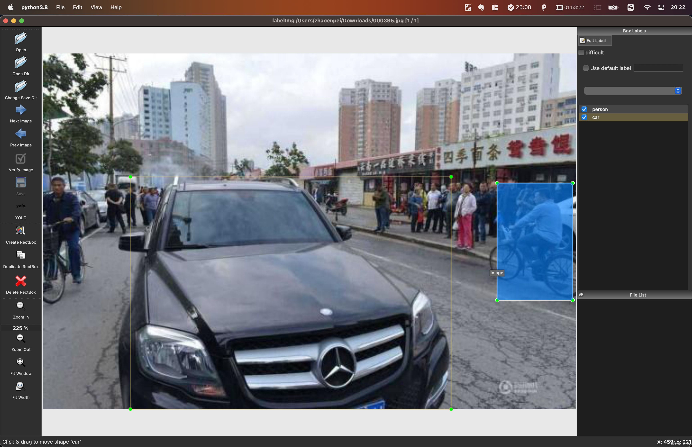

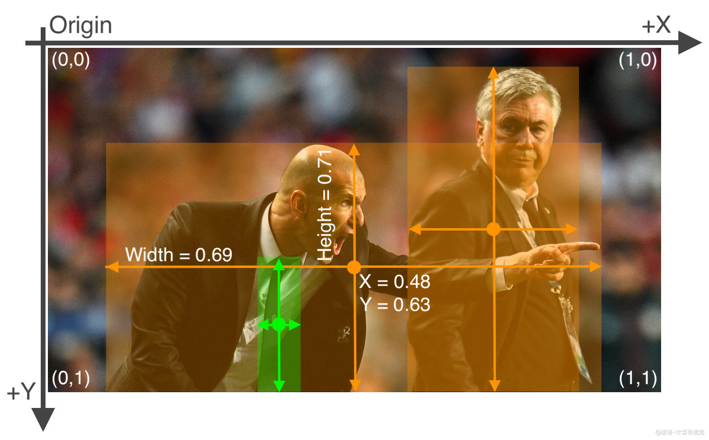

- 一张图片对应一个txt标注文件（如果图中无所要物体，则无需txt文件）；
- txt每行一个物体（一张图中可以有多个标注）；
- 每行数据格式：`类别id、x_center y_center width height`；
- **xywh**必须归一化（0-1），其中`x_center、width`除以图片宽度，`y_center、height`除以画面高度；
- 类别id必须从0开始计数。

## 1.2 准备数据集

### 数据集结构与存放位置

```bash
. 工作路径
├── datasets
│   └── person_data
│       ├── images
│       │   ├── train
│       │   │   └── demo_001.jpg
│       │   └── val
│       │       └── demo_002.jpg
│       └── labels
│           ├── train
│           │   └── demo_001.txt
│           └── val
│               └── demo_002.txt
└── yolov5
```

**要点：**

- `datasets`与`yolov5`同级目录；
- 图片 `datasets/person_data/images/train/{文件名}.jpg`对应的标注文件在 `datasets/person_data/labels/train/{文件名}.txt`，YOLO会根据这个映射关系自动寻找（`images`换成`labels`）；
- 训练集和验证集
  - `images`文件夹下有`train`和`val`文件夹，分别放置训练集和验证集图片;
  - `labels`文件夹有`train`和`val`文件夹，分别放置训练集和验证集标签(yolo格式）;

###  创建数据集的配置文件

复制`yolov5/data/coco128.yaml`一份，比如为`coco_person.yaml`

```yaml
# Train/val/test sets as 1) dir: path/to/imgs, 2) file: path/to/imgs.txt, or 3) list: [path/to/imgs1, path/to/imgs2, ..]
path: ../datasets/person_data  # 数据所在目录
train: images/train  # 训练集图片所在位置（相对于path）
val:  images/val # 验证集图片所在位置（相对于path）
test:  # 测试集图片所在位置（相对于path）（可选）

# 类别
nc: 5  # 类别数量
names: ['pedestrians','riders','partially-visible-person','ignore-regions','crowd'] # 类别标签名
```

## 1.3 训练

```bash
# 切换yolov5到指定分支
git checkout a80dd66efe0bc7fe3772f259260d5b7278aab42f
# 查看当前版本
git log -1 --pretty=format:"%h"
```


### 选择并创建模型的配置文件

> 官方权重下载地址：https://github.com/ultralytics/yolov5

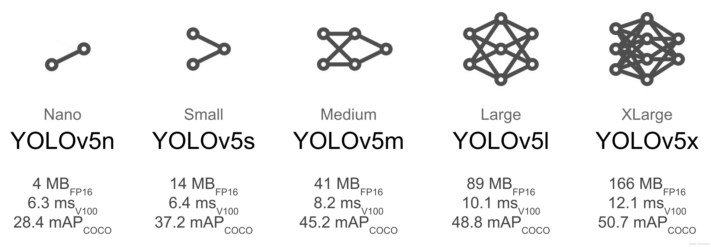

根据你的设备，选择合适的预训练模型，具体模型比对如下：

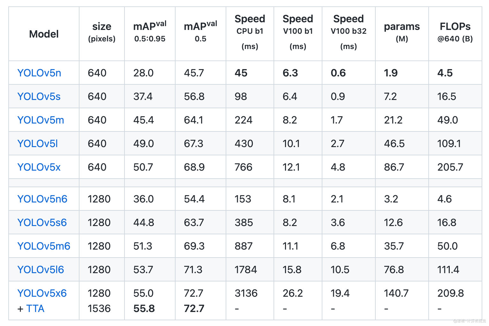

复制`models`下对应模型的`yaml`文件，重命名，比如课程另存为`yolov5s_person.yaml`，并修改其中：

```shell
# nc: 80  # 类别数量
nc: 5  # number of classes
```

### 训练

下载对应的预训练模型权重文件，可以放到`weights`目录下，设置本机最好性能的各个参数，即可开始训练，课程中训练了以下参数：

```shell
# yolov5s 
python ./train.py --data ./data/coco_person.yaml --cfg ./models/yolov5s_person.yaml --weights ./weights/yolov5s.pt --batch-size 16 --epochs 120 --workers 0 --name s_120 --project yolo_person_s
```

> 更多参数见`train.py`；
>
> 训练结果在`yolo_person_s/`中可见，一般训练时间在几个小时以上。

建议gpu内存小的机器，batch-size选择16及以下的数值（4的倍数），过大会导致相关问题，导致训练过程中断

如以下：

1. RuntimeError: cuDNN error: CUDNN_STATUS_NOT_INITIALIZED
2. torch.cuda.OutOfMemoryError: CUDA out of memory. Tried to allocate 14.00 MiB (GPU 0; 5.79 GiB total capacity; 4.79 GiB already allocated; 52.69 MiB free; 4.88 GiB reserved in total by PyTorch) If reserved memory is >> allocated memory try setting max_split_size_mb to avoid fragmentation.  See documentation for Memory Management and PYTORCH_CUDA_ALLOC_CONF
3. 

### 训练过程可视化

#### wandb

YOLO官网推荐使用https://wandb.ai/。

- 去官网注册账号；
- 获取`key`秘钥，地址：https://wandb.ai/authorize
- 使用`pip install wandb`安装包；
- 使用`wandb login`粘贴秘钥后登录；
- 打开网站即可查看训练进展。

```bash
pip install wandb
```

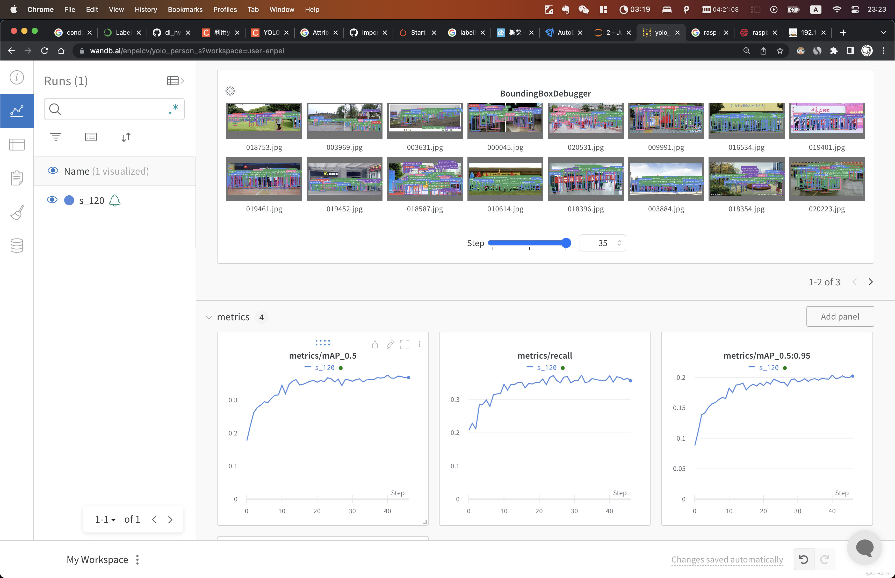

#### tensorboard

```bash
tensorboard --logdir=./yolo_person_s
```

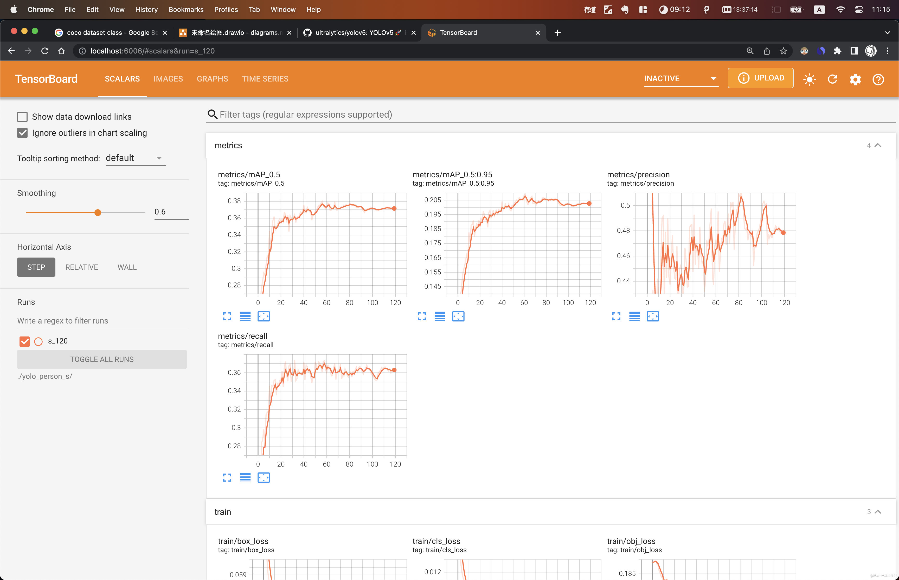


## 1.4 测试与评估

### 测试

```bash
# 如                                                         
python detect.py --source ./000057.jpg --weights ./yolo_person_s/s_120/weights/best.pt --conf-thres 0.3
# 或
python detect.py --source ./c3.mp4 --weights ./yolo_person_s/s_120/weights/best.pt --conf-thres 0.3
```

### 评估

```bash
python val.py --data  ./data/coco_person.yaml  --weights ./yolo_person_s/s_120/weights/best.pt --batch-size 12

val: data=./data/coco_person.yaml, weights=['./yolo_person_s/s_1203/weights/best.pt'], batch_size=12, imgsz=640, conf_thres=0.001, iou_thres=0.6, max_det=300, task=val, device=, workers=8, single_cls=False, augment=False, verbose=False, save_txt=False, save_hybrid=False, save_conf=False, save_json=False, project=runs/val, name=exp, exist_ok=False, half=False, dnn=False
YOLOv5 🚀 v7.0-212-g9974d51 Python-3.9.17 torch-2.0.1+cu117 CUDA:0 (NVIDIA GeForce GTX 1660 SUPER, 5928MiB)

Fusing layers... 
YOLOv5s_person summary: 157 layers, 7023610 parameters, 0 gradients, 15.8 GFLOPs
val: Scanning /home/buntu/gitRepository/yoloXXX/datasets/person_data/labels/val.cache... 1000 images, 0 backgrounds, 0 corrupt: 100%|██████████| 1000/1000 [00:00<?, ?it/s]
                 Class     Images  Instances          P          R      mAP50   mAP50-95:   2%|▏         | 2/84 [00:02<01:40,  1.22s/it]WARNING ⚠️ NMS time limit 1.100s exceeded
                 Class     Images  Instances          P          R      mAP50   mAP50-95: 100%|██████████| 84/84 [00:12<00:00,  6.58it/s]
                   all       1000      28423      0.508      0.366      0.379      0.205
           pedestrians       1000      17833      0.754      0.836      0.872      0.605
                riders       1000        185      0.609      0.492      0.495      0.237
partially-visible persons       1000       9335      0.509      0.322      0.341      0.124
        ignore regions       1000        409      0.428      0.144      0.154     0.0528
                 crowd       1000        661      0.242     0.0358     0.0312    0.00788
Speed: 0.1ms pre-process, 6.5ms inference, 3.3ms NMS per image at shape (12, 3, 640, 640)
Results saved to runs/val/exp2
```

## 1.5 导出onnx

```bash
pip install onnx

# 如果torch是GPU版本，就可以安装onnxruntime-gpu
# 检查torch是什么版本，进入python的命令交互式环境
import torch
torch.__version__				# 如果是2.0.1+cu117，就是GPU版本
torch.cuda.is_available()		# 查看cuda是否可用
torch.cuda.get_device_name(0)	# 查看gpu设备名称

# 如果pytorch是CPU版本就不能安装onnxruntime的gpu版本
# GPU版本
pip install onnxruntime-gpu==1.16    #（本人cuda12.2.，安装1.16可用）
# CPU版本
pip install onnxruntime   

# 验证onnxruntime GPU版本是否可用
import onnxruntime
onnxruntime.get_device()
onnxruntime.get_available_providers()
```


在本项目中，我们将使用`tensort decode plugin`来代替原来yolov5代码中的decode操作，如果不替换，这部分运算将影响整体性能。

为了让`tensorrt`能够识别并加载我们额外添加的`plugin operator`，我们需要修改Yolov5代码中导出onnx模型的部分。

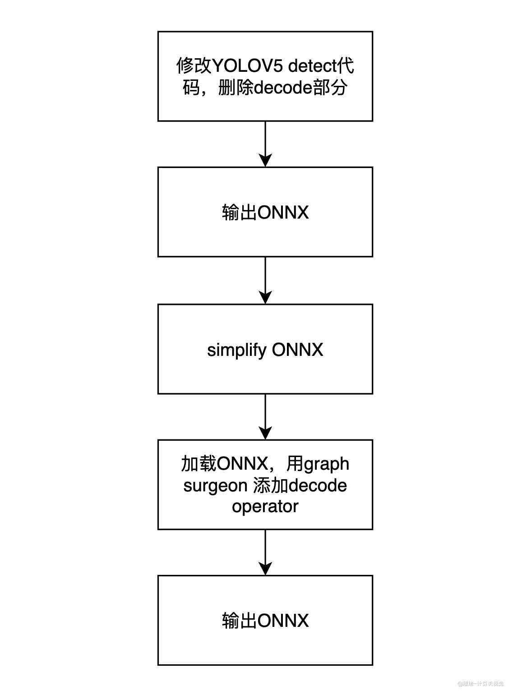

### 1.5.1 修改yolov5 decode部分代码

将训练后的模型（项目名/s_xxx/weights/best.pt）移动重命名到weights/yolov5s_person.pt

```bash
# 用于导出onnx时，对模型进行简化
pip install onnx-simplifier  # >= 0.3.10
# 用于可视化onnx模型结构
pip install netron

# seaborn是python中的一个可视化库，是对matplotlib进行二次封装而成
pip install seaborn
# onnx的手术刀工具，可改变网络结构
pip install onnx-graphsurgeon

apt update
apt install -y libgl1-mesa-glx		# opengl的图形依赖包

# 修改之前，建议先使用export.py 导出一份原始操作的onnx模型，以便和修改后的模型进行对比。
python export.py --weights weights/yolov5s_person.pt --include onnx --simplify --dynamic
# 可视化原始的模型
netron ./weights/yolov5s_person.onnx
```

```bash
# 通过git的补丁，修改export.py
git am export.patch
# 可以下来仔细研究export的变化

# 然后导出修改后的网络
python export.py --weights weights/yolov5s_person.pt --include onnx --simplify --dynamic
```

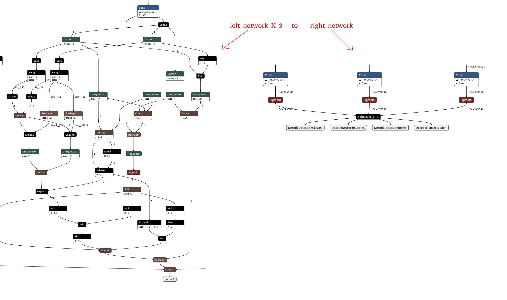

### 1.5.2 具体修改细节

在`models/yolo.py`文件中54行，我们需要修改`class Detect`的forward方法，以删除其box decode运算，以直接输出网络结果。在后面的tensorrt部署中，我们将利用decode plugin来进行decode操作，并用gpu加速。修改内容如下：

```python
-            bs, _, ny, nx = x[i].shape  # x(bs,255,20,20) to x(bs,3,20,20,85)
-            x[i] = x[i].view(bs, self.na, self.no, ny, nx).permute(0, 1, 3, 4, 2).contiguous()
-
-            if not self.training:  # inference
-                if self.onnx_dynamic or self.grid[i].shape[2:4] != x[i].shape[2:4]:
-                    self.grid[i], self.anchor_grid[i] = self._make_grid(nx, ny, i)
-
-                y = x[i].sigmoid()
-                if self.inplace:
-                    y[..., 0:2] = (y[..., 0:2] * 2 + self.grid[i]) * self.stride[i]  # xy
-                    y[..., 2:4] = (y[..., 2:4] * 2) ** 2 * self.anchor_grid[i]  # wh
-                else:  # for YOLOv5 on AWS Inferentia https://github.com/ultralytics/yolov5/pull/2953
-                    xy, wh, conf = y.split((2, 2, self.nc + 1), 4)  # y.tensor_split((2, 4, 5), 4)  # torch 1.8.0
-                    xy = (xy * 2 + self.grid[i]) * self.stride[i]  # xy
-                    wh = (wh * 2) ** 2 * self.anchor_grid[i]  # wh
-                    y = torch.cat((xy, wh, conf), 4)
-                z.append(y.view(bs, -1, self.no))
-
-        return x if self.training else (torch.cat(z, 1),) if self.export else (torch.cat(z, 1), x)
+            y = x[i].sigmoid()
+            z.append(y)
+        return z
```

可以看到这里删除了主要的运算部分，将模型输出直接作为list返回。修改后，onnx的输出将被修改为三个原始网络输出，我们需要在输出后添加decode plugin的算子。首先我们先导出onnx，再利用nvidia的graph surgeon来修改onnx。首先我们修改onnx export部分代码：

> GraphSurgeon 是nvidia提供的工具，可以方便的用于修改、添加或者删除onnx网络图中的节点，并生成新的onnx。参考链接：https://github.com/NVIDIA/TensorRT/tree/master/tools/onnx-graphsurgeon。

```python
torch.onnx.export(
        model,
        im,
        f,
        verbose=False,
        opset_version=opset,
        training=torch.onnx.TrainingMode.TRAINING if train else torch.onnx.TrainingMode.EVAL,
        do_constant_folding=not train,
        input_names=['images'],
        output_names=['p3', 'p4', 'p5'],
        dynamic_axes={
            'images': {
                0: 'batch',
                2: 'height',
                3: 'width'},  # shape(1,3,640,640)
            'p3': {
                0: 'batch',
                2: 'height',
                3: 'width'},  # shape(1,25200,4)
            'p4': {
                0: 'batch',
                2: 'height',
                3: 'width'},
            'p5': {
                0: 'batch',
                2: 'height',
                3: 'width'}
        } if dynamic else None)
```

将onnx的输出改为3个原始网络输出。输出完成后，我们再加载onnx，并simplify：

```python
model_onnx = onnx.load(f)
model_onnx = onnx.load(f)  # load onnx model
onnx.checker.check_model(model_onnx)  # check onnx model

# Simplify
if simplify:
    # try:
    check_requirements(('onnx-simplifier',))
    import onnxsim

    LOGGER.info(f'{prefix} simplifying with onnx-simplifier {onnxsim.__version__}...')
    model_onnx, check = onnxsim.simplify(model_onnx,
        dynamic_input_shape=dynamic,
        input_shapes={'images': list(im.shape)} if dynamic else None)
    assert check, 'assert check failed'
    onnx.save(model_onnx, f)
```

然后我们再将onnx加载回来，用nvidia surgeon进行修改:

```python
import onnx_graphsurgeon as onnx_gs
import numpy as np
yolo_graph = onnx_gs.import_onnx(model_onnx)
```

首先我们获取原始的onnx输出p3,p4,p5：

```python
p3 = yolo_graph.outputs[0]
p4 = yolo_graph.outputs[1]
p5 = yolo_graph.outputs[2]
```

然后我们定义新的onnx输出，由于decode plugin中，有4个输出，所以我们将定义4个新的输出。其名字需要和下面的代码保持一致，这是decode_plugin中预先定义好的。

```python
decode_out_0 = onnx_gs.Variable(
  "DecodeNumDetection",
  dtype=np.int32
)
decode_out_1 = onnx_gs.Variable(
  "DecodeDetectionBoxes",
  dtype=np.float32
)
decode_out_2 = onnx_gs.Variable(
  "DecodeDetectionScores",
  dtype=np.float32
)
decode_out_3 = onnx_gs.Variable(
  "DecodeDetectionClasses",
  dtype=np.int32
)
```

然后我们需要再添加一些decode参数，定义如下：

```python
decode_attrs = dict()

decode_attrs["max_stride"] = int(max(model.stride))
decode_attrs["num_classes"] = model.model[-1].nc
decode_attrs["anchors"] = [float(v) for v in [10,13, 16,30, 33,23, 30,61, 62,45, 59,119, 116,90, 156,198, 373,326]]
decode_attrs["prenms_score_threshold"] = 0.25
```

在定义好了相关参数后，我们创建一个onnx node，用作decode plugin。由于我们的tensorrt plugin的名称为`YoloLayer_TRT`,因此这里我们需要保持op的名字与我们的plugin名称一致。通过如下代码，我们创建了一个node：

```python
decode_plugin = onnx_gs.Node(
        op="YoloLayer_TRT",
        name="YoloLayer",
        inputs=[p3, p4, p5],
        outputs=[decode_out_0, decode_out_1, decode_out_2, decode_out_3],
        attrs=decode_attrs
    )
```

然后我们将这个node添加了网络中：

```python
yolo_graph.nodes.append(decode_plugin)
    yolo_graph.outputs = decode_plugin.outputs
    yolo_graph.cleanup().toposort()
    model_onnx = onnx_gs.export_onnx(yolo_graph)
```

最后添加一些meta信息后，我们导出最终的onnx文件，这个文件可以用于后续的tensorrt部署和推理。

```python
d = {'stride': int(max(model.stride)), 'names': model.names}
    for k, v in d.items():
        meta = model_onnx.metadata_props.add()
        meta.key, meta.value = k, str(v)

    onnx.save(model_onnx, f)
    LOGGER.info(f'{prefix} export success, saved as {f} ({file_size(f):.1f} MB)')
    return f
```

## 1.6 TensorRT部署

### 1.6.1 模型构建 

```c++
#include "NvInfer.h"
#include "NvOnnxParser.h" // onnxparser头文件
#include "logger.h"
#include "common.h"
#include "buffers.h"
#include "cassert"
#include "./utils/common_utils.h"

// main函数
int main(int argc, char **argv)
{
    if (argc != 3)
    {
        std::cerr << "用法: ./build [input_onnx_file_name] [output_file_name]" << std::endl;
        return -1;
    }
    char cwd[128] = {0};
    utils::getExeWd(cwd,128);


    // 命令行获取onnx文件路径
    std::string onnx_file_path = std::string(cwd) + "/weights/" + argv[1];
    std::string engine_file_path = std::string(cwd) + "/weights/" + argv[2];
    std::cout<< "onnx_file_path："<< onnx_file_path << std::endl;
    std::cout<< "engine_file_path："<< engine_file_path << std::endl;

    // =========== 1. 创建builder ===========
    auto builder = std::unique_ptr<nvinfer1::IBuilder>(nvinfer1::createInferBuilder(sample::gLogger.getTRTLogger()));
    if (!builder)
    {
        std::cerr << "Failed to create builder" << std::endl;
        return -1;
    }

    // ========== 2. 创建network：builder--->network ==========
    // 显性batch
    const auto explicitBatch = 1U << static_cast<uint32_t>(nvinfer1::NetworkDefinitionCreationFlag::kEXPLICIT_BATCH);
    // 调用builder的createNetworkV2方法创建network
    auto network = std::unique_ptr<nvinfer1::INetworkDefinition>(builder->createNetworkV2(explicitBatch));
    if (!network)
    {
        std::cout << "Failed to create network" << std::endl;
        return -1;
    }
    // 与上节课手动创建网络不同，这次使用onnxparser创建网络

    // 创建onnxparser，用于解析onnx文件
    auto parser = std::unique_ptr<nvonnxparser::IParser>(nvonnxparser::createParser(*network, sample::gLogger.getTRTLogger()));
    // 调用onnxparser的parseFromFile方法解析onnx文件
    auto parsed = parser->parseFromFile(onnx_file_path.c_str(), static_cast<int>(sample::gLogger.getReportableSeverity()));
    if (!parsed)
    {
        std::cout << "Failed to parse onnx file" << std::endl;
        return -1;
    }
    // 配置网络参数
    // 我们需要告诉tensorrt我们最终运行时，输入图像的范围，batch size的范围。这样tensorrt才能对应为我们进行模型构建与优化。
    auto input = network->getInput(0);                                                                             // 获取输入节点
    auto profile = builder->createOptimizationProfile();                                                           // 创建profile，用于设置输入的动态尺寸
    profile->setDimensions(input->getName(), nvinfer1::OptProfileSelector::kMIN, nvinfer1::Dims4{1, 3, 640, 640}); // 设置最小尺寸
    profile->setDimensions(input->getName(), nvinfer1::OptProfileSelector::kOPT, nvinfer1::Dims4{1, 3, 640, 640}); // 设置最优尺寸
    profile->setDimensions(input->getName(), nvinfer1::OptProfileSelector::kMAX, nvinfer1::Dims4{1, 3, 640, 640}); // 设置最大尺寸

    // ========== 3. 创建config配置：builder--->config ==========
    auto config = std::unique_ptr<nvinfer1::IBuilderConfig>(builder->createBuilderConfig());
    if (!config)
    {
        std::cout << "Failed to create config" << std::endl;
        return -1;
    }
    // 使用addOptimizationProfile方法添加profile，用于设置输入的动态尺寸
    config->addOptimizationProfile(profile);

    // 设置精度，不设置是FP32，设置为FP16，设置为INT8需要额外设置calibrator 
    config->setFlag(nvinfer1::BuilderFlag::kFP16);
    // 设置最大batchsize
    builder->setMaxBatchSize(1);
    // 设置最大工作空间（新版本的TensorRT已经废弃了setWorkspaceSize）
    config->setMemoryPoolLimit(nvinfer1::MemoryPoolType::kWORKSPACE, 1 << 30);

    // 创建流，用于设置profile
    auto profileStream = samplesCommon::makeCudaStream();
    if (!profileStream)
    {
        return -1;
    }
    config->setProfileStream(*profileStream);

    // ========== 4. 创建engine：builder--->engine(*nework, *config) ==========
    // 使用buildSerializedNetwork方法创建engine，可直接返回序列化的engine（原来的buildEngineWithConfig方法已经废弃，需要先创建engine，再序列化）
    auto plan = std::unique_ptr<nvinfer1::IHostMemory>(builder->buildSerializedNetwork(*network, *config));
    if (!plan)
    {
        std::cout << "Failed to create engine" << std::endl;
        return -1;
    }

    // ========== 5. 序列化保存engine ==========

    std::ofstream engine_file(engine_file_path, std::ios::binary);
    assert(engine_file.is_open() && "Failed to open engine file");
    engine_file.write((char *)plan->data(), plan->size());
    engine_file.close();

    // ========== 6. 释放资源 ==========
    // 因为使用了智能指针，所以不需要手动释放资源

    std::cout << "Engine build success!" << std::endl;

    return 0;
}
```


### 1.6.2 运行时构建

```c++
#include "NvInfer.h"
#include "NvOnnxParser.h"
#include "logger.h"
#include "common.h"
#include "buffers.h"
#include "utils/preprocess.h"
#include "utils/postprocess.h"
#include "utils/types.h"
#include "./utils/common_utils.h"

// 加载模型文件
std::vector<unsigned char> load_engine_file(const std::string &file_name)
{
    std::vector<unsigned char> engine_data;
    std::ifstream engine_file(file_name, std::ios::binary);
    assert(engine_file.is_open() && "Unable to load engine file.");
    engine_file.seekg(0, engine_file.end);
    int length = engine_file.tellg();
    engine_data.resize(length);
    engine_file.seekg(0, engine_file.beg);
    engine_file.read(reinterpret_cast<char *>(engine_data.data()), length);
    return engine_data;
}

int main(int argc, char **argv)
{
    if (argc < 3)
    {
        std::cerr << "用法: " << argv[0] << " <engine_file> <input_path_path>" << std::endl;
        return -1;
    }
    char cwd[128] = {0};
    utils::getExeWd(cwd,128);

    auto engine_file = std::string(cwd) + "/weights/" + argv[1];      // 模型文件
    auto input_video_path = std::string(cwd) + "/media/" + argv[2]; // 输入视频文件
    auto output_video_path = std::string(cwd) + "/media/" + std::to_string(utils::timeu::getSecTimeStamp()) + ".mp4";
    std::cout<< "engine_file: "<< engine_file << std::endl;
    std::cout<< "input_video_path："<< input_video_path << std::endl;
    std::cout<< "output_video_path："<< output_video_path << std::endl;


    // ========= 1. 创建推理运行时runtime =========
    auto runtime = std::unique_ptr<nvinfer1::IRuntime>(nvinfer1::createInferRuntime(sample::gLogger.getTRTLogger()));
    if (!runtime)
    {
        std::cout << "runtime create failed" << std::endl;
        return -1;
    }
    // ======== 2. 反序列化生成engine =========
    // 加载模型文件
    auto plan = load_engine_file(engine_file);
    // 反序列化生成engine
    auto mEngine = std::shared_ptr<nvinfer1::ICudaEngine>(runtime->deserializeCudaEngine(plan.data(), plan.size()));
    if (!mEngine)
    {
        return -1;
    }

    // ======== 3. 创建执行上下文context =========
    auto context = std::unique_ptr<nvinfer1::IExecutionContext>(mEngine->createExecutionContext());
    if (!context)
    {
        std::cout << "context create failed" << std::endl;
        return -1;
    }

    // ========== 4. 创建输入输出缓冲区 =========
    samplesCommon::BufferManager buffers(mEngine);

    auto cap = cv::VideoCapture(input_video_path);

    int width = int(cap.get(cv::CAP_PROP_FRAME_WIDTH));
    int height = int(cap.get(cv::CAP_PROP_FRAME_HEIGHT));
    int fps = int(cap.get(cv::CAP_PROP_FPS));

    // 写入MP4文件，参数分别是：文件名，编码格式，帧率，帧大小
    cv::VideoWriter writer(output_video_path, cv::VideoWriter::fourcc('H', '2', '6', '4'), fps, cv::Size(width, height));

    cv::Mat frame;
    int frame_index{0};
    // 申请gpu内存
    cuda_preprocess_init(height * width);

    while (cap.isOpened())
    {
        // 统计运行时间
        auto start = std::chrono::high_resolution_clock::now();

        cap >> frame;
        if (frame.empty())
        {
            std::cout << "文件处理完毕" << std::endl;
            break;
        }
        frame_index++;

        // 输入预处理（实现了对输入图像处理的gpu 加速)
        process_input(frame, (float *)buffers.getDeviceBuffer(kInputTensorName));
        // ========== 5. 执行推理 =========
        context->executeV2(buffers.getDeviceBindings().data());
        // 拷贝回host
        buffers.copyOutputToHost();

        // 从buffer manager中获取模型输出
        int32_t *num_det = (int32_t *)buffers.getHostBuffer(kOutNumDet); // 检测到的目标个数
        int32_t *cls = (int32_t *)buffers.getHostBuffer(kOutDetCls);     // 检测到的目标类别
        float *conf = (float *)buffers.getHostBuffer(kOutDetScores);     // 检测到的目标置信度
        float *bbox = (float *)buffers.getHostBuffer(kOutDetBBoxes);     // 检测到的目标框
        // 执行nms（非极大值抑制），得到最后的检测框
        std::vector<Detection> bboxs;
        yolo_nms(bboxs, num_det, cls, conf, bbox, kConfThresh, kNmsThresh);

        // 结束时间
        auto end = std::chrono::high_resolution_clock::now();
        auto elapsed = std::chrono::duration_cast<std::chrono::milliseconds>(end - start).count();
        auto time_str = std::to_string(elapsed) + "ms";
        auto fps_str = std::to_string(1000 / elapsed) + "fps";

        // 遍历检测结果
        for (size_t j = 0; j < bboxs.size(); j++)
        {
            cv::Rect r = get_rect(frame, bboxs[j].bbox);
            cv::rectangle(frame, r, cv::Scalar(0x27, 0xC1, 0x36), 2);
            cv::putText(frame, std::to_string((int)bboxs[j].class_id), cv::Point(r.x, r.y - 10), cv::FONT_HERSHEY_PLAIN, 1.2, cv::Scalar(0x27, 0xC1, 0x36), 2);
        }
        cv::putText(frame, time_str, cv::Point(50, 50), cv::FONT_HERSHEY_PLAIN, 1.2, cv::Scalar(0xFF, 0xFF, 0xFF), 2);
        cv::putText(frame, fps_str, cv::Point(50, 100), cv::FONT_HERSHEY_PLAIN, 1.2, cv::Scalar(0xFF, 0xFF, 0xFF), 2);

        // cv::imshow("frame", frame);
        // 写入视频文件
        writer.write(frame);
        std::cout << "处理完第" << frame_index << "帧" << std::endl;
        if (cv::waitKey(1) == 27)
            break;
    }
    // ========== 6. 释放资源 =========
    // 因为使用了unique_ptr，所以不需要手动释放

    return 0;
}

```

### 1.6.3 量化

深度学习量化就是将深度学习模型中的参数（例如权重和偏置）从浮点数转换成整数或者定点数的过程。这样做可以减少模型的存储和计算成本，从而达到模型压缩和运算加速的目的。如int8量化，让原来模型中32bit存储的数字**映射**到8bit再计算（范围是[-128,127]）。

- 加快推理速度：访问一次32位浮点型可以访问4次int8整型数据；
- 减少存储空间和内存占用：在边缘设备（如嵌入式）上部署更实用。

当然，提升速度的同时，量化也会带来**精度的损失**，为了能尽可能减少量化过程中精度的损失，需要使用各种校准方法来降低信息的损失。TensorRT 中支持两种 INT8 校准算法：

- 熵校准 (Entropy Calibration)
- 最小最大值校准 (Min-Max Calibration)

> 熵校准是一种动态校准算法，它使用 KL 散度 (KL Divergence) 来度量推理数据和校准数据之间的分布差异。在熵校准中，校准数据是从实时推理数据中采集的，它将 INT8 精度量化参数看作概率分布，根据推理数据和校准数据的 KL 散度来更新量化参数。这种方法的优点是可以更好地反映实际推理数据的分布。
>
> 最小最大值校准使用最小最大值算法来计算量化参数。在最小最大值校准中，需要使用一组代表性的校准数据来生成量化参数，首先将推理中的数据进行统计，计算数据的最小值和最大值，然后根据这些值来计算量化参数。

这两种校准方法都需要准备一些数据用于在校准时执行推理，以统计数据的分布情况。**一般数据需要有代表性，即需要符合最终实际落地场景的数据。**实际应用中一般准备500-1000个数据用于量化。

#### TensorRT中实现

在 TensorRT 中，可以通过实现 `IInt8EntropyCalibrator2` 接口或 `IInt8MinMaxCalibrator` 接口来执行熵校准或最小最大值校准，并且需要实现几个虚函数方法：

- `getBatch() `方法：用于提供一批校准数据；
- `readCalibrationCache()` 和 `writeCalibrationCache()` 方法：实现缓存机制，以避免在每次启动时重新加载校准数据。

##### 构造推理数据

```bash
# 进入media目录，在视频中随机挑选200帧画面作为校准图片
# 从视频中生成图片
ffmpeg -i c3.mp4 sample%04d.png
# 从生成的图片中挑选200张，并将名字写入txt中
ls *.png | shuf -n 200 > filelist.txt
```

### 1.6.4 预处理

Yolov5图像预处理步骤主要如下：

1. **lettorbox**：即保持原图比例（图像直接resize到输入大小效果不好），将图片放在一个正方形的画布中，多余的部分用黑色填充。
2. **Normalization（归一化）**：将像素值缩放至`[0,1]`间；
3. **颜色通道顺序调整**：BGR2RGB
4. **NHWC 转为 NCHW**


### 1.6.5 后处理

非极大值抑制

# log

1. [运行yolov5-5.0出现AttributeError: Can‘t get attribute ‘SPPF‘ 正确解决方法](https://blog.csdn.net/qq_41035097/article/details/122884652)

   - weight预置权重版本和实际yolov5的tag不匹配
   - 不能用weight 7.0 给yolov5 tagv5.0来训练

2. [AttributeError: module numpy has no attribute int .报错解决方案](https://blog.csdn.net/weixin_46669612/article/details/129624331)

   - 官方给出的numpy的版本要求时>=1.18.5，而[numpy](https://so.csdn.net/so/search?q=numpy&spm=1001.2101.3001.7020).int在[NumPy](https://so.csdn.net/so/search?q=NumPy&spm=1001.2101.3001.7020) 1.20中已弃用，在NumPy 1.24中已删除。
   - 重装numpy：pip install numpy==1.22

3. [RuntimeError: result type Float can‘t be cast to the desired output type long int](https://blog.csdn.net/bu_fo/article/details/130336910)

   ```python
   # loss.py出问题
   indices.append((b, a, gj.clamp_(0, gain[3] - 1), gi.clamp_(0, gain[2] - 1)))  # image, anchor, grid indices
   # 解决
   indices.append((b, a, gj.clamp_(0, gain[3].long() - 1), gi.clamp_(0, gain[2].long() - 1)))  # image, anchor, grid indices
   ```

4. 在运行执行build engine时，报Error Code 6: Internal Error (Unable to load library: libnvinfer_builder_resource.so.8.6.1，[可以参考自己的文章](https://blog.csdn.net/qq_42190134/article/details/135339907)

   - `sudo cp libnvinfer_builder_resource.so.8.6.1 /usr/lib/`

5. 根据GPU剩余内存选择GPU设备

   - 一定要记得在cudaSetDevice之后，cudaDeviceReset一下，否则每个设备都会留下上下文内存占用（一个进程运行在多个gpu上）
   - 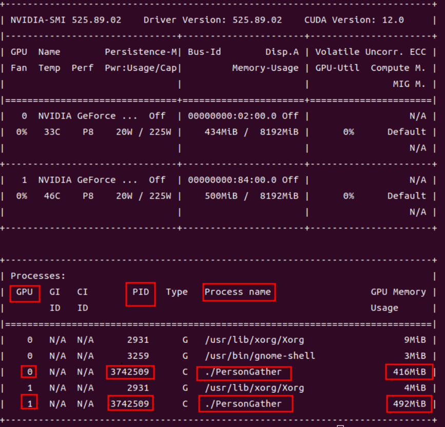

   ```c++
   bool YOLOV8::chooseGPUDeviceWithMemory(int GpuMemoryUsage) {
       int deviceCount = 0;
       cudaGetDeviceCount(&deviceCount);
       if(deviceCount == 0){
           logger.error("当前没有可用的GPU设备");
           return false;
       }else{
           std::string deviceCountInfo = std::string("当前有" + deviceCount) + "个GPU设备";
           logger.info(deviceCountInfo);
           std::cout<< "当前有" << deviceCount<< "个GPU设备" <<std::endl;
       }
   
       // 遍历设备编号信息
       int device;
       int maxRestMemoryDevice = -1;
       double maxRestMemory = GpuMemoryUsage;
       size_t avail(0);//可用显存
       size_t total(0);//总显存
       for (device = 0; device < deviceCount; ++device) {
           // setDevice会在每个gpu上创建一个上下文，如果不手动释放会导致上下文一直占用，所以在使用完之后，要通过cudaDeviceReset来释放上下文
           cudaSetDevice(device);
           cudaError_t cuda_status = cudaMemGetInfo(&avail,&total);
           if (cudaSuccess != cuda_status)
           {
               std::cout << "Error: cudaMemGetInfo fails : " << cudaGetErrorString(cuda_status) << std::endl;
               return false;
           }
           double freeMemory = double(avail) / (1024.0 * 1024.0);     // MB
           if(freeMemory > maxRestMemory){
               maxRestMemoryDevice = device;
               maxRestMemory = freeMemory;
           }
           //cudaDeviceReset来释放setDevice造成的上下文
           cudaDeviceReset(device);
       }
       if(maxRestMemoryDevice != -1){
           cudaSetDevice(maxRestMemoryDevice);
           return true;
       }
       return false;
   }
   ```

6. tensorRT在运行时报`[W] [TRT] CUDA lazy loading is not enabled. Enabling it can significantly reduce device memory usage and speed up TensorRT initialization. See "Lazy Loading" section of CUDA documentation `

   - https://docs.nvidia.com/cuda/cuda-c-programming-guide/index.html#lazy-loading

   - 懒加载无法启动，使能它可以显著的降低设备的内存占用加速tensortRT的初始化。

   - 因为我运行的时候，报这个警告，我会发现我的程序所占用的设备内存（480MB）比没有报这个警告的时候所占用的设备内存（194MB）要差不多大一半，所以我必须解决这个警告。

   - 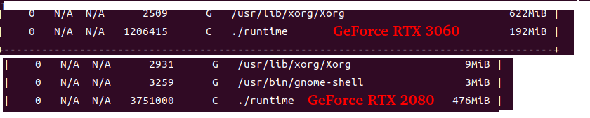

   - 首先cuda toolkit必须大于11.7，其次需要设置环境变量CUDA_MODULE_LOADING = LAZY，然后再次运行就不会报警告，设备内存的占用也恢复正常。

   - ```bash
     vim ~/.bashrc
     export CUDA_LAZY_LOADING="LAZY"
     
     source ~/.bashrc
     
     # 看到结果，发现设置成功
     env | grep CUDA_LAZY_LOADING
     CUDA_MODULE_LOADING=LAZY
     
     # 再次运行TensorRT程序就不会报警告了
     ```

   - 参考：[CUDA lazy loading is not enabled. Enabling it can significantly reduce device memory usage and speed](https://blog.csdn.net/s1_0_2_4/article/details/135026761)

7. docker运行gpu镜像后（--gpus all），一段时间后无法在容器内执行`nvidia-smi`，报`Docker with GPU: "Failed to initialize NVML: Unknown Error"`

   - [参考1](https://www.cnblogs.com/azureology/p/16673192.html)

   ```
   优先尝试将host显卡驱动版本与内核对齐，方法为sudo dmesg | grep NVRM查看正确版本。如果不行再往下看：
   
   这个问题比较复杂，在我这边属于偶发，表现为container中cuda无法正常调用，运行nvidia-smi报错Docker with GPU: "Failed to initialize NVML: Unknown Error"，且调用torch.cuda.is_avaliable()值为False，重启container可以暂时恢复正常，host始终没有发生此类问题。
   
   开始根据参考文档指引修改了cgroups参数，正常使用一段时间后问题依旧，后续又将host安装的nvidia驱动升级到最新依然无法解决。
   
   仔细观察文档中的docker run命令，包含--gpus all外还有--privileged不知用意为何。
   抱着试试看的心态将现有container打包为image并重新加入--privileged参数，问题未再复现
   ```

   - [参考2](https://blog.csdn.net/ZnS_oscar/article/details/134108758)

8. 


