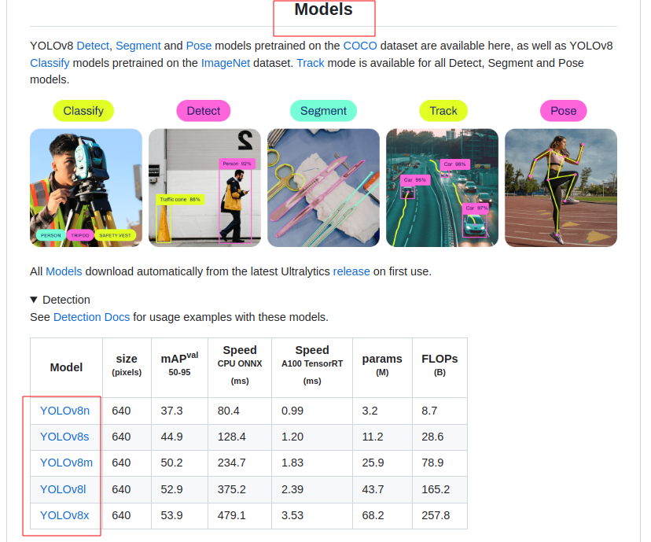
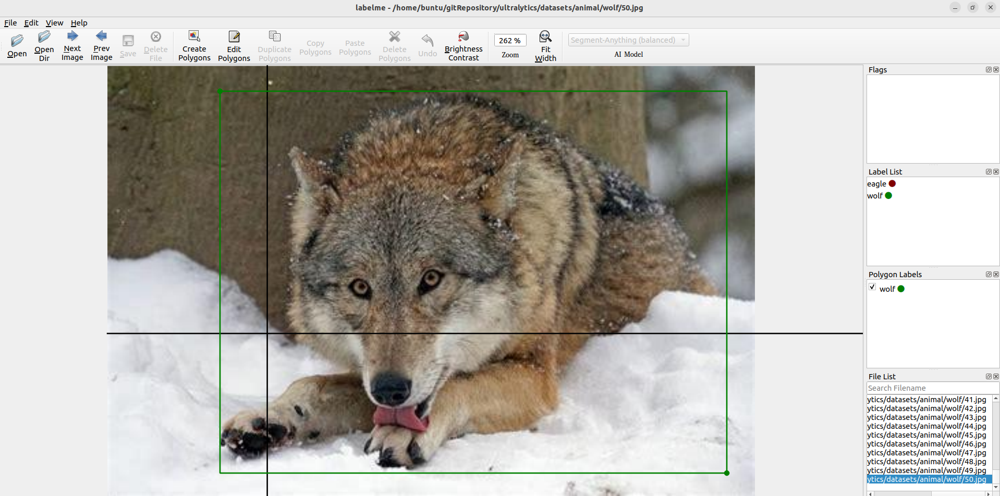
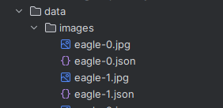
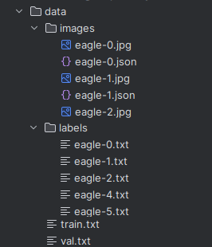
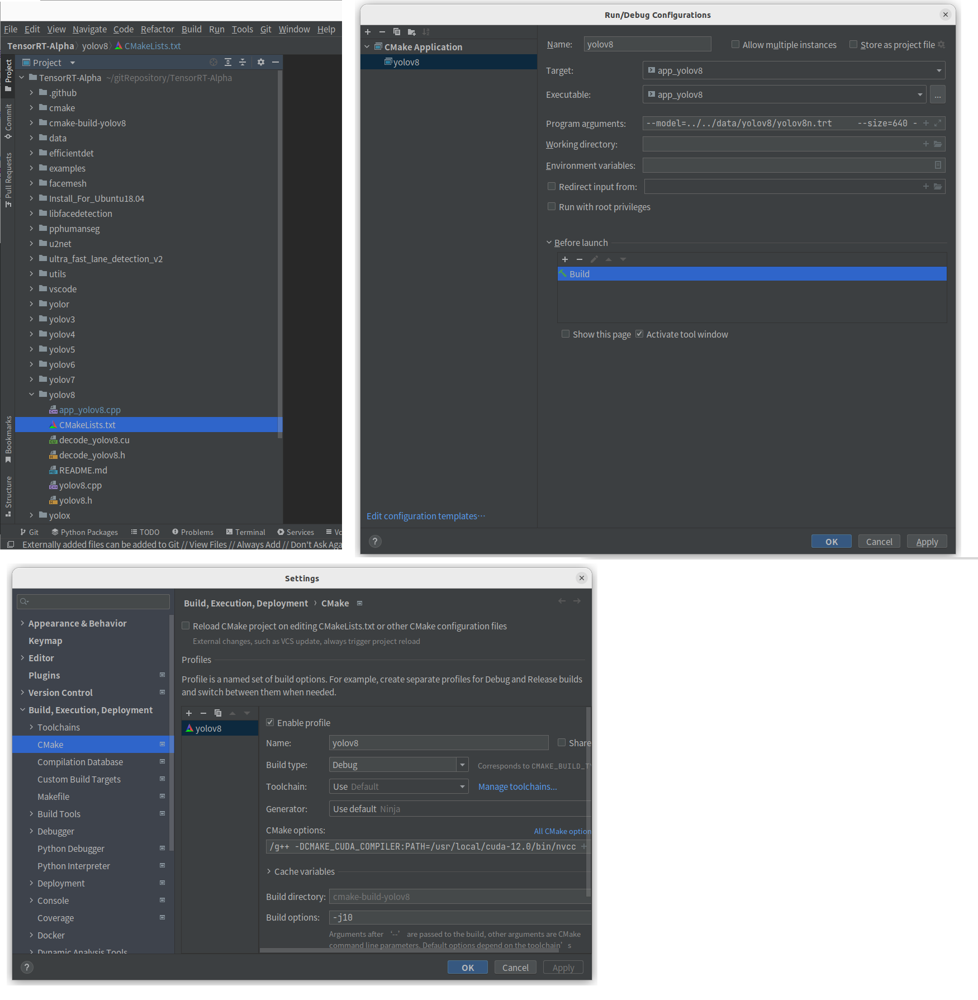

# yolov8

# 1 helloworld

## 1.1 数据集下载

```bash
# 在yolov8 中可以使用yolov5的标记

# coco128，从train2017随即选取的128张图片
https://github.com/ultralytics/yolov5/releases/download/v1.0/coco128.zip

wget https://github.com/ultralytics/yolov5/releases/download/v1.0/coco2017labels.zip
```


## 1.2 预训练权重下载

在ultralytics github的readme.md下方找到Models栏目，那里的表格直接点击对应的权重即可下载



## 1.3 [制作数据集](https://blog.csdn.net/qq_26696715/article/details/130118379)

### 1.3.1 [labelme使用](https://zhuanlan.zhihu.com/p/639923908)

```bash
# 创建sandbox
conda create -n labelSet python=3.9
# 创建一个文件夹data,
# 再创建data/images，images下存放需要打标签的所有图片

# /home/buntu/.conda/envs/labelSet/bin，使用如下命令打开labelme
labelme

# openDir，打开data/images，
# file->save automatically
# 右击图片选择形状
```




每张图片标记后生成一个json文件：

```json
{
  "version": "5.3.1",
  "flags": {},
  "shapes": [
    {
      "label": "wolf",
      "points": [
        [
          47.2040816326531,
          23.89795918367347
        ],
        [
          274.14285714285717,
          336.14285714285717
        ]
      ],
      "group_id": null,
      "description": "",
      "shape_type": "rectangle",
      "flags": {}
    }
  ],
  "imagePath": "./eagle-0.json",
  "imageData": "/9j/4AAQSkZJRgABAQAAAQABAAD/2wBDAAgGBgcGBQgHBwcJCQgKDBQNDAsLDBkSEw8UHRof",		//图片的base64
  "imageHeight": 338,
  "imageWidth": 474
}
```





### 1.3.2 [处理json文件](https://blog.csdn.net/qq_26696715/article/details/130118379)

处理json，到yolo可以使用

```python
import json
import numpy as np
import glob
from pathlib import Path

BASE_DIR = Path(__file__).resolve().parent
def split_by_ratio(arr, *ratios):
    """
    按比例拆分数组
    :param arr:
    :param ratios: 该参数的个数即为子数组的个数 eg: 0.5,0.5即为拆分两个各占50%的子数组
    :return:
    """
    # permutation将一个数组中的元素随机打乱，返回一个打乱后的新数组。https://blog.csdn.net/weixin_42608318/article/details/129568564
    arr = np.random.permutation(arr)
    # ratios= (0.9, 0.1)
    # np.array(ratios) = [0.9, 0.1]
    # np.array(ratios) * len(arr)(100) = [90.9, 10.1]
    # np.add.accumulate(np.array(ratios) * len(arr)) = [90.9, 101.]
    ind = np.add.accumulate(np.array(ratios) * len(arr)).astype(int)    # [90, 101]
    # def split(ary, indices_or_sections, axis=0):
    # ary的类型为ndarray（n维数组），表示待分割的原始数组
    # indices_or_sections的类型为int或者一维数组，表示一个索引，也就是切的位置所在。indices_or_sections的值如果是一个整数的话，就用这个数平均分割原数组。indices_or_sections的值如果是一个数组的话，就以数组中的数字为索引切开
    # axis表示的是沿哪个维度切
    tmp = [x.tolist() for x in np.split(arr, ind)][:len(ratios)]
    return tmp


def convert_json(t):
    ishas = False

    basename = t.split("/")[-1].split("\\")[-1].split(".")[0]
    with open(t, 'r', encoding='utf-8') as ft:
        data = json.load(ft)

        for shape in data['shapes']:
            if shape['label'] in class_names:
                ishas = True
        if not ishas: return ishas

        height = data["imageHeight"]
        width = data["imageWidth"]
        with open(str(BASE_DIR / ("data/labels/" + basename + ".txt")), 'w') as fa:
            for shape in data['shapes']:
                assert shape['label'] in class_names, f"Error: {shape['label']} not found in {class_names}"
                class_id = class_names.index(shape['label'])

                x1, y1 = shape['points'][0]
                x2, y2 = shape['points'][1]
                x_center = (x1 + x2) / 2 / width
                y_center = (y1 + y2) / 2 / height
                width = abs(x2 - x1) / width
                height = abs(y2 - y1) / height

                fa.write(f"{class_id} {x_center} {y_center} {width} {height}\n")

    return ishas


# 类别
class_names = ['wolf', 'eagle']
# label json，需要以
if __name__ == "__main__":
    # 文件列表
    json_list = glob.glob(str(BASE_DIR / "data/images/*.json"))
    np.random.shuffle(json_list)
    trains, vals = split_by_ratio(json_list, 0.9, 0.1)

    # 训练文件夹
    labelDir = BASE_DIR / "data/labels"
    if not labelDir.exists():
        labelDir.mkdir(parents=True, exist_ok=True)


    with open(str(BASE_DIR / 'data/train.txt'), 'w') as f:
        for t in trains:
            basename = t.split("/")[-1].split("\\")[-1].split(".")[0]

            # ishas表示json里面是否包含class_names里面的类（也就是说对应的图片里面是否包含我们需要的类）
            ishas = convert_json(t)
            if ishas:
                # yololabels
                out_txt_file = "./images/" + basename + ".jpg\n"
                f.write(out_txt_file)

    with open(str(BASE_DIR / 'data/val.txt'), 'w') as f:
        for t in vals:
            basename = t.split("/")[-1].split("\\")[-1].split(".")[0]
            ishas = convert_json(t)
            if ishas:
                out_txt_file = "./images/" + basename + ".jpg\n"
                f.write(out_txt_file)

```




labels文件夹下的每个txt文件，存放的是每张图片标记的多个目标

```bash
# f"{class_id} {x_center} {y_center} {width} {height}\n"
# 可能有多个，但我这里的素材每个图片里只有一个目标标记
0 0.338973564109188 0.5326047578794832 0.4787737879962111 0.9238014732520227
```

在生成的train.txt和val.txt中

```bash
./images/eagle-10.jpg
./images/eagle-38.jpg
./images/eagle-24.jpg
./images/wolf-3.jpg
./images/wolf-47.jpg
./images/eagle-49.jpg
./images/wolf-5.jpg
```


## 1.4 [训练](https://blog.csdn.net/weixin_42166222/article/details/129391260)

在data下，新建一个配置例如animal.yaml

```yaml
task: detect
train: /home/buntu/gitRepository/ultralytics/data/train.txt
val: /home/buntu/gitRepository/ultralytics/data/val.txt
# number of classes
nc: 2
# class names
names: ['wolf', 'eagle']
```

复制一个默认配置yaml

```bash
# 在项目根目录下
# 法一：直接复制default.yaml
cp /home/mango/ultralytics/ultralytics/yolo/cfg/default.yaml ./default_copy.yaml
# 法二
yolo copy-cfg

# 在default_copy.yaml文件的基础上，按需修改配置
# eg：
...
model:  weights/yolo8m.pt # (str, optional) path to model file, i.e. yolov8n.pt, yolov8n.yaml		# 这里需要写绝对路径否则找不到
data:  /home/buntu/gitRepository/ultralytics/data/animal.yaml			# 这里修改为自己的yaml，
epochs: 20  # number of epochs to train for
batch: 8  # number of images per batch (-1 for AutoBatch)
...
```


修改：`gitRepository/ultralytics/ultralytics/engine/model.py`

```python
def train(self, trainer=None, **kwargs):
    ...
    overrides = yaml_load(check_yaml(kwargs['cfg'])) if kwargs.get('cfg') else self.overrides
        custom = {'data': TASK2DATA[self.task]}  # method defaults
        # 源码
        # args = {**overrides, **custom, **kwargs, 'mode': 'train'}
        
        # 修改为下面，调整一下优先级，否则会读到custom就会覆盖default_copy.yaml的配置
        # 要修改配置尽量在配置文件中修改
        args = {**custom, **overrides, **kwargs, 'mode': 'train'}  # highest priority args on the right
    ...
```

在根目录下创建train.py。

```python
from ultralytics import YOLO

# 加载模型
model = YOLO("weights/yolov8n.pt")  # 加载预训练模型（推荐用于训练）

# Use the model
# 指定使用的配置文件
results = model.train(cfg='default_copy.yaml')  # 训练模型
```

训练完成后：`/home/buntu/gitRepository/ultralytics/runs/detect/train/weights/best.pt`


配置样例：

```yaml
# default_copy.yaml，里面有部分已修改

# Ultralytics YOLO 🚀, AGPL-3.0 license
# Default training settings and hyperparameters for medium-augmentation COCO training

task: detect  # (str) YOLO task, i.e. detect, segment, classify, pose
mode: train  # (str) YOLO mode, i.e. train, val, predict, export, track, benchmark

# Train settings -------------------------------------------------------------------------------------------------------
model:  weights/yolo8m.pt # (str, optional) path to model file, i.e. yolov8n.pt, yolov8n.yaml
data:  datasets/coco128/coco128.yaml # (str, optional) path to data file, i.e. coco128.yaml
epochs: 16  # (int) number of epochs to train for
patience: 8  # (int) epochs to wait for no observable improvement for early stopping of training
batch: 16  # (int) number of images per batch (-1 for AutoBatch)
imgsz: 640  # (int | list) input images size as int for train and val modes, or list[w,h] for predict and export modes
save: True  # (bool) save train checkpoints and predict results
save_period: -1 # (int) Save checkpoint every x epochs (disabled if < 1)
cache: False  # (bool) True/ram, disk or False. Use cache for data loading
device:  # (int | str | list, optional) device to run on, i.e. cuda device=0 or device=0,1,2,3 or device=cpu
workers: 8  # (int) number of worker threads for data loading (per RANK if DDP)
project:  # (str, optional) project name
name:  # (str, optional) experiment name, results saved to 'project/name' directory
exist_ok: False  # (bool) whether to overwrite existing experiment
pretrained: True  # (bool | str) whether to use a pretrained model (bool) or a model to load weights from (str)
optimizer: auto  # (str) optimizer to use, choices=[SGD, Adam, Adamax, AdamW, NAdam, RAdam, RMSProp, auto]
verbose: True  # (bool) whether to print verbose output
seed: 0  # (int) random seed for reproducibility
deterministic: True  # (bool) whether to enable deterministic mode
single_cls: False  # (bool) train multi-class data as single-class
rect: False  # (bool) rectangular training if mode='train' or rectangular validation if mode='val'
cos_lr: False  # (bool) use cosine learning rate scheduler
close_mosaic: 10  # (int) disable mosaic augmentation for final epochs (0 to disable)
resume: False  # (bool) resume training from last checkpoint
amp: True  # (bool) Automatic Mixed Precision (AMP) training, choices=[True, False], True runs AMP check
fraction: 1.0  # (float) dataset fraction to train on (default is 1.0, all images in train set)
profile: False  # (bool) profile ONNX and TensorRT speeds during training for loggers
freeze: None  # (int | list, optional) freeze first n layers, or freeze list of layer indices during training
# Segmentation
overlap_mask: True  # (bool) masks should overlap during training (segment train only)
mask_ratio: 4  # (int) mask downsample ratio (segment train only)
# Classification
dropout: 0.0  # (float) use dropout regularization (classify train only)

# Val/Test settings ----------------------------------------------------------------------------------------------------
val: True  # (bool) validate/test during training
split: val  # (str) dataset split to use for validation, i.e. 'val', 'test' or 'train'
save_json: False  # (bool) save results to JSON file
save_hybrid: False  # (bool) save hybrid version of labels (labels + additional predictions)
conf:  # (float, optional) object confidence threshold for detection (default 0.25 predict, 0.001 val)
iou: 0.7  # (float) intersection over union (IoU) threshold for NMS
max_det: 300  # (int) maximum number of detections per image
half: False  # (bool) use half precision (FP16)
dnn: False  # (bool) use OpenCV DNN for ONNX inference
plots: True  # (bool) save plots during train/val

# Prediction settings --------------------------------------------------------------------------------------------------
source:  # (str, optional) source directory for images or videos
show: False  # (bool) show results if possible
save_txt: False  # (bool) save results as .txt file
save_conf: False  # (bool) save results with confidence scores
save_crop: False  # (bool) save cropped images with results
show_labels: True  # (bool) show object labels in plots
show_conf: True  # (bool) show object confidence scores in plots
vid_stride: 1  # (int) video frame-rate stride
stream_buffer: False  # (bool) buffer all streaming frames (True) or return the most recent frame (False)
line_width:   # (int, optional) line width of the bounding boxes, auto if missing
visualize: False  # (bool) visualize model features
augment: False  # (bool) apply image augmentation to prediction sources
agnostic_nms: False  # (bool) class-agnostic NMS
classes:  # (int | list[int], optional) filter results by class, i.e. classes=0, or classes=[0,2,3]
retina_masks: False  # (bool) use high-resolution segmentation masks
boxes: True  # (bool) Show boxes in segmentation predictions

# Export settings ------------------------------------------------------------------------------------------------------
format: torchscript  # (str) format to export to, choices at https://docs.ultralytics.com/modes/export/#export-formats
keras: False  # (bool) use Kera=s
optimize: False  # (bool) TorchScript: optimize for mobile
int8: False  # (bool) CoreML/TF INT8 quantization
dynamic: False  # (bool) ONNX/TF/TensorRT: dynamic axes
simplify: False  # (bool) ONNX: simplify model
opset:  # (int, optional) ONNX: opset version
workspace: 4  # (int) TensorRT: workspace size (GB)
nms: False  # (bool) CoreML: add NMS

# Hyperparameters ------------------------------------------------------------------------------------------------------
lr0: 0.01  # (float) initial learning rate (i.e. SGD=1E-2, Adam=1E-3)
lrf: 0.01  # (float) final learning rate (lr0 * lrf)
momentum: 0.937  # (float) SGD momentum/Adam beta1
weight_decay: 0.0005  # (float) optimizer weight decay 5e-4
warmup_epochs: 3.0  # (float) warmup epochs (fractions ok)
warmup_momentum: 0.8  # (float) warmup initial momentum
warmup_bias_lr: 0.1  # (float) warmup initial bias lr
box: 7.5  # (float) box loss gain
cls: 0.5  # (float) cls loss gain (scale with pixels)
dfl: 1.5  # (float) dfl loss gain
pose: 12.0  # (float) pose loss gain
kobj: 1.0  # (float) keypoint obj loss gain
label_smoothing: 0.0  # (float) label smoothing (fraction)
nbs: 64  # (int) nominal batch size
hsv_h: 0.015  # (float) image HSV-Hue augmentation (fraction)
hsv_s: 0.7  # (float) image HSV-Saturation augmentation (fraction)
hsv_v: 0.4  # (float) image HSV-Value augmentation (fraction)
degrees: 0.0  # (float) image rotation (+/- deg)
translate: 0.1  # (float) image translation (+/- fraction)
scale: 0.5  # (float) image scale (+/- gain)
shear: 0.0  # (float) image shear (+/- deg)
perspective: 0.0  # (float) image perspective (+/- fraction), range 0-0.001
flipud: 0.0  # (float) image flip up-down (probability)
fliplr: 0.5  # (float) image flip left-right (probability)
mosaic: 1.0  # (float) image mosaic (probability)
mixup: 0.0  # (float) image mixup (probability)
copy_paste: 0.0  # (float) segment copy-paste (probability)

# Custom config.yaml ---------------------------------------------------------------------------------------------------
cfg:  # (str, optional) for overriding defaults.yaml

# Tracker settings ------------------------------------------------------------------------------------------------------
tracker: botsort.yaml  # (str) tracker type, choices=[botsort.yaml, bytetrack.yaml]

```


## 1.5 [推理](https://blog.csdn.net/qq_37553692/article/details/130910432)

[YOLOv8预测参数详解](https://blog.csdn.net/qq_37553692/article/details/130910432)

在项目的根目录创建detect.py，下载官方的预置权重。可以不使用自己训练过后的权重。

### 推理单张图片文件

```python
import cv2
from ultralytics import YOLO

# Load the YOLOv8 model
model = YOLO('./weights/yolov8m.pt')
# 推理图片
img = cv2.imread('./dataset/person.png')
results = model(img)
annotated_frame = results[0].plot()
cv2.imshow("YOLOv8 Inference", annotated_frame)
cv2.waitKey(0)
cv2.destroyAllWindows()
```

### 推理视频文件

```python
import cv2
from ultralytics import YOLO

# Load the YOLOv8 model
model = YOLO('./weights/yolov8m.pt')

# 推理视频
video_path = "./datasets/transport.mp4"
cap = cv2.VideoCapture(video_path)

while cap.isOpened():
    success, frame = cap.read()

    if success:
        results = model(frame)

        # Visualize the results on the frame
        annotated_frame = results[0].plot()
        cv2.imshow("YOLOv8 Inference", annotated_frame)

        if cv2.waitKey(5) & 0xFF == ord("q"):
            break
    else:
        break

cap.release()


cv2.destroyAllWindows()
```

### 推理摄像头

#### 检测摄像头

```bash
# 插入和拔出usb摄像头设备，查看列表中的项目是否发生变化
ls /dev/video*
#eg:/dev/video0  /dev/video1

# 查看通信接口中是否有camera的设备
lspci | grep -i camera
lsusb | grep -i camera	# 查看usb接口中是否有camera设备
# eg: Bus 003 Device 023: ID 0ac8:3330 Z-Star Microelectronics Corp. Sirius USB2.0 Camera
```


[yolo推流；将yolo识别的内容传入到前端； opencv拉流推流,rtmp+nginx拉推流,http-flv+nginx拉推流](https://blog.csdn.net/qq_41580422/article/details/116868313)

#### 推RSTP流

[使用opencv读取rtsp流的图片帧进行目标检测，并将处理好的图像推到rtsp服务器上](https://blog.csdn.net/weixin_42030297/article/details/119676409)

```python
import cv2
from ultralytics import YOLO
import subprocess

model = YOLO('/home/buntu/gitRepository/ultralytics/runs/detect/train/weights/best.pt')

# 读取第0个摄像头
cap = cv2.VideoCapture(0)

rtsp = "rtsp://127.0.0.1/live/test"
size = (int(cap.get(cv2.CAP_PROP_FRAME_WIDTH)), int(cap.get(cv2.CAP_PROP_FRAME_HEIGHT)))
sizeStr = str(size[0]) + 'x' + str(size[1])
fps = int(cap.get(cv2.CAP_PROP_FPS)) % 100

command = ['ffmpeg',
           '-y', '-an',
           '-re',
           '-f', 'rawvideo',
           '-pix_fmt', 'bgr24',
           '-s', sizeStr,
           '-r', str(fps),
           '-i', '-',
           '-c:v','libx264',
           '-g', '1',
           '-maxrate:v', '6M',
           '-minrate:v', '2M',
           '-bufsize:v', '4M',
           '-pix_fmt','yuv420p',
           # '-profile:v','high444',
           '-preset','fast',#'ultrafast',# 'superfast',
           '-tune', 'zerolatency',
           # '-b:v', '4M',
           '-f', 'rtsp',
            rtsp]
pipe = subprocess.Popen(command, shell=False, stdin=subprocess.PIPE)

while cap.isOpened():

    success, frame = cap.read()
    if success:

        results = model(frame)
        # 检测，标记
        annotated_frame, objList = results[0].plot()
		
        # 推流
        pipe.stdin.write(annotated_frame.tobytes())
        if cv2.waitKey(10) & 0xFF == ord("q"):
            break
    else:
        break

cap.release()
pipe.terminate()
cv2.destroyAllWindows()
```

#### 推RTMP流

```python
# 把对应的位置替换掉
rtmp = "rtmp://127.0.0.1/live/test"
command = ['ffmpeg',
     '-y', '-an',
     '-f', 'rawvideo',
     '-vcodec','rawvideo',
     '-pix_fmt', 'bgr24',
     '-s', sizeStr,
     '-r', '25',
     '-i', '-',
     '-c:v', 'libx264',
     '-pix_fmt', 'yuv420p',
     '-preset', 'ultrafast',
     '-f', 'flv',
     rtmp]
```

### 推理RTSP流

[c++读rtsp流](https://blog.csdn.net/qq_42102546/article/details/129413327)

```python
...
rtsp = "rtsp://127.0.0.1/live/test"
cap = cv2.VideoCapture(rtsp)
# c++  cv::VideoCapture(rtsp, cv::CAP_FFMPEG);
...
```

### 统计图中的目标

```python
import cv2
from ultralytics import YOLO

# Load the YOLOv8 model
model = YOLO('./weights/yolov8m.pt')

# 统计图中检测到的对象
def tongjiFrame(pred_boxes,names):
    objList = []
    obj = {}
    for d in reversed(pred_boxes):
        c, conf, id = int(d.cls), float(d.conf), None if d.id is None else int(d.id.item())
        name = ('' if id is None else f'id:{id} ') + names[c]
        if name not in obj:
            obj[name] = 0
        obj[name] += 1
        objList.append({'name': name, 'poss': f'{conf:.2f}'})
    # print('你好：', obj)
    return obj, objList

# 推理图片
img = cv2.imread('./dataset/person.png')
results = model(img)

# 统计目标
tongjiFrame(results[0].boxes, results[0].names)

annotated_frame = results[0].plot()
cv2.imshow("YOLOv8 Inference", annotated_frame)
cv2.waitKey(0)
cv2.destroyAllWindows()
```

### 只标记需要标记的目标

修改：`ultralytics/ultralytics/engine/results.py`的`plot()`函数

添加一个参数：`needLabel`

[参考yolov5的修改](https://blog.csdn.net/frcbob/article/details/123440979)


```python
    def plot(
            self,
            conf=True,
            line_width=None,
            font_size=None,
            font='Arial.ttf',
            pil=False,
            img=None,
            im_gpu=None,
            kpt_radius=5,
            kpt_line=True,
            labels=True,
            boxes=True,
            masks=True,
            probs=True,
            needLabel=(),     # hello，这里需要加一个needLabel参数
            **kwargs
    ):
    ...
            if pred_boxes and show_boxes:

                for d in reversed(pred_boxes):
                    c, conf, id = int(d.cls), float(d.conf) if conf else None, None if d.id is None else int(d.id.item())

                    name = ('' if id is None else f'id:{id} ') + names[c]
                    label = (f'{name} {conf:.2f}' if conf else name) if labels else None
                    objList.append({'name': name, 'poss': f'{conf:.2f}'})
                    
                    # 在这里做判断
                    # 当needLabel长度为0时，所有目标都标记
                    # 当needLabel长度大于0时，就判断当前目标是否在需要标记的数组里
                    if (len(needLabel) == 0 ) or ((len(needLabel) > 0) and (name in needLabel) ):
                        annotator.box_label(d.xyxy.squeeze(), label, color=colors(c, True))
                    # annotator.box_label(d.xyxy.squeeze(), label, color=colors(c, True))       # hello
    ...
```

在使用的时候

```python
...
results = model(frame)
annotated_frame, objList = results[0].plot(needLabel=('person'))        # 只标记person这一类
...
```

### 只检测特定的类

[yolov5只检测单一类别或者特定的类](https://blog.csdn.net/BruceBorgia/article/details/123103804)

[yolov5 设置只检测某几个固定的类](https://blog.csdn.net/weixin_46034990/article/details/124755321)

### 视频帧抽样推理

[视频帧抽样](https://blog.csdn.net/David_jiahuan/article/details/105550791)

#### 间隔帧数抽样

```python
import cv2
from ultralytics import YOLO

# Load the YOLOv8 model
model = YOLO('./weights/yolov8m.pt')

# 推理视频
video_path = "./datasets/transport.mp4"
cap = cv2.VideoCapture(video_path)

frameRate = 100  # 帧数截取间隔（每隔100帧截取一帧）
c = 1

while cap.isOpened():
    success, frame = cap.read()
    if success:
        if(c % frameRate == 0):
            results = model(frame)
            annotated_frame = results[0].plot()
            cv2.imshow("YOLOv8 Inference", annotated_frame)、
            c = 0
    	c += 1
        if cv2.waitKey(5) & 0xFF == ord("q"):
            break
    else:
        break
        
cap.release()
cv2.destroyAllWindows()
```

#### 间隔时间抽样

```python
...
span = 10 # 间隔10s
fps = int(cap.get(cv2.CAP_PROP_FPS)) % 100 		# 帧率为30，每秒30帧
frameRate = fps * span		# 10 * 30，10秒中间隔了300帧
...
if success:
        if(c % frameRate == 0):
            results = model(frame)
            annotated_frame = results[0].plot()
            cv2.imshow("YOLOv8 Inference", annotated_frame)
    	c += 1
        if cv2.waitKey(5) & 0xFF == ord("q"):
            break
    else:
        break
...
```


# 2 部署

## TensorRT部署

使用[FeiYull/TensorRT-Alpha仓库](https://github.com/FeiYull/TensorRT-Alpha/)的yolov8的内容

1. 首先安装nvidia显卡驱动，CUDA toolkit，cudnn，tensorRT这些内容在C++的CUDA文件夹中查看。
   - 切记TensorRT用tar包安装，不要使用deb，它会影响很多东西。
2. git Clone [FeiYull/TensorRT-Alpha仓库](https://github.com/FeiYull/TensorRT-Alpha/)
3. 在Clion打开根目录
4. 打开TensorRT-Alpha/yolov8，右击**`CMakeList.txt->Load Cmake Project`**
5. 然后在右上角**`Add Configuration`**，可以添加target、executable、可执行文件的命令行运行参数
6. 然后在setting中修改Cmake options，把cuda的编译器nvcc加上。
7. 如果要换项目，**`Tools选项卡 -> CMake -->UNLOAD CMAKE PROJECT`**，unload之后重复第四步，在其它项目中Load。
8. 换之后，要在add configuration中换target和executable，然后才可运行




# 数据集

1. [人群计数、行人检测等开源数据集资源汇总](https://zhuanlan.zhihu.com/p/578090436)
2. 

```yaml
settings_version: 0.0.4
datasets_dir: /home/buntu/gitRepository/datasets
weights_dir: /home/buntu/gitRepository/ultralytics/weights
runs_dir: /home/buntu/gitRepository/ultralytics/runs
uuid: 8850a426fc05d358779fbe19a5891f5956b00a9b1ad62814a559f1f99c0cd012
sync: true
api_key: ''
clearml: true
comet: true
dvc: true
hub: true
mlflow: true
neptune: true
raytune: true
tensorboard: true
wandb: true
```

