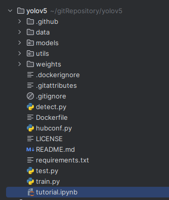
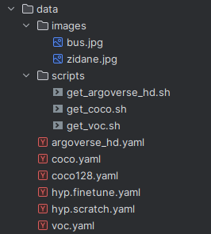
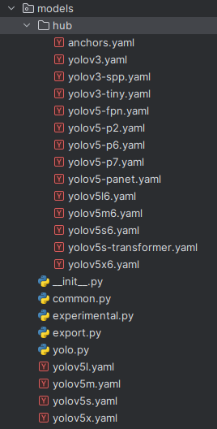
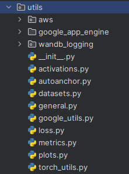
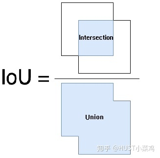

# yolov5

yolov5（you only look once，version 5）是基于python环境，在pytorch机器学习框架上，一个开源的**目标检测**模型系列。

[yolo 结合 deepsort 实现目标跟踪](https://blog.csdn.net/Albert_yeager/article/details/129321339)

[pytorch gpu 安装](https://zhuanlan.zhihu.com/p/612181449)

# [0 初识](https://zhuanlan.zhihu.com/p/558477653)

**yolov5 tagv5.0版本代码**

## 0.1 项目结构



├── data：主要是存放一些超参数的配置文件（这些文件（yaml文件）是用来配置训练集和测试集还有验证集的路径的，其中还包括目标检测的种类数和种类的名称）；还有一些官方提供测试的图片。如果是训练自己的数据集的话，那么就需要修改其中的yaml文件。但是自己的数据集不建议放在这个路径下面，而是建议把数据集放到yolov5项目的同级目录下面。



├── models：里面主要是一些网络构建的配置文件和函数，其中包含了该项目的四个不同的版本，分别为是s、m、l、x。从名字就可以看出，这几个版本的大小。他们的检测测度分别都是从快到慢，但是精确度分别是从低到高。这就是所谓的鱼和熊掌不可兼得。如果训练自己的数据集的话，就需要修改这里面相对应的yaml文件来训练自己模型。



├── utils：存放的是工具类的函数，里面有loss函数，metrics函数，plots函数等等。



├── weights：放置训练好的权重参数。

- 里面存放了一个download_weights.sh，可以通过sh去下载权重。

- 也可以手动去下载，权重下载地址：https://github.com/ultralytics/yolov5/releases/tag/v7.0

- ```bash
  https://github.com/ultralytics/yolov5/releases/download/v7.0/yolov5m.pt
  ```

├── detect.py：利用训练好的权重参数进行目标检测，可以进行图像、视频和摄像头的检测。

├── train.py：训练自己的数据集的函数。

├── test.py：测试训练的结果的函数。

├──requirements.txt：这是一个文本文件，里面写着使用yolov5项目的环境依赖包的一些版本，可以利用该文本导入相应版本的包。

## 0.2 [GPU环境搭建](https://blog.csdn.net/qq_53357019/article/details/125725702)

### 0.2.1 安装nvidia显卡驱动、cuda toolkit、cudnn


**CUDA Toolkit** 是用于开发和运行基于 CUDA 的应用程序的软件包。它包含了编译器、库、工具和示例等组件，用于编写、构建和优化 CUDA 应用程序。CUDA Toolkit 还提供了与 GPU 相关的驱动程序和运行时库，以便在系统上正确配置和管理 GPU。这个库的主要目的是帮你封装好了很多的操作这个gpu ，也就是操作这个 cuda 驱动的库。

**cuDNN（CUDA Deep Neural Network library）**是 NVIDIA 为深度学习框架提供的加速库。它为深度神经网络的训练和推理提供了高性能的 GPU 加速支持。cuDNN 提供了一系列优化的算法和函数，用于加速卷积、池化、归一化等常用的深度学习操作。它与 CUDA 和 CUDA Toolkit 配合使用，提供了对深度学习框架（如TensorFlow、PyTorch等）的 GPU 加速能力。

[nvidia 显卡驱动 安装最顺的教程](https://zhuanlan.zhihu.com/p/302692454)，推荐查看

[选择显卡驱动版本和toolkit版本下载，不含安装报错的显卡驱动安装教程](https://blog.csdn.net/weixin_39928010/article/details/131142603)

[ubuntu cudnn 安装](https://blog.csdn.net/shanglianlm/article/details/130219640)

### 0.2.2 python 环境安装

```bash
# 创建一个沙箱，python 大于等于3.8
conda create -n yolov5 python=3.10

conda activate yolov5
# 下载yolov5源代码库
git clone https://github.com/ultralytics/yolov5.git

cd yolov5

# 
pip install -r requirements.txt		# -U参数不用指定	
# -U：-U, --upgrade            Upgrade all specified packages to the newest available version. The handling of dependencies depends on the upgrade-strategy used.
# -r, --requirement <file>    Install from the given requirements file. This option can be used multiple times.
```


## 0.3 coco数据集

```bash
# coco
wget http://images.cocodataset.org/zips/train2017.zip	# 19G, 118k images
wget http://images.cocodataset.org/zips/val2017.zip		# 1G, 5k images
wget http://images.cocodataset.org/zips/test2017.zip	# 7G, 41k images
wget https://github.com/ultralytics/yolov5/releases/download/v1.0/coco2017labels.zip	# 数据的标签，解压上面的图片到此label文件夹内。

# coco128，从train2017随即选取的128张图片
https://github.com/ultralytics/yolov5/releases/download/v1.0/coco128.zip

# 下载yolov5对应代码的版本tag版本，在这里我们用的时tag v5.0版本
https://github.com/ultralytics/yolov5/releases/download/v5.0/yolov5s.pt
https://github.com/ultralytics/yolov5/releases/download/v5.0/yolov5m.pt
https://github.com/ultralytics/yolov5/releases/download/v5.0/yolov5l.pt
https://github.com/ultralytics/yolov5/releases/download/v5.0/yolov5x.pt
```


# 术语概念

## [IOU](https://zhuanlan.zhihu.com/p/141719585)

IoU 的全称为交并比（Intersection over Union）

IoU 计算的是 “预测的边框” 和 “真实的边框” 的交集和并集的比值。



## [NMS](https://blog.csdn.net/KANG157/article/details/124649838)

Non-Maximum Suppression（NMS）非极大值抑制。从字面意思理解，抑制那些非极大值的元素，保留极大值元素。其主要用于目标检测，目标跟踪，3D重建，数据挖掘等。

目前NMS常用的有标准NMS, Soft  NMS, DIOU NMS等。后续出现了新的Softer NMS，Weighted NMS等改进版。

以目标检测为例，目标检测推理过程中会产生很多检测框（A,B,C,D,E,F等），其中很多检测框都是检测同一个目标，但最终每个目标只需要一个检测框，NMS选择那个得分最高的检测框（假设是C），再将C与剩余框计算相应的IOU值，当IOU值超过所设定的阈值（普遍设置为0.5，目标检测中常设置为0.7，仅供参考），即对超过阈值的框进行抑制，抑制的做法是将检测框的得分设置为0，如此一轮过后，在剩下检测框中继续寻找得分最高的，再抑制与之IOU超过阈值的框，直到最后会保留几乎没有重叠的框。这样基本可以做到每个目标只剩下一个检测框。


## TTA

Test-Time Augmentation（TTA）测试时数据增强。

数据增强是一种在模型训练期间通常使用的方法，它使用训练数据集中修改过的样本副本来扩展训练集。

通常使用图像数据来执行数据增强，其中通过执行一些图像操作技术来创建训练数据集中的图像副本，例如缩放、翻转、移动等等。

人工扩展的训练数据集可以产生一个更熟练的模型，因为深度学习模型的性能通常会随着训练数据集的大小继续扩大。此外，训练数据集中图像的修改或增强版本可以帮助模型以不受位置、光照等影响的方式提取和学习特征。

# log

1. [运行yolov5-5.0出现AttributeError: Can‘t get attribute ‘SPPF‘ 正确解决方法](https://blog.csdn.net/qq_41035097/article/details/122884652)

   - weight预置权重版本和实际yolov5的tag不匹配
   - 不能用weight 7.0 给yolov5 tagv5.0来训练

2. [AttributeError: module numpy has no attribute int .报错解决方案](https://blog.csdn.net/weixin_46669612/article/details/129624331)

   - 官方给出的numpy的版本要求时>=1.18.5，而[numpy](https://so.csdn.net/so/search?q=numpy&spm=1001.2101.3001.7020).int在[NumPy](https://so.csdn.net/so/search?q=NumPy&spm=1001.2101.3001.7020) 1.20中已弃用，在NumPy 1.24中已删除。
   - 重装numpy：pip install numpy==1.22

3. [RuntimeError: result type Float can‘t be cast to the desired output type long int](https://blog.csdn.net/bu_fo/article/details/130336910)

   ```python
   # loss.py出问题
   indices.append((b, a, gj.clamp_(0, gain[3] - 1), gi.clamp_(0, gain[2] - 1)))  # image, anchor, grid indices
   # 解决
   indices.append((b, a, gj.clamp_(0, gain[3].long() - 1), gi.clamp_(0, gain[2].long() - 1)))  # image, anchor, grid indices
   ```

   

4. 


