# 深度学习应用开发——Tensorflow实践

# 0 环境搭建

## 0.1.anaconda

### 0.1.1 anaconda与python的区别

1、anaconda 是一个python的发行版，包括了python和很多常见的软件库, 和一个包管理器conda。常见的科学计算类的库都包含在里面了，使得安装比常规python安装要容易。

2、Anaconda是专注于数据分析的Python发行版本，包含了conda、Python等190多个科学包及其依赖项。

### 0.1.2 anaconda安装包命名含义

Anaconda3-2019.10-Windows-x86_64

3表示支持的python的版本是3.x

2019.10是anaconda的版本号。

Windows-x86支持windows32位系统，Windows-x86_64支持windows64位系统。

### 0.1.3 anaconda修改国内镜像源

打开Anaconda Prompt窗口，执行如下命令：

conda config --add channels https://mirrors.tuna.tsinghua.edu.cn/anaconda/pks/free/ 

conda config --set show_channel_urls yes

查看当前配置信息：conda info

到C:\Users\Administrator（用户名） 下找到 .condarc，这是一个配置文件，打开删除channels的defaults项

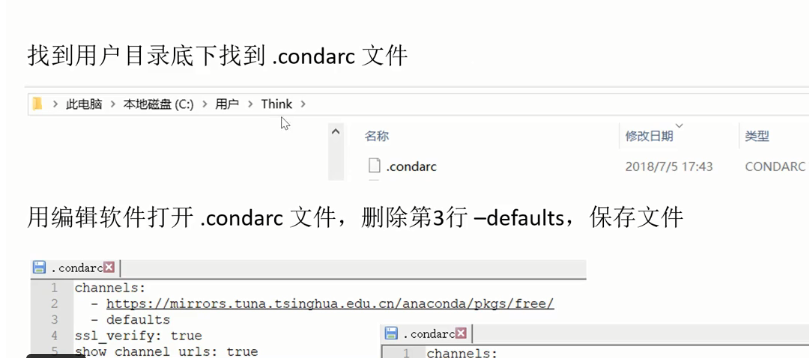


查看anaconda是否安装成功

anaconda prompt 下

查看anaconda 版本 ：conda --version 

查看anaconda第三方依赖包列表：conda list

在安装其他任何包之前先安装pip：conda install pip


## 0.2 sandbox

Sandboxie(又叫沙箱、沙盘)即是一个虚拟系统程序，它创造了一个类似沙盒的独立作业环境，在其内部运行的程序并不能对硬盘产生永久性的影响。

创建沙箱：conda create -n 沙箱名 python=3.6 anaconda	//沙箱名，可以任意取，3.6代表支持的python 版本号。创建成功后，我们可以在anaconda Navigator/Environment，除了root环境，还有一个名叫tensorflow的沙箱环境

激活沙箱：activate 沙箱名 		//在使用时，需要激活

关闭沙箱：deactivate 沙箱名 或activate root	//不需要使用时，关闭

删除沙箱环境：conda remove -n 沙箱名 --all

查看沙箱列表：conda info -e 或conda env list

### 0.2.1 新环境中使用jupyter

**jupyter notebook的默认环境是base(root)**，当新建沙箱环境后，在新环境中安装tensorflow，然后在jupyter中使用（假设你在base(root)中没有安装tensorflow），在引入tensorflow时，是找不到tensorflow的，你必须将新环境注入到内核kernel中。

解决办法[windows jupyter notebook 切换默认环境](<https://blog.csdn.net/u014264373/article/details/86541767>)

主要步骤

1. 激活新环境：activate new_env
2. 安装内核：conda install ipykernel        //ipykernel：为不同的虚拟机或CONDA环境设置多个IPython内核
3. 将选择的conda环境注入Jupyter Notebook：python -m ipykernel install --user --name 《new_env_name》 --display-name "Python [conda env:《new_env_name》]"
4. 删除jupyter中的内核环境：jupyter kernelspec remove env_name

完成后的效果

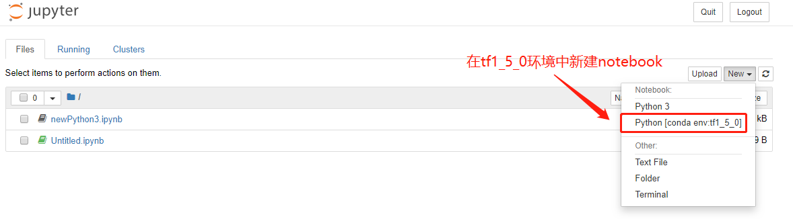

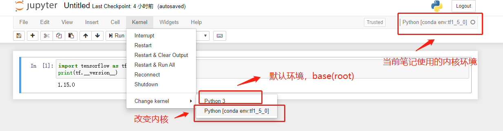

要在新环境下运行程序，必须要激活此环境，否则将会出现环境死掉的情况，推荐通过prompt 去activate 新环境，然后通过jupyter notebook打开

## 0.3 jupyter notebook

### 0.3.1 界面简介

在prompt 窗口中

打开jupyter notebook：jupyter notebook	//也可以在开始/Anaconda3(64-bit)/jupyter notebook，点击打开

关闭jupyter notebook：Ctrl + C

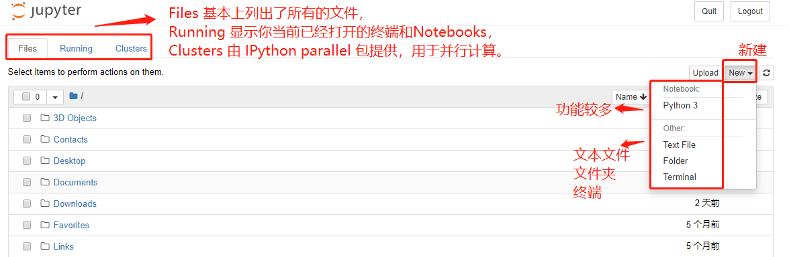

点击python3就可以新建python代码。

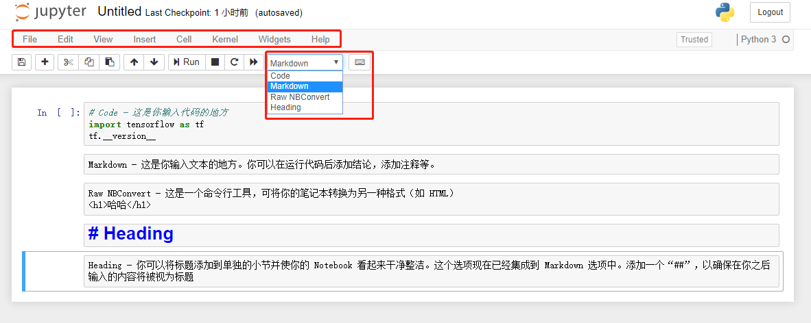


### 0.3.2 tab项

带扩写

### 0.3.3 jupyter配置文件

在

**C:/用户/用户名/.jupyter/jupyter_notebook_config.py**

如果没有jupyter_notebook_config.py文件，在prompt中**jupyter notebook --generate-config** 即可

**修改**jupyter_notebook_config.py中配置文件**默认存储路径**：**c.NotebookApp.notebook_dir = '路径'**。并删除行首的 ' # '以取消python的注释。

**eg：D:\\\JDI\\\tensorflow\\\practice**，由于python语法，字符串中有' \ '需要转义，用双反斜杠才实际代表单反斜杠。也可以使用**r'D:\JDI\tensorflow\practice'**

如果做了如上修改依旧没有改变文件的默认存储位置，那么还需要右击jupyter notebook---》下拉菜单点击”属性“---》删除"目标"中的%USERPROFILE%，如下图

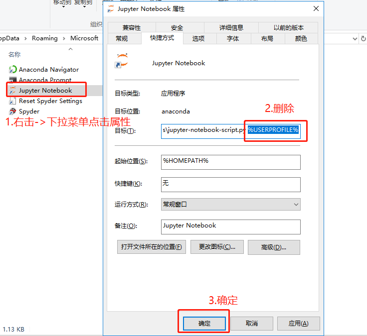

### 0.3.4 快捷键

选中单元为蓝色边框，编辑单元为绿色边框

1. **Ctrl-Enter :** 运行本单元
2. **Alt-Enter :** 运行本单元，在其下插入新单元
3. **A：**在选中单元上插入代码块
4. **B：**在选中单元下方插入代码块
5. **D-D:**连续按两个D，删除选中单元
6. **Ctrl-?：**注释和解除注释
7. **Ctrl-Shift-- :** 分割单元
8. **Ctrl-Shift-Subtract :** 分割单元
9. **Ctrl-S :** 文件存盘

### 0.3.5 kernel

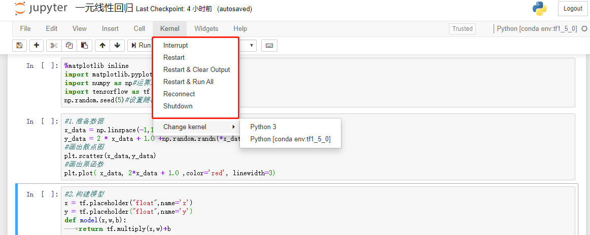

1. **Interrupt**：是终止一个 cell，不影响跑过的 cell
2. **Restart**：restart the current kernel。 All variables will be lost。可以清空之前模型训练的结果
3. **Restart & Clear Output**： restart the current kernel and clear all output。All variables and outputs will be lost.
4. **Restart & Run All：**restart the current kernel and re-execute the whole notebook。All variables and outputs will be lost。可以重新跑程序，并按单元输出结果
5. **Reconnect：**
6. **Shutdown：**是终止一个 ipython kernel，kernel 的堆栈直接清空

## 0.4 prompt 

### conda

安装多个包：conda install package_name1  package_name2

**安装特定版本的安装包：conda install package_name = 版本号**

卸载包：conda remove package_name

更新包：conda update package_name

更新环境中的所有包：conda update --all

查看anaconda 版本 ：conda --version 

查看anaconda第三方依赖包列表：conda list

查看指定依赖包的信息(此办法也可用于查看环境中是否有此依赖包)：conda list package_name

**在安装指定版本包的时候，如果找不到，我们可以看线上存在的版本**

查看线上有哪些包：anaconda search -t conda package_name

查看包的详细信息：anaconda show user/package_name

安装此包：conda install --channel channel_url package_name

### pip

安装包：`pip install <包名>==版本号`

更新包：`pip install --upgrade package_name`

卸载包：`pip uninstall <包名>`

 查看当前已安装的包及其版本号：pip freeze

**conda和pip的区别：**

 [Pip](https://pip.pypa.io/en/stable/)是Python Packaging Authority推荐的用于从[Python Package Index](https://pypi.org/)安装包的工具。Pip安装打包为wheels或源代码分发的Python软件。

[Conda](https://conda.io/docs/)是跨平台的包和环境管理器，可以安装和管理来自[Anaconda repository](https://repo.anaconda.com/)以 [Anaconda Cloud](https://anaconda.org/)的conda包。conda包不仅限于Python软件。它们还可能包含C或C ++库，R包或任何其他软件。

conda安装会根据包的依赖关系安装多个包以期环境相适应，而pip则不会。

### 安装时经常会遇到的问题

网络错误（网断了）：Could not fetch URL https://pypi.org/simple/matplotlib/: There was a problem confirming the ssl certificate: HTTPSConnectionPool

## 0.5 安装tensorflow

打开Anaconda Prompt窗口

普通版TensorFlow：conda install tensorflow

GPU版TensorFlow：conda install tensorflow-gpu

测试TensorFlow是否安装成功

打开jupyter


由于tensorflow2.x与tensorflow1.x区别较大，很多函数的操作写法都不尽相同，视频上的版本为1.2.1，代码都是在1.2.1的基础上写成的

## 0.6  模块安装log

1. [No Module Named 'Symbol'](https://stackoom.com/en/question/4nDnI)

# 1 TensorFlow编程基础

TensorFlow是一个开放源代码软件库，用于高性能科学计算。

借助其灵活的架构，用户可以轻松的将计算工作部署到多种平台（CPU 、GPU 、TPU）和设备（桌面设备、服务器集群、移动设备、边缘设备）

PS:张量处理单元（TPU）是一种定制化的 ASIC 芯片，它由谷歌从头设计，并专门用于机器学习工作负载。

## 1.1 基本概念

TensorFlow = Tensor  +  Flow 

Tensor：张量，一种数据结构：多维数组

Flow：流，计算模型：张量之间通过计算而转换的过程。

TensorFlow是一个通过计算图的形式表述计算的编程系统。每一个计算都是计算图上的一个节点，节点之间的边描述了计算关系。

计算图是一个有向图，由一组节点和一组有向边组成

- 节点，代表一个操作，一种运算
- 有向边，代表了几点之间的关系（数据传递和控制依赖）
  - 常规边（实线），代表数据依赖关系，一个节点的运算输出成为另一个节点的输入，两个节点之间有tensor流动（值传递）
  - 特殊边（虚边），不携带值，表示两个节点之间的控制相关性，eg：happen-before关系，源节点必须在目的节点执行前完成

```python

import tensorflow as tf
#1.定义一个简单的计算图，创建流图就是建立计算模型，
	#计算图是静态的，
node1 = tf.constant(3.0,tf.float32,name="node1")
node2 = tf.constant(4.0,tf.float32,name="node2")
node3 = tf.add(node1,node2)
print('node1',node1)#node1 tf.Tensor(3.0, shape=(), dtype=float32)
print('node3',node3)#Tensor("Add:0", shape(),dtype=float32)
					#输出的结果不是一个数字，而是一个张量结构
#2.建立对话，执行对话才能提供数据并获得计算结果
	#图在Session中动态的执行
sess = tf.Session()
print("运行sess.run(node1)的结果：", sess.run(node1))#运行sess.run(node1)的结果：3.0
print("运行sess.run(node3)的结果：", sess.run(node3))#运行sess.run(node3)的结果：7.0

#3.关闭对话，如果后续不再执行计算，要记得关闭对话，释放计算资源
sess.close()


```

```python
import tensorflow as tf
node2=tf.constant(4.0,tf.float32,name="node2")
#sess=tf.Session()#tf.Session()提示module 'tensorflow' has no attribute 'Session'如何解决？
sess=tf.compat.v1.Session()
print("运行sess.run(node1)的结果：", sess.run(node2))#RuntimeError: The Session graph is empty.  Add operations to the graph before calling run().
sess.close()
```

<div style='color:red'>
    计算图是静态的，提前定义好的，每一个定义将作为一个模型的积木，一个流的节点。
    <br/>
	会话是动态的，将计算图中的节点串接起来，拿到会话中动态的执行，执行后形成流，
</div>
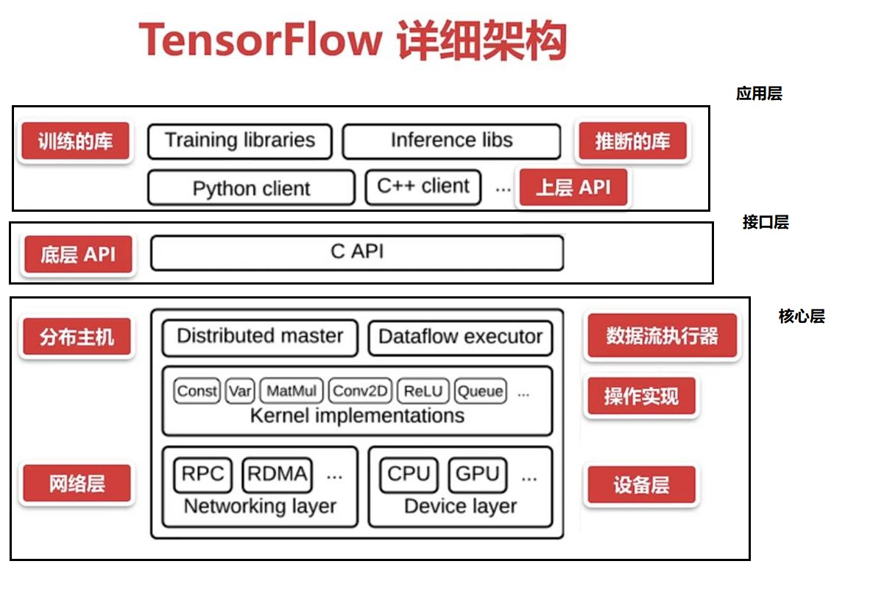


## 1.2 张量tensor

在tensorflow中，所有的数据都是通过张量的形式来表示，张量可以理解为多维数组，

- 标量（scalar），零阶张量，一个数
- 向量（vector），一阶张量，一维数组
- n阶张量，n维数组

注：张量并没有真正保存数字，它保存的是计算过程。

### 1.2.1 张量的属性

<pre>
    node1 = tf.constant(3.0,tf.float32,name="node1")
</pre>

<pre>
    tensor( name , shape , type)
</pre>
<pre>
    eg：Tensor("Add:0", shape(),dtype=float32)
	1.name(名字)
		“node:src_output"：node节点名称，src_output来自节点的第几个输出
	2.shape(形状)
		张量的维度信息，shape=(),表示是标量
	3.type(类型)
		每一个张量会有一个唯一的类型，
		TensorFlow会对所有参与运算的所有张量进行类型检查，发现类型不匹配时会报错
</pre>


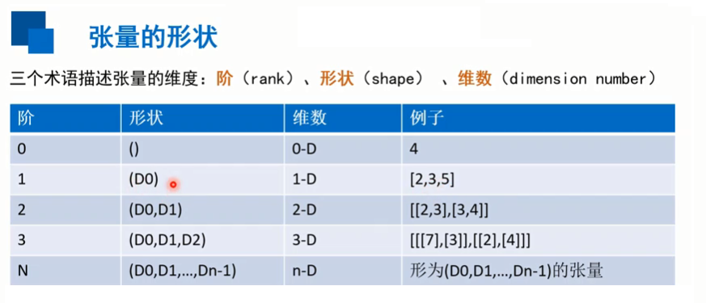

在python中，语句中包含**[  ]，{  }，(  ) **括号中间换行的就不需要使用多行连接符。

```python
node1=tf.constant([
    		[	[1,1,1],[1,2,3]	],
            [	[2,1,1],[2,2,3]	],
    		[	[3,1,1],[3,2,3]	],
    		[	[4,1,1],[4,2,3]	]
            ],name="node1")
#1.张量的属性
print(node1)
#tf.Tensor("node1:0", shape=(4, 2, 3), dtype=int32)
#形状shape是从数组最外层开始剥，最外层数组长度是4,其次2，再次3

#2.形状获取
print("node1的shape：",node1.get_shape())#node1的shape: (4, 2, 3)

#3.获取张量元素，下标从0开始
sess = tf.Session();
print(sess.run(node1)[1,2,3])
sess.close()

#如果这样写会报错
node1=tf.constant([
    		[	[1,1,1]	],
            [	[2,1,1],[2,2,3]	],
    		[	[3,1,1],[3,2,3]	],
    		[	[4,1,1],[4,2,3]	]
            ],name="node1")
#Can't convert non-rectangular Python sequence to Tensor.
#每层数组的元素，它的结构应相同
```

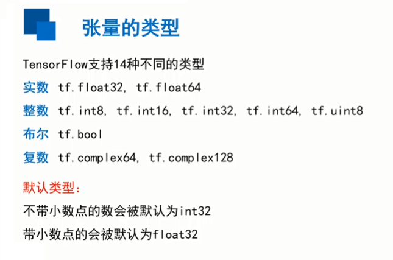

注：TensorFlow会对所有参与运算的所有张量进行类型检查，发现类型不匹配时会报错

## 1.3 操作Operation

计算图中的节点就是操作（Operation）

- 加、减、乘、除、构建变量的初始值等等都是操作
- 每个运算操作都有属性，它在构建图的时候需要确定下来、
- 操作可以和计算设备绑定，指定操作在某个设备上执行
- 操作之间存在顺序关系，操作间的依赖就是边
- 如果操作A的输入是操作B执行的结果，那么操作A就依赖于操作B

## 1.4 会话Session

会话拥有并管理tensorflow程序运行时的所有资源，当所有计算完成之后需要关闭会话帮助系统回收资源。

```python

import tensorflow as tf
tense1=tf.constant([1,2,3])

sess=tf.Session()

#一、后面的机制可以保证，在程序异常中断时，可以关闭会话，释放资源
#方法1
try:
    print(sess.run(tense1))
except:
    print("Exception!")
finally:
    sess.close()
#方法2
#创建一个会话，并通过python的上下文管理器来管理这个会话，当上下文退出时，会话关闭，资源释放
with tf.Session as sess:
    print(sess.run(tense1))

#二、指定默认的会话
#tensorflow不会自动生成默认的会话，需要手动指定，
#当默认的会话被指定后可以
#通过tf.Tensor.eval函数来计算一个张量的取值
sess=tf.Session()
with sess.as_default():
    print(tense1.eval())
    
#三、设置默认会话
sess=tf.InteractiveSession()
print(tense1.eval())
sess.close()
```

## 1.5 常量-变量

### 1.5.1 常量

在运行过程中值不会改变的单元，在TensorFlow中无需进行初始化操作

<pre>
 定义
    constant_name = tf.constant(value[,type,name])
</pre>

### 1.5.2 变量

在运行过程中值会改变的量，在TensorFlow中须进行初始化操作

<pre>
1.定义
    variable_name = tf.Variable(value[,type,name])
	注意：V大写,value参数是当变量被初始化时的初始值
2.定义初始化操作
	定义单个变量初始化：
		init_opt=variable_name.initializer()
	定义所有变量初始化：
		init_opt=tf.global_variables_initializer()
3.执行初始化
	sess.run(init_opt),在会话中进行
</pre>

```python
import tensorflow as tf
node1 = tf.Variable(3.0,tf.float32,name="node1")
node2 = tf.Variable(4.0,tf.float32,name="node2")
result = tf.add(node1,node2,name="add")

#定义初始化操作，但并没有实际进行初始化，必须在后面run初始化操作，初始化操作才能得到执行
init = tf.global_variables_initializer()

sess = tf.Session()
sess.run(init)

print(sess.run(result))
sess.close()
```

<h5>变量赋值</h5>

与传统语言不同，TensorFlow变量定义后，一般无需人工赋值，系统自动根据算法模型，训练优化过程中，会自动调整变量对应的数值。

- 如果不想让变量自动调整，在定义变量的时候需要指定tf.Variable()的参数trainable=false
- 特殊情况下需要人工更新变量的值可用变量赋值语句，tf.assign(variable_to_be_updated,new_value)

```python
#通过变量赋值输出1，2,3...，10
import tensorflow as tf
one = tf.constant(1)
value = tf.Variable(0,name='value')
new_value = tf.add(one,value)
update_value = tf.assign(value,new_value)
init = tf.global_variables_initializer()	#注意variable加s
with tf.Session() as sess:		#Session后别忘加括号
    sess.run(init)
    for _ in range(10):
        sess.run(update_value)
        print(sess.run(value))

#作业：如何通过TensorFlow的变量赋值计算：1+2+3，，+10
import tensorflow as tf
one=tf.constant(1)
mid=tf.Variable(0,tf.int32,name='mid')
res=tf.Variable(0,tf.int32,name='res')
new=tf.add(mid,one)
update=tf.assign(mid,new)
s=tf.add(res,mid)
update_res=tf.assign(res,s)
init=tf.global_variables_initializer()
with tf.Session() as sess:
    sess.run(init)
    for _ in range(0,10):
        sess.run(update)
        sess.run(update_res)
        print('中间值new',sess.run(new))
        print('中间值mid',sess.run(mid))
        print('中间值res',sess.run(res))
    print('结果是：',sess.run(res))   
#session中只将sess.run中的相关节点拿入会话中计算，
#在这个程序可以看出，如果只run update_res而不 run update，他就只会将update_res中的相关节点纳入计算
#也可以看出，在update_res所依赖的节点总是先执行，而后执行update_res
```

## 1.6 占位符placeholder

TensorFlow的Variable变量类型，在定义时需要给定，但有些变量定义时并不知道其数值，只有当程序真正运行起来时，才由外部输入，比如训练数据。这时候就要用到占位符。

**tf.placeholder占位符，是TensorFlow中特有的数据结构**，类似于动态变量，函数的参数，C（python）语言中格式化输出时的**%占位符**

<pre>
    定义:
        tf.placeholder(type[,shape,name])
    eg:
        tf.placeholder(tf.float32,[2,3],name='pld1')
</pre>

<h5> 1.Feed提交数据</h5>

如果构建了一个包含placeholder操作的计算图，当在Session 中调用run方法时，placeholder占用的变量**必须通过feed_dict参数传递进去**，否则报错

<h5>2.Fetch提取数据</h5>

会话运行完成之后，如果我们想查看会话运行的结果，就需要使用fetch来实现。通过sess.run()返回回来的就是fetch的值，result，result1，rc，rd，都是fetch到的值

```python
import tensorflow as tf
a = tf.placeholder(tf.float32,name='a')
b = tf.placeholder(tf.float32,name='b')
c = tf.add( a, b, name='c')
d = tf.subtract( a, b, name='d')

#注：placeholder不需要做初始化操作，和变量是不同的，所以下面定义的初始化操作，和执行初始化操作是可以省略的
init=tf.global_variables_initializer()

with tf.Session() as sess:#注意Session要加括号
    sess.run(init)
	result=sess.run( c, feed_dict={ a=7.0, b=8.0 })
    print(result)
    
    #1.多个操作可以通过一次Feed完成执行,一次性给c和d操作，传递相同的参数
    result1 = sess.run([ c, d ], feed_dict = { a=10.0, b=5.0})
    print('result1=',result1)
    print('result0=',result[0])
    
    #2.一次返回多个值给多个变量，和python中的序列封包和解包意思相同
    rc，rd = sess.run([ c, d ], feed_dict = { a=10.0, b=5.0})
    print('c=', rc, 'd=', rd)
```

## 1.7 TensorBoard初步

- TensorBoard是TensorFlow的可视化工具 。通过TensorFlow程序运行过程中输出的日志文件可视化TensorFlow程序的运行状态。

- tensorflow生产数据写到日志里面去，tensorboard不停的读取日志里的数据以一种可视化的方式展现出来。

- tensorflow和tensorboard程序分别跑在两个进程中，互不影响

<h5>写日志文件</h5>

```python
import tensorflow as tf
#...
#1.清除默认的图graph和不断增加的节点（清除之前的节点，这里还不太清楚只是我的推测）
tf.reset_default_graph()
#2.指定日志生成存放的路径
logdir = 'D:\tensorflow\log'
#3.定义计算图
#....
#4.生成一个写日志的writer，将当前的TensorFlow计算图写入日志文件
writer = tf.summary.FileWriter(logdir,tf.get_default_graph())
writer.close()
#5.运行程序后自动生成计算图的日志文件
```

<h5>启动tensorboard</h5>

1. 在Anaconda Prompt中，**进入日志存放的目录中**
2. 输入命令tensorboard --logdir=D:\tensorflow\log，然后系统启动了一个前端服务器，端口号默认6006，可以通过--port参数修改启动的端口
3. 在浏览器中复制命令行中的url，到graphs页即可。

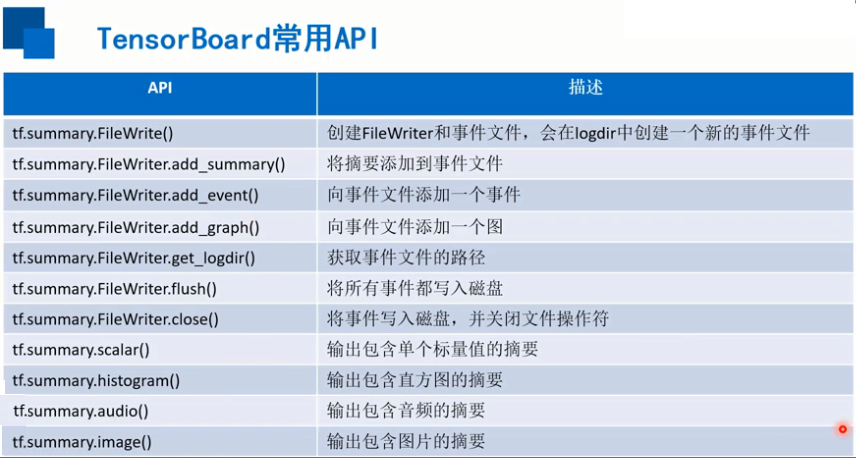

## 1.8 api

### 1.8.1 命名空间

作用域函数tf.name_scope和tf.variable_scope，一般与两个创建/调用变量的函数tf.variable() 和tf.get_variable()搭配使用，

主要用作：变量共享和tensorBoard绘图封装变量

**tf.Variable() 每次都会新建变量**。

如果希望**重用**（**共享**）一些变量，就需要用到了**get_variable()（变量检查机制），它会去搜索变量名，有就直接用，没有再新建，如果重名，并且没有设置变量共享（scope.reuse_variables()），就会报错**。

对于tf.Variable()变量的名字上，两个作用域含税都会加前缀。而对于tf.getVariable()，variable_scope会加前缀，而name_scope不加。

# 2 机器学习

## 2.1 监督学习基本术语

1. **标签**：是我们要预测的真实事物，比如单变量线性回归中的y变量
2. **特征**：是指用于描述数据的输入变量，比如单变量线性回归中的x变量，多元线性回归中的[x1,x2,..xi,...]
3. **样本**：是指数据的特定实例
   - **有标签**样本：具有**{特征，标签}**：{ x，y}，用于训练模型
   - **无标签**样本：具有**{特征，？}**：{ x，？}，用于对新数据做出预测

4. **模型**：可将样本映射到预测标签：**y’**，有模型内部参数定义，这些内部参数值是通过学习得到的 
5. **训练**：训练模型表示通过有标签样本来学习（确定）所有**权重和偏差**的理想值。机器学习算法目的是通过检查多个样本并尝试找到可**最大限度地减少损失**的模型，这一过程称为**经验风险最小化**
6. **损失**：是对糟糕预测的惩罚，损失是一个数值，表示对单个数据样本而言模型预测的准确程度，训练模型的目标是从所有样本中找到一组平均损失“较小”的权重和偏差。完全准确损失为0，否则损失较大。
7. **损失函数**：用于描述预测值和真实值之间的误差，从而指导模型收敛方向。L<sub>1</sub>损失(误差绝对值之和），L<sub>2</sub>（MSE均方误差损失），交叉熵（cross-entro

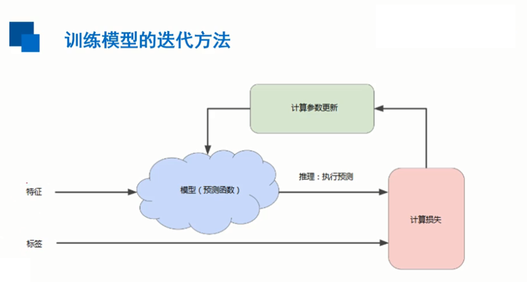

8. **收敛**：在学习优化过程中，机器学习系统将根据所有标签去重新评估所有特征，为损失函数生成新的值，而该值又产生新的参数值。通常你可以不断迭代，直到总体损失不再变化或至少变化极其缓慢为止。这时候我们可以说该模型已收敛。

9. **梯度下降法**：梯度的大小等于损失函数在该点的导数的绝对值，方向是该点的切线方向。沿负梯度方向探索

   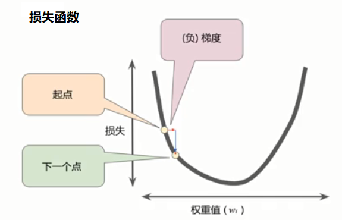

10. **学习率**：有时称为步长，沿着负梯度方向进行下一步探索，前进多少合适。

11. **超参数**：它是在开始学习过程之前设置值的参数（通过人工指定的经验值），而不是由训练得到的参数数据。典型超参数：学习率，编程人员将花费很多时间来调整超参数。

## 2.2 常用

### 2.2.1 常用第三方库

1. **NumPy**：是python的一种开源的数值计算扩展，用来存储和处理大型矩阵运算，主要包括N维数组对象Array、实用的线性代数、傅里叶变换和随机数生成函数。NumPy 通常与 SciPy（Scientific Python）和 Matplotlib（绘图库）一起使用， 这种组合广泛用于替代 MatLab，是一个强大的科学计算环境，有助于我们通过 Python 学习数据科学或者机器学习。

2. **SciPy**：是构建在numpy的基础之上的，它提供了许多的操作numpy的数组的函数。SciPy是一款方便、易于使用、专为科学和工程设计的python工具包，它包括了统计、优化、整合以及线性代数模块、傅里叶变换、信号和图像图例，常微分方差的求解等。

3. **Pandas**：

   是构建在numpy的基础之上的， 纳入了大量库和一些标准的数据模型，提供了高效地操作大型数据集所需的工具。pandas提供了大量能使我们快速便捷地处理数据的函数和方法。

   能够从CSV、SQL库、EXCEL、HDF5、文本文件读取数据

   数据结构自动转换为Numpy的多维数组

4. **scikit-learn (sklearn)**：建立在 NumPy ，SciPy 和 matplotlib 上

5. **Matplotlib**：是python中最常用的可视化工具之一，利用它可以非常方便地创建各种类型的二维和三维图表。

6. **Keras**：是一个由Python编写的开源人工神经网络库，可以作为Tensorflow、Microsoft-CNTK和Theano的高阶应用程序接口，进行深度学习模型的设计、调试、评估、应用和可视化。

7. **NLTK**：是用来处理人类自然语言数据，它包括50多个语料库和词汇资源，并能够很方便地完成对语言的分类、标记、解析和语义推理等自然语言处理任务。

8. **OpenCV和scikit-image**：图像处理库

### 2.2.2 常用优化器

| 优化器                                    | 描述 |
| :---------------------------------------- | :--- |
| tf.train.GradientDescentOptimizer         |      |
| tf.train.AdadeltaOptimizer                |      |
| tf.train.AdagradOptimizer                 |      |
| tf.train.AdagradDAOptimizer               |      |
| tf.train.MomentumOptimizer                |      |
| tf.train.AdamOptimizer                    |      |
| tf.train.FtrlOptimizer                    |      |
| tf.train.ProximalGradientDescentOptimizer |      |
| tf.train.ProximalAdagradOptimizer         |      |
| tf.train.RMSPropOptimizer                 |      |


## 2.3 线性代数基础

矩阵标量运算：nA=n乘以A的每一个元素，A+c=A的每一个元素+c

mxn同形矩阵加法：A+B=矩阵对应元素相加

## 2.4 例子：一元线性回归


例：采用人工数据集，y = 2 * x + 1，噪声最大幅度 0.4。

<h5>机器学习核心步骤</h5>

1. 准备数据
2. 构建模型
3. 训练模型
4. 进行预测

```python
#1.准备数据
	#在jupyter中，需要将matplotlib显示图像需要设置为inline模式，否则，不会现实图像。
%matplotlib inline

import matplotlib.pyplot as plt#绘图库
import numpy as np#运算库
import tensorflow as tf
np.random.seed(5)#设置随机数种子

	#直接采用np生成等差数列的方法，生成100个点，范围是在-1~1之间
x_data = np.linspace(-1,1,100)		#注意这里的是linspace而不是linespace
	#y=2x+1+噪声
y_data = 2 * x_data + 1.0 +np.random.randn(*x_data.shape) * 0.4		#这里的*大概是拆包之作用。x_data是一维数组，它的shape也就是数组的长度，产生的随机误差也将是x_data.shape（他是一个元组），加星号拆成了一个数的长度

	#numpy.random.randn(d0,d1,...,dn)是从标准正态分布(0,1)中返回一个或多个样本值

	#画出散点图
plt.scatter(x_data,y_data)
	#画出原函数
plt.plot( x_data, 2*x_data + 1.0 ,color='red', linewidth=3)
help(plt.plot)

#2.构建模型
	
x = tf.placeholder("float",name='x')	
y = tf.placeholder("float",name='y')	#在损失函数和feed_dict处使用
def model(x,w,b):
	return tf.multiply(x,w)+b
	
    #要记住在tensorflow中，既有python的语法，又有tensorflow的语法，w和b在这里之所以使用tf.Variable而不用python的一般变量，可能和训练过程中自动更变有关系，所以有关训练的目标参数都要使用tf.Variable
w = tf.Variable(1.0,name='w0')
b = tf.Variable(0.0,name='b0')
pred = model(x,w,b)

	#损失函数
    #MSE= (1/n)∑(y-pred)^2
loss_function = tf.reduce_mean(tf.square(y-pred))
	#梯度下降优化器
optimizer = tf.train.GradientDescentOptimizer(learning_rate).minimize(loss_function)#优化目标是最小化损失函数

sess = tf.Session()
init = tf.global_variables_initializer()
sess.run( init )

#3.训练模型，
train_epochs=10		#训练10轮
learning_rate=0.05
step=0
loss_list=[]
	#轮数为epoch，采用SGD随机梯度下降优化方法
for epoch in range(train_epochs):
    for xs,ys in zip(x_data,y_data):	#zip(x,y)=[(x1,y1),(x2,y2)...]，每轮100个点
        _,loss=sess.run([optimizer,loss_function],feed_dict={x:xs,y:ys})
        #显示损失值loss
    	#display_step:控制报告损失值的粒度，密集度
    	#例如，如果display_step为2，则每训练两个样本输出一次损失值
    	#与超参数不同，修改display_step不会更改模型的学习规律
    	loss_list.append(loss)
    	step=step+1
    	display_step=100
    	if step % display_step == 0:
        	print("Train Epoch:",'%02d' % (epoch+1),"Step:%03d" % step,"loss=",\"{:.9f}".format(loss))
    
    b0temp=b.eval(session=sess)
    w0temp=w.eval(session=sess)
    plt.plot(x_data,w0temp*x_data+b0temp)	#每一轮将画一根直线
    

 

	#线性拟合结果值，
print("w:",sess.run(w))    #w：1.9823  
print("b:",sess.run(b)) 	#b：1.04201
plt.scatter(x_data,y_data,label='ORIGINAL DATA')
plt.plot(x_data,x_data*sess.run(w)+sess.run(b),label='fitted line',color='r',linewidth=3)
plt.legend(loc=2)

#4.进行预测

	#预测方式1
x_test=3.21
predict=sess.run(pred,feed_dict={x:x_test})
print('预测值：%f' % predict)

	#预测方式2
predict0=sess.run(w)*x_test+sess.run(b)  
print('预测值0：%f' % predict0)

target=2*x_test+1.0
print('目标值：%f' % target)
```


例子步骤：

1. 生成人工数据集及其可视化
2. 构建线性模型
3. 定义损失函数
4. 定义优化器、最小损失函数
5. 训练结果的可视化
6. 利用学习到的模型进行预测

## 2.5 例子：多元线性回归：波士顿房价预测

波士顿房价数据集：包括506个样本，每个样本包括12个特征变量和该地区的平均房价。

| 特征项  | 含义                                        |
| ------- | ------------------------------------------- |
| CRIM    | 犯罪率                                      |
| ZN      | 住宅用地超过25000平方英尺的比例，豪宅的量   |
| INDUS   | 城镇非零售，商用土地的比例，工业农业用地    |
| CHAS    | 是否靠近河流                                |
| NOX     | 一氧化氮的浓度                              |
| RM      | 住宅平均房间数                              |
| AGE     | 1940年之前老房子所占比例                    |
| DIS     | 到波士顿5个中心区域的加权距离，郊区还是市区 |
| RAD     | 辐射性公路的靠近指数                        |
| TAX     | 每10000美元的全值财产税率，税收负担         |
| PTRATIO | 城镇师生比例                                |
| LSTAT   | 人口中地位低下者的比例                      |
| MEDV    | 波士顿的平均房价，单位：千美元              |

```python
%matplotlib inline
import tensorflow as tf
import numpy as np
import pandas as pd
from sklearn.utils import shuffle

#1.数据预处理

#读取数据文件
df=pd.read_csv("./boston.csv",header=0)
#显示数据摘要描述信息
print(df.describe())

#模型y=w1*x1+w2*x2+w3*x3......+w12x12+b
#获取df的值
df=df.values
print(df)
#把df转化为np的数组格式
df=np.array(df)

#注意数据需要归一化，否则后序进行的训练将失败
for i in range(12):
    df[:, i] = df[:, i]/(df[:, i].max()-df[:, i].min())

#x_data为前12列特征数据
#python的子序列用法
x_data=df[:,:12]#python的子序列用法
y_data=df[:,12]

x=tf.placeholder(tf.float32,[None,12],name='X')#12个特征数据（12列）
y=tf.placeholder(tf.float32,[None,1],name='Y')#一个标签数据（1列）
#shape中的None表示行的数量未知，在实际训练时决定一次代入多少行样本，从一个样本的随机SGD到批量的SGD都可以

#2.定义模型函数

#定义一个命名空间
#在以后查看计算图的时候，会把下面的语句块合并成为子图，会使得整个计算图更加的简洁
#我们通过命名空间使得一些相关的节点，融合成子图
with tf.name_scope("Model"):
    #w初始化值为shape=（12.1）的随机数
        #tf.random_normal()函数用于从服从指定正太分布的数值中取出指定个数的值。
        #tf.random_normal(shape, mean均值, stddev, dtype, seed, name)
    w=tf.Variable(tf.random_normal([12,1],stddev=0.01),name="W")
    #b初始化值为1.0
    b=tf.Variable(1.0,name="b")
    def model(x,w,b):
        return tf.matmul(x,w)+b
    #预测计算操作，前项计算节点
    pred=model(x,w,b)
    
#3.模型训练

#设置训练超参数
#迭代轮次
train_epochs=50
#学习率
learning_rate=0.01

#定义均方差损失函数
with tf.name_scope("LossFunction"):
    loss_function=tf.reduce_mean(tf.pow(y-pred,2))#均方误差、

#创建优化器
optimizer = tf.train.GradientDescentOptimizer(learning_rate).minimize(loss_function)

init=tf.global_variables_initializer()

#设置日志存储目录
logdir='log'#可以为绝对目录也可以为相对目录，如果想在当前目录下创建，直接写文件名就行了
#创建一个操作，用于记录损失值loss，后面再TensorBoard中SCALARS栏可见
sum_loss_op=tf.summary.scalar("loss",loss_function)
#把所有需要记录摘要日志文件的合并，方便一次性写入
merged=tf.summary.merge_all()

sess=tf.Session()
sess.run(init)
#创建摘要writer，将计算图写入摘要文件，后面再TensorBoard中GRAPHS栏可见
writer=tf.summary.FileWriter(logdir,sess.graph)
#这个语句将会创建一个新的路径，所以要保证路径目录在盘中是空的，不存在的
#损失可视化
loss_list=[]

for epoch in range(train_epochs):
    loss_sum=0.0
    for xs,ys in zip(x_data,y_data):

        #feed数据必须和placeholder的shape一致，所以在此需要重塑
        #xs=[x1,x2,...x12]
        #feed要的是[[x1,x2,...x12]],
        xs=xs.reshape(1,12)
        ys=ys.reshape(1,1)

        _,summary_str,loss=sess.run([optimizer,sum_loss_op,loss_function],feed_dict={x:xs,y:ys})
        writer.add_summary(summary_str,epoch)

        loss_sum=loss_sum +loss

    #打乱数据顺序
    xvalues,yvalues=shuffle(x_data,y_data)
    #机器学习时，注意要打乱数据的顺序，有时候机器只是识得了数据的顺序，而并未真正学习到数据的内在联系
    #故打乱顺序，有助于机器学到数据内在的本质的联系
    b0temp=b.eval(session=sess)
    w0temp=w.eval(session=sess)
    loss_average=loss_sum/len(y_data)
    
    loss_list.append(loss_average)
    
    print("epoch=",epoch+1,"loss=",loss_average,"b=",b0temp,"w=",w0temp)
    #如果不加归一化，从训练结果看，w是全是nan值，很明显，训练结果异常
 

#4.模型应用
#本例中506条数据都用来训练了，暂时没有新的数据
#从506条中抽一条验证一下
n=348
#n=np.random.randint(506)
print('n:',n)
x_test=x_data[n]
x_test=x_test.reshape(1,12)

predict=sess.run(pred,feed_dict={x:x_test})  
print("预测值：%f" % predict)

target=y_data[n]
print("标签值：%f" % target)

sess.close() 
```

打开tensorboard的办法

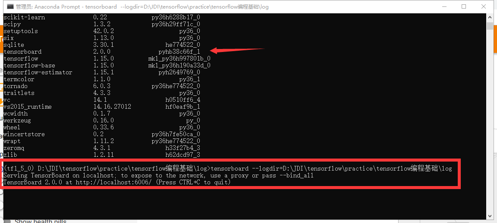

## 2.6 探究训练结果异常的原因

### 2.6.1从梯度下降考虑

1. 多元函数的极值问题，需要求偏导。

2. 要考虑不同特征值取值范围大小的影响

   ​	解决方法：**归一化**，归一化是在做数据处理中比较重要的一个步骤。

#### 归一化

归一化的两个好处：

1. 提升模型的收敛速度，当两个特征的的取值范围差距过大时，会得到一个狭长的椭圆形，导致梯度的方向为垂直等高线的方向而走之字形路线，这样会使迭代很慢

2. 提升模型的精度，取值范围大的特征值一般在数值上影响会相对较大。

   [参考网址：数据归一化和两种常用的归一化方法](<https://blog.csdn.net/haoji007/article/details/81157224>)

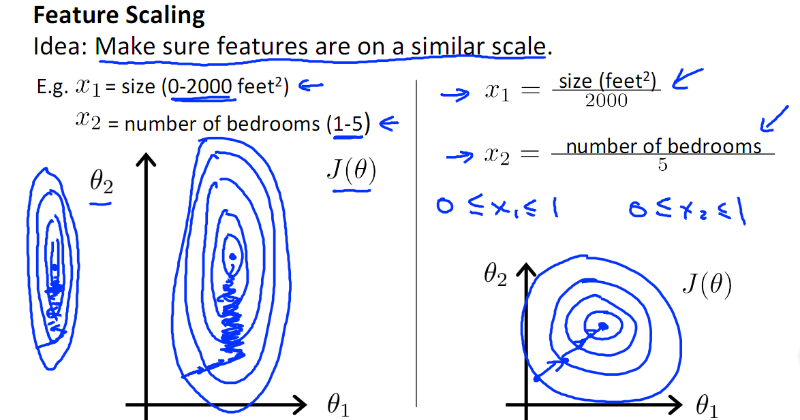

# 3 神经网络(Neural Network)

<h2>线性回归到逻辑回归，预测问题到分类问题</h2>

## 3.1 手写数字识别(单个神经元)

[MNIST数据集地址](http://yann.lecun.com/exdb/mnist/)
下载以下四个包

1. train-images-idx3-ubyte.gz 
2. train-labels-idx1-ubyte.gz 
3. t10k-images-idx3-ubyte.gz  
4. t10k-labels-idx1-ubyte.gz 

MNIST数据集文件在读取时如果指定目录下不存在，则会自动去下载，需等待一定时间，如果已经存在了，则直接读取。

```python
import tensorflow as tf

import tensorflow_core.examples.tutorials.mnist.input_data as input_data
### 报错
#import tensorflow.examples.tutorials.mnist.input_data as input_data
#视频中是从tensorflow中引入，但会报module 'tensorflow_core.examples' has no attribute 'tutorials'
#通过文件搜索，发现input_data.py在下面这个目录里
#F:\work\anacon\anaconda\pkgs\tensorflow-base-1.15.0-mkl_py36h190a33d_0\Lib\site-packages\tensorflow_core\examples\tutorials\mnist
#由此，改换了tensorflow_core后，不报错了
#TensorFlow Core是低级别TensorFlow API。

mnist=input_data.read_data_sets("MNIST_data/",one_hot=True)
### 报错
#read_data_sets读取文件，如果当前代码文件夹下MNIST_data文件不存在，则下载，下载不了，请自行下载上面4个文件到MNIST_data
#read_data_sets在未来的版本将被遗弃，请使用urllib或其他相近的
#由机器下载失败，需自行下载
#<urlopen error [WinError 10060] 由于连接方在一段时间后没有正确答复或连接的主机没有反应，连接尝试失败。>
#F:\work\anacon\anaconda\envs\tf1_5_0\lib\site-packages\tensorflow_core\contrib\learn\python\learn\datasets\mnist.py    
#它是有对应文件去读取该数据集的，里面有些将被遗弃，
#extract_images，extract_labels请使用tf.data
#dense_to_one_hot请使用tf.one_hot

print('训练集train数量：',mnist.train.num_examples,'\n')
print('验证集validation数量：',mnist.validation.num_examples,'\n')
print('测试集test数量：',mnist.test.num_examples,'\n')
print('train image shape',mnist.train.images.shape,'\n')
print('labels shape',mnist.train.labels.shape,'\n')

#训练集train数量： 55000 
#验证集validation数量： 5000 
#测试集test数量： 10000 
#train image shape (55000, 784) 
#labels shape (55000, 10) 

#训练集它的images的列数为784=28px28px，图片的大小就是28px28px的
#训练集它的labels的列数为10，阿拉伯数字0-10，10分类one hot独热编码

print('长度',len(mnist.train.images[0]),'\n')#784
print('shape',mnist.train.images[0].shape,'\n')#shape (784,)
print('data',mnist.train.images[0],'\n')

mnist.train.images[0].reshape(28,28)

import matplotlib.pyplot as plt
def plot_image(image):
    plt.imshow(image.reshape(28,28),cmap='binary')
    plt.show()
plot_image(mnist.train.images[100])

plt.imshow(mnist.train.images[100].reshape(14,56),cmap='binary')
plt.show()
```

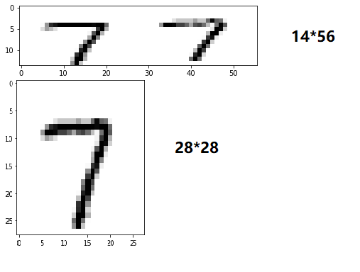

```python
#reshape进一步了解
import numpy as np
int_array=np.array([i for i in range(64)])
print(int_array)
#原则：行优先，逐行排列
int_array.reshape(8,8)
int_array.reshape(4,16)
#int_array.reshape(4,19)
#直接报错cannot reshape array of size 64 into shape (4,19)

```

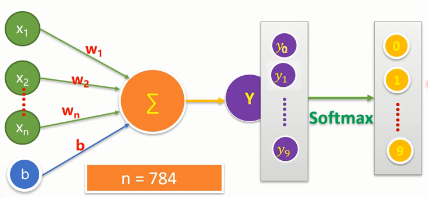

<center>模型图</center>

```python
#定义占位符
#mnist 中每张图片共有28*28=784个像素点，
x=tf.placeholder(tf.float32,[None,784],name='X')
#0-9一共十个数字，10个离散的类别，需要十位的独热码
y=tf.placeholder(tf.float32,[None,10],name='Y')
#定义变量
W=tf.Variable(tf.random_normal([784,10]),name='W')
#有10个数字且y是10位的独热码，故需要10列。X向量有784个元素，故需要784行。matmul(x,w)
#X(1,784) x W(784,10)=Y(1,10)
b=tf.Variable(tf.zeros([10]),name='b')
#定义前向计算
forward=tf.matmul(x,W)+b
#softmax结果分类
pred=tf.nn.softmax(forward)

#训练轮数
train_epochs=50
#单次训练样本数
batch_size=100
#一轮训练有多少批次
total_batch=int(mnist.train.num_examples/batch_size)
#显示粒度
display_step=1
#学习率
learning_rate=0.01

#定义交叉熵损失函数
loss_function=tf.reduce_mean(-tf.reduce_sum(y*tf.log(pred),reduction_indices=1))#一批数，所以要取均值
#定义梯度下降优化器
optimizer=tf.train.GradientDescentOptimizer(learning_rate).minimize(loss_function)

#定义准确率
#检查预测类别tf.argmax(pred,1)与实际类别tf.argmax(y,1)的匹配情况
correct_prediction=tf.equal(tf.argmax(pred,1),tf.argmax(y,1))
#tf.argmax(input,axis)根据axis取值的不同返回每行(axis=1)或者每列(axis=0)最大值的索引。

#准确率，将布尔值转化为浮点数，并计算平均值
accuracy=tf.reduce_mean(tf.cast(correct_prediction,tf.float32))
#tf.cast()函数的作用是执行 tensorflow 中张量数据类型转换

sess=tf.Session()#声明会话
init=tf.global_variables_initializer()#变量初始化
sess.run(init)

for epoch in range(train_epochs):
    for batch in range(total_batch):
        xs,ys=mnist.train.next_batch(batch_size)#读取批次数据
        sess.run(optimizer,feed_dict={x:xs,y:ys})#执行批次训练
    #total_batch个批次训练完成后，使用验证数据计算误差与准确率，验证集没有分批
    loss,acc=sess.run([loss_function,accuracy],feed_dict={x:mnist.validation.images,y:mnist.validation.labels})
    if(epoch+1) % display_step == 0:
        print("Train Epoch:",'%02d' % (epoch+1),"loss=","{:.9f}".format(loss),"Accuracy=","{:.4f}".format(acc))
print("Train Finished")

#评估模型
#完成训练后，在测试集上评估模型的准确率
accu_test= sess.run(accuracy,feed_dict={x:mnist.test.images,y:mnist.test.labels})
print("Test Accuracy:",accu_test)

# 模型应用与可视化
#在建立模型并进行训练后，若认为准确率可以接受，则可以使用此模型进行预测

#进行预测
#由于pred预测结果是one-hot编码格式，所以要转换成0~9数字
prediction_result=sess.run(tf.argmax(pred,1),feed_dict={x:mnist.test.images})

#查看预测结果中的前10项
print(prediction_result[0:10])

#测试结果可视化
def plot_images_labels_prediction(images,labels,prediction,index,num):
    fig=plt.gcf()#获取当前图表，Get Current Figure
    fig.set_size_inches(10,12)#1inch=2.54cm
    if num > 25 :
        num = 25
    for i in range(0,num):
        ax=plt.subplot(5,5,i+1)#获取当前要处理的子图
        ax.imshow(np.reshape(images[index],(28,28)),cmap='binary')#显示第index个图像
        title='label='+str(np.argmax(labels[index]))#构建该图上要显示的title信息
        #如果函数prediction参数传入的值为空数组，那就不加入预测信息
        if len(prediction)>0:
            title +=",predict="+str(prediction[index])
        ax.set_title(title,fontsize=10)#显示图上的title信息
        ax.set_xticks([])#不显示坐标轴
        ax.set_yticks([])
        index+=1
    plt.show()

plot_images_labels_prediction(mnist.test.images,mnist.test.labels,prediction_result,0,10)

plot_images_labels_prediction(mnist.test.images,mnist.test.labels,prediction_result,10,25)

plot_images_labels_prediction(mnist.test.images,mnist.test.labels,[],10,25)
```

## 3.2 独热编码(one hot encoding)

一种稀疏向量，其中：一个元素设为1，所有其他元素均设为0

eg:3->[0,0,0,1,0,0,0,0,0,0]

独热编码常用于表示拥有有限个可能值得字符串或标识符

优点：

1. 将离散特征的取值扩展到了欧式空间，离散特征的某个取值就对应欧式空间的某个点
2. 机器学习算法中，特征之间距离计算或相似度的常用计算方法都是基于欧式空间的
3. 将离散型特征使用one-hot编码，会让特征之间的距离计算更加合理。1与3，3与8，他们谁更相似，如果用3-1=2，8-3=5的差值作为距离的话，结果是1与3更相似，然后真实情况是3与8更相似。

独热编码如何取值：np.argmax(mnist.train.labels[100])，argmax返回数组中最大数的索引。

## 3.3 数据集划分

构建和训练机器学习模型是希望对新的数据做出良好预测，如何去保证训练的实效，可以应对以前从未见过的数据呢？

一种方法是将数据集分成三个子集：

1. 训练集：用于训练模型的子集
2. 验证集：评估训练集的效果
3. 测试集：用于测试模型的子集。在测试集上表现良好是衡量能否在新数据上表现良好的有用指标，前提是：
   - 测试集足够大，可产生具有统计意义的结果
   - 不会反复使用相同测试集来作假，
   - 能代表整个数据集，测试集的特征应该与训练集的特征相同

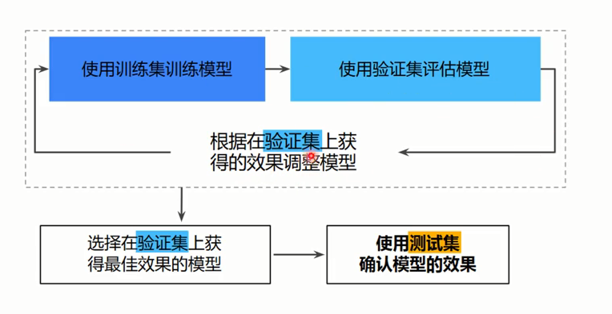

## 3.4 逻辑回归

线性回归到逻辑回归，预测问题到分类问题

许多问题的预测结果是一个在连续空间的数值，比如说房价预测问题，可以用线性模型来描述。

但也有很多问题需要输出的是概率估算值，比如邮件为垃圾邮件的可能性，肿瘤为恶性的可能性，手写数字为1的概率。

这时就需要将预测输出值控制在[0,1]区间内

二元分类问题的目标是正确预测出两个可能的标签中的一个。

逻辑回归可用于处理这类问题。

[分类问题的性能指标](https://www.jianshu.com/p/ac46cb7e6f87)

### 3.4.1 常见的激活函数

激活函数的作用：激活函数是用来加入非线性因素的，解决线性模型所不能解决的问题。

抽象点来说就是扭曲翻转特征空间，在其中寻找线性的边界。

下面这个解释比较形象可以参考，[神经网络激励函数的作用是什么？有没有形象的解释？ - 论智的回答 - 知乎](
https://www.zhihu.com/question/22334626/answer/465380541)

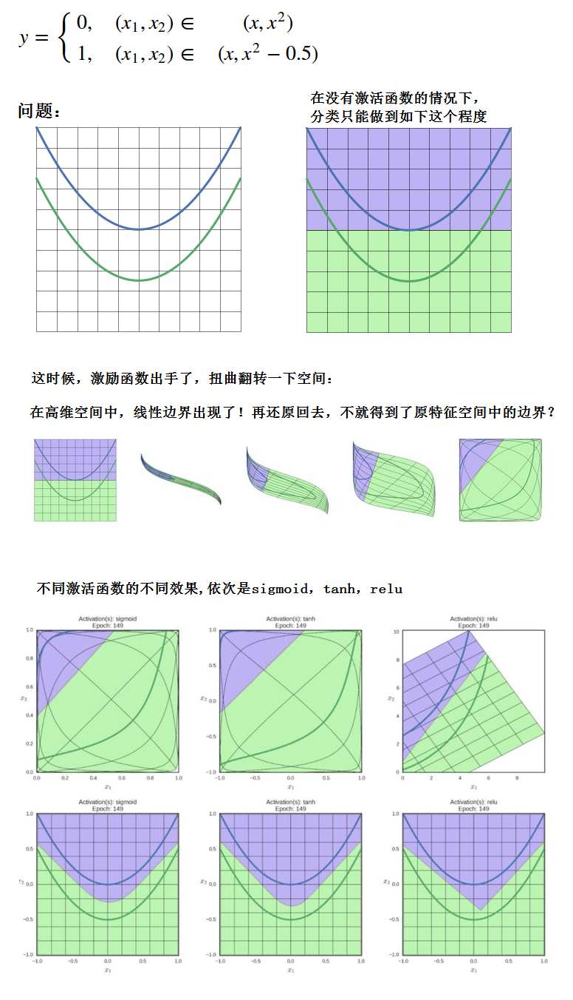

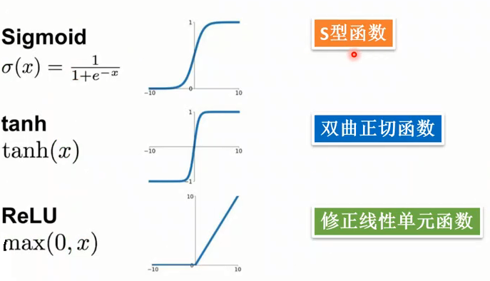

#### Sigmod函数


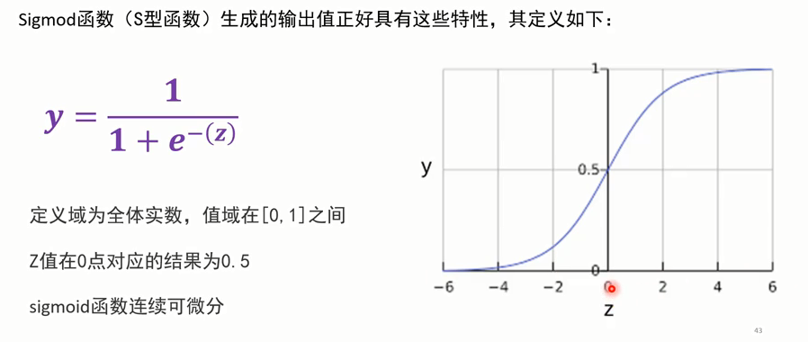

在这个问题中，
$$
z=x_1*w_1+x_2*w_2...+x_n*w_n+b
$$

#### softmax函数

Softmax在多类别问题中，Softmax会为每个类别分配一个用小数表示的概率。这些用小数表示的概率相加之和为1。

把smod的二元分类延伸为多元分类

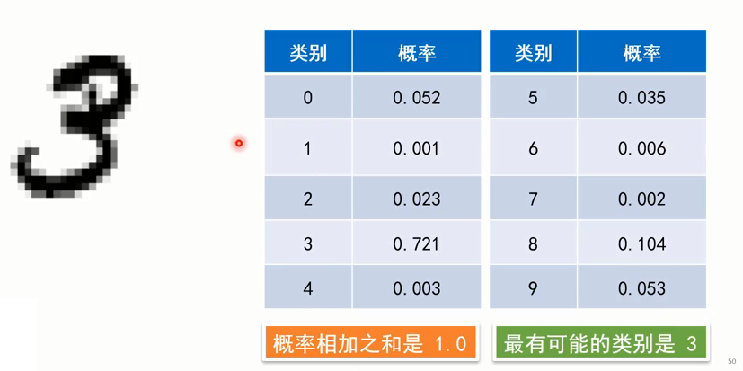

Softmax举例

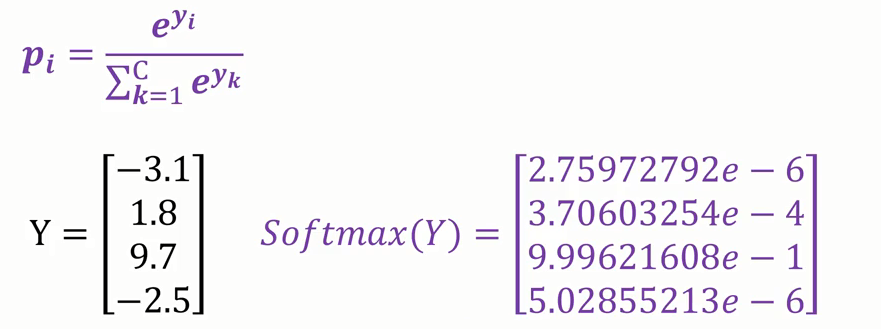

```python
tf.nn.softmax(
    logits,
    axis=None,
    name=None
)
#logits是一个张量，数据类型必须是half, float32, float64
```


#### tanh函数

双曲正切函数，以0为中心，收敛速度较快
$$
y=\frac{1-e^{-2x}}{1+e^{-2x}}
$$

#### relu函数

修正线性函数
$$
y=max(0,x)
$$


### 3.4.2 损失函数

#### 二元分类损失函数

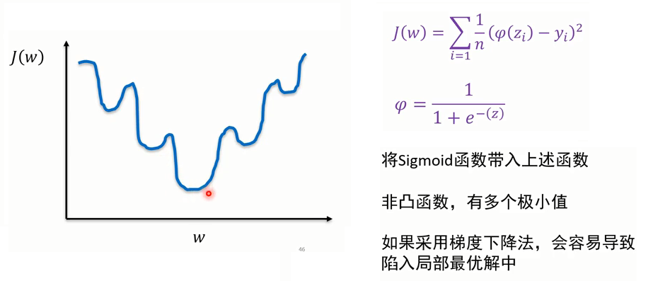

**因此在逻辑回归中，建议不要用平方损失函数**

二元逻辑回归的损失函数一般采用对数损失函数

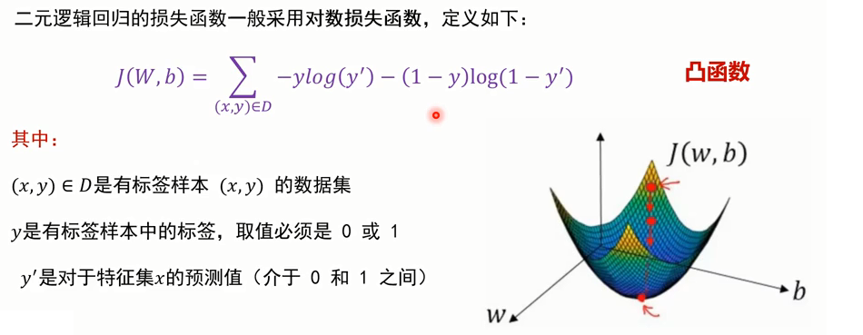

#### 多元分类损失函数

交叉熵是一个信息论中的概念，它原来是用来估算平均编码长度的。给定两个概率分布的p和q，通过q来表示p的交叉熵为
$$
H(p,q)=-\sum_{x}{p(x)\log{q(x)}}
$$
交叉熵刻画的是两个概率分布之间的距离，p代表正确答案，q代表预测值，交叉熵越小，两个概率越相近。

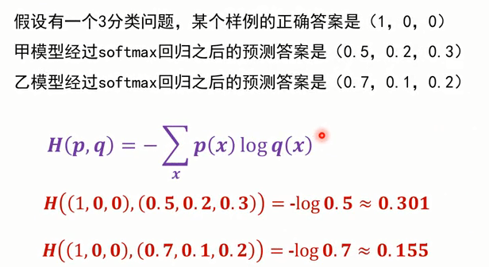


## 3.5 全连接神经网络

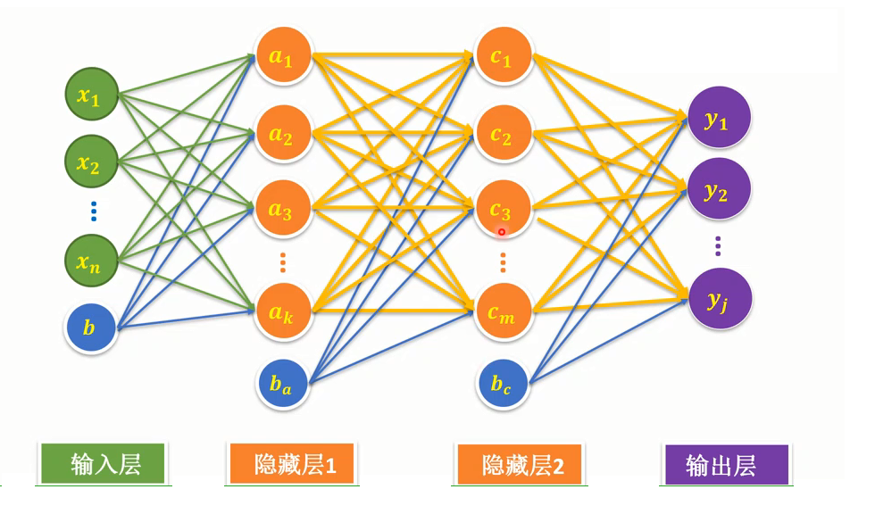

<center>两层全连接神经网络</center>

1. 输入层和输出层不计入神经网络的层数，输入和输出层之间的层叫做隐藏层
2. 层与层之间的神经元有连接，而层内之间的神经元没有连接
3. 全连接：每一个神经元与它层神经元（或输入单元、或输出单元）都有连接

### 3.5.1 全连接单隐层神经网络的实现

```python
import tensorflow as tf

import tensorflow_core.examples.tutorials.mnist.input_data as input_data

mnist=input_data.read_data_sets("MNIST_data/",one_hot=True)

#定义占位符
#mnist 中每张图片共有28*28=784个像素点，
x=tf.placeholder(tf.float32,[None,784],name='X')
#0-9一共十个数字，10个离散的类别，需要十位的独热码
y=tf.placeholder(tf.float32,[None,10],name='Y')

#构建隐藏层

#隐藏层神经元数量,依兴趣调整
H1_NN=256
W1=tf.Variable(tf.random_normal([784,H1_NN]))
b1=tf.Variable(tf.zeros([H1_NN]))

Y1=tf.nn.relu(tf.matmul(x,W1)+b1)

#构建输出层
W2=tf.Variable(tf.random_normal([H1_NN,10]))
b2=tf.Variable(tf.Variable(tf.zeros([10])))
forward=tf.matmul(Y1,W2)+b2
pred=tf.nn.softmax(forward)

#训练模型
#定义损失函数
#交叉熵

#如用此交叉熵函数将会训练失败
#loss_function=tf.reduce_mean(-tf.reduce_sum(y*tf.log(pred),reduction_indices=1))
#训练能成功的损失函数
loss_function=tf.reduce_mean(tf.nn.softmax_cross_entropy_with_logits(logits=forward,labels=y))


#设置训练的参数
train_epochs=40
batch_size=50
total_batch=int(mnist.train.num_examples/batch_size)
display_step=1
learning_rate=0.01

#选择优化器
optimizer=tf.train.AdamOptimizer(learning_rate).minimize(loss_function)

#定义准确率
#检查预测类别tf.argmax(pred,1)与实际类别tf.argmax(y,1)的匹配情况
correct_prediction=tf.equal(tf.argmax(pred,1),tf.argmax(y,1))
#tf.argmax(input,axis)根据axis取值的不同返回每行(axis=1)或者每列(axis=0)最大值的索引。

#准确率，将布尔值转化为浮点数，并计算平均值
accuracy=tf.reduce_mean(tf.cast(correct_prediction,tf.float32))
#tf.cast()函数的作用是执行 tensorflow 中张量数据类型转换

from time import time
startTime=time()
sess=tf.Session()
sess.run(init)

for epoch in range(train_epochs):
    for batch in range(total_batch):
        xs,ys=mnist.train.next_batch(batch_size)#读取批次数据
        sess.run(optimizer,feed_dict={x:xs,y:ys})#执行批次训练
    #total_batch个批次训练完成后，使用验证数据计算误差与准确率，验证集没有分批
    loss,acc=sess.run([loss_function,accuracy],feed_dict={x:mnist.validation.images,y:mnist.validation.labels})
    if(epoch+1) % display_step == 0:
        print("Train Epoch:",'%02d' % (epoch+1),"loss=","{:.9f}".format(loss),"Accuracy=","{:.4f}".format(acc))
#显示运行总时间
duration=time()-startTime
print("Train Finished takes","{:.2f}".format(duration))

#测试集准确率
accu_test= sess.run(accuracy,feed_dict={x:mnist.test.images,y:mnist.test.labels})
print("Test Accuracy:",accu_test)
```

## 3.6 神经网络-层构建函数

```python
def fcn_layer(inputs,#输入数据
             input_dim,#输入神经元数量
             output_dim,#输出神经元数量
             activation=None):#激活函数
    W=tf.Variable(tf.truncated_normal([input_dim,output_dim],stddev=0.1))
                    #以截断正态分布的随机数初始化W
    b=tf.variable(tf.zeros([output_dim]))
                    #以0初始化b
    XWb=tf.matmul(inputs,W)+b
    if activation is None:
        outputs=XWb
    else:
        outputs=activation(XWb)
        
    return outputs

h1=fcn_layer(inputs=x,input_dim=784,output_dim=256,activation=tf.nn.relu)
forward=fcn_layer(inputs=h1,input_dim=256,output_dim=10,activation=None)
pred=tf.nn.softmax(forward)
```

# 4 模型的保存和还原

当我们建立好模型后，通过数据的训练和模型的评估，已经得到了一个较好的应用模型，但是当我们关闭程序，我们所得到的模型（包括超参数、模型内部参数W和b）将全部在内存中销毁，模型被毁。

再者，有的模型需要我们去训练很久，1天、10天甚至一个月都有可能，在这个过程中，我们也需要实时的保存模型参数，并在下次使用时还原模型。

所以，我们需要在训练模型时保存模型。二次打开模型时还原模型，以供继续训练。

训练结束后我们需要用到模型文件。有时候，我们可能也需要用到别人训练好的模型，并在这个基础上再次训练。这时候我们需要掌握如何操作这些模型数据。

还有断点续训也有较大的需求。

**tensorflow的模型文件[ckpt](<https://www.cnblogs.com/demo-deng/p/10265290.html>)(checkpoint)**

## 4.1 模型保存

训练模型存盘，保存的是所有的变量当前运行的值。

模型保存步骤：

1. 声明：`saver = tf.train.Saver()`，**必须在声明完所有变量之后，在训练之前，使用**，这个是告诉tensorflow我们要训练哪些量，哪些量需要保存

   - 参数可以指定一个变量名列表（也`tf.Variable(tf.constant(1.0,shape = [1]),name = "a")`中的name参数).，指定部分变量进行保存，列表中的元素是变量名；

2. 设置模型保存路径

   ```python
   import os
   ckpt_dir="./ckpt_dir"
   if not os.path.exists(ckpt_dir):
       os.makedirs(ckpt_dir)
   ```

3. `saver.save(sess,os.path.join(ckpt_dir,model_name))`，

   - 保存模型并不一定需要在模型训练结束后，
   - 边训练边保存，最后通过分析，采用在最优的时候保存的模型

   ```python
   #训练过程中
   ...
   import time
   #文件名上面，带上时间戳
   #保存模型
   saver.save(sess,os.path.join(ckpt_dir,"model-{}".format(int(time.time())))
   #保存后，在模型路径下，生成了四个文件
   ```

4. [四个文件解析](https://blog.csdn.net/zuolixiangfisher/article/details/98755280)

   - checkpoint： All checkpoint information，保存的是checkpoint的信息，也就是通过它我知道最近保存的几个模型版本（保存了模型目录下多个模型文件的列表）
   - xxx.meta： 
     - 这是一个序列化的`MetaGraphDef protocol buffer`，包含数据流、变量的annotations、input pipelines，以及其他相关信息
     - 包含全部计算图graph结 构等信息。在不重新定义模型结构情况下，直接加载模型结构时会用到。
   - xxx.index： metadata，元数据 [ It’s an immutable table(tensoflow::table::Table). Each key is a name of a Tensor and it’s value is a serialized BundleEntryProto. Each BundleEntryProto describes the metadata of a Tensor]，
   - xxx.data-00000-of-00001： 包含所有变量的值(weights, biases, placeholders,gradients, hyper-parameters etc)，也就是模型训练好的参数和其他值

如下例程：

```python
#存储模型的粒度
save_step=5
#创建保存模型文件的目录
import os
ckpt_dir="./ckpt_dir"
if not os.path.exists(ckpt_dir):
    os.makedirs(ckpt_dir)
#声明完所有变量后，调用tf.train.Saver()
saver=tf.train.Saver()

########训练模型########

from time import time
startTime=time()
sess=tf.Session()
sess.run(init)

for epoch in range(train_epochs):
    for batch in range(total_batch):
        xs,ys=mnist.train.next_batch(batch_size)#读取批次数据
        sess.run(optimizer,feed_dict={x:xs,y:ys})#执行批次训练
    #total_batch个批次训练完成后，使用验证数据计算误差与准确率，验证集没有分批
    loss,acc=sess.run([loss_function,accuracy],feed_dict={x:mnist.validation.images,y:mnist.validation.labels})
    if(epoch+1) % display_step == 0:
        print("Train Epoch:",'%02d' % (epoch+1),"loss=","{:.9f}".format(loss),"Accuracy=","{:.4f}".format(acc))
    
    #每历经save_step轮，存储一次模型
    if(epoch+1) % save_step ==0:
        saver.save(sess,os.path.join(ckpt_dir,"mnist_h256_model_{:6d}".format(epoch+1)))#存储模型
        print('mnist_h256_model{:06d}.ckpt saved'.format(epoch+1))
saver.save(sess,os.path.join(ckpt_dir,'mnist_h256_model.ckpt'))
print('Model saved')

#显示运行总时间
duration=time()-startTime
print("Train Finished takes","{:.2f}".format(duration))
```


## 4.2 模型还原

从存盘的模型里面，把所有变量的值读取出来，然后赋给我们当前被还原模型。

**未加载模型结构，需要重新定义模型结构情况下，模型还原的基本步骤：**

1. 定义相同结构的模型

2. 声明定义的模型里需要还原的变量：`saver=tf.train.Saver()`

3. 指定已存盘模型数据的目录

   - ```python
     ckpt_dir="./ckpt_dir/"
     ckpt=tf.train.get_checkpoint_state(ckpt_dir)
     #ckpt如果不为None，那么它存在两个属性，
     #一个model_checkpoint_path为最新训练模型的模型名，
     #一个all_model_checkpoint_paths为模型文件夹下，所有模型的模型名的列表
     #可以在checkpoint文件中，看到这样的内容
     
     #目前遇到的问题是，all_model_checkpoint_paths它也变成了最新训练模型的模型名，特别的奇怪，现目前还没找到原因
     #如果能够解决这个问题，那么就可以达成加载不同的训练模型的目的
     ```

4. 读取存盘模型数据并还原

   - ```python
     if ckpt and ckpt.model_checkpoint_path:
         saver.restore(sess,ckpt.model_checkpoint_path)
         print("Restore model from "+ ckpt.model_checkpoint_path)
     ```

5. 使用模型

   

```python
#1.定义相同的模型
import tensorflow as tf
import tensorflow_core.examples.tutorials.mnist.input_data as input_data
mnist=input_data.read_data_sets("MNIST_data/",one_hot=True)
x=tf.placeholder(tf.float32,[None,784],name='X')
y=tf.placeholder(tf.float32,[None,10],name='Y')

H1_NN=256
W1=tf.Variable(tf.random_normal([784,H1_NN]))
b1=tf.Variable(tf.zeros([H1_NN]))

Y1=tf.nn.relu(tf.matmul(x,W1)+b1)
W2=tf.Variable(tf.random_normal([H1_NN,10]))
b2=tf.Variable(tf.Variable(tf.zeros([10])))

forward=tf.matmul(Y1,W2)+b2
pred=tf.nn.softmax(forward)
loss_function=tf.reduce_mean(tf.nn.softmax_cross_entropy_with_logits(logits=forward,labels=y))

train_epochs=40
batch_size=50
total_batch=int(mnist.train.num_examples/batch_size)
display_step=1
learning_rate=0.01

optimizer=tf.train.AdamOptimizer(learning_rate).minimize(loss_function)
correct_prediction=tf.equal(tf.argmax(pred,1),tf.argmax(y,1))
accuracy=tf.reduce_mean(tf.cast(correct_prediction,tf.float32))

#2.指定为模型文件的存放目录
ckpt_dir="./ckpt_dir/"

#3.读取模型数据并还原

#创建saver
saver=tf.train.Saver()

sess=tf.Session()

#在还原模型的时候，不需要初始化变量，当然在执行saver.restore()之前也可以使用，saver.restore()已经包含了初始化的操作
#当然如果你在tf.train.Saver()中只声明了部分变量得到保存，而其它部分变量没有保存，那么还是需要全局执行初始化操作。
#init=tf.global_variables_initializer()
#sess.run(init)

ckpt=tf.train.get_checkpoint_state(ckpt_dir)

if ckpt and ckpt.model_checkpoint_path:
    saver.restore(sess,ckpt.model_checkpoint_path)
    print("Restore model from "+ ckpt.model_checkpoint_path)

#测试还原效果
accu_test= sess.run(accuracy,feed_dict={x:mnist.test.images,y:mnist.test.labels})
print("Test Accuracy:",accu_test)
```

**[自动加载模型结构，模型还原的步骤](https://zhuanlan.zhihu.com/p/53642222)：**

1. 对操作命名，或将操作加入到集合中，以便还原模型时使用

   ```python
    #方式一：通过对操纵operation命名，由于tf.name_scope会对操作自动加上前缀，所以此操作的实际名为name_scope/pred_opt
       pred = tf.identity(model(x, w, b), name='pred_opt')
    #方式二：通过将操作operation加入到集合中，到时候从集合中取出即可使用
       tf.add_to_collection("pred_col", pred)
   ```

2. 加载模型，恢复对话

   ```python
   #加载模型并恢复到会话中
   #模型名.meta
   saver = tf.train.import_meta_graph('./model/model-1616402671.meta', clear_devices=True)
   saver.restore(sess, './model/model-1616402671')
   ```

3. 取出已存模型中的操作

   ```python
   #方式一：通过之前的命名，获取操作，这里是name_scope/operation_name
   pred_byname = tf.get_default_graph().get_operation_by_name('Model/pred_opt').outputs[0]
   #方式二：通过之前的集合，获取操作 
   pred_bycol = tf.get_collection('pred_col')[0]
   ```

4. 调用操作

   ```python
   #这里的feed_dict的第一个参数，为当前操作需要的参数的name（可能有name_scope)，加冒号，加一个0，如果没有冒号没有0，那么将会报下面的错
   #Cannot interpret feed_dict key as Tensor:
   #The name 'X' refers to an Operation, not a Tensor. Tensor names must be of the form "<op_name>:<output_index>".
   resp_byname = sess.run(pred_byname,feed_dict={'X:0': x_test})
   resp_bycol = sess.run(pred_bycol,feed_dict={'X:0': x_test})
   ```

   

5. 

```python
#波士顿预测房价的例子

#训练时，通过以下方式将相应的operation或tensor加入图graph中
...
with tf.name_scope("Model"):
    w = tf.Variable(tf.random_normal([12, 1], stddev=0.01), name='W')
    b = tf.Variable(1.0, name='b')
    def model(x, w, b):
        return tf.matmul(x, w)+b
    #方式一：通过对操纵operation命名，由于tf.name_scope会对操作自动加上前缀，所以此操作的实际名为Model/pred_opt
    pred = tf.identity(model(x, w, b), name='pred_opt')
    #方式二：通过将操作operation加入到集合中，到时候从集合中取出即可使用
    tf.add_to_collection("pred_col", pred)

#在复原模型时，
import numpy as np
import pandas as pd
import tensorflow as tf

df = pd.read_csv('./data/boston.csv')
df = df.values
df = np.array(df)
for i in range(12):
    df[:, i] = df[:, i]/(df[:, i].max()-df[:, i].min())
y_data = df[:, 12]
x_data = df[:, :12]

sess = tf.Session()
#加载模型并恢复到会话中
saver = tf.train.import_meta_graph('./model/model-1616402671.meta', clear_devices=True)
saver.restore(sess, './model/model-1616402671')

#方式一：通过之前的命名，获取操作，这里是name_scope/operation_name
pred_byname = tf.get_default_graph().get_operation_by_name('Model/pred_opt').outputs[0]
#方式二：通过之前的集合，获取操作 
pred_bycol = tf.get_collection('pred_col')[0]
n = np.random.randint(506)
print('n:', n)
x_test = x_data[n].reshape(1, 12)
resp_byname = sess.run(pred_byname,feed_dict={'X:0': x_test})
resp_bycol = sess.run(pred_bycol,feed_dict={'X:0': x_test})
target = y_data[n]
print("标签值：%f" % target )
# print("pred_byname预测值：%f" % resp_byname)
print("pred_bycol预测值：%f" % resp_bycol)

```


# 5 tensorBoard

除了GRAPHS栏目外，tensorboard还有IMAGES、AUDIO、SCALARS、HISTOGRAMS、DISTRIBUTIONS、FROJECTOR、TEXT、PR CURVES、PROFILE九个栏目

[各个栏目概览](https://blog.csdn.net/fendouaini/article/details/80368770)

## 5.1 初步

- tensorBoard是TensorFlow的可视化工具 。通过TensorFlow程序运行过程中输出的日志文件可视化TensorFlow程序的运行状态。
- tensorflow生产数据写到日志里面去，tensorboard不停的读取日志里的数据以一种可视化的方式展现出来。
- tensorflow和tensorboard程序分别跑在两个进程中，互不影响

<h5>写日志文件</h5>

```python
import tensorflow as tf
#...
#1.清除默认的图graph和不断增加的节点（清除之前的节点，这里还不太清楚只是我的推测）
tf.reset_default_graph()
#2.指定日志生成存放的路径
logdir = 'D:\tensorflow\log'
#3.定义计算图
#....
#4.生成一个写日志的writer，将当前的TensorFlow计算图写入日志文件
writer = tf.summary.FileWriter(logdir,tf.get_default_graph())
writer.close()
#5.运行程序后自动生成计算图的日志文件
```

<h5>启动tensorboard</h5>

1. 在Anaconda Prompt中，**进入日志存放的目录中**

2. 输入命令tensorboard --logdir=D:\tensorflow\log，然后系统启动了一个前端服务器，端口号默认6006，可以通过--port参数修改启动的端口

3. 在浏览器中复制命令行中的url，到graphs页即可。

   


## 5.2 [tf.summary](https://zhuanlan.zhihu.com/p/102776848)

在训练过程中记录数据的利器：tf.summary()提供了各类方法（支持各种多种格式）用于保存训练过程中产生的数据（比如loss_value、accuracy、整个variable），这些数据以日志文件的形式保存到指定的文件夹中。

数据可视化：而tensorboard可以将tf.summary()记录下来的日志可视化，根据记录的数据格式，生成折线图、统计直方图、图片列表等多种图。

tf.summary()通过递增的方式更新日志，这让我们可以边训练边使用tensorboard读取日志进行可视化，从而实时监控训练过程。

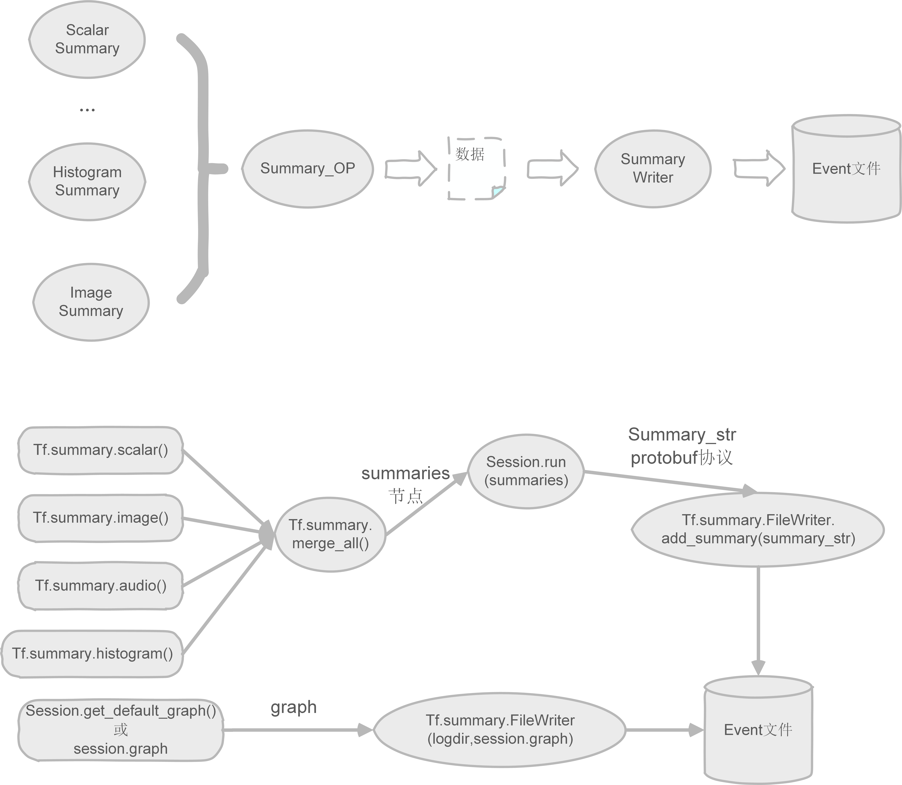

### [tensorboard使用流程](https://blog.csdn.net/gsww404/article/details/78605784?utm_source=blogxgwz7)

1. 添加记录节点：`tf.summary.scalar()/histogram()/image()`
2. 汇总记录节点：`merged=tf.summary.merge_all()`
3. 运行汇总节点：`summary=sess.run(merged)`，得到汇总结果，数据在缓存中
4. 日志书写器类实例化：`summary_writer=tf.summary.FileWriter(logdir,graph=sess.graph)`
   - 实例化的同时传入graph将当前计算图写入日志
5. 日志书写器对象写入日志到文件中：`summary_writer.add_summary(summary,global_setp=i)`，将所有汇总的日志写入文件
6. 关闭日志写入：`summary_writer.close()`方法写入内存，否则它将每隔120s写入一次


### summary writer实例

```python
SW = tf.summary.create_file_writer(logdir, max_queue=10, flush_millis=None, filename_suffix=None, name=None)
# 1.0 是这样的写法：tf.summary.FileWriter(logdir,graph=sess.graph)

# logdir:生成的日志将储存到logdir指定的路径中。
# max_queue:在向disk写入数据前，最大能缓存的event个数
# flush_millis:至少flush_mills毫秒内进行一次SW.flush()，强制将缓存数据写入events文件
# filename_suffix：日志文件的后缀。

# 函数返回 SummaryWriter实例对象。

# SummaryWriter类

class SummaryWriter(object):

    def set_as_default(self):
        """设定默认的 summary writer 
        亦即让此后出现的所有 summary 写入操作，都默认使用本个 summary writer 实例进行记录"""

    def as_default(self):
        """返回一个上下文管理器（配合with使用），记录context中出现的 summary 写入操作"""

    def flush(self):
        """强制将缓存中的数据写入到日志文件中"""

    def close(self, tensor):
        """强制将缓存中的数据写入到日志文件中，然后关闭 summary writer"""

    def init(self):
        """初始化"""
```

### summary.op

1. `tf.summary.scalar(name, data, step=None, description=None)`
   - 折线图
   - name：定义保存的数据归于哪个标签下，亦即，`data`将会保存到标签`tag_of_summary_writer/tag_of_data`下。在tensorboard中，将会对同一个标签下的数据绘制其随step或者时间变化的折线图。
   - data：标量值
   - step：类似于横坐标，必须是可以转化为int64的，递增的数值。如果省略，则默认采用`step=tf.summary.experimental.get_step()`
   - description：补充描述
2. `tf.summary.histogram(name, data, step=None, buckets=None, description=None)`
   - 直方图
   - **data**：任何形状的可转换为`float64`的`Tensor`
   - **buckets**：直方图中“桶”的个数。
3. `tf.summary.image(name, data, step=None, max_outputs=3, description=None)`
4. `tf.summary.audio()`


## [tensorflow游乐场](http://playground.tensorflow.org)

tensorflow游乐场是一个通过网页浏览器就可以训练的简单神经网络并实现了可视化训练过程

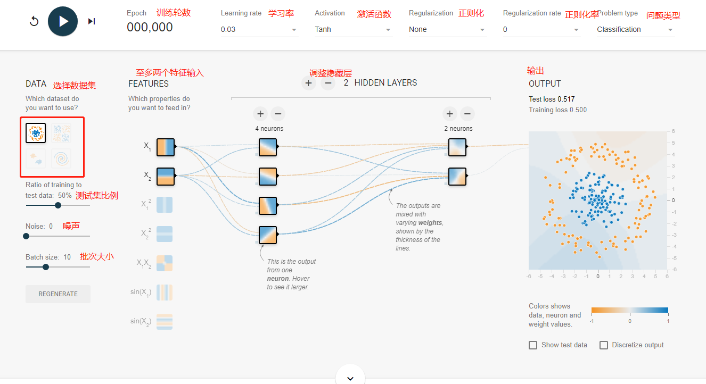

# 6 卷积神经网络(CNN)

应用：在自然语言和机器视觉都有应用，卷积神经网络在机器视觉中更为广泛，图像分类，物体检测、实例分割、看图说话、看图问答。

1962年，Hubel和Wiesel对猫的视觉皮层细胞研究，提出感受野（receptive field）的概念。视觉皮层的神经元就是局部接受信息的，只受某些特定区域刺激的响应，而不是对全局图像进行感知的。

1984年日本学者Fukushima基于感受野概念提出神经认知机（neocognitron)，将一个视觉模式分解为许多子模式，是视觉系统模式化。

CNN（Convolutional Neural Network）可看作是神经认知机的推广形式。

## 6.1 全连接神经网络的局限

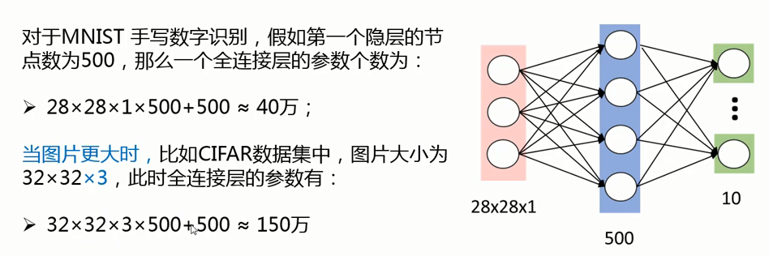

单层全连接神经网络的参数会随着图片的通道数和尺寸、隐层数量增多而成倍增加。参数过多会造成计算速度减慢、及过拟合现象。

## 6.2 CNN结构

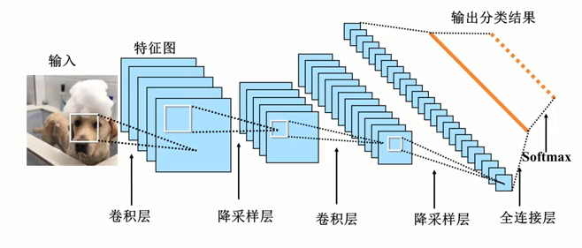

卷积层：卷积运算的主要目的是是原信号特征增强，并降低噪音

降采样层：降低网络训练参数及模型的过拟合程度。此层常常也叫作池化层，池化只是降采样层的一种实现方式。通俗来说，降采样也做降低图片分辨率

从图中我们可以看到，每经过一个卷积层，蓝色的卡片会增多，卡片越多代表特征越多。每经过一个采样层，卡片会越来越小，这减小了尺寸（分辨率递减）。

隐层与隐层之间空间分辨率递减（为了去除冗余信息），因此为了检测更多的特征信息、从而形成复杂的特征，需要逐渐增加每层所含的平面数（也就是特征图的数量）

## 6.3 卷积

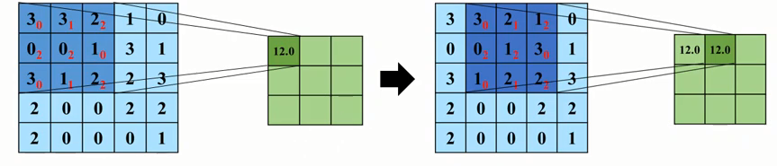

深蓝色的矩阵（权值矩阵）就是**卷积核**，卷积核在浅蓝色的数据矩阵做矩阵点积，点积结果作为一个特征像素点输出到绿色的**特征图**中，然后做滑动直至遍历整张图像，这个过程就叫卷积

### 步长（stride）

步长是卷积操作的重要概念，表示卷积核在图片上每次移动的格数。步长的变换可以得到不同尺寸的卷积输出结果

步长大于1的卷积操作也是一种降维方式，这时候就可以减少池化层

步长为S，原始图片尺寸为[N1,N1]，卷积核大小为[N2,N2]，卷积之后的图像大小：
$$
[\frac{(N1-N2)}{S}+1,\frac{(N1-N2)}{S}+1]
$$
卷积是通过**局部连接（每个输出特性不用查看每个输入特征，而只需查看部分输入特征）**和**权值共享（卷积核上的权值不变）**来降低参数个数的。

等尺寸卷积：在外侧填充假像素

多通道卷积：一个卷积核提取一种特征，多通道提供多个卷积核，可以提取更多的不同方面特征。

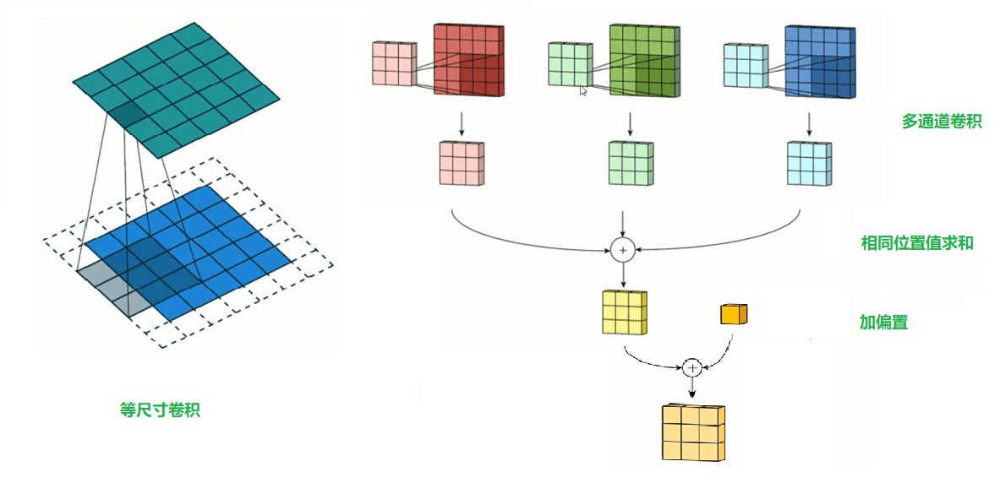


 ## 6.4 池化

在卷积层之后常常紧接着一个降采样层，通过减小矩阵的长和宽，从而达到减少参数的目的。

降采样是降低特定信号的采样率过程

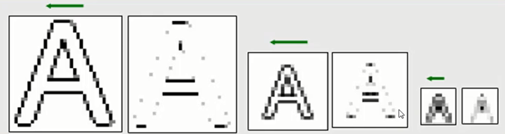

计算图像一个区域上的某个特定特征的平均值或最大值，这种聚合操作叫池化。

**卷积层的作用是探测上一层特征的局部连接，而池化的作用是在语义上把相似的特征合并起来，从而达到降维的目的**

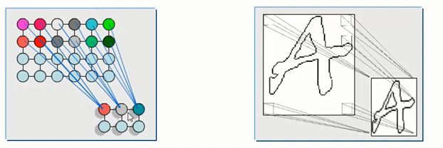

将多个点的平均值或最大值聚合到一个点上，这些概要统计特征不仅具有低得多的维度，同时还会改善结果（不容易过拟合）。

常用池化方法

1. 均值池化：对池化区域的像素点取均值，这种方法得到的特征数据对背景信息更敏感
2. 最大池化：对池化区域的像素点取最大值，这种方法得到的特征数据对纹理特征信息更敏感

## 6.5 tf对卷积神经网络的支持

卷积函数定义在tensorflow/python/ops下的nn_impl.py和nn_ops.py文件中：

<pre>
    tf.nn.conv2d(input,filter,strides,padding,use_cudnn_on_gpu=None,name=None)
    tf.nn.depthwise_conv2d(input,filter,strides,padding,name=None)
    tf.nn.separate_conv2d(input,depthwise_filter,pointwise_filter,strides,padding,name=None)
 参数解释：
 	input：需要做卷积的输入数据。注意这是一个四维的张量（[batch,in_height,in_width,in_channels])
 	filter：卷积核.[filter_height,filter_width,in_channels,out_channels]
 	strides：图像每一维的步长
 	padding：定义元素边框与元素内容之间的空间
</pre>

池化函数定义在tensorflow/python/ops下的nn.py和gen_nn_ops.py文件中：

<pre>
    tf.nn.max_pool(value,ksize,strides,padding,name=None)
    tf.nn.avg_pool(value,ksize,strides,padding,name=None)
 参数解释：
 		value：池化窗口的输入。
 		ksize：池化窗口的大小
 		stride：图像每一维的步长
</pre>


