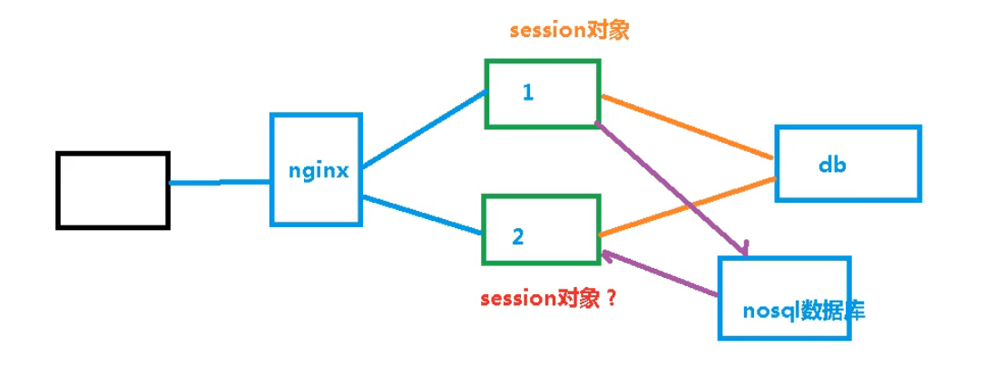
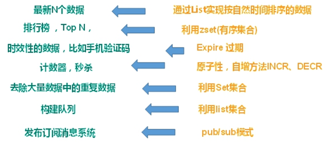
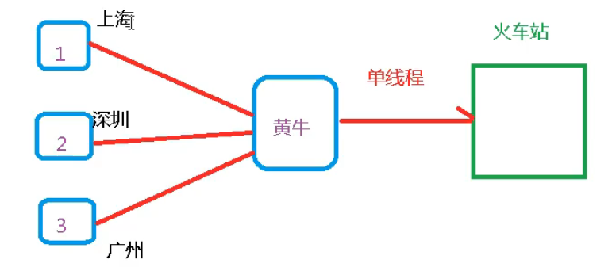
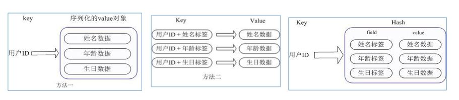
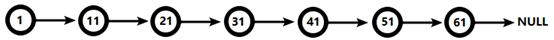
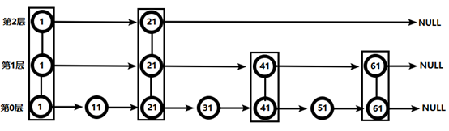
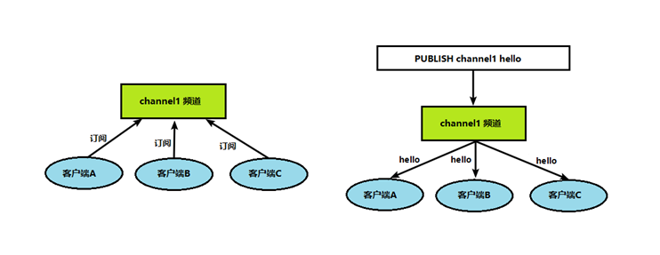
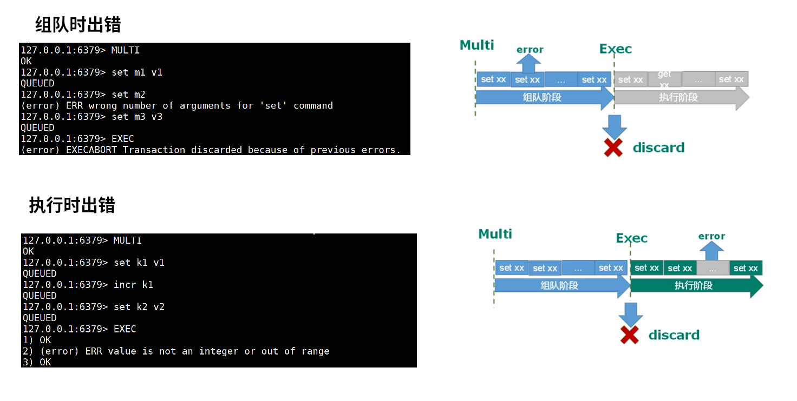

# Redis

[全文参考](https://zhangc233.github.io/2021/05/02/Redis/#Redis%E6%A6%82%E8%BF%B0)

# 0 NOSQL

NoSQL（Not only sql，泛指非关系型数据）

NoSQL不依赖业务逻辑方式存储，而以简单的key-value模式存储，因此大大增加了数据库的扩展能力。

- 不遵循SQL标准
- 不支持ACID（原子性，一致性，隔离性，持久性）
- 远超于SQL的性能

## 0.1 适用场景

nosql适用场景：

1. 对数据高并发的读写，eg：秒杀功能
2. 海量数据的读写
3. 对数据高可扩展性

nosql不适用的场景：

1. 需要事务支持
2. 处理复杂关系结构化查询

当用不着sql和用了sql也不行的情况，请考虑用Nosql

## 0.2 常用Nosql数据库

1. Memcache
   - 早期Nosql
   - 数据在内存中，一般不持久化
   - 支持key-Value，支持类型单一
   - 一般作为缓存数据库辅助持久化数据库
2. Redis
   - 几乎覆盖了Memcache的绝大部分功能
   - 数据都在内存中，**支持持久化**，主要用作备份和恢复
   - 除了支持简单的key-value，还支持多种数据结构（list，set，hash，zset）的存储。
   - 一般作为缓存数据库辅助持久化数据库
3. MongoDB
   - 高性能、开源、模式自由的文档型数据库
   - 数据都在内存中，如果内存不足，把不常用的数据保存到硬盘中
   - 不仅支持key-value，而且对value（尤其是json）提供了丰富的查询功能
   - 支持二进制数据及大型对象
   - 可以根据数据的特点，去替代RDBMS（关系数据库管理系统），成为独立的数据库。或者配合RDBMS存储特定的数据。
4. 行列式数据库（大数据时代）
   - 行式数据库
   - 列式数据库
     - Hbase——hadoop项目中的数据库
     - Apache Cassandra，其设计目的在于管理大量商用服务器构建起来的庞大集群上俄海量数据集（数据量通常在PB级别）
5. DB engine

# 1 Redis概述

- Redis 是一个开源的 key-value 存储系统。
- 和 Memcached 类似，它支持存储的 value 类型相对更多，包括 string (字符串)、list (链表)、set (集合)、zset (sorted set –有序集合) 和 hash（哈希类型）。
- 这些数据类型都支持 push/pop、add/remove 及取交集并集和差集及更丰富的操作，而且这些操作都是原子性的。
- 在此基础上，Redis 支持各种不同方式的排序。
- 与 memcached 一样，为了保证效率，数据都是缓存在内存中。
- 区别的是 Redis 会周期性的把更新的数据写入磁盘或者把修改操作写入追加的记录文件。
- 并且在此基础上实现了 master-slave (主从) 同步。

## 1.1 应用场景

### 1.1.1 配合关系型数据库做高速缓存

1. 高频次，热门访问的数据，降低数据库 IO。
2. 分布式架构，做 session 共享。

#### 服务器集群的session问题

客户端发起请求后，经过nginx代理转发，给服务器1，然后在服务器1产生session，第二次同样的客户端发起请求，nginx将它分配到服务器2，而服务器2没有对应的session对象，然后客户端那边拿不到相应的请求结果（但客户端本身是登录过了，为啥没有session）。此时就存在以下几种方案

1. cookie存储相应的session信息。缺点：信息不安全，网络符负担重。
2. 存在文件服务器或者数据库里。缺点：大量io，效率低下
3. session对象复制。缺点：session对象相同，复制越多，空间越浪费，服务器集群越大空间浪费越严重。
4. 将session放到nosql数据库中，第一次登录，将session放到nosql中，第二次进入其它服务器后，先到nosql中查询是否有session对象，如果有，就不再登录了。优点：放置在缓存中，速度快，数据结构简单




#### 解决IO压力

大量常用高频的查询数据放置到nosql中解决IO压力。

### 1.1.2 利用redis多样化数据结构去持久化数据




## 1.2 安装redis

环境要求：gcc

apt-get直接安装

```bash

# 1. 从ubuntu仓库中安装
sudo apt-get install redis-server

# 验证是否安装成功，执行下面命令，返回PONG则成功
redis-cli ping

# 2. 修改配置文件
sudo vi /etc/redis/redis.conf

# 修改密码
# 找到#   requirepass foobared这一行，将注释符号#去掉，将后面修改成自己的密码
requirepass 123456

# 可以后台服务化
daemonize yes

# 开启远程访问
# 注释掉 bind 127.0.0.1
# 去掉保护模式
protected-mode no

# 3. 修改配置后，需要重启服务
/etc/init.d/redis-server restart   #重启
# /etc/init.d/redis-server start     #启动
# /etc/init.d/redis-server stop      #关闭

# 查看redis运行状态
service redis-server status

# 使用密码登录命令行，设置密码后，直接使用：redis-cli ping 就会出现 (error) NOAUTH Authentication required.
redis-cli -h 127.0.0.1 -p 6379 -a 123456

# redis默认端口
6379
```

也可以自行下载安装包进行安装：https://redis.io/download/

```bash

tar -zxvf redis-6.2.14.tar.gz
cd redis-6.2.14
make
make install
# 默认会安装到/usr/local/bin
# 如果通过apt-get 安装，则默认安装到/usr/bin

# 有以下命令
redis-benchmark
redis-check-aof
redis-check-rdb
redis-cli 客户端操作入口
redis-server 服务器管理
```

## 1.3 单线程+多路IO复用

**Redis 使用的是单线程 + 多路 IO 复用技术**

- 多路IO复用：select和epoll
  - 多路复用是指使用一个线程来检查多个文件描述符（Socket）的就绪状态，比如调用 select 和 poll 函数，传入多个文件描述符，如果有一个文件描述符就绪，则返回，否则阻塞直到超时。得到就绪状态后进行真正的操作可以在同一个线程里执行，也可以启动线程执行（比如使用线程池）。
- memcache采用的是：锁 + 多线程




## 1.4 redis-cli 客户端常用操作

```bash
# 使用密码登录命令行
# 设置密码后，直接使用：redis-cli ping 就会出现 (error) NOAUTH Authentication required.
redis-cli -h 127.0.0.1 -p 6379 -a 123456
```

### 1.4.1 库操作

redis默认有16个数据库，默认使用0号库

```bash
# 切换数据库
select <dbid> 
# 统一密码管理，所有库密码相同

# 查看当前库key的数量
dbsize
# 清空当前库 
flushdb
# 清空全部库
flushall
```

### 1.4.2 key操作

```bash
# 1. 查看正则匹配到的key
keys <reg>
# 查看所有key
keys *

# 2. 设置key为对应的值(没有对应的key时，增加key并设置为val，有对应的key时，修改key对应的值)
set <key> <val>
# 得到某个key的值
get <key>
# 3. key是否存在
exists k1
# 4. 查看key是什么类型
type k1
# 5. 删除指定key的数据
del k1
# 非阻塞删除，执行之时，仅将key从keyspace源数据中立即删除，真正的删除会在后续异步删除
unlink k1

# 6. 为指定的key设置过期时间,单位秒
expire k1 10 
# 7. 查看还有多少秒的过期，-1：永不过期，-2：已过期
ttl k1
```

### 1.4.3 原子操作

所谓原子操作指不会被线程调度机制打断的操作。

这种操作一旦开始，就一直运行到结束，中间不会有任何上下文的切换

redis单命令的原子性主要得益于redis的单线程。

# 2 数据类型

Redis可以存储键和五种不同类型的值之间的映射。 **键的类型只能为字符串，值支持五种数据类型:字符串、列表、集合、散列表、有序集合等。**

## 2.1 String

- String 类型是二进制安全的，只要内容可以用字符串表示，都可以存到库里面去。eg：图片
- String 类型是 Redis 最基本的数据类型，一个 Redis 中字符串 value 最多可以是 512M。

```bash
# 在k1对应的value后追加abc
append k1 abc
# 获取值的长度
strlen k1
# 只有k1不存在时，才设置k1的值
setnx k1 val1
# 加减1，val为是数值类型的字符串值才行，否则报错(error) ERR value is not an integer or out of range
incr k1
decr k1
# 按步长增减
incrby k1 20	# <key> <step>
decrby k1 20

# 
mset <k1> <v1> <k2> <v2>
mget <k1> <k2>
msetnx <k1> <v1> <k2> <v2>		# 当且仅当所有key都不存在时，才对所有对应的key设置值

# 获取字符串索引范围内的值
getrange <key> <起始位置> <结束位置>	
# 从指定字符串索引的位置处开始，覆盖对应val长度的值
setrange <key> <起始位置> <val>			

# 设置值的同时设置过期时间，单位：s
setex <key> <过期时间> <val>
#以新换旧，在设置新值前，先获取旧值。如果这是一个没有设置过的key，那么会返回nil
getset <key> <val> 					
```

### 数据结构

String 的数据结构为简单动态字符串 (Simple Dynamic String, 缩写 SDS)，是可以修改的字符串，内部结构实现上类似于 c++ 的 Vector，采用预分配冗余空间的方式来减少内存的频繁分配。


如图中所示，内部为当前字符串实际分配的空间 capacity 一般要高于实际字符串长度 len。当字符串长度大于 1M 时，扩容都是加倍现有的空间，如果超过 1M，扩容时一次只会多扩 1M 的空间。需要注意的是字符串最大长度为 512M。

## 2.2 List

单键多值：Redis 列表是简单的**字符串列表**，按照插入顺序排序。你可以添加一个元素到列表的头部（左边）或者尾部（右边）。

```bash
# 从左端/右端压入一个或多个值
lpush/rpush <k1> <v1> <v2> <v3>
# 从左端/右端吐出一个值，list长度不为0,那么这个list就会依然存在。值在键在，值光键亡
lpop/rpop <k1>

#从k1列表右边吐出一个值，压入k2列表的左边
rpoplpush <k1> <k2> 
# 按照索引下标获得元素（从左到右）
lrange <k1> <start> <stop> 
# 按照索引下标获得元素（从左到右）
lindex <key> <index> 	
# 获得列表长度
llen <key> 					

#在val的前面/后面插入newval
linsert <key> before/after <val> <newval> 
# 从左边删除n个val（必须要和val值相同才会被删除掉）
lrem <key> <n> <val>
# 将列表key下标为index的值替换成val
lset <key> <index> <val> 	
```

### 数据结构

它的底层实际是个双向链表，**对两端的操作性能很高，通过索引下标的操作中间的节点性能会较差。**


- List 的数据结构为快速链表 quickList。
- 首先在列表元素较少的情况下会使用一块连续的内存存储，这个结构是 ziplist，也即是压缩列表。它将所有的元素紧挨着一起存储，分配的是一块连续的内存。
- 当数据量比较多的时候才会改成 quicklist。因为普通的链表需要的附加指针空间太大，会比较浪费空间。比如这个列表里存的只是 int 类型的数据，结构上还需要两个额外的指针 prev 和 next。
- Redis 将链表和 ziplist 结合起来组成了 quicklist。也就是将多个 ziplist 使用双向指针串起来使用。这样既满足了快速的插入删除性能，又不会出现太大的空间冗余。


## 2.3 Set

- Redis set 对外提供的功能与 list 类似，是一个列表的功能，特殊之处在于 **set 是可以自动排重的**，当你需要存储一个列表数据，又不希望出现重复数据时，set 是一个很好的选择，并且 set 提供了判断某个成员是否在一个 set 集合内的重要接口，这个也是 list 所不能提供的。

- Redis 的 Set 是 string 类型的无序集合。它底层其实是一个 value 为 null 的 hash 表，所以添加，删除，查找的 **复杂度都是 O (1)**。

```bash
# 添加多个val到集合key中
sadd <key> <v1> <v2>
# 取出该集合所有值
smembers <key> 
# 判断集合key是否含有该val值，返回1：有，0：没有
sismember <key> <value>
# 返回集合的元素个数
scard <key>
# 删除集合中的某个元素
srem <key> <v1> <v2>
# 随即从集合中吐出一个值
spop <key>
# 随即从该集合中取出n个值，不会从集合中删除
srandmember <key> <n>
# 从一个集合移动到另一个集合
smove <source> <destination> val
# 取交集
sinter <k1> <k2>
# 取并集
sunion <k1> <k2>
# 取差集，包含在k1中，不包含在k2中的元素
sdiff <k1> <k2>
```

### 数据结构

- Set 数据结构是 dict 字典，字典是用哈希表实现的。
- Redis 的 set 结构内部使用的是 hash 结构，所有的 value 都指向同一个内部值。


## 2.4 Hash

- Redis hash 是一个键值对集合。

- Redis hash 是一个 string 类型的 field 和 value 的映射表，hash 特别适合用于存储对象。

- Redis 中每个 hash 可以存储 232 - 1 键值对（40多亿）。

- 用户 ID 为查找的 key，存储的 value 用户对象包含姓名，年龄，生日等信息，如果用普通的 key/value 结构来存储，主要有以下 2 种存储方式：

  - 方法一：每次修改用户的某个属性需要，先反序列化改好后再序列化回去。开销较大。
  - 方法二：用户 ID 数据冗余。
  - Hash：通过 key (用户 ID) + field (属性标签) 就可以操作对应属性数据了，既不需要重复存储数据，也不会带来序列化和并发修改控制的问题。


  

```bash
# 给key集合中添加键值对<field>-<value>
hset <key> <field> <value>
# 从key集合中取出field对应的value值
hget <key> <field>
# 批量设置
hmset <key> <f1> <v1> <f2> <v2>
# 查询键是否存在
hexists <key> <field>
# 列出所有键field
hkeys <key>
# 列出所有值val
hvals <key>
# 增加field对应的值
hincrby <key> <field> <increment>
# 当且仅当field不存在时，设置对应的键值
hsetnx <key> <field> <value>
```

### 数据结构

Hash 类型对应的数据结构是两种：ziplist（压缩列表），hashtable（哈希表）。当 field-value 长度较短且个数较少时，使用 ziplist，否则使用 hashtable。

## 2.5 Zset

- Redis 有序集合 zset 与普通集合 set 非常相似，是一个没有重复元素的字符串集合。
- 不同之处是有序集合的每个成员都关联了一个评分（score），这个评分（score）被用来按照从最低分到最高分的方式排序集合中的成员。集合的成员是唯一的，但是评分可以是重复了 。
- 因为元素是有序的，所以你也可以很快的根据评分（score）或者次序（position）来获取一个范围的元素。
- 访问有序集合的中间元素也是非常快的，因此你能够使用有序集合作为一个没有重复成员的智能列表

```bash
# 将多个member元素及其score加入到有序集key中
zadd <key> <score1> <val1> <score2> <val2>
# 返回有序集合，下标在<start> <stop>之间的元素，带WITHSCORES时，可以让分数一起和值返回到结果集中。
zrange <key> <start> <stop> [WITHSCORES]
# 返回有序集合中，所有score接于min max之间（闭区间）的成员，有序集成员按照score值递增的次序排列
zrevrangebyscore key max min [withscore] [limit offset count]
# 为元素加increment
zincrby <key> <increment> <value>
# 删除该集合下，指定的元素
zrem <key> <value>
# 统计该集合，在分数区间内的元素个数
zcount <key> <min> <max>
# 返回该值在集合中的排名
zrank <key> <value> 
```


### 数据结构

zset 底层使用了两个数据结构：

- hash，hash 的作用就是关联元素 value 和权重 score，保障元素 value 的唯一性，可以通过元素 value 找到相应的 score 值。

- 跳跃表，跳跃表的目的在于给元素 value 排序，根据 score 的范围获取元素列表。


对比有序链表和跳跃表，从链表中查询出 51：

- 有序链表



 要查找值为 51 的元素，需要从第一个元素开始依次查找、比较才能找到。共需要 6 次比较。

- 跳跃表



- 从第 2 层开始，1 节点比 51 节点小，向后比较；
- 21 节点比 51 节点小，继续向后比较，后面就是 NULL 了，所以从 21 节点向下到第 1 层；
- 在第 1 层，41 节点比 51 节点小，继续向后，61 节点比 51 节点大，所以从 41 向下；
- 在第 0 层，51 节点为要查找的节点，节点被找到，共查找 4 次。

从此可以看出跳跃表比有序链表效率要高。

# 3 redis配置文件

```bash
# 1. 配置单位大小，配置一些基本的度量单位，只支持bytes，大小写不敏感
unit
# 包含部分，此文件可以包含其它文件（公共配置）的内容，类似于宏
inclue


# 2. 网络部分network
# 可以被什么ip端的电脑访问
# 默认：bind 127.0.0.1
bind 0.0.0.0

# 保护模式，智能以本机访问
# 默认：protect-mode yes
protected-mode no

# 端口号
port 6379
# backlog其实是一个连接队列，backlog队列总和=未完成3次握手队列 + 已经完成三次握手队列
# 在高并发环境下你需要一个高backlog值来避免慢客户端连接问题。
tcp-backlog 511

# 断开连接，在客户端闲置timeout 秒后断开连接
timeout 0

# 每隔300s检测一次客户端是否还活着，还在操作，如果没有，则断开。
tcp-keepalive 300


# 3. GENERAL 通用
# 是否可以以守护进程的方式启动redis
daemonize yes

# 保存redis进程的进程号的文件地址
pidfile /var/run/redis/redis-server.pid

# 日志级别
loglevel notice
# 指定log文件的位置
logfile /var/log/redis/redis-server.log

# 默认在redis里面数据库的数量
databases 16


#4. security 安全
# 默认：requirepass foobared，没有密码
requirepass 123456


# 5.CLIENTS
# 客户端最大连接数
maxclients 10000

# 6. MEMORY MANAGEMENT
# 最大的内存的占用
maxmemory <bytes>
# 超过占用，移除哪些数据的规则
maxmemory-policy ---

```

# 4 发布订阅

Redis 发布订阅 (pub/sub) 是一种消息通信模式：发送者 (pub) 发送消息，订阅者 (sub) 接收消息。

Redis 客户端可以订阅任意数量的频道。

建立频道，客户端通过订阅频道，等到给这个频道发布消息后，消息就会发送给订阅的客户端。



发布订阅命令行实现

```bash
# 打开一个客户端订阅 channel1
SUBSCRIBE channel1
#打开另一个客户端，给 channel1 发布消息 hello
publish channel hello

# 在第一个客户端可以看到发送的消息
```

# 5 事务与锁

## 5.1 事务定义

Redis 事务是一个单独的隔离操作：事务中的所有命令都会序列化、按顺序地执行。事务在执行的过程中，不会被其他客户端发送来的命令请求所打断。

**Redis 事务的主要作用就是串联多个命令防止别的命令插队。**

## 5.2 事务的命令

Redis 事务中有 Multi（命令组队）、Exec（执行命令组） 和 discard（放弃当前组队） 三个指令。

- 从输入 Multi 命令开始，输入的命令都会依次进入命令队列中，但不会执行。
- 直到输入 Exec 后，Redis 会将之前的命令队列中的命令依次执行。
- 而组队的过程中可以通过 discard 来放弃组队。


## 5.3 事务的错误处理

- 组队中某个命令出现了报告错误，执行时整个的所有队列都会被取消。
- 如果执行阶段某个命令报出了错误，则只有报错的命令不会被执行，而其他的命令都会执行，不会回滚。



## 5.4 事务的冲突问题

- 悲观锁 (Pessimistic Lock)，顾名思义，就是很悲观，每次去拿数据的时候都认为别人会修改，所以每次在拿数据的时候都会上锁，这样别人想拿这个数据就会 block 直到它拿到锁。传统的关系型数据库里边就用到了很多这种锁机制，比如行锁，表锁等，读锁，写锁等，都是在做操作之前先上锁。

- 乐观锁 (Optimistic Lock)，顾名思义，就是很乐观，每次去拿数据的时候都认为别人不会修改，所以不会上锁，但是在更新的时候会判断一下在此期间别人有没有去更新这个数据，可以使用版本号等机制。乐观锁适用于多读的应用类型，这样可以提高吞吐量。

Redis 就是利用这种 check-and-set 机制实现事务的。

### redis中使用乐观锁

#### watch

在执行 multi 之前，先执行 watch key1 [key2]，可以监视一个 (或多个) key ，如果在事务执行之前这个 (或这些) key 被其他命令所改动，那么事务将被打断。

#### unwatch

取消 WATCH 命令对所有 key 的监视。如果在执行 WATCH 命令之后，EXEC 命令或 DISCARD 命令先被执行了的话，那么就不需要再执行 UNWATCH 了。

```bash
watch k1 k2 k3 ...

unwatch
```

## 5.5 事务三特性

- 单独的隔离操作 ：事务中的所有命令都会序列化、按顺序地执行。事务在执行的过程中，不会被其他客户端发送来的命令请求所打断。

- 没有隔离级别的概念 ：队列中的命令没有提交之前都不会实际被执行，因为事务提交前任何指令都不会被实际执行。**需要配合乐观锁**

- 不保证原子性 ：事务中如果有一条命令执行失败，其后的命令仍然会被执行，没有回滚 

## 5.6 秒杀案例


步骤：

1. 判断userid和productid是否为空
2. 连接redis
3. 拼接key
4. 获取库存，如果库存为null，表示秒杀还未开始
5. 判断用户是否重复秒杀
6. 判断如果库存数量小于1了，秒杀结束
7. 秒杀过程：库存减1，用户id添加到成功者清单

```java
	//秒杀过程
	public static boolean doSecKill(String uid,String prodid) throws IOException {
		//1 uid和prodid非空判断
		if(uid == null || prodid == null) {
			return false;
		}

		//2 连接redis
		//Jedis jedis = new Jedis("192.168.44.168",6379);
		//通过连接池得到jedis对象
		JedisPool jedisPoolInstance = JedisPoolUtil.getJedisPoolInstance();
		Jedis jedis = jedisPoolInstance.getResource();

		//3 拼接key
		// 3.1 库存key
		String kcKey = "sk:"+prodid+":qt";
		// 3.2 秒杀成功用户key
		String userKey = "sk:"+prodid+":user";

		//监视库存
		jedis.watch(kcKey);

		//4 获取库存，如果库存null，秒杀还没有开始
		String kc = jedis.get(kcKey);
		if(kc == null) {
			System.out.println("秒杀还没有开始，请等待");
			jedis.close();
			return false;
		}

		// 5 判断用户是否重复秒杀操作
		if(jedis.sismember(userKey, uid)) {
			System.out.println("已经秒杀成功了，不能重复秒杀");
			jedis.close();
			return false;
		}

		//6 判断如果商品数量，库存数量小于1，秒杀结束
		if(Integer.parseInt(kc)<=0) {
			System.out.println("秒杀已经结束了");
			jedis.close();
			return false;
		}

		//7 秒杀过程
		//使用事务
		Transaction multi = jedis.multi();

		//组队操作
		multi.decr(kcKey);
		multi.sadd(userKey,uid);

		//执行
		List<Object> results = multi.exec();

		if(results == null || results.size()==0) {
			System.out.println("秒杀失败了....");
			jedis.close();
			return false;
		}

		//7.1 库存-1
		//jedis.decr(kcKey);
		//7.2 把秒杀成功用户添加清单里面
		//jedis.sadd(userKey,uid);

		System.out.println("秒杀成功了..");
		jedis.close();
		return true;
	}
```

### 并发模拟

```bash
ab -n 1000 -c 100 -p ~/postfile -T application/x-www-form-urlencoded http://127.0.0.1:8000/seckill
# -n 指定请求次数，-c 指定同时并发的请求数
# -T content-type eg:'application/x-www-form-urlencoded'
# -p postfile post请求的请求参数放置的文件，前提需要指定-T;
```

### 连接超时问题

通过连接池使用

连接池参数：

- MaxTotal：控制一个 pool 可分配多少个 jedis 实例，通过 pool.getResource () 来获取；如果赋值为 - 1，则表示不限制；如果 pool 已经分配了 MaxTotal 个 jedis 实例，则此时 pool 的状态为 exhausted。

- maxIdle：控制一个 pool 最多有多少个状态为 idle (空闲) 的 jedis 实例；

- MaxWaitMillis：表示当 borrow 一个 jedis 实例时，最大的等待毫秒数，如果超过等待时间，则直接抛 JedisConnectionException；

- testOnBorrow：获得一个 jedis 实例的时候是否检查连接可用性（ping ()）；如果为 true，则得到的 jedis 实例均是可用的。


### 库存为负数问题（超卖）

用乐观锁解决超卖问题

### 库存为正数问题（库存遗留）

客观锁虽然可以解决超卖问题，但同时可能造成库存遗留问题。

可以通过lua脚本解决

将复杂的或者多步的redis操作，写为一个脚本，一次性提交给redis执行，减少反复连接，提高性能。

lua脚本类似于redis事务，有一定的原子性，不会被其它命令插队。

通过lua脚本解决争抢问题，实际上是利用的时redis的单线程特性，用任务队列的方式解决多任务并发问题。

# 6 持久化

# 7 主从复制

# 8 集群


# log

1. Redis的URL写法格式如下：

   - **redis://[:password@]host[:port][/db_number][/db_number][?option=value]**

   - ```bash
     # 可以只有密码没有用户
     redis://:123456@192.168.100.138:6379/10
     # db在后面指定
     redis://:123456@192.168.100.138:6379?timeout=3000&db=10&max_connections=50
     ```

   - 