# SpringCloud

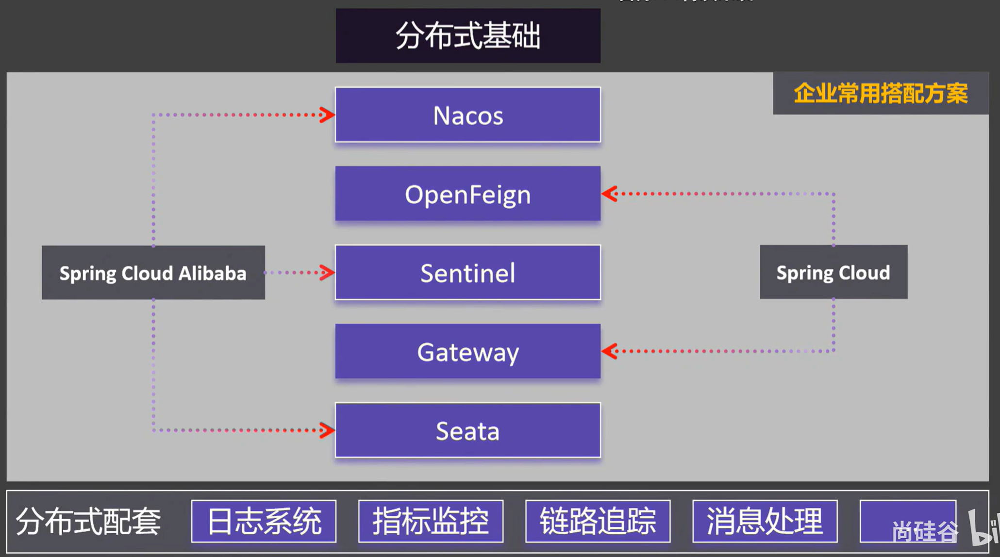

参考文档：https://github.com/mofan212/spring-cloud-demo/blob/master/README.md

参考视频：https://www.bilibili.com/video/BV1UJc2ezEFU

# 0 绪论

## 0.1 架构演进

### **单体架构**

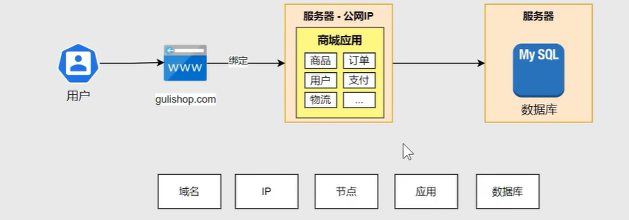

### **集群架构**

它指的是一种物理形态

解决大并发问题。

缺点：模块化升级，多语言团队

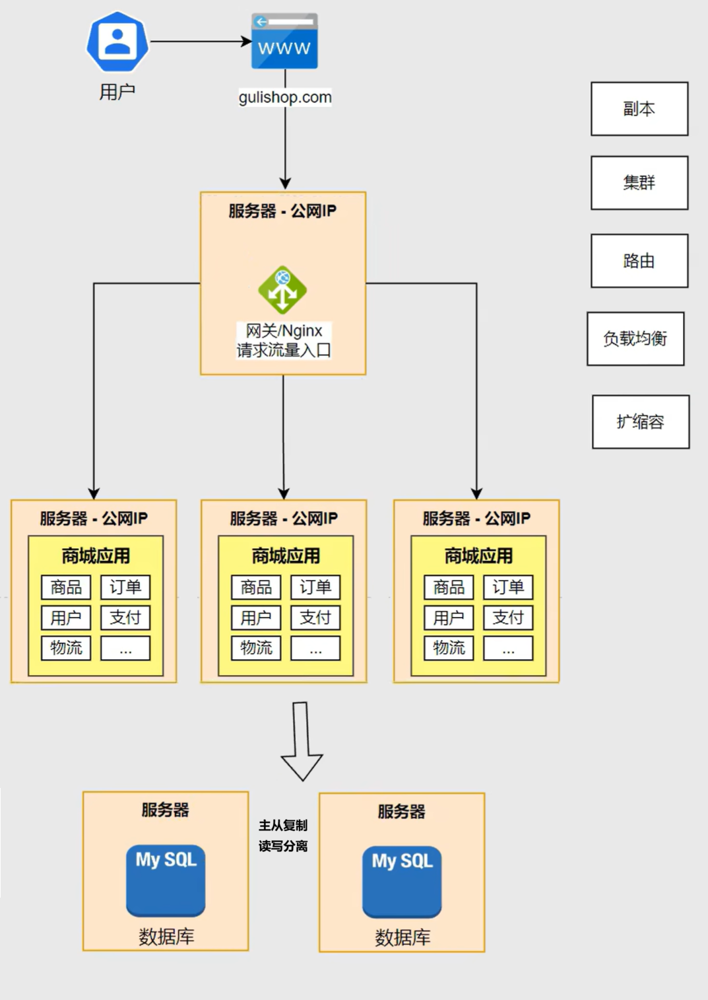

### **微服务架构**

一个大型应用被拆分成很多小应用，分布部署在各个机器

- 微服务应用：SpringBoot
- 注册中心/配置中心：Spring Cloud Alibaba Nacos
  - 服务发现和注册
  - 配置变更的主动下发
- 网关：Spring Cloud Gateway
- 远程调用（RPC）：Spring Cloud OpenFeign
  - 微服务之间的相互调用
- 服务熔断：Spring Cloud Alibaba Sentinel
  - 当一个服务请求另一个服务发生阻塞时（远程调用期间），为了防止这种阻塞导致的链式反应（服务雪崩），而执行的快速失败机制
  - eg：订单服务请求支付服务，前5秒支付服务只成功了50%，为了防止订单服务的阻塞，那么后5秒，直接让订单服务请求的支付服务直接失败
- 分布式事务：Spring Cloud Alibaba Seata
  - 服务拆分后，那么数据库也进行了拆分，不同数据库相关的数据如果存在事务关系，那么就需要用到分布式事务

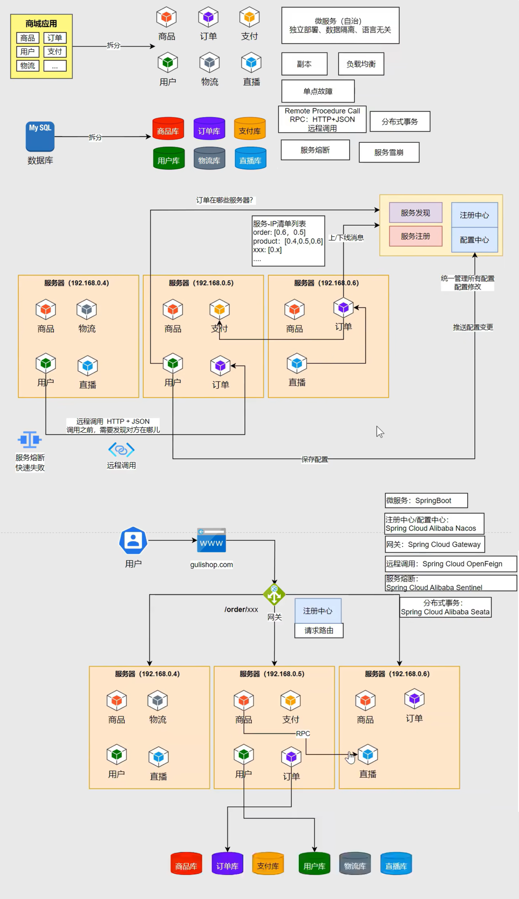

## 0.2 微服务

传统项目：**单体架构**

- 所有功能（用户、订单、支付、商品）全部写在一个项目里
- 打包一个 jar /war，部署一台服务器
- 缺点：牵一发动全身、改个小功能要全量发布、不好扩容

**微服务架构**：

把一个庞大的单体项目，**按业务拆分**成一个个独立、小型、自治的小服务：

- 用户服务、订单服务、商品服务、支付服务…
- 每个服务**独立开发、独立打包、独立部署、独立扩容**
- 服务之间通过 HTTP / RPC 互相调用协作


**一个微服务 = 一个 SpringBoot 项目**

- 用户微服务 → 一个 SpringBoot 工程
- 订单微服务 → 另一个 SpringBoot 工程
- 每个服务单独启动、单独运行、互不影响


完整技术栈层级（从上到下）

- 架构层：**微服务架构**（思想）
- 代码层：**SpringBoot**（写单个服务）
- 治理层：SpringCloud / SpringCloudAlibaba（服务注册、发现、熔断、网关、配置中心）


SpringCloud 是一套**微服务治理全家桶**，专门解决：**几十个 SpringBoot 微服务拆分开之后，互相怎么调用、怎么管控、怎么保证稳定**。

SpringCloud 是基于 SpringBoot 的**微服务治理框架合集**，提供服务注册发现、负载均衡、网关路由、熔断降级、配置中心、分布式事务、链路追踪等全套能力，用来解决微服务拆分后，服务通信、统一管控、高可用、分布式协作的问题。

## 0.3 [版本说明](https://github.com/alibaba/spring-cloud-alibaba/wiki/%E7%89%88%E6%9C%AC%E8%AF%B4%E6%98%8E)

由于 Spring Boot 3.0，Spring Boot 2.7~2.4 和 2.4 以下版本之间变化较大，所以社区为此专门做了适配。

教程推荐版本：

- SpringBoot：3.3.4
- SpringCloud：2023.0.3
- SpringCloud Alibaba：2023.0.3.2

组件版本：

- Nacos：2.4.3
- Sentinel：1.8.8
- Seata：2.2.0

JDK17

Maven：3.9.16

项目结构：

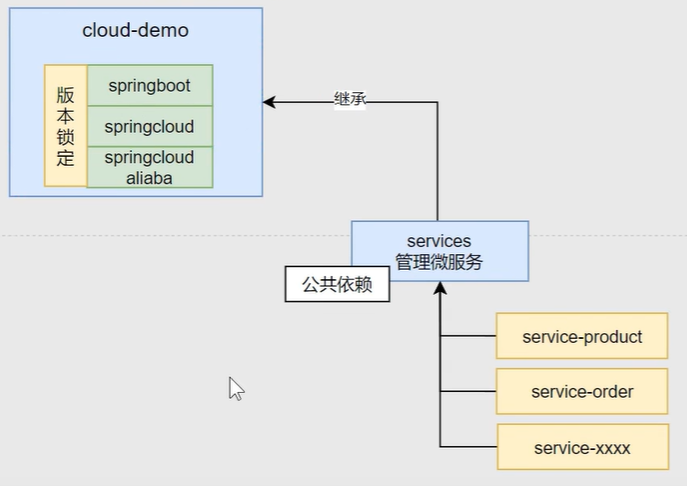

# 1 [Nacos](https://nacos.io/)

Nacos （Dynamic Naming and Configuration Service）一个更易于构建云原生应用的动态服务发现、配置管理和服务管理平台。

## 1.1 安装

安装：

- 下载最新的 Nacos 安装包，本文使用 Nacos-2.5.1
- 启动命令：`startup.cmd -m standalone`，`-m, --mode`

下载好的安装包后，解压到非中文目录，进入 `bin` 目录，执行启动命令。

```bash
startup.cmd -m standalone
"nacos is starting with standalone"

         ,--.
       ,--.'|
   ,--,:  : |                                           Nacos 2.4.3
,`--.'`|  ' :                       ,---.               Running in stand alone mode, All function modules
|   :  :  | |                      '   ,'\   .--.--.    Port: 8848
:   |   \ | :  ,--.--.     ,---.  /   /   | /  /    '   Pid: 25644
|   : '  '; | /       \   /     \.   ; ,. :|  :  /`./   Console: http://10.114.13.182:8848/nacos/index.html
'   ' ;.    ;.--.  .-. | /    / ''   | |: :|  :  ;_
|   | | \   | \__\/: . ..    ' / '   | .; : \  \    `.      https://nacos.io
'   : |  ; .' ," .--.; |'   ; :__|   :    |  `----.   \
|   | '`--'  /  /  ,.  |'   | '.'|\   \  /  /  /`--'  /
'   : |     ;  :   .'   \   :    : `----'  '--'.     /
;   |.'     |  ,     .-./\   \  /            `--'---'
'---'        `--`---'     `----'

2026-05-27 20:13:55,209 INFO Tomcat initialized with port(s): 8848 (http)
```

访问：http://localhost:8848/nacos，

- 配置管理：配置中心

## 1.2 服务注册

1. 在pom.xml中，引入 `spring-boot-starter-web`、`spring-cloud-starter-alibaba-nacos-discovery` 依赖，**记得添加后，要刷新引入，否则web服务无法启动**

   - `spring-cloud-starter-alibaba-nacos-discovery`

     ```xml
     <!-- 在services.xml 中，nacos服务发现 -->
     <dependency>
         <groupId>com.alibaba.cloud</groupId>
         <artifactId>spring-cloud-starter-alibaba-nacos-discovery</artifactId>
     </dependency>
     ```

   -  `spring-boot-starter-web`

     ```xml
     <!-- 在service-order.xml 中，这是搭建web服务器所需要的依赖 -->
     <dependency>
         <groupId>org.springframework.boot</groupId>
         <artifactId>spring-boot-starter-web</artifactId>
     </dependency>
     ```

2. 编写web应用：

   `cloud-demo1/services/service-order/src/main/java/com/yanfang/order/OrderMainApplication.java`

   ```java
   package com.yanfang.order;
   
   import org.springframework.boot.SpringApplication;
   import org.springframework.boot.autoconfigure.SpringBootApplication;
   
   @SpringBootApplication
   public class OrderMainApplication {
       public static void main(String[] args){
           SpringApplication.run(OrderMainApplication.class, args);
       }
   }
   ```

3. 编写配置文件

   `cloud-demo1/services/service-order/src/main/resources/application.properties`

   ```properties
   spring.application.name=service-order
   server.port=8000
   
   spring.cloud.nacos.server-addr=127.0.0.1:8848
   ```

4. 运行OrderMainApplication

5. 访问 `http://localhost:8848/nacos/`，服务管理 -> 服务列表

   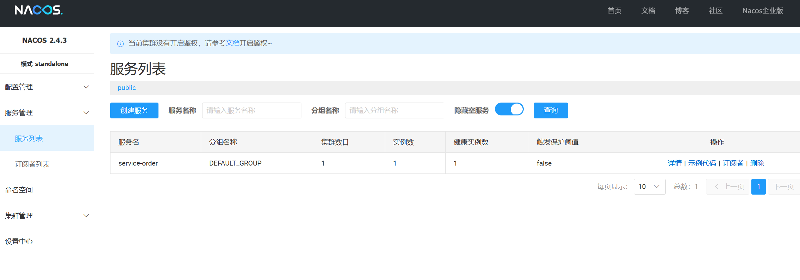

6. 开启多个微服务

   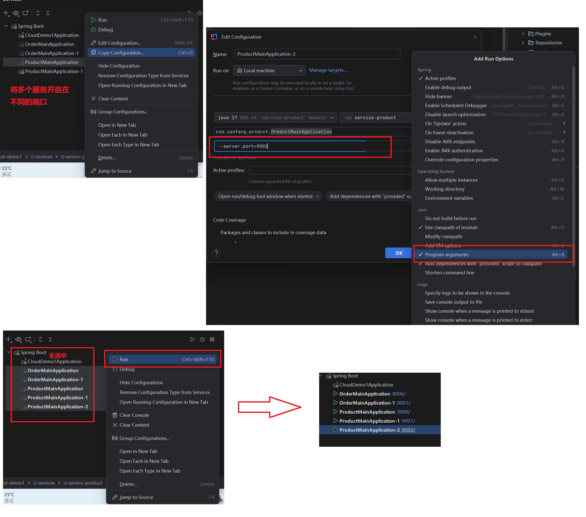

7. 查看nacos

   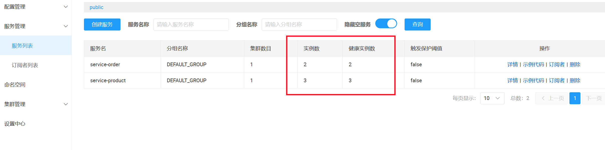


## 1.3 服务发现

1. 开启服务发现，在主启动类上添加 `@EnableDiscoveryClient` 注解

2. 测试两款 API 的服务发现功能：`DiscoveryClient` 和 `NacosServiceDiscovery`。前者为 Spring 提供的服务发现标准接口，后者由 Nacos 提供。

   - 写一个测试类测试一下

   - 在pom.xml中引入test依赖

     ```xml
     <dependency>
         <groupId>org.springframework.boot</groupId>
         <artifactId>spring-boot-starter-test</artifactId>
         <scope>test</scope>
     </dependency>
     ```

   - `cloud-demo1/services/service-product/src/test/java/com.yanfang.product.DiscoveryTest.java`

     ```java
     package com.yanfang.product;
     
     import com.alibaba.cloud.nacos.discovery.NacosServiceDiscovery;
     import com.alibaba.nacos.api.exception.NacosException;
     import org.junit.jupiter.api.Test;
     import org.springframework.beans.factory.annotation.Autowired;
     import org.springframework.boot.test.context.SpringBootTest;
     import org.springframework.cloud.client.ServiceInstance;
     import org.springframework.cloud.client.discovery.DiscoveryClient;
     
     import java.util.List;
     
     
     @SpringBootTest
     public class DiscoveryTest {
         @Autowired
         DiscoveryClient discoveryClient;
     
         @Autowired
         NacosServiceDiscovery nacosServiceDiscovery;
     
         @Test
         void nacosServiceDiscoveryTest() throws NacosException{
             for(String service: nacosServiceDiscovery.getServices()){
                 System.out.println("service=" + service);
                 List<ServiceInstance> instances = nacosServiceDiscovery.getInstances(service);
                 for(ServiceInstance instance : instances){
                     System.out.println("server ip: "+instance.getHost() + "; port: "+instance.getPort());
     
                 }
             }
         }
     
         @Test
         void discoveryClientTest(){
             for(String service: discoveryClient.getServices()){
                 System.out.println("service=" + service);
                 List<ServiceInstance> instances = discoveryClient.getInstances(service);
                 for(ServiceInstance instance : instances){
                     System.out.println("server ip: "+instance.getHost() + "; port: "+instance.getPort());
     
                 }
             }
         }
     }
     
     
     /*打印出
     service=service-order
     server ip: 10.114.13.182; port: 8001
     server ip: 10.114.13.182; port: 8000
     service=service-product
     server ip: 10.114.13.182; port: 9002
     server ip: 10.114.13.182; port: 9001
     server ip: 10.114.13.182; port: 9000
     */
     ```

## 1.4 远程调用

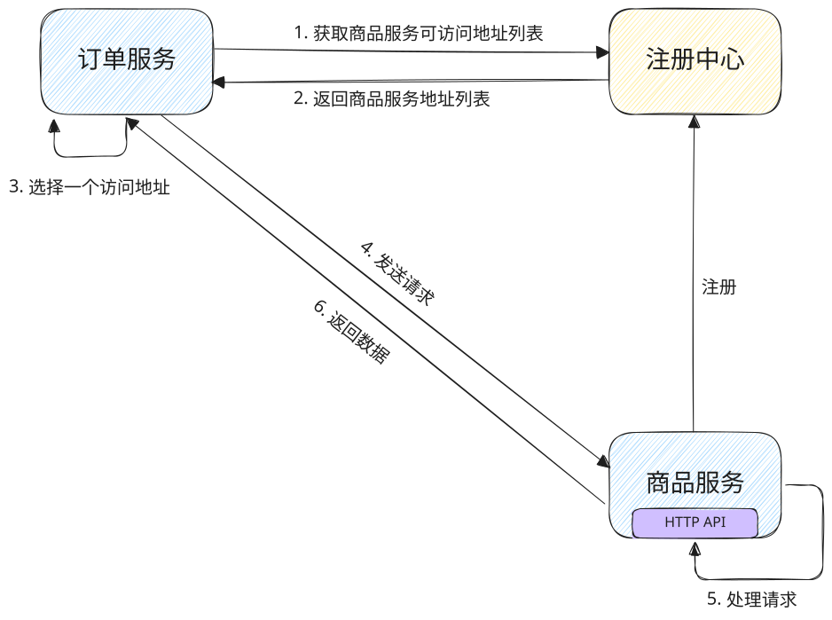

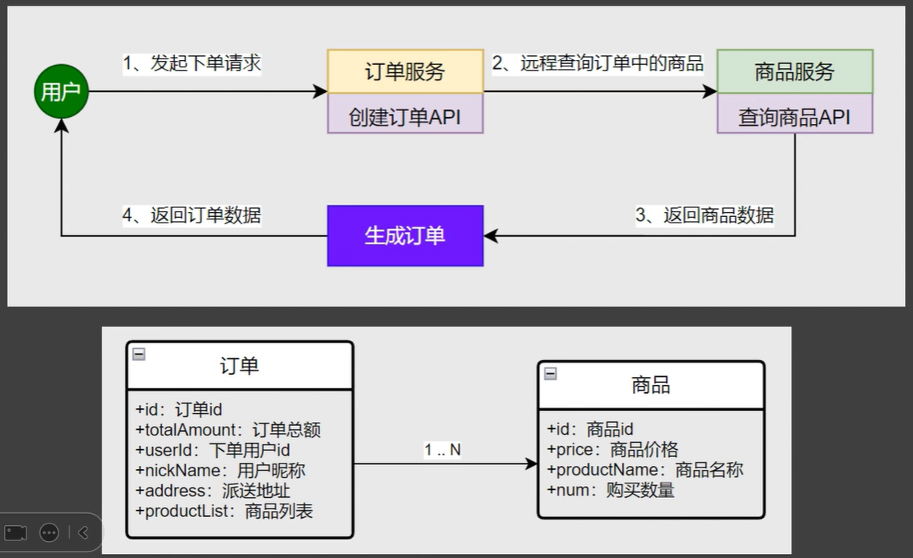

## 1.5 负载均衡

引入依赖：

```xml
<dependency>
    <groupId>org.springframework.cloud</groupId>
    <artifactId>spring-cloud-starter-loadbalancer</artifactId>
</dependency>
```


### 1.5.1 使用 `LoadBalancerClient` 实现

```java
private Product getProductFromRemoteWithLoadBalancerClient(Long productId){
    //1、获取到商品服务所在的所有机器IP+port
    ServiceInstance choose = loadBalancerClient.choose("service-product");
    //远程URL
    String url = "http://"+choose.getHost() +":" +choose.getPort() +"/product/"+productId;
    log.info("远程请求：{}", url);
    //2、给远程发送请求
    Product product = restTemplate.getForObject(url, Product.class);
    return product;
}
```

### 1.5.2 使用 `@LoadBalanced` 注解实现

在配置类中向 Spring 容器添加 `RestTemplate` 的 Bean，在 Bean 方法上添加 `@LoadBalanced` 注解，使用 `RestTemplate` 进行远程调用时，修改传入的 URL 为服务名

```java
package com.yanfang.order.config;

import org.springframework.cloud.client.loadbalancer.LoadBalanced;
import org.springframework.context.annotation.Bean;
import org.springframework.context.annotation.Configuration;
import org.springframework.web.client.RestTemplate;


@Configuration
public class OrderServiceConfig {

    @LoadBalanced
    @Bean
    public RestTemplate restTemplateBalancer(){
        return new RestTemplate();
    }
}
```

```java
private Product getProductFromRemoteWithLoadBalancerAnnotation(Long productId){
    //远程URL
    String url = "http://service-product/product/"+productId;
    //2、给远程发送请求：service-product会被动态替换
    Product product = restTemplateBalancer.getForObject(url, Product.class);
    //restTemplate那里需要用@LoadBalanced进行注解
    return product;
}
```

```java
// 在product中加HttpServletRequest request，可以查看请求地址信息

@GetMapping("/product/{id}")
public Product getProduct(@PathVariable("id") Long productId, HttpServletRequest request){
    String requestURL = request.getRequestURL().toString();
    System.out.println("请求完整地址："+requestURL);
    Product product = productService.getProductById(productId);
    return product;
}
```

### 1.5.3 面试题：如果注册中心宕机

经典面试题：如果注册中心宕机，远程调用是否可以成功？

- 如果从未调用过，此时注册中心宕机，调用会立即失败
- 如果调用过：
  - 此时注册中心宕机，会因为存在缓存的服务信息，调用会成功
  - 如果注册中心和对方服务都宕机，因为会缓存名单，调用会阻塞后失败（Connection Refused）

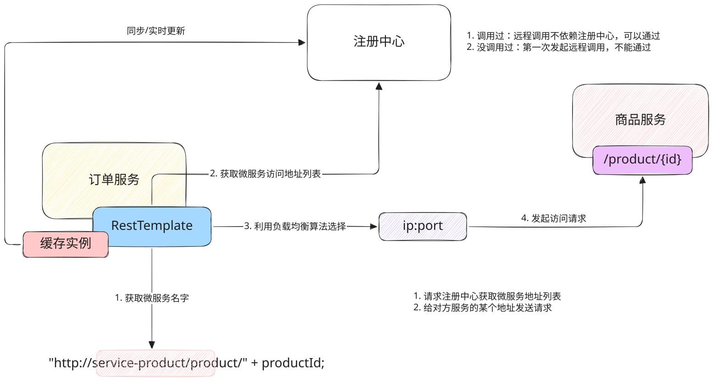

## 1.6 配置中心

在大型分布式系统里面，配置中心可以用来管理所有微服务的配置。

想要修改配置，只需要在配置中心修改，就可以实时把变更的配置推送给指定的微服务，从而实现不停机配置更新。

1. 引入配置中心依赖

   ```xml
   <!--  配置中心，在services中的pom.xml   -->
   <dependency>
       <groupId>com.alibaba.cloud</groupId>
       <artifactId>spring-cloud-starter-alibaba-nacos-config</artifactId>
   </dependency>
   ```

2. 在各自的微服务中的`application.properties`中

   ```properties
   spring.application.name=service-order
   server.port=8000
   
   spring.cloud.nacos.server-addr=127.0.0.1:8848
   
   # 添加这一行
   spring.config.import=nacos:service-order.properties

3. 在nacos中，访问：`localhost:8848/nacos`，配置管理 -> 配置列表，创建配置

   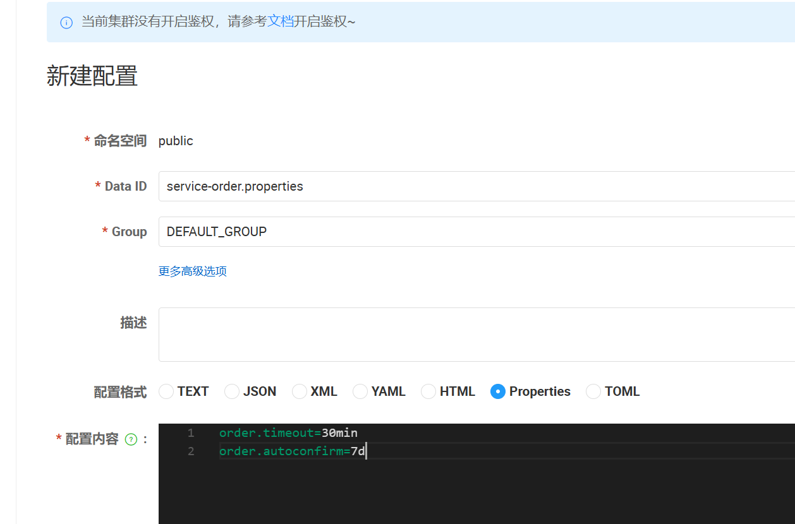

### 1.6.1 @Value + @RefreshScope

**适用于少量配置**

1. 在微服务中访问配置

   ```java
   package com.yanfang.order.controller;
   
   import org.springframework.beans.factory.annotation.Autowired;
   import org.springframework.beans.factory.annotation.Value;
   import org.springframework.web.bind.annotation.GetMapping;
   import org.springframework.cloud.context.config.annotation.RefreshScope;
   import org.springframework.web.bind.annotation.RestController;
   
   @RefreshScope	// 当配置修改后，接口里面能获取到更新后的值
   @RestController
   public class OrderController {
   
   
       @Value("${order.timeout}")
       String orderTimeout;
       @Value("${order.auto-confirm}")
       String orderAutoConfirm;
   
       @GetMapping("/config")
       public String config(){
           return "order.timeout="+orderTimeout+";  order.auto-confirm="+orderAutoConfirm;
       }
   }
   ```

   

2. 重启微服务order

   ```bash
   # 会看见
   [Nacos Config] Load config[dataId=service-order.properties, group=DEFAULT_GROUP] success
   ...
   [Nacos Config] Listening config: dataId=service-order.properties, group=DEFAULT_GROUP
   ```

3. 浏览器访问：`http://localhost:8000/config`，返回：`order.timeout=30min; order.auto-confirm=7d`

4. 如果你在services中添加了配置中心的服务，在order微服务中使用了配置中心，而在product中没使用，那么就会在product重启的时候报下面的错误，你要在product的application.properties中，添加`spring.cloud.nacos.config.import-check.enabled=false`就不会再报错
   ```bash
   15:34:28.577 [main] ERROR org.springframework.boot.diagnostics.LoggingFailureAnalysisReporter -- 
   
   ***************************
   APPLICATION FAILED TO START
   ***************************
   
   Description:
   
   No spring.config.import property has been defined
   
   Action:
   
   Add a spring.config.import=nacos: property to your configuration.
   	If configuration is not required add spring.config.import=optional:nacos: instead.
   	To disable this check, set spring.cloud.nacos.config.import-check.enabled=false.
   ```

### 1.6.2 `@ConfigurationProperties` 无感自动刷新

1. 在`src/main/java/com/yanfang/order/properties/OrderProperties.java`下

   ```java
   package com.yanfang.order.properties;
   
   import lombok.Data;
   import org.springframework.boot.context.properties.ConfigurationProperties;
   import org.springframework.stereotype.Component;
   
   @Component
   @ConfigurationProperties(prefix = "order")      // 配置批量绑定，在nacos中，无需@RefreshScope就能实现自动刷新
   @Data
   public class OrderProperties {
       String timeout;
   
       String autoConfirm;     // 在properties中的短横线可以映射为驼峰写法
   }
   
   ```

   

2. 访问配置

   ```java
   @RestController
   public class OrderController {
   
   
       @Autowired
       OrderProperties orderProperties;
   
       @GetMapping("/config")
       public String config(){
           return "order.timeout="+orderProperties.getTimeout()+";  order.auto-confirm="+orderProperties.getAutoConfirm();
       }
   }
   ```


### 1.6.3 订阅配置的变化

场景：

1. 项目启动就监听配置文件变化
2. 发生变化后拿到变化的值
3. 发送邮件


```java
package com.yanfang.order;

import com.alibaba.cloud.nacos.NacosConfigManager;
import com.alibaba.nacos.api.config.ConfigService;
import com.alibaba.nacos.api.config.listener.Listener;
import org.springframework.boot.ApplicationRunner;
import org.springframework.boot.SpringApplication;
import org.springframework.boot.autoconfigure.SpringBootApplication;
import org.springframework.cloud.client.discovery.EnableDiscoveryClient;
import org.springframework.context.annotation.Bean;

import java.util.concurrent.Executor;
import java.util.concurrent.Executors;

@EnableDiscoveryClient // 开启服务发现功能
@SpringBootApplication
public class OrderMainApplication {
    public static void main(String[] args){
        SpringApplication.run(OrderMainApplication.class, args);
    }

    @Bean
    ApplicationRunner applicationRunner(NacosConfigManager nacosConfigManager) {
        return args -> {
            ConfigService configService = nacosConfigManager.getConfigService();

            // 这里的dataId可以不是本微服务的properties，也可以是其他properties，只要配置中心有
            configService.addListener("service-order.properties", "DEFAULT_GROUP",
                    new Listener() {
                        @Override
                        public Executor getExecutor() {
                            return Executors.newFixedThreadPool(4);
                        }

                        @Override
                        public void receiveConfigInfo(String configInfo) {
                            System.out.println("变化的配置信息："+ configInfo);
                            System.out.println("邮件通知...");
                        }
                    }
            );
        };
    }
}

```

### 1.6.4 思考：Nacos与application.properties有相同的配置项，哪个生效

配置中心先生效

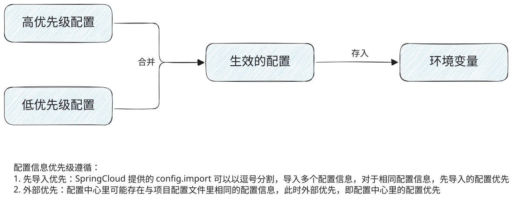

```properties
spring.application.name=service-order
server.port=8000

spring.cloud.nacos.server-addr=127.0.0.1:8848

# 先导入的优先：service-order.properties > common.properties
spring.config.import=nacos:service-order.properties,nacos:common.properties
```


## 1.7 数据隔离

场景：

- 项目通常部署在多套环境上，比如 dev、test、prod。
- 每个微服务，同一种配置，在每套环境上的值可能不一样，eg：database.properties，common.properties
- 要求项目可以通过切换环境，加载本环境的配置。

如果要完成以上需求，其中的难点是如何：

- 区分多套环境
- 区分多种微服务
- 区分多种配置
- 按需加载配置

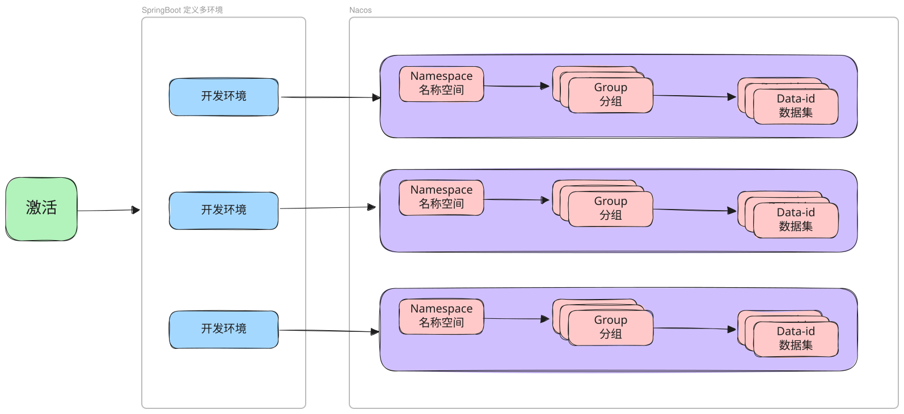

Nacos 的解决方案：

- 用NameSpace区分多套环境
- 用 Group 区分多种微服务
- 用 Data-id 区分多种配置
- 使用 SpringBoot 激活对应环境的配置


### 1.7.1 命名空间

访问：http://localhost:8848/nacos/，命名空间，新建命名空间

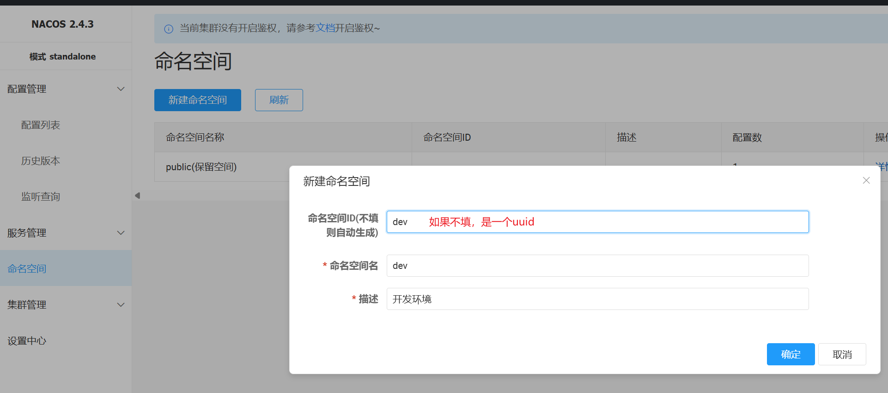

**使用NameSpace区分多套环境**

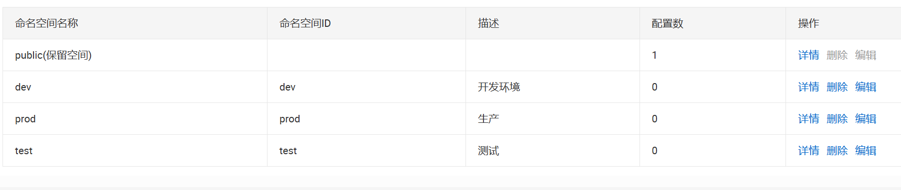

**使用group区分多种微服务**

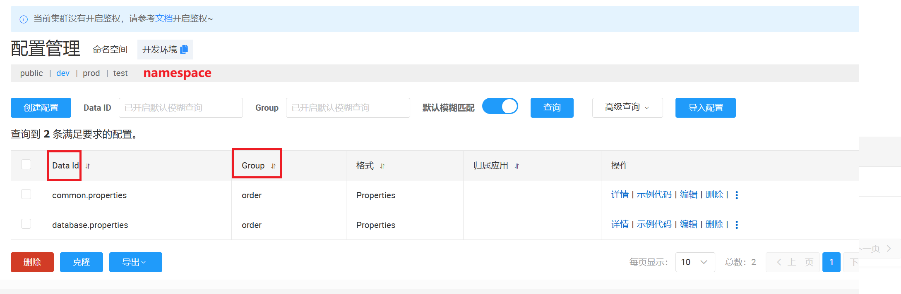

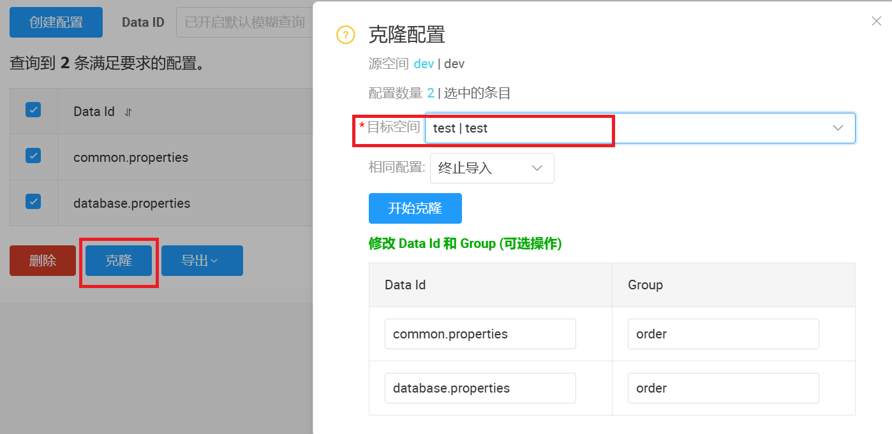

### 1.7.2 激活环境

```yaml
server:
  port: 8000
spring:
  profiles:
# 这里激活
    active: test
  application:
    name: service-order
  cloud:
    nacos:
      server-addr: 127.0.0.1:8848
      config:
        import-check:
          enabled: false
        namespace: ${spring.profiles.active:public}

---
spring:
  config:
    import:
      - nacos:common.properties?group=order
      - nacos:database.properties?group=order
    activate:
      on-profile: dev

---
spring:
  config:
    import:
      - nacos:common.properties?group=order
      - nacos:database.properties?group=order
    activate:
      on-profile: test


---
spring:
  config:
    import:
      - nacos:common.properties?group=order
      - nacos:database.properties?group=order
    activate:
      on-profile: prod


```


# 2 [OpenFeign](https://docs.spring.io/spring-cloud-openfeign/reference/spring-cloud-openfeign.html)

实现远程调用的组件。

OpenFeign，是一种 Declarative REST Client，即声明式 Rest 客户端，与之对应的是编程式 Rest 客户端，比如 RestTemplate。

OpenFeign 由注解驱动：

- 指定远程地址：`@FeignClient`
- 指定请求方式：`@GetMapping`、`@PostMapping`、`@DeleteMapping`...
- 指定携带数据：`@RequestHeader`、`@RequestParam`、`@RequestBody`...
- 指定返回结果：响应模式

`指定请求方式，指定携带数据` 的注解沿用 SpringMVC的注解

- 当它们标记在 Controller 上时，用于接收请求
- 当他们标记在 FeignClien 上时，用于发送请求

## 2.1 简单使用

1. 使用时引入以下依赖：

   ```xml
   <dependency>
       <groupId>org.springframework.cloud</groupId>
       <artifactId>spring-cloud-starter-openfeign</artifactId>
   </dependency>
   ```

2. 在主启动类上使用：`@EnableFeignClients`

3. 场景

   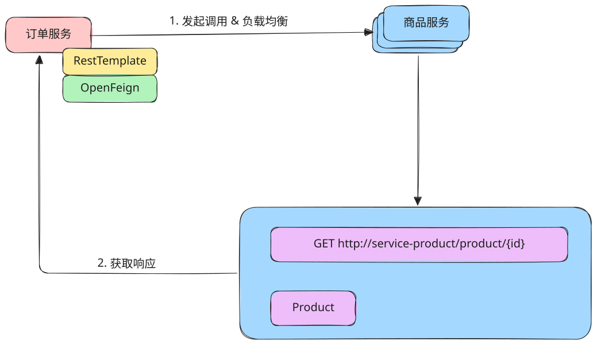

   4. 在`com/yanfang/order/feign/ProductFeignClient.java`中
      ```java
      package com.yanfang.order.feign;
      
      import com.yanfang.product.bean.Product;
      import org.springframework.cloud.openfeign.FeignClient;
      import org.springframework.web.bind.annotation.GetMapping;
      import org.springframework.web.bind.annotation.PathVariable;
      
      @FeignClient(value="service-product")
      public interface ProductFeignClient {
      	// 自带负载均衡，客户端负载均衡
          @GetMapping("/product/{id}")
          Product getProductById(@PathVariable("id") Long id);
      }
      
      ```

   5. 在OrderServiceImpl.java中调用
      ```java
      package com.yanfang.order.service.impl;
      
      import com.yanfang.order.bean.Order;
      import com.yanfang.order.feign.ProductFeignClient;
      import com.yanfang.order.service.OrderService;
      import com.yanfang.product.bean.Product;
      import lombok.extern.slf4j.Slf4j;
      import org.springframework.beans.factory.annotation.Autowired;
      import org.springframework.cloud.client.ServiceInstance;
      import org.springframework.cloud.client.discovery.DiscoveryClient;
      import org.springframework.cloud.client.loadbalancer.LoadBalancerClient;
      import org.springframework.stereotype.Service;
      import org.springframework.web.client.RestTemplate;
      
      
      import java.math.BigDecimal;
      import java.util.Arrays;
      import java.util.List;
      @Slf4j
      @Service
      public class OrderServiceImpl implements OrderService {
          
      	@Autowired
          ProductFeignClient productFeignClient;
      
          @Override
          public Order createOrder(Long productId,Long userId){
              Order order = new Order();
              // 发起时自动负载均衡
              Product product = productFeignClient.getProductById(productId);
              order.setId(1L);
      
              order.setTotalAmount(product.getPrice().multiply(new BigDecimal(product.getNum())));
              order.setUserId(userId);
              order.setNickName("qin");
              order.setAddress("yanfang");
              order.setProductList(Arrays.asList(product));
              return order;
          }
      }
      ```


### 小技巧

如何编写好 OpenFeign 声明式的远程调用接口：

- 针对业务（自己）的 API：直接复制服务提供方的 Controller 签名即可；
- 第三方 API：根据接口文档确定请求如何发

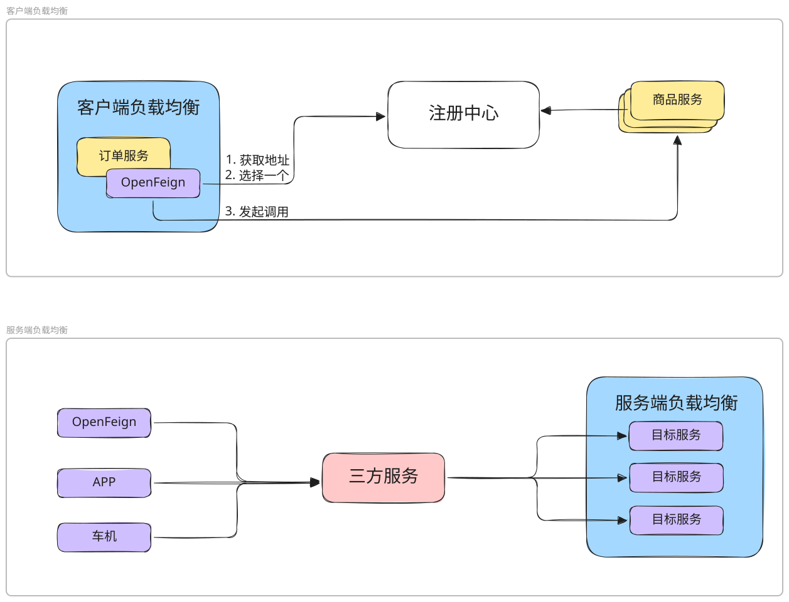

## 2.2 请求日志

1. 在application.yml中设置日志级别

   ```yml
   logging:
     level:
   #    设置这个包下的日志级别，也可以精确到某个类
       com.yanfang.order.feign: debug
   ```

2. 在configuration(`src/main/java/com/yanfang/order/config/OrderServiceConfig.java`)中配置bean

   ```java
   package com.yanfang.order.config;
   
   // 这里的Logger时feign的，不是java自带的logging
   import feign.Logger;
   
   import org.springframework.context.annotation.Configuration;
   
   @Configuration
   public class OrderServiceConfig {
       @Bean
       public Logger.Level feignlogLevel() {
           // 指定 OpenFeign 发请求时，日志级别为 FULL
           return Logger.Level.FULL;
       }
   }
   ```

## 2.3 超时控制

连接超时（connectTimeout），默认 10 秒。

读取超时（readTimeout），默认 60 秒。

1. 在resources中新增一个application-opfeign.yml

   ```yml
   spring:
     cloud:
       openfeign:
         client:
           # 可以通过CTRL + CLICK config查看源码
           config:
             default:
               logger-level: full
               connect-timeout: 1000
               read-timeout: 2000
             # 具体 feign 客户端的超时配置
             # 这里写openfeign客户端的名字contextId，如果没有contextId，那么value值就是客户端的名字。@FeignClient(value="service-product", contextId="product-feigncli")
             service-product:
               logger-level: full
               # 连接超时，3000 毫秒
               connect-timeout: 3000
               # 读取超时，5000 毫秒
               read-timeout: 5000
   ```

2. 在主application.yml中，添加一个include，包含这个子yml

   ```yml
   server:
     port: 8000
   spring:
     profiles:
       active: test
       include: opfeign
   ```

## 2.4 重试机制

OpenFeign 底层默认使用 `NEVER_RETRY`，即从不重试策略。

在configration中添加一个Retry类型的bean

```java
package com.yanfang.order.config;
import feign.Retryer;
import org.springframework.context.annotation.Bean;
import org.springframework.context.annotation.Configuration;

@Configuration
public class OrderServiceConfig {

    @Bean
    public Retryer retryer() {
        return new Retryer.Default();
    }
}
```

这里使用 OpenFeign 的默认实现 `Retryer.Default`，在这种默认实现下：

```java
public Default() {
    this(100L, TimeUnit.SECONDS.toMillis(1L), 5);
}
```

OpenFeign 的重试规则是：

- 重试间隔 100ms
- 最大重试间隔 1s。新一次重试间隔是上一次重试间隔的 1.5 倍，但不能超过最大重试间隔。
- 最多重试 5 次


## 2.5 拦截器

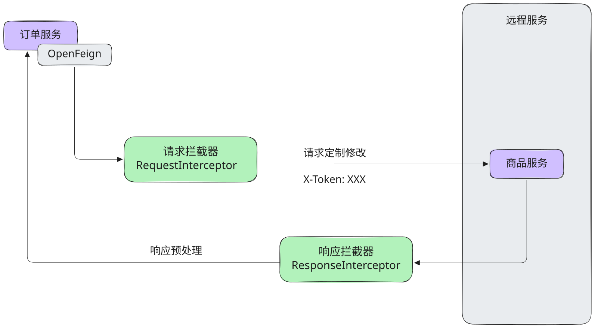

1. 定义拦截器：`src/main/java/com/yanfang/order/interceptor/XTokenRequestInterceptor.java`

   ```java
   package com.yanfang.order.interceptor;
   
   import feign.RequestInterceptor;
   import feign.RequestTemplate;
   
   import java.util.UUID;
   
   public class XTokenRequestInterceptor implements RequestInterceptor {
   
       @Override
       public void apply(RequestTemplate template){
           // template 封装本次请求的详细信息，可以获取到本次请求的params，body，header等
   
           // 本步骤是往header里面加一个X-Token
           template.header("X-Token", UUID.randomUUID().toString());
       }
   }
   
   ```

2. 想要该拦截器生效有两种方法

   - 在配置文件中配置对应 Feign 客户端的请求拦截器，此时该拦截器只对指定的 Feign 客户端生效

     ```yml
     spring:
       cloud:
         openfeign:
           client:
             config:
               # 具体 feign 客户端
               service-product:
                 # 该请求拦截器仅对当前客户端有效
                 request-interceptors:
                   - com.yanfang.order.interceptor.XTokenRequestInterceptor
     ```

   - 也可以为这个拦截器添加`@Component`注解，openfeign会在容器中找，只要有拦截器的bean，那么它就会自动给请求应用上。

     ```java
     @Component
     public class XTokenRequestInterceptor implements RequestInterceptor {
         // --snip--
     }
     ```

3. 验证请求的header中是否包含X-Token

   ```java
   package com.yanfang.product.controller;
   
   import com.yanfang.product.bean.Product;
   import com.yanfang.product.services.ProductService;
   import jakarta.servlet.http.HttpServletRequest;
   import org.springframework.beans.factory.annotation.Autowired;
   import org.springframework.web.bind.annotation.GetMapping;
   import org.springframework.web.bind.annotation.PathVariable;
   import org.springframework.web.bind.annotation.RestController;
   
   @RestController
   public class ProductController {
   
       @Autowired
       ProductService productService;
   
       @GetMapping("/product/{id}")
       public Product getProduct(@PathVariable("id") Long productId, HttpServletRequest request){
           String requestURL = request.getRequestURL().toString();
           System.out.println("请求完整地址："+requestURL);
           System.out.println("X-token："+request.getHeader("X-Token"));
           Product product = productService.getProductById(productId);
           return product;
       }
   }
   
   ```


## 2.6 fallback

兜底返回，此功能需要整合Sentinel才能实现

当远程调用超时的时候，返回一个符合格式的业务数据，只是说这个业务数据比较特殊。像商品库存数，可以返回库存数为0

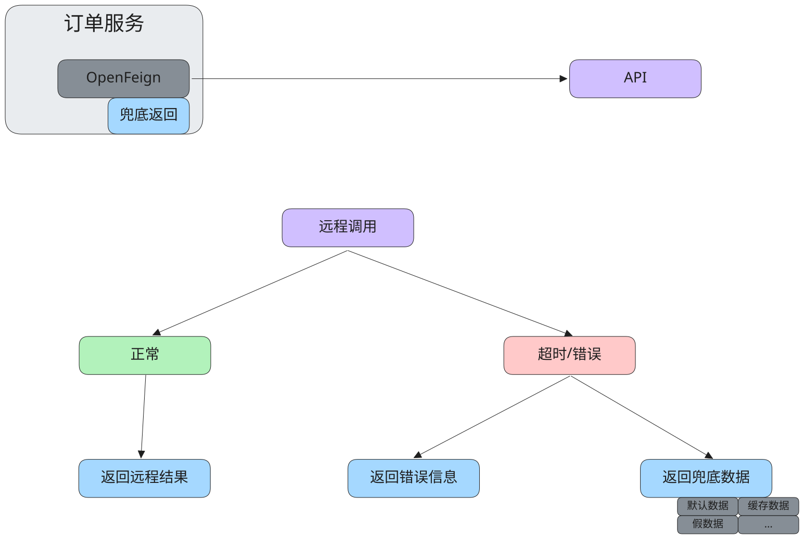

1. 导入sentinel依赖

   ```xml
   <dependency>
       <groupId>com.alibaba.cloud</groupId>
       <artifactId>spring-cloud-starter-alibaba-sentinel</artifactId>
   </dependency>
   ```

2. 在`src/main/resources/application-opfeign.yml`中打开兜底开关

   ```yaml
   feign:
     sentinel:
       enabled: true
   ```

   

3. 定义兜底类：`src/main/java/com/yanfang/order/feign/fallback/ProductFeignClientFallback.java`

   ```java
   package com.yanfang.order.feign.fallback;
   
   import com.yanfang.order.feign.ProductFeignClient;
   import com.yanfang.product.bean.Product;
   import org.springframework.stereotype.Component;
   
   import java.math.BigDecimal;
   
   // 加入到容器中
   @Component
   public class ProductFeignClientFallback implements ProductFeignClient {
       @Override
       public Product getProductById(Long id) {
           System.out.println("Fallback...");
           Product product = new Product();
           product.setId(id);
           product.setPrice(new BigDecimal("0"));
           product.setProductName("未知商品");
           product.setNum(0);
           return product;
       }
   }
   
   ```

4. 在client `@FeignClient`中，注入fallback：

   ```java
   package com.yanfang.order.feign;
   
   import com.yanfang.order.feign.fallback.ProductFeignClientFallback;
   import com.yanfang.product.bean.Product;
   import org.springframework.cloud.openfeign.FeignClient;
   import org.springframework.web.bind.annotation.GetMapping;
   import org.springframework.web.bind.annotation.PathVariable;
   
   
   @FeignClient(value="service-product", fallback = ProductFeignClientFallback.class)
   public interface ProductFeignClient {
   
       @GetMapping("/product/{id}")
       Product getProductById(@PathVariable("id") Long id);
   }
   
   ```

5. 测试：访问`http://localhost:8000/create?userId=15&productId=100`

   ```json
   {
     "id": 1,
     "totalAmount": 0,
     "userId": 15,
     "nickName": "qin",
     "address": "yanfang",
     "productList": [
       {
         "id": 100,
         "price": 0,
         "productName": "未知商品",
         "num": 0
       }	
     ]
   }
   ```

   

# 3 [Sentinel](https://sentinelguard.io/zh-cn/docs/introduction.html)

[github](https://github.com/alibaba/Sentinel)

## 3.1 工作原理

随着微服务的流行，服务和服务之间的稳定性变得越来越重要。Spring Cloud Alibaba Sentinel 以流量为切入点，从流量控制、流量路由、熔断降级、系统自适应过载保护、热点流量防护等多个维度保护服务的稳定性。

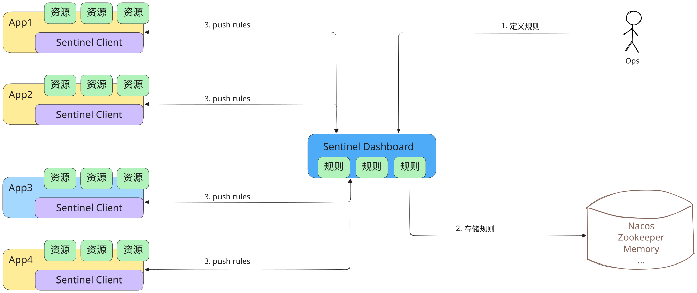

在Sentinel中，有两个重要的概念：资源和规则，资源是需要规则保护的。

定义规则：

- 主流框架自动适配（Web Servlet、Dubbo、Spring Cloud、gRPC、Spring WebFlux、Reactor），**所有 Web 接口均为资源**
- 编程式：SphU API
- 声明式：`@SentinelResource`

定义资源：

- 流量控制（FlowRule）
- 熔断降级（DegradeRule）
- 系统保护（SystemRule）
- 来源访问控制（AuthorityRule）
- 热点参数（ParamFlowRule）

工作流程原理图：

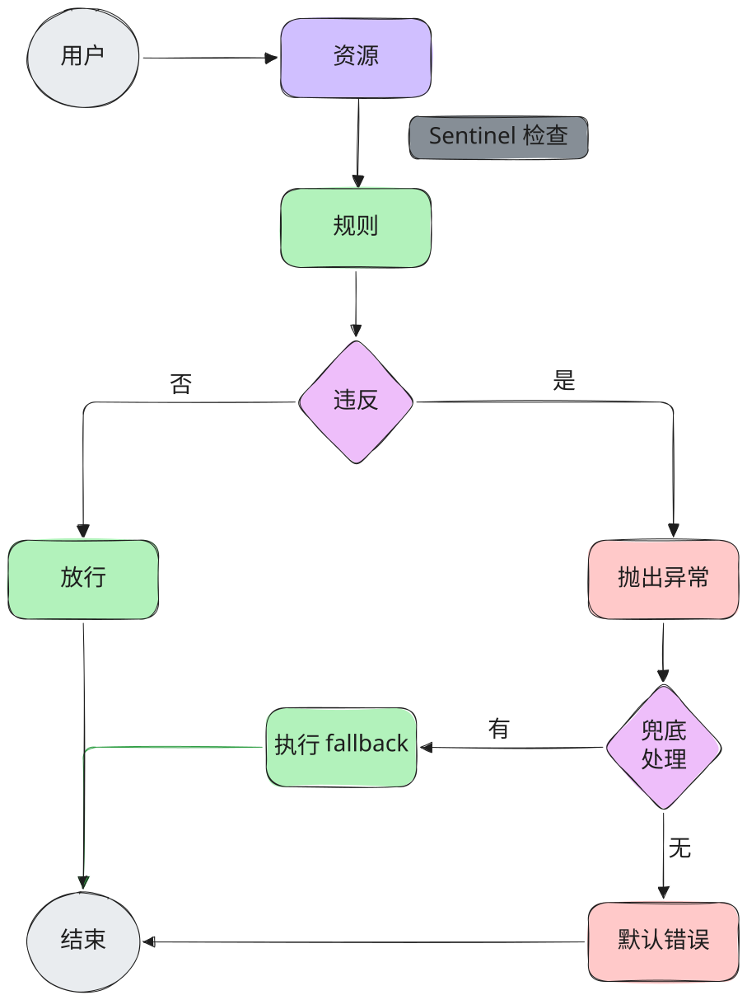

## 3.2 整合使用

[sentinel dashboard 下载](https://github.com/alibaba/Sentinel/releases)

1. 启动sentinel dashboard

   ```bash
   java -jar sentinel-dashboard-1.8.8.jar
   # 访问http://localhost:8080/
   # 用户名和密码都是sentinel
   ```

2. 在services中引入依赖

   ```xml
   <dependency>
       <groupId>com.alibaba.cloud</groupId>
       <artifactId>spring-cloud-starter-alibaba-sentinel</artifactId>
   </dependency>
   ```

3. 每一个微服务都要连上微服务控制台，

   - 下面仅展示service-product：`cloud-demo1\services\service-product\src\main\resources\application.yml`的配置

   ```yaml
   server:
     port: 9000
   spring:
     application:
       name: service-product
     cloud:
       nacos:
         server-addr: 127.0.0.1:8848
         config:
           import-check:
             enabled: false
       sentinel:
         transport:
           # 控制台地址
           dashboard: localhost:8080
         # 让项目一启动，就连上sentinel控制台
         eager: true
   ```

   

4. 加`@SentinelResource`

   ```java
   package com.yanfang.order.service.impl;
   
   import com.alibaba.csp.sentinel.annotation.SentinelResource;
   import com.yanfang.order.bean.Order;
   import com.yanfang.order.feign.ProductFeignClient;
   import com.yanfang.order.service.OrderService;
   import com.yanfang.product.bean.Product;
   
   import org.springframework.beans.factory.annotation.Autowired;
   
   import org.springframework.stereotype.Service;
   
   
   import java.math.BigDecimal;
   import java.util.Arrays;
   import java.util.List;
   
   @Service
   public class OrderServiceImpl implements OrderService {
   
   
       @Autowired
       ProductFeignClient productFeignClient;
   
       @SentinelResource(value="createOrder")
       @Override
       public Order createOrder(Long productId,Long userId){
           Order order = new Order();
           Product product = productFeignClient.getProductById(productId);
           order.setId(1L);
   
           order.setTotalAmount(product.getPrice().multiply(new BigDecimal(product.getNum())));
           order.setUserId(userId);
           order.setNickName("qin");
           order.setAddress("yanfang");
           order.setProductList(Arrays.asList(product));
           return order;
       }
   
       
   }
   
   ```

5. 运行后，可以在dashboard上看见

   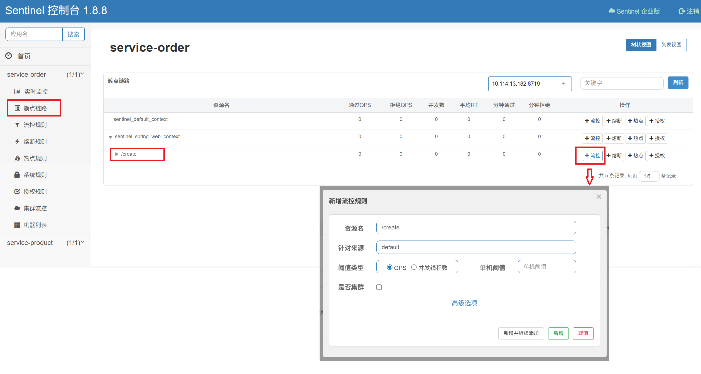

簇点链路只有当资源被请求过后，才会显示。

而且在这里添加的流控，只在service-order运行的当次生效，在微服务重启后，就会失效，必须再次手动添加


## 3.3 异常处理

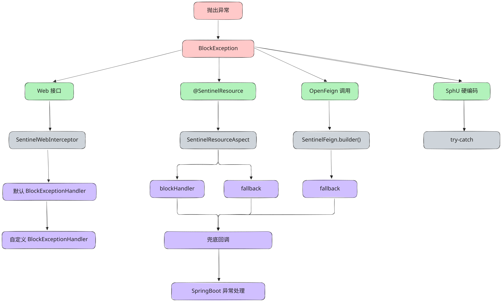


### `SentinelWebInterceptor`

1. 自定义`BlockExceptionHandler`：它在限流的时候会被触发

   - `cloud-demo1\services\service-order\src\main\java\com\yanfang\order\exception\MyBlockExceptionHandler.java`

   ```java
   package com.yanfang.order.exception;
   
   import com.alibaba.csp.sentinel.adapter.spring.webmvc_v6x.callback.BlockExceptionHandler;
   import com.alibaba.csp.sentinel.slots.block.BlockException;
   import com.fasterxml.jackson.databind.ObjectMapper;
   import com.yanfang.common.R;
   import jakarta.servlet.http.HttpServletRequest;
   import jakarta.servlet.http.HttpServletResponse;
   import org.springframework.beans.factory.annotation.Autowired;
   import org.springframework.stereotype.Component;
   
   import java.io.PrintWriter;
   
   @Component
   public class MyBlockExceptionHandler implements BlockExceptionHandler {
   
       @Autowired
       private ObjectMapper objectMapper;
   
       @Override
       public void handle(HttpServletRequest request,
                          HttpServletResponse response,
                          String resourceName, BlockException e)throws Exception{
           response.setContentType("application/json;charset=utf-8");
           PrintWriter writer = response.getWriter();
           R error = R.error(500, resourceName + " 被 Sentinel 限制了, 原因: " + e.getClass());
   
           String json = objectMapper.writeValueAsString(error);
           writer.write(json);
           writer.flush();
           writer.close();
       }
   
   }
   
   ```

2. 定义公共的请求返回对象：`cloud-demo1\model\src\main\java\com\yanfang\common\R.java`

   ```java
   package com.yanfang.common;
   
   import lombok.Data;
   
   @Data
   public class R {
       private Integer code;
       private String msg;
       private Object data;
   
       public static R ok(){
           R r = new R();
           r.setCode(200);
           return r;
       }
       public static R ok(String msg, Object data){
           R r = new R();
           r.setCode(200);
           r.setMsg(msg);
           r.setData(data);
           return r;
       }
   
       public static R error(){
           R r = new R();
           r.setCode(500);
           return r;
       }
       public static R error(Integer code, String msg){
           R r = new R();
           r.setCode(code);
           r.setMsg(msg);
           return r;
       }
   }
   
   ```

   

3. 添加流控：

   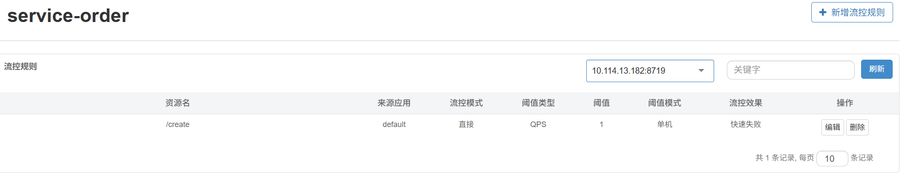

4. 测试：访问`http://localhost:8000/create?userId=15&productId=100`

   频繁请求返回：

   ```json
   {
     "code": 500,
     "msg": "/create 被 Sentinel 限制了, 原因: class com.alibaba.csp.sentinel.slots.block.flow.FlowException",
     "data": null
   }
   ```

   