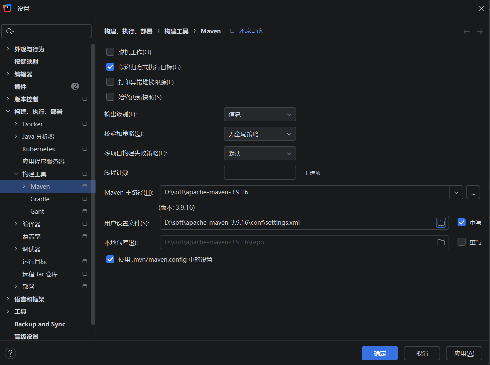

# Maven

# 0 初识

## 0.1 jdk

Maven 本身是**用 Java 编写的工具**，运行时需要依赖 JDK 环境。

**JDK 17+**：建议 **Maven 3.9.x 或 4.0.x**

## 0.2 [安装maven](https://blog.csdn.net/weixin_44861887/article/details/145231939)

[下载](https://maven.apache.org/download.cgi#CurrentMaven)

[apache-maven-3.9.16-bin.zip](https://dlcdn.apache.org/maven/maven-3/3.9.16/binaries/apache-maven-3.9.16-bin.zip)

解压到合适位置

### 修改settings.xml

#### 修改包下载位置

```xml
<localRepository>D:\soft\apache-maven-3.9.16\repo</localRepository>
```

#### [配置maven镜像](https://blog.csdn.net/i826056899/article/details/145702749)

```xml
<mirror>
    <id>aliyun-maven</id>
    <mirrorOf>central</mirrorOf>
    <url>https://maven.aliyun.com/repository/public</url>
    <blocked>false</blocked>
</mirror>
```

- **`id`**：在settings.xml 的mirrors标签中的唯一标识，可以任意取名，但要和其他mirror做区分
- **`mirrorOf`**：该镜像源对应的仓库，这里配置为`central`，表示它是用于替代Maven中央仓库。
- **`url`**：阿里云Maven仓库的地址。
- **`blocked`**：如果设置为`false`，表示启用该镜像源。

### 设置环境变量

MAVEN_HOME：`D:\soft\apache-maven-3.9.16`

Path加：`%MAVEN_HOME%\bin`

### idea配置maven



# 常用包

```xml
<!--
Lombok 是一个Java 注解处理器，核心作用是：通过注解自动生成 Java 类的样板代码，简化开发、减少冗余代码，让 Spring Boot 项目的代码更简洁、易维护。
@Data等注解
-->
<dependency>
    <groupId>org.projectlombok</groupId>
    <artifactId>lombok</artifactId>
    <scope>annotationProcessor</scope>
</dependency>
```

# 常用插件

1. GenerateAllSetter，在一个类后面`Alt + Enter`生成类的所有Setter