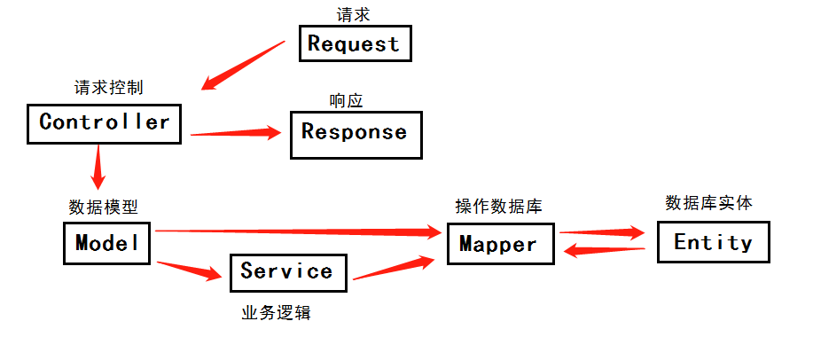

# SpringBoot

# 1 环境搭建

## 1.1 安装和配置

1. jdk1.8 
   - 安装，配置环境变量，java -version
2. maven
   - 安装，配置环境变量，校验是否安装完成mvn -v
   - 配置国内仓库
3. idea
   - 配置maven环境`file->setting，搜索maven，`
     - `maven home directory（安装地址），`
     - `user settings file（自定义的maven配置文件，里面配置有国内镜像仓库的配置）`
     - `local repository(存放通过maven管理的依赖包，的目录地址)`

## 1.2 helloworld

1. 创建项目：`new Project->maven(next)->填写项目的具体信息（name，groupId，ArtifactId，Version，项目存放位置location，Finish）`

2. 项目依赖：

   ```xml
   <?xml version="1.0" encoding="UTF-8"?>
   <project xmlns="http://maven.apache.org/POM/4.0.0"
            xmlns:xsi="http://www.w3.org/2001/XMLSchema-instance"
            xsi:schemaLocation="http://maven.apache.org/POM/4.0.0 http://maven.apache.org/xsd/maven-4.0.0.xsd">
       <modelVersion>4.0.0</modelVersion>
   
       <groupId>com.sifangtech</groupId>
       <artifactId>helloworld01</artifactId>
       <version>1.0.0</version>
   
       <parent>
           <groupId>org.springframework.boot</groupId>
           <artifactId>spring-boot-starter-parent</artifactId>
           <version>2.3.4.RELEASE</version>
       </parent>
       <properties>
           <maven.compiler.source>8</maven.compiler.source>
           <maven.compiler.target>8</maven.compiler.target>
       </properties>
       <dependencies>
           <dependency>
               <groupId>org.springframework.boot</groupId>
               <artifactId>spring-boot-starter-web</artifactId>
           </dependency>
       </dependencies>
   <!--打jar包要用的插件-->
       <build>
           <plugins>
               <plugin>
                   <groupId>org.springframework.boot</groupId>
                   <artifactId>spring-boot-maven-plugin</artifactId>
               </plugin>
           </plugins>
       </build>
   </project>
   ```

   

3. 编写应用：

   - main.java.com.sifangtech.boot.mainApplication.java

   - ```java
     package com.sifangtech.boot;
     
     import org.springframework.boot.SpringApplication;
     import org.springframework.boot.autoconfigure.SpringBootApplication;
     
     /**
      * 注解告诉springboot这是一个springboot应用
      * */
     @SpringBootApplication
     public class mainApplication {
         public static void main(String[] args) {
             SpringApplication.run(mainApplication.class,args);
         }
     }
     ```

   - main.java.com.sifangtech.boot.controller.HelloController

   - ```java
     package com.sifangtech.boot.controller;
     
     import org.springframework.web.bind.annotation.RequestMapping;
     import org.springframework.web.bind.annotation.RestController;
     
     @RestController
     public class HelloController {
     
         @RequestMapping("/hello")
         public String sayHello() {
             return "hello, spring boot";
         }
     }
     
     ```

4. 应用配置文件

   - main.resources.application.properties

   - ```properties
     server.port=8082
     #具体相关配置可以参看：https://docs.spring.io/spring-boot/docs/2.2.5.RELEASE/reference/html/appendix-application-properties.html#server-properties
     ```

5. 运行：

   - 右击main.java.com.sifangtech.boot.mainApplication.java即可运行

6. 浏览器：`localhost:8082/hello`

7. 部署：

   - 在依赖文件中引入打包插件，打成jar，直接在目标服务器上，`java -jar`即可部署
   - 在cmd的命令行中，要取消掉快速编辑模式

8. 


## 1.坑

1. 项目的`pom.xml`中引入`dependency`时，无法引入，在idea中显示是红色。
   - 注意在idea中配置的maven环境可能因为新建工程项目后发生改变，好像可以在新建的项目中固定这个配置，但暂时不知道如何固定maven在idea中的配置。
   - 所以当无法引入某些依赖包时，需要去查看idea中关于maven的配置是否发生改变。
2. 无法引入插件，在idea中显示是红色，需要在右侧的maven工具栏点击刷新，这样可以重新导入依赖

# B 基础篇

## 2 springboot 基础

### 2.1 spirngboot项目框架结构

1. `src/main/java:`入口（启动）类及程序的开发目录。在这个目录下进行业务开发、创建实体层、控制器层、数据连接层（`Service、Entity、Controller、Mapper`）
   - `XxxApplication.java`：入口类，项目的启动入口
2. `src/main/resource`：资源文件目录，主要用于放静态文件和配置文件
   - `/static`：用于存放静态资源，css、js、img等
   - `/templates`：用于存放模板文件
   - `application.properties、application.yml`：用于配置项目运行所需的配置数据
3. `src/test/java`：放置测试程序
4. `target/`：项目打包文件
5. `pom.xml`：**Project Object Model 的缩写，即项目对象模型**，pom.xml 就是 maven 的配置文件，用以描述项目的各种信息。和依赖信息。[详情](https://zhuanlan.zhihu.com/p/76874769)

### 2.2 注解

注解用来定义一个类、属性或一些方法，以便程序能被编译处理。注解可以标注包、类、方法和变量等。

有系统注解、使用在类名上的注解、使用在方法上的注解、其他注解。注解众多，随着学习。

系统注解：`@Override、@Deprecated`

#### 2.2.1 常用在类名上的注解

| 注解            | 使用位置                     | 说明                                                         |
| --------------- | ---------------------------- | ------------------------------------------------------------ |
| @RestController | 类名上                       | = @ResponseBody + @Controller                                |
| @Controller     | 类名上                       | 声明此类为SpringMVC Controller对象                           |
| @Service        | 类名上                       | 声明一个业务处理类（实现非接口类）                           |
| @Repository     | 类名上                       | 声明数据库访问类                                             |
| @Component      | 类名上                       | 代表其是Spring管理类                                         |
| @Configuration  | 类名上                       | 声明此类是一个配置类                                         |
| @Resource       | 类名上、属性或构造函数参数上 | spring中按byName自动注入对象Bean                             |
| @AutoWired      | 类名上、属性或构造函数参数上 | spring中按byType自动注入对象Bean                             |
| @RequestMapping | 类名或方法上                 | 如果用在类上，表示所有响应请求的方法都是以该地址作为父路径的 |
| @Transactional  | 类名或方法上                 | 用于处理事务                                                 |
| @Qualifier      | 类名或属性上                 | 为Bean指定名称，随后在通过名字引用Bean                       |

#### 2.2.2 使用在方法上的注解

| 注解          | 使用位置   | 说明                                                         |
| ------------- | ---------- | ------------------------------------------------------------ |
| @RequestBody  | 方法参数前 | 将前端的请求参数转化为指定类型的实例                         |
| @PathVariable | 方法参数前 | 获取url路径中的参数                                          |
| @Bean         | 方法上     | 声明该方法返回的结果是一个由Spring容器管理的Bean             |
| @ResponseBody | 方法上     | 将控制器中方法返回的对象转化为指定格式（JSON/XML），写入Response对象的body数据区，给前端 |

#### 2.2.3 其他注解

| 注解                     | 使用位置      | 说明                                                         |
| ------------------------ | ------------- | ------------------------------------------------------------ |
| @EnableAutoConfiguration | 入口类/类名上 | 提供自动配置                                                 |
| @SpringBootApplication   | 入口类/类名上 | 用来启动入口类Application                                    |
| @Aspec                   | 入口类/类名上 | 标注切面。可以用来配置事务，日志、权限校验，在用户请求时做一些处理 |
| @EnableScheduling        | 入口类/类名上 | 用来开启计划任务，Spring通过@Scheduled支持多种类型的计划任务 |
| @ComponentScan           | 入口类/类名上 | 用来扫描组件，可自动发现和装配一些bean                       |
| @ControllerAdvice        | 类名上        | 包含@Component，可以被扫描到，统一处理异常                   |
| @ExpectionHandler        | 方法上        | 表示遇到这个异常就执行该方法                                 |
| @Value                   | 属性上        | 用于获取配置文件中的值                                       |
|                          |               |                                                              |

### 2.3 配置文件

SpringBoot支持使用Properties和Yaml两种格式文件的配置方式。但Properties的优先级高于Yaml格式文件。

| 注解                                   | 使用位置 | 说明                                                         |
| -------------------------------------- | -------- | ------------------------------------------------------------ |
| @SpringBootTest                        | 类       | 用于测试的注解，可指定入口类或测试环境等                     |
| @RunWith( SpringRunner.class )         | 类       | 在Spring测试环境中进行测试                                   |
| @Test                                  | 方法     | 表示一个测试方法                                             |
| @Value                                 | 属性上   | 用于获取配置文件中的值                                       |
| @ConfigurationProperties( prefix = "") | 类       | 把同前缀的配置信息自动封装为一个实体类                       |
| @Data                                  | 类       | 自动生成Setter、Getter、toString、equals、hashCode方法和无参构造器 |

#### 配置多环境

yml配置文件：

- 主配置文件application.yml、

- 开发环境application-dev.yml、

- 生产环境application-prod.yml

- ```yml
  #生产环境，application-prod.yml
  server:
  	port: 8080
  	servlet:
  		session:
  			timeout: 30
  	tomcat: 
  		uri-encoding:UTF-8
  myenvironment:
  	name: 生产环境
  
  #开发环境，application-dev.yml
  server:
  	port: 8080
  	servlet:
  		session:
  			timeout: 30
  	tomcat: 
  		uri-encoding:UTF-8
  myenvironment:
  	name: 开发环境
  
  #主配置文件，application.yml
  spring:
  	profiles:
  		active: dev #指定使用哪一个环境的配置文件
  ```

properties配置文件：

- 主配置文件application.properties、
- 开发环境application-dev.properties、
- 生产环境application-prod.properties
- 和yml同样

### 2.4 starter

springBoot为了简化配置，提供了非常多的Starter。在对应的`pom.xml`中配置即可。

常用starter

| starter                        | 说明 |
| ------------------------------ | ---- |
| spring-boot-starter-web        |      |
| spring-boot-starter-validation |      |
| spring-boot-starter-security   |      |
| spring-boot-starter-websocket  |      |
| spring-boot-starter-data-redis |      |
| spring-boot-starter-jdbc       |      |
| spring-boot-starter-mail       |      |
|                                |      |
|                                |      |
|                                |      |
|                                |      |
|                                |      |
|                                |      |
|                                |      |
|                                |      |

## 3 分层开发web应用

`SpringMVC(Model-View-Controller)`，

- Model：是java的实体Bean，
- View：主要用来解析、处理、显示渲染内容
- Controller：处理视图中的响应，决定如何调用Model的实体bean、如何调用Service层



在springMVC中，Controller负责处理有DispatcherServlet接收并分发过来的请求，它把用户请求的数据通过业务处理层封装成一个Model，然后再把该Model返回给对应的View展示

### 3.1 控制器

#### 3.1.1 常用注解

| 注解            | 使用位置 | 说明                                                         |
| --------------- | -------- | ------------------------------------------------------------ |
| @Controller     | 类       | 表示是一个Controller对象，servlet分发处理器将会扫描使用该注解的类，并检测其中的方法是否使用了@RequestMapping方法，由它真正处理请求。 |
| @RestController | 类       | = @Controller + @ResponseBody                                |
| @RequestMapping | 类or方法 | 用来处理请求地址映射的注解，可以用在类上或方法上，如果用在类上则表示所有响应请求的方法都以该地址作为父路径。 |
| @PathVariable   | 参数     | 将请求URL中的模板变量映射到功能处理方法的参数上，            |

1. RequestMapping有6个属性
   - value：指定请求的地址
   - method：指定处理请求的方法
     - http请求的方法：GET，POST，PUT，DELETE，PATCH，OPTIONS，TRACE
   - consumer：消费消息，指定处理请求的提交内容类型（Content-Type），例如：application/json
     - HTTP中媒体的类型Content-Type，
     - 常见媒体格式：
       - text/xml：XML格式，还有html等
       - text/plain：纯文本
       - image/png：png图片格式，jpg，gig等
     - 以application开头的媒体格式
       - application/json
       - application/xhtml+xml
       - application/pdf，application/msword（word文档格式）
       - application/octet-stream：二进制流数据（常用于文件下载）
       - multipart/form-data：如果在表单中进行文件上传，则需要使用该格式
       - application/x-www-form-urlencoded，表单数据编码方式，`<form encType=" " >`中默认的encType，Form(表单)被默认编码为key/value格式给服务器
   - produces：生产消息，指定返回的内容类型。仅当request请求头中的Accept类型中包含该指定类型时才返回。
   - params：指定request中必须包含某些参数值才让该方法处理请求
   - headers：指定request中必须包含某些指定的header值才让该方法处理请求
2. 常用restful风格请求映射的注解
   - @GetMapping：处理GET请求，相当于`@RequestMapping(value = "", method = RequestMethod.GET )`
   - @PostMapping
   - @DeleteMapping
   - @PutMapping
3. 

#### 3.1.2 在方法中使用参数

```java
@GetMapping("/article/{id}")
public String getArticleContent(@PathVariable("id") Integer id){
    //获取http://localhost:8080/article/10021中，10021
}
@RequestMapping("/addUser")
public String addUser(String username){
    //获取http://localhost:8080/user/addUser?username=qqq中，username变量的值qqq
}
@RequestMapping("/addUser")
public String addUser(UserModel user){
    //直接通过model将获得的数据映射为model对象
}
@RequestMapping( value = "/addUser", method=RequestMethod.POST)
public String addUser(@ModelAttribute("user") UserModel user){
    //用于从Model、Form或Url请求参数中获取对应属性的对应值
}
@RequestMapping("/addUser")
public String addUser(HttpServletRequest request){
    System.out.println("name:" + request.GETParameter("username"));
    //通过HttpServletRequest接收参数
}
@RequestMapping("/addUser")
public String addUser(@RequestParam(value="username",required=false) String name){
    //通过注解RequestParam绑定参数，
    //一个请求，只有一个RequestBody；一个请求，可以有多个RequestParam。
}
@RequestMapping("/addUser",method=RequestMethod.POST)
@ResponseBody
public String saveUser(@RequestBody List<UserModel> users){
    //   @RequestBody主要用来接收前端传递给后端的json字符串中的数据的(请求体中的数据)
}
//还有获取图片，获取文件等映射，这里不再叙述，后面有具体需要了再看

```

### 3.2 模型

模型Model在MVC模式中是实体Bean。

其作用暂时存储数据于内存中，以便进行持久化，以及在数据变化时更新控制器。

简单来说，Model是数据库表对应的实体类。

#### 3.2.1 验证数据

Hibernate-validator可实现数据的验证，它是对JSR标准的实现。

在web开发中，不需要额外为验证在导入此依赖，web依赖已集成了Hibernate-validator。

web依赖集成了如下一些依赖

- spring-boot-starter
- spring-boot-starter-json
- spring-boot-starter-tomcat
- hibernate-validator
- spring-web
- spring-webmvc

validator验证的常用注解

| 注解                       | 作用类型           | 说明                                          |
| -------------------------- | ------------------ | --------------------------------------------- |
| @NotBlank( message=  )     | 字符串             | 非null，且length>0                            |
| @Email                     | 字符串             | 被注解的元素必须符合电子邮箱的格式            |
| @Length(min= ,max= )       | 字符串             | 字符串长度控制                                |
| @NotEmpty                  | 字符串             | 字符串必须非空                                |
| @NotEmptyPattern           | 字符串             | 非空并且匹配正则表达式                        |
| @DateValidator             | 字符串             | 验证日期格式是否满足正则表达式，local为英语   |
| @DateFormatCheckPattern    | 字符串             | 验证日期格式是否满足正则表达式，local自行指定 |
| @CreditCardNumber          | 字符串             | 验证信用卡号码                                |
| @Range(min=,max=,message=) | 字符串，数值，字节 | 验证范围                                      |
| @Null                      | 任意               | 必须为null                                    |
| @NotNull                   | 任意               | 不为null                                      |
| @AssertTrue                | 布尔值             | 必须为True                                    |
| @AssertFalse               | 布尔值             | 为false                                       |
| @Min(value)                | 数字               | 为数字，并且不小于                            |
| @Max(value)                | 数字               | 为数字，并且不大于                            |
| @DecimalMin(value)         | 数字               | 为数字，并且不小于                            |
| @DecimalMax(value)         | 数字               | 为数字，并且不大于                            |
| @Size(max=,min=)           | 数字               | 为数字，在指定范围                            |
| @Digits(integer,fraction)  | 数字               |                                               |
| @Past                      | 日期               | 过去的日期                                    |
| @Future                    | 日期               | 未来的日期                                    |
| @Pattern(regex=,flag=)     | 正则表达式         | 必须符合正则表达式                            |
| @LastStringPattern         | `List<String>`     | 验证集合中字串是否符合正则表达式              |

##### 自定义验证

自定义验证需要提供两个类：

1. 自定义注解类
2. 自定义验证业务逻辑实现类

```java
//1.自定义验证注解类
import com.example.MyCustomConstraintValidator;
import javax.validation.Constraint;
import javax.validation.Payload;
import java.lang.annotation.ElementType;
import java.lang.annotation.Retention;
import java.lang.annotation.RetentionPolicy;
import java.lang.annotation.Target;

//限定使用范围
@Target({ElementType.FIELD})
//表明注解的生命周期，它在代码运行时可以通过反射获取到注解
@Retention(RetentionPlicy.RUNTIME)
//@Contraint注解，里面传入了一个validatedBy字段，以指定该注解的校验逻辑
@Contraint(validatedBy = MyCustomConstraintValidator.class)//自定义验证业务逻辑实现类
public @interface MyCustomConstraint{
	String message() default "请输入中国政治或经济中心的城市名";
    Class<?>[] groups() default {};
    Class<? extends Payload>[] payload() default {};
        
}

//2.自定义验证业务逻辑实现类
import com.example.demo.MyCustomConstraint;
import javax.validation.ConstraintValidator;
import javax.validation.ConstraintValidatorContext;
public class MyCustomConstraintValidator implements ConstraintValidator<MyCustomConstraint, String>{//String为校验的类型
    @Override
    public void initialize(MyCustomConstraint myConstraint){
        //在启动时执行
    }
    //自定义校验逻辑
    @Override
    public boolean isValid(String s, ConstraintValidatorContext validatorContext){
        if(!(s.equals("北京")|| s.equals("上海"))){
            return false;
        }
        return true
    }
}
```

#### 3.2.2 创建实体

```java
import com.example.demo.MyCustomConstrant;
import lombok.Data;
import org.hibernate.validator.constraints.Length;
import javax.validation.constraints.*;
import java.io.Serializable;
@Data
public class User implements Serializable{
    private Long id;
    
    @NotBlank(message="用户名不能为空")
    @Length(min=5, max=20,message="用户名长度为5-20个字符")
    private String name;
    
    @NotNull(message="年龄不能为空")
    @Min(value=18,message="最小18岁")
    @Max(value=80,message="最大60岁")
    private Integer age;
    
    @Email(message="请输入邮箱")
    @NotBlank(message="邮箱不能为空")
    private String email;

    @MyCustomContraint
    private String answer;
}
```

#### 3.2.3 实现控制器

